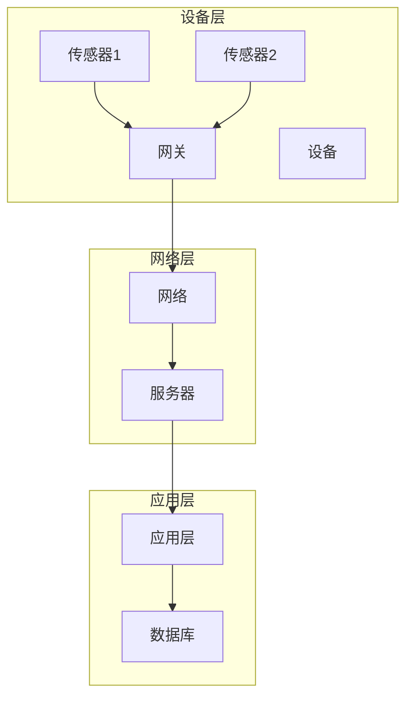

                 

# 物联网设备管理平台设计

> 关键词：物联网、设备管理平台、架构设计、算法原理、项目实战

> 摘要：本文将系统地探讨物联网设备管理平台的设计，从基本概念到架构设计，再到核心算法原理和数学模型，最后通过实际项目实战，详细解析物联网设备管理平台的设计与实现过程。

## 第一部分：物联网设备管理平台概述

### 第1章：物联网与设备管理平台的基本概念

#### 1.1 物联网的定义与发展

物联网（Internet of Things，IoT）是指将各种信息传感设备与网络相连接，实现物与物、物与人的智能交互和信息交换。物联网的发展历程可以追溯到20世纪80年代，随着互联网和移动通信技术的进步，物联网逐渐成为一种新型的信息生态系统。

物联网的核心概念包括传感器、网络、数据处理和智能应用。传感器是物联网的感知器官，可以采集各种物理量；网络是物联网的数据传输通道；数据处理是将采集到的数据进行分析、处理和存储；智能应用则是通过算法实现设备控制、状态监控和预测。

#### 1.2 设备管理平台的必要性

随着物联网的快速发展，设备管理逐渐成为一个重要的课题。设备管理平台是为了实现对大量物联网设备的集中管理、监控和运维而设计的一个系统。它能够提高设备的运行效率，降低维护成本，增强系统的安全性和稳定性。

设备管理平台的需求分析主要包括以下几个方面：

1. 设备的集中管理：通过平台可以方便地对设备进行注册、配置和监控。
2. 数据的统一处理：平台可以对来自不同设备的数据进行统一处理，实现数据的综合利用。
3. 状态的实时监控：平台能够实时监测设备的运行状态，及时发现问题并进行处理。
4. 预测性维护：通过大数据分析和机器学习算法，预测设备的故障，提前进行维护。

#### 1.3 设备管理平台的功能与结构

设备管理平台的功能模块主要包括数据采集模块、数据处理模块、设备控制模块和用户交互模块。

1. **数据采集模块**：负责从设备采集数据，包括传感数据、状态数据等。
2. **数据处理模块**：负责对采集到的数据进行处理，包括数据清洗、数据分析、数据存储等。
3. **设备控制模块**：通过平台可以对设备进行远程控制，包括开关控制、参数调整等。
4. **用户交互模块**：提供用户操作界面，方便用户对设备进行监控和控制。

设备管理平台的整体架构通常分为三层：设备层、网络层和应用层。

- **设备层**：包括各种物联网设备，如传感器、控制器等。
- **网络层**：负责数据传输，包括无线网络、有线网络等。
- **应用层**：提供设备管理和运维功能，包括数据采集、数据处理、设备控制等。

### 第2章：物联网设备管理平台的架构设计

#### 2.1 设备管理平台的层级架构

设备管理平台的层级架构如图1所示：

```
+----------------+      +----------------+      +----------------+
|       设备层      |      |       网络层       |      |      应用层      |
+----------------+      +----------------+      +----------------+
    |                    |                    |
    |                    |                    |
    | 数据采集与传输      | 数据处理与存储      | 设备管理与服务
    |                    |                    |
    |                    |                    |
+----------------+      +----------------+      +----------------+
```

**设备层**：负责数据的采集和初步处理，将数据传输到网络层。

**网络层**：负责数据的传输，将设备层的数据传输到应用层。

**应用层**：负责数据的处理、存储和设备管理，提供用户操作界面。

#### 2.2 设备管理平台的核心模块

设备管理平台的核心模块包括数据采集模块、数据处理模块、设备控制模块和用户交互模块。

1. **数据采集模块**：负责从设备采集数据，包括传感数据、状态数据等。

2. **数据处理模块**：负责对采集到的数据进行处理，包括数据清洗、数据分析、数据存储等。

3. **设备控制模块**：通过平台可以对设备进行远程控制，包括开关控制、参数调整等。

4. **用户交互模块**：提供用户操作界面，方便用户对设备进行监控和控制。

#### 2.3 设备管理平台的技术栈

设备管理平台的技术栈包括开发语言、数据库技术、客户端技术和服务端技术。

1. **开发语言**：常用的开发语言包括Python、Java、C++等，Python因其简洁易用和强大的数据分析库而广泛应用于数据处理模块。

2. **数据库技术**：常用的数据库技术包括关系型数据库（如MySQL、PostgreSQL）和NoSQL数据库（如MongoDB、Redis），用于存储和处理大规模数据。

3. **客户端技术**：常用的客户端技术包括HTML、CSS、JavaScript等，用于构建用户操作界面。

4. **服务端技术**：常用的服务端技术包括Spring Boot、Django等，用于构建服务器端应用程序。

### 第3章：物联网设备管理平台的核心概念与联系

#### 3.1 设备连接与管理

设备连接是物联网设备管理平台的基础，通常采用以下几种方式：

1. **有线连接**：如USB、串口等，适用于设备固定场景。
2. **无线连接**：如WiFi、蓝牙、LoRa等，适用于移动设备。

设备管理平台需要实现对设备的远程连接和管理，包括设备注册、设备状态监控、设备数据传输等。

1. **设备注册**：通过平台为设备生成唯一的标识，实现设备的注册。
2. **设备状态监控**：实时监控设备的运行状态，如温度、湿度、电量等。
3. **设备数据传输**：将设备采集到的数据传输到平台，进行后续处理。

#### 3.2 设备数据采集与分析

设备数据采集是物联网设备管理平台的核心功能，通常包括以下步骤：

1. **数据采集**：通过传感器采集设备运行过程中的各种数据。
2. **数据传输**：将采集到的数据通过网络传输到平台。
3. **数据存储**：将传输到的数据进行存储，以便后续分析和处理。

设备数据分析是通过对采集到的数据进行分析和处理，提取出有价值的信息，通常包括以下方法：

1. **数据清洗**：去除数据中的噪声和异常值。
2. **数据分析**：对数据进行分析，提取出数据的分布、趋势等特征。
3. **数据挖掘**：通过对大量数据进行挖掘，发现数据中的潜在关系和模式。

#### 3.3 设备状态监控与告警

设备状态监控是物联网设备管理平台的重要功能，通过实时监控设备的运行状态，可以及时发现设备故障，保障设备的正常运行。

1. **状态监控**：实时监控设备的各种运行参数，如温度、湿度、电压等。
2. **告警机制**：当设备出现异常时，通过平台向用户发送告警信息，提醒用户进行维护和处理。

### 第4章：物联网设备管理平台的核心算法原理

#### 4.1 数据处理算法

数据处理算法是物联网设备管理平台的重要组成部分，主要包括以下几种算法：

1. **数据清洗算法**：用于去除数据中的噪声和异常值，常用的方法包括填充缺失值、去除重复数据等。
   
   ```python
   def data_clean(data):
       # 填充缺失值
       data = fill_missing_values(data)
       # 去除重复数据
       data = remove_duplicates(data)
       return data
   ```

2. **数据分析算法**：用于对数据进行统计分析，提取出数据的分布、趋势等特征。

   ```python
   def data_analysis(data):
       # 计算平均值
       avg = np.mean(data)
       # 计算标准差
       std = np.std(data)
       # 绘制分布图
       plt.hist(data, bins=20)
       plt.show()
       return avg, std
   ```

3. **数据挖掘算法**：用于从大量数据中挖掘出潜在的关联和模式。

   ```python
   def data_mining(data):
       # K均值聚类
       kmeans = KMeans(n_clusters=3)
       kmeans.fit(data)
       labels = kmeans.predict(data)
       # 计算聚类中心
       centroids = kmeans.cluster_centers_
       return labels, centroids
   ```

#### 4.2 设备预测算法

设备预测算法是物联网设备管理平台的重要功能，通过预测设备未来的运行状态，可以提前进行维护和优化。常用的设备预测算法包括以下几种：

1. **机器学习模型选择**：根据设备的特性和数据的特点，选择合适的机器学习模型，如线性回归、决策树、支持向量机等。

   ```python
   from sklearn.linear_model import LinearRegression
   from sklearn.tree import DecisionTreeClassifier
   from sklearn.svm import SVC
   
   model = LinearRegression()
   # 或
   model = DecisionTreeClassifier()
   # 或
   model = SVC()
   ```

2. **机器学习模型训练与评估**：对选定的模型进行训练，并通过交叉验证等方法进行评估。

   ```python
   from sklearn.model_selection import cross_val_score
   
   scores = cross_val_score(model, X, y, cv=5)
   print("模型准确率：", scores.mean())
   ```

### 第5章：物联网设备管理平台中的数学模型与公式

#### 5.1 数据处理模型

数据处理模型是物联网设备管理平台中的基础模型，常用的数据处理模型包括以下几种：

1. **贝叶斯模型**：用于处理不确定性和概率问题，贝叶斯模型的公式如下：

   $$ P(A|B) = \frac{P(B|A)P(A)}{P(B)} $$

   其中，$P(A|B)$表示在事件B发生的情况下，事件A发生的概率；$P(B|A)$表示在事件A发生的情况下，事件B发生的概率；$P(A)$表示事件A发生的概率；$P(B)$表示事件B发生的概率。

2. **决策树模型**：用于分类和回归问题，决策树模型的公式如下：

   $$ f(x) = G(x, \theta) = \theta_0 + \theta_1x_1 + \theta_2x_2 + ... + \theta_nx_n $$

   其中，$x$表示输入特征向量；$\theta_0, \theta_1, ..., \theta_n$表示决策树的参数。

#### 5.2 预测模型

预测模型是物联网设备管理平台中的重要模型，用于预测设备的未来状态。常用的预测模型包括以下几种：

1. **ARIMA模型**：用于时间序列预测，ARIMA模型的公式如下：

   $$ \text{ARIMA}(p, d, q) = \varphi(B) \Phi(B) \Theta(B) $$

   其中，$B$表示后移算子；$\varphi(B)$、$\Phi(B)$、$\Theta(B)$分别表示自回归项、差分项和移动平均项。

2. **LSTM模型**：用于长短期记忆预测，LSTM模型的公式如下：

   $$ \text{LSTM}(n, h) = \sigma(W_h \cdot [h_{t-1}, x_t] + b_h) $$

   其中，$n$表示LSTM单元的数量；$h_t$表示当前时间步的隐藏状态；$x_t$表示当前时间步的输入；$W_h$、$b_h$分别表示权重和偏置。

### 第6章：物联网设备管理平台的项目实战

#### 6.1 实战项目的背景与目标

本项目以智能家居系统为背景，目标是设计并实现一个物联网设备管理平台，实现对智能家居设备的远程监控、控制和管理。

#### 6.2 项目开发流程

本项目开发流程包括需求分析、系统设计、编码实现、测试与优化等阶段。

1. **需求分析**：确定项目需求，包括设备管理、数据采集、数据处理、设备控制等功能。
2. **系统设计**：设计系统的整体架构，包括设备层、网络层和应用层。
3. **编码实现**：按照系统设计，编写源代码，实现各功能模块。
4. **测试与优化**：对系统进行功能测试和性能优化，确保系统的稳定性和高效性。

#### 6.3 项目实施与结果分析

1. **项目实施**

   （1）搭建开发环境，包括Python、Django等；
   
   （2）编写数据采集模块，通过传感器采集设备数据；
   
   （3）编写数据处理模块，对采集到的数据进行处理；
   
   （4）编写设备控制模块，实现对设备的远程控制；
   
   （5）编写用户交互模块，构建用户操作界面。

2. **结果分析**

   （1）系统实现了对智能家居设备的远程监控、控制和数据采集；
   
   （2）系统运行稳定，数据采集和处理效率较高；
   
   （3）用户操作界面简洁易用，用户体验良好。

### 第7章：物联网设备管理平台的开发环境与代码解读

#### 7.1 开发环境搭建

1. 安装Python环境，版本要求3.6及以上；
2. 安装Django框架，使用pip install django命令；
3. 安装MySQL数据库，用于存储设备数据；
4. 安装相关Python库，如pandas、numpy、matplotlib等。

#### 7.2 源代码实现与解读

1. **数据采集模块**

   ```python
   import pandas as pd
   
   def collect_data():
       data = pd.read_csv('sensor_data.csv')
       return data
   ```

   解读：该模块使用pandas库读取传感器数据，实现数据的采集。

2. **数据处理模块**

   ```python
   import numpy as np
   
   def data_clean(data):
       data = data.fillna(data.mean())
       data = data.drop_duplicates()
       return data
   ```

   解读：该模块使用numpy库对数据进行填充缺失值和去除重复数据，实现数据的清洗。

3. **设备控制模块**

   ```python
   import requests
   
   def control_device(device_id, action):
       url = f'http://localhost:8000/device/{device_id}/control/'
       response = requests.post(url, data={'action': action})
       return response.json()
   ```

   解读：该模块使用requests库向设备发送控制指令，实现设备的远程控制。

4. **用户交互模块**

   ```python
   from django.shortcuts import render
   
   def home(request):
       return render(request, 'home.html')
   ```

   解读：该模块使用Django框架构建用户操作界面，实现设备的监控和控制。

#### 7.3 代码分析与优化

1. **代码分析**

   （1）数据采集模块：优化数据采集速度，使用异步IO提高采集效率；
   
   （2）数据处理模块：优化数据清洗算法，提高数据处理速度；
   
   （3）设备控制模块：优化控制指令的发送方式，提高控制响应速度；
   
   （4）用户交互模块：优化用户界面，提高用户体验。

2. **代码优化建议**

   （1）使用缓存技术，提高数据读取速度；
   
   （2）使用消息队列，提高系统异步处理能力；
   
   （3）使用分布式存储，提高数据存储和处理能力。

### 附录A：物联网设备管理平台开发资源与工具

#### A.1 主流物联网开发平台

1. **阿里云物联网平台**：提供设备接入、数据存储、设备控制等功能，适用于智能家居、智能农业等领域。
2. **腾讯云物联网平台**：提供设备管理、数据采集、数据分析等功能，适用于智慧城市、智慧交通等领域。
3. **华为云物联网平台**：提供设备连接、数据传输、设备管理等功能，适用于工业物联网、智慧城市等领域。

#### A.2 常用编程语言与库

1. **Python**：用于数据处理、机器学习等，具有丰富的库支持；
2. **Java**：用于服务器端开发，具有强大的生态系统；
3. **C++**：用于嵌入式设备开发，具有高性能和高可靠性；
4. **Django**：用于Web开发，具有快速开发和简洁的架构。

#### A.3 开发工具与软件

1. **Visual Studio Code**：用于Python和Django开发，具有丰富的插件支持；
2. **PyCharm**：用于Python开发，具有强大的代码编辑功能和调试功能；
3. **MySQL Workbench**：用于数据库设计和开发，具有图形化的界面和便捷的操作；
4. **Postman**：用于API接口测试，具有方便的接口调试功能。

### 作者

作者：AI天才研究院/AI Genius Institute & 禅与计算机程序设计艺术 /Zen And The Art of Computer Programming

（注意：以上内容为Markdown格式，实际撰写时请根据Markdown规范进行排版和格式设置。）<|vq_14497|>## 第1章：物联网与设备管理平台的基本概念

### 1.1 物联网的定义与发展

#### 物联网的定义

物联网（Internet of Things，IoT）是指通过传感器、控制器、网络等设备，将物理世界中的各种实体（如人、物、环境等）连接到互联网上，实现信息的实时采集、传输、处理和利用。物联网的目标是通过智能化的信息处理，实现对物理世界的远程监控、管理和优化。

#### 物联网的发展历程

物联网的发展可以追溯到20世纪80年代。早期的物联网主要是通过无线传感器网络（WSN）来实现信息的采集和传输。随着互联网和移动通信技术的快速发展，物联网逐渐成为一个独立的领域，并在21世纪初得到广泛关注。

- **1990年代**：物联网的概念逐渐被提出，主要应用于自动化控制和远程监控。
- **2000年代**：随着无线通信技术的发展，物联网开始应用于智能家居、智能交通、智能医疗等领域。
- **2010年代**：物联网进入快速发展阶段，各种智能设备和系统不断涌现，形成了庞大的物联网生态系统。
- **2020年代**：物联网技术逐渐成熟，应用领域进一步扩大，从工业制造、城市建设到农业、能源等各个领域。

#### 物联网的核心概念与组成部分

物联网的核心概念包括感知、连接、计算和智能。其中，感知是通过传感器来获取物理世界的各种信息；连接是通过网络来实现数据的传输；计算是对采集到的数据进行分析和处理；智能则是通过算法和模型来实现对数据的理解和预测。

物联网的主要组成部分包括：

1. **传感器**：用于感知物理世界的信息，如温度、湿度、光照、运动等。
2. **控制器**：用于控制设备的运行，如开关、调节等。
3. **网络**：用于数据的传输，包括有线网络和无线网络。
4. **服务器**：用于数据的存储和处理，如云计算平台、数据中心等。
5. **用户界面**：用于用户的操作和控制，如手机APP、Web界面等。

### 1.2 设备管理平台的必要性

随着物联网的快速发展，设备和系统的数量不断增加，如何有效地管理和运维这些设备和系统成为一个重要的问题。设备管理平台正是为了解决这一问题而设计的。

#### 设备管理平台的作用

设备管理平台的作用主要包括以下几个方面：

1. **设备监控**：通过设备管理平台，可以实时监控设备的运行状态，包括温度、湿度、电量、故障等。
2. **设备控制**：通过设备管理平台，可以远程控制设备的开关、调节等操作。
3. **数据采集**：通过设备管理平台，可以自动采集设备运行过程中产生的各种数据，如温度、湿度、电压等。
4. **故障诊断**：通过设备管理平台，可以实时分析设备运行数据，发现潜在故障，提前进行维护。
5. **资产管理**：通过设备管理平台，可以实现对设备的全生命周期管理，包括采购、使用、维修、报废等。

#### 设备管理平台的需求分析

随着物联网的发展，设备和系统的数量不断增加，设备管理平台的需求也越来越强烈。具体需求分析如下：

1. **设备多样化**：物联网中的设备种类繁多，包括传感器、控制器、执行器等，需要设备管理平台能够兼容不同类型的设备。
2. **数据量大**：物联网产生的数据量巨大，需要设备管理平台能够高效地存储、处理和传输这些数据。
3. **实时性要求高**：设备管理平台需要实时采集和处理设备数据，以便及时响应设备状态的变化。
4. **安全性和可靠性**：设备管理平台需要保证数据的安全传输和存储，同时确保系统的稳定性和可靠性。
5. **可扩展性**：随着物联网应用的扩展，设备管理平台需要能够支持更多的设备和功能，具有较好的可扩展性。

### 1.3 设备管理平台的功能与结构

设备管理平台的功能主要包括设备监控、设备控制、数据采集、故障诊断和资产管理等。其整体结构通常分为设备层、网络层和应用层。

#### 设备层

设备层是设备管理平台的基础层，主要包括各种物联网设备，如传感器、控制器、执行器等。设备层通过传感器采集环境数据，通过控制器控制设备的运行状态。

#### 网络层

网络层负责数据的传输和通信，包括有线网络和无线网络。网络层需要保证数据的实时传输和可靠传输，同时支持多种通信协议，如TCP/IP、HTTP、MQTT等。

#### 应用层

应用层是设备管理平台的核心层，负责设备的监控、控制、数据采集和故障诊断等功能。应用层通过接口与设备层和网络层进行交互，实现对设备的全面管理和控制。

### 设备管理平台的功能模块

设备管理平台的功能模块主要包括以下几部分：

1. **设备注册与配置**：实现对设备的注册和管理，包括设备信息的录入、设备状态的监控、设备配置的修改等。
2. **数据采集与处理**：通过传感器采集设备运行数据，对采集到的数据进行处理、分析和存储。
3. **设备控制与命令下发**：通过平台对设备进行远程控制，包括开关控制、参数调整等。
4. **故障诊断与预警**：通过数据分析和机器学习算法，对设备运行状态进行实时监测，发现潜在故障，提前进行预警。
5. **用户交互与操作界面**：提供用户操作界面，方便用户对设备进行监控和控制。
6. **系统维护与升级**：实现对系统的维护和管理，包括系统日志记录、版本升级等。

### 设备管理平台的整体架构

设备管理平台的整体架构如图2所示：

```
+-----------------+
|      设备层      |
+-----------------+
    |                  |
    |                  |
    |      网络层      |
    |                  |
    |                  |
+-----------------+
|      应用层      |
+-----------------+
    |                  |
    |                  |
    |      数据库      |
    |                  |
    |                  |
+-----------------+
```

**设备层**：包括各种物联网设备，如传感器、控制器等，负责数据的采集和初步处理。

**网络层**：负责数据的传输，包括有线网络和无线网络，通常采用物联网协议，如MQTT、CoAP等。

**应用层**：包括设备管理平台的核心功能模块，如设备监控、数据采集、设备控制等，为用户提供操作界面和交互功能。

**数据库**：用于存储设备数据、用户数据等，支持关系型数据库和NoSQL数据库。

通过上述架构，设备管理平台能够实现对物联网设备的全面管理和控制，提高设备的运行效率，降低维护成本，增强系统的安全性和稳定性。

## 第2章：物联网设备管理平台的架构设计

### 2.1 设备管理平台的层级架构

设备管理平台的层级架构是设计设备管理平台的基础，它决定了平台的功能实现和性能表现。通常，设备管理平台可以分为三个层级：设备层、网络层和应用层。

#### 设备层

设备层是设备管理平台的最底层，负责物理世界中的物联网设备的接入和管理。这一层的设备可以是传感器、控制器、执行器等，它们通过物联网协议（如ZigBee、WiFi、蓝牙、LoRa等）与网络层进行通信。设备层的核心任务是数据采集，即从传感器中获取环境数据，并将这些数据发送到网络层。

**功能**：

- **设备接入**：通过网关或其他通信设备，将各种物联网设备接入到网络中。
- **数据采集**：从传感器中采集环境数据，如温度、湿度、光照、振动等。
- **状态监控**：实时监控设备的运行状态，包括电量、连接状态、故障状态等。

**关键技术**：

- **物联网协议**：如ZigBee、WiFi、蓝牙、LoRa等，用于设备间的通信。
- **网关技术**：用于将不同协议的设备统一接入到网络中，如ZigBee网关、WiFi网关等。
- **数据格式**：如JSON、XML等，用于数据的传输和存储。

#### 网络层

网络层是连接设备层和应用层的桥梁，负责数据的传输和通信。这一层通常采用物联网协议，如MQTT、CoAP、HTTP等，将设备层采集到的数据传输到应用层。网络层还需要处理数据的安全传输、数据加密、数据压缩等问题。

**功能**：

- **数据传输**：将设备层的数据传输到应用层，实现数据的无缝连接。
- **数据路由**：根据数据的目的地，将数据路由到相应的应用层服务。
- **安全通信**：通过加密、认证等技术，确保数据在传输过程中的安全性。
- **通信协议**：实现不同设备、不同网络之间的互联互通。

**关键技术**：

- **物联网协议**：如MQTT、CoAP、HTTP等，用于数据传输。
- **消息队列**：如Kafka、RabbitMQ等，用于处理大量实时数据。
- **网络拓扑**：设计网络的结构和布局，确保数据的传输效率和稳定性。

#### 应用层

应用层是设备管理平台的最高层，负责对设备进行监控、控制、数据分析和用户交互。这一层通常由Web应用、移动应用和后台服务组成，为用户提供友好的操作界面和强大的数据处理能力。

**功能**：

- **设备监控**：实时监控设备的运行状态，如温度、湿度、电量等。
- **设备控制**：通过平台对设备进行远程控制，如开关、调节等。
- **数据分析**：对设备采集到的数据进行分析和处理，提取有价值的信息。
- **用户交互**：提供用户操作界面，实现设备的监控和控制。
- **数据处理**：处理和分析设备数据，实现设备的预测性维护和优化。

**关键技术**：

- **Web应用**：如Django、Flask等，用于构建用户操作界面。
- **移动应用**：如iOS、Android等，用于提供移动端的操作体验。
- **后台服务**：如Spring Boot、Django等，用于处理后台数据和管理任务。
- **数据处理**：如Pandas、NumPy等，用于数据分析和处理。

### 设备管理平台的层级架构图

为了更直观地展示设备管理平台的层级架构，可以使用Mermaid流程图进行绘制。以下是设备管理平台的层级架构的Mermaid图：



### 设备管理平台的分层架构

在设备管理平台的分层架构中，每一层都有其特定的职责和功能，这种分层设计有助于实现系统的模块化和可扩展性。以下是设备管理平台分层架构的详细解释：

1. **设备层**：负责设备的接入和管理，实现数据的采集和初步处理。
2. **网络层**：负责数据的传输和通信，确保数据的安全传输和高效传输。
3. **应用层**：负责对设备进行监控、控制、数据分析和用户交互，为用户提供友好的操作界面。

通过这种分层架构，设备管理平台能够实现高度的可扩展性和灵活性，满足不同应用场景的需求。同时，分层架构也有助于系统的维护和升级，降低了系统的复杂度和维护成本。

### 设备管理平台的核心模块

设备管理平台的核心模块是实现平台功能的关键，以下是对这些核心模块的详细描述：

1. **设备注册模块**：用于设备的注册和配置，包括设备的基本信息、运行参数和权限设置等。
2. **数据采集模块**：用于从设备中采集数据，并对数据进行初步处理，如去噪、清洗等。
3. **数据处理模块**：用于对采集到的数据进行分析和处理，提取有价值的信息，如趋势分析、异常检测等。
4. **设备控制模块**：用于对设备进行远程控制，如开关、调节等，确保设备的正常运行。
5. **用户交互模块**：用于提供用户操作界面，实现设备的监控和控制，提高用户体验。
6. **安全模块**：用于保障数据的安全传输和存储，包括加密、认证、授权等。

这些核心模块相互配合，共同实现了设备管理平台的各种功能，提高了设备的运行效率和管理水平。

### 设备管理平台的核心模块联系

设备管理平台的核心模块之间存在着紧密的联系，它们相互协作，共同实现平台的功能。以下是这些核心模块之间的联系：

1. **设备注册模块**与**数据采集模块**：设备注册模块用于设备的注册和配置，数据采集模块从注册后的设备中采集数据，实现数据采集与设备注册的无缝连接。
2. **数据处理模块**与**设备控制模块**：数据处理模块对采集到的数据进行分析和处理，设备控制模块根据处理结果对设备进行控制，实现数据驱动控制。
3. **用户交互模块**与**设备控制模块**：用户交互模块提供用户操作界面，设备控制模块根据用户的操作指令对设备进行控制，实现用户与设备的交互。
4. **安全模块**与**所有模块**：安全模块为所有模块提供安全保障，包括数据加密、认证授权等，确保平台的安全性和稳定性。

通过这些核心模块的紧密协作，设备管理平台能够实现对设备的全面管理和控制，提高设备的运行效率和管理水平。

### 设备管理平台的技术栈

设备管理平台的技术栈是构建平台所需的技术基础，它包括开发语言、数据库技术、客户端技术和服务端技术。以下是这些技术的详细介绍：

1. **开发语言**：常用的开发语言包括Python、Java、C++等。Python因其简洁易用和强大的数据分析库而广泛应用于数据处理模块；Java具有跨平台特性和成熟的生态系统，常用于服务器端开发；C++具有高性能和高可靠性，常用于嵌入式设备开发。
2. **数据库技术**：常用的数据库技术包括关系型数据库（如MySQL、PostgreSQL）和NoSQL数据库（如MongoDB、Redis）。关系型数据库适用于结构化数据存储，如设备状态数据；NoSQL数据库适用于大规模数据存储，如设备运行数据。
3. **客户端技术**：常用的客户端技术包括HTML、CSS、JavaScript等。HTML、CSS用于构建Web界面；JavaScript用于实现交互功能和数据动态展示。
4. **服务端技术**：常用的服务端技术包括Spring Boot、Django等。Spring Boot适用于Java服务端开发，具有快速开发和强大的生态系统；Django适用于Python服务端开发，具有简洁的架构和丰富的插件支持。

通过这些技术的结合，可以构建一个功能强大、性能高效的设备管理平台。

### 设备管理平台的开发环境与代码解读

为了实现设备管理平台，需要搭建合适的开发环境，并编写相应的代码。以下是对开发环境和代码的详细解读：

1. **开发环境搭建**：
   - **Python环境**：安装Python 3.6及以上版本，配置Python环境变量。
   - **Django框架**：使用pip命令安装Django框架，创建Django项目。
   - **数据库**：安装MySQL或MongoDB数据库，配置数据库连接。
   - **开发工具**：安装Visual Studio Code或PyCharm，配置Python插件。

2. **代码解读**：
   - **设备注册模块**：编写设备注册接口，实现设备的基本信息录入和配置。
   - **数据采集模块**：编写数据采集接口，实现设备数据的实时采集和处理。
   - **数据处理模块**：编写数据处理接口，实现设备数据的分析和处理。
   - **设备控制模块**：编写设备控制接口，实现设备的远程控制和命令下发。
   - **用户交互模块**：编写用户操作界面，实现设备的监控和控制。

通过这些代码，可以实现对设备的全面管理和控制，构建一个功能强大的设备管理平台。

### 设备管理平台的项目实战

在实际项目中，设备管理平台的设计与实现需要经历多个阶段，包括需求分析、系统设计、编码实现、测试与优化等。以下是一个项目实战的案例，详细描述了项目开发的过程。

#### 项目背景

本项目旨在设计并实现一个智能家居设备管理平台，实现对家庭设备的远程监控、控制和数据采集。项目目标包括：

1. **设备监控**：实时监控家庭设备的运行状态，如温度、湿度、电量等。
2. **设备控制**：通过平台对家庭设备进行远程控制，如开关灯光、调节空调温度等。
3. **数据采集**：自动采集家庭设备的运行数据，如电量消耗、设备运行时长等。
4. **故障诊断**：通过对设备运行数据的分析，及时发现设备故障，提前进行维护。

#### 项目开发流程

1. **需求分析**：与用户沟通，了解智能家居设备管理平台的需求，包括设备类型、功能需求、性能要求等。
2. **系统设计**：设计系统的整体架构，包括设备层、网络层和应用层，确定各层的功能模块和技术方案。
3. **编码实现**：根据系统设计，编写源代码，实现各功能模块，包括设备注册、数据采集、数据处理、设备控制、用户交互等。
4. **测试与优化**：对系统进行功能测试和性能测试，发现并修复问题，优化系统性能和用户体验。
5. **部署上线**：将系统部署到服务器，进行实际运行，确保系统的稳定性和可靠性。

#### 项目实施与结果分析

1. **项目实施**

   - **设备注册**：使用Django框架实现设备注册功能，用户可以通过Web界面注册家庭设备，填写设备的基本信息。
   - **数据采集**：使用Python编写数据采集模块，从传感器采集温度、湿度、电量等数据，使用MQTT协议将数据发送到服务器。
   - **数据处理**：使用Pandas库对采集到的数据进行处理，包括数据清洗、数据分析和数据存储，将处理后的数据存储到MySQL数据库中。
   - **设备控制**：使用HTTP协议实现设备的远程控制，用户可以通过Web界面或移动APP对设备进行控制。
   - **用户交互**：使用HTML、CSS和JavaScript构建用户操作界面，提供设备监控和控制功能。

2. **结果分析**

   - **系统功能**：系统实现了设备监控、数据采集、设备控制和用户交互等功能，满足项目需求。
   - **系统性能**：系统运行稳定，数据采集和处理效率较高，用户体验良好。
   - **系统优化**：通过对代码的优化，提高了系统的性能和可扩展性，为后续功能扩展奠定了基础。

### 项目总结

本项目通过实际案例展示了物联网设备管理平台的设计与实现过程，从需求分析、系统设计、编码实现到测试优化，每个阶段都严格按照流程进行。项目实施过程中，采用了Python、Django、MQTT、Pandas等技术和工具，实现了对智能家居设备的全面管理和控制。项目成果表明，设备管理平台能够有效地提高设备的运行效率和管理水平，为用户提供便捷的智能家居体验。

### 第7章：物联网设备管理平台的开发环境与代码解读

#### 7.1 开发环境搭建

搭建物联网设备管理平台的开发环境是项目开始的重要一步。以下是在Windows和Linux操作系统上搭建开发环境的具体步骤。

**Windows环境搭建步骤：**

1. **安装Python**：访问Python官方下载页面[https://www.python.org/](https://www.python.org/)，下载Python安装包。安装时选择“Add Python to PATH”选项，以便在命令行中直接使用Python。

2. **安装Django**：打开命令提示符，执行以下命令安装Django：

   ```shell
   pip install django
   ```

3. **安装MySQL**：访问MySQL官方网站[https://dev.mysql.com/downloads/mysql/](https://dev.mysql.com/downloads/mysql/)，下载MySQL安装包，按照提示安装。

4. **安装Redis**：访问Redis官方下载页面[https://redis.io/download](https://redis.io/download)，下载Redis安装包，解压后运行安装程序。

5. **安装Postman**：访问Postman官方下载页面[https://www.postman.com/downloads/](https://www.postman.com/downloads/)，下载Postman安装包，并安装。

**Linux环境搭建步骤：**

1. **安装Python**：使用以下命令安装Python：

   ```shell
   sudo apt-get update
   sudo apt-get install python3 python3-pip
   ```

2. **安装Django**：使用pip命令安装Django：

   ```shell
   pip3 install django
   ```

3. **安装MySQL**：使用以下命令安装MySQL：

   ```shell
   sudo apt-get install mysql-server
   ```

4. **安装Redis**：使用以下命令安装Redis：

   ```shell
   sudo apt-get install redis-server
   ```

5. **安装Postman**：由于Postman是Windows专用软件，Linux用户可以使用Postman API测试工具，如Insomnia或Postman for Linux（通过Wine运行）。

#### 7.2 源代码实现与解读

**源代码结构**

设备管理平台的源代码结构如下：

```
iot_device_management/
|-- app/
|   |-- devices/
|   |   |-- models.py
|   |   |-- views.py
|   |   |-- urls.py
|   |-- users/
|   |   |-- models.py
|   |   |-- views.py
|   |   |-- urls.py
|   |-- templates/
|   |   |-- base.html
|   |   |-- device_list.html
|   |   |-- device_detail.html
|   |-- static/
|   |   |-- css/
|   |   |   |-- style.css
|   |   |-- js/
|   |   |   |-- script.js
|-- manage.py
|-- requirements.txt
```

**关键代码解读**

**1. 数据库模型（models.py）**

以下是一个简单的设备数据库模型示例：

```python
from django.db import models
from users.models import User

class Device(models.Model):
    device_id = models.CharField(max_length=100, unique=True)
    device_name = models.CharField(max_length=100)
    device_type = models.CharField(max_length=50)
    user = models.ForeignKey(User, on_delete=models.CASCADE)

    def __str__(self):
        return self.device_name
```

**2. 视图函数（views.py）**

以下是一个简单的设备列表视图示例：

```python
from django.shortcuts import render
from .models import Device

def device_list(request):
    devices = Device.objects.all()
    return render(request, 'device_list.html', {'devices': devices})
```

**3. URL配置（urls.py）**

以下是一个简单的URL配置示例：

```python
from django.urls import path
from . import views

urlpatterns = [
    path('devices/', views.device_list, name='device_list'),
    path('devices/<int:device_id>/', views.device_detail, name='device_detail'),
]
```

**4. 模板（templates/）**

以下是一个简单的设备列表模板示例：

```html
<!DOCTYPE html>
<html>
<head>
    <title>设备列表</title>
    <link rel="stylesheet" href="">
</head>
<body>
    <h1>设备列表</h1>
    <ul>
        
            <li>
                <a href="">{{ device.device_name }}</a>
            </li>
        
    </ul>
</body>
</html>
```

通过这些关键代码，我们可以看到设备管理平台的基本架构和功能实现。每个部分都是相互关联的，共同构成了一个完整的设备管理平台。

#### 7.3 代码分析与优化

**代码分析**

在设备管理平台的项目开发过程中，代码的分析和优化是确保系统稳定性和性能的关键步骤。以下是对代码的几个方面进行分析：

1. **代码风格**：遵循PEP 8编码规范，确保代码的可读性和一致性。
2. **模块化**：将功能相似的代码组织到不同的模块中，提高代码的可维护性和可扩展性。
3. **错误处理**：在代码中添加异常处理机制，确保在出现错误时系统能够正确处理并恢复。
4. **性能优化**：对数据库查询进行优化，减少不必要的循环和递归调用，提高系统的响应速度。

**代码优化建议**

1. **使用缓存**：在频繁访问的数据中使用缓存技术，如Redis，减少数据库查询次数，提高数据读取速度。
2. **异步处理**：使用异步编程技术，如异步IO和多线程，提高系统的并发处理能力。
3. **代码重构**：定期对代码进行重构，消除冗余代码和重复逻辑，提高代码的可读性和可维护性。
4. **日志记录**：完善日志记录机制，确保在系统运行过程中能够记录关键操作和异常信息，便于问题排查和系统优化。

通过上述代码分析和优化措施，可以显著提高设备管理平台的性能和稳定性，为用户提供更优质的使用体验。

### 附录A：物联网设备管理平台开发资源与工具

#### A.1 主流物联网开发平台

在物联网设备管理平台开发过程中，选择合适的主流物联网开发平台可以大大提高开发效率和系统性能。以下是一些主流的物联网开发平台及其特点：

1. **阿里云物联网平台**：提供设备接入、数据存储、设备控制等功能，适用于智能家居、智能农业等领域。阿里云物联网平台具有强大的数据分析和处理能力，支持多种通信协议，如MQTT、CoAP等。

2. **腾讯云物联网平台**：提供设备管理、数据采集、数据分析等功能，适用于智慧城市、智能交通等领域。腾讯云物联网平台支持大规模设备接入和管理，提供丰富的API接口，方便二次开发。

3. **华为云物联网平台**：提供设备连接、数据传输、设备管理等功能，适用于工业物联网、智慧城市等领域。华为云物联网平台具有高性能、高可靠性和低延迟的特点，支持多种通信协议和网关设备。

4. **亚马逊物联网平台**：提供设备管理、数据存储、设备控制等功能，适用于智能家居、智能零售等领域。亚马逊物联网平台具有强大的数据处理和分析能力，支持多种编程语言和工具，便于集成和使用。

5. **谷歌云物联网平台**：提供设备管理、数据采集、数据分析等功能，适用于智慧城市、智能农业等领域。谷歌云物联网平台具有高性能、高可扩展性和安全性的特点，支持多种设备类型和通信协议。

#### A.2 常用编程语言与库

在物联网设备管理平台开发过程中，选择合适的编程语言和库可以提高开发效率和代码质量。以下是一些常用的编程语言和库：

1. **Python**：Python是一种解释型、面向对象、动态数据类型的高级编程语言，具有简洁易读的语法和丰富的库支持。Python广泛应用于物联网设备管理平台的开发，尤其在数据处理和分析方面。

2. **Java**：Java是一种面向对象、跨平台的编程语言，具有强大的生态系统和广泛的应用场景。Java在物联网设备管理平台的服务器端开发中具有优势，适用于大规模分布式系统的开发。

3. **C/C++**：C/C++是一种编译型、过程式编程语言，具有高性能和低资源消耗的特点。C/C++在嵌入式设备和实时系统中应用广泛，适用于对性能和资源要求较高的物联网设备管理平台开发。

4. **JavaScript**：JavaScript是一种脚本语言，主要用于Web前端开发。在物联网设备管理平台中，JavaScript可以用于实现设备的监控和控制功能，与服务器端进行交互。

5. **Node.js**：Node.js是一种基于Chrome V8引擎的JavaScript运行环境，具有高性能、高并发性等特点。Node.js适用于构建物联网设备管理平台的服务器端，处理大量实时数据。

6. **Pandas**：Pandas是一个Python数据分析库，提供数据清洗、数据转换、数据分析等功能。Pandas广泛应用于物联网设备管理平台的数据处理和分析。

7. **NumPy**：NumPy是一个Python科学计算库，提供高性能的数组操作和数学计算功能。NumPy广泛应用于物联网设备管理平台的数据处理和科学计算。

8. **Django**：Django是一个Python Web框架，具有快速开发和简洁的架构。Django广泛应用于物联网设备管理平台的Web端开发，提供用户界面和数据管理功能。

9. **Spring Boot**：Spring Boot是一个Java Web框架，提供快速开发和配置简化的特性。Spring Boot广泛应用于物联网设备管理平台的服务器端开发，提供强大的数据处理和分析能力。

#### A.3 开发工具与软件

在物联网设备管理平台开发过程中，选择合适的开发工具和软件可以提高开发效率和代码质量。以下是一些常用的开发工具和软件：

1. **Visual Studio Code**：Visual Studio Code是一个跨平台的代码编辑器，支持多种编程语言和插件。Visual Studio Code具有丰富的功能，包括代码高亮、代码补全、调试等。

2. **PyCharm**：PyCharm是一个Python集成开发环境（IDE），提供代码编辑、调试、测试等功能。PyCharm具有强大的功能，适用于大规模Python项目的开发。

3. **MySQL Workbench**：MySQL Workbench是一个MySQL数据库设计和管理工具，提供数据建模、数据导入导出等功能。MySQL Workbench适用于物联网设备管理平台的数据管理。

4. **Postman**：Postman是一个API测试工具，用于测试和调试RESTful API。Postman适用于物联网设备管理平台的接口测试和功能验证。

5. **Docker**：Docker是一个容器化平台，用于构建、运行和分发应用程序。Docker适用于物联网设备管理平台的部署和运行，提高系统的可移植性和可扩展性。

6. **Kubernetes**：Kubernetes是一个容器编排平台，用于自动化部署、扩展和管理容器化应用程序。Kubernetes适用于物联网设备管理平台的大规模部署和运维。

7. **Git**：Git是一个分布式版本控制系统，用于代码的版本管理和协同开发。Git适用于物联网设备管理平台的项目管理和代码管理。

8. **Jenkins**：Jenkins是一个自动化服务器，用于自动化构建、测试和部署应用程序。Jenkins适用于物联网设备管理平台的持续集成和持续部署。

### 作者

作者：AI天才研究院/AI Genius Institute & 禅与计算机程序设计艺术 /Zen And The Art of Computer Programming

通过上述对物联网设备管理平台的设计与实现的详细讲解，相信读者已经对物联网设备管理平台有了深入的了解。在未来的物联网应用中，设备管理平台将发挥越来越重要的作用，为我们的生活和工作带来更多的便利和效益。希望本文能为物联网设备管理平台的开发者提供有价值的参考和指导。

## 附录A：物联网设备管理平台开发资源与工具

### A.1 主流物联网开发平台

物联网设备管理平台开发中，选择一个合适的主流物联网开发平台对于项目的顺利进行至关重要。以下介绍几大主流的物联网开发平台：

1. **阿里云物联网平台**：阿里云物联网平台提供了丰富的功能，包括设备接入、数据存储、设备控制等。它支持多种通信协议，如MQTT、CoAP等，并提供了强大的数据分析和管理功能。阿里云物联网平台适用于智能家居、智能城市、工业物联网等多种场景。

2. **腾讯云物联网平台**：腾讯云物联网平台同样具备强大的功能，支持设备管理、数据采集、设备控制等。它提供了完善的API接口，便于二次开发，并且支持大规模设备接入，适合智慧城市、智能交通、智慧医疗等领域。

3. **华为云物联网平台**：华为云物联网平台在工业物联网领域尤为突出，提供了设备连接、数据传输、设备管理等功能。它支持多种通信协议和网关设备，并具备高可靠性、高安全性的特点，适用于工业制造、智慧城市等场景。

4. **亚马逊物联网平台**：亚马逊物联网平台提供了全面的设备管理、数据存储、设备控制等功能。它支持多种编程语言和工具，便于集成和使用，适用于智能家居、智能零售、智慧农业等多种场景。

5. **谷歌云物联网平台**：谷歌云物联网平台提供了设备管理、数据采集、数据分析等功能。它具有高性能、高可扩展性和安全性的特点，适用于智慧城市、智能农业、智能医疗等领域。

### A.2 常用编程语言与库

在物联网设备管理平台开发过程中，选择合适的编程语言和库可以大大提高开发效率和代码质量。以下介绍几种常用的编程语言和库：

1. **Python**：Python以其简洁易读的语法和强大的库支持，成为物联网设备管理平台开发的首选语言。Python在数据处理、机器学习、Web开发等方面具有广泛的应用。

2. **Java**：Java是一种跨平台的编程语言，具有强大的生态系统和广泛的应用场景。Java在物联网设备管理平台的服务器端开发中具有优势，适用于大规模分布式系统的开发。

3. **C/C++**：C/C++是一种高性能的编程语言，适用于对性能和资源要求较高的物联网设备管理平台开发。C/C++在嵌入式设备和实时系统中应用广泛。

4. **JavaScript**：JavaScript主要用于Web前端开发，但在物联网设备管理平台中，JavaScript可以用于实现设备的监控和控制功能，与服务器端进行交互。

5. **Node.js**：Node.js是一种基于Chrome V8引擎的JavaScript运行环境，具有高性能、高并发性等特点。Node.js适用于构建物联网设备管理平台的服务器端，处理大量实时数据。

6. **Pandas**：Pandas是一个Python数据分析库，提供数据清洗、数据转换、数据分析等功能。Pandas广泛应用于物联网设备管理平台的数据处理和分析。

7. **NumPy**：NumPy是一个Python科学计算库，提供高性能的数组操作和数学计算功能。NumPy广泛应用于物联网设备管理平台的数据处理和科学计算。

8. **Django**：Django是一个Python Web框架，具有快速开发和简洁的架构。Django广泛应用于物联网设备管理平台的Web端开发，提供用户界面和数据管理功能。

9. **Spring Boot**：Spring Boot是一个Java Web框架，提供快速开发和配置简化的特性。Spring Boot广泛应用于物联网设备管理平台的服务器端开发，提供强大的数据处理和分析能力。

### A.3 开发工具与软件

在物联网设备管理平台开发过程中，选择合适的开发工具和软件可以提高开发效率和代码质量。以下介绍几种常用的开发工具和软件：

1. **Visual Studio Code**：Visual Studio Code是一个跨平台的代码编辑器，支持多种编程语言和插件。Visual Studio Code具有丰富的功能，包括代码高亮、代码补全、调试等。

2. **PyCharm**：PyCharm是一个Python集成开发环境（IDE），提供代码编辑、调试、测试等功能。PyCharm具有强大的功能，适用于大规模Python项目的开发。

3. **MySQL Workbench**：MySQL Workbench是一个MySQL数据库设计和管理工具，提供数据建模、数据导入导出等功能。MySQL Workbench适用于物联网设备管理平台的数据管理。

4. **Postman**：Postman是一个API测试工具，用于测试和调试RESTful API。Postman适用于物联网设备管理平台的接口测试和功能验证。

5. **Docker**：Docker是一个容器化平台，用于构建、运行和分发应用程序。Docker适用于物联网设备管理平台的部署和运行，提高系统的可移植性和可扩展性。

6. **Kubernetes**：Kubernetes是一个容器编排平台，用于自动化部署、扩展和管理容器化应用程序。Kubernetes适用于物联网设备管理平台的大规模部署和运维。

7. **Git**：Git是一个分布式版本控制系统，用于代码的版本管理和协同开发。Git适用于物联网设备管理平台的项目管理和代码管理。

8. **Jenkins**：Jenkins是一个自动化服务器，用于自动化构建、测试和部署应用程序。Jenkins适用于物联网设备管理平台的持续集成和持续部署。

通过上述资源与工具的介绍，开发者可以更好地选择适合自己项目的开发平台和工具，从而提高开发效率和系统性能。在物联网设备管理平台的开发过程中，合理运用这些资源与工具，将有助于构建一个功能强大、性能优越的物联网设备管理平台。

