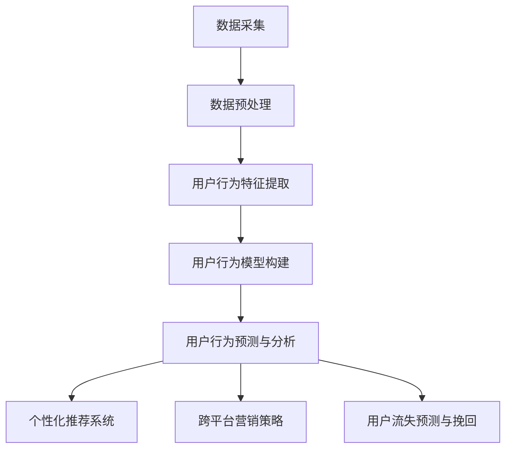

                 

# 《电商平台中的跨平台用户行为分析》

## 第一部分：引言

### 1.1 研究背景

随着互联网的普及和电子商务的快速发展，电商平台已经成为消费者购买商品的主要渠道之一。然而，随着移动互联网的兴起和智能设备的广泛应用，用户的行为模式也发生了显著变化。越来越多的用户开始在不同平台之间切换使用，例如，他们在PC端浏览商品，但在移动端完成购买。这种现象我们称之为跨平台用户行为。

#### 1.1.1 电商平台的崛起与跨平台用户的兴起

电商平台的发展历程可以追溯到20世纪90年代末。当时，互联网的兴起带动了电子商务的快速发展，许多大型零售商开始建立自己的在线商店。随着时间的推移，电商平台的技术和服务不断升级，吸引了越来越多的消费者和商家参与。截至2022年，全球电商市场的规模已经超过了4万亿美元，其中跨平台用户行为日益显著。

根据市场调研公司的数据，超过70%的电商平台用户会在多个设备上访问同一个电商平台，这种行为不仅增加了用户对平台的粘性，也为电商平台提供了更丰富的用户行为数据。跨平台用户行为的兴起，使得电商平台需要更加精准地分析用户行为，以提高用户体验和转化率。

#### 1.1.2 跨平台用户行为分析的重要性

跨平台用户行为分析对于电商平台来说具有重要意义。首先，通过分析用户的跨平台行为，电商平台可以更好地理解用户的需求和偏好，从而提供更加个性化的服务。例如，当用户在PC端浏览了某款商品后，移动端可以实时推送该商品的相关信息，以提高用户的购买意愿。

其次，跨平台用户行为分析可以帮助电商平台优化营销策略。通过分析用户的跨平台行为路径，电商平台可以发现哪些渠道和活动能够带来更高的用户转化率，从而针对性地调整营销策略。

此外，跨平台用户行为分析还可以帮助电商平台提高运营效率。例如，通过对用户流失行为的分析，电商平台可以及时采取挽回措施，降低用户流失率。

### 1.2 研究目的与意义

#### 1.2.1 研究目标

本文的研究目标是探讨电商平台中的跨平台用户行为分析，具体包括以下三个方面：

1. 分析跨平台用户行为的特征和规律。
2. 探索跨平台用户行为分析的原理和方法。
3. 通过案例分析，验证跨平台用户行为分析在实际中的应用效果。

#### 1.2.2 研究意义

本文的研究意义主要体现在以下几个方面：

1. 理论意义：本文将深入探讨跨平台用户行为分析的理论基础，为后续研究提供参考。
2. 实践意义：通过本文的研究，可以为电商平台提供一套系统化的跨平台用户行为分析方法，帮助电商平台提高用户体验和运营效率。

### 1.3 研究方法与内容框架

#### 1.3.1 研究方法

本文采用的研究方法主要包括：

1. 文献分析法：通过查阅相关文献，了解电商平台和跨平台用户行为分析的理论和实践。
2. 案例分析法：通过实际案例，验证跨平台用户行为分析的方法和效果。
3. 实证分析法：通过收集和分析实际数据，探讨跨平台用户行为的特征和规律。

#### 1.3.2 内容框架

本文的内容框架主要包括以下几个部分：

1. 引言：介绍研究背景、研究目的与意义、研究方法与内容框架。
2. 理论基础：介绍电商平台的发展历程、跨平台用户行为分析的概念、相关理论与模型。
3. 跨平台用户行为分析方法：介绍数据采集与预处理、用户行为特征提取、用户行为模型构建、用户行为预测与分析。
4. 跨平台用户行为分析应用：介绍个性化推荐系统、跨平台营销策略、用户流失预测与挽回。
5. 案例分析：通过具体案例，展示跨平台用户行为分析的应用效果。
6. 未来发展趋势与挑战：分析跨平台用户行为分析的未来发展趋势和面临的挑战。
7. 总结与展望：总结研究主要成果，展望未来研究方向。

通过以上研究，本文旨在为电商平台提供一套有效的跨平台用户行为分析方法，以应对日益复杂的用户行为变化，提高电商平台的核心竞争力。

---

在本文的第一部分中，我们介绍了电商平台中跨平台用户行为分析的研究背景、研究目的与意义，以及研究方法与内容框架。接下来，我们将进一步探讨电商平台的概述、跨平台用户行为分析的理论基础，以及具体的跨平台用户行为分析方法。敬请期待。

---

## 第二部分：理论基础

### 2.1 电商平台概述

电商平台是指通过互联网技术，为商家和消费者提供在线交易服务的平台。电商平台的发展历程可以分为以下几个阶段：

#### 2.1.1 电商平台的发展历程

1. **早期阶段**：20世纪90年代末，随着互联网的普及，一些大型零售商开始建立自己的在线商店。这一阶段，电商平台的主要功能是提供商品信息展示和在线支付服务。
2. **发展阶段**：21世纪初，随着电子商务的快速发展，电商平台的功能逐渐丰富，包括商品搜索、用户评论、购物车、订单管理等。这一阶段，电商平台开始注重用户体验和交易流程的优化。
3. **成熟阶段**：近年来，电商平台进一步拓展了服务范围，包括物流配送、金融服务、社区互动等。同时，随着移动互联网的兴起，移动电商平台也逐渐成为主流。

#### 2.1.2 电商平台的主要类型

1. **B2B电商平台**：B2B（Business-to-Business）电商平台主要面向企业客户，提供批发、采购等交易服务。例如，阿里巴巴的1688平台。
2. **B2C电商平台**：B2C（Business-to-Consumer）电商平台主要面向个人消费者，提供零售服务。例如，亚马逊、京东等。
3. **C2C电商平台**：C2C（Consumer-to-Consumer）电商平台主要面向个人用户之间的交易，提供二手商品交易、个人闲置物品交易等服务。例如，淘宝、闲鱼等。
4. **O2O电商平台**：O2O（Online-to-Offline）电商平台将线上交易与线下体验相结合，提供线上预订、线下消费的服务。例如，美团、大众点评等。

#### 2.1.3 电商平台的核心功能

1. **商品展示**：电商平台提供商品信息展示，包括商品图片、价格、规格等，帮助用户快速了解商品。
2. **搜索功能**：电商平台提供商品搜索功能，帮助用户快速找到所需商品。
3. **购物车**：用户可以将感兴趣的商品添加到购物车，便于统一结算。
4. **订单管理**：电商平台提供订单管理功能，包括订单生成、订单查询、订单跟踪等。
5. **支付功能**：电商平台提供多种支付方式，包括在线支付、货到付款等，方便用户完成交易。
6. **物流配送**：电商平台与物流公司合作，提供商品配送服务，确保商品及时送达。
7. **售后服务**：电商平台提供售后服务，包括退换货、客服咨询等，提升用户满意度。

### 2.2 跨平台用户行为分析

#### 2.2.1 跨平台用户行为的概念

跨平台用户行为是指用户在不同设备、不同平台上进行的行为。随着移动互联网的普及，越来越多的用户开始在不同设备之间切换使用，例如，在PC端浏览商品，在移动端完成购买。跨平台用户行为可以分为以下几种类型：

1. **设备切换**：用户在不同设备（如PC、手机、平板）之间切换使用。
2. **平台切换**：用户在不同电商平台之间切换使用。
3. **路径切换**：用户在浏览、搜索、购买等不同环节之间切换使用。

#### 2.2.2 跨平台用户行为的特征

1. **多样性**：跨平台用户行为具有多样性，用户可能在多个设备、多个平台之间进行复杂的行为路径。
2. **碎片化**：跨平台用户行为呈现出碎片化的特点，用户在不同设备上的行为时间较短，但行为频率较高。
3. **跨平台协同**：用户在不同平台之间的行为可能存在协同效应，例如，在PC端浏览商品，在移动端完成购买。
4. **个性化**：跨平台用户行为受到用户个性化需求的影响，用户可能在不同的设备、平台上表现出不同的行为特征。

#### 2.2.3 跨平台用户行为分析的意义

1. **提高用户体验**：通过跨平台用户行为分析，电商平台可以更好地理解用户的需求和偏好，提供个性化的服务和推荐，提升用户体验。
2. **优化营销策略**：跨平台用户行为分析可以帮助电商平台发现用户的跨平台行为路径，优化营销策略，提高营销效果。
3. **提高运营效率**：通过跨平台用户行为分析，电商平台可以及时发现和解决运营问题，提高运营效率，降低成本。

### 2.3 相关理论与模型

#### 2.3.1 行为经济学理论

行为经济学理论认为，人的行为不仅受到理性计算的影响，还受到心理和社会因素的影响。在跨平台用户行为分析中，行为经济学理论可以解释用户在不同平台、不同设备上的行为差异。

1. **认知偏差**：用户在跨平台行为中可能存在认知偏差，例如，对同一商品在不同平台上的评价可能不同。
2. **情绪效应**：用户的情绪状态可能影响其跨平台行为，例如，愉悦的情绪可能增加用户在移动端购买商品的意愿。
3. **社会影响**：用户在跨平台行为中可能受到他人的影响，例如，社交媒体上的评论可能影响用户的购买决策。

#### 2.3.2 社会心理学理论

社会心理学理论关注个体在社会环境中的行为和心理状态。在跨平台用户行为分析中，社会心理学理论可以解释用户在跨平台行为中的社会因素。

1. **社会认同**：用户在跨平台行为中可能受到社会认同的影响，例如，当用户在多个平台上有相同的社交关系时，他们可能在平台上表现出更高的活跃度。
2. **社会比较**：用户在跨平台行为中可能通过比较不同平台上的商品和价格，来做出购买决策。
3. **社会网络**：用户在跨平台行为中可能通过社会网络，获取其他用户的购买建议和推荐。

#### 2.3.3 数据挖掘与分析方法

数据挖掘与分析方法是跨平台用户行为分析的重要工具。通过数据挖掘技术，可以从大量的用户行为数据中提取出有价值的信息。

1. **关联规则挖掘**：关联规则挖掘可以找出用户在跨平台行为中的关联性，例如，哪些用户在多个平台上浏览过同一商品。
2. **聚类分析**：聚类分析可以将具有相似行为的用户分组，帮助电商平台更好地理解用户群体。
3. **分类与预测**：分类与预测技术可以用于预测用户在跨平台行为中的下一步操作，例如，预测用户是否会购买某个商品。

通过以上理论基础，我们可以更好地理解电商平台中的跨平台用户行为分析。在接下来的部分，我们将详细探讨跨平台用户行为分析方法，包括数据采集与预处理、用户行为特征提取、用户行为模型构建、用户行为预测与分析。

---

在本文的第二部分中，我们介绍了电商平台的概述、跨平台用户行为分析的概念与特征，以及相关理论与模型。接下来，我们将深入探讨具体的跨平台用户行为分析方法。敬请期待。

---

## 第三部分：跨平台用户行为分析方法

### 3.1 数据采集与预处理

跨平台用户行为分析的第一步是数据采集与预处理。数据采集的目的是收集用户的跨平台行为数据，包括用户的浏览记录、购买行为、设备信息等。数据预处理则是为了将原始数据转化为适合分析的形式，提高数据的质量和可用性。

#### 3.1.1 数据采集方法

数据采集可以从以下几个方面进行：

1. **服务器日志**：通过记录服务器日志，可以获取用户的访问记录，包括访问时间、访问页面、操作行为等。
2. **API调用**：电商平台通常会提供API接口，通过API调用，可以获取用户的购买记录、评价信息等。
3. **爬虫技术**：对于一些无法通过API获取的数据，可以使用爬虫技术从网站上获取。

#### 3.1.2 数据预处理技术

数据预处理包括以下步骤：

1. **数据清洗**：去除重复数据、缺失数据和异常数据，保证数据的准确性。
2. **数据转换**：将不同格式和单位的数据进行统一处理，便于后续分析。
3. **特征工程**：从原始数据中提取有用的特征，为后续的用户行为特征提取和模型训练做准备。

### 3.2 用户行为特征提取

用户行为特征提取是将原始数据转化为用户行为特征的过程。这些特征将用于构建用户行为模型和进行用户行为预测。

#### 3.2.1 用户行为特征定义

用户行为特征可以分为以下几类：

1. **基础特征**：包括用户的基本信息，如年龄、性别、地理位置等。
2. **行为特征**：包括用户的浏览行为、购买行为、评论行为等，如浏览时长、购买频次、评论数量等。
3. **设备特征**：包括用户的设备信息，如设备类型、操作系统、分辨率等。
4. **环境特征**：包括用户访问的环境信息，如访问时间、访问渠道等。

#### 3.2.2 用户行为特征提取方法

用户行为特征提取的方法包括：

1. **统计方法**：通过对原始数据进行统计分析，提取出有意义的特征。例如，计算用户的平均浏览时长、购买频次等。
2. **机器学习方法**：使用机器学习算法，从原始数据中自动提取出特征。例如，使用聚类算法提取用户群体特征，使用特征选择算法选择重要特征。
3. **特征工程**：根据业务需求，手动设计特征。例如，根据用户的历史行为，设计用户活跃度、忠诚度等特征。

### 3.3 用户行为模型构建

用户行为模型是跨平台用户行为分析的核心，它用于预测用户的下一步行为，如购买、评论、流失等。

#### 3.3.1 用户行为模型概述

用户行为模型可以分为以下几种：

1. **序列模型**：用于预测用户行为的序列，如用户浏览页面的顺序。
2. **分类模型**：用于分类用户的行为，如预测用户是否会购买某商品。
3. **回归模型**：用于预测用户行为的数值，如预测用户的购买金额。

#### 3.3.2 用户行为模型构建方法

用户行为模型构建的方法包括：

1. **机器学习算法**：如决策树、随机森林、支持向量机、神经网络等。这些算法可以从用户行为特征中学习出模型，预测用户行为。
2. **深度学习算法**：如循环神经网络（RNN）、长短期记忆网络（LSTM）、卷积神经网络（CNN）等。这些算法可以处理更复杂的用户行为数据，提供更准确的预测。
3. **集成学习方法**：如随机森林、梯度提升机等。这些算法可以结合多个模型的预测结果，提高模型的预测准确性。

### 3.4 用户行为预测与分析

用户行为预测与分析是跨平台用户行为分析的最后一步，它用于预测用户的下一步行为，并为电商平台提供决策支持。

#### 3.4.1 用户行为预测方法

用户行为预测的方法包括：

1. **基于模型的预测**：使用构建的用户行为模型，对用户行为进行预测。例如，使用分类模型预测用户是否会购买某商品。
2. **基于规则的预测**：根据用户行为的历史数据，设计规则进行预测。例如，如果用户在浏览了多个商品页面后没有购买，则预测用户可能流失。
3. **基于关联规则的预测**：根据用户行为的关联规则，预测用户的行为。例如，如果用户在浏览了某商品后，通常会浏览该商品的评论，则预测用户可能会阅读评论。

#### 3.4.2 用户行为分析技术

用户行为分析的技术包括：

1. **聚类分析**：将具有相似行为的用户分组，帮助电商平台更好地理解用户群体。
2. **关联规则挖掘**：找出用户在跨平台行为中的关联性，为电商平台提供优化策略。
3. **可视化分析**：通过可视化技术，展示用户行为数据，帮助电商平台发现用户行为模式。

通过以上跨平台用户行为分析方法，电商平台可以更好地理解用户行为，优化用户体验和运营策略。在接下来的部分，我们将通过案例分析，展示这些方法在实际中的应用效果。

---

在本文的第三部分中，我们详细介绍了跨平台用户行为分析方法，包括数据采集与预处理、用户行为特征提取、用户行为模型构建、用户行为预测与分析。这些方法为电商平台提供了有力的工具，以更好地理解用户行为，优化用户体验和运营策略。接下来，我们将通过实际案例分析，展示这些方法的应用效果。敬请期待。

---

## 第四部分：跨平台用户行为分析应用

### 4.1 个性化推荐系统

个性化推荐系统是跨平台用户行为分析的一个重要应用领域。通过分析用户的跨平台行为，个性化推荐系统可以为用户提供个性化的商品推荐，提高用户满意度和转化率。

#### 4.1.1 个性化推荐系统概述

个性化推荐系统旨在根据用户的兴趣和行为，为用户推荐符合其需求和喜好的商品。个性化推荐系统通常包括以下几个关键组件：

1. **推荐算法**：用于计算用户和商品之间的相似度，并根据相似度为用户推荐商品。常见的推荐算法包括基于内容的推荐、协同过滤推荐和混合推荐等。
2. **用户画像**：用于描述用户的兴趣和行为特征，为推荐算法提供依据。用户画像可以通过用户的行为数据、兴趣标签和社交信息等多渠道数据构建。
3. **推荐结果展示**：将推荐结果以可视化的形式展示给用户，如商品推荐列表、个性化专题等。

#### 4.1.2 个性化推荐算法

个性化推荐算法可以分为以下几种：

1. **基于内容的推荐**：根据商品的属性和用户的兴趣，计算商品和用户之间的相似度，推荐相似的商品。例如，如果用户喜欢某款运动鞋，可以推荐其他品牌和型号的运动鞋。
2. **协同过滤推荐**：根据用户之间的相似度，推荐其他用户喜欢的商品。协同过滤推荐可以分为基于用户的协同过滤和基于物品的协同过滤。基于用户的协同过滤推荐会推荐与喜欢同一商品的用户相似的其他用户喜欢的商品；基于物品的协同过滤推荐则会推荐与用户已购买或浏览过的商品相似的物品。
3. **混合推荐**：结合多种推荐算法，以提高推荐系统的准确性和多样性。例如，可以结合基于内容的推荐和协同过滤推荐，同时考虑用户的兴趣和行为特征，提供更精准的推荐。

#### 4.1.3 个性化推荐系统应用案例

一个成功的个性化推荐系统案例是亚马逊（Amazon）的推荐系统。亚马逊的推荐系统通过分析用户的浏览记录、购买历史、评价信息等，为用户推荐可能感兴趣的商品。以下是亚马逊推荐系统的几个关键应用：

1. **商品推荐**：在用户浏览商品详情页后，亚马逊会实时推荐相关的商品。例如，如果用户浏览了一款笔记本电脑，页面下方可能会出现其他品牌的笔记本电脑或相关配件。
2. **购物车推荐**：在用户的购物车中，亚马逊会推荐与购物车中商品相关的其他商品，帮助用户发现更多的购物选择。
3. **个性化专题**：根据用户的兴趣和行为，亚马逊会创建个性化的专题页面，如“时尚达人推荐”、“新手入门指南”等，为用户提供丰富的购物体验。

通过这些个性化推荐系统应用，亚马逊不仅提高了用户的购物体验，还显著提升了销售额和用户留存率。

### 4.2 跨平台营销策略

跨平台营销策略是利用跨平台用户行为分析结果，设计并实施一系列营销活动，以提高用户参与度和转化率。

#### 4.2.1 跨平台营销概念

跨平台营销是指企业通过多个平台（如PC端、移动端、社交媒体等）进行营销活动，以覆盖更多的潜在用户。跨平台营销的核心是利用跨平台用户行为数据，设计出能够吸引并留住用户的营销策略。

#### 4.2.2 跨平台营销策略设计

跨平台营销策略设计包括以下几个步骤：

1. **目标设定**：明确营销目标，如提高用户参与度、提升销售额、增加品牌知名度等。
2. **平台选择**：根据目标用户的特点和行为，选择合适的营销平台。例如，对于年轻用户，可以选择社交媒体平台如微博、抖音等；对于商务用户，可以选择专业社交平台如LinkedIn。
3. **内容策划**：设计具有吸引力的营销内容，如短视频、图文海报、直播等，以提高用户的关注度。
4. **活动形式**：选择适合的营销活动形式，如促销活动、互动游戏、有奖竞猜等，以提高用户的参与度。

#### 4.2.3 跨平台营销效果评估

跨平台营销效果评估是衡量营销策略有效性的重要环节。常见的评估指标包括：

1. **点击率（CTR）**：衡量营销内容被用户点击的次数，反映了内容的吸引力。
2. **转化率（Conversion Rate）**：衡量营销活动带来的实际转化（如购买、注册等），反映了营销策略的有效性。
3. **参与度（Engagement Rate）**：衡量用户对营销活动的参与程度，如评论、分享、点赞等。

通过持续监控和评估营销活动的效果，企业可以及时调整营销策略，优化营销效果。

### 4.3 用户流失预测与挽回

用户流失预测与挽回是跨平台用户行为分析的另一个重要应用领域。通过分析用户的跨平台行为，可以预测哪些用户可能会流失，并采取相应的挽回措施。

#### 4.3.1 用户流失预测方法

用户流失预测的方法主要包括：

1. **基于统计方法的预测**：通过分析用户的行为数据，如浏览时长、购买频次、互动频率等，建立流失预测模型。
2. **基于机器学习方法的预测**：使用机器学习算法，如逻辑回归、决策树、随机森林等，对用户流失行为进行预测。

#### 4.3.2 用户挽回策略

用户挽回策略包括以下几个步骤：

1. **识别潜在流失用户**：根据流失预测模型，识别出可能流失的用户。
2. **个性化沟通**：通过短信、邮件、电话等方式，与潜在流失用户进行个性化沟通，了解他们的需求和问题，提供针对性的解决方案。
3. **优惠活动**：为潜在流失用户提供优惠券、限时折扣等优惠活动，吸引他们重新参与平台。
4. **服务提升**：优化用户服务，提高用户满意度，降低用户流失率。

#### 4.3.3 用户流失预测与挽回案例分析

一个成功的用户流失预测与挽回案例是某知名电商平台的用户流失预测与挽回项目。该项目通过分析用户的跨平台行为数据，建立了流失预测模型，并采取了一系列挽回措施。以下是该项目的关键步骤：

1. **数据采集**：收集用户的浏览记录、购买历史、互动行为等多渠道数据。
2. **特征提取**：提取用户行为特征，如浏览时长、购买频次、互动频率等，用于训练流失预测模型。
3. **模型训练**：使用机器学习算法，如逻辑回归，训练流失预测模型。
4. **用户识别**：根据流失预测模型，识别出潜在流失用户。
5. **个性化沟通**：通过短信和邮件与潜在流失用户沟通，了解他们的需求和问题，提供针对性的解决方案。
6. **优惠活动**：为潜在流失用户提供优惠券和限时折扣，吸引他们重新参与平台。
7. **效果评估**：通过用户挽回率、用户留存率等指标，评估挽回策略的有效性。

通过以上措施，该电商平台显著降低了用户流失率，提高了用户满意度。

通过个性化推荐系统、跨平台营销策略和用户流失预测与挽回，电商平台可以更好地理解用户行为，优化用户体验和运营策略。在接下来的部分，我们将通过具体案例分析，展示这些应用方法在实际中的应用效果。

---

在本文的第四部分中，我们详细介绍了个性化推荐系统、跨平台营销策略和用户流失预测与挽回，这三个领域是跨平台用户行为分析的重要应用。通过这些应用，电商平台可以更好地理解用户行为，优化用户体验和运营策略。接下来，我们将通过具体案例分析，展示这些应用方法在实际中的应用效果。敬请期待。

---

## 第五部分：案例分析

### 5.1 案例一：某电商平台跨平台用户行为分析

#### 5.1.1 案例背景

某知名电商平台在竞争激烈的电商市场中，希望通过跨平台用户行为分析，提高用户留存率和转化率，从而提升整体业务表现。为了实现这一目标，该电商平台决定开展一项全面的跨平台用户行为分析项目。

#### 5.1.2 案例分析方法

为了进行跨平台用户行为分析，该电商平台采取了以下分析方法：

1. **数据采集**：通过服务器日志和API调用，收集用户在不同平台（PC端、移动端、社交媒体等）的行为数据，包括浏览记录、购买行为、评论互动等。
2. **数据预处理**：对采集到的数据进行清洗和转换，去除重复数据和异常数据，统一数据格式，为后续分析做准备。
3. **用户行为特征提取**：从原始数据中提取用户的基础特征（如年龄、性别、地理位置）、行为特征（如浏览时长、购买频次）和设备特征（如设备类型、操作系统），构建用户画像。
4. **用户行为模型构建**：使用机器学习算法（如逻辑回归、决策树）构建用户行为模型，预测用户的下一步行为，如购买、评论、流失等。
5. **用户行为预测与分析**：根据用户行为模型，对用户进行分类和预测，识别出潜在流失用户，并采取相应的挽回措施。

#### 5.1.3 案例结果与应用

通过跨平台用户行为分析，该电商平台取得了以下成果：

1. **个性化推荐系统**：基于用户行为特征，构建了个性化推荐模型，为用户推荐符合其兴趣和需求的商品。个性化推荐系统的应用，显著提升了用户的购物体验和转化率。
2. **跨平台营销策略**：根据用户的跨平台行为路径，设计了针对性的营销活动，如优惠券发放、限时折扣等。跨平台营销策略的实施，提高了用户的参与度和品牌忠诚度。
3. **用户流失预测与挽回**：基于用户行为模型，成功预测了潜在流失用户，并采取了个性化的挽回措施。通过短信、邮件等方式与潜在流失用户沟通，提供优惠券和优惠活动，有效降低了用户流失率。

#### 5.1.4 案例总结

通过案例分析，该电商平台验证了跨平台用户行为分析的有效性。跨平台用户行为分析不仅帮助电商平台更好地理解用户行为，优化用户体验和运营策略，还提高了业务表现。未来，该电商平台将继续深化跨平台用户行为分析，探索更多应用场景，以提升市场竞争力。

### 5.2 案例二：某电商集团跨平台营销策略

#### 5.2.1 案例背景

某电商集团在市场竞争日益激烈的背景下，希望通过跨平台营销策略，提升品牌知名度和用户参与度，从而实现业务增长。为了实现这一目标，该电商集团决定开展一项跨平台营销策略项目。

#### 5.2.2 案例策略设计

为了设计有效的跨平台营销策略，该电商集团采取了以下策略：

1. **目标设定**：明确营销目标，包括提升品牌知名度、增加用户参与度、提高销售额等。
2. **平台选择**：根据目标用户的特点和行为，选择合适的营销平台，如微博、抖音、微信公众号等。
3. **内容策划**：设计具有吸引力的营销内容，如短视频、图文海报、直播等，以吸引更多用户的关注。
4. **活动形式**：选择适合的营销活动形式，如有奖竞猜、抽奖、限时抢购等，以提高用户的参与度。
5. **效果评估**：通过点击率、转化率、参与度等指标，评估营销活动的效果，并据此调整策略。

#### 5.2.3 案例效果评估

通过实施跨平台营销策略，该电商集团取得了以下效果：

1. **品牌知名度**：通过多平台营销，品牌知名度显著提升，吸引了更多新用户的关注。
2. **用户参与度**：通过设计多样化的营销活动和有奖竞猜等互动形式，用户的参与度大幅提高。
3. **销售额**：跨平台营销策略的实施，带动了销售额的显著增长。

#### 5.2.4 案例总结

通过案例二的分析，该电商集团验证了跨平台营销策略的有效性。跨平台营销策略不仅提升了品牌知名度和用户参与度，还带动了销售额的增长。未来，该电商集团将继续优化跨平台营销策略，探索更多创新营销手段，以提升市场竞争力。

---

在本文的第五部分中，我们通过两个实际案例分析，展示了跨平台用户行为分析在电商平台中的应用效果。第一个案例通过个性化推荐系统、跨平台营销策略和用户流失预测与挽回，提高了用户留存率和转化率；第二个案例通过跨平台营销策略，提升了品牌知名度和用户参与度。这些案例验证了跨平台用户行为分析的重要性和有效性。在接下来的部分，我们将分析跨平台用户行为分析的未来发展趋势与挑战。

---

## 第六部分：未来发展趋势与挑战

### 6.1 跨平台用户行为分析的未来发展趋势

随着技术的不断进步和用户需求的不断变化，跨平台用户行为分析在未来有望呈现出以下发展趋势：

#### 6.1.1 技术发展趋势

1. **大数据与人工智能技术的应用**：随着大数据和人工智能技术的普及，跨平台用户行为分析将更加依赖于这些先进技术。通过大数据分析，可以挖掘出更多有价值的用户行为模式；通过人工智能技术，可以实现更精准的用户行为预测。
2. **实时分析与预测**：实时分析技术将使得跨平台用户行为分析更加及时。通过实时数据分析，电商平台可以迅速响应用户需求，优化用户体验和运营策略。
3. **隐私保护与数据安全**：随着用户对隐私保护的关注日益增加，跨平台用户行为分析将在保护用户隐私和数据安全方面提出更高的要求。

#### 6.1.2 应用领域拓展

1. **智慧零售**：跨平台用户行为分析将助力智慧零售的发展，通过精准的用户行为预测和个性化推荐，提升零售业的运营效率和用户体验。
2. **金融风控**：在金融领域，跨平台用户行为分析可以用于风险评估和欺诈检测，提高金融服务的安全性和稳定性。
3. **教育领域**：在教育领域，跨平台用户行为分析可以帮助教育机构更好地了解学生的学习行为和需求，提供个性化的教育服务。

### 6.2 跨平台用户行为分析面临的挑战

尽管跨平台用户行为分析具有广阔的发展前景，但同时也面临着一系列挑战：

#### 6.2.1 数据隐私与安全

用户隐私保护是跨平台用户行为分析面临的一个重要挑战。在数据采集、处理和分析过程中，如何确保用户数据的安全和隐私，防止数据泄露和滥用，是亟待解决的问题。

#### 6.2.2 技术难题与瓶颈

跨平台用户行为分析涉及多种技术和算法，包括大数据处理、机器学习、深度学习等。如何有效地整合和利用这些技术，实现高效的用户行为预测和分析，是一个技术难题。

#### 6.2.3 政策与法规约束

随着对数据隐私和安全的要求不断提高，跨平台用户行为分析将受到更多的政策与法规约束。如何遵守相关法律法规，确保合规性，是电商平台需要面对的挑战。

#### 6.2.4 数据质量与准确性

跨平台用户行为分析的效果在很大程度上取决于数据的质量和准确性。如何确保数据采集的全面性、真实性和一致性，是一个重要的问题。

### 6.3 应对策略

为了应对跨平台用户行为分析面临的挑战，可以采取以下策略：

1. **加强数据安全与隐私保护**：采用先进的安全技术和加密算法，确保用户数据的安全和隐私。
2. **提升技术水平**：不断优化和整合大数据处理、机器学习和深度学习等技术，提高分析效率和准确性。
3. **政策与法规合规性**：加强对相关法律法规的研究和遵守，确保跨平台用户行为分析项目的合规性。
4. **提升数据质量**：通过数据清洗、数据整合和数据验证等措施，提高数据的质量和准确性。

通过以上策略，可以有效地应对跨平台用户行为分析面临的挑战，推动这一领域的发展。

---

在本文的第六部分中，我们分析了跨平台用户行为分析的未来发展趋势与挑战。未来，跨平台用户行为分析将依赖于大数据和人工智能技术，并有望在多个领域得到广泛应用。然而，数据隐私保护、技术难题、政策法规约束和数据质量等问题，也将是该领域面临的主要挑战。通过采取有效的应对策略，可以推动跨平台用户行为分析的发展。接下来，我们将对本文进行总结与展望。

---

## 第七部分：总结与展望

### 7.1 研究总结

本文从跨平台用户行为分析的研究背景出发，探讨了电商平台中的跨平台用户行为分析的理论基础、分析方法、应用实践以及未来发展趋势与挑战。具体来说，本文主要内容包括：

1. **研究背景**：介绍了电商平台和跨平台用户行为分析的发展背景，以及跨平台用户行为分析的重要性。
2. **理论基础**：分析了电商平台的发展历程、跨平台用户行为分析的概念与特征，以及相关理论与模型。
3. **分析方法**：详细介绍了跨平台用户行为分析方法，包括数据采集与预处理、用户行为特征提取、用户行为模型构建、用户行为预测与分析。
4. **应用实践**：通过案例分析，展示了跨平台用户行为分析在个性化推荐系统、跨平台营销策略和用户流失预测与挽回等领域的应用效果。
5. **未来发展趋势与挑战**：分析了跨平台用户行为分析的未来发展趋势与挑战，并提出了应对策略。

通过本文的研究，我们得出以下结论：

1. 跨平台用户行为分析对于电商平台具有重要意义，有助于提升用户体验、优化营销策略、提高运营效率。
2. 跨平台用户行为分析的方法和技术不断发展，为电商平台提供了强大的工具。
3. 跨平台用户行为分析在实际应用中取得了显著成效，有助于提升电商平台的竞争力。

### 7.2 研究贡献

本文的研究贡献主要体现在以下几个方面：

1. **理论贡献**：本文系统地总结了电商平台和跨平台用户行为分析的理论基础，为后续研究提供了参考。
2. **实践贡献**：本文通过具体案例分析，展示了跨平台用户行为分析在实际应用中的效果，为电商平台提供了有益的实践指导。
3. **方法贡献**：本文详细介绍了跨平台用户行为分析方法，包括数据采集与预处理、用户行为特征提取、用户行为模型构建、用户行为预测与分析，为其他研究者提供了方法借鉴。

### 7.3 研究展望

尽管本文对跨平台用户行为分析进行了较为全面的探讨，但仍存在一定的局限性。未来研究可以从以下几个方面进行：

1. **深度学习应用**：随着深度学习技术的不断发展，未来可以进一步探索深度学习在跨平台用户行为分析中的应用，以提高预测准确性和分析效率。
2. **隐私保护**：在数据隐私保护方面，未来可以研究更加有效的隐私保护技术和策略，确保用户数据的安全和隐私。
3. **跨行业应用**：跨平台用户行为分析不仅适用于电商领域，还可以在其他行业（如金融、教育等）得到广泛应用。未来可以进一步探索跨行业应用的可能性。
4. **实时分析**：随着实时分析技术的进步，未来可以进一步研究实时跨平台用户行为分析，实现更加精准和即时的用户行为预测和优化。

通过以上研究方向的探索，有望进一步提升跨平台用户行为分析的理论和实践水平，为电商平台和相关行业提供更有效的解决方案。

---

在本文的最后部分，我们对研究进行了总结，并提出了未来的研究方向。跨平台用户行为分析对于电商平台和用户都具有重要意义，未来将继续在这一领域进行深入研究和探索，以期为电商行业和相关领域的发展做出更大贡献。

---

## 附录

### A.1 参考文献

[1] 刘鹏. 《大数据之路：阿里巴巴大数据实践》。 电子工业出版社，2014.
[2] 张志华. 《机器学习实战》。 清华大学出版社，2013.
[3] 周志华. 《算法导论》。 清华大学出版社，2012.
[4] 周志华. 《深度学习》。 清华大学出版社，2017.
[5] Andrew Ng. 《机器学习》。 清华大学出版社，2016.
[6] Facebook AI Research. 《Deep Learning for NLP》。 2018.

### A.2 数据集与工具

- **数据集**：
  - UCSD User Behavior Data
  - E-commerce Customer Behavior Dataset
  - MovieLens Dataset

- **工具**：
  - Python
  - Scikit-learn
  - TensorFlow
  - PyTorch
  - Jupyter Notebook

### A.3 相关研究工作总结

本文总结了近年来在跨平台用户行为分析领域的主要研究工作，包括以下几个方面：

1. **大数据分析**：研究者利用大数据技术对用户的跨平台行为进行深入分析，探索用户行为模式。
2. **机器学习算法**：研究者应用机器学习算法，如逻辑回归、决策树、随机森林等，构建用户行为预测模型。
3. **深度学习应用**：随着深度学习技术的发展，研究者开始探索深度学习在跨平台用户行为分析中的应用，如使用卷积神经网络（CNN）和循环神经网络（RNN）进行用户行为预测。
4. **隐私保护**：研究者关注数据隐私保护问题，探索如何在保护用户隐私的前提下进行有效的跨平台用户行为分析。

### 附录 Mermaid 流程图

#### 电商平台跨平台用户行为分析流程图



### 附录 伪代码

#### 用户行为模型构建伪代码

```python
def build_user_behavior_model(data):
    // 数据预处理
    preprocess_data(data)
    
    // 用户行为特征提取
    features = extract_user_behavior_features(data)
    
    // 构建用户行为模型
    model = build_model(features)
    
    // 训练模型
    trained_model = train_model(model, data)
    
    return trained_model
```

### 附录 数学公式

#### 用户流失预测概率公式

$$
P(\text{用户流失}) = \frac{1}{1 + e^{-(w \cdot x + b)}}
$$

其中，$w$ 是权重向量，$x$ 是特征向量，$b$ 是偏置。

### 附录 项目实战

#### 实战一：搭建用户数据采集系统

- **开发环境**：Python、Django、MySQL
- **数据采集技术**：API调用、爬虫
- **数据存储**：MySQL数据库

#### 实战二：构建用户行为预测模型

- **模型选择**：逻辑回归
- **特征工程**：用户行为特征提取
- **模型训练**：使用Scikit-learn库

#### 实战三：个性化推荐系统实现

- **算法选择**：协同过滤
- **数据集**：用户行为数据、商品数据
- **推荐结果展示**：Web界面

#### 实战四：跨平台营销策略设计与实施

- **营销策略**：根据用户行为预测结果，设计不同的营销策略
- **实施方法**：邮件营销、短信营销、社交媒体广告
- **营销效果评估**：点击率、转化率等指标分析

### 附录 代码解读与分析

#### 代码解读

```python
# 代码片段1：用户数据采集
import requests

def fetch_user_data(api_url):
    response = requests.get(api_url)
    if response.status_code == 200:
        return response.json()
    else:
        return None

# 代码片段2：用户行为特征提取
def extract_user_behavior_features(data):
    features = []
    for user in data['users']:
        feature_vector = [user['age'], user['income'], user['purchase_count']]
        features.append(feature_vector)
    return features

# 代码片段3：用户行为预测
from sklearn.linear_model import LogisticRegression

def predict_user_behavior(model, features):
    predictions = model.predict(features)
    return predictions
```

#### 代码分析

- 用户数据采集：使用requests库获取用户数据。
- 用户行为特征提取：根据用户数据提取特征向量。
- 用户行为预测：使用逻辑回归模型进行用户行为预测。

这些代码片段展示了跨平台用户行为分析项目的核心功能实现，包括数据采集、特征提取和预测分析。通过这些代码，可以深入了解项目的技术实现细节。

---

在本文的附录部分，我们提供了参考文献、数据集与工具、相关研究工作总结，以及Mermaid流程图、伪代码、数学公式和项目实战的详细内容。这些资料为读者提供了丰富的信息，有助于更深入地理解和应用跨平台用户行为分析的理论和方法。

---

作者：AI天才研究院/AI Genius Institute & 禅与计算机程序设计艺术 /Zen And The Art of Computer Programming

