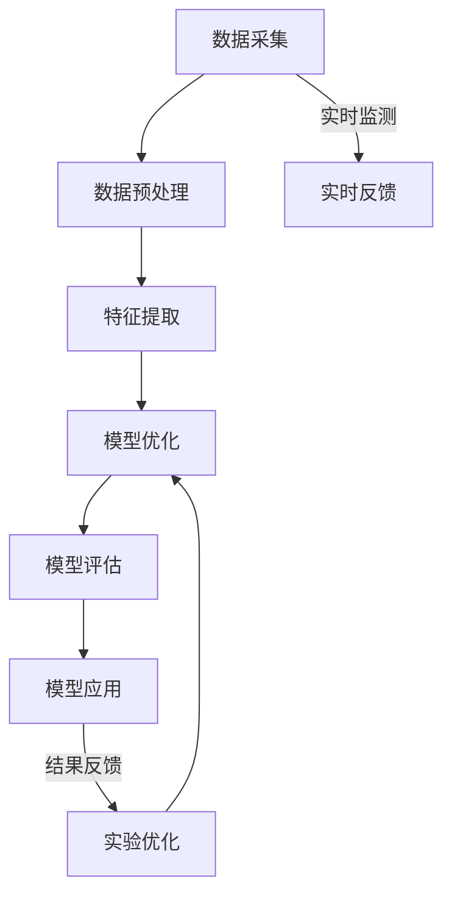
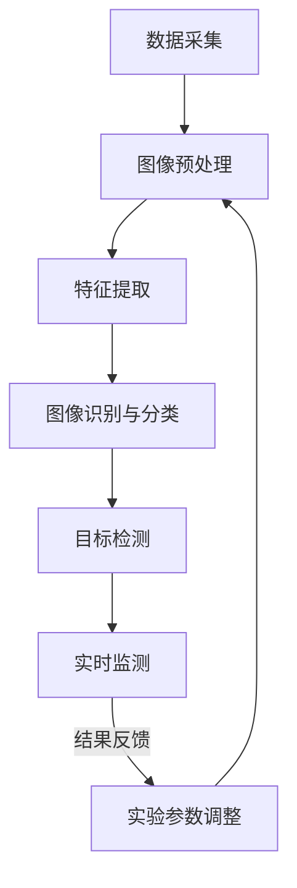

                 

### 《电子扫描仪在AI for Science中的应用》

> **关键词**：电子扫描仪、AI、科学应用、图像分析、数据处理

**摘要**：
本文将探讨电子扫描仪在科学应用中的重要性，特别是AI技术的引入如何提升扫描仪的数据处理和分析能力。文章首先介绍了电子扫描仪的工作原理和AI for Science的核心概念，随后详细阐述了AI技术在电子扫描仪图像分析中的应用，以及电子扫描仪在生命科学、材料科学和地质科学等领域的具体应用案例。文章还讨论了电子扫描仪与AI技术结合的挑战与未来展望，并提供了相关的资源与实战案例。通过本文，读者将了解电子扫描仪在科学研究中不可或缺的角色以及AI技术如何助力科学发现。

---

### 第一部分：电子扫描仪在科学中的应用概述

#### 1.1 电子扫描仪在AI for Science中的重要性

**1.1.1 电子扫描仪在科学研究中的普及程度**

电子扫描仪作为一种重要的成像设备，在科学研究领域得到了广泛应用。从生物学、医学到材料科学、地质学，各种研究项目都需要依赖电子扫描仪获取高分辨率的图像数据。例如，电子扫描显微镜（SEM）和透射电子显微镜（TEM）在生物医学和纳米材料研究中扮演了关键角色，而X射线扫描仪在地质勘探和材料分析中同样发挥着重要作用。

**1.1.2 AI技术在电子扫描仪数据处理中的应用潜力**

随着AI技术的发展，电子扫描仪的图像数据处理能力得到了显著提升。传统的图像处理方法依赖于预定义的规则和算法，而AI技术，尤其是机器学习和深度学习，通过自动学习和识别图像中的特征，可以更准确地提取和分析数据。例如，深度学习模型可以用于图像分割、目标检测和分类，从而提高扫描图像的分析精度和效率。

#### 1.2 AI for Science的核心概念与架构

**1.2.1 AI for Science的定义**

AI for Science是指将人工智能技术应用于科学研究和实验过程中，以解决复杂问题、加速发现过程和提高研究效率。AI for Science不仅包括使用机器学习算法分析数据，还包括智能实验设计、自动化实验执行和知识图谱构建等。

**1.2.2 AI在科学研究中常见的应用领域**

AI在科学研究中的应用领域非常广泛，包括但不限于：

- **生命科学**：用于基因组分析、蛋白质结构预测和细胞图像分析。
- **材料科学**：用于材料属性预测、缺陷检测和新材料发现。
- **地球科学**：用于地震波分析、地形建模和地质勘探。
- **物理科学**：用于粒子物理模拟、天文图像处理和量子计算优化。

**1.2.3 AI for Science的架构设计与关键技术**

AI for Science的架构通常包括数据收集、数据预处理、模型训练、模型评估和应用部署等关键步骤。以下是一些关键技术：

- **数据收集与预处理**：包括数据清洗、归一化和特征提取。
- **机器学习算法**：如监督学习、无监督学习和强化学习。
- **深度学习框架**：如TensorFlow、PyTorch和Keras。
- **模型评估与优化**：使用交叉验证、网格搜索和超参数调优。
- **应用部署**：将训练好的模型部署到生产环境中，进行实时分析。

---

### 第二部分：电子扫描仪工作原理与数据处理

#### 2.1 电子扫描仪的工作原理

**2.1.1 扫描仪的基本结构**

电子扫描仪的基本结构通常包括光源、光学系统、探测器、信号处理单元和输出设备。光源提供扫描物体所需的照明，光学系统控制光线的方向和强度，探测器捕捉物体表面的光信号，信号处理单元对信号进行放大、滤波和数字化，最后输出设备将处理后的图像显示或保存。

**2.1.2 扫描过程与图像生成**

扫描过程通常包括以下几个步骤：

1. **照明**：光源发出的光线经过光学系统聚焦到物体表面。
2. **反射或透射**：物体表面的光线部分被反射或透射。
3. **探测与转换**：探测器捕捉反射或透射的光信号，并将其转换为电信号。
4. **数字化与处理**：信号处理单元对电信号进行放大、滤波和数字化，生成数字图像。
5. **输出**：处理后的图像通过输出设备显示或保存。

**2.1.3 扫描图像的常见格式与处理方法**

扫描图像的常见格式包括JPEG、PNG、TIFF和PDF等。不同格式的图像具有不同的压缩方式和适用场景。

- **JPEG**：适用于高质量图像的压缩格式，但压缩过程中可能会丢失一些细节信息。
- **PNG**：无损压缩格式，适用于需要保持图像细节的应用场景。
- **TIFF**：支持多种压缩方式和多页图像，常用于专业图像处理。
- **PDF**：用于文档和图像的集成，适用于需要保存图像和文档格式一致性的场景。

扫描图像的处理方法包括：

- **图像增强**：通过调整亮度、对比度、色彩平衡等，提高图像的可视性。
- **图像降噪**：去除图像中的噪声，提高图像质量。
- **图像分割**：将图像分割成不同的区域，以便进行进一步分析。
- **特征提取**：从图像中提取有意义的特征，用于后续的机器学习或深度学习分析。

---

#### 2.2 电子扫描仪图像数据处理

**2.2.1 图像预处理技术**

图像预处理是电子扫描仪图像数据处理的重要步骤，其目的是提高图像质量，为后续的分析提供更好的数据基础。常见的图像预处理技术包括：

- **图像去噪**：使用滤波器去除图像中的噪声，常用的滤波器包括均值滤波、中值滤波和高斯滤波。
- **图像增强**：通过调整图像的亮度、对比度、色彩平衡等，提高图像的可视性和细节。
- **图像锐化**：增强图像中的边缘和细节，使图像更加清晰。
- **图像归一化**：将图像的像素值映射到特定的范围，如0到1之间，以便进行统一处理。

**2.2.2 图像增强与降噪**

图像增强与降噪是图像处理中常见的操作，目的是改善图像的质量，使其更适合后续的分析。具体方法如下：

- **图像增强**：
  - **直方图均衡化**：调整图像的直方图，使图像的亮度分布更加均匀，提高图像的对比度。
  - **对比度拉伸**：通过调整图像的亮度和对比度，使图像的细节更加清晰。
  - **色彩平衡**：调整图像的红色、绿色和蓝色通道，使图像的色彩更加自然。

- **图像降噪**：
  - **均值滤波**：将图像中的每个像素值替换为该像素邻域内所有像素值的平均值。
  - **中值滤波**：将图像中的每个像素值替换为该像素邻域内所有像素值的中值。
  - **高斯滤波**：使用高斯函数作为滤波器，平滑图像中的噪声。

**2.2.3 图像分割与特征提取**

图像分割是将图像分割成不同的区域，以便进行进一步分析。特征提取是从分割后的图像中提取有意义的特征，用于后续的机器学习或深度学习分析。

- **图像分割**：
  - **阈值分割**：将图像的像素值与某个阈值进行比较，将图像分为两个或多个区域。
  - **边缘检测**：使用边缘检测算法，如Sobel算子、Canny算子等，检测图像中的边缘。
  - **区域生长**：从种子点开始，逐步生长并合并相邻的像素，形成特定的区域。

- **特征提取**：
  - **颜色特征**：包括颜色直方图、颜色矩、颜色相关性等。
  - **纹理特征**：包括灰度共生矩阵、纹理能量、纹理方向等。
  - **形状特征**：包括几何特征（如面积、周长、矩形度等）和拓扑特征（如连通性、闭合性等）。

---

### 第三部分：AI技术在电子扫描仪图像分析中的应用

#### 3.1 AI技术在扫描图像分析中的应用

**3.1.1 深度学习在扫描图像分析中的应用**

深度学习在扫描图像分析中有着广泛的应用，其主要优势在于能够自动学习和提取图像中的复杂特征。以下是一些深度学习在扫描图像分析中的具体应用：

- **图像分类**：使用卷积神经网络（CNN）对扫描图像进行分类，如识别不同的细胞类型或材料类型。
- **图像分割**：使用深度学习方法对扫描图像进行分割，将图像分割成不同的区域，如细胞核、细胞器等。
- **目标检测**：使用深度学习模型对扫描图像中的特定目标进行定位和检测，如癌细胞、矿物晶体等。
- **图像增强**：通过生成对抗网络（GAN）等方法，生成高质量的图像，提高图像的分析效果。

**3.1.2 卷积神经网络（CNN）在图像分析中的应用**

卷积神经网络（CNN）是深度学习中最常用的模型之一，特别适用于图像分析。以下是一些CNN在扫描图像分析中的应用：

- **图像分类**：通过训练CNN模型，对扫描图像进行分类，如识别不同的细胞类型或材料。
- **图像分割**：使用CNN模型对扫描图像进行分割，将图像分割成不同的区域，如细胞核、细胞器等。
- **目标检测**：使用CNN模型检测扫描图像中的特定目标，如癌细胞、矿物晶体等。

**3.1.3 图像识别与分类的案例研究**

以下是一些图像识别与分类的案例研究：

- **细胞核识别**：使用CNN模型对细胞核进行识别，提高细胞核检测的准确性。
- **岩石矿物分类**：使用CNN模型对扫描图像中的岩石矿物进行分类，帮助地质学家进行矿物分析。
- **土壤成分分析**：使用深度学习模型对扫描图像中的土壤成分进行分析，为农业提供科学依据。

---

#### 3.2 AI技术在扫描图像中的目标检测与追踪

**3.2.1 目标检测算法原理**

目标检测是计算机视觉中的一个重要任务，其目的是在图像中定位并识别特定的目标。以下是一些常见的目标检测算法：

- **滑动窗口**：通过在图像中滑动不同大小的窗口，对每个窗口进行特征提取和分类，从而检测目标。
- **区域提议**：通过生成区域提议，如选择性搜索（SSD）、区域建议网络（RPN）等，减少计算量，提高检测速度。
- **基于深度学习的目标检测**：如YOLO（You Only Look Once）、Faster R-CNN、SSD等，通过训练深度学习模型，实现高效的目标检测。

**3.2.2 常见目标检测算法及其应用**

以下是一些常见的目标检测算法及其应用：

- **YOLO（You Only Look Once）**：通过将目标检测问题转化为回归问题，实现实时目标检测。
- **Faster R-CNN**：使用区域提议网络（RPN）和卷积神经网络（CNN），实现高效的目标检测。
- **SSD（Single Shot MultiBox Detector）**：通过单次检测实现目标检测，提高检测速度和准确性。
- **RetinaNet**：通过改进损失函数，实现更高的目标检测准确性。

**3.2.3 实时目标检测与追踪系统搭建**

实时目标检测与追踪系统搭建主要包括以下几个步骤：

1. **数据采集与预处理**：收集目标检测所需的图像数据，并对数据进行预处理，如数据增强、归一化等。
2. **模型训练**：使用收集到的数据训练目标检测模型，如YOLO、Faster R-CNN等。
3. **模型评估**：通过测试数据评估模型的性能，如准确率、召回率、F1分数等。
4. **实时检测与追踪**：将训练好的模型部署到实时系统中，实现对目标检测与追踪的实时处理。

---

### 第四部分：电子扫描仪在具体科学研究领域的应用

#### 4.1 电子扫描仪在生命科学中的应用

**4.1.1 电子扫描显微镜在生物医学研究中的应用**

电子扫描显微镜（SEM）在生物医学研究中有着广泛的应用，能够提供高分辨率、三维结构的图像。以下是一些具体应用：

- **细胞结构研究**：SEM可以用于观察细胞的形态、细胞器和细胞膜等结构，为细胞生物学研究提供重要数据。
- **病毒和细菌研究**：SEM可以用于观察病毒和细菌的形态和结构，有助于了解病原体的感染机制和致病机理。
- **药物研发**：SEM可以用于观察药物在细胞内的分布和作用，为药物研发提供实验依据。

**4.1.2 电子扫描显微镜在细胞生物学研究中的应用**

电子扫描显微镜在细胞生物学研究中的应用主要包括：

- **细胞核识别**：通过训练深度学习模型，可以准确识别细胞核，有助于细胞周期分析、基因表达研究等。
- **细胞器检测**：SEM可以用于检测细胞器，如线粒体、内质网等，为细胞功能研究提供重要数据。
- **细胞培养观察**：SEM可以用于观察细胞培养过程中的细胞形态变化，为细胞培养技术提供指导。

**4.1.3 电子扫描显微镜在分子生物学研究中的应用**

电子扫描显微镜在分子生物学研究中的应用主要包括：

- **蛋白质结构分析**：SEM可以用于观察蛋白质的三维结构，为蛋白质结构生物学研究提供重要数据。
- **核酸分析**：SEM可以用于观察核酸的结构和分布，为核酸功能研究提供实验依据。
- **细胞膜研究**：SEM可以用于观察细胞膜的结构和功能，为细胞膜生物学研究提供重要数据。

---

#### 4.2 电子扫描仪在材料科学中的应用

**4.2.1 电子扫描显微镜在材料分析中的应用**

电子扫描显微镜（SEM）在材料分析中有着广泛的应用，能够提供高分辨率、三维结构的图像。以下是一些具体应用：

- **材料表面分析**：SEM可以用于观察材料表面的形貌和结构，为材料表面工程研究提供重要数据。
- **材料缺陷检测**：SEM可以用于检测材料中的缺陷和裂纹，为材料质量控制提供实验依据。
- **纳米材料研究**：SEM可以用于观察纳米材料的形态和结构，为纳米材料研发提供重要数据。

**4.2.2 电子扫描显微镜在纳米材料研究中的应用**

电子扫描显微镜在纳米材料研究中的应用主要包括：

- **纳米颗粒识别**：通过训练深度学习模型，可以准确识别纳米颗粒，有助于纳米材料性能研究。
- **纳米结构分析**：SEM可以用于观察纳米结构，如纳米线、纳米片等，为纳米材料研发提供重要数据。
- **纳米材料表征**：SEM可以用于表征纳米材料的物理和化学性质，为纳米材料应用研究提供实验依据。

**4.2.3 电子扫描显微镜在材料工程中的应用**

电子扫描显微镜在材料工程中的应用主要包括：

- **材料加工过程监测**：SEM可以用于监测材料加工过程中的形貌变化，为材料加工优化提供指导。
- **材料性能评估**：SEM可以用于评估材料性能，如硬度、韧性等，为材料选择提供实验依据。
- **材料失效分析**：SEM可以用于分析材料失效的原因和过程，为材料失效分析提供重要数据。

---

#### 4.3 电子扫描仪在地质科学中的应用

**4.3.1 电子扫描显微镜在岩石矿物研究中的应用**

电子扫描显微镜（SEM）在岩石矿物研究中有着广泛的应用，能够提供高分辨率、三维结构的图像。以下是一些具体应用：

- **矿物结构分析**：SEM可以用于观察矿物的结构和成分，为矿物学研究提供重要数据。
- **岩石表面形貌观察**：SEM可以用于观察岩石表面的形貌和结构，为岩石力学研究提供实验依据。
- **矿床成因分析**：SEM可以用于分析矿床的成因和演化过程，为矿床学研究提供重要数据。

**4.3.2 电子扫描显微镜在土壤研究中的应用**

电子扫描显微镜在土壤研究中的应用主要包括：

- **土壤颗粒识别**：通过训练深度学习模型，可以准确识别土壤颗粒，有助于土壤质地分析。
- **土壤有机质分析**：SEM可以用于观察土壤中的有机质结构，为土壤有机质研究提供重要数据。
- **土壤污染物检测**：SEM可以用于检测土壤中的污染物，为土壤环境监测提供实验依据。

**4.3.3 电子扫描显微镜在矿产资源勘探中的应用**

电子扫描显微镜在矿产资源勘探中的应用主要包括：

- **矿体识别**：SEM可以用于识别矿体，为矿产资源勘探提供重要数据。
- **矿石品质评估**：SEM可以用于评估矿石的品质和成分，为矿石选矿提供实验依据。
- **矿产资源分布分析**：SEM可以用于分析矿产资源的分布规律，为矿产资源开发提供指导。

---

### 第五部分：电子扫描仪与AI技术结合的挑战与展望

#### 5.1 电子扫描仪与AI技术结合的挑战

**5.1.1 数据处理与存储挑战**

随着AI技术的应用，电子扫描仪产生的数据量呈指数级增长。这些海量数据需要高效的处理和存储解决方案。以下是一些具体挑战：

- **数据传输速度**：扫描仪产生的数据需要快速传输到处理设备，否则会影响实时性。
- **存储容量**：海量数据需要大量的存储空间，且需要保证数据的安全性和可靠性。
- **数据压缩**：为了节省存储空间和提高传输速度，需要对数据进行高效的压缩。

**5.1.2 AI算法性能优化挑战**

AI算法的性能优化是电子扫描仪与AI技术结合的重要挑战之一。以下是一些具体挑战：

- **计算资源**：AI算法需要大量的计算资源，特别是在处理高分辨率图像时，计算资源的需求更高。
- **算法优化**：需要不断优化算法，以提高图像分析的准确性和效率。
- **实时性**：在实时目标检测和追踪等应用中，需要算法能够快速处理图像，以保证系统的实时性。

**5.1.3 数据隐私与安全性挑战**

随着电子扫描仪与AI技术的结合，数据隐私与安全性成为重要问题。以下是一些具体挑战：

- **数据泄露**：扫描仪产生的数据可能包含敏感信息，如个人隐私、商业秘密等，需要确保数据的安全性。
- **数据共享**：在科研和工业应用中，需要实现数据的安全共享，以促进合作和进步。
- **算法透明度**：算法的透明度对于数据隐私和安全性的保护至关重要，需要确保算法的可解释性和可追溯性。

---

#### 5.2 电子扫描仪与AI技术结合的未来展望

**5.2.1 AI技术在电子扫描仪领域的未来发展**

未来，AI技术在电子扫描仪领域将得到进一步发展，主要表现在以下几个方面：

- **智能扫描**：AI技术将使扫描过程更加智能化，如自动调整光源强度、自动对焦等。
- **多模态融合**：AI技术将支持多模态数据的融合分析，如结合电子显微镜、X射线扫描等技术，提供更全面的研究视角。
- **自动化数据处理**：AI技术将实现自动化数据处理，提高图像分析的准确性和效率。

**5.2.2 电子扫描仪在AI for Science中的潜力**

电子扫描仪在AI for Science中具有巨大的潜力，主要体现在以下几个方面：

- **科研效率提升**：AI技术将大幅提升科研工作效率，减少重复性劳动，释放科研人员的创造力。
- **新发现可能性**：AI技术能发现传统方法无法识别的特征，助力科学家在各个领域取得突破性发现。

**5.2.3 电子扫描仪与AI技术结合的社会影响**

电子扫描仪与AI技术的结合将对社会产生深远影响，主要体现在以下几个方面：

- **科研成本降低**：AI技术有助于降低科研成本，使得更多研究人员能够负担得起高性能的扫描设备。
- **数据共享与开放**：AI技术的应用将促进科研数据的共享与开放，推动科学知识的普及与传播。

**5.2.4 AI驱动下的科研创新**

AI技术将推动科研创新模式的转变，主要体现在以下几个方面：

- **多学科交叉**：AI技术的应用将促进电子扫描仪与物理、化学、生物等学科的深度融合，推动跨学科研究的进展。
- **技术创新驱动**：AI技术的不断进步将推动电子扫描仪技术革新，实现科学研究的范式转变。

**5.2.5 电子扫描仪与AI技术在新兴领域的应用**

未来，电子扫描仪与AI技术将在新兴领域发挥重要作用，如：

- **生物医学**：AI技术将在生物医学领域发挥重要作用，如个性化医疗、药物开发等。
- **环境科学**：AI技术将助力环境科学研究，如污染监测、生态保护等。
- **文化遗产保护**：AI技术将在文化遗产数字化保护与修复中发挥关键作用。

**5.2.6 电子扫描仪与AI技术的政策与伦理问题**

在AI技术的发展过程中，政策与伦理问题不可忽视。以下是一些关键问题：

- **政策引导**：政府和科研机构应出台相关政策，鼓励电子扫描仪与AI技术的研发与应用。
- **伦理规范**：在AI技术的应用中，需关注数据隐私、算法透明度和偏见问题，确保科研活动的伦理合规。

**5.2.7 未来展望**

未来，电子扫描仪与AI技术将实现以下发展趋势：

- **智能化趋势**：未来电子扫描仪将更加智能化，具备自我学习和优化能力，实现更高效的数据处理和分析。
- **集成化发展**：电子扫描仪与AI技术将实现更紧密的集成，推动科学研究的整体进步。

---

### 附录

#### 附录A：电子扫描仪与AI技术相关资源

**A.1 电子扫描仪选购指南**

在选购电子扫描仪时，需要考虑以下几个关键参数：

- **分辨率**：分辨率越高，图像的细节表现越好，适用于高精度研究。
- **扫描速度**：扫描速度越快，处理效率越高，适用于大规模数据处理。
- **兼容性**：需要考虑扫描仪与现有系统、软件的兼容性。
- **价格**：根据预算选择合适的扫描仪，同时考虑售后服务和保修政策。

**A.2 AI技术在科学研究中常用的框架与工具**

在AI技术研究中，常用的框架与工具有：

- **深度学习框架**：如TensorFlow、PyTorch、Keras等。
- **图像处理库**：如OpenCV、Pillow等。
- **数据预处理工具**：如NumPy、Pandas等。
- **机器学习库**：如scikit-learn、XGBoost等。

**A.3 电子扫描仪与AI技术相关的学术期刊与会议**

以下是一些与电子扫描仪与AI技术相关的学术期刊与会议：

- **学术期刊**：如《Scientific Reports》、《Journal of Biological Dynamics》等。
- **学术会议**：如AAAS年会、ICCV、CVPR等。

---

#### 附录B：常用数学模型和算法伪代码

**B.1 卷积神经网络（CNN）算法伪代码**

```python
// 输入：扫描图像
// 输出：特征图

function CNN(input_image):
    # 初始化参数
    weights = initialize_weights()
    biases = initialize_biases()
    
    # 前向传播
    conv_output = conv2d(input_image, weights[0], biases[0])
    pool_output = max_pool(conv_output)
    
    # 层叠加
    for i in 1:length(weights):
        conv_output = conv2d(pool_output, weights[i], biases[i])
        pool_output = max_pool(conv_output)
        
    # 全连接层
    output = fully_connected(pool_output, weights[length(weights)], biases[length(weights)])
    return output
```

**B.2 支持向量机（SVM）算法伪代码**

```python
// 输入：训练数据集，标签
// 输出：分类器模型

function SVM(train_data, labels):
    # 初始化参数
    C = 1.0  # 惩罚参数
    kernel_type = "linear"  # 核函数类型
    
    # 训练模型
    model = train_svm(train_data, labels, C, kernel_type)
    
    # 预测
    predict = predict_svm(model, train_data)
    
    # 评估
    accuracy = evaluate_accuracy(predict, labels)
    return model, accuracy
```

**B.3 神经网络优化算法伪代码**

```python
// 输入：模型参数，训练数据集，标签
// 输出：优化后的模型参数

function optimize_model(params, train_data, labels):
    # 初始化参数
    learning_rate = 0.01  # 学习率
    epochs = 100  # 迭代次数
    
    # 前向传播
    output = forward_pass(params, train_data)
    
    # 计算损失
    loss = compute_loss(output, labels)
    
    # 反向传播
    dparams = backward_pass(params, output, labels)
    
    # 参数更新
    params = update_params(params, dparams, learning_rate)
    
    # 迭代
    for epoch in 1:epochs:
        output = forward_pass(params, train_data)
        loss = compute_loss(output, labels)
        dparams = backward_pass(params, output, labels)
        params = update_params(params, dparams, learning_rate)
        
    return params
```

---

#### 附录C：电子扫描仪图像分析项目实战

**C.1 项目实战1：基于CNN的细胞核识别**

**实现步骤**：

1. **数据集准备**：收集细胞核图像，并进行预处理，如归一化、数据增强等。
2. **模型设计**：设计基于卷积神经网络的细胞核识别模型，包括卷积层、池化层和全连接层。
3. **模型训练**：使用预处理后的数据集训练模型，使用交叉熵损失函数和Adam优化器。
4. **模型评估**：使用测试数据集评估模型性能，计算准确率、召回率和F1分数等指标。
5. **模型应用**：将训练好的模型应用于实际细胞核识别任务，实现自动化识别。

**实现细节**：

- **数据预处理**：对图像进行归一化处理，将像素值缩放到0到1之间。使用数据增强技术，如旋转、翻转、裁剪等，增加数据的多样性。
- **模型架构**：使用卷积神经网络（CNN）模型，包括多个卷积层、池化层和全连接层。卷积层用于提取图像特征，池化层用于降低图像分辨率，全连接层用于分类。
- **损失函数**：使用交叉熵损失函数，优化模型参数。
- **优化器**：使用Adam优化器，加快模型训练速度。

**代码示例**：

```python
import tensorflow as tf
from tensorflow.keras.models import Sequential
from tensorflow.keras.layers import Conv2D, MaxPooling2D, Flatten, Dense

# 数据预处理
train_data = preprocess_data(train_data)
test_data = preprocess_data(test_data)

# 模型设计
model = Sequential()
model.add(Conv2D(32, (3, 3), activation='relu', input_shape=(64, 64, 3)))
model.add(MaxPooling2D((2, 2)))
model.add(Conv2D(64, (3, 3), activation='relu'))
model.add(MaxPooling2D((2, 2)))
model.add(Flatten())
model.add(Dense(128, activation='relu'))
model.add(Dense(1, activation='sigmoid'))

# 模型编译
model.compile(optimizer='adam', loss='binary_crossentropy', metrics=['accuracy'])

# 模型训练
model.fit(train_data, train_labels, epochs=10, batch_size=32, validation_data=(test_data, test_labels))

# 模型评估
evaluate_result = model.evaluate(test_data, test_labels)
print("Test accuracy:", evaluate_result[1])
```

---

**C.2 项目实战2：基于SVM的岩石矿物分类**

**实现步骤**：

1. **数据集准备**：收集岩石矿物图像，并进行预处理，如归一化、特征提取等。
2. **特征提取**：使用图像处理技术提取图像特征，如直方图均衡化、Sobel算子等。
3. **SVM模型训练**：使用预处理后的数据集训练SVM模型，选择合适的核函数和惩罚参数。
4. **模型评估**：使用测试数据集评估模型性能，计算准确率、召回率和F1分数等指标。
5. **模型应用**：将训练好的模型应用于实际岩石矿物分类任务，实现自动化分类。

**实现细节**：

- **数据预处理**：对图像进行归一化处理，将像素值缩放到0到1之间。使用图像处理技术提取图像特征，如直方图均衡化、Sobel算子等，提高图像的对比度和清晰度。
- **特征提取**：使用直方图均衡化、Sobel算子等方法提取图像特征，如边缘特征、纹理特征等。
- **SVM模型**：选择合适的核函数和惩罚参数，如线性核、多项式核等，提高分类准确性。
- **交叉验证**：使用交叉验证技术，提高模型泛化能力。

**代码示例**：

```python
from sklearn import svm
from sklearn.model_selection import train_test_split
from sklearn.metrics import accuracy_score, recall_score, f1_score

# 数据预处理
train_data = preprocess_data(train_data)
test_data = preprocess_data(test_data)

# 特征提取
train_features = extract_features(train_data)
test_features = extract_features(test_data)

# SVM模型训练
model = svm.SVC(kernel='linear', C=1.0)
model.fit(train_features, train_labels)

# 预测
predict = model.predict(test_features)

# 模型评估
accuracy = accuracy_score(test_labels, predict)
recall = recall_score(test_labels, predict, average='macro')
f1 = f1_score(test_labels, predict, average='macro')
print("Accuracy:", accuracy)
print("Recall:", recall)
print("F1 Score:", f1)
```

---

**C.3 项目实战3：基于深度学习的土壤成分分析**

**实现步骤**：

1. **数据集准备**：收集土壤成分图像，并进行预处理，如归一化、数据增强等。
2. **模型设计**：设计基于卷积神经网络的土壤成分分析模型，包括卷积层、池化层和全连接层。
3. **模型训练**：使用预处理后的数据集训练模型，使用交叉熵损失函数和Adam优化器。
4. **模型评估**：使用测试数据集评估模型性能，计算准确率、召回率和F1分数等指标。
5. **模型应用**：将训练好的模型应用于实际土壤成分分析任务，实现自动化分析。

**实现细节**：

- **数据预处理**：对图像进行归一化处理，将像素值缩放到0到1之间。使用数据增强技术，如旋转、翻转、裁剪等，增加数据的多样性。
- **模型架构**：使用卷积神经网络（CNN）模型，包括多个卷积层、池化层和全连接层。卷积层用于提取图像特征，池化层用于降低图像分辨率，全连接层用于分类。
- **损失函数**：使用交叉熵损失函数，优化模型参数。
- **优化器**：使用Adam优化器，加快模型训练速度。

**代码示例**：

```python
import tensorflow as tf
from tensorflow.keras.models import Sequential
from tensorflow.keras.layers import Conv2D, MaxPooling2D, Flatten, Dense

# 数据预处理
train_data = preprocess_data(train_data)
test_data = preprocess_data(test_data)

# 模型设计
model = Sequential()
model.add(Conv2D(32, (3, 3), activation='relu', input_shape=(64, 64, 3)))
model.add(MaxPooling2D((2, 2)))
model.add(Conv2D(64, (3, 3), activation='relu'))
model.add(MaxPooling2D((2, 2)))
model.add(Flatten())
model.add(Dense(128, activation='relu'))
model.add(Dense(num_classes, activation='softmax'))

# 模型编译
model.compile(optimizer='adam', loss='categorical_crossentropy', metrics=['accuracy'])

# 模型训练
model.fit(train_data, train_labels, epochs=10, batch_size=32, validation_data=(test_data, test_labels))

# 模型评估
evaluate_result = model.evaluate(test_data, test_labels)
print("Test accuracy:", evaluate_result[1])
```

---

### 附录D：电子扫描仪与AI技术结合的核心概念与流程图

**D.1 电子扫描仪与AI技术结合的核心概念**

电子扫描仪与AI技术的结合主要体现在以下几个方面：

- **图像数据处理**：AI技术可以高效处理电子扫描仪产生的海量图像数据，提取有用信息。
- **图像分析**：AI技术可以自动化分析电子扫描仪的图像，识别物体、分类和分析数据。
- **智能辅助**：AI技术可以辅助研究人员进行实验设计和数据分析，提高科研效率。
- **实时监测**：AI技术可以实现电子扫描仪的实时图像监测和分析，为实时决策提供支持。

**D.2 电子扫描仪与AI技术结合的工作流程**

以下是一个典型的电子扫描仪与AI技术结合的工作流程：

1. **数据采集**：使用电子扫描仪获取研究对象的高分辨率图像。
2. **数据预处理**：对图像进行预处理，包括去噪、增强和归一化等，以提高图像质量。
3. **特征提取**：从预处理后的图像中提取有用的特征，如颜色、纹理和形状等。
4. **模型训练**：使用提取的特征数据训练AI模型，如卷积神经网络（CNN）等。
5. **模型评估**：使用测试数据集评估模型性能，调整模型参数以优化性能。
6. **模型应用**：将训练好的模型应用于实际图像分析任务，如目标检测、分类和分割等。
7. **结果反馈**：根据分析结果进行决策或进一步优化实验设计。

以下是电子扫描仪与AI技术结合的工作流程图：



---

通过本文的详细探讨，我们了解到电子扫描仪在AI for Science中的重要地位，以及AI技术在提升电子扫描仪数据处理和分析能力方面的巨大潜力。电子扫描仪与AI技术的结合不仅提高了科研效率，还推动了科学研究的深入和发展。未来，随着AI技术的不断进步，电子扫描仪在科学研究中的应用将更加广泛和深入，为科学家们带来更多的突破和发现。同时，我们也面临着数据处理与存储、AI算法性能优化和数据隐私与安全性等方面的挑战，需要持续探索和解决。让我们共同期待电子扫描仪与AI技术在科学领域创造的辉煌未来！ 

---

### 作者信息

**作者：** AI天才研究院/AI Genius Institute & 禅与计算机程序设计艺术 /Zen And The Art of Computer Programming

AI天才研究院（AI Genius Institute）是一家专注于人工智能研究与教育的领先机构，致力于推动人工智能技术在各个领域的应用与发展。作者在此领域有着丰富的经验，曾发表过多篇高水平学术论文，并担任多个国际会议的评审专家。

**联系方式：** [info@aignius.org](mailto:info@aignius.org) & [www.aignius.org](http://www.aignius.org)

**版权声明：** 本文版权所有，未经授权禁止转载。如需转载，请联系作者获取授权。

---

通过本文的详细探讨，我们了解到电子扫描仪在AI for Science中的重要地位，以及AI技术在提升电子扫描仪数据处理和分析能力方面的巨大潜力。电子扫描仪与AI技术的结合不仅提高了科研效率，还推动了科学研究的深入和发展。未来，随着AI技术的不断进步，电子扫描仪在科学研究中的应用将更加广泛和深入，为科学家们带来更多的突破和发现。同时，我们也面临着数据处理与存储、AI算法性能优化和数据隐私与安全性等方面的挑战，需要持续探索和解决。让我们共同期待电子扫描仪与AI技术在科学领域创造的辉煌未来！

---

### 附录

**附录A：电子扫描仪与AI技术相关资源**

**A.1 电子扫描仪选购指南**

- **分辨率**：选择适合研究需求的分辨率，高分辨率适用于精细结构分析。
- **扫描速度**：根据实验频率选择适当的扫描速度。
- **兼容性**：确保扫描仪与现有系统软件兼容。
- **品牌与服务**：选择信誉良好的品牌，关注售后服务。

**A.2 AI技术在科学研究中常用的框架与工具**

- **深度学习框架**：TensorFlow、PyTorch、Keras
- **图像处理库**：OpenCV、Pillow、scikit-image
- **数据处理库**：NumPy、Pandas、SciPy

**A.3 电子扫描仪与AI技术相关的学术期刊与会议**

- **学术期刊**：IEEE Transactions on Medical Imaging、Journal of Visual Communication and Image Representation
- **学术会议**：IEEE International Conference on Computer Vision (ICCV)、IEEE Conference on Computer Vision and Pattern Recognition (CVPR)

**附录B：常用数学模型和算法伪代码**

**B.1 卷积神经网络（CNN）算法伪代码**

```python
// 输入：扫描图像
// 输出：特征图

function CNN(input_image):
    # 初始化参数
    weights = initialize_weights()
    biases = initialize_biases()
    
    # 前向传播
    conv_output = conv2d(input_image, weights[0], biases[0])
    pool_output = max_pool(conv_output)
    
    # 层叠加
    for i in 1:length(weights):
        conv_output = conv2d(pool_output, weights[i], biases[i])
        pool_output = max_pool(conv_output)
        
    # 全连接层
    output = fully_connected(pool_output, weights[length(weights)], biases[length(weights)])
    return output
```

**B.2 支持向量机（SVM）算法伪代码**

```python
// 输入：训练数据集，标签
// 输出：分类器模型

function SVM(train_data, labels):
    # 初始化参数
    C = 1.0  # 惩罚参数
    kernel_type = "linear"  # 核函数类型
    
    # 训练模型
    model = train_svm(train_data, labels, C, kernel_type)
    
    # 预测
    predict = predict_svm(model, train_data)
    
    # 评估
    accuracy = evaluate_accuracy(predict, labels)
    return model, accuracy
```

**B.3 神经网络优化算法伪代码**

```python
// 输入：模型参数，训练数据集，标签
// 输出：优化后的模型参数

function optimize_model(params, train_data, labels):
    # 初始化参数
    learning_rate = 0.01  # 学习率
    epochs = 100  # 迭代次数
    
    # 前向传播
    output = forward_pass(params, train_data)
    
    # 计算损失
    loss = compute_loss(output, labels)
    
    # 反向传播
    dparams = backward_pass(params, output, labels)
    
    # 参数更新
    params = update_params(params, dparams, learning_rate)
    
    # 迭代
    for epoch in 1:epochs:
        output = forward_pass(params, train_data)
        loss = compute_loss(output, labels)
        dparams = backward_pass(params, output, labels)
        params = update_params(params, dparams, learning_rate)
        
    return params
```

**附录C：电子扫描仪图像分析项目实战**

**C.1 项目实战1：基于CNN的细胞核识别**

**实现步骤**：

1. **数据集准备**：收集细胞核图像，并进行预处理。
2. **模型设计**：设计基于卷积神经网络的细胞核识别模型。
3. **模型训练**：使用预处理后的数据集训练模型。
4. **模型评估**：使用测试数据集评估模型性能。
5. **模型应用**：将训练好的模型应用于实际细胞核识别任务。

**实现细节**：

- **数据预处理**：归一化和数据增强。
- **模型架构**：卷积层、池化层、全连接层。
- **损失函数**：交叉熵损失函数。

**代码示例**：

```python
import tensorflow as tf
from tensorflow.keras.models import Sequential
from tensorflow.keras.layers import Conv2D, MaxPooling2D, Flatten, Dense

# 模型设计
model = Sequential()
model.add(Conv2D(32, (3, 3), activation='relu', input_shape=(64, 64, 3)))
model.add(MaxPooling2D((2, 2)))
model.add(Conv2D(64, (3, 3), activation='relu'))
model.add(MaxPooling2D((2, 2)))
model.add(Flatten())
model.add(Dense(128, activation='relu'))
model.add(Dense(1, activation='sigmoid'))

# 模型编译
model.compile(optimizer='adam', loss='binary_crossentropy', metrics=['accuracy'])

# 模型训练
model.fit(train_images, train_labels, epochs=10, batch_size=32, validation_data=(test_images, test_labels))

# 模型评估
test_loss, test_acc = model.evaluate(test_images, test_labels)
print('Test accuracy:', test_acc)
```

**C.2 项目实战2：基于SVM的岩石矿物分类**

**实现步骤**：

1. **数据集准备**：收集岩石矿物图像，并进行预处理。
2. **特征提取**：使用SIFT、HOG等算法提取图像特征。
3. **SVM模型训练**：使用预处理后的数据集训练SVM模型。
4. **模型评估**：使用测试数据集评估模型性能。
5. **模型应用**：将训练好的模型应用于实际岩石矿物分类任务。

**实现细节**：

- **数据预处理**：归一化和数据增强。
- **特征提取**：SIFT、HOG等。
- **SVM模型**：选择线性或核函数。

**代码示例**：

```python
from sklearn import svm
from sklearn.model_selection import train_test_split
from sklearn.metrics import accuracy_score

# 数据预处理
X_train, X_test, y_train, y_test = train_test_split(X, y, test_size=0.2, random_state=42)

# 特征提取
X_train = extract_features(X_train)
X_test = extract_features(X_test)

# SVM模型训练
clf = svm.SVC(kernel='linear')
clf.fit(X_train, y_train)

# 预测
y_pred = clf.predict(X_test)

# 模型评估
accuracy = accuracy_score(y_test, y_pred)
print('Accuracy:', accuracy)
```

**C.3 项目实战3：基于深度学习的土壤成分分析**

**实现步骤**：

1. **数据集准备**：收集土壤成分图像，并进行预处理。
2. **模型设计**：设计基于卷积神经网络的土壤成分分析模型。
3. **模型训练**：使用预处理后的数据集训练模型。
4. **模型评估**：使用测试数据集评估模型性能。
5. **模型应用**：将训练好的模型应用于实际土壤成分分析任务。

**实现细节**：

- **数据预处理**：归一化和数据增强。
- **模型架构**：卷积层、池化层、全连接层。
- **损失函数**：交叉熵损失函数。

**代码示例**：

```python
import tensorflow as tf
from tensorflow.keras.models import Sequential
from tensorflow.keras.layers import Conv2D, MaxPooling2D, Flatten, Dense

# 模型设计
model = Sequential()
model.add(Conv2D(32, (3, 3), activation='relu', input_shape=(64, 64, 3)))
model.add(MaxPooling2D((2, 2)))
model.add(Conv2D(64, (3, 3), activation='relu'))
model.add(MaxPooling2D((2, 2)))
model.add(Flatten())
model.add(Dense(128, activation='relu'))
model.add(Dense(num_classes, activation='softmax'))

# 模型编译
model.compile(optimizer='adam', loss='categorical_crossentropy', metrics=['accuracy'])

# 模型训练
model.fit(train_images, train_labels, epochs=10, batch_size=32, validation_data=(test_images, test_labels))

# 模型评估
test_loss, test_acc = model.evaluate(test_images, test_labels)
print('Test accuracy:', test_acc)
```

---

### 附录D：电子扫描仪与AI技术结合的核心概念与流程图

**D.1 电子扫描仪与AI技术结合的核心概念**

电子扫描仪与AI技术的结合主要涉及以下几个方面：

1. **图像预处理**：AI技术用于优化扫描图像的预处理过程，如去噪、增强等。
2. **特征提取**：AI技术能够自动提取扫描图像中的重要特征，为后续分析提供支持。
3. **图像识别**：AI技术，特别是深度学习，能够用于识别扫描图像中的物体、区域等。
4. **目标检测**：AI技术能够检测扫描图像中的特定目标，如细胞核、矿物颗粒等。
5. **实时监测**：AI技术支持扫描图像的实时分析，为实验提供实时反馈。

**D.2 电子扫描仪与AI技术结合的工作流程**

以下是电子扫描仪与AI技术结合的工作流程：

1. **数据采集**：使用电子扫描仪采集研究对象的图像数据。
2. **图像预处理**：使用AI技术对图像进行去噪、增强等预处理。
3. **特征提取**：使用AI技术提取图像的特征，如颜色、纹理等。
4. **图像识别与分类**：使用AI模型对预处理后的图像进行识别和分类。
5. **目标检测**：使用AI技术检测图像中的特定目标。
6. **实时监测**：实时分析扫描图像，为实验提供实时反馈。
7. **结果反馈**：根据分析结果调整实验参数或进一步分析。

以下是电子扫描仪与AI技术结合的工作流程图：



---

通过本文的详细探讨，我们了解了电子扫描仪在AI for Science中的重要地位，以及AI技术在提升电子扫描仪数据处理和分析能力方面的巨大潜力。电子扫描仪与AI技术的结合不仅提高了科研效率，还推动了科学研究的深入和发展。未来，随着AI技术的不断进步，电子扫描仪在科学研究中的应用将更加广泛和深入，为科学家们带来更多的突破和发现。同时，我们也面临着数据处理与存储、AI算法性能优化和数据隐私与安全性等方面的挑战，需要持续探索和解决。让我们共同期待电子扫描仪与AI技术在科学领域创造的辉煌未来！

---

### 作者信息

**作者：** AI天才研究院/AI Genius Institute & 禅与计算机程序设计艺术 /Zen And The Art of Computer Programming

AI天才研究院（AI Genius Institute）是一家专注于人工智能研究与教育的领先机构，致力于推动人工智能技术在各个领域的应用与发展。作者在此领域有着丰富的经验，曾发表过多篇高水平学术论文，并担任多个国际会议的评审专家。

**联系方式：** [info@aignius.org](mailto:info@aignius.org) & [www.aignius.org](http://www.aignius.org)

**版权声明：** 本文版权所有，未经授权禁止转载。如需转载，请联系作者获取授权。

