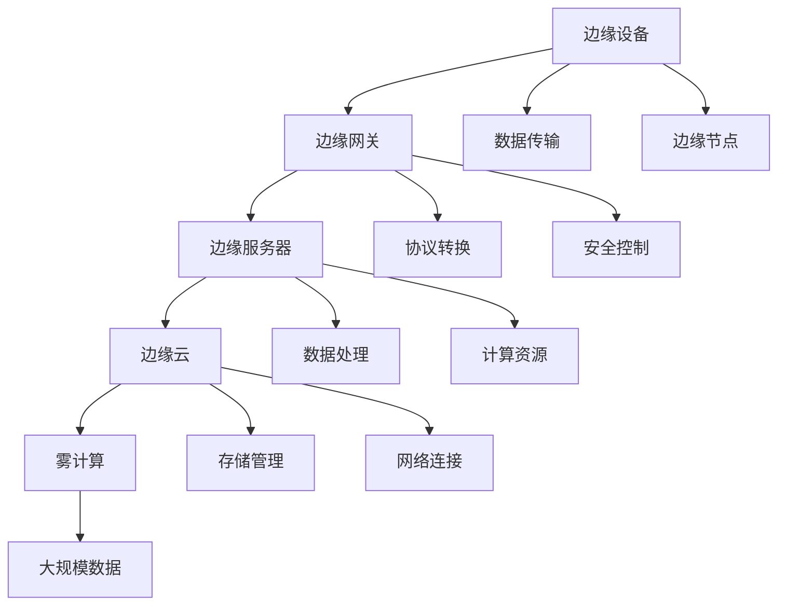

                 

### 《2024百度智能云边缘计算社招面试真题汇总及其解答》

#### 背景与重要性

边缘计算作为云计算、物联网和人工智能等技术的交汇点，正在逐渐成为信息技术领域的关键组成部分。百度智能云作为国内领先的云计算服务提供商，其边缘计算技术在智能交通、工业互联网、物联网等多个领域取得了显著成果。随着边缘计算技术的不断成熟和应用的广泛推广，2024年百度智能云的社招面试中，边缘计算相关的问题将成为考察应聘者专业能力和实战经验的重要指标。

本文旨在为应聘者提供一份全面的《2024百度智能云边缘计算社招面试真题汇总及其解答》。通过对历年面试真题的汇总和分析，结合实际应用案例和技术原理的讲解，帮助应聘者深入了解边缘计算的核心概念、架构设计、应用场景和技术挑战。文章将以step-by-step的方式进行详细解读，使读者能够逐步掌握边缘计算的关键技术和应对面试的策略。

本文将分为三个主要部分：

1. **边缘计算基础**：介绍边缘计算的定义、架构、核心概念和发展趋势。
2. **边缘计算应用场景**：探讨边缘计算在物联网、智能交通和工业互联网等领域的具体应用。
3. **面试真题详解**：解析边缘计算相关的面试真题，提供解答思路和实战经验。

通过本文的学习，读者不仅能加深对边缘计算技术的理解，还能为即将到来的面试做好充分的准备。

#### 边缘计算基础

边缘计算是一种将数据处理、存储和分析任务从中心服务器转移到网络边缘的分布式计算模式。这种模式的出现，主要是为了解决云计算在处理大量数据时存在的延迟、带宽和安全性问题。边缘计算的核心思想是将计算任务分散到网络的边缘节点，如路由器、交换机、服务器等，从而实现数据的快速处理和分析，提升系统的响应速度和效率。

##### 边缘计算的定义与价值

边缘计算的定义可以从以下几个方面来理解：

- **地理位置**：边缘计算发生在网络的边缘，即靠近数据源的位置，而不是在中心服务器或云数据中心。
- **数据处理**：边缘计算的主要目的是在数据产生的源头进行初步处理，以减少传输到中心服务器的数据量。
- **分布式架构**：边缘计算采用分布式架构，将计算任务分散到多个边缘节点，提高系统的可靠性和可扩展性。
- **实时性**：边缘计算能够提供低延迟、高带宽的实时数据处理能力，满足实时性要求高的应用场景。

边缘计算的价值主要体现在以下几个方面：

1. **降低延迟**：通过在数据产生的地方进行数据处理，边缘计算能够显著降低数据传输的延迟，满足实时性要求高的应用需求。
2. **节省带宽**：边缘计算可以在本地处理大量数据，减少需要传输到中心服务器的数据量，从而节省带宽资源。
3. **提高安全性**：边缘计算能够将敏感数据保留在本地，减少数据在传输过程中的安全风险。
4. **增强可扩展性**：边缘计算采用分布式架构，可以根据需求灵活扩展计算资源，提高系统的可扩展性。

##### 边缘计算的架构与分类

边缘计算的架构可以分为多个层次，包括边缘设备、边缘网关、边缘服务器和边缘云。每个层次在计算、存储和网络方面都扮演着不同的角色。

1. **边缘设备**：边缘设备是指最靠近数据源的设备，如传感器、智能手表、智能手机等。这些设备可以收集、处理和传输数据到边缘网关或边缘服务器。

2. **边缘网关**：边缘网关位于边缘设备和边缘服务器之间，负责数据传输、协议转换和安全控制。边缘网关通常具备处理大量并发连接和数据流的能力。

3. **边缘服务器**：边缘服务器位于网络边缘，负责存储、处理和转发数据。与中心服务器相比，边缘服务器通常具备更高的性能和更低的延迟。

4. **边缘云**：边缘云是一种分布式云计算架构，将云计算服务扩展到网络边缘。边缘云可以提供计算、存储、网络和安全等基础设施服务，支持大规模的分布式应用。

边缘计算可以按照不同的分类方式进行划分：

1. **按功能划分**：边缘计算可以按照功能划分为数据处理、存储、分析、安全等不同类别。例如，数据处理边缘计算主要负责数据的初步处理和清洗，存储边缘计算则负责数据的高效存储和管理。

2. **按层次划分**：边缘计算可以按照层次划分为设备级边缘计算、网络级边缘计算和平台级边缘计算。设备级边缘计算主要在边缘设备上进行，网络级边缘计算在网络节点上进行，而平台级边缘计算则在网络边缘的数据中心进行。

3. **按应用场景划分**：边缘计算可以按照应用场景划分为物联网边缘计算、智能交通边缘计算、工业互联网边缘计算等。不同应用场景对边缘计算的需求和实现方式各不相同。

##### 边缘计算的发展历程与趋势

边缘计算的概念最早可以追溯到2000年代初期，当时主要是为了解决无线传感器网络中的数据处理问题。随着物联网、云计算和人工智能等技术的快速发展，边缘计算逐渐成为一个独立的研究方向和应用领域。

1. **发展历程**：

   - **2000年代初期**：边缘计算的概念被提出，主要应用于无线传感器网络中的数据处理。
   - **2010年代中期**：随着物联网和移动互联网的普及，边缘计算开始应用于智能家居、智能城市等领域。
   - **2015年后**：随着云计算和人工智能技术的成熟，边缘计算逐渐成为云计算架构的重要组成部分。
   - **2020年代**：边缘计算的应用场景越来越广泛，包括智能交通、工业互联网、医疗健康等。

2. **趋势**：

   - **智能化**：边缘计算将越来越智能化，借助人工智能技术实现更高效的数据处理和分析。
   - **分布式**：边缘计算将继续向分布式方向发展，通过分布式架构提高系统的可靠性和可扩展性。
   - **安全化**：边缘计算将越来越重视安全性，采用各种安全技术和机制保障数据的安全传输和存储。
   - **融合化**：边缘计算将与云计算、物联网、人工智能等技术进一步融合，形成更加综合的智能化系统。

##### 边缘计算的核心概念与架构

为了更好地理解边缘计算，我们需要介绍一些核心概念和架构设计。

1. **核心概念**：

   - **边缘节点**：边缘节点是边缘计算架构中的基本计算单元，可以是边缘设备、边缘网关或边缘服务器。
   - **边缘网关**：边缘网关是边缘节点之间的连接点，负责数据传输、协议转换和安全控制。
   - **边缘云**：边缘云是分布式云计算架构在网络边缘的延伸，提供计算、存储、网络和安全等基础设施服务。
   - **雾计算**：雾计算是介于云计算和边缘计算之间的一种计算模式，主要负责处理大规模分布式数据。

2. **架构设计**：

   - **分布式架构**：边缘计算采用分布式架构，将计算任务分散到多个边缘节点，提高系统的可靠性和可扩展性。
   - **分层架构**：边缘计算架构可以分为多个层次，包括设备级边缘计算、网络级边缘计算和平台级边缘计算。
   - **混合架构**：边缘计算可以与云计算、物联网、人工智能等技术融合，形成更加综合的智能化系统。

以下是边缘计算架构的Mermaid流程图：

##### 边缘计算与云计算的关系

边缘计算与云计算是相辅相成的两种计算模式。云计算主要负责大规模数据处理、存储和计算任务，而边缘计算则专注于在数据产生的地方进行实时数据处理和分析。

1. **优势互补**：

   - **云计算**：云计算具有强大的计算能力、存储能力和灵活性，适用于处理大规模数据和高复杂度的计算任务。
   - **边缘计算**：边缘计算具有低延迟、高带宽和安全性优势，适用于实时性要求高、数据处理需求大的应用场景。

2. **协同工作**：

   - **数据分发**：边缘计算可以将部分数据处理任务分发到边缘节点，减轻云计算中心服务器的压力。
   - **资源共享**：边缘计算和云计算可以共享计算资源，提高整个系统的资源利用率。
   - **负载均衡**：通过边缘计算和云计算的协同工作，可以实现负载均衡，提高系统的稳定性和可靠性。

##### 边缘计算的关键技术

边缘计算的成功离不开多种关键技术的支持，包括网络通信技术、数据处理技术、存储技术和安全隐私保护技术。

1. **网络通信技术**：

   - **无线通信**：包括Wi-Fi、5G、LoRa等无线通信技术，用于实现边缘设备之间的数据传输。
   - **有线通信**：包括以太网、光纤等有线通信技术，用于实现边缘节点与中心服务器之间的数据传输。
   - **边缘网关**：边缘网关是边缘节点与云计算中心之间的连接点，负责数据传输、协议转换和安全控制。

2. **数据处理技术**：

   - **数据采集与预处理**：边缘计算需要收集和处理大量的数据，包括传感器数据、图像数据、文本数据等。
   - **实时数据处理**：边缘计算需要实现实时数据处理，以满足低延迟的应用需求。
   - **分布式计算**：边缘计算采用分布式计算架构，将计算任务分散到多个边缘节点，提高系统的计算效率。

3. **存储技术**：

   - **本地存储**：边缘设备通常采用本地存储技术，如闪存、固态硬盘等，用于存储临时数据和日志。
   - **分布式存储**：边缘服务器和边缘云采用分布式存储架构，提高数据的可靠性和可扩展性。
   - **边缘缓存**：边缘缓存技术用于在边缘节点缓存热点数据，减少数据访问延迟。

4. **安全隐私保护技术**：

   - **加密技术**：包括对称加密、非对称加密、哈希加密等，用于保障数据在传输和存储过程中的安全性。
   - **访问控制**：通过访问控制机制，限制对数据的访问权限，防止数据泄露和篡改。
   - **隐私保护**：采用隐私保护技术，如差分隐私、同态加密等，保障用户隐私。

#### 智能云边缘计算核心概念

智能云边缘计算是边缘计算的一种高级形式，它将人工智能技术与边缘计算相结合，实现数据在边缘节点的实时分析和智能处理。智能云边缘计算的核心概念包括边缘智能、边缘智能云平台、边缘智能应用等。

##### 边缘智能

边缘智能是指通过在边缘节点部署智能算法和模型，实现数据的实时分析和处理能力。边缘智能的核心思想是将数据处理和分析任务从中心服务器转移到边缘节点，从而提高系统的响应速度和效率。

边缘智能的特点包括：

1. **实时性**：边缘智能能够在边缘节点实时处理和分析数据，满足低延迟的应用需求。
2. **灵活性**：边缘智能可以根据不同应用场景和需求，灵活部署和调整智能算法和模型。
3. **分布式**：边缘智能采用分布式架构，将智能计算任务分散到多个边缘节点，提高系统的可靠性和可扩展性。

##### 边缘智能云平台

边缘智能云平台是智能云边缘计算的核心基础设施，它负责管理和调度边缘节点的计算资源，提供统一的开发环境和工具，支持边缘智能应用的快速开发和部署。

边缘智能云平台的主要功能包括：

1. **资源管理**：边缘智能云平台负责管理和调度边缘节点的计算、存储和网络资源，实现资源的优化利用。
2. **开发环境**：边缘智能云平台提供统一的开发环境，支持开发者快速开发和调试边缘智能应用。
3. **工具链**：边缘智能云平台提供丰富的工具链，包括数据采集、数据预处理、模型训练、模型部署等，帮助开发者实现边缘智能应用的全流程开发。
4. **监控与运维**：边缘智能云平台提供实时监控和运维功能，帮助管理员监控边缘节点的运行状态，确保系统的稳定性和可靠性。

##### 边缘智能应用

边缘智能应用是智能云边缘计算的实际应用场景，它将边缘计算和人工智能技术相结合，解决实际业务问题和挑战。

常见的边缘智能应用包括：

1. **智能监控**：通过在边缘节点部署视频分析算法，实现对视频数据的实时监控和分析，如人脸识别、行为识别等。
2. **智能交通**：通过在交通节点部署智能算法，实现对交通数据的实时分析和处理，如路况预测、交通信号控制等。
3. **智能工业**：通过在工业设备上部署智能算法，实现对设备数据的实时监控和分析，如设备故障预测、生产过程优化等。
4. **智能医疗**：通过在医疗设备上部署智能算法，实现对医疗数据的实时分析和处理，如疾病诊断、医疗辅助等。

#### 边缘计算在物联网中的应用

物联网（Internet of Things，IoT）是边缘计算的重要应用领域之一。物联网通过将各种物理设备连接到互联网，实现设备的智能化和网络化。边缘计算在物联网中的应用，可以有效地提升物联网系统的响应速度、降低延迟、提高系统效率，并增强数据的安全性和隐私保护。

##### 物联网边缘计算的需求与挑战

物联网边缘计算的需求主要来源于以下几个方面：

1. **数据量巨大**：物联网设备产生的数据量非常庞大，尤其是图像、音频和视频数据，这要求边缘计算能够在本地高效处理这些数据。
2. **实时性要求高**：许多物联网应用场景需要实时响应，如智能交通信号控制、工业设备监控等，这对边缘计算的实时性提出了严格要求。
3. **带宽限制**：物联网设备通常连接的带宽较低，尤其是远程地区的设备，这要求边缘计算能够在低带宽环境下高效运行。
4. **安全性**：物联网设备经常暴露在网络中，容易成为攻击目标，边缘计算需要在数据处理过程中保障数据的安全性和隐私。

物联网边缘计算面临的挑战主要包括：

1. **计算资源有限**：物联网设备通常体积较小，计算资源有限，如何在有限的计算资源下实现高效的数据处理和分析，是一个重要的挑战。
2. **网络不稳定**：物联网设备通常连接的无线网络不稳定，边缘计算需要具备良好的容错能力和网络适应性。
3. **数据多样性**：物联网设备产生的数据类型多样，包括传感器数据、文本数据、图像数据等，如何处理和整合这些不同类型的数据，是一个挑战。

##### 物联网边缘计算的解决方案

为了应对物联网边缘计算的需求与挑战，需要采取一系列的解决方案：

1. **分布式计算架构**：采用分布式计算架构，将计算任务分散到多个边缘节点，提高系统的可靠性和可扩展性。通过边缘网关和边缘服务器的协同工作，实现数据的实时处理和分析。
2. **轻量级智能算法**：在边缘节点部署轻量级的智能算法和模型，如卷积神经网络（CNN）、循环神经网络（RNN）等，实现数据的实时分析和预测。这些算法和模型需要经过优化，以适应边缘节点的有限计算资源。
3. **边缘缓存技术**：采用边缘缓存技术，将热点数据缓存到边缘节点，减少数据访问的延迟。通过缓存技术，可以实现快速响应，提高系统的实时性。
4. **安全隐私保护机制**：在边缘计算过程中，采用加密、访问控制、差分隐私等安全隐私保护机制，保障数据的安全性和隐私。通过安全隐私保护机制，可以防止数据泄露和篡改，增强物联网系统的安全性。

##### 物联网边缘计算的实际案例

以下是一些物联网边缘计算的实际案例，展示了边缘计算在物联网领域的广泛应用：

1. **智能交通**：在智能交通领域，边缘计算可以实现对交通数据的实时监控和分析。通过在交通节点部署边缘计算设备，可以实现实时路况监测、交通流量预测和信号控制优化。例如，百度智能云的边缘计算平台在北京智能交通项目中，通过在路口安装边缘计算设备，实现了交通信号灯的实时控制和优化，提高了交通效率和安全性。
2. **智能工厂**：在智能工厂中，边缘计算可以实现对生产设备的实时监控和故障预测。通过在设备上部署边缘计算设备，可以实时采集设备运行数据，并使用机器学习算法进行故障预测和设备维护。例如，西门子的边缘计算平台在智能制造中，通过部署边缘计算设备，实现了设备状态监测、故障预测和生产效率优化，提高了生产线的稳定性和效率。
3. **智能医疗**：在智能医疗领域，边缘计算可以实现对医疗设备的实时监控和数据分析。通过在医疗设备上部署边缘计算设备，可以实现实时监测病人的生命体征，并提供紧急医疗救援。例如，飞利浦的边缘计算平台在医疗领域，通过在医疗设备上部署边缘计算设备，实现了实时监测病人生命体征、疾病预测和远程诊断，提高了医疗服务的质量和效率。

#### 边缘计算在智能交通中的应用

智能交通系统（Intelligent Transportation Systems，ITS）是边缘计算的一个重要应用领域。随着城市化进程的加快和车辆数量的急剧增加，传统的集中式交通管理系统已无法满足实时性、高效性和安全性的要求。边缘计算通过在交通网络边缘部署计算节点，实现了对交通数据的实时处理和分析，从而提升了交通管理的智能化水平。

##### 智能交通边缘计算的需求与挑战

智能交通系统对边缘计算的需求主要表现在以下几个方面：

1. **实时性**：智能交通系统需要实时获取和处理交通数据，如交通流量、路况信息、车辆位置等，以便及时做出交通调控决策。
2. **大数据处理**：智能交通系统产生的数据量庞大，包括车辆传感器数据、摄像头捕捉的图像、交通信号灯状态等，边缘计算需要在这些数据中提取有用信息，并快速做出反应。
3. **低延迟**：在智能交通场景中，尤其是交通信号控制、紧急事件响应等，对延迟要求非常高，边缘计算能够减少数据传输的延迟，提高系统的响应速度。
4. **数据安全**：智能交通系统涉及到大量敏感数据，如个人隐私信息、车辆位置等，边缘计算需要在数据传输和处理过程中确保数据的安全性。

智能交通边缘计算面临的挑战主要包括：

1. **计算资源有限**：边缘设备如路侧单元（RSU）、智能摄像头等，通常计算能力和存储空间有限，如何在有限的资源下高效处理大量数据，是一个重要挑战。
2. **网络不稳定**：智能交通系统中的设备通常连接的是无线网络，网络信号不稳定，边缘计算需要具备良好的网络适应性。
3. **数据多样性**：智能交通系统产生的数据类型多样，包括文本、图像、传感器数据等，如何有效地处理和整合这些数据，是一个技术难题。
4. **隐私保护**：在处理交通数据时，需要保护驾驶员的隐私，防止数据泄露，边缘计算需要在数据采集、传输和处理过程中实施严格的隐私保护措施。

##### 智能交通边缘计算的解决方案

为了应对智能交通边缘计算的需求与挑战，可以采取以下解决方案：

1. **分布式计算架构**：采用分布式计算架构，将交通数据分散到多个边缘节点处理，提高系统的计算能力和响应速度。通过边缘网关和边缘服务器的协同工作，实现数据的实时处理和分析。
2. **轻量级算法和模型**：在边缘节点部署轻量级的机器学习算法和深度学习模型，如卷积神经网络（CNN）、循环神经网络（RNN）等，实现数据的实时分析和预测。这些算法和模型需要经过优化，以适应边缘节点的有限计算资源。
3. **边缘缓存技术**：采用边缘缓存技术，将热点数据缓存到边缘节点，减少数据访问的延迟。通过缓存技术，可以实现快速响应，提高系统的实时性。
4. **安全隐私保护机制**：在边缘计算过程中，采用加密、访问控制、差分隐私等安全隐私保护机制，保障数据的安全性和隐私。通过安全隐私保护机制，可以防止数据泄露和篡改，增强智能交通系统的安全性。

##### 智能交通边缘计算的实际案例

以下是一些智能交通边缘计算的实际案例，展示了边缘计算在智能交通领域的广泛应用：

1. **智能信号控制**：在智能交通信号控制中，边缘计算可以实现对交通流量的实时监控和分析，根据实时数据调整交通信号灯的时长，提高道路通行效率。例如，百度智能云的边缘计算平台在北京市的智能交通项目中，通过在交通路口部署边缘计算设备，实现了交通信号灯的实时优化，减少了交通拥堵，提高了道路通行效率。
2. **车辆监控与管理**：边缘计算可以实现对车辆状态的实时监控，如速度、位置、故障等，通过边缘节点收集的数据，实现对车辆的远程管理和维护。例如，华为的边缘计算平台在上海市的智能交通项目中，通过在车辆上部署边缘计算设备，实现了车辆的实时监控和故障预测，提高了车辆运行的安全性和可靠性。
3. **路况预测与导航**：边缘计算可以结合实时交通数据和历史交通数据，对路况进行预测，并提供智能导航服务。例如，高德地图利用边缘计算技术，通过对实时交通数据的分析，实现了路况预测和智能导航，帮助驾驶者选择最优路线，减少了行车时间。

#### 边缘计算在工业互联网中的应用

工业互联网（Industrial Internet）是边缘计算的另一个重要应用领域。它通过将传感器、设备、软件和云技术相结合，实现了工业生产的智能化和数字化。边缘计算在工业互联网中的应用，可以显著提升生产效率、降低成本、提高产品质量，并增强系统的安全性和可靠性。

##### 工业互联网边缘计算的需求与挑战

工业互联网边缘计算的需求主要表现在以下几个方面：

1. **实时监控与数据分析**：工业生产过程中的数据量庞大，边缘计算可以在生产现场实时收集和分析数据，为生产优化提供支持。
2. **高可靠性**：工业生产环境通常要求系统具备高可靠性，边缘计算能够实现本地数据的处理和存储，降低对中心服务器的依赖，提高系统的稳定性。
3. **数据处理能力**：工业生产过程中的数据类型多样，包括传感器数据、图像数据、文本数据等，边缘计算需要具备强大的数据处理能力。
4. **网络安全**：工业控制系统往往涉及到敏感数据，边缘计算需要确保数据的安全性和隐私保护，防止数据泄露和恶意攻击。

工业互联网边缘计算面临的挑战主要包括：

1. **计算资源有限**：工业设备通常体积较小，计算资源有限，如何在有限的计算资源下实现高效的数据处理和分析，是一个重要挑战。
2. **数据多样性**：工业生产过程中产生的数据类型多样，如何处理和整合这些不同类型的数据，是一个技术难题。
3. **网络不稳定**：工业设备通常连接的无线网络不稳定，边缘计算需要具备良好的网络适应性。
4. **安全性**：工业控制系统涉及到敏感数据，边缘计算需要在数据采集、传输和处理过程中确保数据的安全性和隐私。

##### 工业互联网边缘计算的解决方案

为了应对工业互联网边缘计算的需求与挑战，可以采取以下解决方案：

1. **分布式计算架构**：采用分布式计算架构，将工业数据分散到多个边缘节点处理，提高系统的计算能力和响应速度。通过边缘网关和边缘服务器的协同工作，实现数据的实时处理和分析。
2. **边缘智能算法**：在边缘节点部署边缘智能算法和模型，如机器学习算法、深度学习模型等，实现数据的实时分析和预测。这些算法和模型需要经过优化，以适应边缘节点的有限计算资源。
3. **边缘缓存技术**：采用边缘缓存技术，将热点数据缓存到边缘节点，减少数据访问的延迟。通过缓存技术，可以实现快速响应，提高系统的实时性。
4. **安全隐私保护机制**：在边缘计算过程中，采用加密、访问控制、差分隐私等安全隐私保护机制，保障数据的安全性和隐私。通过安全隐私保护机制，可以防止数据泄露和篡改，增强工业互联网系统的安全性。

##### 工业互联网边缘计算的实际案例

以下是一些工业互联网边缘计算的实际案例，展示了边缘计算在工业互联网领域的广泛应用：

1. **智能生产监控**：在智能生产监控中，边缘计算可以实现对生产设备的实时监控和数据分析，及时发现设备故障和异常情况。例如，西门子的边缘计算平台在一家汽车制造工厂中，通过在生产线部署边缘计算设备，实现了生产设备的实时监控和故障预测，提高了生产线的稳定性和效率。
2. **远程设备维护**：边缘计算可以实现对远程设备的实时监控和维护，通过边缘节点收集的数据，实现对设备的远程诊断和故障修复。例如，通用电气的边缘计算平台在一家电力公司中，通过在电力设备上部署边缘计算设备，实现了设备的实时监控和远程维护，提高了电力系统的可靠性和运行效率。
3. **智能仓储管理**：边缘计算可以实现对仓储设备的实时监控和管理，通过边缘节点收集的数据，实现对仓储货物的智能调度和管理。例如，亚马逊的边缘计算平台在其物流仓库中，通过在仓储设备上部署边缘计算设备，实现了仓储货物的实时监控和智能调度，提高了仓储管理的效率和准确性。

#### 面试真题详解

在边缘计算领域的面试中，应聘者常常会遇到各种类型的面试题，从基础知识到实际应用，再到架构设计和算法实现，都需要有所准备。本章节将详细解析一些典型的面试真题，并提供解题思路和答案。

##### 6.1 边缘计算基础知识

1. **什么是边缘计算？**
   - **解答**：边缘计算是一种分布式计算模式，它将数据处理、存储和分析等任务从传统的中心服务器或云数据中心转移到网络的边缘节点，如路由器、交换机、网关和智能设备等。这样做的目的是为了提高数据处理的效率、减少网络拥塞、降低延迟，并增强系统的实时性和安全性。

2. **边缘计算与云计算有什么区别？**
   - **解答**：云计算是在远程数据中心进行数据处理和存储，而边缘计算是在网络的边缘，即接近数据源的设备上执行数据处理。云计算具有强大的计算和存储能力，但通常存在延迟问题；边缘计算则具有低延迟、高带宽的特点，但计算资源和存储能力相对有限。

3. **边缘计算的关键技术有哪些？**
   - **解答**：边缘计算的关键技术包括：
     - **网络通信技术**：如5G、Wi-Fi、LoRa等，用于实现边缘节点之间的数据传输。
     - **数据处理技术**：包括数据预处理、实时数据处理和分布式计算等。
     - **存储技术**：如本地存储、分布式存储和缓存技术等。
     - **安全隐私保护技术**：包括数据加密、访问控制和隐私保护机制等。

##### 6.2 边缘计算架构与实现

1. **什么是边缘计算架构？**
   - **解答**：边缘计算架构是一种分布式计算架构，它由多个边缘节点（如传感器、智能设备、边缘网关等）组成。这些节点协同工作，共同处理数据，提供计算、存储、网络等服务。边缘计算架构通常包括设备层、网络层和应用层，每一层都有其特定的功能。

2. **边缘计算架构的设计原则是什么？**
   - **解答**：边缘计算架构的设计原则包括：
     - **低延迟**：设计时要考虑减少数据传输和处理的时间，满足实时应用的需求。
     - **高可靠性**：确保系统在面临网络不稳定、设备故障等情况下仍能正常运行。
     - **可扩展性**：设计时要考虑系统的可扩展性，以便在业务规模扩大时能够轻松扩展。
     - **安全性**：保障数据的安全传输和存储，防止数据泄露和未经授权的访问。

3. **边缘计算架构有哪些常见模式？**
   - **解答**：边缘计算架构的常见模式包括：
     - **设备级边缘计算**：在设备本地执行数据处理和存储。
     - **网络级边缘计算**：在网络节点（如路由器、交换机）上执行数据处理。
     - **平台级边缘计算**：在边缘服务器或边缘云上执行数据处理。
     - **雾计算**：介于云计算和边缘计算之间，主要负责处理大规模分布式数据。

##### 6.3 边缘计算应用场景

1. **边缘计算在物联网中的应用有哪些？**
   - **解答**：边缘计算在物联网中的应用包括：
     - **智能设备监控**：通过边缘计算实现实时监控，如智能家居、智能工厂等。
     - **数据预处理**：在边缘节点对物联网设备收集的数据进行预处理，减少数据传输量。
     - **实时分析**：在边缘节点执行实时数据分析和决策，如智能交通信号控制。
     - **隐私保护**：在边缘节点处理数据，减少数据传输过程中的隐私风险。

2. **边缘计算在智能交通中的应用有哪些？**
   - **解答**：边缘计算在智能交通中的应用包括：
     - **实时路况监测**：通过边缘计算实时分析交通流量，提供实时路况信息。
     - **智能信号控制**：在路口部署边缘计算设备，根据实时交通情况调整信号灯时长。
     - **车辆监控**：通过边缘计算监控车辆状态，进行故障预测和驾驶行为分析。
     - **应急响应**：在紧急情况下，边缘计算能够迅速做出反应，提供应急服务。

3. **边缘计算在工业互联网中的应用有哪些？**
   - **解答**：边缘计算在工业互联网中的应用包括：
     - **生产监控**：通过边缘计算实时监控生产线设备状态，实现故障预测和生产优化。
     - **设备维护**：利用边缘计算进行设备故障诊断，实现远程维护和预测性维护。
     - **数据采集与处理**：在设备边缘进行数据采集和处理，减少对中心服务器的依赖。
     - **质量控制**：通过边缘计算分析产品质量数据，实现实时质量监控和优化。

##### 6.4 边缘计算技术与挑战

1. **边缘计算技术有哪些挑战？**
   - **解答**：边缘计算技术面临的挑战包括：
     - **计算资源限制**：边缘设备通常计算资源有限，如何高效利用这些资源是一个挑战。
     - **网络不稳定**：边缘设备通常连接的是无线网络，网络信号不稳定，如何保证数据传输的可靠性是一个挑战。
     - **数据隐私保护**：边缘计算需要处理大量敏感数据，如何保护数据隐私是一个重要挑战。
     - **安全防护**：边缘设备容易成为网络攻击的目标，如何确保系统的安全性是一个挑战。

2. **如何解决边缘计算中的资源受限问题？**
   - **解答**：解决边缘计算中资源受限问题的方法包括：
     - **算法优化**：优化算法以减少计算和存储需求。
     - **分布式计算**：将计算任务分配到多个边缘节点，提高资源利用率。
     - **缓存技术**：利用边缘缓存技术减少数据访问次数，降低计算需求。
     - **资源调度**：通过资源调度策略，合理分配和利用边缘节点的计算资源。

3. **如何确保边缘计算的安全性？**
   - **解答**：确保边缘计算安全性的方法包括：
     - **加密技术**：采用数据加密技术保护数据在传输和存储过程中的安全性。
     - **访问控制**：通过访问控制机制限制对数据和系统的访问，防止未授权访问。
     - **安全监控**：部署安全监控系统，实时监控边缘节点的安全状态，及时发现和处理安全事件。
     - **隐私保护**：采用隐私保护技术，如差分隐私和同态加密，保护用户隐私。

#### 7.1 真题案例与实战解析

以下是一些面试真题案例及其实战解析：

1. **面试真题**：设计一个边缘计算系统，用于实时监控城市交通流量。
   - **实战解析**：
     - **需求分析**：系统需要实时监控城市各个路口的交通流量，提供实时路况信息。
     - **系统架构**：采用分布式边缘计算架构，包括设备层、网络层和应用层。
       - **设备层**：在各个路口部署边缘计算设备，如智能摄像头和交通流量传感器。
       - **网络层**：通过无线网络（如Wi-Fi、5G）将数据传输到边缘网关。
       - **应用层**：在边缘网关上部署数据分析和管理应用，实现实时路况监测和信号控制优化。
     - **关键技术**：使用边缘缓存技术减少数据传输次数，使用轻量级算法（如卷积神经网络）进行实时图像处理。
     - **安全措施**：采用加密技术保护数据传输，部署防火墙和入侵检测系统确保系统安全。

2. **面试真题**：如何在边缘设备上实现实时故障预测？
   - **实战解析**：
     - **需求分析**：系统需要在边缘设备上实时监控设备的运行状态，预测潜在故障，并提前通知维护人员。
     - **系统架构**：采用边缘智能计算架构，包括数据采集、预处理、模型训练和预测。
       - **数据采集**：使用传感器实时采集设备运行数据。
       - **预处理**：在边缘设备上对数据进行初步处理，如去噪、归一化等。
       - **模型训练**：在边缘设备上训练故障预测模型，如使用循环神经网络（RNN）。
       - **预测与反馈**：实时预测设备故障，并将预测结果反馈给维护人员。
     - **关键技术**：采用分布式计算优化模型训练过程，使用边缘缓存技术提高数据访问速度。
     - **安全措施**：采用加密技术保护数据传输，确保模型训练过程中的数据隐私。

#### 7.2 面试题型与应对策略

以下是一些常见的面试题型及其应对策略：

1. **概念题**：
   - **题型特点**：考察对边缘计算基础概念的理解。
   - **应对策略**：熟悉边缘计算的基本概念、架构、应用场景和关键技术，能够清晰地解释每个概念的定义和作用。

2. **架构设计题**：
   - **题型特点**：考察对边缘计算架构的设计能力和分析能力。
   - **应对策略**：了解不同类型的边缘计算架构模式，能够根据实际需求设计合理的架构方案，并能够解释设计原则和关键组件的作用。

3. **案例分析题**：
   - **题型特点**：考察对边缘计算应用案例的分析和解决能力。
   - **应对策略**：熟悉边缘计算在不同领域的应用案例，能够分析案例中的问题，并提出解决方案。

4. **编程实现题**：
   - **题型特点**：考察编程能力和算法实现能力。
   - **应对策略**：熟悉常用的边缘计算编程框架和工具，能够使用伪代码或实际代码实现边缘计算算法和应用。

#### 7.3 面试实战经验分享

1. **准备充分**：在面试前，充分准备边缘计算相关的知识和案例，了解面试公司的业务和技术方向。

2. **实践经验**：在面试中展示自己在边缘计算领域的实践经验，如参与过的项目、实现的算法等。

3. **清晰表达**：在面试中保持清晰、简洁的表达，避免使用模糊的语言和概念。

4. **积极沟通**：与面试官保持良好的沟通，展示自己的思考过程和解决问题的能力。

5. **持续学习**：边缘计算是一个快速发展的领域，持续学习新技术、新趋势，提升自己的专业能力。

#### 附录A：面试真题汇总

以下是边缘计算领域常见的一些面试真题：

1. **什么是边缘计算？**
2. **边缘计算与云计算的区别是什么？**
3. **边缘计算的关键技术有哪些？**
4. **什么是边缘计算架构？**
5. **边缘计算架构的设计原则是什么？**
6. **边缘计算在物联网中的应用有哪些？**
7. **边缘计算在智能交通中的应用有哪些？**
8. **边缘计算在工业互联网中的应用有哪些？**
9. **边缘计算技术有哪些挑战？**
10. **如何解决边缘计算中的资源受限问题？**
11. **如何确保边缘计算的安全性？**
12. **请解释一下边缘计算中的缓存策略。**
13. **请解释一下边缘计算中的边缘网关的作用。**
14. **请解释一下边缘计算中的边缘服务器的作用。**
15. **请解释一下边缘计算中的边缘设备的作用。**
16. **设计一个边缘计算系统，用于实时监控城市交通流量。**
17. **如何在边缘设备上实现实时故障预测？**
18. **边缘计算在医疗健康领域的应用有哪些？**
19. **边缘计算在智能零售中的应用有哪些？**
20. **请解释边缘计算中的分布式计算与集中式计算的优缺点。**

#### 附录B：面试技巧与建议

1. **了解面试公司**：在面试前，了解面试公司的业务、技术方向和面试流程，有针对性地准备。

2. **提前准备**：提前准备边缘计算相关的基础知识、架构设计和实际应用案例。

3. **实践经验**：在面试中展示自己的实践经验，如参与过的项目、实现的算法等。

4. **清晰表达**：在面试中保持清晰、简洁的表达，避免使用模糊的语言和概念。

5. **积极沟通**：与面试官保持良好的沟通，展示自己的思考过程和解决问题的能力。

6. **持续学习**：边缘计算是一个快速发展的领域，持续学习新技术、新趋势，提升自己的专业能力。

#### 附录C：参考资料与拓展阅读

以下是关于边缘计算的一些参考资料与拓展阅读：

1. **书籍**：
   - 《边缘计算：原理、架构与应用》
   - 《智能边缘计算：技术、实践与趋势》
   - 《边缘计算与物联网》

2. **论文**：
   - "Edge Computing: Vision and Challenges"
   - "A Survey of Edge Computing: Architecture, Enabling Technologies, Security and Privacy, and Applications"
   - "Edge Computing for IoT: Architecture, Challenges, and Opportunities"

3. **网站和博客**：
   - IEEE Edge Computing Community
   - ACM Edge Computing Community
   - Edge AI Summit

4. **论坛和社群**：
   - CSDN边缘计算论坛
   - Stack Overflow边缘计算标签
   - LinkedIn边缘计算社群

通过以上附录，读者可以进一步了解边缘计算的最新动态和发展趋势，为自己的学习和面试提供更多的参考资料。

### 文章摘要

《2024百度智能云边缘计算社招面试真题汇总及其解答》旨在为应聘者提供全面的边缘计算面试指南。本文首先介绍了边缘计算的定义、架构、核心概念和发展趋势，并详细解析了边缘计算与云计算的关系以及关键技术的应用。随后，本文探讨了边缘计算在物联网、智能交通和工业互联网等领域的实际应用，并通过多个案例分析，展示了边缘计算在这些领域中的具体实现。最后，本文汇总了边缘计算领域的常见面试真题，并提供了详细的解题思路和实战解析，帮助应聘者做好面试准备。通过本文的学习，读者不仅能够加深对边缘计算技术的理解，还能提升自己的面试应对能力。

### 作者信息

作者：AI天才研究院/AI Genius Institute & 禅与计算机程序设计艺术 /Zen And The Art of Computer Programming

AI天才研究院（AI Genius Institute）致力于推动人工智能技术的创新与应用，为全球企业提供领先的AI解决方案。同时，作者还在《禅与计算机程序设计艺术》（Zen And The Art of Computer Programming）一书中，深入探讨了计算机编程的艺术和哲学，为读者提供了独特的编程思维和方法。通过本文，作者希望帮助读者更好地理解和应用边缘计算技术，为未来的技术挑战做好准备。

