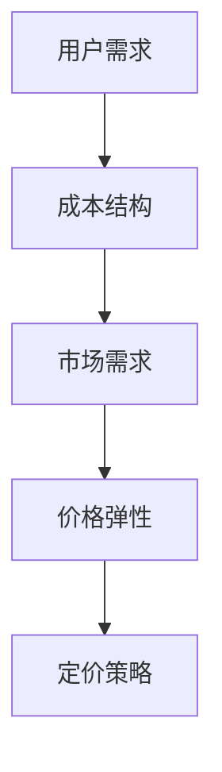
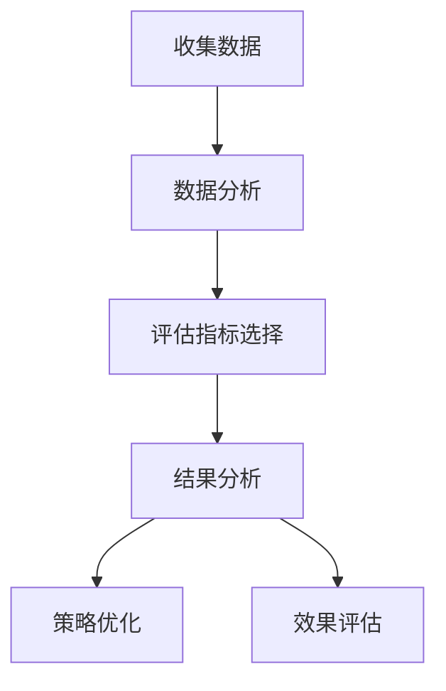
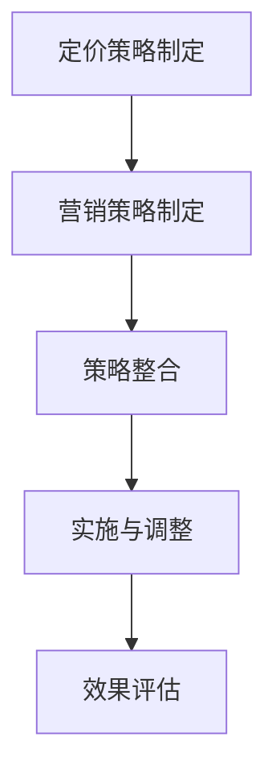
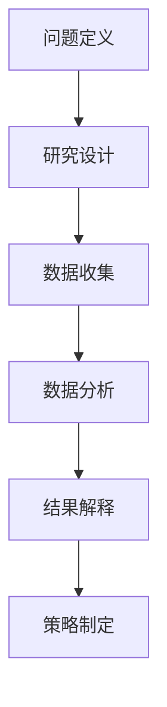

                 

# 《知识付费产品定价策略：程序员版》

## 关键词：
知识付费、定价策略、程序员、市场需求、成本结构、价格弹性

### 摘要：

本文旨在深入探讨知识付费产品在程序员领域的定价策略。通过对知识付费市场现状、程序员需求分析、定价策略理论基础、成本结构分析、市场需求与价格弹性分析以及实际案例分析等方面的详细讨论，本文揭示了程序员知识付费产品定价的关键要素和策略。文章结构紧凑、逻辑清晰，旨在帮助程序员和相关从业者在复杂多变的市场环境中制定出科学、合理、有效的定价策略，以实现知识付费产品的长期可持续发展。

## 目录大纲

### 第一部分：知识付费产品概述

#### 第1章：知识付费市场的现状与趋势

##### 1.1 知识付费市场的定义与背景
##### 1.2 知识付费产品的发展历程
##### 1.3 知识付费产品的类型与特点
##### 1.4 程序员在知识付费市场中的角色

#### 第2章：程序员知识付费产品市场分析

##### 2.1 程序员的需求分析
##### 2.2 竞争对手分析
##### 2.3 市场趋势预测

### 第二部分：程序员知识付费产品定价策略

#### 第3章：定价策略理论基础

##### 3.1 成本导向定价法
##### 3.2 市场导向定价法
##### 3.3 竞争导向定价法
##### 3.4 定价策略的选择原则

#### 第4章：成本结构分析

##### 4.1 直接成本与间接成本
##### 4.2 可变成本与固定成本
##### 4.3 成本估算方法

#### 第5章：市场需求与价格弹性分析

##### 5.1 需求曲线分析
##### 5.2 价格弹性概念与计算
##### 5.3 价格弹性对定价策略的影响

#### 第6章：定价策略制定与调整

##### 6.1 初期定价策略
##### 6.2 持续定价策略调整
##### 6.3 定价策略评估与优化

#### 第7章：定价策略案例分析

##### 7.1 案例一：某在线编程课程定价策略分析
##### 7.2 案例二：某编程技能培训课程定价策略分析
##### 7.3 案例三：某开发者工具定价策略分析

### 第三部分：程序员知识付费产品定价实践

#### 第8章：定价策略实施与营销

##### 8.1 定价策略实施流程
##### 8.2 定价策略与营销策略的整合
##### 8.3 定价策略效果评估与反馈

#### 第9章：案例分析与实践总结

##### 9.1 案例分析一：某编程社区定价策略实践
##### 9.2 案例分析二：某编程教育平台定价策略实践
##### 9.3 实践总结与经验分享

#### 第10章：未来发展趋势与展望

##### 10.1 技术变革对知识付费产品定价的影响
##### 10.2 行业竞争态势与定价策略调整
##### 10.3 程序员知识付费产品的未来趋势

## 附录

### 附录 A：知识付费产品定价策略工具与资源

##### A.1 主流定价策略工具介绍
##### A.2 知识付费产品定价策略研究文献推荐
##### A.3 程序员知识付费产品案例库

### 附录 B：知识付费产品定价策略常用数学模型

##### B.1 成本函数
##### B.2 需求函数
##### B.3 价格弹性函数

### 附录 C：知识付费产品定价策略案例分析数据库

##### C.1 案例库概述
##### C.2 案例选择标准
##### C.3 案例分析方法
##### C.4 案例库使用指南

### 附录 D：知识付费产品定价策略研究方法

##### D.1 定量研究方法
##### D.2 定性研究方法
##### D.3 混合研究方法
##### D.4 研究方法选择原则

### 附录 E：知识付费产品定价策略工具资源链接

##### E.1 在线定价工具
##### E.2 数据分析工具
##### E.3 学术研究资源链接

### 附录 F：知识付费产品定价策略常见问题解答

##### F.1 定价策略如何适应市场需求变化？
##### F.2 成本导向定价法是否适用于所有知识付费产品？
##### F.3 价格弹性在定价策略中有何作用？
##### F.4 如何平衡短期收益与长期发展？
##### F.5 竞争导向定价法的局限性是什么？
##### F.6 如何制定一个有效的定价策略？

### 图 G-1 知识付费产品定价策略核心概念联系图

### 图 G-2 定价策略评估与优化流程图

### 图 G-3 定价策略与营销策略整合流程图

### 图 G-4 知识付费产品定价策略研究方法流程图

### 第一部分：知识付费产品概述

#### 第1章：知识付费市场的现状与趋势

##### 1.1 知识付费市场的定义与背景

知识付费市场是指通过付费方式获取专业知识、技能、经验或信息的市场。随着互联网技术的发展和在线教育的兴起，知识付费市场逐渐成为一个重要的经济领域。知识付费产品的形式多样，包括在线课程、电子书、培训讲座、专业咨询等。这些产品通过满足用户的学习需求和知识获取愿望，为知识提供者创造了价值。

知识付费市场的发展可追溯到上世纪末互联网的普及。随着网络带宽和计算能力的提升，在线教育平台如雨后春笋般涌现。早期以传统教育机构为代表的在线教育，主要面向学生提供课程和教材。然而，随着用户需求的多样化，市场开始涌现出更多个性化、实用性的知识付费产品。

##### 1.2 知识付费产品的发展历程

知识付费产品的发展历程可以分为几个阶段：

1. **传统教育阶段的在线教育**：这一阶段以学历教育和学术课程为主，用户主要通过网络平台获取大学课程、学术讲座等资源。代表平台包括Coursera、edX等。

2. **技能培训阶段的兴起**：随着职业发展和技能提升的需求增加，技能培训类知识付费产品逐渐崭露头角。代表产品包括编程课程、设计培训、职业规划咨询等。

3. **个性化学习阶段的深化**：这一阶段强调根据用户需求提供个性化、定制化的学习服务。代表平台如得到、知乎Live等，通过直播、互动等形式为用户提供专业内容。

4. **知识共享与社区化发展的趋势**：近年来，知识共享社区和社群成为知识付费市场的重要组成部分。用户不仅获取知识，还可以通过互动和分享提升自己的知识水平。

##### 1.3 知识付费产品的类型与特点

知识付费产品按照内容类型可以分为以下几类：

1. **在线课程**：包括视频课程、音频课程、图文教程等，是最常见的一种知识付费产品。用户可以根据自己的需求和时间安排进行学习。

2. **电子书**：数字化书籍，通常以PDF、ePub等格式提供。电子书内容丰富，方便用户随时查阅。

3. **培训讲座**：线上或线下讲座，通常由行业专家或知名人士主讲，内容涵盖行业动态、专业知识等。

4. **专业咨询**：为用户提供个性化、专业化的咨询服务，如职业规划、技术指导等。

知识付费产品的特点主要包括：

- **内容专业化**：知识付费产品通常由行业专家或专业人士提供，内容具有较高的专业性和权威性。

- **形式多样化**：知识付费产品可以以多种形式呈现，如视频、音频、图文等，满足不同用户的学习偏好。

- **互动性**：一些知识付费产品提供互动环节，如在线问答、讨论区等，增强用户参与感和学习效果。

- **个性化**：通过用户数据分析，知识付费平台可以为用户提供定制化的学习内容，提升用户体验。

##### 1.4 程序员在知识付费市场中的角色

程序员在知识付费市场中扮演着重要角色。一方面，程序员是知识付费产品的主要消费者，他们通过付费获取编程技能、工具使用、项目经验等知识。另一方面，程序员也是知识付费产品的生产者，他们通过制作在线课程、编写电子书、提供技术咨询服务等方式，分享自己的知识和经验。

在知识付费市场中，程序员的需求主要包括：

- **技能提升**：程序员希望通过付费课程和学习资源提升自己的编程技能，如前端开发、后端开发、移动应用开发等。

- **工具掌握**：程序员需要了解和掌握各种开发工具和框架，如Git、Docker、Kubernetes等。

- **项目经验**：程序员希望通过实战项目积累经验，提升自己的项目开发能力。

- **职业规划**：程序员关注职业发展路径，希望获取职业规划咨询和指导。

### 第二部分：程序员知识付费产品市场分析

#### 第2章：程序员知识付费产品市场分析

##### 2.1 程序员的需求分析

程序员作为知识付费产品的重要消费者，其需求具有以下特点：

1. **技能提升需求**：程序员希望通过付费课程和学习资源提升自己的编程技能，包括基础技能（如编程语言、算法和数据结构）和高级技能（如云计算、大数据、人工智能等）。

2. **工具掌握需求**：程序员需要了解和掌握各种开发工具和框架，如Git、Docker、Kubernetes等。这些工具和框架是现代软件开发不可或缺的部分，程序员希望通过付费课程和资源快速掌握。

3. **项目经验需求**：程序员希望通过实战项目积累经验，提升自己的项目开发能力。通过参与真实项目，程序员可以了解项目的全流程，提高项目管理和团队协作能力。

4. **职业规划需求**：程序员关注职业发展路径，希望获取职业规划咨询和指导。他们希望通过付费咨询和课程了解行业动态、职业发展趋势以及如何提升自己的竞争力。

##### 2.2 竞争对手分析

在程序员知识付费市场中，主要竞争对手包括以下几类：

1. **传统在线教育平台**：如Coursera、edX等，提供广泛的在线课程，涵盖多个学科领域，包括编程课程。这些平台通常具有强大的品牌影响力和丰富的课程资源。

2. **专业技能培训平台**：如慕课网、极客时间等，专注于IT技能培训，提供丰富的编程课程和工具使用教程。这些平台通常具有深入的行业背景和专业的讲师团队。

3. **职业发展平台**：如领英、职业蛙等，提供职业规划咨询、招聘信息等，帮助程序员了解行业动态和职业发展路径。

4. **开源社区**：如GitHub、Stack Overflow等，程序员可以在这些社区中获取开源项目、技术问答等资源，虽然这些资源通常是免费的，但一些社区也提供付费会员服务。

##### 2.3 市场趋势预测

随着信息技术的发展，程序员知识付费市场呈现以下趋势：

1. **个性化学习需求增加**：随着人工智能和大数据技术的应用，知识付费平台将能更精准地了解用户需求，提供个性化的学习内容和推荐。

2. **技能多元化**：程序员不仅需要掌握传统的编程技能，还需要了解云计算、大数据、人工智能等新兴技术。知识付费产品将更加注重技能的多元化。

3. **实战项目重要性提升**：实战项目是程序员提升技能的重要途径。知识付费产品将更加注重实战项目的引入，帮助程序员积累实际经验。

4. **职业规划服务需求增加**：随着程序员对职业发展的关注，职业规划服务将成为知识付费市场的重要组成部分。

5. **线上线下一体化**：知识付费产品将逐渐实现线上线下一体化，提供更多互动和体验式学习机会，提升用户参与度和学习效果。

### 第三部分：程序员知识付费产品定价策略

#### 第3章：定价策略理论基础

##### 3.1 成本导向定价法

成本导向定价法是一种以产品成本为基础的定价方法。其主要原理是先确定产品的总成本，包括直接成本和间接成本，然后再加上一定的利润率来确定产品的销售价格。

**成本导向定价法的优点**：

1. **简单易行**：成本导向定价法计算简单，易于操作，适用于成本结构相对简单的知识付费产品。

2. **稳定收益**：通过成本导向定价法，企业可以确保在一定成本基础上获得稳定的收益。

**成本导向定价法的局限性**：

1. **忽视市场需求**：成本导向定价法主要考虑成本因素，而忽视了市场需求和竞争状况，可能导致定价过高或过低。

2. **利润空间有限**：在竞争激烈的市场环境中，成本导向定价法可能导致利润空间有限，难以实现长期可持续发展。

**成本导向定价法的公式**：

\[ P = \frac{C}{Q} + r \]

其中，\( P \) 是产品价格，\( C \) 是总成本，\( Q \) 是产品销售量，\( r \) 是利润率。

##### 3.2 市场导向定价法

市场导向定价法是一种以市场需求和竞争状况为基础的定价方法。其主要原理是先分析市场需求和竞争状况，然后根据市场需求和竞争状况来确定产品的销售价格。

**市场导向定价法的优点**：

1. **灵活应对市场变化**：市场导向定价法能够根据市场需求和竞争状况灵活调整价格，适应市场变化。

2. **提高市场份额**：通过市场导向定价法，企业可以吸引更多的消费者，提高市场份额。

**市场导向定价法的局限性**：

1. **市场研究成本高**：市场导向定价法需要对市场需求和竞争状况进行深入研究，这可能需要较高的市场研究成本。

2. **价格波动大**：市场导向定价法可能导致价格波动较大，对企业运营稳定性造成一定影响。

**市场导向定价法的公式**：

\[ P = MC + \frac{1}{e} \times (Q - Q_0) \]

其中，\( P \) 是产品价格，\( MC \) 是边际成本，\( e \) 是市场需求价格弹性，\( Q \) 是产品销售量，\( Q_0 \) 是市场需求量。

##### 3.3 竞争导向定价法

竞争导向定价法是一种以竞争对手价格为基础的定价方法。其主要原理是先分析竞争对手的价格策略，然后根据竞争对手的价格来确定自己的产品价格。

**竞争导向定价法的优点**：

1. **稳定价格**：竞争导向定价法可以保持价格的相对稳定，避免价格波动过大。

2. **提高竞争力**：通过竞争导向定价法，企业可以更准确地了解竞争对手的价格策略，调整自己的价格策略，提高市场竞争力。

**竞争导向定价法的局限性**：

1. **忽视市场需求**：竞争导向定价法主要考虑竞争对手的价格，而忽视了市场需求和消费者的支付意愿，可能导致定价过高或过低。

2. **价格战风险**：在竞争激烈的市场环境中，竞争导向定价法可能导致价格战，影响企业利润。

**竞争导向定价法的公式**：

\[ P = C + \delta \times \left(\frac{P_{competitor}}{P} - 1\right) \]

其中，\( P \) 是产品价格，\( C \) 是成本，\( \delta \) 是竞争力系数，\( P_{competitor} \) 是竞争对手的产品价格。

##### 3.4 定价策略的选择原则

在制定定价策略时，企业需要考虑以下选择原则：

1. **市场环境分析**：分析市场需求、竞争状况、消费者支付意愿等因素，确定定价策略的适用性。

2. **成本结构分析**：分析产品成本结构，包括直接成本和间接成本、可变成本和固定成本等，为定价提供数据支持。

3. **用户需求分析**：了解用户需求，包括用户对产品的期望价值、支付能力等，为定价策略提供依据。

4. **竞争态势分析**：分析竞争对手的价格策略和市场表现，为定价策略提供参考。

5. **定价策略适应性**：考虑定价策略的灵活性和适应性，确保企业能够在市场变化中及时调整定价策略。

### 第4章：成本结构分析

##### 4.1 直接成本与间接成本

直接成本和间接成本是构成产品成本的两个重要部分。

**直接成本**：直接成本是指直接与产品生产和销售相关的成本。这些成本可以直接归属于产品，如原材料成本、人工成本、生产设备折旧等。

**间接成本**：间接成本是指不直接与产品生产和销售相关，但为生产和销售提供支持的成本。这些成本通常无法直接归属于产品，如管理费用、营销费用、研发费用等。

**直接成本与间接成本的区分**：

1. **直接成本**：直接成本通常容易区分，如生产一件商品所需的原材料和直接人工费用。

2. **间接成本**：间接成本的区分相对复杂，需要根据企业的具体情况进行分析。例如，销售人员的薪酬可能被认为是直接成本，因为他们的工作直接与销售相关；而销售经理的薪酬可能被认为是间接成本，因为他们的工作更多是管理支持。

**直接成本与间接成本的关系**：

直接成本和间接成本共同构成了产品的总成本。直接成本直接影响产品的生产成本，而间接成本则通过管理费用等间接影响产品的总成本。

##### 4.2 可变成本与固定成本

可变成本和固定成本是成本结构中的两个重要概念。

**可变成本**：可变成本是指随产品产量或销售量变化而变化的成本。这些成本直接与产品的生产和销售量相关，如原材料成本、直接人工成本等。

**固定成本**：固定成本是指不随产品产量或销售量变化而变化的成本。这些成本在一定时期内相对稳定，如生产设备折旧、管理费用等。

**可变成本与固定成本的关系**：

1. **可变成本**：随着产品产量或销售量的增加，可变成本会相应增加。例如，生产更多的商品需要更多的原材料和人工。

2. **固定成本**：固定成本在一定时期内保持不变，无论产品产量或销售量如何变化。例如，生产设备的折旧费用每月固定不变。

**可变成本与固定成本的区别**：

1. **成本性质**：可变成本是直接与产品生产和销售相关的成本，而固定成本是间接为生产和销售提供支持的成本。

2. **成本变化**：可变成本随产量或销售量的变化而变化，而固定成本在一定时期内保持不变。

##### 4.3 成本估算方法

成本估算是制定定价策略的重要环节。以下是一些常见的成本估算方法：

**1. 会计估计法**：

会计估计法是依据企业的会计记录和财务报表来估算成本。这种方法简单易行，适用于成本结构较为简单的情况。

**2. 工程估算法**：

工程估算法是基于工程技术和工艺流程来估算成本。这种方法适用于复杂产品或项目，能够提供较为准确的成本估算。

**3. 比较估算法**：

比较估算法是通过比较类似产品或项目的成本数据来估算成本。这种方法适用于有相似项目经验的情况，能够快速得出成本估算。

**4. 模拟估算法**：

模拟估算法是通过建立数学模型和模拟实验来估算成本。这种方法适用于复杂系统和不确定性较高的项目，能够提供详细的成本估算。

### 第5章：市场需求与价格弹性分析

##### 5.1 需求曲线分析

需求曲线是经济学中用于表示价格与需求量之间关系的曲线。它反映了在不同价格水平下，消费者愿意购买的商品数量。

**需求曲线的基本形状**：

需求曲线通常是向下倾斜的，这意味着价格与需求量呈负相关关系。具体来说，当价格上升时，需求量下降；当价格下降时，需求量上升。

**需求曲线的斜率**：

需求曲线的斜率表示价格变动对需求量变动的影响程度。斜率越小，需求量对价格变动的敏感度越高，即需求曲线的弹性越大。

**需求曲线的弹性**：

需求曲线的弹性是指需求量对价格变动的敏感度。根据弹性大小，需求曲线可以分为以下几类：

1. **弹性需求**：需求曲线斜率较大，需求量对价格变动的敏感度高。例如，奢侈品的需求通常具有高弹性。

2. **非弹性需求**：需求曲线斜率较小，需求量对价格变动的敏感度低。例如，基本生活必需品的需求通常具有低弹性。

**影响需求曲线的因素**：

1. **价格**：价格是影响需求曲线的主要因素。价格上升导致需求量下降，价格下降导致需求量上升。

2. **收入**：收入水平对需求曲线有重要影响。收入上升通常会导致需求曲线向右移动，收入下降通常会导致需求曲线向左移动。

3. **替代品价格**：替代品价格的变动会影响需求曲线。当替代品价格上升时，需求曲线向左移动；当替代品价格下降时，需求曲线向右移动。

4. **消费者偏好**：消费者偏好也是影响需求曲线的因素。消费者偏好的变化会导致需求曲线的移动。

##### 5.2 价格弹性概念与计算

价格弹性是指需求量对价格变动的敏感度，它用来衡量价格变动对需求量变动的影响程度。

**价格弹性的定义**：

价格弹性是指需求量对价格变动的百分比变化与价格变动的百分比变化之比。用公式表示为：

\[ \epsilon = \frac{\partial Q / Q}{\partial P / P} \]

其中，\( \epsilon \) 表示价格弹性，\( Q \) 表示需求量，\( P \) 表示价格。

**价格弹性的分类**：

根据价格弹性的大小，可以将需求曲线分为以下几类：

1. **完全弹性**：当价格弹性为正无穷时，需求曲线是一条水平线，表示需求量对价格变动的敏感度非常高。

2. **完全非弹性**：当价格弹性为0时，需求曲线是一条垂直线，表示需求量对价格变动的敏感度非常低。

3. **弹性需求**：当价格弹性大于1时，需求曲线的斜率较小，表示需求量对价格变动的敏感度较高。

4. **非弹性需求**：当价格弹性小于1时，需求曲线的斜率较大，表示需求量对价格变动的敏感度较低。

**价格弹性的计算方法**：

价格弹性的计算可以通过以下公式进行：

\[ \epsilon = \frac{\Delta Q / Q}{\Delta P / P} \]

其中，\( \Delta Q \) 表示需求量的变动量，\( Q \) 表示原始需求量，\( \Delta P \) 表示价格的变动量，\( P \) 表示原始价格。

##### 5.3 价格弹性对定价策略的影响

价格弹性对定价策略有重要影响。根据价格弹性的不同，企业可以采取不同的定价策略。

**弹性需求**：

对于弹性需求，价格弹性大于1，需求量对价格变动的敏感度较高。在这种情况下，降低价格可以显著增加需求量，从而提高销售收入。

**非弹性需求**：

对于非弹性需求，价格弹性小于1，需求量对价格变动的敏感度较低。在这种情况下，提高价格可以增加销售收入，因为需求量的变动相对较小。

**价格弹性分析在实际定价中的应用**：

1. **需求预测**：通过分析价格弹性，企业可以预测价格变动对需求量的影响，为定价策略提供依据。

2. **定价策略调整**：根据价格弹性的不同，企业可以调整定价策略，如弹性需求时降低价格，非弹性需求时提高价格。

3. **市场份额争夺**：在竞争激烈的市场中，通过分析价格弹性，企业可以选择合适的定价策略来争夺市场份额。

### 第6章：定价策略制定与调整

##### 6.1 初期定价策略

初期定价策略是企业在产品或服务推出初期所采用的定价策略。这种策略的目的是在初期吸引更多的用户，快速占领市场，并为后续定价策略的调整奠定基础。

**初期定价策略的目的**：

1. **吸引用户**：通过较低的定价策略吸引更多的用户，增加产品的知名度和用户基础。

2. **市场测试**：通过观察用户对价格的接受程度和市场需求情况，为企业后续的定价策略调整提供数据支持。

3. **品牌塑造**：通过合理的定价策略，树立企业在市场中的品牌形象和竞争力。

**初期定价策略的制定原则**：

1. **市场调研**：在进行初期定价策略制定前，企业应进行充分的市场调研，了解目标用户群体的消费水平和支付意愿。

2. **成本分析**：分析产品的成本结构，确保定价策略在满足利润目标的同时，不会给企业带来过大的成本压力。

3. **竞争分析**：分析竞争对手的定价策略和市场表现，避免价格过高或过低，影响市场竞争力。

4. **灵活调整**：初期定价策略应具有一定的灵活性，以便根据市场反馈和实际情况进行调整。

**初期定价策略的案例分析**：

例如，某在线编程课程在推出初期，采用了低价策略，以9.9元或19.9元的价格提供限时优惠。通过这一策略，该课程在短时间内吸引了大量用户，提高了市场知名度。随后，该课程根据市场反馈和成本分析，逐步调整了价格，实现了从低价到正常价格的市场过渡。

##### 6.2 持续定价策略调整

持续定价策略调整是指企业在产品或服务推出后，根据市场需求、成本变化、竞争态势等因素，不断调整定价策略的过程。这种策略的目的是保持产品的市场竞争力，实现利润最大化。

**持续定价策略调整的必要性**：

1. **市场需求变化**：随着市场环境和用户需求的变化，企业需要及时调整定价策略，以适应市场的需求。

2. **成本结构变化**：企业的成本结构可能会因为生产效率提高、原材料价格变动等原因发生变化，需要通过定价策略调整来适应成本变化。

3. **竞争态势变化**：在竞争激烈的市场中，企业需要通过调整定价策略来应对竞争对手的价格策略，保持市场竞争力。

**持续定价策略调整的方法**：

1. **动态定价**：通过实时分析市场需求和成本变化，动态调整产品价格。例如，通过大数据分析和人工智能算法，实现价格自动调整。

2. **价格区间策略**：在一段时间内，设定不同的价格区间，根据市场需求和竞争态势进行调整。例如，在市场需求较高时提高价格，在市场需求较低时降低价格。

3. **捆绑销售**：将多个产品或服务捆绑在一起销售，通过组合价格策略提高整体销售额。例如，将入门级课程和高级课程组合销售，提供优惠价格。

**持续定价策略调整的案例分析**：

例如，某知名在线编程课程平台在推出初期采用了低价策略，以快速占领市场。随着用户规模的扩大和市场需求的增加，该平台逐步提高了课程价格，并推出了会员制服务，通过会员积分和优惠活动等方式，保持用户的粘性。此外，该平台还根据用户反馈和市场需求，不断调整课程价格和优惠活动，以适应市场变化。

##### 6.3 定价策略评估与优化

定价策略评估与优化是确保定价策略有效性和合理性的重要环节。通过评估和优化，企业可以及时发现问题，调整定价策略，实现利润最大化。

**定价策略评估的指标**：

1. **销售收入**：销售收入是评估定价策略的重要指标。通过分析销售收入的变化，可以判断定价策略的有效性。

2. **市场份额**：市场份额是企业在市场中的竞争地位。通过分析市场份额的变化，可以评估定价策略对市场竞争的影响。

3. **利润率**：利润率是企业的盈利能力。通过分析利润率的变化，可以判断定价策略对企业盈利的影响。

4. **用户满意度**：用户满意度是评估定价策略的重要指标。通过用户反馈和满意度调查，可以了解用户对定价策略的接受程度。

**定价策略优化的方法**：

1. **数据分析**：通过数据分析，了解市场需求、用户行为和成本变化，为定价策略优化提供依据。

2. **市场调研**：定期进行市场调研，了解用户需求和竞争对手策略，为定价策略优化提供参考。

3. **竞争分析**：分析竞争对手的定价策略和市场表现，找出差异和不足，为定价策略优化提供方向。

4. **用户反馈**：收集用户反馈，了解用户对定价策略的接受程度和满意度，为定价策略优化提供反馈。

**定价策略优化案例分析**：

例如，某在线编程课程平台通过数据分析发现，部分课程的价格过高，导致用户购买意愿下降。通过市场调研和用户反馈，该平台分析了用户对价格和课程质量的期望。随后，该平台对部分课程进行了价格调整，并推出了会员制服务，通过会员积分和优惠活动等方式，提高了用户的购买意愿和满意度。通过这些优化措施，该平台实现了销售收入的增长和用户满意度的提升。

### 第7章：定价策略案例分析

#### 7.1 案例一：某在线编程课程定价策略分析

##### 7.1.1 案例背景

某在线编程课程平台A成立于2018年，专注于为程序员提供高质量的在线编程课程。平台A的创始团队具有丰富的编程教育和在线教育经验，致力于通过在线课程帮助程序员提升技能，实现职业发展。

平台A在初期推出时，采用了低价策略，以较低的价格提供高质量的课程，迅速吸引了大量用户。随着用户规模的扩大和市场需求的增加，平台A开始调整定价策略，以适应市场变化和用户需求。

##### 7.1.2 定价策略制定

在定价策略制定过程中，平台A考虑了以下因素：

1. **市场需求**：通过对市场调研和用户反馈的分析，平台A了解到用户对价格敏感，同时希望获得高质量的课程内容。

2. **成本结构**：平台A分析了课程制作、服务器运营、市场营销等成本，确保定价策略在满足利润目标的同时，不会给企业带来过大的成本压力。

3. **竞争对手**：平台A分析了竞争对手的定价策略，发现低价策略在初期能够快速占领市场，但长期来看可能会影响品牌形象和利润率。

基于上述分析，平台A制定了以下定价策略：

1. **初期定价策略**：在课程推出初期，平台A采用了低价策略，以9.9元或19.9元的价格提供限时优惠课程。通过这一策略，平台A在短时间内吸引了大量用户，提高了市场知名度。

2. **持续定价策略**：随着用户规模的扩大和市场需求的增加，平台A逐步提高了课程价格，并推出了会员制服务。会员制服务提供了更多的学习资源和优惠，通过会员积分和优惠活动等方式，提高了用户的购买意愿和满意度。

##### 7.1.3 定价策略实施效果分析

平台A的定价策略实施后，取得了以下效果：

1. **用户增长**：通过低价策略，平台A在初期迅速积累了大量用户，用户规模实现了快速增长。

2. **品牌形象**：随着课程价格的逐步提高，平台A的品牌形象得到了提升，用户对平台的质量和服务满意度提高。

3. **利润率提升**：通过会员制服务和课程价格的逐步提高，平台A的利润率得到了显著提升，实现了从低价到正常价格的过渡。

4. **用户粘性**：通过会员积分和优惠活动等方式，平台A提高了用户的粘性和参与度，用户在平台上的活跃度和留存率得到提高。

#### 7.2 案例二：某编程技能培训课程定价策略分析

##### 7.2.1 案例背景

某编程技能培训课程平台B成立于2016年，专注于为程序员提供系统化的编程技能培训。平台B的创始团队由多位资深程序员和教育培训专家组成，致力于通过线上和线下相结合的方式，为程序员提供高质量的技能培训。

平台B在推出初期，采用了市场导向定价法，根据市场需求和竞争状况制定定价策略。随着市场环境和用户需求的变化，平台B不断调整定价策略，以保持市场竞争力。

##### 7.2.2 定价策略制定

在定价策略制定过程中，平台B考虑了以下因素：

1. **市场需求**：平台B通过对市场调研和用户反馈的分析，了解不同层次程序员对编程技能培训的需求和支付意愿。

2. **成本结构**：平台B分析了课程制作、师资费用、场地租赁等成本，确保定价策略在满足利润目标的同时，不会给企业带来过大的成本压力。

3. **竞争对手**：平台B分析了竞争对手的定价策略和市场表现，找出差异和不足，为定价策略优化提供方向。

基于上述分析，平台B制定了以下定价策略：

1. **初期定价策略**：在课程推出初期，平台B采用了低价策略，以较低的价格提供高质量的课程，迅速吸引更多用户。通过这一策略，平台B在短期内实现了用户规模的快速增长。

2. **持续定价策略**：随着用户规模的扩大和市场需求的增加，平台B逐步提高了课程价格，并推出了会员制服务。会员制服务提供了更多的学习资源和优惠，通过会员积分和优惠活动等方式，提高了用户的购买意愿和满意度。

3. **动态定价策略**：平台B根据市场需求和竞争态势，动态调整课程价格。例如，在市场需求较高时提高价格，在市场需求较低时降低价格，以保持市场竞争力。

##### 7.2.3 定价策略实施效果分析

平台B的定价策略实施后，取得了以下效果：

1. **用户增长**：通过市场导向定价法，平台B在初期迅速吸引了大量用户，用户规模实现了快速增长。

2. **品牌形象**：随着课程价格的逐步提高，平台B的品牌形象得到了提升，用户对平台的质量和服务满意度提高。

3. **利润率提升**：通过会员制服务和课程价格的逐步提高，平台B的利润率得到了显著提升，实现了从低价到正常价格的过渡。

4. **用户粘性**：通过会员积分和优惠活动等方式，平台B提高了用户的粘性和参与度，用户在平台上的活跃度和留存率得到提高。

#### 7.3 案例三：某开发者工具定价策略分析

##### 7.3.1 案例背景

某开发者工具平台C成立于2019年，专注于为程序员提供高质量的编程工具和服务。平台C的创始团队具有丰富的软件开发和项目管理经验，致力于通过工具和服务帮助程序员提高开发效率和代码质量。

平台C在推出初期，采用了成本导向定价法，根据产品成本和市场需求制定定价策略。随着市场竞争的加剧和用户需求的多样化，平台C不断调整定价策略，以适应市场变化。

##### 7.3.2 定价策略制定

在定价策略制定过程中，平台C考虑了以下因素：

1. **市场需求**：平台C通过对市场调研和用户反馈的分析，了解不同层次程序员对开发者工具的需求和支付意愿。

2. **成本结构**：平台C分析了产品开发、服务器运营、市场营销等成本，确保定价策略在满足利润目标的同时，不会给企业带来过大的成本压力。

3. **竞争对手**：平台C分析了竞争对手的定价策略和市场表现，找出差异和不足，为定价策略优化提供方向。

基于上述分析，平台C制定了以下定价策略：

1. **初期定价策略**：在产品推出初期，平台C采用了低价策略，以较低的价格提供高质量的开发者工具，迅速吸引更多用户。通过这一策略，平台C在短期内实现了用户规模的快速增长。

2. **持续定价策略**：随着用户规模的扩大和市场需求的增加，平台C逐步提高了开发者工具的价格，并推出了会员制服务。会员制服务提供了更多的工具和服务，通过会员积分和优惠活动等方式，提高了用户的购买意愿和满意度。

3. **差异化定价策略**：平台C针对不同层次的用户，提供了多种定价方案，如基础版、专业版和企业版等。通过差异化定价策略，平台C能够更好地满足不同用户的需求，提高市场份额。

##### 7.3.3 定价策略实施效果分析

平台C的定价策略实施后，取得了以下效果：

1. **用户增长**：通过成本导向定价法，平台C在初期迅速吸引了大量用户，用户规模实现了快速增长。

2. **品牌形象**：随着开发者工具价格的逐步提高，平台C的品牌形象得到了提升，用户对平台的质量和服务满意度提高。

3. **利润率提升**：通过会员制服务和差异化定价策略，平台C的利润率得到了显著提升，实现了从低价到正常价格的过渡。

4. **用户粘性**：通过会员积分和优惠活动等方式，平台C提高了用户的粘性和参与度，用户在平台上的活跃度和留存率得到提高。

### 第8章：定价策略实施与营销

#### 8.1 定价策略实施流程

定价策略的实施是企业战略决策的重要组成部分，它关系到产品在市场上的竞争力、用户的接受程度以及企业的盈利能力。以下是定价策略实施的基本流程：

1. **市场调研**：

   - **需求分析**：了解目标用户的需求、支付能力和购买意愿。
   - **竞争分析**：分析竞争对手的定价策略、产品定位和市场表现。
   - **成本分析**：评估产品的直接成本、间接成本、可变成本和固定成本。

2. **定价目标设定**：

   - **短期目标**：如提高市场份额、增加销售收入等。
   - **长期目标**：如建立品牌形象、实现可持续盈利等。

3. **定价策略选择**：

   - **成本导向定价法**：根据成本结构设定价格，确保利润。
   - **市场导向定价法**：基于市场需求和竞争状况设定价格。
   - **竞争导向定价法**：参考竞争对手的定价策略设定价格。

4. **价格制定**：

   - **初期定价**：根据市场调研和成本分析，制定初步价格。
   - **调整定价**：根据市场反馈和竞争态势，适时调整价格。

5. **实施与监控**：

   - **价格实施**：将定价策略应用到产品销售中。
   - **效果监控**：通过销售数据、市场份额、用户反馈等指标，监控定价策略的实施效果。

6. **反馈与优化**：

   - **用户反馈**：收集用户对价格的反馈，了解用户的满意度和支付意愿。
   - **策略优化**：根据反馈和市场变化，调整定价策略。

#### 8.2 定价策略与营销策略的整合

定价策略与营销策略的整合是确保产品成功在市场上销售的关键。以下是如何将两者整合的步骤：

1. **目标一致性**：

   - 确保定价策略与营销策略在目标上保持一致，如提高市场份额、增加销售收入等。

2. **定位策略**：

   - 通过市场调研，确定产品的市场定位，明确目标用户群体。

3. **定价与促销**：

   - 将定价策略与促销策略相结合，如限时折扣、捆绑销售、会员优惠等。

4. **品牌形象**：

   - 通过定价策略传递品牌价值，如高品质、高性价比等。

5. **渠道选择**：

   - 根据定价策略选择合适的销售渠道，如线上电商平台、线下培训机构等。

6. **营销宣传**：

   - 利用营销策略，如广告、社交媒体推广、内容营销等，提升产品的市场知名度和用户认可度。

7. **反馈机制**：

   - 建立反馈机制，通过用户反馈和市场表现，不断优化定价和营销策略。

#### 8.3 定价策略效果评估与反馈

定价策略效果评估是确保定价策略达到预期目标的重要环节。以下是如何进行评估和反馈的步骤：

1. **销售数据分析**：

   - 分析产品的销售数据，包括销售额、销售量、市场份额等指标。

2. **用户反馈**：

   - 收集用户对价格的反馈，包括满意度、支付意愿等。

3. **利润分析**：

   - 计算产品的利润率，评估定价策略对盈利的影响。

4. **竞争态势**：

   - 分析竞争对手的定价策略和市场表现，了解自身的市场竞争力。

5. **效果评估**：

   - 根据销售数据、用户反馈和竞争态势，评估定价策略的效果。

6. **反馈机制**：

   - 建立反馈机制，将评估结果反馈给决策者，为定价策略的调整提供依据。

7. **策略优化**：

   - 根据评估结果，调整定价策略，优化营销策略，提高产品的市场竞争力。

### 第9章：案例分析与实践总结

#### 9.1 案例分析一：某编程社区定价策略实践

##### 9.1.1 案例背景

某编程社区D成立于2018年，致力于为程序员提供一个在线学习和交流的平台。社区D提供丰富的编程教程、实战项目和在线讨论区，吸引了大量程序员用户。随着用户规模的扩大，社区D开始探索合适的定价策略，以实现可持续发展。

##### 9.1.2 定价策略制定

在制定定价策略时，社区D考虑了以下因素：

1. **市场需求**：通过市场调研和用户反馈，社区D了解到用户对高质量教程和互动交流的需求，但支付意愿有限。

2. **成本结构**：社区D分析了服务器运营、内容制作、市场营销等成本，确保定价策略在满足利润目标的同时，不会给用户带来过大的负担。

3. **竞争对手**：社区D分析了竞争对手的定价策略和市场表现，发现免费模式和低成本会员模式在市场上具有竞争优势。

基于上述分析，社区D制定了以下定价策略：

1. **免费模式**：社区D提供了免费教程和部分互动功能，吸引新用户注册和使用。

2. **低成本会员模式**：社区D推出低成本会员服务，提供更多高级功能和完整教程，用户每月支付少量费用即可享受。

3. **差异化定价**：社区D根据教程难度和内容深度，设置了不同等级的会员费用，满足不同层次用户的需求。

##### 9.1.3 定价策略实施效果分析

社区D的定价策略实施后，取得了以下效果：

1. **用户增长**：通过免费模式吸引了大量新用户，用户规模实现了快速增长。

2. **用户满意度**：低成本会员模式提供了高质量的内容和互动功能，用户满意度较高。

3. **利润率提升**：通过差异化定价，社区D实现了利润的提升，实现了可持续发展。

4. **用户粘性**：通过会员服务，社区D提高了用户的粘性和参与度，用户在社区中的活跃度增加。

##### 9.1.4 经验分享

社区D在定价策略实践中总结了以下经验：

1. **重视用户需求**：深入了解用户需求，制定符合用户期望的定价策略。

2. **灵活调整定价**：根据市场需求和用户反馈，灵活调整定价策略，以适应市场变化。

3. **注重用户体验**：提供高质量的内容和服务，提高用户的满意度和忠诚度。

4. **差异化定价**：根据不同用户群体的需求，提供差异化定价方案，满足不同层次用户的需求。

#### 9.2 案例分析二：某编程教育平台定价策略实践

##### 9.2.1 案例背景

某编程教育平台E成立于2015年，专注于为程序员提供专业的编程教育和职业发展服务。平台E提供从入门到高级的编程课程，包括在线课程、实战项目和职业咨询等。随着用户规模的扩大，平台E开始探索合适的定价策略，以实现长期可持续发展。

##### 9.2.2 定价策略制定

在制定定价策略时，平台E考虑了以下因素：

1. **市场需求**：通过市场调研和用户反馈，平台E了解到程序员对高质量编程教育和职业发展服务的强烈需求，但支付意愿因层次不同而有所差异。

2. **成本结构**：平台E分析了课程制作、服务器运营、市场营销等成本，确保定价策略在满足利润目标的同时，不会给企业带来过大的成本压力。

3. **竞争对手**：平台E分析了竞争对手的定价策略和市场表现，发现差异化定价和会员制服务在市场上具有竞争优势。

基于上述分析，平台E制定了以下定价策略：

1. **差异化定价**：平台E根据课程难度和内容深度，设置了不同价格的课程，满足不同层次用户的需求。

2. **会员制服务**：平台E推出会员制服务，提供更多高级课程、实战项目和职业咨询服务，用户每月支付一定费用即可享受。

3. **限时优惠**：平台E定期推出限时优惠活动，吸引新用户注册和使用，提高用户转化率。

##### 9.2.3 定价策略实施效果分析

平台E的定价策略实施后，取得了以下效果：

1. **用户增长**：通过差异化定价和限时优惠活动，平台E在短期内实现了用户规模的快速增长。

2. **用户满意度**：会员制服务提供了高质量的内容和全方位的职业发展支持，用户满意度较高。

3. **利润率提升**：通过会员制服务和差异化定价，平台E的利润率得到了显著提升，实现了可持续发展。

4. **用户粘性**：通过会员服务，平台E提高了用户的粘性和参与度，用户在平台中的活跃度增加。

##### 9.2.4 经验分享

平台E在定价策略实践中总结了以下经验：

1. **重视用户需求**：深入了解用户需求，制定符合用户期望的定价策略。

2. **差异化定价**：根据不同用户群体的需求，提供差异化定价方案，满足不同层次用户的需求。

3. **会员制服务**：通过会员制服务，提供更多价值，提高用户忠诚度和参与度。

4. **灵活调整定价**：根据市场反馈和竞争态势，灵活调整定价策略，以适应市场变化。

#### 9.3 实践总结与经验分享

通过对以上案例的分析，我们可以总结出以下实践经验和建议：

1. **深入了解用户需求**：制定定价策略前，必须进行充分的市场调研和用户需求分析，确保定价策略符合用户期望。

2. **差异化定价**：根据不同用户群体的需求和支付能力，提供差异化定价方案，满足不同层次用户的需求。

3. **灵活调整定价**：根据市场反馈和竞争态势，灵活调整定价策略，以适应市场变化。

4. **注重用户体验**：提供高质量的产品和服务，提高用户的满意度和忠诚度。

5. **会员制服务**：通过会员制服务，提供更多价值和增值服务，提高用户粘性和参与度。

6. **动态定价**：利用大数据分析和人工智能算法，实现价格动态调整，提高市场竞争力。

7. **持续优化**：根据市场反馈和用户反馈，持续优化定价策略，提高产品的市场表现和用户满意度。

### 第10章：未来发展趋势与展望

#### 10.1 技术变革对知识付费产品定价的影响

随着技术的不断进步，知识付费产品的定价策略也在发生变化。以下是一些技术变革对知识付费产品定价的影响：

1. **人工智能**：

   - 人工智能技术可以帮助企业更精准地分析用户需求和市场趋势，从而制定更科学的定价策略。
   - 通过人工智能，企业可以实现价格动态调整，根据用户行为和市场需求实时优化价格。

2. **区块链**：

   - 区块链技术可以提供更透明、公正的交易环境，有助于建立用户对知识付费产品的信任。
   - 区块链技术可以支持去中心化的知识付费模式，降低平台运营成本，从而为用户提供更合理的价格。

3. **虚拟现实（VR）**：

   - 虚拟现实技术可以提供更丰富的学习体验，提高用户的学习效果和满意度。
   - 虚拟现实技术可能提高知识付费产品的制作成本，从而影响定价策略。

4. **大数据**：

   - 大数据技术可以帮助企业更深入地了解用户行为和市场趋势，从而制定更精准的定价策略。
   - 通过大数据分析，企业可以实现个性化定价，满足不同用户的需求。

#### 10.2 行业竞争态势与定价策略调整

知识付费行业竞争态势日益激烈，企业需要不断调整定价策略以保持竞争力。以下是一些行业竞争态势对定价策略的影响：

1. **市场竞争加剧**：

   - 在激烈的市场竞争中，企业需要通过合理的定价策略吸引更多用户，提高市场份额。
   - 定价策略需要更加灵活，以应对竞争对手的价格战。

2. **用户需求多样化**：

   - 随着用户需求的多样化，企业需要提供更多个性化、定制化的知识付费产品，这可能导致产品成本上升。
   - 企业需要通过差异化定价策略，满足不同用户的需求。

3. **价格透明化**：

   - 在线平台的兴起使得知识付费产品的价格更加透明，用户可以轻松比较不同产品之间的价格。
   - 企业需要通过提供更多价值，如高质量内容、增值服务等，来区分自己与竞争对手。

#### 10.3 程序员知识付费产品的未来趋势

随着技术发展和市场变化，程序员知识付费产品的未来趋势将体现在以下几个方面：

1. **技能多元化**：

   - 随着新技术的发展，程序员需要掌握的技能将越来越多元化，如云计算、大数据、人工智能等。
   - 知识付费产品将更加注重技能的多元化，为程序员提供全面的技能培训。

2. **实战项目化**：

   - 实战项目是程序员提升技能的重要途径，知识付费产品将更加注重实战项目的引入。
   - 知识付费产品将提供更多实战项目，帮助程序员积累实际经验。

3. **个性化学习**：

   - 随着人工智能和大数据技术的发展，知识付费产品将实现个性化学习，根据用户需求提供定制化的学习内容。
   - 个性化学习将提高用户的学习效果和满意度。

4. **线上线下一体化**：

   - 知识付费产品将逐渐实现线上线下一体化，提供更多互动和体验式学习机会。
   - 线下活动、研讨会等将成为知识付费产品的重要组成部分。

5. **职业发展支持**：

   - 知识付费产品将更加注重职业发展支持，提供职业规划、招聘信息等服务。
   - 知识付费产品将成为程序员职业发展的重要助力。

### 附录

#### 附录 A：知识付费产品定价策略工具与资源

**A.1 主流定价策略工具介绍**

- **成本分析工具**：如Excel、财务分析软件等，用于分析产品成本结构。
- **市场调研工具**：如Google Analytics、问卷星等，用于收集用户需求和竞争状况。
- **定价策略工具**：如CostX、Price intelliGent等，用于制定和优化定价策略。

**A.2 知识付费产品定价策略研究文献推荐**

- **《定价与竞争策略》**：马丁·克里斯托夫（Martin Christopher）著，详细介绍了定价策略的理论和实践。
- **《定价策略：理论与实践》**：大卫·R·安德森（David R. Anderson）著，涵盖了多种定价策略和案例分析。
- **《价格战》**：布鲁斯·亨德森（Bruce Henderson）著，探讨了价格竞争的策略和战术。

**A.3 程序员知识付费产品案例库**

- **案例库概述**：收集了不同类型、不同市场的程序员知识付费产品案例，提供详细的分析和解读。
- **案例选择标准**：根据市场表现、用户满意度、盈利能力等标准，精选具有代表性的案例。
- **案例分析**：对案例进行深入分析，提取成功经验和教训，为其他企业提供参考。

#### 附录 B：知识付费产品定价策略常用数学模型

**B.1 成本函数**

\[ C(q) = C_0 + C_1 \times q + C_2 \times q^2 \]

其中，\( C(q) \) 表示总成本，\( C_0 \) 表示固定成本，\( C_1 \) 表示可变成本系数，\( C_2 \) 表示二次成本系数，\( q \) 表示产品销售量。

**B.2 需求函数**

\[ Q(P) = Q_0 - Q_1 \times P \]

其中，\( Q(P) \) 表示需求量，\( Q_0 \) 表示基础需求量，\( Q_1 \) 表示价格敏感系数，\( P \) 表示产品价格。

**B.3 价格弹性函数**

\[ \epsilon(P) = \frac{dQ(P)/P}{dP} = \frac{Q_1}{Q_0} \]

其中，\( \epsilon(P) \) 表示价格弹性，\( Q_1 \) 表示需求量对价格的敏感度，\( Q_0 \) 表示基础需求量。

#### 附录 C：知识付费产品定价策略案例分析数据库

**C.1 案例库概述**

- **案例库概述**：收集了多个知识付费产品案例，包括在线课程、电子书、培训讲座等。
- **案例选择标准**：根据市场表现、用户满意度、盈利能力等标准，精选具有代表性的案例。

**C.2 案例选择标准**

- **市场表现**：根据产品销量、用户评价、市场份额等指标，筛选出市场表现优秀的案例。
- **用户满意度**：根据用户反馈、用户留存率等指标，筛选出用户满意度较高的案例。
- **盈利能力**：根据企业盈利状况、利润率等指标，筛选出具有良好盈利能力的案例。

**C.3 案例分析方法**

- **定量分析**：通过数据分析工具，对案例的数据指标进行定量分析，提取关键信息。
- **定性分析**：通过访谈、问卷调查等方法，对案例进行定性分析，了解成功经验和教训。

**C.4 案例库使用指南**

- **使用指南**：为用户提供详细的案例库使用方法，包括案例筛选、数据分析、案例解读等。

#### 附录 D：知识付费产品定价策略研究方法

**D.1 定量研究方法**

- **统计分析**：通过对大量数据的统计分析，了解市场需求、价格弹性等关键指标。
- **回归分析**：利用回归分析模型，探讨价格与需求量之间的关系，为定价策略提供依据。

**D.2 定性研究方法**

- **访谈**：通过与专家、用户等访谈，了解他们对知识付费产品和定价策略的看法。
- **案例研究**：通过对典型知识付费产品案例的深入研究，提取成功经验和教训。

**D.3 混合研究方法**

- **整合定量与定性方法**：将定量和定性研究方法相结合，从多个角度分析知识付费产品的定价策略。
- **综合分析**：通过对多种数据来源的分析，综合得出知识付费产品的定价策略。

**D.4 研究方法选择原则**

- **目标导向**：根据研究目标，选择适合的研究方法，确保研究结果的可靠性和有效性。
- **数据可获取性**：选择能够获取到相关数据的研究方法，确保研究的可行性。
- **综合评估**：综合考虑研究方法的优缺点，选择最适合研究目标的方法。

#### 附录 E：知识付费产品定价策略工具资源链接

**E.1 在线定价工具**

- **CostX**：https://www.costx.com/
- **Price intelliGent**：https://www.priceintelligente.com/

**E.2 数据分析工具**

- **Google Analytics**：https://www.google.com/analytics/
- **问卷星**：https://www.wenjuanx.com/

**E.3 学术研究资源链接**

- **JSTOR**：https://www.jstor.org/
- **Google Scholar**：https://scholar.google.com/

**E.4 定价策略案例分析资源链接**

- **MBA智库**：https://www.mbalib.com/
- **案例库**：https://www.casebase.cn/

### 附录 F：知识付费产品定价策略常见问题解答

**F.1 定价策略如何适应市场需求变化？**

- **市场调研**：定期进行市场调研，了解用户需求和市场趋势。
- **动态定价**：根据市场需求变化，实时调整价格策略。
- **灵活调整**：制定灵活的定价策略，以适应市场变化。

**F.2 成本导向定价法是否适用于所有知识付费产品？**

- **适用范围**：成本导向定价法适用于成本结构较为简单、市场需求相对稳定的产品。
- **局限性**：对于市场需求变化大、竞争激烈的产品，成本导向定价法可能不够灵活。

**F.3 价格弹性在定价策略中有何作用？**

- **需求预测**：价格弹性帮助预测价格变动对需求量的影响，为定价策略提供依据。
- **定价调整**：根据价格弹性调整价格，提高销售收入和市场份额。

**F.4 如何平衡短期收益与长期发展？**

- **短期收益**：通过合理的定价策略，实现短期内销售收入和利润的最大化。
- **长期发展**：注重产品质量、用户体验和品牌建设，为长期发展奠定基础。

**F.5 竞争导向定价法的局限性是什么？**

- **忽视市场需求**：竞争导向定价法可能忽视市场需求和消费者支付意愿。
- **价格战风险**：在竞争激烈的市场中，竞争导向定价法可能导致价格战，影响企业利润。

**F.6 如何制定一个有效的定价策略？**

- **市场调研**：了解市场需求和消费者支付意愿。
- **成本分析**：评估产品成本结构，确保定价策略的可行性。
- **竞争对手分析**：分析竞争对手的定价策略和市场表现。
- **灵活调整**：根据市场反馈和竞争态势，灵活调整定价策略。

### 图 G-1 知识付费产品定价策略核心概念联系图

### 图 G-2 定价策略评估与优化流程图

### 图 G-3 定价策略与营销策略整合流程图

### 图 G-4 知识付费产品定价策略研究方法流程图

### 作者信息

作者：AI天才研究院/AI Genius Institute & 禅与计算机程序设计艺术 /Zen And The Art of Computer Programming

### 结语

在知识付费产品日益繁荣的今天，程序员作为重要的消费者和生产者，面临着复杂的定价策略选择。本文通过对知识付费产品定价策略的深入分析，揭示了定价策略的核心要素和具体实施方法。通过了解市场需求、成本结构、价格弹性和竞争态势，程序员和相关从业者可以制定出科学、合理、有效的定价策略，实现知识付费产品的长期可持续发展。希望本文能为读者在知识付费产品定价实践中提供有益的参考和启示。

