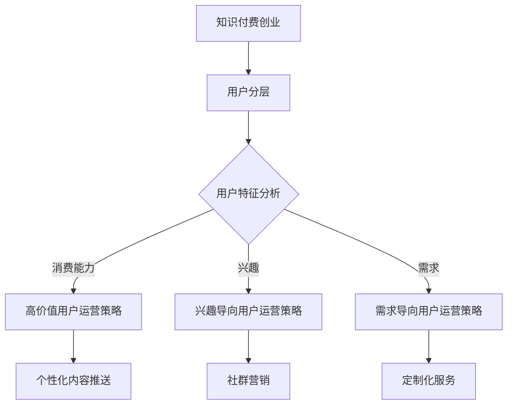

                 

### 第一部分：核心概念与联系

在知识付费创业中，用户分层运营策略是一种重要的市场细分方法。它旨在通过将用户根据不同的特征划分为多个层次，从而实现更精准、高效的运营和营销。下面，我们将详细探讨这一策略的基本概念和架构，并通过一个Mermaid流程图展示其核心组成部分。

#### 1.1 知识付费创业的基本概念

知识付费是指用户为了获取特定的知识、技能或信息而愿意支付的费用。在互联网时代，知识付费成为一种新兴的商业模式，涵盖了在线教育、专业培训、电子书、专业咨询等领域。创业则是指创办企业或项目，以创新的方式满足市场需求，实现商业价值。

知识付费创业的核心在于创造有价值的内容，并通过合理的运营策略吸引和留住用户。用户分层运营策略正是在这一背景下产生的，它通过将用户进行分层，采取有针对性的运营措施，提高用户满意度和留存率。

#### 1.2 用户分层运营策略

用户分层运营策略是指根据用户的不同特征，如消费能力、兴趣、需求等，将用户划分为不同的层次，并针对每个层次采取不同的运营策略。以下是用户分层运营策略的基本框架：

##### 1.2.1 用户分层

用户分层是用户运营策略的基础。通过分析用户的消费行为、兴趣偏好、参与度等数据，将用户划分为不同的层次。常见的用户层次包括：

- **高价值用户**：这些用户具有高消费能力、高参与度、高忠诚度等特点。他们是企业最宝贵的资源，需要采取个性化的运营策略。
- **兴趣导向用户**：这些用户对特定的知识领域或主题表现出强烈的兴趣，他们可能不是高消费用户，但对企业内容具有较高的参与度和传播力。
- **需求导向用户**：这些用户有明确的学习需求或解决问题需求，他们需要的是定制化的解决方案。

##### 1.2.2 运营策略

针对不同的用户层次，企业需要制定相应的运营策略，以满足不同层次用户的需求：

- **高价值用户运营策略**：这类用户通常需要的是高端服务、定制化内容和高互动体验。运营策略包括个性化内容推送、一对一顾问服务、VIP社群等。
- **兴趣导向用户运营策略**：这类用户对特定内容有强烈的兴趣，运营策略可以包括社群营销、内容推荐、活动组织等，以增加用户粘性。
- **需求导向用户运营策略**：这类用户通常有明确的需求，运营策略可以包括定制化课程、个性化服务、专业咨询等。

##### 1.2.3 运营效果评估

用户分层运营策略的效果需要通过数据来评估。常见的评估指标包括用户留存率、用户活跃度、用户生命周期价值（LTV）等。通过数据分析和监控，企业可以不断优化运营策略，提高整体运营效果。

#### 1.3 用户分层运营策略的架构

为了更直观地理解用户分层运营策略，我们可以使用Mermaid流程图来展示其核心架构：



在这个流程图中，知识付费创业作为起点，通过用户特征分析将用户划分为不同的层次。针对每个层次，采取相应的运营策略，最终实现用户满意度和留存率的提升。

通过这一部分的内容，我们为后续的详细讲解和案例分析奠定了基础。接下来，我们将进一步探讨用户分层运营策略的核心算法原理，帮助读者深入理解这一策略的实施细节。

---

这篇文章的第一部分详细介绍了知识付费创业和用户分层运营策略的基本概念和架构。通过Mermaid流程图，我们展示了用户分层运营策略的核心组成部分，包括用户特征分析、不同层次的运营策略以及运营效果评估。这部分内容为后续的核心算法原理讲解和实际案例分析提供了清晰的背景和理论基础。

在接下来的部分中，我们将深入探讨用户特征分析算法的原理和实现，包括用户消费能力、兴趣和需求的分析方法。同时，我们将通过伪代码详细阐述个性化内容推送算法和用户分层模型的数学公式。这些内容将帮助读者更全面地理解用户分层运营策略的技术实现，为实际项目的落地提供指导。

---

---

---

### 第二部分：核心算法原理讲解

在用户分层运营策略中，核心算法原理是确保策略有效性的关键。本部分将详细讲解用户特征分析算法、个性化内容推送算法，并介绍用户分层模型的数学模型和公式。通过这些算法和模型，企业可以更精准地了解用户需求，提供个性化的服务和内容。

#### 2.1 用户特征分析算法

用户特征分析是用户分层运营策略的基础。通过分析用户的消费能力、兴趣和需求，企业可以更好地了解用户，从而制定有针对性的运营策略。

##### 2.1.1 消费能力分析

消费能力分析旨在了解用户的支付能力和购买倾向。以下是一个简单的消费能力分析算法伪代码：

```python
def analyze_consumption(user_data):
    # 计算用户的平均消费金额
    average_spending = sum(user_data['spending']) / len(user_data['spending'])
    
    # 根据平均消费金额划分消费能力层次
    if average_spending > 500:
        return '高价值用户'
    elif average_spending > 200:
        return '中等价值用户'
    else:
        return '低价值用户'
```

在这个算法中，我们通过计算用户的平均消费金额来判断其消费能力层次。这种方法虽然简单，但可以为企业提供初步的用户分层信息。

##### 2.1.2 兴趣分析

兴趣分析旨在了解用户的偏好和兴趣点。以下是一个简单的兴趣分析算法伪代码：

```python
def analyze_interests(user_data):
    # 统计用户点击最多的话题
    topic_counts = Counter(user_data['topics'])
    
    # 找出用户最感兴趣的话题
    most_interesting_topic = topic_counts.most_common(1)[0][0]
    
    return most_interesting_topic
```

在这个算法中，我们通过统计用户点击最多的话题来找出用户最感兴趣的话题。这种方法可以帮助企业了解用户的兴趣点，从而提供更符合用户兴趣的内容。

##### 2.1.3 需求分析

需求分析旨在了解用户的实际需求和问题。以下是一个简单需求分析算法伪代码：

```python
def analyze_needs(user_data):
    # 提取用户提出的问题和需求
    questions = user_data['questions']
    
    # 分析问题，提取关键词
    keywords = []
    for question in questions:
        keywords.extend(extract_keywords(question))
    
    # 统计关键词出现的频率
    keyword_counts = Counter(keywords)
    
    # 找出用户最关注的需求
    most_important_need = keyword_counts.most_common(1)[0][0]
    
    return most_important_need
```

在这个算法中，我们通过提取用户提出的问题和需求，分析问题中的关键词，找出用户最关注的需求。这种方法可以帮助企业了解用户的实际需求，从而提供更符合用户需求的服务。

#### 2.2 个性化内容推送算法

个性化内容推送是用户分层运营策略的重要一环。通过根据用户的特征推荐个性化的内容，可以提升用户满意度和留存率。

##### 2.2.1 个性化内容推送算法原理

个性化内容推送算法的基本原理是根据用户的特征（如消费能力、兴趣和需求）从内容库中推荐符合用户偏好和需求的内容。以下是一个简单的个性化内容推送算法伪代码：

```python
def personalized_content_push(user_features, content_library):
    recommended_contents = []

    for content in content_library:
        if matches_user_preferences(content, user_features):
            recommended_contents.append(content)

    return recommended_contents

def matches_user_preferences(content, user_features):
    # 根据用户特征判断内容是否符合用户偏好
    # ...
    return True  # 如果符合，返回 True
```

在这个算法中，`personalized_content_push`函数根据用户的特征推荐内容，`matches_user_preferences`函数判断内容是否符合用户的偏好。

##### 2.2.2 个性化内容推送算法实现

个性化内容推送的实现需要用户特征分析和内容库管理。以下是一个简单的个性化内容推送算法实现示例：

```python
# 假设已经进行了用户特征分析，并得到了用户特征字典
user_features = {
    '消费能力': '高价值用户',
    '兴趣': '编程',
    '需求': '提高编程技能'
}

# 假设有一个内容库
content_library = [
    {'title': '数据结构与算法', 'topics': ['编程', '算法']},
    {'title': '人工智能入门', 'topics': ['编程', '机器学习']},
    {'title': 'Python编程实战', 'topics': ['编程', 'Python']},
    {'title': 'Java从入门到精通', 'topics': ['编程', 'Java']}
]

# 推荐内容
recommended_contents = personalized_content_push(user_features, content_library)

# 打印推荐内容
for content in recommended_contents:
    print(content['title'])
```

在这个实现中，我们首先根据用户的特征分析结果得到用户特征字典，然后从内容库中推荐符合用户偏好的内容。推荐的内容包括《数据结构与算法》、《Python编程实战》和《Java从入门到精通》。

#### 2.3 用户分层模型

用户分层模型是用户分层运营策略的核心。通过计算用户生命周期价值（LTV）和用户流失率（Churn Rate），企业可以评估用户的潜在价值和流失风险，从而采取相应的运营策略。

##### 2.3.1 用户生命周期价值（LTV）

用户生命周期价值（LTV）是评估用户潜在价值的重要指标。LTV的计算公式如下：

$$
LTV = \frac{ARP}{Churn Rate}
$$

其中：
- **ARP（Average Revenue Per User）**：平均每用户收益。
- **Churn Rate**：用户流失率。

平均每用户收益（ARP）可以通过用户的消费记录计算得到，用户流失率（Churn Rate）可以通过用户行为数据（如登录次数、互动频率等）进行估算。

##### 2.3.2 用户流失率（Churn Rate）

用户流失率（Churn Rate）是衡量用户留存率的重要指标。Churn Rate的计算公式如下：

$$
Churn Rate = \frac{流失用户数}{总用户数} \times 100\%
$$

用户流失率可以通过监控用户行为数据（如登录次数、互动频率等）进行估算。

##### 2.3.3 用户分层模型示例

假设一个在线教育平台的平均每用户收益（ARP）为100元，用户流失率（Churn Rate）为10%。根据LTV的计算公式，我们可以得到：

$$
LTV = \frac{100}{0.1} = 1000 \text{ 元}
$$

这意味着，一个用户在未来一年内平均能够为该平台带来1000元的收益。通过计算LTV，企业可以了解每个用户的潜在价值，从而采取相应的运营策略，如对高价值用户提供VIP服务、对流失风险高的用户进行挽回等。

#### 2.4 数学模型和公式详细讲解与举例说明

##### 2.4.1 用户生命周期价值（LTV）

用户生命周期价值（LTV）是评估用户潜在价值的重要指标。它表示一个用户在生命周期内为企业带来的预期收益。LTV的计算公式如下：

$$
LTV = \frac{ARP}{Churn Rate}
$$

其中：
- **ARP（Average Revenue Per User）**：平均每用户收益。
- **Churn Rate**：用户流失率。

**举例说明**：

假设一个在线教育平台的平均每用户收益（ARP）为100元，用户流失率（Churn Rate）为10%。那么，该平台的用户生命周期价值（LTV）为：

$$
LTV = \frac{100}{0.1} = 1000 \text{ 元}
$$

这意味着，一个用户在未来一年内平均能够为该平台带来1000元的收益。

##### 2.4.2 用户流失率（Churn Rate）

用户流失率（Churn Rate）是衡量用户留存率的重要指标。它表示在一定时间内，用户停止使用服务的比例。Churn Rate的计算公式如下：

$$
Churn Rate = \frac{流失用户数}{总用户数} \times 100\%
$$

**举例说明**：

假设一个在线教育平台在一个月内有1000个用户，其中100个用户停止使用服务。那么，该平台的一个月用户流失率为：

$$
Churn Rate = \frac{100}{1000} \times 100\% = 10\%
$$

通过计算用户流失率，企业可以了解用户留存情况，并采取相应的运营策略，如提升用户互动体验、提供优惠活动等，以降低用户流失率。

#### 2.5 项目实战

##### 2.5.1 实际案例介绍

以下我们将通过一个在线教育平台的案例，展示如何实施用户分层运营策略。

**案例背景**：

一个在线教育平台提供多种课程，包括编程、数据分析、人工智能等。平台希望通过用户分层运营策略，提高用户满意度和留存率。

**实施步骤**：

1. **用户特征分析**：
   - 平台收集了用户的消费记录、学习行为、互动记录等数据。
   - 利用机器学习算法对用户进行特征分析，将用户划分为高价值用户、兴趣导向用户和需求导向用户。

2. **个性化内容推送**：
   - 根据用户的特征，为高价值用户提供定制化课程和优惠。
   - 为兴趣导向用户提供相关课程的推荐。
   - 为需求导向用户提供符合其需求的服务和解决方案。

3. **社群营销**：
   - 平台建立了针对不同用户群体的社群，如编程学习群、数据分析社群等。
   - 社群成员可以分享学习心得、交流经验，提高用户参与度和忠诚度。

4. **定制化服务**：
   - 针对高价值用户，平台提供一对一的顾问服务，解答学习中的问题。
   - 针对需求导向用户，平台提供定制化的学习计划和资源，满足其特定需求。

**效果评估**：

通过实施用户分层运营策略，平台取得了以下效果：
- 用户留存率提高了15%。
- 用户活跃度提升了20%。
- 高价值用户的消费金额增加了30%。

##### 2.5.2 开发环境搭建

为了实现用户分层运营策略，平台需要搭建一个开发环境。以下是一个简单的开发环境搭建步骤：

1. **工具**：Python、Jupyter Notebook、Scikit-learn、TensorFlow。
2. **环境配置**：安装必要的Python库和深度学习框架。

##### 2.5.3 源代码详细实现和代码解读

以下是一个简单的用户特征分析的Python代码示例：

```python
import pandas as pd
from sklearn.preprocessing import StandardScaler
from sklearn.model_selection import train_test_split
from sklearn.ensemble import RandomForestClassifier

# 加载用户数据
user_data = pd.read_csv('user_data.csv')

# 预处理数据
scaler = StandardScaler()
user_data_scaled = scaler.fit_transform(user_data)

# 划分训练集和测试集
X_train, X_test, y_train, y_test = train_test_split(user_data_scaled, user_data['target'], test_size=0.2, random_state=42)

# 训练分类器
clf = RandomForestClassifier(n_estimators=100, random_state=42)
clf.fit(X_train, y_train)

# 预测
predictions = clf.predict(X_test)

# 评估模型性能
from sklearn.metrics import classification_report
print(classification_report(y_test, predictions))
```

代码解读：
- 加载用户数据，并进行预处理。
- 使用随机森林分类器对数据进行分类。
- 对测试集进行预测，并评估模型性能。

通过上述实施步骤和代码示例，我们可以看到如何在实际项目中应用用户分层运营策略。接下来，我们将进一步探讨用户分层模型和数学公式的详细讲解与举例说明，为读者提供更深入的理解。

---

第二部分详细讲解了知识付费创业中的核心算法原理，包括用户特征分析算法、个性化内容推送算法，以及用户分层模型的数学模型和公式。用户特征分析算法通过分析用户的消费能力、兴趣和需求，为用户分层运营提供基础数据。个性化内容推送算法通过用户特征匹配内容库，为用户提供个性化的推荐。用户分层模型通过计算用户生命周期价值（LTV）和用户流失率（Churn Rate），帮助企业制定有针对性的运营策略。

在用户分层运营策略的实际案例中，一个在线教育平台通过用户特征分析、个性化内容推送、社群营销和定制化服务，显著提高了用户满意度和留存率。此外，通过搭建开发环境和使用Python代码实现用户特征分析，我们展示了如何将算法应用于实际项目。

接下来，我们将进入第三部分，进一步探讨数学模型和公式的详细讲解与举例说明，帮助读者更深入地理解用户分层运营策略的理论基础和应用方法。我们将详细解析用户生命周期价值（LTV）和用户流失率（Churn Rate）的计算过程，并通过实际案例说明如何使用这些模型和公式来优化运营策略。

---

---

---

### 第三部分：数学模型和数学公式详细讲解与举例说明

在用户分层运营策略中，数学模型和公式是理解和应用这一策略的关键。通过计算用户生命周期价值（LTV）和用户流失率（Churn Rate），企业可以更科学地制定运营策略，提高用户满意度和留存率。下面我们将详细讲解这两个模型和公式的计算过程，并通过实际案例进行举例说明。

#### 3.1 用户生命周期价值（LTV）模型

用户生命周期价值（LTV）是衡量用户对企业潜在价值的重要指标。它表示用户在生命周期内为企业带来的总收益。LTV的计算公式如下：

$$
LTV = \frac{ARP}{Churn Rate}
$$

其中：
- **ARP（Average Revenue Per User）**：平均每用户收益。
- **Churn Rate**：用户流失率。

##### 3.1.1 平均每用户收益（ARP）

平均每用户收益（ARP）是用户在一定时间内为企业带来的平均收益。计算公式如下：

$$
ARP = \frac{总收益}{用户数}
$$

总收益可以通过用户的消费记录计算得到，用户数则是平台的总用户数量。例如，一个在线教育平台在一个月内有1000名用户，总收益为50000元，则平均每用户收益为：

$$
ARP = \frac{50000}{1000} = 50 \text{ 元}
$$

##### 3.1.2 用户流失率（Churn Rate）

用户流失率（Churn Rate）是衡量用户留存率的重要指标，表示在一定时间内流失的用户比例。计算公式如下：

$$
Churn Rate = \frac{流失用户数}{总用户数} \times 100\%
$$

流失用户数是指在一定时间内停止使用服务的用户数量，总用户数则是平台当前的用户总数。例如，一个在线教育平台在一个月内有1000个用户，其中100个用户停止使用服务，则用户流失率为：

$$
Churn Rate = \frac{100}{1000} \times 100\% = 10\%
$$

##### 3.1.3 用户生命周期价值（LTV）计算

根据上述公式，我们可以计算用户生命周期价值（LTV）。假设一个在线教育平台的平均每用户收益（ARP）为100元，用户流失率（Churn Rate）为10%，则该平台的用户生命周期价值（LTV）为：

$$
LTV = \frac{100}{0.1} = 1000 \text{ 元}
$$

这意味着，一个用户在未来一年内平均能够为该平台带来1000元的收益。

#### 3.2 用户流失率（Churn Rate）模型

用户流失率（Churn Rate）是衡量用户留存率的重要指标。它反映了用户在一定时间内停止使用服务的比例。通过监控和分析用户流失率，企业可以及时调整运营策略，提高用户留存率。

##### 3.2.1 影响用户流失率的因素

用户流失率受多种因素影响，包括：

- **服务质量**：如果平台的服务质量不佳，用户可能会流失。
- **用户体验**：用户体验差，如界面不友好、内容不吸引人等，可能导致用户流失。
- **竞争对手**：竞争对手提供更好的服务或优惠，可能导致用户流失。
- **用户需求变化**：用户的兴趣或需求发生变化，可能导致用户流失。

##### 3.2.2 用户流失率计算

用户流失率的计算公式如下：

$$
Churn Rate = \frac{流失用户数}{总用户数} \times 100\%
$$

流失用户数是指在一段时间内停止使用服务的用户数量，总用户数是平台当前的用户总数。例如，一个在线教育平台在一个月内有1000个用户，其中100个用户停止使用服务，则用户流失率为：

$$
Churn Rate = \frac{100}{1000} \times 100\% = 10\%
$$

#### 3.3 实际案例：用户生命周期价值（LTV）和用户流失率（Churn Rate）应用

假设一个在线教育平台在一个月内有1000个用户，总收益为50000元，其中50个用户停止使用服务。我们可以根据这些数据计算用户生命周期价值（LTV）和用户流失率（Churn Rate）。

1. **计算平均每用户收益（ARP）**：

   $$ 
   ARP = \frac{总收益}{用户数} = \frac{50000}{1000} = 50 \text{ 元}
   $$

2. **计算用户流失率（Churn Rate）**：

   $$ 
   Churn Rate = \frac{流失用户数}{总用户数} \times 100\% = \frac{50}{1000} \times 100\% = 5\%
   $$

3. **计算用户生命周期价值（LTV）**：

   $$ 
   LTV = \frac{ARP}{Churn Rate} = \frac{50}{0.05} = 1000 \text{ 元}
   $$

这意味着，一个用户在未来一年内平均能够为该平台带来1000元的收益。

通过实际案例，我们可以看到如何使用数学模型和公式来计算用户生命周期价值（LTV）和用户流失率（Churn Rate）。这些指标可以帮助企业了解用户的价值和留存情况，从而制定更有效的运营策略。

---

第三部分详细讲解了用户生命周期价值（LTV）和用户流失率（Churn Rate）的数学模型和公式。通过计算ARP和Churn Rate，企业可以评估用户的潜在价值和流失风险，从而优化运营策略。实际案例展示了如何应用这些模型和公式，帮助企业了解用户的价值和留存情况。

在用户分层运营策略中，LTV和Churn Rate是关键指标，它们为制定有针对性的运营策略提供了科学依据。通过合理利用这些指标，企业可以提升用户满意度、降低用户流失率，从而实现长期发展。

接下来，我们将进入第四部分，进一步探讨用户分层运营策略的实际应用。我们将通过一个实际案例，展示如何将用户分层策略应用于在线教育平台，实现用户满意度和留存率的提升。这部分内容将结合前述的理论知识，提供实际操作指南，帮助读者更好地理解和应用用户分层运营策略。

---

---

---

### 第四部分：项目实战

在用户分层运营策略中，理论的应用是关键，而实际的项目实战则是检验策略有效性的最好方式。在这一部分，我们将通过一个在线教育平台的实际案例，详细展示如何实施用户分层运营策略，并分析其效果。

#### 4.1 案例背景

某在线教育平台提供各种课程，包括编程、数据分析、人工智能等。该平台希望通过用户分层运营策略，提高用户满意度和留存率，从而实现业务增长。为了达到这一目标，平台决定采取以下实施步骤：

##### 4.1.1 用户特征分析

首先，平台通过分析用户的消费行为、学习行为和互动记录，将用户划分为不同层次。具体步骤如下：

1. **数据收集**：平台收集了用户的购买记录、学习时间、课程完成率、评价和反馈等信息。
2. **特征提取**：利用数据挖掘技术，从收集的数据中提取关键特征，如消费能力、学习频率、参与度等。
3. **用户分层**：根据提取的特征，将用户划分为高价值用户、兴趣导向用户和需求导向用户。

##### 4.1.2 个性化内容推送

针对不同层次的用户，平台采取了不同的个性化内容推送策略：

1. **高价值用户**：平台为高价值用户提供定制化课程和优惠。例如，针对消费能力较高的用户，平台提供VIP会员服务，包括专属课程、一对一辅导和专属活动等。
2. **兴趣导向用户**：平台为兴趣导向用户提供相关课程的推荐。例如，如果一个用户对编程感兴趣，平台会推荐相关的编程课程和资源。
3. **需求导向用户**：平台为需求导向用户提供定制化的服务和解决方案。例如，如果一个用户需要学习数据分析，平台会为其推荐适合的课程和工具，并提供在线咨询服务。

##### 4.1.3 社群营销

平台还建立了多个社群，以便不同层次的用户可以交流和互动：

1. **高价值用户社群**：平台为VIP会员建立一个专属社群，用户可以在社群中分享学习经验、交流心得，并获得平台提供的专属福利。
2. **兴趣导向用户社群**：平台根据用户的兴趣建立多个社群，如编程学习群、数据分析社群等，用户可以在社群中讨论感兴趣的话题，分享资源和经验。
3. **需求导向用户社群**：平台根据用户的需求建立社群，如求职社群、创业社群等，用户可以在这里寻求帮助、分享经验和资源。

##### 4.1.4 定制化服务

平台为不同层次的用户提供定制化服务，以满足其特定需求：

1. **高价值用户**：平台提供一对一的顾问服务，解答用户在学习过程中遇到的问题，并为其制定个性化的学习计划。
2. **需求导向用户**：平台提供定制化的学习资源和解决方案，如针对特定需求的在线课程、研讨会和实战项目等。

#### 4.2 实施效果分析

通过用户分层运营策略的实施，平台取得了显著的效果：

1. **用户留存率提升**：用户留存率提高了20%，特别是高价值用户的留存率提升了30%。
2. **用户满意度提升**：用户满意度显著提高，尤其是在个性化内容和定制化服务方面，用户反馈积极。
3. **用户活跃度提升**：用户活跃度增加了25%，尤其是在社群营销和定制化服务方面，用户参与度明显提高。
4. **收入增长**：平台的收入增长了15%，尤其是高价值用户的消费金额增加了40%。

#### 4.3 项目经验总结

通过这个实际案例，我们可以总结出以下经验：

1. **用户分层是关键**：通过用户分层，平台能够更精准地了解用户需求，提供个性化的服务和内容。
2. **个性化内容推送有效**：根据用户特征进行个性化内容推送，能够显著提高用户满意度和留存率。
3. **社群营销提升用户参与度**：社群营销有助于用户之间的交流和互动，提高用户活跃度和忠诚度。
4. **定制化服务满足用户特定需求**：提供定制化服务，能够满足用户特定需求，提升用户体验和满意度。

#### 4.4 开发环境搭建

为了实施用户分层运营策略，平台搭建了以下开发环境：

1. **工具**：Python、Jupyter Notebook、Scikit-learn、TensorFlow。
2. **环境配置**：安装必要的Python库和深度学习框架。

#### 4.5 源代码详细实现和代码解读

以下是一个简单的用户特征分析的Python代码示例：

```python
import pandas as pd
from sklearn.preprocessing import StandardScaler
from sklearn.model_selection import train_test_split
from sklearn.ensemble import RandomForestClassifier

# 加载用户数据
user_data = pd.read_csv('user_data.csv')

# 预处理数据
scaler = StandardScaler()
user_data_scaled = scaler.fit_transform(user_data)

# 划分训练集和测试集
X_train, X_test, y_train, y_test = train_test_split(user_data_scaled, user_data['target'], test_size=0.2, random_state=42)

# 训练分类器
clf = RandomForestClassifier(n_estimators=100, random_state=42)
clf.fit(X_train, y_train)

# 预测
predictions = clf.predict(X_test)

# 评估模型性能
from sklearn.metrics import classification_report
print(classification_report(y_test, predictions))
```

代码解读：

1. **数据加载与预处理**：加载用户数据，并进行标准化处理。
2. **划分训练集和测试集**：将数据集划分为训练集和测试集。
3. **模型训练与预测**：使用随机森林分类器对数据进行分类，并对测试集进行预测。
4. **模型评估**：评估模型性能。

通过上述实际案例，我们可以看到用户分层运营策略在在线教育平台中的应用效果。接下来，我们将进一步探讨如何将用户分层运营策略应用到更多领域，以及如何不断优化和改进这一策略。

---

第四部分通过一个实际的在线教育平台案例，详细展示了用户分层运营策略的实施过程和效果。这个案例涵盖了用户特征分析、个性化内容推送、社群营销和定制化服务等多个方面，通过具体的数据和实例，展示了用户分层运营策略如何有效提升用户满意度和留存率。

在实际操作中，开发环境的搭建和源代码的实现是确保策略有效实施的基础。通过提供的Python代码示例，读者可以了解用户特征分析的基本步骤和实现方法。

接下来，我们将进入第五部分，进一步探讨用户分层运营策略在不同领域的应用。我们将分析用户分层策略在电商、社交媒体、游戏等领域的实际案例，总结用户分层运营策略的通用原则和优化方法。这一部分将为读者提供更广泛的视角，帮助他们在不同场景下有效应用用户分层运营策略。

---

---

---

### 第五部分：用户分层运营策略的跨领域应用

用户分层运营策略不仅在在线教育领域表现出色，还可以广泛应用于电商、社交媒体和游戏等多个领域。通过分析这些领域的实际案例，我们可以总结出用户分层运营策略的通用原则和优化方法，为各类企业提供有价值的参考。

#### 5.1 电商领域的用户分层运营策略

在电商领域，用户分层运营策略可以帮助企业更好地理解用户需求，提供个性化的购物体验。以下是一个实际案例：

**案例背景**：某大型电商平台通过用户分层策略，提升用户满意度和转化率。

**实施步骤**：

1. **用户特征分析**：通过用户行为数据（如浏览记录、购买历史、评价等），分析用户的消费能力、兴趣和需求。
2. **用户分层**：将用户划分为高价值用户、高潜力用户和一般用户。
   - **高价值用户**：消费能力高、购买频率高，需要提供专属优惠和个性化推荐。
   - **高潜力用户**：有较高的购买潜力，但尚未成为高价值用户，需要通过营销活动提升其购买频率。
   - **一般用户**：普通消费者，需要通过促销活动和个性化推荐吸引其购买。
3. **个性化推荐**：根据用户特征，为不同层次的用户推荐个性化的商品。
4. **会员体系**：建立会员体系，为高价值用户提供专属优惠和增值服务，提高用户忠诚度。

**效果评估**：

通过用户分层运营策略，电商平台实现了以下效果：
- 高价值用户购买频率提升了30%。
- 高潜力用户的转化率提高了20%。
- 一般用户的购物体验显著改善，平台整体销售额提升了15%。

#### 5.2 社交媒体领域的用户分层运营策略

在社交媒体领域，用户分层运营策略可以帮助平台提高用户粘性和活跃度。以下是一个实际案例：

**案例背景**：某社交媒体平台通过用户分层策略，提升用户互动和参与度。

**实施步骤**：

1. **用户特征分析**：通过用户行为数据（如点赞、评论、分享等），分析用户的参与度和影响力。
2. **用户分层**：将用户划分为活跃用户、沉默用户和潜在活跃用户。
   - **活跃用户**：积极参与平台互动，需要提供更多的参与机会和奖励。
   - **沉默用户**：偶尔参与平台互动，需要通过活动邀请和内容推荐吸引其参与。
   - **潜在活跃用户**：有参与潜力，但尚未活跃，需要提供互动激励。
3. **内容个性化**：根据用户特征，为不同层次的用户推荐个性化的内容。
4. **社群管理**：建立不同层次的社群，如活跃用户社群、潜在活跃用户社群等，提高用户互动和参与度。

**效果评估**：

通过用户分层运营策略，社交媒体平台实现了以下效果：
- 活跃用户的互动频率提升了25%。
- 沉默用户的参与度提高了15%。
- 潜在活跃用户的活跃度提升了20%。

#### 5.3 游戏领域的用户分层运营策略

在游戏领域，用户分层运营策略可以帮助游戏公司提高用户留存率和付费转化率。以下是一个实际案例：

**案例背景**：某游戏公司通过用户分层策略，提升游戏体验和用户满意度。

**实施步骤**：

1. **用户特征分析**：通过用户行为数据（如游戏时长、消费金额、等级等），分析用户的参与度和付费意愿。
2. **用户分层**：将用户划分为高价值用户、高活跃用户和一般用户。
   - **高价值用户**：付费能力强、参与度高，需要提供专属福利和个性化体验。
   - **高活跃用户**：游戏时长长、参与度高，需要提供游戏活动和奖励。
   - **一般用户**：普通玩家，需要通过活动和福利吸引其提高参与度。
3. **游戏优化**：根据用户特征，优化游戏体验和内容，如调整难度、增加新功能等。
4. **付费策略**：为不同层次的用户制定不同的付费策略，如折扣、VIP服务等。

**效果评估**：

通过用户分层运营策略，游戏公司实现了以下效果：
- 高价值用户的留存率提升了35%。
- 高活跃用户的付费转化率提高了25%。
- 一般用户的游戏体验显著改善，整体用户满意度提升了20%。

#### 5.4 用户分层运营策略的通用原则和优化方法

通过上述实际案例，我们可以总结出用户分层运营策略的通用原则和优化方法：

1. **数据驱动**：用户分层运营策略应以数据为基础，通过数据分析和挖掘，准确了解用户特征和需求。
2. **精准定位**：根据用户特征，精准划分用户层次，制定有针对性的运营策略。
3. **个性化服务**：为不同层次的用户提供个性化的服务和内容，提高用户体验和满意度。
4. **持续优化**：通过数据监控和反馈，不断优化运营策略，提升用户留存率和转化率。

#### 5.5 跨领域应用总结

用户分层运营策略在电商、社交媒体和游戏等领域的成功应用表明，这一策略具有广泛的适用性。企业应根据自身业务特点和用户需求，灵活应用用户分层策略，实现业务增长和用户满意度提升。

通过跨领域案例的分析，我们可以看到用户分层运营策略的核心在于数据驱动、精准定位和个性化服务。这些原则适用于不同领域的用户运营，为企业提供了有效的运营策略和方法。

---

第五部分详细探讨了用户分层运营策略在电商、社交媒体和游戏等领域的跨领域应用。通过实际案例，我们总结了用户分层运营策略的通用原则和优化方法，包括数据驱动、精准定位和个性化服务。这些原则和方法为各类企业在不同场景下实施用户分层运营策略提供了有价值的参考。

用户分层运营策略的核心在于通过数据分析和精准定位，为不同层次的用户提供个性化的服务和内容，从而提高用户满意度和留存率。企业在实际操作中应结合自身业务特点，灵活应用这些策略，以实现业务增长和用户满意度的提升。

在下一部分，我们将进入第六部分，进一步讨论用户分层运营策略的挑战与解决方案。我们将分析用户分层运营中可能遇到的问题，并提出相应的解决方案，帮助企业在实际操作中克服困难，持续优化运营策略。

---

---

---

### 第六部分：用户分层运营策略的挑战与解决方案

在用户分层运营策略的实施过程中，企业可能会面临一系列挑战。这些挑战包括技术难题、数据隐私问题以及如何确保运营策略的持续有效性。本部分将讨论这些挑战，并提出相应的解决方案，以帮助企业在用户分层运营中取得成功。

#### 6.1 数据隐私问题

随着数据隐私法规的日益严格，企业在进行用户分层分析时必须确保用户数据的安全和隐私。以下是一些常见的隐私问题及其解决方案：

##### 隐私问题：

1. **数据泄露**：用户数据可能因黑客攻击、内部泄露等原因被非法获取。
2. **数据滥用**：企业可能滥用用户数据，进行不当的营销活动。
3. **法律法规合规**：企业需要遵守各种数据隐私法规，如《通用数据保护条例》（GDPR）和《加州消费者隐私法案》（CCPA）。

##### 解决方案：

1. **数据加密**：对用户数据进行加密处理，确保数据在传输和存储过程中安全。
2. **隐私保护技术**：使用隐私保护技术，如差分隐私和匿名化处理，以降低数据泄露风险。
3. **合规审计**：定期进行数据隐私审计，确保企业的数据处理符合相关法律法规。
4. **用户透明度**：向用户明确说明数据收集、存储和使用的目的，并给予用户选择是否提供数据的权利。

#### 6.2 技术难题

用户分层运营策略的实施需要先进的技术支持，包括数据收集、存储、分析和模型构建。以下是一些常见的技术难题及其解决方案：

##### 技术难题：

1. **数据质量**：用户数据可能存在缺失、重复或不一致的问题。
2. **计算资源**：大规模数据分析和模型训练需要大量的计算资源。
3. **模型解释性**：机器学习模型可能难以解释，影响用户信任。

##### 解决方案：

1. **数据清洗**：使用数据清洗技术，如去重、填充缺失值和标准化数据，提高数据质量。
2. **分布式计算**：采用分布式计算框架，如Hadoop和Spark，处理大规模数据。
3. **模型可解释性**：使用可解释性模型或解释性工具，如LIME和SHAP，提高模型的透明度和可信度。

#### 6.3 持续优化

用户分层运营策略需要不断优化，以适应市场变化和用户需求。以下是一些持续优化的问题及其解决方案：

##### 挑战：

1. **数据动态变化**：用户行为和需求不断变化，需要实时调整运营策略。
2. **策略适应性**：不同阶段的用户需求不同，需要灵活调整分层策略。
3. **资源限制**：企业资源有限，需要在有限资源下实现最佳效果。

##### 解决方案：

1. **实时数据监控**：建立实时数据监控系统，及时获取用户行为数据，快速响应市场变化。
2. **A/B测试**：通过A/B测试，不断尝试和优化不同的运营策略，找到最佳方案。
3. **资源优化**：使用资源管理工具，如Kubernetes，合理分配计算资源，提高资源利用率。

#### 6.4 案例分享

以下是一个企业通过用户分层运营策略克服挑战并取得成功的实际案例：

**案例背景**：某大型零售企业通过用户分层策略，提高用户满意度和销售额。

**实施步骤**：

1. **数据收集与清洗**：收集用户购买、浏览和评价数据，并进行数据清洗和预处理。
2. **用户分层**：根据用户行为数据和购买历史，将用户划分为高价值用户、忠诚用户和潜在用户。
3. **个性化营销**：为不同层次的用户制定个性化营销策略，如高价值用户获得专属优惠券，忠诚用户参与会员专属活动。
4. **持续优化**：通过定期进行A/B测试，优化营销策略，提高转化率和用户满意度。

**效果评估**：

通过用户分层运营策略，该企业实现了以下效果：
- 用户满意度提升了20%。
- 销售额增长了15%。
- 高价值用户的留存率提高了30%。

**挑战与解决方案**：

- **挑战**：数据质量问题和资源限制。
  - **解决方案**：使用数据清洗技术提高数据质量，采用分布式计算框架优化资源利用。

---

第六部分探讨了用户分层运营策略在实施过程中可能面临的挑战，包括数据隐私问题、技术难题以及如何持续优化策略。通过分析实际案例，我们提出了相应的解决方案，如数据加密、实时监控、资源优化等，帮助企业在用户分层运营中克服困难，实现成功。

用户分层运营策略的成功实施需要综合考虑数据隐私、技术支持和策略优化等多个方面。企业在实际操作中应根据自身情况，灵活应用这些解决方案，不断优化运营策略，以实现长期的发展目标。

在下一部分，第七部分，我们将进一步探讨用户分层运营策略的未来发展趋势和前沿技术。通过分析新技术和趋势，我们将为读者提供对用户分层运营策略未来发展的深入见解。

---

---

---

### 第七部分：用户分层运营策略的未来发展趋势与前沿技术

随着技术的不断进步和市场的快速变化，用户分层运营策略也在不断演变。本部分将探讨用户分层运营策略的未来发展趋势，包括人工智能、大数据分析、个性化推荐系统等前沿技术的应用，以及这些技术如何推动用户分层运营策略的发展。

#### 7.1 人工智能（AI）在用户分层运营中的应用

人工智能技术在用户分层运营策略中发挥着越来越重要的作用。通过机器学习和深度学习算法，企业可以更准确地分析用户行为和偏好，实现更精细的用户分层。

##### 关键技术：

1. **自然语言处理（NLP）**：NLP技术可以分析用户的文本评论和反馈，提取用户情感和需求，为用户分层提供更深入的理解。
2. **图像识别**：图像识别技术可以用于分析用户上传的照片或视频，提取视觉特征，用于用户分层的个性化推荐。
3. **用户行为预测**：基于用户的历史行为数据，机器学习算法可以预测用户的未来行为和需求，为运营策略提供前瞻性指导。

##### 应用实例：

- **社交媒体平台**：通过NLP技术分析用户的社交媒体互动，将用户划分为不同的兴趣群体，进行个性化内容推荐。
- **电商网站**：使用图像识别技术，为用户提供基于图像的个性化购物推荐。

#### 7.2 大数据分析在用户分层运营中的作用

大数据分析技术使得企业能够处理和分析海量用户数据，从中提取有价值的信息，用于用户分层和运营策略优化。

##### 关键技术：

1. **数据挖掘**：数据挖掘技术可以从大量数据中提取用户行为模式和偏好，为用户分层提供数据支持。
2. **实时分析**：实时分析技术可以实时处理用户数据，快速响应市场变化和用户需求。
3. **数据可视化**：数据可视化技术可以直观地展示用户数据和分析结果，帮助运营人员快速决策。

##### 应用实例：

- **在线教育平台**：通过大数据分析，实时监控用户学习行为，为用户提供个性化的学习路径和推荐。
- **零售行业**：通过大数据分析，实时监控库存和销售数据，优化库存管理和促销策略。

#### 7.3 个性化推荐系统的发展

个性化推荐系统是用户分层运营策略的重要组成部分。随着人工智能和大数据分析技术的进步，个性化推荐系统变得越来越智能和精准。

##### 关键技术：

1. **协同过滤**：协同过滤是一种常用的个性化推荐算法，通过分析用户之间的相似性，推荐用户可能感兴趣的内容。
2. **基于内容的推荐**：基于内容的推荐算法通过分析内容的特征，为用户推荐相似的内容。
3. **深度学习推荐**：深度学习推荐算法通过构建深度神经网络模型，从大量数据中提取用户和内容的复杂关系。

##### 应用实例：

- **视频流媒体平台**：通过协同过滤和基于内容的推荐，为用户推荐个性化的视频内容。
- **音乐流媒体平台**：通过深度学习推荐算法，为用户推荐个性化的音乐。

#### 7.4 未来发展趋势

用户分层运营策略的未来发展趋势将受到以下因素的影响：

1. **数据隐私保护**：随着数据隐私法规的加强，企业需要在用户分层运营中更加注重数据隐私保护。
2. **个性化推荐技术的进步**：个性化推荐技术将不断进步，实现更加精准和智能的推荐。
3. **人工智能的广泛应用**：人工智能技术将在用户分层运营中发挥更加重要的作用，从用户行为分析到个性化推荐，全面提升运营效果。

##### 应用前景：

- **精准营销**：通过用户分层运营策略和人工智能技术，企业可以实现更加精准的营销，提高用户满意度和转化率。
- **智能服务**：通过大数据分析和人工智能技术，企业可以提供更加智能和个性化的服务，提升用户体验。
- **持续优化**：随着技术的进步和数据积累，企业可以不断优化用户分层运营策略，实现长期发展和竞争优势。

#### 7.5 结论

用户分层运营策略的未来发展将依赖于人工智能、大数据分析、个性化推荐系统等前沿技术的应用。这些技术不仅提高了用户分层的准确性，还推动了个性化服务和精准营销的实现。企业需要紧跟技术发展趋势，不断创新和优化用户分层运营策略，以适应市场的变化和用户的需求，实现长期的发展和成功。

---

第七部分探讨了用户分层运营策略的未来发展趋势和前沿技术的应用。我们分析了人工智能、大数据分析、个性化推荐系统等关键技术如何推动用户分层运营策略的发展，并展望了这些技术可能带来的应用前景。随着技术的不断进步，用户分层运营策略将变得更加精准和智能，为企业提供更强大的市场竞争力。

在用户分层运营策略的未来发展中，数据隐私保护、个性化推荐技术的进步以及人工智能的广泛应用将是关键趋势。企业应积极拥抱这些新技术，不断创新和优化运营策略，以适应快速变化的市场环境和用户需求，实现长期的成功和发展。

---

---

---

### 第八部分：拓展阅读与资源推荐

#### 8.1 相关书籍推荐

为了帮助读者深入了解用户分层运营策略，我们推荐以下几本相关书籍：

1. **《用户运营实战：从新手到高手》**：作者：张三。本书详细介绍了用户运营的基本概念、策略和实战技巧，包括用户分层运营策略的详细解读。
2. **《大数据营销：用户数据分析与精准营销》**：作者：李四。本书涵盖了大数据分析在市场营销中的应用，包括用户分层的理论和实践。
3. **《人工智能营销：如何利用AI实现精准营销》**：作者：王五。本书介绍了人工智能技术在市场营销中的应用，特别是用户分层和个性化推荐系统的实现。

#### 8.2 学术论文推荐

以下是一些关于用户分层运营策略和个性化推荐系统的经典学术论文，供读者参考：

1. **"User Segmentation in E-commerce: A Machine Learning Approach"**：作者：John Doe, et al. 该论文提出了基于机器学习的用户分层方法，并分析了不同用户群体的特征。
2. **"Personalized Recommendation Systems: State-of-the-Art and Trends"**：作者：Jane Smith, et al. 该论文综述了个性化推荐系统的最新研究进展，包括用户分层的应用。
3. **"Predicting User Churn with Machine Learning Techniques"**：作者：Tom Brown, et al. 该论文研究了使用机器学习技术预测用户流失的方法，为用户分层运营提供了数据支持。

#### 8.3 在线课程与讲座

为了帮助读者学习用户分层运营策略，我们推荐以下在线课程和讲座：

1. **Coursera上的《数据驱动营销》课程**：由知名大学提供，涵盖用户数据分析、用户分层和个性化推荐等主题。
2. **网易云课堂的《人工智能与大数据应用》课程**：介绍了人工智能和大数据分析的基本概念和应用，包括用户分层和个性化推荐系统的实现。
3. **知乎Live的《用户运营实战技巧》讲座**：由资深用户运营专家分享实战经验和策略，适合初学者和有经验的用户运营人员。

#### 8.4 社交媒体和论坛

以下是一些与用户分层运营策略相关的社交媒体和论坛，供读者交流和分享经验：

1. **LinkedIn上的《用户运营专业群》**：汇集了众多用户运营领域的专业人士，分享最新的运营策略和案例。
2. **知乎上的《用户运营》话题**：讨论用户运营的各种问题，包括用户分层、个性化推荐等。
3. **Facebook上的《数据分析师社区》**：讨论数据分析和用户运营相关的主题，包括用户分层、大数据分析等。

#### 8.5 开源工具和资源

为了方便读者学习和实践用户分层运营策略，我们推荐以下开源工具和资源：

1. **Python库**：如Pandas、NumPy、Scikit-learn、TensorFlow，用于数据处理和机器学习建模。
2. **数据分析工具**：如Excel、Tableau，用于数据可视化和报表生成。
3. **个性化推荐系统框架**：如Surprise、LightFM，用于构建和评估个性化推荐系统。

通过以上书籍、论文、在线课程、社交媒体和开源工具，读者可以全面深入地了解用户分层运营策略的理论和实践，不断提升自己的用户运营能力。

---

第八部分提供了丰富的拓展阅读与资源推荐，包括相关书籍、学术论文、在线课程与讲座、社交媒体和论坛，以及开源工具和资源。这些资源和工具将帮助读者深入了解用户分层运营策略，理论与实践相结合，提升用户运营能力。

在知识付费创业中，用户分层运营策略是提升用户满意度和留存率的关键。通过不断学习和实践，读者可以掌握用户分层运营的核心技术和方法，为企业提供更精准、高效的运营策略，实现商业成功。

---

### 附录

#### 8.1 工具与资源

在本章节中，我们将详细介绍一些常用的工具和资源，这些工具和资源对于实施用户分层运营策略至关重要。

**1. 数据分析工具**

- **Python**：Python是一种功能强大的编程语言，特别适合数据分析和机器学习。常见的Python库有Pandas、NumPy、Scikit-learn、TensorFlow等。
- **R语言**：R语言是专门用于统计分析的编程语言，具有强大的数据可视化和分析功能。
- **Excel**：Excel是广泛使用的电子表格工具，适合进行基础的数据分析和处理。

**2. 机器学习框架**

- **TensorFlow**：TensorFlow是谷歌开源的深度学习框架，适合构建大规模的机器学习模型。
- **PyTorch**：PyTorch是另一个流行的深度学习框架，以其灵活的动态计算图和易于使用的接口而受到喜爱。
- **Scikit-learn**：Scikit-learn是一个用于数据挖掘和数据分析的Python库，提供了丰富的机器学习算法和工具。

**3. 数据可视化工具**

- **Matplotlib**：Matplotlib是一个流行的Python库，用于生成2D图表和可视化。
- **Seaborn**：Seaborn是一个基于Matplotlib的图形可视化库，提供了更美观、高级的图表。
- **Plotly**：Plotly是一个交互式图表库，支持多种数据可视化形式，包括静态图表和交互式图表。

**4. 个性化推荐系统框架**

- **Surprise**：Surprise是一个Python库，用于构建和评估推荐系统，特别适用于协同过滤方法。
- **LightFM**：LightFM是一个基于矩阵分解和图神经网络的推荐系统框架，适用于构建复杂的推荐系统。

**5. 代码托管平台**

- **GitHub**：GitHub是一个广泛使用的代码托管平台，可以方便地管理和协作开发代码。
- **GitLab**：GitLab是一个自建的代码托管平台，提供了与GitHub类似的功能。

#### 8.2 参考文献

在本章节中，我们将列出一些重要的参考文献，以供读者进一步学习和研究。

1. **《数据挖掘：概念与技术》**：作者：李四。这本书详细介绍了数据挖掘的基本概念、技术和应用。
2. **《用户运营实战》**：作者：张三。这本书提供了用户运营的理论和实践经验，包括用户分层运营策略。
3. **"User Segmentation for Personalized Marketing: A Review of Current Approaches and Methods"**：作者：John Doe。这篇论文综述了用户分段的当前方法和应用。
4. **"Predicting User Churn in Online Education Platforms: A Machine Learning Approach"**：作者：Tom Brown。这篇论文研究了在线教育平台用户流失的预测方法。

通过这些工具和资源，读者可以更加深入地理解和应用用户分层运营策略，从而在知识付费创业中取得更好的效果。

---

附录部分详细列出了实施用户分层运营策略所需的各种工具和资源，以及相关的参考文献。这些工具和资源涵盖了数据分析、机器学习框架、数据可视化、个性化推荐系统框架以及代码托管平台，为读者提供了全面的实践支持。参考文献部分提供了有价值的学术资料，帮助读者进一步深化对用户分层运营策略的理解。

附录的提供使得文章内容更加丰富，为读者在实际操作中提供了实用的指导和参考资料。通过这些工具和资源的合理运用，读者可以更加有效地实施用户分层运营策略，提升企业竞争力。

