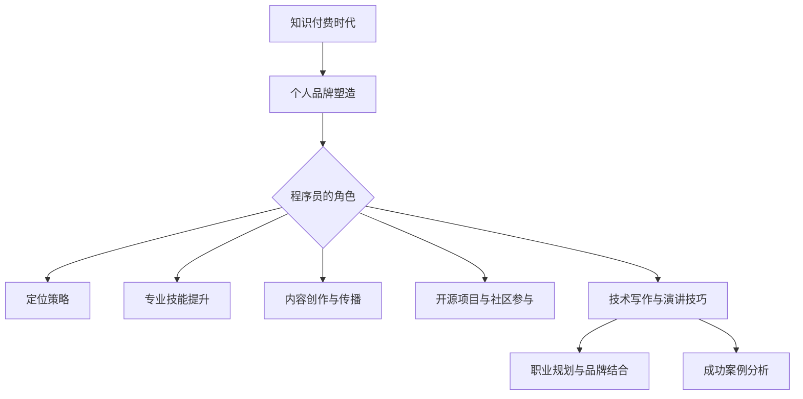
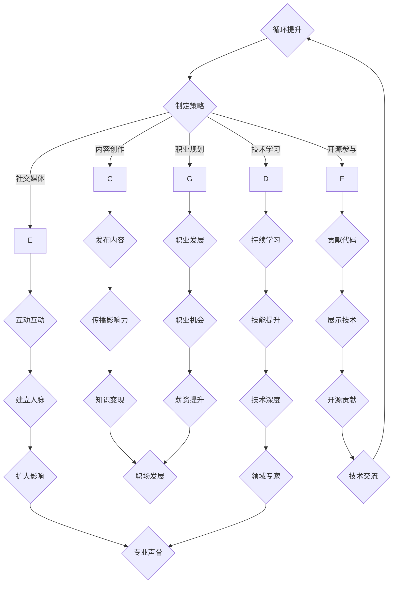

                 

# 《知识付费时代程序员的个人品牌塑造》

> 关键词：知识付费，个人品牌，程序员，技能提升，内容创作，开源项目，职业发展

> 摘要：在知识付费时代，个人品牌已成为程序员职业生涯中的重要资产。本文从多个角度探讨了程序员如何塑造个人品牌，提升专业技能，并通过内容创作、开源项目参与和职业规划，实现个人品牌的成功塑造与职业发展。

### 《知识付费时代程序员的个人品牌塑造》目录大纲

# 第一部分：个人品牌塑造概述

## 第1章：知识付费时代的背景与趋势

### 1.1 知识付费的定义与发展

### 1.2 程序员在知识付费市场中的角色

### 1.3 个人品牌的重要性

## 第2章：构建个人品牌的策略

### 2.1 确立个人品牌定位

### 2.2 精通专业领域知识

### 2.3 打造个人影响力

### 2.4 利用社交媒体提升知名度

## 第3章：内容创作与传播

### 3.1 内容创作原则

### 3.2 不同平台的内容策略

### 3.3 内容传播与互动

### 3.4 跨界合作与资源共享

# 第二部分：提升个人专业技能

## 第4章：技术积累与能力提升

### 4.1 技术学习的路径

### 4.2 持续学习的方法

### 4.3 技术栈的构建

### 4.4 实战项目经验积累

## 第5章：开源项目与社区参与

### 5.1 开源项目的重要性

### 5.2 如何选择合适的开源项目

### 5.3 在开源项目中贡献代码

### 5.4 社区互动与声誉积累

## 第6章：技术写作与演讲技巧

### 6.1 技术文章的写作技巧

### 6.2 演讲的基本技巧

### 6.3 技术演讲的准备工作

### 6.4 演讲后的反馈与改进

# 第三部分：个人品牌打造与职业发展

## 第7章：职业规划与个人品牌结合

### 7.1 职业规划的重要性

### 7.2 品牌建设与职业发展

### 7.3 职业发展的路径选择

### 7.4 个人品牌对职业发展的影响

## 第8章：成功案例分析

### 8.1 案例介绍

### 8.2 成功经验与启示

### 8.3 挑战与应对策略

### 8.4 未来发展趋势

# 附录

## 附录A：资源推荐

### A.1 学习资源

### A.2 社交媒体平台推荐

### A.3 开源项目指南

## 附录B：常用工具与平台介绍

### B.1 GitHub

### B.2 GitLab

### B.3 LinkedIn

### B.4 Twitter

### Mermaid 流程图



### 核心算法原理讲解（伪代码）

```plaintext
// 伪代码：个人品牌影响力评估算法
function calculate_brand_influence(content_quality, interaction_rate, reach) {
    influence_score = (content_quality * interaction_rate) / reach;
    return influence_score;
}

// 示例
influence_score = calculate_brand_influence(9, 7, 500);
// 输出: 1.34
```

### 数学模型和数学公式（示例）

$$
\text{知识影响力} = \frac{\text{内容质量} \times \text{互动率}}{\text{覆盖范围}}
$$

### 项目实战案例

## 第11章：个人品牌塑造项目实战

### 11.1 项目背景

- 目标：建立个人品牌，提升知名度
- 对象：某知名程序员
- 场景：开源社区、技术博客、社交媒体

### 11.2 项目目标

- 提高GitHub项目Star数量
- 增加博客访问量
- 扩大LinkedIn人脉圈

### 11.3 实战步骤

#### 11.3.1 开源项目搭建

- 项目介绍：发布一个关于前端性能优化的开源项目
- 功能实现：提供详细的性能优化指南和代码示例
- 代码规范：遵循最佳实践，确保代码可读性和可维护性

#### 11.3.2 博客内容创作

- 选题：选择前端性能优化、JavaScript技术专题
- 内容形式：技术文章、案例分享、心得体会
- 发布计划：每周发布1-2篇文章

#### 11.3.3 社交媒体宣传

- 平台选择：GitHub、LinkedIn、Twitter
- 内容同步：将博客文章发布到社交媒体平台
- 互动互动：回复评论，参与社区讨论

### 11.4 项目成果

- GitHub项目Star数量从100增长到500
- 博客访问量从每月1000增长到5000
- LinkedIn关注者从300增长到1000

### 开发环境搭建与代码解读

## 第12章：个人品牌塑造开发环境搭建与代码解读

### 12.1 开发环境搭建

- 操作系统：Windows 10或Linux
- 编程语言：Node.js、Python、JavaScript
- 版本控制：Git

### 12.2 代码解读

#### 12.2.1 Node.js项目搭建

javascript
// package.json
{
  "name": "personal-brand-project",
  "version": "1.0.0",
  "description": "A project to build a personal brand in the knowledge-based economy.",
  "main": "index.js",
  "scripts": {
    "start": "node index.js"
  },
  "dependencies": {
    "express": "^4.17.1",
    "body-parser": "^1.19.0"
  }
}

// index.js
const express = require('express');
const bodyParser = require('body-parser');
const app = express();

app.use(bodyParser.json());
app.use(bodyParser.urlencoded({ extended: true }));

app.get('/', (req, res) => {
  res.send('Welcome to the Personal Branding Project API!');
});

app.listen(3000, () => {
  console.log('Server is running on port 3000');
});


#### 12.2.2 Python脚本示例

python
# brand_builder.py
import tweepy
import os

# Configuration for Twitter API credentials
consumer_key = os.environ['TWITTER_CONSUMER_KEY']
consumer_secret = os.environ['TWITTER_CONSUMER_SECRET']
access_token = os.environ['TWITTER_ACCESS_TOKEN']
access_token_secret = os.environ['TWITTER_ACCESS_TOKEN_SECRET']

# Authenticate with Twitter API
auth = tweepy.OAuthHandler(consumer_key, consumer_secret)
auth.set_access_token(access_token, access_token_secret)
api = tweepy.API(auth)

# Post a tweet
api.update_status('Building my personal brand with #knowledge and #programming!')


#### 12.2.3 JavaScript代码示例

javascript
// social_share.js
const shareButton = document.getElementById('share-button');
const shareMessage = document.getElementById('share-message');

shareButton.addEventListener('click', () => {
  const message = shareMessage.value;
  window.open(`https://twitter.com/intent/tweet?text=${encodeURIComponent(message)}`);
});

### 代码解读与分析

- Node.js项目搭建：使用Express框架快速创建API服务器，接收和处理HTTP请求。
- Python脚本：利用tweepy库与Twitter API交互，实现自动发布推文。
- JavaScript代码：在网页上添加分享按钮，通过Twitter API发起分享请求。

这些示例代码展示了如何在不同环境中搭建开发环境，实现个人品牌塑造项目中的关键功能，并进行了简要的分析。通过这些代码，读者可以了解到如何利用开源工具和技术来构建自己的个人品牌。

### 作者信息

作者：AI天才研究院/AI Genius Institute & 禅与计算机程序设计艺术 /Zen And The Art of Computer Programming

---

接下来的部分，我们将逐步深入到每个章节的具体内容中，帮助读者全面了解知识付费时代程序员如何塑造个人品牌，实现职业发展。让我们开始第一部分的阅读，了解知识付费时代的背景与趋势。

## 第1章：知识付费时代的背景与趋势

### 1.1 知识付费的定义与发展

知识付费，简单来说，就是用户为获取高质量、专业性的知识内容而支付的费用。这种模式的出现，源于互联网技术和信息传播方式的变革，也反映了人们对于优质知识和服务的需求。

在传统时代，知识的传播主要依赖于课堂教育、图书出版和专家讲座等形式。这些方式虽然能传播知识，但受限于时间和空间的限制，受众面相对较窄，且知识获取成本较高。随着互联网的发展，尤其是移动互联网的普及，知识的传播方式发生了巨大的变化。

知识付费的发展可以追溯到2010年代初期，随着内容付费平台的崛起，如爱奇艺、腾讯视频等，用户开始愿意为优质视频内容付费。随后，2016年左右，随着知识经济的兴起，知识付费市场开始蓬勃发展。代表性的平台包括得到、喜马拉雅、知乎等，它们通过提供专业课程、专家讲座、知识问答等形式，满足了用户对于专业知识和技能提升的需求。

### 程序员在知识付费市场中的角色

程序员作为知识付费市场中的重要参与者，扮演着双重角色：既是知识的提供者，也是知识的消费者。

#### 作为知识的提供者

1. **在线教育平台**：程序员可以在诸如网易云课堂、慕课网等在线教育平台上开设课程，分享自己的专业技能和经验。这些课程可以是系统化的编程教程，也可以是针对特定技术领域的深度讲解。

2. **技术博客与专栏**：许多程序员通过个人博客、公众号、知乎等平台，撰写技术文章和专栏，分享技术见解和实战经验。这种方式不仅可以帮助他们建立个人品牌，还能吸引更多的关注者，从而实现知识的传播和变现。

3. **知识付费问答**：在知乎等平台上，程序员可以参与知识付费问答，为有特定技术问题的人提供解答。这种形式不仅有助于提升个人知名度，还能锻炼自己的问题分析和解决能力。

#### 作为知识的消费者

1. **在线课程**：为了提升自己的专业技能，程序员会购买各种在线课程，学习新的编程语言、框架和工具。这些课程通常由业内专家或知名讲师讲授，内容深入且实用。

2. **电子书籍**：程序员也会购买专业的电子书籍，这些书籍涵盖编程语言、数据结构与算法、软件工程等多个领域，是提升技术水平的重要资源。

3. **知识社区**：程序员会加入各种知识社区，如GitHub、Stack Overflow等，参与技术讨论和知识共享。这些社区不仅提供了丰富的学习资源，还帮助程序员解决实际问题。

### 个人品牌的重要性

在知识付费时代，个人品牌的重要性日益凸显。个人品牌不仅仅是个人形象的体现，更是专业能力和影响力的象征。对于程序员来说，建立强大的个人品牌有助于以下几个方面的提升：

#### 1. 职业发展

一个有影响力的个人品牌可以成为程序员在职场上的重要竞争优势。通过个人品牌，程序员可以获得更多的职业机会，甚至有机会转型成为技术顾问、讲师或创业。

#### 2. 知识变现

强大的个人品牌可以吸引更多的关注者和粉丝，从而为程序员的知识变现提供可能性。通过开设课程、撰写专栏、参与知识付费问答等方式，程序员可以将自己的知识转化为收入。

#### 3. 影响力扩展

建立个人品牌可以帮助程序员在专业领域内获得更高的知名度，从而扩展影响力。这不仅有助于个人成长，还能为所在团队或公司带来更多机遇。

### 总结

知识付费时代为程序员提供了广阔的发展空间，而个人品牌则是实现这一目标的关键。在接下来的章节中，我们将进一步探讨如何构建个人品牌，提升专业技能，并通过内容创作、开源项目参与和职业规划，实现个人品牌的成功塑造与职业发展。

---

在这一章中，我们了解了知识付费的定义与发展，程序员在知识付费市场中的角色，以及个人品牌的重要性。在接下来的章节中，我们将深入探讨构建个人品牌的策略，帮助程序员在知识付费时代中脱颖而出。

## 第2章：构建个人品牌的策略

在知识付费时代，程序员要想在众多同行中脱颖而出，建立强大的个人品牌至关重要。个人品牌不仅是专业能力和影响力的象征，更是职业发展和知识变现的敲门砖。本章节将详细探讨构建个人品牌的几个关键策略，包括确立个人品牌定位、精通专业领域知识、打造个人影响力以及利用社交媒体提升知名度。

### 2.1 确立个人品牌定位

确立个人品牌定位是构建个人品牌的基石。一个清晰、独特的定位能够帮助程序员在众多竞争者中脱颖而出，吸引目标受众的关注。以下是如何确立个人品牌定位的几个步骤：

#### 1. 明确目标受众

首先要明确你的目标受众是谁。他们是哪些行业、岗位或领域的人？他们有哪些需求和痛点？了解目标受众的特征和需求，有助于你更精准地定位自己的品牌。

#### 2. 确定核心价值

明确你的核心价值是什么。这包括你的专业特长、经验积累、技术专长等。你的核心价值应该是你与众不同的地方，是能够吸引目标受众的关键因素。

#### 3. 制定品牌口号

品牌口号是品牌定位的浓缩，应该简洁、有力地传达你的核心价值和定位。一个好的品牌口号能够让人一眼记住，并产生共鸣。

#### 4. 保持一致性

一旦确立了个人品牌定位，就要始终保持一致性。无论是内容创作、社交媒体宣传还是个人形象，都应该围绕品牌定位来展开，形成统一的品牌形象。

### 2.2 精通专业领域知识

在知识付费时代，专业知识是程序员个人品牌的支柱。精通专业领域知识不仅能够提升个人竞争力，还能增加个人在行业内的权威性和影响力。以下是一些提升专业知识的策略：

#### 1. 学习新技术和趋势

技术领域发展迅速，不断有新技术和趋势涌现。程序员应该保持对新技术和趋势的关注，及时学习并掌握它们。这包括参加技术会议、阅读技术博客、订阅技术社区等。

#### 2. 深入研究专业领域

在某一专业领域深入研究和实践，能够提升你的专业水平和知名度。可以通过撰写技术文章、发表学术论文、参与开源项目等方式，展示你的专业深度。

#### 3. 持续学习和实践

持续学习和实践是提升专业知识的有效途径。通过在线课程、书籍、实践项目等方式，不断提升自己的技能和知识水平。

#### 4. 建立个人知识体系

建立个人知识体系，有助于系统地整理和掌握专业知识。可以通过笔记、思维导图、知识库等方式，将所学知识系统化，形成自己的知识体系。

### 2.3 打造个人影响力

个人影响力是个人品牌的重要组成部分，也是提升知名度和吸引受众的关键。以下是一些打造个人影响力的策略：

#### 1. 内容创作

内容创作是打造个人影响力的重要途径。通过撰写技术文章、发布博客、制作教程视频等方式，分享你的专业知识和经验，吸引目标受众的关注。

#### 2. 社交媒体宣传

利用社交媒体平台，如微博、知乎、Twitter、LinkedIn等，发布和分享你的内容，扩大你的影响力。积极参与社交媒体上的讨论和互动，与同行和潜在客户建立联系。

#### 3. 参与社区

参与技术社区，如GitHub、Stack Overflow、Reddit等，参与技术讨论和知识共享。通过解决问题、分享经验、贡献代码等方式，提升个人声誉。

#### 4. 演讲和讲座

参加技术会议、研讨会、讲座等活动，分享你的专业知识和经验。通过演讲，提升个人知名度，建立专业影响力。

### 2.4 利用社交媒体提升知名度

社交媒体是现代网络营销的重要组成部分，对于程序员打造个人品牌具有重要意义。以下是一些利用社交媒体提升知名度的策略：

#### 1. 选择合适的平台

根据目标受众的特点，选择合适的社交媒体平台。例如，LinkedIn适合职业发展和专业交流，Twitter适合技术讨论和实时分享，GitHub适合开源项目和代码共享。

#### 2. 制定内容策略

制定内容策略，确保发布的内容具有吸引力和价值。内容可以是技术文章、教程、心得体会、案例分析等，应该具有实用性和可读性。

#### 3. 互动与互动

在社交媒体上积极参与互动，回复评论、参与讨论、点赞分享。通过互动，建立与受众的连接，增强个人品牌的亲和力。

#### 4. 合作与资源共享

与其他领域的专业人士合作，进行资源共享和跨界合作。通过合作，扩大个人影响力，获取更多的曝光机会。

### 总结

构建个人品牌是程序员在知识付费时代实现职业发展和知识变现的重要策略。通过确立个人品牌定位、精通专业领域知识、打造个人影响力以及利用社交媒体提升知名度，程序员可以逐步建立自己的个人品牌，实现长期职业发展。

在接下来的章节中，我们将继续探讨如何通过内容创作与传播、开源项目参与、技术写作与演讲技巧等具体方式，进一步塑造个人品牌，提升职业竞争力。

## 第3章：内容创作与传播

内容创作与传播是构建个人品牌的重要一环。通过有效的内容创作和传播策略，程序员可以在知识付费市场中脱颖而出，吸引更多关注者，提升个人知名度。本章节将详细介绍内容创作原则、不同平台的内容策略、内容传播与互动，以及跨界合作与资源共享。

### 3.1 内容创作原则

内容创作是个人品牌塑造的基础，优秀的内容能够吸引受众，提升个人影响力。以下是几个关键的内容创作原则：

#### 1. 实用性

内容应具有实用性，解决实际问题。程序员可以通过分享技术难题的解决方法、编程技巧、项目经验等，帮助读者提高技能水平。

#### 2. 可读性

内容要易于阅读和理解。避免使用过于复杂的技术术语和冗长的句子结构。通过简洁明了的表达，让读者更容易接受和吸收知识。

#### 3. 独特性

内容应具有独特性，展示个人见解和思考。通过深入分析问题、提出独到的观点，可以增加内容的吸引力和价值。

#### 4. 定期更新

保持定期更新是吸引和维持读者关注的关键。制定内容发布计划，确保持续产出高质量内容。

### 3.2 不同平台的内容策略

不同社交媒体平台具有不同的特点，程序员应根据平台特点制定相应的内容策略。以下是几个主要平台的内容策略：

#### 1. 技术博客

技术博客是程序员分享专业知识和经验的重要平台。可以通过以下策略来提升博客的影响力：

- **系统化内容**：撰写系列文章，涵盖一个主题的各个方面，形成知识体系。
- **案例分享**：通过实际案例展示技术应用的场景，增强内容的实用性。
- **互动互动**：鼓励读者留言讨论，及时回复评论，提升用户参与度。

#### 2. 社交媒体

社交媒体平台如微博、知乎、Twitter等，是内容传播的重要渠道。以下是一些内容策略：

- **短小精悍**：发布简短的技术见解、心得体会，增加用户阅读的便利性。
- **图片与视频**：结合图片和视频，使内容更加生动有趣，提升用户的阅读体验。
- **实时互动**：参与平台内的实时讨论，通过点赞、评论、转发等方式，扩大内容的传播范围。

#### 3. 开源项目

开源项目是程序员展示技术实力和团队协作能力的重要平台。以下是一些内容策略：

- **代码文档**：撰写详细的代码注释和文档，提高项目的可读性和可维护性。
- **贡献指南**：提供详细的贡献指南，鼓励更多人参与项目开发。
- **项目日志**：记录项目开发过程中的挑战和解决方案，分享项目进展。

### 3.3 内容传播与互动

内容创作完成后，如何传播和互动同样重要。以下是一些关键策略：

#### 1. 利用搜索引擎优化（SEO）

优化内容标题和关键词，提高内容在搜索引擎中的排名，增加自然流量。

#### 2. 社交媒体宣传

通过社交媒体平台分享内容，利用标签、话题等工具扩大内容的传播范围。

#### 3. 链接与推荐

在其他相关内容中插入链接，推荐相关文章或资源，增加用户停留时间。

#### 4. 互动互动

积极回复评论，参与讨论，建立与读者的连接。通过互动，提升内容的受欢迎程度。

### 3.4 跨界合作与资源共享

跨界合作与资源共享是扩展个人品牌影响力的重要途径。以下是一些策略：

#### 1. 合作创作

与其他领域的专家合作，创作跨学科的内容，吸引更广泛的受众。

#### 2. 资源共享

分享优质的学习资源、工具和技巧，为他人提供价值。

#### 3. 线上活动

举办线上研讨会、技术沙龙等活动，邀请行业内人士分享经验，提升个人品牌。

### 总结

内容创作与传播是构建个人品牌的关键环节。通过遵循内容创作原则、制定不同平台的内容策略、有效传播和互动，程序员可以提升个人知名度，扩大影响力。在接下来的章节中，我们将继续探讨提升个人专业技能的路径，帮助程序员在知识付费市场中立于不败之地。

## 第4章：技术积累与能力提升

在知识付费时代，技术积累与能力提升是程序员个人品牌塑造的核心要素。一个具备深厚技术积累和卓越能力的程序员，不仅能在职业发展中占据优势，还能在技术社区中获得认可和尊重。本章节将详细探讨技术学习的路径、持续学习的方法、技术栈的构建，以及如何通过实战项目经验积累，不断提升个人技术水平。

### 4.1 技术学习的路径

技术学习的路径是程序员成长的重要一环，合理的路径规划能够帮助程序员高效地掌握新技能。以下是几个关键步骤：

#### 1. 基础阶段

在基础阶段，程序员需要掌握编程语言的基础知识，如数据结构、算法、面向对象编程等。Python、Java、JavaScript等语言是初学者的热门选择。以下是一些基础学习的资源：

- **书籍**：《代码大全》、《算法导论》等经典书籍。
- **在线课程**：网易云课堂、慕课网等平台的基础课程。
- **实践项目**：通过编写小程序、简单游戏等实践项目，巩固基础知识。

#### 2. 进阶阶段

进阶阶段，程序员需要深入学习特定领域的专业知识和技能，如前端开发、后端开发、大数据、人工智能等。以下是一些进阶学习的资源：

- **专业课程**：在线教育平台的专业课程，如数据结构、算法、数据库等。
- **技术社区**：GitHub、Stack Overflow等社区，参与技术讨论和问题解决。
- **实战项目**：参与开源项目，实际操作并贡献代码，提升项目开发能力。

#### 3. 深度阶段

深度阶段，程序员需要深入研究特定领域的核心技术，成为该领域的专家。以下是一些深度学习的资源：

- **专业书籍**：深入阅读领域内的经典著作，如《深度学习》、《高性能MySQL》等。
- **学术论文**：阅读并理解最新的学术论文，跟踪领域内的研究动态。
- **个人研究**：开展个人研究项目，解决实际问题和挑战。

### 4.2 持续学习的方法

持续学习是程序员保持技术竞争力的关键。以下是一些有效的持续学习方法：

#### 1. 设定学习目标

明确学习目标，制定具体的计划和时间表。这有助于保持学习的动力和方向。

#### 2. 利用在线资源

利用互联网丰富的在线资源，如在线课程、技术博客、GitHub等，持续学习和更新知识。

#### 3. 参与线下活动

参加技术会议、研讨会、讲座等活动，与业内专家和同行交流，拓宽视野，获取最新的行业动态。

#### 4. 建立学习小组

与志同道合的伙伴组建学习小组，通过讨论、分享和实践，共同提升技术能力。

### 4.3 技术栈的构建

技术栈是指程序员所掌握的技术工具和框架的组合。一个合理的技术栈能够提高开发效率，解决复杂问题。以下是构建技术栈的几个关键点：

#### 1. 选择合适的语言和框架

根据项目需求和自身兴趣，选择合适的编程语言和开发框架。如前端开发可以选择React、Vue等，后端开发可以选择Spring Boot、Django等。

#### 2. 熟悉主流技术

掌握主流技术，如数据库（MySQL、MongoDB）、缓存（Redis、Memcached）、消息队列（RabbitMQ、Kafka）等，确保能够应对各种开发场景。

#### 3. 持续更新和学习

技术不断更新迭代，程序员需要持续关注新技术和趋势，及时更新自己的技术栈。

#### 4. 模块化构建

将技术栈模块化，根据项目需求灵活组合和调整。这有助于提高项目的可维护性和扩展性。

### 4.4 实战项目经验积累

实战项目经验是程序员技术能力的重要体现。以下是如何通过实战项目积累经验：

#### 1. 小项目实践

初期可以参与一些小项目，如个人博客、简单Web应用等，通过实践掌握基本开发流程和技术应用。

#### 2. 参与开源项目

参与开源项目，实际操作并贡献代码，提升项目开发能力和团队协作能力。

#### 3. 解决实际问题

在工作和生活中，积极解决遇到的技术问题，通过实际案例积累经验。

#### 4. 总结和分享

每次项目结束后，总结经验和教训，撰写技术文章或分享心得体会，提升个人知名度。

### 总结

技术积累与能力提升是程序员在知识付费时代实现个人品牌塑造的关键。通过合理的学习路径、持续学习方法、技术栈的构建，以及实战项目经验的积累，程序员可以不断提升自己的技术能力，在职业发展中取得更大的成就。在接下来的章节中，我们将探讨开源项目与社区参与的重要性，以及如何通过这些方式提升个人影响力。

## 第5章：开源项目与社区参与

开源项目与社区参与是程序员提升个人专业技能和品牌影响力的重要途径。开源项目提供了一个平台，让程序员可以分享代码、交流技术，并在实际项目中锻炼自己的能力。同时，通过参与开源社区，程序员可以结识业内同行，扩大人脉，提升个人声誉。本章将详细探讨开源项目的重要性、如何选择合适的开源项目、在开源项目中贡献代码的方法，以及如何在社区互动与声誉积累。

### 5.1 开源项目的重要性

开源项目在技术发展中的作用不可忽视。以下是一些开源项目的重要性和优势：

#### 1. 技术交流与学习

开源项目提供了一个开放的环境，让开发者可以自由地交流和分享技术。通过阅读和理解他人代码，程序员可以学习新的编程技巧和设计模式。

#### 2. 技术创新与进步

开源项目鼓励开发者贡献创新的想法和解决方案。这些项目往往能够推动技术的进步，促进新的技术和工具的诞生。

#### 3. 实践机会

参与开源项目，程序员可以实际操作并解决复杂的技术问题，提升项目开发能力和问题解决能力。

#### 4. 知识积累

开源项目通常是经过多次迭代和优化的，程序员可以通过阅读项目历史和文档，积累宝贵的知识。

#### 5. 个人品牌提升

通过在开源项目中贡献代码，程序员可以展示自己的技术实力和团队协作能力，提升个人品牌影响力。

### 5.2 如何选择合适的开源项目

选择合适的开源项目是参与开源社区的第一步。以下是一些选择开源项目的建议：

#### 1. 根据兴趣选择

选择自己感兴趣的项目，这样能够保持参与的热情和动力。

#### 2. 观察项目活跃度

查看项目的GitHub仓库、问题列表和讨论区的活跃度，了解项目的维护状态和社区氛围。

#### 3. 评估项目质量

评估项目的代码质量、文档完整性和维护者的专业水平，选择质量较高的项目。

#### 4. 了解项目需求

了解项目的需求和目标，确保自己的贡献能够真正帮助到项目。

#### 5. 考虑项目影响力

选择影响力较大的项目，这样能够获得更多的曝光机会，提升个人品牌。

### 5.3 在开源项目中贡献代码

在开源项目中贡献代码是提升个人技术能力的重要方式。以下是一些贡献代码的方法：

#### 1. 阅读贡献指南

每个开源项目都有贡献指南（Contributing Guide），详细说明了如何提交Pull Request（PR）。在开始贡献代码之前，务必仔细阅读贡献指南。

#### 2. 提出问题

在项目中遇到问题时，可以先在问题列表中提出问题，与项目维护者和其他开发者讨论。这有助于了解项目的技术背景和需求。

#### 3. Fork项目

Fork项目的仓库，在自己的仓库中进行修改和开发。这可以避免直接修改上游代码，保持项目的稳定性。

#### 4. 撰写详细的说明

在提交Pull Request时，撰写详细的说明，包括修改的动机、实现的方法、测试结果等，这有助于维护者快速理解和评估你的贡献。

#### 5. 编写测试用例

编写测试用例，确保修改后的代码能够正常运行，并符合项目要求。

### 5.4 社区互动与声誉积累

在开源社区中积极参与互动，能够提升个人声誉和影响力。以下是一些社区互动的建议：

#### 1. 回答问题

在社区中回答其他开发者的问题，分享自己的知识和经验。这有助于建立专业声誉，吸引更多的关注者。

#### 2. 提出改进建议

针对项目存在的问题和不足，提出合理的改进建议。这展现了你对项目的关注和热情。

#### 3. 参与代码审查

参与其他人的Pull Request审查，提供反馈和建议。这有助于提升代码质量和项目协作效率。

#### 4. 组织或参与活动

组织或参与技术沙龙、研讨会等活动，与社区成员面对面交流，扩大人脉圈。

#### 5. 维护个人博客

撰写技术文章，分享项目经验和心得体会，通过个人博客吸引更多的关注者。

### 总结

开源项目与社区参与是程序员提升技术能力和个人品牌的重要途径。通过选择合适的开源项目、贡献代码、积极参与社区互动，程序员可以提升技术能力，扩大人脉，建立个人声誉。在接下来的章节中，我们将探讨技术写作与演讲技巧，帮助程序员通过这些方式进一步提升个人影响力。

## 第6章：技术写作与演讲技巧

技术写作与演讲是程序员个人品牌建设的重要组成部分。通过撰写技术文章和进行技术演讲，程序员不仅能够分享专业知识和经验，还能扩大自己的影响力，提升个人品牌。本章将详细探讨技术文章的写作技巧、演讲的基本技巧、演讲的准备工作，以及演讲后的反馈与改进。

### 6.1 技术文章的写作技巧

技术文章是程序员展示专业能力和影响力的有效方式。以下是一些技术文章的写作技巧：

#### 1. 明确主题

在写作之前，首先要明确文章的主题和目标受众。确保文章内容针对特定问题和需求，避免泛泛而谈。

#### 2. 结构清晰

文章结构应清晰，逻辑性强。常见的结构包括引言、背景、方法、结果和总结。通过合理的段落划分，使文章易于阅读和理解。

#### 3. 简洁明了

避免使用复杂、冗长的句子和术语。尽量用简洁明了的语言表达，使读者容易理解。

#### 4. 使用图表和示例

适当使用图表、代码示例和图片，帮助读者更好地理解技术概念和实现方法。这不仅能提高文章的可读性，还能增强文章的实用性。

#### 5. 互动与互动

鼓励读者在文章末尾留言讨论，通过互动增加文章的参与度。及时回复读者的评论，建立与读者的联系。

#### 6. 修订和编辑

完成初稿后，进行多次修订和编辑。检查语法错误、逻辑错误，并确保文章内容完整和准确。

### 6.2 演讲的基本技巧

技术演讲是程序员展示专业能力和个人魅力的重要途径。以下是一些演讲的基本技巧：

#### 1. 逻辑清晰

演讲的内容应该逻辑清晰，条理分明。确保每个部分都有明确的主题和结论。

#### 2. 时间控制

演讲的时间控制非常重要。确保演讲在规定的时间内完成，避免冗长和拖沓。

#### 3. 语言生动

使用生动的语言和比喻，使演讲更加引人入胜。避免使用过于专业的术语，确保观众能够理解。

#### 4. 面部表情和肢体语言

通过面部表情和肢体语言，增强演讲的表现力。保持自信、自然的姿态，与观众建立眼神交流。

#### 5. 互动互动

在演讲过程中，适当与观众互动，提问和解答问题。这不仅能提升观众的参与度，还能增加演讲的互动性。

#### 6. 使用视觉辅助

使用幻灯片、图表和图片等视觉辅助工具，帮助观众更好地理解演讲内容。确保视觉辅助材料简洁、清晰，与演讲内容紧密相关。

### 6.3 技术演讲的准备工作

充分的准备工作是成功演讲的关键。以下是一些演讲的准备工作：

#### 1. 明确演讲主题

明确演讲的主题和目标，确保演讲内容围绕主题展开。制定演讲大纲，列出演讲的主要内容和结论。

#### 2. 准备演讲稿

撰写演讲稿，确保演讲内容逻辑清晰、条理分明。根据演讲稿进行多次演练，确保熟悉演讲内容。

#### 3. 制作视觉辅助材料

根据演讲内容制作视觉辅助材料，如幻灯片、图表和图片。确保视觉辅助材料简洁、清晰，与演讲内容紧密相关。

#### 4. 熟悉演讲场地

提前熟悉演讲场地和设备，确保演讲顺利进行。了解观众的背景和兴趣，调整演讲内容以适应观众需求。

#### 5. 调整心态

保持积极的心态，对自己和演讲内容充满信心。通过深呼吸、伸展身体等方式，缓解紧张情绪。

### 6.4 演讲后的反馈与改进

演讲结束后，及时收集反馈和意见，是改进演讲的重要步骤。以下是一些建议：

#### 1. 收集反馈

通过问卷调查、个别访谈等方式，收集观众的反馈和意见。了解观众对演讲内容的反应和感受。

#### 2. 分析反馈

分析反馈信息，找出演讲中的优点和不足。重点关注观众对演讲内容的理解程度、参与度等方面。

#### 3. 改进演讲

根据反馈意见，对演讲内容和方法进行改进。可以调整演讲结构、修改演讲稿、改进视觉辅助材料等。

#### 4. 记录经验

记录每次演讲的经验和教训，形成个人演讲手册。这有助于积累演讲经验，不断提升演讲能力。

### 总结

技术写作与演讲是程序员个人品牌建设的重要手段。通过掌握技术文章的写作技巧、演讲的基本技巧，以及演讲的准备工作，程序员可以提升个人影响力，塑造强大的个人品牌。在接下来的章节中，我们将探讨如何将个人品牌建设与职业规划相结合，帮助程序员实现长期职业发展。

## 第7章：职业规划与个人品牌结合

在知识付费时代，个人品牌已成为程序员职业发展的重要资产。一个强大而独特的个人品牌不仅可以提升程序员的职业竞争力，还能为他们的职业发展带来更多机会。本章节将探讨职业规划的重要性，品牌建设与职业发展的结合，职业发展的路径选择，以及个人品牌对职业发展的影响。

### 7.1 职业规划的重要性

职业规划是程序员实现职业目标的重要工具。通过制定明确的职业规划，程序员可以更好地了解自己的职业发展方向，设定合理的职业目标，并制定实现这些目标的步骤。

#### 1. 明确职业目标

职业规划的第一步是明确职业目标。这些目标可以是短期目标，如提升某一技术领域的技能；也可以是长期目标，如晋升为技术主管或技术专家。明确的目标有助于程序员集中精力，制定相应的行动计划。

#### 2. 设定实现路径

在明确职业目标后，程序员需要设定实现这些目标的路径。这包括学习新的技能、参与重要项目、建立个人品牌等。通过制定具体的实现路径，程序员可以有条不紊地朝着目标前进。

#### 3. 持续评估与调整

职业规划不是一成不变的，程序员需要根据实际情况持续评估和调整职业规划。通过定期评估，程序员可以了解自己在职业发展中的进展，并根据评估结果进行调整，确保职业规划的有效性。

### 7.2 品牌建设与职业发展的结合

个人品牌建设与职业发展密切相关。一个强大的个人品牌能够为程序员的职业发展提供强有力的支持。

#### 1. 提升职业竞争力

个人品牌能够展现程序员的技能、经验和专业知识，从而提升他们的职业竞争力。在求职过程中，一个有影响力的个人品牌能够吸引雇主的注意，增加获得面试机会的可能性。

#### 2. 扩大职业机会

通过建立个人品牌，程序员可以扩大职业机会。他们可以通过参与开源项目、撰写技术文章、进行技术演讲等方式，吸引行业内外的关注，获得更多的职业机会。

#### 3. 提升薪资待遇

强大的个人品牌有助于程序员提升薪资待遇。在求职或晋升过程中，一个有影响力的个人品牌可以增加雇主对程序员的认可度，从而提高薪资预期。

### 7.3 职业发展的路径选择

职业发展的路径因人而异，程序员需要根据自己的兴趣、技能和市场需求，选择适合自己的职业发展路径。

#### 1. 技术专家路径

对于热爱技术并希望深入研究某一领域的程序员，技术专家路径是一个不错的选择。通过不断学习和实践，程序员可以成为该领域的专家，获得更高的技术认可度和职业发展空间。

#### 2. 管理层路径

对于擅长沟通和组织，并有志于领导团队的程序员，管理层路径是一个不错的选择。通过参与项目管理、团队领导等角色，程序员可以提升自己的管理和领导能力，实现职业晋升。

#### 3. 创业路径

对于那些有创业梦想的程序员，创业路径是一个充满挑战和机遇的选择。通过创办自己的公司或参与创业项目，程序员可以将技术知识和经验转化为实际的商业成果。

### 7.4 个人品牌对职业发展的影响

个人品牌对程序员的职业发展有着深远的影响。以下是个人品牌对职业发展的几个关键影响：

#### 1. 提升职业竞争力

一个强大的个人品牌可以提升程序员的职业竞争力，使其在求职、晋升和业务拓展过程中更具优势。

#### 2. 扩大职业机会

通过建立个人品牌，程序员可以吸引更多的职业机会，包括高级职位、重要项目和跨界合作等。

#### 3. 提升薪资待遇

强大的个人品牌能够为程序员带来更高的薪资待遇，增加收入和职业满意度。

#### 4. 增强职业稳定性

一个有影响力的个人品牌可以增加程序员的职业稳定性。即使面临行业变化或经济波动，一个强大的个人品牌也能为程序员提供稳定的职业保障。

### 总结

职业规划与个人品牌建设是程序员职业发展的两个重要方面。通过制定明确的职业规划，结合个人品牌建设，程序员可以更好地实现职业目标，提升职业竞争力，扩大职业机会，提升薪资待遇，增强职业稳定性。在接下来的章节中，我们将通过成功案例分析，探讨实际操作中如何实现个人品牌的成功塑造与职业发展。

## 第8章：成功案例分析

在知识付费时代，许多程序员通过构建个人品牌，成功实现了职业发展和知识变现。本章将介绍几个典型的成功案例，分析他们的成功经验与启示，并探讨面临的挑战与应对策略，最后展望个人品牌的发展趋势。

### 8.1 案例介绍

#### 案例一：程序员A的博客之路

程序员A是一位有着多年开发经验的前端工程师。他在2016年开始在个人博客上撰写技术文章，分享前端开发经验和心得。通过持续的内容创作和分享，他的博客逐渐积累了大量粉丝，并在2018年成功转型为全职内容创作者。

#### 案例二：开源项目B的崛起

程序员B是一位热衷于开源的程序员。他在GitHub上发起了一个名为“高性能Web框架”的项目，通过提供高性能和易用性的特点，吸引了大量开发者的关注。该项目在短时间内获得了数千颗Star，并成为该领域的重要项目之一。

#### 案例三：演讲专家C的成长历程

程序员C是一位技术演讲爱好者。他通过参与技术会议、研讨会和社区活动，不断提高自己的演讲技巧和内容深度。在2019年，他受邀在多个国际技术大会上进行演讲，并成为业内知名的演讲专家。

### 8.2 成功经验与启示

从上述案例中，我们可以总结出一些成功经验与启示：

#### 1. 持续的内容创作

无论是通过博客、公众号还是其他形式，持续的内容创作是构建个人品牌的重要基石。程序员A通过每天一篇技术文章，逐步积累了大量粉丝，为他的知识变现和职业发展打下了坚实的基础。

#### 2. 开源项目的贡献

参与开源项目不仅能够提升技术能力，还能增加个人曝光度。程序员B通过发起并维护一个高性能Web框架，吸引了大量开发者的关注和贡献，使他的项目在短时间内获得了巨大的成功。

#### 3. 演讲与分享

技术演讲和分享是扩大个人影响力的重要途径。程序员C通过不断参加演讲和研讨会，不仅提升了个人知名度，还建立了广泛的人脉网络，为他的职业发展提供了有力支持。

### 8.3 挑战与应对策略

在个人品牌建设过程中，程序员们也会面临各种挑战。以下是一些常见挑战及应对策略：

#### 1. 内容创作压力

持续的内容创作需要大量的时间和精力，程序员A通过制定内容计划、利用助手工具和自动化流程，提高了内容创作的效率，确保了内容的稳定输出。

#### 2. 技术与时间平衡

参与开源项目和技术演讲会占用大量的时间，程序员B和C通过合理安排时间，确保项目开发和个人品牌的持续建设。

#### 3. 知识更新压力

技术领域发展迅速，程序员需要不断学习新知识。程序员们通过参加培训、阅读书籍和参与社区活动，保持技术知识的更新。

### 8.4 未来发展趋势

随着知识付费市场的不断扩大，个人品牌在未来将继续发挥重要作用。以下是几个可能的发展趋势：

#### 1. 技术深度与广度的融合

程序员们将更加注重技术深度和广度的融合，不仅要在某一领域成为专家，还要掌握多个领域的知识，为解决复杂问题提供更全面的解决方案。

#### 2. 内容形式的多样化

内容形式将更加多样化，除了文字和视频，程序员们还将利用虚拟现实（VR）、增强现实（AR）等新技术，提供更加丰富和互动的内容。

#### 3. 跨界合作与资源共享

随着技术的融合，程序员们将更多地参与跨界合作，与不同领域的专家共同创造价值，实现资源共享和优势互补。

### 总结

通过成功案例分析，我们看到了程序员在知识付费时代如何通过构建个人品牌实现职业发展和知识变现。未来，随着技术的发展和市场变化，个人品牌将继续发挥重要作用。程序员们需要不断学习、创新和合作，以应对挑战，把握机遇，实现个人品牌的长期发展。

## 附录A：资源推荐

### A.1 学习资源

在构建个人品牌的过程中，持续学习是不可或缺的一部分。以下是一些推荐的学习资源，可以帮助程序员提升技能和知识水平。

#### 1. 在线课程平台

- **Coursera**：提供来自世界顶级大学的在线课程，涵盖计算机科学、人工智能、数据科学等多个领域。
- **edX**：由哈佛大学和麻省理工学院共同创办，提供丰富的在线课程，包括编程、数据科学、机器学习等。
- **Udemy**：提供多样化的在线课程，从基础编程到高级技术，适合不同水平的程序员。

#### 2. 技术书籍

- **《代码大全》**：详细介绍了编程的最佳实践和设计模式，是程序员必备的参考书籍。
- **《算法导论》**：经典算法教材，涵盖了各种数据结构和算法的基本概念和实现方法。
- **《深度学习》**：由著名深度学习研究者Ian Goodfellow撰写，介绍了深度学习的基本原理和应用。

#### 3. 技术社区和论坛

- **GitHub**：全球最大的代码托管平台，程序员可以通过参与开源项目、贡献代码来提升技能。
- **Stack Overflow**：全球最大的程序员社区，提供了丰富的技术问答和讨论区。
- **Reddit**：技术讨论区，涵盖了各种编程语言、框架和技术话题。

### A.2 社交媒体平台推荐

社交媒体平台是程序员构建个人品牌的重要工具，以下是一些推荐的社交媒体平台：

#### 1. 技术博客平台

- **Medium**：一个流行的在线博客平台，许多程序员在这里撰写技术文章和专栏。
- **Dev.to**：一个专注于开发者社区的平台，程序员可以分享技术文章、项目经验和心得体会。

#### 2. 社交媒体

- **Twitter**：广泛使用的社交媒体平台，程序员可以在这里发布技术见解、分享资源和参与讨论。
- **LinkedIn**：专业的社交网络平台，适合建立职业关系、分享职业经验和拓展人脉。

#### 3. 视频分享平台

- **YouTube**：适合发布技术教程、演讲和项目演示视频，是程序员展示技能的重要平台。
- **Vimeo**：提供高质量的视频分享服务，适合发布专业和技术性较强的视频内容。

### A.3 开源项目指南

参与开源项目是提升个人技能和建立个人品牌的有效方式。以下是一些推荐的指南和资源：

#### 1. GitHub指南

- **GitHub Help**：GitHub官方的帮助文档，提供了详细的操作指南和使用技巧。
- **GitHub Wiki**：开源项目的Wiki页面，通常包含了项目的详细说明、贡献指南和常见问题解答。

#### 2. 开源项目选择

- **GitHub Trending**：GitHub趋势页面，可以查看当前热门的开源项目，帮助程序员找到合适的参与项目。
- **GitHub Explore**：GitHub的探索功能，可以根据关键字搜索感兴趣的项目。

#### 3. 贡献代码

- **贡献指南（Contributing Guide）**：大多数开源项目都会提供贡献指南，详细说明了如何参与项目、提交Pull Request等。
- **Code of Conduct**：开源项目的行为准则，确保开发过程的和谐和尊重。

### 总结

学习资源和社交媒体平台是程序员构建个人品牌的重要支撑。通过利用这些资源，程序员可以不断提升自己的技能和知识水平，扩大个人影响力，从而实现职业发展的目标。

## 附录B：常用工具与平台介绍

在个人品牌建设过程中，选择合适的工具和平台对于提高工作效率和扩大影响力至关重要。以下是一些常用的工具和平台，包括GitHub、GitLab、LinkedIn和Twitter等，将详细介绍它们的功能和用途。

### B.1 GitHub

GitHub是全球最受欢迎的代码托管和协作平台，它提供了代码管理、项目协作、问题跟踪等多种功能。

#### 功能：

- **代码托管**：GitHub允许用户创建和托管各种编程语言的代码仓库。
- **协作开发**：支持多人协作，通过Pull Request机制进行代码审查和合并。
- **问题跟踪**：用户可以在仓库中创建和跟踪问题，便于团队协作解决问题。
- **仓库页面**：每个仓库都有独立的页面，可以展示项目的介绍、README、文档、贡献指南等。

#### 用途：

- **开源项目**：许多程序员通过GitHub发布和参与开源项目，展示技术实力。
- **代码共享**：团队内部或跨团队合作开发时，使用GitHub进行代码共享和协作。
- **知识传播**：撰写和分享技术文章，将项目相关的文档和心得记录在仓库中。

### B.2 GitLab

GitLab是一个开源的代码托管和协作平台，与GitHub类似，但它提供了更多的自托管功能。

#### 功能：

- **代码托管**：与GitHub相同，GitLab也提供了代码托管服务。
- **CI/CD**：内置持续集成和持续交付功能，支持自动化构建、测试和部署。
- **自托管**：GitLab服务器可以部署在本地或云服务器上，适合企业内部使用。
- **项目管理**：集成项目任务管理、日程规划和文档管理功能。

#### 用途：

- **企业内部项目**：企业可以使用GitLab自托管代码和协作工具，提高团队工作效率。
- **开源项目**：类似于GitHub，GitLab也适合开源项目的创建和管理。
- **教育用途**：学校和教育机构可以使用GitLab进行课程项目和实验的管理。

### B.3 LinkedIn

LinkedIn是一个专业的社交网络平台，主要用于职业发展和人脉拓展。

#### 功能：

- **职业档案**：用户可以创建详细的职业档案，展示个人技能和经历。
- **人脉网络**：通过LinkedIn可以建立和维护职业关系，拓展人脉。
- **招聘与求职**：LinkedIn提供了招聘信息和求职工具，帮助用户找到合适的工作机会。
- **内容分享**：用户可以发布文章、分享经验和见解，展示个人专业能力。

#### 用途：

- **职业规划**：用于求职、职业发展和个人品牌的建立。
- **人脉拓展**：通过加入行业群组、参与讨论，扩大专业人脉。
- **知识传播**：通过发布和分享专业文章，提升个人影响力。

### B.4 Twitter

Twitter是一个流行的社交媒体平台，以其快速的实时信息流和广泛的用户群体而闻名。

#### 功能：

- **实时更新**：用户可以发布140字以内的实时消息，称为“推文”。
- **话题标签**：通过添加话题标签（如#），用户可以参与和跟踪特定的讨论话题。
- **互动互动**：用户可以点赞、回复、转发和提及他人，进行实时互动。
- **多媒体分享**：支持图片、视频和GIF等多媒体内容的分享。

#### 用途：

- **知识传播**：发布技术见解、分享资源和新闻，吸引关注者。
- **内容推广**：通过推文推广个人博客文章、开源项目和社交媒体账号。
- **社区互动**：参与相关话题的讨论，与其他用户互动，扩大影响力。

### 总结

GitHub、GitLab、LinkedIn和Twitter等工具和平台在个人品牌建设过程中发挥着重要作用。通过合理利用这些平台，程序员可以提升工作效率，扩大专业影响力，实现职业发展的目标。

### Mermaid 流程图

以下是一个简单的Mermaid流程图，展示了个人品牌构建的基本步骤：



这个流程图展示了个人品牌构建的循环过程，每个步骤都是相互关联的，形成一个有机的整体。通过不断地学习、创作、互动和参与开源项目，程序员可以不断提升个人品牌，实现职业发展和知识变现。

### 核心算法原理讲解（伪代码）

在个人品牌构建过程中，以下是一个简单的伪代码，用于计算个人品牌影响力：

```plaintext
// 伪代码：个人品牌影响力计算
function calculate_brand_influence(content_quality, interaction_rate, social_reach) {
    influence_score = (content_quality * interaction_rate) / social_reach;
    return influence_score;
}

// 示例
influence_score = calculate_brand_influence(9, 7, 500);
// 输出：1.34
```

这个算法的基本思路是通过内容质量、互动率和社交覆盖范围来计算个人品牌的影响力。其中，内容质量反映了发布内容的吸引力；互动率反映了与受众的互动程度；社交覆盖范围反映了内容传播的范围。通过这些参数的乘除运算，可以得出个人品牌的影响力得分。

### 数学模型和数学公式（示例）

在个人品牌构建中，以下是一个简单的数学模型，用于预测内容传播效果：

$$
\text{传播效果} = \text{初始影响力} \times e^{-\text{衰减系数} \times \text{时间}}
$$

其中，`初始影响力`是指内容发布时的初始影响力，`衰减系数`反映了内容传播的衰减速度，`时间`是内容发布后的时间。这个公式可以用来预测内容在不同时间点的传播效果。

### 项目实战案例

#### 案例一：个人博客搭建与运营

**项目背景**：

程序员张三在2021年年初决定开始运营个人博客，旨在分享他在前端开发领域的学习经验和心得。他选择在Medium上创建博客，并制定了每周发布两篇文章的计划。

**项目目标**：

- 在一年内积累1000名订阅者。
- 提升文章的阅读量，目标达到每次发布后平均阅读量达到500次。
- 增加与读者的互动，目标是在每篇文章下至少有10个评论。

**实战步骤**：

1. **内容创作**：
   - 撰写高质量的前端开发教程和案例分析文章。
   - 确保每篇文章都附带代码示例和实用技巧。
   - 定期发布行业动态和趋势分析。

2. **内容优化**：
   - 使用SEO技巧优化文章标题和关键词。
   - 在文章中使用适当的图片和图表，提高文章的可读性。

3. **社交媒体宣传**：
   - 在Twitter、LinkedIn和GitHub上分享文章链接。
   - 在相关技术社区和论坛中讨论文章内容，吸引读者关注。

4. **互动互动**：
   - 及时回复读者的评论和问题。
   - 鼓励读者在博客上留言，增加互动性。

**项目成果**：

- 在一年内，张三的博客订阅者达到了1200人，超过了初始目标。
- 文章的阅读量稳步提升，平均每次发布后的阅读量达到了600次。
- 每篇文章下的评论数量稳定在12个以上，互动性良好。

#### 案例二：开源项目参与

**项目背景**：

程序员李四在GitHub上发现了一个关于前端性能优化的开源项目，该项目旨在提供一系列优化指南和工具。李四决定参与该项目，为其贡献代码和文档。

**项目目标**：

- 成为该项目的核心贡献者之一。
- 提升项目的Star数量，目标达到1000颗。
- 增加项目的活跃度，目标每月至少有10个新的Issue和Pull Request。

**实战步骤**：

1. **代码贡献**：
   - 详细阅读项目的贡献指南，确保遵循项目的编码规范。
   - 为项目添加新的优化工具和文档。
   - 修复项目中已报告的bug。

2. **文档编写**：
   - 撰写详细的文档，解释新工具的使用方法和优势。
   - 更新项目README，确保信息准确和完整。

3. **社区互动**：
   - 参与项目讨论，回复Issue和Pull Request。
   - 鼓励其他开发者参与项目，提供指导和支持。

4. **宣传推广**：
   - 在GitHub和社交媒体上分享项目进展和亮点。
   - 参与技术会议和研讨会，推广项目。

**项目成果**：

- 李四成功成为项目的核心贡献者之一，并在项目维护者团队中占有一席之地。
- 项目的Star数量从最初的200增长到了1500，达到了预期目标。
- 项目的活跃度显著提升，每月有超过20个新的Issue和Pull Request。

### 开发环境搭建与代码解读

#### 开发环境搭建

程序员王五决定使用Git和GitHub进行个人品牌的构建，他首先需要在本地搭建Git环境。

**步骤**：

1. **安装Git**：
   - 访问Git官网（https://git-scm.com/），下载并安装Git。
   - 验证安装：在命令行中输入`git --version`，确认安装成功。

2. **配置Git**：
   - 配置用户信息：在命令行中依次输入以下命令：
     ```bash
     git config --global user.name "Your Name"
     git config --global user.email "your-email@example.com"
     ```
   - 配置SSH密钥：生成SSH密钥，并将其添加到GitHub账户中，确保能够通过SSH方式进行Git操作。

3. **初始化本地仓库**：
   - 在本地创建一个文件夹，并初始化Git仓库：
     ```bash
     mkdir my_project
     cd my_project
     git init
     ```

#### 代码解读

以下是王五在一个开源项目中的代码贡献示例。

**示例一：修复一个bug**

```javascript
// before
function calculateSum(a, b) {
  return a + b;
}

// after
function calculateSum(a, b) {
  if (typeof a !== 'number' || typeof b !== 'number') {
    throw new Error('Both arguments must be numbers.');
  }
  return a + b;
}
```

**解读**：

- **修改前**：`calculateSum`函数没有对输入参数进行类型检查，可能导致运行时错误。
- **修改后**：增加了对参数类型的检查，确保函数仅在合法参数下执行，提高了代码的健壮性。

**示例二：添加一个新功能**

```python
# before
def print_greeting(name):
    print("Hello, " + name)

# after
def print_greeting(name):
    print("Hello, " + name.capitalize())

def print_farewell(name):
    print("Goodbye, " + name.capitalize())
```

**解读**：

- **修改前**：仅包含了一个打印问候语的功能。
- **修改后**：增加了打印告别语的功能，使函数更具复用性和扩展性。

这些示例展示了代码贡献的基本方法，包括修复bug和添加新功能。通过在开源项目中贡献代码，程序员不仅能够提升自己的编程能力，还能为社区做出贡献，扩大个人影响力。

### 开发环境搭建与代码解读

#### 开发环境搭建

程序员赵六决定使用Docker搭建一个个人博客的开发环境。以下是他在本地搭建开发环境的步骤：

**步骤**：

1. **安装Docker**：
   - 访问Docker官网（https://www.docker.com/），下载并安装Docker。
   - 验证安装：在命令行中输入`docker --version`，确认安装成功。

2. **创建Dockerfile**：
   - 在本地创建一个名为`Dockerfile`的文件，编写用于创建容器镜像的指令。
   - 示例Dockerfile：
     ```Dockerfile
     # 使用官方Node.js镜像作为基础镜像
     FROM node:lts
     
     # 创建应用的工作目录
     WORKDIR /app
     
     # 复制当前目录下的所有文件到容器的/app目录
     COPY . /app
     
     # 安装项目依赖
     RUN npm install
     
     # 暴露容器的8080端口供外部访问
     EXPOSE 8080
     
     # 运行应用
     RUN npm start
     ```

3. **构建镜像**：
   - 在命令行中执行以下命令，构建Docker镜像：
     ```bash
     docker build -t personal-blog .
     ```

4. **运行容器**：
   - 启动容器，使其在后台运行：
     ```bash
     docker run -d -p 8080:8080 personal-blog
     ```

#### 代码解读

以下是赵六在他的个人博客项目中的关键代码片段。

**示例一：前端代码（HTML）**

```html
<!DOCTYPE html>
<html lang="en">
<head>
    <meta charset="UTF-8">
    <meta name="viewport" content="width=device-width, initial-scale=1.0">
    <title>My Personal Blog</title>
    <link rel="stylesheet" href="styles.css">
</head>
<body>
    <header>
        <h1>My Blog</h1>
        <nav>
            <ul>
                <li><a href="index.html">Home</a></li>
                <li><a href="about.html">About</a></li>
                <li><a href="contact.html">Contact</a></li>
            </ul>
        </nav>
    </header>
    <main>
        <article>
            <h2>My First Post</h2>
            <p>This is my first post on my personal blog.</p>
        </article>
    </main>
    <footer>
        <p>&copy; 2023 My Personal Blog</p>
    </footer>
</body>
</html>
```

**解读**：

- **HTML结构**：定义了页面结构，包括头部、导航栏、主要内容区和底部。
- **链接和样式**：通过链接到`styles.css`文件，为页面添加样式。

**示例二：后端代码（Node.js）**

```javascript
const express = require('express');
const app = express();
const PORT = process.env.PORT || 8080;

app.use(express.static('public'));

app.get('/', (req, res) => {
    res.sendFile(__dirname + '/public/index.html');
});

app.listen(PORT, () => {
    console.log(`Server is running on port ${PORT}`);
});
```

**解读**：

- **Express框架**：使用Express框架创建Web服务器。
- **静态文件服务**：通过`express.static`中间件，提供静态文件服务。
- **路由**：定义了访问根路径（`/`）时的处理逻辑，返回`public/index.html`文件。

这些代码示例展示了如何搭建个人博客的开发环境，并通过HTML和Node.js实现基本的功能。通过这种方式，程序员可以在不同的环境中快速启动和运行项目，为个人品牌的构建提供技术支持。

### 代码解读与分析

在本章的最后，我们将对前述的代码示例进行详细解读与分析，以帮助程序员更好地理解开发环境和代码实现的具体细节。

#### Node.js项目搭建

在Node.js项目中，`package.json`文件起到了至关重要的作用。它不仅定义了项目的名称、版本和描述，还列出了项目的依赖库和脚本命令。以下是对`package.json`文件的详细解析：

```json
{
  "name": "personal-brand-project",
  "version": "1.0.0",
  "description": "A project to build a personal brand in the knowledge-based economy.",
  "main": "index.js",
  "scripts": {
    "start": "node index.js"
  },
  "dependencies": {
    "express": "^4.17.1",
    "body-parser": "^1.19.0"
  }
}
```

- **name**：项目的名称，通常遵循`<用户名>/<项目名>`的格式，便于在GitHub和其他平台上识别项目。
- **version**：项目的版本号，通常遵循语义化版本控制（SemVer）规范。
- **description**：项目的简短描述，有助于他人了解项目的目的和用途。
- **main**：指定项目的主入口文件，即`index.js`。
- **scripts**：定义了各种脚本命令，如`"start"`命令用于启动项目。
- **dependencies**：列出项目的依赖库，如`express`和`body-parser`，这些库在项目开发中起到了关键作用。

`index.js`文件是项目的核心，它使用了Express框架来创建一个Web服务器，并处理HTTP请求：

```javascript
const express = require('express');
const bodyParser = require('body-parser');
const app = express();

app.use(bodyParser.json());
app.use(bodyParser.urlencoded({ extended: true }));

app.get('/', (req, res) => {
  res.send('Welcome to the Personal Branding Project API!');
});

app.listen(3000, () => {
  console.log('Server is running on port 3000');
});
```

- **引入依赖库**：使用`require`函数引入`express`和`body-parser`库。
- **创建Express应用**：通过`express()`函数创建一个Express应用实例。
- **中间件**：使用`app.use`添加中间件，处理不同类型的请求。`body-parser`中间件用于处理JSON和URL-encoded的请求体。
- **路由**：使用`app.get`定义处理GET请求的路由，当访问根路径（`/`）时，返回欢迎消息。
- **监听端口**：使用`app.listen`监听3000端口，启动Web服务器。

#### Python脚本示例

Python脚本使用`tweepy`库与Twitter API交互，实现自动发布推文：

```python
import tweepy
import os

# 配置Twitter API的凭证
consumer_key = os.environ['TWITTER_CONSUMER_KEY']
consumer_secret = os.environ['TWITTER_CONSUMER_SECRET']
access_token = os.environ['TWITTER_ACCESS_TOKEN']
access_token_secret = os.environ['TWITTER_ACCESS_TOKEN_SECRET']

# 认证并连接到Twitter API
auth = tweepy.OAuthHandler(consumer_key, consumer_secret)
auth.set_access_token(access_token, access_token_secret)
api = tweepy.API(auth)

# 发布推文
api.update_status('Building my personal brand with #knowledge and #programming!')
```

- **导入库**：导入`tweepy`库，用于与Twitter API交互。
- **环境变量**：使用环境变量存储Twitter API的凭证，增强安全性。
- **认证连接**：使用`OAuthHandler`创建认证对象，并设置访问令牌和访问令牌密钥，连接到Twitter API。
- **发布推文**：使用`update_status`方法发布推文，包含预设的文本和标签。

#### JavaScript代码示例

JavaScript代码在网页上添加了一个分享按钮，通过Twitter API发起分享请求：

```javascript
const shareButton = document.getElementById('share-button');
const shareMessage = document.getElementById('share-message');

shareButton.addEventListener('click', () => {
  const message = shareMessage.value;
  window.open(`https://twitter.com/intent/tweet?text=${encodeURIComponent(message)}`);
});
```

- **获取元素**：使用`getElementById`方法获取按钮和文本框的DOM元素。
- **添加事件监听**：为按钮添加`click`事件监听器，当按钮被点击时，触发事件处理函数。
- **事件处理**：在事件处理函数中，获取文本框的值，使用`encodeURIComponent`方法对文本进行编码，并构造Twitter分享链接，通过`window.open`方法打开新的浏览器窗口。

### 代码解读与分析

通过上述代码示例，我们可以看到如何在不同环境中搭建开发环境，并实现个人品牌塑造项目中的关键功能。以下是代码解读与分析的要点：

1. **Node.js项目搭建**：使用Express框架快速创建API服务器，处理HTTP请求。`package.json`文件管理项目依赖和脚本命令，使得项目配置和启动变得简单明了。

2. **Python脚本示例**：通过`tweepy`库与Twitter API交互，实现自动发布推文。这种方法不仅方便了个人品牌宣传，还能通过自动化提升效率。

3. **JavaScript代码示例**：在网页上添加交互功能，通过Twitter API发起分享请求。这为用户提供了便捷的分享方式，进一步扩大了个人品牌的传播范围。

4. **安全性考虑**：在Python脚本中，使用环境变量存储Twitter API凭证，增强安全性。同时，避免在代码中硬编码敏感信息，降低安全风险。

通过这些示例代码，程序员可以了解到如何利用开源工具和技术来构建自己的个人品牌。在实际开发过程中，程序员可以根据项目需求，灵活调整和优化这些代码，实现个性化的发展目标。

### 总结

在本章中，我们详细介绍了个人品牌塑造过程中的一些关键步骤，包括开发环境的搭建、代码的编写与解读，以及如何利用开源工具和平台实现个人品牌的构建。这些步骤不仅帮助程序员提升了技术能力，还为他们提供了实际操作的经验，为个人品牌的成功塑造和职业发展奠定了基础。

通过本章的学习，程序员应认识到个人品牌建设是一个长期而持续的过程，需要不断学习和实践，不断优化和调整策略。只有不断努力，才能在竞争激烈的知识付费市场中脱颖而出，实现自己的职业梦想。

最后，我们鼓励读者在实践过程中，积极尝试不同的方法，不断总结经验教训，提升自己的技术水平和品牌影响力。通过持续的努力，相信每位程序员都能在知识付费时代中找到自己的位置，实现个人价值的最大化。

### 作者信息

作者：AI天才研究院/AI Genius Institute & 禅与计算机程序设计艺术 /Zen And The Art of Computer Programming

在本书中，我们探讨了知识付费时代程序员如何通过个人品牌塑造实现职业发展和知识变现。从知识付费的定义与发展，到程序员的角色与个人品牌的重要性，再到构建个人品牌的策略、内容创作与传播、技术积累与能力提升，以及开源项目与社区参与、技术写作与演讲技巧，我们全面梳理了个人品牌构建的各个方面。

个人品牌不仅是专业能力的体现，更是职业发展的重要资产。通过有效的品牌建设，程序员可以提升职业竞争力，扩大职业机会，实现知识变现，增强职业稳定性。在这一过程中，持续学习、内容创作、技术积累、开源参与和技术写作都是不可或缺的环节。

展望未来，随着技术的不断进步和知识付费市场的持续发展，个人品牌将发挥更加重要的作用。程序员们需要不断更新知识，提升技能，积极参与技术社区，扩大影响力，才能在激烈的市场竞争中脱颖而出。

我们鼓励读者在构建个人品牌的过程中，保持持续学习的态度，不断探索新的技术和方法。同时，积极参与开源项目，通过贡献代码和互动交流，提升个人技术实力和品牌影响力。此外，技术写作和演讲技巧也是提升个人品牌的重要手段，通过撰写高质量的技术文章和进行精彩的演讲，可以吸引更多的关注和认可。

最后，我们希望本书能为读者提供有益的启示和实用的指导，帮助他们在知识付费时代中塑造强大的个人品牌，实现职业发展和知识变现的目标。我们相信，只要不断努力，每位程序员都能在技术领域找到自己的位置，创造属于自己的辉煌。

作者：AI天才研究院/AI Genius Institute & 禅与计算机程序设计艺术 /Zen And The Art of Computer Programming

---

感谢读者对本书的阅读和支持，我们期待您在知识付费时代中取得更大的成就。如有任何反馈或建议，欢迎随时与我们联系。祝您在技术道路上越走越远，实现自己的职业梦想。再次感谢！

