                 

### 《知识付费：程序员的社群运营攻略》

> **关键词：知识付费、社群运营、程序员、运营策略、互动机制、内容策划、品牌建设、数据分析、工具与平台**

> **摘要：本文将深入探讨知识付费在程序员社群运营中的应用，解析社群运营的重要性、目标、模式，并详细阐述社群定位、成员管理、内容策划、互动引导、品牌建设、数据分析、工具与平台选择等方面的策略。通过实际案例分析，总结经验，为程序员社群运营提供实战指导。**

### 《知识付费：程序员的社群运营攻略》目录大纲

## **第一部分：社群运营基础**

### **第1章：社群运营概述**

#### **1.1 社群运营的重要性**

- **概念解释：** 社群运营是一种通过创建和维护在线或线下社区，以促进用户参与、交流和互动的方式，提高用户满意度和忠诚度的运营模式。
- **为什么重要：** 对于程序员社群，社群运营能够增强成员之间的联系，提高成员的活跃度和参与度，从而为社群成员提供价值，促进知识共享和技能提升。

#### **1.2 社群运营的目标和原则**

- **目标：** 提高用户满意度、促进知识共享、提升社群活跃度、增强社群成员的忠诚度。
- **原则：**
  - **用户至上：** 以用户需求为导向，关注用户满意度和体验。
  - **内容为王：** 提供高质量、有价值的内容，吸引并留住用户。
  - **互动为本：** 通过互动机制促进用户参与和交流，提高社群活跃度。
  - **持续优化：** 根据社群运营数据和用户反馈，不断调整和优化运营策略。

#### **1.3 社群运营的常见模式**

- **内容驱动型社群：** 通过提供高质量内容，吸引和留住用户。
- **活动驱动型社群：** 通过定期举办线上或线下活动，提高用户参与度。
- **社交驱动型社群：** 通过社交互动和交流，增强用户之间的联系。
- **混合型社群：** 结合内容、活动和社交等多种模式，提高社群的多样性和吸引力。

## **第二部分：社群运营技巧**

### **第4章：内容策划与发布**

#### **4.1 内容类型与规划**

- **技术文章：** 分享编程技巧、技术趋势、解决方案等。
- **教程视频：** 介绍编程语言、框架、工具的使用方法。
- **直播讲座：** 邀请行业专家进行技术分享和答疑。
- **问答互动：** 回答用户提出的问题，提供帮助和支持。

#### **4.2 内容质量提升策略**

- **精选内容：** 提高内容质量，确保每一篇技术文章或视频都有价值。
- **多样化内容：** 结合不同类型的内容，满足不同用户的需求。
- **定期更新：** 保持内容更新频率，确保社群的活跃度和新鲜感。

#### **4.3 内容发布与推广方法**

- **内部推广：** 利用社群内部渠道，如公众号、论坛、微信群等，进行内容推广。
- **外部推广：** 利用其他平台，如技术社区、博客、社交媒体等，扩大内容传播范围。
- **合作推广：** 与其他社群或机构合作，共同推广内容，提高影响力。

### **第5章：社群互动与引导**

#### **5.1 互动策略与技巧**

- **激励机制：** 设立积分、勋章等机制，鼓励用户参与互动。
- **话题引导：** 发布热点话题，引导用户进行讨论和分享。
- **互动工具：** 利用评论、点赞、分享等功能，增强用户互动。

#### **5.2 热点话题引导**

- **行业热点：** 关注行业动态，发布与热点相关的讨论话题。
- **技术难题：** 发布技术难题，邀请用户共同探讨和解决。
- **生活趣事：** 分享生活趣事，增强社群的趣味性和凝聚力。

#### **5.3 互动效果评估与优化**

- **数据监控：** 监控互动数据，如评论数、点赞数、分享数等。
- **反馈收集：** 收集用户反馈，了解用户的意见和建议。
- **策略调整：** 根据数据反馈和用户需求，调整互动策略和内容策划。

### **第6章：社群品牌建设**

#### **6.1 品牌定位与价值塑造**

- **品牌定位：** 确定社群的目标受众、定位和特色。
- **价值塑造：** 通过提供高质量内容和互动体验，塑造社群的品牌价值。

#### **6.2 品牌传播与口碑管理**

- **品牌传播：** 利用各种渠道，如社交媒体、线上活动等，传播社群品牌。
- **口碑管理：** 通过用户口碑和评价，提高社群的声誉和影响力。

#### **6.3 品牌资产积累策略**

- **内容资产：** 建立内容库，积累有价值的技术文章、视频等。
- **社群资产：** 建立社群成员库，积累高质量的社群成员资源。
- **品牌形象：** 塑造社群的品牌形象，提高品牌认知度和美誉度。

## **第三部分：社群运营工具与平台**

### **第7章：社群工具与平台选择**

#### **7.1 常见社群工具概述**

- **论坛/社区：** 如 Discourse、TaoBao Club 等。
- **直播平台：** 如 YY、Zoom 等。
- **社交媒体：** 如 Twitter、LinkedIn 等。
- **内容平台：** 如 Medium、Hackernoon 等。

#### **7.2 平台选择标准**

- **功能需求：** 根据社群运营需求，选择功能丰富、易用的平台。
- **用户群体：** 考虑目标用户群体的活跃度和偏好，选择适合的平台。
- **成本考虑：** 考虑平台的成本，包括购买、运营和维护等。

#### **7.3 社群工具与平台案例分析**

- **案例分析：** 分析成功社群的运营策略和平台选择，借鉴经验。

## **第四部分：社群运营案例分析**

### **第9章：社群运营案例分析**

#### **9.1 成功案例分享**

- **案例1：** 分析成功社群的运营策略、内容策划、互动引导等。
- **案例2：** 分析成功社群的品牌建设、传播渠道、口碑管理等。

#### **9.2 失败案例分析**

- **案例1：** 分析失败社群的原因，包括运营策略、内容质量、用户需求等。
- **案例2：** 分析失败社群的改进方向和策略。

#### **9.3 经验总结与启示**

- **总结经验：** 总结成功社群的运营经验和教训。
- **启示：** 提供针对程序员社群运营的建议和启示。

## **第五部分：程序员的社群运营实战**

### **第10章：程序员社群运营策略**

#### **10.1 程序员社群的特点**

- **技术导向：** 程序员社群以技术交流为主，注重分享和学习。
- **专业性强：** 程序员社群成员具备较高的专业知识和技能。
- **活跃度高：** 程序员社群成员通常具有较高的活跃度，愿意参与互动和讨论。

#### **10.2 程序员社群运营的核心要素**

- **内容质量：** 提供高质量的技术文章、教程视频等，满足用户需求。
- **互动机制：** 设立互动话题、讨论区、问答等，促进用户参与和交流。
- **活动策划：** 定期举办线上或线下活动，提高社群活跃度。

#### **10.3 程序员社群运营技巧**

- **内容策划：** 结合用户需求，策划有价值的技术内容和活动。
- **互动引导：** 利用互动工具和策略，引导用户参与讨论和互动。
- **数据分析：** 监控社群运营数据，调整运营策略和内容策划。

## **第六部分：社群活动策划与实施**

### **第11章：社群活动策划与实施**

#### **11.1 活动类型与策划**

- **线上讲座：** 邀请行业专家进行技术分享和答疑。
- **线下聚会：** 组织线下交流活动，促进成员之间的交流与合作。
- **编程比赛：** 设立编程比赛，激发成员的学习兴趣和竞技精神。

#### **11.2 活动实施与推广**

- **活动宣传：** 利用社群内部和外部渠道，宣传和推广活动。
- **活动策划：** 制定详细的活动策划方案，包括活动主题、时间、地点、内容等。
- **活动执行：** 按照策划方案，组织活动实施，确保活动顺利进行。

#### **11.3 活动效果评估与总结**

- **效果评估：** 分析活动参与度、满意度、影响力等，评估活动效果。
- **总结经验：** 总结活动中的成功经验和不足之处，为后续活动提供参考。

## **第七部分：社群运营团队建设**

### **第12章：社群运营团队建设**

#### **12.1 团队建设的重要性**

- **协同合作：** 团队建设有助于提升团队协作效率，实现共同目标。
- **专业发展：** 团队建设有助于团队成员的专业成长和技能提升。

#### **12.2 团队角色与职责分配**

- **社群运营主管：** 负责社群的整体运营策略和团队管理。
- **内容策划：** 负责内容策划、编辑和发布。
- **活动策划与执行：** 负责活动的策划、组织和执行。
- **用户服务：** 负责解答用户问题、收集用户反馈等。

#### **12.3 团队协作与沟通技巧**

- **明确目标：** 确保团队成员明确共同目标和职责。
- **有效沟通：** 通过定期的团队会议、邮件、即时通讯等，保持良好的沟通。
- **协作工具：** 利用协作工具，如 Trello、Slack 等，提高团队协作效率。

## **附录**

### **附录 A：社群运营工具与资源推荐**

#### **A.1 常用社群工具介绍**

- **论坛/社区：** Discourse、TaoBao Club 等。
- **直播平台：** YY、Zoom 等。
- **社交媒体：** Twitter、LinkedIn 等。
- **内容平台：** Medium、Hackernoon 等。

#### **A.2 社群运营资源汇总**

- **社群运营书籍：** 《社群运营实战指南》、《社群营销实战》等。
- **社群运营课程：** 在线课程平台、专业培训机构等。
- **社群运营社群：** 加入相关社群，交流经验、学习资源等。

#### **A.3 社群运营学习资料推荐**

- **技术博客：** Medium、Hackernoon、博客园等。
- **技术论坛：** CSDN、V2EX、Stack Overflow 等。
- **技术社区：** GitHub、Stack Overflow、GitChat 等。

### **附录 B：社群运营常见问题解答**

#### **B.1 新手入门常见问题**

- **如何选择社群工具？**
- **如何策划和举办活动？**
- **如何提高社群活跃度？**

#### **B.2 运营中遇到的问题及解决方案**

- **用户流失怎么办？**
- **内容质量不高怎么办？**
- **互动效果不佳怎么办？**

#### **B.3 程序员社群运营特有问题的解答**

- **如何处理技术争议？**
- **如何平衡社群管理和成员自治？**
- **如何应对行业变化和竞争？**

## **结语**

**作者：AI天才研究院/AI Genius Institute & 禅与计算机程序设计艺术 /Zen And The Art of Computer Programming**

感谢读者对本文的阅读。本文旨在为程序员社群运营提供一份全面的攻略，帮助您建立和运营一个高质量、高活跃度的社群。希望本文的内容对您有所帮助，如果您有任何疑问或建议，欢迎在评论区留言。同时，也欢迎加入我们的社群，与更多程序员一起交流、学习和成长！### 社群运营的重要性

社群运营在当今数字化时代的重要性不容忽视。首先，我们需要明确社群运营的定义。社群运营是指通过创建和维护一个线上或线下的社区，促进用户之间的互动、交流与协作，从而提高用户满意度和忠诚度的一种运营模式。对于程序员社群而言，社群运营不仅是一种交流平台，更是一种知识共享和技能提升的方式。

**技术交流与知识共享：** 社群运营为程序员提供了一个自由、开放的技术交流平台。通过分享技术文章、教程视频、直播讲座等，程序员可以随时获取最新的技术动态和实用的编程技巧。同时，社群成员之间的互动和讨论，促进了知识的传播和共享，使得每个人都能够在社群中找到自己的位置和价值。

**技能提升与职业发展：** 在社群中，程序员可以与其他成员互相学习和交流，分享自己的经验和见解。这不仅有助于个人技能的提升，还可以为职业发展提供新的机遇。通过参与社群活动、编程比赛等，程序员可以锻炼自己的实战能力，提升自己在行业中的竞争力。

**社交网络与职业机会：** 社群运营有助于程序员建立自己的社交网络。在社群中，成员之间可以建立深厚的友谊和合作关系，这对于职业发展非常有利。此外，社群还可以为成员提供职业机会，如招聘信息、项目合作等，为程序员的事业发展创造更多机会。

**品牌建设与影响力：** 对于企业或个人而言，通过社群运营可以树立自己的品牌形象，提升影响力。一个高质量的程序员社群，不仅能够吸引更多的成员加入，还可以为企业或个人带来更多的商业机会和合作资源。

综上所述，社群运营在程序员社群中具有重要的作用。它不仅为程序员提供了一个交流学习的平台，还为他们提供了职业发展的机遇和社交网络。通过有效的社群运营，程序员可以不断提升自己的技能和影响力，为自己的职业发展奠定坚实的基础。因此，对于程序员和企业而言，重视社群运营，积极参与和推动社群的发展，是提升竞争力、实现职业成功的关键。

### 社群运营的目标和原则

社群运营的目标是提高用户满意度和忠诚度，促进社群成员之间的互动和交流，从而实现社群价值的最大化。为了实现这一目标，社群运营需要遵循以下原则：

**用户至上：** 以用户需求为导向，关注用户满意度和体验。在社群运营中，用户是核心，所有运营策略和活动都应围绕用户需求展开。了解用户的需求和痛点，提供有价值的内容和服务，是提升用户满意度的关键。

**内容为王：** 提供高质量的内容，确保社群的持续吸引力和粘性。内容是社群的核心价值所在，高质量的内容不仅能够吸引用户加入和留存，还能促进用户之间的互动和交流。因此，内容策划和发布是社群运营的重中之重。

**互动为本：** 通过互动机制促进用户参与和交流，提高社群活跃度。互动是社群的灵魂，只有用户积极参与互动，社群才能保持活力。通过设立互动话题、评论、点赞、分享等功能，激发用户的参与热情，提高社群的活跃度。

**持续优化：** 根据社群运营数据和用户反馈，不断调整和优化运营策略。社群运营是一个动态的过程，需要不断根据数据反馈和用户需求进行优化。通过数据分析和用户反馈，找出运营中的问题和不足，及时调整策略，确保社群运营的持续性和有效性。

**以下是一个具体的社群运营原则流程图，展示了社群运营的主要原则和步骤：**

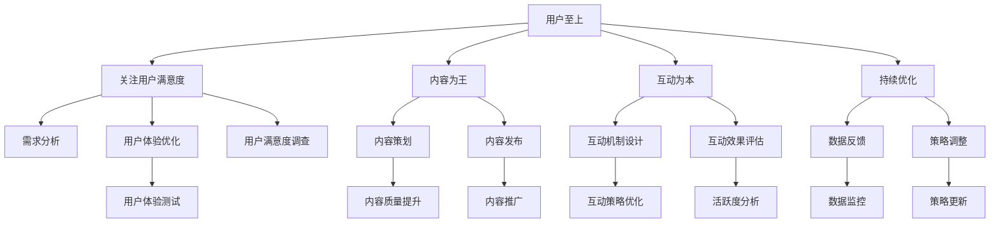

通过以上原则，社群运营可以更好地满足用户需求，提升用户满意度，促进社群的持续发展和活跃度。以下是一个简要的伪代码示例，展示了如何根据用户反馈进行策略调整：

```python
# 用户反馈收集
user_feedback = collect_feedback()

# 数据分析
data_analysis = analyze_data(user_feedback)

# 策略调整
if data_analysis['satisfaction'] < threshold:
    update_content_strategy()
elif data_analysis['activity'] < threshold:
    update_interaction_strategy()
else:
    keep_current_strategy()
```

通过以上示例，可以看出社群运营需要不断根据用户反馈和数据分析进行调整，以确保运营策略的有效性和适应性。

### 社群运营的常见模式

在社群运营中，常见的模式主要包括内容驱动型社群、活动驱动型社群和社交驱动型社群。每种模式都有其独特的特点和优势，适用于不同的社群目标和用户需求。

**内容驱动型社群：** 内容驱动型社群的核心在于提供高质量的内容，吸引和留住用户。这种社群通常以技术博客、知识分享社区等形式存在，如 Stack Overflow、CSDN 等。内容是这类社群的核心价值，高质量的文章、教程、案例等能够吸引技术爱好者和专业人士加入和活跃。

- **优势：** 内容丰富，用户可以随时获取有价值的信息；易于积累长期用户，提高用户粘性。
- **劣势：** 需要持续生产高质量内容，对内容策划和编辑能力要求较高；用户互动可能不如活动驱动型社群活跃。

**活动驱动型社群：** 活动驱动型社群通过举办各种线上或线下活动，如讲座、研讨会、编程比赛等，提高用户参与度和活跃度。这种社群通常以技术社区、开发者论坛等形式存在，如 GitHub、V2EX 等。活动是这类社群的核心驱动力，通过丰富多样的活动，激发用户的参与热情。

- **优势：** 活动丰富，用户参与度高；有利于建立社群的凝聚力；能够快速吸引新用户。
- **劣势：** 活动策划和执行需要大量资源；活动频率过高可能导致用户疲劳。

**社交驱动型社群：** 社交驱动型社群侧重于用户之间的互动和社交，通过建立社交网络，促进用户之间的交流和合作。这种社群通常以社交网络、微信群等形式存在，如 Facebook、LinkedIn 等。社交是这类社群的核心，用户在互动中建立联系，共享资源和经验。

- **优势：** 社交性强，用户粘性强；用户之间互动频繁，有利于知识共享和合作。
- **劣势：** 内容质量和深度可能不如内容驱动型社群；用户活跃度不稳定，受社交网络特性影响较大。

在实际运营中，不同的社群模式可以相互结合，形成混合型社群。例如，一个程序员社群可以同时提供高质量的技术内容、举办丰富的技术活动，并建立用户之间的社交网络，从而实现综合性的运营效果。

以下是一个简化的 Mermaid 流程图，展示了内容驱动型、活动驱动型和社交驱动型社群的运作模式：

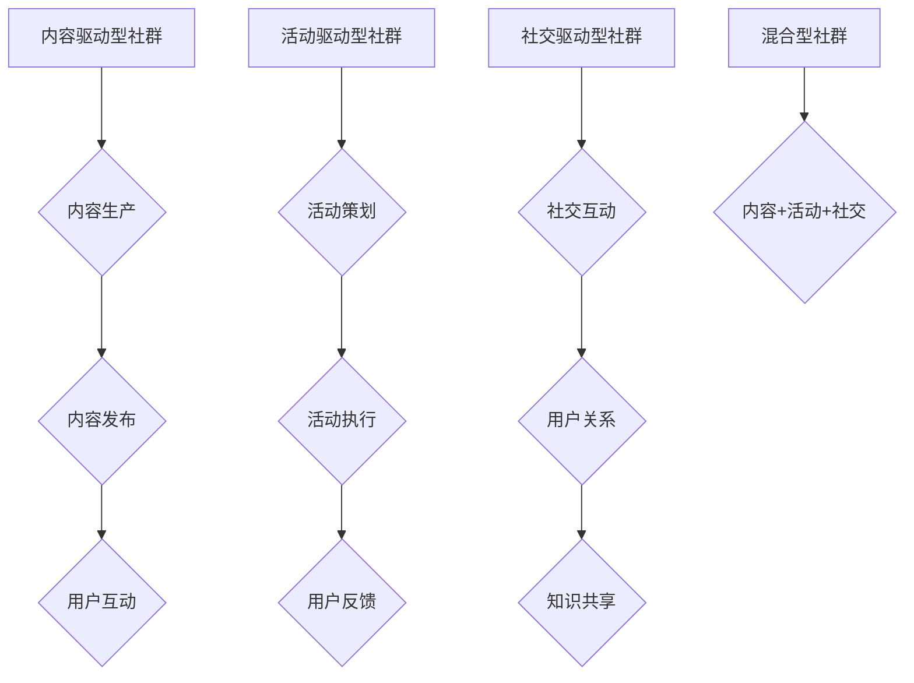

通过以上分析，我们可以看到，每种社群模式都有其适用的场景和优势。在实际运营中，根据社群的目标和用户需求，选择合适的运营模式，并灵活运用多种模式的优势，是提高社群运营效果的关键。

### 社群定位与规划

社群定位与规划是社群运营成功的关键一步。一个清晰的定位和合理的规划能够帮助社群明确目标、吸引目标用户、提供有针对性的内容和服务，从而实现社群价值的最大化。以下将详细介绍社群定位的核心要素、规划的步骤与方法，并通过SWOT分析来评估社群运营的优势、劣势、机会和威胁。

#### **社群定位的核心要素**

1. **目标用户群体：** 明确社群的目标用户是谁，他们的需求和兴趣是什么。例如，如果是一个面向程序员的技术社群，目标用户可能是软件开发者、技术爱好者或创业者，他们的需求可能包括技术分享、职业发展、项目合作等。

2. **社群主题与价值：** 确定社群的核心主题和提供的价值。例如，技术社群可以专注于分享最新的技术趋势、编程技巧和解决方案，从而为用户提供有价值的技术内容。

3. **独特卖点（USP）：** 确定社群的独特卖点，即与其他社群相比，你社群的独特之处。这可能是高质量的内容、丰富的活动、专业的导师团队等。

4. **运营目标：** 确立社群的运营目标，如提高用户参与度、提升品牌知名度、增加收入等。

#### **社群规划的步骤与方法**

1. **市场调研：** 通过调查问卷、用户访谈、行业报告等方式，了解目标用户群体的需求和偏好，以及竞争对手的运营策略。

2. **定位分析：** 基于市场调研结果，分析社群的目标用户、主题价值、独特卖点和运营目标，确保定位清晰明确。

3. **内容策划：** 根据社群定位，策划符合目标用户需求的内容，包括技术文章、教程视频、直播讲座、编程挑战等。

4. **活动规划：** 规划社群的活动，如线上讲座、线下聚会、编程比赛等，以吸引和留住用户。

5. **运营策略：** 制定详细的运营策略，包括内容发布计划、活动执行方案、用户互动机制等。

6. **数据分析与优化：** 通过数据监控和用户反馈，不断调整和优化运营策略，提高社群的运营效果。

#### **SWOT分析**

1. **优势（Strengths）：**
   - **专业内容：** 提供高质量、专业性的技术内容，吸引目标用户。
   - **互动机制：** 设立多样化的互动机制，如问答、讨论区、编程挑战等，提高用户参与度。
   - **品牌影响力：** 通过持续运营，树立良好的品牌形象和口碑。

2. **劣势（Weaknesses）：**
   - **内容更新速度：** 如果内容更新速度较慢，可能导致用户流失。
   - **活动执行难度：** 活动策划和执行需要大量资源，可能面临难度和挑战。
   - **用户粘性：** 如果内容和服务无法持续吸引用户，可能导致用户粘性不高。

3. **机会（Opportunities）：**
   - **技术趋势：** 随着技术的不断发展，社群可以紧跟技术趋势，提供最新的技术内容。
   - **用户增长：** 通过有效的市场推广，可以吸引更多目标用户加入社群。
   - **合作机会：** 可以与其他社群或企业合作，扩大影响力，提高运营效果。

4. **威胁（Threats）：**
   - **竞争加剧：** 随着更多的社群进入市场，竞争将越来越激烈。
   - **用户流失：** 如果社群无法满足用户需求，用户可能转向其他社群。
   - **行业变化：** 技术和市场的变化可能对社群运营带来挑战。

通过SWOT分析，社群可以全面了解自身的优势和劣势，抓住机会，应对威胁，制定更加科学的运营策略。以下是一个简化的SWOT分析Mermaid流程图：

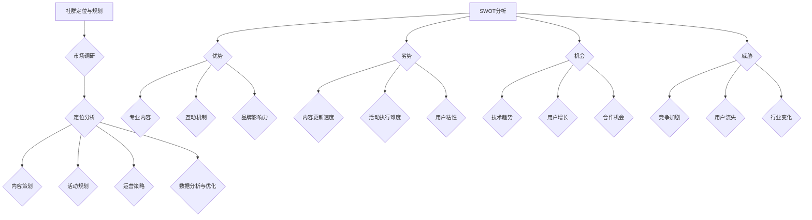

通过以上步骤和方法，社群可以明确自身定位，合理规划运营策略，提高社群的运营效果和用户满意度。SWOT分析则帮助社群在复杂的市场环境中，识别自身优势、应对挑战、抓住机遇，实现持续发展。

### 社群成员管理

社群成员管理是社群运营中至关重要的一环，它关系到社群的活跃度和成员的留存率。有效的成员管理不仅能够提升社群的整体氛围，还能促进成员之间的互动和知识共享。以下将详细探讨社群成员的分类与需求分析、成员互动机制设计以及成员激励与留存策略。

#### **社群成员分类与需求分析**

1. **初级成员：** 这类成员通常是社群的新加入者，他们对社群的认知有限，参与度较低。他们的需求主要是获取基础的信息和了解社群文化。

2. **活跃成员：** 这类成员在社群中表现出较高的活跃度，他们积极参与讨论、分享经验和资源。他们的需求包括持续的学习机会、技术交流平台和职业发展的支持。

3. **沉默成员：** 这类成员在社群中表现较为沉默，参与度较低。他们的需求可能是信息获取渠道不顺畅、缺乏参与感或兴趣不足。

4. **贡献者：** 这类成员不仅积极参与社群活动，还愿意分享自己的知识和经验，为社群贡献内容。他们的需求包括认可、尊重和一定的权益保障。

在进行成员分类后，需要根据不同成员的需求，提供针对性的服务和支持，以提升成员的参与度和满意度。

#### **成员互动机制设计**

1. **讨论区：** 设置讨论区，鼓励成员在技术话题、生活趣事等方面进行交流和讨论。讨论区可以按照不同主题进行分类，便于成员找到感兴趣的话题。

2. **问答机制：** 建立问答机制，提供即时解答平台。成员可以在这里提出问题，其他成员或专业人士可以解答问题。这不仅能帮助解决问题，还能促进知识的传播和共享。

3. **直播与讲座：** 定期举办直播和讲座，邀请行业专家和技术大牛进行分享。这不仅能够吸引新成员加入，还能提升社群的知名度和影响力。

4. **编程挑战与比赛：** 组织编程挑战和比赛，激发成员的学习兴趣和竞技精神。通过这些活动，成员可以锻炼自己的编程能力，同时增加与他人的互动。

#### **成员激励与留存策略**

1. **积分奖励系统：** 设立积分奖励系统，成员通过参与讨论、回答问题、发布内容等行为获得积分。积分可以用于兑换奖品、参加特别活动等，以此激励成员的积极参与。

2. **荣誉称号与认证：** 对于在社群中表现突出的成员，可以授予荣誉称号或专业认证。这不仅能给予成员认可和尊重，还能提升其身份感和归属感。

3. **定期活动与福利：** 定期举办线上或线下活动，如聚会、技术沙龙等。同时，可以提供一些福利，如技术书籍、学习资源、项目机会等，以增强成员的参与感和满意度。

4. **用户反馈与互动：** 倾听用户的反馈，及时回应成员的问题和建议。通过良好的互动，建立紧密的社群关系，提高成员的留存率。

以下是一个简化的Mermaid流程图，展示了社群成员管理的主要步骤和机制：

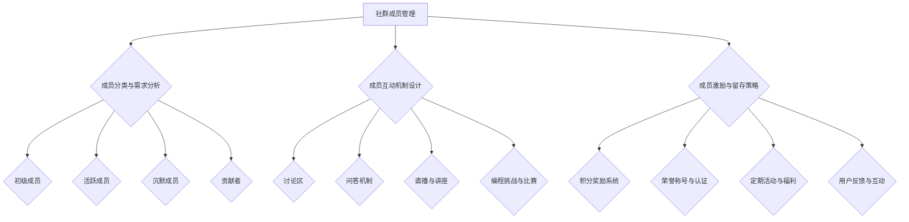

通过以上措施，社群运营者可以有效地管理社群成员，提高成员的参与度和满意度，从而实现社群的持续发展和活跃。有效的成员管理不仅能够提升社群的整体氛围，还能为社群带来更多的价值，为成员提供更好的学习和交流环境。

### 内容策划与发布

在社群运营中，内容策划与发布是关键的一环，它直接影响用户的参与度和社群的活跃度。以下将详细探讨内容类型与规划、内容质量提升策略以及内容发布与推广方法。

#### **内容类型与规划**

1. **技术文章：** 技术文章是程序员社群中最常见的内容类型，可以涵盖编程语言、框架、工具的使用技巧，以及最新的技术趋势和解决方案。技术文章能够帮助用户解决实际问题，提升技术水平。

2. **教程视频：** 教程视频通过视觉和听觉的直观方式，帮助用户更好地理解和掌握技术知识。教程视频可以是系列教程、专题讲座或具体项目实战演示，能够满足用户多样化的学习需求。

3. **直播讲座：** 直播讲座能够实时互动，让用户在听课的同时提出问题，获得解答。这种形式特别适合技术讨论、编程教学和经验分享。

4. **问答互动：** 问答互动通过实时问答或社区论坛的形式，帮助用户解决具体问题，促进成员之间的交流和知识共享。

5. **案例分享：** 案例分享可以分享实际项目经验、解决方案和最佳实践，帮助用户学习和借鉴，提升项目执行能力。

在策划内容时，需要根据社群的定位和目标用户的需求，制定详细的内容规划，确保内容的多样性和连续性。

#### **内容质量提升策略**

1. **内容审核：** 建立内容审核机制，确保发布的内容符合社群的价值观和标准。内容审核应包括内容准确性、可读性和版权问题等。

2. **专家评审：** 邀请行业专家或技术大牛进行内容评审，提高内容的权威性和专业性。

3. **用户反馈：** 通过用户反馈，了解内容的受欢迎程度和改进方向，不断优化内容质量。

4. **定期更新：** 保持内容的定期更新，确保内容的新鲜度和吸引力。定期发布新的技术文章、视频和直播，保持用户的持续关注。

#### **内容发布与推广方法**

1. **内部推广：** 利用社群内部的渠道，如社区论坛、微信群、公众号等，进行内容推广。可以在社区首页置顶新内容，利用社群公告通知用户，提高内容的曝光率。

2. **外部推广：** 利用其他平台，如技术社区、博客、社交媒体等，进行内容的传播。可以通过技术博客、微信公众号、LinkedIn等平台，扩大内容的受众范围。

3. **合作推广：** 与其他社群或机构合作，共同推广内容。可以通过联合发布、互推等方式，提高内容的传播效果。

4. **活动推广：** 结合社群活动，如线上讲座、编程比赛等，进行内容推广。在活动前、活动中和活动后，都可以利用内容进行宣传和推广。

以下是一个简化的Mermaid流程图，展示了内容策划与发布的主要步骤和策略：

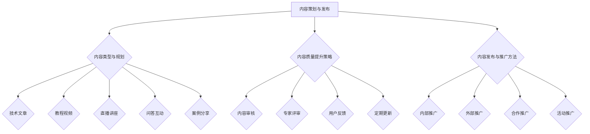

通过以上策略，社群运营者可以有效地策划和发布高质量的内容，提高社群的吸引力和活跃度，从而实现社群的持续发展和用户价值的最大化。

### 社群互动与引导

社群互动与引导是社群运营的核心环节，它直接影响社群的活跃度和成员的满意度。有效的互动和引导不仅能促进知识共享和技能提升，还能增强社群的凝聚力和品牌影响力。以下将详细探讨互动策略与技巧、热点话题引导以及互动效果评估与优化。

#### **互动策略与技巧**

1. **激励机制：** 通过设立积分、勋章等激励机制，鼓励成员积极参与互动。例如，成员在提问、回答问题、发布内容等行为中获得积分，积分可以兑换奖品或参加特别活动。

2. **话题引导：** 发布具有吸引力和争议性的话题，引导成员进行讨论和交流。可以选择热门技术话题、行业动态、个人经验分享等，激发成员的兴趣和参与热情。

3. **互动工具：** 利用社群平台提供的互动工具，如评论、点赞、分享、直播、问答等，增强用户参与感。通过多样化的互动方式，提高用户的活跃度和参与度。

4. **用户互动：** 鼓励成员之间的互动，如点赞、评论、私信等。通过互动，建立成员之间的联系，增强社群的社交氛围。

5. **活动策划：** 组织线上或线下活动，如讲座、编程比赛、聚会等，促进成员之间的交流和合作。通过活动，提高社群的凝聚力和活跃度。

#### **热点话题引导**

1. **行业热点：** 关注行业动态和热点事件，发布相关讨论话题。通过引导成员讨论行业热点，促进知识的传播和交流。

2. **技术趋势：** 分享最新的技术趋势和解决方案，引导成员探讨技术的未来发展和应用。这不仅能提升社群的专业性，还能吸引更多技术爱好者和专业人士加入。

3. **个人经验：** 鼓励成员分享自己的经验和见解，如工作心得、项目经历等。通过个人经验分享，增强成员之间的共鸣和互动。

4. **挑战与竞赛：** 组织编程挑战和竞赛，激发成员的竞争意识和学习热情。通过竞赛，提升成员的技能和经验，增强社群的活力。

以下是一个简化的Mermaid流程图，展示了热点话题引导的步骤和策略：

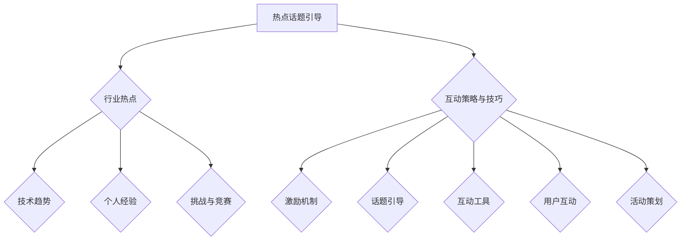

#### **互动效果评估与优化**

1. **数据监控：** 通过监控社群的互动数据，如评论数、点赞数、分享数、参与人数等，评估互动效果。通过数据分析，找出互动的高峰时段、热门话题和活跃成员，为优化互动策略提供依据。

2. **用户反馈：** 收集成员的反馈和建议，了解他们对互动体验的满意度。通过用户反馈，发现互动中存在的问题和改进方向。

3. **互动效果优化：** 根据数据分析和用户反馈，不断优化互动策略。可以通过调整话题类型、优化互动工具、增加激励机制等方式，提高互动效果。

4. **定期回顾：** 定期回顾互动效果，总结经验和教训，为下一阶段的互动策划和实施提供参考。

以下是一个简化的Mermaid流程图，展示了互动效果评估与优化的步骤和策略：

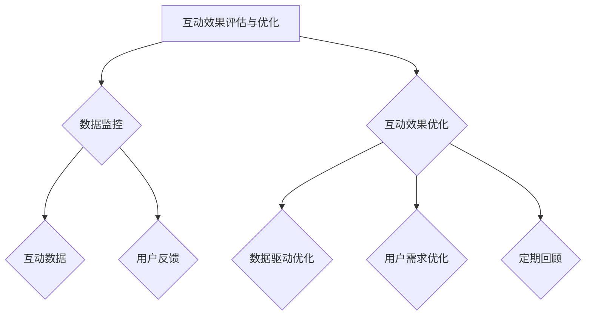

通过以上策略，社群运营者可以有效地引导社群互动，提高社群的活跃度和成员的满意度，从而实现社群的持续发展和品牌影响力的提升。

### 社群品牌建设

社群品牌建设是社群运营的重要组成部分，它关系到社群的长期发展和用户忠诚度。良好的品牌建设能够提升社群的知名度和影响力，吸引更多优质用户加入，并为社群运营带来持续的价值。以下将详细探讨社群品牌定位与价值塑造、品牌传播与口碑管理，以及品牌资产积累策略。

#### **社群品牌定位与价值塑造**

1. **品牌定位：** 明确社群的品牌定位，即确定社群的目标用户、核心价值和独特卖点。例如，一个面向程序员的技术社群可以定位为“专业的技术交流平台”，提供高质量的技术内容、实战经验和项目合作机会。

2. **品牌价值：** 塑造社群的品牌价值，即通过提供有价值的内容、互动体验和服务，提升社群在用户心中的地位。品牌价值主要体现在以下几个方面：
   - **内容价值：** 提供高质量、有深度的技术文章、教程视频、直播讲座等，满足用户的学习需求。
   - **互动价值：** 建立有效的互动机制，促进用户之间的交流和合作，提升用户的参与感和归属感。
   - **服务价值：** 提供优质的用户服务，如及时解答用户问题、提供技术支持等，增强用户满意度。

3. **品牌特色：** 打造社群的特色，如专业领域、技术方向、社群氛围等，使其在众多社群中脱颖而出。特色是品牌差异化的重要体现，有助于提升社群的识别度和用户忠诚度。

#### **品牌传播与口碑管理**

1. **品牌传播：** 通过多种渠道和方式，将社群的品牌信息传播给目标用户，提高社群的知名度和影响力。常见的品牌传播方法包括：
   - **社交媒体：** 利用社交媒体平台，如微博、微信、Twitter、LinkedIn等，发布社群动态、活动信息和技术内容，吸引新用户关注和参与。
   - **内容平台：** 在技术博客、论坛、视频网站等平台发布高质量的内容，提高社群的曝光率和影响力。
   - **线上活动：** 组织线上讲座、研讨会、编程比赛等活动，邀请行业专家和嘉宾参与，吸引更多用户参与和传播。

2. **口碑管理：** 通过用户口碑和评价，建立社群的品牌声誉。口碑管理的关键在于：
   - **用户满意度：** 提高用户满意度，通过优质的内容和服务，满足用户的需求，赢得良好的口碑。
   - **用户互动：** 鼓励用户在社群中分享自己的经验和见解，促进用户之间的互动和知识共享，形成良好的口碑效应。
   - **负面口碑处理：** 及时处理社群中的负面口碑，通过沟通、解释和改进，化解用户的不满和误解，防止负面口碑扩散。

#### **品牌资产积累策略**

1. **内容资产：** 建立内容资产库，积累高质量的技术文章、教程视频、直播讲座等，为社群的持续运营提供内容支持。通过不断更新和丰富内容资产，提高社群的价值和吸引力。

2. **用户资产：** 建立用户档案，记录用户的基本信息、兴趣偏好和互动行为，为精准营销和个性化服务提供数据支持。通过用户反馈和互动数据，不断优化用户体验和社群运营策略。

3. **品牌形象：** 塑造社群的品牌形象，包括标识、口号、视觉设计等，提升社群的识别度和品牌价值。通过统一的品牌形象，增强用户对社群的认同感和归属感。

4. **合作资产：** 与行业专家、企业、教育机构等建立合作关系，共同开发和推广内容，扩大社群的影响力和资源。通过合作，实现资源共享、互利共赢。

以下是一个简化的Mermaid流程图，展示了社群品牌建设的核心步骤和策略：

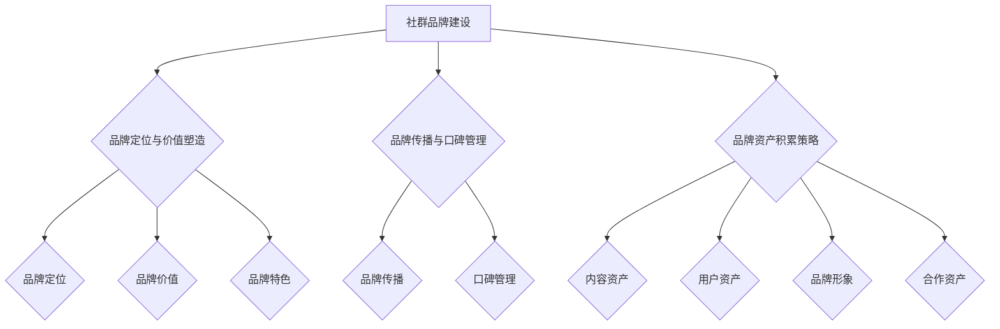

通过以上策略，社群运营者可以有效地进行社群品牌建设，提升社群的知名度和影响力，为社群的长期发展和用户忠诚度奠定坚实的基础。

### 社群工具与平台选择

在社群运营中，选择合适的工具与平台是至关重要的，它直接关系到社群的运营效果和用户体验。以下将详细探讨常见社群工具的概述、平台选择标准以及案例分析。

#### **常见社群工具概述**

1. **论坛/社区：** 论坛/社区是传统的社群工具，如 Discourse、TaoBao Club 等。它们提供问答、讨论区、投票等功能，适合技术社区、兴趣小组等。

2. **直播平台：** 直播平台如 YY、Zoom 等，适合进行在线讲座、培训、研讨会等活动。它们提供实时互动、录制回放等功能，能够提升用户的参与感和体验。

3. **社交媒体：** 社交媒体平台如 Twitter、LinkedIn 等，适合进行品牌传播、用户互动和内容推广。它们具有广泛的用户基础和高效的传播能力。

4. **内容平台：** 内容平台如 Medium、Hackernoon 等，适合发布长篇文章、教程视频等。它们提供专业的内容编辑工具和丰富的媒体资源，能够提升内容的传播效果。

5. **即时通讯工具：** 即时通讯工具如 Slack、Telegram 等，适合进行实时沟通和协作。它们提供聊天、会议、文件共享等功能，能够提高团队协作效率。

#### **平台选择标准**

1. **功能需求：** 根据社群的运营需求，选择功能丰富、易用的平台。例如，技术社区需要具备问答、讨论区、直播等功能；企业社群需要具备即时通讯、任务管理、文件共享等功能。

2. **用户群体：** 考虑目标用户群体的活跃度和偏好。例如，程序员用户可能更偏好技术社区和即时通讯工具；企业用户可能更偏好专业的内容平台和协作工具。

3. **成本考虑：** 考虑平台的购买成本、运营和维护成本。免费平台可能功能有限，而付费平台可能提供更多高级功能和定制化服务。

4. **用户体验：** 选择用户体验良好、界面简洁的平台，提高用户的参与度和满意度。用户体验包括界面设计、功能易用性、响应速度等。

5. **可扩展性：** 选择具有良好扩展性和可定制化的平台，以便在未来根据社群的发展需求进行功能扩展和定制。

#### **案例分析**

1. **成功案例：** GitHub 是一个面向开发者的社群平台，通过提供代码托管、协作开发、项目展示等功能，吸引了大量开发者用户。其成功的原因在于：
   - **功能丰富：** 提供了代码托管、版本控制、项目展示、协作开发等功能，满足开发者的多样化需求。
   - **用户体验：** 界面简洁、功能易用，用户可以轻松管理和分享代码。
   - **社交属性：** 支持关注、点赞、评论等社交功能，增强用户之间的互动和合作。

2. **失败案例：** 世纪佳缘 是一个交友平台，由于功能单一、用户体验差，导致用户流失严重。其失败的原因在于：
   - **功能单一：** 仅提供简单的交友功能，缺乏其他社交和互动功能，无法满足用户多样化的需求。
   - **用户体验：** 界面复杂、操作不便，用户使用体验差。
   - **缺乏互动：** 缺少有效的互动机制，用户之间的沟通和交流不足，导致用户活跃度低。

通过以上分析，社群运营者可以根据社群的具体需求和目标用户，选择合适的社群工具与平台，以提高运营效果和用户体验。

### 社群数据分析与优化

在社群运营中，数据分析是至关重要的环节，它能够帮助运营者深入了解社群的运行情况，发现问题，优化策略，从而提升社群的整体运营效果。以下将详细探讨数据指标体系构建、数据分析方法与应用，以及社群运营优化策略。

#### **数据指标体系构建**

1. **用户参与度指标：**
   - **活跃用户数：** 指在特定时间段内参与社群互动的用户数量，包括发帖、回复、点赞、分享等。
   - **人均互动次数：** 指每个用户在特定时间段内的平均互动次数，包括发帖、回复、点赞、分享等。
   - **互动密度：** 指每个话题或帖子的平均互动次数，用于衡量内容的吸引力和用户参与度。

2. **内容质量指标：**
   - **内容点击率：** 指用户点击内容的比例，用于衡量内容的吸引力。
   - **内容分享率：** 指用户分享内容的比例，用于衡量内容的传播效果。
   - **内容留存率：** 指用户阅读内容后留在社群的时间，用于衡量内容的吸引力和用户粘性。

3. **用户留存率指标：**
   - **日活跃用户留存率：** 指在一天内首次参与互动的用户中，第二天再次参与互动的用户比例。
   - **周活跃用户留存率：** 指在一周内首次参与互动的用户中，下周再次参与互动的用户比例。
   - **月活跃用户留存率：** 指在一个月内首次参与互动的用户中，下月再次参与互动的用户比例。

4. **社群健康度指标：**
   - **负面反馈率：** 指用户对社群的负面反馈比例，用于衡量社群的运营问题和用户满意度。
   - **社群氛围指数：** 指社群中积极、中立、消极言论的比例，用于衡量社群的互动氛围。

#### **数据分析方法与应用**

1. **数据分析方法：**
   - **描述性分析：** 对基础数据进行统计和分析，如用户数量、互动次数、内容点击率等，用于了解社群的基本运行情况。
   - **趋势分析：** 通过时间序列数据，分析数据的变化趋势，如用户留存率的变化、内容点击率的变化等，用于发现问题和优化策略。
   - **相关性分析：** 分析不同指标之间的相关性，如用户留存率与内容质量、互动机制之间的关系，用于理解数据背后的原因。
   - **因果分析：** 通过假设验证和A/B测试，分析不同策略对社群运营效果的影响，如新功能对用户留存率的影响、内容更新频率对活跃度的影响等。

2. **数据分析应用：**
   - **优化内容策略：** 通过分析内容质量指标，识别高点击率和高分享率的内容类型，优化内容策划和发布策略，提升内容吸引力。
   - **调整互动机制：** 通过分析互动指标和用户留存率，识别活跃用户和沉默用户，调整互动机制，提高用户参与度和留存率。
   - **改进用户体验：** 通过分析用户反馈和负面反馈率，识别用户痛点和需求，改进社群功能和用户体验，提升用户满意度。
   - **评估策略效果：** 通过因果分析和A/B测试，评估不同运营策略的效果，优化运营策略，提升社群整体运营效果。

#### **社群运营优化策略**

1. **内容优化：**
   - **内容多样化：** 结合用户兴趣和需求，提供多样化的内容，包括技术文章、教程视频、直播讲座等，满足不同用户的需求。
   - **高质量内容：** 提高内容质量，确保每一篇内容都有价值，吸引和留住用户。
   - **内容推广：** 利用社群内部和外部渠道，推广高质量内容，提高内容的曝光率和传播效果。

2. **互动优化：**
   - **激励机制：** 设立积分、勋章等激励机制，鼓励用户参与互动，提高社群活跃度。
   - **互动工具：** 利用多样化的互动工具，如评论、点赞、分享、直播、问答等，增强用户参与感。
   - **互动策略：** 设计有效的互动策略，如热点话题引导、互动话题策划、用户反馈机制等，提高用户互动质量。

3. **用户体验优化：**
   - **界面设计：** 优化社群界面设计，确保简洁、易用，提高用户体验。
   - **功能优化：** 优化社群功能，确保用户能够轻松完成常见操作，提升用户满意度。
   - **用户反馈：** 及时响应用户反馈，解决用户问题，改进社群功能和服务。

4. **数据驱动优化：**
   - **数据监控：** 建立数据监控体系，实时监控关键指标，了解社群运营情况。
   - **定期分析：** 定期进行数据分析，发现问题和优化方向。
   - **策略调整：** 根据数据分析结果，调整运营策略，优化社群运营效果。

通过以上策略，社群运营者可以有效地进行社群数据分析与优化，提升社群的整体运营效果和用户满意度。

### 社群运营案例分析

在进行社群运营时，通过分析成功案例和失败案例，可以总结出宝贵的经验和教训，为后续的社群运营提供指导。以下将详细分析两个成功案例和一个失败案例，探讨其经验总结与启示。

#### **成功案例1：GitHub**

**背景：** GitHub 是一个全球知名的代码托管和协作平台，其社群运营取得了显著的成功。

**经验总结：**
- **社区氛围：** GitHub 建立了一个开放、包容、互助的社区氛围，鼓励用户分享代码、提出问题和解决问题。
- **功能丰富：** GitHub 提供了丰富的功能，如代码托管、版本控制、项目展示、协作开发等，满足了开发者的多样化需求。
- **用户参与：** GitHub 通过积分、徽章等激励机制，鼓励用户参与互动，提高了社群的活跃度。
- **内容多样化：** GitHub 社群提供了多种形式的内容，包括代码示例、技术文章、教程视频等，丰富了用户的学习资源。

**启示：**
- **建立良好的社区氛围：** 良好的社区氛围能够吸引和留住用户，提升社群的活跃度和用户满意度。
- **提供丰富的功能：** 丰富的功能能够满足用户的多样化需求，提升社群的吸引力。
- **鼓励用户参与：** 通过激励机制，鼓励用户参与互动，提高社群的活跃度。
- **内容多样化：** 提供多种形式的内容，满足不同用户的需求，提升社群的多样性和吸引力。

#### **成功案例2：V2EX**

**背景：** V2EX 是一个面向技术极客的社群平台，以其高质量的内容和活跃的社区氛围而著称。

**经验总结：**
- **高质量内容：** V2EX 注重内容质量，通过严格的审核机制，确保发布的内容具有价值。
- **用户参与：** V2EX 鼓励用户积极参与讨论和分享，建立了丰富的互动机制，如评论、点赞、分享等。
- **活动策划：** V2EX 定期举办线上和线下活动，如技术沙龙、编程比赛等，提高了用户的参与度和社群的凝聚力。
- **品牌建设：** V2EX 通过良好的品牌形象和口碑，吸引了大量高价值用户加入。

**启示：**
- **注重内容质量：** 高质量的内容能够提升社群的价值和吸引力，吸引更多优质用户加入。
- **鼓励用户参与：** 互动机制和活动策划能够提高用户的参与度，提升社群的活跃度。
- **定期举办活动：** 定期举办活动能够增强社群的凝聚力，提升用户满意度。
- **品牌建设：** 良好的品牌形象和口碑能够提升社群的知名度和影响力，吸引更多用户加入。

#### **失败案例：世纪佳缘**

**背景：** 世纪佳缘 是一个在线交友平台，但在运营过程中遇到了用户流失和口碑下降的问题。

**失败原因：**
- **功能单一：** 世纪佳缘 的功能相对单一，缺乏有效的互动和社交功能，无法满足用户的多样化需求。
- **用户体验差：** 平台的界面复杂，操作不便，用户体验差，导致用户满意度低。
- **缺乏互动：** 平台缺乏有效的互动机制，用户之间的沟通和交流不足，导致用户活跃度低。

**启示：**
- **功能丰富：** 提供多样化的功能，满足用户的多样化需求，提升社群的吸引力。
- **优化用户体验：** 优化界面设计和功能操作，提高用户体验，提升用户满意度。
- **鼓励互动：** 设立有效的互动机制，鼓励用户之间的互动和交流，提升社群的活跃度。

通过以上成功和失败案例的分析，我们可以得出以下经验总结与启示：
1. **注重内容质量：** 提供高质量的内容是提升社群价值的关键。
2. **鼓励用户参与：** 通过互动机制和活动策划，鼓励用户参与互动，提升社群活跃度。
3. **定期举办活动：** 定期举办活动能够增强社群的凝聚力，提升用户满意度。
4. **优化用户体验：** 提供良好的用户体验是提升用户满意度和留存率的关键。
5. **功能丰富：** 提供多样化的功能，满足用户的多样化需求，提升社群的吸引力。

通过以上经验总结与启示，社群运营者可以更好地进行社群运营，提升社群的整体运营效果和用户满意度。

### 程序员社群运营策略

程序员社群运营策略是确保社群健康发展和用户满意度的重要因素。了解程序员社群的特点，结合实际情况，制定合适的运营策略，对于提高社群活跃度和用户参与度至关重要。以下将详细探讨程序员社群运营策略，包括社群特点、运营核心要素和具体技巧。

#### **程序员社群特点**

1. **技术导向：** 程序员社群以技术交流为主，成员普遍对编程语言、框架、工具等技术话题感兴趣。
2. **专业性强：** 程序员社群成员通常具备较高的专业知识和技能，他们希望通过社群获取最新技术动态和实用技巧。
3. **活跃度高：** 程序员社群成员活跃度较高，他们乐于参与技术讨论、分享经验和解决问题。
4. **多样性：** 程序员社群成员来自不同的行业和公司，他们具有多样化的背景和技能，这为社群带来了丰富的知识和资源。

#### **运营核心要素**

1. **内容质量：** 提供高质量的技术内容是吸引和留住程序员的关键。内容应包括技术文章、教程视频、案例分析等，确保内容的专业性和实用性。
2. **互动机制：** 设计有效的互动机制，如问答区、讨论区、编程挑战等，促进成员之间的交流和合作。互动机制应简洁易用，鼓励成员积极参与。
3. **活动策划：** 定期举办线上或线下活动，如技术讲座、编程比赛、技术沙龙等，提高成员的参与度和社群的凝聚力。
4. **用户服务：** 提供优质的用户服务，包括及时解答用户问题、反馈处理和个性化推荐等，提升用户满意度和忠诚度。

#### **具体运营技巧**

1. **内容策划与发布：**
   - **定期更新：** 保持内容的定期更新，确保内容的新鲜度和吸引力。每周发布一定数量的高质量文章和视频，满足成员的学习需求。
   - **多样性内容：** 提供多样化的内容形式，如技术文章、教程视频、直播讲座、案例分享等，满足不同成员的学习偏好。

2. **互动引导与激励机制：**
   - **热点话题引导：** 发布具有争议性和吸引力的热点话题，引导成员进行讨论和交流。热点话题可以是最新技术趋势、行业动态或技术难题。
   - **积分奖励系统：** 设立积分奖励系统，鼓励成员积极参与讨论和发布内容。积分可以兑换奖品或参与特别活动，提高成员的参与度。

3. **活动策划与实施：**
   - **多样化活动：** 结合社群特点和用户需求，策划多样化的活动，如编程比赛、技术讲座、项目合作等。活动应具有一定的挑战性和趣味性，激发成员的参与热情。
   - **活动宣传与推广：** 通过社群内部和外部渠道，如公众号、微信群、技术社区等，进行活动宣传和推广，提高活动的曝光率。

4. **用户服务与反馈：**
   - **及时解答：** 建立及时解答机制，确保成员的问题能够得到快速解答。可以设立问答区或邀请专业人士进行实时解答。
   - **用户反馈：** 倾听用户反馈，及时处理用户的问题和建议。通过用户反馈，了解社群运营中的问题和改进方向。

5. **数据分析与优化：**
   - **数据监控：** 建立数据监控体系，实时监控关键指标，如用户活跃度、内容点击率、互动次数等，了解社群运营情况。
   - **策略优化：** 根据数据分析结果，调整运营策略，优化内容策划、互动机制和活动策划，提高社群运营效果。

以下是一个简化的 Mermaid 流程图，展示了程序员社群运营的核心要素和具体技巧：

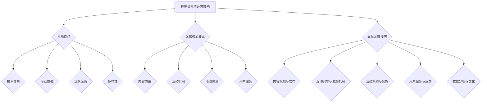

通过以上策略和技巧，社群运营者可以有效地提升程序员社群的活跃度和用户满意度，实现社群的长期健康发展。

### 社群活动策划与实施

社群活动的策划与实施是提升社群活跃度和用户参与度的关键环节。有效的活动能够增强成员之间的联系，提升社群的凝聚力，并为社群运营带来新的活力。以下将详细探讨活动类型与策划、活动实施与推广，以及活动效果评估与总结。

#### **活动类型与策划**

1. **线上讲座：** 线上讲座是程序员社群中常见的一种活动形式，通过邀请行业专家或技术大牛进行技术分享，为成员提供最新的技术动态和实用技巧。策划线上讲座时，需要注意以下几点：
   - **主题选择：** 确定讲座的主题，如前端技术、后端开发、数据库管理等，确保与社群的定位和成员需求相符。
   - **嘉宾邀请：** 邀请具有专业背景和丰富经验的嘉宾，确保讲座的内容质量和吸引力。
   - **时间安排：** 选择合适的时间，避免与其他重要活动冲突，确保成员能够参加。

2. **编程比赛：** 编程比赛是激发成员学习兴趣和竞技精神的有效方式。策划编程比赛时，需要注意以下几点：
   - **比赛规则：** 制定明确的比赛规则，包括比赛内容、时间、评分标准等，确保比赛的公平性和可操作性。
   - **奖品设置：** 设置吸引人的奖品，如技术书籍、编程工具、奖金等，以激励成员积极参与。
   - **技术支持：** 提供必要的技术支持，如开发环境搭建、编程工具推荐等，确保比赛顺利进行。

3. **技术沙龙：** 技术沙龙是一种轻松愉快的交流形式，成员可以面对面交流技术心得、分享经验。策划技术沙龙时，需要注意以下几点：
   - **地点选择：** 选择方便成员到达的地点，如咖啡馆、会议室等，确保活动场所舒适。
   - **议程安排：** 制定详细的议程，包括开场致辞、主题分享、自由交流等环节，确保活动的有序进行。
   - **嘉宾邀请：** 邀请技术专家或行业领袖作为嘉宾，分享他们的经验和见解。

4. **线下聚会：** 线下聚会是一种增强社群凝聚力的活动形式，成员可以参加聚会，建立友谊和合作关系。策划线下聚会时，需要注意以下几点：
   - **时间选择：** 选择合适的日期和时间，确保成员能够参加。
   - **活动安排：** 制定有趣的活动安排，如聚餐、游戏、户外活动等，提升活动的趣味性。
   - **安全保障：** 确保活动的安全，如预订餐厅、安排交通等，确保成员的安全和舒适。

#### **活动实施与推广**

1. **活动宣传：** 在活动前，通过社群内部的渠道，如微信群、公众号、论坛等，发布活动通知和宣传内容，吸引成员关注和参与。
2. **活动推广：** 利用外部渠道，如技术社区、博客、社交媒体等，进行活动的宣传和推广，扩大活动的影响力。
3. **活动实施：** 按照活动策划方案，组织活动实施，确保活动顺利进行。在活动过程中，注意以下几点：
   - **活动引导：** 活动主持人或组织者应引导活动进程，确保活动按计划进行。
   - **互动环节：** 设立互动环节，如问答、讨论等，提高成员的参与度和互动性。
   - **记录和总结：** 活动结束后，及时记录和总结活动过程和成果，为后续活动提供参考。

#### **活动效果评估与总结**

1. **效果评估：** 通过问卷调查、用户反馈等方式，收集成员对活动的评价和建议，了解活动的效果。评估指标包括活动满意度、参与度、影响力等。
2. **总结经验：** 根据活动效果和用户反馈，总结活动的成功经验和不足之处，为后续活动提供改进方向。
3. **持续优化：** 根据总结的经验和反馈，不断优化活动策划和实施，提高活动的质量和效果。

以下是一个简化的 Mermaid 流程图，展示了社群活动策划与实施的主要步骤和策略：

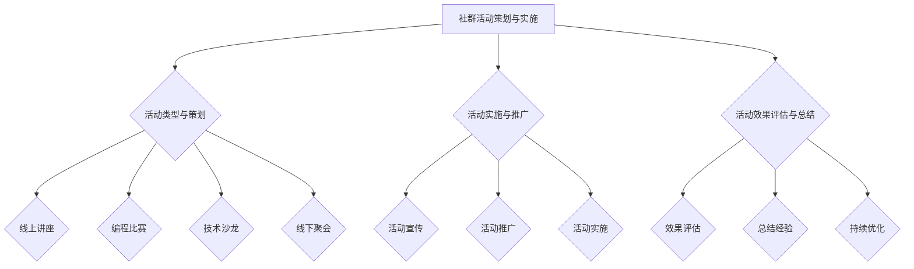

通过以上步骤和策略，社群运营者可以有效地策划和实施各种活动，提升社群的活跃度和用户满意度，实现社群的长期发展。

### 社群运营团队建设

社群运营团队建设是确保社群健康发展和持续运营的关键。一个高效的社群运营团队能够提升社群的活跃度、用户满意度，以及整体的运营效果。以下将详细探讨团队建设的重要性、团队角色与职责分配，以及团队协作与沟通技巧。

#### **团队建设的重要性**

1. **协同合作：** 社群运营涉及多个方面，包括内容策划、活动策划、用户服务、数据分析等。一个高效的团队可以通过协同合作，实现资源共享、优势互补，提高运营效率。

2. **专业发展：** 团队成员在社群运营过程中，可以不断学习和成长，提升专业技能和综合素质。团队建设有助于团队成员的职业生涯发展和个人成长。

3. **团队凝聚力：** 一个强大的团队具有高度的凝聚力，能够共同面对挑战和困难，确保社群的稳定运营。通过团队建设，增强团队成员之间的信任和合作，提升团队的整体战斗力。

4. **用户满意度：** 高效的团队能够更好地满足用户需求，提供优质的内容和服务，提高用户满意度和忠诚度。团队建设有助于提升社群的价值和吸引力。

#### **团队角色与职责分配**

1. **社群运营主管：** 负责社群的整体运营策略和管理，协调团队成员的工作，确保运营目标的实现。

2. **内容策划专员：** 负责内容策划和发布，包括技术文章、教程视频、直播讲座等，确保内容的质量和吸引力。

3. **活动策划专员：** 负责社群活动的策划和执行，包括线上讲座、编程比赛、技术沙龙等，确保活动的顺利进行。

4. **用户服务专员：** 负责解答用户问题、处理用户反馈，提供优质的用户服务，提升用户满意度。

5. **数据分析专员：** 负责社群数据分析和运营效果评估，提供数据支持，为运营策略优化提供依据。

6. **技术支持专员：** 负责社群技术平台的维护和优化，确保平台的稳定运行，提供必要的技术支持。

#### **团队协作与沟通技巧**

1. **明确目标：** 确保团队成员明确共同目标和职责，提高协作效率。

2. **有效沟通：** 通过定期的团队会议、邮件、即时通讯等，保持良好的沟通。会议应简洁高效，明确讨论主题和议程。

3. **协作工具：** 利用协作工具，如 Trello、Slack、JIRA 等，提高团队协作效率。协作工具应方便团队成员共享文件、任务分配和进度追踪。

4. **反馈机制：** 建立反馈机制，鼓励团队成员提出意见和建议，及时解决问题和改进工作。

5. **信任与支持：** 增强团队成员之间的信任和支持，共同面对挑战，确保团队的稳定和高效。

以下是一个简化的 Mermaid 流程图，展示了团队建设的主要步骤和策略：

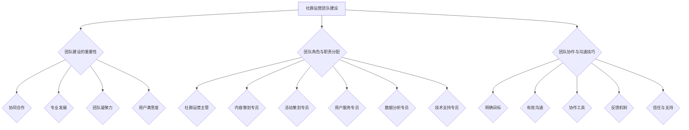

通过以上步骤和策略，社群运营者可以有效地建设一支高效的社群运营团队，提升社群的运营效果和用户满意度，实现社群的长期发展。

### 附录A：社群运营工具与资源推荐

在社群运营过程中，选择合适的工具与资源对于提高运营效率和效果至关重要。以下将详细介绍一些常用的社群工具，并提供社群运营相关的资源汇总和学习资料推荐。

#### **常用社群工具介绍**

1. **论坛/社区：**
   - **Discourse：** 是一个开源的在线论坛平台，提供丰富的主题讨论、用户管理、权限设置等功能。
   - **TaoBao Club：** 是一个面向中国用户的开源社区平台，功能包括论坛、活动、用户积分等。

2. **直播平台：**
   - **YY：** 是国内领先的在线直播平台，提供高清直播、互动问答、弹幕等功能。
   - **Zoom：** 是一款国际知名的在线会议和直播工具，适合进行在线讲座和远程培训。

3. **社交媒体：**
   - **Twitter：** 是一个全球性的社交媒体平台，适合进行品牌传播和用户互动。
   - **LinkedIn：** 是一个面向职业人士的社交网络平台，适合进行企业宣传和人才招聘。

4. **内容平台：**
   - **Medium：** 是一个专注于内容创作的平台，适合发布长篇文章和教程。
   - **Hackernoon：** 是一个面向程序员和科技爱好者的内容平台，提供技术文章、教程视频等。

5. **即时通讯工具：**
   - **Slack：** 是一款团队协作工具，提供即时通讯、文件共享、任务管理等功能。
   - **Telegram：** 是一款流行的即时通讯应用，适合进行社群内部沟通和消息推送。

#### **社群运营资源汇总**

1. **社群运营书籍：**
   - 《社群运营实战指南》：提供了全面的社群运营策略和案例分析。
   - 《社群营销实战》：详细介绍了社群营销的方法和技巧。

2. **社群运营课程：**
   - 在线课程平台：如网易云课堂、Coursera等，提供各种社群运营相关课程。
   - 专业培训机构：如腾讯社交与内容学院、运营研究社等，提供系统性的社群运营培训。

3. **社群运营社群：**
   - 加入相关社群，如“社群运营交流群”、“技术社区运营群”等，与同行交流经验、学习资源。

#### **社群运营学习资料推荐**

1. **技术博客：**
   - 博客园：提供丰富的技术文章和教程，适合程序员学习。
   - CSDN：拥有大量的技术博客，涵盖了各种编程语言和技术领域。

2. **技术论坛：**
   - Stack Overflow：全球最大的开发者问答社区，适合解决技术问题。
   - V2EX：一个关注互联网、技术、创意等领域的讨论社区。

3. **技术社区：**
   - GitHub：提供代码托管和协作开发功能，适合程序员进行项目分享和学习。
   - GitChat：一个技术分享和学习的社区，提供高质量的编程教程和讲座。

通过以上工具和资源的推荐，社群运营者可以更有效地开展社群运营工作，提升社群的活跃度和用户满意度。

### 附录B：社群运营常见问题解答

在社群运营过程中，会遇到各种各样的问题。以下将针对一些新手入门常见问题、运营中遇到的问题及解决方案，以及程序员社群运营特有问题的解答，提供详细的指导和建议。

#### **新手入门常见问题**

1. **如何选择社群工具？**
   - **需求分析：** 根据社群的定位和运营需求，选择功能丰富、易用的社群工具。如技术社区可选择Discourse、TaoBao Club等。
   - **成本考虑：** 考虑工具的购买成本和使用成本，选择性价比高的工具。
   - **用户体验：** 选择用户界面友好、操作简便的工具，提高用户的使用体验。

2. **如何策划和举办活动？**
   - **活动类型：** 确定活动类型，如线上讲座、编程比赛、技术沙龙等。
   - **嘉宾邀请：** 邀请行业专家或技术大牛作为嘉宾，提升活动质量。
   - **宣传推广：** 利用社群内部和外部渠道，如微信群、公众号、社交媒体等，进行活动宣传。

3. **如何提高社群活跃度？**
   - **内容策划：** 提供高质量、有吸引力的内容，满足用户需求。
   - **互动机制：** 设计多样化的互动机制，如问答、讨论、点赞等，激发用户参与热情。
   - **激励机制：** 设立积分、勋章等激励机制，鼓励用户积极参与互动。

#### **运营中遇到的问题及解决方案**

1. **用户流失怎么办？**
   - **原因分析：** 分析用户流失的原因，如内容质量不高、互动效果不佳等。
   - **内容优化：** 提高内容质量，确保每一篇内容都有价值。
   - **用户反馈：** 倾听用户反馈，及时解决问题，提高用户满意度。

2. **内容质量不高怎么办？**
   - **内容审核：** 建立内容审核机制，确保发布的内容符合社群标准和用户需求。
   - **专家评审：** 邀请行业专家进行内容评审，提高内容的权威性和专业性。
   - **用户参与：** 鼓励用户参与内容创作，提高内容的多样性和互动性。

3. **互动效果不佳怎么办？**
   - **互动策略：** 设计有效的互动策略，如热点话题引导、互动话题策划等，提高用户互动热情。
   - **互动工具：** 利用多样化的互动工具，如评论、点赞、分享等，增强用户参与感。
   - **激励机制：** 设立积分、奖励等激励机制，鼓励用户积极参与互动。

#### **程序员社群运营特有问题的解答**

1. **如何处理技术争议？**
   - **中立原则：** 坚持中立原则，确保争议的处理公正、公平。
   - **专家参与：** 邀请行业专家或技术大牛参与争议处理，提供专业意见和建议。
   - **透明公示：** 对争议的处理过程进行公示，提高争议处理的透明度和公信力。

2. **如何平衡社群管理和成员自治？**
   - **明确规则：** 制定明确的社群规则，确保社群运营有章可循。
   - **成员参与：** 鼓励成员参与社群管理，提高成员的归属感和责任感。
   - **信任建设：** 通过良好的互动和沟通，建立成员之间的信任，促进社群自治。

3. **如何应对行业变化和竞争？**
   - **持续学习：** 关注行业动态，持续学习和更新知识，确保社群内容的专业性和时效性。
   - **创新思维：** 保持创新思维，探索新的运营模式和服务形式，提升社群的竞争力和吸引力。
   - **用户调研：** 定期进行用户调研，了解用户需求和偏好，及时调整运营策略。

通过以上解答，社群运营者可以更好地应对社群运营过程中遇到的各种问题，提升社群的运营效果和用户满意度。

### 结语

在数字化时代，社群运营已成为知识付费领域的重要手段，尤其在程序员社群中，其影响力日益凸显。本文从社群运营的重要性、目标和原则、常见模式、定位与规划、成员管理、内容策划与发布、互动引导、品牌建设、工具与平台选择、数据分析与优化、案例分析、程序员社群运营策略等方面进行了全面探讨，旨在为程序员社群的运营提供一份实用的攻略。

社群运营不仅仅是简单的用户管理和内容发布，它涉及战略规划、用户互动、品牌建设、数据驱动等多个方面。对于程序员社群，技术交流、知识共享、职业发展是其核心价值。通过有效的社群运营，不仅可以提升成员的技能和满意度，还能为社群带来更多的商业机会和品牌价值。

在运营过程中，应注重以下几点：

1. **用户至上**：始终以用户需求为导向，关注用户体验和满意度。
2. **内容为王**：提供高质量、有价值的内容，满足用户需求，提升内容吸引力。
3. **互动为本**：设计多样化的互动机制，促进用户参与和交流，提高社群活跃度。
4. **数据驱动**：通过数据分析，了解社群运营情况，优化运营策略。
5. **持续优化**：根据用户反馈和运营效果，不断调整和优化运营策略。

最后，感谢您的阅读。希望本文的内容对您的社群运营工作有所帮助。如果您有任何疑问或建议，欢迎在评论区留言。同时，也欢迎加入我们的社群，与更多程序员一起交流、学习和成长。让我们一起，探索知识付费与社群运营的无限可能！

**作者：AI天才研究院/AI Genius Institute & 禅与计算机程序设计艺术 /Zen And The Art of Computer Programming**

