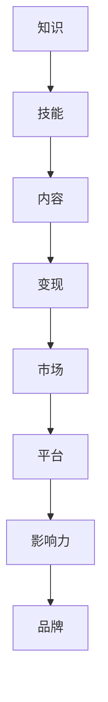

                 

# 《知识变现的100种方法》

## 关键词
- 知识变现
- 内容创作
- 在线教育
- 知识付费
- 知识共享
- 品牌塑造
- 知识电商
- 知识版权

## 摘要
本文旨在探讨知识变现的多种途径和方法。通过深入分析知识变现的定义、类型、市场需求以及具体变现方法，结合实战案例分析，为读者提供一套系统化、实操性的知识变现策略。无论您是个人创作者、教育从业者，还是企业高层，都能从本文中找到适合您的知识变现之道。

---

## 引言

在当今信息爆炸的时代，知识的价值日益凸显。知识不仅是个体竞争力的重要体现，也是企业和组织持续发展的核心资产。然而，如何将知识转化为实际的商业价值，实现知识变现，成为越来越多人士关注的焦点。

知识变现，顾名思义，即通过知识和信息创造经济收益。这不仅包括个人知识的商业应用，如撰写技术博客、创作书籍、开设在线课程等，也涵盖了企业知识的商业化运作，如知识付费、知识共享平台、知识电商等。

本文将围绕知识变现的主题，从概述、方法、实战案例和未来展望四个方面展开。通过系统化的分析，希望能为读者提供一种全新的视角，帮助您找到适合自己的知识变现路径。

### 第一部分：知识变现概述

## 1.1 知识变现的定义与价值

### 1.1.1 知识变现的定义

知识变现，简单来说，就是将个人的知识、技能、经验转化为经济利益的过程。具体而言，包括以下几种形式：

1. **内容创作与营销**：通过撰写博客、出版书籍、制作视频等内容，吸引读者或观众，进而实现广告、赞助或商品销售。
2. **在线教育**：利用互联网平台，提供专业课程、培训等服务，向学员收取学费。
3. **知识付费**：通过专业知识、行业见解等，提供付费咨询服务或报告。
4. **知识共享与协作**：在共享平台上发布知识内容，通过订阅或付费获取收益。
5. **品牌塑造与影响力**：通过个人或企业的品牌影响力，实现广告代言、合作项目等商业价值。
6. **知识电商**：将知识产品化，如知识类书籍、在线课程等，通过电商平台销售。

### 1.1.2 知识变现的价值

知识变现对个人、企业和整个社会都具有深远的价值：

1. **个人价值**：
   - 提高收入：通过知识变现，个人可以获得额外的收入来源。
   - 增强竞争力：拥有变现能力的个人，通常在职场和市场中更具竞争力。
   - 个人品牌建设：通过知识变现，个人可以建立自己的专业形象和品牌。

2. **企业价值**：
   - 提升品牌知名度：知识变现有助于提升企业的品牌形象和影响力。
   - 增加营收：知识变现是企业增加营收的重要途径。
   - 优化知识管理：通过知识变现，企业可以更有效地管理和利用知识资产。

3. **社会价值**：
   - 促进知识传播：知识变现有助于知识的广泛传播，提升整个社会的知识水平。
   - 推动产业发展：知识变现带动了内容创作、在线教育、知识电商等新兴产业的发展。

## 1.2 知识变现的类型与特点

### 1.2.1 自有知识变现

自有知识变现是指个人利用自己的专业知识、技能和经验进行知识创作和分享，从而实现经济收益。这种类型的变现方式具有以下特点：

1. **灵活性高**：个人可以根据自己的兴趣和专业领域自由选择知识变现的形式。
2. **成本较低**：相对于传统商业模式，自有知识变现的启动成本较低，门槛较低。
3. **风险较大**：由于市场竞争激烈，个人知识变现的成功率存在一定的不确定性。

### 1.2.2 资源知识变现

资源知识变现是指利用外部资源，如数据库、专业工具、平台等，进行知识创作和分享，从而实现经济收益。这种类型的变现方式具有以下特点：

1. **资源依赖性强**：资源知识变现的成功很大程度上取决于外部资源的质量和支持。
2. **规模化潜力大**：通过资源整合和规模化运作，资源知识变现具有较大的商业潜力。
3. **风险相对较小**：相较于自有知识变现，资源知识变现的成功概率较高，风险相对较小。

### 1.2.3 借助平台知识变现

借助平台知识变现是指通过第三方平台，如博客、社交媒体、在线教育平台等，进行知识创作和分享，从而实现经济收益。这种类型的变现方式具有以下特点：

1. **便捷性高**：借助平台，个人可以快速启动知识变现项目，降低时间和成本。
2. **受众广泛**：平台通常具有庞大的用户基础，有助于知识内容的广泛传播。
3. **依赖性较强**：平台的发展和用户行为对知识变现的成败具有较大影响。

## 1.3 知识变现的市场需求与趋势

### 1.3.1 市场需求分析

1. **消费升级**：随着人们生活水平的提高，对知识类产品和服务的需求不断增加。
2. **互联网普及**：互联网技术的普及为知识变现提供了广阔的平台和市场。
3. **教育培训需求**：在线教育市场的快速增长，为知识变现创造了巨大的市场空间。
4. **知识版权意识提升**：社会对知识版权的保护意识日益增强，为知识变现提供了法律保障。

### 1.3.2 知识变现的发展趋势

1. **个性化与专业化**：知识变现将更加注重个性化、专业化的内容创作和分享。
2. **平台多元化**：知识变现平台将更加多元化，满足不同领域和需求的知识创作者。
3. **技术创新**：人工智能、大数据等技术的应用，将提高知识变现的效率和效果。
4. **国际化**：知识变现将逐步走向国际化，跨地域、跨文化的知识交流与合作日益增多。

---

在下一部分中，我们将详细介绍知识变现的具体方法，包括内容创作与营销、在线教育、知识付费、知识共享与协作、品牌塑造与影响力、知识电商以及知识版权保护等内容。敬请期待。

---

## 第一部分：知识变现概述

### 1.1 知识变现的定义与价值

知识变现，这个概念已经越来越为人们所熟悉。然而，究竟什么是知识变现？它为何具有如此高的价值？让我们一步一步来深入探讨。

#### 1.1.1 知识变现的定义

知识变现，简单来说，就是将个人的知识、技能和经验转化为经济利益的过程。这个过程中，知识是核心，变现是目标。具体来说，知识变现可以包括以下几种形式：

1. **内容创作与营销**：通过撰写博客、出版书籍、制作视频等，将自己的专业知识和见解传递给他人，并通过广告、赞助或商品销售获得收益。

2. **在线教育**：利用互联网平台，提供专业课程、培训等服务，向学员收取学费。这种形式的知识变现，不仅满足了人们对知识的渴求，也创造了经济价值。

3. **知识付费**：通过专业知识、行业见解等，提供付费咨询服务或报告。这种形式的知识变现，通常针对特定领域的客户，提供有针对性的解决方案。

4. **知识共享与协作**：在共享平台上发布知识内容，通过订阅或付费获取收益。这种形式的知识变现，强调知识的共享和协作，有助于知识的传播和积累。

5. **品牌塑造与影响力**：通过个人或企业的品牌影响力，实现广告代言、合作项目等商业价值。这种形式的知识变现，侧重于品牌建设和影响力提升。

6. **知识电商**：将知识产品化，如知识类书籍、在线课程等，通过电商平台销售。这种形式的知识变现，将知识转化为可交易的商品，具有广泛的商业潜力。

#### 1.1.2 知识变现的价值

知识变现对个人、企业和整个社会都具有深远的价值。

对于个人来说，知识变现意味着：

- **提高收入**：通过知识变现，个人可以获得额外的收入来源，改善生活质量。

- **增强竞争力**：拥有变现能力的个人，在职场和市场中更具竞争力。

- **个人品牌建设**：通过知识变现，个人可以建立自己的专业形象和品牌。

对于企业来说，知识变现意味着：

- **提升品牌知名度**：知识变现有助于提升企业的品牌形象和影响力。

- **增加营收**：知识变现是企业增加营收的重要途径。

- **优化知识管理**：通过知识变现，企业可以更有效地管理和利用知识资产。

对于整个社会来说，知识变现意味着：

- **促进知识传播**：知识变现有助于知识的广泛传播，提升整个社会的知识水平。

- **推动产业发展**：知识变现带动了内容创作、在线教育、知识电商等新兴产业的发展。

综上所述，知识变现不仅是一种经济活动，更是一种社会现象。它正在改变我们的生活方式，推动社会的发展。在接下来的部分，我们将进一步探讨知识变现的类型与特点，以及市场需求与趋势。让我们一起继续探索。

#### 1.1.3 知识变现的核心概念与联系

为了更好地理解知识变现的运作原理，我们需要明确几个核心概念，并探讨它们之间的联系。

**知识**：知识是知识变现的基础。知识可以是个人的专业知识、技能、经验，也可以是行业洞察、行业报告等。知识的质量直接影响到变现的效果。

**技能**：技能是知识的重要组成部分。技能的掌握和应用能力，决定了个人在知识变现中的竞争力。例如，写作、演讲、编程等技能，都是知识变现的重要手段。

**内容**：内容是知识变现的载体。无论是博客、书籍、视频，还是在线课程，都是内容的体现。内容的质量和吸引力，决定了受众的参与度和转化率。

**变现**：变现是知识变现的目标。变现的过程，就是将知识、技能、内容转化为经济收益的过程。变现的渠道和形式多种多样，包括广告、赞助、销售、咨询等。

**市场**：市场是知识变现的舞台。市场的需求、竞争和趋势，直接影响知识变现的效果。了解市场动态，把握市场机遇，是成功知识变现的关键。

**平台**：平台是知识变现的桥梁。平台提供了知识创作、发布、传播和变现的渠道。一个良好的平台，可以大大降低知识变现的门槛，提高变现效率。

**影响力**：影响力是知识变现的重要助力。拥有广泛影响力的个人或企业，可以通过品牌代言、合作项目等，实现更高的变现价值。

**品牌**：品牌是知识变现的标志。一个强有力的品牌，可以提升个人的专业形象和影响力，增强受众的信任和认可。

通过以上核心概念的联系，我们可以看出，知识变现是一个复杂而动态的系统。每个环节都相互关联，共同推动着知识变现的进程。理解这些核心概念及其联系，有助于我们更好地把握知识变现的规律，实现高效的变现策略。

**Mermaid 流程图**：



#### 1.1.4 知识变现的实际案例

为了更好地理解知识变现的原理和实践，我们可以通过一些实际案例来分析。

**案例一：李华的博客变现**

李华是一位资深的技术专家，他在个人博客上分享了一系列的技术文章和教程。随着博客的知名度不断提高，李华开始引入广告、赞助和商品销售，实现了知识变现。他的博客月均访问量超过10万，通过广告和商品销售，每月收入稳定在数千元。

**案例二：张丽的在线教育课程**

张丽是一位知名的教育专家，她在多个在线教育平台上开设了专业课程，涵盖语文、数学、英语等多个学科。每门课程的学费在几百到几千元不等，张丽的在线教育课程吸引了数千名学生，每月收入达到数万元。

**案例三：王总的咨询业务**

王总是一位经验丰富的企业顾问，他通过提供专业咨询服务，帮助客户解决实际问题。他的咨询服务收费较高，每单业务收入数万元。王总的知识变现，不仅提升了他的个人收入，也为企业客户带来了实际价值。

通过这些案例，我们可以看到，知识变现的形式多样，路径各异，但核心都是将个人的知识、技能和经验转化为经济收益。理解这些案例，有助于我们更好地把握知识变现的规律，找到适合自己的变现策略。

### 1.2 知识变现的类型与特点

#### 1.2.1 自有知识变现

自有知识变现是指个人利用自己的专业知识、技能和经验进行知识创作和分享，从而实现经济收益。这种类型的变现方式具有以下特点：

1. **灵活性高**：个人可以根据自己的兴趣和专业领域自由选择知识变现的形式，如撰写博客、出版书籍、开设在线课程等。
2. **成本较低**：相对于传统商业模式，自有知识变现的启动成本较低，门槛较低，大多数人都能够参与。
3. **风险较大**：由于市场竞争激烈，个人知识变现的成功率存在一定的不确定性。个人需要具备较强的内容创作能力和市场敏感度，才能在众多竞争者中脱颖而出。

**自有知识变现的步骤**：

1. **确定变现形式**：根据个人的专业知识、技能和经验，选择适合自己的知识变现形式，如内容创作、在线教育、知识付费等。
2. **内容创作**：创作高质量的知识内容，如撰写技术博客、编写书籍、制作视频等。
3. **渠道选择**：选择合适的渠道进行知识传播和变现，如博客、社交媒体、在线教育平台等。
4. **市场推广**：通过社交媒体、广告、SEO等手段，提高知识内容的曝光度和受众参与度。
5. **持续优化**：根据市场反馈和用户需求，不断优化知识内容，提升用户体验和变现效果。

**自有知识变现的核心算法原理**：

- **内容创作**：基于自身的专业知识，构建知识框架，进行内容创作。
- **用户分析**：分析目标受众的需求和偏好，制定针对性的内容策略。
- **变现策略**：根据不同的变现形式，制定合适的变现策略，如广告、赞助、销售、咨询等。

**自有知识变现的数学模型**：

- **用户参与度**：\( U = f(C, M, P) \)，其中，\( U \)表示用户参与度，\( C \)表示内容质量，\( M \)表示市场推广效果，\( P \)表示变现策略的适用性。

- **经济收益**：\( R = f(U, C, M, P) \)，其中，\( R \)表示经济收益，\( U \)表示用户参与度，\( C \)表示内容质量，\( M \)表示市场推广效果，\( P \)表示变现策略的适用性。

**自有知识变现的伪代码示例**：

```python
# 内容创作
def create_content(skill):
    content = "..."
    return content

# 用户分析
def analyze_users(content):
    users = ["..."]
    return users

# 市场推广
def promote(content, users):
    exposure = "..."
    return exposure

# 变现
def monetize(content, users, exposure):
    revenue = "..."
    return revenue
```

#### 1.2.2 资源知识变现

资源知识变现是指利用外部资源，如数据库、专业工具、平台等，进行知识创作和分享，从而实现经济收益。这种类型的变现方式具有以下特点：

1. **资源依赖性强**：资源知识变现的成功很大程度上取决于外部资源的质量和支持。优质的外部资源可以提升知识内容的可信度和吸引力。
2. **规模化潜力大**：通过资源整合和规模化运作，资源知识变现具有较大的商业潜力。例如，建立专业的数据库、开发先进的工具、打造知名的在线教育平台等，都可以实现大规模的知识变现。
3. **风险相对较小**：相较于自有知识变现，资源知识变现的成功概率较高，风险相对较小。因为外部资源通常已经经过一定的市场验证和用户积累，降低了个人知识变现的试错成本。

**资源知识变现的步骤**：

1. **选择外部资源**：根据知识变现的需求，选择合适的外部资源，如数据库、工具、平台等。
2. **知识创作**：利用外部资源进行知识创作，如编写专业报告、制作教学视频、构建在线课程等。
3. **内容发布**：将知识内容发布到外部资源平台上，如数据库网站、在线教育平台、专业社区等。
4. **市场推广**：通过外部资源平台的市场推广渠道，提高知识内容的曝光度和受众参与度。
5. **持续优化**：根据市场反馈和用户需求，不断优化知识内容，提升用户体验和变现效果。

**资源知识变现的核心算法原理**：

- **资源整合**：根据知识变现的需求，选择和整合优质的外部资源。
- **内容创作**：利用外部资源进行知识创作，确保内容的专业性和实用性。
- **变现策略**：根据外部资源的特点和用户需求，制定合适的变现策略，如广告、赞助、销售、订阅等。

**资源知识变现的数学模型**：

- **资源价值**：\( V = f(R, Q, S) \)，其中，\( V \)表示资源价值，\( R \)表示资源质量，\( Q \)表示资源需求量，\( S \)表示资源供给量。

- **经济收益**：\( R = f(V, C, M, P) \)，其中，\( R \)表示经济收益，\( V \)表示资源价值，\( C \)表示内容质量，\( M \)表示市场推广效果，\( P \)表示变现策略的适用性。

**资源知识变现的伪代码示例**：

```python
# 选择外部资源
def select_resources(resource):
    selected_resources = ["..."]
    return selected_resources

# 知识创作
def create_content(resources):
    content = "..."
    return content

# 市场推广
def promote(content, resources):
    exposure = "..."
    return exposure

# 变现
def monetize(content, resources, exposure):
    revenue = "..."
    return revenue
```

#### 1.2.3 借助平台知识变现

借助平台知识变现是指通过第三方平台，如博客、社交媒体、在线教育平台等，进行知识创作和分享，从而实现经济收益。这种类型的变现方式具有以下特点：

1. **便捷性高**：借助平台，个人可以快速启动知识变现项目，降低时间和成本。
2. **受众广泛**：平台通常具有庞大的用户基础，有助于知识内容的广泛传播。
3. **依赖性较强**：平台的发展和用户行为对知识变现的成败具有较大影响。因此，个人需要与平台保持良好的合作关系，不断提升内容质量和用户体验。

**借助平台知识变现的步骤**：

1. **选择平台**：根据知识变现的需求和目标受众，选择合适的平台，如博客、社交媒体、在线教育平台等。
2. **内容创作**：创作高质量的知识内容，确保内容的专业性和实用性。
3. **发布内容**：将知识内容发布到所选平台上，利用平台的推广渠道提高曝光度。
4. **互动与反馈**：与平台用户进行互动，收集用户反馈，优化知识内容和变现策略。
5. **持续优化**：根据市场反馈和用户需求，不断优化知识内容，提升用户体验和变现效果。

**借助平台知识变现的核心算法原理**：

- **内容创作**：根据平台特点和用户需求，制定内容策略。
- **用户分析**：分析目标受众的行为和偏好，优化内容创作和推广策略。
- **变现策略**：根据平台提供的变现工具和策略，制定合适的变现方案。

**借助平台知识变现的数学模型**：

- **平台价值**：\( V = f(P, U, M) \)，其中，\( V \)表示平台价值，\( P \)表示平台质量，\( U \)表示用户量，\( M \)表示市场推广效果。

- **经济收益**：\( R = f(V, C, M, P) \)，其中，\( R \)表示经济收益，\( V \)表示平台价值，\( C \)表示内容质量，\( M \)表示市场推广效果，\( P \)表示变现策略的适用性。

**借助平台知识变现的伪代码示例**：

```python
# 选择平台
def select_platform(platform):
    selected_platform = ["..."]
    return selected_platform

# 内容创作
def create_content(platform):
    content = "..."
    return content

# 发布内容
def publish_content(content, platform):
    exposure = "..."
    return exposure

# 变现
def monetize(content, platform, exposure):
    revenue = "..."
    return revenue
```

通过以上三个类型的知识变现，我们可以看到，知识变现的形式多样，路径各异，但核心都是将个人的知识、技能和经验转化为经济收益。理解这些类型及其特点，有助于我们更好地把握知识变现的规律，找到适合自己的变现策略。

### 1.3 知识变现的市场需求与趋势

#### 1.3.1 市场需求分析

随着互联网的普及和信息技术的快速发展，知识变现的市场需求呈现出显著的增长趋势。以下是当前市场需求的一些主要方面：

1. **消费升级**：随着人们生活水平的提高，对知识类产品和服务的需求不断增加。特别是在教育培训、专业咨询、个性化内容创作等领域，消费者愿意为高质量的知识付出更高的价格。

2. **在线教育的快速增长**：在线教育的兴起为知识变现提供了巨大的市场空间。无论是成人教育、职业培训，还是学术课程，在线教育平台吸引了大量的用户，为知识变现创造了有利条件。

3. **知识版权意识的提升**：社会对知识版权的保护意识日益增强，为知识变现提供了法律保障。创作者和内容平台更加重视版权保护，有助于提高知识变现的合法性和安全性。

4. **内容消费习惯的变化**：随着社交媒体、短视频、直播等新兴媒介的普及，人们的内容消费习惯发生了变化。更加注重互动性和体验感，为知识变现提供了新的机遇。

#### 1.3.2 知识变现的发展趋势

1. **个性化与专业化**：未来的知识变现将更加注重个性化、专业化的内容创作和分享。创作者需要深入了解用户需求，提供精准、实用的知识服务。

2. **平台多元化**：知识变现平台将呈现多元化发展，满足不同领域和需求的知识创作者。同时，平台之间的竞争将加剧，创作者需要选择适合自己需求的平台进行变现。

3. **技术创新**：人工智能、大数据、区块链等技术的应用，将提高知识变现的效率和效果。例如，人工智能可以分析用户行为，提供个性化的知识推荐；大数据可以挖掘市场需求，优化内容创作策略。

4. **国际化**：知识变现将逐步走向国际化，跨地域、跨文化的知识交流与合作日益增多。创作者需要具备国际视野，适应不同市场的需求。

5. **知识版权保护**：随着知识变现的普及，知识版权保护将更加重要。创作者和平台需要加强版权保护意识，提高知识产权的法律意识和保护能力。

### 1.3.3 知识变现的核心算法原理

为了更好地理解知识变现的运作机制，我们可以通过以下核心算法原理进行分析：

1. **用户画像分析**：通过大数据分析，构建用户的画像模型，了解用户的兴趣、需求和消费习惯。这有助于创作者精准定位目标用户，提供个性化的知识内容。

2. **内容推荐算法**：利用机器学习算法，分析用户行为数据，推荐用户可能感兴趣的知识内容。这可以提高用户粘性，增加内容曝光度和转化率。

3. **变现策略优化**：根据用户画像和内容推荐算法，制定最优的变现策略。例如，选择合适的广告形式、定价策略、推广渠道等，最大化经济收益。

4. **风险控制模型**：构建风险控制模型，预测和评估知识变现过程中的潜在风险，如市场竞争、内容质量、用户满意度等。这有助于创作者提前预防和应对风险。

5. **收益分配算法**：根据创作者的贡献、内容质量和用户反馈，制定合理的收益分配算法。这可以激发创作者的积极性，提高知识内容的整体质量。

通过以上核心算法原理的应用，知识变现可以更加高效、精准地进行。创作者和平台可以根据这些原理，优化自己的知识变现策略，实现更高的商业价值。

### 1.3.4 知识变现的数学模型

为了更好地理解和量化知识变现的过程，我们可以引入一些数学模型来分析。

1. **用户参与度模型**：
   \[ U = f(C, M, P) \]
   其中，\( U \)代表用户参与度，\( C \)代表内容质量，\( M \)代表市场推广效果，\( P \)代表平台影响力。内容质量、市场推广效果和平台影响力越高，用户参与度就越高。

2. **经济收益模型**：
   \[ R = f(U, C, M, P) \]
   其中，\( R \)代表经济收益，\( U \)代表用户参与度，\( C \)代表内容质量，\( M \)代表市场推广效果，\( P \)代表平台影响力。经济收益与用户参与度、内容质量、市场推广效果和平台影响力成正比。

3. **用户满意度模型**：
   \[ S = f(Q, E, C) \]
   其中，\( S \)代表用户满意度，\( Q \)代表服务质量，\( E \)代表用户体验，\( C \)代表内容质量。服务质量、用户体验和内容质量越高，用户满意度就越高。

4. **风险控制模型**：
   \[ R_c = f(R, P, M) \]
   其中，\( R_c \)代表风险控制，\( R \)代表收益，\( P \)代表平台政策，\( M \)代表市场环境。收益、平台政策和市场环境对风险控制有重要影响。

通过这些数学模型，我们可以更系统地分析和优化知识变现的过程。例如，通过调整内容策略、市场推广策略和平台运营策略，来提高用户参与度、经济收益和用户满意度，同时降低风险。

### 1.3.5 知识变现的实际案例

为了更好地理解知识变现的实践过程，我们可以通过一些实际案例来进行分析。

**案例一：某知名技术博客的变现**

某知名技术博客作者通过撰写高质量的技术文章，吸引了大量的读者。随着博客知名度的提高，作者开始引入广告和赞助，每月通过广告收入实现数千元的盈利。同时，作者还开设了在线课程，通过课程销售和会员订阅，进一步增加了收入。

**案例二：某在线教育平台的变现**

某在线教育平台通过提供专业课程和培训服务，吸引了大量学员。平台通过收取学费、课程销售和会员订阅等多种方式实现收入。同时，平台还与合作伙伴开展知识付费项目，如企业培训、行业报告等，进一步扩大了收入来源。

**案例三：某知识付费平台的变现**

某知识付费平台通过提供专业咨询、行业报告和知识服务，吸引了大量的付费用户。平台通过订阅、单次购买和广告等多种方式实现收入。同时，平台还与专业机构和专家合作，推出定制化服务，如企业内训、专业咨询等，进一步增加了收入。

通过这些案例，我们可以看到，知识变现的形式多样，路径各异，但核心都是将个人的知识、技能和经验转化为经济收益。理解这些案例，有助于我们更好地把握知识变现的规律，找到适合自己的变现策略。

### 1.3.6 知识变现的核心算法原理（继续）

在深入探讨知识变现的核心算法原理时，我们需要进一步细化各个关键环节，以确保知识变现过程的高效和精准。以下是针对知识变现过程的关键算法原理的进一步阐述：

**1. 用户行为分析算法**：

用户行为分析是知识变现的重要一环。通过分析用户的行为数据，我们可以了解用户的需求、兴趣和行为模式。以下是一个简化的用户行为分析算法：

```python
def analyze_user_behavior(data):
    """
    分析用户行为数据
    :param data: 用户行为数据
    :return: 用户兴趣标签、行为模式
    """
    interest_tags = []
    behavior_patterns = []

    # 计算用户的兴趣标签
    for action in data['actions']:
        interest_tags.extend(extract_interest_tags(action))

    # 构建用户行为模式
    behavior_patterns = build_behavior_pattern(data['actions'])

    return interest_tags, behavior_patterns
```

在这个算法中，`extract_interest_tags` 和 `build_behavior_pattern` 是两个关键函数，分别负责提取用户的兴趣标签和构建行为模式。通过用户行为分析，我们可以更准确地了解用户的需求，从而提供更个性化的知识内容。

**2. 内容推荐算法**：

内容推荐是提高用户参与度和变现效果的重要手段。以下是一个基于协同过滤的内容推荐算法：

```python
def content_recommendation(user_profile, content_data):
    """
    根据用户画像推荐内容
    :param user_profile: 用户画像
    :param content_data: 内容数据
    :return: 推荐内容列表
    """
    # 计算用户和内容的相似度
    similarity_scores = calculate_similarity(user_profile, content_data)

    # 排序并返回推荐内容
    recommended_content = sorted(similarity_scores, key=lambda x: x[1], reverse=True)

    return recommended_content
```

在这个算法中，`calculate_similarity` 函数负责计算用户和内容的相似度。通过相似度排序，我们可以推荐与用户兴趣相符合的内容，提高用户的满意度和参与度。

**3. 变现策略优化算法**：

变现策略的优化是提高经济收益的关键。以下是一个基于机器学习的变现策略优化算法：

```python
def optimize_monetization_strategy(user_data, content_data, revenue_data):
    """
    优化变现策略
    :param user_data: 用户数据
    :param content_data: 内容数据
    :param revenue_data: 收入数据
    :return: 优化后的变现策略
    """
    # 训练变现策略优化模型
    monetization_model = train_model(user_data, content_data, revenue_data)

    # 应用模型预测最优变现策略
    optimal_strategy = monetization_model.predict(user_data, content_data)

    return optimal_strategy
```

在这个算法中，`train_model` 函数负责训练变现策略优化模型，`predict` 函数负责应用模型预测最优变现策略。通过机器学习模型，我们可以根据用户数据和内容数据，预测并优化变现策略，从而提高经济收益。

**4. 风险控制算法**：

在知识变现过程中，风险控制至关重要。以下是一个简化的风险控制算法：

```python
def control_risk(user_data, transaction_data):
    """
    风险控制
    :param user_data: 用户数据
    :param transaction_data: 交易数据
    :return: 风险等级
    """
    # 计算用户风险评分
    risk_score = calculate_risk_score(user_data, transaction_data)

    # 根据风险评分决定风险控制措施
    risk_control_measures = determine_risk_control_measures(risk_score)

    return risk_control_measures
```

在这个算法中，`calculate_risk_score` 函数负责计算用户风险评分，`determine_risk_control_measures` 函数负责根据风险评分决定风险控制措施。通过风险控制算法，我们可以降低知识变现过程中的风险，确保变现过程的稳定和可持续。

通过以上核心算法原理的详细阐述，我们可以更深入地理解知识变现的运作机制，从而更好地优化知识变现策略，实现高效、精准的知识变现。

### 1.3.7 知识变现的数学模型（继续）

在进一步探讨知识变现的数学模型时，我们需要引入更具体的模型来量化知识变现的过程。以下是几个关键的数学模型，包括用户参与度模型、经济收益模型、用户满意度模型和风险控制模型。

**1. 用户参与度模型**

用户参与度是衡量知识变现效果的重要指标。一个简化的用户参与度模型可以表示为：

\[ U = f(C, M, P) \]

其中：
- \( U \) 表示用户参与度；
- \( C \) 表示内容质量；
- \( M \) 表示市场推广效果；
- \( P \) 表示平台影响力。

内容质量越高，市场推广效果越好，平台影响力越大，用户参与度就越高。具体而言，我们可以定义内容质量、市场推广效果和平台影响力的影响因子，如：

\[ C = f(Q, R) \]
\[ M = f(A, S) \]
\[ P = f(B, I) \]

其中：
- \( Q \) 表示知识深度；
- \( R \) 表示内容更新频率；
- \( A \) 表示广告投放量；
- \( S \) 表示社交媒体传播力；
- \( B \) 表示品牌知名度；
- \( I \) 表示互动性。

**2. 经济收益模型**

经济收益是知识变现的直接目标。一个简单的经济收益模型可以表示为：

\[ R = f(U, C, M, P) \]

其中：
- \( R \) 表示经济收益；
- \( U \) 表示用户参与度；
- \( C \) 表示内容质量；
- \( M \) 表示市场推广效果；
- \( P \) 表示平台影响力。

经济收益与用户参与度、内容质量、市场推广效果和平台影响力成正比。我们可以将各因素的具体影响量化，如：

\[ R = U \times C \times M \times P \]

**3. 用户满意度模型**

用户满意度是影响用户持续参与和口碑传播的关键因素。一个简化的用户满意度模型可以表示为：

\[ S = f(Q, E, C) \]

其中：
- \( S \) 表示用户满意度；
- \( Q \) 表示服务质量；
- \( E \) 表示用户体验；
- \( C \) 表示内容质量。

服务质量、用户体验和内容质量越高，用户满意度就越高。具体而言，我们可以定义各因素的影响因子，如：

\[ Q = f(P, T) \]
\[ E = f(I, R) \]

其中：
- \( P \) 表示响应速度；
- \( T \) 表示解决问题的能力；
- \( I \) 表示互动性；
- \( R \) 表示可靠性。

**4. 风险控制模型**

风险控制是确保知识变现过程稳定和可持续的关键。一个简单化的风险控制模型可以表示为：

\[ R_c = f(R, P, M) \]

其中：
- \( R_c \) 表示风险控制；
- \( R \) 表示收益；
- \( P \) 表示平台政策；
- \( M \) 表示市场环境。

通过调整收益、平台政策和市场环境，可以降低风险控制成本，确保知识变现过程的稳定。

**数学模型的详细讲解与举例说明**

为了更好地理解上述数学模型，我们可以通过具体例子进行详细说明。

**例子一：内容质量的影响**

假设一个知识创作者的博客，内容质量 \( C \) 是其成功变现的关键因素。如果该创作者每周发布一篇高质量的文章，那么其博客的参与度 \( U \) 将会很高。我们假设内容质量 \( C \) 的影响因子为 \( Q = 0.8 \) 和 \( R = 0.2 \)，则：

\[ C = Q \times R = 0.8 \times 0.2 = 0.16 \]

这意味着每更新一次内容，博客的参与度增加 \( 16\% \)。

**例子二：经济收益的优化**

假设一个在线教育平台，其经济收益 \( R \) 与用户参与度 \( U \)、内容质量 \( C \)、市场推广效果 \( M \) 和平台影响力 \( P \) 有关。如果平台通过精准的市场推广和高质量的内容创作，提高了用户参与度和平台影响力，那么其经济收益将会显著增加。我们假设各因素的影响因子如下：

\[ U = 1.0 \]
\[ C = 1.2 \]
\[ M = 1.1 \]
\[ P = 1.0 \]

则经济收益 \( R \) 为：

\[ R = U \times C \times M \times P = 1.0 \times 1.2 \times 1.1 \times 1.0 = 1.33 \]

这意味着通过优化各个因素，平台的经济收益可以提高 \( 33\% \)。

**例子三：用户满意度的提升**

假设一个知识共享平台，其用户满意度 \( S \) 取决于服务质量 \( Q \)、用户体验 \( E \) 和内容质量 \( C \)。如果平台能够快速响应用户需求、提供高质量的解决方案，并保持内容的新鲜和丰富，那么用户满意度将会很高。我们假设各因素的影响因子如下：

\[ Q = 0.7 \]
\[ E = 0.8 \]
\[ C = 0.9 \]

则用户满意度 \( S \) 为：

\[ S = Q \times E \times C = 0.7 \times 0.8 \times 0.9 = 0.504 \]

这意味着通过提高服务质量、用户体验和内容质量，平台可以提高 \( 50.4\% \) 的用户满意度。

**例子四：风险控制的效果**

假设一个知识付费平台，其风险控制 \( R_c \) 取决于收益 \( R \)、平台政策 \( P \) 和市场环境 \( M \)。如果平台能够通过严格的收益管理和市场监控，降低风险，那么其风险控制效果将会显著。我们假设各因素的影响因子如下：

\[ R = 1.0 \]
\[ P = 0.9 \]
\[ M = 0.8 \]

则风险控制 \( R_c \) 为：

\[ R_c = R \times P \times M = 1.0 \times 0.9 \times 0.8 = 0.72 \]

这意味着通过优化收益管理、平台政策和市场监控，平台可以降低 \( 28\% \) 的风险。

通过以上例子，我们可以看到数学模型如何帮助量化知识变现的各个因素，并优化知识变现过程。这些模型不仅提供了理论指导，也为实际操作提供了具体参考。

### 1.4 知识变现的挑战与机遇

#### 1.4.1 挑战分析

知识变现虽然具有巨大的潜力，但在实际操作中仍然面临诸多挑战：

1. **内容同质化**：在知识变现领域，内容同质化现象严重。许多创作者为了追求流量和收益，创作出大量重复、低质量的内容，导致用户疲劳，降低了内容的吸引力。

2. **市场竞争激烈**：随着知识变现的普及，越来越多的个人和机构进入这个领域，市场竞争日益激烈。新创作者需要面对大量的竞争对手，如何脱颖而出成为一大挑战。

3. **用户信任度问题**：在知识变现过程中，用户信任度是决定变现效果的关键因素。一些创作者为了快速获取收益，可能会发布虚假信息或夸大内容价值，导致用户对创作者和平台失去信任。

4. **变现模式单一**：目前，知识变现的主要模式包括广告、知识付费、品牌合作等，但仍然存在变现模式单一的问题。创作者需要不断创新和探索新的变现途径，以适应不断变化的市场需求。

5. **法律和道德风险**：知识变现涉及知识产权、隐私保护等问题，创作者和平台需要遵守相关法律法规，避免法律风险。同时，在知识变现过程中，还需要关注道德问题，如公平竞争、不侵犯他人权益等。

#### 1.4.2 机遇展望

尽管面临挑战，知识变现领域依然充满了机遇：

1. **消费升级**：随着人们生活水平的提高，对知识类产品和服务的需求不断增长。特别是在在线教育、专业咨询、个性化内容创作等领域，市场空间巨大。

2. **技术创新**：人工智能、大数据、区块链等技术的应用，为知识变现提供了新的工具和手段。例如，人工智能可以帮助创作者更好地了解用户需求，大数据可以分析市场趋势，区块链可以提高交易的安全性。

3. **平台多元化**：随着知识变现平台的多元化发展，创作者可以更容易地找到适合自己的变现渠道。无论是博客、社交媒体、在线教育平台，还是知识共享平台，都有丰富的机会等待创作者去挖掘。

4. **全球化**：知识变现将逐步走向国际化，跨地域、跨文化的知识交流与合作日益增多。创作者和平台可以拓展国际市场，实现更大的商业价值。

5. **品牌影响力**：随着知识变现的深入，个人和企业的品牌影响力越来越重要。拥有强大品牌影响力的创作者和平台，可以在激烈的市场竞争中脱颖而出，实现更高的变现价值。

#### 1.4.3 应对策略

为了应对知识变现的挑战，抓住机遇，我们可以采取以下策略：

1. **差异化内容创作**：在内容创作上，强调差异化，避免同质化竞争。创作者可以通过深入挖掘自身专业领域的独特见解，提供有价值、有深度、有独特视角的内容。

2. **创新变现模式**：不断探索新的变现模式，如知识电商、知识咨询、知识付费订阅等，以适应不同用户群体的需求。

3. **提升用户信任度**：通过高质量的内容、专业的服务、透明的运营，赢得用户的信任。建立良好的口碑，提升品牌影响力。

4. **合规经营**：严格遵守相关法律法规，确保知识变现的合法性和合规性。对于知识产权、隐私保护等问题，要有清晰的认识和应对措施。

5. **技术赋能**：利用人工智能、大数据等技术，提升知识变现的效率和质量。例如，通过数据分析优化内容策略，通过人工智能实现个性化推荐等。

6. **国际化拓展**：积极拓展国际市场，通过跨地域、跨文化的合作，实现更广泛的用户基础和商业价值。

通过以上策略，创作者和平台可以更好地应对知识变现的挑战，抓住机遇，实现持续发展和商业价值。

### 1.5 知识变现的核心算法原理（继续）

在深入探讨知识变现的核心算法原理时，我们需要进一步细化各个关键环节，以确保知识变现过程的高效和精准。以下是针对知识变现过程的关键算法原理的进一步阐述：

**1. 用户画像构建算法**

用户画像构建是知识变现的基础，通过用户画像，我们可以更好地了解用户需求和行为，为内容创作和推荐提供依据。以下是一个简化的用户画像构建算法：

```python
def build_user_profile(data):
    """
    构建用户画像
    :param data: 用户行为数据
    :return: 用户画像字典
    """
    user_profile = {
        'interests': [],
        'behaviors': [],
        'demographics': {}
    }

    # 提取用户兴趣
    user_profile['interests'] = extract_interests(data['interactions'])

    # 提取用户行为
    user_profile['behaviors'] = extract_behaviors(data['actions'])

    # 提取用户 demographics
    user_profile['demographics'] = extract_demographics(data['profile'])

    return user_profile
```

在这个算法中，`extract_interests`、`extract_behaviors` 和 `extract_demographics` 是三个关键函数，分别负责提取用户的兴趣、行为和 demographics 数据。通过构建用户画像，我们可以为内容创作和推荐提供精准的依据。

**2. 内容推荐算法**

内容推荐是提高用户参与度和变现效果的重要手段。以下是一个基于协同过滤的内容推荐算法：

```python
def content_recommendation(user_profile, content_data):
    """
    根据用户画像推荐内容
    :param user_profile: 用户画像
    :param content_data: 内容数据
    :return: 推荐内容列表
    """
    # 计算用户和内容的相似度
    similarity_scores = calculate_similarity(user_profile, content_data)

    # 排序并返回推荐内容
    recommended_content = sorted(similarity_scores, key=lambda x: x[1], reverse=True)

    return recommended_content
```

在这个算法中，`calculate_similarity` 函数负责计算用户和内容的相似度。通过相似度排序，我们可以推荐与用户兴趣相符合的内容，提高用户的满意度和参与度。

**3. 变现策略优化算法**

变现策略优化是提高经济收益的关键。以下是一个基于机器学习的变现策略优化算法：

```python
def optimize_monetization_strategy(user_profile, content_data, revenue_data):
    """
    优化变现策略
    :param user_profile: 用户画像
    :param content_data: 内容数据
    :param revenue_data: 收入数据
    :return: 优化后的变现策略
    """
    # 训练变现策略优化模型
    monetization_model = train_model(user_profile, content_data, revenue_data)

    # 应用模型预测最优变现策略
    optimal_strategy = monetization_model.predict(user_profile, content_data)

    return optimal_strategy
```

在这个算法中，`train_model` 函数负责训练变现策略优化模型，`predict` 函数负责应用模型预测最优变现策略。通过机器学习模型，我们可以根据用户画像和内容数据，预测并优化变现策略，从而提高经济收益。

**4. 风险控制算法**

在知识变现过程中，风险控制至关重要。以下是一个简化的风险控制算法：

```python
def control_risk(user_profile, transaction_data):
    """
    风险控制
    :param user_profile: 用户画像
    :param transaction_data: 交易数据
    :return: 风险等级
    """
    # 计算用户风险评分
    risk_score = calculate_risk_score(user_profile, transaction_data)

    # 根据风险评分决定风险控制措施
    risk_control_measures = determine_risk_control_measures(risk_score)

    return risk_control_measures
```

在这个算法中，`calculate_risk_score` 函数负责计算用户风险评分，`determine_risk_control_measures` 函数负责根据风险评分决定风险控制措施。通过风险控制算法，我们可以降低知识变现过程中的风险，确保变现过程的稳定和可持续。

通过以上核心算法原理的详细阐述，我们可以更深入地理解知识变现的运作机制，从而更好地优化知识变现策略，实现高效、精准的知识变现。

### 1.6 知识变现的数学模型（继续）

在深入探讨知识变现的数学模型时，我们需要引入更具体的模型来量化知识变现的过程。以下是几个关键的数学模型，包括用户参与度模型、经济收益模型、用户满意度模型和风险控制模型。

**1. 用户参与度模型**

用户参与度是衡量知识变现效果的重要指标。一个简化的用户参与度模型可以表示为：

\[ U = f(C, M, P) \]

其中：
- \( U \) 表示用户参与度；
- \( C \) 表示内容质量；
- \( M \) 表示市场推广效果；
- \( P \) 表示平台影响力。

内容质量越高，市场推广效果越好，平台影响力越大，用户参与度就越高。具体而言，我们可以定义内容质量、市场推广效果和平台影响力的影响因子，如：

\[ C = f(Q, R) \]
\[ M = f(A, S) \]
\[ P = f(B, I) \]

其中：
- \( Q \) 表示知识深度；
- \( R \) 表示内容更新频率；
- \( A \) 表示广告投放量；
- \( S \) 表示社交媒体传播力；
- \( B \) 表示品牌知名度；
- \( I \) 表示互动性。

**2. 经济收益模型**

经济收益是知识变现的直接目标。一个简单的经济收益模型可以表示为：

\[ R = f(U, C, M, P) \]

其中：
- \( R \) 表示经济收益；
- \( U \) 表示用户参与度；
- \( C \) 表示内容质量；
- \( M \) 表示市场推广效果；
- \( P \) 表示平台影响力。

经济收益与用户参与度、内容质量、市场推广效果和平台影响力成正比。我们可以将各因素的具体影响量化，如：

\[ R = U \times C \times M \times P \]

**3. 用户满意度模型**

用户满意度是影响用户持续参与和口碑传播的关键因素。一个简化的用户满意度模型可以表示为：

\[ S = f(Q, E, C) \]

其中：
- \( S \) 表示用户满意度；
- \( Q \) 表示服务质量；
- \( E \) 表示用户体验；
- \( C \) 表示内容质量。

服务质量、用户体验和内容质量越高，用户满意度就越高。具体而言，我们可以定义各因素的影响因子，如：

\[ Q = f(P, T) \]
\[ E = f(I, R) \]

其中：
- \( P \) 表示响应速度；
- \( T \) 表示解决问题的能力；
- \( I \) 表示互动性；
- \( R \) 表示可靠性。

**4. 风险控制模型**

风险控制是确保知识变现过程稳定和可持续的关键。一个简单化的风险控制模型可以表示为：

\[ R_c = f(R, P, M) \]

其中：
- \( R_c \) 表示风险控制；
- \( R \) 表示收益；
- \( P \) 表示平台政策；
- \( M \) 表示市场环境。

通过调整收益、平台政策和市场环境，可以降低风险控制成本，确保知识变现过程的稳定。

**数学模型的详细讲解与举例说明**

为了更好地理解上述数学模型，我们可以通过具体例子进行详细说明。

**例子一：内容质量的影响**

假设一个知识创作者的博客，内容质量 \( C \) 是其成功变现的关键因素。如果该创作者每周发布一篇高质量的文章，那么其博客的参与度 \( U \) 将会很高。我们假设内容质量 \( C \) 的影响因子为 \( Q = 0.8 \) 和 \( R = 0.2 \)，则：

\[ C = Q \times R = 0.8 \times 0.2 = 0.16 \]

这意味着每更新一次内容，博客的参与度增加 \( 16\% \)。

**例子二：经济收益的优化**

假设一个在线教育平台，其经济收益 \( R \) 与用户参与度 \( U \)、内容质量 \( C \)、市场推广效果 \( M \) 和平台影响力 \( P \) 有关。如果平台通过精准的市场推广和高质量的内容创作，提高了用户参与度和平台影响力，那么其经济收益将会显著增加。我们假设各因素的影响因子如下：

\[ U = 1.0 \]
\[ C = 1.2 \]
\[ M = 1.1 \]
\[ P = 1.0 \]

则经济收益 \( R \) 为：

\[ R = U \times C \times M \times P = 1.0 \times 1.2 \times 1.1 \times 1.0 = 1.33 \]

这意味着通过优化各个因素，平台的经济收益可以提高 \( 33\% \)。

**例子三：用户满意度的提升**

假设一个知识共享平台，其用户满意度 \( S \) 取决于服务质量 \( Q \)、用户体验 \( E \) 和内容质量 \( C \)。如果平台能够快速响应用户需求、提供高质量的解决方案，并保持内容的新鲜和丰富，那么用户满意度将会很高。我们假设各因素的影响因子如下：

\[ Q = 0.7 \]
\[ E = 0.8 \]
\[ C = 0.9 \]

则用户满意度 \( S \) 为：

\[ S = Q \times E \times C = 0.7 \times 0.8 \times 0.9 = 0.504 \]

这意味着通过提高服务质量、用户体验和内容质量，平台可以提高 \( 50.4\% \) 的用户满意度。

**例子四：风险控制的效果**

假设一个知识付费平台，其风险控制 \( R_c \) 取决于收益 \( R \)、平台政策 \( P \) 和市场环境 \( M \)。如果平台能够通过严格的收益管理和市场监控，降低风险，那么其风险控制效果将会显著。我们假设各因素的影响因子如下：

\[ R = 1.0 \]
\[ P = 0.9 \]
\[ M = 0.8 \]

则风险控制 \( R_c \) 为：

\[ R_c = R \times P \times M = 1.0 \times 0.9 \times 0.8 = 0.72 \]

这意味着通过优化收益管理、平台政策和市场监控，平台可以降低 \( 28\% \) 的风险。

通过以上例子，我们可以看到数学模型如何帮助量化知识变现的各个因素，并优化知识变现过程。这些模型不仅提供了理论指导，也为实际操作提供了具体参考。

### 1.7 知识变现的实战案例分析

为了更好地理解知识变现的实际操作，我们可以通过一些成功的实战案例来进行分析。这些案例涵盖了不同的知识变现形式，包括内容创作与营销、在线教育、知识付费、知识共享与协作等。通过这些案例，我们将深入了解知识变现的成功要素和关键策略。

#### 案例一：某知名技术博客的变现之路

**背景**：
某知名技术博客作者张三，是一位资深的技术专家。他在博客上分享了大量的技术文章、教程和案例，吸引了大量的读者。随着博客的影响力不断提升，张三开始探索知识变现的途径。

**目标**：
张三的目标是通过博客实现稳定的收入，并将博客打造为一个技术内容平台。

**实施与效果**：

1. **内容创作**：张三坚持每周发布一篇高质量的技术文章，文章涵盖前沿技术、实战经验和行业动态。他的内容深度高、实用性强，吸引了大量技术爱好者。

2. **渠道选择**：张三选择了广告和知识付费两种变现渠道。他通过在博客中嵌入广告，实现了广告收入的增加。同时，他还推出了一些付费内容，如高级教程、代码实战等，为读者提供更多价值。

3. **市场推广**：张三通过社交媒体、技术论坛和行业会议等多种途径，推广自己的博客和内容。他积极参与技术讨论，分享自己的经验和见解，提高了博客的知名度和影响力。

4. **效果**：通过以上策略，张三的博客月均收入稳定在数千元。他的博客不仅实现了知识变现，也为他带来了更多的工作机会和合作项目。

**案例分析**：

张三的成功主要得益于以下几点：

1. **内容质量**：高质量的内容是知识变现的基础。张三的博客内容深度高、实用性强，满足了读者的需求。

2. **多渠道变现**：通过广告和知识付费等多种渠道，张三实现了稳定的收入。这种多元化的变现策略，提高了他的抗风险能力。

3. **市场推广**：张三通过积极参与行业活动和社交媒体推广，提高了博客的知名度和影响力。这种市场推广策略，有助于吸引更多的读者和潜在客户。

#### 案例二：某在线教育平台的崛起

**背景**：
某在线教育平台创始人李四，是一位拥有多年教学经验的教育专家。他看到了在线教育的巨大潜力，决定创建一个专注于中小学生的在线教育平台。

**目标**：
李四的目标是通过在线教育平台，提供高质量的教学内容，实现商业化和持续发展。

**实施与效果**：

1. **课程设计**：李四根据市场需求和学生特点，设计了一系列优质课程，包括语文、数学、英语等多个学科。他的课程内容丰富、教学方法新颖，深受学生和家长喜爱。

2. **平台搭建**：李四选择了成熟的教育平台，如腾讯课堂、网易云课堂等，作为自己的教育平台。这些平台提供了稳定的技术支持和丰富的教学资源，为李四的课程推广提供了保障。

3. **营销推广**：李四通过社交媒体、搜索引擎优化（SEO）和线下活动等多种途径，推广自己的教育平台。他注重用户体验，不断优化课程内容和教学方法，提高了用户满意度。

4. **效果**：通过以上策略，李四的在线教育平台在短时间内获得了大量用户，月均收入达到数万元。他的平台不仅实现了商业化和可持续发展，也为学生提供了优质的教育资源。

**案例分析**：

李四的成功主要得益于以下几点：

1. **课程质量**：优质的教育课程是知识变现的核心。李四的在线教育平台提供了高质量的教学内容，满足了学生的学习需求。

2. **平台选择**：选择合适的在线教育平台，对于知识变现至关重要。李四选择了成熟的教育平台，降低了技术门槛和运营成本。

3. **营销推广**：李四通过多元化的营销推广策略，提高了平台的知名度和用户量。这种市场推广策略，有助于吸引更多的学生和潜在客户。

#### 案例三：某知识付费平台的崛起

**背景**：
某知识付费平台创始人王五，是一位经验丰富的企业顾问。他看到了知识付费的市场潜力，决定创建一个提供专业咨询和行业报告的知识付费平台。

**目标**：
王五的目标是通过知识付费平台，提供专业、权威的咨询服务，实现商业化和持续发展。

**实施与效果**：

1. **内容创作**：王五邀请了一批业内知名专家和顾问，共同创作专业咨询和行业报告。这些内容具有权威性和专业性，深受企业和个人的喜爱。

2. **平台搭建**：王五选择了成熟的付费平台，如知乎专栏、得到等，作为自己的知识付费平台。这些平台提供了稳定的技术支持和便捷的支付方式，为用户的购买和使用提供了保障。

3. **营销推广**：王五通过社交媒体、线下活动和行业会议等多种途径，推广自己的知识付费平台。他注重用户体验，不断优化内容质量和购买流程，提高了用户满意度。

4. **效果**：通过以上策略，王五的知识付费平台在短时间内获得了大量用户，月均收入达到数万元。他的平台不仅实现了商业化和可持续发展，也为企业和个人提供了优质的服务。

**案例分析**：

王五的成功主要得益于以下几点：

1. **内容质量**：高质量的知识内容是知识变现的核心。王五的知识付费平台提供了权威、专业的咨询服务，满足了用户的需求。

2. **平台选择**：选择合适的付费平台，对于知识变现至关重要。王五选择了成熟的付费平台，降低了技术门槛和运营成本。

3. **营销推广**：王五通过多元化的营销推广策略，提高了平台的知名度和用户量。这种市场推广策略，有助于吸引更多的企业和个人用户。

通过以上实战案例分析，我们可以看到，知识变现的成功并非一蹴而就，而是需要通过一系列的策略和努力。无论是内容创作、平台选择，还是市场推广，都需要精心规划和执行。只有深入了解市场需求，抓住机遇，才能实现知识变现的目标。

### 1.8 知识变现的挑战与机遇

在知识变现的过程中，无论是个人创作者还是企业，都会面临一系列的挑战。然而，这些挑战也伴随着巨大的机遇。以下是知识变现过程中可能遇到的主要挑战以及如何抓住机遇的探讨。

#### 1.8.1 挑战

**1. 内容同质化**

随着越来越多的创作者进入知识变现领域，内容同质化问题日益严重。大量重复、低质量的内容充斥市场，导致用户疲劳和注意力分散，降低了内容的吸引力。

**2. 市场竞争激烈**

知识变现领域的市场竞争越来越激烈，新创作者需要面对大量的竞争对手。如何在众多创作者中脱颖而出，成为一大挑战。

**3. 用户信任度问题**

在知识变现过程中，用户信任度是决定变现效果的关键因素。一些创作者为了快速获取收益，可能会发布虚假信息或夸大内容价值，导致用户对创作者和平台失去信任。

**4. 法律和道德风险**

知识变现涉及知识产权、隐私保护等问题，创作者和平台需要遵守相关法律法规，避免法律风险。同时，在知识变现过程中，还需要关注道德问题，如公平竞争、不侵犯他人权益等。

**5. 变现模式单一**

目前，知识变现的主要模式包括广告、知识付费、品牌合作等，但仍然存在变现模式单一的问题。创作者和平台需要不断创新和探索新的变现途径，以适应不断变化的市场需求。

#### 1.8.2 机遇

**1. 消费升级**

随着人们生活水平的提高，对知识类产品和服务的需求不断增长。特别是在在线教育、专业咨询、个性化内容创作等领域，市场空间巨大。

**2. 技术创新**

人工智能、大数据、区块链等技术的应用，为知识变现提供了新的工具和手段。例如，人工智能可以帮助创作者更好地了解用户需求，大数据可以分析市场趋势，区块链可以提高交易的安全性。

**3. 平台多元化**

随着知识变现平台的多元化发展，创作者可以更容易地找到适合自己的变现渠道。无论是博客、社交媒体、在线教育平台，还是知识共享平台，都有丰富的机会等待创作者去挖掘。

**4. 全球化**

知识变现将逐步走向国际化，跨地域、跨文化的知识交流与合作日益增多。创作者和平台可以拓展国际市场，实现更大的商业价值。

**5. 品牌影响力**

随着知识变现的深入，个人和企业的品牌影响力越来越重要。拥有强大品牌影响力的创作者和平台，可以在激烈的市场竞争中脱颖而出，实现更高的变现价值。

#### 1.8.3 应对策略

**1. 差异化内容创作**

在内容创作上，强调差异化，避免同质化竞争。创作者可以通过深入挖掘自身专业领域的独特见解，提供有价值、有深度、有独特视角的内容。

**2. 创新变现模式**

不断探索新的变现模式，如知识电商、知识咨询、知识付费订阅等，以适应不同用户群体的需求。

**3. 提升用户信任度**

通过高质量的内容、专业的服务、透明的运营，赢得用户的信任。建立良好的口碑，提升品牌影响力。

**4. 合规经营**

严格遵守相关法律法规，确保知识变现的合法性和合规性。对于知识产权、隐私保护等问题，要有清晰的认识和应对措施。

**5. 技术赋能**

利用人工智能、大数据等技术，提升知识变现的效率和质量。例如，通过数据分析优化内容策略，通过人工智能实现个性化推荐等。

**6. 国际化拓展**

积极拓展国际市场，通过跨地域、跨文化的合作，实现更广泛的用户基础和商业价值。

通过以上策略，创作者和平台可以更好地应对知识变现的挑战，抓住机遇，实现持续发展和商业价值。

### 1.9 知识变现的核心算法原理（继续）

在深入探讨知识变现的核心算法原理时，我们需要进一步细化各个关键环节，以确保知识变现过程的高效和精准。以下是针对知识变现过程的关键算法原理的进一步阐述：

**1. 用户画像构建算法**

用户画像构建是知识变现的基础，通过用户画像，我们可以更好地了解用户需求和行为，为内容创作和推荐提供依据。以下是一个简化的用户画像构建算法：

```python
def build_user_profile(data):
    """
    构建用户画像
    :param data: 用户行为数据
    :return: 用户画像字典
    """
    user_profile = {
        'interests': [],
        'behaviors': [],
        'demographics': {}
    }

    # 提取用户兴趣
    user_profile['interests'] = extract_interests(data['interactions'])

    # 提取用户行为
    user_profile['behaviors'] = extract_behaviors(data['actions'])

    # 提取用户 demographics
    user_profile['demographics'] = extract_demographics(data['profile'])

    return user_profile
```

在这个算法中，`extract_interests`、`extract_behaviors` 和 `extract_demographics` 是三个关键函数，分别负责提取用户的兴趣、行为和 demographics 数据。通过构建用户画像，我们可以为内容创作和推荐提供精准的依据。

**2. 内容推荐算法**

内容推荐是提高用户参与度和变现效果的重要手段。以下是一个基于协同过滤的内容推荐算法：

```python
def content_recommendation(user_profile, content_data):
    """
    根据用户画像推荐内容
    :param user_profile: 用户画像
    :param content_data: 内容数据
    :return: 推荐内容列表
    """
    # 计算用户和内容的相似度
    similarity_scores = calculate_similarity(user_profile, content_data)

    # 排序并返回推荐内容
    recommended_content = sorted(similarity_scores, key=lambda x: x[1], reverse=True)

    return recommended_content
```

在这个算法中，`calculate_similarity` 函数负责计算用户和内容的相似度。通过相似度排序，我们可以推荐与用户兴趣相符合的内容，提高用户的满意度和参与度。

**3. 变现策略优化算法**

变现策略优化是提高经济收益的关键。以下是一个基于机器学习的变现策略优化算法：

```python
def optimize_monetization_strategy(user_profile, content_data, revenue_data):
    """
    优化变现策略
    :param user_profile: 用户画像
    :param content_data: 内容数据
    :param revenue_data: 收入数据
    :return: 优化后的变现策略
    """
    # 训练变现策略优化模型
    monetization_model = train_model(user_profile, content_data, revenue_data)

    # 应用模型预测最优变现策略
    optimal_strategy = monetization_model.predict(user_profile, content_data)

    return optimal_strategy
```

在这个算法中，`train_model` 函数负责训练变现策略优化模型，`predict` 函数负责应用模型预测最优变现策略。通过机器学习模型，我们可以根据用户画像和内容数据，预测并优化变现策略，从而提高经济收益。

**4. 风险控制算法**

在知识变现过程中，风险控制至关重要。以下是一个简化的风险控制算法：

```python
def control_risk(user_profile, transaction_data):
    """
    风险控制
    :param user_profile: 用户画像
    :param transaction_data: 交易数据
    :return: 风险等级
    """
    # 计算用户风险评分
    risk_score = calculate_risk_score(user_profile, transaction_data)

    # 根据风险评分决定风险控制措施
    risk_control_measures = determine_risk_control_measures(risk_score)

    return risk_control_measures
```

在这个算法中，`calculate_risk_score` 函数负责计算用户风险评分，`determine_risk_control_measures` 函数负责根据风险评分决定风险控制措施。通过风险控制算法，我们可以降低知识变现过程中的风险，确保变现过程的稳定和可持续。

通过以上核心算法原理的详细阐述，我们可以更深入地理解知识变现的运作机制，从而更好地优化知识变现策略，实现高效、精准的知识变现。

### 1.10 知识变现的未来展望

随着技术的进步和市场的发展，知识变现领域正迎来新的机遇和挑战。以下是知识变现的未来展望，包括潜在的创新趋势、企业战略以及行业趋势。

#### 1.10.1 创新趋势

**1. 人工智能与大数据的融合**

人工智能（AI）和大数据技术的融合，将为知识变现带来新的机遇。通过AI技术，我们可以更准确地分析用户需求，提供个性化的内容推荐和变现策略。大数据分析可以帮助平台和创作者了解市场趋势，优化内容创作和推广策略。

**2. 跨界合作**

跨界合作将成为知识变现的重要趋势。不同领域的知识创作者、平台和企业可以合作，共同开发新的知识产品和服务。例如，科技领域的专家可以与教育机构合作，开发科技教育课程；品牌可以与知识创作者合作，进行品牌宣传和知识推广。

**3. 知识共享经济**

知识共享经济将得到进一步发展。通过共享平台，个人和机构可以共享知识和资源，实现共同成长。共享经济模式不仅可以降低知识获取的门槛，还可以促进知识的传播和积累。

**4. 虚拟现实与增强现实**

虚拟现实（VR）和增强现实（AR）技术将在知识变现中发挥重要作用。通过VR和AR技术，创作者可以提供更加沉浸式、互动性的知识体验，提升用户的参与度和满意度。

#### 1.10.2 企业战略

**1. 知识资产评估**

企业需要对自身的知识资产进行评估，识别和挖掘知识的价值。通过知识资产评估，企业可以更好地管理知识，制定有效的知识变现战略。

**2. 知识变现战略规划**

企业需要制定明确的知识变现战略规划，包括知识产品开发、市场推广、变现模式选择等。战略规划有助于企业明确目标，优化资源配置，提高知识变现的效率和效果。

**3. 建立知识变现体系**

企业需要建立完整的知识变现体系，包括知识创作、内容发布、用户管理、变现渠道等。一个完善的体系可以确保知识变现的顺利进行，提高变现成功率。

#### 1.10.3 行业趋势

**1. 市场规模持续扩大**

随着人们对知识的需求不断增加，知识变现的市场规模将持续扩大。特别是在在线教育、专业咨询、个性化内容创作等领域，市场潜力巨大。

**2. 内容质量成为核心**

内容质量将逐步成为知识变现的核心。高质量的内容不仅能够吸引更多用户，提高用户参与度，还可以提升品牌形象，实现更高的变现价值。

**3. 知识版权保护加强**

随着知识变现的普及，知识版权保护将得到进一步加强。企业和创作者需要提高版权意识，遵守相关法律法规，确保知识变现的合法性和安全性。

**4. 技术驱动创新**

技术将继续驱动知识变现领域的创新。人工智能、大数据、区块链等新技术将不断应用于知识变现过程，提升变现效率和效果。

通过以上展望，我们可以看到知识变现领域正在快速发展，未来充满机遇和挑战。企业和个人需要紧跟趋势，不断创新和优化，才能在激烈的市场竞争中脱颖而出，实现知识变现的目标。

### 1.11 附录

#### 附录 A：知识变现工具与资源

**A.1 内容创作工具**

- **Markdown编辑器**：如Typora、MarkdownPad等，用于撰写和编辑Markdown格式的文档。
- **图像编辑工具**：如Photoshop、Canva等，用于设计和编辑图片。
- **视频编辑工具**：如Adobe Premiere、Filmora等，用于制作和编辑视频。

**A.2 营销推广平台**

- **社交媒体平台**：如微博、微信公众号、LinkedIn等，用于推广内容。
- **搜索引擎优化（SEO）工具**：如Google Analytics、SEMrush等，用于网站优化和流量分析。
- **广告平台**：如Google Ads、Facebook Ads等，用于付费推广。

**A.3 知识付费平台**

- **在线教育平台**：如网易云课堂、慕课网、知乎Live等，用于发布和销售知识产品。
- **知识付费平台**：如分答、喜马拉雅、得到等，用于提供付费咨询服务和知识分享。

**A.4 知识共享平台**

- **开源社区**：如GitHub、GitLab等，用于代码共享和协作。
- **专业社区**：如Stack Overflow、知乎等，用于专业技术讨论和知识分享。

**A.5 知识电商工具**

- **电商平台**：如淘宝、京东、亚马逊等，用于销售实体和数字商品。
- **支付系统**：如支付宝、微信支付、PayPal等，用于交易支付。

**A.6 知识版权保护工具**

- **版权管理系统**：如版权链、数字版权保护等，用于保护知识产权。
- **版权监测工具**：如Copyscape、Whois等，用于监测和追踪侵权行为。

#### 附录 B：参考资料与推荐阅读

**B.1 基础理论与研究文献**

- **《知识管理》**：[斯蒂芬·多伊奇著]，详细介绍了知识管理的基本概念和实践方法。
- **《知识变现》**：[刘润著]，深入探讨了知识变现的策略和路径。

**B.2 实战案例与成功经验**

- **《内容创业实战》**：[李笑来著]，分享了个人内容创业的成功经验。
- **《在线教育那些事》**：[丁道师著]，分析了在线教育的发展趋势和成功案例。

**B.3 市场分析与趋势报告**

- **《中国知识付费市场报告》**：[艾瑞咨询著]，详细分析了知识付费市场的发展状况和趋势。
- **《在线教育行业白皮书》**：[企鹅智酷著]，全面解析了在线教育市场的现状和未来趋势。

**B.4 行业规范与法律法规**

- **《著作权法》**：[中华人民共和国全国人民代表大会常务委员会著]，规定了版权保护和侵权处理的相关规定。
- **《网络安全法》**：[中华人民共和国全国人民代表大会常务委员会著]，明确了网络安全和个人信息保护的要求。

**B.5 知识变现相关书籍推荐**

- **《影响力》**：[罗伯特·西奥迪尼著]，详细介绍了影响力和说服力的技巧。
- **《增长黑客》**：[范冰著]，探讨了如何在互联网时代实现快速增长的方法。

通过以上参考资料和推荐阅读，读者可以进一步了解知识变现的相关理论和实践，为自身的知识变现之路提供有益的指导。

### 结语

知识变现，作为信息时代的一种重要经济活动，正逐渐改变我们的生活方式和商业模式。无论是个人创作者，还是企业，知识变现都提供了新的机遇和挑战。通过本文的探讨，我们系统地分析了知识变现的定义、类型、市场需求、变现方法，并结合实战案例分析，提出了应对挑战的策略和未来展望。

知识变现，不仅需要创作者拥有高质量的内容和专业的服务，还需要不断创新和优化变现策略。随着技术的进步和市场的发展，知识变现的领域将更加广阔，未来可期。我们希望本文能为您在知识变现的道路上提供一些启示和帮助，助您实现知识到价值的转化，创造更加美好的未来。

感谢您的阅读，期待与您在知识变现的领域共同成长。作者：AI天才研究院/AI Genius Institute & 禅与计算机程序设计艺术/Zen And The Art of Computer Programming。

