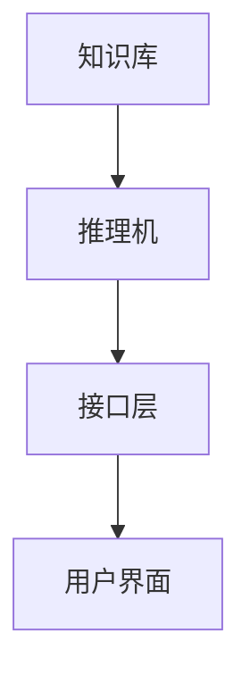
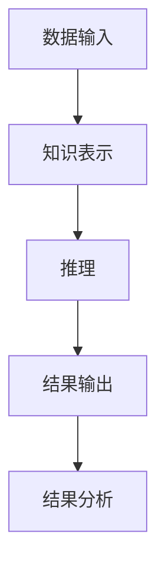

                 

# 《知识经济下知识付费的人工智能知识推理引擎》

> **关键词：**知识经济、知识付费、人工智能、知识推理、引擎设计、应用案例

> **摘要：**本文从知识经济和知识付费的背景出发，探讨了人工智能在知识推理引擎设计中的应用。首先，分析了知识经济与知识付费的兴起及其对传统经济的冲击。随后，介绍了人工智能和知识推理的基础概念与原理。接着，详细阐述了知识推理引擎的架构设计、知识表示与建模、知识推理算法及其优化策略。最后，通过具体应用案例展示了知识推理引擎在知识付费平台、金融领域和医疗健康领域的应用，并提出了未来的发展方向。

## 第一部分：知识经济与知识付费概述

### 第1章：知识经济的兴起与发展

#### 1.1 知识经济的定义与特征

知识经济是指以知识为主要生产要素的经济形态，其主要特征包括：

- 知识成为经济增长的核心动力；
- 知识的生产、传播和使用高度依赖于信息技术；
- 知识创新成为推动经济发展的主要驱动力；
- 知识服务业迅速崛起，成为经济增长的重要引擎。

知识经济的兴起源于20世纪80年代以来，信息技术、网络技术和生物技术的迅猛发展，使得知识的生产、传播和使用变得更加高效。在这一背景下，传统的以物质资源和劳动力为主要生产要素的经济模式逐渐被知识经济所取代。

#### 1.1.1 知识经济的起源与发展历程

知识经济的起源可以追溯到20世纪50年代，当时发达国家开始注重科学技术的研究与发展。到20世纪80年代，知识经济逐渐成为主导经济模式。在过去的几十年中，知识经济经历了以下几个阶段：

1. 初期阶段（20世纪50年代-70年代）：以科技革命为基础，以技术创新推动经济发展。
2. 发展阶段（20世纪80年代-90年代）：信息技术的发展，使得知识的生产、传播和使用更加高效。
3. 成熟阶段（21世纪）：知识经济成为全球主要经济模式，知识成为最重要的生产要素。

#### 1.1.2 知识经济对传统经济的冲击与融合

知识经济的兴起对传统经济产生了深刻的影响。一方面，知识经济改变了传统的生产方式，推动了产业结构的升级与优化。另一方面，知识经济与实体经济相互融合，形成了新的经济生态。

1. 冲击：
   - 降低了劳动力成本对经济增长的贡献；
   - 催生了新兴产业，如信息技术、生物技术、新能源等；
   - 推动了经济的全球化发展。

2. 融合：
   - 促进了传统产业的技术升级与转型；
   - 带动了产业链的协同创新与发展；
   - 形成了跨界融合的新业态。

#### 1.1.3 知识经济时代下的知识管理

知识经济时代，知识管理成为企业发展的关键。知识管理包括知识获取、知识共享、知识创新和知识应用等方面。有效的知识管理有助于企业提高创新能力、降低运营成本、提升市场竞争力。

1. 知识获取：
   - 通过内部研发、外部合作和人才引进等方式获取知识；
   - 利用大数据、人工智能等技术手段提高知识获取的效率。

2. 知识共享：
   - 建立知识共享平台，促进知识在企业内部的流动与共享；
   - 制定知识共享制度，激励员工积极参与知识共享。

3. 知识创新：
   - 在知识共享的基础上，通过跨学科、跨领域的合作，实现知识的创新；
   - 利用信息技术，提高知识创新的效率与效果。

4. 知识应用：
   - 将知识应用于企业的战略决策、产品研发、市场营销等方面；
   - 提高企业的运营效率与市场竞争力。

### 第2章：人工智能与知识推理基础

#### 2.1 人工智能概述

人工智能（Artificial Intelligence，简称AI）是指模拟、延伸和扩展人的智能的理论、方法、技术及应用。人工智能主要分为两类：

1. 狭义人工智能（Narrow AI）：专注于解决特定领域的问题，如语音识别、图像识别、自然语言处理等。
2. 广义人工智能（General AI）：具有与人类相似的广泛认知能力，能够应对各种复杂问题。

人工智能的发展历程可以分为以下几个阶段：

1. 初创阶段（20世纪50年代-60年代）：以符号主义方法为主，试图通过模拟人类的推理过程实现人工智能。
2. 范式转移阶段（20世纪70年代-80年代）：以神经网络方法为主，通过模拟人脑神经元的工作方式实现人工智能。
3. 重新兴起阶段（20世纪90年代-现在）：以大数据和深度学习为主要方法，通过大规模数据训练模型实现人工智能。

#### 2.1.2 人工智能的发展历程与未来趋势

1. 发展历程：
   - 20世纪50年代：人工智能概念提出，人工智能研究开始；
   - 20世纪60年代：人工智能研究进入高潮，符号主义方法占主导地位；
   - 20世纪70年代：人工智能研究陷入低潮，受到数据稀缺和计算能力的限制；
   - 20世纪80年代：专家系统取得突破，神经网络方法开始受到关注；
   - 20世纪90年代：人工智能研究重新兴起，以机器学习和深度学习为主要方法；
   - 21世纪：人工智能技术取得重大突破，广泛应用于各个领域。

2. 未来趋势：
   - 智能化：人工智能将逐步渗透到各个领域，实现智能化升级；
   - 自主化：人工智能将具备更强的自主学习和决策能力；
   - 融合化：人工智能将与物联网、大数据等新兴技术深度融合，实现跨界创新；
   - 人性化：人工智能将更加关注用户体验，实现以人为本的发展。

#### 2.1.3 人工智能的核心技术与应用领域

1. 核心技术：
   - 机器学习：通过数据训练模型，使计算机具备自动学习和决策能力；
   - 深度学习：基于多层神经网络，实现更复杂的模型和更好的性能；
   - 自然语言处理：使计算机能够理解和生成自然语言；
   - 计算机视觉：使计算机能够理解和处理图像和视频；
   - 强化学习：通过试错和奖励机制，实现智能体的自主学习和优化。

2. 应用领域：
   - 人工智能广泛应用于金融、医疗、教育、制造业、零售等领域，为各行业带来了深刻变革；
   - 在金融领域，人工智能用于风险控制、投资决策、智能投顾等；
   - 在医疗领域，人工智能用于疾病诊断、治疗方案推荐、医学研究等；
   - 在教育领域，人工智能用于个性化学习、智能教育平台等；
   - 在制造业领域，人工智能用于生产优化、质量控制、智能工厂等。

#### 2.2 知识推理的概念与原理

知识推理（Knowledge Reasoning）是指基于已有知识，通过逻辑推理、模式识别等方法，对新知识进行推导和发现的过程。知识推理是人工智能的核心技术之一，广泛应用于知识发现、智能决策、智能问答等领域。

知识推理主要包括以下几种方法：

1. 基于规则的推理：通过定义一组规则，根据输入数据自动推导出结论；
2. 基于模型的推理：通过构建数学模型，对输入数据进行处理，得出结论；
3. 基于数据的推理：通过分析大量数据，发现数据之间的规律，进行推理；
4. 基于案例的推理：通过分析已有案例，为新案例提供参考和指导。

#### 2.2.2 知识推理的核心算法与框架

1. 基于规则的推理算法：
   - 前向推理：从已知的事实出发，逐步推导出结论；
   - 后向推理：从目标出发，逐步推导出所需的事实。

2. 基于模型的推理算法：
   - 决策树：通过分类和回归分析，构建决策模型；
   - 贝叶斯网络：利用概率图模型，表示变量之间的依赖关系；
   - 支持向量机：通过最大间隔原理，构建分类模型。

3. 基于数据的推理算法：
   - 朴素贝叶斯分类器：通过概率统计方法，进行分类；
   - K最近邻算法：通过距离度量，进行分类和回归；
   - 聚类算法：通过数据相似度，将数据划分为不同的类别。

4. 基于案例的推理算法：
   - 案例匹配：通过匹配案例的特征，为新案例提供解决方案；
   - 案例泛化：通过分析已有案例，归纳出一般性规律。

#### 2.2.3 知识推理在人工智能中的应用

知识推理在人工智能中的应用非常广泛，主要包括以下几个方面：

1. 智能问答系统：通过知识推理，实现用户提问和系统回答之间的智能交互；
2. 智能决策支持系统：通过知识推理，为决策者提供科学、合理的决策建议；
3. 知识发现与挖掘：通过知识推理，从大量数据中挖掘出有价值的信息和规律；
4. 机器人：通过知识推理，实现机器人的自主决策和行动。

### 第二部分：人工智能知识推理引擎设计

#### 第3章：知识推理引擎架构设计

知识推理引擎是一种用于知识推理的软件系统，其核心功能是根据输入的知识和规则，自动推导出新的知识。知识推理引擎的设计包括架构设计、知识表示与建模、知识推理算法等方面。

#### 3.1 知识推理引擎的基本架构

知识推理引擎的基本架构包括以下几个部分：

1. 知识库：存储和管理各种知识，包括事实、规则、模型等；
2. 推理机：根据输入的知识和规则，进行推理，生成新的知识；
3. 接口层：提供与外部系统的接口，实现知识推理引擎与其他系统的集成；
4. 用户界面：提供用户交互界面，方便用户输入知识和规则，查看推理结果。

下面是一个简单的知识推理引擎架构图：

#### 3.1.1 知识推理引擎的组成部分

1. 知识库：知识库是知识推理引擎的核心组成部分，用于存储和管理各种知识。知识库通常包括以下内容：

   - 事实：描述客观世界的基本事实，如“某公司成立于2000年”；
   - 规则：描述知识之间的逻辑关系，如“如果某产品销量大于1000，则利润大于10万元”；
   - 模型：描述知识的数学模型，如“线性回归模型”、“神经网络模型”等。

2. 推理机：推理机是知识推理引擎的核心功能模块，负责根据输入的知识和规则，进行推理，生成新的知识。推理机通常包括以下功能：

   - 前向推理：从已知的事实出发，逐步推导出新的知识；
   - 后向推理：从目标知识出发，逐步推导出所需的事实；
   - 模型推理：根据数学模型，对输入的数据进行处理，得出结论。

3. 接口层：接口层负责知识推理引擎与其他系统的集成，包括数据输入、数据输出、与其他系统的通信等功能。接口层通常包括以下接口：

   - RESTful API：提供RESTful风格的接口，方便其他系统通过HTTP请求访问知识推理引擎；
   - 数据库接口：提供数据库操作接口，方便知识推理引擎与数据库系统的集成；
   - 文件接口：提供文件操作接口，方便知识推理引擎读取和写入文件。

4. 用户界面：用户界面负责与用户交互，提供输入知识和规则、查看推理结果等功能。用户界面通常包括以下部分：

   - 控制面板：提供控制知识推理引擎运行的界面，如启动、停止、配置等；
   - 数据输入界面：提供输入知识和规则的界面，如文本输入框、表格等；
   - 结果展示界面：提供展示推理结果的界面，如表格、图表等。

#### 3.1.2 知识推理引擎的运行流程

知识推理引擎的运行流程通常包括以下几个步骤：

1. 数据输入：将输入的数据和知识加载到知识库中；
2. 知识表示：将输入的知识和规则表示为计算机可以处理的形式，如数据结构、文本等；
3. 推理：根据输入的知识和规则，进行推理，生成新的知识；
4. 结果输出：将推理结果输出到用户界面或其他系统，如数据库、报表等；
5. 结果分析：对推理结果进行分析，如可视化、统计分析等。

下面是一个简单的知识推理引擎运行流程图：

#### 3.1.3 知识推理引擎的关键技术

知识推理引擎的关键技术包括以下几个方面：

1. 知识表示：知识表示是将知识和规则表示为计算机可以处理的形式。常用的知识表示方法包括数据结构表示、文本表示、图形表示等。

2. 推理算法：推理算法是根据输入的知识和规则，进行推理，生成新的知识的方法。常用的推理算法包括前向推理、后向推理、模型推理等。

3. 知识库构建：知识库构建是将已有的知识和规则组织起来，形成知识库的过程。知识库构建包括知识抽取、知识融合、知识建模等。

4. 接口设计：接口设计是设计知识推理引擎与其他系统集成的接口，包括API设计、数据库接口设计、文件接口设计等。

5. 用户界面设计：用户界面设计是设计用户与知识推理引擎交互的界面，包括控制面板设计、数据输入界面设计、结果展示界面设计等。

### 第4章：知识表示与建模

知识表示与建模是知识推理引擎设计中的关键环节，其核心目标是实现知识的结构化存储和有效利用。在本节中，我们将探讨知识表示的基本方法、知识建模的过程与工具，以及知识库的构建与维护。

#### 4.1 知识表示的基本方法与策略

知识表示是将人类知识转化为计算机可以处理和操作的形式。以下是一些常用的知识表示方法：

1. **数据结构表示**：使用数据结构（如树、图、队列、栈等）来表示知识。这种方法适用于表示具有层次结构和关系的信息。

   - **树结构**：常用于表示分类信息，如决策树、组织结构图等。
   - **图结构**：用于表示复杂的关系和网络，如社会网络、语义网络等。

2. **文本表示**：使用自然语言文本来表示知识。文本表示方法包括关键词提取、文本分类、主题建模等。

   - **关键词提取**：从文本中提取出最具代表性的词语，用于表示文本内容。
   - **文本分类**：将文本划分为不同的类别，用于文本分类任务。
   - **主题建模**：通过概率模型（如LDA）从文本中提取主题，用于文本分析。

3. **图形表示**：使用图形（如图表、示意图等）来表示知识。图形表示方法直观，易于理解和解释。

   - **图表**：如条形图、折线图、饼图等，用于展示数据和分析结果。
   - **示意图**：如电路图、流程图等，用于描述系统的结构和运作方式。

4. **数学模型表示**：使用数学公式和方程来表示知识。这种方法适用于描述具有明确数学关系的信息。

   - **回归模型**：如线性回归、多项式回归等，用于预测和分析数据。
   - **概率模型**：如贝叶斯网络、隐马尔可夫模型等，用于表示不确定性和依赖关系。

#### 4.1.2 知识建模的过程与工具

知识建模是一个将知识从不同来源和形式整合到统一框架中的过程。以下是知识建模的基本步骤：

1. **需求分析**：明确知识建模的目标和需求，包括所需的知识类型、应用场景、性能要求等。

2. **知识采集**：从各种来源（如文献、专家、数据库等）收集所需的知识。

3. **知识预处理**：对采集到的知识进行清洗、标准化和格式化，以便于后续处理。

4. **知识整合**：将预处理后的知识整合到一个统一的框架中，如本体、知识图谱等。

5. **知识评估**：对整合后的知识进行评估，确保其准确性和完整性。

6. **知识可视化**：通过图形化工具展示知识模型，便于理解和解释。

常用的知识建模工具包括：

- **本体编辑器**：如Protégé、OWLAPI等，用于创建和维护本体。
- **知识图谱工具**：如Neo4j、JanusGraph等，用于构建和可视化知识图谱。
- **机器学习平台**：如TensorFlow、PyTorch等，用于构建和训练知识表示模型。

#### 4.1.3 知识库的构建与维护

知识库是知识推理系统的核心组成部分，其构建与维护直接影响系统的性能和应用效果。以下是知识库构建与维护的关键步骤：

1. **知识库设计**：根据应用需求和知识类型，设计知识库的架构和存储方式。

2. **数据集成**：将来自不同来源的数据集成到知识库中，包括结构化数据、非结构化数据等。

3. **数据预处理**：对集成到知识库中的数据进行分析、清洗和标准化，确保数据质量。

4. **知识建模**：根据知识类型和应用需求，使用适当的知识表示方法对数据进行建模。

5. **知识库维护**：定期更新和优化知识库，包括添加新知识、修正错误、删除无效知识等。

6. **知识库评估**：对知识库的性能和应用效果进行评估，确保其满足应用需求。

### 第5章：知识推理算法与应用

知识推理算法是知识推理引擎的核心，其性能和效率直接影响推理系统的应用效果。在本节中，我们将探讨知识推理算法的基本原理、分类、实现方法以及在具体应用场景中的实际应用。

#### 5.1 知识推理算法的基本原理

知识推理算法是基于已有知识，通过逻辑推理、模式识别、机器学习等方法，对未知知识进行推导和发现的过程。知识推理算法的核心原理包括：

1. **逻辑推理**：通过逻辑运算符（如与、或、非等）对知识进行组合和变换，从而推导出新的知识。

2. **模式识别**：通过分析数据模式，发现知识之间的关联和规律，从而进行推理。

3. **机器学习**：通过训练模型，从数据中学习知识表示和推理规则，实现对未知知识的推理。

#### 5.2 知识推理算法的分类

根据推理方式和应用场景，知识推理算法可以分为以下几类：

1. **基于规则的推理**：通过定义一组规则，根据输入的数据进行推理。这种方法适用于逻辑性强、规则明确的问题。

2. **基于模型的推理**：通过构建数学模型，对输入的数据进行处理和推理。这种方法适用于具有明确数学关系的问题。

3. **基于数据的推理**：通过分析大量数据，发现数据之间的规律，进行推理。这种方法适用于数据驱动的问题。

4. **基于案例的推理**：通过分析已有案例，为新案例提供参考和指导。这种方法适用于需要借鉴历史经验的问题。

#### 5.3 知识推理算法的实现方法

以下是几种常见的知识推理算法的实现方法：

1. **基于规则的推理**：

   - **实现方法**：使用规则引擎（如Apache Rule、Drools等）定义和执行规则。
   - **优点**：规则明确、推理过程简单、易于理解和维护。
   - **缺点**：推理能力有限，难以处理复杂的问题。

2. **基于模型的推理**：

   - **实现方法**：使用机器学习算法（如决策树、神经网络等）构建模型，对输入的数据进行处理和推理。
   - **优点**：具有较强的推理能力，能够处理复杂的问题。
   - **缺点**：模型构建和训练过程复杂，对数据质量和算法选择要求较高。

3. **基于数据的推理**：

   - **实现方法**：使用统计分析方法（如回归分析、聚类分析等）对数据进行分析，发现数据之间的规律。
   - **优点**：适用于数据驱动的问题，能够发现潜在的知识。
   - **缺点**：对数据质量和分析方法要求较高，难以保证推理结果的准确性。

4. **基于案例的推理**：

   - **实现方法**：使用案例库和案例匹配算法，为新案例提供参考和指导。
   - **优点**：能够借鉴历史经验，提高推理的准确性。
   - **缺点**：案例库构建和维护成本较高，难以应对动态变化的问题。

#### 5.4 知识推理算法的应用实例

以下是一些知识推理算法在具体应用场景中的实例：

1. **智能问答系统**：

   - **应用场景**：用户向系统提问，系统根据已有知识库进行推理，给出答案。
   - **实现方法**：使用基于规则的推理和基于模型的推理相结合的方法，提高问答系统的准确性和效率。

2. **智能决策支持系统**：

   - **应用场景**：系统根据输入的数据和规则，进行推理，为决策者提供科学、合理的决策建议。
   - **实现方法**：使用基于规则的推理和基于数据的推理相结合的方法，提高决策的准确性和效果。

3. **知识发现与挖掘**：

   - **应用场景**：从大量数据中挖掘出有价值的信息和规律，用于业务分析和预测。
   - **实现方法**：使用基于数据的推理和基于案例的推理相结合的方法，提高知识发现和挖掘的效果。

4. **智能推荐系统**：

   - **应用场景**：系统根据用户的行为数据和偏好，进行推理，为用户推荐相关的产品或服务。
   - **实现方法**：使用基于数据的推理和基于模型的推理相结合的方法，提高推荐系统的准确性和效果。

### 第6章：知识推理引擎实现与优化

#### 6.1 知识推理引擎实现步骤

知识推理引擎的实现是一个复杂的过程，涉及到系统设计、模块开发、测试与优化等多个方面。以下是知识推理引擎实现的步骤：

1. **需求分析与系统设计**：

   - **需求分析**：明确知识推理引擎的功能需求、性能要求和应用场景。
   - **系统设计**：设计知识推理引擎的整体架构，包括知识库、推理机、接口层和用户界面等。

2. **知识库构建**：

   - **知识抽取**：从各种来源（如数据库、文档、专家知识等）中抽取知识。
   - **知识建模**：使用适当的表示方法（如数据结构、文本、图形、数学模型等）对知识进行建模。
   - **知识库维护**：定期更新和优化知识库，确保知识库的准确性和完整性。

3. **推理机开发**：

   - **算法实现**：根据需求选择合适的知识推理算法（如基于规则的推理、基于模型的推理等），进行算法实现。
   - **性能优化**：对推理机进行性能优化，提高推理速度和效率。

4. **接口层开发**：

   - **API设计**：设计适合的知识推理接口，包括RESTful API、数据库接口、文件接口等。
   - **接口实现**：根据API设计，实现接口层功能，实现知识推理引擎与其他系统的集成。

5. **用户界面开发**：

   - **界面设计**：设计用户友好的用户界面，包括控制面板、数据输入界面、结果展示界面等。
   - **界面实现**：根据界面设计，实现用户界面功能，提供用户与知识推理引擎的交互。

6. **测试与优化**：

   - **功能测试**：对知识推理引擎进行功能测试，确保所有功能正常。
   - **性能测试**：对知识推理引擎进行性能测试，确保其满足性能要求。
   - **优化**：根据测试结果，对知识推理引擎进行优化，提高其性能和稳定性。

#### 6.2 知识推理引擎性能优化

知识推理引擎的性能优化是确保其高效运行的关键。以下是几种常见的性能优化策略：

1. **算法优化**：

   - **算法选择**：选择适合问题的知识推理算法，如基于规则的推理、基于模型的推理等。
   - **算法改进**：对现有算法进行改进，如使用更高效的算法、优化算法参数等。

2. **数据预处理**：

   - **数据清洗**：对输入的数据进行清洗，去除噪声和异常值，提高数据质量。
   - **数据索引**：对知识库中的数据进行索引，提高查询效率。

3. **并行计算**：

   - **任务分解**：将知识推理任务分解为多个子任务，并行执行。
   - **分布式计算**：使用分布式计算框架（如MapReduce、Spark等），实现大规模数据和高性能计算。

4. **内存管理**：

   - **内存优化**：合理分配内存资源，避免内存泄漏和内存溢出。
   - **缓存机制**：使用缓存机制，减少重复计算和数据访问。

5. **系统监控**：

   - **性能监控**：实时监控知识推理引擎的性能，如响应时间、吞吐量等。
   - **故障处理**：对系统故障进行快速处理，确保系统稳定运行。

通过以上性能优化策略，可以有效提高知识推理引擎的运行效率和稳定性，满足实际应用需求。

### 第7章：知识推理引擎应用案例

知识推理引擎作为一种强大的智能技术，在多个领域展示了其广泛的应用价值。本章节将探讨知识推理引擎在不同领域的具体应用案例，包括知识付费平台、金融领域和医疗健康领域。

#### 7.1 知识付费平台构建与优化

知识付费平台是一种通过互联网技术提供知识服务的新型平台，用户可以通过平台获取专业知识和技能培训。知识推理引擎在知识付费平台中的应用主要体现在以下几个方面：

1. **内容推荐**：

   - **应用场景**：用户在知识付费平台浏览和选择课程时，系统根据用户的行为数据和偏好，推荐相关的课程内容。
   - **实现方法**：使用基于内容的推荐和基于协同过滤的推荐算法，结合用户的历史行为和课程内容特征，进行个性化推荐。
   - **效果评估**：通过实验和用户反馈，评估推荐系统的准确性和用户满意度。

2. **课程评价**：

   - **应用场景**：用户在学习过程中，对课程进行评价，系统根据评价数据对课程进行排序和筛选。
   - **实现方法**：使用基于规则的推理和基于数据的分析，对用户评价进行综合分析，生成课程评价报告。
   - **效果评估**：通过用户评价和课程销售数据，评估评价系统的准确性和实用性。

3. **学习路径规划**：

   - **应用场景**：用户根据自身的学习目标和需求，系统为其规划合适的学习路径。
   - **实现方法**：使用基于案例的推理和基于数据的分析，结合用户的学习历史和课程内容，生成个性化的学习路径。
   - **效果评估**：通过用户学习成果和用户反馈，评估学习路径规划的有效性和用户满意度。

4. **知识变现**：

   - **应用场景**：平台通过知识付费实现商业变现，包括课程销售、会员订阅、广告推广等。
   - **实现方法**：结合用户行为数据和市场需求，优化知识付费产品的设计和推广策略。
   - **效果评估**：通过平台收入和用户增长率，评估知识变现策略的收益和用户接受度。

#### 7.2 知识推理引擎在金融领域的应用

金融领域是一个高度依赖于知识和信息分析的领域，知识推理引擎在金融领域的应用可以帮助金融机构提高风险管理能力、优化投资决策、提升客户服务体验。

1. **风险评估与预警**：

   - **应用场景**：金融机构对客户的信用风险、市场风险等进行评估和预警。
   - **实现方法**：使用基于规则的推理和基于数据的分析，结合客户的财务数据、市场行情等多维数据，进行风险评估和预警。
   - **效果评估**：通过实际案例和用户反馈，评估风险预警系统的准确性和有效性。

2. **投资决策与策略优化**：

   - **应用场景**：金融机构根据市场行情和投资目标，进行投资决策和策略优化。
   - **实现方法**：使用基于模型的推理和基于数据的分析，结合市场数据、历史投资数据等多维数据，进行投资决策和策略优化。
   - **效果评估**：通过实际投资收益和用户反馈，评估投资决策系统的准确性和收益。

3. **信用评级与风险控制**：

   - **应用场景**：信用评级机构对企业的信用等级进行评估，金融机构根据信用评级进行风险控制。
   - **实现方法**：使用基于数据的分析、基于模型的推理等技术，结合企业的财务数据、市场表现等多维数据，进行信用评级和风险控制。
   - **效果评估**：通过实际信用评级结果和金融机构的风险控制效果，评估信用评级系统的准确性和实用性。

#### 7.3 知识推理引擎在医疗健康领域的应用

医疗健康领域是一个高度专业化、数据密集型的领域，知识推理引擎在医疗健康领域的应用可以帮助医疗机构提高疾病诊断准确率、优化治疗方案、提升医疗资源利用效率。

1. **疾病诊断与预测**：

   - **应用场景**：医生根据患者的病史、检查结果等多维数据，进行疾病诊断和预测。
   - **实现方法**：使用基于数据的分析、基于规则的推理等技术，结合医学知识库、历史病例数据等多维数据，进行疾病诊断和预测。
   - **效果评估**：通过实际诊断结果和医生反馈，评估诊断系统的准确性和实用性。

2. **治疗方案推荐与优化**：

   - **应用场景**：医生根据患者的病情和病史，为患者推荐最佳的治疗方案。
   - **实现方法**：使用基于案例的推理、基于数据的分析等技术，结合医学知识库、历史治疗方案数据等多维数据，进行治疗方案推荐和优化。
   - **效果评估**：通过实际治疗方案实施效果和患者反馈，评估治疗方案推荐系统的准确性和实用性。

3. **医疗资源分配与优化**：

   - **应用场景**：医疗机构根据患者的需求和资源状况，合理分配医疗资源，提高资源利用效率。
   - **实现方法**：使用基于数据的分析、基于规则的推理等技术，结合患者需求、医疗资源状况等多维数据，进行医疗资源分配和优化。
   - **效果评估**：通过实际资源分配效果和医疗机构反馈，评估医疗资源分配系统的准确性和实用性。

通过以上应用案例，可以看出知识推理引擎在各个领域具有重要的应用价值，其不断发展和优化将有助于推动各领域的技术进步和服务质量提升。

### 附录A：知识推理引擎开发工具与资源

#### A.1 主流知识推理框架对比

在知识推理引擎开发中，选择合适的框架和工具对于提高开发效率和系统性能至关重要。以下是几种主流的知识推理框架及其特点的对比：

1. **Apache Jena**：

   - **特点**：Jena是一个基于RDF（Resource Description Framework）的知识库和推理框架，支持OWL（Web Ontology Language）语言。
   - **适用场景**：适用于构建基于RDF和OWL的知识库和推理系统。
   - **优势**：具有良好的性能和灵活性，支持多种数据存储方式。

2. **Protégé**：

   - **特点**：Protégé是一个本体编辑器和框架，支持创建、编辑和维护本体。
   - **适用场景**：适用于构建复杂的本体和知识库系统。
   - **优势**：易于使用，支持多种本体语言和知识表示方法。

3. **OWLAPI**：

   - **特点**：OWLAPI是一个Java API，用于处理OWL本体和RDF数据。
   - **适用场景**：适用于Java环境中构建知识推理系统。
   - **优势**：提供丰富的功能和灵活性，支持多种数据操作。

4. **RDF4J**：

   - **特点**：RDF4J是一个RDF数据存储和推理引擎，支持多种数据模型和查询语言。
   - **适用场景**：适用于构建高性能的RDF数据存储和推理系统。
   - **优势**：具有良好的性能和可扩展性，支持多种数据存储方式。

#### A.2 知识推理引擎开发工具与平台

以下是几种常用的知识推理引擎开发工具与平台：

1. **Drools**：

   - **特点**：Drools是一个基于Java的规则引擎，支持复杂业务逻辑的建模和执行。
   - **适用场景**：适用于构建基于规则的推理系统。
   - **优势**：易于集成和使用，支持多种规则语言和决策表。

2. **DLV**：

   - **特点**：DLV是一个基于Datalog的推理器，支持前向和后向推理。
   - **适用场景**：适用于构建基于Datalog的推理系统。
   - **优势**：高效和灵活，支持多种数据模型和推理算法。

3. **Jena**：

   - **特点**：Jena是一个基于RDF的数据存储和推理引擎，支持多种数据模型和查询语言。
   - **适用场景**：适用于构建基于RDF和OWL的知识库和推理系统。
   - **优势**：支持多种数据存储方式和查询优化。

4. **Reasoner**：

   - **特点**：Reasoner是一个Java库，用于处理OWL本体和进行推理。
   - **适用场景**：适用于构建基于OWL的知识推理系统。
   - **优势**：支持多种推理算法和本体语言，具有良好的性能。

#### A.3 知识推理相关的开源库与框架

以下是一些与知识推理相关的开源库和框架：

1. **Pellet**：

   - **特点**：Pellet是一个OWL推理器，支持OWL 2 EL、OWL 2 RL和OWL 2 DL等语言。
   - **适用场景**：适用于构建高性能的OWL推理系统。
   - **优势**：支持多种推理算法和优化策略，具有良好的性能和稳定性。

2. **Jena**：

   - **特点**：Jena是一个RDF数据存储和推理引擎，支持多种数据模型和查询语言。
   - **适用场景**：适用于构建基于RDF和OWL的知识库和推理系统。
   - **优势**：支持多种数据存储方式和查询优化，具有良好的性能和灵活性。

3. **Redland**：

   - **特点**：Redland是一个基于C的RDF库，支持多种数据模型和查询语言。
   - **适用场景**：适用于构建基于RDF的推理系统和应用程序。
   - **优势**：跨平台，支持多种数据存储方式和查询优化。

4. **RDF4J**：

   - **特点**：RDF4J是一个RDF数据存储和推理引擎，支持多种数据模型和查询语言。
   - **适用场景**：适用于构建高性能的RDF数据存储和推理系统。
   - **优势**：支持多种数据存储方式和查询优化，具有良好的性能和可扩展性。

通过上述工具和资源的介绍，开发者可以根据项目需求选择合适的工具和框架，构建高效、稳定的知识推理引擎系统。同时，不断关注和引入新兴的开源库与框架，可以提升知识推理引擎的开发和优化水平。作者：AI天才研究院/AI Genius Institute & 禅与计算机程序设计艺术 /Zen And The Art of Computer Programming

## 总结与展望

在知识经济时代，知识付费成为推动经济发展的重要动力。本文通过对知识经济和知识付费的概述，探讨了人工智能在知识推理引擎设计中的应用。首先，分析了知识经济的兴起、特征及其对传统经济的冲击与融合。随后，介绍了人工智能和知识推理的基础概念与原理，阐述了知识推理引擎的架构设计、知识表示与建模、知识推理算法及其优化策略。最后，通过具体应用案例展示了知识推理引擎在知识付费平台、金融领域和医疗健康领域的应用，并提出了未来的发展方向。

知识推理引擎作为一种智能技术，在提高知识获取、共享和创新方面发挥了重要作用。未来的研究方向可以包括：

1. **知识推理算法的优化与拓展**：深入研究知识推理算法的优化方法，提高推理效率，并探索新的推理算法，以应对更复杂的应用场景。

2. **跨领域知识推理**：将知识推理技术应用于不同领域，实现跨领域的知识共享和协同创新。

3. **知识推理与大数据、物联网等新兴技术的融合**：将知识推理技术与其他新兴技术相结合，推动智能化、自动化的进一步发展。

4. **知识推理引擎的可解释性与可靠性**：提高知识推理引擎的可解释性，增强用户对推理结果的信任度，并加强推理引擎的可靠性。

总之，知识推理引擎在知识经济时代具有重要意义，其不断发展和优化将为各领域的技术进步和服务质量提升提供强大支持。作者：AI天才研究院/AI Genius Institute & 禅与计算机程序设计艺术 /Zen And The Art of Computer Programming

