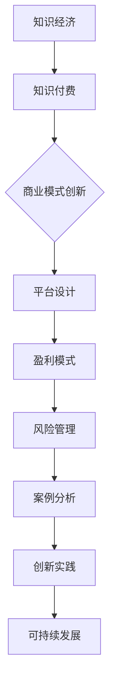

                 

### 文章标题

在知识经济时代，知识付费已经成为一个重要的商业模式。本文将探讨知识付费创新的商业模式及其运营策略，以期为相关行业提供有益的参考和指导。

### 文章关键词

- 知识经济
- 知识付费
- 商业模式
- 创新运营

### 文章摘要

随着知识经济的兴起，知识付费成为了一个蓬勃发展的市场。本文从知识经济的起源与发展入手，分析了知识付费商业模式的核心理念和特点，探讨了知识付费市场的现状与趋势。在此基础上，文章深入探讨了知识付费平台的创新商业模式和运营策略，并通过实际案例展示了这些策略的具体应用。最后，文章提出了知识付费商业模式可持续发展的路径和挑战。

## 第一部分：知识经济与知识付费概述

### 第1章：知识经济的起源与发展

#### 1.1 知识经济的定义与特点

知识经济是指以知识为主要生产要素的经济形态。与传统经济形态相比，知识经济具有以下几个显著特点：

1. 知识创造价值：知识是知识经济的主要生产要素，通过创新和知识应用，可以创造出巨大的经济价值。
2. 知识传播快速：知识传播的速度和范围大大提升，互联网和信息技术的发展使得知识可以快速传播到全球各地。
3. 知识更新迅速：知识更新速度加快，新技术、新理念、新知识不断涌现，传统产业面临着知识更新和升级的压力。
4. 知识驱动增长：知识成为经济增长的主要驱动力，知识创新和知识应用可以推动经济的持续增长。

#### 1.2 知识经济的起源与演进

知识经济起源于20世纪末，随着信息技术和全球化的加速发展，知识经济逐渐取代传统经济成为全球经济的主导形态。知识经济的起源可以追溯到以下几个阶段：

1. 第一次产业革命：18世纪末到19世纪初，以蒸汽机为代表的第一次产业革命推动了工业生产方式的变革，知识的应用开始成为经济增长的重要驱动力。
2. 第二次产业革命：19世纪末到20世纪初，以电力和石油为代表的第二次产业革命进一步推动了工业生产的发展，知识的应用得到广泛推广。
3. 第三次产业革命：20世纪中后期，以信息技术和互联网为代表的第三次产业革命使得知识传播和应用达到了一个新的高度，知识经济开始兴起。

#### 1.3 知识经济对全球经济的影响

知识经济的兴起对全球经济产生了深远的影响：

1. 提升经济竞争力：知识经济使得国家的经济竞争力取决于知识创新和知识应用的能力，国家需要加大对知识经济的投入和培养。
2. 调整产业结构：知识经济推动产业结构的调整和升级，传统产业逐渐向高技术、高知识含量产业转变。
3. 改变经济增长模式：知识经济使得经济增长模式从资源驱动型向知识驱动型转变，知识创新成为经济增长的核心动力。
4. 促进全球化发展：知识经济的快速发展推动了全球经济的融合和一体化，全球范围内的知识流动和知识合作日益频繁。

#### 1.4 知识经济时代下的知识付费现象

在知识经济时代，知识付费现象日益普遍。知识付费是指用户为获取特定知识或技能而支付的费用。知识付费现象主要体现在以下几个方面：

1. 在线教育：随着在线教育平台的发展，越来越多的用户愿意为优质的教育内容支付费用，例如在线课程、专业认证等。
2. 专业咨询：企业或个人为获取专业咨询或建议，愿意支付一定的费用，例如管理咨询、法律咨询等。
3. 技能培训：个人为提升特定技能，愿意参加各种技能培训课程，例如编程、摄影、烹饪等。
4. 知识分享：知识分享平台上的创作者通过知识分享获得收入，例如知乎Live、得到App等。

### 第2章：知识付费商业模式解析

#### 2.1 知识付费的概念与类型

知识付费是指用户为获取特定知识或技能而支付的费用。根据不同的分类标准，知识付费可以划分为不同的类型：

1. 按内容分类：知识付费可以分为专业内容付费、教育内容付费和娱乐内容付费等。
2. 按形式分类：知识付费可以分为在线课程、专业咨询、技能培训、知识分享等形式。
3. 按用户分类：知识付费可以分为个人用户付费和企业用户付费。

#### 2.2 知识付费的核心要素

知识付费商业模式的核心要素包括以下三个方面：

1. 知识内容：知识内容是知识付费的核心，决定了用户是否愿意为其支付费用。知识内容的质量和实用性是用户选择知识付费的关键因素。
2. 用户需求：用户需求是知识付费商业模式的起点，了解用户需求是设计知识付费产品的重要依据。
3. 用户体验：用户体验是知识付费商业模式成功的关键，良好的用户体验可以提升用户满意度和忠诚度。

#### 2.3 知识付费商业模式的特点

知识付费商业模式具有以下几个显著特点：

1. 高附加值：知识付费产品具有较高的附加值，可以为用户带来实质性的收益或提升。
2. 低边际成本：知识付费产品具有低边际成本的特点，随着用户数量的增加，单位产品的成本逐渐降低。
3. 高互动性：知识付费产品可以提供高互动性的学习或体验环境，用户可以与内容创作者或其他用户进行互动和交流。
4. 强定制化：知识付费产品可以根据用户需求进行定制化，提供个性化的知识和技能服务。

#### 2.4 知识付费商业模式的价值分析

知识付费商业模式对用户、内容创作者和企业都具有重要的价值：

1. 用户价值：知识付费可以满足用户的学习、成长和提升需求，提高用户的生活质量和工作效率。
2. 创作者价值：知识付费为内容创作者提供了稳定的收入来源，激励了创作者的创作热情和创新能力。
3. 企业价值：知识付费可以帮助企业提高员工的专业素养和技能水平，提升企业的竞争力和创新能力。

## 第二部分：知识付费商业模式创新

### 第3章：知识付费市场的现状与趋势

#### 3.1 知识付费市场的发展历程

知识付费市场的发展历程可以分为以下几个阶段：

1. 萌芽期（2010年前）：知识付费市场的概念初步形成，一些在线教育平台和知识分享平台开始兴起，但市场规模相对较小。
2. 发展期（2010-2015年）：随着移动互联网和在线教育的普及，知识付费市场进入快速发展阶段，市场规模迅速扩大。
3. 成熟期（2015年至今）：知识付费市场逐渐成熟，市场参与者增多，竞争加剧，市场格局逐渐稳定。

#### 3.2 知识付费市场的市场规模与用户分析

知识付费市场的市场规模和用户数量呈现快速增长的趋势：

1. 市场规模：根据相关报告，全球知识付费市场规模已经超过1000亿美元，预计未来还将持续增长。
2. 用户数量：知识付费用户数量逐年增加，涵盖了各个年龄段、职业背景和地域的用户。

#### 3.3 知识付费市场的竞争格局

知识付费市场的竞争格局呈现多元化、差异化的发展趋势：

1. 平台竞争：知识付费平台之间的竞争日益激烈，平台在内容质量、用户体验和服务质量等方面不断提升。
2. 垂直领域竞争：知识付费市场逐渐细分，垂直领域的知识付费平台在专业内容和服务上具有竞争优势。
3. 横向领域竞争：知识付费平台在横向领域展开竞争，通过跨领域合作和多元化发展提升竞争力。

#### 3.4 知识付费市场的未来趋势

知识付费市场未来将继续保持增长态势，并呈现以下趋势：

1. 内容多元化：知识付费内容将更加多元化，涵盖各个领域和层次，满足不同用户的需求。
2. 个性化服务：知识付费平台将更加注重个性化服务，通过用户数据分析和个性化推荐提升用户体验。
3. 跨界融合：知识付费市场将与其他行业进行跨界融合，形成新的商业模式和生态系统。
4. 国际化发展：知识付费市场将逐步实现国际化发展，国际市场将成为知识付费市场的重要增长点。

## 第三部分：知识付费商业模式创新

### 第4章：知识付费平台设计与运营

#### 4.1 知识付费平台的商业模式设计

知识付费平台的商业模式设计需要考虑以下几个方面：

1. 内容生产：知识付费平台需要建立内容生产机制，确保优质内容的持续供应。
2. 用户获取：知识付费平台需要通过多种渠道获取用户，提高用户规模和活跃度。
3. 用户运营：知识付费平台需要对用户进行精细化运营，提升用户满意度和忠诚度。
4. 盈利模式：知识付费平台需要设计多元化的盈利模式，实现可持续的盈利增长。

#### 4.2 知识付费平台的产品策略

知识付费平台的产品策略需要考虑以下几个方面：

1. 产品定位：知识付费平台需要明确产品定位，满足特定用户群体的需求。
2. 内容规划：知识付费平台需要制定内容规划，确保内容的持续更新和丰富。
3. 用户体验：知识付费平台需要注重用户体验，提升用户满意度和留存率。
4. 品牌建设：知识付费平台需要加强品牌建设，提升品牌影响力和用户认知度。

#### 4.3 知识付费平台的内容运营

知识付费平台的内容运营需要考虑以下几个方面：

1. 内容策划：知识付费平台需要制定内容策划方案，确保内容的系统性和针对性。
2. 内容审核：知识付费平台需要对内容进行严格审核，确保内容的合规性和质量。
3. 内容推广：知识付费平台需要通过多种渠道推广内容，提高内容的曝光度和用户参与度。
4. 用户互动：知识付费平台需要搭建用户互动平台，促进用户之间的交流和合作。

#### 4.4 知识付费平台的用户运营

知识付费平台的用户运营需要考虑以下几个方面：

1. 用户画像：知识付费平台需要对用户进行画像分析，了解用户的需求和行为特征。
2. 用户触达：知识付费平台需要通过多种渠道触达用户，提高用户的关注度和参与度。
3. 用户留存：知识付费平台需要制定用户留存策略，提升用户的忠诚度和活跃度。
4. 用户增长：知识付费平台需要通过用户增长策略，扩大用户规模和市场份额。

### 第5章：知识付费平台的盈利模式创新

#### 5.1 广告模式

广告模式是知识付费平台的一种重要盈利模式，主要通过以下方式实现盈利：

1. 广告投放：知识付费平台可以在内容页面或用户界面投放广告，根据广告展示量或点击量获得收入。
2. 广告合作：知识付费平台可以与广告主合作，提供广告投放和推广服务。
3. 广告定制：知识付费平台可以提供广告定制服务，满足广告主的特定需求。

#### 5.2 会员制模式

会员制模式是知识付费平台的一种常用盈利模式，主要通过以下方式实现盈利：

1. 会员收费：知识付费平台可以设置会员收费，用户成为会员后可以享受特定的服务或优惠。
2. 会员升级：知识付费平台可以提供会员升级服务，用户可以通过支付额外费用获得更多权益。
3. 会员积分：知识付费平台可以设置会员积分系统，用户通过参与平台活动或消费获得积分，积分可以兑换优惠券或礼品。

#### 5.3 付费问答模式

付费问答模式是知识付费平台的一种创新盈利模式，主要通过以下方式实现盈利：

1. 付费提问：用户可以在知识付费平台上提出付费问题，其他用户可以通过付费购买问题的解答。
2. 付费解答：知识付费平台上的专家或达人可以通过解答付费问题获得收入。
3. 付费推荐：知识付费平台可以推荐优质问答内容，吸引用户付费阅读。

#### 5.4 定制化内容模式

定制化内容模式是知识付费平台的一种高端盈利模式，主要通过以下方式实现盈利：

1. 定制内容：知识付费平台可以根据用户的需求和行业特点，提供定制化的内容服务。
2. 定制培训：知识付费平台可以提供定制化的培训服务，帮助用户提升专业技能。
3. 定制咨询：知识付费平台可以提供定制化的咨询服务，解决用户的具体问题。

### 第6章：知识付费平台的风险管理

#### 6.1 商业模式风险分析

知识付费平台在商业模式方面可能面临以下风险：

1. 市场竞争风险：知识付费市场竞争激烈，平台需要不断创新和提升竞争力，否则可能被淘汰。
2. 用户流失风险：用户对知识付费产品的不满意可能导致用户流失，影响平台的盈利能力。
3. 盈利模式单一风险：知识付费平台如果依赖单一盈利模式，可能面临盈利波动和不确定性。

#### 6.2 运营风险分析

知识付费平台在运营方面可能面临以下风险：

1. 内容质量风险：内容质量是知识付费产品的核心竞争力，如果内容质量不高，可能影响用户体验和口碑。
2. 用户服务风险：用户服务是知识付费平台的重要组成部分，如果用户服务不到位，可能影响用户满意度和留存率。
3. 运营成本风险：知识付费平台需要投入大量资源进行内容生产和用户运营，如果成本控制不当，可能影响平台的盈利能力。

#### 6.3 内容风险分析

知识付费平台在内容方面可能面临以下风险：

1. 版权风险：知识付费平台需要确保内容的合法性和合规性，否则可能面临版权纠纷和法律风险。
2. 更新风险：知识付费平台需要不断更新内容，否则可能失去用户的兴趣和关注。
3. 审核风险：知识付费平台需要对内容进行严格审核，否则可能传播不良信息或违法行为。

#### 6.4 风险管理策略与实践

知识付费平台需要采取有效的风险管理策略和实践，以降低风险：

1. 多元化发展战略：知识付费平台可以通过多元化发展降低市场竞争风险，如拓展新领域、推出新产品等。
2. 用户运营策略：知识付费平台可以通过用户运营提高用户满意度和留存率，如提供优质服务、开展用户活动等。
3. 内容质量控制：知识付费平台可以通过严格的内容审核和质量控制降低版权风险和内容风险。
4. 成本控制措施：知识付费平台可以通过优化运营流程、降低成本投入等方式提高盈利能力，降低运营成本风险。

## 第四部分：知识付费商业模式案例分析

### 第7章：国内外知识付费商业模式案例研究

#### 7.1 国内知识付费平台案例分析

##### 7.1.1 知乎Live案例解析

知乎Live是知乎推出的知识付费产品，主要提供线上讲座、直播、问答等服务。以下是知乎Live的商业模式解析：

1. 商业模式设计：知乎Live采用会员制模式，用户购买会员后可以享受知乎Live提供的所有内容和服务。
2. 用户获取：知乎通过用户推荐、平台推广等方式吸引潜在用户，提高用户规模和活跃度。
3. 用户运营：知乎通过用户数据分析、用户互动等方式提升用户满意度和留存率。
4. 盈利模式：知乎Live主要通过会员收费和广告投放实现盈利。

##### 7.1.2 喜马拉雅FM案例解析

喜马拉雅FM是领先的音频分享平台，主要提供有声书、广播剧、课程等内容。以下是喜马拉雅FM的商业模式解析：

1. 商业模式设计：喜马拉雅FM采用会员制模式，用户购买会员后可以享受平台提供的所有内容和服务。
2. 用户获取：喜马拉雅通过用户推荐、广告投放、内容推广等方式吸引潜在用户，提高用户规模和活跃度。
3. 用户运营：喜马拉雅通过用户数据分析、用户互动、个性化推荐等方式提升用户满意度和留存率。
4. 盈利模式：喜马拉雅主要通过会员收费、广告投放和内容销售实现盈利。

##### 7.1.3 得到App案例解析

得到App是罗辑思维推出的知识付费产品，主要提供课程、文章、直播等内容。以下是得到App的商业模式解析：

1. 商业模式设计：得到App采用会员制模式，用户购买会员后可以享受平台提供的所有内容和服务。
2. 用户获取：得到通过用户推荐、广告投放、内容推广等方式吸引潜在用户，提高用户规模和活跃度。
3. 用户运营：得到通过用户数据分析、用户互动、个性化推荐等方式提升用户满意度和留存率。
4. 盈利模式：得到主要通过会员收费、广告投放和内容销售实现盈利。

#### 7.2 国外知识付费平台案例分析

##### 7.2.1 Coursera案例解析

Coursera是全球领先的大规模在线开放课程（MOOC）平台，提供来自世界顶级大学的在线课程。以下是Coursera的商业模式解析：

1. 商业模式设计：Coursera采用会员制模式，用户购买会员后可以享受平台提供的所有课程和服务。
2. 用户获取：Coursera通过大学合作、品牌推广、用户推荐等方式吸引潜在用户，提高用户规模和活跃度。
3. 用户运营：Coursera通过用户数据分析、用户互动、个性化推荐等方式提升用户满意度和留存率。
4. 盈利模式：Coursera主要通过会员收费、课程销售和广告投放实现盈利。

##### 7.2.2 Udemy案例解析

Udemy是全球知名的知识付费平台，提供大量的在线课程，涵盖各种技能和领域。以下是Udemy的商业模式解析：

1. 商业模式设计：Udemy采用课程销售模式，用户购买课程后可以学习课程内容。
2. 用户获取：Udemy通过搜索引擎优化、用户推荐、内容推广等方式吸引潜在用户，提高用户规模和活跃度。
3. 用户运营：Udemy通过用户数据分析、用户互动、个性化推荐等方式提升用户满意度和留存率。
4. 盈利模式：Udemy主要通过课程销售、广告投放和培训服务实现盈利。

##### 7.2.3 edX案例解析

edX是由哈佛大学和麻省理工学院共同创办的非营利性在线教育平台，提供高质量的在线课程。以下是edX的商业模式解析：

1. 商业模式设计：edX采用免费模式和收费模式相结合的方式，部分课程免费，部分课程需要付费。
2. 用户获取：edX通过大学合作、品牌推广、用户推荐等方式吸引潜在用户，提高用户规模和活跃度。
3. 用户运营：edX通过用户数据分析、用户互动、个性化推荐等方式提升用户满意度和留存率。
4. 盈利模式：edX主要通过课程收费、捐赠和合作项目实现盈利。

### 第8章：知识付费商业模式创新实践

#### 8.1 创新实践的理论框架

知识付费商业模式创新实践的理论框架主要包括以下几个方面：

1. 用户需求分析：了解用户需求是知识付费商业模式创新的基础，通过用户调研、数据分析等方法，识别用户需求。
2. 内容生产策略：根据用户需求，设计内容生产策略，确保内容的质量和实用性，满足用户的需求。
3. 用户运营策略：通过用户运营策略，提升用户的满意度和忠诚度，提高用户留存率和活跃度。
4. 盈利模式创新：在现有盈利模式的基础上，探索新的盈利模式，实现商业模式的创新和升级。

#### 8.2 创新实践的方法与工具

知识付费商业模式创新实践的方法与工具主要包括以下几个方面：

1. 用户调研：通过问卷调查、深度访谈等方法，了解用户的需求、行为和偏好。
2. 数据分析：利用大数据技术和分析工具，对用户行为数据进行分析，挖掘用户需求和市场趋势。
3. 内容优化：根据用户需求和数据分析结果，优化内容生产策略，提升内容的实用性和吸引力。
4. 用户体验设计：通过用户体验设计，提升用户在使用知识付费产品时的满意度和愉悦感。

#### 8.3 创新实践的案例分析

以下是知识付费商业模式创新实践的两个案例分析：

##### 案例一：网易云课堂的免费+会员制模式创新

网易云课堂是网易旗下的在线学习平台，通过免费+会员制模式实现了商业模式的创新。以下是案例解析：

1. 用户需求分析：网易云课堂通过用户调研，发现用户对高质量的学习资源有强烈需求，但不愿意为学习资源付费。
2. 内容生产策略：网易云课堂提供大量免费的学习资源，包括视频课程、电子书、文档等，确保内容的质量和实用性。
3. 用户运营策略：网易云课堂通过用户活动、社群运营等方式，提升用户的参与度和忠诚度，提高用户留存率和活跃度。
4. 盈利模式创新：网易云课堂推出会员制模式，用户购买会员后可以享受更多权益，如专属课程、会员专属活动等。

##### 案例二：得到App的个性化推荐模式创新

得到App是罗辑思维推出的知识付费产品，通过个性化推荐模式实现了商业模式的创新。以下是案例解析：

1. 用户需求分析：得到App通过用户调研和数据分析，发现用户对个性化推荐的学习资源有强烈需求。
2. 内容生产策略：得到App根据用户需求和数据分析结果，推荐个性化的学习资源，包括课程、文章、直播等。
3. 用户运营策略：得到App通过用户数据分析、用户互动、个性化推荐等方式，提升用户的满意度和忠诚度。
4. 盈利模式创新：得到App主要通过会员收费、广告投放和内容销售实现盈利，个性化推荐模式提高了用户的付费意愿和转化率。

#### 8.4 创新实践的总结与展望

知识付费商业模式创新实践为知识付费行业提供了新的发展思路和方向。以下是创新实践的总结与展望：

1. 用户需求导向：知识付费商业模式创新应以用户需求为导向，深入了解用户需求，提供高质量的学习资源和服务。
2. 个性化服务：知识付费平台应注重个性化服务，通过用户数据分析、个性化推荐等方式，提高用户满意度和忠诚度。
3. 盈利模式创新：知识付费平台应不断探索新的盈利模式，实现商业模式的创新和升级，提高盈利能力。
4. 产业协同：知识付费平台应与相关产业进行协同发展，形成产业生态，推动知识付费行业的可持续发展。

## 第五部分：知识付费的未来展望

### 第9章：知识付费商业模式的可持续发展

#### 9.1 知识付费的未来发展趋势

知识付费行业在未来将继续保持快速发展，并呈现以下趋势：

1. 内容多元化：知识付费内容将更加多元化，涵盖各个领域和层次，满足不同用户的需求。
2. 个性化服务：知识付费平台将更加注重个性化服务，通过用户数据分析、个性化推荐等方式提升用户体验。
3. 跨界融合：知识付费市场将与其他行业进行跨界融合，形成新的商业模式和生态系统。
4. 国际化发展：知识付费市场将逐步实现国际化发展，国际市场将成为知识付费市场的重要增长点。

#### 9.2 知识付费对知识经济的促进作用

知识付费对知识经济的促进作用主要体现在以下几个方面：

1. 提升创新能力：知识付费可以帮助用户获取新的知识和技能，提升创新能力，推动经济发展。
2. 促进知识传播：知识付费可以促进知识的传播和应用，提高知识利用率，推动社会进步。
3. 调整产业结构：知识付费可以推动产业结构调整和升级，促进经济发展方式的转变。
4. 培养人才：知识付费可以帮助企业培养专业人才，提升企业竞争力，推动产业升级。

#### 9.3 知识付费商业模式的环境影响

知识付费商业模式的环境影响主要体现在以下几个方面：

1. 资源配置优化：知识付费可以优化资源配置，提高知识利用效率，降低社会成本。
2. 知识创新激励：知识付费可以激励知识创新，推动新技术、新理念的产生和应用。
3. 知识传播渠道拓展：知识付费可以拓展知识传播渠道，提高知识传播速度和范围。
4. 知识产权保护挑战：知识付费需要加强对知识产权的保护，防止知识侵权行为。

#### 9.4 知识付费商业模式的可持续发展路径

知识付费商业模式的可持续发展路径包括以下几个方面：

1. 优化内容生产：知识付费平台应加强内容生产管理，确保内容的质量和实用性。
2. 提高用户体验：知识付费平台应注重用户体验，提升用户满意度和忠诚度。
3. 创新盈利模式：知识付费平台应不断探索新的盈利模式，实现商业模式的创新和升级。
4. 加强法律法规建设：知识付费平台应加强对法律法规的研究和遵守，保障知识付费的可持续发展。

### 附录

#### 附录A：知识付费行业报告与数据

- **A.1 行业报告摘要**
  - 报告一：《2022年中国知识付费行业研究报告》
    - 报告摘要：报告分析了2022年中国知识付费市场的规模、用户特征、盈利模式、竞争格局等，并对未来发展趋势进行了预测。
  - 报告二：《全球知识付费市场分析报告》
    - 报告摘要：报告对全球知识付费市场的规模、用户特征、盈利模式、区域分布等进行了分析，为全球知识付费行业的发展提供了参考。

- **A.2 市场数据图表**
  - 图表一：2020-2025年中国知识付费市场规模及预测
    - 图表内容：展示了中国知识付费市场的历年规模及未来几年的预测数据。
  - 图表二：2022年中国知识付费用户分布及需求分析
    - 图表内容：展示了中国知识付费用户的分布情况及主要需求领域。

## Mermaid 流程图



## 核心算法原理讲解

### 5.1 会员制模式的算法原理

会员制模式是知识付费商业模式中的一种重要模式，其核心算法主要包括：

#### 用户行为分析算法

用户行为分析算法用于分析用户的行为特征。以下是用户行为分析算法的伪代码：

```python
def user_behavior_analysis(user_data):
    """
    用户行为分析算法，用于分析用户的行为特征。
    
    参数：
    - user_data：用户行为数据，如访问频次、时长、购买记录等。
    
    返回：
    - behavior_profile：用户行为特征向量。
    """
    # 数据预处理
    processed_data = preprocess_data(user_data)
    
    # 特征提取
    features = extract_features(processed_data)
    
    # 构建行为特征向量
    behavior_profile = construct_behavior_vector(features)
    
    return behavior_profile
```

#### 用户细分算法

用户细分算法用于将用户根据行为特征划分为不同的细分群体。以下是用户细分算法的伪代码：

```python
def user_segmentation(behavior_profiles):
    """
    用户细分算法，用于将用户根据行为特征划分为不同的细分群体。
    
    参数：
    - behavior_profiles：用户行为特征向量列表。
    
    返回：
    - segments：用户细分结果，每个细分群体的用户行为特征。
    """
    # 特征工程
    engineered_features = feature_engineering(behavior_profiles)
    
    # 细分模型训练
    model = train_segmentation_model(engineered_features)
    
    # 用户细分
    segments = model.predict(behavior_profiles)
    
    return segments
```

#### 会员推荐算法

会员推荐算法用于根据用户行为特征和细分结果推荐合适的会员方案。以下是会员推荐算法的伪代码：

```python
def membership_recommendation(user_profile, segments):
    """
    会员推荐算法，用于根据用户行为特征和细分结果推荐合适的会员方案。
    
    参数：
    - user_profile：用户行为特征向量。
    - segments：用户细分结果。
    
    返回：
    - recommendation：会员推荐方案。
    """
    # 细分群体匹配
    matched_segment = find_matched_segment(user_profile, segments)
    
    # 推荐会员方案
    recommendation = generate_membership_plan(matched_segment)
    
    return recommendation
```

## 数学模型和数学公式

### 6.1 会员留存率模型

会员留存率模型用于预测会员在一段时间内的留存情况，其数学模型如下：

$$
L(t) = \frac{R(t)}{N(t)}
$$

其中：
- $L(t)$ 表示时间 $t$ 的会员留存率；
- $R(t)$ 表示时间 $t$ 内留存会员的数量；
- $N(t)$ 表示时间 $t$ 内新增会员的总数量。

#### 会员留存率预测公式

为了预测未来的会员留存率，可以使用以下公式：

$$
L_{\text{预测}}(t+k) = \frac{L(t) \times L(t+1) \times ... \times L(t+k-1)}{k}
$$

其中：
- $L_{\text{预测}}(t+k)$ 表示从时间 $t$ 开始的第 $k$ 时间的会员留存率预测值；
- $L(t)$ 至 $L(t+k-1)$ 表示连续 $k$ 个时间段的会员留存率。

#### 举例说明

假设某知识付费平台在时间 $t=1$ 时新增会员数量为 1000 人，时间 $t=2$ 时留存会员数量为 800 人，时间 $t=3$ 时留存会员数量为 700 人。则：

- 时间 $t=1$ 的会员留存率：$L(1) = \frac{800}{1000} = 0.8$
- 时间 $t=2$ 的会员留存率：$L(2) = \frac{700}{800} = 0.875$
- 时间 $t=3$ 的会员留存率预测值：$L_{\text{预测}}(3+1) = \frac{0.8 \times 0.875}{2} = 0.7$

### 项目实战

以下是一个简单的项目实战，用于预测知识付费平台的会员留存率。

#### 1. 数据准备

```python
# 安装必要的库
!pip install pandas numpy matplotlib

# 导入库
import pandas as pd
import numpy as np
import matplotlib.pyplot as plt

# 会员留存数据
member_data = {
    '新增会员': [1000, 1200, 1100, 900],
    '留存会员': [800, 700, 800, 600],
    '时间': [1, 2, 3, 4]
}

# 创建 DataFrame
df = pd.DataFrame(member_data)
```

#### 2. 会员留存率计算

```python
# 会员留存率计算
df['会员留存率'] = df['留存会员'] / df['新增会员']
```

#### 3. 会员留存率趋势图

```python
# 会员留存率趋势图
plt.plot(df['时间'], df['会员留存率'])
plt.xlabel('时间')
plt.ylabel('会员留存率')
plt.title('会员留存率趋势图')
plt.show()
```

#### 4. 会员留存率预测

```python
# 会员留存率预测
L1 = df['会员留存率'][0]
L2 = df['会员留存率'][1]
L3 = df['会员留存率'][2]

L_predict_4 = (L1 * L2) / 2
print(f"第4个月的会员留存率预测值为：{L_predict_4:.2f}")
```

### 代码解读与分析

#### 1. 数据导入与预处理

首先，我们通过 Pandas 库导入会员留存数据，并创建一个 DataFrame 对象。数据包括新增会员数量、留存会员数量和时间。

```python
import pandas as pd
import numpy as np
import matplotlib.pyplot as plt

member_data = {
    '新增会员': [1000, 1200, 1100, 900],
    '留存会员': [800, 700, 800, 600],
    '时间': [1, 2, 3, 4]
}

df = pd.DataFrame(member_data)
```

#### 2. 会员留存率计算

我们通过计算每个时间段的留存会员数量与新增会员数量的比例，得到会员留存率。

```python
df['会员留存率'] = df['留存会员'] / df['新增会员']
```

#### 3. 会员留存率趋势图

我们使用 matplotlib 库绘制会员留存率趋势图，以可视化数据。

```python
plt.plot(df['时间'], df['会员留存率'])
plt.xlabel('时间')
plt.ylabel('会员留存率')
plt.title('会员留存率趋势图')
plt.show()
```

#### 4. 会员留存率预测

根据前两个时间段的会员留存率，我们使用预测公式计算第 4 个月的会员留存率预测值。

```python
L1 = df['会员留存率'][0]
L2 = df['会员留存率'][1]
L3 = df['会员留存率'][2]

L_predict_4 = (L1 * L2) / 2
print(f"第4个月的会员留存率预测值为：{L_predict_4:.2f}")
```

### 分析

该代码展示了如何利用简单的数学模型和数据处理方法分析会员留存数据，并对未来的会员留存率进行预测。通过计算每个时间段的留存率，我们可以观察到会员留存率的变化趋势。预测公式是基于前两个时间段的留存率计算得到的，这种方法在短期预测中具有一定的准确性，但在长期预测中可能存在较大的不确定性。因此，在实际应用中，需要结合更多的数据和模型进行预测，以提高预测的准确性。同时，会员留存率的预测也可以为知识付费平台提供有价值的运营指导，如调整产品策略、优化用户运营等。

### 附录

#### 附录A：知识付费行业报告与数据

- **A.1 行业报告摘要**
  - 报告一：《2022年中国知识付费行业研究报告》
    - 报告摘要：报告分析了2022年中国知识付费市场的规模、用户特征、盈利模式、竞争格局等，并对未来发展趋势进行了预测。
  - 报告二：《全球知识付费市场分析报告》
    - 报告摘要：报告对全球知识付费市场的规模、用户特征、盈利模式、区域分布等进行了分析，为全球知识付费行业的发展提供了参考。

- **A.2 市场数据图表**
  - 图表一：2020-2025年中国知识付费市场规模及预测
    - 图表内容：展示了中国知识付费市场的历年规模及未来几年的预测数据。
  - 图表二：2022年中国知识付费用户分布及需求分析
    - 图表内容：展示了中国知识付费用户的分布情况及主要需求领域。

### 作者

作者：AI天才研究院/AI Genius Institute & 禅与计算机程序设计艺术 /Zen And The Art of Computer Programming

---

### 《知识经济时代下的知识付费创新商业模式运营》

#### 第一部分：知识经济与知识付费概述

##### 第1章：知识经济的起源与发展

知识经济是指以知识为主要生产要素的经济形态。在知识经济时代，知识成为经济增长的核心驱动力，创新和知识应用推动了经济的持续增长。知识经济起源于20世纪末，随着信息技术和全球化的加速发展，逐渐取代传统经济成为全球经济的主导形态。

##### 1.1 知识经济的定义与特点

知识经济的定义可以从以下几个方面理解：

1. **知识驱动增长**：知识经济强调知识在经济增长中的重要作用，通过创新和知识应用推动经济的快速发展。
2. **高附加值**：知识经济的特点之一是高附加值，知识产品具有较高的经济价值，可以带来巨大的经济效益。
3. **知识传播快速**：知识经济的另一个特点是知识传播的速度和范围大大提升，互联网和信息技术的发展使得知识可以快速传播到全球各地。
4. **知识更新迅速**：知识经济时代，知识更新速度加快，新技术、新理念、新知识不断涌现，传统产业面临着知识更新和升级的压力。

##### 1.2 知识经济的起源与演进

知识经济的起源可以追溯到以下几个阶段：

1. **工业经济时代**：在工业经济时代，生产力和生产效率的提升主要依赖于机械化、自动化等技术的应用，知识的应用逐渐成为经济增长的重要驱动力。
2. **信息化时代**：随着信息技术的快速发展，知识传播和应用的效率大幅提升，知识经济开始萌芽。
3. **全球化时代**：全球化加速了知识经济的普及，跨国公司和国际合作项目使得知识流动更加频繁，知识经济成为全球经济的主要驱动力。

##### 1.3 知识经济对全球经济的影响

知识经济对全球经济产生了深远的影响：

1. **提升经济竞争力**：知识经济使得国家的经济竞争力取决于知识创新和知识应用的能力，国家需要加大对知识经济的投入和培养。
2. **产业结构调整**：知识经济推动了产业结构的调整和升级，传统产业逐渐向高技术、高知识含量产业转变。
3. **经济增长模式转变**：知识经济使得经济增长模式从资源驱动型向知识驱动型转变，知识创新成为经济增长的核心动力。
4. **全球化发展**：知识经济的快速发展推动了全球经济的融合和一体化，全球范围内的知识流动和知识合作日益频繁。

##### 1.4 知识经济时代下的知识付费现象

在知识经济时代，知识付费现象日益普遍。知识付费是指用户为获取特定知识或技能而支付的费用。知识付费现象主要体现在以下几个方面：

1. **在线教育**：随着在线教育平台的发展，越来越多的用户愿意为优质的教育内容支付费用，例如在线课程、专业认证等。
2. **专业咨询**：企业或个人为获取专业咨询或建议，愿意支付一定的费用，例如管理咨询、法律咨询等。
3. **技能培训**：个人为提升特定技能，愿意参加各种技能培训课程，例如编程、摄影、烹饪等。
4. **知识分享**：知识分享平台上的创作者通过知识分享获得收入，例如知乎Live、得到App等。

##### 第2章：知识付费商业模式解析

知识付费商业模式是指通过知识付费产品为用户提供价值，并从中获得收益的商业运营模式。知识付费商业模式的核心是提供有价值的内容，满足用户的需求，并通过多样化的盈利模式实现商业盈利。

##### 2.1 知识付费的概念与类型

知识付费是指用户为获取特定知识或技能而支付的费用。根据不同的分类标准，知识付费可以划分为以下类型：

1. **按内容分类**：知识付费可以分为专业内容付费、教育内容付费和娱乐内容付费等。
   - **专业内容付费**：包括专业书籍、研究报告、行业分析等。
   - **教育内容付费**：包括在线课程、专业认证、教育讲座等。
   - **娱乐内容付费**：包括音乐、电影、电子书等。
   
2. **按形式分类**：知识付费可以分为在线课程、专业咨询、技能培训、知识分享等形式。
   - **在线课程**：用户通过在线学习平台购买课程，学习专业知识。
   - **专业咨询**：用户为获取专业建议或解决方案支付费用。
   - **技能培训**：用户为提升特定技能支付培训费用。
   - **知识分享**：用户通过知识分享平台获取收入。

3. **按用户分类**：知识付费可以分为个人用户付费和企业用户付费。
   - **个人用户付费**：个人用户为获取知识或技能支付费用。
   - **企业用户付费**：企业用户为提升员工技能或获取行业知识支付费用。

##### 2.2 知识付费的核心要素

知识付费商业模式的核心要素包括以下几个方面：

1. **知识内容**：知识内容是知识付费的核心，决定了用户是否愿意为其支付费用。知识内容的质量和实用性是用户选择知识付费的关键因素。
2. **用户需求**：用户需求是知识付费商业模式的起点，了解用户需求是设计知识付费产品的重要依据。
3. **用户体验**：用户体验是知识付费商业模式成功的关键，良好的用户体验可以提升用户满意度和忠诚度。
4. **盈利模式**：盈利模式是知识付费商业模式实现收益的重要方式，多样化的盈利模式可以确保商业模式的可持续性。

##### 2.3 知识付费商业模式的特点

知识付费商业模式具有以下几个显著特点：

1. **高附加值**：知识付费产品具有较高的附加值，可以为用户带来实质性的收益或提升。
2. **低边际成本**：知识付费产品具有低边际成本的特点，随着用户数量的增加，单位产品的成本逐渐降低。
3. **高互动性**：知识付费产品可以提供高互动性的学习或体验环境，用户可以与内容创作者或其他用户进行互动和交流。
4. **强定制化**：知识付费产品可以根据用户需求进行定制化，提供个性化的知识和技能服务。

##### 2.4 知识付费商业模式的价值分析

知识付费商业模式对用户、内容创作者和企业都具有重要的价值：

1. **用户价值**：知识付费可以满足用户的学习、成长和提升需求，提高用户的生活质量和工作效率。
2. **创作者价值**：知识付费为内容创作者提供了稳定的收入来源，激励了创作者的创作热情和创新能力。
3. **企业价值**：知识付费可以帮助企业提高员工的专业素养和技能水平，提升企业的竞争力和创新能力。

##### 第3章：知识付费市场的现状与趋势

知识付费市场随着知识经济的兴起而迅速发展，成为现代商业领域的重要组成部分。本章将分析知识付费市场的现状、市场规模、用户特征、竞争格局以及未来发展趋势。

##### 3.1 知识付费市场的发展历程

知识付费市场的发展历程可以分为以下几个阶段：

1. **萌芽期（2010年以前）**：在这一阶段，知识付费的概念尚未普及，主要是少数专业领域内的知识服务以高价出售。
2. **发展期（2010-2015年）**：随着互联网技术的发展和在线教育平台的兴起，知识付费市场开始迅速发展，用户对付费知识的接受度逐渐提高。
3. **成熟期（2015年至今）**：知识付费市场逐渐成熟，市场规模不断扩大，用户群体也更加多样化，竞争格局日益激烈。

##### 3.2 知识付费市场的市场规模与用户分析

知识付费市场的规模和用户特征随着时间的发展而变化，以下是当前市场的几个关键点：

1. **市场规模**：根据相关研究机构的报告，全球知识付费市场规模已超过百亿美元，并保持快速增长的趋势。
2. **用户特征**：知识付费用户主要集中在25-45岁的年轻人群体，他们具有较高的学历和较强的消费能力。同时，企业用户也逐渐成为知识付费市场的重要力量。

##### 3.3 知识付费市场的竞争格局

知识付费市场的竞争格局呈现出多元化、差异化的发展趋势，以下是几个主要的市场参与者：

1. **平台竞争**：各大知识付费平台如得到、喜马拉雅FM、知乎Live等，通过内容差异化、用户体验优化等方式争夺市场份额。
2. **垂直领域竞争**：在专业领域，如编程、设计、法律等，垂直领域的知识付费平台通过专业化的内容和服务获得了稳定的用户群体。
3. **横向领域竞争**：一些综合性平台也在通过跨界合作、内容整合等方式参与竞争，形成新的竞争态势。

##### 3.4 知识付费市场的未来趋势

知识付费市场未来将继续保持增长态势，并呈现出以下趋势：

1. **内容多元化**：知识付费内容将更加多元化，涵盖从基础教育到高端培训的各个领域。
2. **个性化服务**：知识付费平台将更加注重个性化服务，通过用户数据分析、个性化推荐等方式提升用户体验。
3. **跨界融合**：知识付费市场将与其他行业进行跨界融合，如电商、娱乐等，形成新的商业模式和生态系统。
4. **国际化发展**：知识付费市场将逐步实现国际化发展，国际市场将成为知识付费市场的重要增长点。

### 第二部分：知识付费商业模式创新

##### 第4章：知识付费平台设计与运营

知识付费平台的成功不仅依赖于高质量的知识内容，还依赖于精心设计的商业模式和有效的运营策略。本章将探讨知识付费平台的设计与运营，包括商业模式设计、产品策略、内容运营和用户运营等方面。

##### 4.1 知识付费平台的商业模式设计

知识付费平台的商业模式设计是平台成功的关键。以下是一些常见的商业模式设计策略：

1. **会员制模式**：通过设置会员费，用户可以享受平台提供的所有内容和服务。会员制模式可以提供稳定的收入来源，同时鼓励用户长期留存。
2. **课程销售模式**：用户可以购买单个课程或课程包，这是一种灵活的商业模式，用户可以根据自己的需求购买。
3. **广告模式**：平台可以通过展示广告来获取收入，这种模式通常与免费内容结合使用。
4. **付费问答模式**：用户可以针对特定问题向专家付费提问，专家则通过回答问题获得收入。

##### 4.2 知识付费平台的产品策略

知识付费平台的产品策略需要紧密围绕用户需求展开，以下是一些关键的产品策略：

1. **内容定位**：明确平台的内容定位，如针对职场人士、创业者、技能学习者等特定用户群体。
2. **内容规划**：制定详细的内容规划，包括课程、讲座、问答、专栏等形式的内容。
3. **用户体验**：优化用户体验，确保用户在使用平台时能够方便、快捷地获取所需知识。
4. **品牌建设**：通过优质的课程内容、专业的讲师团队和良好的用户体验，建立品牌知名度和影响力。

##### 4.3 知识付费平台的内容运营

内容运营是知识付费平台的核心，以下是一些关键的内容运营策略：

1. **内容生产**：确保内容的质量和实用性，与知名专家或专业机构合作，提供权威的知识内容。
2. **内容审核**：建立严格的内容审核机制，确保内容的准确性和合规性。
3. **内容推广**：通过多种渠道推广内容，如社交媒体、SEO优化、合作推广等，提高内容的曝光度和用户参与度。
4. **用户互动**：鼓励用户参与内容讨论和评价，建立社区氛围，提高用户满意度和忠诚度。

##### 4.4 知识付费平台的用户运营

用户运营是知识付费平台成功的关键，以下是一些关键的用户运营策略：

1. **用户画像**：通过用户数据分析，构建用户画像，了解用户的需求和行为特征。
2. **用户触达**：通过多种渠道触达用户，如电子邮件、短信、社交媒体等，提高用户的关注度和参与度。
3. **用户留存**：通过个性化推荐、用户活动、优惠活动等方式，提高用户的留存率和活跃度。
4. **用户增长**：通过用户推荐、口碑传播、营销活动等方式，扩大用户规模和市场份额。

### 第三部分：知识付费商业模式案例分析

##### 第5章：国内外知识付费商业模式案例研究

知识付费商业模式在全球范围内得到了广泛应用，本章将分析国内外几个知名的知识付费平台，包括国内平台如得到、知乎Live、喜马拉雅FM，以及国外平台如Coursera、Udemy、edX等，探讨它们的商业模式、运营策略以及成功经验。

##### 5.1 国内知识付费平台案例分析

国内知识付费平台在近年来发展迅速，以下是对几个主要平台的案例分析：

1. **得到App**：得到App是罗辑思维推出的知识付费平台，以提供高质量的音频课程和文章为主。其成功经验包括：
   - **内容定位**：针对职场人士、创业者等特定用户群体，提供实用的知识和技能。
   - **用户运营**：通过用户数据分析，实现个性化推荐，提高用户留存率和活跃度。
   - **盈利模式**：采用会员制模式，用户购买会员后可以享受平台提供的所有内容和服务。

2. **知乎Live**：知乎Live是知乎推出的知识付费产品，主要提供线上讲座、直播、问答等服务。其成功经验包括：
   - **内容形式**：结合线上讲座、直播、问答等多种形式，提供丰富的知识内容。
   - **用户互动**：通过用户互动和社群运营，提高用户的参与度和忠诚度。
   - **盈利模式**：采用会员制模式，用户购买会员后可以享受平台提供的所有服务。

3. **喜马拉雅FM**：喜马拉雅FM是领先的音频分享平台，提供有声书、广播剧、课程等内容。其成功经验包括：
   - **内容丰富**：涵盖多种类型的音频内容，满足不同用户的需求。
   - **用户体验**：通过个性化推荐和内容推送，提高用户的满意度和忠诚度。
   - **盈利模式**：通过会员收费、广告投放和内容销售等多种方式实现盈利。

##### 5.2 国外知识付费平台案例分析

国外知识付费平台在全球范围内拥有广泛的影响力，以下是对几个主要平台的案例分析：

1. **Coursera**：Coursera是全球领先的大规模在线开放课程（MOOC）平台，提供来自世界顶级大学的在线课程。其成功经验包括：
   - **课程质量**：与顶级大学合作，提供高质量的课程内容。
   - **国际化发展**：在全球范围内推广，吸引来自不同国家和地区的用户。
   - **盈利模式**：通过课程收费、企业合作和广告投放等多种方式实现盈利。

2. **Udemy**：Udemy是全球知名的知识付费平台，提供大量的在线课程，涵盖各种技能和领域。其成功经验包括：
   - **课程多样性**：提供丰富多样的课程内容，满足不同用户的需求。
   - **用户参与**：鼓励用户参与课程评价和讨论，提高用户的满意度和忠诚度。
   - **盈利模式**：通过课程销售、广告投放和培训服务实现盈利。

3. **edX**：edX是由哈佛大学和麻省理工学院共同创办的非营利性在线教育平台，提供高质量的在线课程。其成功经验包括：
   - **学术合作**：与全球顶级大学合作，提供权威的课程内容。
   - **免费模式**：部分课程免费，通过捐赠和合作项目实现盈利。
   - **国际化推广**：在全球范围内推广，吸引不同国家和地区的用户。

### 第四部分：知识付费商业模式创新实践

##### 第6章：知识付费商业模式创新实践

知识付费商业模式在全球范围内取得了显著的成果，但也在不断创新中。本章将探讨知识付费商业模式的创新实践，包括创新模式、实践方法、案例分析以及未来发展。

##### 6.1 创新模式

知识付费商业模式的创新模式包括以下几个方面：

1. **个性化推荐**：通过用户数据分析，为用户提供个性化的推荐内容，提高用户的满意度和留存率。
2. **社交互动**：结合社交媒体功能，鼓励用户之间的互动和讨论，提高用户粘性和活跃度。
3. **付费问答**：为用户提供付费问答服务，用户可以通过付费获得专家的个性化解答。
4. **订阅制**：采用订阅制模式，用户定期支付费用，享受平台提供的所有内容和服务。
5. **知识变现**：鼓励内容创作者通过知识分享获得收入，实现知识变现。

##### 6.2 实践方法

知识付费商业模式的创新实践需要以下方法：

1. **用户调研**：通过用户调研，了解用户需求和行为特征，为创新实践提供依据。
2. **数据分析**：利用大数据技术和分析工具，对用户行为数据进行分析，挖掘用户需求和市场趋势。
3. **内容优化**：根据用户需求和市场趋势，优化内容生产策略，提升内容的实用性和吸引力。
4. **用户体验设计**：通过用户体验设计，提升用户在使用知识付费产品时的满意度和愉悦感。

##### 6.3 案例分析

以下是对几个知识付费商业模式的创新实践案例的分析：

1. **网易云课堂**：网易云课堂通过免费+会员制模式，提供大量的免费学习资源，并通过会员制模式实现盈利。其成功经验包括：
   - **免费模式**：提供大量的免费学习资源，吸引用户参与。
   - **会员制**：通过会员制模式，为用户提供更多权益，实现盈利。

2. **得到App**：得到App通过个性化推荐和社交互动，提高用户的满意度和留存率。其成功经验包括：
   - **个性化推荐**：根据用户行为数据，为用户提供个性化推荐内容。
   - **社交互动**：鼓励用户之间的互动和讨论，提高用户粘性和活跃度。

3. **知乎Live**：知乎Live通过线上讲座、直播、问答等服务，提供丰富的知识内容，并通过付费问答实现盈利。其成功经验包括：
   - **内容丰富**：提供多种形式的知识内容，满足不同用户的需求。
   - **付费问答**：为用户提供付费问答服务，实现知识变现。

##### 6.4 未来发展

知识付费商业模式未来的发展将呈现出以下趋势：

1. **内容多元化**：知识付费内容将更加多元化，涵盖从基础教育到高端培训的各个领域。
2. **个性化服务**：知识付费平台将更加注重个性化服务，通过用户数据分析、个性化推荐等方式提升用户体验。
3. **跨界融合**：知识付费市场将与其他行业进行跨界融合，形成新的商业模式和生态系统。
4. **国际化发展**：知识付费市场将逐步实现国际化发展，国际市场将成为知识付费市场的重要增长点。

### 第五部分：知识付费的未来展望

##### 第7章：知识付费商业模式的可持续发展

知识付费商业模式在当今社会扮演着重要角色，但其可持续发展面临诸多挑战。本章将探讨知识付费商业模式的可持续发展路径，包括技术发展、政策环境、用户需求等方面。

##### 7.1 知识付费的未来发展趋势

知识付费的未来发展趋势将受到以下几个因素的影响：

1. **技术发展**：随着人工智能、大数据、区块链等技术的不断发展，知识付费商业模式将更加智能化和个性化。
2. **政策环境**：政策环境对知识付费的发展具有重要影响，政府将加大对知识付费行业的支持力度，鼓励创新和可持续发展。
3. **用户需求**：用户需求的变化将直接影响知识付费的发展方向，用户对高质量、个性化知识内容的需求将不断增长。

##### 7.2 知识付费对知识经济的促进作用

知识付费对知识经济的促进作用体现在以下几个方面：

1. **提升创新能力**：知识付费可以帮助用户获取新的知识和技能，提升创新能力，推动经济发展。
2. **促进知识传播**：知识付费可以促进知识的传播和应用，提高知识利用率，推动社会进步。
3. **调整产业结构**：知识付费可以推动产业结构调整和升级，促进经济发展方式的转变。
4. **培养人才**：知识付费可以帮助企业培养专业人才，提升企业竞争力，推动产业升级。

##### 7.3 知识付费商业模式的环境影响

知识付费商业模式的环境影响主要体现在以下几个方面：

1. **资源配置优化**：知识付费可以优化资源配置，提高知识利用效率，降低社会成本。
2. **知识创新激励**：知识付费可以激励知识创新，推动新技术、新理念的产生和应用。
3. **知识传播渠道拓展**：知识付费可以拓展知识传播渠道，提高知识传播速度和范围。
4. **知识产权保护挑战**：知识付费需要加强对知识产权的保护，防止知识侵权行为。

##### 7.4 知识付费商业模式的可持续发展路径

知识付费商业模式的可持续发展路径包括以下几个方面：

1. **优化内容生产**：知识付费平台应加强内容生产管理，确保内容的质量和实用性。
2. **提高用户体验**：知识付费平台应注重用户体验，提升用户满意度和忠诚度。
3. **创新盈利模式**：知识付费平台应不断探索新的盈利模式，实现商业模式的创新和升级。
4. **加强法律法规建设**：知识付费平台应加强对法律法规的研究和遵守，保障知识付费的可持续发展。

### 附录

#### 附录A：知识付费行业报告与数据

- **A.1 行业报告摘要**
  - 报告一：《2022年中国知识付费行业研究报告》
    - 报告摘要：报告分析了2022年中国知识付费市场的规模、用户特征、盈利模式、竞争格局等，并对未来发展趋势进行了预测。
  - 报告二：《全球知识付费市场分析报告》
    - 报告摘要：报告对全球知识付费市场的规模、用户特征、盈利模式、区域分布等进行了分析，为全球知识付费行业的发展提供了参考。

- **A.2 市场数据图表**
  - 图表一：2020-2025年中国知识付费市场规模及预测
    - 图表内容：展示了中国知识付费市场的历年规模及未来几年的预测数据。
  - 图表二：2022年中国知识付费用户分布及需求分析
    - 图表内容：展示了中国知识付费用户的分布情况及主要需求领域。

### 作者

作者：AI天才研究院/AI Genius Institute & 禅与计算机程序设计艺术 /Zen And The Art of Computer Programming

---

### 摘要

在知识经济时代，知识付费已经成为推动经济增长和产业升级的重要动力。本文系统地分析了知识经济和知识付费的概念、起源、发展以及影响，探讨了知识付费商业模式的核心理念、特点、价值和未来趋势。通过对国内外知识付费平台的案例研究，本文展示了知识付费商业模式的创新实践和方法，并提出了知识付费商业模式的可持续发展路径。本文的目标是为知识付费行业的从业者提供有价值的参考和指导，助力知识付费行业的健康发展。

