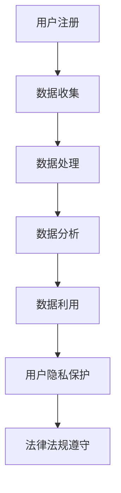

                 

### 《社交平台的数据收集与利用：如何保护用户隐私？》

> **关键词：社交平台、数据收集、隐私保护、数据分析、算法原理、项目实战**

> **摘要：本文将深入探讨社交平台数据收集与利用的各个方面，重点分析如何通过技术手段和保护策略来确保用户隐私的安全。**

---

#### 第一部分：社交平台数据收集与利用的基本概念

##### 1.1 社交平台概述

###### 1.1.1 社交平台的定义与类型

社交平台是连接用户、分享信息和互动交流的网络平台，它们通常包括社交媒体、即时通讯、在线社区等形式。不同类型的社交平台有不同的功能和目标用户群体。例如，Facebook 是一个综合性的社交媒体平台，而微信则侧重于即时通讯和社交互动。

###### 1.1.2 社交平台的用户行为分析

用户在社交平台上的行为多样，包括发布内容、评论、点赞、分享等。通过对用户行为的分析，社交平台可以了解用户的兴趣爱好、社交关系以及行为模式，从而为用户提供更加个性化的服务和内容推荐。

##### 1.2 数据收集的原理

###### 1.2.1 数据收集的方法与途径

数据收集的方法主要包括用户注册信息、用户行为数据、位置信息等。社交平台通过用户操作和设备信息等途径来收集这些数据。

###### 1.2.2 数据收集的应用

收集到的数据可以被用于用户画像、市场分析、广告投放等，从而提高平台的运营效率和用户体验。

##### 1.3 数据利用的价值

###### 1.3.1 数据分析在社交平台中的应用

数据分析可以帮助社交平台了解用户需求，优化产品功能和用户体验，同时也可以用于市场研究和竞争分析。

###### 1.3.2 数据商业化与隐私保护

社交平台将数据分析结果应用于商业化，如广告投放、数据交易等。在这个过程中，如何保护用户隐私是一个重要的挑战。

##### 1.4 社交平台数据收集的法律框架

###### 1.4.1 相关法律法规概述

不同国家和地区有不同的法律法规来规范社交平台的数据收集与利用。例如，《通用数据保护条例》（GDPR）在欧洲规定了严格的数据保护标准。

###### 1.4.2 用户隐私保护的挑战与解决方案

随着数据收集的规模和复杂度增加，用户隐私保护面临诸多挑战。解决方案包括透明度、用户同意、数据匿名化等技术手段。

##### 1.5 社交平台数据收集与利用的Mermaid流程图

---

**第一部分**的内容主要介绍了社交平台的基本概念、数据收集的原理、数据利用的价值以及相关的法律框架。在接下来的部分，我们将深入探讨社交平台数据收集与利用的核心算法原理，并通过具体的数学模型和项目实战来加深理解。

