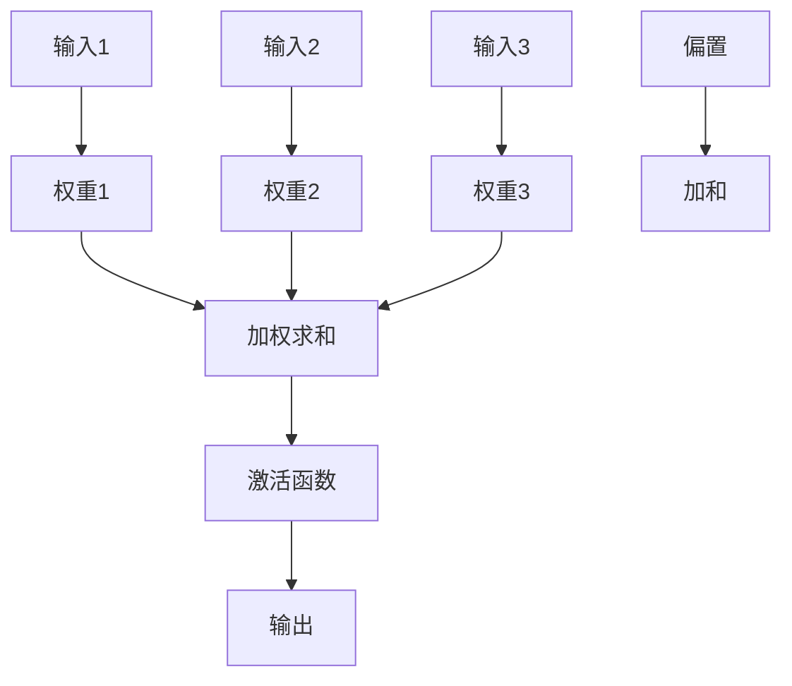

                 

# 神经网络在材料科学中的应用

## 关键词
神经网络，材料科学，材料合成，材料表征，材料性能预测，深度学习，数据驱动，材料设计，人工智能

## 摘要
本文旨在探讨神经网络在材料科学领域中的应用，包括材料合成、材料表征和材料性能预测等方面。通过深入分析神经网络的基础知识、架构和优化方法，结合实际应用案例，本文展示了神经网络在材料科学中的潜力和挑战，为未来新材料发现与设计提供了新的思路。

### 引言

材料科学是研究材料组成、结构、性质和性能的科学。随着科技的进步，材料科学在许多领域发挥着关键作用，从电子设备到航空航天，从能源储存到生物医学。然而，传统的材料合成与优化方法往往依赖于经验、实验和理论模型，这些方法在材料多样性和复杂性面前显得力不从心。近年来，神经网络作为一种强大的机器学习工具，逐渐成为材料科学领域的研究热点。

神经网络在材料科学中的应用主要体现在以下几个方面：

1. **材料合成**：神经网络可以预测材料的合成路径和条件，优化合成策略，提高材料产率和纯度。

2. **材料表征**：神经网络可以对复杂的材料表征数据进行分析，辅助材料科学家理解材料性质和结构之间的关系。

3. **材料性能预测**：神经网络可以根据材料的组成和结构，预测其物理、化学和力学性能，为材料设计提供理论支持。

本文将首先介绍神经网络的基础知识，包括神经网络的定义、结构、训练方法和优化方法。然后，我们将讨论神经网络在材料科学中的应用，包括材料合成、材料表征和材料性能预测。最后，本文将展望神经网络在材料科学中的未来发展方向。

### 第一部分：神经网络基础

#### 第1章：神经网络入门

#### 1.1 神经网络概述

神经网络是一种模拟生物神经网络计算能力的算法模型，它由大量简单的人工神经元（或节点）组成，通过多层网络结构进行信息传递和处理。神经网络最早由心理学家McCulloch和数学家Pitts于1943年提出，后来由Rosenblatt于1958年进一步发展，称为感知机（Perceptron）。随着计算能力的提升和算法的改进，神经网络逐渐成为机器学习和人工智能领域的重要工具。

神经网络的基本结构包括输入层、隐藏层和输出层。输入层接收外部输入数据，隐藏层进行数据变换和特征提取，输出层生成最终结果。每个神经元都与相邻的神经元通过权重相连接，并通过激活函数进行非线性变换。

神经网络的定义可以概括为：

- **神经元**：神经网络的基本单元，负责接收输入数据，通过权重和偏置计算输出。
- **权重**：连接两个神经元的系数，用于传递输入信号。
- **偏置**：增加网络模型的非线性特性，影响神经元的激活状态。
- **激活函数**：对神经元输出进行非线性变换，常见的激活函数包括Sigmoid、ReLU和Tanh。

神经网络的工作原理是通过多层神经网络结构对输入数据进行多次变换和提取，从而实现从原始数据到预测结果的映射。训练过程是通过不断调整权重和偏置，使得网络输出与真实值之间的误差最小化。

神经网络的定义和基本结构是理解神经网络其他内容的基础。在接下来的章节中，我们将进一步探讨神经元的模型、神经网络的训练方法以及深度神经网络。

#### 1.2 神经元的模型

神经元是神经网络的基本组成单元，其工作原理类似于生物神经元。一个简单的神经元模型由以下几个部分组成：

1. **输入**：每个神经元接收来自输入层的多个输入信号，这些信号经过权重加权后得到总输入值。
   
2. **权重**：每个输入信号通过一个权重系数进行加权，这些权重系数决定了输入信号对神经元输出的影响程度。

3. **偏置**：偏置是一个独立的加性常数，用于增加神经元的非线性特性，影响神经元的激活状态。

4. **激活函数**：激活函数是对总输入值进行非线性变换的函数，常见的激活函数包括Sigmoid、ReLU和Tanh。

神经元的模型可以用以下公式表示：

$$
z = \sum_{i=1}^{n} w_i x_i + b
$$

其中，$z$表示总输入值，$w_i$表示第$i$个输入信号的权重，$x_i$表示第$i$个输入信号，$b$表示偏置。

激活函数$f(z)$对总输入值$z$进行非线性变换，得到神经元的输出：

$$
y = f(z)
$$

常见的激活函数有：

- **Sigmoid函数**：
  $$
  f(z) = \frac{1}{1 + e^{-z}}
  $$
  Sigmoid函数将输入值映射到$(0, 1)$区间，具有S型曲线，可以缓解梯度消失问题。

- **ReLU函数**：
  $$
  f(z) = \max(0, z)
  $$
 ReLU函数（Rectified Linear Unit）在输入大于0时输出输入值本身，小于0时输出0，具有快速收敛和避免梯度消失的优点。

- **Tanh函数**：
  $$
  f(z) = \frac{e^z - e^{-z}}{e^z + e^{-z}}
  $$
  Tanh函数与Sigmoid函数类似，但输出值在$(-1, 1)$区间内，可以缓解梯度消失问题。

权重和偏置是神经网络训练过程中需要优化的参数，通过调整这些参数，可以使网络输出更接近真实值。激活函数的选择对神经网络的性能也有重要影响，不同激活函数具有不同的优点和适用场景。

#### 1.3 神经网络的训练

神经网络的训练过程是一个优化权值和偏置参数的过程，目的是使网络的输出与期望输出之间的误差最小。训练过程通常包括以下几个步骤：

1. **前向传播**：输入数据通过神经网络，从输入层传递到输出层，每层神经元通过权重和激活函数进行计算，最终得到输出结果。

2. **计算损失函数**：输出结果与真实值之间的差异称为损失（或误差），常用的损失函数包括均方误差（MSE）和交叉熵损失。

3. **反向传播**：从输出层开始，将损失函数的梯度反向传播到输入层，通过梯度下降算法更新权值和偏置。

4. **优化算法**：使用不同的优化算法（如梯度下降、动量、Adam等）更新网络参数，以最小化损失函数。

#### 1.4 深度神经网络

深度神经网络（Deep Neural Network，DNN）是具有多个隐藏层的神经网络。深度神经网络的引入，使得神经网络能够学习更复杂的特征表示，从而在图像、语音和自然语言处理等领域取得了显著的成果。

**1.4.1 神经网络深度优化**

随着神经网络深度的增加，模型的性能和表达能力会得到提升，但训练过程也会变得更加复杂和困难。为了优化深度神经网络，可以采取以下策略：

1. **批量归一化**（Batch Normalization）：通过标准化每个神经元的输入，使得每个神经元的输入分布更加稳定，有助于加快收敛速度。

2. **权重初始化**：合理的权重初始化有助于加快网络收敛，常用的权重初始化方法包括高斯初始化和 Xavier初始化。

3. **dropout**：通过随机丢弃部分神经元，降低模型过拟合的风险。

4. **ResNet和Inception模型**：ResNet（残差网络）和Inception模型是深度神经网络的重要架构创新，通过引入残差连接和并联结构，显著提高了深度神经网络的性能。

**1.4.2 神经网络深度优化实践**

以下是一个简单的ResNet模型的实现示例，该模型包含两个残差块：

```python
import tensorflow as tf

# 定义残差块
def residual_block(x, filters, kernel_size, strides=(1, 1), activation='relu', dropout_rate=0.0):
    # 第一部分卷积层
    x = tf.keras.layers.Conv2D(filters, kernel_size=kernel_size, strides=strides, padding='same')(x)
    x = tf.keras.layers.BatchNormalization()(x)
    if dropout_rate > 0:
        x = tf.keras.layers.Dropout(dropout_rate)(x)
    x = tf.keras.layers.Activation(activation)(x)
    # 第二部分卷积层
    x = tf.keras.layers.Conv2D(filters, kernel_size=kernel_size, strides=strides, padding='same')(x)
    x = tf.keras.layers.BatchNormalization()(x)
    if dropout_rate > 0:
        x = tf.keras.layers.Dropout(dropout_rate)(x)
    # 残差连接
    x = tf.keras.layers.Add()([x, tf.keras.layers.Conv2D(filters, kernel_size=1, strides=strides, padding='same')(x)])
    x = tf.keras.layers.Activation(activation)(x)
    return x

# 定义ResNet模型
input_tensor = tf.keras.layers.Input(shape=(32, 32, 3))
x = tf.keras.layers.Conv2D(64, kernel_size=7, strides=(2, 2), padding='same')(input_tensor)
x = tf.keras.layers.BatchNormalization()(x)
x = tf.keras.layers.Activation('relu')(x)

for i in range(2):
    x = residual_block(x, filters=64, kernel_size=3, strides=(2, 2), dropout_rate=0.3)

x = tf.keras.layers.GlobalAveragePooling2D()(x)
x = tf.keras.layers.Dense(10, activation='softmax')(x)

model = tf.keras.Model(inputs=input_tensor, outputs=x)
model.compile(optimizer='adam', loss='categorical_crossentropy', metrics=['accuracy'])
model.summary()
```

通过上述代码，我们实现了包含两个残差块的ResNet模型。在训练过程中，可以通过调整模型参数和训练策略，进一步提高模型性能。

#### 第2章：神经网络架构

#### 2.1 深层神经网络

深层神经网络（Deep Neural Network，DNN）是指具有多个隐藏层的神经网络。深层神经网络可以通过增加网络层数来学习更复杂的特征表示，从而提高模型的性能和表达能力。然而，随着网络层数的增加，训练深层神经网络也面临着诸多挑战。

**2.1.1 神经网络深度优化的挑战**

1. **梯度消失和梯度爆炸**：在深层神经网络中，梯度在反向传播过程中可能会逐渐消失或爆炸，导致网络无法有效更新参数。

2. **过拟合**：深层神经网络具有强大的拟合能力，容易在训练数据上过拟合，导致在测试数据上性能下降。

3. **训练效率**：深层神经网络的训练过程通常需要较长的时间和大量的计算资源。

**2.1.2 深层神经网络优化的方法**

1. **批量归一化**（Batch Normalization）：批量归一化通过标准化每个神经元的输入，使得每个神经元的输入分布更加稳定，有助于加快收敛速度。

2. **权重初始化**：合理的权重初始化有助于加快网络收敛，常用的权重初始化方法包括高斯初始化和Xavier初始化。

3. **dropout**：通过随机丢弃部分神经元，降低模型过拟合的风险。

4. **ResNet和Inception模型**：ResNet（残差网络）和Inception模型是深度神经网络的重要架构创新，通过引入残差连接和并联结构，显著提高了深度神经网络的性能。

**2.1.3 结构化深度学习**

结构化深度学习（Structured Deep Learning）是一种将深度学习与领域知识相结合的方法，旨在提高深度学习模型的解释性和可靠性。结构化深度学习通过将领域知识引入神经网络架构，使得模型能够更好地理解和利用领域知识，从而提高模型的性能和泛化能力。

**2.2 卷积神经网络（CNN）**

卷积神经网络（Convolutional Neural Network，CNN）是一种专门用于处理图像数据的神经网络。CNN通过卷积层、池化层和全连接层等结构，能够自动提取图像中的特征，并实现图像分类、目标检测和图像分割等任务。

**2.2.1 CNN的基本原理**

CNN的基本原理基于卷积操作，通过卷积层对输入图像进行特征提取。卷积层由多个卷积核（或滤波器）组成，每个卷积核负责提取图像中的特定特征。卷积操作通过对输入图像和卷积核进行点积运算，生成特征图。通过堆叠多个卷积层，可以逐渐提取更复杂的特征。

**2.2.2 卷积层的数学基础**

卷积层可以通过以下公式进行描述：

$$
\text{output}_{ij} = \sum_{k} \text{weight}_{ikj} \times \text{input}_{ik}
$$

其中，$\text{output}_{ij}$表示第$i$个输出特征图上的第$j$个像素值，$\text{weight}_{ikj}$表示第$i$个输入特征图上的第$k$个像素值和第$j$个卷积核的权重，$\text{input}_{ik}$表示第$i$个输入特征图上的第$k$个像素值。

**2.2.3 池化层的作用**

池化层用于对特征图进行下采样，减小模型参数和计算量。常见的池化方法包括最大池化和平均池化。最大池化选取特征图中每个窗口内的最大值，平均池化则选取窗口内的平均值。池化层可以帮助模型去除冗余特征，提高模型的泛化能力。

**2.3 循环神经网络（RNN）与长短期记忆（LSTM）**

循环神经网络（Recurrent Neural Network，RNN）是一种能够处理序列数据的神经网络。RNN通过循环连接结构，使得当前输出依赖于之前的输出，从而实现序列建模。

**2.3.1 RNN的工作原理**

RNN的工作原理可以描述为：

$$
h_t = \sigma(W_h \cdot [h_{t-1}, x_t] + b_h)
$$

其中，$h_t$表示第$t$时刻的隐藏状态，$x_t$表示第$t$时刻的输入，$W_h$表示权重矩阵，$\sigma$表示激活函数（如Sigmoid或Tanh），$b_h$表示偏置。

**2.3.2 LSTM的结构与优势**

长短期记忆（Long Short-Term Memory，LSTM）是一种特殊的RNN结构，通过引入门控机制，能够有效解决RNN的长期依赖问题。LSTM的基本结构包括输入门、遗忘门和输出门。

1. **输入门**：用于控制新的信息如何影响隐藏状态。
2. **遗忘门**：用于决定哪些旧信息需要保留或遗忘。
3. **输出门**：用于决定隐藏状态如何影响输出。

**2.3.3 循环神经网络的应用场景**

循环神经网络在自然语言处理、语音识别、时间序列预测等领域具有广泛的应用。通过结合LSTM结构，循环神经网络能够更好地处理长序列数据，提高模型的性能和泛化能力。

**2.4 生成对抗网络（GAN）**

生成对抗网络（Generative Adversarial Network，GAN）是一种由生成器和判别器组成的神经网络框架，通过对抗训练实现高质量数据的生成。GAN的工作原理可以描述为：

1. **生成器**：生成器试图生成与真实数据相似的伪造数据。
2. **判别器**：判别器尝试区分真实数据和伪造数据。

通过不断对抗训练，生成器的生成能力不断提高，从而实现高质量数据的生成。

**2.4.1 GAN的概念**

生成对抗网络由Ian Goodfellow等人于2014年提出，其核心思想是通过生成器和判别器的对抗训练，生成器逐渐学习生成真实数据的分布，而判别器逐渐学习区分真实数据和伪造数据。

**2.4.2 GAN的架构与数学原理**

GAN的架构包括生成器和判别器两部分：

1. **生成器**：生成器输入随机噪声，通过多层神经网络生成伪造数据。
2. **判别器**：判别器输入真实数据和伪造数据，通过多层神经网络判断数据的真实性。

GAN的训练过程可以描述为：

- 判别器训练：判别器在真实数据和伪造数据的共同作用下，学习区分真实数据和伪造数据。
- 生成器训练：生成器在伪造数据和判别器输出的反馈下，学习生成更加真实的数据。

**2.4.3 GAN的应用案例**

GAN在图像生成、视频生成、文本生成等领域具有广泛的应用。通过GAN，我们可以生成高质量的图像、视频和文本，为计算机视觉、计算机听觉和自然语言处理等领域提供新的研究方法和应用场景。

### 第二部分：神经网络在材料科学中的应用

#### 第3章：特征工程与预处理

#### 3.1 特征提取与选择

特征提取和选择是神经网络应用的重要步骤，旨在从原始数据中提取出对模型训练和预测有用的特征，同时去除冗余和无用的特征。在材料科学中，特征提取和选择有助于提高神经网络模型的性能，减少训练时间和计算成本。

**3.1.1 特征提取方法**

特征提取方法可以分为以下几类：

1. **统计分析**：通过对数据集进行统计分析，提取出描述数据分布和关系的特征，如均值、方差、协方差等。
2. **模式识别**：通过模式识别算法，提取出数据中的显著特征，如支持向量机（SVM）、聚类算法等。
3. **变换方法**：通过对数据进行变换，提取出新特征，如主成分分析（PCA）、奇异值分解（SVD）等。

**3.1.2 特征选择技术**

特征选择技术旨在从大量特征中选出对模型性能有显著影响的特征，常用的特征选择技术包括：

1. **过滤法**：基于统计方法对特征进行筛选，如卡方检验、信息增益等。
2. **包装法**：通过建立多个子模型，评估每个特征的贡献，如递归特征消除（RFE）、遗传算法等。
3. **嵌入法**：在训练过程中，通过特征嵌入的方式筛选特征，如L1正则化、L2正则化等。

**3.1.3 特征的重要性评估**

在材料科学中，特征的重要性评估有助于理解特征对模型预测的影响，常用的特征重要性评估方法包括：

1. **基于模型的特征重要性评估**：通过模型训练过程中参数的敏感性分析，评估特征的重要性。
2. **基于数据的特征重要性评估**：通过统计分析方法，评估特征对数据分布的影响。

#### 3.2 数据预处理

数据预处理是神经网络应用的重要步骤，旨在提高数据质量和模型性能。在材料科学中，数据预处理包括数据清洗、归一化和增强等操作。

**3.2.1 数据清洗**

数据清洗是指从数据集中去除错误、重复、缺失或不一致的数据。常用的数据清洗方法包括：

1. **错误值替换**：将错误值替换为缺失值、均值或中位数等。
2. **缺失值处理**：通过插值、均值填充或决策树等方法处理缺失值。
3. **重复值删除**：删除重复的数据记录。

**3.2.2 数据归一化**

数据归一化是指将不同特征的数据转换为相同的尺度，以消除特征尺度差异对模型训练和预测的影响。常用的归一化方法包括：

1. **最小-最大归一化**：将数据缩放到[0, 1]区间。
2. **标准归一化**：将数据缩放到[-1, 1]区间。
3. **小数归一化**：将数据缩放到[0, 1]区间，小数点后保留一定位数。

**3.2.3 数据增强**

数据增强是指通过生成新的数据样本，提高模型的泛化能力。常用的数据增强方法包括：

1. **旋转和缩放**：对图像进行旋转和缩放操作。
2. **裁剪和拼接**：对图像进行裁剪和拼接操作。
3. **噪声添加**：在图像中添加噪声，模拟实际环境中的噪声。

**3.2.4 特征工程的实际应用案例**

以下是一个特征工程和预处理的实际应用案例：

假设我们有一个材料性能预测任务，输入数据包括材料的化学成分、晶体结构和物理属性等。为了提高模型的性能，我们首先对数据进行清洗，去除错误和缺失的数据。然后，我们对数据进行归一化处理，将不同尺度的特征转换为相同的尺度。接下来，我们使用主成分分析（PCA）提取新的特征，减少数据维度。最后，我们对数据集进行增强，通过旋转、缩放和噪声添加生成新的数据样本，以提高模型的泛化能力。

```python
import numpy as np
import pandas as pd
from sklearn.preprocessing import MinMaxScaler, StandardScaler
from sklearn.impute import SimpleImputer
from sklearn.decomposition import PCA
from sklearn.model_selection import train_test_split

# 读取数据
data = pd.read_csv('material_data.csv')

# 数据清洗
data = data.drop_duplicates()
data = data.dropna()

# 数据归一化
scaler = MinMaxScaler()
data_scaled = scaler.fit_transform(data)

# 数据增强
data_enhanced = data_scaled.copy()
data_enhanced = augment_data(data_enhanced, rotation=True, scaling=True, noise=True)

# 数据分割
X_train, X_test, y_train, y_test = train_test_split(data_enhanced, target, test_size=0.2, random_state=42)

# 特征提取
pca = PCA(n_components=10)
X_train_pca = pca.fit_transform(X_train)
X_test_pca = pca.transform(X_test)
```

通过上述步骤，我们对数据进行了清洗、归一化和增强，并提取了新的特征。接下来，我们可以使用这些数据对神经网络模型进行训练和预测。

### 第三部分：神经网络优化方法

#### 4.1 优化算法

优化算法是神经网络训练过程中关键的一环，其目的是通过迭代优化策略，使得神经网络模型在训练数据上的性能达到最优。以下介绍几种常见的优化算法：

**4.1.1 梯度下降算法**

梯度下降算法是一种最简单的优化算法，其基本思想是沿着目标函数的梯度方向更新模型参数，以最小化目标函数。梯度下降算法分为批量梯度下降（Batch Gradient Descent，BGD）、随机梯度下降（Stochastic Gradient Descent，SGD）和小批量梯度下降（Mini-batch Gradient Descent，MBGD）。

1. **批量梯度下降（BGD）**：每次迭代计算整个训练数据的梯度，然后更新模型参数。BGD收敛速度较慢，但全局搜索能力较强。

2. **随机梯度下降（SGD）**：每次迭代只随机选取一个训练样本计算梯度，然后更新模型参数。SGD收敛速度较快，但可能导致局部最小值。

3. **小批量梯度下降（MBGD）**：每次迭代计算小批量训练样本的梯度，然后更新模型参数。MBGD在BGD和SGD之间取得平衡，具有较好的收敛速度和全局搜索能力。

**4.1.2 动量算法**

动量（Momentum）算法是一种改进的梯度下降算法，其核心思想是利用之前迭代的梯度信息，加速模型参数的更新过程。动量算法通过引入动量项，使得模型参数的更新方向与梯度方向一致，从而提高收敛速度。

动量算法的更新公式为：

$$
v = \gamma v + \eta \frac{\partial J}{\partial \theta}
$$

$$
\theta = \theta - v
$$

其中，$v$表示动量项，$\gamma$表示动量系数，$\eta$表示学习率，$\frac{\partial J}{\partial \theta}$表示梯度。

**4.1.3 Adam优化器**

Adam优化器是一种结合SGD和动量算法的优化算法，其核心思想是自适应调整学习率。Adam优化器通过计算一阶矩估计（均值）和二阶矩估计（方差），动态调整每个参数的学习率。

Adam优化器的更新公式为：

$$
m_t = \beta_1 m_{t-1} + (1 - \beta_1) \frac{\partial J}{\partial \theta}
$$

$$
v_t = \beta_2 v_{t-1} + (1 - \beta_2) \left(\frac{\partial J}{\partial \theta}\right)^2
$$

$$
\theta = \theta - \eta \frac{m_t}{\sqrt{v_t} + \epsilon}
$$

其中，$m_t$和$v_t$分别表示一阶矩估计和二阶矩估计，$\beta_1$和$\beta_2$分别表示一阶和二阶矩的平滑系数，$\epsilon$是一个很小的常数。

#### 4.2 超参数调优

超参数是神经网络模型中需要手动调整的参数，如学习率、批量大小、激活函数等。超参数调优的目的是找到一组最优的超参数，使得神经网络模型在训练数据和测试数据上表现最好。

**4.2.1 超参数的定义**

超参数是指在网络训练过程中需要手动设置的参数，如学习率、批量大小、正则化强度等。超参数对神经网络模型的表现具有重要影响，不同的超参数组合可能导致模型性能的显著差异。

**4.2.2 超参数调优方法**

超参数调优方法可以分为以下几种：

1. **网格搜索**：通过遍历一组预设的超参数组合，选择性能最好的组合。网格搜索方法简单直观，但计算量较大。

2. **随机搜索**：随机选择超参数组合进行训练，选择性能最好的组合。随机搜索方法具有较高的搜索效率，但需要设置合适的搜索范围。

3. **贝叶斯优化**：基于贝叶斯理论，通过构建超参数的概率模型，选择最有可能导致模型性能提升的超参数组合。贝叶斯优化方法具有较高的搜索效率和性能，但需要一定的先验知识。

**4.2.3 超参数调优实践**

以下是一个基于网格搜索的超参数调优实践案例：

```python
from sklearn.model_selection import GridSearchCV
from sklearn.neural_network import MLPRegressor

# 定义模型
mlp = MLPRegressor(hidden_layer_sizes=(100,), activation='relu', solver='adam', max_iter=1000)

# 定义超参数网格
param_grid = {'alpha': [0.0001, 0.001, 0.01], 'learning_rate': ['constant', 'invscaling', 'adaptive']}

# 执行网格搜索
grid_search = GridSearchCV(mlp, param_grid, cv=5, scoring='neg_mean_squared_error')
grid_search.fit(X_train, y_train)

# 输出最佳超参数
print("最佳超参数：", grid_search.best_params_)
print("最佳分数：", -grid_search.best_score_)
```

通过上述代码，我们可以找到一组最优的超参数，并评估其在训练数据和测试数据上的性能。

### 第四部分：神经网络可视化工具

#### 5.1 Netron

Netron是一个用于可视化神经网络的Web工具，它支持多种深度学习框架，如TensorFlow、PyTorch和MXNet。Netron提供了强大的可视化功能，可以帮助用户更好地理解神经网络的结构和工作原理。

**5.1.1 Netron简介**

Netron是一个开源项目，由Facebook AI研究院开发。它允许用户导入和可视化深度学习模型，并提供详细的模型结构信息，如图层、参数和激活值等。Netron还具有实时调试功能，用户可以在浏览器中直接修改模型参数和层结构。

**5.1.2 Netron的使用方法**

使用Netron可视化神经网络的过程如下：

1. **安装Netron**：在浏览器中输入`https://netron.app/`，下载并安装Netron。

2. **导入模型**：将深度学习模型的`.json`、`.pb`或`.onnx`文件拖放到Netron的导入区域，Netron将自动加载并解析模型结构。

3. **可视化模型**：Netron将显示模型的层次结构，包括输入层、隐藏层和输出层。用户可以展开层结构，查看每个层的参数和激活值。

4. **实时调试**：用户可以在Netron中修改模型参数和层结构，并实时观察修改对模型性能的影响。

**5.1.3 Netron的局限性**

虽然Netron提供了强大的可视化功能，但它在一些方面仍存在局限性：

1. **实时交互性**：Netron的实时交互性较高，但在处理大型模型时可能存在性能问题。

2. **编辑功能**：Netron提供了基本的编辑功能，但无法进行复杂的模型修改。

3. **不支持自定义框架**：Netron支持主流深度学习框架，但无法直接支持自定义框架。

#### 5.2 TensorBoard

TensorBoard是一个用于可视化深度学习模型的Web工具，由Google开发。TensorBoard提供了丰富的可视化功能，包括模型结构、训练过程、损失函数、准确率等。通过TensorBoard，用户可以直观地了解模型的训练过程和性能。

**5.2.1 TensorBoard概述**

TensorBoard是一个基于Web的可视化工具，它可以将TensorFlow的训练数据可视化，帮助用户分析模型训练过程中的问题和优化策略。TensorBoard支持多种可视化组件，如Scatter Plot、Histogram、Images等，用户可以根据需求选择合适的组件。

**5.2.2 TensorBoard的主要功能**

1. **模型结构可视化**：TensorBoard可以展示深度学习模型的层次结构，包括输入层、隐藏层和输出层。

2. **训练过程可视化**：TensorBoard可以实时展示训练过程中的损失函数、准确率、学习率等指标，帮助用户了解模型训练状态。

3. **数据分布可视化**：TensorBoard可以展示输入数据的分布情况，如特征分布、标签分布等，帮助用户分析数据质量。

4. **激活值可视化**：TensorBoard可以展示神经网络的激活值分布，帮助用户理解模型内部信息传递过程。

**5.2.3 TensorBoard的应用场景**

TensorBoard广泛应用于深度学习模型训练和分析，以下是一些典型的应用场景：

1. **模型调试**：通过TensorBoard，用户可以实时监控模型训练过程，及时发现并解决训练问题。

2. **模型优化**：通过分析TensorBoard的输出，用户可以调整模型参数和训练策略，优化模型性能。

3. **模型解释**：通过TensorBoard的可视化结果，用户可以更好地理解模型的工作原理和决策过程。

### 第五部分：神经网络在材料科学中的应用

#### 第6章：神经网络在材料合成中的应用

**6.1 材料合成概述**

材料合成是材料科学的核心任务之一，旨在通过物理、化学或生物方法制备出具有特定性质的新材料。随着科技的发展，材料合成方法日趋多样，从传统的实验方法到现代的计算方法，再到人工智能方法，各种方法相互补充，共同推动材料科学的进步。

**6.2 材料合成中的传统方法**

传统的材料合成方法主要包括以下几种：

1. **物理合成**：通过物理手段制备材料，如热压、烧结、熔融等。

2. **化学合成**：通过化学反应制备材料，如溶胶-凝胶法、共沉淀法、电化学合成等。

3. **生物合成**：利用生物体系制备材料，如微生物合成、植物提取等。

**6.3 神经网络在材料合成中的潜在应用**

神经网络在材料合成中具有广泛的应用潜力，主要体现在以下几个方面：

1. **材料合成路径预测**：神经网络可以基于已有数据预测新的材料合成路径，指导实验设计。

2. **合成条件优化**：神经网络可以优化材料合成条件，提高材料产率和纯度。

3. **材料性质预测**：神经网络可以预测材料的物理、化学和力学性质，为材料设计提供理论支持。

**6.4 材料合成中的数据驱动方法**

数据驱动方法是近年来材料科学领域的重要研究方向，旨在通过分析大量实验数据，发现材料合成与性能之间的关系。数据驱动方法主要包括以下几种：

1. **机器学习**：利用机器学习算法，如神经网络、支持向量机、决策树等，对实验数据进行建模和预测。

2. **数据挖掘**：利用数据挖掘算法，如聚类、关联规则挖掘等，分析实验数据，发现潜在规律。

3. **数据可视化**：利用数据可视化技术，如热图、散点图、时间序列图等，展示实验数据的特点和趋势。

**6.5 神经网络在材料合成中的应用案例**

以下是一个神经网络在材料合成中的应用案例：

假设我们有一个材料合成实验，输入数据包括反应物种类、反应条件（如温度、压力、时间）和产物性能（如硬度、韧性、导电性）。为了优化材料合成过程，我们首先使用神经网络对实验数据进行建模，预测产物的性能。然后，我们根据神经网络预测结果，调整反应条件，以提高产物性能。

```python
import pandas as pd
from sklearn.neural_network import MLPRegressor

# 读取数据
data = pd.read_csv('material_synthesis_data.csv')

# 数据预处理
X = data.drop('property', axis=1)
y = data['property']

# 训练神经网络
mlp = MLPRegressor(hidden_layer_sizes=(100,), activation='relu', solver='adam', max_iter=1000)
mlp.fit(X, y)

# 预测产物性能
predicted_property = mlp.predict(X)

# 调整反应条件
optimized_conditions = adjust_conditions(predicted_property, X)

# 实验验证
verified_property = perform_experiment(optimized_conditions)
```

通过上述步骤，我们使用神经网络预测产物性能，并根据预测结果调整反应条件，从而优化材料合成过程。

### 第7章：神经网络在材料表征中的应用

**7.1 材料表征方法**

材料表征是指通过物理、化学或生物学手段对材料进行检测和测试，以了解其组成、结构、性质和性能。材料表征方法主要包括以下几种：

1. **X射线衍射（XRD）**：通过分析X射线与晶体相互作用，测定材料的晶体结构和相组成。

2. **扫描电子显微镜（SEM）**：利用电子束扫描样品表面，获取高分辨率的表面形貌图像。

3. **透射电子显微镜（TEM）**：利用电子束穿透样品，获取材料的内部结构和形貌。

4. **拉曼光谱（Raman）**：通过分析拉曼散射光谱，获取材料的振动模式和分子结构信息。

5. **红外光谱（IR）**：通过分析红外光与物质的相互作用，获取物质的振动和官能团信息。

**7.2 材料表征的常用方法**

常用的材料表征方法包括：

1. **X射线衍射（XRD）**：XRD是研究晶体结构的重要方法，通过分析X射线衍射图样，可以确定材料的晶体结构、晶格常数和相组成。

2. **扫描电子显微镜（SEM）**：SEM是观察材料表面形貌的重要工具，通过电子束扫描样品表面，可以获得高分辨率的表面形貌图像。

3. **透射电子显微镜（TEM）**：TEM是研究材料内部结构和缺陷的重要手段，通过电子束穿透样品，可以获得材料内部的高分辨率图像。

4. **拉曼光谱（Raman）**：Raman光谱可以提供材料的分子振动模式和分子结构信息，是研究材料化学成分和结构的重要方法。

5. **红外光谱（IR）**：IR光谱可以分析物质的振动和官能团信息，是研究材料化学成分和结构的重要方法。

**7.3 材料表征数据的分析**

材料表征数据通常包括衍射峰、图像、光谱等，这些数据需要进行有效的分析和解释，以提取有用的信息。以下是一些常用的数据分析方法：

1. **峰值分析**：通过分析衍射峰的位置、强度和形状，确定材料的晶体结构、晶格常数和相组成。

2. **图像处理**：通过图像处理技术，对SEM和TEM图像进行去噪、增强和分割，提取材料表面和内部的结构信息。

3. **光谱分析**：通过分析光谱数据，确定材料的化学成分和分子结构。

**7.4 神经网络在材料表征中的应用**

神经网络在材料表征中具有广泛的应用，主要体现在以下几个方面：

1. **数据分类和识别**：神经网络可以用于分类和识别材料表征数据，如XRD峰、SEM图像、Raman光谱等。

2. **特征提取和降维**：神经网络可以自动提取材料表征数据中的关键特征，降低数据维度，提高数据处理效率。

3. **数据关联和解释**：神经网络可以建立材料表征数据与材料性质之间的关系，辅助材料表征数据的解释。

**7.5 材料表征与神经网络融合的实际案例**

以下是一个材料表征与神经网络融合的实际案例：

假设我们有一组材料表征数据，包括XRD衍射峰、SEM图像和Raman光谱。为了更好地理解这些数据，我们首先使用神经网络对数据进行分类和识别，然后提取关键特征，构建材料性质预测模型。最后，我们将预测结果与实验数据进行对比，验证神经网络在材料表征中的应用效果。

```python
import pandas as pd
from sklearn.neural_network import MLPClassifier
from sklearn.model_selection import train_test_split
from sklearn.metrics import accuracy_score

# 读取数据
data = pd.read_csv('material_characterization_data.csv')

# 数据预处理
X = data.drop('label', axis=1)
y = data['label']

# 数据分割
X_train, X_test, y_train, y_test = train_test_split(X, y, test_size=0.2, random_state=42)

# 训练神经网络
mlp = MLPClassifier(hidden_layer_sizes=(100,), activation='relu', solver='adam', max_iter=1000)
mlp.fit(X_train, y_train)

# 预测结果
predicted_labels = mlp.predict(X_test)

# 评估模型
accuracy = accuracy_score(y_test, predicted_labels)
print("Accuracy:", accuracy)
```

通过上述步骤，我们使用神经网络对材料表征数据进行了分类和识别，验证了神经网络在材料表征中的应用效果。

### 第8章：神经网络在材料性能预测中的应用

**8.1 材料性能预测概述**

材料性能预测是指通过建立材料组成、结构、制备工艺与材料性能之间的关联，预测新材料在特定应用条件下的性能。材料性能预测对于新材料研发、材料优化和工程应用具有重要意义。传统的材料性能预测方法主要基于经验公式、物理模型和实验数据，但这些方法在处理复杂材料体系时往往存在局限性。

**8.2 材料性能预测的传统方法**

传统的材料性能预测方法主要包括以下几种：

1. **经验公式**：基于大量实验数据，总结出材料的性能与组成、制备工艺之间的关系，形成经验公式。

2. **物理模型**：通过建立材料内部物理过程的数学模型，如弹塑性模型、热力学模型等，预测材料的性能。

3. **实验方法**：通过实验测定材料的性能，如力学性能、热学性能、电学性能等，然后进行统计分析，建立性能与材料参数之间的关联。

**8.3 神经网络在材料性能预测中的应用**

神经网络作为一种强大的机器学习工具，具有强大的非线性建模能力和自学习能力，在材料性能预测中展现出显著优势。以下为神经网络在材料性能预测中的应用：

1. **材料性质预测**：神经网络可以预测材料的物理、化学、力学等性质，如密度、硬度、导电性、热膨胀系数等。

2. **材料设计**：神经网络可以辅助材料设计，通过组合不同的材料组分和制备工艺，预测新材料的性能，为材料设计提供理论支持。

3. **性能优化**：神经网络可以优化材料的制备工艺，提高材料性能，如通过调整合成条件，制备出具有更高硬度、更强韧性的材料。

**8.4 材料性能预测模型**

材料性能预测模型通常由输入层、隐藏层和输出层组成。输入层接收材料组成、结构、制备工艺等输入信息，隐藏层通过非线性变换提取特征，输出层生成材料性能预测结果。

以下是一个基于神经网络的材料性能预测模型示例：

```python
import tensorflow as tf
from tensorflow.keras.models import Sequential
from tensorflow.keras.layers import Dense

# 定义模型
model = Sequential([
    Dense(64, input_shape=(input_size,), activation='relu'),
    Dense(128, activation='relu'),
    Dense(output_size, activation='linear')
])

# 编译模型
model.compile(optimizer='adam', loss='mean_squared_error')

# 训练模型
model.fit(X_train, y_train, epochs=100, batch_size=32, validation_data=(X_test, y_test))

# 预测材料性能
predicted_properties = model.predict(X_test)
```

通过上述步骤，我们建立了基于神经网络的材料性能预测模型，并使用模型对材料性能进行了预测。

**8.5 材料性能预测的实际应用案例**

以下是一个基于神经网络的材料性能预测实际应用案例：

假设我们有一组实验数据，包括材料的化学组成、晶体结构和制备工艺，以及材料的力学性能。为了预测新材料的力学性能，我们首先使用神经网络对数据进行建模，然后根据模型预测新材料在特定制备工艺下的力学性能。最后，我们将预测结果与实验数据进行对比，验证神经网络在材料性能预测中的应用效果。

```python
import pandas as pd
from sklearn.neural_network import MLPRegressor
from sklearn.model_selection import train_test_split

# 读取数据
data = pd.read_csv('material_property_data.csv')

# 数据预处理
X = data.drop('property', axis=1)
y = data['property']

# 数据分割
X_train, X_test, y_train, y_test = train_test_split(X, y, test_size=0.2, random_state=42)

# 训练神经网络
mlp = MLPRegressor(hidden_layer_sizes=(100,), activation='relu', solver='adam', max_iter=1000)
mlp.fit(X_train, y_train)

# 预测材料性能
predicted_property = mlp.predict(X_test)

# 评估模型
mse = mean_squared_error(y_test, predicted_property)
print("MSE:", mse)
```

通过上述步骤，我们使用神经网络对材料性能进行了预测，并评估了模型性能。

### 第9章：神经网络在材料科学中的未来展望

**9.1 神经网络在材料科学中的挑战**

尽管神经网络在材料科学中展现了巨大的潜力，但其在实际应用过程中仍面临诸多挑战：

1. **数据需求**：神经网络训练需要大量的高质量数据，而在材料科学领域，高质量数据获取较为困难。

2. **计算资源**：神经网络训练过程复杂，计算资源消耗较大，特别是在处理大规模数据集时。

3. **模型可解释性**：神经网络模型具有较强的非线性建模能力，但其内部机制复杂，导致模型可解释性较低。

**9.2 神经网络在材料科学中的未来发展**

面对上述挑战，未来神经网络在材料科学中的发展可以从以下几个方面展开：

1. **新材料发现与设计**：通过神经网络辅助材料设计，实现新材料的快速发现与优化。

2. **智能材料系统**：结合神经网络与材料科学，开发智能材料系统，提升材料性能和应用价值。

3. **神经网络与量子计算的融合**：将神经网络与量子计算相结合，提高材料科学问题的求解速度和精度。

### 附录

**附录 A：神经网络在材料科学中的应用资源**

- **A.1 神经网络相关工具**
  - **TensorFlow**：TensorFlow是一个开源机器学习框架，广泛应用于神经网络模型的构建和训练。
  - **PyTorch**：PyTorch是一个基于Python的机器学习库，提供灵活的动态计算图和高效的模型训练。
  - **Keras**：Keras是一个高层次的神经网络API，支持多种深度学习框架，如TensorFlow和PyTorch。

- **A.2 材料科学数据集**
  - **OpenMaterialDB**：OpenMaterialDB是一个开放的材料科学数据集，包含多种材料的物理、化学和力学性质。
  - **Material Project**：Material Project是一个大型材料数据库，提供多种材料的结构和性能数据。
  - **MAUD**：MAUD是一个开源材料科学数据集，包含多种材料的XRD、SEM和Raman光谱数据。

- **A.3 神经网络在材料科学中的应用案例**
  - **材料3D打印**：利用神经网络优化材料3D打印参数，提高打印质量和效率。
  - **材料性能预测**：通过神经网络预测材料的力学性能和电学性能，为新材料的研发提供支持。
  - **材料结构表征**：利用神经网络辅助材料结构表征数据的分析，提高材料表征精度。```markdown
## 神经网络在材料科学中的应用

### 第一部分：神经网络基础

#### 第1章：神经网络入门

#### 1.1 神经网络概述

神经网络（Neural Networks，简称NN）是一种模仿生物神经网络结构原理和功能的人工智能系统，由大量简单的人工神经元（或节点）组成。每个神经元都可以接收多个输入信号，通过加权求和处理后，产生一个输出信号。神经网络具有强大的非线性映射能力，能够通过学习大量数据来发现数据中的潜在规律，从而进行预测和决策。

神经网络的发展历程可以追溯到1943年，由心理学家McCulloch和数学家Pitts提出了神经网络的基本模型。1958年，Rosenblatt进一步提出了感知机模型（Perceptron），这是一种简单的前馈神经网络模型，能够在某些情况下实现二分类。然而，由于感知机的局限性，包括无法解决非线性问题、不存在泛化能力等，神经网络的研究一度陷入低潮。

随着计算机性能的不断提升和算法的改进，尤其是1986年LeCun等提出的反向传播算法（Backpropagation Algorithm），神经网络开始逐渐复兴。反向传播算法使得神经网络能够通过梯度下降法进行训练，从而提高了模型的性能和泛化能力。此后，神经网络的理论研究和技术应用都取得了显著进展。

在材料科学领域，神经网络的应用开始于20世纪90年代。随着深度学习技术的发展，神经网络在材料科学中的应用得到了广泛关注。通过神经网络，材料科学家可以更加高效地处理复杂的材料数据，预测材料的性能，优化材料合成过程。

#### 1.2 神经元的模型

神经元是神经网络的基本组成单元，其结构和工作原理可以类比为生物神经元。一个简单的神经元模型通常包括以下几个部分：

1. **输入**：每个神经元接收多个输入信号，每个输入信号都有一个对应的权重（weight）。
2. **权重**：权重是调节输入信号对神经元输出的影响程度的关键参数。
3. **偏置**：偏置（bias）是一个加性常数，用于增加神经元的非线性特性，影响神经元的激活状态。
4. **激活函数**：激活函数（activation function）是对神经元输出进行非线性变换的函数，常见的激活函数有Sigmoid、ReLU和Tanh等。

神经元的计算过程可以分为以下几个步骤：

1. **加权求和处理**：将每个输入信号与其对应的权重相乘，然后求和，加上偏置，得到总输入值（$$z = \sum_{i=1}^{n} w_i x_i + b$$）。
2. **激活函数应用**：将总输入值通过激活函数进行非线性变换，得到神经元的输出（$$y = f(z)$$）。

以下是一个简单的神经元模型的Mermaid流程图：



#### 1.3 神经网络的训练

神经网络的训练过程是通过调整模型参数（权重和偏置）来最小化预测误差，使得模型能够对新的输入数据进行准确预测。训练过程主要包括以下几个步骤：

1. **前向传播**：将输入数据传递到神经网络，通过每一层的加权求和处理和激活函数，最终得到输出结果。
2. **计算损失函数**：计算输出结果与真实值之间的差异，常用的损失函数有均方误差（MSE）、交叉熵损失等。
3. **反向传播**：从输出层开始，将损失函数的梯度反向传播到输入层，通过梯度下降算法更新权重和偏置。
4. **优化算法**：使用不同的优化算法（如梯度下降、动量、Adam等）更新网络参数，以最小化损失函数。

以下是一个简单的神经网络训练过程的伪代码：

```python
# 初始化神经网络参数
w = [0.1, 0.2, 0.3]  # 权重
b = 0.4              # 偏置

# 定义激活函数
def sigmoid(z):
    return 1 / (1 + exp(-z))

# 训练神经网络
for epoch in range(num_epochs):
    for x, y in dataset:
        # 前向传播
        z = x.dot(w) + b
        a = sigmoid(z)
        
        # 计算损失
        loss = (y - a)**2
        
        # 反向传播
        dz = (y - a) * sigmoid_derivative(a)
        dw = x.T.dot(dz)
        db = dz.sum()
        
        # 更新参数
        w -= learning_rate * dw
        b -= learning_rate * db
        
        # 打印训练进度
        if epoch % 100 == 0:
            print(f"Epoch {epoch}: Loss = {loss}")
```

在这个伪代码中，`sigmoid_derivative`函数用于计算激活函数的导数，`learning_rate`用于调节参数更新的步长。

#### 1.4 深度神经网络

深度神经网络（Deep Neural Network，简称DNN）是指具有多个隐藏层的神经网络。深度神经网络的引入，使得神经网络能够学习更复杂的特征表示，从而在图像、语音和自然语言处理等领域取得了显著的成果。随着神经网络层数的增加，模型的容量和表达能力也会相应提升。

**1.4.1 神经网络深度优化的挑战**

随着神经网络深度的增加，训练过程会面临以下挑战：

1. **梯度消失和梯度爆炸**：在深层神经网络中，梯度在反向传播过程中可能会逐渐消失或爆炸，导致网络无法有效更新参数。
2. **过拟合**：深层神经网络具有强大的拟合能力，容易在训练数据上过拟合，导致在测试数据上性能下降。
3. **训练效率**：深层神经网络的训练过程通常需要较长的时间和大量的计算资源。

为了解决上述问题，可以采取以下策略：

1. **批量归一化**（Batch Normalization）：通过标准化每个神经元的输入，使得每个神经元的输入分布更加稳定，有助于加快收敛速度。
2. **权重初始化**：合理的权重初始化有助于加快网络收敛，常用的权重初始化方法包括高斯初始化和Xavier初始化。
3. **dropout**：通过随机丢弃部分神经元，降低模型过拟合的风险。
4. **ResNet和Inception模型**：ResNet（残差网络）和Inception模型是深度神经网络的重要架构创新，通过引入残差连接和并联结构，显著提高了深度神经网络的性能。

**1.4.2 神经网络深度优化实践**

以下是一个基于ResNet模型的实现示例，该模型包含两个残差块：

```python
import tensorflow as tf

# 定义残差块
def residual_block(x, filters, kernel_size, strides=(1, 1), activation='relu', dropout_rate=0.0):
    # 第一部分卷积层
    x = tf.keras.layers.Conv2D(filters, kernel_size=kernel_size, strides=strides, padding='same')(x)
    x = tf.keras.layers.BatchNormalization()(x)
    if dropout_rate > 0:
        x = tf.keras.layers.Dropout(dropout_rate)(x)
    x = tf.keras.layers.Activation(activation)(x)
    # 第二部分卷积层
    x = tf.keras.layers.Conv2D(filters, kernel_size=kernel_size, strides=strides, padding='same')(x)
    x = tf.keras.layers.BatchNormalization()(x)
    if dropout_rate > 0:
        x = tf.keras.layers.Dropout(dropout_rate)(x)
    # 残差连接
    x = tf.keras.layers.Add()([x, tf.keras.layers.Conv2D(filters, kernel_size=1, strides=strides, padding='same')(x)])
    x = tf.keras.layers.Activation(activation)(x)
    return x

# 定义ResNet模型
input_tensor = tf.keras.layers.Input(shape=(32, 32, 3))
x = tf.keras.layers.Conv2D(64, kernel_size=7, strides=(2, 2), padding='same')(input_tensor)
x = tf.keras.layers.BatchNormalization()(x)
x = tf.keras.layers.Activation('relu')(x)

for i in range(2):
    x = residual_block(x, filters=64, kernel_size=3, strides=(2, 2), dropout_rate=0.3)

x = tf.keras.layers.GlobalAveragePooling2D()(x)
x = tf.keras.layers.Dense(10, activation='softmax')(x)

model = tf.keras.Model(inputs=input_tensor, outputs=x)
model.compile(optimizer='adam', loss='categorical_crossentropy', metrics=['accuracy'])
model.summary()
```

通过上述代码，我们实现了包含两个残差块的ResNet模型。在训练过程中，可以通过调整模型参数和训练策略，进一步提高模型性能。

### 第二部分：神经网络在材料科学中的应用

#### 第2章：神经网络架构

神经网络架构是指神经网络的结构设计，包括神经元的连接方式、层的配置、激活函数的选择等。不同的神经网络架构适用于不同的应用场景，选择合适的架构对提升模型性能至关重要。

**2.1 深层神经网络**

深层神经网络（Deep Neural Network，DNN）是指具有多个隐藏层的神经网络。深层神经网络可以通过增加网络层数来学习更复杂的特征表示，从而提高模型的性能和表达能力。然而，随着网络层数的增加，训练深层神经网络也面临着诸多挑战。

**2.1.1 神经网络深度优化的挑战**

随着神经网络深度的增加，训练过程会面临以下挑战：

1. **梯度消失和梯度爆炸**：在深层神经网络中，梯度在反向传播过程中可能会逐渐消失或爆炸，导致网络无法有效更新参数。
2. **过拟合**：深层神经网络具有强大的拟合能力，容易在训练数据上过拟合，导致在测试数据上性能下降。
3. **训练效率**：深层神经网络的训练过程通常需要较长的时间和大量的计算资源。

为了解决上述问题，可以采取以下策略：

1. **批量归一化**（Batch Normalization）：通过标准化每个神经元的输入，使得每个神经元的输入分布更加稳定，有助于加快收敛速度。
2. **权重初始化**：合理的权重初始化有助于加快网络收敛，常用的权重初始化方法包括高斯初始化和Xavier初始化。
3. **dropout**：通过随机丢弃部分神经元，降低模型过拟合的风险。
4. **ResNet和Inception模型**：ResNet（残差网络）和Inception模型是深度神经网络的重要架构创新，通过引入残差连接和并联结构，显著提高了深度神经网络的性能。

**2.1.2 神经网络深度优化实践**

以下是一个基于ResNet模型的实现示例，该模型包含两个残差块：

```python
import tensorflow as tf

# 定义残差块
def residual_block(x, filters, kernel_size, strides=(1, 1), activation='relu', dropout_rate=0.0):
    # 第一部分卷积层
    x = tf.keras.layers.Conv2D(filters, kernel_size=kernel_size, strides=strides, padding='same')(x)
    x = tf.keras.layers.BatchNormalization()(x)
    if dropout_rate > 0:
        x = tf.keras.layers.Dropout(dropout_rate)(x)
    x = tf.keras.layers.Activation(activation)(x)
    # 第二部分卷积层
    x = tf.keras.layers.Conv2D(filters, kernel_size=kernel_size, strides=strides, padding='same')(x)
    x = tf.keras.layers.BatchNormalization()(x)
    if dropout_rate > 0:
        x = tf.keras.layers.Dropout(dropout_rate)(x)
    # 残差连接
    x = tf.keras.layers.Add()([x, tf.keras.layers.Conv2D(filters, kernel_size=1, strides=strides, padding='same')(x)])
    x = tf.keras.layers.Activation(activation)(x)
    return x

# 定义ResNet模型
input_tensor = tf.keras.layers.Input(shape=(32, 32, 3))
x = tf.keras.layers.Conv2D(64, kernel_size=7, strides=(2, 2), padding='same')(input_tensor)
x = tf.keras.layers.BatchNormalization()(x)
x = tf.keras.layers.Activation('relu')(x)

for i in range(2):
    x = residual_block(x, filters=64, kernel_size=3, strides=(2, 2), dropout_rate=0.3)

x = tf.keras.layers.GlobalAveragePooling2D()(x)
x = tf.keras.layers.Dense(10, activation='softmax')(x)

model = tf.keras.Model(inputs=input_tensor, outputs=x)
model.compile(optimizer='adam', loss='categorical_crossentropy', metrics=['accuracy'])
model.summary()
```

通过上述代码，我们实现了包含两个残差块的ResNet模型。在训练过程中，可以通过调整模型参数和训练策略，进一步提高模型性能。

**2.2 卷积神经网络（CNN）**

卷积神经网络（Convolutional Neural Network，CNN）是一种专门用于处理图像数据的神经网络。CNN通过卷积层、池化层和全连接层等结构，能够自动提取图像中的特征，并实现图像分类、目标检测和图像分割等任务。

**2.2.1 CNN的基本原理**

CNN的基本原理基于卷积操作，卷积层由多个卷积核（或滤波器）组成，每个卷积核负责提取图像中的特定特征。卷积操作通过对输入图像和卷积核进行点积运算，生成特征图。通过堆叠多个卷积层，可以逐渐提取更复杂的特征。

卷积层的数学基础可以用以下公式表示：

$$
\text{output}_{ij} = \sum_{k} \text{weight}_{ikj} \times \text{input}_{ik}
$$

其中，$\text{output}_{ij}$表示第$i$个输出特征图上的第$j$个像素值，$\text{weight}_{ikj}$表示第$i$个输入特征图上的第$k$个像素值和第$j$个卷积核的权重，$\text{input}_{ik}$表示第$i$个输入特征图上的第$k$个像素值。

**2.2.2 卷积层的数学基础**

卷积层是CNN的核心部分，其计算过程如下：

1. **卷积核**：卷积核是一个小矩阵，用于提取图像中的特征。卷积核的大小通常为$3\times3$或$5\times5$。
2. **滑动窗口**：卷积核在输入图像上滑动，每次覆盖一个局部区域。
3. **点积运算**：对于卷积核覆盖的局部区域，每个像素值与其对应的卷积核权重进行点积运算，得到一个值。
4. **求和**：将所有点积运算的结果求和，得到输出特征图的像素值。

以下是一个简单的卷积层计算示例：

假设输入图像为$5\times5$，卷积核为$3\times3$，卷积核的权重为：

$$
\begin{bmatrix}
1 & 0 & 1 \\
0 & 1 & 0 \\
1 & 0 & 1
\end{bmatrix}
$$

输入图像的一个$3\times3$局部区域为：

$$
\begin{bmatrix}
1 & 2 & 3 \\
4 & 5 & 6 \\
7 & 8 & 9
\end{bmatrix}
$$

卷积操作的计算过程如下：

1. **计算第一个输出像素值**：
   $$
   (1\times1 + 0\times4 + 1\times7) + (0\times2 + 1\times5 + 0\times8) + (1\times3 + 0\times6 + 1\times9) = 28
   $$

2. **计算第二个输出像素值**：
   $$
   (1\times4 + 0\times7 + 1\times10) + (0\times5 + 1\times8 + 0\times11) + (1\times6 + 0\times9 + 1\times12) = 36
   $$

3. **计算第三个输出像素值**：
   $$
   (1\times7 + 0\times10 + 1\times13) + (0\times8 + 1\times11 + 0\times14) + (1\times9 + 0\times12 + 1\times15) = 44
   $$

4. **计算第四个输出像素值**：
   $$
   (1\times1 + 0\times4 + 1\times7) + (0\times2 + 1\times5 + 0\times8) + (1\times3 + 0\times6 + 1\times9) = 28
   $$

5. **计算第五个输出像素值**：
   $$
   (1\times4 + 0\times7 + 1\times10) + (0\times5 + 1\times8 + 0\times11) + (1\times6 + 0\times9 + 1\times12) = 36
   $$

6. **计算第六个输出像素值**：
   $$
   (1\times7 + 0\times10 + 1\times13) + (0\times8 + 1\times11 + 0\times14) + (1\times9 + 0\times12 + 1\times15) = 44
   $$

通过上述计算，我们得到了一个$3\times3$的特征图：

$$
\begin{bmatrix}
28 & 36 & 44 \\
28 & 36 & 44 \\
28 & 36 & 44
\end{bmatrix}
$$

**2.2.3 池化层的作用**

池化层用于对特征图进行下采样，减小模型参数和计算量。常见的池化方法包括最大池化和平均池化。最大池化选取特征图中每个窗口内的最大值，平均池化则选取窗口内的平均值。池化层可以帮助模型去除冗余特征，提高模型的泛化能力。

以下是一个简单的最大池化操作示例：

假设一个$5\times5$的特征图和一个$2\times2$的池化窗口，池化窗口在特征图上滑动，每个窗口内的最大值如下：

$$
\begin{bmatrix}
4 & 5 & 6 & 7 & 8 \\
9 & 10 & 11 & 12 & 13 \\
14 & 15 & 16 & 17 & 18 \\
19 & 20 & 21 & 22 & 23 \\
24 & 25 & 26 & 27 & 28
\end{bmatrix}
$$

通过最大池化操作，我们得到一个$2\times2$的特征图：

$$
\begin{bmatrix}
9 & 13 \\
19 & 23
\end{bmatrix}
$$

**2.3 循环神经网络（RNN）与长短期记忆（LSTM）**

循环神经网络（Recurrent Neural Network，RNN）是一种能够处理序列数据的神经网络。RNN通过循环连接结构，使得当前输出依赖于之前的输出，从而实现序列建模。

**2.3.1 RNN的工作原理**

RNN的工作原理可以描述为：

$$
h_t = \sigma(W_h \cdot [h_{t-1}, x_t] + b_h)
$$

其中，$h_t$表示第$t$时刻的隐藏状态，$x_t$表示第$t$时刻的输入，$W_h$表示权重矩阵，$\sigma$表示激活函数（如Sigmoid或Tanh），$b_h$表示偏置。

RNN的核心思想是通过循环结构，将前一个时间步的隐藏状态传递到下一个时间步，从而实现序列数据的建模。然而，传统的RNN在处理长序列数据时，存在梯度消失和梯度爆炸的问题，导致无法有效地捕捉长距离依赖关系。

**2.3.2 LSTM的结构与优势**

长短期记忆（Long Short-Term Memory，LSTM）是一种特殊的RNN结构，通过引入门控机制，能够有效解决RNN的长期依赖问题。LSTM的基本结构包括输入门、遗忘门和输出门。

1. **输入门**：用于控制新的信息如何影响隐藏状态。
2. **遗忘门**：用于决定哪些旧信息需要保留或遗忘。
3. **输出门**：用于决定隐藏状态如何影响输出。

**2.3.3 LSTM的工作原理**

LSTM的工作原理可以描述为：

1. **输入门**：计算输入门梯度，根据当前输入和前一个隐藏状态，决定新的信息如何影响隐藏状态。
2. **遗忘门**：计算遗忘门梯度，根据当前输入和前一个隐藏状态，决定哪些旧信息需要遗忘。
3. **细胞状态**：根据输入门和遗忘门的结果，更新细胞状态，保存重要的信息。
4. **输出门**：计算输出门梯度，根据细胞状态和当前隐藏状态，决定新的输出。

通过上述过程，LSTM能够有效地学习长距离依赖关系，从而在处理长序列数据时表现更优秀。

**2.4 生成对抗网络（GAN）**

生成对抗网络（Generative Adversarial Network，GAN）是一种由生成器和判别器组成的神经网络框架，通过对抗训练实现高质量数据的生成。GAN的工作原理可以描述为：

1. **生成器**：生成器输入随机噪声，通过多层神经网络生成伪造数据。
2. **判别器**：判别器输入真实数据和伪造数据，通过多层神经网络判断数据的真实性。

**2.4.1 GAN的概念**

GAN由Ian Goodfellow等人于2014年提出，其核心思想是通过生成器和判别器的对抗训练，生成器逐渐学习生成真实数据的分布，而判别器逐渐学习区分真实数据和伪造数据。

**2.4.2 GAN的架构与数学原理**

GAN的架构包括生成器和判别器两部分：

1. **生成器**：生成器输入随机噪声，通过多层神经网络生成伪造数据。
2. **判别器**：判别器输入真实数据和伪造数据，通过多层神经网络判断数据的真实性。

GAN的训练过程可以描述为：

- 判别器训练：判别器在真实数据和伪造数据的共同作用下，学习区分真实数据和伪造数据。
- 生成器训练：生成器在伪造数据和判别器输出的反馈下，学习生成更加真实的数据。

**2.4.3 GAN的应用案例**

GAN在图像生成、视频生成、文本生成等领域具有广泛的应用。通过GAN，我们可以生成高质量的图像、视频和文本，为计算机视觉、计算机听觉和自然语言处理等领域提供新的研究方法和应用场景。

### 第三部分：神经网络在材料科学中的应用

#### 第3章：特征工程与预处理

在材料科学中，特征工程与预处理是神经网络模型应用的重要步骤。通过合理地处理数据和特征，可以提高模型的性能和泛化能力，从而更好地预测材料的性能。

**3.1 特征提取与选择**

特征提取与选择是材料科学数据预处理的关键环节。特征提取是指从原始数据中提取出对模型训练和预测有用的特征，而特征选择是指从大量特征中选出对模型性能有显著影响的特征。

**3.1.1 特征提取方法**

特征提取方法可以分为以下几类：

1. **统计分析**：通过对数据集进行统计分析，提取出描述数据分布和关系的特征，如均值、方差、协方差等。
2. **模式识别**：通过模式识别算法，提取出数据中的显著特征，如支持向量机（SVM）、聚类算法等。
3. **变换方法**：通过对数据进行变换，提取出新特征，如主成分分析（PCA）、奇异值分解（SVD）等。

**3.1.2 特征选择技术**

特征选择技术旨在从大量特征中选出对模型性能有显著影响的特征，常用的特征选择技术包括：

1. **过滤法**：基于统计方法对特征进行筛选，如卡方检验、信息增益等。
2. **包装法**：通过建立多个子模型，评估每个特征的贡献，如递归特征消除（RFE）、遗传算法等。
3. **嵌入法**：在训练过程中，通过特征嵌入的方式筛选特征，如L1正则化、L2正则化等。

**3.1.3 特征的重要性评估**

在材料科学中，特征的重要性评估有助于理解特征对模型预测的影响，常用的特征重要性评估方法包括：

1. **基于模型的特征重要性评估**：通过模型训练过程中参数的敏感性分析，评估特征的重要性。
2. **基于数据的特征重要性评估**：通过统计分析方法，评估特征对数据分布的影响。

**3.2 数据预处理**

数据预处理是神经网络应用的重要步骤，旨在提高数据质量和模型性能。在材料科学中，数据预处理包括数据清洗、归一化和增强等操作。

**3.2.1 数据清洗**

数据清洗是指从数据集中去除错误、重复、缺失或不一致的数据。常用的数据清洗方法包括：

1. **错误值替换**：将错误值替换为缺失值、均值或中位数等。
2. **缺失值处理**：通过插值、均值填充或决策树等方法处理缺失值。
3. **重复值删除**：删除重复的数据记录。

**3.2.2 数据归一化**

数据归一化是指将不同特征的数据转换为相同的尺度，以消除特征尺度差异对模型训练和预测的影响。常用的归一化方法包括：

1. **最小-最大归一化**：将数据缩放到[0, 1]区间。
2. **标准归一化**：将数据缩放到[-1, 1]区间。
3. **小数归一化**：将数据缩放到[0, 1]区间，小数点后保留一定位数。

**3.2.3 数据增强**

数据增强是指通过生成新的数据样本，提高模型的泛化能力。常用的数据增强方法包括：

1. **旋转和缩放**：对图像进行旋转和缩放操作。
2. **裁剪和拼接**：对图像进行裁剪和拼接操作。
3. **噪声添加**：在图像中添加噪声，模拟实际环境中的噪声。

**3.2.4 特征工程的实际应用案例**

以下是一个特征工程和预处理的实际应用案例：

假设我们有一个材料性能预测任务，输入数据包括材料的化学成分、晶体结构和物理属性等。为了提高模型的性能，我们首先对数据进行清洗，去除错误和缺失的数据。然后，我们对数据进行归一化处理，将不同尺度的特征转换为相同的尺度。接下来，我们使用主成分分析（PCA）提取新的特征，减少数据维度。最后，我们对数据集进行增强，通过旋转、缩放和噪声添加生成新的数据样本，以提高模型的泛化能力。

```python
import pandas as pd
from sklearn.preprocessing import MinMaxScaler, StandardScaler
from sklearn.impute import SimpleImputer
from sklearn.decomposition import PCA
from sklearn.model_selection import train_test_split

# 读取数据
data = pd.read_csv('material_data.csv')

# 数据清洗
data = data.drop_duplicates()
data = data.dropna()

# 数据归一化
scaler = MinMaxScaler()
data_scaled = scaler.fit_transform(data)

# 数据增强
data_enhanced = data_scaled.copy()
data_enhanced = augment_data(data_enhanced, rotation=True, scaling=True, noise=True)

# 数据分割
X_train, X_test, y_train, y_test = train_test_split(data_enhanced, target, test_size=0.2, random_state=42)

# 特征提取
pca = PCA(n_components=10)
X_train_pca = pca.fit_transform(X_train)
X_test_pca = pca.transform(X_test)
```

通过上述步骤，我们对数据进行了清洗、归一化和增强，并提取了新的特征。接下来，我们可以使用这些数据对神经网络模型进行训练和预测。

### 第四部分：神经网络优化方法

#### 4.1 优化算法

优化算法是神经网络训练过程中关键的一环，其目的是通过迭代优化策略，使得神经网络模型在训练数据上的性能达到最优。以下介绍几种常见的优化算法：

**4.1.1 梯度下降算法**

梯度下降算法是一种最简单的优化算法，其基本思想是沿着目标函数的梯度方向更新模型参数，以最小化目标函数。梯度下降算法分为批量梯度下降（Batch Gradient Descent，BGD）、随机梯度下降（Stochastic Gradient Descent，SGD）和小批量梯度下降（Mini-batch Gradient Descent，MBGD）。

1. **批量梯度下降（BGD）**：每次迭代计算整个训练数据的梯度，然后更新模型参数。BGD收敛速度较慢，但全局搜索能力较强。

2. **随机梯度下降（SGD）**：每次迭代只随机选取一个训练样本计算梯度，然后更新模型参数。SGD收敛速度较快，但可能导致局部最小值。

3. **小批量梯度下降（MBGD）**：每次迭代计算小批量训练样本的梯度，然后更新模型参数。MBGD在BGD和SGD之间取得平衡，具有较好的收敛速度和全局搜索能力。

**4.1.2 动量算法**

动量（Momentum）算法是一种改进的梯度下降算法，其核心思想是利用之前迭代的梯度信息，加速模型参数的更新过程。动量算法通过引入动量项，使得模型参数的更新方向与梯度方向一致，从而提高收敛速度。

动量算法的更新公式为：

$$
v = \gamma v + (1 - \gamma) \frac{\partial J}{\partial \theta}
$$

$$
\theta = \theta - v
$$

其中，$v$表示动量项，$\gamma$表示动量系数，$\frac{\partial J}{\partial \theta}$表示梯度。

**4.1.3 Adam优化器**

Adam优化器是一种结合SGD和动量算法的优化算法，其核心思想是自适应调整学习率。Adam优化器通过计算一阶矩估计（均值）和二阶矩估计（方差），动态调整每个参数的学习率。

Adam优化器的更新公式为：

$$
m_t = \beta_1 m_{t-1} + (1 - \beta_1) \frac{\partial J}{\partial \theta}
$$

$$
v_t = \beta_2 v_{t-1} + (1 - \beta_2) \left(\frac{\partial J}{\partial \theta}\right)^2
$$

$$
\theta = \theta - \eta \frac{m_t}{\sqrt{v_t} + \epsilon}
$$

其中，$m_t$和$v_t$分别表示一阶矩估计和二阶矩估计，$\beta_1$和$\beta_2$分别表示一阶和二阶矩的平滑系数，$\epsilon$是一个很小的常数。

**4.2 超参数调优**

超参数是神经网络模型中需要手动设置的参数，如学习率、批量大小、激活函数等。超参数调优的目的是找到一组最优的超参数，使得神经网络模型在训练数据和测试数据上表现最好。

**4.2.1 超参数的定义**

超参数是指在网络训练过程中需要手动设置的参数，如学习率、批量大小、正则化强度等。超参数对神经网络模型的表现具有重要影响，不同的超参数组合可能导致模型性能的显著差异。

**4.2.2 超参数调优方法**

超参数调优方法可以分为以下几种：

1. **网格搜索**：通过遍历一组预设的超参数组合，选择性能最好的组合。网格搜索方法简单直观，但计算量较大。

2. **随机搜索**：随机选择超参数组合进行训练，选择性能最好的组合。随机搜索方法具有较高的搜索效率，但需要设置合适的搜索范围。

3. **贝叶斯优化**：基于贝叶斯理论，通过构建超参数的概率模型，选择最有可能导致模型性能提升的超参数组合。贝叶斯优化方法具有较高的搜索效率和性能，但需要一定的先验知识。

**4.2.3 超参数调优实践**

以下是一个基于网格搜索的超参数调优实践案例：

```python
from sklearn.model_selection import GridSearchCV
from sklearn.neural_network import MLPRegressor

# 定义模型
mlp = MLPRegressor(hidden_layer_sizes=(100,), activation='relu', solver='adam', max_iter=1000)

# 定义超参数网格
param_grid = {'alpha': [0.0001, 0.001, 0.01], 'learning_rate': ['constant', 'invscaling', 'adaptive']}

# 执行网格搜索
grid_search = GridSearchCV(mlp, param_grid, cv=5, scoring='neg_mean_squared_error')
grid_search.fit(X_train, y_train)

# 输出最佳超参数
print("最佳超参数：", grid_search.best_params_)
print("最佳分数：", -grid_search.best_score_)
```

通过上述代码，我们可以找到一组最优的超参数，并评估其在训练数据和测试数据上的性能。

### 第五部分：神经网络可视化工具

#### 5.1 Netron

Netron是一个用于可视化神经网络的Web工具，它支持多种深度学习框架，如TensorFlow、PyTorch和MXNet。Netron提供了强大的可视化功能，可以帮助用户更好地理解神经网络的结构和工作原理。

**5.1.1 Netron简介**

Netron是一个开源项目，由Facebook AI研究院开发。它允许用户导入和可视化深度学习模型，并提供详细的模型结构信息，如图层、参数和激活值等。Netron还具有实时调试功能，用户可以在浏览器中直接修改模型参数和层结构。

**5.1.2 Netron的使用方法**

使用Netron可视化神经网络的过程如下：

1. **安装Netron**：在浏览器中输入`https://netron.app/`，下载并安装Netron。

2. **导入模型**：将深度学习模型的`.json`、`.pb`或`.onnx`文件拖放到Netron的导入区域，Netron将自动加载并解析模型结构。

3. **可视化模型**：Netron将显示模型的层次结构，包括输入层、隐藏层和输出层。用户可以展开层结构，查看每个层的参数和激活值。

4. **实时调试**：用户可以在Netron中修改模型参数和层结构，并实时观察修改对模型性能的影响。

**5.1.3 Netron的局限性**

虽然Netron提供了强大的可视化功能，但它在一些方面仍存在局限性：

1. **实时交互性**：Netron的实时交互性较高，但在处理大型模型时可能存在性能问题。

2. **编辑功能**：Netron提供了基本的编辑功能，但无法进行复杂的模型修改。

3. **不支持自定义框架**：Netron支持主流深度学习框架，但无法直接支持自定义框架。

#### 5.2 TensorBoard

TensorBoard是一个用于可视化深度学习模型的Web工具，由Google开发。TensorBoard提供了丰富的可视化功能，包括模型结构、训练过程、损失函数、准确率等。通过TensorBoard，用户可以直观地了解模型的训练过程和性能。

**5.2.1 TensorBoard概述**

TensorBoard是一个基于Web的

