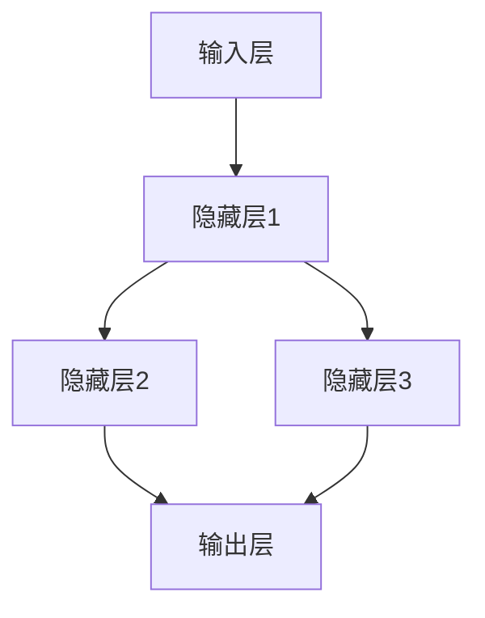

                 

# 《神经网络技术在注意力预测中的应用》

## 关键词：
神经网络、注意力预测、自注意力机制、交互注意力机制、深度学习、注意力权重、项目实战

## 摘要：
本文将深入探讨神经网络技术在注意力预测中的应用。首先，我们将回顾神经网络的基本概念和结构，然后介绍注意力预测的重要性及其在神经网络中的实现方式。接着，我们将详细分析自注意力机制和交互注意力机制，并探讨它们在注意力预测中的具体应用。随后，我们将介绍深度学习的基础知识，包括其结构、训练过程以及流行的深度学习框架。在此基础上，我们将进行实验分析，探讨神经网络在注意力预测中的性能表现。最后，我们将通过实际项目实战，展示神经网络技术在注意力预测中的实际应用，并总结全文，展望未来研究方向和面临的挑战。

## 目录大纲

### 第一部分：引言

#### 第1章：神经网络与注意力预测概述

##### 1.1 神经网络的基本概念

###### 1.1.1 神经网络的结构

###### 1.1.2 神经网络的原理

##### 1.2 注意力预测的重要性

###### 1.2.1 注意力预测的应用场景

###### 1.2.2 注意力预测在神经网络中的实现

#### 第2章：神经网络技术在注意力预测中的应用

##### 2.1 自注意力机制

###### 2.1.1 自注意力机制的原理

###### 2.1.2 自注意力机制的应用案例

##### 2.2 交互注意力机制

###### 2.2.1 交互注意力机制的原理

###### 2.2.2 交互注意力机制的应用案例

##### 2.3 注意力预测算法

###### 2.3.1 注意力预测算法的基本原理

###### 2.3.2 注意力预测算法的性能评估

#### 第3章：深度学习基础

##### 3.1 深度学习的基本原理

###### 3.1.1 深度学习的结构

###### 3.1.2 深度学习的训练过程

##### 3.2 深度学习框架

###### 3.2.1 TensorFlow

###### 3.2.2 PyTorch

#### 第4章：神经网络在注意力预测中的实验分析

##### 4.1 实验设计

###### 4.1.1 实验目标

###### 4.1.2 实验环境

##### 4.2 实验结果分析

###### 4.2.1 数据集介绍

###### 4.2.2 实验结果对比

##### 4.3 实验总结

###### 4.3.1 实验结论

###### 4.3.2 实验改进方向

#### 第5章：项目实战

##### 5.1 实际案例

###### 5.1.1 案例背景

###### 5.1.2 案例实施过程

##### 5.2 代码实现

###### 5.2.1 环境搭建

###### 5.2.2 源代码解读

#### 第6章：数学模型与公式

##### 6.1 神经网络数学模型

###### 6.1.1 激活函数

###### 6.1.2 前向传播与反向传播

##### 6.2 注意力预测数学模型

###### 6.2.1 注意力分数计算

###### 6.2.2 注意力权重计算

#### 第7章：展望与挑战

##### 7.1 注意力预测技术展望

###### 7.1.1 新技术发展趋势

###### 7.1.2 注意力预测技术的应用领域拓展

##### 7.2 注意力预测技术面临的挑战

###### 7.2.1 数据隐私保护

###### 7.2.2 模型解释性提升

### 附录

#### 附录 A：神经网络技术资源

##### A.1 开源框架

##### A.2 研究论文

##### A.3 实践教程

---

### 第一部分：引言

#### 第1章：神经网络与注意力预测概述

##### 1.1 神经网络的基本概念

###### 1.1.1 神经网络的结构

神经网络（Neural Network）是一种模拟生物神经系统的计算模型，由大量的神经元（或节点）及其相互连接组成。每个神经元接收来自其他神经元的输入信号，通过加权求和后，经过一个激活函数产生输出信号。

在神经网络中，通常存在三个主要的层次：

- **输入层**：接收外部输入信号。
- **隐藏层**：对输入信号进行特征提取和变换。
- **输出层**：生成最终输出结果。

神经网络的结构可以通过以下Mermaid流程图来表示：



###### 1.1.2 神经网络的原理

神经网络通过调整神经元之间的权重和偏置来实现对其输入数据的映射。这个过程称为**训练**。神经网络训练的核心是**反向传播算法**，它通过计算输出层与实际标签之间的误差，并反向传播这些误差到隐藏层，从而不断调整权重和偏置，使得网络能够更好地拟合训练数据。

以下是一个简化的神经网络反向传播算法的伪代码：

```python
function backward_propagation(y_true, y_pred, weights, biases):
    delta_output = y_pred - y_true
    dweights_output = delta_output * activation_derivative(y_pred)
    dweights_hidden = []
    for layer in range(len(hidden_layers) - 1, 0, -1):
        delta_hidden = (dweights[layer + 1] * activation_derivative(weights[layer][0]))
        dweights[layer] = [delta_hidden * inputs[layer - 1].T]
    dweights[0] = [delta_output * activation_derivative(weights[0][0])]
    return dweights
```

##### 1.2 注意力预测的重要性

###### 1.2.1 注意力预测的应用场景

注意力预测在许多领域都有广泛的应用，例如：

- **自然语言处理**：在文本分类、机器翻译和情感分析等任务中，注意力预测可以帮助模型更好地理解文本中的关键信息。
- **计算机视觉**：在图像识别、物体检测和视频分析等任务中，注意力预测可以帮助模型识别图像中的关键区域和对象。
- **推荐系统**：在推荐系统中，注意力预测可以帮助模型识别用户可能感兴趣的内容。

###### 1.2.2 注意力预测在神经网络中的实现

注意力预测在神经网络中的实现主要通过注意力机制（Attention Mechanism）来实现。注意力机制可以使得神经网络在处理序列数据时，自动关注关键的信息。常见的注意力机制包括自注意力机制（Self-Attention）和交互注意力机制（Interactive Attention）。

自注意力机制通过计算序列中每个元素之间的相似度，并分配注意力权重，从而使得神经网络能够自动关注重要的元素。交互注意力机制则将两个或多个序列结合起来，通过计算它们之间的相似度，来生成注意力权重。

在下一章中，我们将详细讨论自注意力机制和交互注意力机制及其在注意力预测中的应用。同时，我们还将介绍深度学习的基础知识，包括深度学习的结构、训练过程以及流行的深度学习框架。

##### 参考文献

- Hochreiter, S., & Schmidhuber, J. (1997). Long short-term memory. Neural Computation, 9(8), 1735-1780.
- Vaswani, A., Shazeer, N., Parmar, N., Uszkoreit, J., Jones, L., Gomez, A. N., ... & Polosukhin, I. (2017). Attention is all you need. Advances in Neural Information Processing Systems, 30, 5998-6008.

