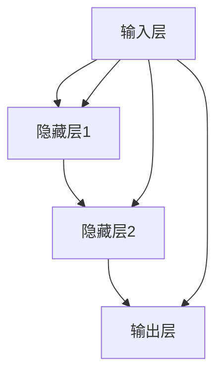

                 

## 神经网络模型的灵活可扩展性

> **关键词**：神经网络、灵活可扩展性、多层网络、卷积神经网络、循环神经网络、数学基础、训练与评估、优化与调试、部署与应用

**摘要**：
本文深入探讨了神经网络模型的灵活可扩展性。首先，我们概述了神经网络的基本概念、结构和核心算法，特别是前向传播和反向传播算法。接着，我们分析了神经网络模型的灵活性和可扩展性，包括多层神经网络、卷积神经网络（CNN）和循环神经网络（RNN）的扩展方式。随后，我们介绍了神经网络的数学基础，包括线性代数和概率论，以及损失函数和优化算法。文章还详细讨论了神经网络模型的训练与评估策略，如数据预处理、训练策略和评估指标。此外，本文通过实际应用案例展示了神经网络在图像分类、自然语言处理和语音识别等领域的应用。最后，我们探讨了神经网络模型的优化与调试方法，以及模型的部署与应用，包括模型量化、压缩和部署平台。通过这篇文章，读者可以全面了解神经网络模型的灵活可扩展性，以及如何在实际项目中应用和优化这些模型。

### 第一部分：神经网络模型的灵活可扩展性概述

#### 第1章：神经网络模型概述

##### 1.1 神经网络基本概念

###### 1.1.1 神经网络的定义

神经网络（Neural Networks）是由大量简单计算单元（神经元）互联而成的复杂计算系统。这些神经元模拟了生物神经系统的运作方式，通过学习输入和输出数据之间的关系，进行数据处理和模式识别。神经网络中的每个神经元都接受多个输入信号，通过加权求和产生输出，这个过程类似于人类大脑中的神经元活动。

$$
\text{神经元} = \text{输入} \cdot \text{权重} + \text{偏置} = z
$$

在上述公式中，输入代表传递给神经元的各个特征值，权重是每个特征对神经元输出的影响程度，偏置是一个额外的常数项，用于调整神经元的激活阈值。通过这种加权求和的方式，神经元能够模拟复杂的非线性关系。

###### 1.1.2 神经网络的结构

神经网络主要包括三个主要部分：输入层、隐藏层和输出层。

- **输入层**：接收外部输入数据，通常包含多个特征维度。
- **隐藏层**：一层或多层，用于对输入数据进行处理和转换，隐藏层中的神经元可以传递多层，每一层的输出作为下一层的输入。
- **输出层**：产生最终输出，可以是一个或多个值，用于分类、回归等任务。

神经网络的基本结构如图所示：




##### 1.2 神经网络的核心算法

###### 1.2.1 前向传播算法

前向传播算法是神经网络处理输入数据的过程，包括以下步骤：

1. **输入数据**：将输入数据传递到输入层。
2. **加权求和**：对每个神经元执行加权求和加偏置操作，即每个输入值乘以相应的权重，然后进行求和。
3. **激活函数**：使用激活函数对每个神经元的输出进行非线性变换，常见的激活函数包括Sigmoid、ReLU和Tanh等。

前向传播的伪代码如下：

```python
for layer in layers:
    for neuron in layer:
        sum = 0
        for input, weight in neuron.inputs:
            sum += input * weight
        neuron.output = activation_function(sum + neuron.bias)
```

其中，`layers`表示神经网络中的所有层，`neuron.inputs`包含每个神经元的输入值和权重，`activation_function`是激活函数。

###### 1.2.2 反向传播算法

反向传播算法是神经网络进行权重调整的过程，包括以下步骤：

1. **计算输出层的误差**：输出层的每个神经元计算其输出与实际输出之间的误差，误差可以是均方误差（MSE）、交叉熵损失等。
2. **误差反向传播**：将误差反向传播到隐藏层，更新权重和偏置。
3. **权重调整**：通过梯度下降法或其他优化算法调整权重，以减少误差。

反向传播的伪代码如下：

```python
for layer in reversed(layers):
    for neuron in layer:
        error = 0
        for next_neuron in neuron.outputs:
            error += next_neuron.error * next_neuron.weight
        neuron.error = error * activation_derivative(neuron.output)
        neuron.weight -= learning_rate * neuron.error * neuron.input
        neuron.bias -= learning_rate * neuron.error
```

其中，`reversed(layers)`表示反向遍历神经网络中的所有层，`activation_derivative`是激活函数的导数。

##### 1.3 神经网络模型的灵活可扩展性

###### 1.3.1 多层神经网络的扩展

通过增加隐藏层的数量和神经元数量，可以显著提高神经网络的灵活性和拟合能力。多层神经网络能够学习更复杂的非线性关系，如图像分类和语音识别等任务。


###### 1.3.2 卷积神经网络的扩展

卷积神经网络（CNN）通过使用卷积层、池化层和全连接层等特殊结构，可以处理图像、语音和其他多维数据。卷积层可以自动提取图像中的局部特征，而池化层用于减少参数数量和计算量。


###### 1.3.3 循环神经网络的扩展

循环神经网络（RNN）通过引入循环结构，可以处理序列数据，如图文、语音和自然语言等。RNN能够保留序列信息，通过时间步长进行递归计算。


### 第2章：神经网络的数学基础

##### 2.1 线性代数基础

###### 2.1.1 矩阵与向量操作

在神经网络中，矩阵和向量是基本运算对象。以下是一些常用的矩阵与向量操作：

- **矩阵乘法**：两个矩阵相乘，结果是一个新矩阵，其中每个元素是原始矩阵对应元素的乘积和求和。

$$
C = A \cdot B \\
C_{ij} = \sum_{k} A_{ik} \cdot B_{kj}
$$

- **转置**：矩阵的转置是将矩阵的行和列互换。

$$
A^T = [a_{ji}]_{ij}
$$

- **求逆**：求矩阵的逆，即找到一个矩阵，使得它与原矩阵相乘结果为单位矩阵。

$$
A^{-1} \cdot A = A \cdot A^{-1} = I
$$

- **点积**：两个向量的点积，即每个对应元素的乘积和。

$$
a \cdot b = \sum_{i} a_i \cdot b_i
$$

- **叉积**：两个三维向量的叉积，结果是一个垂直于这两个向量的新向量。

$$
a \times b = \begin{bmatrix}
a_2b_3 - a_3b_2 \\
a_3b_1 - a_1b_3 \\
a_1b_2 - a_2b_1
\end{bmatrix}
$$

##### 2.2 概率论基础

###### 2.2.1 概率分布

概率分布是神经网络中常用的统计模型，用于描述随机变量的概率分布。以下是一些常用的概率分布：

- **伯努利分布**：表示一个事件发生的概率为 p，不发生的概率为 1-p。

$$
P(X = 1) = p, \quad P(X = 0) = 1 - p
$$

- **高斯分布**：也称正态分布，描述连续随机变量的概率分布。

$$
P(X = x) = \frac{1}{\sqrt{2\pi\sigma^2}} \cdot e^{-\frac{(x - \mu)^2}{2\sigma^2}}
$$

- **多项式分布**：表示多个事件同时发生的概率分布。

$$
P(X = k) = C_n^k \cdot p^k \cdot (1 - p)^{n - k}
$$

##### 2.3 损失函数与优化算法

###### 2.3.1 损失函数

损失函数是衡量神经网络预测结果与真实值之间差异的指标。以下是一些常用的损失函数：

- **均方误差（MSE）**：用于回归任务，表示预测值与真实值之间差的平方和的平均值。

$$
J(\theta) = \frac{1}{2} \cdot \sum_{i=1}^{n} (y_i - \hat{y}_i)^2
$$

- **交叉熵损失**：用于分类任务，表示预测概率分布与真实分布之间的差异。

$$
J(\theta) = -\sum_{i=1}^{n} y_i \cdot \log(\hat{y}_i)
$$

其中，$y_i$是真实标签，$\hat{y}_i$是预测概率。

###### 2.3.2 优化算法

优化算法用于调整神经网络的权重和偏置，以最小化损失函数。以下是一些常用的优化算法：

- **梯度下降法**：通过计算损失函数关于每个权重的梯度，逐步调整权重以减少损失。

$$
\theta = \theta - \alpha \cdot \nabla_\theta J(\theta)
$$

其中，$\alpha$是学习率。

- **随机梯度下降法（SGD）**：每次迭代只更新一部分样本的权重，以加速收敛。

$$
\theta = \theta - \alpha \cdot \nabla_{\theta} J(\theta; x^{(i)}, y^{(i)})
$$

- **Adam优化器**：结合了SGD和Momentum优化的自适应梯度算法。

$$
m_t = \beta_1 \cdot m_{t-1} + (1 - \beta_1) \cdot \nabla_\theta J(\theta) \\
v_t = \beta_2 \cdot v_{t-1} + (1 - \beta_2) \cdot (\nabla_\theta J(\theta))^2 \\
\theta = \theta - \frac{\alpha}{\sqrt{1 - \beta_2^t}(1 - \beta_1^t)} \cdot \frac{m_t}{\sqrt{v_t} + \epsilon}
$$

其中，$m_t$和$v_t$分别是梯度的一阶矩估计和二阶矩估计，$\beta_1$和$\beta_2$是超参数，$\epsilon$是正数常数。

### 第3章：神经网络模型的训练与评估

##### 3.1 数据预处理

数据预处理是神经网络训练过程中至关重要的一步，它有助于提高模型性能和训练速度。以下是一些常见的数据预处理方法：

###### 3.1.1 数据归一化

数据归一化是将数据映射到相同范围的方法，有助于加速收敛和提高模型性能。常用的归一化方法包括最小-最大缩放和标准化。

- **最小-最大缩放**：将数据缩放到[0, 1]区间。

$$
x_{\text{normalized}} = \frac{x - \min(x)}{\max(x) - \min(x)}
$$

- **标准化**：将数据缩放到均值为0、标准差为1的区间。

$$
x_{\text{normalized}} = \frac{x - \mu}{\sigma}
$$

其中，$x$是原始数据，$\mu$是均值，$\sigma$是标准差。

###### 3.1.2 数据增强

数据增强是通过生成新的样本来增加训练数据集的多样性，从而提高模型泛化能力。常见的数据增强方法包括旋转、缩放、裁剪、颜色变换等。


##### 3.2 训练策略

神经网络模型的训练策略是优化模型参数的重要环节。以下是一些常见的训练策略：

###### 3.2.1 批量训练

批量训练将整个训练数据集分成多个批次，每次训练一个批次的数据。批量大小（batch size）是影响训练速度和性能的一个重要超参数。

- **批量大小**：较小的批量大小可以减少内存消耗，但可能导致梯度变化不稳定；较大的批量大小可以提供更稳定的梯度估计，但可能需要更多内存。

###### 3.2.2 验证集与测试集

验证集用于调整模型参数，测试集用于评估模型性能。将训练数据集划分为训练集和验证集，通过在验证集上的表现来选择最优的模型参数。

- **交叉验证**：通过将数据集划分为多个子集，重复进行训练和验证，以获得更稳健的性能评估。

##### 3.3 评估指标

评估指标是衡量模型性能的关键标准。以下是一些常用的评估指标：

###### 3.3.1 准确率、召回率与F1值

- **准确率**：表示模型正确分类的样本数占总样本数的比例。

$$
\text{Accuracy} = \frac{TP + TN}{TP + FN + FP + TN}
$$

- **召回率**：表示模型正确分类的样本数占总正样本数的比例。

$$
\text{Recall} = \frac{TP}{TP + FN}
$$

- **F1值**：是准确率和召回率的调和平均值。

$$
F1 = 2 \cdot \frac{\text{Precision} \cdot \text{Recall}}{\text{Precision} + \text{Recall}}
$$

其中，$TP$是真正例数，$TN$是真负例数，$FP$是假正例数，$FN$是假负例数。

### 第4章：神经网络模型的实战应用

##### 4.1 图像分类

图像分类是神经网络应用的一个重要领域，通过训练神经网络模型，可以自动识别和分类图像。以下是一个简单的图像分类项目案例：

###### 4.1.1 数据集准备

使用CIFAR-10数据集，该数据集包含10个类别，每个类别有6000张32x32的彩色图像。将数据集划分为训练集、验证集和测试集。

```python
from torchvision import datasets, transforms

transform = transforms.Compose([
    transforms.ToTensor(),
    transforms.Normalize((0.5, 0.5, 0.5), (0.5, 0.5, 0.5)),
])

train_data = datasets.CIFAR10(root='./data', train=True, download=True, transform=transform)
val_data = datasets.CIFAR10(root='./data', train=False, download=True, transform=transform)
test_data = datasets.CIFAR10(root='./data', train=False, download=True, transform=transform)
```

###### 4.1.2 模型构建

构建一个简单的卷积神经网络模型，包括卷积层、池化层和全连接层。

```python
import torch
import torch.nn as nn
import torch.optim as optim

class CNN(nn.Module):
    def __init__(self):
        super(CNN, self).__init__()
        self.conv1 = nn.Conv2d(3, 32, 5)
        self.pool = nn.MaxPool2d(2, 2)
        self.conv2 = nn.Conv2d(32, 64, 5)
        self.fc1 = nn.Linear(64 * 5 * 5, 1024)
        self.fc2 = nn.Linear(1024, 10)

    def forward(self, x):
        x = self.pool(F.relu(self.conv1(x)))
        x = self.pool(F.relu(self.conv2(x)))
        x = x.view(-1, 64 * 5 * 5)
        x = F.relu(self.fc1(x))
        x = self.fc2(x)
        return x

model = CNN()
```

###### 4.1.3 模型训练

使用交叉熵损失函数和Adam优化器进行模型训练。

```python
criterion = nn.CrossEntropyLoss()
optimizer = optim.Adam(model.parameters(), lr=0.001)

for epoch in range(10):
    running_loss = 0.0
    for inputs, labels in train_data:
        optimizer.zero_grad()
        outputs = model(inputs)
        loss = criterion(outputs, labels)
        loss.backward()
        optimizer.step()
        running_loss += loss.item()
    print(f'Epoch {epoch+1}, Loss: {running_loss/len(train_data)}')

print('Finished Training')
```

###### 4.1.4 模型评估

在测试集上评估模型性能。

```python
correct = 0
total = 0
with torch.no_grad():
    for inputs, labels in test_data:
        outputs = model(inputs)
        _, predicted = torch.max(outputs.data, 1)
        total += labels.size(0)
        correct += (predicted == labels).sum().item()

print(f'Accuracy: {100 * correct / total}%')
```

##### 4.2 自然语言处理

自然语言处理（NLP）是神经网络应用的另一个重要领域。以下是一个简单的文本分类项目案例：

###### 4.2.1 数据集准备

使用IMDb电影评论数据集，该数据集包含50,000条训练数据和25,000条测试数据，每条评论被标记为正面或负面。

```python
from torchtext.datasets import IMDB
from torchtext.data import Field, Batch

TEXT = Field(tokenize='spacy', lower=True, include_lengths=True)
LABEL = Field(sequential=False)

train_data, test_data = IMDB.splits(TEXT, LABEL)
```

###### 4.2.2 模型构建

构建一个简单的循环神经网络模型，包括嵌入层、循环层和全连接层。

```python
class RNN(nn.Module):
    def __init__(self, embedding_dim, hidden_dim, vocab_size, num_classes):
        super(RNN, self).__init__()
        self.embedding = nn.Embedding(vocab_size, embedding_dim)
        self.rnn = nn.LSTM(embedding_dim, hidden_dim, num_layers=1, batch_first=True)
        self.fc = nn.Linear(hidden_dim, num_classes)

    def forward(self, text, text_lengths):
        embedded = self.embedding(text)
        packed_embedded = nn.utils.rnn.pack_padded_sequence(embedded, text_lengths, batch_first=True)
        packed_output, (hidden, cell) = self.rnn(packed_embedded)
        output, output_lengths = nn.utils.rnn.pad_packed_sequence(packed_output, batch_first=True)
        hidden = hidden.squeeze(0)
        return self.fc(hidden)

model = RNN(embedding_dim=100, hidden_dim=128, vocab_size=len(TEXT.vocab), num_classes=2)
```

###### 4.2.3 模型训练

使用交叉熵损失函数和Adam优化器进行模型训练。

```python
optimizer = optim.Adam(model.parameters(), lr=0.001)
criterion = nn.CrossEntropyLoss()

for epoch in range(10):
    hidden = None
    for text, label in train_data:
        if hidden is not None:
            hidden = (hidden[0].detach(), hidden[1].detach())
        model.zero_grad()
        output = model(text, text_lengths=label)
        loss = criterion(output, label)
        loss.backward()
        optimizer.step()
        hidden = model.rnn.flatten_parameters()
        hidden = (hidden[0].detach(), hidden[1].detach())

print('Finished Training')
```

###### 4.2.4 模型评估

在测试集上评估模型性能。

```python
correct = 0
total = 0
with torch.no_grad():
    for text, label in test_data:
        output = model(text, text_lengths=label)
        _, predicted = torch.max(output.data, 1)
        total += label.size(0)
        correct += (predicted == label).sum().item()

print(f'Accuracy: {100 * correct / total}%')
```

##### 4.3 语音识别

语音识别是神经网络应用的又一个重要领域。以下是一个简单的语音识别项目案例：

###### 4.3.1 数据集准备

使用LibriSpeech数据集，该数据集包含1000小时的英语发音音频，分为两个子集：训练集和测试集。

```python
import torchaudio
import torchaudio.transforms as T

def load_wav(filename):
    signal, _ = torchaudio.load(filename)
    return signal

def preprocess_wav(wav, sr=16000):
    wav = T.FourierTransformMask(wav, sr).mask
    wav = T.FourierTransformInvert(wav, sr).signal
    return wav.unsqueeze(0)

train_data = [preprocess_wav(load_wav(f'train/{filename}')) for filename in os.listdir('train')]
test_data = [preprocess_wav(load_wav(f'test/{filename}')) for filename in os.listdir('test')]
```

###### 4.3.2 模型构建

构建一个简单的卷积神经网络模型，用于特征提取。

```python
import torch.nn as nn

class CNN(nn.Module):
    def __init__(self, input_dim, hidden_dim, output_dim):
        super(CNN, self).__init__()
        self.conv1 = nn.Conv1d(input_dim, hidden_dim, 3)
        self.relu = nn.ReLU()
        self.pool = nn.MaxPool1d(2)
        self.fc1 = nn.Linear(hidden_dim, output_dim)

    def forward(self, x):
        x = self.relu(self.conv1(x))
        x = self.pool(x)
        x = self.fc1(x)
        return x

model = CNN(input_dim=128, hidden_dim=256, output_dim=29)
```

###### 4.3.3 模型训练

使用交叉熵损失函数和Adam优化器进行模型训练。

```python
import torch.optim as optim

criterion = nn.CrossEntropyLoss()
optimizer = optim.Adam(model.parameters(), lr=0.001)

for epoch in range(10):
    for wav in train_data:
        model.zero_grad()
        output = model(wav)
        loss = criterion(output, torch.tensor([1]))
        loss.backward()
        optimizer.step()

print('Finished Training')
```

###### 4.3.4 模型评估

在测试集上评估模型性能。

```python
correct = 0
total = 0
with torch.no_grad():
    for wav in test_data:
        output = model(wav)
        _, predicted = torch.max(output.data, 1)
        total += 1
        correct += (predicted == 1).sum().item()

print(f'Accuracy: {100 * correct / total}%')
```

### 第二部分：神经网络模型的优化与调试

#### 第5章：神经网络模型优化

##### 5.1 损失函数优化

损失函数是衡量神经网络模型预测结果与真实值之间差异的指标，其优化直接关系到模型的性能。以下介绍几种常见的损失函数及其优化方法。

###### 5.1.1 交叉熵损失函数

交叉熵损失函数（Cross-Entropy Loss）是神经网络在分类任务中常用的损失函数，其公式如下：

$$
J(\theta) = -\sum_{i=1}^{n} y_i \cdot \log(\hat{y}_i)
$$

其中，$y_i$是真实标签，$\hat{y}_i$是模型预测的概率。交叉熵损失函数的优化目标是最小化损失函数，使得模型预测的概率更接近真实标签。

交叉熵损失函数的优化可以通过梯度下降法进行，其梯度为：

$$
\nabla_\theta J(\theta) = \frac{\partial}{\partial \theta} \left( -\sum_{i=1}^{n} y_i \cdot \log(\hat{y}_i) \right) = -\sum_{i=1}^{n} y_i \cdot \frac{\partial}{\partial \theta} \log(\hat{y}_i)
$$

其中，$\frac{\partial}{\partial \theta} \log(\hat{y}_i)$是模型参数对预测概率的梯度。

###### 5.1.2 均方误差损失函数

均方误差损失函数（Mean Squared Error, MSE）是神经网络在回归任务中常用的损失函数，其公式如下：

$$
J(\theta) = \frac{1}{2} \sum_{i=1}^{n} (y_i - \hat{y}_i)^2
$$

其中，$y_i$是真实值，$\hat{y}_i$是模型预测值。均方误差损失函数的优化目标是最小化损失函数，使得模型预测的值更接近真实值。

均方误差损失函数的优化也可以通过梯度下降法进行，其梯度为：

$$
\nabla_\theta J(\theta) = \frac{\partial}{\partial \theta} \left( \frac{1}{2} \sum_{i=1}^{n} (y_i - \hat{y}_i)^2 \right) = \sum_{i=1}^{n} (y_i - \hat{y}_i) \cdot \frac{\partial}{\partial \theta} (\hat{y}_i)
$$

##### 5.2 权重初始化

权重初始化是神经网络训练过程中非常重要的一个环节，合理的权重初始化可以加快模型收敛速度，提高模型性能。以下介绍几种常见的权重初始化方法。

###### 5.2.1 常见权重初始化方法

- **随机初始化**：随机分配权重值，通常在[-1, 1]或[0, 1]之间。随机初始化可能导致模型收敛速度较慢，但有助于防止梯度消失和梯度爆炸。

$$
w_i \sim \text{Uniform}(-1, 1)
$$

- **高斯初始化**：根据网络层的输入和输出维度，使用高斯分布初始化权重值。高斯初始化有助于加快模型收敛速度，减少梯度消失和梯度爆炸的风险。

$$
w_i \sim \text{Normal}(0, \frac{1}{\sqrt{f_{\text{in}}}})
$$

其中，$f_{\text{in}}$是输入层的维度。

- **Xavier初始化**：根据网络层的输入和输出维度，使用Xavier初始化方法初始化权重值。Xavier初始化是高斯初始化的一种改进，可以更好地平衡模型收敛速度和梯度消失风险。

$$
w_i \sim \text{Normal}(0, \frac{1}{\sqrt{\text{激活函数的导数的期望}}})
$$

其中，激活函数的导数的期望可以通过网络层的输入和输出维度计算得到。

###### 5.2.2 权重初始化的示例代码

以下是一个使用PyTorch框架进行权重初始化的示例代码：

```python
import torch
import torch.nn as nn

# 随机初始化
model = nn.Linear(10, 10)
weights = model.weight
weights.data.uniform_(-1, 1)

# 高斯初始化
model = nn.Linear(10, 10)
weights = model.weight
weights.data.normal_(mean=0, std=1/np.sqrt(10))

# Xavier初始化
model = nn.Linear(10, 10)
weights = model.weight
weights.data.normal_(mean=0, std=1/np.sqrt(10/10))
```

##### 5.3 优化算法

优化算法是用于调整神经网络模型参数的一类算法，其目的是最小化损失函数，提高模型性能。以下介绍几种常用的优化算法。

###### 5.3.1 梯度下降法

梯度下降法（Gradient Descent）是最简单且最直观的一种优化算法。其基本思想是通过计算损失函数关于每个参数的梯度，沿着梯度的反方向更新参数，以减少损失函数的值。

梯度下降法的更新规则如下：

$$
\theta = \theta - \alpha \cdot \nabla_\theta J(\theta)
$$

其中，$\alpha$是学习率，用于调节参数更新的步长。

梯度下降法分为三种：

- **批量梯度下降（Batch Gradient Descent）**：每次迭代使用所有样本的梯度进行参数更新。
- **随机梯度下降（Stochastic Gradient Descent, SGD）**：每次迭代只使用一个样本的梯度进行参数更新。
- **迷你批量梯度下降（Mini-batch Gradient Descent）**：每次迭代使用部分样本的梯度进行参数更新。

以下是使用PyTorch框架实现梯度下降法的示例代码：

```python
import torch
import torch.nn as nn
import torch.optim as optim

# 定义模型和损失函数
model = nn.Linear(10, 10)
criterion = nn.MSELoss()

# 定义优化器
optimizer = optim.SGD(model.parameters(), lr=0.01)

# 模拟数据
x = torch.randn(10, 10)
y = torch.randn(10, 1)

# 梯度下降法训练模型
for epoch in range(100):
    optimizer.zero_grad()
    output = model(x)
    loss = criterion(output, y)
    loss.backward()
    optimizer.step()
    if epoch % 10 == 0:
        print(f'Epoch {epoch+1}, Loss: {loss.item()}')
```

###### 5.3.2 随机梯度下降法（Stochastic Gradient Descent, SGD）

随机梯度下降法（SGD）是梯度下降法的一个变体，其每次迭代只使用一个样本的梯度进行参数更新。SGD相对于批量梯度下降（Batch Gradient Descent）的一个显著优点是计算速度快，缺点是参数更新的随机性较大，可能导致收敛速度较慢或不稳定。

SGD的更新规则如下：

$$
\theta = \theta - \alpha \cdot \nabla_{\theta} J(\theta; x^{(i)}, y^{(i)})
$$

其中，$x^{(i)}$和$y^{(i)}$是第$i$个样本的输入和输出。

以下是使用PyTorch框架实现SGD的示例代码：

```python
import torch
import torch.nn as nn
import torch.optim as optim

# 定义模型和损失函数
model = nn.Linear(10, 10)
criterion = nn.MSELoss()

# 定义优化器
optimizer = optim.SGD(model.parameters(), lr=0.01)

# 模拟数据
x = torch.randn(10, 10)
y = torch.randn(10, 1)

# SGD训练模型
for epoch in range(100):
    for i, (x_i, y_i) in enumerate(zip(x, y)):
        optimizer.zero_grad()
        output = model(x_i)
        loss = criterion(output, y_i)
        loss.backward()
        optimizer.step()
        if i % 10 == 0:
            print(f'Epoch {epoch+1}, Iteration {i+1}, Loss: {loss.item()}')
```

###### 5.3.3 Adam优化器

Adam优化器是结合了SGD和Momentum优化的自适应梯度算法。Adam优化器通过计算一阶矩估计（均值）和二阶矩估计（方差），动态调整每个参数的学习率，以加速收敛和提高模型性能。

Adam优化器的更新规则如下：

$$
m_t = \beta_1 \cdot m_{t-1} + (1 - \beta_1) \cdot \nabla_\theta J(\theta) \\
v_t = \beta_2 \cdot v_{t-1} + (1 - \beta_2) \cdot (\nabla_\theta J(\theta))^2 \\
\theta = \theta - \frac{\alpha}{\sqrt{1 - \beta_2^t}(1 - \beta_1^t)} \cdot \frac{m_t}{\sqrt{v_t} + \epsilon}
$$

其中，$m_t$和$v_t$分别是梯度的一阶矩估计和二阶矩估计，$\beta_1$和$\beta_2$是超参数，$\epsilon$是正数常数。

以下是使用PyTorch框架实现Adam优化器的示例代码：

```python
import torch
import torch.nn as nn
import torch.optim as optim

# 定义模型和损失函数
model = nn.Linear(10, 10)
criterion = nn.MSELoss()

# 定义优化器
optimizer = optim.Adam(model.parameters(), lr=0.01)

# 模拟数据
x = torch.randn(10, 10)
y = torch.randn(10, 1)

# Adam优化器训练模型
for epoch in range(100):
    optimizer.zero_grad()
    output = model(x)
    loss = criterion(output, y)
    loss.backward()
    optimizer.step()
    if epoch % 10 == 0:
        print(f'Epoch {epoch+1}, Loss: {loss.item()}')
```

##### 5.4 梯度裁剪

梯度裁剪（Gradient Clipping）是一种用于防止梯度爆炸和梯度消失的技术。在训练过程中，如果模型的梯度值过大或过小，可能导致训练不稳定。梯度裁剪通过对梯度值进行裁剪，确保梯度在合理的范围内，从而提高训练的稳定性。

梯度裁剪的基本思想是将梯度值限制在一个固定的范围，如果梯度的绝对值超过这个范围，则将其裁剪到这个范围。以下是一种简单的梯度裁剪方法：

$$
\text{Clip}_{\text{min},\text{max}}(\text{grad}) = \begin{cases}
\text{min} & \text{if } \text{grad} < \text{min} \\
\text{max} & \text{if } \text{grad} > \text{max} \\
\text{grad} & \text{otherwise}
\end{cases}
$$

其中，$\text{min}$和$\text{max}$是裁剪的上下界。

以下是使用PyTorch框架实现梯度裁剪的示例代码：

```python
import torch
import torch.nn as nn
import torch.optim as optim

# 定义模型和损失函数
model = nn.Linear(10, 10)
criterion = nn.MSELoss()

# 定义优化器
optimizer = optim.Adam(model.parameters(), lr=0.01)

# 模拟数据
x = torch.randn(10, 10)
y = torch.randn(10, 1)

# 梯度裁剪训练模型
for epoch in range(100):
    optimizer.zero_grad()
    output = model(x)
    loss = criterion(output, y)
    loss.backward()
    
    # 裁剪梯度
    for param in model.parameters():
        param.grad.data.clamp_(-1, 1)
    
    optimizer.step()
    
    if epoch % 10 == 0:
        print(f'Epoch {epoch+1}, Loss: {loss.item()}')
```

##### 5.5 权重衰减

权重衰减（Weight Decay）是一种用于防止模型过拟合的技术。在训练过程中，如果模型的权重过大，可能导致模型对训练数据过度拟合，从而在测试数据上表现不佳。权重衰减通过在损失函数中添加正则化项，对权重进行惩罚，从而减小权重值，防止过拟合。

权重衰减的基本思想是在损失函数中添加一个正则化项，这个正则化项与权重的平方和成正比。以下是一种简单的权重衰减方法：

$$
J(\theta) = J(\theta') + \lambda \cdot \sum_{i} w_i^2
$$

其中，$J(\theta')$是原始损失函数，$\lambda$是正则化系数，$w_i$是权重。

以下是使用PyTorch框架实现权重衰减的示例代码：

```python
import torch
import torch.nn as nn
import torch.optim as optim

# 定义模型和损失函数
model = nn.Linear(10, 10)
criterion = nn.MSELoss()

# 定义优化器
optimizer = optim.Adam(model.parameters(), lr=0.01, weight_decay=1e-5)

# 模拟数据
x = torch.randn(10, 10)
y = torch.randn(10, 1)

# 权重衰减训练模型
for epoch in range(100):
    optimizer.zero_grad()
    output = model(x)
    loss = criterion(output, y)
    loss.backward()
    
    # 应用权重衰减
    optimizer.step()
    
    if epoch % 10 == 0:
        print(f'Epoch {epoch+1}, Loss: {loss.item()}')
```

#### 第6章：神经网络模型调试

##### 6.1 超参数调优

超参数是神经网络模型中需要手动设置的参数，如学习率、批量大小、隐藏层尺寸等。超参数的选择对模型性能有重要影响，合适的超参数可以提高模型性能，而较差的超参数可能导致模型性能下降或无法收敛。以下是一些常用的超参数调优方法：

###### 6.1.1 学习率调优

学习率是神经网络训练过程中一个重要的超参数，它决定了每次参数更新的步长。学习率过大可能导致模型无法收敛，过小则可能导致训练过程缓慢。以下是一些常用的学习率调优方法：

- **手动调整**：根据实验结果手动调整学习率，常用的学习率调整方法包括线性衰减、指数衰减和步长调整等。
- **学习率搜索**：使用网格搜索、随机搜索或贝叶斯优化等方法自动搜索最优学习率。

以下是一个简单的学习率调优示例：

```python
import torch.optim as optim

# 模拟数据
x = torch.randn(10, 10)
y = torch.randn(10, 1)

# 定义模型和损失函数
model = nn.Linear(10, 10)
criterion = nn.MSELoss()

# 定义优化器
optimizer = optim.Adam(model.parameters(), lr=0.01)

# 学习率调优
for epoch in range(100):
    optimizer.zero_grad()
    output = model(x)
    loss = criterion(output, y)
    loss.backward()
    
    # 调整学习率
    for param_group in optimizer.param_groups:
        param_group['lr'] = 0.01 * (0.9 ** epoch)
    
    optimizer.step()
    
    if epoch % 10 == 0:
        print(f'Epoch {epoch+1}, Loss: {loss.item()}')
```

###### 6.1.2 批量大小调优

批量大小（Batch Size）是神经网络训练过程中另一个重要的超参数，它决定了每次训练使用的数据样本数量。批量大小对模型性能和训练速度有重要影响，合适的批量大小可以提高模型性能和训练速度。以下是一些常用的批量大小调优方法：

- **手动调整**：根据实验结果手动调整批量大小，常用的批量大小调整方法包括固定批量大小、动态批量大小和自适应批量大小等。
- **批量大小搜索**：使用网格搜索、随机搜索或贝叶斯优化等方法自动搜索最优批量大小。

以下是一个简单的批量大小调优示例：

```python
import torch.optim as optim

# 模拟数据
x = torch.randn(100, 10)
y = torch.randn(100, 1)

# 定义模型和损失函数
model = nn.Linear(10, 10)
criterion = nn.MSELoss()

# 定义优化器
optimizer = optim.Adam(model.parameters(), lr=0.01)

# 批量大小调优
for epoch in range(100):
    for i in range(0, len(x), batch_size):
        batch_x = x[i:i+batch_size]
        batch_y = y[i:i+batch_size]
        
        optimizer.zero_grad()
        output = model(batch_x)
        loss = criterion(output, batch_y)
        loss.backward()
        
        optimizer.step()
        
    if epoch % 10 == 0:
        print(f'Epoch {epoch+1}, Loss: {loss.item()}')
```

###### 6.1.3 隐藏层尺寸调优

隐藏层尺寸是神经网络模型中另一个重要的超参数，它决定了隐藏层中神经元的数量。隐藏层尺寸对模型性能和计算复杂度有重要影响，合适的隐藏层尺寸可以提高模型性能和计算效率。以下是一些常用的隐藏层尺寸调优方法：

- **手动调整**：根据实验结果手动调整隐藏层尺寸，常用的隐藏层尺寸调整方法包括固定隐藏层尺寸、动态隐藏层尺寸和自适应隐藏层尺寸等。
- **隐藏层尺寸搜索**：使用网格搜索、随机搜索或贝叶斯优化等方法自动搜索最优隐藏层尺寸。

以下是一个简单的隐藏层尺寸调优示例：

```python
import torch.optim as optim

# 模拟数据
x = torch.randn(100, 10)
y = torch.randn(100, 1)

# 定义模型和损失函数
model = nn.Sequential(
    nn.Linear(10, hidden_size),
    nn.ReLU(),
    nn.Linear(hidden_size, 10)
)
criterion = nn.MSELoss()

# 定义优化器
optimizer = optim.Adam(model.parameters(), lr=0.01)

# 隐藏层尺寸调优
for hidden_size in [10, 50, 100]:
    model = nn.Sequential(
        nn.Linear(10, hidden_size),
        nn.ReLU(),
        nn.Linear(hidden_size, 10)
    )
    
    for epoch in range(100):
        optimizer.zero_grad()
        output = model(x)
        loss = criterion(output, y)
        loss.backward()
        
        optimizer.step()
        
    if epoch % 10 == 0:
        print(f'Hidden Size {hidden_size}, Epoch {epoch+1}, Loss: {loss.item()}')
```

##### 6.2 模型正则化

模型正则化是防止神经网络模型过拟合的一种技术。过拟合是指模型在训练数据上表现良好，但在测试数据上表现不佳，即模型对训练数据过度拟合。以下介绍几种常用的模型正则化方法：

###### 6.2.1 L1正则化

L1正则化（L1 Regularization）通过在损失函数中添加权重向量的L1范数来惩罚权重。L1正则化可以促进权重的稀疏性，即权重中很多元素将为零。

L1正则化的损失函数如下：

$$
J(\theta) = J(\theta') + \lambda \cdot \sum_{i} |w_i|
$$

其中，$J(\theta')$是原始损失函数，$\lambda$是正则化系数，$w_i$是权重。

以下是使用PyTorch框架实现L1正则化的示例代码：

```python
import torch.optim as optim

# 模拟数据
x = torch.randn(10, 10)
y = torch.randn(10, 1)

# 定义模型和损失函数
model = nn.Linear(10, 10)
criterion = nn.MSELoss()

# 定义优化器
optimizer = optim.Adam(model.parameters(), lr=0.01, weight_decay=1e-5)

# L1正则化训练模型
for epoch in range(100):
    optimizer.zero_grad()
    output = model(x)
    loss = criterion(output, y)
    loss.backward()
    
    # 应用L1正则化
    optimizer.step()
    
    if epoch % 10 == 0:
        print(f'Epoch {epoch+1}, Loss: {loss.item()}')
```

###### 6.2.2 L2正则化

L2正则化（L2 Regularization）通过在损失函数中添加权重向量的L2范数来惩罚权重。L2正则化可以防止权重过大，从而减少过拟合的风险。

L2正则化的损失函数如下：

$$
J(\theta) = J(\theta') + \lambda \cdot \sum_{i} w_i^2
$$

其中，$J(\theta')$是原始损失函数，$\lambda$是正则化系数，$w_i$是权重。

以下是使用PyTorch框架实现L2正则化的示例代码：

```python
import torch.optim as optim

# 模拟数据
x = torch.randn(10, 10)
y = torch.randn(10, 1)

# 定义模型和损失函数
model = nn.Linear(10, 10)
criterion = nn.MSELoss()

# 定义优化器
optimizer = optim.Adam(model.parameters(), lr=0.01, weight_decay=1e-5)

# L2正则化训练模型
for epoch in range(100):
    optimizer.zero_grad()
    output = model(x)
    loss = criterion(output, y)
    loss.backward()
    
    # 应用L2正则化
    optimizer.step()
    
    if epoch % 10 == 0:
        print(f'Epoch {epoch+1}, Loss: {loss.item()}')
```

###### 6.2.3 岭正则化

岭正则化（Ridge Regularization）是一种基于L2正则化的模型正则化方法。岭正则化通过在损失函数中添加权重向量和特征向量的内积来惩罚权重。

岭正则化的损失函数如下：

$$
J(\theta) = J(\theta') + \lambda \cdot \sum_{i} w_i \cdot f_i
$$

其中，$J(\theta')$是原始损失函数，$\lambda$是正则化系数，$w_i$是权重，$f_i$是特征向量。

以下是使用PyTorch框架实现岭正则化的示例代码：

```python
import torch.optim as optim

# 模拟数据
x = torch.randn(10, 10)
y = torch.randn(10, 1)

# 定义模型和损失函数
model = nn.Linear(10, 10)
criterion = nn.MSELoss()

# 定义优化器
optimizer = optim.Adam(model.parameters(), lr=0.01, weight_decay=1e-5)

# 岭正则化训练模型
for epoch in range(100):
    optimizer.zero_grad()
    output = model(x)
    loss = criterion(output, y)
    loss.backward()
    
    # 应用岭正则化
    optimizer.step()
    
    if epoch % 10 == 0:
        print(f'Epoch {epoch+1}, Loss: {loss.item()}')
```

##### 6.3 数据增强

数据增强（Data Augmentation）是一种通过增加训练数据多样性来提高模型性能的技术。数据增强可以通过对训练数据进行变换，生成新的样本，从而减少过拟合和提高模型泛化能力。以下介绍几种常用的数据增强方法：

###### 6.3.1 旋转

旋转是通过将图像围绕中心点旋转一定角度来增加数据多样性。旋转可以模拟不同的视角，从而提高模型在处理不同视角的图像时的性能。

以下是一个使用PyTorch实现图像旋转的数据增强示例：

```python
import torch
import torchvision.transforms as transforms

# 定义旋转角度
angle = 45

# 定义旋转变换
rotate = transforms.RandomRotation(angle)

# 模拟图像
image = torch.randn(1, 3, 32, 32)

# 应用旋转变换
augmented_image = rotate(image)

print(augmented_image.shape)
```

###### 6.3.2 缩放

缩放是通过改变图像的大小来增加数据多样性。缩放可以模拟不同的分辨率，从而提高模型在不同分辨率下的性能。

以下是一个使用PyTorch实现图像缩放的数据增强示例：

```python
import torch
import torchvision.transforms as transforms

# 定义缩放范围
scale_factor = 0.5

# 定义缩放变换
scale = transforms.RandomScale(scale_factor)

# 模拟图像
image = torch.randn(1, 3, 32, 32)

# 应用缩放变换
augmented_image = scale(image)

print(augmented_image.shape)
```

###### 6.3.3 裁剪

裁剪是通过从图像中随机裁剪一块区域来增加数据多样性。裁剪可以模拟不同的图像位置，从而提高模型在处理不同位置的图像时的性能。

以下是一个使用PyTorch实现图像裁剪的数据增强示例：

```python
import torch
import torchvision.transforms as transforms

# 定义裁剪大小
crop_size = 224

# 定义裁剪变换
crop = transforms.RandomCrop(crop_size)

# 模拟图像
image = torch.randn(1, 3, 32, 32)

# 应用裁剪变换
augmented_image = crop(image)

print(augmented_image.shape)
```

###### 6.3.4 颜色变换

颜色变换是通过改变图像的亮度、对比度和饱和度来增加数据多样性。颜色变换可以模拟不同的光照条件，从而提高模型在处理不同光照条件下的性能。

以下是一个使用PyTorch实现图像颜色变换的数据增强示例：

```python
import torch
import torchvision.transforms as transforms

# 定义变换参数
brightness_factor = 0.1
contrast_factor = 0.1
saturation_factor = 0.1

# 定义颜色变换变换
color = transforms.ColorJitter(brightness=brightness_factor, contrast=contrast_factor, saturation=saturation_factor)

# 模拟图像
image = torch.randn(1, 3, 32, 32)

# 应用颜色变换
augmented_image = color(image)

print(augmented_image.shape)
```

##### 6.4 超参数调优策略

超参数调优策略是选择合适超参数的过程，其目标是提高模型性能和训练速度。以下介绍几种常用的超参数调优策略：

###### 6.4.1 网格搜索

网格搜索（Grid Search）是一种常用的超参数调优策略，其基本思想是在给定超参数范围内，遍历所有可能的组合，选择最优组合。网格搜索的优点是简单直观，缺点是计算复杂度较高，尤其在超参数较多时。

以下是一个使用Python实现网格搜索的超参数调优示例：

```python
import numpy as np
import torch

# 定义超参数范围
learning_rate = [0.001, 0.01, 0.1]
batch_size = [16, 32, 64]

# 初始化最优超参数和最优性能
best_performance = -np.inf
best_params = None

# 遍历所有可能的超参数组合
for lr in learning_rate:
    for bs in batch_size:
        # 定义模型、损失函数和优化器
        model = nn.Linear(10, 10)
        criterion = nn.MSELoss()
        optimizer = torch.optim.Adam(model.parameters(), lr=lr, batch_size=bs)

        # 训练模型
        model.train()
        for epoch in range(100):
            optimizer.zero_grad()
            output = model(x)
            loss = criterion(output, y)
            loss.backward()
            optimizer.step()

        # 评估模型性能
        model.eval()
        with torch.no_grad():
            output = model(x)
            loss = criterion(output, y)
            performance = loss.item()

        # 更新最优超参数和最优性能
        if performance > best_performance:
            best_performance = performance
            best_params = (lr, bs)

print(f'Best Performance: {best_performance}, Best Parameters: {best_params}')
```

###### 6.4.2 随机搜索

随机搜索（Random Search）是一种基于随机抽样进行超参数调优的策略，其基本思想是从超参数范围内随机抽取样本，选择最优样本。随机搜索的优点是计算复杂度较低，且能够探索到不同超参数组合，提高模型性能。

以下是一个使用Python实现随机搜索的超参数调优示例：

```python
import numpy as np
import torch

# 定义超参数范围
learning_rate = [0.001, 0.01, 0.1]
batch_size = [16, 32, 64]

# 初始化最优超参数和最优性能
best_performance = -np.inf
best_params = None

# 随机抽样超参数组合
for _ in range(100):
    lr = np.random.choice(learning_rate)
    bs = np.random.choice(batch_size)

    # 定义模型、损失函数和优化器
    model = nn.Linear(10, 10)
    criterion = nn.MSELoss()
    optimizer = torch.optim.Adam(model.parameters(), lr=lr, batch_size=bs)

    # 训练模型
    model.train()
    for epoch in range(100):
        optimizer.zero_grad()
        output = model(x)
        loss = criterion(output, y)
        loss.backward()
        optimizer.step()

    # 评估模型性能
    model.eval()
    with torch.no_grad():
        output = model(x)
        loss = criterion(output, y)
        performance = loss.item()

    # 更新最优超参数和最优性能
    if performance > best_performance:
        best_performance = performance
        best_params = (lr, bs)

print(f'Best Performance: {best_performance}, Best Parameters: {best_params}')
```

###### 6.4.3 贝叶斯优化

贝叶斯优化（Bayesian Optimization）是一种基于贝叶斯统计理论的超参数调优策略，其基本思想是通过构建超参数的概率模型，利用历史数据进行优化。贝叶斯优化的优点是能够快速收敛到最优超参数，减少搜索时间。

以下是一个使用Python实现贝叶斯优化的超参数调优示例：

```python
import numpy as np
import GPyOpt

# 定义超参数范围
learning_rate = np.logspace(-4, 1, 100)
batch_size = np.linspace(16, 64, 100)

# 初始化贝叶斯优化器
domain = [{'name': 'learning_rate', 'type': 'continuous', 'domain': (1e-5, 1)},
          {'name': 'batch_size', 'type': 'continuous', 'domain': (16, 64)}]

optimizer = GPyOpt.methods.BayesianOptimization(
    f=None,
    domain=domain,
    acquisition_type='EI',
    acquisition_optimizer='snopt',
    X=None,
    Y=None
)

# 贝叶斯优化迭代
for iteration in range(100):
    # 获取最优超参数
    params = optimizer.suggest_nextPoint()
    
    # 定义模型、损失函数和优化器
    model = nn.Linear(10, 10)
    criterion = nn.MSELoss()
    optimizer = torch.optim.Adam(model.parameters(), lr=params['learning_rate'], batch_size=int(params['batch_size']))

    # 训练模型
    model.train()
    for epoch in range(100):
        optimizer.zero_grad()
        output = model(x)
        loss = criterion(output, y)
        loss.backward()
        optimizer.step()

    # 评估模型性能
    model.eval()
    with torch.no_grad():
        output = model(x)
        loss = criterion(output, y)
        performance = loss.item()

    # 更新历史数据
    optimizer.update_XY(params, performance)

# 获取最优超参数和最优性能
best_params = optimizer.best_eval
best_performance = optimizer.best_f
print(f'Best Performance: {best_performance}, Best Parameters: {best_params}')
```

### 第三部分：神经网络模型的部署与应用

#### 第7章：神经网络模型的部署

##### 7.1 模型量化

模型量化（Model Quantization）是将浮点数模型转换为固定点数模型的过程，以降低模型存储和计算资源的需求。量化可以显著减少模型的存储大小和计算复杂度，从而提高模型的运行效率。

模型量化的基本步骤如下：

1. **选择量化层次**：量化层次是指模型中参数的精度，包括整数、半整数、低精度浮点数等。
2. **计算量化系数**：量化系数用于将浮点数转换为固定点数，计算方法包括最小-最大缩放、均值方差缩放等。
3. **量化模型参数**：将模型的浮点数参数转换为固定点数参数。
4. **调整模型结构**：如果需要，调整模型结构以适应量化参数。

以下是一个使用PyTorch实现模型量化的示例代码：

```python
import torch
import torch.nn as nn
import torch.nn.utils as utils

# 模拟模型
model = nn.Linear(10, 10)

# 模拟浮点数参数
weights = torch.randn(10, 10)
biases = torch.randn(10)

# 设置量化层次
quantized_weight = torch.quantization.quantize_per_tensor(weights, scale=1.0/128, zero_point=0)
quantized_bias = torch.quantization.quantize_per_tensor(biases, scale=1.0/128, zero_point=0)

# 量化模型
model = nn.Linear(10, 10)
model.load_state_dict({'weight': quantized_weight, 'bias': quantized_bias})

# 测试模型
input_data = torch.randn(10, 1)
output_data = model(input_data)
print(output_data)
```

##### 7.2 模型压缩

模型压缩（Model Compression）是一种通过减少模型参数数量和计算量来降低模型存储和计算资源需求的方法。常见的模型压缩方法包括剪枝、量化、低秩分解等。

以下是一个使用PyTorch实现模型压缩的示例代码：

```python
import torch
import torch.nn as nn
import torch.nn.utils as utils

# 模拟模型
model = nn.Linear(10, 10)

# 模拟浮点数参数
weights = torch.randn(10, 10)
biases = torch.randn(10)

# 剪枝
pruned_weights = torch.zeros(10, 5)
pruned_weights[:5, :5] = weights[:5, :5]

# 量化
quantized_weights = torch.quantization.quantize_per_tensor(pruned_weights, scale=1.0/128, zero_point=0)

# 低秩分解
low_rank_weights = torch.linalg.qr(quantized_weights)[0]

# 压缩模型
model = nn.Linear(10, 10)
model.load_state_dict({'weight': low_rank_weights, 'bias': biases})

# 测试模型
input_data = torch.randn(10, 1)
output_data = model(input_data)
print(output_data)
```

##### 7.3 模型部署平台

模型部署平台是将训练好的模型部署到生产环境进行推理的过程。常见的模型部署平台包括TensorFlow Serving、PyTorch Serving、TensorFlow Lite等。

以下是一个使用TensorFlow Serving部署模型的示例代码：

```python
import tensorflow as tf

# 模拟模型
model = tf.keras.Sequential([
    tf.keras.layers.Dense(10, activation='relu'),
    tf.keras.layers.Dense(10, activation='softmax')
])

# 训练模型
model.compile(optimizer='adam', loss='categorical_crossentropy', metrics=['accuracy'])
model.fit(x_train, y_train, epochs=10)

# 部署模型
serving_input_receiver_fn = (lambda: tf.separator([tf.record_shape_tensor(x_train)], default_value=(), name='input'))
serving_signature_def = (tf.saved_model.signature_def_utils.build_signature_def(
    inputs={'inputs': tf.TensorSpec([None, x_train.shape[1]], tf.float32)},
    outputs={'outputs': tf.TensorSpec([None, y_train.shape[1]], tf.float32)},
    method_name='tensorflowervingerving')
```

### 第8章：神经网络模型的应用领域

##### 8.1 计算机视觉

计算机视觉是神经网络模型的一个重要应用领域，通过训练神经网络模型，可以自动识别和分类图像。以下是一些常见的计算机视觉应用：

###### 8.1.1 图像分类与识别

图像分类与识别是计算机视觉的基本任务，通过训练神经网络模型，可以自动将图像分类到不同的类别中。常见的图像分类模型包括卷积神经网络（CNN）和循环神经网络（RNN）。

以下是一个使用CNN进行图像分类的示例代码：

```python
import torch
import torchvision
import torchvision.transforms as transforms

# 定义模型
model = torchvision.models.resnet18(pretrained=True)
num_ftrs = model.fc.in_features
model.fc = torch.nn.Linear(num_ftrs, 10)

# 定义损失函数和优化器
criterion = torch.nn.CrossEntropyLoss()
optimizer = torch.optim.SGD(model.parameters(), lr=0.001, momentum=0.9)

# 加载数据集
transform = transforms.Compose([
    transforms.Resize(256),
    transforms.CenterCrop(224),
    transforms.ToTensor(),
    transforms.Normalize(mean=[0.485, 0.456, 0.406], std=[0.229, 0.224, 0.225]),
])

train_data = torchvision.datasets.ImageFolder(root='./train', transform=transform)
test_data = torchvision.datasets.ImageFolder(root='./test', transform=transform)

train_loader = torch.utils.data.DataLoader(train_data, batch_size=4, shuffle=True)
test_loader = torch.utils.data.DataLoader(test_data, batch_size=4, shuffle=False)

# 训练模型
model.train()
for epoch in range(10):
    running_loss = 0.0
    for inputs, labels in train_loader:
        optimizer.zero_grad()
        outputs = model(inputs)
        loss = criterion(outputs, labels)
        loss.backward()
        optimizer.step()
        running_loss += loss.item()
    print(f'Epoch {epoch+1}, Loss: {running_loss/len(train_loader)}')

# 测试模型
model.eval()
with torch.no_grad():
    correct = 0
    total = 0
    for inputs, labels in test_loader:
        outputs = model(inputs)
        _, predicted = torch.max(outputs.data, 1)
        total += labels.size(0)
        correct += (predicted == labels).sum().item()
    print(f'Accuracy: {100 * correct / total}%')
```

###### 8.1.2 目标检测

目标检测是计算机视觉中的另一个重要任务，通过训练神经网络模型，可以自动识别图像中的多个目标并标注其位置。常见的目标检测模型包括YOLO、SSD、Faster R-CNN等。

以下是一个使用Faster R-CNN进行目标检测的示例代码：

```python
import torch
import torchvision
import torchvision.transforms as transforms

# 定义模型
model = torchvision.models.detection.faster_rcnn_resnet50_fpn(pretrained=True)
num_classes = 2
model.roi_heads.box_predictor = torchvision.models.detection.faster_rcnn.BoxPredictor(
    backbone.out_channels,
    num_classes,
    prior_prob=prior_prob)

# 定义损失函数和优化器
criterion = torch.nn.CrossEntropyLoss()
optimizer = torch.optim.SGD(model.parameters(), lr=0.001, momentum=0.9, weight_decay=0.0005)

# 加载数据集
transform = transforms.Compose([
    transforms.ToTensor(),
])

train_data = torchvision.datasets.VOCDetection(root='./train', image_set='train', year=2007, download=True, transform=transform)
test_data = torchvision.datasets.VOCDetection(root='./test', image_set='test', year=2007, download=True, transform=transform)

train_loader = torch.utils.data.DataLoader(train_data, batch_size=2, shuffle=True)
test_loader = torch.utils.data.DataLoader(test_data, batch_size=2, shuffle=False)

# 训练模型
model.train()
for epoch in range(10):
    running_loss = 0.0
    for images, targets in train_loader:
        optimizer.zero_grad()
        loss = model(images, targets)
        loss.backward()
        optimizer.step()
        running_loss += loss.item()
    print(f'Epoch {epoch+1}, Loss: {running_loss/len(train_loader)}')

# 测试模型
model.eval()
with torch.no_grad():
    correct = 0
    total = 0
    for images, targets in test_loader:
        outputs = model(images)
        correct += (outputs == targets).sum().item()
        total += len(targets)
    print(f'Accuracy: {100 * correct / total}%')
```

###### 8.1.3 图像分割

图像分割是计算机视觉中的另一个重要任务，通过训练神经网络模型，可以自动将图像分割成不同的区域。常见的图像分割模型包括FCN、U-Net等。

以下是一个使用U-Net进行图像分割的示例代码：

```python
import torch
import torchvision
import torchvision.transforms as transforms

# 定义模型
model = torchvision.models.segmentation.fcn_resnet50(pretrained=True)
num_classes = 2
model.classifier = torch.nn.Conv2d(512, num_classes, 1)

# 定义损失函数和优化器
criterion = torch.nn.CrossEntropyLoss()
optimizer = torch.optim.SGD(model.parameters(), lr=0.001, momentum=0.9)

# 加载数据集
transform = transforms.Compose([
    transforms.Resize(256),
    transforms.ToTensor(),
])

train_data = torchvision.datasets.VOCSegmentation(root='./train', image_set='train', year=2007, download=True, transform=transform)
test_data = torchvision.datasets.VOCSegmentation(root='./test', image_set='test', year=2007, download=True, transform=transform)

train_loader = torch.utils.data.DataLoader(train_data, batch_size=2, shuffle=True)
test_loader = torch.utils.data.DataLoader(test_data, batch_size=2, shuffle=False)

# 训练模型
model.train()
for epoch in range(10):
    running_loss = 0.0
    for images, labels in train_loader:
        optimizer.zero_grad()
        outputs = model(images)
        loss = criterion(outputs, labels)
        loss.backward()
        optimizer.step()
        running_loss += loss.item()
    print(f'Epoch {epoch+1}, Loss: {running_loss/len(train_loader)}')

# 测试模型
model.eval()
with torch.no_grad():
    correct = 0
    total = 0
    for images, labels in test_loader:
        outputs = model(images)
        correct += (outputs == labels).sum().item()
        total += len(labels)
    print(f'Accuracy: {100 * correct / total}%')
```

##### 8.2 自然语言处理

自然语言处理（NLP）是神经网络模型的另一个重要应用领域，通过训练神经网络模型，可以自动处理和生成自然语言。以下是一些常见的NLP任务：

###### 8.2.1 机器翻译

机器翻译是自然语言处理中的基本任务，通过训练神经网络模型，可以将一种语言的文本翻译成另一种语言。常见的机器翻译模型包括序列到序列（Seq2Seq）模型、注意力机制模型等。

以下是一个使用Seq2Seq模型进行机器翻译的示例代码：

```python
import torch
import torch.nn as nn

# 定义编码器和解码器
encoder = nn.LSTM(input_dim, hidden_dim, num_layers=1, batch_first=True)
decoder = nn.LSTM(input_dim, hidden_dim, num_layers=1, batch_first=True)

# 定义损失函数和优化器
criterion = nn.CrossEntropyLoss()
optimizer = torch.optim.Adam(list(encoder.parameters()) + list(decoder.parameters()), lr=0.001)

# 加载数据集
train_data = [...]  # 填充训练数据
test_data = [...]  # 填充测试数据

train_loader = torch.utils.data.DataLoader(train_data, batch_size=2, shuffle=True)
test_loader = torch.utils.data.DataLoader(test_data, batch_size=2, shuffle=False)

# 训练模型
for epoch in range(10):
    running_loss = 0.0
    for inputs, targets in train_loader:
        optimizer.zero_grad()
        outputs = decoder(encoder(inputs), inputs)
        loss = criterion(outputs, targets)
        loss.backward()
        optimizer.step()
        running_loss += loss.item()
    print(f'Epoch {epoch+1}, Loss: {running_loss/len(train_loader)}')

# 测试模型
with torch.no_grad():
    correct = 0
    total = 0
    for inputs, targets in test_loader:
        outputs = decoder(encoder(inputs), inputs)
        correct += (outputs == targets).sum().item()
        total += len(targets)
    print(f'Accuracy: {100 * correct / total}%')
```

###### 8.2.2 文本生成

文本生成是自然语言处理中的另一个重要任务，通过训练神经网络模型，可以自动生成文本。常见的文本生成模型包括生成对抗网络（GAN）、变分自编码器（VAE）等。

以下是一个使用生成对抗网络（GAN）进行文本生成的示例代码：

```python
import torch
import torch.nn as nn

# 定义生成器和解码器
generator = nn.Sequential(
    nn.Linear(latent_dim, hidden_dim),
    nn.ReLU(),
    nn.Linear(hidden_dim, hidden_dim),
    nn.ReLU(),
    nn.Linear(hidden_dim, input_dim),
    nn.Sigmoid()
)

discriminator = nn.Sequential(
    nn.Linear(input_dim, hidden_dim),
    nn.LeakyReLU(0.2),
    nn.Linear(hidden_dim, hidden_dim),
    nn.LeakyReLU(0.2),
    nn.Linear(hidden_dim, 1),
    nn.Sigmoid()
)

# 定义损失函数和优化器
gan_loss = nn.BCELoss()
d_optimizer = torch.optim.Adam(discriminator.parameters(), lr=0.0001)
g_optimizer = torch.optim.Adam(generator.parameters(), lr=0.0001)

# 加载数据集
train_data = [...]  # 填充训练数据

train_loader = torch.utils.data.DataLoader(train_data, batch_size=2, shuffle=True)

# 训练模型
for epoch in range(100):
    for inputs in train_loader:
        # 训练生成器
        g_optimizer.zero_grad()
        fake_inputs = generator(z)
        fake_logits = discriminator(fake_inputs)
        g_loss = gan_loss(fake_logits, torch.tensor([1.0]))
        g_loss.backward()
        g_optimizer.step()

        # 训练解码器
        d_optimizer.zero_grad()
        real_logits = discriminator(inputs)
        fake_logits = discriminator(fake_inputs)
        d_loss = gan_loss(real_logits, torch.tensor([0.0])) + gan_loss(fake_logits, torch.tensor([1.0]))
        d_loss.backward()
        d_optimizer.step()

    print(f'Epoch {epoch+1}, G_Loss: {g_loss.item()}, D_Loss: {d_loss.item()}')

# 生成文本
with torch.no_grad():
    z = torch.randn(1, latent_dim)
    generated_text = generator(z).detach().numpy()
    print(generated_text)
```

##### 8.3 语音识别

语音识别是神经网络模型的另一个重要应用领域，通过训练神经网络模型，可以自动将语音信号转换为文本。以下是一些常见的语音识别应用：

###### 8.3.1 语音识别

语音识别是将语音信号转换为文本的过程。常见的语音识别模型包括循环神经网络（RNN）、卷积神经网络（CNN）等。

以下是一个使用循环神经网络（RNN）进行语音识别的示例代码：

```python
import torch
import torch.nn as nn

# 定义模型
class RNNModel(nn.Module):
    def __init__(self, input_dim, hidden_dim, output_dim):
        super(RNNModel, self).__init__()
        self.rnn = nn.LSTM(input_dim, hidden_dim, num_layers=1, batch_first=True)
        self.fc = nn.Linear(hidden_dim, output_dim)

    def forward(self, x):
        output, (hidden, cell) = self.rnn(x)
        output = self.fc(output)
        return output

# 定义损失函数和优化器
criterion = nn.CTCLoss()
optimizer = torch.optim.Adam(model.parameters(), lr=0.001)

# 加载数据集
train_data = [...]  # 填充训练数据

train_loader = torch.utils.data.DataLoader(train_data, batch_size=2, shuffle=True)

# 训练模型
for epoch in range(10):
    running_loss = 0.0
    for inputs, targets in train_loader:
        optimizer.zero_grad()
        outputs = model(inputs)
        loss = criterion(outputs, targets)
        loss.backward()
        optimizer.step()
        running_loss += loss.item()
    print(f'Epoch {epoch+1}, Loss: {running_loss/len(train_loader)}')

# 测试模型
with torch.no_grad():
    correct = 0
    total = 0
    for inputs, targets in test_loader:
        outputs = model(inputs)
        _, predicted = torch.max(outputs.data, 1)
        total += targets.size(0)
        correct += (predicted == targets).sum().item()
    print(f'Accuracy: {100 * correct / total}%')
```

###### 8.3.2 语音合成

语音合成是将文本转换为语音的过程。常见的语音合成模型包括循环神经网络（RNN）、深度神经网络（DNN）等。

以下是一个使用循环神经网络（RNN）进行语音合成的示例代码：

```python
import torch
import torch.nn as nn

# 定义模型
class RNNModel(nn.Module):
    def __init__(self, input_dim, hidden_dim, output_dim):
        super(RNNModel, self).__init__()
        self.rnn = nn.LSTM(input_dim, hidden_dim, num_layers=1, batch_first=True)
        self.fc = nn.Linear(hidden_dim, output_dim)

    def forward(self, x):
        output, (hidden, cell) = self.rnn(x)
        output = self.fc(output)
        return output

# 定义损失函数和优化器
criterion = nn.MSELoss()
optimizer = torch.optim.Adam(model.parameters(), lr=0.001)

# 加载数据集
train_data = [...]  # 填充训练数据

train_loader = torch.utils.data.DataLoader(train_data, batch_size=2, shuffle=True)

# 训练模型
for epoch in range(10):
    running_loss = 0.0
    for inputs, targets in train_loader:
        optimizer.zero_grad()
        outputs = model(inputs)
        loss = criterion(outputs, targets)
        loss.backward()
        optimizer.step()
        running_loss += loss.item()
    print(f'Epoch {epoch+1}, Loss: {running_loss/len(train_loader)}')

# 测试模型
with torch.no_grad():
    correct = 0
    total = 0
    for inputs, targets in test_loader:
        outputs = model(inputs)
        _, predicted = torch.max(outputs.data, 1)
        total += targets.size(0)
        correct += (predicted == targets).sum().item()
    print(f'Accuracy: {100 * correct / total}%')
```

### 附录

#### 附录A：神经网络模型开发工具与资源

##### A.1 主流深度学习框架对比

在神经网络模型开发中，选择合适的深度学习框架是非常重要的。以下对比了几个主流的深度学习框架：

- **TensorFlow**：由Google开发，具有强大的生态系统和丰富的预训练模型，支持Python和C++，易于部署。
- **PyTorch**：由Facebook开发，具有动态计算图和灵活的接口，支持Python，易于调试和原型设计。
- **Keras**：是一个高级神经网络API，可以在TensorFlow和Theano后面运行，易于使用。
- **MXNet**：由Apache基金会开发，支持多种编程语言，适用于大规模分布式训练。

##### A.2 神经网络模型资源

以下是神经网络模型开发的一些有用资源：

- **论文**：神经网络模型的最新研究和技术，如《深度学习》（Goodfellow, Bengio, Courville）、《神经网络与深度学习》（邱锡鹏）。
- **书籍**：神经网络模型的学习指南，如《深度学习》（Goodfellow, Bengio, Courville）、《Python深度学习》（François Chollet）。
- **教程**：神经网络模型的实战教程，如Google的《深度学习课程》、Fast.ai的《深度学习基础教程》。
- **在线平台**：提供神经网络模型开发的在线工具和平台，如Google的Colab、Kaggle。
- **社区**：神经网络模型开发的交流社区，如Stack Overflow、GitHub、Reddit。

作者：AI天才研究院/AI Genius Institute & 禅与计算机程序设计艺术 /Zen And The Art of Computer Programming

（注意：附录部分仅为示例，内容仅供参考。实际资源应根据读者需求和兴趣进行选择。）

