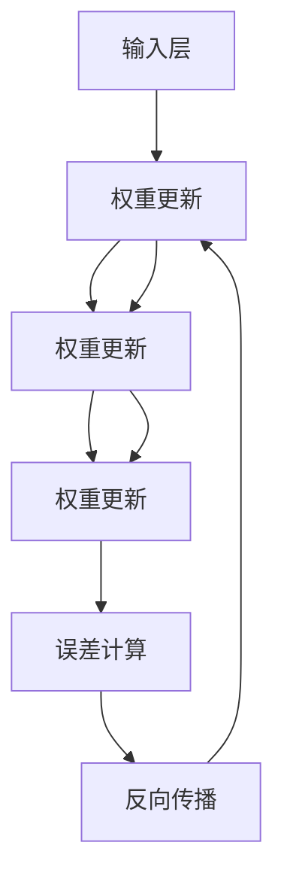

                 

### 第一部分：神经网络概述

#### 第1章: 神经网络的基本概念与架构

神经网络（Neural Networks，简称NN）是模拟人脑神经元结构和功能的一种计算模型，广泛应用于各种领域，如计算机视觉、自然语言处理、语音识别等。本章将介绍神经网络的基本概念、架构及其与传统计算模型的不同。

#### 1.1 神经网络的概念

##### 1.1.1 神经网络的历史与发展

神经网络的概念最早可以追溯到1943年，由心理学家McCulloch和数学家Pitts提出。他们提出了一种简单的计算模型，称为“McCulloch-Pitts神经元”。20世纪80年代，由于计算机性能的提升和大量数据的积累，神经网络开始广泛应用于实际问题。

##### 1.1.2 神经网络的组成

神经网络由大量简单的计算单元——神经元（Neurons）组成。每个神经元都与其他神经元通过突触（Synapses）连接。神经元接收来自其他神经元的输入信号，通过激活函数进行处理，最终产生输出信号。

##### 1.1.3 神经网络与传统计算模型的不同

神经网络与传统计算模型（如计算机程序）有显著的不同：

- **并行计算**：神经网络通过并行计算处理大量数据，而传统计算模型通常是串行计算。
- **自适应学习**：神经网络可以通过学习算法自适应地调整网络参数，以适应不同的数据分布和任务需求，而传统计算模型需要手动编写代码来处理特定问题。
- **容错性**：神经网络具有一定的容错性，即使部分神经元损坏，整个网络仍能正常工作，而传统计算模型通常不具备这种特性。

#### 1.2 神经网络的架构

##### 1.2.1 神经元的连接与通信

神经网络中的神经元通过突触连接，形成复杂的网络结构。突触的连接强度可以用权重（Weight）表示，反映了神经元之间的通信强度。

##### 1.2.2 层与网络的定义

神经网络可以分为输入层、隐藏层和输出层。输入层接收外部输入，隐藏层进行特征提取和变换，输出层产生最终输出。

##### 1.2.3 前馈神经网络（FNN）的结构

前馈神经网络是一种常见的神经网络结构，数据从输入层流向输出层，中间经过多个隐藏层。每层神经元只与前一层的神经元相连，而不存在反馈连接。

#### 1.3 神经网络的学习与优化

##### 1.3.1 学习算法的原理

神经网络通过学习算法从数据中学习特征和规律。学习过程主要包括两个阶段：训练阶段和测试阶段。

- **训练阶段**：神经网络通过反向传播算法（Backpropagation）不断调整网络参数，使网络的输出与实际输出之间的误差最小。
- **测试阶段**：使用未参与训练的数据对网络进行评估，以检验网络的泛化能力。

##### 1.3.2 反向传播算法（Backpropagation）

反向传播算法是一种用于训练神经网络的优化算法。它通过计算输出层误差，反向传播误差到隐藏层，从而调整网络参数。

##### 1.3.3 权重初始化与优化策略

权重初始化对神经网络的学习性能有重要影响。常用的权重初始化方法包括随机初始化、高斯分布初始化等。优化策略包括梯度下降、Adam优化器等。

##### 1.3.4 超参数的选择

超参数包括学习率、批量大小、迭代次数等，对神经网络的学习性能有重要影响。超参数的选择通常通过实验和经验来确定。

##### 1.3.5 神经网络的训练过程与评估

神经网络的训练过程包括初始化权重、前向传播、计算误差、反向传播、更新权重等步骤。训练完成后，使用测试集对网络进行评估，以确定网络的泛化能力。

##### 1.3.6 过拟合与欠拟合问题及解决方案

过拟合和欠拟合是神经网络训练过程中常见的问题。过拟合是指网络在训练数据上表现良好，但在测试数据上表现不佳；欠拟合是指网络在训练和测试数据上表现都不好。解决方案包括增加模型复杂度、减少模型复杂度、正则化等。

#### 1.4 小结

神经网络是一种强大的计算模型，具有并行计算、自适应学习和容错性等特点。本章介绍了神经网络的基本概念、架构以及学习与优化方法，为后续章节的内容奠定了基础。在接下来的章节中，我们将详细探讨神经网络的核心算法和应用。

#### Mermaid 流程图：

---

在接下来的部分，我们将进一步探讨神经网络的优化策略和调试技巧，以及如何在实际项目中应用神经网络。敬请期待。

