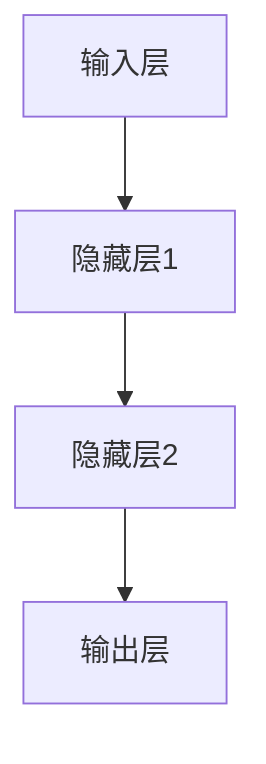

                 

# 神经网络：自然语言处理的新突破

> 关键词：神经网络、自然语言处理、深度学习、序列模型、注意力机制、语言模型

> 摘要：
自然语言处理（NLP）是人工智能领域的重要分支，近年来，随着深度学习的兴起，神经网络在NLP中的应用取得了显著的突破。本文将介绍神经网络的基础知识、数学基础、核心算法，以及它们在自然语言处理中的实际应用，旨在帮助读者深入理解神经网络在NLP中的关键作用和未来发展趋势。

----------------------------------------------------------------

## 《神经网络：自然语言处理的新突破》目录大纲

1. **第一部分：神经网络基础与自然语言处理**
    1.1 神经网络的起源与发展
    1.2 神经网络的数学基础
    1.3 神经网络核心算法

2. **第二部分：自然语言处理基础**
    2.1 语言模型
    2.2 词嵌入技术
    2.3 序列模型与注意力机制

3. **第三部分：神经网络在自然语言处理中的应用**
    3.1 文本分类与情感分析
    3.2 命名实体识别与关系抽取
    3.3 机器翻译与问答系统

4. **第四部分：神经网络在自然语言处理中的挑战与未来**
    4.1 挑战与局限
    4.2 未来展望

5. **附录**
    5.1 神经网络相关资源与工具
    5.2 数学公式与代码示例

----------------------------------------------------------------

### 1.1 神经网络的起源与发展

神经网络（Neural Networks，NN）是一种模仿生物神经系统结构和功能的计算模型，最早由心理学家McCulloch和数学家Pitts在1943年提出。神经网络的灵感来自于人脑的神经元网络，每个神经元都与其他神经元通过突触连接，通过传递电信号来处理信息。

#### 1.1.1 神经元模型与神经网络结构

神经元的模型通常由三个主要部分组成：输入层、隐藏层和输出层。每个神经元接收来自输入层的信号，通过加权连接传递给隐藏层和输出层。在隐藏层中，信息经过非线性变换后传递到输出层，生成最终的输出。

神经网络的结构可以用Mermaid流程图表示如下：

#### 1.1.2 神经网络的发展历程

神经网络的研究经历了多个发展阶段：

1. **1940年代**：神经网络的早期研究主要集中在人工神经元的建模和简单学习算法的开发。

2. **1950年代**：Hebb提出了Hebbian学习规则，这是神经网络学习的基础。

3. **1980年代**：Rumelhart、Hinton和Williams提出了反向传播算法（Backpropagation Algorithm），这一算法使神经网络能够有效地学习复杂函数，大大推动了神经网络的发展。

4. **1990年代**：Hinton提出了深度信念网络（Deep Belief Networks，DBN），为深度学习的发展打下了基础。

5. **2006年**：Hinton等人提出了深度置信网络（Deep Belief Network，DBN），进一步推动了深度学习的发展。

6. **2012年**：AlexNet在ImageNet竞赛中取得了突破性的成绩，标志着深度学习时代的到来。

7. **至今**：深度学习在计算机视觉、自然语言处理等领域取得了显著的成果，成为人工智能研究的重要方向。

#### 1.1.3 机器学习与深度学习

机器学习（Machine Learning，ML）是一种通过数据训练模型来预测或决策的方法，主要包括监督学习、无监督学习和强化学习。神经网络是机器学习的一个子领域，它可以用于分类、回归、聚类等多种任务。

深度学习（Deep Learning，DL）是机器学习的一个分支，它使用多层神经网络来学习数据的深层特征。深度学习在图像识别、语音识别、自然语言处理等领域取得了显著的突破。

### 1.2 机器学习与深度学习

机器学习是一种通过训练模型来学习数据规律和模式的方法，包括监督学习、无监督学习和强化学习等。深度学习是机器学习的一个子领域，它通过多层神经网络来学习数据的深层特征。

#### 1.2.1 机器学习的分类

1. **监督学习**：有监督的学习方法，训练数据带有标签，模型通过学习这些标签来预测未知数据的标签。
   - **分类问题**：将输入数据分为预定义的类别。
   - **回归问题**：预测输入数据的连续值输出。

2. **无监督学习**：没有标签的数据，模型通过探索数据的内在结构来发现规律。
   - **聚类问题**：将相似的数据点分为不同的集群。
   - **降维问题**：减少数据维度，同时保留数据的结构。

3. **强化学习**：通过与环境的交互来学习最优策略，以最大化长期奖励。
   - **Q学习**：通过预测每个动作的未来回报来学习策略。
   - **深度强化学习**：结合深度学习和强化学习，用于解决更复杂的任务。

#### 1.2.2 深度学习的优势与挑战

深度学习具有以下几个优势：

1. **强大的特征学习能力**：能够自动提取数据的深层特征，无需人工特征工程。
2. **适用于大规模数据**：能够处理海量数据，并从中学习出更复杂的模式。
3. **广泛的适用性**：在图像识别、自然语言处理、语音识别等多个领域取得了显著的成果。

然而，深度学习也存在一些挑战：

1. **计算资源消耗**：训练深度学习模型需要大量的计算资源和时间。
2. **解释性不足**：深度学习模型的内部工作机制较为复杂，难以解释。
3. **数据需求和偏见**：深度学习模型对数据的需求较高，且可能引入数据偏见。

### 1.3 主流神经网络架构

在自然语言处理领域，以下几种神经网络架构较为常用：

1. **卷积神经网络（CNN）**：主要用于图像处理，但在文本分类等任务中也表现出色。
2. **循环神经网络（RNN）**：擅长处理序列数据，如时间序列分析和语言模型。
3. **长短期记忆网络（LSTM）**：RNN的变体，能够更好地记住长序列信息。
4. **变换器（Transformer）**：基于注意力机制的神经网络架构，在自然语言处理任务中取得了很好的效果。

### 1.4 神经网络基础与自然语言处理的联系

神经网络在自然语言处理中的应用主要得益于它们强大的特征提取能力和处理序列数据的能力。自然语言处理中的许多任务都可以看作是序列分类或序列标注问题，而神经网络能够有效地学习序列中的模式。

神经网络与自然语言处理的关键联系体现在以下几个方面：

1. **词嵌入**：将单词映射到高维向量空间，捕捉单词的语义信息。
2. **序列模型**：如循环神经网络（RNN）和长短期记忆网络（LSTM），用于处理序列数据。
3. **注意力机制**：在处理序列数据时，动态地分配注意力到序列的不同部分，提高模型的性能。

接下来，我们将深入探讨神经网络的数学基础，包括线性代数、概率论和信息论，以及它们在神经网络中的应用。

----------------------------------------------------------------

### 1.2 神经网络的数学基础

神经网络的数学基础涵盖了线性代数、概率论和信息论等数学工具。这些工具在神经网络的设计、训练和优化中起着至关重要的作用。

#### 2.1 线性代数基础

线性代数是神经网络的核心数学工具，主要用于处理矩阵和向量的运算。

##### 2.1.1 矩阵与向量运算

1. **矩阵乘法**：两个矩阵相乘，结果是一个新的矩阵。
   $$ C = AB $$

2. **向量内积**：两个向量的点积，结果是一个标量。
   $$ \vec{a} \cdot \vec{b} = a_1b_1 + a_2b_2 + \ldots + a_nb_n $$

3. **向量外积**：两个向量的叉积，结果是一个新的向量。
   $$ \vec{a} \times \vec{b} = (a_2b_3 - a_3b_2, a_3b_1 - a_1b_3, a_1b_2 - a_2b_1) $$

##### 2.1.2 梯度下降与优化算法

梯度下降是一种常用的优化算法，用于最小化损失函数。其基本原理是计算损失函数关于模型参数的梯度，并沿着梯度的反方向更新参数。

1. **梯度下降**：通过更新参数来最小化损失函数。
   $$ \theta_{t+1} = \theta_t - \alpha \nabla_\theta J(\theta_t) $$
   其中，$\theta$表示参数，$J$表示损失函数，$\alpha$表示学习率。

2. **动量**：增加梯度下降的稳定性，通过累积之前的梯度来更新参数。
   $$ \theta_{t+1} = \theta_t - \alpha \nabla_\theta J(\theta_t) + \beta \theta_{t-1} $$
   其中，$\beta$表示动量参数。

#### 2.2 概率论与信息论

概率论和信息论是神经网络中另一个重要的数学工具，用于处理不确定性问题和信息传递。

##### 2.2.1 概率分布函数

1. **伯努利分布**：二元概率分布，成功概率为$p$。
   $$ P(X = 1) = p, P(X = 0) = 1 - p $$

2. **二项分布**：在$n$次独立试验中成功的次数的概率分布。
   $$ P(X = k) = C_n^k p^k (1 - p)^{n - k} $$

3. **泊松分布**：单位时间内事件发生的次数的概率分布。
   $$ P(X = k) = \frac{\lambda^k e^{-\lambda}}{k!} $$

##### 2.2.2 信息熵与KL散度

1. **信息熵**：衡量随机变量不确定性大小的指标。
   $$ H(X) = -\sum_{x \in X} P(x) \log P(x) $$

2. **KL散度**：衡量两个概率分布差异的指标。
   $$ D_{KL}(P||Q) = \sum_{x} P(x) \log \frac{P(x)}{Q(x)} $$

#### 2.3 激活函数与正则化

激活函数和正则化是神经网络中常用的技术。

##### 2.3.1 激活函数的作用与选择

激活函数用于引入非线性特性，使神经网络能够学习非线性关系。

1. **Sigmoid函数**：
   $$ f(x) = \frac{1}{1 + e^{-x}} $$

2. **ReLU函数**：
   $$ f(x) = \max(0, x) $$

3. **Tanh函数**：
   $$ f(x) = \frac{e^x - e^{-x}}{e^x + e^{-x}} $$

##### 2.3.2 正则化技术的应用

正则化技术用于防止过拟合，提高模型的泛化能力。

1. **L1正则化**：在损失函数中添加L1范数。
   $$ J(\theta) = \frac{1}{2m} \sum_{i=1}^{m} (h_\theta(x^{(i)}) - y^{(i)})^2 + \lambda \sum_{j=1}^{n} |\theta_j| $$

2. **L2正则化**：在损失函数中添加L2范数。
   $$ J(\theta) = \frac{1}{2m} \sum_{i=1}^{m} (h_\theta(x^{(i)}) - y^{(i)})^2 + \lambda \sum_{j=1}^{n} \theta_j^2 $$

3. **Dropout**：在训练过程中随机丢弃部分神经元，降低模型的复杂度。

通过理解这些数学基础，我们可以更好地设计和优化神经网络，提高其在自然语言处理任务中的性能。

----------------------------------------------------------------

### 1.3 神经网络核心算法

神经网络的性能依赖于其核心算法的设计与实现。以下是神经网络中常用的核心算法，包括前馈神经网络、反向传播算法、激活函数与正则化技术。

#### 3.1 前馈神经网络

前馈神经网络（Feedforward Neural Network，FNN）是一种最常见的神经网络架构，其中数据从输入层流向输出层，中间不形成循环。前馈神经网络由多个层组成，包括输入层、隐藏层和输出层。输入层接收外部输入，隐藏层对输入进行加工处理，输出层生成最终的输出。

##### 3.1.1 前馈神经网络的原理

前馈神经网络的工作原理如下：

1. **初始化参数**：随机初始化网络的权重和偏置。
2. **前向传播**：将输入数据传递到网络中，计算每一层的输出。
3. **计算损失**：使用训练数据的标签，计算预测输出与真实标签之间的损失。
4. **反向传播**：计算损失关于网络参数的梯度，更新网络参数。
5. **重复步骤2-4**，直到达到训练目标或训练次数。

前向传播和反向传播是前馈神经网络训练过程中的两个关键步骤。

1. **前向传播**：输入数据通过网络的每一层，每一层的神经元使用加权连接计算输出。前向传播的数学表示如下：
   $$ z^{(l)} = \sum_{j} W^{(l)}_j a^{(l-1)}_j + b^{(l)} $$
   $$ a^{(l)} = \sigma(z^{(l)}) $$
   其中，$a^{(l)}$是第$l$层的输出，$z^{(l)}$是第$l$层的输入，$W^{(l)}$和$b^{(l)}$是权重和偏置，$\sigma$是激活函数。

2. **反向传播**：在反向传播过程中，计算损失函数关于网络参数的梯度，并更新网络参数。反向传播的数学表示如下：
   $$ \delta^{(l)} = \frac{\partial J}{\partial z^{(l)}} = \frac{\partial J}{\partial a^{(l)}} \odot \frac{\partial a^{(l)}}{\partial z^{(l)}} $$
   $$ \theta^{(l)} = \theta^{(l)} - \alpha \nabla_\theta J(\theta) $$
   其中，$\delta^{(l)}$是第$l$层的误差信号，$\nabla_\theta J(\theta)$是损失函数关于参数的梯度。

##### 3.1.2 前馈神经网络的设计与训练

前馈神经网络的设计和训练涉及以下步骤：

1. **选择网络结构**：确定输入层、隐藏层和输出层的神经元数量。
2. **初始化参数**：通常使用随机初始化，确保网络具有一定的随机性。
3. **激活函数选择**：根据任务需求选择合适的激活函数，如Sigmoid、ReLU或Tanh。
4. **损失函数选择**：根据任务需求选择合适的损失函数，如均方误差（MSE）或交叉熵损失。
5. **优化算法选择**：选择合适的优化算法，如梯度下降、Adam或RMSprop。
6. **训练过程**：使用训练数据对网络进行训练，不断更新网络参数，减小损失。

#### 3.2 反向传播算法

反向传播算法（Backpropagation Algorithm）是一种用于训练前馈神经网络的算法，它通过计算输出层的误差信号，反向传播到每一层，更新网络参数。

##### 3.2.1 反向传播算法的数学原理

反向传播算法的数学原理可以概括为以下步骤：

1. **计算输出层的误差信号**：
   $$ \delta^{(L)} = \frac{\partial J}{\partial z^{(L)}} = \frac{\partial J}{\partial a^{(L)}} \odot \frac{\partial a^{(L)}}{\partial z^{(L)}} $$
   其中，$J$是损失函数，$z^{(L)}$是输出层节点的输入，$a^{(L)}$是输出层节点的输出。

2. **计算隐藏层的误差信号**：
   $$ \delta^{(l)} = \frac{\partial J}{\partial z^{(l)}} = \frac{\partial J}{\partial a^{(l+1)}} \odot \frac{\partial a^{(l+1)}}{\partial z^{(l)}} \odot \frac{\partial z^{(l)}}{\partial a^{(l)}} $$
   其中，$\odot$表示元素-wise 乘法，$\frac{\partial J}{\partial a^{(l+1)}}$是输出层误差信号，$\frac{\partial a^{(l+1)}}{\partial z^{(l)}}$是激活函数的导数，$\frac{\partial z^{(l)}}{\partial a^{(l)}}$是前一层节点的误差信号。

3. **更新网络参数**：
   $$ \theta^{(l)} = \theta^{(l)} - \alpha \frac{\partial J}{\partial \theta^{(l)}} $$
   其中，$\theta^{(l)}$是网络参数，$\alpha$是学习率。

##### 3.2.2 反向传播算法的实现步骤

反向传播算法的实现步骤如下：

1. **前向传播**：将输入数据传递到网络中，计算每一层的输出和误差。
2. **计算输出层的误差信号**：使用输出层的误差信号计算$\delta^{(L)}$。
3. **反向传播**：从输出层开始，逐层计算隐藏层的误差信号$\delta^{(l)}$。
4. **更新网络参数**：使用误差信号和梯度更新网络参数。
5. **重复步骤1-4**，直到达到训练目标或训练次数。

#### 3.3 激活函数与正则化

激活函数和正则化是神经网络中常用的技术。

##### 3.3.1 激活函数的作用与选择

激活函数用于引入非线性特性，使神经网络能够学习非线性关系。常见的激活函数包括：

1. **Sigmoid函数**：
   $$ f(x) = \frac{1}{1 + e^{-x}} $$

2. **ReLU函数**：
   $$ f(x) = \max(0, x) $$

3. **Tanh函数**：
   $$ f(x) = \frac{e^x - e^{-x}}{e^x + e^{-x}} $$

选择合适的激活函数可以影响网络的训练速度和性能。

##### 3.3.2 正则化技术的应用

正则化技术用于防止过拟合，提高模型的泛化能力。常见的正则化技术包括：

1. **L1正则化**：
   $$ J(\theta) = \frac{1}{2m} \sum_{i=1}^{m} (h_\theta(x^{(i)}) - y^{(i)})^2 + \lambda \sum_{j=1}^{n} |\theta_j| $$

2. **L2正则化**：
   $$ J(\theta) = \frac{1}{2m} \sum_{i=1}^{m} (h_\theta(x^{(i)}) - y^{(i)})^2 + \lambda \sum_{j=1}^{n} \theta_j^2 $$

3. **Dropout**：
   Dropout是一种在训练过程中随机丢弃部分神经元的正则化方法，可以降低模型的复杂度。

通过选择合适的激活函数和正则化技术，可以提高神经网络的性能和泛化能力。

----------------------------------------------------------------

### 1.4 自然语言处理基础

自然语言处理（Natural Language Processing，NLP）是人工智能（Artificial Intelligence，AI）领域的一个重要分支，旨在使计算机能够理解、生成和处理人类语言。NLP的应用范围广泛，包括文本分类、情感分析、命名实体识别、机器翻译等。以下将介绍NLP的基础知识，包括语言模型、词嵌入技术、序列模型与注意力机制。

#### 4.1 语言模型

语言模型（Language Model，LM）是一种用于预测文本序列的概率模型，是NLP的核心技术之一。语言模型可以用于许多应用，如自动纠错、机器翻译、文本生成等。常见语言模型包括N-gram模型、统计语言模型、神经网络语言模型等。

##### 4.1.1 语言模型的基本概念

1. **N-gram模型**：N-gram模型是基于历史n个单词（或字符）的概率来预测下一个单词（或字符）。N-gram模型简单高效，但在长距离依赖问题上表现不佳。

2. **统计语言模型**：统计语言模型使用统计学方法来估计语言模型，如N-gram模型。它们通过分析大量文本数据来学习语言规律。

3. **神经网络语言模型**：神经网络语言模型使用深度学习模型来学习语言模式，如循环神经网络（RNN）、长短期记忆网络（LSTM）和变换器（Transformer）。神经网络语言模型能够更好地捕捉长距离依赖关系。

##### 4.1.2 语言模型的应用场景

语言模型广泛应用于以下场景：

1. **文本生成**：通过语言模型预测下一个单词或字符，生成新的文本内容。

2. **机器翻译**：使用语言模型来预测翻译结果，实现自动翻译。

3. **语音识别**：使用语言模型来预测语音信号的文本表示，提高语音识别的准确性。

4. **信息检索**：使用语言模型来评估文本之间的相似度，实现文档检索和推荐。

5. **问答系统**：使用语言模型来预测用户提问的答案，提高问答系统的性能。

#### 4.2 词嵌入技术

词嵌入（Word Embedding）是一种将单词映射到高维向量空间的方法，可以捕捉单词的语义和语法信息。词嵌入技术在NLP中具有重要应用，如文本分类、情感分析、机器翻译等。

##### 4.2.1 词嵌入的原理与实现

词嵌入的原理基于以下假设：

1. **相似性假设**：语义相似的单词在向量空间中应该靠近。

2. **分布假设**：单词在文本中的出现频率和位置可以反映其语义信息。

词嵌入的实现方法包括：

1. **基于频率的方法**：如TF-IDF，通过计算单词的频率和逆文档频率来生成词向量。

2. **基于矩阵分解的方法**：如Word2Vec和GloVe，通过矩阵分解技术来学习词向量。

3. **基于神经网络的方法**：如BERT和GPT，通过深度学习模型来学习词向量。

##### 4.2.2 词嵌入在自然语言处理中的应用

词嵌入在自然语言处理中具有广泛的应用，包括：

1. **文本分类**：使用词向量来表示文本，并通过机器学习模型进行分类。

2. **情感分析**：使用词向量来计算文本的语义表示，并通过分类模型进行情感分析。

3. **命名实体

