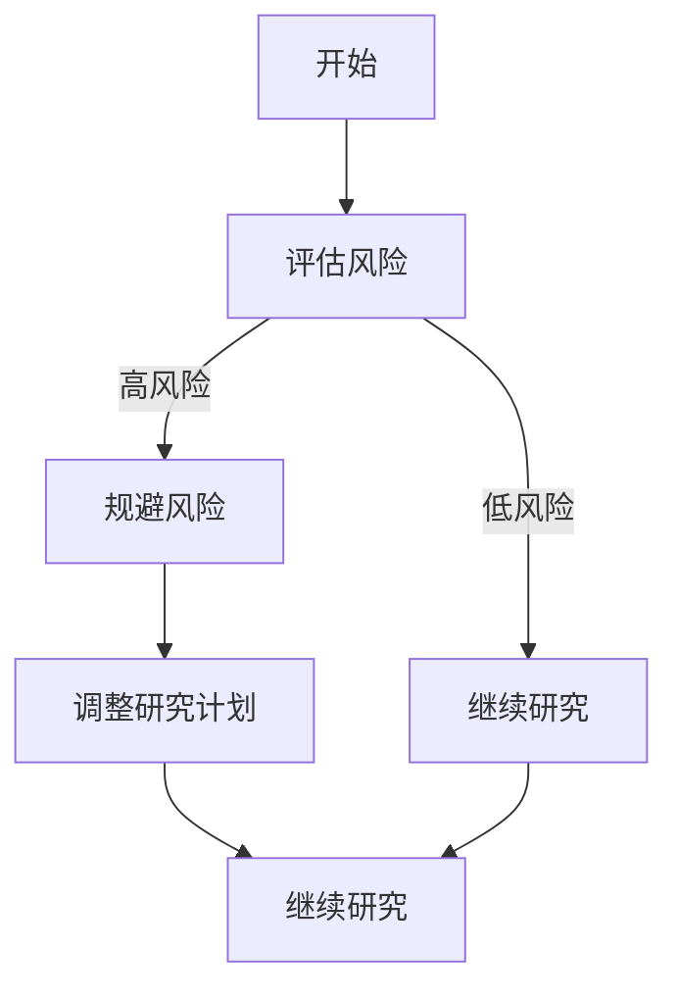
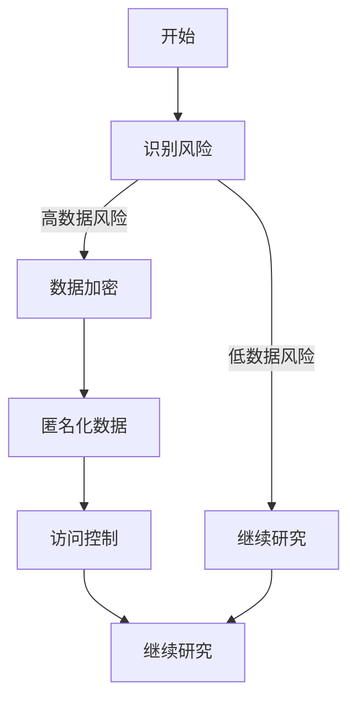
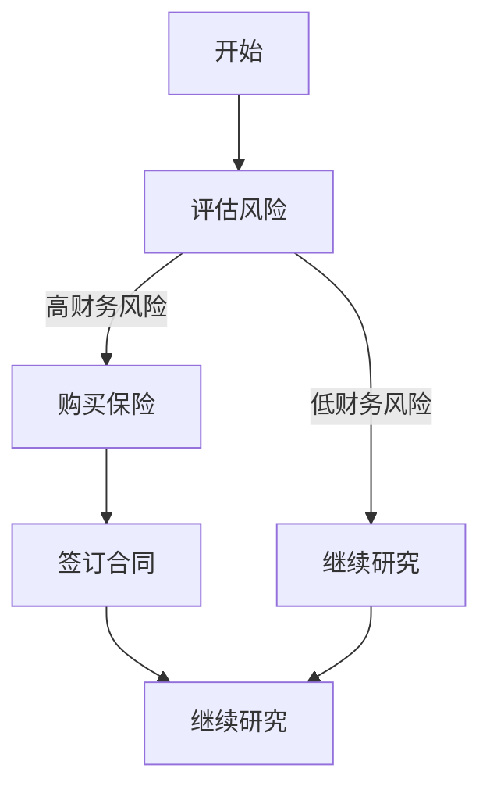
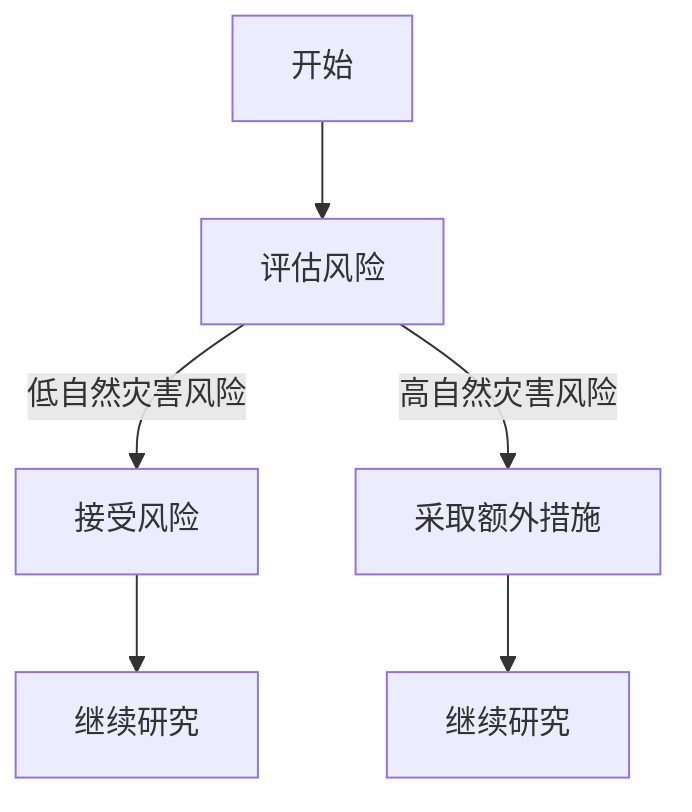

                 

# 《科学研究的风险管理与世界可理解性的审慎态度》

## 摘要

在科学研究不断推进的时代，风险管理与对世界可理解性的审慎态度成为了至关重要的议题。本文旨在探讨科学研究中存在的各种风险，包括数据风险、方法论风险和社会影响与伦理风险，以及这些风险如何影响科学研究的进展和成果的可靠性。通过详细阐述风险管理的理论基础和具体实践，本文提出了有效的风险管理策略，以减少错误和偏差，确保科学研究的质量和可信度。同时，本文讨论了世界可理解性的科学探索，分析了审慎态度在科学研究中的应用及其与传统科学方法的比较，展望了未来研究的方向与挑战。通过对风险管理实践案例的分析，本文总结了成功的经验与失败的教训，为科研工作者提供了实用的指导。文章最后，对科学研究的新范式进行了探讨，强调了风险管理与审慎态度在未来科学研究中的重要性。

## 引言

科学研究是探索未知、揭示自然规律、推动技术进步和社会发展的关键驱动力。然而，科学研究的道路并非一帆风顺。在科研过程中，科学家们面临着多种风险，这些风险不仅影响研究的进展，还可能影响研究结果的可靠性和科学性。因此，科学研究的风险管理与世界可理解性的审慎态度成为了科研领域的重要议题。

首先，科学研究的风险主要来源于以下几个方面：

1. **数据风险**：数据是科学研究的基石，但数据质量问题、数据隐私和伦理问题都可能对研究结果产生严重影响。
2. **方法论风险**：选择合适的方法论对研究的成功至关重要，但方法论的选择和应用过程中可能存在适用性问题和验证挑战。
3. **社会影响与伦理风险**：科学研究的成果对社会有深远影响，不当的科研行为可能导致负面影响，需要严格的社会影响评估和伦理风险管理。

其次，风险管理在科学研究中的重要性体现在以下几个方面：

1. **提高研究质量**：有效的风险管理可以减少错误和偏差，提高研究的可靠性和科学性。
2. **保障科研人员的安全**：合理的管理措施可以降低科研过程中的人身安全和职业风险。
3. **提升研究成果的可信度**：良好的风险管理有助于增强公众对科研成果的信任，促进科学知识的传播和应用。

与此同时，对世界可理解性的审慎态度也是科学研究不可或缺的一部分。科学研究不仅追求真理，还要求对研究结果的合理性进行持续的审慎评估。这种态度要求科研工作者在研究过程中保持谦虚和客观，不断质疑和验证自己的假设，以避免盲目自信和过度概括。

本文将从风险管理的理论基础出发，详细探讨科学研究中的各种风险类型，并结合实际案例进行分析，最后讨论世界可理解性的审慎态度及其在科学研究中的应用。希望通过本文的探讨，能够为科研工作者提供一些有价值的思考和指导。

## 第一部分：科学研究的背景与挑战

### 1.1 科学研究的现状与问题

科学研究在过去几十年中取得了令人瞩目的成就，从量子物理学到生物技术，再到人工智能，科学领域的突破不断推动着人类文明的前进。然而，与此同时，科学研究也面临着一系列挑战和问题，这些问题不仅影响了科研的进展，也对科学研究的可靠性和科学性提出了严峻的考验。

首先，科学研究的现状显示，竞争日益激烈。在全球范围内，科研机构和大学之间的竞争日益加剧，科研经费和资源的分配不均也成为一个普遍现象。这种竞争环境虽然在一定程度上推动了科研创新，但也带来了不良后果，如学术不端行为、学术浮躁和科研成果的商业化倾向。这些问题不仅损害了科研的纯洁性，也可能导致研究成果的质量下降。

其次，科研过程中存在诸多问题。数据质量问题是一个突出的挑战。科研数据的质量直接关系到研究的可靠性和科学性。然而，由于数据采集、处理和分析过程中的错误、不完整或者误导性数据，科研结果可能会产生偏差。此外，科研数据的安全性和隐私保护也是一个亟待解决的问题。在数据共享和开放的背景下，如何确保科研数据的安全，防止数据泄露和滥用，成为科研工作者必须面对的重要问题。

方法论风险也是科研中的一个关键问题。方法论的选择和适用性对研究的成功至关重要。然而，不同方法论之间可能存在较大的差异，如何选择最适合的方法论，如何确保方法论的有效性和可靠性，都是科研工作者需要深入思考的问题。此外，方法论验证的难度也增加了科研的不确定性。科研方法论的验证需要长时间的实验和验证，这使得许多科研工作难以迅速得出结论。

此外，社会影响与伦理风险也是科学研究必须面对的挑战。科学研究的成果往往对社会有深远影响，但不当的科研行为可能导致严重的社会问题。例如，基因编辑技术、人工智能等前沿科技的应用可能带来伦理和法律上的争议。如何进行社会影响评估和伦理风险管理，确保科研行为符合社会价值观和伦理规范，是科研工作者需要考虑的重要问题。

### 1.2 风险管理与科学研究的重要性

在科学研究过程中，风险管理的目的是识别、评估和应对各种潜在风险，以确保科研活动的顺利进行和科研成果的可靠性。风险管理在科学研究中的重要性主要体现在以下几个方面：

首先，风险管理有助于提高科研质量。通过识别和评估风险，科研工作者可以采取相应的措施来减少错误和偏差，提高科研的准确性和科学性。例如，通过数据质量管理和严格的实验设计，可以有效减少数据偏差和错误，提高数据的质量和可靠性。

其次，风险管理有助于保障科研人员的安全。科研过程中可能涉及有害物质、高风险实验操作等，合理的管理措施可以有效降低科研人员的人身安全风险。例如，通过制定安全操作规程和提供必要的安全培训，可以减少事故发生的概率，保障科研人员的安全。

第三，风险管理有助于提升研究成果的可信度。在现代社会，公众对科研成果的信任至关重要。通过有效的风险管理，科研工作者可以减少研究过程中的不确定性，提高研究成果的可靠性和科学性，从而增强公众对科研成果的信任。

此外，风险管理还可以提高科研资源的使用效率。通过识别和评估风险，科研机构可以合理分配资源，避免资源浪费。例如，在科研项目的预算和资源分配过程中，通过风险管理可以确保资金和资源的有效利用，提高科研项目的成功率。

### 1.3 世界可理解性的现状与挑战

世界可理解性是科学研究的一个核心问题。科学家们致力于揭示自然界的规律，探索宇宙的本质，但这一过程中也面临着诸多挑战。

首先，宇宙的复杂性和多样性使得科学研究面临巨大的难度。从微观的量子世界到宏观的宇宙结构，科学家们需要应对不同的尺度和复杂的现象。这种复杂性使得许多科学问题难以用简单的模型和理论来解释。

其次，科学研究中的不确定性也是一个重要挑战。科学理论往往基于观察和实验数据，但这些数据可能受到各种因素的影响，导致结果的不确定性。如何处理和解释这些不确定性，是科学研究中的一个重要问题。

此外，科学知识的不断更新也增加了世界可理解性的挑战。随着科学技术的进步，新的发现和理论不断涌现，传统的科学理解可能需要重新审视。如何保持对科学知识的开放态度，不断更新和调整科学理论，也是科学家们需要面对的问题。

总的来说，科学研究的现状与问题、风险管理与科学研究的重要性、以及世界可理解性的现状与挑战，都是科学研究过程中不可忽视的议题。通过对这些问题的深入探讨，我们可以更好地理解科学研究的本质和方向，为未来的科学发展提供有价值的思考。

## 第二部分：风险管理的理论基础

### 2.1 风险管理的概念与框架

风险管理是一个系统性的过程，旨在识别、评估、控制和监控潜在风险，以确保组织或项目的成功运行。在科学研究中，风险管理同样扮演着至关重要的角色。它不仅关注科研活动的安全性，还涵盖了数据质量、方法论选择、社会影响等多个方面。

**风险管理的定义**：风险管理可以定义为一系列措施和策略，用于识别、评估、控制和监控可能影响科研目标实现的风险。这些风险可能来自内部因素，如科研设计和方法的不当选择，也可能来自外部因素，如数据泄露和伦理问题。

**风险管理的框架**：风险管理通常包括以下几个关键步骤：

1. **风险识别**：识别可能影响科研项目的各种风险因素。这包括数据风险、方法论风险、社会影响与伦理风险等。
2. **风险评估**：对识别出的风险进行评估，确定其严重性和发生的可能性。风险评估通常使用定性或定量方法，例如风险矩阵或概率分布模型。
3. **风险应对**：制定和实施策略来应对识别和评估出的风险。这些策略可能包括风险规避、风险减少、风险转移或风险接受。
4. **风险监控**：持续监控风险的状态和变化，确保应对措施的有效性。这通常涉及定期审核、反馈和调整。

**风险管理在科学研究中的重要性**：

1. **提高科研质量**：通过识别和评估风险，科研工作者可以采取针对性的措施，减少错误和偏差，提高研究的准确性和科学性。
2. **保障科研人员的安全**：合理的管理措施可以有效降低科研过程中的人身安全风险，确保科研人员的健康和安全。
3. **提升研究成果的可信度**：有效的风险管理有助于提高研究成果的可靠性，增强公众对科研成果的信任。
4. **优化资源分配**：通过风险管理，科研机构可以合理分配资源，避免资源浪费，提高科研项目的成功率。

### 2.2 风险识别与评估方法

**风险识别**是风险管理的第一步，其目标是系统地发现和记录所有可能影响科研项目的风险。以下是几种常用的风险识别方法：

1. **头脑风暴**：通过集体讨论，科研团队成员可以列出所有可能的风险因素。这种方法有助于激发团队成员的创造力，发现潜在的风险。
2. **专家访谈**：与领域内的专家进行深入访谈，可以获取关于潜在风险的专业见解和建议。专家的经验和知识对于识别复杂和未知的风险尤为重要。
3. **文献回顾**：通过回顾相关文献和研究报告，科研团队可以了解已有研究中的常见风险和潜在问题，从而进行有效的风险识别。

**风险评估**是确定风险的重要步骤，常用的方法包括：

1. **定性评估**：定性评估通过专家判断和主观分析来确定风险的严重性和可能性。常用的工具有风险矩阵和风险优先级图。
   - **风险矩阵**：通过将风险的严重性和可能性进行量化，风险矩阵可以帮助科研团队优先处理高风险因素。
   - **风险优先级图**：通过图示方式展示各个风险的优先级，便于科研团队集中资源和精力处理最关键的风险。

2. **定量评估**：定量评估通过数学模型和统计方法对风险进行量化分析。这种方法通常需要详细的数据和复杂的计算，但能够提供更精确的风险评估。
   - **概率分布模型**：通过建立概率分布模型，可以量化风险发生的概率和影响程度，为科研团队提供更全面的风险评估。
   - **蒙特卡罗模拟**：蒙特卡罗模拟是一种基于随机抽样的模拟方法，可用于评估不确定因素对科研项目的影响。

**风险识别与评估方法的实际应用**：

1. **生物医学研究**：在生物医学研究中，数据质量和伦理问题尤为重要。通过风险识别和评估，科研团队可以制定严格的数据采集和处理规范，确保研究数据的可靠性和伦理性。
2. **环境科学**：环境科学研究中的风险识别和评估主要关注环境变化对生态系统的影响。通过定量评估方法，科研团队可以预测环境变化的趋势和影响，为环境管理提供科学依据。

总之，风险识别与评估是科学研究中不可或缺的一部分。通过系统的方法识别和评估风险，科研团队可以更好地理解和管理风险，确保科研项目的顺利进行和研究成果的可靠性。

### 2.3 风险应对策略与工具

在科学研究中，风险应对策略和工具的选择至关重要。有效的应对策略不仅可以减少风险的发生概率和影响程度，还可以提高研究的可靠性和科学性。以下是一些常见且有效的风险应对策略和工具：

**1. 风险规避**

**定义**：风险规避是指通过改变研究计划或方法来避免特定的风险。

**应用场景**：当某个风险的发生概率很高，且其影响严重时，规避风险可能是最佳选择。

**案例分析**：
- **基因编辑研究**：由于基因编辑技术可能导致不可预测的基因突变和生态影响，许多研究机构选择在实验室环境中进行严格的风险规避措施，确保在控制条件下进行实验。

**伪代码示例**：

**2. 风险减少**

**定义**：风险减少是指采取一定的措施来降低风险的发生概率或影响程度。

**应用场景**：当风险不能完全避免，但通过一定的措施可以降低其影响时，风险减少策略是可行的。

**案例分析**：
- **数据隐私保护**：在涉及敏感数据的科学研究中，通过数据加密、匿名化和访问控制等措施，可以有效减少数据泄露和滥用的风险。

**伪代码示例**：

**3. 风险转移**

**定义**：风险转移是指将风险责任转移到第三方，通常是保险公司或其他合作伙伴。

**应用场景**：当某个风险可能导致的损失较大，且科研机构不具备完全控制能力时，风险转移策略是有效的。

**案例分析**：
- **大型科研项目**：在大型科学项目中，通过购买保险或与合作伙伴签订合同，可以将风险转移给保险公司或合作伙伴，减轻自身负担。

**伪代码示例**：

**4. 风险接受**

**定义**：风险接受是指在不采取任何额外措施的情况下，接受风险的潜在影响。

**应用场景**：当某个风险的发生概率较低，且其影响轻微时，接受风险可能是合理的选择。

**案例分析**：
- **自然灾害研究**：在研究自然灾害的影响时，虽然无法完全避免自然灾害的发生，但通过模型预测和风险评估，科研团队可以接受这种自然风险，专注于研究其长期影响。

**伪代码示例**：

**总结**：风险应对策略和工具的选择应基于具体的科研背景和风险特性。通过合理选择和灵活应用这些策略和工具，科研团队可以有效地降低风险，保障科研项目的顺利进行。

### 2.4 风险管理与决策理论

风险管理与决策理论是科学研究中的重要组成部分，旨在通过科学的方法和工具，合理评估和处理科研过程中面临的各种风险。在这一部分，我们将深入探讨风险管理与决策理论的基本概念、核心原理以及其在科研中的应用。

#### 2.4.1 基本概念

**风险**：在决策理论中，风险是指决策结果的不确定性。这种不确定性可能来源于外部环境的变化、数据的不完整性或科研方法的不确定性。

**风险管理**：风险管理是一种系统性方法，用于识别、评估、控制和监控科研过程中可能面临的风险，以减少错误和偏差，提高研究结果的可靠性。

**决策**：决策是指从多个备选方案中选择一个最合适的方案的过程。在科研中，决策通常涉及方法选择、资源分配和实验设计等多个方面。

#### 2.4.2 核心原理

**预期效用理论**：预期效用理论是一种常用的决策模型，认为决策者应该选择能够带来最大预期效用的方案。预期效用计算公式为：预期效用 = 概率 × 效用值。

**风险中性**：风险中性是指决策者在面对风险时，不考虑风险本身，只关注预期收益。这种假设简化了决策过程，但在实际科研中，风险中性可能并不适用。

**风险偏好**：风险偏好是指决策者在面对风险时的态度。风险偏好者倾向于接受高风险以换取高回报，而风险规避者则更倾向于选择低风险方案。

**风险分散**：风险分散是指通过投资多个不同的项目或方案，来减少整体风险。在科研中，通过多样化的研究方法和数据来源，可以有效降低单一风险的影响。

#### 2.4.3 风险管理与决策理论的应用

**项目评估**：在科研项目的评估中，风险管理与决策理论可以帮助科研团队识别和评估项目风险，制定合理的应对策略。通过预期效用计算和风险分散策略，科研团队可以选出最具可行性的项目方案。

**实验设计**：在实验设计中，风险管理与决策理论可以帮助科研团队选择最佳实验方案。通过评估不同实验方案的预期效用和风险，科研团队可以优化实验设计，提高实验结果的可靠性。

**资源分配**：在资源有限的条件下，科研团队需要合理分配资源，以最大限度地减少风险。风险管理与决策理论可以帮助科研团队在资源分配中做出最优决策，确保研究项目的顺利实施。

**案例分析**：

**案例一：基因编辑研究**  
在基因编辑研究中，风险管理与决策理论的应用尤为重要。通过预期效用计算，科研团队可以评估不同基因编辑技术的风险和收益，选择最安全的方案。同时，通过风险分散策略，科研团队可以降低单一技术失败的风险，确保研究项目的顺利进行。

**案例二：环境监测项目**  
在环境监测项目中，风险管理与决策理论可以帮助科研团队识别和评估环境变化的潜在风险，制定相应的监测方案。通过风险中性假设，科研团队可以优先选择成本效益最高的监测方法，确保项目资源的合理分配。

总之，风险管理与决策理论在科学研究中的应用至关重要。通过系统的方法和工具，科研团队可以更好地识别和处理风险，做出科学的决策，提高研究质量和成果的可靠性。

### 第三部分：科学研究中的风险类型

科学研究中的风险类型多样且复杂，每种风险都可能对研究过程和结果产生不同程度的影响。本部分将详细探讨三种主要类型的科学研究风险：数据风险、方法论风险和社会影响与伦理风险，并分析这些风险的识别、评估和应对方法。

#### 3.1 数据风险

**定义**：数据风险是指在数据采集、处理和分析过程中可能出现的各种问题，这些问题可能影响研究结果的准确性和可靠性。

**类型**：

1. **数据质量问题**：包括数据缺失、数据不一致、数据偏差和数据污染等。
2. **数据隐私与伦理问题**：涉及个人隐私保护、数据安全性和伦理道德问题。

**识别与评估**：

1. **数据完整性检查**：通过数据清洗和验证方法，确保数据的完整性。
2. **数据隐私风险评估**：评估数据泄露和滥用的风险，制定相应的数据隐私保护策略。
3. **统计方法评估**：使用统计方法分析数据质量和偏差，识别潜在的数据问题。

**应对策略**：

1. **数据质量控制**：建立严格的数据采集和处理流程，确保数据质量。
2. **数据加密与访问控制**：采用数据加密和访问控制措施，保护数据隐私和安全。
3. **数据共享与透明度**：通过开放数据和透明的数据处理流程，提高数据的可信度和透明度。

**案例分析**：

**案例一：生物医学研究**  
在生物医学研究中，数据风险尤为突出。研究人员需要确保实验数据的完整性和准确性，以避免错误结论。例如，在基因测序研究中，通过建立严格的数据质量控制流程，可以减少数据偏差和错误，提高研究结果的可靠性。

#### 3.2 方法论风险

**定义**：方法论风险是指在研究设计、实验操作和分析过程中，由于方法论选择不当或操作失误，可能导致研究结果的偏差或无效。

**类型**：

1. **方法论选择风险**：包括选择不适合的研究方法或工具。
2. **方法论适用性风险**：研究方法在实际应用中可能存在适用性问题。
3. **方法论验证风险**：研究方法缺乏充分的验证和验证方法不当。

**识别与评估**：

1. **方法论评估**：评估方法论的科学性和适用性，选择最适合的研究方法。
2. **方法论验证**：通过实验验证或比较验证方法，确保方法论的有效性。
3. **方法论透明度评估**：评估方法论描述的详细程度和透明度，确保其他研究者可以理解和复制研究过程。

**应对策略**：

1. **方法论选择与优化**：基于科学原理和实际情况，选择最适合的研究方法，并不断优化研究设计。
2. **方法论验证与测试**：通过严格的实验验证和测试，确保方法论的有效性和可靠性。
3. **透明化方法论描述**：详细记录方法论的选择和验证过程，提高研究方法的透明度和可复制性。

**案例分析**：

**案例二：环境科学研究**  
在环境科学研究中，方法论风险尤为显著。例如，在生态系统研究中，选择合适的研究方法和工具至关重要。研究人员通过多次实验和比较验证，确保所选方法能够准确反映生态系统的真实状况，从而减少方法论风险。

#### 3.3 社会影响与伦理风险

**定义**：社会影响与伦理风险是指在科学研究过程中，研究行为和成果对社会可能产生的负面影响，以及科研行为是否符合伦理道德标准。

**类型**：

1. **社会影响风险**：包括研究对社会稳定、经济发展和公共安全的潜在影响。
2. **伦理风险**：包括违反伦理规范、损害研究对象的利益和隐私等。

**识别与评估**：

1. **社会影响评估**：通过定量和定性方法，评估研究对社会的影响，制定相应的风险应对策略。
2. **伦理风险评估**：评估研究过程是否符合伦理规范，确保研究对象的安全和隐私。

**应对策略**：

1. **社会影响评估与沟通**：与相关利益相关者进行沟通，了解社会的期望和担忧，制定适当的风险缓解措施。
2. **伦理审查与监督**：建立伦理审查机制，对研究过程进行监督和评估，确保研究行为符合伦理规范。
3. **社会责任承担**：积极承担社会责任，确保科研成果对社会产生积极影响。

**案例分析**：

**案例三：人工智能研究**  
在人工智能研究领域，社会影响和伦理风险尤为突出。研究人员需要关注人工智能技术对社会就业、隐私和安全等方面的潜在影响。通过社会影响评估和伦理审查，研究人员可以制定合适的策略，确保人工智能技术的健康发展。

#### 总结

科学研究中的数据风险、方法论风险和社会影响与伦理风险是科研过程中需要高度重视的方面。通过有效的识别、评估和应对策略，科研团队可以降低这些风险的影响，提高研究质量和成果的可靠性。同时，持续的监督和评估也是风险管理的重要组成部分，有助于确保科研过程的透明度和合规性。

### 4.1 风险管理在不同领域的应用

在科学研究的各个领域中，风险管理策略和工具的应用有所不同，但核心目标都是确保研究的可靠性和科学性。以下将详细介绍风险管理在生物医学、物理科学和社会科学中的应用，并结合具体案例进行分析。

#### 4.1.1 生物医学研究

生物医学研究涉及复杂的实验设计和数据处理过程，因此风险管理尤为重要。在生物医学研究中，常见的风险类型包括数据风险、实验设计风险和社会伦理风险。

**数据风险**：生物医学研究的数据风险主要来源于实验数据的准确性和完整性。为了确保数据质量，研究人员通常会采用多种数据验证和清洗方法。例如，在基因测序研究中，研究人员通过建立严格的数据质量控制流程，包括重复测序、质控分析和数据比对，以确保数据准确性和一致性。此外，研究人员还采用加密和访问控制措施，保护数据隐私和安全。

**实验设计风险**：实验设计风险包括选择合适的实验方法、实验样本和实验条件。为了降低实验设计风险，研究人员通常会进行预实验和实验重复，以验证实验方法的有效性和可靠性。例如，在临床试验中，研究人员通过多中心、随机对照试验设计，确保实验结果的可靠性和可重复性。

**社会伦理风险**：生物医学研究涉及人体试验和动物实验，社会伦理风险尤为突出。为了确保研究行为符合伦理规范，研究人员通常会进行伦理审查，评估研究对社会和受试者的潜在影响。例如，在基因编辑研究中，研究人员需要通过伦理审查委员会的批准，确保研究行为符合伦理准则，避免对受试者和社会产生负面影响。

**案例分析**：

**案例一：癌症药物研究**  
在一个癌症药物研究中，研究人员通过风险管理策略确保研究质量。首先，研究人员采用多阶段临床试验设计，从初步实验到大规模临床试验，逐步验证药物的安全性和有效性。其次，研究人员采用严格的数据管理措施，包括数据加密和访问控制，保护患者隐私。最后，研究人员通过伦理审查，确保研究行为符合伦理规范，减少社会伦理风险。

#### 4.1.2 物理科学研究

物理科学研究涉及实验验证和理论分析，风险管理在提高实验结果可靠性和理论推导准确性方面起到关键作用。在物理科学研究中，常见的风险类型包括实验操作风险、数据处理风险和理论模型风险。

**实验操作风险**：物理科学研究中的实验操作风险主要来源于实验设备、实验条件和实验操作的精确度。为了降低实验操作风险，研究人员通常会进行实验前的培训和模拟操作，确保实验人员熟练掌握实验技能。此外，研究人员还会进行设备校准和维护，确保实验设备的稳定性和准确性。

**数据处理风险**：物理科学研究中的数据处理风险主要涉及数据收集、处理和分析的准确性。为了降低数据处理风险，研究人员通常会采用多种数据处理方法，如重复实验、数据校验和统计分析。例如，在粒子物理实验中，研究人员通过多次实验和数据比对，确保实验数据的准确性和一致性。

**理论模型风险**：物理科学研究中的理论模型风险主要来源于理论假设和模型选择的合理性。为了降低理论模型风险，研究人员通常会进行理论模型的验证和比较，确保模型的有效性和适用性。例如，在量子力学研究中，研究人员通过实验验证和理论推导，不断优化和验证量子力学模型，确保其准确性和可靠性。

**案例分析**：

**案例二：粒子物理研究**  
在一个粒子物理研究中，研究人员通过风险管理策略确保实验结果可靠性。首先，研究人员采用多中心、多设备的数据收集方式，确保数据来源的多样性和准确性。其次，研究人员采用严格的数据处理和分析方法，包括数据校验和统计分析，确保数据的一致性和可靠性。最后，研究人员通过实验验证和理论模型比较，确保理论模型的适用性和准确性。

#### 4.1.3 社会科学研究

社会科学研究主要涉及人类行为和社会现象，风险管理在确保研究方法和数据可靠性方面具有重要意义。在社会科学研究中，常见的风险类型包括方法论风险、数据隐私风险和社会影响风险。

**方法论风险**：社会科学研究中的方法论风险主要来源于研究设计和方法选择的合理性。为了降低方法论风险，研究人员通常会进行方法论评估和比较，选择最适合的研究方法。例如，在问卷调查研究中，研究人员通过预调查和样本代表性评估，确保问卷设计和样本选择的有效性和可靠性。

**数据隐私风险**：社会科学研究中的数据隐私风险主要涉及受访者隐私保护和数据安全。为了降低数据隐私风险，研究人员通常会采用匿名化处理和加密技术，确保数据隐私和安全。例如，在心理学研究中，研究人员通过匿名化问卷和加密存储，保护受访者隐私，防止数据泄露和滥用。

**社会影响风险**：社会科学研究中的社会影响风险主要涉及研究对社会和个体的潜在影响。为了降低社会影响风险，研究人员通常会进行社会影响评估，了解研究对社会和个体的潜在影响，并制定相应的应对策略。例如，在政策研究中，研究人员通过利益相关者分析和政策影响评估，确保研究对社会产生积极影响。

**案例分析**：

**案例三：政策研究**  
在一个政策研究中，研究人员通过风险管理策略确保研究质量和影响。首先，研究人员采用多种方法论评估和比较，选择最适合的政策研究方法。其次，研究人员通过匿名化和加密技术，确保数据隐私和安全。最后，研究人员通过社会影响评估和政策影响评估，确保研究对社会产生积极影响。

#### 总结

风险管理在生物医学、物理科学和社会科学等不同领域中的应用各有特点，但核心目标都是为了确保研究的可靠性和科学性。通过有效的风险识别、评估和应对策略，科研团队可以降低各种风险的影响，提高研究成果的质量和可信度。同时，持续的监督和评估也是风险管理的重要组成部分，有助于确保科研过程的透明度和合规性。

### 4.2 成功的风险管理实践案例

成功进行风险管理的关键在于其系统性和科学性。以下将介绍几个成功的风险管理实践案例，这些案例展示了不同领域中如何通过有效的风险管理策略，确保科研项目的顺利进行和成果的可靠性。

#### 案例一：基因编辑研究的风险管理

基因编辑技术，如CRISPR-Cas9，在生物医学领域带来了巨大的潜力，但也伴随着高风险。某研究团队在开展CRISPR基因编辑研究时，通过以下措施成功降低了风险：

1. **严格的伦理审查**：在项目启动前，研究团队向伦理审查委员会提交详细的研究计划，确保研究行为符合伦理规范，避免潜在的社会伦理风险。
2. **风险管理计划**：研究团队制定了详细的风险管理计划，包括风险识别、评估和应对策略。通过定期审核和更新计划，确保风险管理的持续有效性。
3. **多重验证**：在实验过程中，研究团队采用多重验证方法，包括重复实验和独立验证，确保数据的准确性和可靠性。
4. **数据加密与保护**：研究团队对实验数据进行加密处理，并采用严格的数据访问控制措施，保护数据隐私和安全。

通过这些措施，研究团队成功完成了基因编辑研究，并发表了高质量的科研成果，得到了同行的认可。

#### 案例二：气候变化研究的风险管理

气候变化研究是一个复杂且长期的科研项目，某研究团队在开展气候变化研究时，通过以下风险管理策略确保研究的科学性和可靠性：

1. **数据收集与管理**：研究团队采用多源数据收集方法，包括卫星遥感数据、气象数据和实地测量数据，确保数据的多样性和代表性。同时，建立严格的数据管理系统，确保数据的完整性和准确性。
2. **风险识别与评估**：研究团队对气候变化研究的潜在风险进行了全面识别和评估，包括数据风险、模型风险和社会影响风险。通过建立风险矩阵，确定不同风险的重要性和优先级。
3. **模型验证**：研究团队对气候变化模型进行了严格的验证，包括历史数据和模拟结果的比较，确保模型的有效性和适用性。
4. **社会影响评估**：研究团队与利益相关者进行沟通，了解社会对气候变化研究的期望和担忧，制定相应的社会影响应对策略。

通过这些措施，研究团队成功发表了多篇高影响力的气候变化研究报告，为政策制定提供了科学依据。

#### 案例三：人工智能研究的风险管理

人工智能技术在各个领域的应用日益广泛，但也带来了一系列风险。某研究团队在开展人工智能研究时，通过以下措施有效管理风险：

1. **安全性与隐私保护**：研究团队在数据收集和模型训练过程中，采用了严格的数据安全和隐私保护措施，包括数据加密和匿名化处理，确保用户隐私和安全。
2. **透明性**：研究团队在研究中公开了详细的算法设计和数据来源，提高了研究的透明度和可复制性。
3. **伦理审查**：研究团队在进行人工智能研究前，向伦理审查委员会提交了详细的伦理评估报告，确保研究行为符合伦理规范。
4. **持续评估**：研究团队定期对研究成果进行评估，包括技术风险和社会影响，确保研究成果的可持续性和可接受性。

通过这些措施，研究团队成功开发了多个安全、可靠的人工智能应用，得到了业界的广泛认可。

#### 总结

这些成功案例展示了如何在不同领域中通过有效的风险管理策略，确保科研项目的顺利进行和成果的可靠性。通过严格的伦理审查、全面的风险识别和评估、有效的数据管理和模型验证，以及与利益相关者的持续沟通，科研团队可以降低风险，提高研究成果的质量和可信度。

### 4.3 风险管理失败案例分析

尽管风险管理在科学研究中至关重要，但失败的风险管理案例仍然存在。以下将分析几个典型的风险管理失败案例，探讨导致失败的原因，并从中总结教训。

#### 案例一：某药品临床试验失败

某药品临床试验在初期看似顺利，但由于风险管理失败，最终导致试验失败。原因如下：

1. **伦理审查不足**：在项目启动前，伦理审查委员会对试验计划审查不严格，未充分考虑试验对受试者的潜在风险。
2. **数据管理不善**：试验过程中，数据记录和存储不规范，导致数据丢失和错误。
3. **风险评估不准确**：研究团队在风险评估过程中，低估了药物潜在的副作用和风险，未采取足够的预防措施。

**教训**：在进行临床试验时，必须进行严格的伦理审查，确保研究符合伦理规范。同时，要进行全面的风险评估，并制定相应的预防措施。此外，加强数据管理和记录，确保数据的准确性和完整性。

#### 案例二：某气候变化研究误报

某气候变化研究因风险管理失败，最终导致误报，引起了广泛争议。原因如下：

1. **数据来源单一**：研究团队依赖单一数据来源，未进行数据交叉验证，导致数据偏差。
2. **模型验证不足**：研究团队对气候模型验证不足，未充分考虑模型适用性和可靠性。
3. **社会影响评估缺失**：研究团队未对社会影响进行充分评估，导致研究成果与实际情况不符。

**教训**：在进行气候变化研究时，应采用多源数据收集方法，确保数据的多样性和代表性。同时，对研究模型进行严格验证，确保其有效性和适用性。此外，进行社会影响评估，了解研究成果对社会的潜在影响，避免误报和误导。

#### 案例三：某人工智能项目风险失控

某人工智能项目因风险管理失控，最终导致项目失败。原因如下：

1. **安全性和隐私保护不足**：研究团队在数据收集和模型训练过程中，未充分考虑用户隐私和安全问题，导致数据泄露和用户隐私受损。
2. **透明性不足**：研究团队在研究中未公开详细的算法设计和数据来源，导致研究成果的可复制性和透明度不足。
3. **持续评估缺失**：研究团队未对项目进行持续的风险评估和调整，未能及时识别和应对潜在风险。

**教训**：在进行人工智能研究时，必须高度重视用户隐私和安全问题，采取严格的数据保护措施。同时，保持研究过程的透明性，公开详细的算法设计和数据来源，提高研究的可复制性和可信度。此外，进行持续的风险评估和调整，确保项目风险在可控范围内。

#### 总结

这些风险管理失败案例表明，缺乏严格的伦理审查、不全面的风险评估、数据管理不善、透明性不足和持续评估缺失都是导致风险管理失败的重要原因。从这些案例中，我们可以总结出以下教训：在科学研究过程中，必须进行严格的伦理审查，进行全面的风险评估，加强数据管理和透明度，进行持续的风险监控和调整，以确保科研项目的顺利进行和成果的可靠性。

### 5.1 世界可理解性的科学探索

世界可理解性是科学研究的一个核心议题，它涉及人类对自然界的认知和解释能力。自古以来，人类一直在探索宇宙的奥秘，试图找到解释自然现象的统一理论。从古代的哲学思考到现代的科学探索，科学家们不断挑战自我，以追求对世界更深层次的理解。

在科学探索的过程中，科学家们采用了多种方法和理论。经典物理学提供了对宏观世界的解释，如牛顿力学和麦克斯韦方程组。量子力学则揭示了微观世界的奇异性质，如量子叠加态和量子纠缠。相对论则提供了对时空和引力的全新理解。这些理论不仅推动了科学的发展，也改变了人类对世界的认知。

尽管科学家们取得了显著的成就，但世界可理解性仍然充满挑战。首先，自然界中的现象复杂多变，科学家们需要不断提出新的理论来解释这些现象。其次，科学理论的验证和证实过程耗时费力，需要大量的实验数据和理论推导。此外，科学理论的适用范围和局限性也是一个重要问题。例如，经典物理学的理论在高速和强引力场中的适用性有限，而量子力学和相对论则在这些极端条件下表现出更强的解释能力。

科学家们也在不断探索如何更好地理解世界。近年来，多学科交叉研究成为科学探索的重要趋势。通过融合不同领域的知识，科学家们可以提出更全面、更深刻的理解。例如，宇宙学、粒子物理学和天体物理学之间的交叉研究，揭示了宇宙起源和演化的奥秘。此外，人工智能和大数据分析技术的发展，也为科学家们提供了新的工具和方法，帮助他们更好地理解和解释复杂的数据。

尽管如此，世界可理解性仍然是一个充满未知和挑战的领域。科学家们需要持续探索，不断提出新的问题和假设，以推动科学的进步。在这个过程中，审慎态度和对未知事物的谦虚精神至关重要。科学家们必须保持开放的心态，不断质疑和验证自己的理论，以避免盲目自信和过度概括。

### 5.2 审慎态度在科学研究中的应用

审慎态度是科学研究中的一个关键要素，它要求科研工作者在研究过程中保持客观、谦虚和批判性思维。通过审慎态度，科学家们可以更好地识别和应对潜在的风险，确保科研结果的可靠性和科学性。

**审慎态度的定义**：

审慎态度是指科研工作者在研究过程中，对数据和理论持怀疑和批判的态度，通过严格的验证和验证过程，确保研究结果的准确性和可信度。

**审慎态度的应用**：

1. **数据采集**：在数据采集过程中，科研工作者应保持怀疑态度，仔细检查数据的完整性和准确性。通过重复实验和交叉验证，确保数据的可靠性。
2. **数据分析**：在数据分析过程中，科研工作者应避免过度依赖单一数据源，采用多种分析方法，确保结果的稳健性。同时，对数据分析过程中的假设和参数选择进行严格评估。
3. **理论验证**：在理论验证过程中，科研工作者应不断质疑和验证自己的理论，通过实验验证和逻辑推理，确保理论的科学性和适用性。
4. **同行评审**：通过同行评审，科研工作者可以接受其他专家的批评和建议，提高研究的透明度和可信度。同行评审有助于识别研究中的潜在问题，确保研究的严谨性和科学性。
5. **持续学习**：科研工作者应保持持续学习的态度，不断更新自己的知识和技能，跟上科学发展的步伐。通过学习新的理论和研究成果，科研工作者可以更好地理解和解释复杂的现象。

**案例分析**：

在某项基因编辑研究中，研究团队采用了审慎态度来确保研究的可靠性和科学性。在数据采集阶段，研究团队进行了多次重复实验，并采用多种技术手段验证数据的准确性。在数据分析阶段，研究团队采用了多种统计分析方法，确保结果的稳健性。在理论验证阶段，研究团队通过实验验证和逻辑推理，确保基因编辑理论的有效性和适用性。此外，研究团队还接受了同行评审，接受了其他专家的批评和建议，进一步提高了研究结果的可靠性和科学性。

通过审慎态度的应用，科研工作者可以降低研究过程中的风险，确保科研结果的可靠性和科学性，为科学的进步做出贡献。

### 5.3 审慎态度与传统科学方法的比较

审慎态度与传统科学方法在科研实践中有着显著的区别，同时也存在一些互补之处。传统科学方法通常包括观察、假设、实验、验证和理论构建等步骤，这些步骤构成了科学研究的基本框架。而审慎态度则贯穿于整个科研过程中，要求科研工作者保持怀疑和批判性思维，不断质疑和验证自己的假设和理论。

**传统科学方法的优点**：

1. **系统性**：传统科学方法提供了系统的科研流程，从观察现象到提出假设，再到实验验证和理论构建，确保研究过程的科学性和逻辑性。
2. **可重复性**：通过严格的实验设计和数据分析，传统科学方法确保了研究结果的可重复性，增强了科研结果的可信度。
3. **逻辑严谨**：传统科学方法强调逻辑推理和理论构建，通过严谨的论证过程，确保理论的科学性和合理性。

**审慎态度的优点**：

1. **怀疑和批判性思维**：审慎态度要求科研工作者对数据和理论持怀疑态度，通过严格的验证和验证过程，确保结果的准确性和可靠性。
2. **透明度和开放性**：审慎态度鼓励科研工作者公开研究过程和结果，接受同行评审和批评，提高研究的透明度和可信度。
3. **持续学习**：审慎态度要求科研工作者保持持续学习的态度，不断更新知识和技能，适应科学发展的需求。

**传统科学方法的局限性**：

1. **过度依赖实验结果**：传统科学方法过于依赖实验结果，有时可能忽略实验外的其他影响因素，导致结果偏差。
2. **理论的局限性**：科学理论通常基于特定的假设和前提条件，可能无法解释所有现象，存在一定的局限性。
3. **时间成本**：传统科学方法通常需要较长时间进行实验和验证，可能导致科研进度缓慢。

**审慎态度的局限性**：

1. **怀疑过度**：审慎态度可能导致科研工作者对数据和理论持过度怀疑态度，影响研究的进展和效率。
2. **主观判断**：审慎态度依赖于科研工作者的主观判断，可能引入主观偏差，影响研究的客观性和准确性。
3. **资源消耗**：审慎态度通常需要更多的资源和时间进行验证和评估，可能导致研究成本增加。

**互补关系**：

审慎态度与传统科学方法并非互相排斥，而是相辅相成。传统科学方法提供了系统的科研流程和严谨的论证方式，而审慎态度则提供了怀疑和批判性思维，确保研究结果的可靠性和科学性。在科研过程中，科研工作者可以结合传统科学方法和审慎态度，取长补短，提高研究的质量和可信度。

### 5.4 审慎态度的未来趋势与挑战

随着科学技术的不断进步，审慎态度在科学研究中的重要性日益凸显。未来，审慎态度将在以下几个方面面临新的趋势和挑战：

**1. 数据驱动的科学研究**

随着大数据和人工智能技术的快速发展，数据驱动的科学研究将成为主流。科研工作者将依赖大量数据来发现新的规律和现象，而审慎态度将成为确保数据质量和研究可靠性的关键。在数据驱动的模式下，科研工作者需要更加注重数据的来源、处理和分析过程，确保研究结果的真实性和科学性。

**2. 多学科交叉研究**

多学科交叉研究是当前科学发展的一个重要趋势。通过融合不同领域的知识，科学家们可以提出更全面、更深刻的理解。然而，多学科交叉研究也带来了新的挑战，如不同学科研究方法和理论的兼容性问题。审慎态度将帮助科研工作者在多学科交叉研究中保持怀疑和批判性思维，避免盲目自信和过度概括。

**3. 透明度和开放科学**

透明度和开放科学是当前科学界倡导的重要理念。科研工作者需要公开研究过程和结果，接受同行评审和批评，提高研究的透明度和可信度。然而，这也带来了新的挑战，如如何保护科研工作者的隐私、知识产权和数据安全。审慎态度将帮助科研工作者在开放科学的环境下，保持对数据和结果的合理控制，确保科研过程的公正和透明。

**4. 社会影响和伦理问题**

科学研究的成果对社会有深远影响，但不当的科研行为可能导致严重的社会问题。科研工作者需要关注社会影响和伦理问题，确保研究行为符合社会价值观和伦理规范。随着社会对科研伦理的关注度提高，审慎态度将成为科研工作者应对社会伦理挑战的重要工具。

**5. 国际合作与竞争**

在全球化背景下，科学研究的国际合作与竞争日益激烈。科研工作者需要在国际合作中保持审慎态度，确保研究质量和数据可靠性。同时，在国际竞争中，科研工作者也需要审慎评估自身的研究能力和资源，避免盲目追赶和抄袭。

总之，随着科学技术的不断进步，审慎态度在科学研究中的重要性将不断凸显。科研工作者需要保持审慎态度，应对未来的趋势和挑战，确保科研结果的可靠性和科学性，推动科学的发展和创新。

### 6.1 风险管理与世界可理解性的关系

风险管理与世界可理解性在科学研究中具有紧密的联系。风险管理不仅影响研究的顺利进行，还深刻影响科学家对世界认知的深度和广度。以下将探讨风险管理与世界可理解性之间的关系，分析风险管理如何影响科学探索的深度和广度。

首先，风险管理通过确保科研过程的严谨性和科学性，直接影响科学探索的深度。在科研过程中，风险管理的首要目标是识别和评估各种潜在风险，并采取有效的措施降低这些风险。这种系统性的风险管理方法有助于确保研究的可靠性，避免因数据质量问题和实验偏差导致的错误结论。例如，在基因编辑研究中，严格的伦理审查和风险管理措施能够确保研究符合伦理规范，避免对人类健康和社会伦理造成负面影响。通过这种方式，风险管理不仅提高了研究的科学性，也深化了科学家对生物技术和基因编辑领域的理解。

其次，风险管理通过提高科研数据的可靠性和透明度，扩展了科学探索的广度。在科学研究中，数据的完整性和准确性是基础。有效的风险管理措施，如数据加密、访问控制和数据共享平台，可以确保数据的安全性和隐私保护，同时提高数据的透明度和可访问性。这种透明度有助于科学家之间进行合作和验证，促进了科学知识的传播和扩展。例如，气候变化研究中的多源数据收集和共享，使得科学家能够从不同角度和更广泛的范围来分析气候变化的趋势和影响，从而推动了科学探索的广度。

此外，风险管理在科研过程中还促进了跨学科合作和知识整合。在面对复杂的研究问题时，单一学科的方法和理论可能不足以解释全部现象。通过风险管理，科研团队可以识别和评估跨学科合作中的潜在风险，如数据兼容性和方法论差异，从而采取相应的措施来降低风险。例如，在多学科交叉研究中，风险管理可以帮助科学家们制定统一的数据标准和分析框架，确保不同学科之间的研究能够相互补充和验证，从而推动科学探索的广度和深度。

风险管理还影响着科学研究的持续性和创新性。在面对复杂和未知的风险时，科研工作者需要保持审慎和灵活，不断调整和优化研究策略。这种持续的风险管理过程不仅有助于科学家们更好地理解研究对象，也促进了科学知识的不断创新。例如，在人工智能研究中，面对不断变化的技术风险和社会伦理挑战，科学家们需要通过风险管理来确保研究的前沿性和可行性，从而推动人工智能技术的持续创新和应用。

最后，风险管理通过提升科研成果的可靠性和公众信任，间接影响科学家对世界可理解性的认知。科学研究的最终目标是提高人类对自然世界的理解和掌控能力。通过有效的风险管理，科学家们能够减少研究中的不确定性和错误，提高研究结果的可靠性和科学性。这种可靠性的提升不仅增强了科学家对研究对象的认知，也提高了公众对科研成果的信任度，从而推动了科学知识在社会中的传播和应用。

总之，风险管理与世界可理解性在科学研究中具有密切的关系。风险管理不仅确保了科研过程的严谨性和科学性，提高了科研数据的可靠性和透明度，还促进了跨学科合作和创新，提升了科研成果的可靠性和公众信任。通过有效的风险管理，科学家们能够更好地理解世界，推动科学的进步和发展。

### 6.2 未来研究的方向与挑战

在未来的科学研究领域中，风险管理与世界可理解性的关系将继续成为重要的研究方向。以下将讨论未来研究的几个关键方向及其面临的挑战：

**1. 量子科学的风险管理**

随着量子计算机和量子通信的发展，量子科学成为未来研究的重点领域。然而，量子系统的复杂性和不确定性带来了新的风险管理挑战。例如，量子计算机的性能受量子噪声和量子退相干的影响，需要开发新的量子错误纠正方法和风险管理策略来保证量子计算的正确性和可靠性。未来研究需要关注量子系统的稳定性、噪声控制和错误纠正，以及量子信息的安全性问题。

**2. 人工智能的社会影响与伦理风险管理**

人工智能（AI）技术迅速发展，已经广泛应用于各个领域，但其社会影响和伦理问题也越来越受到关注。未来研究需要深入探讨人工智能的伦理风险、隐私保护和社会影响评估。例如，如何确保AI系统的透明度和可解释性，如何防止算法偏见和歧视，以及如何制定有效的伦理框架来规范AI的应用。这些研究将有助于制定更加健全的AI风险管理策略，促进人工智能的健康发展。

**3. 环境科学的可持续发展风险管理**

环境科学面临的挑战日益严峻，如气候变化、生物多样性和污染问题。未来研究需要关注环境科学的可持续发展风险管理，特别是在应对全球环境变化和生态系统恢复方面。例如，如何评估和减轻环境变化的潜在风险，如何制定有效的环境管理策略，以及如何通过风险管理促进生态系统的恢复和可持续发展。这些研究将有助于推动环境科学的进步，为全球环境保护提供科学依据。

**4. 生物医学研究中的数据隐私和伦理风险管理**

生物医学研究中的数据隐私和伦理问题日益突出。随着基因组学和生物信息学的发展，个人健康数据的安全和隐私保护成为关键挑战。未来研究需要关注如何在保障数据隐私的同时，充分利用生物医学数据进行科学研究。例如，如何开发更加安全的数据存储和共享技术，如何制定符合伦理规范的研究协议，以及如何加强生物医学研究中的伦理审查和监督。这些研究将有助于提高生物医学研究的质量和公信力。

**5. 跨学科合作中的风险管理**

未来科学研究越来越趋向于跨学科合作，这为解决复杂问题提供了新的途径，但同时也带来了风险管理的新挑战。跨学科合作中的风险管理需要关注如何整合不同学科的方法论，如何评估跨学科研究中的潜在风险，以及如何制定有效的合作机制来确保研究的顺利进行。这些研究将有助于促进跨学科合作，提高科学研究的整体效能。

**面临的挑战**：

1. **技术挑战**：未来研究中的新技术，如量子计算和人工智能，带来了新的风险管理技术挑战。如何开发有效的风险管理工具和方法，确保新技术应用中的安全和可靠性，是一个重要的研究方向。
2. **伦理挑战**：未来研究中的伦理问题，如数据隐私、人工智能伦理和生物医学伦理，需要建立更加健全的伦理框架和规范，确保研究行为符合社会价值观和伦理标准。
3. **资源挑战**：未来研究需要大量的人力和物力资源，如何有效管理和分配这些资源，确保研究能够顺利进行，是一个重要的挑战。
4. **知识整合**：跨学科合作中的知识整合和风险管理需要新的理论和方法，如何整合不同学科的知识，确保研究的前沿性和创新性，是一个重要的研究课题。

总之，未来科学研究中的风险管理与世界可理解性的关系将继续是重要的研究方向。通过深入探讨这些方向，科学家们可以更好地理解和管理科学研究中的风险，推动科学的进步和人类对世界的理解。

### 6.3 科学研究的新范式

随着科学技术的不断进步，科学研究正逐渐从传统的线性模式转向更加复杂和多样化的新范式。这些新范式不仅反映了科学研究方法和工具的演变，也体现了科学家们在面对复杂问题时的思维方式和工作模式。以下将探讨这些新范式，分析其对科学研究的影响，并探讨其在风险管理和世界可理解性方面的潜在应用。

**1. 多学科交叉研究**

多学科交叉研究是当前科学研究的一个重要趋势。传统科学研究往往局限于单一学科，而多学科交叉研究则通过融合不同领域的知识，提供更全面和深入的理解。这种新范式在应对复杂问题时，如气候变化、疾病治疗和人工智能等，显示出了巨大的潜力。通过多学科合作，科学家们可以整合不同学科的理论和方法，从不同角度探讨问题，提高研究的深度和广度。

**影响**：多学科交叉研究促进了知识的整合和创新，提高了科学研究的效率和成果的可靠性。然而，这种范式也带来了新的挑战，如跨学科沟通的障碍和方法论的兼容性问题。

**应用**：在风险管理和世界可理解性方面，多学科交叉研究有助于识别和评估跨学科研究中的潜在风险。例如，在气候变化研究中，结合气候学、生态学和经济学的方法，可以更全面地评估气候变化对社会经济的影响，从而制定更有效的风险管理策略。

**2. 系统科学**

系统科学是一种研究复杂系统动态和行为的方法论。它强调系统内部的相互关系和反馈机制，通过数学模型和计算机模拟来理解和预测系统的行为。系统科学在生物学、生态学、经济学和社会学等领域都有广泛应用。

**影响**：系统科学提供了新的研究方法和工具，有助于科学家们从宏观和微观层面理解复杂系统的行为。这种范式强调了数据的集成和模型的应用，提高了研究的预测能力和决策支持。

**应用**：在风险管理和世界可理解性方面，系统科学可以用于分析和预测科学研究的潜在风险。例如，通过建立生态系统模型，科学家们可以预测环境变化对生态系统的影响，从而制定相应的风险管理策略。

**3. 开放科学**

开放科学是一种推动科学知识和数据开放共享的新范式。它强调科研过程的透明度、数据的可访问性和合作性。开放科学通过开放期刊、开源软件和开放数据平台，促进了科学知识的传播和共享，提高了科研成果的可靠性。

**影响**：开放科学提高了科研的透明度和可信度，促进了科学知识的传播和应用。它也促进了跨学科合作和全球科研合作，为解决全球性问题提供了新的途径。

**应用**：在风险管理和世界可理解性方面，开放科学有助于提高数据的透明度和可访问性，从而促进对科学研究风险的识别和评估。通过开放数据和开放合作，科学家们可以更全面地了解和应对科学研究中的风险。

**4. 数据驱动科学**

数据驱动科学是一种基于大量数据分析和机器学习的方法论，它通过分析和解释海量数据来发现新的规律和现象。这种范式在生物学、医学、物理学和工程学等领域都有广泛应用。

**影响**：数据驱动科学提供了新的研究方法和工具，使科学家们能够从海量数据中发现新的模式和规律，提高研究的效率。然而，数据驱动科学也面临数据质量、数据解释和算法偏见等问题。

**应用**：在风险管理和世界可理解性方面，数据驱动科学可以用于分析和预测科学研究中的风险。通过大数据分析和机器学习模型，科学家们可以识别和评估潜在的科学研究风险，从而制定更有效的风险管理策略。

**总结**：

科学研究的新范式，如多学科交叉研究、系统科学、开放科学和数据驱动科学，正在深刻改变科学研究的模式和思维方式。这些新范式不仅提高了科学研究的深度和广度，也为风险管理和世界可理解性提供了新的工具和方法。通过持续探索和应用这些新范式，科学家们可以更好地理解和管理科学研究中的风险，推动科学的进步和人类对世界的认识。

### 6.4 风险管理与世界可理解性的综合研究与展望

通过对风险管理与世界可理解性的深入研究，我们可以看到两者在科学研究中的紧密联系和相互作用。风险管理与世界可理解性不仅影响了科研的进程和成果的可靠性，还深刻影响了科学家对自然世界的认知和理解。

**综合研究成果**：

1. **风险识别与评估**：通过系统性的风险识别和评估，科学家们能够更好地理解科学研究中的潜在风险，从而采取相应的预防措施，确保研究过程的顺利进行。
2. **风险管理策略**：有效的风险管理策略，如数据质量控制、方法验证和伦理审查，提高了科研数据的可靠性和科研成果的科学性，促进了科学知识的积累和传播。
3. **世界可理解性提升**：通过风险管理，科学家们能够更准确地解释和预测自然现象，提高了对世界可理解性的深度和广度，推动了科学理论的发展和应用。

**未来展望**：

1. **技术进步**：随着量子计算、人工智能和大数据等新技术的快速发展，风险管理和世界可理解性研究将得到更多的工具和方法支持，进一步提升科研的效率和可靠性。
2. **跨学科合作**：跨学科合作将成为科学研究的重要趋势，风险管理和世界可理解性研究需要更加关注跨学科合作中的风险识别和评估，促进知识的整合和创新。
3. **开放科学**：开放科学的推广将进一步提升科研的透明度和数据的可访问性，有助于全球科研工作者共享资源和知识，共同应对科学研究中的风险。
4. **持续学习与改进**：科研工作者需要持续学习和改进风险管理方法，以适应不断变化的科研环境和技术挑战，推动科学研究向更高层次发展。

总之，风险管理与世界可理解性的综合研究为科学研究提供了新的思路和方法，推动了科学知识的进步和应用。未来，通过持续的研究和探索，我们将能够更好地应对科学研究中的挑战，提高科研的质量和成果的可靠性，进一步拓展人类对自然世界的认知和理解。

### 结论

在科学研究的道路上，风险管理与对世界可理解性的审慎态度是不可或缺的基石。本文从多个角度探讨了风险管理的理论基础、科学研究中的各种风险类型、风险管理在不同领域的应用、成功和失败的风险管理实践案例，以及世界可理解性的科学探索和审慎态度的应用。通过这些讨论，我们深刻认识到风险管理在确保科研过程的可靠性、提升科研成果的科学性和推动科学进步中的关键作用。

首先，风险管理通过识别和评估科研中的各种风险，如数据风险、方法论风险和社会影响与伦理风险，帮助科学家们制定有效的应对策略，确保研究的顺利进行。这些策略不仅提高了研究质量，还增强了科研成果的可信度。其次，世界可理解性的探索要求科学家们保持审慎态度，不断质疑和验证自己的假设，以确保科学理论的科学性和适用性。

未来，随着科学技术的不断进步，风险管理和世界可理解性研究将继续面临新的挑战和机遇。量子科学、人工智能和大数据等新兴领域的快速发展，将带来更多的风险和不确定性，同时也提供了新的工具和方法。跨学科合作和开放科学的推广，将进一步促进知识的整合和创新，为科学研究提供更广阔的平台。

科研工作者需要持续学习和改进风险管理方法，以适应不断变化的科研环境和技术挑战。同时，保持对世界可理解性的审慎态度，推动科学理论的发展和应用，为人类社会的进步和可持续发展做出更大贡献。

总之，风险管理与世界可理解性在科学研究中的重要性不容忽视。只有通过有效的风险管理，保持对世界可理解性的审慎态度，科学家们才能在科学探索的道路上走得更远、更稳健。

## 附录

### 7.1 风险管理工具与资源介绍

在科学研究中，有效的风险管理工具和资源对于确保研究顺利进行至关重要。以下介绍几种常用的风险管理工具和资源：

1. **风险矩阵**：风险矩阵是一种常用的定性风险评估工具，通过将风险的严重性和可能性进行量化，帮助科研团队识别和优先处理高风险因素。

2. **风险登记册**：风险登记册用于记录和管理所有识别出的风险，包括风险的性质、发生概率、影响程度和应对策略。它有助于科研团队对风险进行全面监控和跟踪。

3. **蒙特卡罗模拟**：蒙特卡罗模拟是一种基于随机抽样的定量风险评估方法，通过模拟不同风险情景，帮助科研团队评估潜在风险的影响程度。

4. **风险管理软件**：如Microsoft Excel、Risk Management Software、GanttProject等，这些软件提供了方便的数据录入、分析和可视化功能，帮助科研团队高效地管理风险。

5. **专业咨询**：寻求专业咨询机构或风险管理专家的帮助，可以获取专业的风险评估和管理建议，提高科研团队的风险管理水平。

### 7.2 科学研究方法论指南

科学研究方法论指南为科研工作者提供了系统的方法和步骤，确保研究过程的科学性和可靠性。以下是一些关键步骤：

1. **研究问题定义**：明确研究目标，确保研究问题具有针对性和可行性。

2. **文献回顾**：通过查阅相关文献和研究报告，了解前人研究成果和现有研究空白，为研究提供理论基础和参考。

3. **方法论选择**：根据研究问题和数据特性，选择合适的研究方法和工具，如实验设计、问卷调查、统计分析等。

4. **数据收集**：按照研究设计，收集必要的数据，确保数据的完整性和准确性。

5. **数据管理**：建立数据管理计划，包括数据存储、备份和访问控制，确保数据安全性和隐私保护。

6. **数据分析**：采用适当的分析方法，对收集到的数据进行分析，确保分析过程的科学性和严谨性。

7. **结果验证**：通过重复实验、独立验证和比较验证，确保研究结果的可靠性和科学性。

8. **撰写报告**：根据研究结果，撰写详细的研究报告，确保报告的结构合理、逻辑清晰、数据准确。

### 7.3 进一步阅读资源

为了深入了解风险管理与世界可理解性在科学研究中的应用，读者可以参考以下进一步阅读资源：

1. **书籍**：
   - 《风险管理：原理与应用》（Risk Management: Concepts and Cases），作者：John J. Bernstein。
   - 《科学方法论》（The Methodology of Scientific Research），作者：Robert K. Merton。

2. **期刊和杂志**：
   - 《科学》（Science）。
   - 《自然》（Nature）。
   - 《风险分析》（Risk Analysis）。

3. **在线课程和讲座**：
   - Coursera上的“风险管理基础”课程。
   - edX上的“科学研究方法论”课程。

4. **专业组织和机构**：
   - 美国风险管理协会（Society for Risk Analysis）。
   - 国际科学理事会（International Council for Science）。

通过这些资源和组织，读者可以更深入地了解风险管理在科学研究中的应用，以及如何提高研究的质量和可信度。

## 作者信息

作者：AI天才研究院/AI Genius Institute & 禅与计算机程序设计艺术 /Zen And The Art of Computer Programming

