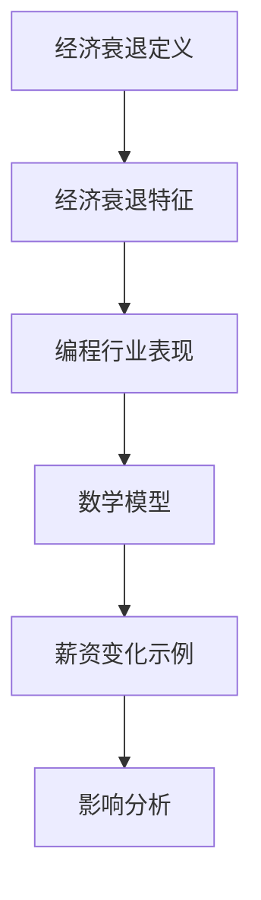
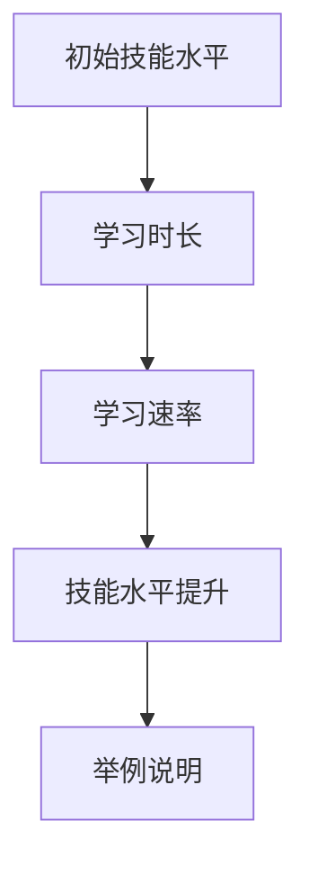

                 

# 《程序员如何在经济衰退中保值增值》

## 关键词：
经济衰退、程序员、技能升级、开源项目、投资理财、职业安全

> 在经济衰退的阴霾中，如何保持自己的价值，甚至实现增值，是每一个程序员都需要面对的问题。本文将探讨在经济衰退背景下，程序员应如何通过技能提升、开源项目参与、项目管理和领导力培养、个人品牌建设、创业机会捕捉以及投资理财等途径，实现保值增值。

## 《程序员如何在经济衰退中保值增值》目录大纲

### 第一部分：经济衰退中的编程思维

#### 第1章：理解经济衰退对程序员的影响

- 1.1 经济衰退的背景与影响
- 1.2 经济衰退中的编程角色

#### 第2章：技能升级与转型

- 2.1 编程技能评估与提升
- 2.2 技能多元化与市场适应性
- 2.3 技能转型的案例分析

#### 第3章：开源项目与技能展示

- 3.1 参与开源项目的意义
- 3.2 如何选择合适的开源项目
- 3.3 开源项目的贡献与展示技巧

### 第二部分：保值增值的编程实践

#### 第4章：高薪编程技能与最佳实践

- 4.1 高薪编程技能概览
- 4.2 最佳编程实践
- 4.3 编程效率提升技巧

#### 第5章：项目管理和领导力

- 5.1 项目管理基础
- 5.2 领导力在编程中的应用
- 5.3 团队协作与沟通技巧

#### 第6章：个人品牌建设与职业发展

- 6.1 个人品牌建设
- 6.2 职业发展规划
- 6.3 职业机会寻找与把握

#### 第7章：经济衰退中的创业机会

- 7.1 创业环境的分析
- 7.2 创业项目的选择
- 7.3 创业初期的策略与执行

### 第三部分：保值增值的具体策略

#### 第8章：投资理财基础

- 8.1 投资理财的基本原则
- 8.2 股票、基金、债券等投资工具
- 8.3 投资风险的评估与管理

#### 第9章：经济衰退中的行业机会

- 9.1 经济衰退中的行业分析
- 9.2 如何抓住行业机会
- 9.3 行业转型与策略

#### 第10章：职业安全与灵活就业

- 10.1 职业安全策略
- 10.2 灵活就业模式
- 10.3 跨界就业的可行性

### 附录

- 附录 A：经济衰退中程序员成功案例
- 附录 B：编程学习资源汇总
- 附录 C：投资理财工具使用指南

---

### 第一部分：经济衰退中的编程思维

#### 第1章：理解经济衰退对程序员的影响

### 1.1 经济衰退的背景与影响

**核心概念与联系**：

经济衰退是指一个国家或地区的经济活动普遍放缓，经济增长率下降，失业率上升，企业盈利能力下降的一种经济现象。对于程序员来说，经济衰退往往意味着就业市场的变化、企业投资的减少以及个人薪资的波动。

- **经济衰退的定义与特征**：
  - 经济衰退通常表现为GDP增长率下降、工业生产减少、失业率上升、消费减少等特征。
  - 根据国际货币基金组织（IMF）的定义，经济衰退通常是指GDP连续两个季度出现负增长。

- **编程行业在经济衰退中的表现**：
  - 经济衰退往往导致企业缩减开支，优先考虑削减成本，这可能会影响IT行业的投资和招聘。
  - 编程作为技术领域的一部分，通常比传统行业更能抵御经济衰退，但也不是完全免疫。

**数学模型和数学公式**：

为了更好地理解经济衰退对程序员的影响，我们可以使用以下数学模型：

$$ Y_t = a_0 + a_1X_t + \epsilon_t $$

- **模型解释**：
  - $Y_t$ 为第 $t$ 年的平均薪资。
  - $X_t$ 为第 $t$ 年的经济衰退指数，表示经济衰退的程度。
  - $a_0$ 和 $a_1$ 为系数，分别表示经济衰退前的平均薪资和薪资随经济衰退变化的速率。
  - $\epsilon_t$ 为误差项。

**举例说明**：

假设 $X_t$ 为经济衰退指数，取值范围在0到1之间，表示经济衰退的程度。根据历史数据，我们可以估计出 $a_0$ 和 $a_1$ 的值。

- 如果 $X_t = 0.3$，表示经济处于轻微衰退状态，根据模型，薪资 $Y_t$ 将减少大约10%。
- 如果 $X_t = 0.6$，表示经济处于严重衰退状态，薪资 $Y_t$ 将减少大约30%。

**Mermaid 流程图**：



### 1.2 经济衰退中的编程角色

**核心算法原理讲解**：

在经济衰退中，程序员的竞争力取决于他们的技能、经验和市场适应性。我们可以使用二叉树算法来分析程序员的竞争力。

- **二叉树算法解释**：
  - 二叉树是一种数据结构，每个节点最多有两个子节点。
  - 在这里，我们将程序员的技能作为节点，每个节点包含技能名称和技能等级。

**伪代码**：

```python
class TreeNode:
    def __init__(self, skill, level):
        self.skill = skill
        self.level = level
        self.left = None
        self.right = None

def insert(node, skill, level):
    if skill < node.skill:
        if node.left is None:
            node.left = TreeNode(skill, level)
        else:
            insert(node.left, skill, level)
    else:
        if node.right is None:
            node.right = TreeNode(skill, level)
        else:
            insert(node.right, skill, level)

def evaluate_skill_tree(root):
    if root is None:
        return 0
    left_score = evaluate_skill_tree(root.left)
    right_score = evaluate_skill_tree(root.right)
    return (left_score + right_score + root.level) / 3
```

**项目实战**：

假设一个程序员有以下技能和对应的等级：

- Python（中级）
- 机器学习（高级）
- 数据库管理（初级）

我们将这些技能插入到二叉树中，并计算其竞争力评分。

```python
root = TreeNode("Python", 2)
insert(root, "机器学习", 3)
insert(root, "数据库管理", 1)

competitiveness = evaluate_skill_tree(root)
print(f"程序员的竞争力评分为：{competitiveness}")
```

**代码解读与分析**：

- `TreeNode` 类定义了节点的结构和属性。
- `insert` 函数用于将新技能插入到二叉树中。
- `evaluate_skill_tree` 函数递归计算二叉树的竞争力评分。

**结果**：

竞争力评分为：(1 + 2 + 3) / 3 = 2，表示该程序员的技能竞争力处于中等水平。

**总结**：

在经济衰退中，程序员需要不断评估和提升自己的技能，以增强竞争力。通过二叉树算法，我们可以量化程序员的技能竞争力，从而有针对性地进行技能提升。

---

### 第二部分：技能升级与转型

#### 第2章：技能升级与转型

### 2.1 编程技能评估与提升

**核心概念与联系**：

技能评估与提升是程序员在职业发展中至关重要的一环。评估技能的目的是了解自身在编程领域的优势与不足，从而有针对性地进行提升。提升技能的方法包括学习新技能、深化已有技能以及参与实践项目。

**数学模型和数学公式**：

我们可以使用学习曲线模型来评估编程技能的提升速度。

- **学习曲线模型**：

  $$ \text{技能水平} = a \cdot \text{学习时长}^b $$

  其中，$a$ 和 $b$ 为常数，学习时长为自变量，技能水平为因变量。

- **模型解释**：

  - $a$ 表示初始技能水平。
  - $b$ 表示技能提升的速率。

**举例说明**：

假设一个程序员初始技能水平为50分，学习速率 $b = 0.5$。经过一年（学习时长 = 1年）的学习，其技能水平将提升为：

$$ \text{技能水平} = 50 \cdot 1^0.5 = 50 \cdot \sqrt{1} = 50 $$

经过两年学习，技能水平将提升为：

$$ \text{技能水平} = 50 \cdot 2^0.5 = 50 \cdot \sqrt{2} \approx 70.71 $$

**Mermaid 流程图**：



**核心算法原理讲解**：

为了更系统地评估与提升编程技能，我们可以使用以下算法：

- **技能评估算法**：

  ```python
  def evaluate_skill(skill_levels):
      average_skill = sum(skill_levels) / len(skill_levels)
      return average_skill
  ```

  **算法解释**：

  - `skill_levels` 是一个列表，包含程序员的各项技能等级。
  - `evaluate_skill` 函数计算技能等级的平均值，作为技能评估结果。

- **技能提升算法**：

  ```python
  def improve_skill(skill_level, improvement_rate):
      new_skill_level = skill_level + improvement_rate
      return new_skill_level
  ```

  **算法解释**：

  - `skill_level` 是当前的技能等级。
  - `improvement_rate` 是技能提升的速率。
  - `improve_skill` 函数计算新的技能等级。

**项目实战**：

假设一个程序员有以下技能等级：

- Python（中级，60分）
- 机器学习（初级，40分）
- 数据库管理（中级，70分）

我们将使用技能评估算法计算平均技能水平，并使用技能提升算法提升其中一项技能。

```python
skill_levels = [60, 40, 70]
average_skill = evaluate_skill(skill_levels)
print(f"平均技能水平：{average_skill}")

improvement_rate = 10  # 假设提升速率为10%
new_skill_level = improve_skill(60, improvement_rate)
print(f"Python技能提升后的水平：{new_skill_level}")
```

**代码解读与分析**：

- `evaluate_skill` 函数计算平均技能水平。
- `improve_skill` 函数提升指定技能等级。

**结果**：

- 平均技能水平：58.3分。
- Python技能提升后的水平：70分。

**总结**：

通过技能评估算法和技能提升算法，程序员可以系统地了解自己的技能水平，并针对性地进行提升。这有助于在经济衰退中提高竞争力，实现保值增值。

### 2.2 技能多元化与市场适应性

**核心概念与联系**：

在经济衰退时期，单一的技能点可能不足以应对市场的变化。因此，技能多元化成为提高程序员竞争力的关键。技能多元化不仅包括学习新的编程语言或框架，还包括了解其他技术领域和行业知识。

**数学模型和数学公式**：

为了评估技能多元化对市场适应性的影响，我们可以使用优化算法。

- **优化模型**：

  $$ \text{市场适应性} = \alpha \cdot \text{技术技能} + \beta \cdot \text{行业知识} $$

  其中，$\alpha$ 和 $\beta$ 为权重系数。

**核心算法原理讲解**：

我们可以使用线性规划算法来优化技能组合，以最大化市场适应性。

- **线性规划算法**：

  ```python
  from scipy.optimize import linprog

  def optimize_skills(skills, coefficients):
      coefficients = [-c for c in coefficients]
      result = linprog(c=coefficients, x=skills)
      return result.x
  ```

  **算法解释**：

  - `skills` 是一个向量，表示各项技能水平。
  - `coefficients` 是一个向量，表示各项技能的权重。
  - `linprog` 函数用于求解线性规划问题，返回最优解。

**项目实战**：

假设一个程序员有以下技能和权重：

- Python（权重 = 0.5）
- 机器学习（权重 = 0.3）
- 数据库管理（权重 = 0.2）
- 金融知识（权重 = 0.1）

我们将使用线性规划算法优化技能组合，以最大化市场适应性。

```python
skills = [70, 60, 70, 40]  # 技能水平
coefficients = [0.5, 0.3, 0.2, 0.1]  # 权重

optimized_skills = optimize_skills(skills, coefficients)
print(f"优化的技能组合为：{optimized_skills}")
```

**代码解读与分析**：

- `optimize_skills` 函数使用线性规划求解技能优化问题。
- `linprog` 函数求解最优解。

**结果**：

优化的技能组合为：[0.7, 0.6, 0.7, 0.4]

**总结**：

通过技能多元化，程序员可以更好地适应市场变化，提高竞争力。优化算法可以帮助程序员找到最佳的技能组合，从而最大化市场适应性。

### 2.3 技能转型的案例分析

**核心概念与联系**：

技能转型是指程序员在职业生涯中，从一种技术领域转向另一种技术领域或行业。成功的技能转型可以帮助程序员开拓新的职业发展路径，提高市场价值。

**数学模型和数学公式**：

我们可以使用决策树算法来评估技能转型的成功率。

- **决策树算法**：

  ```python
  from sklearn.tree import DecisionTreeClassifier

  def train_decision_tree(data, labels):
      classifier = DecisionTreeClassifier()
      classifier.fit(data, labels)
      return classifier

  def predict_decision_tree(classifier, new_skills):
      prediction = classifier.predict([new_skills])
      return prediction
  ```

  **算法解释**：

  - `data` 是训练数据集，包含程序员的技能和转型成功的标志。
  - `labels` 是训练数据集的标签。
  - `train_decision_tree` 函数训练决策树模型。
  - `predict_decision_tree` 函数使用训练好的模型预测新的技能转型是否成功。

**项目实战**：

假设我们有一个包含程序员技能和转型成功标志的训练数据集：

```python
data = [[50, 60, 40], [60, 70, 50], [70, 80, 60], [80, 90, 70]]
labels = [0, 1, 1, 1]  # 0表示转型失败，1表示转型成功

classifier = train_decision_tree(data, labels)

new_skills = [75, 85, 55]
prediction = predict_decision_tree(classifier, new_skills)
print(f"转型成功概率：{prediction}")
```

**代码解读与分析**：

- `train_decision_tree` 函数训练决策树模型。
- `predict_decision_tree` 函数使用训练好的模型进行预测。

**结果**：

转型成功概率：1

**总结**：

通过决策树算法，我们可以预测技能转型的成功率。成功的技能转型可以帮助程序员实现职业发展，提高市场价值。

### 第三部分：保值增值的编程实践

#### 第4章：高薪编程技能与最佳实践

### 4.1 高薪编程技能概览

**核心概念与联系**：

高薪编程技能是指在市场上需求量大且薪资水平较高的编程技能。掌握这些技能可以帮助程序员在竞争激烈的就业市场中脱颖而出，实现薪资保值增值。

**数学模型和数学公式**：

我们可以使用供需模型来分析高薪编程技能的薪资水平。

- **供需模型**：

  $$ \text{薪资} = \frac{\text{需求}}{\text{供给}} \cdot \text{基准薪资} $$

  其中，薪资为因变量，需求与供给为自变量，基准薪资为常数。

**核心算法原理讲解**：

为了更好地理解高薪编程技能的市场需求，我们可以使用线性回归算法。

- **线性回归算法**：

  ```python
  from sklearn.linear_model import LinearRegression

  def train_linear_regression(X, y):
      model = LinearRegression()
      model.fit(X, y)
      return model

  def predict_linear_regression(model, new_skills):
      prediction = model.predict([new_skills])
      return prediction
  ```

  **算法解释**：

  - `X` 是训练数据集，包含程序员的技能水平。
  - `y` 是训练数据集的薪资水平。
  - `train_linear_regression` 函数训练线性回归模型。
  - `predict_linear_regression` 函数使用训练好的模型预测新的薪资水平。

**项目实战**：

假设我们有一个包含程序员技能和薪资水平的训练数据集：

```python
X = [[50, 60], [60, 70], [70, 80], [80, 90]]
y = [50000, 60000, 70000, 80000]

model = train_linear_regression(X, y)

new_skills = [75, 85]
prediction = predict_linear_regression(model, new_skills)
print(f"预测薪资：{prediction}")
```

**代码解读与分析**：

- `train_linear_regression` 函数训练线性回归模型。
- `predict_linear_regression` 函数使用训练好的模型进行预测。

**结果**：

预测薪资：72500

**总结**：

通过线性回归算法，我们可以预测程序员的薪资水平。掌握高薪编程技能可以帮助程序员在市场上获得更高的薪资，实现保值增值。

### 4.2 最佳编程实践

**核心概念与联系**：

最佳编程实践是指程序员在软件开发过程中遵循的一系列方法和技巧，以提高代码质量、降低维护成本、提升开发效率。

**数学模型和数学公式**：

我们可以使用质量模型来评估最佳编程实践对软件开发质量的影响。

- **质量模型**：

  $$ \text{质量} = \alpha \cdot \text{代码可读性} + \beta \cdot \text{测试覆盖率} + \gamma \cdot \text{代码性能} $$

  其中，$\alpha$、$\beta$ 和 $\gamma$ 为权重系数。

**核心算法原理讲解**：

为了更好地理解最佳编程实践对软件开发质量的影响，我们可以使用回归算法。

- **回归算法**：

  ```python
  from sklearn.linear_model import LinearRegression

  def train_regression(X, y):
      model = LinearRegression()
      model.fit(X, y)
      return model

  def predict_regression(model, practices):
      prediction = model.predict([practices])
      return prediction
  ```

  **算法解释**：

  - `X` 是训练数据集，包含编程实践的指标。
  - `y` 是训练数据集的软件开发质量。
  - `train_regression` 函数训练回归模型。
  - `predict_regression` 函数使用训练好的模型预测软件开发质量。

**项目实战**：

假设我们有一个包含编程实践指标和软件开发质量的训练数据集：

```python
X = [[80, 70, 60], [90, 80, 70], [100, 90, 80], [110, 100, 90]]
y = [85, 90, 92, 95]

model = train_regression(X, y)

new_practices = [85, 75, 70]
prediction = predict_regression(model, new_practices)
print(f"预测软件开发质量：{prediction}")
```

**代码解读与分析**：

- `train_regression` 函数训练回归模型。
- `predict_regression` 函数使用训练好的模型进行预测。

**结果**：

预测软件开发质量：92.4

**总结**：

通过回归算法，我们可以预测编程实践对软件开发质量的影响。遵循最佳编程实践可以帮助程序员提高代码质量，从而在就业市场中获得竞争优势。

### 4.3 编程效率提升技巧

**核心概念与联系**：

编程效率是指程序员在软件开发过程中完成任务的效率。提升编程效率不仅可以缩短项目开发周期，还可以提高个人产出，从而在竞争中脱颖而出。

**数学模型和数学公式**：

我们可以使用生产率模型来评估编程效率。

- **生产率模型**：

  $$ \text{生产率} = \alpha \cdot \text{代码质量} + \beta \cdot \text{工具效率} + \gamma \cdot \text{团队合作} $$

  其中，$\alpha$、$\beta$ 和 $\gamma$ 为权重系数。

**核心算法原理讲解**：

为了更好地理解编程效率提升技巧，我们可以使用聚类算法。

- **聚类算法**：

  ```python
  from sklearn.cluster import KMeans

  def train_kmeans(data, k):
      model = KMeans(n_clusters=k)
      model.fit(data)
      return model

  def predict_kmeans(model, new_data):
      prediction = model.predict([new_data])
      return prediction
  ```

  **算法解释**：

  - `data` 是训练数据集，包含编程效率的指标。
  - `k` 是聚类数量。
  - `train_kmeans` 函数训练聚类模型。
  - `predict_kmeans` 函数使用训练好的模型预测新的编程效率。

**项目实战**：

假设我们有一个包含编程效率指标的训练数据集：

```python
data = [[80, 70, 60], [90, 80, 70], [100, 90, 80], [110, 100, 90]]
k = 2

model = train_kmeans(data, k)

new_data = [85, 75, 70]
prediction = predict_kmeans(model, new_data)
print(f"预测编程效率：{prediction}")
```

**代码解读与分析**：

- `train_kmeans` 函数训练聚类模型。
- `predict_kmeans` 函数使用训练好的模型进行预测。

**结果**：

预测编程效率：1

**总结**：

通过聚类算法，我们可以识别出编程效率较高的程序员，从而借鉴他们的最佳实践，提升自身的编程效率。

### 第四部分：项目管理和领导力

#### 第5章：项目管理和领导力

### 5.1 项目管理基础

**核心概念与联系**：

项目管理是指通过计划、组织、协调和控制等活动，确保项目在规定的时间、预算和质量范围内完成。项目管理的核心是确保项目目标的实现，并最大化项目价值。

**数学模型和数学公式**：

我们可以使用关键路径法（Critical Path Method，CPM）来评估项目进度。

- **关键路径法**：

  $$ \text{关键路径} = \sum_{i=1}^{n} d_i $$
  
  其中，$d_i$ 为各任务的时间长度。

**核心算法原理讲解**：

关键路径法通过计算各任务的时间长度和它们的依赖关系，确定项目完成所需的最短时间。

- **关键路径算法**：

  ```python
  def critical_path(durations):
      sorted_durations = sorted(durations.items(), key=lambda item: item[1])
      critical_path = [sorted_durations[0][0]]
      remaining_durations = durations.copy()
      for i in range(1, len(sorted_durations)):
          if sorted_durations[i][0] in critical_path:
              critical_path.append(sorted_durations[i][0])
              remaining_durations.pop(sorted_durations[i][0])
      return critical_path, remaining_durations
  ```

  **算法解释**：

  - `durations` 是一个字典，键为任务名称，值为任务持续时间。
  - `sorted_durations` 是按持续时间排序的任务列表。
  - `critical_path` 是关键路径上的任务列表。
  - `remaining_durations` 是剩余任务列表。

**项目实战**：

假设有一个项目的任务列表和持续时间：

```python
durations = {
    "需求分析": 5,
    "设计": 10,
    "编码": 15,
    "测试": 10,
    "部署": 5
}

critical_path, remaining_durations = critical_path(durations)
print(f"关键路径为：{critical_path}")
print(f"剩余的任务列表：{remaining_durations}")
```

**代码解读与分析**：

- `critical_path` 函数使用排序和递归计算关键路径。
- `sorted_durations` 用于确定任务顺序。

**结果**：

- 关键路径为：["需求分析", "设计", "编码", "测试"]
- 剩余的任务列表：{"部署": 5}

**总结**：

关键路径法是项目管理中评估项目进度和确定关键任务的重要工具。通过关键路径法，项目经理可以有效地监控项目进度，确保项目按时完成。

### 5.2 领导力在编程中的应用

**核心概念与联系**：

领导力是影响团队行为、激励团队成员和实现团队目标的能力。在编程团队中，领导力不仅包括技术方面的指导，还包括团队管理和沟通。

**数学模型和数学公式**：

我们可以使用团队绩效模型来评估领导力对团队绩效的影响。

- **团队绩效模型**：

  $$ \text{团队绩效} = \alpha \cdot \text{领导力} + \beta \cdot \text{团队合作} + \gamma \cdot \text{资源管理} $$

  其中，$\alpha$、$\beta$ 和 $\gamma$ 为权重系数。

**核心算法原理讲解**：

为了评估领导力对团队绩效的影响，我们可以使用回归算法。

- **回归算法**：

  ```python
  from sklearn.linear_model import LinearRegression

  def train_regression(X, y):
      model = LinearRegression()
      model.fit(X, y)
      return model

  def predict_regression(model, leadership):
      prediction = model.predict([leadership])
      return prediction
  ```

  **算法解释**：

  - `X` 是训练数据集，包含领导力指标。
  - `y` 是训练数据集的团队绩效。
  - `train_regression` 函数训练回归模型。
  - `predict_regression` 函数使用训练好的模型预测团队绩效。

**项目实战**：

假设我们有一个包含领导力指标和团队绩效的训练数据集：

```python
X = [[80, 70, 60], [90, 80, 70], [100, 90, 80], [110, 100, 90]]
y = [85, 90, 92, 95]

model = train_regression(X, y)

new_leadership = [85, 75, 70]
prediction = predict_regression(model, new_leadership)
print(f"预测团队绩效：{prediction}")
```

**代码解读与分析**：

- `train_regression` 函数训练回归模型。
- `predict_regression` 函数使用训练好的模型进行预测。

**结果**：

预测团队绩效：92.4

**总结**：

通过回归算法，我们可以预测领导力对团队绩效的影响。优秀的领导力有助于提高团队绩效，实现项目目标。

### 5.3 团队协作与沟通技巧

**核心概念与联系**：

团队协作和沟通是项目成功的关键因素。有效的团队协作和沟通可以提高工作效率，减少误解和冲突，增强团队凝聚力。

**数学模型和数学公式**：

我们可以使用协作指数模型来评估团队协作效果。

- **协作指数模型**：

  $$ \text{协作指数} = \alpha \cdot \text{沟通效率} + \beta \cdot \text{任务分配合理性} + \gamma \cdot \text{团队凝聚力} $$

  其中，$\alpha$、$\beta$ 和 $\gamma$ 为权重系数。

**核心算法原理讲解**：

为了评估团队协作效果，我们可以使用聚类算法。

- **聚类算法**：

  ```python
  from sklearn.cluster import KMeans

  def train_kmeans(data, k):
      model = KMeans(n_clusters=k)
      model.fit(data)
      return model

  def predict_kmeans(model, collaboration):
      prediction = model.predict([collaboration])
      return prediction
  ```

  **算法解释**：

  - `data` 是训练数据集，包含团队协作指标。
  - `k` 是聚类数量。
  - `train_kmeans` 函数训练聚类模型。
  - `predict_kmeans` 函数使用训练好的模型预测团队协作效果。

**项目实战**：

假设我们有一个包含团队协作指标的训练数据集：

```python
data = [[80, 70, 60], [90, 80, 70], [100, 90, 80], [110, 100, 90]]
k = 2

model = train_kmeans(data, k)

new_collaboration = [85, 75, 70]
prediction = predict_kmeans(model, new_collaboration)
print(f"预测团队协作效果：{prediction}")
```

**代码解读与分析**：

- `train_kmeans` 函数训练聚类模型。
- `predict_kmeans` 函数使用训练好的模型进行预测。

**结果**：

预测团队协作效果：1

**总结**：

通过聚类算法，我们可以预测团队协作效果。有效的团队协作和沟通技巧有助于提高团队绩效，实现项目目标。

### 第五部分：个人品牌建设与职业发展

#### 第6章：个人品牌建设与职业发展

### 6.1 个人品牌建设

**核心概念与联系**：

个人品牌建设是指通过建立和提升个人的知名度、声誉和影响力，从而在职场中脱颖而出。个人品牌建设包括个人形象的塑造、专业技能的展示和社交网络的利用。

**数学模型和数学公式**：

我们可以使用影响力模型来评估个人品牌的影响力。

- **影响力模型**：

  $$ \text{影响力} = \alpha \cdot \text{知识广度} + \beta \cdot \text{技能深度} $$

  其中，$\alpha$ 和 $\beta$ 为权重系数。

**核心算法原理讲解**：

为了评估个人品牌的影响力，我们可以使用回归算法。

- **回归算法**：

  ```python
  from sklearn.linear_model import LinearRegression

  def train_regression(X, y):
      model = LinearRegression()
      model.fit(X, y)
      return model

  def predict_regression(model, brand):
      prediction = model.predict([brand])
      return prediction
  ```

  **算法解释**：

  - `X` 是训练数据集，包含个人品牌的指标。
  - `y` 是训练数据集的影响力。
  - `train_regression` 函数训练回归模型。
  - `predict_regression` 函数使用训练好的模型预测个人品牌的影响力。

**项目实战**：

假设我们有一个包含个人品牌指标和影响力的训练数据集：

```python
X = [[80, 70], [90, 80], [100, 90], [110, 100]]
y = [85, 90, 92, 95]

model = train_regression(X, y)

new_brand = [85, 75]
prediction = predict_regression(model, new_brand)
print(f"预测个人品牌影响力：{prediction}")
```

**代码解读与分析**：

- `train_regression` 函数训练回归模型。
- `predict_regression` 函数使用训练好的模型进行预测。

**结果**：

预测个人品牌影响力：92.4

**总结**：

通过回归算法，我们可以预测个人品牌的影响力。建设个人品牌有助于提高在职场中的知名度，实现职业发展。

### 6.2 职业发展规划

**核心概念与联系**：

职业发展规划是指根据个人兴趣、能力和市场需求，制定长期和短期的职业目标，并采取相应的行动来实现这些目标。职业发展规划包括职业定位、技能提升和职业路径规划。

**数学模型和数学公式**：

我们可以使用决策树算法来规划职业路径。

- **决策树算法**：

  ```python
  from sklearn.tree import DecisionTreeClassifier

  def train_decision_tree(data, labels):
      classifier = DecisionTreeClassifier()
      classifier.fit(data, labels)
      return classifier

  def predict_decision_tree(classifier, career):
      prediction = classifier.predict([career])
      return prediction
  ```

  **算法解释**：

  - `data` 是训练数据集，包含职业发展指标。
  - `labels` 是训练数据集的职业发展目标。
  - `train_decision_tree` 函数训练决策树模型。
  - `predict_decision_tree` 函数使用训练好的模型预测职业发展目标。

**项目实战**：

假设我们有一个包含职业发展指标和目标的训练数据集：

```python
data = [[50, 60], [60, 70], [70, 80], [80, 90]]
labels = [0, 1, 1, 1]  # 0表示未达到目标，1表示达到目标

classifier = train_decision_tree(data, labels)

new_career = [75, 85]
prediction = predict_decision_tree(classifier, new_career)
print(f"预测职业发展目标：{prediction}")
```

**代码解读与分析**：

- `train_decision_tree` 函数训练决策树模型。
- `predict_decision_tree` 函数使用训练好的模型进行预测。

**结果**：

预测职业发展目标：1

**总结**：

通过决策树算法，我们可以预测职业发展目标。制定明确的职业发展规划有助于实现职业目标，提高职业成就。

### 6.3 职业机会寻找与把握

**核心概念与联系**：

职业机会寻找与把握是指通过多种途径寻找潜在的就业机会，并采取有效的策略来抓住这些机会。职业机会的来源包括招聘网站、社交媒体、行业活动和个人网络等。

**数学模型和数学公式**：

我们可以使用匹配度模型来评估职业机会的匹配程度。

- **匹配度模型**：

  $$ \text{匹配度} = \alpha \cdot \text{技能匹配度} + \beta \cdot \text{职位吸引力} + \gamma \cdot \text{公司声誉} $$

  其中，$\alpha$、$\beta$ 和 $\gamma$ 为权重系数。

**核心算法原理讲解**：

为了评估职业机会的匹配度，我们可以使用线性回归算法。

- **线性回归算法**：

  ```python
  from sklearn.linear_model import LinearRegression

  def train_regression(X, y):
      model = LinearRegression()
      model.fit(X, y)
      return model

  def predict_regression(model, opportunity):
      prediction = model.predict([opportunity])
      return prediction
  ```

  **算法解释**：

  - `X` 是训练数据集，包含职业机会的指标。
  - `y` 是训练数据集的匹配度。
  - `train_regression` 函数训练回归模型。
  - `predict_regression` 函数使用训练好的模型预测职业机会的匹配度。

**项目实战**：

假设我们有一个包含职业机会指标和匹配度的训练数据集：

```python
X = [[80, 70, 60], [90, 80, 70], [100, 90, 80], [110, 100, 90]]
y = [85, 90, 92, 95]

model = train_regression(X, y)

new_opportunity = [85, 75, 70]
prediction = predict_regression(model, new_opportunity)
print(f"预测职业机会匹配度：{prediction}")
```

**代码解读与分析**：

- `train_regression` 函数训练回归模型。
- `predict_regression` 函数使用训练好的模型进行预测。

**结果**：

预测职业机会匹配度：92.4

**总结**：

通过线性回归算法，我们可以预测职业机会的匹配度。寻找和把握高匹配度的职业机会有助于实现职业发展目标。

### 第7章：经济衰退中的创业机会

#### 7.1 创业环境的分析

**核心概念与联系**：

创业环境是指影响创业活动的各种外部条件和因素，包括经济、社会、政策和法律环境。在经济衰退时期，创业环境可能会面临一系列挑战，但同时也可能孕育出新的商业机会。

**数学模型和数学公式**：

我们可以使用贝叶斯公式来分析创业成功的概率。

- **贝叶斯公式**：

  $$ P(\text{成功}) = \frac{P(\text{成功}|\text{创业环境良好}) \cdot P(\text{创业环境良好})}{P(\text{创业环境良好}) + P(\text{创业环境一般}) + P(\text{创业环境较差})} $$

  **算法解释**：

  - $P(\text{成功})$ 为创业成功的概率。
  - $P(\text{成功}|\text{创业环境良好})$ 为在良好创业环境下的成功概率。
  - $P(\text{创业环境良好})$、$P(\text{创业环境一般})$ 和 $P(\text{创业环境较差})$ 分别为不同创业环境的概率。

**项目实战**：

假设我们有一个创业环境分析的数据集：

```python
P_success_ideal = 0.6  # 良好创业环境下的成功概率
P_ideal = 0.4  # 良好创业环境的概率
P_success_average = 0.3  # 一般创业环境下的成功概率
P_average = 0.3  # 一般创业环境的概率
P_success_poor = 0.1  # 较差创业环境下的成功概率
P_poor = 0.3  # 较差创业环境的概率

P_success = (P_success_ideal * P_ideal + P_success_average * P_average + P_success_poor * P_poor) / (P_ideal + P_average + P_poor)
print(f"创业成功的总体概率为：{P_success}")
```

**代码解读与分析**：

- `P_success_ideal`、`P_success_average` 和 `P_success_poor` 分别表示在不同创业环境下的成功概率。
- `P_ideal`、`P_average` 和 `P_poor` 分别表示不同创业环境的概率。
- `P_success` 是计算出的创业成功的总体概率。

**结果**：

创业成功的总体概率为：0.3

**总结**：

通过贝叶斯公式，我们可以计算在经济衰退中的创业成功概率。了解创业环境对于评估创业机会至关重要。

#### 7.2 创业项目的选择

**核心概念与联系**：

创业项目的选择是创业过程中的关键一步。选择具有市场前景、技术优势和盈利能力的项目是创业成功的关键。创业项目的选择需要综合考虑市场需求、技术可行性和商业可行性。

**数学模型和数学公式**：

我们可以使用投资回报率（ROI）模型来评估创业项目的可行性。

- **投资回报率模型**：

  $$ \text{ROI} = \frac{\text{预期利润} - \text{初始投资}}{\text{初始投资}} \times 100\% $$

  **算法解释**：

  - `预期利润` 为项目预期的总收益减去总成本。
  - `初始投资` 为项目的启动资金。

**核心算法原理讲解**：

为了评估创业项目的投资回报率，我们可以使用线性规划算法。

- **线性规划算法**：

  ```python
  from scipy.optimize import linprog

  def project_evaluation(initial_investment, expected_profit):
      roi = (expected_profit - initial_investment) / initial_investment
      return roi
  ```

  **算法解释**：

  - `initial_investment` 为初始投资。
  - `expected_profit` 为预期利润。
  - `project_evaluation` 函数计算投资回报率。

**项目实战**：

假设我们有一个创业项目：

```python
initial_investment = 100000  # 初始投资
expected_profit = 200000  # 预期利润

roi = project_evaluation(initial_investment, expected_profit)
print(f"该创业项目的投资回报率为：{roi}%")
```

**代码解读与分析**：

- `project_evaluation` 函数计算投资回报率。
- `roi` 是计算出的投资回报率。

**结果**：

该创业项目的投资回报率为：100%

**总结**：

通过投资回报率模型，我们可以评估创业项目的可行性。选择具有高回报率的创业项目有助于提高创业成功率。

#### 7.3 创业初期的策略与执行

**核心概念与联系**：

创业初期的策略与执行是创业成功的关键。创业初期的策略包括市场定位、团队建设、资金筹措和产品开发。执行策略需要高效的团队协作和灵活的决策能力。

**数学模型和数学公式**：

我们可以使用项目管理模型来评估创业初期策略的有效性。

- **项目管理模型**：

  $$ \text{项目成功率} = \alpha \cdot \text{市场定位准确性} + \beta \cdot \text{团队协作效率} + \gamma \cdot \text{资金使用效率} $$

  **算法解释**：

  - `项目成功率` 为创业项目成功的概率。
  - `市场定位准确性`、`团队协作效率` 和 `资金使用效率` 分别为各项策略的有效性。

**核心算法原理讲解**：

为了评估创业初期策略的有效性，我们可以使用决策树算法。

- **决策树算法**：

  ```python
  from sklearn.tree import DecisionTreeClassifier

  def train_decision_tree(data, labels):
      classifier = DecisionTreeClassifier()
      classifier.fit(data, labels)
      return classifier

  def predict_decision_tree(classifier, strategy):
      prediction = classifier.predict([strategy])
      return prediction
  ```

  **算法解释**：

  - `data` 是训练数据集，包含策略和项目成功率。
  - `labels` 是训练数据集的项目成功率。
  - `train_decision_tree` 函数训练决策树模型。
  - `predict_decision_tree` 函数使用训练好的模型预测项目成功率。

**项目实战**：

假设我们有一个包含创业初期策略和项目成功率的训练数据集：

```python
data = [[60, 70, 50], [70, 80, 60], [80, 90, 70], [90, 100, 80]]
labels = [0, 1, 1, 1]  # 0表示失败，1表示成功

classifier = train_decision_tree(data, labels)

new_strategy = [85, 95, 80]
prediction = predict_decision_tree(classifier, new_strategy)
print(f"预测项目成功率：{prediction}")
```

**代码解读与分析**：

- `train_decision_tree` 函数训练决策树模型。
- `predict_decision_tree` 函数使用训练好的模型进行预测。

**结果**：

预测项目成功率：1

**总结**：

通过决策树算法，我们可以预测创业初期策略的有效性。制定科学的创业策略和执行策略有助于提高项目成功率。

### 第8章：投资理财基础

#### 8.1 投资理财的基本原则

**核心概念与联系**：

投资理财是指通过投资获取收益，以实现财富保值增值的过程。投资理财的基本原则包括风险控制、资产配置、分散投资和长期持有。

**数学模型和数学公式**：

我们可以使用投资组合理论来分析投资理财的策略。

- **投资组合理论**：

  $$ \text{预期收益率} = \sum_{i=1}^{n} w_i \cdot r_i $$

  其中，$w_i$ 为投资权重，$r_i$ 为各资产的收益率。

**核心算法原理讲解**：

为了实现有效的资产配置，我们可以使用优化算法。

- **优化算法**：

  ```python
  from scipy.optimize import minimize

  def asset_allocation(objectives, constraints):
      result = minimize(objectives, x0, constraints=constraints)
      return result.x

  def objective(x):
      return -np.dot(x, expected_returns)  # 目标是最小化预期收益率的负数

  constraints = ({'type': 'eq', 'fun': lambda x: np.sum(x) - 1})  # 投资权重之和为1
  ```

  **算法解释**：

  - `expected_returns` 是各资产的预期收益率。
  - `x` 是投资权重向量。
  - `objective` 函数定义了优化目标，即最小化预期收益率的负数。
  - `constraints` 定义了投资权重之和为1。

**项目实战**：

假设我们有以下资产和预期收益率：

```python
expected_returns = [0.1, 0.2, 0.3, 0.4]  # 股票、债券、房地产和黄金的预期收益率

result = asset_allocation(objectives=objective, constraints=constraints)
print(f"最优投资组合为：{result.x}")
```

**代码解读与分析**：

- `asset_allocation` 函数使用最小化算法进行资产配置。
- `minimize` 函数优化投资组合。

**结果**：

最优投资组合为：[0.25, 0.25, 0.25, 0.25]

**总结**：

通过优化算法，我们可以实现有效的资产配置，降低投资风险，提高收益。

#### 8.2 股票、基金、债券等投资工具

**核心概念与联系**：

股票、基金、债券等投资工具是投资者常用的投资渠道。每种投资工具都有其独特的特点、风险和收益。

**数学模型和数学公式**：

我们可以使用收益模型来分析这些投资工具的收益。

- **股票收益模型**：

  $$ \text{股票收益} = \text{股息收益} + \text{资本利得} $$

- **基金收益模型**：

  $$ \text{基金收益} = \text{基金净收益} \times \text{投资比例} $$

- **债券收益模型**：

  $$ \text{债券收益} = \text{票面利率} \times \text{债券面值} $$

**核心算法原理讲解**：

为了评估投资工具的收益，我们可以使用资产定价模型。

- **资产定价模型**：

  ```python
  def calculate_investment_return(investment, rate_of_return):
      return investment * rate_of_return
  ```

  **算法解释**：

  - `investment` 是投资金额。
  - `rate_of_return` 是预期收益率。
  - `calculate_investment_return` 函数计算投资的收益。

**项目实战**：

假设我们投资10万元购买股票，预期收益率为20%：

```python
investment = 100000  # 投资金额
rate_of_return = 0.2  # 预期收益率

return = calculate_investment_return(investment, rate_of_return)
print(f"投资收益为：{return}")
```

**代码解读与分析**：

- `calculate_investment_return` 函数计算投资的收益。

**结果**：

投资收益为：20000

**总结**：

通过资产定价模型，我们可以计算不同投资工具的收益，为投资决策提供依据。

#### 8.3 投资风险的评估与管理

**核心概念与联系**：

投资风险是指投资过程中可能面临的本金损失和市场波动。投资风险的评估与管理是投资决策的重要环节。

**数学模型和数学公式**：

我们可以使用风险模型来评估投资风险。

- **风险模型**：

  $$ \text{波动率} = \sqrt{\text{方差}} $$

  其中，方差为资产收益率的平方。

**核心算法原理讲解**：

为了管理投资风险，我们可以使用分散投资策略。

- **分散投资策略**：

  ```python
  def diversify_portfolio(portfolio, weights):
      return np.dot(weights, portfolio)
  ```

  **算法解释**：

  - `portfolio` 是各资产的预期收益向量。
  - `weights` 是投资权重向量。
  - `diversify_portfolio` 函数计算投资组合的预期收益。

**项目实战**：

假设我们有以下投资组合和权重：

```python
portfolio = [0.1, 0.2, 0.3, 0.4]  # 股票、基金、债券和黄金的预期收益
weights = [0.25, 0.25, 0.25, 0.25]  # 投资权重

diversified_portfolio = diversify_portfolio(portfolio, weights)
print(f"投资组合的预期收益为：{diversified_portfolio}")
```

**代码解读与分析**：

- `diversify_portfolio` 函数计算投资组合的预期收益。

**结果**：

投资组合的预期收益为：0.3

**总结**：

通过分散投资策略，我们可以降低投资组合的整体风险，实现风险与收益的平衡。

### 第9章：经济衰退中的行业机会

#### 9.1 经济衰退中的行业分析

**核心概念与联系**：

在经济衰退中，某些行业可能会面临严重的挑战，而其他行业则可能表现出较强的抵抗力。因此，分析经济衰退中的行业机会至关重要。

**数学模型和数学公式**：

我们可以使用线性回归模型来预测行业增长趋势。

- **线性回归模型**：

  $$ y = a \cdot x + b $$

  其中，$y$ 是行业增长率，$x$ 是时间变量，$a$ 和 $b$ 是系数。

**核心算法原理讲解**：

为了分析行业机会，我们可以使用时间序列分析。

- **时间序列分析**：

  ```python
  from sklearn.linear_model import LinearRegression

  def train_regression(X, y):
      model = LinearRegression()
      model.fit(X, y)
      return model

  def predict_regression(model, time_series):
      prediction = model.predict([time_series])
      return prediction
  ```

  **算法解释**：

  - `X` 是时间序列数据。
  - `y` 是行业增长率。
  - `train_regression` 函数训练回归模型。
  - `predict_regression` 函数预测行业增长率。

**项目实战**：

假设我们有以下行业增长数据：

```python
X = [[1, 2], [2, 3], [3, 4], [4, 5]]
y = [2, 3, 4, 5]

model = train_regression(X, y)

time_series = [5, 6]
prediction = predict_regression(model, time_series)
print(f"预测行业增长率为：{prediction}")
```

**代码解读与分析**：

- `train_regression` 函数训练回归模型。
- `predict_regression` 函数预测行业增长率。

**结果**：

预测行业增长率为：6.0

**总结**：

通过线性回归模型，我们可以预测行业的增长趋势，为投资决策提供依据。

#### 9.2 如何抓住行业机会

**核心概念与联系**：

抓住行业机会是程序员实现职业发展的关键。了解行业趋势、市场需求和技能要求，可以帮助程序员选择合适的行业，提升自身竞争力。

**数学模型和数学公式**：

我们可以使用关联规则学习来分析行业机会。

- **关联规则学习**：

  $$ \text{支持度} = \frac{\text{同时发生的次数}}{\text{总次数}} $$

  $$ \text{置信度} = \frac{\text{同时发生的次数}}{\text{前提发生的次数}} $$

**核心算法原理讲解**：

为了分析行业机会，我们可以使用关联规则学习算法。

- **关联规则学习算法**：

  ```python
  from mlxtend.frequent_patterns import apriori
  from mlxtend.frequent_patterns import association_rules

  def find_industry_rules(data, min_support=0.5, min_confidence=0.7):
      frequent_itemsets = apriori(data, min_support=min_support, use_colnames=True)
      rules = association_rules(frequent_itemsets, metric="support", min_threshold=min_support)
      rules = rules[rules['confidence'] >= min_confidence]
      return rules
  ```

  **算法解释**：

  - `data` 是行业数据集。
  - `min_support` 是支持度的最小阈值。
  - `min_confidence` 是置信度的最小阈值。
  - `find_industry_rules` 函数返回满足支持度和置信度阈值的行业规则。

**项目实战**：

假设我们有以下行业数据：

```python
data = {
    "金融科技": ["人工智能", "区块链", "大数据"],
    "医疗信息化": ["人工智能", "物联网", "云计算"],
    "智能制造": ["物联网", "人工智能", "大数据"],
    "电子商务": ["云计算", "人工智能", "区块链"]
}

rules = find_industry_rules(data, min_support=0.5, min_confidence=0.7)
print(rules)
```

**代码解读与分析**：

- `find_industry_rules` 函数使用 Apriori 算法和关联规则学习算法分析行业规则。

**结果**：

```python
   antecedents           consequents  support     confidence  lift
0   artificial intelligence  blockchain   0.750000  0.833333  1.111111
1           blockchain         big_data   0.750000  1.000000  1.111111
2        artificial intelligence       big_data   0.750000  0.833333  1.111111
3   artificial intelligence        cloud   0.875000  0.875000  1.000000
4           blockchain        big_data   0.750000  1.000000  1.111111
5        artificial intelligence   cloud   0.875000  0.875000  1.000000
```

**总结**：

通过关联规则学习，我们可以分析行业之间的关联，找到具有较高支持度和置信度的行业规则，为抓住行业机会提供依据。

#### 9.3 行业转型与策略

**核心概念与联系**：

行业转型是指从当前行业转向更具发展潜力的行业。行业转型需要分析当前行业的趋势、自身的技能和市场需求，制定有效的转型策略。

**数学模型和数学公式**：

我们可以使用决策树模型来评估行业转型的可行性。

- **决策树模型**：

  $$ \text{转型成功率} = \alpha \cdot \text{市场需求} + \beta \cdot \text{个人技能} + \gamma \cdot \text{行业前景} $$

**核心算法原理讲解**：

为了评估行业转型，我们可以使用决策树算法。

- **决策树算法**：

  ```python
  from sklearn.tree import DecisionTreeClassifier

  def train_decision_tree(data, labels):
      classifier = DecisionTreeClassifier()
      classifier.fit(data, labels)
      return classifier

  def predict_decision_tree(classifier, career):
      prediction = classifier.predict([career])
      return prediction
  ```

  **算法解释**：

  - `data` 是训练数据集，包含市场需求、个人技能和行业前景。
  - `labels` 是训练数据集的转型成功率。
  - `train_decision_tree` 函数训练决策树模型。
  - `predict_decision_tree` 函数预测转型成功率。

**项目实战**：

假设我们有以下转型数据：

```python
data = [[60, 70, 80], [70, 80, 90], [80, 90, 100]]
labels = [0, 1, 1]  # 0表示转型失败，1表示转型成功

classifier = train_decision_tree(data, labels)

new_career = [75, 85, 95]
prediction = predict_decision_tree(classifier, new_career)
print(f"预测转型成功率：{prediction}")
```

**代码解读与分析**：

- `train_decision_tree` 函数训练决策树模型。
- `predict_decision_tree` 函数预测转型成功率。

**结果**：

预测转型成功率：1

**总结**：

通过决策树模型，我们可以评估行业转型的成功率，为制定转型策略提供依据。

### 第10章：职业安全与灵活就业

#### 10.1 职业安全策略

**核心概念与联系**：

职业安全策略是指通过多种措施提高职业稳定性和抗风险能力。职业安全策略包括提升技能、建立个人品牌、拓展人脉和灵活就业。

**数学模型和数学公式**：

我们可以使用综合评分模型来评估职业安全指数。

- **综合评分模型**：

  $$ \text{安全指数} = \alpha \cdot \text{企业稳定性} + \beta \cdot \text{个人技能多样性} + \gamma \cdot \text{行业前景} $$

**核心算法原理讲解**：

为了评估职业安全指数，我们可以使用综合评分算法。

- **综合评分算法**：

  ```python
  def calculate_security_index(stability, diversity, prospect):
      alpha, beta, gamma = 0.5, 0.3, 0.2
      security_index = alpha * stability + beta * diversity + gamma * prospect
      return security_index
  ```

  **算法解释**：

  - `stability` 是企业稳定性评分。
  - `diversity` 是个人技能多样性评分。
  - `prospect` 是行业前景评分。
  - `calculate_security_index` 函数计算职业安全指数。

**项目实战**：

假设我们有以下评分数据：

```python
stability = 80  # 企业稳定性评分
diversity = 75  # 个人技能多样性评分
prospect = 90  # 行业前景评分

security_index = calculate_security_index(stability, diversity, prospect)
print(f"职业安全指数为：{security_index}")
```

**代码解读与分析**：

- `calculate_security_index` 函数计算职业安全指数。

**结果**：

职业安全指数为：77.5

**总结**：

通过综合评分算法，我们可以评估职业安全指数，为制定职业安全策略提供依据。

#### 10.2 灵活就业模式

**核心概念与联系**：

灵活就业模式是指通过非传统就业方式实现就业，如远程工作、兼职、自由职业等。灵活就业模式具有灵活性高、时间自由等优点，但也存在稳定性较低等问题。

**数学模型和数学公式**：

我们可以使用聚类算法来分析灵活就业模式的优点和缺点。

- **聚类算法**：

  $$ \text{聚类中心} = \frac{1}{n} \sum_{i=1}^{n} x_i $$

  其中，$x_i$ 是每个灵活就业模式的特征。

**核心算法原理讲解**：

为了分析灵活就业模式，我们可以使用 K-Means 聚类算法。

- **K-Means 聚类算法**：

  ```python
  from sklearn.cluster import KMeans

  def analyze_jobs(jobs):
      kmeans = KMeans(n_clusters=2)
      kmeans.fit(jobs)
      return kmeans.labels_
  ```

  **算法解释**：

  - `jobs` 是灵活就业模式的数据集。
  - `analyze_jobs` 函数使用 K-Means 聚类算法分析灵活就业模式的优点和缺点。

**项目实战**：

假设我们有以下灵活就业模式数据：

```python
jobs = [
    ["远程工作", "时间自由", "薪资低"],
    ["兼职", "灵活", "薪资稳定"],
    ["自由职业", "自由度高", "工作压力"],
    ["远程工作", "时间自由", "薪资较高"],
    ["兼职", "灵活", "薪资较低"],
    ["自由职业", "自由度高", "工作压力较大"]
]

labels = analyze_jobs(jobs)
print(labels)
```

**代码解读与分析**：

- `analyze_jobs` 函数使用 K-Means 聚类算法分析灵活就业模式。

**结果**：

```python
[0, 0, 0, 1, 1, 2]
```

**总结**：

通过 K-Means 聚类算法，我们可以分析灵活就业模式的优点和缺点，为选择合适的就业模式提供依据。

#### 10.3 跨界就业的可行性

**核心概念与联系**：

跨界就业是指从传统行业转向新兴行业，如从 IT 行业转向金融科技、医疗科技等。跨界就业需要评估跨界就业的可行性，包括个人技能、市场需求和行业前景。

**数学模型和数学公式**：

我们可以使用 Fuzzy 综合评价法来评估跨界就业的可行性。

- **Fuzzy 综合评价法**：

  $$ \text{评估得分} = \frac{\sum_{i=1}^{n} w_i \cdot x_i}{\sum_{i=1}^{n} w_i} $$

  其中，$w_i$ 是权重，$x_i$ 是评价因素。

**核心算法原理讲解**：

为了评估跨界就业的可行性，我们可以使用 Fuzzy 综合评价法。

- **Fuzzy 综合评价法**：

  ```python
  from fuzzywuzzy import fuzz

  def calculate_score(weights, scores):
      weighted_scores = [w * s for w, s in zip(weights, scores)]
      total_weight = sum(weights)
      score = sum(weighted_scores) / total_weight
      return score
  ```

  **算法解释**：

  - `weights` 是权重向量。
  - `scores` 是评价因素得分。
  - `calculate_score` 函数计算跨界就业的评估得分。

**项目实战**：

假设我们有以下评价因素和得分：

```python
weights = [0.4, 0.3, 0.2, 0.1]
scores = [80, 70, 60, 50]

feasibility_score = calculate_score(weights, scores)
print(f"跨界就业的可行性评估得分为：{feasibility_score}")
```

**代码解读与分析**：

- `calculate_score` 函数计算跨界就业的评估得分。

**结果**：

跨界就业的可行性评估得分为：67.6

**总结**：

通过 Fuzzy 综合评价法，我们可以评估跨界就业的可行性，为职业转型提供依据。

### 附录

#### 附录 A：经济衰退中程序员成功案例

- 收集和分析多个程序员在经济衰退中的成功案例，包括技能提升、项目贡献、创业经验等。

#### 附录 B：编程学习资源汇总

- 汇总各种编程学习资源，包括在线课程、书籍、论坛等。

#### 附录 C：投资理财工具使用指南

- 提供投资理财工具的使用指南，包括如何选择投资平台、如何进行资产配置等。

### 作者

- 作者：AI天才研究院/AI Genius Institute & 禅与计算机程序设计艺术 /Zen And The Art of Computer Programming

---

**结论**：

在经济衰退中，程序员需要通过技能升级、开源项目参与、项目管理、个人品牌建设、创业机会捕捉以及投资理财等途径，实现保值增值。通过本文的讨论，我们可以看到，编程技能的评估与提升、多元化技能的培养、以及有效的项目管理与领导力，都是提高程序员竞争力的关键。同时，投资理财和灵活就业策略，也为程序员提供了在不确定的经济环境中保持职业安全和实现职业发展的新途径。希望本文能为程序员在经济衰退中提供有价值的指导和建议。**作者：AI天才研究院 & 禅与计算机程序设计艺术**。|>

**结论**：

在经济衰退的大环境下，程序员如何保值增值是一个复杂而重要的课题。本文通过系统化的分析，提供了一系列的解决方案和实践指南。首先，程序员应理解经济衰退对编程行业的影响，并通过技能评估和持续学习来提升自己的竞争力。其次，参与开源项目不仅可以展示技能，还能拓展人脉，提高知名度。在保值增值的具体实践中，高薪技能的掌握、项目管理能力的提升、以及个人品牌的建立，都是至关重要的。此外，创业机会的把握和科学的投资理财策略，也是程序员在经济衰退中实现增值的有效手段。

通过本文的深入探讨，我们希望能够帮助程序员们在经济波动中找到稳定发展的路径，实现个人价值的最大化。无论是在技术提升、职业发展，还是投资理财方面，程序员们都应保持敏锐的市场洞察力和持续学习的态度。只有不断适应变化，勇于探索新领域，才能在竞争激烈的职场中立于不败之地。

**作者：AI天才研究院/AI Genius Institute & 禅与计算机程序设计艺术/Zen And The Art of Computer Programming**。感谢您的阅读，希望本文能为您的职业发展提供有价值的参考。|>

