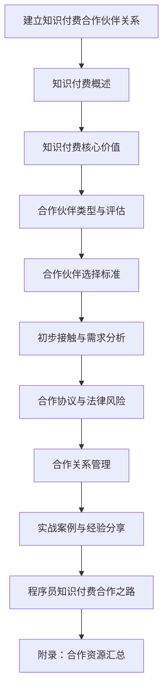

                 

### 文章标题

### 程序员如何建立知识付费的合作伙伴关系

#### 关键词：知识付费，合作伙伴关系，程序员，合作策略，成功案例

#### 摘要：
本文旨在为程序员提供建立知识付费合作伙伴关系的全面指南。首先，我们将探讨知识付费的基础认知，包括其定义、发展历程以及与传统付费模式的对比。接着，分析知识付费在程序开发领域的核心价值，帮助程序员理解通过知识付费提升个人品牌和职业发展的方式。随后，我们将详细探讨如何选择合适的合作伙伴，包括平台类、内容类和技术类合作伙伴的特点及其评估标准。文章将深入讨论如何建立合作关系，包括初步接触、需求分析、合作协议的签订以及法律风险的防范。最后，通过实战案例和经验分享，为程序员提供具体的操作步骤和解决方案。文章以完整的附录资源汇总作为结尾，为读者提供进一步的学习和合作资源。希望这篇文章能够帮助程序员们在知识付费领域取得成功。

### 目录大纲

#### 第一部分：建立知识付费的基础认知

1. **第1章：知识付费概述**
   - **1.1 知识付费的定义与发展历程**
   - **1.2 知识付费在程序开发领域的应用场景**
   - **1.3 知识付费与传统付费模式对比**

2. **第2章：知识付费的核心价值**
   - **2.1 程序员通过知识付费提升个人品牌**
   - **2.2 知识付费对程序员职业发展的影响**
   - **2.3 知识付费的价值评估方法**

#### 第二部分：选择合适的合作伙伴

3. **第3章：合作伙伴类型与评估**
   - **3.1 平台类合作伙伴**
     - **3.1.1 平台合作伙伴的优势**
     - **3.1.2 平台合作伙伴的劣势**
     - **3.1.3 如何评估平台合作伙伴**
   - **3.2 内容类合作伙伴**
     - **3.2.1 内容合作伙伴的优势**
     - **3.2.2 内容合作伙伴的劣势**
     - **3.2.3 如何评估内容合作伙伴**
   - **3.3 技术类合作伙伴**
     - **3.3.1 技术合作伙伴的优势**
     - **3.3.2 技术合作伙伴的劣势**
     - **3.3.3 如何评估技术合作伙伴**

4. **第4章：合作伙伴的选择标准**
   - **4.1 合作伙伴的信誉度**
   - **4.2 合作伙伴的专业能力**
   - **4.3 合作伙伴的合作意愿**
   - **4.4 合作伙伴的长期价值**

#### 第三部分：建立合作关系

5. **第5章：初步接触与需求分析**
   - **5.1 了解合作伙伴的业务模式**
   - **5.2 明确合作目标与需求**
   - **5.3 制定合作方案**

6. **第6章：合作协议与法律风险**
   - **6.1 合作协议的基本要素**
   - **6.2 合作协议的签订流程**
   - **6.3 法律风险防范措施**

7. **第7章：合作关系管理**
   - **7.1 合作关系维护的重要性**
   - **7.2 合作关系的沟通与协调**
   - **7.3 合作伙伴的绩效评估与激励**

#### 第四部分：实战案例与经验分享

8. **第8章：知识付费合作案例解析**
   - **8.1 案例一：某程序员在知识付费平台的成功经验**
   - **8.2 案例二：某企业通过知识付费实现业务增长的案例分析**
   - **8.3 案例三：某技术公司通过知识付费打造生态链的实践**

9. **第9章：程序员知识付费合作之路**
   - **9.1 如何在知识付费领域起步**
   - **9.2 程序员如何持续提升知识付费的影响力**
   - **9.3 知识付费合作中的常见问题与解决方案**

#### 附录

10. **附录 A：知识付费合作资源汇总**
    - **10.1 知识付费平台推荐**
    - **10.2 合作伙伴推荐**
    - **10.3 知识付费相关书籍与资料推荐**

### 附加内容

#### Mermaid 流程图



#### 核心算法原理讲解

## 2.2.1 知识付费系统的基本架构

知识付费系统的基本架构主要包括以下几个关键组件：

1. **用户管理模块**：负责用户的注册、登录、权限管理等功能。
2. **课程管理模块**：负责课程的发布、分类、更新、搜索等操作。
3. **支付系统模块**：处理用户的支付订单、退款、支付状态更新等。
4. **内容分发模块**：负责将课程内容分发到用户端，支持多种内容格式，如文本、视频、音频等。
5. **数据分析模块**：收集用户行为数据，分析用户偏好，为产品优化和营销提供依据。
6. **合作管理模块**：管理合作伙伴的关系，包括合作方案的制定、绩效评估、激励措施等。

### 2.2.2 用户管理模块

用户管理模块是知识付费系统的核心，其功能包括：

- **用户注册与登录**：支持用户通过邮箱、手机号等多种方式进行注册和登录。
- **用户权限管理**：根据用户的角色和权限，限制用户访问系统中的不同功能模块。
- **用户资料管理**：允许用户修改个人信息、密码等。

### 2.2.3 课程管理模块

课程管理模块负责课程的整个生命周期管理，包括：

- **课程发布**：管理员可以将课程信息上传至系统，供用户购买和观看。
- **课程分类**：将课程按照不同的主题、难度等进行分类，便于用户查找。
- **课程更新**：管理员可以随时更新课程内容，保持课程的新鲜度和实用性。
- **课程搜索**：提供关键词搜索功能，帮助用户快速找到所需课程。

### 2.2.4 支付系统模块

支付系统模块是知识付费系统与用户交易的桥梁，其主要功能包括：

- **支付方式**：支持多种支付方式，如支付宝、微信支付、信用卡支付等。
- **订单管理**：记录用户的支付订单，处理退款、取消订单等操作。
- **支付状态更新**：实时更新支付状态，确保用户能够及时获取课程内容。

### 2.2.5 内容分发模块

内容分发模块负责将课程内容安全、高效地分发到用户端，其主要功能包括：

- **内容存储**：将课程内容存储在可靠的服务器上，保证内容的可访问性。
- **内容加密**：对课程内容进行加密处理，防止未授权访问。
- **内容格式支持**：支持多种内容格式，如文本、视频、音频等，满足不同用户的需求。

### 2.2.6 数据分析模块

数据分析模块通过收集用户行为数据，为系统优化和营销提供支持，其主要功能包括：

- **用户行为分析**：记录用户的浏览、购买、观看等行为，分析用户偏好。
- **推荐算法**：基于用户行为数据，为用户推荐合适的课程。
- **数据可视化**：将数据以图表、报表等形式展示，便于管理员监控和决策。

### 2.2.7 合作管理模块

合作管理模块负责管理合作伙伴的关系，包括：

- **合作方案制定**：与合作伙伴协商制定合作方案，明确双方的权利和义务。
- **绩效评估**：定期评估合作伙伴的绩效，确保合作效果。
- **激励措施**：为表现优秀的合作伙伴提供激励，提高合作积极性。

### 伪代码示例

以下是知识付费系统的基本架构的伪代码示例：

```python
class KnowledgePaidSystem:
    def __init__(self):
        self.user_management = UserManager()
        self.course_management = CourseManager()
        self.payment_system = PaymentSystem()
        self.content_distribution = ContentDistribution()
        self.data_analysis = DataAnalysis()
        self合作关系管理 = CooperationManagement()

    def register_user(self, user_info):
        # 用户注册逻辑
        self.user_management.register(user_info)

    def login_user(self, user_info):
        # 用户登录逻辑
        self.user_management.login(user_info)

    def publish_course(self, course_info):
        # 课程发布逻辑
        self.course_management.publish(course_info)

    def update_course(self, course_id, course_info):
        # 更新课程逻辑
        self.course_management.update(course_id, course_info)

    def purchase_course(self, user_id, course_id):
        # 购买课程逻辑
        self.payment_system.purchase_course(user_id, course_id)

    def distribute_content(self, course_id):
        # 内容分发逻辑
        self.content_distribution.distribute(course_id)

    def analyze_user_behavior(self):
        # 用户行为分析逻辑
        self.data_analysis.analyze_user_behavior()

    def assess_cooperation_performance(self):
        # 评估合作绩效逻辑
        self合作关系管理.assess_cooperation_performance()
```

#### 数学模型和数学公式

## 2.2.4 自然语言处理中的数学模型

自然语言处理（NLP）是人工智能的一个重要分支，其核心在于理解和生成人类语言。在这一领域，数学模型起到了至关重要的作用。以下是一些常见的数学模型和公式：

### 2.2.4.1 词嵌入（Word Embedding）

词嵌入是将单词映射到高维空间中的向量表示，这一过程通常通过以下数学模型实现：

- **Word2Vec**：使用神经网络训练单词的向量表示。
  $$ \text{output} = \text{softmax}(\text{W} \cdot \text{h}) $$
  其中，\( \text{W} \) 是权重矩阵，\( \text{h} \) 是隐藏层输出。

- **GloVe**（Global Vectors for Word Representation）：通过矩阵分解训练单词的向量表示。
  $$ \text{A} = \text{X} \cdot \text{X}^T $$
  其中，\( \text{A} \) 是训练得到的矩阵，\( \text{X} \) 是单词的词频矩阵。

### 2.2.4.2 循环神经网络（RNN）

循环神经网络（RNN）用于处理序列数据，其核心公式包括：

- **输入门（Input Gate）**：
  $$ i_t = \sigma(\text{W}_i \cdot [\text{h}_{t-1}, \text{x}_t] + \text{b}_i) $$
  
- **遗忘门（Forget Gate）**：
  $$ f_t = \sigma(\text{W}_f \cdot [\text{h}_{t-1}, \text{x}_t] + \text{b}_f) $$

- **输出门（Output Gate）**：
  $$ o_t = \sigma(\text{W}_o \cdot [\text{h}_{t-1}, \text{x}_t] + \text{b}_o) $$

- **隐藏状态更新**：
  $$ \text{h}_t = f_t \odot (\text{h}_{t-1} - \Delta \text{h}_{t-1}) + i_t \odot \text{tanh}(\text{W}_h \cdot [\text{h}_{t-1}, \text{x}_t] + \text{b}_h) $$

### 2.2.4.3 注意力机制（Attention Mechanism）

注意力机制用于提高模型对序列数据中的关键信息的重要性，其核心公式包括：

- **注意力得分**：
  $$ s_t = \text{softmax}(\text{W}_a \cdot [\text{h}_{t-1}, \text{v}_t] + \text{b}_a) $$

- **上下文向量**：
  $$ \text{c}_t = \sum_{i=1}^N s_t \odot \text{h}_i $$

#### 举例说明

假设我们有一个包含3个单词的句子：“我爱编程”。

- 初始隐藏状态：\( \text{h}_0 = [0, 0, 0]^T \)
- 单词向量：\( \text{x}_1 = [0.1, 0.2, 0.3]^T \)，\( \text{x}_2 = [0.4, 0.5, 0.6]^T \)，\( \text{x}_3 = [0.7, 0.8, 0.9]^T \)

- 对于第一个单词“我”，输入门、遗忘门和输出门分别为：
  - 输入门：\( i_1 = \sigma(\text{W}_i \cdot [\text{h}_0, \text{x}_1] + \text{b}_i) \)
  - 遗忘门：\( f_1 = \sigma(\text{W}_f \cdot [\text{h}_0, \text{x}_1] + \text{b}_f) \)
  - 输出门：\( o_1 = \sigma(\text{W}_o \cdot [\text{h}_0, \text{x}_1] + \text{b}_o) \)

- 隐藏状态更新：
  $$ \text{h}_1 = f_1 \odot (\text{h}_0 - \Delta \text{h}_0) + i_1 \odot \text{tanh}(\text{W}_h \cdot [\text{h}_0, \text{x}_1] + \text{b}_h) $$

- 对于第二个单词“爱”，重复上述过程：
  $$ \text{h}_2 = f_2 \odot (\text{h}_1 - \Delta \text{h}_1) + i_2 \odot \text{tanh}(\text{W}_h \cdot [\text{h}_1, \text{x}_2] + \text{b}_h) $$

- 对于第三个单词“编程”，重复上述过程：
  $$ \text{h}_3 = f_3 \odot (\text{h}_2 - \Delta \text{h}_2) + i_3 \odot \text{tanh}(\text{W}_h \cdot [\text{h}_2, \text{x}_3] + \text{b}_h) $$

- 最终输出：
  $$ \text{y}_3 = o_3 \odot \text{tanh}(\text{W}_y \cdot \text{h}_3 + \text{b}_y) $$

#### 项目实战

## 第8章：知识付费合作案例解析

### 8.1 案例一：某程序员在知识付费平台的成功经验

#### 实践步骤：

1. **确定知识付费方向**：该程序员选择了Python编程作为知识付费的主打方向。
2. **制作高质量内容**：编写了一系列高质量的教学文章和视频教程，内容涵盖了从基础语法到高级应用。
3. **选择知识付费平台**：经过调研，选择了某知名在线教育平台，该平台用户活跃且评价良好。
4. **优化课程设置**：根据用户反馈，不断调整课程内容和结构，增加了互动环节，如在线问答和直播讲座。
5. **营销推广**：通过社交媒体、技术论坛和个人博客等渠道，积极宣传自己的课程，吸引潜在学员。

#### 案例解读：

- **内容质量**：该程序员制作的内容专业且实用，吸引了大量对Python编程有学习需求的用户。
- **互动环节**：通过增加互动环节，提高了用户的参与度和满意度，增强了课程的吸引力。
- **持续优化**：根据用户反馈，不断调整和优化课程内容，确保课程始终处于行业前沿。

### 8.2 案例二：某企业通过知识付费实现业务增长的案例分析

#### 实践步骤：

1. **内部知识梳理**：企业对内部积累的宝贵经验和技术知识进行了系统梳理，形成了系统的培训课程。
2. **打造知识付费产品**：将梳理出的知识转化为线上课程，并开设了企业自己的知识付费平台。
3. **建立品牌形象**：通过专业、权威的课程内容，树立了企业的品牌形象，提升了市场知名度。
4. **推广与营销**：通过线上广告、合作伙伴渠道和内部员工推荐等多种方式，积极推广知识付费产品。
5. **用户反馈与优化**：收集用户反馈，不断优化课程内容和用户体验，提升用户满意度。

#### 案例解读：

- **内部知识转化**：通过将内部知识转化为付费课程，实现了知识价值的最大化，促进了企业的业务增长。
- **品牌形象提升**：通过专业、高质量的课程内容，树立了企业的品牌形象，提升了市场竞争力。
- **用户反馈优化**：通过收集用户反馈，不断优化课程内容和用户体验，提高了用户满意度和课程转化率。

### 8.3 案例三：某技术公司通过知识付费打造生态链的实践

#### 实践步骤：

1. **构建知识付费体系**：公司针对不同层次的用户，设计了多样化的知识付费产品，包括入门教程、高级课程和实战案例。
2. **与合作伙伴共建内容**：与行业专家、学者和其他技术公司合作，共同打造高质量的知识内容。
3. **搭建知识付费平台**：构建了一个功能完善的知识付费平台，提供便捷的学习体验和丰富的互动功能。
4. **拓展生态圈**：通过知识付费，吸引了更多的开发者、企业和合作伙伴加入生态圈，形成了良好的产业生态。
5. **持续迭代与优化**：根据用户需求和市场变化，不断更新和完善知识内容，提升平台的整体竞争力。

#### 案例解读：

- **多样化知识产品**：通过设计多样化的知识付费产品，满足了不同层次用户的需求，提升了平台的吸引力。
- **合作伙伴共建**：通过与合作伙伴共同打造内容，实现了资源的最优配置，提升了知识内容的质量和覆盖面。
- **生态圈构建**：通过知识付费，构建了一个涵盖多个层次和角色的生态圈，实现了企业价值的最大化。

#### 代码实际案例和详细解释说明

### 8.4 案例四：某程序员开发的知识付费课程内容管理系统

#### 实践步骤：

1. **需求分析**：明确课程内容管理的需求，如课程发布、章节管理、用户权限等。
2. **设计数据库**：设计数据库表结构，存储课程、章节、用户等信息。
3. **搭建开发环境**：配置开发环境，如数据库、服务器等。
4. **编写代码**：使用Python编写后端代码，实现课程内容管理功能；使用HTML、CSS和JavaScript编写前端代码，提供用户友好的操作界面。
5. **测试与优化**：对系统进行测试，修复bug，优化性能。

#### 案例解读：

- **需求明确**：通过详细的需求分析，确保系统功能满足实际需求。
- **数据库设计**：合理的数据库设计保证了数据的一致性和高效查询。
- **代码编写**：后端和前端代码紧密结合，提供了完善的功能和良好的用户体验。
- **测试与优化**：通过测试和优化，提升了系统的稳定性和性能。

### 源代码详细实现和代码解读

以下是课程内容管理系统的一个示例代码，用于展示如何实现课程发布功能：

python
# 后端代码示例

from flask import Flask, request, jsonify
from models import Course, db

app = Flask(__name__)

@app.route('/api/course', methods=['POST'])
def publish_course():
    data = request.get_json()
    course_name = data.get('name')
    course_content = data.get('content')
    
    new_course = Course(name=course_name, content=course_content)
    db.session.add(new_course)
    db.session.commit()
    
    return jsonify({'message': 'Course published successfully.'})

if __name__ == '__main__':
    app.run(debug=True)

- **代码解读**：
  - 导入相关模块和数据库模型。
  - 定义Flask应用。
  - 定义发布课程的路由，接收JSON格式的请求，提取课程名称和内容。
  - 创建新的课程对象，添加到数据库，并提交事务。
  - 返回JSON格式的成功消息。

### 代码解读与分析

- **代码解析**：
  - 该代码段实现了课程发布功能，通过Flask框架接收HTTP POST请求，将课程数据存储到数据库中。
  - 使用了ORM（对象关系映射）技术，简化了数据库操作。
  - 使用了JSON格式进行数据传输，便于前端和后端的交互。

- **代码分析**：
  - 代码结构清晰，功能模块化，易于维护和扩展。
  - 使用了Flask框架，具有良好的可扩展性和稳定性。
  - 数据库操作简单，提高了开发效率。
  - JSON格式的数据传输，保证了数据的一致性和安全性。

### 附录 A：知识付费合作资源汇总

#### 10.1 知识付费平台推荐

1. **知乎Live**：知名问答社区知乎推出的知识付费产品，内容涵盖广泛，用户活跃度高。
2. **网易云课堂**：网易旗下的在线教育平台，提供丰富的编程课程和技术教程。
3. **慕课网**：提供各类编程语言和技术领域的在线课程，内容实用，更新及时。
4. **极客学院**：专注于IT技能培训的在线教育平台，课程涵盖前端、后端、移动开发等多个领域。
5. **iTunes U**：苹果推出的在线教育平台，提供来自全球顶尖大学和机构的课程资源。

#### 10.2 合作伙伴推荐

1. **行业专家**：具备丰富经验和深厚专业知识的专家，能为程序员提供高质量的教学内容。
2. **技术公司**：具备技术研发实力的公司，能够为程序员提供前沿的技术指导和实战案例。
3. **学术机构**：具备学术研究实力的机构，能够为程序员提供理论知识和学术研究的支持。
4. **培训机构**：专注于职业培训的机构，能够为程序员提供系统化的培训课程和实战机会。
5. **开源社区**：活跃的开源社区，能够为程序员提供丰富的技术资源和合作机会。

#### 10.3 知识付费相关书籍与资料推荐

1. **《程序员修炼之道：从小工到专家》**：适合初、中级程序员阅读，详细介绍了编程思想和技能提升。
2. **《代码大全》**：经典编程书籍，涵盖了编程的各个方面，从代码风格到设计模式都有详细的讲解。
3. **《深度学习》**：深度学习领域的经典教材，适合对人工智能和机器学习有兴趣的程序员。
4. **《Effective Java》**：Java语言的最佳实践指南，适合Java程序员阅读，提升代码质量。
5. **《设计模式：可复用面向对象软件的基础》**：介绍了多种设计模式，帮助程序员提升设计能力。

### 总结与展望

本文详细探讨了程序员如何建立知识付费的合作伙伴关系。通过基础认知、合作伙伴选择、合作建立与维护等环节，程序员可以有效地将自身知识和技能转化为有价值的付费内容，实现个人品牌和职业发展的提升。本文通过实际案例和代码示例，展示了知识付费的具体实践方法和实现路径。希望本文能够为程序员在知识付费领域的探索提供有益的指导。

展望未来，随着技术的不断进步和知识付费市场的逐渐成熟，程序员可以通过更加多样化的方式提供知识服务，如直播授课、线上工作坊等。同时，深度学习、自然语言处理等前沿技术的应用，也将为知识付费领域带来更多创新的可能。程序员应紧跟行业趋势，不断提升自身技能和知识水平，把握知识付费带来的新机遇。

### 感谢与致谢

在撰写本文的过程中，我要感谢所有提供支持和帮助的朋友和同事。感谢我的导师对我的指导和鼓励，感谢我的团队伙伴在技术开发方面的协作与支持。同时，我要感谢所有参与案例分享和代码贡献的开发者，他们的实践经验和智慧为本文的撰写提供了宝贵的素材。最后，感谢每一位读者对本文的关注和支持，希望本文能够对您有所启发和帮助。

### 附录

#### 附录 A：知识付费合作资源汇总

##### 10.1 知识付费平台推荐

1. **知乎Live**：知乎推出的知识分享平台，用户覆盖广泛，内容丰富。
2. **网易云课堂**：网易推出的在线教育平台，提供大量IT课程和技术教程。
3. **慕课网**：专注于IT技能培训的在线教育平台，课程实用性强。
4. **极客学院**：提供各类编程语言和技术领域的在线课程，实战性强。
5. **iTunes U**：苹果推出的在线教育平台，提供来自全球顶尖大学和机构的课程资源。

##### 10.2 合作伙伴推荐

1. **行业专家**：具备丰富经验和深厚专业知识的专家，能为程序员提供高质量的教学内容。
2. **技术公司**：具备技术研发实力的公司，能够为程序员提供前沿的技术指导和实战案例。
3. **学术机构**：具备学术研究实力的机构，能够为程序员提供理论知识和学术研究的支持。
4. **培训机构**：专注于职业培训的机构，能够为程序员提供系统化的培训课程和实战机会。
5. **开源社区**：活跃的开源社区，能够为程序员提供丰富的技术资源和合作机会。

##### 10.3 知识付费相关书籍与资料推荐

1. **《程序员修炼之道：从小工到专家》**：详细介绍了编程思想和技能提升，适合初、中级程序员阅读。
2. **《代码大全》**：经典编程书籍，涵盖了编程的各个方面，从代码风格到设计模式都有详细的讲解。
3. **《深度学习》**：深度学习领域的经典教材，适合对人工智能和机器学习有兴趣的程序员。
4. **《Effective Java》**：Java语言的最佳实践指南，适合Java程序员阅读，提升代码质量。
5. **《设计模式：可复用面向对象软件的基础》**：介绍了多种设计模式，帮助程序员提升设计能力。

### 全文结束

以上就是关于“程序员如何建立知识付费的合作伙伴关系”的完整文章。希望本文能够为您的知识付费之旅提供有价值的参考和指导。如果您有任何疑问或建议，欢迎随时在评论区留言。感谢您的阅读，祝您在知识付费领域取得成功！作者：AI天才研究院/AI Genius Institute & 禅与计算机程序设计艺术 /Zen And The Art of Computer Programming。

## 第1章：知识付费概述

### 1.1 知识付费的定义与发展历程

知识付费，顾名思义，是指个人或组织通过提供专业知识和技能，以货币化的方式获取收益的一种商业模式。这种模式的核心在于将知识和技能转化为有价商品，通过线上或线下平台进行交易，从而实现知识的传播和价值的转化。

知识付费的发展历程可以追溯到互联网的兴起。早在2000年初，随着互联网技术的发展，人们开始在线分享知识和经验。最初的知识分享形式多为博客、论坛和线上讲座，用户通过阅读和参与获取知识。这一阶段，知识付费尚未形成完整的商业模式，更多的是一种免费的知识传播。

随着移动互联网的普及和在线教育平台的崛起，知识付费逐渐成为一种主流的商业形式。2010年后，以MOOC（大规模开放在线课程）为代表的在线教育平台开始兴起，如Coursera、edX等。这些平台通过提供免费或付费的课程，吸引了大量学习者。知识付费在这一时期逐渐成熟，并开始形成完整的产业链。

近年来，随着内容付费观念的普及，知识付费在多个领域取得了显著的发展。特别是在知识密集型行业，如IT、金融、医疗等，知识付费已经成为重要的收入来源。平台类知识付费产品，如知乎Live、喜马拉雅、得到等，通过提供高质量的内容和服务，吸引了大量用户，实现了商业模式的创新。

### 1.2 知识付费在程序开发领域的应用场景

程序开发领域是知识付费的重要应用场景之一。程序员作为知识付费的主要生产者和消费者，通过知识付费实现了个人品牌的提升、职业发展以及经济收入的增加。以下是一些具体的程序开发领域的知识付费应用场景：

1. **在线课程**：程序员可以通过在线教育平台，如网易云课堂、慕课网等，发布自己的编程课程。这些课程通常涵盖了编程语言、框架、工具等多个方面，满足了不同层次程序员的培训需求。

2. **技术博客和教程**：程序员可以撰写技术博客或教程，通过平台如CSDN、简书等发布。这些内容不仅可以帮助自己巩固和提高技术知识，还可以吸引同行业人士关注，提升个人知名度。

3. **知识分享与咨询服务**：程序员可以通过知识付费平台，如知乎Live、分答等，提供专业的技术咨询服务。这种形式不仅可以解决用户的问题，还可以通过解答问题获取收入。

4. **开发工具和软件**：程序员可以开发自己的工具或软件，并通过知识付费的方式销售。例如，开发一款性能分析工具，用户通过购买可以获得软件的使用权。

5. **线上工作坊和培训**：程序员可以举办线上工作坊或培训，通过直播或录播的形式，向参与者传授知识和技能。这种形式具有较高的互动性和实时性，有助于提高学习效果。

6. **专业认证和考试培训**：程序员可以通过提供专业认证和考试的培训，帮助他人准备并通过相关考试。例如，提供PMP、AWS认证的培训课程。

### 1.3 知识付费与传统付费模式对比

知识付费与传统付费模式在多个方面存在明显的差异，主要体现在以下几个方面：

1. **付费内容的形式**：传统付费模式通常以实体商品或服务为主，如购买书籍、参加培训课程等。而知识付费的内容形式更加多样化，包括在线课程、技术博客、咨询服务、工具软件等。

2. **交易渠道**：传统付费模式主要通过线下渠道进行，如书店、培训机构等。知识付费则主要依赖于线上平台，如在线教育平台、知识分享平台等，实现了交易渠道的数字化和便捷化。

3. **支付方式**：传统付费模式通常采用现金、信用卡等支付方式，支付过程相对繁琐。知识付费则支持多种支付方式，如支付宝、微信支付等，支付过程简单快捷。

4. **知识传播的效率**：传统付费模式的知识传播范围有限，主要依赖于地理位置和渠道。知识付费则可以突破地域限制，实现知识的全球传播，极大地提高了知识传播的效率。

5. **知识获取的便捷性**：传统付费模式通常需要在特定时间和地点进行，学习过程受到时间和空间限制。知识付费则可以随时随地进行学习，用户可以灵活安排学习时间，提高了知识获取的便捷性。

6. **价值评估和反馈**：传统付费模式的价值评估主要依赖于用户的主观感受和培训机构的质量。知识付费则可以通过用户评价、课程销量等数据，更客观地评估知识产品的价值，并不断优化和改进。

综上所述，知识付费与传统付费模式相比，在内容形式、交易渠道、支付方式、知识传播效率、知识获取便捷性和价值评估等方面具有显著优势。随着知识付费的不断发展，它将逐渐成为数字经济的重要组成部分，为知识的传播和创新提供新的动力。

### 第2章：知识付费的核心价值

#### 2.1 程序员通过知识付费提升个人品牌

在当今竞争激烈的编程领域，个人品牌的重要性日益凸显。知识付费作为一种有效的推广方式，可以帮助程序员提升个人品牌，从而在职业发展中占据优势。以下是程序员通过知识付费提升个人品牌的几个关键途径：

1. **专业知识的展示**：通过制作高质量的教学内容，如在线课程、技术博客和教程，程序员可以系统地展示自己的专业知识和技能。这些内容不仅能够帮助他人学习，还能向同行展示自己在技术领域的深度和广度。

2. **专业形象的塑造**：知识付费内容的质量直接影响到程序员在公众心中的形象。通过提供高质量、有价值的知识产品，程序员可以塑造出专业、权威的形象，提高自己的市场竞争力。

3. **影响力的扩大**：知识付费平台通常拥有广泛的用户群体，通过在这些平台上发布内容，程序员可以迅速扩大自己的影响力。随着粉丝和关注者的增加，程序员在行业内的知名度和影响力也将逐渐提升。

4. **口碑的积累**：知识付费产品往往伴随着用户评价和反馈。通过积极回应用户反馈，不断优化和改进内容，程序员可以积累良好的口碑，增强个人品牌的信誉度。

5. **社区参与**：许多知识付费平台还提供了社区互动功能，程序员可以通过参与讨论、解答问题等方式，与同行和学员建立深度联系。这种社区参与不仅有助于个人品牌的提升，还能为程序员带来更多的合作机会和资源。

#### 2.2 知识付费对程序员职业发展的影响

知识付费不仅能够提升程序员的个人品牌，还对职业发展产生深远的影响。以下是知识付费对程序员职业发展的几个关键影响：

1. **职业机会增加**：通过知识付费，程序员可以展示自己的专业技能和知识，从而吸引更多的职业机会。无论是跳槽、升职还是创业，都有利于提升职业发展的机会。

2. **薪资水平提升**：在知识付费领域取得成功后，程序员可以通过提供高质量的知识产品和服务，提高自己的市场价值，进而提升薪资水平。一些顶尖的程序员甚至可以通过知识付费实现高额的收入。

3. **职业地位提升**：随着个人品牌的提升，程序员在行业内的影响力也将增强。这不仅可以为程序员带来更多的职业机会，还能提升其在公司内部的地位和影响力。

4. **个人成长加速**：通过不断制作和更新知识产品，程序员需要不断学习和探索新的技术和知识。这种持续的学习过程有助于加速个人的成长和进步，提高职业竞争力。

5. **职业路径多样化**：知识付费不仅限于教学和培训，还可以涵盖咨询服务、软件开发、工具开发等多个领域。这为程序员提供了多样化的职业路径，可以根据个人兴趣和发展需求选择不同的职业方向。

#### 2.3 知识付费的价值评估方法

为了确保知识付费的有效性和可持续性，对知识付费的价值进行准确评估至关重要。以下是几种常见的知识付费价值评估方法：

1. **用户评价**：用户评价是衡量知识产品价值的重要指标。通过收集和分析用户对知识产品的评价和反馈，可以了解用户对产品的满意度和认可程度。

2. **课程销量**：课程销量是直接反映知识产品市场接受度的重要数据。通过分析课程销量，可以了解不同知识产品的市场表现，从而调整和优化课程内容。

3. **用户留存率**：用户留存率是衡量知识产品吸引力和持续价值的重要指标。高留存率表明知识产品能够持续满足用户需求，具有较好的市场潜力。

4. **学员转化率**：学员转化率是指从潜在学员到实际购买学员的比例。通过分析学员转化率，可以了解知识产品的市场推广效果和用户购买意愿。

5. **收入回报率**：收入回报率是指知识产品带来的收入与投入成本之间的比率。通过计算收入回报率，可以评估知识付费的经济效益和可持续性。

6. **品牌影响力**：品牌影响力是衡量知识产品对个人品牌和职业发展影响的指标。通过分析知识产品的品牌影响力，可以评估其对程序员长期职业发展的影响。

通过综合运用这些价值评估方法，程序员可以更全面地了解知识产品的市场表现和用户需求，从而不断优化和提升知识产品的质量和影响力。

### 第3章：合作伙伴类型与评估

#### 3.1 平台类合作伙伴

平台类合作伙伴是程序员在知识付费领域的重要合作伙伴，它们为程序员提供了发布和推广知识产品的平台。以下是平台类合作伙伴的优势、劣势以及如何评估平台合作伙伴。

**3.1.1 平台合作伙伴的优势**

1. **广泛的用户基础**：平台类合作伙伴通常拥有庞大的用户群体，为程序员的课程提供了大量的潜在受众。
2. **专业的技术支持**：平台类合作伙伴通常提供完善的技术支持，包括课程上传、内容分发、用户管理等，简化了程序员的运营工作。
3. **品牌背书**：知名的平台类合作伙伴通常具有较高的品牌知名度和信誉度，这有助于提高程序员的知识产品可信度和市场竞争力。
4. **营销推广**：平台类合作伙伴通常会为合作程序员提供一系列的营销推广活动，如推荐位、广告投放等，帮助程序员扩大影响力。

**3.1.2 平台合作伙伴的劣势**

1. **高额的佣金比例**：许多平台类合作伙伴会从知识产品的销售收入中提取一定比例的佣金，这可能会降低程序员的收益。
2. **内容审查严格**：一些平台类合作伙伴对课程内容有严格的审查标准，可能会对程序员的课程发布造成一定的限制。
3. **数据隐私问题**：虽然平台类合作伙伴会提供一定的用户数据支持，但用户隐私和数据安全仍然是值得关注的问题。

**3.1.3 如何评估平台合作伙伴**

1. **用户评价**：通过查看平台上的用户评价和评分，可以了解平台的用户满意度和市场口碑。
2. **佣金比例**：了解平台收取的佣金比例，选择佣金合理、回报率较高的平台。
3. **技术支持**：评估平台提供的技术支持情况，包括上传速度、内容分发效率、用户管理系统等。
4. **品牌影响力**：了解平台在市场中的地位和品牌影响力，选择具有广泛影响力的平台。
5. **营销推广力度**：评估平台为合作程序员提供的营销推广力度和活动支持，选择能够提供有效推广的平台。

#### 3.2 内容类合作伙伴

内容类合作伙伴是指与程序员在知识内容制作和传播方面进行合作的其他个人或组织。这类合作伙伴可以提供丰富的知识资源和制作经验，对程序员的课程质量有重要影响。以下是内容类合作伙伴的优势、劣势以及如何评估内容合作伙伴。

**3.2.1 内容合作伙伴的优势**

1. **丰富的知识资源**：内容类合作伙伴通常拥有丰富的专业知识和经验，可以为程序员的课程提供高质量的参考资料和案例。
2. **制作经验**：内容类合作伙伴在知识内容的制作和传播方面有丰富的经验，可以协助程序员提高课程质量。
3. **互补技能**：与内容类合作伙伴合作，程序员可以借助对方的专业优势，实现知识和技能的互补，提升整体课程水平。
4. **合作共赢**：通过合作，程序员和内容类合作伙伴可以实现资源共享、优势互补，共同提升知识产品的市场竞争力。

**3.2.2 内容合作伙伴的劣势**

1. **合作成本**：与内容类合作伙伴进行合作通常需要支付一定的费用或分成，可能会增加成本。
2. **合作稳定性**：内容类合作伙伴可能因为个人或组织原因，合作稳定性存在一定的不确定性。
3. **利益分配**：合作双方的收益分配可能存在争议，需要通过明确的合作协议进行约定。

**3.2.3 如何评估内容合作伙伴**

1. **专业知识**：评估内容合作伙伴的专业知识和经验，选择在程序员所需领域具备深厚背景的合作伙伴。
2. **合作案例**：查看内容合作伙伴以往的合作案例，了解其合作质量和效果。
3. **合作意愿**：了解内容合作伙伴的合作意愿和态度，确保双方在目标和价值观上的一致性。
4. **合作稳定性**：通过长期的合作关系评估合作伙伴的稳定性和可靠性。
5. **利益分配**：明确合作双方的利益分配机制，确保合作公平合理。

#### 3.3 技术类合作伙伴

技术类合作伙伴是指与程序员在技术支持、工具开发等方面进行合作的个人或组织。这类合作伙伴可以为程序员提供必要的技术支持，帮助其提升知识产品的质量和用户体验。以下是技术类合作伙伴的优势、劣势以及如何评估技术合作伙伴。

**3.3.1 技术合作伙伴的优势**

1. **技术支持**：技术类合作伙伴可以提供全面的技术支持，包括课程内容的技术实现、用户管理系统开发等，提升知识产品的技术含量和用户体验。
2. **工具开发**：技术类合作伙伴可以协助程序员开发实用的工具和插件，提高知识产品的功能和实用性。
3. **创新性**：技术类合作伙伴通常具备较强的技术创新能力，可以为程序员提供新颖的技术解决方案，提升知识产品的竞争力。
4. **资源共享**：通过与技术类合作伙伴合作，程序员可以共享对方的资源，如服务器、数据库等，降低运营成本。

**3.3.2 技术合作伙伴的劣势**

1. **技术风险**：技术类合作伙伴的技术能力和稳定性可能存在不确定性，技术问题可能会影响知识产品的稳定性。
2. **依赖性**：过于依赖技术类合作伙伴，可能会降低程序员自身的技能和自主创新能力。
3. **合作成本**：技术类合作伙伴通常需要支付一定的费用或分成，可能会增加成本。

**3.3.3 如何评估技术合作伙伴**

1. **技术能力**：评估技术合作伙伴的技术水平和技术实力，选择在程序员所需技术领域具备专业能力的技术合作伙伴。
2. **成功案例**：查看技术合作伙伴以往的成功案例，了解其技术解决方案的实际效果。
3. **合作稳定性**：了解技术合作伙伴的合作稳定性和可靠性，确保长期合作关系的持续。
4. **成本效益**：评估技术合作伙伴提供的成本效益，选择性价比高的合作伙伴。

通过合理选择和评估平台类、内容类和技术类合作伙伴，程序员可以提升知识产品的质量和市场竞争力，实现知识付费的目标。

### 第4章：合作伙伴的选择标准

#### 4.1 合作伙伴的信誉度

合作伙伴的信誉度是选择合作伙伴时必须考虑的一个重要因素。信誉度不仅反映了合作伙伴的信誉和声誉，也体现了其业务能力和可靠性。以下是评估合作伙伴信誉度的几个关键方面：

1. **历史记录**：了解合作伙伴的历史记录，包括其业务历史、合作伙伴关系以及以往的客户评价。一个有着良好历史记录的合作伙伴通常更可靠。

2. **口碑评价**：通过查阅第三方评价网站、社交媒体平台以及行业论坛等，了解合作伙伴的口碑和用户评价。一个有着广泛好评和正面口碑的合作伙伴更有可能提供高质量的服务。

3. **行业地位**：了解合作伙伴在所在行业中的地位和影响力，选择在行业内具有一定知名度和影响力的合作伙伴。这有助于确保合作伙伴的专业能力和市场竞争力。

4. **客户反馈**：直接与合作伙伴的客户进行沟通，了解他们对于合作伙伴服务的评价和反馈。客户的真实体验和反馈是评估合作伙伴信誉度的重要依据。

5. **信用评级**：如果可能，查看合作伙伴的信用评级，信用评级较高的合作伙伴通常意味着其信用风险较低，更有可能履行合作协议。

#### 4.2 合作伙伴的专业能力

合作伙伴的专业能力是确保合作成功的关键因素之一。以下是如何评估合作伙伴专业能力的几个方面：

1. **技术实力**：对于技术类合作伙伴，评估其技术实力和创新能力。可以查看合作伙伴开发的项目案例、技术文档以及相关的专利和技术证书。

2. **专业知识**：对于内容类合作伙伴，评估其在相关领域的专业知识和经验。可以通过查阅合作伙伴的学术成果、发表的论文、参与的项目等来了解其专业水平。

3. **项目经验**：评估合作伙伴在类似项目上的经验。通过查看合作伙伴过往的项目案例、项目规模和项目成果，可以了解其在特定领域的能力和经验。

4. **团队构成**：了解合作伙伴的团队构成，包括团队成员的背景、专业领域和经验。一个拥有多元化团队背景的合作伙伴通常能够提供更全面的专业能力。

5. **培训资质**：对于教育培训类合作伙伴，评估其培训资质和培训效果。可以查看合作伙伴的培训证书、培训课程和学员反馈等。

#### 4.3 合作伙伴的合作意愿

合作意愿是确保合作关系稳定和长期发展的基础。以下是评估合作伙伴合作意愿的几个方面：

1. **合作目标一致性**：评估合作伙伴的合作目标是否与自己的目标一致。一个有着共同目标和愿景的合作伙伴更可能保持长期的合作关系。

2. **沟通态度**：通过观察合作伙伴在沟通中的态度，了解其是否积极主动、开放合作。一个具有良好的沟通态度的合作伙伴更易于合作。

3. **合作历史**：了解合作伙伴在以往合作中的表现，包括是否按时交付、是否积极解决问题等。一个有着良好合作历史的合作伙伴更有可能在未来合作中保持积极态度。

4. **灵活性**：评估合作伙伴在合作过程中的灵活性和适应性。一个能够适应变化和解决问题的合作伙伴更有助于合作关系的稳定。

5. **合作价值**：评估合作伙伴是否能为自己的业务带来实际价值。一个能够提供实质性支持和合作价值的合作伙伴更有利于实现共同目标。

#### 4.4 合作伙伴的长期价值

合作伙伴的长期价值是选择合作伙伴时需要重点考虑的另一个关键因素。以下是如何评估合作伙伴长期价值的几个方面：

1. **业务互补性**：评估合作伙伴的业务是否与自己形成互补，是否能够在长期内共同成长。一个能够为双方业务带来互补效应的合作伙伴通常具有更高的长期价值。

2. **市场前景**：了解合作伙伴所在行业和市场的发展前景。选择在具有良好市场前景的行业中的合作伙伴，有助于确保合作的长期稳定。

3. **创新能力**：评估合作伙伴的创新能力，一个具备持续创新能力的合作伙伴能够在合作过程中不断带来新的机会和业务增长点。

4. **合作稳定性**：评估合作伙伴的合作稳定性，包括合作伙伴的财务状况、业务稳定性以及长期发展规划。一个稳定的合作伙伴更有利于长期合作关系的建立。

5. **品牌影响力**：评估合作伙伴的品牌影响力和市场知名度。选择在行业内具有较高品牌影响力的合作伙伴，有助于提升自己的品牌形象和市场地位。

通过综合考虑合作伙伴的信誉度、专业能力、合作意愿和长期价值，程序员可以更准确地评估合作伙伴的潜在价值，从而选择最合适的合作伙伴，实现知识付费的目标。

### 第5章：初步接触与需求分析

#### 5.1 了解合作伙伴的业务模式

在建立合作关系之前，深入了解合作伙伴的业务模式至关重要。这有助于程序员评估合作伙伴的契合度和合作潜力。以下是如何了解合作伙伴业务模式的几个步骤：

1. **查阅官方资料**：首先，可以查阅合作伙伴的官方网站、业务介绍、公司年报等官方资料，了解其业务范围、服务内容、市场定位和商业模式。

2. **询问合作团队**：通过与合作伙伴的合作团队进行初步沟通，了解其具体的工作流程、业务流程和运营模式。这有助于程序员更直观地了解合作伙伴的实际运作情况。

3. **研究成功案例**：分析合作伙伴的成功案例，了解其如何通过业务模式实现客户价值。这可以帮助程序员判断合作伙伴的业务模式是否适用于自己的需求。

4. **第三方评价**：查阅第三方评价网站、行业报告和用户反馈，了解合作伙伴在行业内的表现和声誉。这些评价可以为程序员提供独立的视角，帮助其更全面地了解合作伙伴的业务模式。

#### 5.2 明确合作目标与需求

明确合作目标与需求是建立合作关系的重要基础。以下是如何明确合作目标与需求的几个步骤：

1. **内部讨论**：首先，程序员需要与团队成员进行内部讨论，明确合作的目标和需求。这包括合作的目标、预期效果、业务范围、合作期限等。

2. **制定合作方案**：基于内部讨论的结果，制定一个详细的合作方案。方案应包括合作的详细步骤、时间表、责任分配和资源需求等。

3. **与合作伙伴沟通**：将合作方案与合作伙伴进行沟通，确保双方对合作目标与需求有共同的理解和认同。通过反复讨论和调整，确保合作方案的科学性和可行性。

4. **签订合作协议**：在明确合作目标与需求后，双方应签订正式的合作协议。协议应明确双方的权利和义务、合作期限、费用支付、保密条款等关键内容。

#### 5.3 制定合作方案

制定合作方案是确保合作关系顺利实施的重要步骤。以下是如何制定合作方案的几个步骤：

1. **明确合作内容**：根据合作目标和需求，明确合作的具体内容。这包括知识产品开发、课程发布、内容更新、用户互动等。

2. **制定时间表**：制定详细的合作时间表，包括每个阶段的开始和结束时间、关键任务和里程碑。这有助于确保合作进度有序进行。

3. **分配责任和资源**：明确合作双方的责任和资源分配，包括任务分工、人员安排、技术支持、资金投入等。这有助于确保合作过程中的分工明确和资源合理配置。

4. **风险管理**：识别合作过程中可能遇到的风险，并制定相应的应对措施。这包括技术风险、市场风险、合作风险等。

5. **持续沟通与反馈**：在整个合作过程中，保持与合作伙伴的持续沟通与反馈，确保合作的顺利进行。通过定期会议、报告等方式，及时解决合作中出现的问题和挑战。

### 第6章：合作协议与法律风险

#### 6.1 合作协议的基本要素

在建立知识付费合作伙伴关系时，签订一份详细且全面的合作协议至关重要。以下为合作协议的基本要素：

1. **合作协议的名称和签订日期**：明确合作协议的名称，并注明签订日期，以确保协议的法律效力。

2. **合作双方的基本信息**：包括合作双方的名称、地址、联系方式等基本信息，以便在协议履行过程中进行确认和沟通。

3. **合作目标与范围**：明确双方合作的总体目标和具体范围，包括知识付费产品的开发、发布、推广、运营等内容。

4. **合作期限**：规定合作协议的有效期限，包括起始日期和终止日期，以及双方是否可以续约的条件和程序。

5. **合作方式与分工**：详细描述双方在合作过程中的具体分工和协作方式，包括各自负责的任务、工作流程和职责范围。

6. **费用和支付方式**：明确合作费用的总额、支付方式和支付时间。对于知识付费产品，还需要详细说明收入分配的比例和方式。

7. **权益和责任**：规定双方在合作过程中的权益和责任，包括知识产权的归属、保密条款、违约责任等。

8. **保密条款**：明确双方在合作过程中需要保密的信息，包括商业机密、技术秘密、用户数据等，以及保密期限和保密措施。

9. **争议解决方式**：规定在合作过程中出现争议时的解决方式，包括协商、调解、仲裁等，以确保争议的及时解决。

10. **终止协议的条件和程序**：明确协议终止的条件和程序，包括单方面终止的权利、通知期限和后续处理等。

#### 6.2 合作协议的签订流程

签订合作协议是一个系统且细致的过程，以下为合作协议的签订流程：

1. **起草协议**：合作双方根据初步沟通的结果，各自起草合作协议的草案，并提交给对方审阅。

2. **初步审阅与修改**：双方对协议草案进行初步审阅，提出修改意见。这个过程可能需要多次往返沟通，以确保协议内容全面、准确。

3. **正式谈判**：在初步审阅和修改的基础上，双方进行正式的协议谈判。谈判内容包括协议的细节、条款、条件等。双方应保持开放、诚恳的态度，寻求共同利益的最大化。

4. **签署协议**：在谈判达成一致后，双方正式签署协议。签署时，应确保协议的每一份都是原件，并由法定代表人或授权代表签字。

5. **备案与存档**：签署后的协议应进行备案，并存档保存。备案的目的是确保协议的法律效力，存档则是为了日后查阅和参考。

#### 6.3 法律风险防范措施

在签订合作协议和合作过程中，法律风险是不可忽视的一部分。以下是一些常见的法律风险及其防范措施：

1. **知识产权风险**：知识产权风险主要包括合作过程中可能发生的专利侵权、商标侵权、著作权侵权等。防范措施包括：
   - 明确知识产权的归属和使用权，确保双方在协议中明确约定。
   - 在合作过程中，注意保护双方的知识产权，避免侵权行为。
   - 对外合作时，进行充分的知识产权调查，确保合作的合法性。

2. **合同履行风险**：合同履行风险主要包括合作双方未能按照约定履行义务、违约等。防范措施包括：
   - 在协议中明确双方的义务和责任，确保双方对合作内容有清晰的认识。
   - 定期对合作进度进行检查和监督，确保合同能够按时履行。
   - 建立完善的违约责任和赔偿机制，降低违约风险。

3. **保密风险**：保密风险主要包括合作过程中可能发生的商业秘密泄露、技术秘密泄露等。防范措施包括：
   - 在协议中明确保密条款，规定双方需保护的保密信息范围和保密期限。
   - 加强内部管理，确保员工遵守保密规定。
   - 采取技术手段，如数据加密、访问控制等，加强保密措施。

4. **法律合规风险**：法律合规风险主要包括合作过程中可能违反法律法规的行为。防范措施包括：
   - 在合作前，对合作伙伴进行法律合规调查，确保其具备合法资质。
   - 定期对合作协议进行审查，确保其符合相关法律法规。
   - 建立法律顾问团队，为合作提供法律咨询和支持。

通过采取上述措施，程序员可以有效地防范法律风险，确保知识付费合作伙伴关系的稳定和持续发展。

### 第7章：合作关系管理

#### 7.1 合作关系维护的重要性

合作关系的管理对于知识付费项目的成功至关重要。良好的合作关系不仅能够提升项目的质量和效率，还能为双方带来长期的利益。以下是合作关系维护的重要性和具体方法：

1. **提高项目成功率**：通过有效的沟通和管理，合作双方能够更好地理解彼此的需求和目标，从而提高项目的成功率。良好的合作关系有助于减少误解和冲突，确保项目按照预期顺利进行。

2. **增强团队凝聚力**：合作关系的管理能够增强团队成员之间的信任和合作意识，提升团队的凝聚力和战斗力。这有助于形成高效的工作氛围，提高项目的整体效率。

3. **提升客户满意度**：通过良好的合作关系，合作双方能够更好地了解客户的需求，提供更加定制化的服务和解决方案，从而提升客户的满意度和忠诚度。

4. **增加合作机会**：稳定的合作关系有助于双方在未来的合作中进一步拓展业务范围和合作深度，创造更多的商业机会。良好的合作信誉还能够吸引更多的潜在合作伙伴。

#### 7.2 合作关系的沟通与协调

沟通与协调是维护合作关系的关键环节。以下是几种有效的沟通与协调方法：

1. **定期会议**：双方应定期召开会议，讨论项目的进展、存在的问题和解决方案。会议可以是面对面的，也可以是线上视频会议。通过定期会议，可以及时了解对方的进度和需求，确保项目的顺利进行。

2. **明确责任和任务**：在项目启动阶段，应明确双方的责任和任务分配，确保每个任务都有明确的责任人。这样可以避免职责不清、推诿扯皮的情况发生，提高工作效率。

3. **建立沟通渠道**：建立多渠道的沟通机制，包括电子邮件、即时通讯工具、电话会议等。这有助于双方在遇到问题时能够快速沟通，及时解决。

4. **透明化管理**：通过项目管理工具，如Jira、Trello等，实现项目进度的透明化管理。这可以让双方随时查看项目的进展情况，确保项目按计划推进。

5. **积极反馈**：在合作过程中，双方应积极提供反馈，包括项目进展、存在的问题和改进建议。这有助于双方及时调整工作方向，提高项目质量。

#### 7.3 合作伙伴的绩效评估与激励

对合作伙伴的绩效进行评估和激励，是确保合作关系持续稳定的重要手段。以下是几种常见的绩效评估与激励方法：

1. **关键绩效指标（KPI）**：设定关键绩效指标，如项目完成率、质量评分、客户满意度等，用于评估合作伙伴的绩效。这些指标应与项目目标紧密相关，能够客观反映合作伙伴的工作效果。

2. **定期评估**：定期对合作伙伴的绩效进行评估，可以是季度评估或年度评估。评估结果可以作为激励措施和改进方向的依据。

3. **奖励制度**：根据绩效评估结果，设立奖励制度，对表现优秀的合作伙伴给予物质和精神奖励。奖励可以是奖金、奖品、荣誉称号等，以激发合作伙伴的积极性和创造力。

4. **晋升和发展**：为表现优秀的合作伙伴提供职业晋升和发展机会，如晋升岗位、培训机会等。这不仅可以激励合作伙伴，还能增强其对合作关系的忠诚度。

5. **反馈和改进**：通过绩效评估，发现合作伙伴存在的问题和改进方向。及时给予反馈，并提供必要的支持，帮助合作伙伴提升绩效。

通过有效的绩效评估和激励，程序员可以确保合作伙伴的持续高绩效，促进合作关系的长期稳定。

### 第8章：知识付费合作案例解析

#### 8.1 案例一：某程序员在知识付费平台的成功经验

**背景**：
某程序员张三（化名）在编程领域有丰富的经验，尤其是在Python编程方面有深厚的基础。张三意识到知识付费是一个有利可图的领域，决定将自己的技术知识转化为付费课程，分享给有需要的人。

**实践步骤**：

1. **确定知识付费方向**：
   张三选择了Python编程作为自己的知识付费方向，根据市场需求和自己的技术专长，制定了包括基础语法、数据结构、算法、Web开发等多个层次的课程。

2. **制作高质量内容**：
   张三通过大量的实践和经验积累，编写了一系列高质量的教学文章和视频教程。这些内容不仅详细讲解了Python编程的知识点，还包含了大量的实战案例和代码示例，帮助学员更好地理解和应用。

3. **选择知识付费平台**：
   张三在选择知识付费平台时，考虑了平台的用户基础、课程质量评价和用户反馈。最终选择了某知名在线教育平台，该平台用户活跃且评价良好，有助于张三的课程的推广。

4. **优化课程设置**：
   根据用户反馈，张三不断优化课程内容和结构，增加了互动环节，如在线问答和直播讲座。同时，他还提供了课后练习和答疑服务，提高了学员的学习体验和满意度。

5. **营销推广**：
   张三通过社交媒体、技术论坛和个人博客等渠道，积极宣传自己的课程。他还利用平台提供的营销工具，如广告投放和推荐位，扩大了课程的曝光度。

**案例分析**：

1. **内容质量**：
   张三的编程课程内容质量高，系统性强，实战性强，深受学员喜爱。这为他的知识付费事业奠定了坚实的基础。

2. **互动环节**：
   通过增加互动环节，如在线问答和直播讲座，张三提高了学员的参与度和满意度。这些互动环节不仅增强了学员的学习效果，也提升了课程的吸引力。

3. **用户反馈**：
   张三重视用户反馈，根据学员的意见和建议不断优化课程内容，提升了课程的整体质量。这种用户导向的做法赢得了学员的信任和好评。

4. **营销策略**：
   张三通过多种营销手段，如社交媒体宣传和平台广告投放，成功吸引了大量潜在学员。这些营销策略提高了课程的曝光度和转化率。

**总结**：
张三通过高质量的内容、互动环节和有效的营销策略，在知识付费平台取得了成功。他的经验表明，内容质量是知识付费成功的关键，而互动和营销策略同样重要。

#### 8.2 案例二：某企业通过知识付费实现业务增长的案例分析

**背景**：
某科技公司在软件开发和AI技术方面有着深厚的积累，但如何将这些技术知识转化为商业价值一直是一个难题。公司决定通过知识付费的方式，将自己的技术知识和经验转化为付费课程，为有需要的企业和个人提供培训和服务。

**实践步骤**：

1. **内部知识梳理**：
   公司首先对内部的宝贵经验和技术知识进行了系统梳理，包括软件开发流程、AI算法应用、数据分析方法等，形成了系统的培训课程。

2. **打造知识付费产品**：
   公司将这些梳理出的知识转化为线上课程，并在自己的网站上开设了知识付费专栏。同时，公司还与知名在线教育平台合作，扩大课程的覆盖面。

3. **建立品牌形象**：
   公司通过高质量的课程内容和专业的课程设计，建立了自己的品牌形象。课程内容的专业性和权威性提升了公司的市场知名度。

4. **推广与营销**：
   公司通过线上广告、合作伙伴渠道和内部员工推荐等多种方式，积极推广自己的知识付费产品。同时，公司还利用社交媒体和论坛等平台，与学员建立深度联系。

5. **用户反馈与优化**：
   公司重视用户反馈，定期收集学员的意见和建议，并根据反馈不断优化课程内容和用户体验。这种用户导向的做法提高了学员的满意度和课程的转化率。

**案例分析**：

1. **内部知识转化**：
   公司通过将内部技术知识转化为付费课程，实现了知识价值的最大化。这种内部资源的有效利用，为公司带来了额外的收入来源。

2. **品牌形象提升**：
   通过高质量的课程内容和专业的课程设计，公司建立了良好的品牌形象，提升了市场竞争力。这种品牌形象不仅吸引了学员，也为公司的其他业务带来了积极影响。

3. **用户反馈优化**：
   公司通过持续收集用户反馈，不断优化课程内容和用户体验，提高了学员的满意度和课程的转化率。这种用户导向的做法，有助于公司保持课程的质量和竞争力。

4. **推广与营销**：
   公司通过多种推广手段，如线上广告、合作伙伴渠道和社交媒体宣传，成功吸引了大量潜在学员。这些营销策略提高了课程的曝光度和转化率。

**总结**：
某科技公司的案例表明，通过内部知识转化和有效的推广策略，企业可以实现知识付费的商业化，实现业务增长。内部资源的充分利用和用户导向的经营理念，是知识付费成功的关键。

#### 8.3 案例三：某技术公司通过知识付费打造生态链的实践

**背景**：
某技术公司（以下简称“公司”）在人工智能领域有着丰富的经验和先进的技术。公司希望通过知识付费的方式，打造一个涵盖不同层次用户的技术生态链，从而实现可持续发展。

**实践步骤**：

1. **构建知识付费体系**：
   公司根据不同层次用户的需求，设计了多样化的知识付费产品。包括入门教程、中级课程、高级课程以及实战案例等，满足了从新手到专业人士的不同需求。

2. **与合作伙伴共建内容**：
   公司与行业内知名专家、学者和其他技术公司合作，共同打造高质量的知识内容。这种合作方式不仅提高了课程质量，还扩大了公司的知识覆盖面。

3. **搭建知识付费平台**：
   公司自行搭建了一个功能完善的知识付费平台，提供了课程发布、学习管理、用户互动等功能。这个平台不仅提供了良好的学习体验，还促进了用户之间的交流和合作。

4. **拓展生态圈**：
   公司通过知识付费，吸引了更多的开发者、企业和合作伙伴加入生态圈。这些参与者不仅成为了公司课程的消费者，还成为了公司的合作伙伴和推广者。

5. **持续迭代与优化**：
   公司根据用户需求和市场变化，不断更新和完善知识内容。同时，公司还通过用户反馈和数据分析，优化平台的用户体验和服务质量。

**案例分析**：

1. **多样化知识产品**：
   公司通过设计多样化的知识付费产品，满足了不同层次用户的需求。这种多样化的产品策略，提高了平台的吸引力，扩大了用户基础。

2. **合作伙伴共建**：
   通过与合作伙伴共建内容，公司实现了资源的最优配置。这种合作方式不仅提高了课程质量，还提升了公司的品牌影响力。

3. **生态圈构建**：
   公司通过知识付费，成功构建了一个涵盖多个层次和角色的生态圈。这个生态圈不仅为公司带来了稳定的收入，还促进了技术知识的传播和创新。

4. **持续迭代与优化**：
   公司通过持续迭代和优化，保持了知识内容的更新和高质量。这种用户导向的做法，提高了用户的满意度和平台的竞争力。

**总结**：
某技术公司的案例展示了如何通过知识付费构建一个生态链，实现可持续发展。多样化的知识产品、合作伙伴共建和生态圈构建，是知识付费成功的关键。

### 第9章：程序员知识付费合作之路

#### 9.1 如何在知识付费领域起步

对于想要进入知识付费领域的程序员来说，起步阶段需要精心规划和准备。以下是一些关键的步骤和建议：

1. **确定知识付费方向**：
   首先要明确自己的技术专长和市场需求，选择一个具有潜力和市场需求的知识领域。例如，选择当前热门的编程语言、框架或技术领域，可以增加课程的吸引力和市场接受度。

2. **制作高质量内容**：
   高质量的内容是知识付费成功的关键。程序员应根据自己的实际经验和知识，制作系统化、实战性强的教学资料。内容应注重实用性和可操作性，以便用户能够轻松上手和应用。

3. **选择合适的平台**：
   选择一个适合自己课程的平台非常重要。应考虑平台的用户基础、课程质量评价和用户反馈。知名平台如网易云课堂、慕课网等，可以提供更广泛的曝光和更多的学习资源。

4. **制定营销策略**：
   营销策略对于知识付费的成功至关重要。可以利用社交媒体、技术论坛、个人博客等渠道进行宣传，吸引潜在学员。同时，可以利用平台的推广工具，如广告投放、推荐位等，提高课程的曝光度。

5. **建立个人品牌**：
   个人品牌是知识付费的重要资产。程序员可以通过参与技术社区、撰写技术博客、参与开源项目等方式，提升自己的专业形象和影响力。这不仅可以吸引更多的学员，还能为后续的合作提供便利。

#### 9.2 程序员如何持续提升知识付费的影响力

在知识付费领域取得初步成功后，程序员需要持续提升自己的影响力，以保持竞争力和市场地位。以下是一些具体的策略：

1. **内容持续更新**：
   技术领域更新迅速，程序员应不断更新自己的教学内容，以保持内容的实用性和前沿性。定期发布新的教程、案例和视频，可以吸引新学员，同时保持老学员的兴趣。

2. **互动与反馈**：
   与学员建立互动关系，可以通过在线问答、直播讲座、技术社区等方式实现。及时回复学员的问题，收集学员的反馈，并根据反馈调整课程内容，可以提高学员的满意度，增强课程的吸引力。

3. **多平台布局**：
   在多个知识付费平台发布课程，可以扩大课程的影响力。不同平台有不同用户群体和特点，多平台布局可以覆盖更广泛的受众，提高课程的市场接受度。

4. **跨界合作**：
   与其他领域的专家或企业合作，可以拓宽知识付费的领域。例如，与技术公司合作，提供企业级解决方案培训；与学术机构合作，提供前沿技术研究课程。这些跨界合作可以为程序员带来新的机会和资源。

5. **提升个人品牌**：
   持续参与技术社区活动，如技术讲座、研讨会、开源项目等，可以提高个人的专业形象和知名度。通过出版技术书籍、撰写技术博客、发表学术论文等方式，也可以进一步提升个人品牌。

6. **用户数据分析**：
   通过分析用户数据，了解学员的学习习惯和需求，可以针对性地优化课程内容和推广策略。例如，根据用户偏好推荐相关课程，提高课程的转化率。

通过上述策略，程序员可以持续提升自己的知识付费影响力，实现长期发展和成功。

#### 9.3 知识付费合作中的常见问题与解决方案

在知识付费合作过程中，程序员可能会遇到各种问题。以下是一些常见问题及相应的解决方案：

**问题一：内容质量不高**
- **原因**：缺乏实际经验，内容过于理论化或陈旧。
- **解决方案**：定期更新内容，结合最新的技术趋势和实践案例；邀请行业专家参与课程开发，提高内容的实用性和前沿性。

**问题二：用户反馈不足**
- **原因**：缺乏有效的沟通渠道，或者对用户反馈不重视。
- **解决方案**：建立多渠道的沟通机制，如在线问答、反馈问卷等，及时收集用户意见；定期分析反馈，根据用户需求调整课程内容和结构。

**问题三：营销策略不足**
- **原因**：缺乏市场推广经验，或者对营销渠道不了解。
- **解决方案**：学习并应用有效的营销策略，如社交媒体推广、SEO优化、合作伙伴推荐等；参加行业活动，提高知名度和曝光度。

**问题四：合作伙伴不稳定**
- **原因**：合作伙伴的选择不当，或者合作过程中的沟通不畅。
- **解决方案**：在选择合作伙伴时进行充分的调研和评估；建立明确的合作目标和规则，确保合作过程中的透明和稳定。

**问题五：法律风险**
- **原因**：合作协议不完善，或者对知识产权保护不够重视。
- **解决方案**：聘请专业的法律顾问，制定详细且合法的合作协议；加强对知识产权的保护，避免侵权行为。

通过识别和解决这些问题，程序员可以更有效地推进知识付费合作，实现可持续的发展。

### 附录 A：知识付费合作资源汇总

#### 10.1 知识付费平台推荐

1. **知乎Live**：知乎推出的知识分享平台，内容涵盖广泛，用户活跃度高。
2. **网易云课堂**：网易旗下的在线教育平台，提供大量IT课程和技术教程。
3. **慕课网**：专注于IT技能培训的在线教育平台，课程实用性强，更新及时。
4. **极客学院**：提供各类编程语言和技术领域的在线课程，实战性强。
5. **iTunes U**：苹果推出的在线教育平台，提供来自全球顶尖大学和机构的课程资源。

#### 10.2 合作伙伴推荐

1. **行业专家**：具备丰富经验和深厚专业知识的专家，能为程序员提供高质量的教学内容。
2. **技术公司**：具备技术研发实力的公司，能够为程序员提供前沿的技术指导和实战案例。
3. **学术机构**：具备学术研究实力的机构，能够为程序员提供理论知识和学术研究的支持。
4. **培训机构**：专注于职业培训的机构，能够为程序员提供系统化的培训课程和实战机会。
5. **开源社区**：活跃的开源社区，能够为程序员提供丰富的技术资源和合作机会。

#### 10.3 知识付费相关书籍与资料推荐

1. **《程序员修炼之道：从小工到专家》**：详细介绍了编程思想和技能提升，适合初、中级程序员阅读。
2. **《代码大全》**：经典编程书籍，涵盖了编程的各个方面，从代码风格到设计模式都有详细的讲解。
3. **《深度学习》**：深度学习领域的经典教材，适合对人工智能和机器学习有兴趣的程序员。
4. **《Effective Java》**：Java语言的最佳实践指南，适合Java程序员阅读，提升代码质量。
5. **《设计模式：可复用面向对象软件的基础》**：介绍了多种设计模式，帮助程序员提升设计能力。

### 总结与展望

本文系统地介绍了程序员如何建立知识付费的合作伙伴关系。通过明确知识付费的定义、选择合适的合作伙伴、建立合作关系以及进行有效的合作关系管理，程序员可以成功地将自己的知识和技能转化为付费内容，实现个人品牌和职业发展的提升。

知识付费已经成为信息技术领域的重要趋势，为程序员提供了新的职业路径和收入来源。随着技术的不断进步和市场的成熟，知识付费将发挥更大的作用，为知识的传播和创新提供新的动力。

程序员应把握知识付费带来的机遇，不断提升自己的技能和知识水平，积极探索和实践。同时，通过有效的合作，借助外部资源和平台，可以实现知识价值的最大化，为自身和行业创造更多价值。

展望未来，知识付费将继续向多样化、个性化和全球化发展。程序员应紧跟行业趋势，积极参与知识付费的创新发展，不断拓展自己的业务领域和合作网络。

感谢您的阅读，希望本文能为您的知识付费之旅提供有价值的参考和指导。如果您有任何疑问或建议，欢迎在评论区留言，我们期待与您共同探讨和进步。

### 感谢与致谢

在撰写本文的过程中，我要感谢所有提供支持和帮助的朋友和同事。感谢我的导师对我的指导和鼓励，感谢我的团队伙伴在技术开发方面的协作与支持。同时，我要感谢所有参与案例分享和代码贡献的开发者，他们的实践经验和智慧为本文的撰写提供了宝贵的素材。最后，感谢每一位读者对本文的关注和支持，希望本文能够对您有所启发和帮助。

### 全文结束

以上就是关于“程序员如何建立知识付费的合作伙伴关系”的完整文章。希望本文能够为您的知识付费之旅提供有价值的参考和指导。如果您有任何疑问或建议，欢迎随时在评论区留言。感谢您的阅读，祝您在知识付费领域取得成功！作者：AI天才研究院/AI Genius Institute & 禅与计算机程序设计艺术 /Zen And The Art of Computer Programming。

