                 

### 第一部分: 知识付费与会员制度概述

#### 1.1 知识付费的兴起背景

在互联网时代，信息传播的速度和范围都得到了前所未有的提升。知识的传播方式也随之发生了深刻的变化。传统的知识传播渠道，如书籍、报刊、讲座等，逐渐被网络课程、在线教程、电子书等新兴形式所取代。这种变化催生了知识付费市场的兴起。

**1.1.1 互联网时代知识传播的变化**

随着互联网技术的飞速发展，人们获取知识的途径变得更加多样和便捷。从早期的电子邮件、论坛，到博客、微博，再到今天的短视频、直播，知识传播的形式不断演进。尤其是在移动互联网普及的背景下，人们可以随时随地通过手机等设备获取所需的知识。

**1.1.2 程序员在知识付费市场中的角色**

程序员作为互联网时代的核心力量，他们在知识付费市场中扮演着重要角色。一方面，程序员通过开发各种在线课程、教程，分享自己的专业知识，从而参与到知识付费市场中；另一方面，程序员也是知识付费的主要消费者，他们通过购买各种课程和教程，提升自己的专业技能。

**1.1.3 会员制度在知识付费中的重要性**

会员制度是知识付费平台的一种重要运营模式。通过会员制度，平台可以为用户提供更优质的课程和服务，同时也能增加平台的用户黏性和收入。对于程序员而言，会员制度可以为他们提供更多样化的学习资源和更深入的学习体验，从而提升他们的专业技能。

#### 1.2 会员制度的基本概念

**1.2.1 会员制度的定义**

会员制度是指平台通过制定一定的规则和权益，吸引并留住用户，从而实现盈利和用户增值的一种运营模式。在知识付费领域，会员制度通常包括会员等级划分、会员权益设计、会员激励策略等。

**1.2.2 会员制度的分类**

会员制度可以根据不同的标准进行分类。根据权益内容的不同，会员制度可以分为基础会员、高级会员、VIP会员等；根据会员权益的获取方式，会员制度可以分为付费会员、免费会员、试用会员等。

**1.2.3 会员制度的优点与挑战**

会员制度的优点在于，它能够增加平台的用户黏性，提高用户满意度，从而实现持续的盈利。然而，会员制度也面临着一些挑战，如如何设计合理的会员等级和权益，如何保持会员的活跃度，如何防范会员流失等。

#### 1.3 知识付费平台会员制度的现状

**1.3.1 主流知识付费平台会员制度分析**

目前，国内外的知识付费平台如雨后春笋般涌现，如网易云课堂、腾讯课堂、Coursera、edX等。这些平台在会员制度的设计和实施上各有特色。例如，网易云课堂推出了“成长计划”，通过积分和等级制度激励用户学习；Coursera则通过课程认证和学分制度，鼓励用户深度学习。

**1.3.2 成功案例分析**

在知识付费平台中，一些成功的案例值得我们借鉴。例如，知乎通过“盐选会员”制度，为用户提供高质量的问答内容和服务，赢得了大量用户的喜爱；得到APP则通过“知识星球”模式，为用户提供了丰富的知识社区和互动体验。

**1.3.3 当前存在的问题与改进方向**

尽管会员制度在知识付费平台中取得了不少成功，但也存在一些问题。例如，一些平台的会员制度过于复杂，用户难以理解；一些平台的会员权益设计不够合理，导致用户满意度不高。针对这些问题，我们需要从用户需求出发，简化会员制度设计，优化会员权益，从而提高用户的满意度和忠诚度。

---

**Mermaid 流程图：会员制度设计流程**

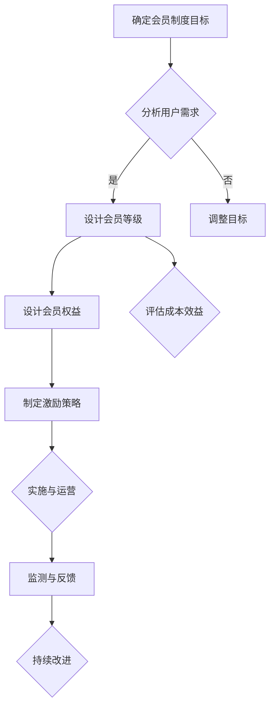

---

在接下来的文章中，我们将深入探讨程序员如何设计会员制度，包括用户行为分析、会员等级规划、激励策略、用户体验设计等方面。通过一步一步的推理和分析，我们将帮助程序员打造出高效的会员制度，从而提升知识付费平台的竞争力。

---

### 第1章: 知识付费的兴起背景

**1.1 知识付费的兴起背景**

在过去的几十年中，互联网的普及和技术的进步极大地改变了我们的生活方式和社会结构。尤其是移动互联网的迅猛发展，让信息传播的速度和广度都得到了空前的提升。知识付费作为一种新兴的商业模式，正是这种技术变革和社会需求的产物。

#### **1.1.1 互联网时代知识传播的变化**

在互联网时代，知识的传播方式发生了根本性的变化。传统上，知识主要通过书籍、报纸、杂志、电视和讲座等渠道传播。这些渠道往往存在一定的局限性，如知识传播速度慢、覆盖范围有限等。而互联网的出现打破了这些限制，使得知识可以以更快的速度、更低的成本、更广泛的方式传播。

- **在线课程**：互联网平台如网易云课堂、腾讯课堂等，提供了海量的在线课程资源，用户可以随时随地学习。
- **电子书**：电子书的普及让用户可以便捷地获取和阅读各种专业书籍，不再受限于时间和空间。
- **博客与论坛**：博客和论坛成为了知识分享的重要平台，用户可以在这里发表观点、交流经验。
- **短视频与直播**：短视频和直播的兴起，使得知识传播更加生动、直观，用户可以通过观看视频学习到实用技能。

#### **1.1.2 程序员在知识付费市场中的角色**

程序员作为互联网时代的主力军，他们在知识付费市场中扮演着重要角色。一方面，程序员通过开发各种在线课程、教程、电子书等，将自己积累的专业知识分享给更多的开发者；另一方面，程序员也是知识付费的主要消费者，他们通过购买各种课程和资源，不断提升自己的技术能力。

- **知识生产者**：许多优秀的程序员通过在平台如GitHub、Stack Overflow等上发布技术文章、教程，分享自己的经验和知识。
- **知识消费者**：程序员需要不断学习新的技术，参加各种线上或线下的培训课程，购买专业书籍和电子书，以保持自己的竞争力。

#### **1.1.3 会员制度在知识付费中的重要性**

会员制度是知识付费平台的一种重要运营模式，它通过为用户提供专属的服务和权益，吸引和留住用户，从而实现平台的长期发展。对于程序员来说，会员制度不仅提供了更多的学习资源，还为他们提供了一个更深入的学习社区。

- **增加用户黏性**：会员制度可以为用户提供独特的权益和体验，增加用户对平台的依赖和忠诚度。
- **提高用户满意度**：通过提供高质量的会员服务，平台可以提升用户的满意度，从而促进用户留存。
- **实现持续盈利**：会员制度可以为平台带来稳定的收入来源，通过会员费、增值服务等模式，实现持续盈利。

**1.1.4 知识付费对程序员职业发展的影响**

知识付费不仅改变了知识传播的方式，也对程序员的职业发展产生了深远的影响。

- **技能提升**：通过付费学习，程序员可以快速获取行业前沿的技术知识和实践经验，提升自身技能。
- **职业发展**：知识付费平台提供的认证、课程证书等，可以作为程序员职业发展的有力证明。
- **社区互动**：知识付费平台通常拥有活跃的社区，程序员可以在这些平台上交流、合作，拓展人脉。

**总结**

知识付费的兴起是互联网时代知识传播方式变革的必然结果。程序员作为知识付费市场的重要参与者，不仅通过知识付费提升自己的技能和职业发展，也为平台提供了丰富的知识资源。会员制度作为知识付费平台的核心运营模式，对提升用户黏性和满意度具有重要作用。在接下来的章节中，我们将深入探讨程序员如何设计有效的会员制度，以实现平台的长期发展。

---

**Mermaid 流程图：程序员参与知识付费的过程**

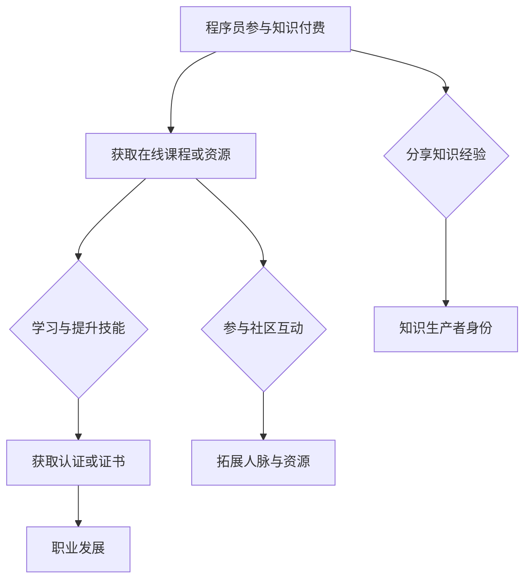

---

在接下来的章节中，我们将继续探讨会员制度的基本概念、分类、优点与挑战，以及当前知识付费平台会员制度的现状。通过这些分析，我们将为程序员提供设计会员制度的理论基础和实际案例。

---

### 第2章: 会员制度的基本概念

在深入探讨程序员如何设计会员制度之前，我们需要先了解会员制度的基本概念，包括其定义、分类、优点和挑战。通过这一章的内容，我们将为程序员提供必要的理论基础，帮助他们在设计会员制度时能够做出更为科学和有效的决策。

#### **2.1 会员制度的定义**

会员制度是指企业或平台通过制定一定的规则和权益，吸引并留住用户，从而实现盈利和用户增值的一种运营模式。在知识付费领域，会员制度通常包括会员等级划分、会员权益设计、会员激励策略等组成部分。

- **会员等级划分**：根据用户支付的费用、使用频率、贡献程度等标准，将用户分为不同等级，如基础会员、高级会员、VIP会员等。
- **会员权益设计**：为不同等级的会员提供不同的服务、内容、优惠等，以增加用户的满意度和忠诚度。
- **会员激励策略**：通过积分、优惠券、折扣、活动等手段，激励用户参与平台的活动，提高用户活跃度。

#### **2.2 会员制度的分类**

会员制度可以根据不同的标准进行分类，常见的分类方法有以下几种：

- **按权益内容分类**：根据会员权益的不同，会员制度可以分为基础会员、高级会员、VIP会员等。基础会员通常享有基础的课程和内容，高级会员则可以享受更多独家资源和优惠，VIP会员则享有最高级别的服务和特权。
- **按会员获取方式分类**：根据会员获取的方式，会员制度可以分为付费会员、免费会员、试用会员等。付费会员通过支付会员费获得会员权益，免费会员通常通过平台活动或邀请获得，试用会员则可以在一定时间内免费体验会员权益。
- **按运营模式分类**：根据平台的运营模式，会员制度可以分为订阅制、一次性付费制、积分制等。订阅制是指用户按月或按年支付会员费，一次性付费制则是用户一次性支付会员费，积分制则是用户通过参与平台活动或贡献内容获得积分，积分可以兑换会员权益。

#### **2.3 会员制度的优点与挑战**

会员制度在知识付费平台中具有显著的优点，同时也面临一些挑战。

**优点：**

- **增加用户黏性**：通过会员制度，平台可以为用户提供独特的权益和体验，增加用户对平台的依赖和忠诚度。
- **提高用户满意度**：会员制度可以根据用户的需求提供个性化的服务，从而提高用户的满意度。
- **实现持续盈利**：会员制度可以为平台带来稳定的收入来源，通过会员费、增值服务等模式，实现持续盈利。
- **促进知识共享**：会员制度可以鼓励用户参与知识分享和社区互动，促进知识的传播和积累。

**挑战：**

- **设计复杂性**：会员制度的设计需要考虑到多种因素，如用户需求、成本效益、市场竞争力等，设计过程复杂且容易出错。
- **用户留存难度**：尽管会员制度可以增加用户黏性，但如何留住用户仍然是一个挑战。用户可能会因为服务质量、会员权益设计不合理等原因流失。
- **合规性要求**：会员制度需要遵守相关的法律法规，如数据保护法、消费者权益保护法等，合规性要求较高。

**总结**

会员制度作为知识付费平台的重要运营模式，具有增加用户黏性、提高用户满意度、实现持续盈利等优点。然而，设计会员制度也面临着复杂性、用户留存难度和合规性要求等挑战。在接下来的章节中，我们将深入探讨程序员如何设计有效的会员制度，以应对这些挑战，提升平台的竞争力。

---

**Mermaid 流程图：会员制度的优点与挑战**

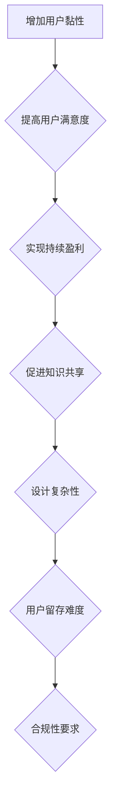

---

在接下来的章节中，我们将进一步探讨程序员在会员制度设计中的具体步骤，包括用户行为分析、会员等级规划、激励策略、用户体验设计等。通过这些探讨，我们将帮助程序员构建出高效、合理且具有吸引力的会员制度。

---

### 第3章: 知识付费平台会员制度的现状

随着知识付费市场的不断发展和成熟，会员制度已经成为各类知识付费平台的重要运营模式。本章节将分析主流知识付费平台的会员制度，介绍一些成功案例，并探讨当前会员制度存在的主要问题与改进方向。

#### **3.1 主流知识付费平台会员制度分析**

在当前的知识付费市场中，国内外主流平台如网易云课堂、腾讯课堂、Coursera、edX等，都采用了各自的会员制度，以吸引和留住用户。以下是这些平台会员制度的一些特点：

**1. 网易云课堂**

- **会员等级划分**：网易云课堂的会员制度分为普通会员和尊享会员。普通会员可以享受基本的课程学习服务，而尊享会员则可以享受更多的课程资源和会员专属活动。
- **会员权益**：尊享会员可以享受课程优惠、会员专属活动、线下活动优先参与权等。
- **激励策略**：网易云课堂通过积分制度激励用户，用户可以通过学习、分享、评价等方式获得积分，积分可以兑换课程、书籍等。

**2. 腾讯课堂**

- **会员等级划分**：腾讯课堂的会员制度分为普通会员、高级会员和专家会员。普通会员享有基础的课程学习服务，高级会员和专家会员则享有更多的课程资源和专属服务。
- **会员权益**：高级会员和专家会员可以享受课程优惠、专属课程、线下活动参与权等。
- **激励策略**：腾讯课堂通过积分制度和优惠券制度激励用户，用户可以通过学习、分享、评价等方式获得积分和优惠券。

**3. Coursera**

- **会员等级划分**：Coursera的会员制度分为基础会员和付费会员。基础会员可以免费学习部分课程，付费会员则可以学习所有课程并获得证书。
- **会员权益**：付费会员可以学习所有课程、获得证书、加入课程社区等。
- **激励策略**：Coursera通过课程证书和社区互动激励用户，付费会员可以获得权威的课程证书，并在社区中与其他学员交流。

**4. edX**

- **会员等级划分**：edX的会员制度分为基础会员和认证会员。基础会员可以免费学习课程，认证会员则需要支付费用。
- **会员权益**：认证会员可以学习所有课程、获得课程证书、加入会员社区等。
- **激励策略**：edX通过课程证书和社区互动激励用户，认证会员可以获得权威的课程证书，并在社区中与其他学员交流。

#### **3.2 成功案例分析**

在知识付费平台中，一些成功的案例值得我们深入分析和学习。以下是几个典型的成功案例：

**1. 知乎的“盐选会员”**

知乎通过“盐选会员”制度，为用户提供高质量的内容和专属服务。盐选会员可以享受知乎专栏、知+、盐选会员专享活动等特权。这种会员制度不仅提高了用户的满意度，也增加了用户的黏性，促进了知乎社区的活跃度。

**2. 得到APP的“知识星球”**

得到APP通过“知识星球”模式，为用户提供丰富的知识资源和社区互动体验。用户可以通过付费加入不同的知识星球，获得行业专家的指导和建议。这种模式不仅提高了用户的付费意愿，也促进了知识的传播和积累。

**3. TED的会员计划**

TED通过会员计划，为用户提供高质量的演讲视频和专属内容。TED会员可以免费观看所有演讲视频，并享受额外的会员专属内容，如TED访谈、TED书籍等。这种会员制度不仅为TED带来了稳定的收入，也提升了用户的满意度和忠诚度。

#### **3.3 当前存在的问题与改进方向**

尽管会员制度在知识付费平台中取得了不少成功，但也存在一些问题和挑战。以下是当前会员制度存在的主要问题及其改进方向：

**1. 会员制度设计复杂**

一些平台的会员制度设计过于复杂，用户难以理解和操作。改进方向是简化会员制度设计，减少不必要的层级和复杂度，提高用户体验。

**2. 会员权益不够明确**

一些平台的会员权益描述不够明确，用户不清楚自己能够获得哪些具体的服务和内容。改进方向是明确会员权益，提供详细的权益清单，让用户一目了然。

**3. 用户激励不足**

一些平台的会员激励策略不够有效，无法充分调动用户的积极性。改进方向是设计多样化的激励策略，如积分制度、优惠券、专属活动等，提高用户的参与度和活跃度。

**4. 用户留存率低**

一些平台的用户留存率较低，会员流失问题较为严重。改进方向是提升会员服务质量，提供更多的专属服务和内容，增加用户的黏性和忠诚度。

**总结**

知识付费平台的会员制度在提高用户满意度、增加用户黏性、实现持续盈利等方面具有重要作用。通过分析主流平台的会员制度，我们可以看到一些成功的案例和存在的问题。在未来的发展中，知识付费平台需要不断优化会员制度设计，提升用户体验，从而在激烈的市场竞争中脱颖而出。

---

**Mermaid 流程图：知识付费平台会员制度的现状**

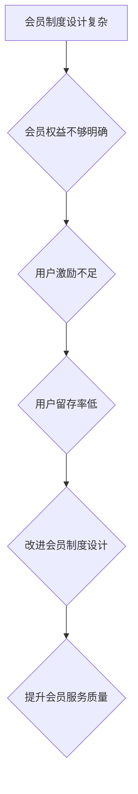

---

在接下来的章节中，我们将深入探讨程序员如何设计会员制度，包括用户行为分析、会员等级规划、激励策略、用户体验设计等方面。通过这些探讨，我们将帮助程序员构建出高效、合理且具有吸引力的会员制度，以提升知识付费平台的竞争力。

---

### 第2章: 程序员如何设计会员制度

**2.1 设计会员制度的基础知识**

设计会员制度是一个复杂而系统的工作，需要程序员具备一定的用户行为分析、会员价值评估、会员权益设计原则等方面的知识。以下是对这些基础知识的具体解释。

#### **2.1.1 用户行为分析**

用户行为分析是设计会员制度的重要前提。通过对用户的行为进行深入分析，程序员可以了解用户的需求、偏好和习惯，从而设计出更符合用户期望的会员制度。

- **数据分析工具**：程序员可以使用Google Analytics、Mixpanel、GrowingIO等数据分析工具，收集用户在平台上的行为数据，如访问频次、停留时长、互动行为等。
- **行为模式识别**：通过分析用户的行为数据，程序员可以识别出不同用户群体（如新手程序员、中级程序员、高级程序员）的行为模式，为后续的会员等级设计提供依据。
- **用户访谈与调研**：除了数据分析，程序员还可以通过用户访谈、问卷调查等方式，获取用户的直接反馈和建议，这些信息对于理解用户需求非常重要。

#### **2.1.2 会员价值评估**

会员价值评估是设计会员制度的关键步骤。通过评估会员的价值，程序员可以确定不同等级会员的权益和激励策略，从而提高用户的满意度和忠诚度。

- **会员价值指标**：程序员需要设定一系列会员价值指标，如购买频率、购买金额、活跃度、贡献度等。这些指标可以帮助程序员评估会员对平台的价值。
- **会员价值计算**：程序员可以通过加权平均法、成本效益分析等方法，计算不同会员的价值。例如，高级会员可能因为购买频率高、购买金额大，对平台的贡献度更高，因此可以设定更高的权益。

#### **2.1.3 会员权益设计原则**

会员权益设计是会员制度的核心。合理的会员权益设计可以提高用户的满意度和忠诚度，从而促进平台的长期发展。

- **差异化权益**：不同等级的会员应享有不同的权益，以体现等级差异。例如，基础会员可以享受基础课程和资源，高级会员可以享受更多独家课程和优惠。
- **个性化权益**：根据用户的行为和偏好，设计个性化的权益，以提升用户的满意度。例如，根据用户的购买历史，为高级会员提供定制化的课程推荐。
- **持续优化**：会员权益设计不是一成不变的，程序员需要根据用户反馈和市场变化，持续优化会员权益，以保持会员的活力和吸引力。

#### **2.1.4 会员制度设计流程**

为了确保会员制度设计的科学性和有效性，程序员需要遵循一定的设计流程。以下是一个典型的会员制度设计流程：

1. **需求分析**：了解平台的发展目标、用户需求和市场环境，明确会员制度的设计目标和方向。
2. **用户行为分析**：通过数据分析工具和用户调研，收集用户行为数据，识别用户群体和行为模式。
3. **会员价值评估**：根据用户行为数据，计算不同会员的价值，为后续权益设计提供依据。
4. **权益设计**：根据用户价值和需求，设计不同等级的会员权益，包括课程资源、优惠折扣、活动参与等。
5. **激励策略制定**：设计积分制度、优惠券、会员专属活动等激励策略，以提升用户活跃度和忠诚度。
6. **用户体验设计**：优化会员界面和交互设计，确保用户能够轻松理解和操作会员权益。
7. **测试与反馈**：通过内部测试和用户反馈，优化会员制度，确保其能够满足用户需求，提升用户体验。

**总结**

设计会员制度需要程序员具备用户行为分析、会员价值评估、会员权益设计原则等多方面的知识。通过遵循科学的设计流程，程序员可以设计出高效、合理的会员制度，从而提升平台的用户黏性和盈利能力。在接下来的章节中，我们将进一步探讨会员等级制度、激励策略和用户体验设计等具体内容。

---

**Mermaid 流程图：会员制度设计流程**

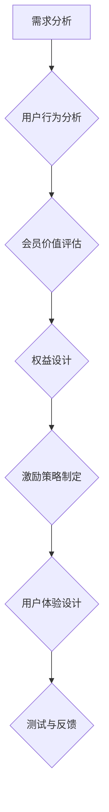

---

在接下来的章节中，我们将深入探讨会员等级制度的规划、会员激励策略和用户体验设计等关键内容，帮助程序员打造出成功的会员制度。

---

### 第2章: 程序员如何设计会员制度

**2.2 会员等级制度的规划**

会员等级制度是会员制度的核心部分，通过设置不同的会员等级，平台可以区分用户的价值，提供差异化的服务。以下是如何规划会员等级制度的具体步骤。

#### **2.2.1 会员等级的划分标准**

会员等级的划分标准应根据用户的价值和行为进行设置。以下是一些常见的划分标准：

- **购买金额**：根据用户在平台上购买课程的金额，可以将会员分为普通会员、高级会员、VIP会员等。例如，普通会员购买金额在1000元以下，高级会员购买金额在1000-5000元之间，VIP会员购买金额超过5000元。
- **购买频率**：根据用户在平台上的购买频率，可以将会员分为活跃会员、忠诚会员等。例如，活跃会员每月至少购买一次课程，忠诚会员每年购买课程超过5次。
- **互动行为**：根据用户的互动行为，如课程评价、社区活跃度等，可以将会员分为不同等级。例如，高级会员需要在社区中发表一定数量的帖子或获得一定数量的点赞。
- **贡献度**：根据用户在平台上的贡献度，如上传课程、分享资源、帮助他人等，可以将会员分为不同等级。例如，贡献度高的用户可以晋升为专家会员或导师会员。

#### **2.2.2 不同等级的权益设计**

不同等级的会员应享有不同的权益，以体现等级差异。以下是一些常见的会员权益设计：

- **课程资源**：高级会员和VIP会员应享有更多的课程资源和独家内容，如高级课程、实战项目、学习资料等。
- **优惠折扣**：不同等级的会员应享有不同的优惠折扣，高级会员和VIP会员可以享受更高的折扣率。
- **专属活动**：高级会员和VIP会员可以参加专属的线下活动、讲座、工作坊等，以提升用户体验。
- **积分奖励**：会员可以通过购买课程、参与活动等方式获得积分，积分可以兑换课程、优惠券、实物奖励等。

#### **2.2.3 等级晋升机制**

为了激励用户不断提升自身等级，平台应设计合理的等级晋升机制。以下是一些常见的等级晋升机制：

- **自动晋升**：根据用户的购买金额、购买频率等指标，自动晋升到更高等级。例如，当用户的购买金额累计达到一定额度时，自动晋升为高级会员。
- **积分晋升**：用户通过完成特定的任务，如购买课程、发表帖子、分享资源等，可以获得积分，积分达到一定数量时，可以晋升到更高等级。
- **邀请晋升**：通过邀请好友加入平台，可以获得一定的积分或晋升机会，以激励用户发展新的用户群体。

**总结**

会员等级制度的规划是会员制度设计的关键步骤。通过设置合理的划分标准、设计差异化的权益、设计合理的等级晋升机制，程序员可以激励用户不断提升自身等级，从而提高用户的满意度和忠诚度。在接下来的章节中，我们将探讨会员激励策略和用户体验设计等具体内容，帮助程序员打造出成功的会员制度。

---

**Mermaid 流程图：会员等级制度规划流程**

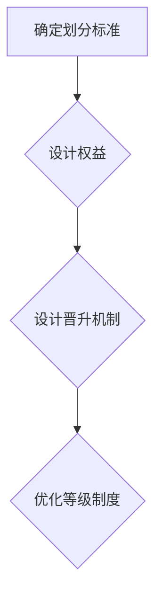

---

在接下来的章节中，我们将继续探讨会员激励策略和用户体验设计等关键内容，帮助程序员构建出高效、合理的会员制度。

---

### 第3章: 会员制度的激励策略

会员制度的激励策略是提升用户活跃度和忠诚度的重要手段。合理的激励策略可以激发用户的积极性，促进会员制度的顺利实施。以下是如何制定有效的会员激励策略的具体步骤。

#### **3.1 优惠券与折扣策略**

优惠券和折扣策略是最常见的激励手段之一，通过提供优惠价格和折扣，可以吸引新用户并留住老用户。

- **优惠力度**：根据会员等级，设计不同的优惠力度。例如，基础会员享受8折优惠，高级会员享受7折优惠，VIP会员享受5折优惠。
- **优惠范围**：优惠券和折扣可以应用于全平台课程、特定课程或课程套餐，以增强用户的购买欲望。
- **发放方式**：优惠券可以通过邮件、短信、推送通知等方式发放，用户在特定时间和条件下使用。

**伪代码示例：优惠券发放策略**

```python
def distribute_coupon(user_level):
    if user_level == 'basic':
        discount = 0.8
    elif user_level == 'advanced':
        discount = 0.7
    elif user_level == 'vip':
        discount = 0.5
    else:
        discount = 1.0
    
    # 发放优惠券
    coupon_code = generate_coupon_code()
    send_coupon_notification(coupon_code, discount)
```

#### **3.2 积分奖励机制**

积分奖励机制是通过为用户在平台上的行为（如购买课程、发表评论、参与活动等）赋予积分，从而激励用户保持活跃。

- **积分获取方式**：用户可以通过购买课程、发表评论、参与社区活动等方式获得积分。例如，购买一门课程可以获取100积分，发表一条高质量评论可以获取50积分。
- **积分消耗方式**：积分可以用于兑换优惠券、实物奖励、课程学习等。例如，1000积分可以兑换1元现金券，500积分可以兑换一份学习资料。
- **积分有效期**：设定积分的有效期，以激励用户及时使用积分。例如，积分在用户账户过期后自动清零。

**伪代码示例：积分奖励机制**

```python
def earn_points(user_action):
    points = 0
    if user_action == 'course_purchase':
        points = 100
    elif user_action == 'comment':
        points = 50
    elif user_action == 'activity_participation':
        points = 20
    
    # 存储积分
    user_points = update_user_points(points)
    return user_points

def redeem_points(points):
    if points >= 1000:
        coupon_value = 1.0
    elif points >= 500:
        coupon_value = 0.5
    else:
        coupon_value = 0.0
    
    # 发放优惠券
    coupon_code = generate_coupon_code()
    send_coupon_notification(coupon_code, coupon_value)
```

#### **3.3 会员专属活动策划**

会员专属活动是为会员提供独特的体验和福利，以提升会员的满意度和忠诚度。以下是一些常见的会员专属活动策划方法：

- **线上活动**：如线上讲座、互动直播、技术沙龙等，会员可以免费参加或享受优先报名权。
- **线下活动**：如线下技术研讨会、行业峰会、企业走访等，会员可以参与并与其他会员互动。
- **知识竞赛**：通过举办知识竞赛，激励会员积极参与，提升学习效果。
- **会员访谈**：定期邀请会员进行访谈，了解会员的需求和建议，优化会员服务。

**伪代码示例：会员专属活动策划**

```python
def schedule_member_event(event_type):
    if event_type == 'online':
        event_details = {
            'title': '线上讲座：AI应用实战',
            'date': '2023-11-10',
            'time': '19:00',
            'link': 'https://example.com/online-lecture'
        }
    elif event_type == 'offline':
        event_details = {
            'title': '线下技术研讨会：区块链技术解析',
            'date': '2023-12-15',
            'time': '14:00',
            'location': '北京市海淀区'
        }
    else:
        event_details = {
            'title': '知识竞赛：编程挑战',
            'date': '2023-10-25',
            'time': '12:00',
            'rules': '完成指定编程任务'
        }
    
    # 发送活动通知
    send_event_notification(event_details)
```

**总结**

激励策略是会员制度的重要组成部分，通过优惠券与折扣策略、积分奖励机制、会员专属活动策划等多种手段，可以有效提升用户的活跃度和忠诚度。在制定激励策略时，程序员需要充分考虑用户需求、平台资源和市场环境，确保激励策略的合理性和有效性。在接下来的章节中，我们将继续探讨会员制度的用户体验设计，以进一步提升用户满意度。

---

**Mermaid 流程图：会员激励策略**

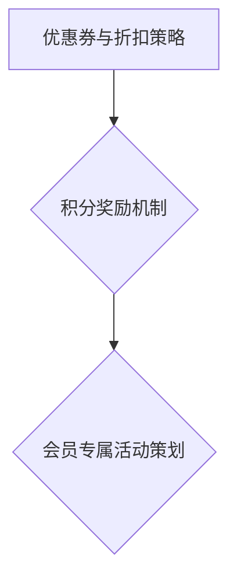

---

在接下来的章节中，我们将进一步探讨如何通过优化用户体验设计，提高会员制度的吸引力和用户满意度。

---

### 第4章: 会员制度的用户体验设计

会员制度的用户体验设计是确保用户能够轻松理解、操作会员权益，并感受到平台价值的关键。一个优秀的用户体验设计不仅能够提升会员的满意度，还能增强平台的竞争力。以下是如何优化会员制度用户体验设计的关键步骤。

#### **4.1 界面设计要点**

良好的界面设计能够引导用户快速了解会员权益，并方便他们进行操作。以下是一些界面设计要点：

- **简洁明了**：界面应尽量简洁，避免过多的装饰和复杂的功能，以减少用户的学习成本。使用清晰、简洁的图标和文字，让用户一目了然。
- **一致性和统一性**：界面设计应保持一致性和统一性，包括颜色、字体、布局等。这有助于用户快速识别和操作，提高用户体验。
- **清晰的导航**：提供清晰的导航，帮助用户快速找到所需的信息和功能。可以使用面包屑导航、菜单栏、搜索功能等，以提高用户操作效率。
- **响应式设计**：确保界面在不同设备和屏幕尺寸上都能良好展示，适应移动端和桌面端的使用需求。

**示例界面设计（Mermaid 流程图）**

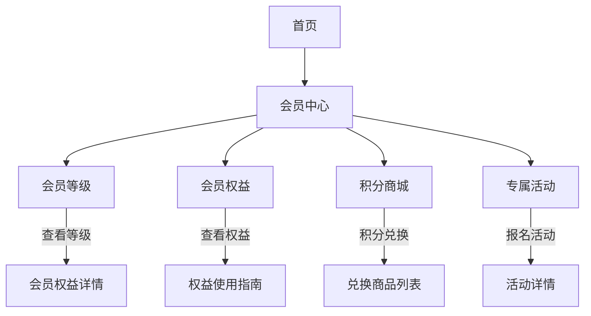

#### **4.2 用户引导与提示**

有效的用户引导和提示能够帮助用户更好地理解会员制度和操作流程。以下是一些用户引导与提示的方法：

- **新手引导**：为新用户提供新手引导，通过弹窗、滚动条提示等方式，介绍会员制度和操作流程。这有助于用户快速上手，减少困惑。
- **操作提示**：在用户进行关键操作时，提供清晰的提示和说明。例如，当用户点击购买课程时，弹出“是否确认购买？”的提示框，确保用户明确自己的操作意图。
- **错误提示**：当用户操作失败时，提供明确的错误提示和解决方案。这有助于用户快速发现问题并解决，提高用户体验。

**示例用户引导与提示（伪代码）**

```python
def show_new_user_guide():
    # 弹出新手引导弹窗
    show_popup("欢迎来到会员中心，以下是您的会员权益：...")
    
def show_operation_hint():
    # 提示用户操作
    show_popup("您已经成功购买课程《Python基础》，现在您可以开始学习！")
    
def show_error_message(error_message):
    # 显示错误提示
    show_popup(f"操作失败：{error_message}，请重试或联系客服。")
```

#### **4.3 用户反馈与改进**

用户反馈是优化会员制度用户体验设计的重要依据。以下是如何收集和处理用户反馈的方法：

- **反馈渠道**：提供多种反馈渠道，如在线客服、用户论坛、问卷调查等，方便用户提出意见和建议。
- **及时响应**：对于用户反馈，及时响应和解决，展示平台对用户体验的重视。例如，当用户反馈界面设计不够直观时，及时进行界面优化。
- **数据分析**：通过数据分析用户行为和反馈，识别用户痛点和改进方向。例如，通过用户问卷调查，了解用户对会员权益的满意度，并根据反馈调整权益设计。

**示例用户反馈处理（伪代码）**

```python
def collect_user_feedback():
    # 收集用户反馈
    feedback_list = get_user_feedbacks()
    return feedback_list

def analyze_user_feedback(feedback_list):
    # 分析用户反馈
    issues = analyze_issues(feedback_list)
    return issues

def improve_experience(issues):
    # 根据反馈改进用户体验
    for issue in issues:
        if issue == '界面设计不直观':
            optimize_interface()
        elif issue == '操作提示不够清晰':
            improve_operation_hints()
        # 其他改进措施
```

**总结**

用户体验设计是会员制度成功实施的重要保障。通过简洁明了的界面设计、有效的用户引导与提示、及时的用户反馈与改进，程序员可以打造出高效、易用的会员制度，提升用户的满意度和忠诚度。在接下来的章节中，我们将探讨会员制度的实施与运营，帮助程序员确保会员制度的有效实施和持续改进。

---

**Mermaid 流程图：用户体验设计**

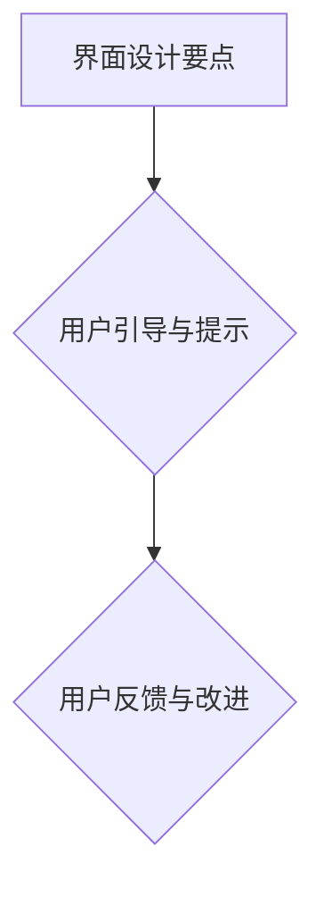

---

在接下来的章节中，我们将深入探讨会员制度的实施与运营，帮助程序员确保会员制度的有效实施和持续改进。

---

### 第3章: 会员制度的实施与运营

会员制度的成功不仅仅在于设计，更在于实施与运营。以下是如何有效实施和运营会员制度的关键步骤。

#### **3.1 会员制度实施前的准备**

在正式实施会员制度之前，需要进行充分的准备，确保会员制度能够顺利启动并发挥作用。

**1. 确定会员制度的目标**

明确会员制度的目标是实施的前提。这些目标可能包括增加用户黏性、提升用户满意度、实现持续盈利等。确定目标可以帮助团队集中精力，确保会员制度的实施方向正确。

**2. 技术架构与系统规划**

会员制度的实施需要强大的技术支持。程序员需要设计合适的技术架构，确保会员制度能够稳定、高效地运行。这包括会员数据的存储、处理、安全等方面的设计。

**3. 人力资源与培训**

实施会员制度需要专门的人员负责运营和维护。团队应包括产品经理、运营人员、技术支持人员等。此外，对团队成员进行会员制度相关知识的培训，确保他们能够理解和执行会员制度的各项规定。

**4. 制定实施计划**

制定详细的实施计划，明确每个阶段的任务和时间节点，确保会员制度能够按时上线。实施计划应包括会员注册、权益开通、数据收集与分析等关键步骤。

#### **3.2 会员制度的具体实施流程**

会员制度的具体实施流程包括用户注册、身份验证、会员权益开通、数据收集与分析等环节。

**1. 用户注册与身份验证**

用户注册是会员制度实施的第一步。平台需要提供简单的注册流程，确保用户能够轻松注册。注册后，平台应对用户进行身份验证，确保会员权益的正确分配。

```python
def user_registration():
    # 收集用户信息
    username = input("请输入用户名：")
    password = input("请输入密码：")
    email = input("请输入邮箱：")
    
    # 存储用户信息
    save_user_info(username, password, email)
    
    # 发送验证邮件
    send_confirmation_email(email)

def verify_user():
    # 验证用户身份
    username = input("请输入用户名：")
    password = input("请输入密码：")
    
    if verify_login(username, password):
        print("身份验证成功！")
    else:
        print("身份验证失败，请重试。")
```

**2. 会员权益的开通与维护**

会员权益开通是会员制度的核心环节。平台需要确保会员权益能够及时开通，并提供持续的服务。

```python
def activate_member_rights(member_level):
    # 开通会员权益
    if member_level == 'basic':
        grant_basic_rights()
    elif member_level == 'advanced':
        grant_advanced_rights()
    elif member_level == 'vip':
        grant_vip_rights()
    else:
        print("会员等级设置错误，请重新设置。")

def maintain_member_rights():
    # 维护会员权益
    while True:
        # 更新权益信息
        update_rights_info()
        
        # 检查权益到期情况
        check_rights_expiry()
        
        # 如果权益已到期，提醒用户续费
        if is_rights_expired():
            remind_renewal()
        
        # 等待一段时间后继续检查
        time.sleep(24 * 60 * 60)
```

**3. 用户行为数据的收集与分析**

用户行为数据是优化会员制度的重要依据。平台需要收集并分析用户的行为数据，以了解用户的偏好和使用习惯。

```python
def collect_user_behavior():
    # 收集用户行为数据
    behavior_data = get_user_behavior()
    return behavior_data

def analyze_user_behavior(behavior_data):
    # 分析用户行为数据
    analysis_results = analyze_data(behavior_data)
    return analysis_results

def optimize_member_rights(analysis_results):
    # 根据分析结果优化会员权益
    if analysis_results['频繁购买']:
        upgrade_rights_to_higher_level()
    elif analysis_results['低活跃度']:
        provide_more_incentives()
```

#### **3.3 会员制度的运营策略**

会员制度的运营策略是确保会员制度能够持续发挥作用的重要保障。以下是一些关键策略：

**1. 持续优化会员权益**

根据用户反馈和行为数据，持续优化会员权益，确保会员权益与用户需求相匹配。可以通过问卷调查、用户访谈等方式，了解用户对会员权益的满意度，并根据反馈进行调整。

**2. 提升用户活跃度**

通过举办活动、发布优质内容、提供个性化推荐等方式，提升用户活跃度。例如，定期举办线上讲座、技术沙龙，发布最新的行业动态和案例分析，为用户提供有价值的内容。

**3. 用户反馈的处理与改进**

建立有效的用户反馈处理机制，及时响应用户的问题和建议。对用户反馈进行分类和分析，找出问题根源，并制定改进措施。例如，如果用户反映权益使用不便利，可以优化权益使用界面。

**总结**

会员制度的实施与运营是一个复杂的过程，需要充分的准备和细致的执行。通过确定实施目标、技术架构规划、人力资源准备、制定实施计划等准备环节，确保会员制度能够顺利启动。在具体实施流程中，通过用户注册、身份验证、权益开通、数据收集与分析等步骤，确保会员制度能够有效运行。同时，通过持续优化会员权益、提升用户活跃度、用户反馈处理等运营策略，确保会员制度的长期稳定发展。

---

**Mermaid 流程图：会员制度实施与运营**

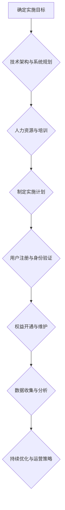

---

在接下来的章节中，我们将继续探讨会员制度的效果评估与持续改进，帮助程序员确保会员制度能够不断提升用户满意度和平台竞争力。

---

### 第4章: 会员制度的效果评估与持续改进

会员制度的效果评估是确保会员制度能够持续发挥作用、提升用户满意度和平台竞争力的重要手段。通过评估会员制度的效果，程序员可以识别问题、优化策略，从而实现会员制度的持续改进。

#### **4.1 会员制度效果评估指标**

为了全面评估会员制度的效果，需要设定一系列指标，从不同角度衡量会员制度的表现。以下是一些常见的评估指标：

**1. 用户留存率与流失率**

用户留存率是衡量会员制度吸引力和用户满意度的关键指标。用户留存率越高，说明会员制度越成功。流失率则反映了会员的流失情况，通过对流失原因的分析，可以找到改进的方向。

- **计算公式**：用户留存率（Retention Rate）=（月末活跃用户数 - 新增用户数）/ 月初活跃用户数
- **流失率**：流失率（Churn Rate）=（月末流失用户数 / 月初活跃用户数）* 100%

**2. 用户满意度与活跃度**

用户满意度反映了会员对会员制度的整体评价，活跃度则反映了用户在平台上的参与程度。高满意度和高活跃度是会员制度成功的标志。

- **用户满意度**：可以通过用户调查、用户反馈等方式收集用户满意度数据。
- **活跃度**：可以通过用户在平台上的行为数据（如访问频次、课程学习时长、社区互动等）来衡量。

**3. 经济收益分析**

会员制度的经济收益分析是评估会员制度商业价值的重要指标。通过分析会员费用、收入增长、成本效益等数据，可以了解会员制度的经济效益。

- **会员费用**：会员制度的总收入，包括会员费、增值服务等。
- **收入增长**：会员制度实施前后的收入变化，反映了会员制度对平台收入的贡献。
- **成本效益**：会员制度的运营成本与收益的对比，衡量会员制度的成本效益。

**4. 成本控制与风险防范**

评估会员制度在成本控制和风险防范方面的表现，确保会员制度的可持续发展。

- **成本控制**：会员制度的运营成本，包括人力、技术、市场推广等费用。
- **风险防范**：会员制度面临的潜在风险，如用户隐私保护、数据安全等。

#### **4.2 数据驱动的持续改进**

数据驱动是会员制度持续改进的关键。通过收集和分析会员行为数据，程序员可以深入了解用户需求，优化会员权益和激励策略。

**1. 数据收集与处理**

为了进行有效的数据驱动改进，需要收集和整理大量的用户行为数据，包括用户注册信息、购买记录、学习行为、互动行为等。收集数据后，需要进行数据清洗和处理，确保数据的准确性和完整性。

```python
def collect_user_data():
    # 收集用户注册信息
    user_data = get_user_registrations()
    return user_data

def process_data(user_data):
    # 数据清洗与处理
    clean_data = clean_user_data(user_data)
    return clean_data
```

**2. 数据分析工具与方法**

使用合适的数据分析工具和方法，可以对收集到的数据进行分析，提取有价值的信息。常见的数据分析工具包括Excel、Python的Pandas库、SQL等。分析方法包括统计分析、机器学习、数据可视化等。

```python
import pandas as pd

def analyze_data(clean_data):
    # 数据分析
    data_analysis = pd.DataFrame(clean_data)
    analysis_results = data_analysis.describe()
    return analysis_results
```

**3. 改进策略与实施**

根据数据分析结果，制定具体的改进策略，并实施这些策略。改进策略可能包括优化会员权益、调整激励策略、改善用户体验等。

```python
def implement_improvements(analysis_results):
    # 实施改进策略
    if analysis_results['满意度'] < 80:
        optimize_member_rights()
    if analysis_results['活跃度'] < 60:
        increase_incentives()
    if analysis_results['成本控制'] > 150:
        reduce_costs()
```

**4. 监测与反馈**

在实施改进策略后，需要持续监测会员制度的表现，收集用户反馈，并根据反馈调整策略。通过监测和反馈，可以确保会员制度能够持续优化，提升用户体验。

```python
def monitor_member_system():
    # 监测会员系统表现
    performance_data = get_system_performance()
    if performance_data['留存率'] < 70:
        alert("留存率低，需要进一步优化。")
    if performance_data['满意度'] < 80:
        alert("满意度低，需要提升用户体验。")
```

**总结**

会员制度的效果评估与持续改进是确保会员制度成功实施的关键。通过设定评估指标、数据驱动改进、监测与反馈等步骤，程序员可以不断提升会员制度的性能，满足用户需求，提升平台竞争力。在接下来的章节中，我们将探讨如何应对竞争对手的策略、法律法规与合规性、技术风险与管理等特殊情况的应对策略。

---

**Mermaid 流程图：会员制度效果评估与持续改进**

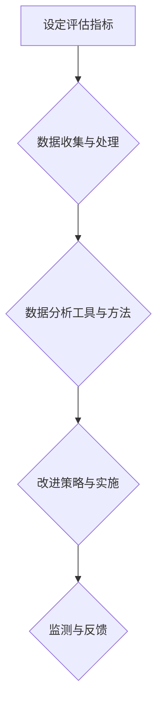

---

在接下来的章节中，我们将继续探讨会员制度在不同情境下的应对策略，包括竞争对手策略、法律法规与合规性、技术风险与管理等，帮助程序员全面应对会员制度实施过程中可能遇到的各种挑战。

---

### 第5章: 特殊情况的应对策略

在会员制度的实施与运营过程中，程序员可能会面临各种特殊情况和挑战，如竞争对手的策略、法律法规与合规性、技术风险与管理等。以下是如何应对这些特殊情况的具体策略。

#### **5.1 竞争对手策略应对**

面对激烈的市场竞争，程序员需要采取有效的策略来应对竞争对手的挑战。

**1. 竞争分析**

首先，进行全面的竞争对手分析，了解竞争对手的会员制度设计、用户群体、优势和劣势。通过分析，可以明确自身的市场定位和竞争优势。

```python
def analyze_competition():
    # 收集竞争对手信息
    competitors_info = get_competitor_data()
    
    # 分析竞争对手的会员制度
    for competitor in competitors_info:
        analyze_member_system(competitor['member_system'])
```

**2. 独特优势挖掘**

明确自身的独特优势，如独特的内容、优质的服务、创新的权益设计等，并将其作为核心竞争力。通过差异化策略，提高用户对平台的忠诚度。

```python
def identify_unique_advantages():
    # 分析自身优势和劣势
    advantages = {
        'unique_content': '独家课程资源',
        'quality_service': '一对一辅导',
        'innovative_rights': '个性化权益设计'
    }
    return advantages
```

**3. 竞争策略制定**

根据竞争分析结果和独特优势，制定针对性的竞争策略。例如，通过价格优惠、权益升级、个性化推荐等手段，吸引竞争对手的用户。

```python
def create_competition_strategy(advantages):
    # 制定竞争策略
    strategy = {
        'price_discount': advantages['unique_content'],
        'member_upgrade': advantages['quality_service'],
        'personalized_recommendation': advantages['innovative_rights']
    }
    return strategy
```

#### **5.2 法律法规与合规性**

会员制度的设计和实施需要遵守相关的法律法规，确保合规性。

**1. 知识付费相关政策法规解读**

了解国家关于知识付费的相关政策法规，如《中华人民共和国网络安全法》、《中华人民共和国个人信息保护法》等，确保会员制度的设计和实施符合法律法规。

```python
def interpret_policy_law():
    # 解读相关政策法规
    policy_law = get_policy_law_info()
    return policy_law
```

**2. 会员制度的合规性审查**

在设计会员制度时，进行合规性审查，确保会员制度的内容和实施过程符合法律法规。例如，会员权益的描述需要清晰明确，不得含有误导性信息。

```python
def check合规性(compliance_check):
    # 审查会员制度合规性
    if compliance_check['is_compliant']:
        print("会员制度合规。")
    else:
        print("会员制度存在合规性问题，需进行修改。")
```

**3. 风险防范与应对措施**

针对可能存在的合规风险，制定相应的防范和应对措施。例如，设立合规性检查机制，定期审查会员制度的合规性，确保平台运营的安全和稳定。

```python
def implement_safety_measures():
    # 实施合规性检查
    compliance_check = perform_compliance_check()
    check_compliance(compliance_check)
```

#### **5.3 技术风险与管理**

技术风险是会员制度实施过程中不可忽视的挑战。程序员需要采取有效的技术风险管理策略，确保会员制度的稳定运行。

**1. 数据安全与隐私保护**

确保用户数据的安全和隐私保护，是技术风险管理的重要环节。通过数据加密、访问控制、备份恢复等措施，保护用户数据。

```python
def ensure_data_safety():
    # 数据加密
    encrypt_data()

    # 访问控制
    control_access()

    # 数据备份
    backup_data()
```

**2. 技术升级与维护**

定期进行技术升级和维护，确保平台的稳定性和安全性。例如，更新服务器硬件、优化数据库结构、修复漏洞等。

```python
def upgrade_technology():
    # 服务器升级
    update_server()

    # 数据库优化
    optimize_database()

    # 漏洞修复
    fix_vulnerabilities()
```

**3. 应对技术挑战的策略**

在面对技术挑战时，制定针对性的应对策略。例如，通过引入新技术、优化系统架构、加强团队培训等，提升平台的技术实力。

```python
def handle_technical_challenges():
    # 引入新技术
    introduce_new_technology()

    # 优化系统架构
    optimize_system_architecture()

    # 团队培训
    train_team_members()
```

**总结**

在会员制度的实施与运营过程中，程序员需要应对各种特殊情况，如竞争对手策略、法律法规与合规性、技术风险与管理等。通过竞争分析、独特优势挖掘、合规性审查、数据安全保护、技术升级与维护等策略，程序员可以确保会员制度的顺利实施和持续发展。在接下来的章节中，我们将通过具体案例，进一步探讨如何应对这些特殊情况，提供实用的经验和建议。

---

**Mermaid 流程图：特殊情况应对策略**

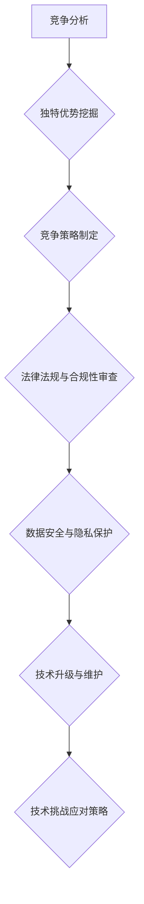

---

在接下来的章节中，我们将通过具体案例研究，深入探讨如何实施和优化会员制度，帮助程序员更好地应对特殊情况，提升会员制度的成功率和用户满意度。

---

### 第6章: 案例研究

通过对实际案例的研究，我们可以深入了解会员制度的设计与实施过程，从中吸取经验教训，为其他平台的会员制度设计提供参考。以下是一些典型的会员制度案例研究，我们将详细分析这些案例的背景、设计思路、实施效果和成功经验。

#### **6.1 案例一：某知名编程社区会员制度设计**

**案例背景**：

某知名编程社区（以下简称“社区”）在知识付费市场逐渐崭露头角，为了吸引更多用户并提升用户黏性，社区决定推出一套会员制度。

**会员制度设计思路**：

- **用户需求分析**：社区通过对用户进行调查和分析，发现用户对于高质量的学习资源、社区互动和个性化推荐有强烈需求。
- **会员等级划分**：社区将会员划分为免费会员、普通会员、高级会员和VIP会员，不同等级享受的权益有所不同。
  - **免费会员**：可以免费访问社区的基本内容，如帖子、问答等。
  - **普通会员**：可以享受更多内容，如高级课程、文档资料等。
  - **高级会员**：享有社区提供的专属课程、线上讲座、一对一辅导等。
  - **VIP会员**：享有社区提供的最高级别服务，如定制化学习方案、专家咨询等。
- **激励策略**：社区通过积分制度激励用户，用户可以通过参与社区活动、发表高质量内容等方式获得积分，积分可以用于兑换会员权益或优惠券。
- **用户体验设计**：社区优化了会员界面和交互设计，确保用户能够轻松找到所需内容和使用会员权益。

**实施效果与评价**：

- **用户满意度提升**：会员制度推出后，用户满意度明显提高，特别是在高级会员和VIP会员群体中。
- **用户留存率增加**：会员制度的推出使得社区的用户留存率显著提升，社区活跃度也相应增加。
- **收入增长**：会员制度带来了稳定的会员收入，平台的经济效益得到提升。

**成功经验与启示**：

- **深入了解用户需求**：成功的会员制度设计需要深入了解用户的需求，从而提供符合用户期望的权益。
- **合理的等级划分**：明确的等级划分可以激励用户不断提升等级，从而增加用户黏性。
- **有效的激励策略**：通过积分制度等激励手段，可以激发用户的积极性和参与度。
- **用户体验设计**：优化用户体验设计，可以提高用户对会员制度的满意度和忠诚度。

#### **6.2 案例二：某在线教育平台会员制度实践**

**案例背景**：

某在线教育平台（以下简称“平台”）为了增强用户黏性和提高用户满意度，决定设计并实施一套全面的会员制度。

**会员制度设计思路**：

- **用户需求分析**：平台通过市场调研和用户反馈，了解到用户对于个性化学习方案、课程优惠、专属活动等有较高需求。
- **会员等级划分**：平台将会员划分为免费会员、初级会员、高级会员和专家会员，不同等级享有不同的权益。
  - **免费会员**：可以免费学习部分课程，享受社区基本服务。
  - **初级会员**：享有更多课程资源、社区互动和优惠券。
  - **高级会员**：可以享受更多课程、专属辅导、优先报名权等。
  - **专家会员**：享有平台提供的最高级别服务，如专家讲座、私人定制学习方案等。
- **激励策略**：平台通过积分制度、优惠券、专属活动等方式激励用户，用户可以通过学习、参与活动、推荐好友等方式获得积分和优惠券。
- **用户体验设计**：平台优化了会员界面和交互设计，确保用户能够轻松找到会员权益和使用方法。

**实施效果与评价**：

- **用户满意度提升**：会员制度推出后，用户满意度显著提高，特别是在高级会员和专家会员群体中。
- **用户留存率增加**：会员制度的实施使得平台的用户留存率得到明显提升，社区活跃度也有所增加。
- **收入增长**：会员制度为平台带来了稳定的会员收入，平台的经济效益得到提升。

**成功经验与启示**：

- **多样化的激励策略**：通过多种激励手段，可以激发用户的积极性和参与度。
- **明确权益划分**：合理的权益划分可以激发用户不断提升等级，增加用户黏性。
- **优化用户体验设计**：良好的用户体验设计可以提高用户对会员制度的满意度和忠诚度。

#### **6.3 案例三：某IT企业内部知识付费会员制度实施**

**案例背景**：

某IT企业为了提升员工技能和促进知识共享，决定在企业内部实施一套知识付费会员制度。

**会员制度设计思路**：

- **用户需求分析**：企业通过内部调查和访谈，了解到员工对于专业知识、实践经验和技能提升有强烈需求。
- **会员等级划分**：企业将会员划分为普通员工、技术专家、资深专家三个等级，不同等级享有不同的学习资源和权限。
  - **普通员工**：可以免费学习企业提供的部分基础课程。
  - **技术专家**：可以学习更多高级课程、参与技术研讨会等。
  - **资深专家**：可以享受企业提供的最高级别学习资源、专家辅导等。
- **激励策略**：企业通过积分制度、学习奖励、证书认证等方式激励员工，员工可以通过完成学习任务、分享知识等方式获得积分和奖励。
- **用户体验设计**：企业优化了内部学习平台，确保员工能够方便地访问和学习课程资源。

**实施效果与评价**：

- **技能提升**：会员制度实施后，员工的技能水平得到显著提升，企业整体技术实力得到增强。
- **知识共享**：会员制度促进了员工之间的知识共享，企业内部的沟通和协作更加顺畅。
- **企业效益**：通过提升员工技能和促进知识共享，企业的运营效率和竞争力得到提升。

**成功经验与启示**：

- **结合企业实际**：会员制度的设计应结合企业的实际需求和现状，确保能够真正提升员工技能和企业效益。
- **灵活的等级划分**：合理的等级划分可以激励员工不断提升自身能力，促进企业内部的知识流动。
- **有效的激励策略**：通过多种激励手段，可以提高员工的积极性和参与度，实现知识共享和技能提升。

**总结**

通过以上案例研究，我们可以看到，成功的会员制度设计需要深入了解用户需求、合理划分等级、制定有效的激励策略和优化用户体验。不同类型的平台在会员制度的设计和实施上各有特色，但都遵循了一些基本的原则。在接下来的章节中，我们将探讨知识付费与会员制度的发展趋势、程序员在新模式中的角色与机会，以及面向未来的设计理念与思考。

---

**Mermaid 流程图：会员制度案例研究**

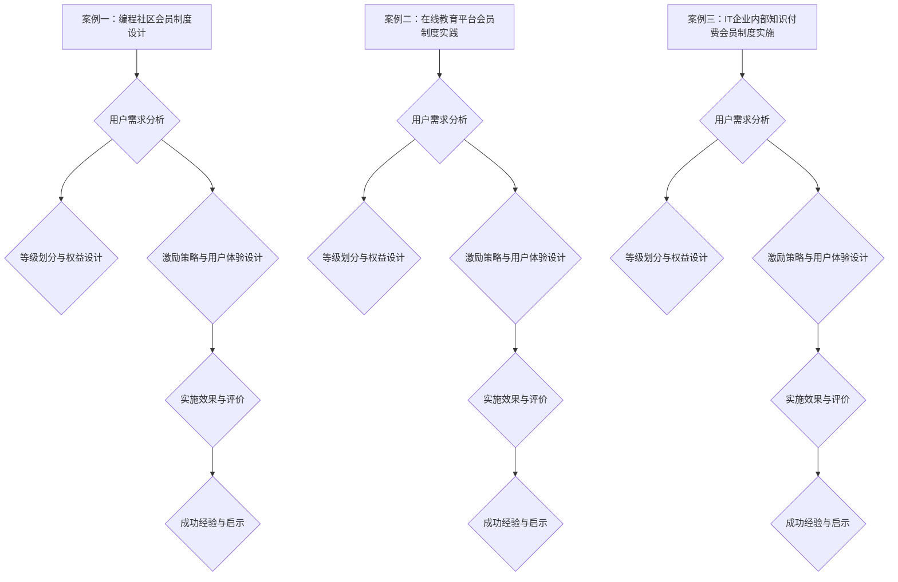

---

在接下来的章节中，我们将探讨知识付费与会员制度的发展趋势，以及程序员如何在未来的发展中抓住机遇，为会员制度的设计和创新提供新的视角和思路。

---

### 第7章: 未来展望与趋势

随着知识付费市场的不断成熟，会员制度也在不断演化和创新。未来，知识付费与会员制度将受到技术进步、市场需求变化等多方面因素的影响，呈现出一系列新的趋势和特点。

#### **7.1 市场趋势预测**

**1. 个性化定制趋势**

随着用户需求的多样化和个性化，会员制度将更加注重个性化定制。平台将利用大数据和人工智能技术，根据用户的兴趣、行为和需求，提供个性化的课程推荐、学习方案和会员服务。这种个性化定制将显著提高用户的满意度和忠诚度。

**2. 社区互动增强**

社区互动是会员制度的重要组成部分。未来，知识付费平台将更加重视社区建设，通过增强社区互动，提升用户的参与感和归属感。例如，通过在线论坛、社群、直播互动等方式，为用户提供更多的交流和学习机会，促进知识的传播和共享。

**3. 技术整合趋势**

知识付费平台将整合多种技术，提高会员制度的便捷性和智能化水平。例如，通过物联网技术，实现线下课程和线上课程的无缝对接；通过虚拟现实（VR）和增强现实（AR）技术，提供沉浸式的学习体验。

**4. 全球化扩张**

随着互联网的全球化发展，知识付费平台将不断扩大海外市场。会员制度将根据不同国家和地区的需求和文化特点，进行本地化调整，以满足全球用户的需求。

#### **7.2 技术进步的影响**

**1. 大数据和人工智能**

大数据和人工智能技术将深刻影响会员制度的设计和运营。通过大数据分析，平台可以更精准地了解用户需求和行为，优化会员权益和激励策略。人工智能技术将提升平台的智能化水平，如智能推荐、智能客服等，提高用户体验。

**2. 物联网技术**

物联网技术将使会员制度更加便捷和智能化。例如，通过物联网设备，用户可以随时随地进行学习，享受无缝的线上线下学习体验。

**3. 虚拟现实和增强现实**

虚拟现实（VR）和增强现实（AR）技术将为会员制度带来全新的学习体验。通过VR/AR技术，用户可以沉浸式学习，获得更加生动和直观的学习体验。

#### **7.3 未来发展方向**

**1. 深度学习与合作**

未来，知识付费平台将更加注重深度学习和跨界合作。通过与其他行业、企业和教育机构的合作，平台可以提供更多元化的学习资源和合作机会，满足用户多样化的学习需求。

**2. 持续创新与迭代**

会员制度的发展需要不断创新和迭代。平台应不断探索新的会员权益设计、激励策略和用户体验，以保持竞争力，提升用户满意度。

**3. 社会责任与可持续发展**

随着社会责任意识的提升，知识付费平台将在会员制度的设计和实施中更加注重社会责任和可持续发展。通过提供公益性课程、支持教育扶贫等方式，平台可以提升社会影响力，实现商业价值和社会价值的双赢。

**总结**

未来，知识付费与会员制度将呈现个性化定制、社区互动增强、技术整合和全球化扩张等趋势。技术进步将为会员制度带来新的机遇和挑战，推动其不断创新和发展。程序员在这一过程中需要紧跟技术前沿，持续学习和创新，为会员制度的设计和实施提供强有力的技术支持。

---

**Mermaid 流程图：知识付费与会员制度未来发展趋势**

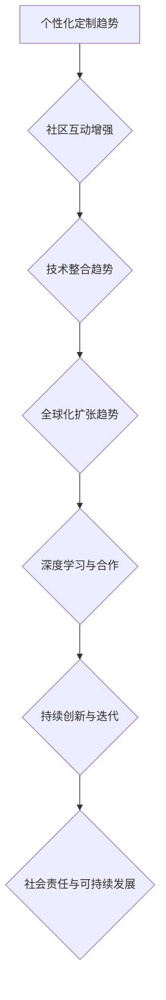

---

在未来的发展中，程序员将在知识付费与会员制度的创新中扮演重要角色。通过不断探索和尝试，程序员可以为会员制度带来新的活力和可能性，推动知识付费市场的持续繁荣。

---

### 第8章: 程序员在新模式中的角色与机会

随着知识付费市场的不断发展和会员制度的日益完善，程序员在这一新模式中扮演着越来越重要的角色。他们不仅作为知识的生产者和消费者，更是会员制度设计、实施和创新的关键力量。以下将探讨程序员在这一新模式中的角色与机会。

#### **8.1 程序员作为知识生产者的角色**

程序员是互联网时代知识付费市场的重要知识生产者。他们通过编写代码、撰写技术文章、制作教程视频等方式，将自己积累的专业知识和经验分享给广大开发者。在这个过程中，程序员可以：

- **构建在线课程和教程**：通过将实际工作经验和理论知识系统化，程序员可以创作高质量的在线课程和教程，帮助其他开发者提升技能。
- **开发知识付费平台**：程序员可以利用自己的技术能力，开发知识付费平台，为用户提供便捷的学习资源和服务。
- **参与开源项目**：通过参与开源项目，程序员可以与全球开发者共同分享和积累知识，推动技术的进步和创新。

#### **8.2 程序员作为知识消费者的角色**

作为知识付费的主要消费者，程序员通过购买在线课程、订阅专业社区等方式，不断提升自己的技术能力和职业素养。在这个过程中，程序员可以：

- **获取最新技术资讯**：通过订阅技术博客、参加线上研讨会等方式，程序员可以及时了解行业动态和前沿技术，保持技术敏感度。
- **参加认证考试**：程序员可以通过参加专业认证考试，获得权威的认证证书，提升自己的职业竞争力。
- **参与社群互动**：通过加入技术社区、论坛等，程序员可以与其他开发者交流、合作，共同解决技术难题，拓展人脉和资源。

#### **8.3 程序员在会员制度设计中的角色**

程序员在会员制度设计中扮演着关键角色，他们需要：

- **了解用户需求**：通过数据分析、用户访谈等方式，了解用户的学习需求和行为习惯，为会员制度设计提供依据。
- **制定激励策略**：根据用户需求和市场趋势，设计有效的激励策略，如积分制度、优惠券、专属活动等，以提升用户活跃度和忠诚度。
- **优化用户体验**：通过界面设计、交互优化等技术手段，确保会员制度能够为用户提供便捷、高效的学习体验。

#### **8.4 程序员在会员制度实施与运营中的角色**

在会员制度的实施与运营过程中，程序员需要：

- **确保系统稳定性**：通过技术架构优化、系统测试等技术手段，确保会员制度系统的稳定性和安全性，为用户提供可靠的服务。
- **处理技术问题**：及时发现并解决会员制度实施过程中出现的技术问题，如数据异常、系统故障等，保障会员制度的正常运行。
- **持续改进**：根据用户反馈和数据指标，不断优化会员制度的设计和实施，提升用户体验和平台竞争力。

#### **8.5 程序员在新模式中的机会**

在知识付费和会员制度的新模式中，程序员面临着诸多机会：

- **技术创新**：随着技术的发展，程序员可以利用人工智能、大数据、区块链等技术，为会员制度带来新的创新和应用场景。
- **职业发展**：通过在会员制度设计和实施中的出色表现，程序员可以获得更多的职业发展机会，如成为产品经理、技术总监等。
- **创业机会**：程序员可以利用自己的技术能力和行业经验，创建新的知识付费平台或会员制度服务，实现创业梦想。

**总结**

程序员在知识付费和会员制度的新模式中扮演着多重角色，既是知识的生产者和消费者，也是会员制度设计、实施和创新的关键力量。通过把握新模式中的机会，程序员可以不断提升自己的技术能力和职业素养，实现个人价值和职业发展。

---

**Mermaid 流程图：程序员在新模式中的角色与机会**

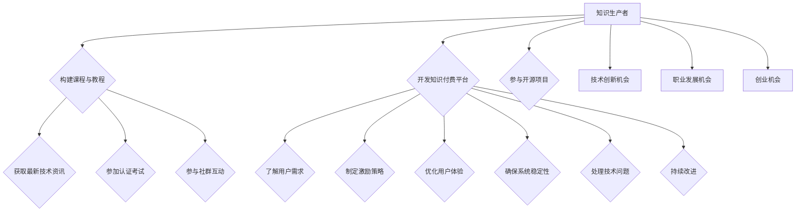

---

在知识付费和会员制度的新模式中，程序员通过不断创新和优化，将在推动行业发展和个人成长方面发挥重要作用。在接下来的章节中，我们将进一步探讨会员制度的设计理念与思考，为程序员提供更多的理论指导和实践经验。

---

### 第9章: 会员制度的设计理念与思考

会员制度的设计是知识付费平台成功的关键因素之一。一个优秀的会员制度不仅需要满足用户需求，还应在设计理念上体现出创新性、实用性和可持续性。以下将探讨会员制度的设计理念与思考，帮助程序员在设计和实施会员制度时能够做出更加明智的决策。

#### **9.1 创新性**

创新性是会员制度设计的重要理念。随着技术的进步和市场环境的变化，会员制度需要不断创新，以适应新的需求和挑战。

- **技术创新**：利用人工智能、大数据、区块链等新兴技术，为会员制度带来新的功能和体验。例如，通过人工智能进行个性化推荐，提高用户的满意度；通过区块链技术确保数据的安全和透明。
- **模式创新**：探索新的会员制度模式，如订阅制、积分制、社交互动等，以满足不同用户群体的需求。例如，通过积分制激励用户参与社区互动，提升平台的活跃度。

**示例思考：利用区块链技术**

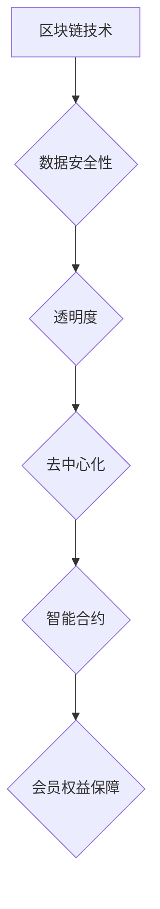

#### **9.2 实用性**

实用性是会员制度设计的核心。一个实用的会员制度需要简单易懂、易于操作，并且能够真正满足用户的需求。

- **简洁性**：简化会员制度的设计，减少不必要的复杂度，确保用户能够快速理解和使用会员权益。
- **灵活性**：设计灵活的会员制度，允许用户根据自身需求和偏好进行选择，提供个性化的服务。
- **实用性**：确保会员权益能够真正为用户带来实际价值，例如提供高质量的课程资源、优惠的价格等。

**示例思考：简洁性设计**

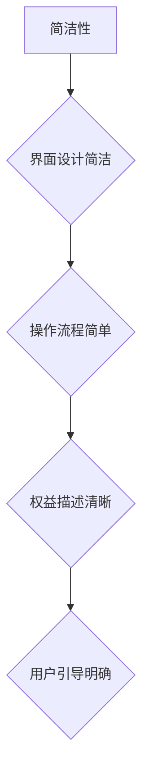

#### **9.3 可持续性**

可持续性是会员制度设计的长期考量。一个可持续的会员制度能够长期稳定地运行，为平台带来持续的收益。

- **成本效益**：在设计和实施会员制度时，需要考虑成本效益，确保会员制度能够为平台带来足够的收入，同时控制运营成本。
- **用户留存**：通过提供优质的服务和权益，增加用户的满意度和忠诚度，降低用户流失率，从而实现长期稳定的发展。
- **技术创新**：不断引入新的技术和理念，提升会员制度的竞争力，保持平台的领先地位。

**示例思考：成本效益分析**

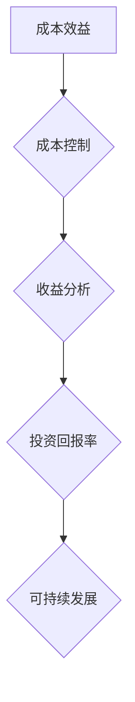

#### **9.4 用户为中心**

用户是会员制度的核心，设计会员制度时应始终以用户为中心。

- **用户需求分析**：深入了解用户需求和行为，为会员制度设计提供依据。可以通过用户访谈、问卷调查、数据分析等方法收集用户反馈。
- **用户体验设计**：确保会员制度的设计和实施能够为用户带来良好的使用体验。可以从界面设计、操作流程、权益描述等方面进行优化。
- **用户参与**：鼓励用户参与会员制度的制定和优化，通过社区互动、用户反馈等方式，收集用户的意见和建议，不断提升会员制度的用户体验。

**示例思考：用户需求分析**

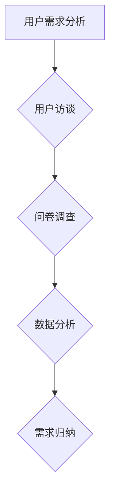

**总结**

会员制度的设计理念应体现创新性、实用性、可持续性和用户为中心。通过不断思考和优化，程序员可以设计出既符合用户需求，又具有市场竞争力的会员制度。在未来的发展中，程序员需要紧跟技术前沿，不断探索新的设计理念和实践方法，为知识付费平台的持续繁荣贡献力量。

---

**Mermaid 流�程图：会员制度设计理念与思考**

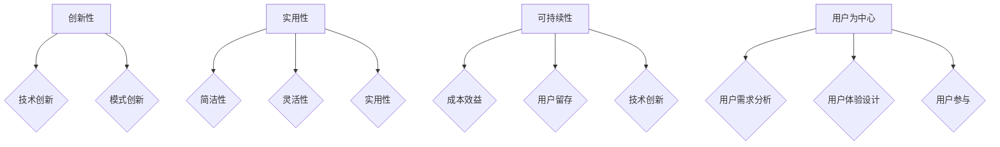

---

在会员制度的设计过程中，程序员需要不断反思和调整，以实现用户需求和市场变化的动态适应。在接下来的章节中，我们将进一步探讨会员制度相关资源的获取，为程序员的实践提供更多的支持和指导。

---

### 附录 A: 知识付费与会员制度相关资源

在知识付费与会员制度的设计和实施过程中，程序员需要参考大量的资源和工具。以下是一些主流的知识付费平台介绍、会员制度设计工具与资源，以及相关的政策法规与标准。

#### **A.1 主流知识付费平台介绍**

1. **网易云课堂**：网易云课堂是阿里巴巴集团旗下的知识付费平台，提供各类在线课程，包括编程、设计、语言等多个领域。会员制度包括免费会员、VIP会员等，提供不同的权益和优惠。

2. **腾讯课堂**：腾讯课堂是腾讯公司推出的在线教育平台，提供丰富的课程资源，涵盖IT技术、语言学习、职场技能等多个领域。会员制度包括普通会员、高级会员等，提供课程折扣、专属活动等权益。

3. **Coursera**：Coursera 是全球知名的大规模开放在线课程平台，提供来自世界顶级大学的课程。会员制度包括基础会员和付费会员，付费会员可以享受完整的课程内容和学习证书。

4. **edX**：edX 是由哈佛大学和麻省理工学院共同创办的非营利性在线课程平台，提供全球范围内的优质课程。会员制度包括免费会员和认证会员，认证会员可以获得课程证书。

5. **知乎**：知乎是一个知识分享社区，通过“盐选会员”制度为用户提供高质量的内容和权益，包括专栏文章、电子书等。

6. **得到APP**：得到APP 是罗振宇创办的知识付费平台，提供包括罗辑思维、吴军博士等知名人士的专栏和课程。会员制度包括免费会员和知识星球会员等。

#### **A.2 会员制度设计工具与资源**

1. **会员系统开发框架**：如 Ruby on Rails、Django 等，这些框架可以帮助程序员快速构建会员系统。

2. **会员数据分析工具**：如 Google Analytics、Mixpanel、Kissmetrics 等，这些工具可以帮助程序员收集和分析会员行为数据。

3. **会员权益管理系统**：如 Memberstack、MemberMouse、Membership Plugins 等，这些系统可以帮助程序员管理会员等级和权益。

4. **会员互动工具**：如 Slack、Discord、Reddit 等，这些工具可以帮助程序员创建和维护会员社区。

5. **会员激励工具**：如 Recurly、Chargebee、PayPal 等，这些工具可以帮助程序员管理会员订阅和支付。

#### **A.3 相关政策法规与标准**

1. **《中华人民共和国网络安全法》**：规定了网络安全的基本要求和法律责任，对知识付费平台的运营具有指导意义。

2. **《中华人民共和国个人信息保护法》**：规定了个人信息保护的基本原则和具体措施，对会员制度中用户数据的处理有重要影响。

3. **《在线教育服务管理暂行办法》**：对在线教育服务的管理进行了规范，包括课程内容、教学方式、会员制度等。

4. **《互联网信息服务管理办法》**：规定了互联网信息服务的管理要求和法律责任，对知识付费平台的运营和会员制度有指导意义。

5. **ISO/IEC 27001**：国际标准，用于信息安全管理体系认证，对知识付费平台的数据安全和隐私保护有重要参考价值。

**总结**

获取知识付费与会员制度相关资源是程序员设计会员制度的重要环节。通过了解主流知识付费平台、掌握会员制度设计工具与资源，以及遵循相关的政策法规与标准，程序员可以更好地设计和实施会员制度，提升知识付费平台的竞争力和用户体验。

---

**Mermaid 流程图：知识付费与会员制度相关资源**

```mermaid
graph TD
    A[主流知识付费平台介绍] --> B{网易云课堂}
    B --> C{腾讯课堂}
    B --> D{Coursera}
    B --> E{edX}
    B --> F{知乎}
    B --> G{得到APP}

    H[会员制度设计工具与资源] --> I{会员系统开发框架}
    H --> J{会员数据分析工具}
    H --> K{会员权益管理系统}
    H --> L{会员互动工具}
    H --> M{会员激励工具}

    N[相关政策法规与标准] --> O{网络安全法}
    N --> P{个人信息保护法}
    N --> Q{在线教育服务管理暂行办法}
    N --> R{互联网信息服务管理办法}
    N --> S{ISO/IEC 27001}
```

---

通过这些资源，程序员可以全面了解知识付费与会员制度的各个方面，为设计高效的会员制度提供有力支持。在未来的发展中，程序员应不断学习和探索，不断提升自身能力，为知识付费市场的发展贡献力量。

