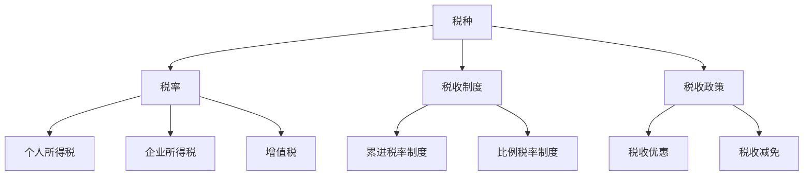
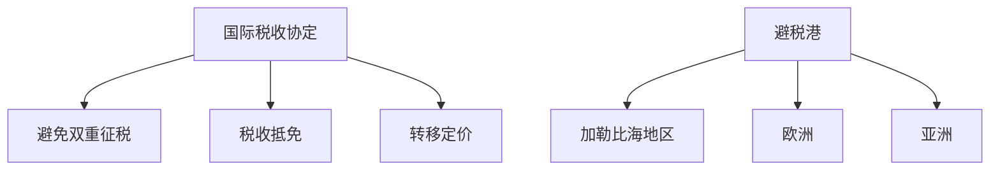
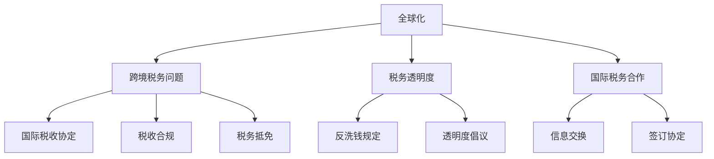
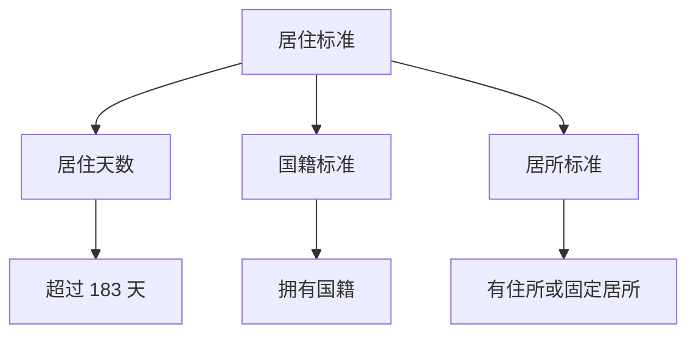
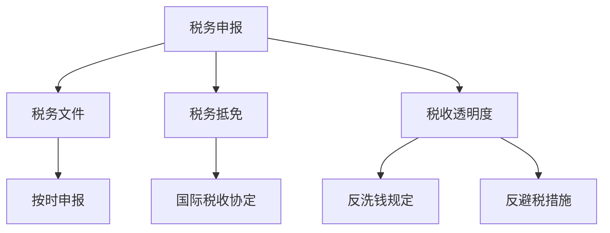

                 

# 《程序员的跨国税务规划指南》

## 关键词
跨国税务、税务规划、程序员工资、税务身份、税务合规、国际税收协定、税务抵免、跨境交易税务处理

## 摘要
在全球化的背景下，跨国税务规划成为程序员必须面对的重要课题。本文旨在为程序员提供一份全面的跨国税务规划指南，涵盖全球税务体系概述、税务规划和合规、国际收入税务规划、跨境交易税务处理、税务规划案例分析、税务合规与风险控制以及国际税务最新趋势与政策等方面。通过详细的分析和案例分析，帮助程序员更好地理解和规划自己的跨国税务问题，实现合法合规的税务安排。

---

### 《程序员的跨国税务规划指南》目录大纲

#### 第一部分：全球税务环境概述

- **第1章：全球税务体系概述**
  - **1.1 全球税务体系的基本框架**
  - **1.2 国际税收协定与避税港**
  - **1.3 全球化与税务治理**

#### 第二部分：税务规划和合规

- **第2章：程序员的税务身份与地位**
  - **2.1 税务居民与非税务居民的界定**
  - **2.2 税务居民身份的规划策略**
  - **2.3 全球税务合规要求**

#### 第三部分：国际收入税务规划

- **第3章：国际收入税务处理**
  - **3.1 居住国税务处理**
    - **3.1.1 居住国税率的计算方法**
    - **3.1.2 居住国税收减免政策**
  - **3.2 存托机构税务处理**
    - **3.2.1 存托机构的定义与作用**
    - **3.2.2 存托机构税务优劣势分析**
  - **3.3 海外收入税收抵免**
    - **3.3.1 税收抵免的概念**
    - **3.3.2 抵免限额与实际操作**

#### 第四部分：跨境交易税务规划

- **第4章：跨境交易税务处理**
  - **4.1 跨境交易概述**
  - **4.2 跨境贸易税务处理**
  - **4.3 跨境投资税务处理**

#### 第五部分：税务规划案例分析

- **第5章：税务规划案例解析**
  - **5.1 案例一：跨国公司税务规划**
  - **5.2 案例二：个人跨国税务规划**
  - **5.3 案例三：跨境交易税务筹划**

#### 第六部分：税务合规与风险控制

- **第6章：税务合规与风险控制**
  - **6.1 税务合规的重要性**
  - **6.2 税务风险识别与评估**
  - **6.3 税务风险管理策略**

#### 第七部分：国际税务最新趋势与政策

- **第7章：国际税务最新趋势与政策**
  - **7.1 国际税务新规概述**
  - **7.2 国际税务协定的新动态**
  - **7.3 国际税务未来展望**

#### 附录

- **附录 A：税务规划工具与资源**
  - **A.1 主流税务规划软件介绍**
  - **A.2 税务合规报告模板**
  - **A.3 国际税务咨询机构推荐**

---

### 第1章：全球税务体系概述

#### 1.1 全球税务体系的基本框架

全球税务体系的基本框架包括多个组成部分，如税种、税率、税收制度、税收政策等。以下是全球税务体系的基本构成：

1. **税种**：全球主要的税种包括个人所得税、企业所得税、增值税、关税、消费税等。不同国家和地区的税种可能有所不同，但个人所得税和企业所得税是最基本和普遍的税种。

2. **税率**：税率是指对某种税种课征的比例。全球税率的差异很大，例如个人所得税的税率在美国可能是 10% 至 37% 不等，而在一些避税港，税率可能非常低。

3. **税收制度**：税收制度是指国家对税收进行管理的一整套法律法规和操作流程。不同国家的税收制度也有所不同，例如有些国家采用累进税率制度，而有些国家则采用比例税率制度。

4. **税收政策**：税收政策是指政府为了实现特定的经济和社会目标而制定的税收政策。税收政策包括税收优惠、税收减免、税收征管等方面的措施。

**Mermaid 流程图：全球税务体系的基本框架**



#### 1.2 国际税收协定与避税港

国际税收协定是国家之间为避免双重征税和防止逃税而签订的协议。这些协定通常规定了如何对跨国公司的收入进行征税，以及如何处理税收抵免问题。以下是国际税收协定的几个关键要素：

1. **避免双重征税**：通过规定在两个或多个国家之间对同一收入只征税一次，以避免重复征税。

2. **税收抵免**：允许居民国家对其居民在外国缴纳的税款进行抵扣，从而减少其在本国的应纳税额。

3. **转移定价**：规定了跨国公司在不同国家之间如何定价其内部交易，以避免通过不合理的方式转移利润。

**全球避税港分析**

避税港是指那些对税收有优惠政策的地区，通常税率较低，或者有其他税收优惠措施。以下是全球一些著名的避税港：

1. **加勒比海地区**：如巴哈马、开曼群岛、巴林等，这些地区提供低税率或无税率的税收环境。

2. **欧洲**：如瑞士、列支敦士登，这些国家提供高水平的银行保密服务和税收优惠。

3. **亚洲**：如新加坡、香港，这些地区也是全球知名的金融中心和避税港。

**Mermaid 流�程图：国际税收协定与避税港**



#### 1.3 全球化与税务治理

全球化对税务治理提出了新的挑战和机遇。以下是一些关键点：

1. **跨境税务问题**：全球化使得跨国公司和个人在多个国家开展业务和活动，这导致了复杂的跨境税务问题，如国际税收协定、税收合规、税务抵免等。

2. **税务透明度**：全球化要求提高税务透明度，以防止逃税和避税行为。国际社会在这方面做出了努力，如实施《金融行动特别工作组》的反洗钱规定和《经济合作与发展组织》的透明度倡议。

3. **国际税务合作**：全球化促进了国际税务合作，各国政府通过签订国际税收协定、交换税务信息等方式来加强合作，以应对跨国税务问题。

**Mermaid 流程图：全球化与税务治理**



### 第2章：程序员的税务身份与地位

#### 2.1 税务居民与非税务居民的界定

税务居民和非税务居民的身份界定是跨国税务规划的基础。以下是如何判定税务居民和非税务居民的几种常见标准：

1. **居住标准**：某些国家根据一个人在一个国家居住的天数来判定其税务居民身份。例如，美国要求一个人在一个税收年度内居住超过 183 天即为税务居民。

2. **国籍标准**：一个人如果拥有某个国家的国籍，那么该国家通常视为其税务居民。

3. **居所标准**：如果一个国家的人在一个地方有住所或固定居所，那么该国家可能视为其税务居民。

**Mermaid 流程图：税务居民与非税务居民的判定标准**



#### 2.2 税务居民身份的规划策略

程序员可以通过以下策略来规划自己的税务居民身份：

1. **居住国转移**：如果一个人想要改变其税务居民身份，可以考虑转移到另一个国家，这通常需要满足该国家规定的居住条件。

2. **非居民身份利用**：如果一个人在多个国家工作，可以利用非居民身份来减少在居住国的纳税负担。

3. **身份合规**：确保自己的税务居民身份符合所有国家的法律法规，避免不必要的税务风险。

**伪代码：税务居民身份规划策略**

```python
def determine_tax_residency(countries_visited, days_in_country, nationality, residence):
    if nationality == "USA" and days_in_country > 183:
        return "Non-Resident"
    elif residence == "foreign" and countries_visited > 1:
        return "Non-Resident"
    else:
        return "Resident"
```

#### 2.3 全球税务合规要求

全球税务合规要求程序员遵守多个国家的税务规定。以下是一些关键合规要求：

1. **税务申报**：程序员需要在居住国和所有工作国家按时申报税务，并提供必要的税务文件和资料。

2. **税务抵免**：利用税务抵免来减少重复纳税，这通常需要符合国际税收协定的规定。

3. **税收透明度**：确保所有税务信息透明，遵守反洗钱和反避税的规定。

**Mermaid 流程图：全球税务合规要求**



### 第3章：国际收入税务规划

#### 3.1 居住国税务处理

程序员在居住国所获得的收入通常需要按照居住国的税法进行税务处理。以下是一些关键点：

1. **税率计算方法**：不同国家的税率计算方法可能不同，例如有些国家采用累进税率制度，而有些国家则采用比例税率制度。

2. **税收减免政策**：许多国家提供各种税收减免政策，例如对教育、医疗、慈善等领域的支出提供税收抵扣。

3. **税务规划案例**：以下是一个简单的税务规划案例：

   **案例**：一位程序员在美国工作，年收入为 100,000 美元。根据美国税法，其税率按照累进税率计算，分别为 10%、12%、22%、24%、32%、35%、37%。假设他的其他费用和减免为 20,000 美元，则其应纳税额为：

   \[ (100,000 - 20,000) \times 0.37 = 29,400 \] 美元。

#### 3.2 存托机构税务处理

存托机构（DTA）是指负责代扣代缴外国税款的机构。以下是存托机构税务处理的几个关键点：

1. **定义与作用**：存托机构通常由证券交易所或金融机构提供，它们负责根据外国税法代扣代缴税款。

2. **税务优劣势分析**：存托机构可以提供一些税务优势，例如简化税务申报流程、降低税务风险等，但也可能存在一些劣势，如税率较高、抵免限制等。

3. **税务规划案例**：以下是一个简单的存托机构税务规划案例：

   **案例**：一位程序员在新加坡工作，其股票收入需要通过新加坡证券交易所的存托机构进行税务处理。假设其股票收入为 10,000 新元，存托机构按照 15% 的税率代扣代缴税款，则其应纳税额为 1,500 新元。

#### 3.3 海外收入税收抵免

海外收入税收抵免是指程序员可以在居住国对其在国外缴纳的税款进行抵扣，从而减少其在本国的应纳税额。以下是税收抵免的几个关键点：

1. **概念**：税收抵免允许程序员将其在国外缴纳的税款视为在本国的预付税款，从而减少其在本国的应纳税额。

2. **抵免限额**：抵免限额通常根据国际税收协定的规定来确定，例如某些国际税收协定规定抵免限额为 15%。

3. **实际操作**：以下是一个简单的税收抵免实际操作案例：

   **案例**：一位程序员在法国工作，年收入为 50,000 欧元。根据法国税法，其税率按照累进税率计算，分别为 14%、30%、40%、45%。假设其在法国缴纳了 7,000 欧元的税款，则其可以在其居住国进行税收抵免，减少其在本国的应纳税额。

   \[ 应纳税额 = (50,000 - 7,000) \times 0.45 = 16,200 \] 欧元。

### 第4章：跨境交易税务处理

#### 4.1 跨境交易概述

跨境交易是指涉及两个或多个国家之间的交易活动。以下是一些关键点：

1. **定义与分类**：跨境交易可以包括商品贸易、服务贸易、投资交易等。不同类型的跨境交易可能有不同的税务处理要求。

2. **影响因素**：跨境交易的影响因素包括汇率波动、关税政策、税收协定等。

3. **主要税务问题**：跨境交易可能涉及关税、增值税、税收抵免等问题。

#### 4.2 跨境贸易税务处理

跨境贸易税务处理涉及关税和进口税等方面。以下是一些关键点：

1. **关税与进口税**：关税和进口税是跨境贸易中最常见的税务问题。关税是针对进口商品征收的税款，而进口税是对进口商品和服务征收的税款。

2. **反倾销税与特别关税**：反倾销税和特别关税是针对特定情况征收的税款，例如反倾销税是针对低价进口商品征收的税款。

3. **案例分析**：以下是一个简单的跨境贸易税务处理案例：

   **案例**：一位程序员从中国进口了一批商品，价值为 100,000 美元。根据美国关税法，该商品需缴纳 20% 的关税，则其关税税额为 20,000 美元。

#### 4.3 跨境投资税务处理

跨境投资税务处理涉及股权投资和理财投资等方面。以下是一些关键点：

1. **股权投资税务处理**：股权投资可能涉及资本收益税、股息税等问题。不同国家的税法对股权投资的税务处理可能有所不同。

2. **理财投资税务处理**：理财投资可能涉及利息收入税、资本收益税等问题。理财投资的税务处理通常较为复杂，需要考虑多种因素。

3. **案例分析**：以下是一个简单的跨境投资税务处理案例：

   **案例**：一位程序员在新加坡投资了一家美国公司，其股票价值为 10,000 美元。根据新加坡税法，其资本收益需缴纳 15% 的资本收益税，则其应纳税额为 1,500 美元。

### 第5章：税务规划案例解析

#### 5.1 案例一：跨国公司税务规划

**案例背景**：一家跨国公司计划在欧洲、亚洲和北美地区开展业务。为了实现全球税务优化，该公司需要制定一份全面的税务规划方案。

**税务规划目标**：通过优化全球税务结构，降低公司整体税负，同时确保税务合规。

**税务规划策略与实施**：

1. **转移定价策略**：通过合理定价跨国公司内部的商品和服务交易，以降低利润在税负较高的国家的累积。

2. **税务优惠利用**：研究各国提供的税收优惠政策，如研发税收抵扣、外国税款的税收抵免等。

3. **税务合规管理**：建立全球税务合规体系，确保公司在各国的税务申报和缴纳符合当地法律法规。

**实施效果**：通过一系列的税务优化措施，该公司成功降低了全球税负，同时确保了税务合规，实现了税务优化目标。

#### 5.2 案例二：个人跨国税务规划

**案例背景**：一位程序员在纽约工作，同时在中国和新加坡有短期工作项目。为了合理规划其跨国税务，他需要制定一份个人税务规划方案。

**税务规划目标**：通过合理规划税务身份和收入来源，降低其总体税负，同时确保税务合规。

**税务规划策略与实施**：

1. **税务身份规划**：通过分析各国税务居民身份的规定，规划其税务居民身份，以最大化利用税收抵免政策。

2. **收入来源规划**：将收入合理分配到不同的国家，以享受各国的税收优惠政策。

3. **税务申报管理**：确保按时申报各国税务，并提供必要的税务文件和资料。

**实施效果**：通过一系列的税务规划措施，该程序员成功降低了其总体税负，并在各国之间实现了税务合规。

#### 5.3 案例三：跨境交易税务筹划

**案例背景**：一位程序员计划将一家科技公司在美国和欧洲之间的商品进行交易。为了实现税务优化，他需要制定一份跨境交易税务筹划方案。

**税务筹划目标**：通过优化跨境交易的税务结构，降低交易税负，同时确保税务合规。

**税务筹划策略与实施**：

1. **转移定价策略**：通过合理定价跨国公司内部的商品交易，以降低利润在税负较高的国家的累积。

2. **税收协定利用**：研究美国和欧洲之间的税收协定，利用税收抵免政策减少重复征税。

3. **税务申报管理**：确保按时申报跨境交易的税务，并提供必要的税务文件和资料。

**实施效果**：通过一系列的税务筹划措施，该程序员成功降低了跨境交易的税负，同时确保了税务合规。

### 第6章：税务合规与风险控制

#### 6.1 税务合规的重要性

税务合规是每个程序员和企业必须遵守的基本原则。以下是一些关键点：

1. **税务合规的意义**：税务合规是确保企业和个人合法合规经营的重要保障，有助于避免税务风险和法律责任。

2. **税务合规的要求**：税务合规要求企业和个人遵守各国的税务法律法规，按时申报和缴纳税务，提供真实的税务信息。

3. **税务合规的重要性**：税务合规不仅可以降低税务风险，还可以提高企业的信誉和竞争力，有助于长期可持续发展。

#### 6.2 税务风险识别与评估

税务风险是指因未遵守税务法律法规而导致的不利后果。以下是一些关键点：

1. **税务风险的类型**：税务风险可分为合规风险、税务欺诈风险、税务政策变化风险等。

2. **税务风险的评估方法**：通过风险识别和评估，可以确定税务风险的类型和程度，为风险管理提供依据。

3. **税务风险的案例分析**：以下是一个简单的税务风险识别与评估案例：

   **案例**：一家跨国公司计划在印度投资，但未了解印度当地的税收政策，导致其面临较高的税务风险。通过风险评估，该公司发现了潜在的风险，并制定了相应的风险管理策略。

#### 6.3 税务风险管理策略

税务风险管理策略旨在降低税务风险，确保企业和个人的税务合规。以下是一些关键点：

1. **税务风险管理的目标**：税务风险管理的目标是确保税务合规，降低税务风险，提高税务效率。

2. **税务风险管理的措施**：包括建立税务风险管理组织、制定税务风险管理政策、开展税务风险评估等。

3. **税务风险管理案例解析**：以下是一个简单的税务风险管理案例：

   **案例**：一家跨国公司通过建立税务风险管理组织，制定详细的税务风险管理政策，定期开展税务风险评估，成功降低了税务风险，确保了税务合规。

### 第7章：国际税务最新趋势与政策

#### 7.1 国际税务新规概述

国际税务新规是各国为了应对全球化背景下的税务问题而制定的一系列法规。以下是一些关键点：

1. **国际税务新规的主要变动**：包括提高跨国公司的税务负担、加强税务信息交换、打击税收逃漏等。

2. **国际税务新规的实施影响**：对跨国公司的税务策略、税务申报和合规要求等产生了深远影响。

3. **国际税务新规的发展趋势**：未来国际税务新规将更加注重税务透明度和国际税务合作。

#### 7.2 国际税务协定的新动态

国际税务协定是各国之间为了解决跨国税务问题而签订的协议。以下是一些关键点：

1. **国际税务协定的最新发展**：包括签订新的税务协定、修订现有协定、加强税务信息交换等。

2. **国际税务协定的重点内容**：如避免双重征税、税收抵免、转移定价等。

3. **国际税务协定的未来方向**：更加注重税务透明度和国际税务合作。

#### 7.3 国际税务未来展望

国际税务的未来展望包括以下几个方面：

1. **国际税务发展的挑战与机遇**：全球化、税务透明度、税务合规等带来的挑战和机遇。

2. **税务规划者的应对策略**：如何应对国际税务新规、税务协定变化等。

3. **国际税务的未来趋势**：更加注重税务透明度、国际税务合作、税务合规等。

### 附录 A：税务规划工具与资源

#### A.1 主流税务规划软件介绍

以下是一些主流税务规划软件的介绍：

1. **TaxAct**：一款适用于美国纳税人的税务规划软件，提供在线申报和电子文件存储等功能。

2. **TurboTax**：一款适用于美国纳税人的税务规划软件，提供简单易用的界面和多种税务优惠计算功能。

3. **H&R Block**：一款提供在线税务规划和申报服务的软件，同时提供现场税务咨询服务。

#### A.2 税务合规报告模板

以下是一些常见的税务合规报告模板：

1. **税务合规报告模板 A**：适用于年度税务合规报告，包括税务合规声明、税务申报表、税务文件清单等。

2. **税务合规报告模板 B**：适用于季度税务合规报告，包括税务合规声明、税务申报表、税务文件清单等。

3. **税务合规报告模板 C**：适用于特殊税务事件合规报告，包括事件描述、影响分析、合规措施等。

#### A.3 国际税务咨询机构推荐

以下是一些国际知名的税务咨询机构推荐：

1. **德勤**：一家全球领先的会计事务所，提供国际税务咨询服务，包括税务规划、税务合规、税务争议解决等。

2. **普华永道**：一家全球领先的会计事务所，提供国际税务咨询服务，包括税务规划、税务合规、税务争议解决等。

3. **安永**：一家全球领先的会计事务所，提供国际税务咨询服务，包括税务规划、税务合规、税务争议解决等。

---

### 作者信息

**作者：AI天才研究院/AI Genius Institute & 禅与计算机程序设计艺术 /Zen And The Art of Computer Programming**

