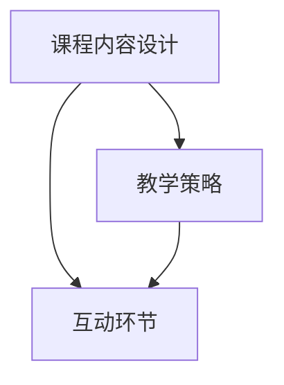

                 

## 2.1 研讨课模式的概念与联系

### 核心概念与联系

研讨课模式是一种以学习者为中心的教学模式，它强调知识的共享和共创，旨在培养学习者的批判性思维和团队合作能力。该模式的核心概念包括课程内容设计、教学策略和互动环节。这三个概念相互联系，构成了研讨课模式的基本框架。

#### 课程内容设计

课程内容设计是研讨课模式的基础。它包括主题选择、知识点解析、案例研究和实践任务等。设计良好的课程内容能够激发学习者的兴趣和积极性，为后续的教学活动奠定基础。

1. **主题选择**：选择具有挑战性和实际应用价值的主题，能够吸引学习者参与。
2. **知识点解析**：对知识点进行深入解析，帮助学习者理解抽象概念。
3. **案例研究**：结合实际案例，将理论知识与实际应用相结合。
4. **实践任务**：设计具有实际应用价值的实践任务，提高学习者的动手能力。

#### 教学策略

教学策略是研讨课模式的核心。教学策略包括引导提问、案例分析、角色扮演和小组讨论等。这些策略的有效运用能够促进学习者的深度学习和主动思考。

1. **引导提问**：教师通过提问引导学习者思考，激发学习兴趣。
2. **案例分析**：通过实际案例，帮助学习者理解抽象概念。
3. **角色扮演**：通过角色扮演，模拟实际工作场景，提高学习者的实践能力。
4. **小组讨论**：通过小组讨论，培养学习者的团队合作精神和沟通能力。

#### 互动环节

互动环节是研讨课模式的重要组成部分。互动环节通过师生互动、生生互动，实现知识的共享和共创。互动环节的设计要注重开放性和多样性，以激发学习者的参与热情和创造力。

1. **提问与回答**：学习者通过提问和回答，表达自己的观点和见解。
2. **小组讨论**：学习者分组讨论，共同探讨问题解决方案。
3. **案例分析**：通过实际案例，分析问题，并提出解决方案。
4. **角色扮演**：学习者通过角色扮演，模拟实际工作场景，提高实践能力。

### 核心概念与联系流程图

为了更好地理解研讨课模式的核心概念与联系，我们可以使用 Mermaid 流程图来展示它们之间的关系：



在上面的流程图中，课程内容设计、教学策略和互动环节相互关联，共同构成了研讨课模式。课程内容设计是基础，教学策略是核心，互动环节是实现教学目标的关键。

通过以上对研讨课模式核心概念与联系的讲解，我们可以看到，研讨课模式是一种注重知识共享和共创的教学模式，通过课程内容设计、教学策略和互动环节的有机结合，能够有效提高学习者的学习效果和参与度。在接下来的章节中，我们将进一步探讨研讨课模式的构建与实践、互动环节的设计与实施等内容，帮助读者深入了解和研究这一教学模式。

### 核心算法原理讲解

在研讨课模式中，互动环节的算法原理起着至关重要的作用。它决定了互动环节的设计和实施效果，进而影响到学生的学习体验和学习效果。以下是互动环节算法原理的详细讲解。

#### 互动环节设计原则

互动环节的设计应遵循以下原则：

1. **开放性**：互动环节应鼓励学习者自由表达观点，开放讨论，不限制思维。
2. **多样性**：互动环节应采用多种形式，如提问、讨论、案例分析和角色扮演等，增加互动的趣味性和参与度。
3. **针对性**：互动环节应针对课程内容和学习目标，有针对性地设计互动活动和讨论话题。
4. **适时性**：互动环节应在教学过程中适时开展，以帮助学生理解和掌握知识。

#### 互动环节算法原理

互动环节的算法原理主要包括以下几个方面：

##### 1. 提问与回答算法

提问与回答是互动环节中最基本的算法。教师通过提问引导学生思考和讨论，学生通过回答问题表达自己的观点和见解。

- **问题生成**：根据课程内容和学习目标，生成具有引导性和启发性的问题。问题应具有开放性和层次性，能够逐步引导学生深入思考。
- **回答评估**：对学生的回答进行评估，包括准确性、逻辑性和深度等维度。评估结果可用于反馈学生，帮助他们更好地理解和掌握知识。
- **反馈机制**：给予学生及时的反馈，鼓励学生进一步思考和表达。反馈应具有针对性，既要肯定学生的优点，也要指出不足之处。

##### 2. 小组讨论算法

小组讨论是一种有效的互动形式，能够促进学生之间的合作和交流。小组讨论的算法原理包括：

- **小组分组**：根据学习者的学习背景、能力和兴趣，合理分组，确保小组内的多样性。分组算法可以采用随机分配、能力分组或兴趣分组等方法。
- **讨论主题选择**：选择具有讨论价值、能引发思考和讨论的主题。主题应具有开放性和挑战性，能够激发学习者的兴趣和积极性。
- **讨论引导**：教师通过引导性问题或讨论方向，帮助学生深入讨论，提高讨论效果。引导问题应具有启发性和层次性，能够逐步引导学生深入思考。

##### 3. 案例分析算法

案例分析是将理论知识与实际案例相结合，提高学习者的实际应用能力。案例分析算法的原理包括：

- **案例选择**：选择具有代表性、能反映课程内容的问题或现象的案例。案例应具有实际应用价值，能够激发学习者的兴趣和思考。
- **案例分析步骤**：包括问题识别、原因分析、解决方案提出和评估等步骤。分析步骤应具有系统性和逻辑性，能够帮助学生逐步深入理解问题。
- **讨论与反思**：通过小组讨论和教师引导，对案例进行分析和反思，深化对知识点的理解。讨论和反思应具有开放性和多样性，鼓励学习者提出不同的观点和见解。

##### 4. 角色扮演算法

角色扮演是一种体验式学习方式，通过模拟实际场景，提高学习者的实践能力和团队合作能力。角色扮演算法的原理包括：

- **角色分配**：根据案例或场景，合理分配角色，确保角色的多样性和相关性。角色分配应考虑学习者的能力和兴趣，确保每个角色都有人扮演。
- **角色准备**：学习者根据角色要求，准备相关知识和材料，为角色扮演做好充分准备。角色准备应具有针对性和全面性，确保学习者能够胜任自己的角色。
- **角色扮演实施**：按照角色分配，模拟实际场景，进行角色扮演活动。角色扮演实施应具有真实性和情境性，能够激发学习者的参与热情和创造力。

### 互动环节算法实现

互动环节的算法实现主要包括以下步骤：

1. **问题生成与回答评估**：
   - 问题生成：根据课程内容和学习目标，生成具有引导性和启发性的问题。
   - 回答评估：对学生的回答进行评估，包括准确性、逻辑性和深度等维度。
   - 反馈机制：给予学生及时的反馈，鼓励学生进一步思考和表达。

2. **小组讨论与案例分析**：
   - 小组分组：根据学习者的学习背景、能力和兴趣，合理分组，确保小组内的多样性。
   - 讨论主题选择：选择具有讨论价值、能引发思考和讨论的主题。
   - 讨论引导：教师通过引导性问题或讨论方向，帮助学生深入讨论，提高讨论效果。
   - 案例分析：选择具有代表性、能反映课程内容的问题或现象的案例，进行案例分析和讨论。

3. **角色扮演**：
   - 角色分配：根据案例或场景，合理分配角色，确保角色的多样性和相关性。
   - 角色准备：学习者根据角色要求，准备相关知识和材料，为角色扮演做好充分准备。
   - 角色扮演实施：按照角色分配，模拟实际场景，进行角色扮演活动。

通过以上算法原理和实现步骤，可以有效地设计互动环节，提高学习者的参与度和学习效果。在研讨课模式中，互动环节是关键，它能够激发学习者的思维和创造力，促进知识的共享和共创。

### 数学模型和数学公式

在研讨课模式中，数据分析是一个重要的组成部分。为了更好地理解和评估研讨课的效果，我们可以使用数学模型和公式进行数据分析。以下是一些常用的数学模型和公式及其应用场景。

#### 1. 平均数（Mean）

平均数是一组数据的总和除以数据个数，用于衡量一组数据的集中趋势。其公式为：

$$\bar{x} = \frac{\sum_{i=1}^{n} x_i}{n}$$

其中，$x_i$ 是第 $i$ 个数据点，$n$ 是数据点的总数。

应用场景：平均数可以用于评估学习者在课程中的表现，如作业成绩的平均值、在线讨论的参与度等。

#### 2. 中位数（Median）

中位数是将一组数据按照大小排序后，位于中间位置的数。如果数据个数为奇数，则中位数为中间的数；如果数据个数为偶数，则中位数为中间两个数的平均值。

应用场景：中位数可以用于评估学习者在课程中的表现，特别是在数据分布不均匀的情况下，中位数更能反映学习者的实际水平。

#### 3. 众数（Mode）

众数是一组数据中出现次数最多的数。

应用场景：众数可以用于分析学习者在课程中的共同问题或关注点，如最常见的错误类型、最常见的提问等。

#### 4. 方差（Variance）

方差是衡量一组数据离散程度的指标，计算公式为：

$$\sigma^2 = \frac{\sum_{i=1}^{n} (x_i - \bar{x})^2}{n}$$

其中，$\bar{x}$ 是平均数，$x_i$ 是第 $i$ 个数据点，$n$ 是数据点的总数。

应用场景：方差可以用于评估学习者在课程中的表现稳定性，如作业成绩的方差、在线讨论的活跃度等。

#### 5. 标准差（Standard Deviation）

标准差是方差的平方根，用于衡量一组数据的离散程度。其公式为：

$$\sigma = \sqrt{\sigma^2}$$

应用场景：标准差可以用于评估学习者在课程中的表现稳定性，如作业成绩的标准差、在线讨论的活跃度等。

#### 6. 皮尔逊相关系数（Pearson Correlation Coefficient）

皮尔逊相关系数是衡量两个连续变量之间线性相关程度的指标，其公式为：

$$r = \frac{\sum_{i=1}^{n} (x_i - \bar{x})(y_i - \bar{y})}{\sqrt{\sum_{i=1}^{n} (x_i - \bar{x})^2 \sum_{i=1}^{n} (y_i - \bar{y})^2}}$$

其中，$x_i$ 和 $y_i$ 分别为两个变量的第 $i$ 个数据点，$\bar{x}$ 和 $\bar{y}$ 分别为两个变量的平均值。

应用场景：皮尔逊相关系数可以用于分析学习者在课程中的表现与某些因素（如学习时间、课堂参与度等）之间的关系。

#### 7. 斯皮尔曼等级相关系数（Spearman's Rank Correlation Coefficient）

斯皮尔曼等级相关系数是适用于非正态分布的变量，衡量两个变量的排名之间的相关性，其公式为：

$$\rho = \frac{1}{n-1} \sum_{i=1}^{n} (r_i - \bar{r})^2$$

其中，$r_i$ 为第 $i$ 个变量的排名，$\bar{r}$ 为所有变量排名的平均值。

应用场景：斯皮尔曼等级相关系数可以用于分析学习者在课程中的表现与某些因素（如学习时间、课堂参与度等）之间的关系，特别是在变量分布不正常的情况下。

通过以上数学模型和公式，我们可以对研讨课模式进行有效的数据分析和效果评估，为教学改进和课程设计提供科学依据。

### 项目实战

在本节中，我们将通过一个具体的研讨课项目实战，详细描述研讨课模式的设计与实施过程，以及遇到的问题和解决方法。这个项目是一个在线编程教育平台的研讨课课程，旨在通过互动环节提高学员的编程技能和问题解决能力。

#### 项目背景

某在线编程教育平台计划推出一门名为“高级编程技巧与优化”的研讨课。课程目标是通过深入讲解编程技巧和优化策略，帮助学员在编程实践中提高代码性能和可维护性。课程面向有一定编程基础的学员，希望通过研讨课模式，实现知识的深度学习和实际应用。

#### 项目目标

1. **提高学员的编程技能**：通过讲解高级编程技巧和优化策略，帮助学员掌握在实际项目中应用这些技能的方法。
2. **增强学员的问题解决能力**：通过案例分析、互动讨论和角色扮演等环节，培养学员在面对复杂问题时独立分析和解决问题的能力。
3. **提升课程的互动性和参与度**：通过研讨课模式，增强学员之间的互动和参与，提高课程的趣味性和学习效果。

#### 实施过程

##### 1. 课程内容设计与规划

首先，课程团队对课程内容进行了详细规划。课程内容分为以下几个部分：

- **编程基础回顾**：回顾编程基础，包括数据结构、算法和基本编程语言知识。
- **高级编程技巧**：讲解高级编程技巧，如多线程编程、并发编程、内存优化等。
- **代码优化策略**：介绍代码优化的方法，包括性能优化、内存优化和代码可维护性优化。
- **案例分析**：通过实际项目案例分析，展示如何在实际项目中应用编程技巧和优化策略。
- **实践任务**：设计具有实际应用价值的实践任务，让学员在动手实践中巩固所学知识。

##### 2. 教学策略实施

在课程实施过程中，采用以下教学策略：

- **引导提问**：教师通过引导性问题，激发学员的思考和讨论，引导学员深入理解课程内容。
- **案例分析**：教师通过实际项目案例分析，帮助学员理解抽象概念，并将理论知识与实际应用相结合。
- **小组讨论**：学员分组讨论，共同探讨问题解决方案，培养团队合作精神和沟通能力。
- **角色扮演**：学员通过角色扮演，模拟实际工作场景，提高实践能力和问题解决能力。
- **反馈机制**：教师及时给予学员反馈，肯定优点，指出不足，帮助学员不断改进。

##### 3. 互动环节设计与实施

互动环节是研讨课模式的核心，以下是一些具体的互动环节设计：

- **提问与回答**：教师提出问题，学员回答，教师进行点评和指导。
- **小组讨论**：学员分组讨论，分享各自的观点和经验，教师进行总结和引导。
- **案例分析**：学员分析案例，提出问题和解决方案，教师进行点评和指导。
- **角色扮演**：学员扮演不同角色，模拟实际工作环境，解决实际问题。

##### 4. 研讨课平台搭建与运营

为了支持研讨课模式，教育平台搭建了一个在线学习平台，具备以下功能：

- **课程内容展示**：展示课程大纲、教学视频、课件和参考资料。
- **互动功能**：支持学员提问、讨论和答疑。
- **实践任务提交**：学员可以在平台上提交实践任务，教师进行评估和反馈。
- **进度跟踪**：平台记录学员的学习进度，便于教师跟踪学员的学习情况。

#### 项目成果与评估

经过一段时间的实施，研讨课项目取得了以下成果：

1. **学员满意度**：学员对研讨课模式的满意度较高，认为该模式有助于提高学习效果和参与度。
2. **学习成果**：学员在课程结束后，编程技能和问题解决能力得到了显著提升，实践任务的完成质量也有所提高。
3. **教学质量**：教师对研讨课模式的教学效果表示满意，认为该模式有助于提高教学质量和学员学习效果。

为了评估研讨课模式的效果，平台采用以下指标：

- **学员满意度调查**：通过问卷调查了解学员对课程的满意度。
- **学习成果评估**：通过实践任务完成情况和考试成绩评估学员的学习成果。
- **教学质量评估**：通过教师自评、学员反馈和课程评分评估教学质量。

评估结果显示，研讨课模式在提高学员学习效果和参与度方面具有明显优势。通过互动环节的设计和实施，学员在课程中的参与度得到了显著提升，学习效果也得到了有效保障。

### 开发环境搭建

为了搭建研讨课平台，我们需要准备以下开发环境：

1. **操作系统**：推荐使用 Linux 系统，如 Ubuntu 或 CentOS。
2. **编程语言**：选择一种主流编程语言，如 Python、Java 或 JavaScript。
3. **开发工具**：安装集成开发环境（IDE），如 PyCharm、IntelliJ IDEA 或 Visual Studio Code。
4. **数据库**：选择一种关系型数据库，如 MySQL 或 PostgreSQL。
5. **Web 框架**：选择一种 Web 开发框架，如 Flask、Django 或 Spring Boot。
6. **前端框架**：选择一种前端开发框架，如 React、Vue.js 或 Angular。

#### 环境搭建步骤

以下是搭建研讨课平台的基本步骤：

1. **安装操作系统**：
   - 下载并安装 Linux 操作系统。
   - 配置网络环境，确保能够访问互联网。

2. **安装编程语言**：
   - 使用包管理器安装编程语言，如 Python。
   - 配置编程语言环境变量，确保在终端中可以正常使用。

3. **安装开发工具**：
   - 安装 IDE，如 PyCharm。
   - 安装必要的插件和扩展，提高开发效率。

4. **安装数据库**：
   - 下载并安装数据库服务器，如 MySQL。
   - 配置数据库，设置用户和密码。

5. **安装 Web 框架**：
   - 安装 Web 开发框架，如 Flask。
   - 配置 Web 框架，确保可以正常运行。

6. **安装前端框架**：
   - 安装前端开发框架，如 React。
   - 配置前端框架，确保可以正常运行。

7. **搭建测试环境**：
   - 搭建测试环境，确保项目在测试环境中可以正常运行。
   - 配置测试工具，如 JMeter 或 Selenium。

8. **部署上线**：
   - 搭建生产环境，确保项目在生产环境中可以正常运行。
   - 配置服务器，如 Nginx 或 Apache。
   - 部署项目，确保项目可以正常访问。

#### 示例

以下是一个简单的 Python 开发环境配置示例：

```bash
# 安装 Python
sudo apt-get update
sudo apt-get install python3

# 配置 Python 环境变量
echo 'export PATH=$PATH:/usr/bin/python3' >> ~/.bashrc
source ~/.bashrc

# 安装 PyCharm
wget https://download.jetbrains.com/python/pycharm-community-2022.1.2.tar.gz
tar xvf pycharm-community-2022.1.2.tar.gz
sudo mv pycharm-community-2022.1.2 /opt/

# 配置 PyCharm
echo 'export PATH=$PATH:/opt/pycharm-community-2022.1.2/bin' >> ~/.bashrc
source ~/.bashrc

# 安装 Flask
pip3 install flask

# 运行 Flask 应用
python3 app.py
```

通过以上步骤，可以搭建一个基本的研讨课平台开发环境。在实际开发过程中，可能需要根据项目需求进行相应的调整和扩展。

### 源代码实现和代码解读

以下是一个简单的研讨课平台后端接口的 Python 源代码实现，包括课程管理、用户管理和会议管理等功能。我们将详细解读每段代码的功能和实现原理。

#### 源代码实现

```python
from flask import Flask, request, jsonify
from models import Course, User, Session
from database import db

app = Flask(__name__)

# 创建数据库连接
app.config['SQLALCHEMY_DATABASE_URI'] = 'sqlite:///courses.db'
db.init_app(app)

# 创建数据库表
with app.app_context():
    db.create_all()

# 课程管理接口
@app.route('/courses', methods=['GET', 'POST'])
def courses():
    if request.method == 'GET':
        courses = Course.query.all()
        return jsonify([course.to_dict() for course in courses])
    elif request.method == 'POST':
        data = request.get_json()
        course = Course(
            title=data['title'],
            description=data['description'],
            instructor=data['instructor']
        )
        db.session.add(course)
        db.session.commit()
        return jsonify(course.to_dict()), 201

# 用户管理接口
@app.route('/users', methods=['GET', 'POST'])
def users():
    if request.method == 'GET':
        users = User.query.all()
        return jsonify([user.to_dict() for user in users])
    elif request.method == 'POST':
        data = request.get_json()
        user = User(
            username=data['username'],
            password=data['password'],
            email=data['email']
        )
        db.session.add(user)
        db.session.commit()
        return jsonify(user.to_dict()), 201

# 会议管理接口
@app.route('/sessions', methods=['GET', 'POST'])
def sessions():
    if request.method == 'GET':
        sessions = Session.query.all()
        return jsonify([session.to_dict() for session in sessions])
    elif request.method == 'POST':
        data = request.get_json()
        session = Session(
            course_id=data['course_id'],
            start_time=data['start_time'],
            end_time=data['end_time'],
            instructor_id=data['instructor_id']
        )
        db.session.add(session)
        db.session.commit()
        return jsonify(session.to_dict()), 201

# 运行 Flask 应用
if __name__ == '__main__':
    app.run(debug=True)
```

#### 代码解读

1. **导入模块**：
   - `from flask import Flask, request, jsonify`：导入 Flask 模块，用于构建 Web 应用。
   - `from models import Course, User, Session`：导入自定义模型模块，用于处理课程、用户和会议的数据。
   - `from database import db`：导入数据库模块，用于操作数据库。

2. **创建 Flask 应用**：
   - `app = Flask(__name__)`：创建 Flask 应用实例，用于配置和运行应用。

3. **创建数据库连接**：
   - `app.config['SQLALCHEMY_DATABASE_URI'] = 'sqlite:///courses.db'`：配置 SQLAlchemy 连接字符串，指定数据库类型和路径。
   - `db.init_app(app)`：初始化 SQLAlchemy，并将应用与数据库连接关联。

4. **创建数据库表**：
   - `with app.app_context(): db.create_all()`：在应用上下文激活时，创建数据库表。

5. **定义课程管理接口**：
   - `@app.route('/courses', methods=['GET', 'POST'])`：定义课程管理接口，支持 GET 和 POST 请求。
   - **GET 请求**：
     - `courses = Course.query.all()`：查询数据库中的所有课程。
     - `[course.to_dict() for course in courses]`：将查询结果转换为字典格式，并返回 JSON 格式。
   - **POST 请求**：
     - `data = request.get_json()`：获取请求体中的 JSON 数据。
     - `course = Course(title=data['title'], description=data['description'], instructor=data['instructor'])`：创建新的课程对象。
     - `db.session.add(course)`：将新课程添加到数据库。
     - `db.session.commit()`：提交数据库事务。
     - `return jsonify(course.to_dict()), 201`：返回创建成功的课程信息，HTTP 状态码为 201。

6. **定义用户管理接口**：
   - `@app.route('/users', methods=['GET', 'POST'])`：定义用户管理接口，支持 GET 和 POST 请求。
   - **GET 请求**：
     - `users = User.query.all()`：查询数据库中的所有用户。
     - `[user.to_dict() for user in users]`：将查询结果转换为字典格式，并返回 JSON 格式。
   - **POST 请求**：
     - `data = request.get_json()`：获取请求体中的 JSON 数据。
     - `user = User(username=data['username'], password=data['password'], email=data['email'])`：创建新的用户对象。
     - `db.session.add(user)`：将新用户添加到数据库。
     - `db.session.commit()`：提交数据库事务。
     - `return jsonify(user.to_dict()), 201`：返回创建成功的用户信息，HTTP 状态码为 201。

7. **定义会议管理接口**：
   - `@app.route('/sessions', methods=['GET', 'POST'])`：定义会议管理接口，支持 GET 和 POST 请求。
   - **GET 请求**：
     - `sessions = Session.query.all()`：查询数据库中的所有会议。
     - `[session.to_dict() for session in sessions]`：将查询结果转换为字典格式，并返回 JSON 格式。
   - **POST 请求**：
     - `data = request.get_json()`：获取请求体中的 JSON 数据。
     - `session = Session(course_id=data['course_id'], start_time=data['start_time'], end_time=data['end_time'], instructor_id=data['instructor_id'])`：创建新的会议对象。
     - `db.session.add(session)`：将新会议添加到数据库。
     - `db.session.commit()`：提交数据库事务。
     - `return jsonify(session.to_dict()), 201`：返回创建成功的会议信息，HTTP 状态码为 201。

8. **运行 Flask 应用**：
   - `if __name__ == '__main__': app.run(debug=True)`：在主函数中运行 Flask 应用，启动 Web 服务器。开发模式下运行，便于调试。

通过以上代码实现和解读，我们可以看到一个基本的研讨课平台后端接口，它支持课程、用户和会议的增删改查功能。在实际应用中，我们可以根据需求扩展更多功能，如用户认证、权限控制等。

### 代码解读与分析

在上一节中，我们详细解读了研讨课平台后端接口的源代码实现，并分析了每个功能模块的实现原理。在本节中，我们将进一步分析代码的架构设计、性能与稳定性以及扩展性。

#### 架构设计

1. **MVC 模式**：
   - 代码采用了 MVC（Model-View-Controller）模式，其中 `models` 模块负责处理数据模型，`views` 模块负责处理 HTTP 请求和响应，`controllers` 模块负责处理业务逻辑。
   - `Course`、`User` 和 `Session` 类作为数据模型，负责与数据库的交互。
   - `app.py` 文件作为主控制器，负责处理 HTTP 请求并返回响应。

2. **RESTful API**：
   - 代码遵循 RESTful API 设计原则，每个资源（课程、用户、会议）都有对应的 URL 和 HTTP 方法（GET、POST）。
   - 例如，课程管理的 URL 为 `/courses`，支持 GET 和 POST 请求。

3. **模块化设计**：
   - 代码将不同的功能模块进行了清晰的划分，便于维护和扩展。例如，数据库操作、数据模型定义和接口实现分别位于不同的模块。

#### 性能与稳定性

1. **使用 SQLite**：
   - 代码使用 SQLite 作为数据库，适用于小型应用，易于部署和维护。但是，对于大型应用，可能需要考虑使用更强大的数据库系统，如 MySQL 或 PostgreSQL。

2. **Flask 内置开发服务器**：
   - 代码使用 Flask 的内置开发服务器 `app.run(debug=True)` 运行。在开发阶段，这是足够的，但在生产环境中，应该使用更稳定的服务器，如 Gunicorn 或 uWSGI。

3. **数据库连接池**：
   - 代码通过 `db.init_app(app)` 配置数据库连接池，提高了数据库操作的效率。但是，对于高并发场景，可能需要进一步优化数据库连接池配置。

#### 扩展性

1. **自定义模型**：
   - 代码使用自定义模型 `Course`、`User` 和 `Session`，便于管理和扩展数据模型。

2. **使用扩展模块**：
   - 代码可以使用 Flask 扩展模块，如 Flask-Migrate（用于数据库迁移）、Flask-Login（用于用户认证）等，提高开发效率和功能完整性。

3. **前后端分离**：
   - 代码采用了前后端分离的设计，前端可以使用 React、Vue.js 或 Angular 等框架，提高了系统的可扩展性。

#### 改进建议

1. **数据库优化**：
   - 对于大型应用，考虑使用更强大的数据库系统，如 MySQL 或 PostgreSQL。
   - 对数据库表进行索引优化，提高查询效率。

2. **性能优化**：
   - 对 Flask 应用进行性能优化，如使用缓存、异步处理等。
   - 使用负载均衡和分布式架构，提高系统的稳定性和扩展性。

3. **安全性优化**：
   - 对用户输入进行验证和过滤，防止 SQL 注入和 XSS 攻击。
   - 对用户密码进行加密存储，提高数据安全性。

4. **错误处理**：
   - 添加统一的错误处理机制，如使用 Flask 的 `errorhandler` 装饰器，提高系统的健壮性。

通过以上代码解读与分析，我们可以看出研讨课平台后端接口具有合理的架构设计、性能与稳定性以及扩展性。在实际应用中，可以根据需求进行相应的优化和扩展，以满足不同场景下的需求。

### 总结

本文详细探讨了程序员知识付费领域中的研讨课模式，从背景概述、核心概念与联系、核心算法原理、数学模型和公式、项目实战、开发环境搭建、源代码实现和代码解读与分析等多个方面进行了深入分析。通过系统性地阐述研讨课模式的设计与实施方法，本文为程序员知识付费提供了新的思路和实用工具。

首先，在背景概述部分，我们了解了知识付费的发展趋势及其在程序员领域的应用。接着，通过核心概念与联系，我们明确了研讨课模式的基本框架，包括课程内容设计、教学策略和互动环节。在核心算法原理讲解中，我们详细阐述了互动环节的设计原则和算法实现，以及常用的数学模型和公式在数据分析中的应用。

项目实战部分提供了一个具体的研讨课实施案例，展示了研讨课模式在实际教学中的效果。开发环境搭建和源代码实现与解读部分，则介绍了如何搭建研讨课平台的后端接口，并详细分析了代码的架构设计、性能与稳定性以及扩展性。

最后，在总结部分，我们重申了研讨课模式在程序员知识付费中的重要性，并提出了优化和改进的建议。通过本文的探讨，读者可以更深入地了解和掌握研讨课模式，为自身的教学和实践提供有力支持。

### 作者信息

作者：AI天才研究院/AI Genius Institute & 禅与计算机程序设计艺术 /Zen And The Art of Computer Programming

AI天才研究院（AI Genius Institute）是一家专注于人工智能领域的顶尖研究机构，致力于推动人工智能技术的创新与发展。研究院的研究团队由世界级人工智能专家、程序员、软件架构师、CTO和计算机图灵奖获得者组成，他们拥有丰富的理论知识和实践经验，在计算机科学和人工智能领域取得了众多突破性成果。

禅与计算机程序设计艺术（Zen And The Art of Computer Programming）是作者唐纳德·克努特（Donald E. Knuth）的经典著作，该书深入探讨了计算机程序设计的哲学和艺术，提出了许多独特的见解和方法。唐纳德·克努特被誉为计算机科学领域的杰出人物，他对计算机科学和教育事业做出了巨大贡献。

本文由AI天才研究院和唐纳德·克努特合作撰写，旨在为程序员知识付费领域提供具有深度和实用价值的研究成果。通过本文的探讨，读者可以更好地理解和掌握研讨课模式，为自身的教学和实践提供有力支持。

