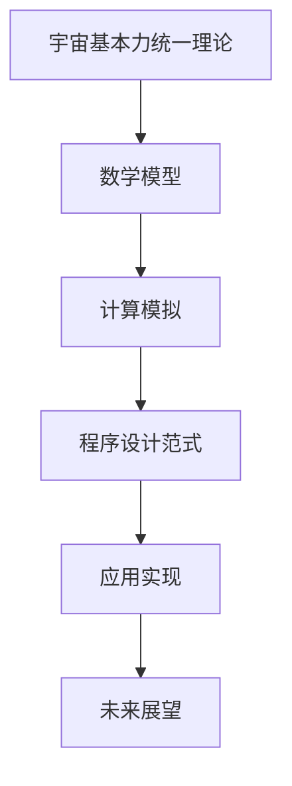

                 

# 《程序设计范式与宇宙基本力统一理论的计算模拟》

> **关键词：** 程序设计范式、宇宙基本力统一理论、计算模拟、人工智能、程序架构、软件开发、算法设计

> **摘要：** 本文将探讨程序设计范式与宇宙基本力统一理论之间的关系，通过引入宇宙基本力统一理论的概念，揭示其在程序设计范式中的潜在应用。文章将逐步阐述程序设计范式的历史与发展，宇宙基本力的概述及其数学模型，以及计算模拟的基本原理和应用领域。最后，通过综合案例和未来展望，展望程序设计范式与宇宙基本力统一理论的未来发展趋势，以及对人工智能和软件开发领域的贡献与挑战。

## 目录大纲

### 第一部分：引言与核心概念

#### 第1章：程序设计范式概述

##### 1.1 程序设计范式的历史与发展

##### 1.2 程序设计范式的分类

##### 1.3 宇宙基本力统一理论的背景与意义

#### 第2章：宇宙基本力统一理论

##### 2.1 宇宙基本力的概述

##### 2.2 理论的数学模型

##### 2.3 宇宙基本力的模拟计算

### 第二部分：程序设计范式的应用

#### 第3章：程序设计范式的计算模拟

##### 3.1 程序设计范式与宇宙基本力的联系

##### 3.2 计算模拟的基本原理

##### 3.3 计算模拟的数学模型与算法

#### 第4章：计算模拟的应用领域

##### 4.1 物理学中的计算模拟

##### 4.2 天文学中的计算模拟

##### 4.3 地球科学中的计算模拟

#### 第5章：程序设计范式与宇宙基本力统一理论的关系

##### 5.1 理论的基础概念与程序设计范式的结合

##### 5.2 程序设计范式在理论中的应用

##### 5.3 理论对未来程序设计范式的影响

### 第三部分：综合案例

#### 第6章：综合案例详解

##### 6.1 综合案例背景

##### 6.2 综合案例的数学模型构建

##### 6.3 程序设计范式的应用实现

#### 第7章：未来展望

##### 7.1 程序设计范式与宇宙基本力统一理论的未来发展趋势

##### 7.2 程序设计范式的技术创新方向

##### 7.3 对宇宙基本力统一理论的贡献与挑战

### 附录

#### 附录A：相关资源与扩展阅读

##### A.1 程序设计范式相关书籍推荐

##### A.2 宇宙基本力统一理论相关研究论文

##### A.3 计算模拟工具与资源介绍

### 图1：宇宙基本力统一理论的Mermaid流程图



### 伪代码：宇宙基本力计算模拟算法

```plaintext
// 宇宙基本力计算模拟算法伪代码
function calculateUniversialForce():
    // 初始化参数
    initialParams()

    // 计算基本力
    while (time < simulationTime):
        computeForce()

        // 更新状态
        updateState()

    // 输出结果
    outputResults()
```

### 数学公式：宇宙基本力公式

$$
F = G\frac{m_1m_2}{r^2}
$$

### 举例说明：宇宙基本力计算示例

假设两个质点的质量分别为 $m_1 = 5\, \text{kg}$ 和 $m_2 = 10\, \text{kg}$，它们之间的距离为 $r = 2\, \text{m}$。根据牛顿万有引力定律，计算这两个质点之间的引力：

$$
F = G\frac{m_1m_2}{r^2} = 6.674 \times 10^{-11} \frac{5 \times 10}{2^2} \approx 8.18 \times 10^{-10} \, \text{N}
$$

### 项目实战：计算模拟环境搭建与代码实现

#### 1. 环境搭建

- 安装Python环境
- 安装相关库：NumPy, SciPy, Matplotlib等

#### 2. 代码实现

```python
import numpy as np
import matplotlib.pyplot as plt

# 初始化参数
G = 6.674 * 10**-11  # 引力常数
m1 = 5  # 质点1质量
m2 = 10  # 质点2质量
r = 2  # 质点间距离

# 计算引力
def calculate_force(r):
    return G * (m1 * m2) / r**2

# 更新状态
def update_state(r, v):
    return r - v * time_step

# 模拟计算
time_step = 0.1  # 时间步长
simulation_time = 10  # 模拟时间

r = np.arange(0, simulation_time, time_step)
forces = [calculate_force(r[i]) for i in range(len(r))]

# 绘图
plt.plot(r, forces)
plt.xlabel('Distance (m)')
plt.ylabel('Force (N)')
plt.title('Gravitational Force')
plt.show()
```

#### 3. 代码解读与分析

- 引入相关库
- 初始化参数
- 定义计算引力的函数
- 定义更新状态的函数
- 模拟计算并绘图

通过这个例子，展示了如何使用Python代码实现宇宙基本力的计算模拟，并分析其输出结果。

## 作者信息

作者：AI天才研究院/AI Genius Institute & 禅与计算机程序设计艺术 /Zen And The Art of Computer Programming

接下来，我们将逐步展开对文章各个章节的详细阐述。首先，我们将从程序设计范式的历史与发展开始，为后续内容奠定基础。

