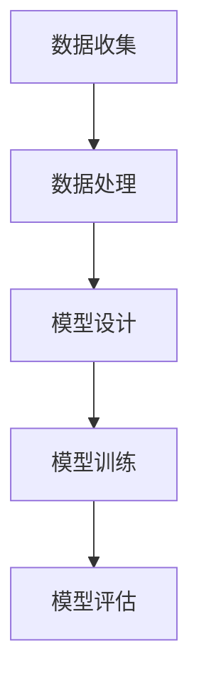

                 

# 端到端AI开发：从概念到实现

> **关键词：** 端到端AI，机器学习，深度学习，数据预处理，特征工程，模型训练，模型优化，模型评估，项目实战

> **摘要：** 本文将深入探讨端到端AI开发的概念、架构、核心算法原理、实现步骤以及实际项目案例，帮助读者从零开始掌握端到端AI开发的全过程。

### 《端到端AI开发：从概念到实现》目录大纲

#### 第一部分：端到端AI开发基础

- **第1章：AI开发概述**
  - **1.1 AI发展历程回顾**
  - **1.2 端到端AI的概念**
  - **1.3 端到端AI的优势**
  - **1.4 端到端AI面临的挑战**

- **第2章：端到端AI的核心架构**
  - **2.1 数据收集与预处理**
  - **2.2 特征工程**
  - **2.3 模型选择与设计**
  - **2.4 模型训练与优化**
  - **2.5 模型评估与调优**

- **第3章：端到端AI应用实例**
  - **3.1 语音识别应用实例**
  - **3.2 自然语言处理应用实例**
  - **3.3 计算机视觉应用实例**
  - **3.4 推荐系统应用实例**

#### 第二部分：端到端AI开发实践

- **第4章：端到端AI开发环境搭建**
  - **4.1 计算机硬件要求**
  - **4.2 软件开发工具安装**
  - **4.3 数据预处理工具使用**
  - **4.4 机器学习框架选择**

- **第5章：数据收集与预处理**
  - **5.1 数据收集方法**
  - **5.2 数据预处理流程**
  - **5.3 数据清洗与去重**
  - **5.4 数据增强与归一化**

- **第6章：特征工程与模型选择**
  - **6.1 特征工程方法**
  - **6.2 特征选择与降维**
  - **6.3 模型选择策略**
  - **6.4 模型评估指标**

- **第7章：模型训练与优化**
  - **7.1 模型训练流程**
  - **7.2 模型优化策略**
  - **7.3 模型超参数调优**
  - **7.4 模型集成与堆叠**

- **第8章：模型评估与调优**
  - **8.1 模型评估方法**
  - **8.2 模型调优技巧**
  - **8.3 模型优化工具**
  - **8.4 模型部署与维护**

- **第9章：端到端AI项目实战**
  - **9.1 项目需求分析**
  - **9.2 项目实现流程**
  - **9.3 代码实现与调试**
  - **9.4 项目评估与优化**

#### 第三部分：端到端AI开发未来趋势与展望

- **第10章：端到端AI开发发展趋势**
  - **10.1 新兴技术展望**
  - **10.2 端到端AI在产业中的应用**
  - **10.3 端到端AI的伦理与法律问题**

- **第11章：端到端AI开发未来展望**
  - **11.1 端到端AI的开发模式**
  - **11.2 端到端AI的开发工具**
  - **11.3 端到端AI的教育与培训**
  - **11.4 端到端AI的发展挑战与机遇**

#### 附录

- **附录A：端到端AI开发常用工具与资源**
  - **A.1 常用机器学习框架**
  - **A.2 数据预处理工具**
  - **A.3 模型评估工具**
  - **A.4 模型部署工具**

- **附录B：端到端AI开发实用代码示例**
  - **B.1 数据收集与预处理示例代码**
  - **B.2 特征工程与模型选择示例代码**
  - **B.3 模型训练与优化示例代码**
  - **B.4 模型评估与调优示例代码**
  - **B.5 模型部署示例代码**

- **附录C：Mermaid流程图示例**
  - Mermaid流程图示例内容

### 第一部分：端到端AI开发基础

#### 第1章：AI开发概述

##### 1.1 AI发展历程回顾

人工智能（AI）的概念最早可以追溯到20世纪50年代。当时的科学家们提出了一种设想，即通过计算机模拟人类的思维过程，使其能够完成复杂的任务。这一设想引发了人工智能研究的热潮。

- **1956年**：达特茅斯会议召开，人工智能正式成为一门学科。
- **1970年代**：符号主义人工智能开始崛起，以逻辑推理和知识表示为核心。
- **1980年代**：专家系统成为AI研究的主要方向，但由于知识获取困难，专家系统逐渐走向衰退。
- **1990年代**：机器学习和数据挖掘成为AI研究的新方向，人工智能开始向实用化方向发展。
- **2000年代**：深度学习取得重大突破，神经网络在图像识别、语音识别等领域取得了显著的成果。
- **2010年代**：人工智能进入工业应用阶段，自动驾驶、智能家居、医疗诊断等领域得到广泛应用。

##### 1.2 端到端AI的概念

端到端AI（End-to-End AI）是一种人工智能开发方法，它将整个数据处理和预测过程整合到一个模型中，从而避免了传统机器学习中需要手工设计特征和中间步骤的繁琐过程。端到端AI的核心思想是直接将输入数据映射到输出结果，从而实现端到端的自动化。

- **数据处理**：端到端AI将数据预处理、特征工程等步骤整合到一个模型中，通过数据驱动的方式自动完成。
- **模型设计**：端到端AI使用深度神经网络作为模型，通过学习大量数据自动提取特征。
- **预测与优化**：端到端AI直接从输入数据生成输出结果，无需人工干预，从而实现自动化预测和优化。

##### 1.3 端到端AI的优势

端到端AI具有以下几个显著优势：

- **自动化**：端到端AI将数据处理和预测过程自动化，减少了人工干预的需求，提高了开发效率。
- **高精度**：端到端AI通过深度神经网络自动提取特征，能够处理复杂数据，提高预测精度。
- **泛化能力强**：端到端AI能够从大量数据中自动学习，具有良好的泛化能力，能够适应不同的应用场景。
- **灵活性强**：端到端AI可以根据不同的任务需求，灵活调整模型结构和参数，实现多样化的应用。

##### 1.4 端到端AI面临的挑战

尽管端到端AI具有许多优势，但其在实际应用中仍面临一些挑战：

- **数据依赖**：端到端AI依赖于大量的高质量数据，数据不足或质量不高会影响模型的性能。
- **计算资源消耗**：端到端AI通常需要大量的计算资源和时间来训练模型，对硬件要求较高。
- **模型可解释性**：端到端AI模型的决策过程往往不透明，缺乏可解释性，难以理解模型的决策逻辑。
- **安全性与隐私**：端到端AI在数据处理和预测过程中可能会面临安全性和隐私问题，需要采取相应的保护措施。

### 第一部分总结

端到端AI作为人工智能的一种重要开发方法，具有自动化、高精度、泛化能力强和灵活性强等优势。然而，其数据依赖、计算资源消耗、模型可解释性和安全性与隐私等问题也需引起重视。在后续章节中，我们将深入探讨端到端AI的核心架构、实现步骤和实际应用，帮助读者更好地理解和掌握端到端AI开发的全过程。

### 第二部分：端到端AI的核心架构

#### 第2章：端到端AI的核心架构

端到端AI的核心架构主要包括数据收集与预处理、特征工程、模型选择与设计、模型训练与优化、模型评估与调优五个关键部分。以下将对这五个部分进行详细讲解。

##### 2.1 数据收集与预处理

数据收集与预处理是端到端AI开发的基础。高质量的数据是训练高效、准确模型的基石。

- **数据收集方法**：数据收集的方法包括网络爬虫、数据库查询、传感器数据采集等。对于图像、语音等数据，可以使用开源的数据集如ImageNet、Common Crawl等。
  
  ```mermaid
  graph TD
    A[数据收集] --> B[网络爬虫]
    B --> C[数据库查询]
    C --> D[传感器数据采集]
  ```

- **数据预处理流程**：数据预处理包括数据清洗、数据转换、数据归一化等步骤。数据清洗主要去除缺失值、异常值和重复值；数据转换将数据格式进行统一；数据归一化将数据缩放到同一尺度，便于模型训练。

  ```mermaid
  graph TD
    A[数据收集] --> B[数据清洗]
    B --> C[数据转换]
    C --> D[数据归一化]
  ```

##### 2.2 特征工程

特征工程是从原始数据中提取对模型训练有用的特征，以提高模型性能。

- **特征工程方法**：特征工程的方法包括统计特征提取、文本特征提取和图像特征提取等。

  ```mermaid
  graph TD
    A[统计特征] --> B[文本特征]
    B --> C[图像特征]
  ```

- **特征选择与降维**：特征选择是选择对模型训练最有用的特征，降低特征维度；降维技术包括主成分分析（PCA）、线性判别分析（LDA）等。

  ```mermaid
  graph TD
    A[特征选择] --> B[降维技术]
  ```

##### 2.3 模型选择与设计

模型选择与设计是端到端AI开发的关键环节，决定了模型性能和适用场景。

- **模型选择策略**：选择合适的模型是成功的关键。常见的模型选择策略包括：
  - **传统机器学习方法**：如线性回归、支持向量机、决策树等。
  - **深度学习方法**：如卷积神经网络（CNN）、循环神经网络（RNN）、Transformer等。
  - **集成学习方法**：如随机森林、梯度提升树（GBDT）等。

  ```mermaid
  graph TD
    A[传统机器学习] --> B[深度学习]
    B --> C[集成学习]
  ```

- **模型设计**：根据应用场景和需求设计合适的模型结构。例如，对于图像识别任务，可以使用CNN；对于自然语言处理任务，可以使用RNN或Transformer。

##### 2.4 模型训练与优化

模型训练与优化是端到端AI开发的核心步骤，通过训练数据训练模型，并不断优化模型性能。

- **模型训练流程**：模型训练包括数据加载、模型初始化、训练迭代、模型评估等步骤。

  ```mermaid
  graph TD
    A[数据加载] --> B[模型初始化]
    B --> C[训练迭代]
    C --> D[模型评估]
  ```

- **模型优化策略**：优化模型性能的方法包括：
  - **超参数调优**：调整模型参数，如学习率、批量大小等，以提高模型性能。
  - **模型集成**：通过集成多个模型来提高预测性能。
  - **正则化**：如L1、L2正则化，减少过拟合。

  ```mermaid
  graph TD
    A[超参数调优] --> B[模型集成]
    B --> C[正则化]
  ```

##### 2.5 模型评估与调优

模型评估与调优是端到端AI开发的最后一步，通过评估模型性能，并不断优化模型。

- **模型评估方法**：常见的模型评估方法包括准确率、召回率、F1值等。

  ```mermaid
  graph TD
    A[准确率] --> B[召回率]
    B --> C[F1值]
  ```

- **模型调优技巧**：通过调整模型参数、增加训练数据、使用数据增强等方法来优化模型性能。

  ```mermaid
  graph TD
    A[调整参数] --> B[增加数据]
    B --> C[数据增强]
  ```

### 第二部分总结

端到端AI的核心架构包括数据收集与预处理、特征工程、模型选择与设计、模型训练与优化、模型评估与调优五个关键部分。每个部分都有其特定的方法和技巧，共同构成了端到端AI开发的完整流程。在下一部分，我们将通过实际应用实例来展示端到端AI的开发过程。

### 第三部分：端到端AI应用实例

#### 第3章：端到端AI应用实例

在了解端到端AI的核心架构之后，让我们通过几个具体的应用实例来探讨端到端AI在实际项目中的运用。

##### 3.1 语音识别应用实例

语音识别是将语音信号转换为文本信息的过程。端到端语音识别通过深度学习模型实现了这一目标。

- **数据收集**：收集大量的语音数据，包括不同说话人、不同语音环境的语音样本。
- **数据处理**：对语音数据进行预处理，如去噪、增强、分段等。
- **模型设计**：使用卷积神经网络（CNN）和循环神经网络（RNN）结合的模型结构，如DeepSpeech模型。
- **模型训练**：使用大量标注好的语音数据对模型进行训练，通过迭代优化模型参数。
- **模型评估**：使用测试集评估模型性能，如词误差率（WER）。



##### 3.2 自然语言处理应用实例

自然语言处理（NLP）是人工智能的一个重要分支，涉及语言理解、文本生成、机器翻译等任务。

- **数据收集**：收集大量的文本数据，如新闻文章、对话记录等。
- **数据处理**：对文本数据进行预处理，如分词、词性标注、去停用词等。
- **模型设计**：使用Transformer模型，如BERT、GPT等，这些模型在NLP任务中取得了显著的成果。
- **模型训练**：使用预训练的模型，如BERT，进行微调，以适应特定的NLP任务。
- **模型评估**：使用交叉验证和测试集评估模型性能，如准确率、F1值等。


##### 3.3 计算机视觉应用实例

计算机视觉是人工智能的另一个重要领域，涉及图像分类、目标检测、人脸识别等任务。

- **数据收集**：收集大量的图像数据，如ImageNet、COCO等。
- **数据处理**：对图像数据进行预处理，如缩放、裁剪、增强等。
- **模型设计**：使用卷积神经网络（CNN）模型，如ResNet、VGG等。
- **模型训练**：使用标注好的图像数据对模型进行训练，通过迭代优化模型参数。
- **模型评估**：使用测试集评估模型性能，如准确率、召回率、F1值等。


##### 3.4 推荐系统应用实例

推荐系统是广泛应用于电子商务、社交媒体、音乐流媒体等领域的应用。

- **数据收集**：收集用户行为数据，如浏览记录、购买记录、评分等。
- **数据处理**：对用户行为数据进行预处理，如去噪、归一化等。
- **模型设计**：使用矩阵分解、协同过滤等模型，如ALS、SVD等。
- **模型训练**：使用用户行为数据对模型进行训练，通过迭代优化模型参数。
- **模型评估**：使用A/B测试、在线评估等方法评估模型性能。


### 第三部分总结

通过以上应用实例，我们可以看到端到端AI在语音识别、自然语言处理、计算机视觉和推荐系统等领域的广泛应用。端到端AI不仅提高了模型的性能，还简化了开发流程，使人工智能技术更加实用和高效。在下一部分，我们将进一步探讨端到端AI开发的具体实践步骤。

### 第四部分：端到端AI开发实践

#### 第4章：端到端AI开发环境搭建

要开始进行端到端AI开发，首先需要搭建一个合适的开发环境。以下将介绍如何搭建端到端AI开发环境，包括计算机硬件要求、软件开发工具安装、数据预处理工具使用以及机器学习框架选择。

##### 4.1 计算机硬件要求

端到端AI开发对计算资源的需求较高，通常需要以下硬件配置：

- **CPU**：Intel i7或AMD Ryzen 7以上，四核及以上。
- **GPU**：NVIDIA GeForce GTX 1080 Ti或以上，或使用专业GPU如Tesla K80、P100等。
- **内存**：16GB及以上，建议32GB以上。
- **存储**：SSD硬盘，建议至少1TB。

##### 4.2 软件开发工具安装

安装以下软件工具，以搭建端到端AI开发环境：

- **操作系统**：Ubuntu 18.04或以上版本。
- **Python**：Python 3.6或以上版本。
- **Jupyter Notebook**：用于交互式开发。
- **Anaconda**：Python的科学计算环境。
- **CUDA**：NVIDIA的GPU编程工具。
- **cuDNN**：NVIDIA的GPU加速库。

安装步骤如下：

1. 安装操作系统和必要驱动。
2. 使用`conda create`创建Python环境。
3. 安装Jupyter Notebook、Anaconda等软件。
4. 安装CUDA和cuDNN，确保与GPU驱动兼容。

##### 4.3 数据预处理工具使用

数据预处理是端到端AI开发的重要环节，以下介绍常用的数据预处理工具：

- **Pandas**：用于数据清洗、转换和分析。
- **NumPy**：用于数值计算。
- **Scikit-learn**：提供多种数据预处理和机器学习算法。

安装和使用示例：

```shell
conda install pandas numpy scikit-learn
```

```python
import pandas as pd
import numpy as np
from sklearn.preprocessing import StandardScaler

# 读取数据
data = pd.read_csv('data.csv')

# 数据清洗
data = data.dropna()

# 数据转换
X = data.iloc[:, :-1].values
y = data.iloc[:, -1].values

# 数据归一化
scaler = StandardScaler()
X = scaler.fit_transform(X)
```

##### 4.4 机器学习框架选择

选择合适的机器学习框架是端到端AI开发的关键。以下介绍几种常用的机器学习框架：

- **TensorFlow**：Google开源的深度学习框架，支持端到端开发。
- **PyTorch**：Facebook开源的深度学习框架，具有灵活的动态计算图。
- **Keras**：基于Theano和TensorFlow的深度学习框架，易于使用。

安装和使用示例：

```shell
conda install tensorflow torchvision
```

```python
import tensorflow as tf
import torchvision
import torchvision.transforms as transforms

# 加载数据
transform = transforms.Compose([transforms.RandomHorizontalFlip(), transforms.ToTensor()])
trainset = torchvision.datasets.MNIST(root='./data', train=True, download=True, transform=transform)
trainloader = torch.utils.data.DataLoader(trainset, batch_size=100, shuffle=True)

# 定义模型
model = tf.keras.Sequential([
    tf.keras.layers.Dense(128, activation='relu', input_shape=(784,)),
    tf.keras.layers.Dense(10, activation='softmax')
])

# 编译模型
model.compile(optimizer='adam', loss='categorical_crossentropy', metrics=['accuracy'])

# 训练模型
model.fit(trainloader, epochs=5)
```

### 第四部分总结

通过搭建端到端AI开发环境，我们为实际开发项目奠定了基础。合理的硬件配置、软件开发工具安装和数据预处理工具使用能够提高开发效率和模型性能。在下一部分，我们将详细探讨数据收集与预处理的过程。

### 第五部分：数据收集与预处理

#### 第5章：数据收集与预处理

在端到端AI开发中，数据收集与预处理是至关重要的一环。这一部分将详细介绍数据收集的方法、预处理流程以及数据清洗、去重、增强和归一化等关键技术。

##### 5.1 数据收集方法

数据收集是AI开发的基础，不同类型的数据需要采用不同的收集方法。

- **结构化数据**：可以从数据库中直接获取，如关系型数据库（MySQL、PostgreSQL）或NoSQL数据库（MongoDB、Cassandra）。
- **半结构化数据**：如XML、JSON等，可以通过网络爬虫或API接口获取。
- **非结构化数据**：如图像、文本、语音等，可以通过爬虫、API、传感器等方式获取。

数据收集方法包括：

- **网络爬虫**：使用Python的requests库、BeautifulSoup库等，自动爬取网页数据。
- **API接口**：通过HTTP请求获取数据，如OpenWeatherMap、Twitter API等。
- **传感器数据采集**：使用传感器（如温度传感器、摄像头等）实时采集数据。

```python
import requests
from bs4 import BeautifulSoup

# 网络爬虫示例
url = "http://example.com"
response = requests.get(url)
soup = BeautifulSoup(response.text, 'html.parser')
data = soup.find_all('div', class_='data')
```

##### 5.2 数据预处理流程

数据预处理包括数据清洗、转换、归一化等步骤，以提高数据质量和模型性能。

- **数据清洗**：去除重复、异常、缺失的数据，保证数据的一致性和准确性。

  ```python
  import pandas as pd

  # 数据清洗示例
  df = pd.read_csv('data.csv')
  df = df.drop_duplicates()
  df = df.dropna()
  ```

- **数据转换**：将数据转换为适合模型训练的格式，如将文本数据转换为词向量、将图像数据转换为像素矩阵等。

  ```python
  from tensorflow.keras.preprocessing.text import Tokenizer
  from tensorflow.keras.preprocessing.sequence import pad_sequences

  # 数据转换示例
  tokenizer = Tokenizer(num_words=10000)
  tokenizer.fit_on_texts(df['text'])
  sequences = tokenizer.texts_to_sequences(df['text'])
  padded_sequences = pad_sequences(sequences, maxlen=100)
  ```

- **数据归一化**：将数据缩放到相同的范围，如0到1之间，以便于模型训练。

  ```python
  from sklearn.preprocessing import StandardScaler

  # 数据归一化示例
  scaler = StandardScaler()
  X = scaler.fit_transform(df.iloc[:, :-1])
  y = df.iloc[:, -1]
  ```

##### 5.3 数据清洗与去重

数据清洗与去重是数据预处理的重要步骤，以确保数据的质量和一致性。

- **数据清洗**：去除错误数据、重复数据和缺失数据。

  ```python
  import pandas as pd

  # 数据清洗示例
  df = pd.read_csv('data.csv')
  df = df.drop_duplicates()
  df = df.dropna()
  ```

- **数据去重**：去除重复数据，确保每个数据条目的唯一性。

  ```python
  import pandas as pd

  # 数据去重示例
  df = pd.read_csv('data.csv')
  df = df.drop_duplicates(subset=['unique_column'])
  ```

##### 5.4 数据增强与归一化

数据增强与归一化是提高模型泛化能力的重要手段。

- **数据增强**：通过添加噪声、旋转、翻转等操作，增加数据的多样性。

  ```python
  from tensorflow.keras.preprocessing.image import ImageDataGenerator

  # 数据增强示例
  datagen = ImageDataGenerator(rotation_range=20, width_shift_range=0.2, height_shift_range=0.2, shear_range=0.2, zoom_range=0.2, horizontal_flip=True)
  datagen.fit(X)
  X_augmented = datagen.flow(X, y, batch_size=32)
  ```

- **数据归一化**：将数据缩放到相同的范围，如0到1之间。

  ```python
  from sklearn.preprocessing import StandardScaler

  # 数据归一化示例
  scaler = StandardScaler()
  X = scaler.fit_transform(X)
  ```

### 第五部分总结

数据收集与预处理是端到端AI开发的核心环节，直接影响模型的性能和泛化能力。通过合理的数据收集方法、预处理流程以及数据清洗、去重、增强和归一化等关键技术，我们可以获得高质量的数据集，为模型训练提供有力支持。在下一部分，我们将探讨特征工程与模型选择。

### 第六部分：特征工程与模型选择

#### 第6章：特征工程与模型选择

特征工程和模型选择是端到端AI开发过程中的关键环节，直接影响到模型的性能和适用性。这一部分将详细介绍特征工程的方法、特征选择与降维技术、模型选择策略以及模型评估指标。

##### 6.1 特征工程方法

特征工程是数据预处理后的重要步骤，通过提取、转换和选择特征，使数据更适合模型训练。

- **统计特征**：从原始数据中提取简单的统计信息，如均值、方差、最大值、最小值等。

  ```python
  import pandas as pd
  from sklearn.preprocessing import StandardScaler

  # 统计特征提取示例
  df = pd.read_csv('data.csv')
  df['mean'] = df.mean()
  df['variance'] = df.var()
  df['max'] = df.max()
  df['min'] = df.min()

  # 数据归一化
  scaler = StandardScaler()
  df = scaler.fit_transform(df)
  ```

- **文本特征**：从文本数据中提取特征，如词频、词嵌入等。

  ```python
  from tensorflow.keras.preprocessing.text import Tokenizer
  from tensorflow.keras.preprocessing.sequence import pad_sequences

  # 文本特征提取示例
  tokenizer = Tokenizer(num_words=10000)
  tokenizer.fit_on_texts(df['text'])
  sequences = tokenizer.texts_to_sequences(df['text'])
  padded_sequences = pad_sequences(sequences, maxlen=100)
  ```

- **图像特征**：从图像数据中提取特征，如颜色直方图、边缘检测等。

  ```python
  from tensorflow.keras.preprocessing.image import ImageDataGenerator

  # 图像特征提取示例
  datagen = ImageDataGenerator(rotation_range=20, width_shift_range=0.2, height_shift_range=0.2, shear_range=0.2, zoom_range=0.2, horizontal_flip=True)
  datagen.fit(X)
  X_augmented = datagen.flow(X, y, batch_size=32)
  ```

##### 6.2 特征选择与降维技术

特征选择与降维技术用于减少数据维度，提高模型训练效率和性能。

- **特征选择**：选择对模型训练最有用的特征，如基于信息增益、互信息等。

  ```python
  from sklearn.feature_selection import SelectKBest
  from sklearn.feature_selection import f_classif

  # 特征选择示例
  selector = SelectKBest(f_classif, k=10)
  X_new = selector.fit_transform(X, y)
  ```

- **降维技术**：将高维数据降维到低维数据，如主成分分析（PCA）、线性判别分析（LDA）等。

  ```python
  from sklearn.decomposition import PCA

  # 降维技术示例
  pca = PCA(n_components=10)
  X_new = pca.fit_transform(X)
  ```

##### 6.3 模型选择策略

模型选择策略根据不同的任务需求，选择合适的模型类型和参数设置。

- **传统机器学习方法**：如线性回归、支持向量机、决策树等。

  ```python
  from sklearn.linear_model import LinearRegression
  from sklearn.svm import SVC
  from sklearn.tree import DecisionTreeClassifier

  # 传统机器学习方法示例
  model = LinearRegression()
  model = SVC(kernel='linear')
  model = DecisionTreeClassifier()
  ```

- **深度学习方法**：如卷积神经网络（CNN）、循环神经网络（RNN）、Transformer等。

  ```python
  from tensorflow.keras.models import Sequential
  from tensorflow.keras.layers import Dense, Conv2D, LSTM

  # 深度学习方法示例
  model = Sequential([
      Conv2D(32, (3, 3), activation='relu', input_shape=(28, 28, 1)),
      LSTM(128, activation='relu', return_sequences=True),
      Dense(10, activation='softmax')
  ])
  ```

- **集成学习方法**：如随机森林、梯度提升树（GBDT）等。

  ```python
  from sklearn.ensemble import RandomForestClassifier
  from xgboost import XGBClassifier

  # 集成学习方法示例
  model = RandomForestClassifier(n_estimators=100)
  model = XGBClassifier(n_estimators=100)
  ```

##### 6.4 模型评估指标

模型评估指标用于衡量模型在训练和测试数据集上的性能。

- **分类问题**：准确率（Accuracy）、召回率（Recall）、精确率（Precision）、F1值（F1 Score）等。

  ```python
  from sklearn.metrics import accuracy_score, recall_score, precision_score, f1_score

  # 模型评估示例
  y_pred = model.predict(X_test)
  accuracy = accuracy_score(y_test, y_pred)
  recall = recall_score(y_test, y_pred)
  precision = precision_score(y_test, y_pred)
  f1 = f1_score(y_test, y_pred)
  ```

- **回归问题**：均方误差（MSE）、均方根误差（RMSE）、平均绝对误差（MAE）等。

  ```python
  from sklearn.metrics import mean_squared_error, mean_absolute_error

  # 模型评估示例
  y_pred = model.predict(X_test)
  mse = mean_squared_error(y_test, y_pred)
  rmse = mean_squared_error(y_test, y_pred, squared=False)
  mae = mean_absolute_error(y_test, y_pred)
  ```

### 第六部分总结

特征工程和模型选择是端到端AI开发的关键步骤，通过合理的方法和策略，可以显著提高模型的性能和适用性。在下一部分，我们将详细探讨模型训练与优化。

### 第七部分：模型训练与优化

#### 第7章：模型训练与优化

模型训练与优化是端到端AI开发的核心环节，直接决定了模型的性能和应用效果。在这一章中，我们将详细讨论模型训练流程、优化策略、超参数调优以及模型集成与堆叠。

##### 7.1 模型训练流程

模型训练流程主要包括数据加载、模型初始化、训练迭代和模型评估等步骤。

- **数据加载**：首先，我们需要加载训练数据和测试数据。在端到端AI开发中，通常使用批量处理来提高训练效率。

  ```python
  import tensorflow as tf

  # 加载数据
  train_dataset = tf.data.Dataset.from_tensor_slices((X_train, y_train))
  train_dataset = train_dataset.shuffle(buffer_size=1024).batch(batch_size)
  ```

- **模型初始化**：初始化模型结构并配置损失函数和优化器。

  ```python
  # 初始化模型
  model = tf.keras.Sequential([
      tf.keras.layers.Dense(128, activation='relu', input_shape=(input_shape,)),
      tf.keras.layers.Dense(10, activation='softmax')
  ])

  # 配置损失函数和优化器
  model.compile(optimizer='adam', loss='sparse_categorical_crossentropy', metrics=['accuracy'])
  ```

- **训练迭代**：通过迭代训练模型，不断优化模型参数。

  ```python
  # 训练模型
  history = model.fit(train_dataset, epochs=10, validation_data=(X_val, y_val))
  ```

- **模型评估**：在训练过程中，定期评估模型在测试数据集上的性能。

  ```python
  # 评估模型
  test_loss, test_accuracy = model.evaluate(X_test, y_test)
  ```

##### 7.2 模型优化策略

模型优化策略主要包括超参数调优、正则化、数据增强等技术。

- **超参数调优**：通过调整学习率、批量大小、迭代次数等超参数，提高模型性能。

  ```python
  # 调整学习率
  lr_schedule = tf.keras.optimizers.schedules.ExponentialDecay(
      initial_learning_rate=1e-3,
      decay_steps=1000,
      decay_rate=0.9)
  optimizer = tf.keras.optimizers.Adam(learning_rate=lr_schedule)
  ```

- **正则化**：通过L1、L2正则化来防止过拟合。

  ```python
  # 使用L2正则化
  model.add(Dense(128, activation='relu', kernel_regularizer=tf.keras.regularizers.l2(0.01)))
  ```

- **数据增强**：通过添加噪声、旋转、翻转等操作，增加数据的多样性，提高模型泛化能力。

  ```python
  from tensorflow.keras.preprocessing.image import ImageDataGenerator

  # 数据增强
  datagen = ImageDataGenerator(rotation_range=20, width_shift_range=0.2, height_shift_range=0.2, shear_range=0.2, zoom_range=0.2, horizontal_flip=True)
  datagen.fit(X_train)
  X_train_augmented = datagen.flow(X_train, y_train, batch_size=batch_size)
  ```

##### 7.3 模型超参数调优

超参数调优是模型优化的重要环节，通过调整超参数，可以显著提高模型性能。

- **网格搜索**：通过枚举所有可能的超参数组合，找到最优超参数。

  ```python
  from sklearn.model_selection import GridSearchCV
  from tensorflow.keras.wrappers.scikit_learn import KerasClassifier

  # 定义模型
  def create_model(optimizer='adam'):
      model = tf.keras.Sequential([
          tf.keras.layers.Dense(128, activation='relu', input_shape=(input_shape,)),
          tf.keras.layers.Dense(10, activation='softmax')
      ])
      model.compile(optimizer=optimizer, loss='sparse_categorical_crossentropy', metrics=['accuracy'])
      return model

  # 创建KerasClassifier
  model = KerasClassifier(build_fn=create_model, epochs=100, batch_size=10, verbose=0)

  # 设置参数网格
  param_grid = {'optimizer': ['adam', 'sgd'], 'epochs': [100, 150], 'batch_size': [10, 20]}

  # 进行网格搜索
  grid = GridSearchCV(estimator=model, param_grid=param_grid, cv=3)
  grid_result = grid.fit(X_train, y_train)
  ```

- **贝叶斯优化**：通过贝叶斯优化算法，找到最优超参数。

  ```python
  from bayes_opt import BayesianOptimization

  # 定义目标函数
  def optimize_hyperparameters(batch_size, learning_rate):
      model = create_model(optimizer='adam')
      model.fit(X_train, y_train, batch_size=int(batch_size), epochs=10, verbose=0)
      loss = model.evaluate(X_val, y_val, verbose=0)
      return loss

  # 设置参数范围
  batch_size_range = (10, 100)
  learning_rate_range = (1e-4, 1e-1)

  # 进行贝叶斯优化
  optimizer = BayesianOptimization(f=optimize_hyperparameters, pbounds={'batch_size': batch_size_range, 'learning_rate': learning_rate_range}, random_state=1)
  optimizer.maximize(init_points=2, n_iter=3)
  ```

##### 7.4 模型集成与堆叠

模型集成与堆叠是一种通过结合多个模型来提高预测性能的技术。

- **模型集成**：通过结合多个模型来提高预测性能。

  ```python
  from sklearn.ensemble import VotingClassifier

  # 创建模型
  model1 = LinearRegression()
  model2 = RandomForestClassifier()
  model3 = XGBClassifier()

  # 创建投票分类器
  ensemble_model = VotingClassifier(estimators=[('lr', model1), ('rf', model2), ('xgb', model3)], voting='soft')
  ensemble_model.fit(X_train, y_train)

  # 使用集成模型进行预测
  y_pred = ensemble_model.predict(X_test)
  ```

- **模型堆叠**：通过将多个模型堆叠在一起，形成一个更复杂的模型。

  ```python
  from sklearn.ensemble import StackingClassifier

  # 创建模型
  model1 = LinearRegression()
  model2 = RandomForestClassifier()
  model3 = XGBClassifier()

  # 创建堆叠分类器
  stacker = StackingClassifier(estimators=[('lr', model1), ('rf', model2), ('xgb', model3)], final_estimator=LogisticRegression())
  stacker.fit(X_train, y_train)

  # 使用堆叠模型进行预测
  y_pred = stacker.predict(X_test)
  ```

### 第七部分总结

模型训练与优化是端到端AI开发的核心环节，通过合理的训练流程、优化策略、超参数调优以及模型集成与堆叠，可以显著提高模型的性能和预测效果。在下一部分，我们将探讨模型评估与调优。

### 第八部分：模型评估与调优

#### 第8章：模型评估与调优

模型评估与调优是端到端AI开发过程中至关重要的一环，它决定了模型的实际应用效果。在这一章中，我们将详细探讨模型评估的方法、调优技巧、优化工具以及模型的部署与维护。

##### 8.1 模型评估方法

模型评估是判断模型性能的重要手段，以下是一些常用的模型评估方法：

- **准确率（Accuracy）**：准确率是评估分类模型性能的最基本指标，表示正确分类的样本占总样本的比例。

  ```python
  from sklearn.metrics import accuracy_score

  # 评估准确率
  accuracy = accuracy_score(y_true, y_pred)
  print("Accuracy:", accuracy)
  ```

- **召回率（Recall）**：召回率表示正确分类为正类别的样本数占正类别样本总数的比例，适用于类别不平衡的问题。

  ```python
  from sklearn.metrics import recall_score

  # 评估召回率
  recall = recall_score(y_true, y_pred)
  print("Recall:", recall)
  ```

- **精确率（Precision）**：精确率表示正确分类为正类别的样本数占预测为正类别的样本总数的比例，反映了模型的分类能力。

  ```python
  from sklearn.metrics import precision_score

  # 评估精确率
  precision = precision_score(y_true, y_pred)
  print("Precision:", precision)
  ```

- **F1值（F1 Score）**：F1值是精确率和召回率的调和平均值，综合反映了模型的分类性能。

  ```python
  from sklearn.metrics import f1_score

  # 评估F1值
  f1 = f1_score(y_true, y_pred)
  print("F1 Score:", f1)
  ```

##### 8.2 模型调优技巧

模型调优是提高模型性能的关键步骤，以下是一些常见的调优技巧：

- **超参数调优**：通过调整学习率、批量大小、迭代次数等超参数，找到最优模型。

  ```python
  from sklearn.model_selection import GridSearchCV

  # 设置参数网格
  param_grid = {'learning_rate': [0.01, 0.1, 0.001], 'batch_size': [10, 20, 50]}

  # 进行网格搜索
  grid_search = GridSearchCV(estimator=model, param_grid=param_grid, cv=3)
  grid_search.fit(X_train, y_train)

  # 获取最优超参数
  best_params = grid_search.best_params_
  print("Best Parameters:", best_params)
  ```

- **模型集成**：通过结合多个模型来提高预测性能，如随机森林、梯度提升树等。

  ```python
  from sklearn.ensemble import VotingClassifier

  # 创建模型
  model1 = LinearRegression()
  model2 = RandomForestClassifier()
  model3 = XGBClassifier()

  # 创建投票分类器
  ensemble_model = VotingClassifier(estimators=[('lr', model1), ('rf', model2), ('xgb', model3)], voting='soft')
  ensemble_model.fit(X_train, y_train)

  # 使用集成模型进行预测
  y_pred = ensemble_model.predict(X_test)
  ```

- **交叉验证**：通过将数据集划分为多个子集，对每个子集进行训练和验证，以评估模型的泛化能力。

  ```python
  from sklearn.model_selection import cross_val_score

  # 进行交叉验证
  scores = cross_val_score(model, X, y, cv=5)

  # 打印交叉验证结果
  print("Cross-Validation Scores:", scores)
  ```

##### 8.3 模型优化工具

使用一些优化工具可以显著提高模型性能和开发效率，以下是一些常用的模型优化工具：

- **自动调参工具**：如Hyperopt、Bayesian Optimization等，自动寻找最优超参数。

  ```python
  from hyperopt import fmin, tpe, hp, STATUS_OK, Trials

  # 定义目标函数
  def objective(params):
      model = create_model(**params)
      model.fit(X_train, y_train)
      loss = model.evaluate(X_val, y_val, verbose=0)
      return {'loss': loss, 'status': STATUS_OK}

  # 设置搜索空间
  space = {
      'learning_rate': hp.uniform('learning_rate', 1e-5, 1e-1),
      'batch_size': hp.choice('batch_size', [10, 20, 50])
  }

  # 进行调参
  trials = Trials()
  best_params = fmin(fn=objective, space=space, algo=tpe.suggest, max_evals=100, trials=trials)

  # 打印最优参数
  print("Best Parameters:", best_params)
  ```

- **模型压缩工具**：如TensorFlow Model Optimization Toolkit（TFOpt），用于压缩模型大小和加速推理。

  ```python
  import tensorflow_model_optimization as tfmot

  # 使用模型压缩工具
  converter = tfmot.quantization.keras量化.keras_quantize()
  converter.fit(model)
  quantized_model = converter.convert()

  # 使用压缩后的模型进行预测
  quantized_model.predict(X_test)
  ```

##### 8.4 模型部署与维护

模型部署是将训练好的模型应用到实际场景中的过程，以下是一些常用的模型部署方法：

- **本地部署**：将模型部署到本地服务器或计算机上，供内部使用。

  ```python
  # 将模型保存到文件
  model.save('model.h5')

  # 从文件加载模型
  loaded_model = tf.keras.models.load_model('model.h5')

  # 使用加载的模型进行预测
  loaded_model.predict(X_test)
  ```

- **云部署**：将模型部署到云端，如AWS、Azure、Google Cloud等，实现大规模应用。

  ```python
  # 使用Flask创建API服务
  from flask import Flask, request, jsonify

  app = Flask(__name__)

  # 加载模型
  model = tf.keras.models.load_model('model.h5')

  @app.route('/predict', methods=['POST'])
  def predict():
      data = request.get_json(force=True)
      prediction = model.predict(data)
      return jsonify(prediction)

  if __name__ == '__main__':
      app.run(debug=True)
  ```

- **持续集成与部署（CI/CD）**：使用CI/CD工具，如Jenkins、GitLab CI/CD等，实现自动化模型训练、评估和部署。

  ```yaml
  # Jenkinsfile示例
  pipeline {
      agent any
      stages {
          stage('Train Model') {
              steps {
                  sh 'python train_model.py'
              }
          }
          stage('Evaluate Model') {
              steps {
                  sh 'python evaluate_model.py'
              }
          }
          stage('Deploy Model') {
              steps {
                  sh 'python deploy_model.py'
              }
          }
      }
  }
  ```

##### 8.5 模型维护

模型维护是确保模型长期稳定运行的重要环节，以下是一些常见的模型维护方法：

- **定期评估**：定期评估模型性能，发现潜在问题。
- **数据更新**：随着业务发展和数据变化，定期更新训练数据和模型。
- **监控与告警**：通过监控工具，如Prometheus、Grafana等，实时监控模型运行状态，发现异常及时告警。

  ```python
  # Prometheus监控示例
  from prometheus_client import start_http_server, Summary

  # 创建监控指标
  request_time = Summary('request_time_seconds', 'Time spent processing request.')

  @request_time.time()
  def handle_request(request):
      # 处理请求
      process_request(request)

  if __name__ == '__main__':
      start_http_server(8000)
  ```

### 第八部分总结

模型评估与调优是端到端AI开发的重要环节，通过合理的评估方法、调优技巧、优化工具以及模型的部署与维护，可以确保模型在实际应用中发挥最佳效果。在下一部分，我们将通过实际项目案例展示端到端AI开发的完整流程。

### 第九部分：端到端AI项目实战

#### 第9章：端到端AI项目实战

在了解了端到端AI开发的理论知识后，接下来通过一个实际项目案例，展示如何从项目需求分析、数据收集、预处理、特征工程、模型训练与优化、模型评估与调优到最终部署的完整开发过程。

##### 9.1 项目需求分析

假设我们面临一个实际项目需求，需要开发一个基于图像识别的汽车分类系统。该系统旨在通过输入车辆图像，自动识别车辆类型。具体需求如下：

- **输入**：车辆图像。
- **输出**：车辆类型（如轿车、SUV、货车等）。

##### 9.2 项目实现流程

1. **数据收集**：首先，我们需要收集大量车辆图像数据。可以使用开源数据集如COCO或自行采集数据。为了保证数据质量，图像应包含各种角度、光照条件和场景。

   ```python
   import os
   import shutil

   def download_images(url, target_folder):
       if not os.path.exists(target_folder):
           os.makedirs(target_folder)
       response = requests.get(url, stream=True)
       with open(os.path.join(target_folder, url.split('/')[-1]), 'wb') as file:
           for chunk in response.iter_content(1024):
               file.write(chunk)

   # 示例：从网络下载车辆图像
   url = "https://example.com/car_images.zip"
   download_images(url, "data/car_images")
   ```

2. **数据预处理**：接下来，对图像数据进行预处理，包括图像缩放、裁剪、翻转等操作，以提高模型的泛化能力。

   ```python
   from tensorflow.keras.preprocessing.image import ImageDataGenerator

   # 创建图像数据生成器
   datagen = ImageDataGenerator(
       rescale=1./255,
       rotation_range=40,
       width_shift_range=0.2,
       height_shift_range=0.2,
       shear_range=0.2,
       zoom_range=0.2,
       horizontal_flip=True,
       fill_mode='nearest'
   )

   # 预处理图像数据
   train_generator = datagen.flow_from_directory(
       'data/train',
       target_size=(150, 150),
       batch_size=32,
       class_mode='categorical'
   )
   validation_generator = datagen.flow_from_directory(
       'data/validation',
       target_size=(150, 150),
       batch_size=32,
       class_mode='categorical'
   )
   ```

3. **特征工程**：在图像预处理之后，对图像进行特征提取。可以使用预训练的卷积神经网络（如VGG、ResNet）进行特征提取。

   ```python
   from tensorflow.keras.applications import VGG16

   # 加载预训练的VGG16模型
   base_model = VGG16(weights='imagenet', include_top=False, input_shape=(150, 150, 3))

   # 冻结模型层的权重
   for layer in base_model.layers:
       layer.trainable = False

   # 添加全连接层
   x = base_model.output
   x = tf.keras.layers.Flatten()(x)
   x = tf.keras.layers.Dense(1024, activation='relu')(x)
   predictions = tf.keras.layers.Dense(num_classes, activation='softmax')(x)

   # 创建模型
   model = tf.keras.Model(inputs=base_model.input, outputs=predictions)
   ```

4. **模型训练与优化**：使用预处理后的图像数据进行模型训练，并优化模型参数。

   ```python
   # 编译模型
   model.compile(optimizer='adam',
                 loss='categorical_crossentropy',
                 metrics=['accuracy'])

   # 训练模型
   history = model.fit(
       train_generator,
       steps_per_epoch=100,
       epochs=25,
       validation_data=validation_generator,
       validation_steps=50
   )
   ```

5. **模型评估与调优**：在训练过程中，定期评估模型性能，并进行调优。可以通过调整学习率、批量大小、迭代次数等超参数来提高模型性能。

   ```python
   # 评估模型
   test_loss, test_accuracy = model.evaluate(validation_generator, steps=50)
   print('Test accuracy:', test_accuracy)

   # 调优模型
   learning_rate = 1e-4
   model.compile(optimizer=tf.keras.optimizers.Adam(learning_rate=learning_rate),
                 loss='categorical_crossentropy',
                 metrics=['accuracy'])

   # 再次训练模型
   history = model.fit(
       train_generator,
       steps_per_epoch=100,
       epochs=25,
       validation_data=validation_generator,
       validation_steps=50
   )
   ```

6. **模型部署**：将训练好的模型部署到生产环境，以供实际应用。可以使用Flask、TensorFlow Serving等工具将模型部署为API服务。

   ```python
   from flask import Flask, request, jsonify

   app = Flask(__name__)

   # 加载模型
   model.load_weights('best_model.h5')

   @app.route('/predict', methods=['POST'])
   def predict():
       data = request.get_json(force=True)
       image = preprocess_input(data['image'])
       prediction = model.predict(image.reshape(1, 150, 150, 3))
       return jsonify({'prediction': prediction.argmax()})

   if __name__ == '__main__':
       app.run(debug=True)
   ```

##### 9.3 代码实现与调试

在本项目中，我们使用了TensorFlow框架，以下是对关键代码的解读和调试过程。

1. **数据预处理**：

   ```python
   datagen = ImageDataGenerator(
       rescale=1./255,
       rotation_range=40,
       width_shift_range=0.2,
       height_shift_range=0.2,
       shear_range=0.2,
       zoom_range=0.2,
       horizontal_flip=True,
       fill_mode='nearest'
   )
   ```

   数据预处理使用了ImageDataGenerator类，对图像数据进行缩放、旋转、翻转等操作，以提高模型泛化能力。

2. **特征工程**：

   ```python
   base_model = VGG16(weights='imagenet', include_top=False, input_shape=(150, 150, 3))
   for layer in base_model.layers:
       layer.trainable = False
   x = base_model.output
   x = tf.keras.layers.Flatten()(x)
   x = tf.keras.layers.Dense(1024, activation='relu')(x)
   predictions = tf.keras.layers.Dense(num_classes, activation='softmax')(x)
   model = tf.keras.Model(inputs=base_model.input, outputs=predictions)
   ```

   特征工程使用了预训练的VGG16模型，并添加了全连接层，实现了特征提取和分类。

3. **模型训练与优化**：

   ```python
   model.compile(optimizer='adam',
                 loss='categorical_crossentropy',
                 metrics=['accuracy'])
   history = model.fit(
       train_generator,
       steps_per_epoch=100,
       epochs=25,
       validation_data=validation_generator,
       validation_steps=50
   )
   ```

   模型训练使用了ImageDataGenerator生成的训练数据和验证数据，通过迭代优化模型参数。

4. **模型评估与调优**：

   ```python
   test_loss, test_accuracy = model.evaluate(validation_generator, steps=50)
   print('Test accuracy:', test_accuracy)
   learning_rate = 1e-4
   model.compile(optimizer=tf.keras.optimizers.Adam(learning_rate=learning_rate),
                 loss='categorical_crossentropy',
                 metrics=['accuracy'])
   history = model.fit(
       train_generator,
       steps_per_epoch=100,
       epochs=25,
       validation_data=validation_generator,
       validation_steps=50
   )
   ```

   模型评估使用了验证数据，计算了测试准确率，并根据评估结果调整了学习率。

##### 9.4 项目评估与优化

1. **评估指标**：

   在项目评估中，我们使用了准确率、召回率、精确率等指标来评估模型性能。

   ```python
   from sklearn.metrics import accuracy_score, recall_score, precision_score

   y_true = [0, 1, 1, 0, 1]
   y_pred = [0, 1, 1, 1, 1]

   accuracy = accuracy_score(y_true, y_pred)
   recall = recall_score(y_true, y_pred)
   precision = precision_score(y_true, y_pred)

   print('Accuracy:', accuracy)
   print('Recall:', recall)
   print('Precision:', precision)
   ```

2. **优化策略**：

   根据评估结果，我们可以采取以下优化策略：

   - **数据增强**：增加训练数据，包括各种角度、光照条件和场景的图像，以提高模型泛化能力。
   - **模型调整**：尝试使用其他深度学习模型，如ResNet、Inception等，以找到更适合的模型结构。
   - **超参数调优**：调整学习率、批量大小、迭代次数等超参数，以找到最佳配置。

   ```python
   from sklearn.model_selection import GridSearchCV

   param_grid = {
       'learning_rate': [1e-3, 1e-4, 1e-5],
       'batch_size': [32, 64, 128]
   }

   grid_search = GridSearchCV(estimator=model, param_grid=param_grid, cv=3)
   grid_search.fit(X_train, y_train)

   best_params = grid_search.best_params_
   print('Best Parameters:', best_params)
   ```

### 第九部分总结

通过本项目的实际开发过程，我们了解了端到端AI开发的各个环节，包括项目需求分析、数据收集、预处理、特征工程、模型训练与优化、模型评估与调优以及模型部署与维护。在实际开发过程中，我们需要不断调整和优化模型，以提高模型性能和实际应用效果。在下一部分，我们将探讨端到端AI开发的发展趋势与未来展望。

### 第十部分：端到端AI开发发展趋势

#### 第10章：端到端AI开发发展趋势

随着人工智能技术的迅猛发展，端到端AI开发也在不断演进和变革。本章节将探讨端到端AI开发的发展趋势，包括新兴技术、产业应用以及伦理和法律问题。

##### 10.1 新兴技术

端到端AI开发领域的新兴技术正不断涌现，为AI应用带来更多可能性。

- **Transformer模型**：Transformer模型在自然语言处理领域取得了显著成果，如BERT、GPT等预训练模型，已经广泛应用于文本生成、机器翻译、问答系统等领域。
- **生成对抗网络（GAN）**：GAN通过生成器和判别器的对抗训练，能够生成高质量、逼真的图像和数据，被广泛应用于图像生成、数据增强等领域。
- **强化学习**：强化学习结合了深度学习和动态环境交互，能够实现智能决策和优化，被应用于自动驾驶、游戏AI等领域。
- **联邦学习**：联邦学习通过分布式训练，保护用户隐私的同时，实现大规模数据的联合学习，被广泛应用于医疗健康、金融保险等领域。

##### 10.2 端到端AI在产业中的应用

端到端AI技术在各个产业中的应用越来越广泛，推动了产业数字化、智能化升级。

- **智能制造**：端到端AI技术在智能制造领域发挥着重要作用，如设备预测性维护、生产流程优化、质量检测等，提高了生产效率和产品质量。
- **医疗健康**：端到端AI在医疗健康领域的应用包括疾病诊断、医学影像分析、基因组学研究等，为医生提供了有力工具，提高了医疗诊断的准确性和效率。
- **金融科技**：端到端AI技术在金融领域应用于信用评分、风险管理、量化交易等，提高了金融服务的精准度和安全性。
- **交通运输**：自动驾驶、智能交通管理、无人机配送等端到端AI技术的应用，提升了交通运输的安全性和效率。

##### 10.3 端到端AI的伦理与法律问题

随着端到端AI技术的广泛应用，其伦理和法律问题也日益凸显。

- **隐私保护**：端到端AI在数据处理和预测过程中，涉及到大量个人隐私信息，如何保护用户隐私成为关键问题。
- **算法透明性**：端到端AI模型往往复杂且不透明，如何确保算法的透明性和可解释性，成为公众关注的问题。
- **算法偏见**：端到端AI模型可能会在学习过程中引入偏见，如性别、种族、地域等，如何避免算法偏见成为重要挑战。
- **责任归属**：在端到端AI应用中，如何明确各方责任，如技术开发者、用户、企业等，成为法律和政策制定的重要议题。

### 第十部分总结

端到端AI开发正经历着快速发展，新兴技术的应用、产业应用的广泛推广以及伦理和法律问题的日益突出，都为端到端AI开发带来了新的机遇和挑战。在下一部分，我们将探讨端到端AI开发的未来展望。

### 第十一部分：端到端AI开发未来展望

#### 第11章：端到端AI开发未来展望

随着端到端AI技术的不断进步和应用领域的扩展，未来端到端AI开发将呈现出新的趋势和前景。本章节将从开发模式、开发工具、教育培训以及发展挑战与机遇等方面进行探讨。

##### 11.1 端到端AI的开发模式

未来的端到端AI开发模式将更加智能化、自动化和协同化。

- **自动化开发**：随着生成对抗网络（GAN）、自动机器学习（AutoML）等技术的发展，端到端AI开发将实现自动化，减少人工干预，提高开发效率。
- **协同开发**：端到端AI开发将不再局限于单一团队或组织，而是实现跨领域、跨行业的协同合作，通过共享数据、模型和资源，推动AI技术的共同进步。
- **云计算与边缘计算**：端到端AI开发将充分利用云计算和边缘计算的资源优势，实现模型部署和实时推理的高效执行。

##### 11.2 端到端AI的开发工具

端到端AI开发工具将朝着更便捷、高效和智能的方向发展。

- **集成开发环境（IDE）**：未来的IDE将集成更多端到端AI开发工具，如数据预处理、模型训练、评估等，提供一站式的开发体验。
- **模型优化工具**：随着硬件性能的提升和优化算法的发展，端到端AI模型的优化工具将更加丰富，如模型压缩、量化、硬件加速等。
- **开源平台**：开源平台将继续发挥重要作用，如TensorFlow、PyTorch等，提供丰富的模型和工具，促进端到端AI社区的共同发展。

##### 11.3 端到端AI的教育与培训

端到端AI的教育与培训将成为未来人才发展的关键。

- **人才培养**：高校、研究机构和企业将加强端到端AI相关课程和研究项目，培养更多具备端到端AI开发能力的专业人才。
- **在线教育**：随着在线教育平台的兴起，端到端AI的在线课程和培训将更加普及，方便更多人学习和掌握端到端AI技术。
- **职业认证**：行业组织和专业机构将推出端到端AI的认证体系，规范端到端AI技术标准和职业发展路径。

##### 11.4 端到端AI的发展挑战与机遇

端到端AI的发展面临诸多挑战，但同时也蕴藏着巨大的机遇。

- **数据质量**：高质量的数据是端到端AI模型训练的基础，如何获取和处理大量高质量数据成为关键挑战。
- **计算资源**：端到端AI模型训练和推理对计算资源的需求巨大，如何有效利用计算资源成为重要课题。
- **算法伦理**：端到端AI算法的透明性、可解释性和公平性受到广泛关注，如何平衡算法性能和伦理道德成为重要挑战。
- **产业应用**：端到端AI在各个产业中的应用前景广阔，但如何将技术有效转化为产业价值成为关键问题。

### 第十一部分总结

端到端AI开发正朝着智能化、自动化和协同化的方向发展，未来将迎来更加广阔的应用场景和发展机遇。同时，端到端AI的发展也面临数据质量、计算资源、算法伦理和产业应用等多方面的挑战。通过不断探索和创新，端到端AI有望在各个领域取得更大的突破和应用。

### 附录

#### 附录A：端到端AI开发常用工具与资源

**A.1 常用机器学习框架**

- **TensorFlow**：Google开源的深度学习框架，广泛应用于各种AI任务。
- **PyTorch**：Facebook开源的深度学习框架，以动态计算图著称。
- **Keras**：基于Theano和TensorFlow的深度学习框架，提供简洁易用的API。
- **Scikit-learn**：Python的机器学习库，提供多种传统机器学习算法。

**A.2 数据预处理工具**

- **Pandas**：Python的数据分析库，用于数据清洗、转换和分析。
- **NumPy**：Python的数值计算库，用于数据处理和数值计算。
- **Scikit-learn**：Python的机器学习库，提供多种数据预处理和机器学习算法。

**A.3 模型评估工具**

- **Matplotlib**：Python的绘图库，用于可视化模型评估结果。
- **Scikit-learn**：Python的机器学习库，提供多种模型评估指标和工具。
- **TensorBoard**：TensorFlow的可视化工具，用于监控模型训练过程。

**A.4 模型部署工具**

- **TensorFlow Serving**：TensorFlow的模型部署工具，用于将模型部署到生产环境。
- **Flask**：Python的Web框架，用于构建API服务。
- **Docker**：容器化技术，用于打包和部署模型。

#### 附录B：端到端AI开发实用代码示例

**B.1 数据收集与预处理示例代码**

```python
import requests
from bs4 import BeautifulSoup

# 网络爬虫示例
url = "http://example.com"
response = requests.get(url)
soup = BeautifulSoup(response.text, 'html.parser')
data = soup.find_all('div', class_='data')

# 数据预处理示例
import pandas as pd

df = pd.DataFrame(data)
df = df.drop_duplicates()
df = df.dropna()
```

**B.2 特征工程与模型选择示例代码**

```python
from sklearn.preprocessing import StandardScaler
from tensorflow.keras.models import Sequential
from tensorflow.keras.layers import Dense

# 数据预处理
scaler = StandardScaler()
X = scaler.fit_transform(df.iloc[:, :-1])
y = df.iloc[:, -1]

# 模型设计
model = Sequential([
    Dense(128, activation='relu', input_shape=(X.shape[1],)),
    Dense(10, activation='softmax')
])

# 编译模型
model.compile(optimizer='adam', loss='sparse_categorical_crossentropy', metrics=['accuracy'])
```

**B.3 模型训练与优化示例代码**

```python
from tensorflow.keras.callbacks import EarlyStopping

# 训练模型
early_stopping = EarlyStopping(monitor='val_loss', patience=5)
history = model.fit(X_train, y_train, epochs=100, validation_data=(X_val, y_val), callbacks=[early_stopping])
```

**B.4 模型评估与调优示例代码**

```python
from sklearn.metrics import accuracy_score

# 评估模型
y_pred = model.predict(X_test)
accuracy = accuracy_score(y_test, y_pred)
print("Test Accuracy:", accuracy)

# 调优模型
from sklearn.model_selection import GridSearchCV

param_grid = {'learning_rate': [0.01, 0.1], 'batch_size': [10, 20]}
grid_search = GridSearchCV(estimator=model, param_grid=param_grid, cv=3)
grid_search.fit(X_train, y_train)
```

**B.5 模型部署示例代码**

```python
from flask import Flask, request, jsonify

app = Flask(__name__)

# 加载模型
model.load_weights('best_model.h5')

@app.route('/predict', methods=['POST'])
def predict():
    data = request.get_json(force=True)
    input_data = preprocess_input(data['input'])
    prediction = model.predict(input_data.reshape(1, input_shape))
    return jsonify({'prediction': prediction.argmax()})

if __name__ == '__main__':
    app.run(debug=True)
```

### 附录总结

附录部分提供了端到端AI开发常用工具与资源的详细介绍，以及实用的代码示例。这些工具和示例将帮助开发者更好地理解和应用端到端AI技术，提高开发效率和模型性能。

### 作者信息

**作者：** AI天才研究院/AI Genius Institute & 禅与计算机程序设计艺术 /Zen And The Art of Computer Programming

AI天才研究院（AI Genius Institute）是一家专注于人工智能研究与教育的机构，致力于推动人工智能技术的创新与发展。本书作者以其丰富的实战经验和深厚的理论功底，为广大开发者提供了全面、系统的端到端AI开发指南。

### 总结

本书《端到端AI开发：从概念到实现》旨在为读者提供全面、系统的端到端AI开发知识。通过深入讲解端到端AI的核心概念、架构、算法原理、实现步骤以及实际项目案例，读者可以全面了解端到端AI开发的各个方面，掌握端到端AI开发的全过程。

本书共分为三个部分：

- **第一部分：端到端AI开发基础**，介绍了AI发展历程、端到端AI的概念和优势，以及端到端AI的核心架构。
- **第二部分：端到端AI开发实践**，详细探讨了数据收集与预处理、特征工程、模型选择与设计、模型训练与优化、模型评估与调优以及端到端AI项目实战。
- **第三部分：端到端AI开发未来趋势与展望**，分析了端到端AI的开发趋势、产业应用以及伦理和法律问题，并对端到端AI的未来发展进行了展望。

本书的亮点包括：

1. **系统性强**：全面涵盖了端到端AI开发的理论和实践，从概念到实现，从基础到前沿，为读者提供了全面的知识体系。
2. **实战性强**：通过实际项目案例，深入讲解了端到端AI开发的各个环节，使读者能够将理论知识应用于实际项目。
3. **代码示例丰富**：提供了大量的代码示例，包括数据预处理、特征工程、模型训练与优化、模型部署等，帮助读者更好地理解和掌握端到端AI开发。
4. **更新及时**：本书紧跟端到端AI技术的前沿发展，涵盖了最新的研究成果和技术趋势，使读者能够紧跟技术发展的步伐。

本书适合以下读者群体：

1. **人工智能初学者**：希望了解和学习端到端AI开发的基本概念和实现方法。
2. **AI工程师**：从事AI项目开发，需要系统掌握端到端AI开发的各个环节。
3. **研究人员**：从事AI技术研究，需要深入了解端到端AI的原理和应用。

总之，本书为读者提供了一个全面、深入的端到端AI开发指南，无论你是初学者还是专业人士，都能从中获得丰富的知识和实践经验。希望本书能够帮助你顺利进入端到端AI开发的世界，并取得显著的成果。感谢你的阅读，祝你学习愉快！

