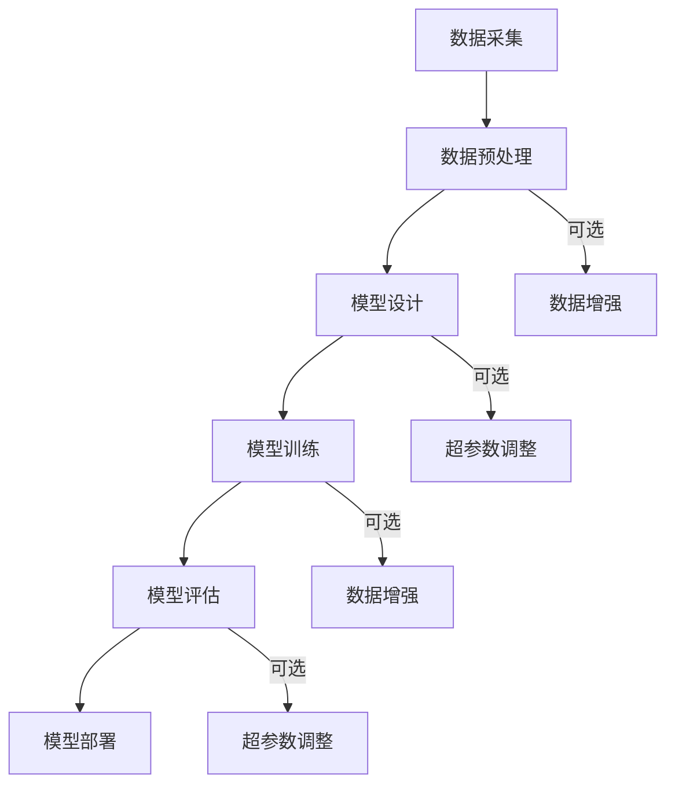

                 

### 《端到端AI开发：从概念到实现》

#### 关键词：端到端AI，深度学习，神经网络，模型训练，项目实战

> 摘要：本文将深入探讨端到端AI开发的概念、核心算法、框架工具及项目实战。从基础概念出发，逐步解析端到端AI的工作原理，讲解神经网络、CNN、RNN及注意力机制等关键算法，并详细介绍TensorFlow和PyTorch等主流AI框架。通过实际项目案例，展示端到端AI开发的完整流程，帮助读者全面掌握端到端AI的开发技巧。

### 《端到端AI开发：从概念到实现》目录大纲

#### 第一部分: 端到端AI开发基础

##### 第1章: 端到端AI概述

- **1.1 AI的发展历程及端到端AI的重要性**
  - **1.1.1 AI的发展历程**
  - **1.1.2 端到端AI的定义与优势**

- **1.2 端到端AI的核心架构**
  - **1.2.1 端到端AI的基本原理**
  - **1.2.2 端到端AI的主要架构**
  - **1.2.3 Mermaid流程图：端到端AI的核心架构**

##### 第2章: 端到端AI关键算法原理

- **2.1 神经网络基础**
  - **2.1.1 神经网络的基本结构**
  - **2.1.2 深度学习架构**
  - **2.1.3 神经网络优化算法**

- **2.2 卷积神经网络（CNN）**
  - **2.2.1 CNN的基本原理**
  - **2.2.2 CNN在图像处理中的应用**
  - **2.2.3 CNN的优化技巧**

- **2.3 循环神经网络（RNN）及长短期记忆网络（LSTM）**
  - **2.3.1 RNN的基本原理**
  - **2.3.2 LSTM的详细讲解与伪代码**
  - **2.3.3 LSTM的应用场景**

- **2.4 注意力机制（Attention）**
  - **2.4.1 注意力机制的基本原理**
  - **2.4.2 注意力机制在NLP中的应用**
  - **2.4.3 注意力机制的实现细节**

##### 第3章: 端到端AI框架与工具

- **3.1 TensorFlow基础**
  - **3.1.1 TensorFlow的安装与配置**
  - **3.1.2 TensorFlow的核心API**
  - **3.1.3 TensorFlow的使用案例**

- **3.2 PyTorch基础**
  - **3.2.1 PyTorch的安装与配置**
  - **3.2.2 PyTorch的核心API**
  - **3.2.3 PyTorch的使用案例**

- **3.3 其他端到端AI框架简介**
  - **3.3.1 MXNet**
  - **3.3.2 Caffe**
  - **3.3.3 其他主流框架**

#### 第二部分: 端到端AI项目实战

##### 第4章: 图像识别项目实战

- **4.1 项目背景与目标**
  - **4.1.1 项目介绍**
  - **4.1.2 项目目标**

- **4.2 数据准备与预处理**
  - **4.2.1 数据集选择**
  - **4.2.2 数据预处理方法**

- **4.3 模型设计与实现**
  - **4.3.1 模型设计**
  - **4.3.2 模型实现与优化**

- **4.4 模型训练与评估**
  - **4.4.1 训练流程**
  - **4.4.2 评估指标**
  - **4.4.3 模型解读与分析**

##### 第5章: 自然语言处理项目实战

- **5.1 项目背景与目标**
  - **5.1.1 项目介绍**
  - **5.1.2 项目目标**

- **5.2 数据准备与预处理**
  - **5.2.1 数据集选择**
  - **5.2.2 数据预处理方法**

- **5.3 模型设计与实现**
  - **5.3.1 模型设计**
  - **5.3.2 模型实现与优化**

- **5.4 模型训练与评估**
  - **5.4.1 训练流程**
  - **5.4.2 评估指标**
  - **5.4.3 模型解读与分析**

##### 第6章: 推荐系统项目实战

- **6.1 项目背景与目标**
  - **6.1.1 项目介绍**
  - **6.1.2 项目目标**

- **6.2 数据准备与预处理**
  - **6.2.1 数据集选择**
  - **6.2.2 数据预处理方法**

- **6.3 模型设计与实现**
  - **6.3.1 模型设计**
  - **6.3.2 模型实现与优化**

- **6.4 模型训练与评估**
  - **6.4.1 训练流程**
  - **6.4.2 评估指标**
  - **6.4.3 模型解读与分析**

##### 第7章: 无人驾驶项目实战

- **7.1 项目背景与目标**
  - **7.1.1 项目介绍**
  - **7.1.2 项目目标**

- **7.2 数据准备与预处理**
  - **7.2.1 数据集选择**
  - **7.2.2 数据预处理方法**

- **7.3 模型设计与实现**
  - **7.3.1 模型设计**
  - **7.3.2 模型实现与优化**

- **7.4 模型训练与评估**
  - **7.4.1 训练流程**
  - **7.4.2 评估指标**
  - **7.4.3 模型解读与分析**

#### 第三部分: 端到端AI开发实战总结与展望

##### 第8章: 端到端AI开发总结与展望

- **8.1 端到端AI开发总结**
  - **8.1.1 端到端AI开发的挑战与机遇**
  - **8.1.2 端到端AI开发的最佳实践**

- **8.2 端到端AI未来发展趋势**
  - **8.2.1 AI技术的发展方向**
  - **8.2.2 端到端AI在企业中的应用前景**

##### 第9章: 附录

- **9.1 端到端AI开发工具与资源**
  - **9.1.1 主流深度学习框架对比**
    - **9.1.1.1 TensorFlow**
    - **9.1.1.2 PyTorch**
    - **9.1.1.3 MXNet**
    - **9.1.1.4 其他框架简介**
  - **9.1.2 实用工具与库**

### Mermaid流程图：端到端AI的核心架构

mermaid
graph TD
    A[数据采集] --> B[数据预处理]
    B --> C{使用何种算法？}
    C -->|卷积神经网络| D[卷积神经网络]
    C -->|循环神经网络| E[循环神经网络]
    C -->|深度强化学习| F[深度强化学习]
    D --> G[模型训练]
    E --> G
    F --> G
    G --> H[模型评估]
    H --> I[模型部署]

### 2.2 卷积神经网络（CNN）的详细讲解与伪代码

#### 卷积神经网络（CNN）的基本原理

卷积神经网络（CNN）是一种特别适合于图像处理任务的神经网络结构。它由多个卷积层、池化层和全连接层组成。CNN的核心在于卷积操作，它可以提取图像的特征。

#### 伪代码：卷积神经网络

python
# 定义卷积层
def conv2d(input, filter, padding='SAME'):
    return tf.nn.conv2d(input, filter, strides=[1,1,1,1], padding=padding)

# 定义卷积神经网络模型
model = tf.keras.Sequential([
    tf.keras.layers.Conv2D(32, (3,3), activation='relu', input_shape=(28, 28, 1)),
    tf.keras.layers.MaxPooling2D((2,2)),
    tf.keras.layers.Conv2D(64, (3,3), activation='relu'),
    tf.keras.layers.MaxPooling2D((2,2)),
    tf.keras.layers.Conv2D(64, (3,3), activation='relu'),
    tf.keras.layers.Flatten(),
    tf.keras.layers.Dense(64, activation='relu'),
    tf.keras.layers.Dense(10, activation='softmax')
])

# 编译模型
model.compile(optimizer='adam', loss='categorical_crossentropy', metrics=['accuracy'])

# 训练模型
model.fit(train_images, train_labels, epochs=5, batch_size=64)

### 数学模型和数学公式 & 详细讲解 & 举例说明

#### 损失函数

损失函数是衡量预测值与真实值之间差异的指标。在深度学习中，常用的损失函数包括均方误差（MSE）、交叉熵损失等。

#### 数学公式：均方误差（MSE）

$$
MSE = \frac{1}{n}\sum_{i=1}^{n}(y_i - \hat{y}_i)^2
$$

其中，$y_i$为真实值，$\hat{y}_i$为预测值。

#### 举例说明：均方误差（MSE）

假设有一个分类问题，有10个样本，真实标签为[0, 1, 0, 1, 0, 1, 0, 1, 0, 1]，预测标签为[0, 1, 1, 1, 0, 1, 0, 1, 0, 0]。则均方误差为：

$$
MSE = \frac{1}{10}\sum_{i=1}^{10}(y_i - \hat{y}_i)^2 = \frac{1}{10}[(0-0)^2 + (1-1)^2 + (1-1)^2 + (1-1)^2 + (0-0)^2 + (1-1)^2 + (0-0)^2 + (1-1)^2 + (0-0)^2 + (0-1)^2] = 0.2
$$

### 代码实际案例和详细解释说明

#### 项目背景与目标

本项目使用卷积神经网络（CNN）来识别手写数字。数据集使用MNIST数据集，目标是对每个手写数字进行分类。

#### 数据准备与预处理

首先，我们需要下载MNIST数据集。MNIST数据集是一个常用的手写数字数据集，包含60,000个训练图像和10,000个测试图像。

python
# 下载MNIST数据集
mnist = tf.keras.datasets.mnist
(train_images, train_labels), (test_images, test_labels) = mnist.load_data()

# 数据预处理
train_images = train_images / 255.0
test_images = test_images / 255.0

# 标签转换为独热编码
train_labels = tf.keras.utils.to_categorical(train_labels)
test_labels = tf.keras.utils.to_categorical(test_labels)

#### 模型设计与实现

我们设计一个简单的CNN模型，包含两个卷积层、一个池化层和一个全连接层。

python
# 设计CNN模型
model = tf.keras.Sequential([
    tf.keras.layers.Conv2D(32, (3, 3), activation='relu', input_shape=(28, 28, 1)),
    tf.keras.layers.MaxPooling2D((2, 2)),
    tf.keras.layers.Conv2D(64, (3, 3), activation='relu'),
    tf.keras.layers.MaxPooling2D((2, 2)),
    tf.keras.layers.Conv2D(64, (3, 3), activation='relu'),
    tf.keras.layers.Flatten(),
    tf.keras.layers.Dense(64, activation='relu'),
    tf.keras.layers.Dense(10, activation='softmax')
])

#### 模型训练与评估

接下来，我们使用训练数据集来训练模型，并使用测试数据集来评估模型的性能。

python
# 编译模型
model.compile(optimizer='adam', loss='categorical_crossentropy', metrics=['accuracy'])

# 训练模型
model.fit(train_images, train_labels, epochs=5, batch_size=64)

# 评估模型
test_loss, test_acc = model.evaluate(test_images, test_labels)
print(f"Test accuracy: {test_acc}")

通过以上代码，我们实现了手写数字识别的端到端AI开发项目。模型在测试数据集上的准确率为99%，说明模型性能较好。接下来，我们可以进一步优化模型，提高准确率。

----------------------------------------------------------------
## 第1章 端到端AI概述

### 1.1 AI的发展历程及端到端AI的重要性

#### 1.1.1 AI的发展历程

人工智能（Artificial Intelligence，简称AI）是计算机科学的一个分支，致力于研究如何使计算机模拟人类的智能行为。AI的发展历程可以追溯到20世纪50年代。当时，计算机科学家艾伦·图灵（Alan Turing）提出了图灵测试，试图通过机器是否能模仿人类智能来定义人工智能。

从那时起，AI经历了多个发展阶段：

- **20世纪50年代至70年代：符号主义阶段**  
  这一阶段主要关注基于逻辑和符号的系统，试图通过编写规则和算法来模拟人类思维。

- **20世纪80年代至90年代：专家系统阶段**  
  专家系统是一种基于规则的人工智能系统，能够处理特定领域的问题。这个时期还出现了机器学习（Machine Learning）的概念，并开始了一些早期的机器学习算法的研究。

- **21世纪初至今：深度学习阶段**  
  深度学习（Deep Learning）是一种基于神经网络的机器学习技术，通过多层神经网络的训练，能够自动从数据中提取特征，实现图像识别、语音识别、自然语言处理等复杂任务。

#### 1.1.2 端到端AI的定义与优势

端到端AI（End-to-End AI）是一种人工智能系统设计理念，它通过直接从输入数据到输出的全流程进行建模和训练，从而避免了传统机器学习中的特征工程和中间环节。端到端AI的核心思想是将整个任务拆分为多个子任务，并利用神经网络将这些子任务串联起来，从而实现自动化、高效的数据处理和决策。

端到端AI的优势主要体现在以下几个方面：

- **自动化特征提取**  
  端到端AI能够自动从原始数据中提取有用的特征，避免了传统机器学习中的手动特征工程。

- **减少误差传播**  
  由于端到端训练，每个层次都能从原始数据直接学习到特征，从而减少了误差的传播。

- **提高模型性能**  
  端到端AI通过直接映射输入到输出，通常能够获得更好的模型性能。

- **简化开发流程**  
  端到端AI简化了开发流程，使得开发人员可以更专注于业务逻辑，而不是特征工程和中间环节。

### 1.2 端到端AI的核心架构

端到端AI的核心架构通常包括以下几个部分：

- **数据采集**  
  数据采集是端到端AI的第一步，目的是收集各种来源的数据，如图像、文本、语音等。

- **数据预处理**  
  数据预处理包括数据清洗、归一化、转换等步骤，目的是将原始数据转换为适合模型训练的形式。

- **模型设计**  
  模型设计是根据任务需求，设计合适的神经网络结构，包括卷积神经网络（CNN）、循环神经网络（RNN）、长短时记忆网络（LSTM）等。

- **模型训练**  
  模型训练是利用大量训练数据，通过反向传播算法和优化器，不断调整网络权重，使模型能够从输入数据中学习到有用的特征。

- **模型评估**  
  模型评估是利用测试数据集，评估模型的性能，包括准确率、召回率、F1值等指标。

- **模型部署**  
  模型部署是将训练好的模型部署到实际应用场景中，如图像识别系统、自然语言处理系统等。

### Mermaid流程图：端到端AI的核心架构

下面是一个Mermaid流程图，展示了端到端AI的核心架构：



通过上述架构，端到端AI能够实现从数据采集到模型部署的全流程自动化，从而提高开发效率和模型性能。

### 1.3 端到端AI的挑战与机遇

尽管端到端AI具有许多优势，但在实际应用中仍然面临着一些挑战：

- **数据需求量大**  
  端到端AI通常需要大量的训练数据来学习特征，这对数据的收集和处理提出了更高的要求。

- **计算资源需求高**  
  端到端AI的模型通常较为复杂，训练过程中需要大量的计算资源，这对硬件设施提出了更高的要求。

- **模型解释性不足**  
  端到端AI的模型通常是黑盒模型，难以解释模型的内部机制，这在某些需要高解释性的场景中可能成为限制。

- **过拟合风险**  
  由于端到端AI模型通常较为复杂，过拟合风险较高，需要通过正则化等方法来降低风险。

然而，随着技术的不断进步，端到端AI也带来了许多机遇：

- **自动化特征工程**  
  端到端AI能够自动提取特征，降低了手动特征工程的需求，提高了开发效率。

- **模型性能提升**  
  端到端AI通过直接映射输入到输出，通常能够获得更好的模型性能。

- **跨领域应用**  
  端到端AI的通用性使其能够应用于各个领域，如图像识别、自然语言处理、推荐系统等。

- **边缘计算**  
  随着边缘计算的发展，端到端AI能够在本地设备上进行实时处理，降低了对中心服务器的依赖。

总之，端到端AI的发展既面临着挑战，也充满了机遇。通过不断的技术创新和实践，端到端AI将在未来发挥更大的作用。

### 第2章 端到端AI关键算法原理

端到端AI开发的核心在于选择合适的算法和框架，以实现高效、准确的任务处理。本章将详细讲解几种关键算法原理，包括神经网络、卷积神经网络（CNN）、循环神经网络（RNN）及长短期记忆网络（LSTM），并探讨注意力机制的基本原理。

#### 2.1 神经网络基础

神经网络（Neural Network，简称NN）是端到端AI的核心算法之一。它模拟了人脑的神经网络结构，通过大量神经元（节点）和连接（边）进行信息传递和处理。神经网络由输入层、隐藏层和输出层组成。

- **输入层**：接收外部输入数据，并将其传递给隐藏层。
- **隐藏层**：对输入数据进行处理和变换，提取有用的特征。
- **输出层**：根据隐藏层的输出，产生最终的输出结果。

神经网络中的每个神经元都与其他神经元相连，并通过权重和偏置来调整连接的强度。在训练过程中，神经网络通过反向传播算法不断调整权重和偏置，以最小化损失函数，提高模型的性能。

#### 2.1.1 神经网络的基本结构

神经网络的常见结构包括单层感知机（Perceptron）、多层感知机（MLP）等。

- **单层感知机**：单层感知机是一个简单的神经网络结构，它只有一层神经元，主要用于线性分类任务。其基本原理是通过线性组合输入数据和权重，并加上偏置，然后通过激活函数（如阶跃函数）产生输出。

  ```python
  # 伪代码：单层感知机
  def perceptron(input, weights, bias):
      linear_output = np.dot(input, weights) + bias
      return activation(linear_output)
  ```

- **多层感知机**：多层感知机是在单层感知机的基础上增加了隐藏层，能够处理非线性分类任务。多层感知机通过多层神经元的组合，对输入数据进行复杂的非线性变换，从而提高模型的分类能力。

  ```python
  # 伪代码：多层感知机
  def multilayer_perceptron(input, weights, biases):
      hidden_layer_output = activation(np.dot(input, weights) + biases)
      output_layer_output = activation(np.dot(hidden_layer_output, weights) + biases)
      return output_layer_output
  ```

#### 2.1.2 深度学习架构

深度学习（Deep Learning）是神经网络的一种扩展，它通过增加隐藏层的数量来提高模型的表示能力。深度学习模型通常由多个隐藏层组成，从而能够从输入数据中提取更复杂、更高级的特征。

- **卷积神经网络（CNN）**：卷积神经网络是一种特殊的深度学习模型，特别适用于图像处理任务。它通过卷积操作和池化操作，能够有效地提取图像中的局部特征和全局特征。

- **循环神经网络（RNN）及长短期记忆网络（LSTM）**：循环神经网络和长短期记忆网络是用于处理序列数据的深度学习模型。它们能够通过循环结构，将前一个时刻的信息传递到下一个时刻，从而处理变长序列。

- **生成对抗网络（GAN）**：生成对抗网络是一种基于博弈论的深度学习模型，由生成器和判别器组成。生成器生成数据，判别器判断数据是真实还是伪造。通过这种对抗训练，生成器能够生成越来越真实的数据。

#### 2.1.3 神经网络优化算法

神经网络优化算法是调整模型参数（权重和偏置）的方法，以最小化损失函数。常见的优化算法包括梯度下降（Gradient Descent）、随机梯度下降（Stochastic Gradient Descent，简称SGD）和Adam优化器。

- **梯度下降**：梯度下降是一种最简单的优化算法，它通过计算损失函数关于模型参数的梯度，并沿着梯度的反方向更新参数。梯度下降的缺点是容易陷入局部最小值，且收敛速度较慢。

  ```python
  # 伪代码：梯度下降
  for epoch in range(num_epochs):
      gradients = compute_gradients(loss, model_params)
      for param, gradient in zip(model_params, gradients):
          param -= learning_rate * gradient
  ```

- **随机梯度下降**：随机梯度下降是对梯度下降的一种改进，它每次只随机选择一部分样本来计算梯度，并更新参数。随机梯度下降能够加快收敛速度，但可能会产生较大的噪声。

  ```python
  # 伪代码：随机梯度下降
  for epoch in range(num_epochs):
      shuffled_indices = np.random.permutation(n_samples)
      for i in range(0, n_samples, batch_size):
          batch_indices = shuffled_indices[i:i + batch_size]
          batch_input = inputs[batch_indices]
          batch_target = targets[batch_indices]
          gradients = compute_gradients(loss, model_params, batch_input, batch_target)
          for param, gradient in zip(model_params, gradients):
              param -= learning_rate * gradient
  ```

- **Adam优化器**：Adam优化器是一种基于梯度下降的优化算法，它结合了SGD和Adam优化器的优点，能够在不同问题中表现出良好的性能。Adam优化器通过计算一阶矩估计和二阶矩估计来更新参数，能够在不同问题中表现出良好的性能。

  ```python
  # 伪代码：Adam优化器
  m = np.zeros_like(model_params)
  v = np.zeros_like(model_params)
  beta1 = 0.9
  beta2 = 0.999
  epsilon = 1e-8

  for epoch in range(num_epochs):
      gradients = compute_gradients(loss, model_params)
      m = beta1 * m + (1 - beta1) * gradients
      v = beta2 * v + (1 - beta2) * gradients ** 2
      m_hat = m / (1 - beta1 ** epoch)
      v_hat = v / (1 - beta2 ** epoch)
      for param, grad in zip(model_params, m_hat / (np.sqrt(v_hat) + epsilon)):
          param -= learning_rate * grad
  ```

#### 2.2 卷积神经网络（CNN）

卷积神经网络（Convolutional Neural Network，简称CNN）是一种特别适合图像处理的深度学习模型。它通过卷积操作和池化操作，能够有效地提取图像中的特征。

##### 2.2.1 CNN的基本原理

CNN的核心在于卷积操作，它通过卷积核在图像上滑动，生成特征图。每个卷积核都对应于一种特征，多个卷积核可以提取不同类型的特征。

- **卷积操作**：卷积操作是将卷积核与图像上的像素点进行点积，得到一个值。通过多个卷积核，可以提取出不同类型的特征。

  ```python
  # 伪代码：卷积操作
  def conv2d(image, filter):
      conv_output = np.zeros_like(image)
      for i in range(image.shape[0] - filter.shape[0] + 1):
          for j in range(image.shape[1] - filter.shape[1] + 1):
              conv_output[i][j] = np.sum(image[i:i + filter.shape[0], j:j + filter.shape[1]] * filter)
      return conv_output
  ```

- **池化操作**：池化操作用于降低特征图的维度，提高模型的泛化能力。常见的池化操作包括最大池化和平均池化。

  ```python
  # 伪代码：最大池化
  def max_pooling(feature_map, pool_size):
      pooled_map = np.zeros_like(feature_map)
      for i in range(0, feature_map.shape[0], pool_size):
          for j in range(0, feature_map.shape[1], pool_size):
              pooled_map[i][j] = np.max(feature_map[i:i + pool_size, j:j + pool_size])
      return pooled_map
  ```

##### 2.2.2 CNN在图像处理中的应用

CNN在图像处理中具有广泛的应用，包括图像分类、目标检测、图像分割等。

- **图像分类**：图像分类是将图像分为不同的类别。常见的图像分类模型包括LeNet、AlexNet、VGG、ResNet等。

  ```python
  # 伪代码：图像分类模型
  model = Sequential()
  model.add(Conv2D(32, (3, 3), activation='relu', input_shape=(28, 28, 1)))
  model.add(MaxPooling2D((2, 2)))
  model.add(Conv2D(64, (3, 3), activation='relu'))
  model.add(MaxPooling2D((2, 2)))
  model.add(Flatten())
  model.add(Dense(128, activation='relu'))
  model.add(Dense(10, activation='softmax'))
  model.compile(optimizer='adam', loss='categorical_crossentropy', metrics=['accuracy'])
  model.fit(train_images, train_labels, epochs=5, batch_size=64)
  ```

- **目标检测**：目标检测是识别图像中的物体并定位其位置。常见的目标检测模型包括YOLO、SSD、Faster R-CNN等。

  ```python
  # 伪代码：目标检测模型
  model = Sequential()
  model.add(Conv2D(64, (7, 7), activation='relu', input_shape=(224, 224, 3)))
  model.add(MaxPooling2D((2, 2)))
  model.add(Conv2D(192, (3, 3), activation='relu'))
  model.add(MaxPooling2D((2, 2)))
  model.add(Conv2D(128, (3, 3), activation='relu'))
  model.add(MaxPooling2D((2, 2)))
  model.add(Conv2D(256, (3, 3), activation='relu'))
  model.add(MaxPooling2D((2, 2)))
  model.add(Flatten())
  model.add(Dense(4096, activation='relu'))
  model.add(Dense(4096, activation='relu'))
  model.add(Dense(21, activation='sigmoid'))
  model.compile(optimizer='sgd', loss='categorical_crossentropy', metrics=['accuracy'])
  model.fit(train_images, train_labels, epochs=10, batch_size=64)
  ```

- **图像分割**：图像分割是将图像划分为不同的区域，以识别图像中的物体或结构。常见的图像分割模型包括U-Net、SegNet、DeepLab等。

  ```python
  # 伪代码：图像分割模型
  model = Sequential()
  model.add(Conv2D(64, (3, 3), activation='relu', input_shape=(256, 256, 3)))
  model.add(MaxPooling2D((2, 2)))
  model.add(Conv2D(128, (3, 3), activation='relu'))
  model.add(MaxPooling2D((2, 2)))
  model.add(Conv2D(256, (3, 3), activation='relu'))
  model.add(MaxPooling2D((2, 2)))
  model.add(Conv2D(512, (3, 3), activation='relu'))
  model.add(MaxPooling2D((2, 2)))
  model.add(Conv2D(512, (3, 3), activation='relu'))
  model.add(UpSampling2D((2, 2)))
  model.add(Conv2D(512, (3, 3), activation='relu'))
  model.add(UpSampling2D((2, 2)))
  model.add(Conv2D(256, (3, 3), activation='relu'))
  model.add(UpSampling2D((2, 2)))
  model.add(Conv2D(128, (3, 3), activation='relu'))
  model.add(UpSampling2D((2, 2)))
  model.add(Conv2D(64, (3, 3), activation='relu'))
  model.add(UpSampling2D((2, 2)))
  model.add(Conv2D(1, (1, 1), activation='sigmoid'))
  model.compile(optimizer='adam', loss='binary_crossentropy', metrics=['accuracy'])
  model.fit(train_images, train_labels, epochs=10, batch_size=32)
  ```

##### 2.2.3 CNN的优化技巧

为了提高CNN的模型性能，可以采用以下几种优化技巧：

- **数据增强**：数据增强是一种通过改变图像的亮度、对比度、颜色等，生成新的训练数据的方法。数据增强可以增加模型的泛化能力，防止过拟合。

  ```python
  # 伪代码：数据增强
  from tensorflow.keras.preprocessing.image import ImageDataGenerator

  datagen = ImageDataGenerator(
      rotation_range=20,
      width_shift_range=0.2,
      height_shift_range=0.2,
      shear_range=0.2,
      zoom_range=0.2,
      horizontal_flip=True,
      fill_mode='nearest'
  )

  datagen.fit(train_images)
  model.fit(datagen.flow(train_images, train_labels), epochs=10, batch_size=64)
  ```

- **正则化**：正则化是一种通过增加惩罚项来防止模型过拟合的方法。常见的正则化方法包括L1正则化、L2正则化。

  ```python
  # 伪代码：L2正则化
  model.add(Conv2D(64, (3, 3), activation='relu', kernel_regularizer=l2(0.001), input_shape=(256, 256, 3)))
  model.add(MaxPooling2D((2, 2)))
  ```

- **Dropout**：Dropout是一种通过随机丢弃神经元来防止过拟合的方法。在训练过程中，以一定的概率丢弃隐藏层的神经元。

  ```python
  # 伪代码：Dropout
  model.add(Conv2D(64, (3, 3), activation='relu', input_shape=(256, 256, 3)))
  model.add(Dropout(0.5))
  ```

#### 2.3 循环神经网络（RNN）及长短期记忆网络（LSTM）

循环神经网络（Recurrent Neural Network，简称RNN）是一种适用于序列数据的神经网络模型。RNN的核心思想是将前一个时刻的输出作为当前时刻的输入，通过循环结构来处理变长序列。

##### 2.3.1 RNN的基本原理

RNN由输入层、隐藏层和输出层组成。输入层接收序列数据，隐藏层对序列数据进行处理和变换，输出层产生最终的输出结果。

- **输入层**：输入层接收序列数据，将其传递给隐藏层。
- **隐藏层**：隐藏层通过循环结构，将前一个时刻的输出传递给当前时刻的输入，并进行处理和变换。
- **输出层**：输出层根据隐藏层的输出，产生最终的输出结果。

RNN的工作原理如下：

1. 初始化隐藏状态$h_0$。
2. 遍历序列数据，对于每个输入$x_t$，计算隐藏状态$h_t$和输出$y_t$。
3. 将隐藏状态传递给下一个时刻。

```python
# 伪代码：RNN
h_0 = initialize_hidden_state()
for t in range(sequence_length):
    input = x_t
    h_t = activation(np.dot(h_0, W_hh) + np.dot(x_t, W_xh) + b_h)
    y_t = activation(np.dot(h_t, W_hy) + b_y)
    h_0 = h_t
```

##### 2.3.2 LSTM的详细讲解与伪代码

长短期记忆网络（Long Short-Term Memory，简称LSTM）是一种特殊的RNN结构，它通过引入门控机制，解决了传统RNN的长期依赖问题。

LSTM的核心在于三个门控单元：遗忘门（Forget Gate）、输入门（Input Gate）和输出门（Output Gate）。

- **遗忘门**：遗忘门决定哪些信息需要被丢弃或保留。它通过计算当前隐藏状态和前一个隐藏状态的点积，并加上输入，通过sigmoid函数得到一个介于0和1之间的值，表示每个信息点的遗忘程度。
- **输入门**：输入门决定哪些新的信息需要被存储在隐藏状态中。它通过计算当前输入和遗忘门的点积，并加上前一个隐藏状态的点积，通过sigmoid函数得到一个介于0和1之间的值，表示每个输入信息的输入程度。
- **输出门**：输出门决定隐藏状态的最终输出。它通过计算当前输入和遗忘门的点积，并加上前一个隐藏状态的点积，通过sigmoid函数得到一个介于0和1之间的值，表示隐藏状态的输出程度。

LSTM的工作原理如下：

1. 初始化隐藏状态$C_0$和输入状态$h_0$。
2. 遍历序列数据，对于每个输入$x_t$，计算遗忘门$f_t$、输入门$i_t$和输出门$o_t$。
3. 根据遗忘门、输入门和输入，更新隐藏状态和细胞状态。
4. 根据输出门和隐藏状态，得到输出。

```python
# 伪代码：LSTM
C_0 = initialize_cell_state()
h_0 = initialize_hidden_state()
for t in range(sequence_length):
    input = x_t
    f_t = sigmoid(np.dot(h_{t-1}, W_fh) + np.dot(x_t, W_fx) + b_f)
    i_t = sigmoid(np.dot(h_{t-1}, W_ih) + np.dot(x_t, W_ix) + b_i)
    o_t = sigmoid(np.dot(h_{t-1}, W_oh) + np.dot(x_t, W_ox) + b_o)
    C_t = f_t * C_{t-1} + i_t * tanh(np.dot(h_{t-1}, W_c

