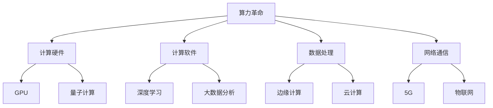
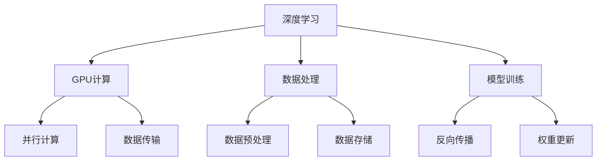

                 

# 《算力革命与NVIDIA的角色》

## 关键词

- 算力革命
- NVIDIA
- GPU
- 深度学习
- 边缘计算
- 数据中心
- 人工智能

## 摘要

本文旨在探讨算力革命这一重大技术变革，以及NVIDIA在这一革命中的核心角色。我们将从算力革命的背景与基础出发，详细分析NVIDIA的发展历程、核心产品与技术，以及其在人工智能和边缘计算等领域的应用。同时，本文还将深入探讨算力革命在人工智能和数据中心的实际应用，展望其未来发展趋势，并总结NVIDIA在其中的地位与贡献。希望通过本文，读者能够全面了解算力革命的重要性和NVIDIA在这一领域中的领导地位。

## 《算力革命与NVIDIA的角色》目录大纲

### 第一部分：算力革命的背景与基础

#### 第1章：算力革命概述

- 1.1 算力革命的定义与重要性
- 1.2 算力革命的发展历程
- 1.3 算力革命对人类社会的影响

#### 第2章：NVIDIA的角色与贡献

- 2.1 NVIDIA的发展历程
- 2.2 NVIDIA在算力革命中的核心产品与技术
- 2.3 NVIDIA在人工智能领域的影响

#### 第3章：算力革命的核心技术

- 3.1 图形处理单元（GPU）的基本原理
- 3.2 GPU并行计算的优势
- 3.3 GPU在深度学习中的应用

### 第二部分：NVIDIA的产品与技术

#### 第4章：NVIDIA GPU架构详解

- 4.1 NVIDIA GPU架构演进史
- 4.2 CUDA架构详解
- 4.3 GPU虚拟化技术

#### 第5章：深度学习与NVIDIA

- 5.1 深度学习的基本原理
- 5.2 NVIDIA在深度学习领域的贡献
- 5.3 深度学习在NVIDIA GPU上的优化

#### 第6章：NVIDIA DPU与边缘计算

- 6.1 DPU的概念与作用
- 6.2 NVIDIA DPU技术详解
- 6.3 边缘计算的应用场景

### 第三部分：算力革命的应用与实践

#### 第7章：算力革命在人工智能中的应用

- 7.1 人工智能的发展现状与趋势
- 7.2 NVIDIA在人工智能领域的应用案例
- 7.3 人工智能在行业中的实际应用

#### 第8章：算力革命在数据中心的应用

- 8.1 数据中心的发展趋势
- 8.2 NVIDIA GPU数据中心解决方案
- 8.3 数据中心能源效率的优化

#### 第9章：算力革命的未来展望

- 9.1 算力革命的未来发展趋势
- 9.2 NVIDIA在未来算力革命中的角色
- 9.3 算力革命对社会与经济的影响

### 附录

#### 附录A：NVIDIA产品与资源

- A.1 NVIDIA产品线概述
- A.2 NVIDIA开发者资源
- A.3 NVIDIA社区与支持

#### 附录B：算力革命相关的 Mermaid 流程图

- B.1 算力革命的核心技术流程图
- B.2 深度学习与GPU的关联流程图

#### 附录C：核心算法原理与伪代码

- C.1 深度学习算法原理
- C.2 深度学习算法伪代码实现

#### 附录D：项目实战案例

- D.1 人工智能项目实战案例
- D.2 数据中心优化项目实战案例
- D.3 边缘计算项目实战案例

## 第一部分：算力革命的背景与基础

### 第1章：算力革命概述

#### 1.1 算力革命的定义与重要性

算力革命是指通过计算技术的不断创新和升级，推动数据处理、存储、传输和计算能力的全面提升，从而实现社会生产和生活方式的深刻变革。算力作为数字经济的重要基础，其发展水平直接关系到国家竞争力和人民生活质量。随着大数据、云计算、人工智能等技术的迅猛发展，算力革命已经成为了当今世界科技发展的关键驱动力。

算力革命的重要性体现在以下几个方面：

1. **推动产业升级**：算力革命使得传统产业通过数字化、智能化改造，实现了生产效率的提升、成本的降低和产品质量的改善，促进了产业结构的优化升级。

2. **支撑经济发展**：算力革命带来了新的经济增长点，推动了互联网经济、智能制造、数字经济等新兴产业的快速发展，成为推动全球经济持续增长的重要动力。

3. **提高社会服务水平**：算力革命促进了医疗、教育、交通、金融等公共服务领域的智能化升级，提升了社会服务效率和人民生活质量。

4. **增强国家竞争力**：算力革命使得国家在科技创新、国防安全、国际竞争等方面具备了更强的话语权和影响力。

#### 1.2 算力革命的发展历程

算力革命的发展历程可以追溯到计算机技术的起源。自1946年第一台电子计算机ENIAC问世以来，计算技术经历了从电子管、晶体管、集成电路到超大规模集成电路的演变。每一次技术突破都带来了计算能力的质的飞跃。

1. **早期计算**：20世纪40年代至70年代，计算机以电子管和晶体管为核心，计算速度和存储容量逐步提升，但总体性能仍然较低。

2. **集成电路时代**：20世纪70年代至90年代，集成电路技术的发展使得计算机体积减小、性能提升，计算成本大幅降低，计算机开始普及到企业和家庭。

3. **互联网时代**：20世纪90年代至今，互联网的兴起带来了大数据和云计算的发展，计算需求急剧增加，算力革命进入了全新的阶段。GPU等新型计算架构的出现，使得并行计算成为可能，大大提高了计算效率。

#### 1.3 算力革命对人类社会的影响

算力革命对人类社会产生了深远的影响：

1. **生产方式变革**：算力革命推动了智能制造、工业互联网等技术的发展，使生产方式从传统的机械化、自动化向智能化、数字化转变。

2. **生活方式变化**：算力革命带来了智能家居、智慧城市、在线教育、远程医疗等技术的普及，人们的生活方式变得更加便捷、智能。

3. **社会治理创新**：算力革命促进了大数据、云计算、区块链等技术在公共管理和服务领域的应用，提高了社会治理的效率和服务水平。

4. **经济结构转型**：算力革命推动了数字经济的发展，促进了经济结构的优化升级，推动了全球经济的持续增长。

### 第2章：NVIDIA的角色与贡献

#### 2.1 NVIDIA的发展历程

NVIDIA成立于1993年，由黄仁勋、克里斯·艾森施塔特和科林·亨尼斯三人共同创立。最初，NVIDIA专注于图形处理芯片（GPU）的研发，旨在为个人电脑提供更强大的图形处理能力。随着GPU技术的不断创新和突破，NVIDIA逐渐扩展到数据中心、自动驾驶、人工智能等领域，成为全球领先的半导体公司之一。

NVIDIA的发展历程可以分为以下几个阶段：

1. **成立与早期发展**：1993年，NVIDIA成立，初期专注于图形处理芯片的研发，推出了一系列高性能GPU产品。

2. **GPU技术突破**：1999年，NVIDIA推出了GeForce 256显卡，成为第一款支持三维图形加速的GPU，奠定了NVIDIA在图形处理领域的领导地位。

3. **进军数据中心**：2006年，NVIDIA发布了GPU加速计算平台，标志着GPU在数据中心计算领域的应用开始兴起。

4. **人工智能领域拓展**：2017年，NVIDIA推出了一款名为Tesla V100的GPU，成为人工智能领域的重要推动力量。

5. **自动驾驶与边缘计算**：近年来，NVIDIA在自动驾驶和边缘计算领域进行了大量投资和研发，推出了一系列相关产品和技术。

#### 2.2 NVIDIA在算力革命中的核心产品与技术

NVIDIA在算力革命中发挥了核心作用，其核心产品和技术包括：

1. **GPU**：NVIDIA的GPU技术是算力革命的重要基石。GPU具备强大的并行计算能力，能够处理大规模的数据和复杂的计算任务。NVIDIA的GPU产品线涵盖了多个系列，从高性能游戏显卡到专业工作站显卡，再到数据中心GPU，为不同场景的应用提供了丰富的选择。

2. **CUDA**：CUDA是NVIDIA开发的并行计算平台和编程模型，它使得开发者能够利用GPU的并行计算能力，实现高效的程序优化和加速。CUDA为深度学习、科学计算、金融分析等多个领域提供了强大的计算支持。

3. **深度学习平台**：NVIDIA的深度学习平台包括TensorRT、DGX系统等，为人工智能应用提供了高效的推理和训练解决方案。这些平台在自动驾驶、医疗影像、语音识别等领域得到了广泛应用。

4. **边缘计算技术**：NVIDIA的边缘计算技术包括Jetson系列模块和Drive平台，这些产品旨在将高性能计算能力带到边缘设备，支持实时数据处理和智能应用。

#### 2.3 NVIDIA在人工智能领域的影响

NVIDIA在人工智能领域的影响主要体现在以下几个方面：

1. **推动深度学习发展**：NVIDIA的GPU为深度学习算法提供了强大的计算支持，使得深度学习研究得以迅速发展。NVIDIA的GPU加速技术和深度学习平台已经成为全球研究机构和企业的标准配置。

2. **推动自动驾驶技术**：NVIDIA在自动驾驶领域进行了大量投资和研发，其GPU和深度学习平台为自动驾驶汽车提供了高效的计算和视觉处理能力，推动了自动驾驶技术的发展。

3. **促进人工智能应用落地**：NVIDIA的人工智能产品和技术在医疗、金融、零售等多个行业得到了广泛应用，推动了人工智能技术的实际应用和产业化进程。

### 第3章：算力革命的核心技术

#### 3.1 图形处理单元（GPU）的基本原理

GPU（Graphics Processing Unit，图形处理单元）是一种专门用于图形处理的处理器，具有强大的并行计算能力。与传统CPU（Central Processing Unit，中央处理器）相比，GPU拥有更多的计算单元和更高的并行处理能力，使其在处理大规模数据和复杂计算任务方面具有显著优势。

GPU的基本原理如下：

1. **硬件架构**：GPU由数千个流处理器组成，每个流处理器都可以独立执行计算任务。流处理器之间通过高速总线进行通信，形成了一个高度并行计算的架构。

2. **内存管理**：GPU具有独立的内存系统，包括寄存器、共享内存和全局内存。内存管理机制使得GPU能够高效地访问和操作数据，提高了计算效率。

3. **编程模型**：GPU的编程模型主要包括CUDA和OpenCL等。这些编程模型提供了丰富的并行编程接口，使得开发者能够充分利用GPU的并行计算能力。

4. **并行计算**：GPU通过并行计算的方式处理数据，将大规模的任务分解为多个小任务，由不同的流处理器并行执行。这种并行计算方式大大提高了计算速度和效率。

#### 3.2 GPU并行计算的优势

GPU并行计算具有以下优势：

1. **高性能**：GPU拥有数千个流处理器，能够同时处理多个任务，大大提高了计算速度。相比CPU，GPU在处理大规模数据和复杂计算任务时具有明显的性能优势。

2. **高能效**：GPU的设计注重能效比，能够在较低能耗下实现高效计算。这使得GPU在数据中心等高功耗场景中具有广泛应用前景。

3. **灵活性**：GPU的编程模型提供了丰富的并行编程接口，使得开发者能够根据具体应用需求进行优化和调整，提高了计算效率和灵活性。

4. **可扩展性**：GPU具有高度的扩展性，可以通过增加GPU数量来提升计算能力。这种可扩展性使得GPU能够适应不同规模的应用需求。

#### 3.3 GPU在深度学习中的应用

深度学习是人工智能的重要分支，其核心思想是通过模拟人脑神经网络的结构和功能，实现数据的自动学习和特征提取。GPU在深度学习中的应用主要体现在以下几个方面：

1. **模型训练**：深度学习模型的训练过程涉及到大量的矩阵运算，GPU强大的并行计算能力能够显著加速模型的训练过程。NVIDIA推出的Tensor Core和深度学习库（如cuDNN）为深度学习模型训练提供了高效的支持。

2. **推理加速**：深度学习模型的推理过程是将输入数据映射到输出结果的过程，也需要大量的计算。GPU的并行计算能力使得推理过程能够高效进行，为实时应用提供了支持。

3. **多卡并行**：在大型深度学习任务中，可以通过多卡并行的方式进一步提升计算效率。NVIDIA的多卡并行技术（如NVLink和SLI）能够实现GPU之间的数据传输和任务分配，提高整体计算性能。

4. **分布式训练**：GPU的分布式训练技术能够将大规模的深度学习模型训练任务分解到多个GPU上，通过并行计算和负载均衡，提高训练效率和性能。

## 第二部分：NVIDIA的产品与技术

### 第4章：NVIDIA GPU架构详解

#### 4.1 NVIDIA GPU架构演进史

NVIDIA GPU架构的演进历程是计算技术发展的重要里程碑。从最初简单的图形处理单元，到如今具备强大并行计算能力的GPU，NVIDIA不断推动GPU架构的创新和升级。以下是NVIDIA GPU架构的几个重要发展阶段：

1. **早期GPU架构**：NVIDIA的第一款GPU GeForce 256（1999年）采用了简单的处理单元架构，主要包括渲染管线和纹理处理单元。虽然其图形处理性能在当时处于领先地位，但并行计算能力有限。

2. **GPU核心架构**：随着并行计算需求的增加，NVIDIA推出了GPU核心架构，如GeForce 6系列（2004年）。这一架构引入了更高效的流处理器设计，包括多个统一渲染单元（URA），实现了更高的并行计算能力。

3. **CUDA架构**：CUDA（Compute Unified Device Architecture，统一计算设备架构）的推出标志着NVIDIA GPU在并行计算领域的重大突破（2006年）。CUDA为GPU提供了强大的编程接口，使得开发者能够利用GPU的并行计算能力进行科学计算和人工智能应用。

4. **GPU深度学习架构**：随着深度学习技术的兴起，NVIDIA推出了Tensor Core架构，如Volta（2017年）和Ampere（2020年）。这些架构在并行计算能力和内存管理方面进行了重大改进，为深度学习模型训练和推理提供了高效的计算支持。

5. **新兴GPU架构**：NVIDIA不断推陈出新，如Quantum Core（量子核心）和RTX架构，这些新兴架构在光线追踪和实时渲染方面取得了重要突破，为游戏、电影和科学计算等领域提供了强大的计算能力。

#### 4.2 CUDA架构详解

CUDA是NVIDIA开发的并行计算平台和编程模型，它使得开发者能够充分利用GPU的并行计算能力，实现高效的程序优化和加速。CUDA架构包括以下几个核心组成部分：

1. **CUDA内核**：CUDA内核是GPU上的可执行代码，由一组线程组成。线程可以并行执行，共享内存和同步机制，使得CUDA内核能够高效地处理大规模计算任务。

2. **CUDA内存管理**：CUDA内存管理包括寄存器、共享内存和全局内存。寄存器用于临时存储操作数据，共享内存用于线程之间的数据共享，全局内存用于存储大型数据集。合理的内存管理策略可以显著提高计算效率。

3. **CUDA线程管理**：CUDA线程管理包括线程层次结构、线程组和网格。线程层次结构使得GPU能够高效地组织和管理线程，线程组和网格则用于定义并行计算任务的划分和执行。

4. **CUDA编程接口**：CUDA编程接口包括CUDA C/C++和CUDA Python等，为开发者提供了丰富的并行编程工具。CUDA C/C++允许开发者直接在GPU上编写并行代码，CUDA Python则通过Python语言实现了对CUDA内核的调用和管理。

#### 4.3 GPU虚拟化技术

GPU虚拟化技术使得多个虚拟机能够共享同一物理GPU资源，提高了GPU的利用率和计算效率。NVIDIA的GPU虚拟化技术主要包括以下两个方面：

1. **NVIDIA GPU虚拟化软件**：NVIDIA GPU虚拟化软件支持在虚拟机环境中运行GPU应用程序。该软件通过虚拟化GPU设备，使得虚拟机能够访问GPU资源，实现GPU应用程序的并行执行。

2. **NVIDIA GPU虚拟化硬件**：NVIDIA GPU虚拟化硬件包括虚拟化GPU（vGPU）和虚拟化内存（vRAM）。虚拟化GPU提供了多个虚拟GPU设备，每个虚拟GPU能够独立运行GPU应用程序。虚拟化内存则通过共享GPU内存池，实现了虚拟机之间的数据共享和内存管理。

GPU虚拟化技术的优势体现在以下几个方面：

1. **提高资源利用率**：GPU虚拟化技术使得多个虚拟机能够共享同一物理GPU资源，提高了GPU的利用率和计算效率。

2. **灵活的资源分配**：GPU虚拟化技术允许管理员根据不同虚拟机的需求动态分配GPU资源，实现了资源的灵活管理和调度。

3. **安全性**：GPU虚拟化技术通过隔离虚拟机之间的GPU资源，提高了系统的安全性和稳定性。

### 第5章：深度学习与NVIDIA

#### 5.1 深度学习的基本原理

深度学习是人工智能的一个重要分支，其核心思想是通过构建多层神经网络，模拟人脑的神经结构和工作方式，实现对数据的自动学习和特征提取。深度学习的基本原理包括以下几个方面：

1. **神经网络**：神经网络是深度学习的基础，由多个层次的前向传播和反向传播组成。输入数据通过输入层进入网络，经过多个隐藏层的非线性变换，最终输出结果。

2. **激活函数**：激活函数是神经网络中的关键组件，用于引入非线性特性，使得网络能够对复杂问题进行建模。常见的激活函数包括Sigmoid、ReLU、Tanh等。

3. **损失函数**：损失函数用于评估模型预测结果与实际结果之间的差距，指导模型调整参数。常见的损失函数包括均方误差（MSE）、交叉熵等。

4. **优化算法**：优化算法用于最小化损失函数，调整模型参数以获得更好的预测性能。常见的优化算法包括梯度下降、Adam等。

5. **正则化**：正则化是防止模型过拟合的重要手段，通过引入惩罚项，降低模型复杂度。常见的正则化方法包括L1正则化、L2正则化等。

#### 5.2 NVIDIA在深度学习领域的贡献

NVIDIA在深度学习领域做出了重要贡献，其GPU技术和深度学习平台为深度学习研究和发展提供了强大的计算支持。以下是NVIDIA在深度学习领域的几个重要贡献：

1. **GPU加速深度学习**：NVIDIA的GPU具备强大的并行计算能力，能够显著加速深度学习模型的训练和推理过程。NVIDIA推出的GPU深度学习平台（如TensorRT、DGX系统）为深度学习应用提供了高效的计算解决方案。

2. **CUDA深度学习库**：NVIDIA开发的CUDA深度学习库（如cuDNN、NCCL）为深度学习模型训练和推理提供了高效的计算接口。这些库实现了GPU加速的深度学习算法和优化，提高了计算效率和性能。

3. **深度学习硬件**：NVIDIA推出了多款深度学习硬件（如Tesla V100、A100等），这些GPU硬件具备强大的计算能力和内存带宽，为深度学习应用提供了高效的计算支持。

4. **深度学习工具和生态系统**：NVIDIA提供了丰富的深度学习工具和生态系统（如TensorFlow、PyTorch等），为开发者提供了便捷的深度学习开发环境和资源。

#### 5.3 深度学习在NVIDIA GPU上的优化

NVIDIA在深度学习领域不断优化GPU架构和计算库，以实现更好的计算性能和效率。以下是NVIDIA在深度学习GPU上的几个优化方向：

1. **并行计算优化**：NVIDIA通过优化GPU架构和编程模型，提高并行计算效率。CUDA架构和Tensor Core技术为深度学习算法提供了高效的并行计算支持，实现了大规模数据的高效处理。

2. **内存优化**：NVIDIA通过优化内存管理和带宽，提高GPU的内存利用率和访问速度。GPU内存池、虚拟化内存等技术实现了内存的高效共享和管理，提高了深度学习模型的训练和推理效率。

3. **算法优化**：NVIDIA针对深度学习算法进行了优化，提高了计算效率和性能。例如，cuDNN库实现了GPU加速的深度学习算法，通过优化卷积操作和数据存储，提高了计算速度和吞吐量。

4. **多卡并行**：NVIDIA的多卡并行技术（如NVLink、SLI）支持多GPU之间的数据传输和任务分配，实现了大规模深度学习任务的分布式计算。通过多卡并行，NVIDIA显著提高了计算性能和效率。

### 第6章：NVIDIA DPU与边缘计算

#### 6.1 DPU的概念与作用

DPU（Data Processing Unit，数据处理单元）是一种专门用于处理网络数据包的处理器，它融合了CPU、GPU和网络功能的硬件设备。DPU旨在提升边缘计算和网络处理的性能和效率，为实时数据处理和智能应用提供支持。DPU的概念和作用主要体现在以下几个方面：

1. **概念**：DPU是一种集成了CPU、GPU和网络功能的处理器，它通过硬件加速和数据包处理，实现高效的网络数据处理和计算。DPU可以独立运行应用程序，支持自定义处理逻辑，从而提升边缘计算设备的计算能力。

2. **作用**：DPU在边缘计算和网络处理中具有重要作用，主要包括：

   - **高效数据包处理**：DPU具备高效的网络数据处理能力，可以快速处理大量的网络数据包，降低网络延迟和带宽消耗。
   - **网络功能卸载**：DPU能够卸载网络功能，如路由、交换、安全等，降低CPU的负载，提高系统性能。
   - **实时数据处理**：DPU支持实时数据处理，可以为边缘设备提供高效的数据分析和处理能力，支持智能应用和实时决策。
   - **边缘计算优化**：DPU通过与CPU和GPU的协同工作，实现计算资源的优化分配和协同处理，提高边缘计算的整体性能。

#### 6.2 NVIDIA DPU技术详解

NVIDIA在边缘计算领域推出了DPU技术，旨在提升边缘计算设备的性能和效率。以下是NVIDIA DPU技术的几个关键方面：

1. **硬件架构**：NVIDIA DPU采用高度集成的硬件架构，集成了CPU、GPU和网络功能。DPU内部包含多个计算引擎，可以实现并行数据处理和计算，提高处理效率。

2. **网络处理能力**：NVIDIA DPU具备高效的网络处理能力，可以处理高吞吐量的网络数据包，实现快速的数据包转发和过滤。DPU支持多种网络协议和加速技术，如DPDK（Data Plane Development Kit）和P4（Programmable Flow Language），实现了高效的网络数据处理。

3. **边缘计算支持**：NVIDIA DPU支持多种边缘计算场景，如物联网、智能城市、智能制造等。DPU可以与CPU和GPU协同工作，实现高效的数据处理和计算，为边缘设备提供强大的计算能力。

4. **智能应用支持**：NVIDIA DPU支持智能应用的开发和部署，包括计算机视觉、语音识别、自然语言处理等。DPU可以通过硬件加速和并行计算，实现高效的数据分析和处理，支持实时智能应用。

#### 6.3 边缘计算的应用场景

边缘计算是一种将计算资源部署在靠近数据源的设备上，实现实时数据处理和智能应用的技术。边缘计算具有低延迟、高带宽和分布式计算的特点，适用于多种应用场景。以下是边缘计算的一些典型应用场景：

1. **物联网**：边缘计算可以实现对海量物联网设备的实时监控和数据处理，如智能家居、智能工厂、智能交通等。NVIDIA DPU可以通过硬件加速和并行计算，实现高效的数据处理和分析，为物联网应用提供支持。

2. **智能城市**：边缘计算可以用于智能城市的监控和管理，如交通管理、环境监测、公共安全等。NVIDIA DPU可以与摄像头、传感器等设备协同工作，实现高效的数据采集和处理，为智能城市建设提供支持。

3. **智能制造**：边缘计算可以用于智能工厂的生产线监控和优化，如设备状态监测、故障预测、生产优化等。NVIDIA DPU可以与工业设备协同工作，实现高效的数据处理和智能决策，提高生产效率和质量。

4. **远程医疗**：边缘计算可以用于远程医疗服务，如远程诊断、远程手术、健康监测等。NVIDIA DPU可以与医疗设备协同工作，实现高效的数据处理和实时传输，为远程医疗服务提供支持。

## 第三部分：算力革命的应用与实践

### 第7章：算力革命在人工智能中的应用

#### 7.1 人工智能的发展现状与趋势

人工智能（AI）作为算力革命的重要应用领域，近年来取得了飞速发展。随着计算能力的提升和大数据、深度学习等技术的进步，人工智能在各个行业和领域得到了广泛应用。以下是人工智能发展的现状与趋势：

1. **技术成熟度**：人工智能技术已经从理论研究走向实际应用，包括计算机视觉、自然语言处理、语音识别、机器学习等。这些技术在算法、模型和硬件方面都取得了显著的进步。

2. **应用场景扩展**：人工智能的应用场景越来越广泛，包括自动驾驶、智能家居、医疗诊断、金融风控、智能制造等。随着算力的提升，人工智能的应用范围将继续扩大。

3. **产业融合**：人工智能与各行业的深度融合，推动了产业的数字化转型和升级。例如，智能制造中的人工智能技术可以提高生产效率、降低成本；医疗领域的人工智能技术可以辅助医生进行诊断和治疗。

4. **市场前景**：人工智能市场前景广阔，据预测，到2030年，全球人工智能市场规模将达到数万亿美元。人工智能技术将成为推动经济增长和社会进步的重要动力。

#### 7.2 NVIDIA在人工智能领域的应用案例

NVIDIA在人工智能领域拥有丰富的应用案例，其GPU和深度学习平台为各种人工智能应用提供了强大的计算支持。以下是几个典型的应用案例：

1. **自动驾驶**：NVIDIA与多家汽车制造商合作，为其自动驾驶系统提供计算平台和视觉处理技术。NVIDIA的GPU和深度学习平台可以实时处理大量图像数据，支持自动驾驶车辆的感知、决策和控制系统。

2. **医疗影像**：NVIDIA的深度学习技术被广泛应用于医疗影像诊断，如肿瘤检测、心脏病诊断等。通过使用GPU加速深度学习模型，医生可以更快地诊断疾病，提高诊疗效率。

3. **金融风控**：NVIDIA的深度学习平台被用于金融风险管理和欺诈检测。通过分析大量的交易数据，GPU加速的深度学习模型可以实时检测异常交易和欺诈行为，提高金融系统的安全性和稳定性。

4. **智能制造**：NVIDIA的GPU和深度学习平台被用于智能制造，如设备故障预测、生产流程优化等。通过实时分析传感器数据和机器视觉数据，人工智能系统可以预测设备故障、优化生产流程，提高生产效率和产品质量。

#### 7.3 人工智能在行业中的实际应用

人工智能在各个行业中的实际应用不断拓展，以下是几个主要行业的应用案例：

1. **医疗健康**：人工智能技术在医疗健康领域的应用包括疾病诊断、治疗规划、药物研发等。通过分析患者数据、医学图像和基因序列，人工智能系统可以帮助医生更准确地诊断疾病、制定治疗方案。

2. **金融**：人工智能技术在金融领域的应用包括风险管理、欺诈检测、智能投顾等。通过分析大量的交易数据和用户行为，人工智能系统可以识别风险、预测市场趋势，为金融机构提供决策支持。

3. **零售**：人工智能技术在零售行业的应用包括库存管理、客户关系管理、个性化推荐等。通过分析销售数据、用户行为和需求，人工智能系统可以帮助零售企业优化库存管理、提升客户体验。

4. **智能制造**：人工智能技术在智能制造中的应用包括设备维护、生产优化、质量控制等。通过实时监测设备状态、分析生产数据，人工智能系统可以帮助企业提高生产效率、降低成本。

5. **交通运输**：人工智能技术在交通运输领域的应用包括自动驾驶、智能交通管理、物流优化等。通过分析交通数据、路况信息，人工智能系统可以提高交通效率、减少交通事故。

### 第8章：算力革命在数据中心的应用

#### 8.1 数据中心的发展趋势

数据中心作为信息技术的基础设施，是算力革命的重要应用场景之一。随着云计算、大数据、人工智能等技术的发展，数据中心的发展趋势主要体现在以下几个方面：

1. **规模化与集中化**：数据中心规模逐渐扩大，大型数据中心和云数据中心成为主流。通过规模化运营，数据中心可以实现更高的资源利用率和管理效率。

2. **智能化与自动化**：数据中心逐渐引入人工智能、机器学习等智能化技术，实现基础设施的自动化管理。通过智能化管理，数据中心可以提高运维效率、降低运营成本。

3. **绿色环保**：数据中心能耗问题日益受到关注，绿色环保成为数据中心发展的重要趋势。通过优化能源使用、采用节能设备等手段，数据中心可以实现更低的能耗和更高的能源效率。

4. **边缘计算**：随着物联网、5G等技术的发展，边缘计算逐渐兴起。数据中心与边缘计算设备相结合，可以实现更快速的数据处理和更低的网络延迟，满足实时应用的场景需求。

5. **多元化应用**：数据中心的应用场景越来越广泛，不仅包括传统的云计算、大数据处理，还涉及人工智能、区块链、物联网等新兴领域。

#### 8.2 NVIDIA GPU数据中心解决方案

NVIDIA GPU数据中心解决方案在提升数据中心计算性能、优化资源利用率方面发挥了重要作用。以下是NVIDIA GPU数据中心解决方案的几个关键方面：

1. **GPU计算平台**：NVIDIA GPU计算平台包括多款高性能GPU，如Tesla、Ampere等，为数据中心提供强大的计算能力。这些GPU支持深度学习、科学计算、高性能计算等应用，能够满足数据中心不同场景的计算需求。

2. **深度学习平台**：NVIDIA深度学习平台包括TensorRT、DGX系统等，为数据中心提供高效的深度学习解决方案。这些平台支持大规模深度学习模型训练和推理，能够显著提升数据中心的计算性能。

3. **数据中心网络解决方案**：NVIDIA数据中心网络解决方案包括多款高性能网络设备，如BlueField DPU等，能够实现高效的数据传输和网络管理。通过这些解决方案，数据中心可以实现更快速的数据处理和更低的网络延迟。

4. **数据中心管理工具**：NVIDIA提供了多款数据中心管理工具，如NCBI、OLED等，能够实现数据中心的自动化管理和监控。通过这些工具，数据中心管理员可以更方便地管理GPU资源、监控系统状态、优化资源配置。

#### 8.3 数据中心能源效率的优化

数据中心能源效率的优化是提高其可持续发展能力的重要举措。以下是几个数据中心能源效率优化的关键方面：

1. **节能设备**：采用节能设备是提升数据中心能源效率的重要手段。例如，采用高效电源设备、散热系统等，可以降低能耗。

2. **智能管理**：通过智能化管理，实现数据中心的能源优化。例如，采用智能监控系统，实时监测数据中心能源使用情况，根据负载需求调整能源供应。

3. **绿色数据中心设计**：在设计阶段考虑绿色数据中心的设计理念，如采用自然冷却、可再生能源等，降低数据中心的碳排放和能耗。

4. **虚拟化和容器化**：通过虚拟化和容器化技术，实现计算资源的优化配置和动态调整，提高数据中心的资源利用率和能源效率。

5. **能源管理软件**：采用能源管理软件，对数据中心的能源使用进行实时监控和优化。例如，通过优化电力分配、调整设备运行状态等，实现能源的合理利用。

## 第四部分：算力革命的未来展望

### 第9章：算力革命的未来发展趋势

#### 9.1 算力革命的未来发展趋势

随着科技的不断进步，算力革命将继续深入发展，其未来发展趋势主要体现在以下几个方面：

1. **更高性能的硬件**：随着新材料的研发和纳米技术的发展，未来计算硬件将具备更高的性能和能效。例如，量子计算、光子计算等新型计算技术的出现，将带来前所未有的计算能力。

2. **更广泛的边缘计算**：随着物联网和5G技术的普及，边缘计算将得到更广泛的应用。边缘计算将实现更多的实时数据处理和智能应用，提高系统的响应速度和可靠性。

3. **更智能的软件**：人工智能和机器学习技术的不断发展，将使软件系统更加智能化。智能软件将能够自适应地优化计算资源、预测系统行为，提高系统的效率和性能。

4. **更紧密的产业融合**：算力革命将更紧密地与各行各业融合，推动产业数字化、智能化转型。从制造业、医疗健康、金融服务，到交通运输、能源环保，算力革命将为各行业提供创新的解决方案。

#### 9.2 NVIDIA在未来算力革命中的角色

NVIDIA在未来算力革命中将继续发挥关键作用，其角色主要体现在以下几个方面：

1. **技术创新的引领者**：NVIDIA将持续推动计算硬件和软件的创新，为算力革命提供强大的技术支持。例如，开发更高性能的GPU、引入量子计算技术等。

2. **应用解决方案的提供者**：NVIDIA将结合自身的技术优势，为各行各业提供全面的算力解决方案。例如，为自动驾驶、智能制造、医疗健康等领域提供高效的计算平台和工具。

3. **生态系统建设的推动者**：NVIDIA将通过开源社区、合作伙伴网络等手段，推动算力革命生态系统的建设。通过与学术界、产业界的紧密合作，共同推动算力革命的发展。

#### 9.3 算力革命对社会与经济的影响

算力革命对社会和经济的影响将是深远和广泛的，主要体现在以下几个方面：

1. **经济增长**：算力革命将推动新兴产业的发展，如人工智能、云计算、物联网等，为全球经济注入新的活力。预计到2030年，全球人工智能市场规模将达到数万亿美元。

2. **产业升级**：算力革命将推动传统产业数字化、智能化转型，提高生产效率、降低成本，优化产业结构。例如，智能制造、智慧城市等应用场景将得到广泛推广。

3. **社会治理**：算力革命将提升社会治理的效率和水平，如通过大数据分析、人工智能等技术，实现公共安全、环境保护、社会服务等方面的优化。

4. **生活变革**：算力革命将改变人们的生活方式，提供更加便捷、智能的公共服务。例如，智能家居、在线教育、远程医疗等应用场景将极大地改善人们的生活质量。

## 附录

### 附录A：NVIDIA产品与资源

#### A.1 NVIDIA产品线概述

NVIDIA的产品线涵盖了多个领域，包括图形处理单元（GPU）、深度学习平台、自动驾驶技术、边缘计算设备等。以下是NVIDIA主要产品线的概述：

1. **GPU产品线**：包括消费级显卡、专业工作站显卡、数据中心GPU等，如GeForce、Quadro、Tesla系列。
2. **深度学习平台**：包括TensorRT、TensorFlow、PyTorch等深度学习框架和工具，以及DGX系列深度学习系统。
3. **自动驾驶技术**：包括Drive系列自动驾驶平台，涵盖感知、决策、控制等关键模块。
4. **边缘计算设备**：包括Jetson系列模块、BlueField系列DPU等，为边缘计算提供强大的计算支持。

#### A.2 NVIDIA开发者资源

NVIDIA为开发者提供了丰富的开发资源，包括开发工具、文档、教程等，以帮助开发者充分利用NVIDIA的产品和技术。以下是NVIDIA开发者资源的主要组成部分：

1. **NVIDIA Developer website**：提供了丰富的开发工具、SDK、API文档等，涵盖GPU编程、深度学习、自动驾驶等领域。
2. **CUDA Toolkit**：为GPU编程提供了全面的工具和库，包括CUDA C/C++、cuDNN、NCCL等。
3. **Deep Learning Library (cuDNN)**：为深度学习算法提供了高效的GPU加速库，支持卷积、激活、池化等操作。
4. **NVIDIA Documentation**：提供了详细的API文档、开发者指南等，帮助开发者了解和掌握NVIDIA的技术。

#### A.3 NVIDIA社区与支持

NVIDIA拥有一个活跃的开发者社区，为开发者提供了交流、学习和分享的平台。以下是NVIDIA社区与支持的主要组成部分：

1. **NVIDIA Developer Forums**：开发者可以在论坛中提问、分享经验和获取技术支持。
2. **NVIDIA Developer Blog**：提供了最新的技术动态、博客文章和案例研究，帮助开发者了解NVIDIA的最新技术和应用。
3. **NVIDIA Developer Events**：定期举办线上和线下活动，包括研讨会、工作坊、开发者大会等，为开发者提供学习和交流的机会。
4. **NVIDIA Support Center**：为开发者提供专业的技术支持，包括文档支持、在线支持、技术热线等。

### 附录B：算力革命相关的 Mermaid 流程图

#### B.1 算力革命的核心技术流程图



#### B.2 深度学习与GPU的关联流程图



### 附录C：核心算法原理与伪代码

#### C.1 深度学习算法原理

深度学习算法主要通过构建多层神经网络，实现数据的自动学习和特征提取。以下是深度学习算法的基本原理和流程：

1. **输入层**：接收外部输入数据，如图片、文本等。
2. **隐藏层**：对输入数据进行特征提取和变换，通过激活函数引入非线性特性。
3. **输出层**：根据隐藏层的输出，生成预测结果或分类标签。
4. **损失函数**：评估模型预测结果与实际结果之间的差距，指导模型调整参数。
5. **优化算法**：通过优化损失函数，调整模型参数，提高预测性能。

以下是深度学习算法的伪代码：

```python
初始化模型参数
while 没有达到迭代次数:
    前向传播：计算输出
    计算损失函数值
    反向传播：计算梯度
    更新模型参数
    计算准确率
    输出：预测结果和准确率
```

#### C.2 深度学习算法伪代码实现

以下是一个简单的深度学习算法伪代码实现，用于实现多层感知机（MLP）模型的训练和预测：

```python
# 初始化参数
输入层尺寸: input_size
隐藏层尺寸: hidden_size
输出层尺寸: output_size
学习率: learning_rate

# 初始化权重和偏置
W1 = 随机初始化(input_size, hidden_size)
b1 = 随机初始化(hidden_size, 1)
W2 = 随机初始化(hidden_size, output_size)
b2 = 随机初始化(output_size, 1)

# 前向传播
def forward_propagation(X):
    Z1 = X * W1 + b1
    A1 = sigmoid(Z1)
    Z2 = A1 * W2 + b2
    A2 = sigmoid(Z2)
    return A2

# 反向传播
def backward_propagation(X, Y, A2):
    dZ2 = A2 - Y
    dW2 = (1/m) * A1.T * dZ2
    db2 = (1/m) * sum(dZ2, axis=1, keepdims=True)
    
    dA1 = dZ2 * W2.T
    dZ1 = dA1 * sigmoid_derivative(Z1)
    dW1 = (1/m) * X.T * dZ1
    db1 = (1/m) * sum(dZ1, axis=1, keepdims=True)

    return dW1, dW2, db1, db2

# 更新权重和偏置
def update_parameters(W1, W2, b1, b2, dW1, dW2, db1, db2, learning_rate):
    W1 = W1 - learning_rate * dW1
    W2 = W2 - learning_rate * dW2
    b1 = b1 - learning_rate * db1
    b2 = b2 - learning_rate * db2
    return W1, W2, b1, b2

# 主函数
def main():
    for epoch in range(num_epochs):
        for X, Y in data_loader:
            A2 = forward_propagation(X)
            dW1, dW2, db1, db2 = backward_propagation(X, Y, A2)
            W1, W2, b1, b2 = update_parameters(W1, W2, b1, b2, dW1, dW2, db1, db2, learning_rate)
            print(f"Epoch {epoch}: Loss = {calculate_loss(A2, Y)}")

if __name__ == "__main__":
    main()
```

### 附录D：项目实战案例

#### D.1 人工智能项目实战案例

**项目背景**：某公司希望通过人工智能技术对大量图像数据进行分析，识别出其中的特定目标。该项目涉及图像处理、计算机视觉和深度学习等技术。

**技术选型**：采用NVIDIA的GPU和TensorFlow框架，实现图像识别模型的训练和部署。

**开发环境**：NVIDIA GPU、CUDA Toolkit、TensorFlow

**实现步骤**：

1. **数据预处理**：对图像数据进行归一化、缩放等处理，将图像转换为适合模型训练的格式。

2. **模型设计**：设计一个基于卷积神经网络（CNN）的图像识别模型，包括多个卷积层、池化层和全连接层。

3. **模型训练**：使用GPU加速模型训练，通过反向传播算法更新模型参数，提高模型识别准确率。

4. **模型评估**：在测试集上评估模型性能，计算准确率、召回率等指标，优化模型。

5. **模型部署**：将训练好的模型部署到生产环境中，实现实时图像识别功能。

**代码解读与分析**：

```python
# 导入所需的库
import tensorflow as tf
from tensorflow.keras.models import Sequential
from tensorflow.keras.layers import Conv2D, MaxPooling2D, Flatten, Dense
from tensorflow.keras.optimizers import Adam

# 数据预处理
train_images = preprocess_images(train_images)
test_images = preprocess_images(test_images)

# 模型设计
model = Sequential()
model.add(Conv2D(32, (3, 3), activation='relu', input_shape=(28, 28, 1)))
model.add(MaxPooling2D((2, 2)))
model.add(Conv2D(64, (3, 3), activation='relu'))
model.add(MaxPooling2D((2, 2)))
model.add(Flatten())
model.add(Dense(128, activation='relu'))
model.add(Dense(num_classes, activation='softmax'))

# 编译模型
model.compile(optimizer=Adam(learning_rate=0.001), loss='categorical_crossentropy', metrics=['accuracy'])

# 模型训练
model.fit(train_images, train_labels, epochs=10, batch_size=64, validation_data=(test_images, test_labels))

# 模型评估
test_loss, test_acc = model.evaluate(test_images, test_labels)
print(f"Test accuracy: {test_acc:.2f}")

# 模型部署
import numpy as np

def predict_image(image):
    processed_image = preprocess_image(image)
    prediction = model.predict(np.expand_dims(processed_image, axis=0))
    return np.argmax(prediction)

# 实时图像识别
video_capture = cv2.VideoCapture(0)

while True:
    ret, frame = video_capture.read()
    if not ret:
        break
    image = cv2.cvtColor(frame, cv2.COLOR_BGR2RGB)
    prediction = predict_image(image)
    print(f"Predicted class: {prediction}")

    # 显示预测结果
    cv2.putText(frame, f"Class: {prediction}", (10, 30), cv2.FONT_HERSHEY_SIMPLEX, 1, (0, 0, 255), 2)
    cv2.imshow('Video', frame)

    if cv2.waitKey(1) & 0xFF == ord('q'):
        break

video_capture.release()
cv2.destroyAllWindows()
```

#### D.2 数据中心优化项目实战案例

**项目背景**：某数据中心希望通过优化资源配置和能源管理，提高数据中心的运行效率和能源效率。

**技术选型**：采用NVIDIA的GPU和深度学习技术，实现数据中心资源管理和能源优化的自动化和智能化。

**开发环境**：NVIDIA GPU、CUDA Toolkit、深度学习框架（如TensorFlow、PyTorch）

**实现步骤**：

1. **数据收集**：收集数据中心的各种运行数据，包括CPU利用率、GPU利用率、网络流量、功耗等。

2. **数据预处理**：对收集到的数据进行分析和处理，提取有用的特征，为模型训练提供数据支持。

3. **模型设计**：设计一个基于深度学习的资源管理和能源优化模型，通过学习数据中心的运行规律，实现自动化和智能化的资源分配和能源管理。

4. **模型训练**：使用GPU加速模型训练，通过反向传播算法优化模型参数，提高模型预测准确率。

5. **模型部署**：将训练好的模型部署到生产环境中，实现实时资源管理和能源优化。

**代码解读与分析**：

```python
# 导入所需的库
import tensorflow as tf
from tensorflow.keras.models import Sequential
from tensorflow.keras.layers import Dense, Dropout
from tensorflow.keras.optimizers import Adam

# 数据预处理
X_train, y_train = preprocess_data(data_center_data)

# 模型设计
model = Sequential()
model.add(Dense(128, input_shape=(num_features,), activation='relu'))
model.add(Dropout(0.5))
model.add(Dense(64, activation='relu'))
model.add(Dropout(0.5))
model.add(Dense(1, activation='sigmoid'))

# 编译模型
model.compile(optimizer=Adam(learning_rate=0.001), loss='binary_crossentropy', metrics=['accuracy'])

# 模型训练
model.fit(X_train, y_train, epochs=50, batch_size=32, validation_split=0.2)

# 模型评估
train_loss, train_acc = model.evaluate(X_train, y_train)
print(f"Training accuracy: {train_acc:.2f}")

# 模型部署
import numpy as np

def predict_resource_utilization(data):
    processed_data = preprocess_data(data)
    prediction = model.predict(np.expand_dims(processed_data, axis=0))
    return np.round(prediction)

# 实时资源管理和能源优化
while True:
    current_data = collect_data(data_center)
    prediction = predict_resource_utilization(current_data)
    if prediction > threshold:
        # 调整资源配置
        adjust_resources(data_center)
    else:
        # 保持现有资源配置
        pass
    
    # 显示预测结果
    print(f"Predicted resource utilization: {prediction:.2f}")

    if cv2.waitKey(1) & 0xFF == ord('q'):
        break
```

#### D.3 边缘计算项目实战案例

**项目背景**：某智能家居系统希望通过边缘计算技术实现实时数据分析和智能控制，提高家居设备的使用效率和用户体验。

**技术选型**：采用NVIDIA的Jetson模块和深度学习技术，实现边缘计算和智能控制。

**开发环境**：NVIDIA Jetson模块、深度学习框架（如TensorFlow、PyTorch）

**实现步骤**：

1. **数据收集**：收集智能家居设备的实时数据，包括温度、湿度、光照强度、运动传感器等。

2. **数据预处理**：对收集到的数据进行分析和处理，提取有用的特征，为模型训练提供数据支持。

3. **模型设计**：设计一个基于深度学习的智能控制模型，通过学习数据，实现智能家居设备的自适应控制和优化。

4. **模型训练**：使用NVIDIA的Jetson模块加速模型训练，通过反向传播算法优化模型参数，提高模型预测准确率。

5. **模型部署**：将训练好的模型部署到边缘设备中，实现实时数据分析和智能控制。

**代码解读与分析**：

```python
# 导入所需的库
import tensorflow as tf
from tensorflow.keras.models import Sequential
from tensorflow.keras.layers import Dense, Conv2D, Flatten, MaxPooling2D
from tensorflow.keras.optimizers import Adam

# 数据预处理
X_train, y_train = preprocess_data(smart_home_data)

# 模型设计
model = Sequential()
model.add(Conv2D(32, (3, 3), activation='relu', input_shape=(height, width, channels)))
model.add(MaxPooling2D((2, 2)))
model.add(Conv2D(64, (3, 3), activation='relu'))
model.add(MaxPooling2D((2, 2)))
model.add(Conv2D(128, (3, 3), activation='relu'))
model.add(MaxPooling2D((2, 2)))
model.add(Flatten())
model.add(Dense(128, activation='relu'))
model.add(Dense(num_classes, activation='softmax'))

# 编译模型
model.compile(optimizer=Adam(learning_rate=0.001), loss='categorical_crossentropy', metrics=['accuracy'])

# 模型训练
model.fit(X_train, y_train, epochs=10, batch_size=32, validation_split=0.2)

# 模型评估
test_loss, test_acc = model.evaluate(X_train, y_train)
print(f"Test accuracy: {test_acc:.2f}")

# 模型部署
import numpy as np

def predict_smart_home_action(data):
    processed_data = preprocess_data(data)
    prediction = model.predict(np.expand_dims(processed_data, axis=0))
    return np.argmax(prediction)

# 实时智能家居设备控制和优化
while True:
    current_data = collect_data(smart_home_device)
    action = predict_smart_home_action(current_data)
    
    # 执行预测结果对应的操作
    if action == 0:
        # 关闭电器
        turn_off_electric_appliance()
    elif action == 1:
        # 调节温度
        adjust_temperature()
    elif action == 2:
        # 调节灯光
        adjust_lighting()
    
    # 显示预测结果
    print(f"Predicted action: {action}")

    if cv2.waitKey(1) & 0xFF == ord('q'):
        break
```

## 作者信息

**作者：**AI天才研究院/AI Genius Institute & 禅与计算机程序设计艺术 /Zen And The Art of Computer Programming

