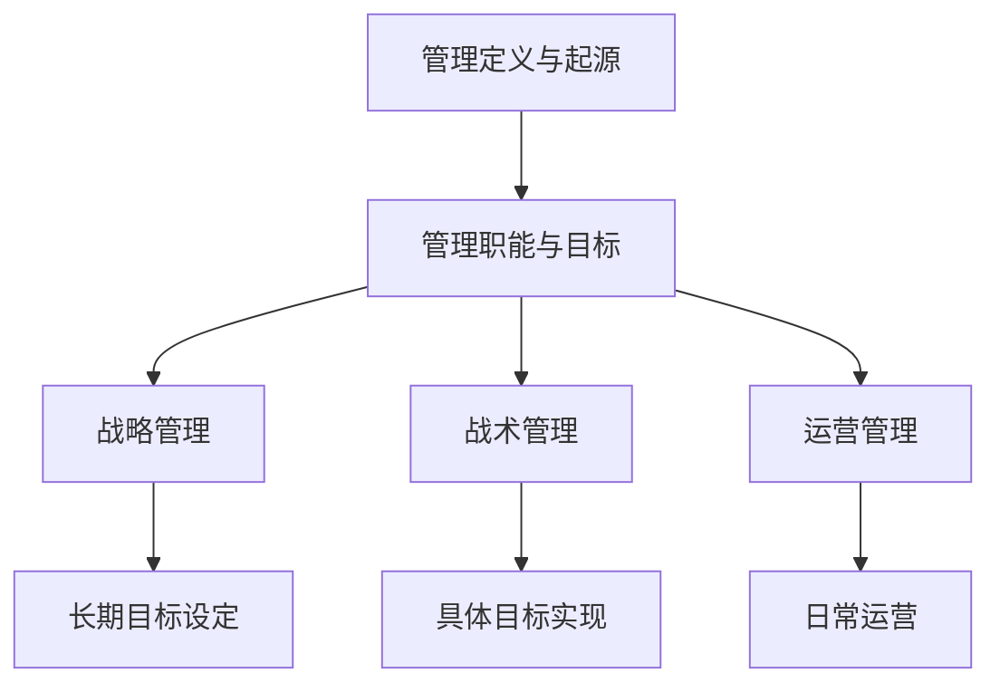
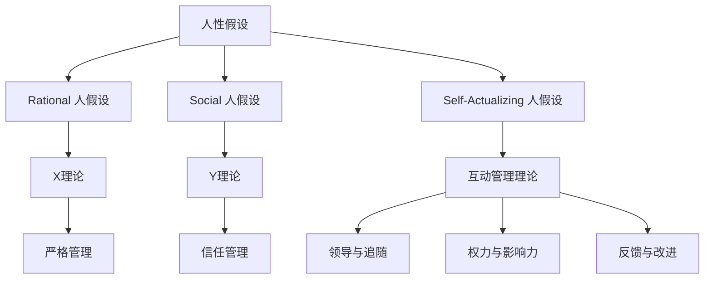
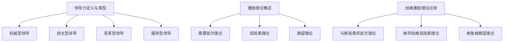
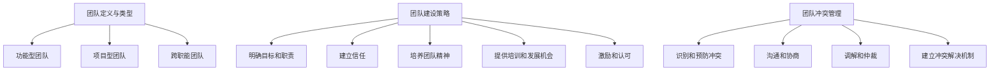
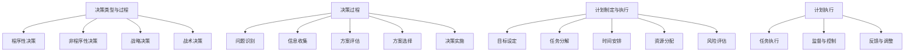
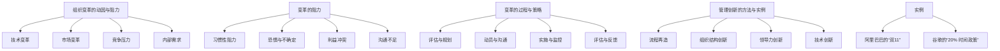
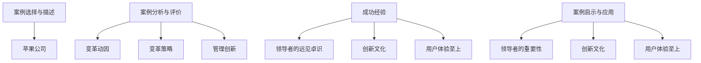
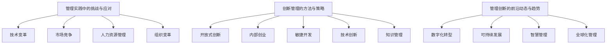

                 

### 文章标题

《管理之道：激发人性的善意和潜能》

> **关键词**：人性、管理理论、激励、领导力、团队建设、组织变革

**摘要**：
本文旨在深入探讨管理之道的核心，即如何通过理解和激发人性的善意与潜能来提升管理效果。文章从管理的基本概念出发，逐步剖析了人性假设与管理理论、领导力与激励理论等基础理论。接着，文章转向管理实践，探讨了团队建设、决策与计划、组织变革等实际操作层面。通过真实案例分析和前沿动态，本文揭示了管理实践的挑战与创新路径。最后，附录部分提供了常用的管理工具与方法，为读者提供了全面的管理资源与参考资料。

---

### 《管理之道：激发人性的善意和潜能》目录大纲

**第一部分：管理基础理论**

- **第1章：管理的基本概念**
  - 1.1 管理的定义与起源
  - 1.2 管理的职能与目标
  - 1.3 管理的层次与组织结构

- **第2章：人性与管理理论**
  - 2.1 人性假设与理论
  - 2.2 X理论和Y理论
  - 2.3 互动管理理论

- **第3章：领导力与激励理论**
  - 3.1 领导力的定义与类型
  - 3.2 激励理论概述
  - 3.3 经典激励理论及其应用

**第二部分：管理实践**

- **第4章：团队建设与管理**
  - 4.1 团队的定义与类型
  - 4.2 团队建设策略
  - 4.3 团队冲突管理

- **第5章：决策与计划**
  - 5.1 决策的类型与过程
  - 5.2 决策制定的影响因素
  - 5.3 计划的制定与执行

- **第6章：组织变革与管理创新**
  - 6.1 变革的动因与阻力
  - 6.2 变革的过程与策略
  - 6.3 管理创新的方法与实例

**第三部分：管理案例与应用**

- **第7章：企业管理案例分析**
  - 7.1 案例选择与描述
  - 7.2 案例分析与评价
  - 7.3 案例启示与应用

- **第8章：管理实践与创新**
  - 8.1 管理实践中的挑战与应对
  - 8.2 创新管理的方法与策略
  - 8.3 管理创新的前沿动态与趋势

**附录：管理工具与方法**

- **附录 A：常用管理工具**
  - A.1 SWOT分析
  - A.2 五力分析
  - A.3 平衡计分卡

- **附录 B：管理资源与参考资料**
  - B.1 推荐阅读书籍
  - B.2 在线课程与资源
  - B.3 学术期刊与研究报告

---

接下来，我们将逐步深入每个章节，通过逻辑清晰、结构紧凑、简单易懂的专业技术语言，详细探讨管理的核心理论和实践。

### 第1章：管理的基本概念

**1.1 管理的定义与起源**

管理（Management）是一门科学，也是一种艺术。它涉及一系列规划、组织、领导、控制等活动的总和，旨在通过合理配置和利用资源，以实现特定目标。从历史的角度来看，管理的概念起源于人类社会的协作与分工。

在古代，管理主要体现在军事和农业领域。例如，古希腊和古罗马时期的军事组织形式，以及农业社会中的土地管理和分配。随着工业革命的到来，管理逐渐从经验性走向科学性。弗雷德里克·泰勒（Frederick Taylor）提出了科学管理理论，强调通过科学方法来提高劳动生产率。亨利·福特（Henry Ford）则通过流水线生产方式，极大地提升了生产效率。

**1.2 管理的职能与目标**

管理的主要职能包括规划、组织、领导、控制和决策。这些职能相互关联，共同构成了管理过程。

- **规划（Planning）**：规划是指为实现组织目标，制定具体的行动方案。它涉及目标设定、资源分配、时间安排等。

- **组织（Organizing）**：组织是指将资源进行合理的配置，以实现规划目标。它包括组织结构设计、岗位设置、权责分配等。

- **领导（Leading）**：领导是指通过激励、引导和协调，使团队成员为实现组织目标而努力。领导不仅仅是发号施令，更重要的是激发团队的潜能。

- **控制（Controlling）**：控制是指通过监测和评估实际绩效，与既定目标进行对比，确保组织运行在正确轨道上。控制包括预算控制、质量控制、进度控制等。

- **决策（Decision-making）**：决策是指在面对不确定性时，选择最佳的行动方案。决策过程包括问题识别、信息收集、方案评估和选择。

管理的主要目标是实现组织的使命和愿景。这些目标通常包括：

- **效率（Efficiency）**：在给定资源约束下，实现最大化产出。
- **效果（Effectiveness）**：实现既定目标和价值。
- **公平（Equity）**：确保组织内部公平和公正。

**1.3 管理的层次与组织结构**

管理可以分为三个层次：战略管理、战术管理和运营管理。

- **战略管理（Strategic Management）**：战略管理是最高层次的管理活动，它涉及长期目标设定、资源规划和市场定位等。战略管理的目标是确保组织在未来能够持续发展。

- **战术管理（Tactical Management）**：战术管理是介于战略管理和运营管理之间的层次，它涉及具体目标的实现和资源的优化配置。战术管理的目标是确保战略目标的实现。

- **运营管理（Operational Management）**：运营管理是最低层次的管理活动，它涉及日常运营和流程管理。运营管理的目标是确保组织高效运作。

组织结构是指组织中各部门、岗位之间的关系和协作方式。常见的组织结构包括职能型结构、矩阵型结构和网络型结构等。

- **职能型结构**：职能型结构是按照职能划分部门，各部门负责人直接向总经理汇报。
- **矩阵型结构**：矩阵型结构是将职能型结构和项目型结构相结合，既保留了职能分工的优势，又实现了项目团队的灵活性。
- **网络型结构**：网络型结构是一种更加灵活的组织形式，它通过外包、合作和联盟等方式，将资源整合起来，以实现组织目标。

---

**本章小结**：

本章介绍了管理的基本概念，包括定义与起源、职能与目标、层次与组织结构。通过理解这些基本概念，我们可以更好地把握管理的核心，为后续章节的深入探讨打下基础。

**Mermaid 流程图**：

---

### 第2章：人性与管理理论

**2.1 人性假设与理论**

人性假设是管理理论的基础。不同的管理理论基于对人性的不同假设，形成了不同的管理方法和策略。

- **理性人假设**：理性人假设认为，人们总是以最大化自身利益为目标，进行决策和行动。这一假设来源于经济学中的理性经济人理论。在管理实践中，理性人假设常用于激励机制的设定。

- **社会人假设**：社会人假设认为，人们不仅关注个人利益，还关注社会利益和团队利益。这一假设强调了人际关系和团队合作的重要性。在管理实践中，社会人假设常用于团队建设和沟通策略。

- **自我实现人假设**：自我实现人假设认为，人们有自我实现的需求，追求个人成长和自我价值。这一假设强调了自我驱动和内在激励的重要性。在管理实践中，自我实现人假设常用于员工发展和激励机制。

**2.2 X理论和Y理论**

X理论和Y理论是两种典型的管理理论，分别基于不同的人性假设。

- **X理论**：X理论认为，人们懒惰、缺乏责任心，需要严格的管理和控制来驱动工作。X理论的管理策略包括严厉的监督、明确的规章制度和惩罚机制。

- **Y理论**：Y理论认为，人们是积极、有责任心的，有自我驱动和自我管理的能力。Y理论的管理策略包括信任、授权和激励机制。

**2.3 互动管理理论**

互动管理理论强调管理者和员工之间的互动关系。这种理论认为，管理不仅是一种单向的指令和执行过程，更是一种双向的沟通和互动过程。

- **领导与追随的关系**：互动管理理论认为，领导者和追随者之间存在一种互动关系。领导者通过沟通、激励和引导，激发追随者的潜力，实现共同的目标。

- **权力与影响力的互动**：互动管理理论认为，权力不仅仅是管理者的特权，更是双方通过互动和沟通，共同实现组织目标的过程。

- **反馈与改进的循环**：互动管理理论强调反馈的重要性。通过持续的反馈和改进，管理者和员工可以不断调整和优化管理行为，提高管理效果。

---

**本章小结**：

本章介绍了人性假设与管理理论，包括理性人假设、社会人假设和自我实现人假设。接着，我们探讨了X理论和Y理论，以及互动管理理论。通过理解这些理论，我们可以更好地把握人性的本质，为有效的管理提供理论依据。

**Mermaid 流�图**：

---

### 第3章：领导力与激励理论

**3.1 领导力的定义与类型**

领导力（Leadership）是一种通过影响和激励他人，共同实现组织目标的能力。领导力不仅仅是一种职位特权，更是一种个人素质和技能。

- **权威型领导**：权威型领导强调领导者的权威和地位，通过指令和惩罚来管理团队。

- **民主型领导**：民主型领导强调参与和共识，通过讨论和决策来管理团队。

- **变革型领导**：变革型领导强调创新和变革，通过激发员工的潜力和创造力来推动组织发展。

- **服务型领导**：服务型领导强调领导者的服务精神，通过关注员工需求和提升员工能力来管理团队。

**3.2 激励理论概述**

激励（Motivation）是指激发员工内在动力，使其为实现组织目标而努力的过程。激励理论是管理理论的重要组成部分。

- **需要层次理论**：需要层次理论认为，人的需求分为生理、安全、社交、尊重和自我实现五个层次。只有当前一层需求得到满足后，才会追求更高层次的需求。

- **双因素理论**：双因素理论认为，工作满意度和工作不满意度分别由内在激励因素和外在激励因素决定。内在激励因素包括成就感、认可和责任感，外在激励因素包括薪酬、工作条件和晋升机会。

- **期望理论**：期望理论认为，员工的激励程度取决于他们对目标达成可能性的期望值。期望理论的核心公式为：激励力 = 期望值 × 力量值。

**3.3 经典激励理论及其应用**

- **马斯洛的需求层次理论**：马斯洛的需求层次理论认为，人的需求从低到高分为生理需求、安全需求、社交需求、尊重需求和自我实现需求。管理者可以通过满足员工的低层次需求，激发其高层次需求，从而提高员工的工作满意度和绩效。

- **赫茨伯格的双因素理论**：赫茨伯格的双因素理论认为，内在激励因素和外在激励因素共同影响员工的工作满意度。管理者应该关注员工的内在激励，如提供富有挑战性的工作任务、认可员工的成就等，同时提供外在激励，如合理的薪酬和晋升机会。

- **弗鲁姆的期望理论**：弗鲁姆的期望理论认为，员工的激励程度取决于他们对目标达成可能性的期望值。管理者可以通过设定明确的目标、提供支持和资源，提高员工的期望值，从而激发其内在动力。

---

**本章小结**：

本章介绍了领导力的定义与类型，以及激励理论的概述和经典激励理论的应用。通过理解领导力和激励理论，管理者可以更好地激发员工的潜力，提高组织的绩效。

**Mermaid 流程图**：

---

### 第4章：团队建设与管理

**4.1 团队的定义与类型**

团队（Team）是指由两个或两个以上成员组成的，为实现共同目标而相互协作的群体。团队不同于个人，它强调集体智慧和协作效率。

- **功能型团队**：功能型团队是根据工作职能划分的团队，如研发团队、市场团队等。

- **项目型团队**：项目型团队是为了完成特定项目而组建的团队，通常具有临时性和任务导向性。

- **跨职能团队**：跨职能团队是由来自不同部门和职能领域的成员组成的团队，旨在实现跨部门的协同工作。

**4.2 团队建设策略**

团队建设是指通过一系列措施，提高团队的协作效率和工作绩效的过程。有效的团队建设策略包括以下几个方面：

- **明确目标和职责**：明确团队的目标和每个成员的职责，确保团队成员都清楚自己的任务和期望。

- **建立信任**：通过开放沟通、相互支持和共同经历，建立团队成员之间的信任关系。

- **培养团队精神**：通过共同活动、团队竞赛和团队建设活动，培养团队精神和归属感。

- **提供培训和发展机会**：为团队成员提供培训和发展机会，提高其技能和能力，增强团队的竞争力。

- **激励和认可**：通过激励和认可机制，激发团队成员的积极性和创造力，提高团队绩效。

**4.3 团队冲突管理**

团队冲突（Team Conflict）是指团队成员在目标、方法、利益等方面存在分歧和对抗。有效的团队冲突管理策略包括以下几个方面：

- **识别和预防冲突**：通过定期沟通、反馈和评估，识别潜在的冲突点，并采取预防措施。

- **沟通和协商**：通过开放沟通和协商，让团队成员表达自己的观点和需求，找到共同点和解决方案。

- **调解和仲裁**：当冲突无法通过协商解决时，可以通过调解和仲裁的方式，确保公平公正地处理冲突。

- **建立冲突解决机制**：建立明确的冲突解决机制，为团队成员提供解决问题的渠道和资源。

---

**本章小结**：

本章介绍了团队的定义与类型，以及团队建设策略和团队冲突管理。通过有效的团队建设和管理，可以增强团队的协作效率和绩效，提高组织的整体竞争力。

**Mermaid 流程图**：

---

### 第5章：决策与计划

**5.1 决策的类型与过程**

决策（Decision-making）是管理过程中至关重要的环节。决策的类型可以分为以下几种：

- **程序性决策**：程序性决策是针对日常运营中重复性问题的决策。这类决策有明确的流程和方法，可以通过程序化决策模型解决。

- **非程序性决策**：非程序性决策是针对非日常运营中的复杂问题的决策。这类决策通常没有固定的流程和方法，需要依靠决策者的经验和判断。

- **战略决策**：战略决策是针对组织长期发展方向和目标的决策。这类决策涉及资源分配、市场定位和竞争策略等。

- **战术决策**：战术决策是针对短期目标的决策，通常涉及具体的执行方案和资源调配。

决策过程包括以下几个阶段：

- **问题识别**：通过监测和分析数据，识别出需要解决的问题。

- **信息收集**：收集与问题相关的信息，包括内部数据和外部数据。

- **方案评估**：根据问题的性质和目标，制定多个可能的解决方案，并进行评估。

- **方案选择**：根据评估结果，选择最佳方案。

- **决策实施**：将决策方案付诸实施，并进行跟踪和评估。

**5.2 决策制定的影响因素**

决策制定受到多种因素的影响，包括：

- **环境因素**：环境因素包括市场需求、竞争态势和政策法规等。这些因素会影响决策的制定和实施。

- **组织因素**：组织因素包括组织文化、组织结构和资源分配等。这些因素会影响决策的制定和执行。

- **个体因素**：个体因素包括决策者的个人素质、经验和判断力等。这些因素会影响决策的质量和效果。

**5.3 计划的制定与执行**

计划（Planning）是决策的具体化，是将决策方案转化为可操作的行动计划。计划的制定包括以下几个步骤：

- **目标设定**：明确组织的目标和预期成果。

- **任务分解**：将目标分解为具体的任务和工作内容。

- **时间安排**：为每个任务分配时间，并制定时间表。

- **资源分配**：根据任务需求，分配所需的资源，包括人力、物力和财力。

- **风险评估**：评估计划实施过程中可能出现的风险，并制定应对措施。

计划的执行包括以下几个环节：

- **任务执行**：按照计划安排，执行每个任务。

- **监督与控制**：对任务执行情况进行监控，确保计划按计划进行。

- **反馈与调整**：根据执行情况，及时反馈和调整计划，确保目标实现。

---

**本章小结**：

本章介绍了决策的类型与过程，以及决策制定的影响因素。接着，我们探讨了计划的制定与执行。通过有效的决策和计划，可以确保组织目标的实现，提高管理效果。

**Mermaid 流程图**：

---

### 第6章：组织变革与管理创新

**6.1 变革的动因与阻力**

组织变革（Organizational Change）是指组织为适应外部环境或内部需求，进行的一系列结构、文化、流程等方面的调整。变革的动因包括以下几个方面：

- **技术变革**：随着技术的快速发展，组织需要不断更新和改进技术，以保持竞争力。

- **市场变革**：市场环境的变化，如新兴市场的出现、消费者需求的变化等，要求组织进行变革以适应市场变化。

- **竞争压力**：面对激烈的竞争，组织需要通过变革来提升自身的竞争力和市场份额。

- **内部需求**：组织内部的资源分配、团队协作、企业文化等方面的问题，也需要通过变革来解决。

变革过程中，常见的阻力包括以下几个方面：

- **习惯性阻力**：员工习惯于现有的工作方式和流程，不愿意改变。

- **恐惧与不确定**：员工对新环境和新要求感到恐惧和不确定，担心变革带来的风险。

- **利益冲突**：变革可能会影响某些人的利益，导致他们产生抵触情绪。

- **沟通不足**：变革过程中，如果沟通不足或沟通不畅，会导致员工对变革产生误解和抵触。

**6.2 变革的过程与策略**

组织变革是一个复杂的过程，通常包括以下几个阶段：

- **评估与规划**：对组织现状进行分析，确定变革的必要性和目标，制定变革计划。

- **动员与沟通**：通过内部沟通和动员，让员工了解变革的必要性和目标，增强员工对变革的认同感。

- **实施与监控**：按照变革计划，逐步实施变革措施，并对变革过程进行监控，确保变革按计划进行。

- **评估与反馈**：对变革效果进行评估，收集员工的反馈，不断调整和优化变革措施。

有效的组织变革策略包括以下几个方面：

- **领导力**：领导者需要发挥核心作用，明确变革的方向和目标，激励员工积极参与变革。

- **沟通**：通过有效的沟通，让员工了解变革的必要性和目标，增强员工对变革的认同感。

- **培训与支持**：为员工提供必要的培训和支持，帮助他们适应新环境和新要求。

- **激励机制**：通过激励机制，激励员工积极参与变革，提高变革的成效。

**6.3 管理创新的方法与实例**

管理创新（Management Innovation）是指组织通过引入新的管理理念、方法和技术，提高管理效率和效果。管理创新的方法包括以下几个方面：

- **流程再造**：通过重新设计和管理流程，提高工作效率和灵活性。

- **组织结构创新**：通过调整组织结构，优化部门职能和岗位设置，提高组织效率。

- **领导力创新**：通过培养创新型和领导力强的员工，推动组织变革和管理创新。

- **技术创新**：通过引入新技术，提高管理效率和质量。

实例：

- **阿里巴巴的“双11”**：阿里巴巴通过“双11”购物节，将线上购物与技术创新相结合，创造了巨大的销售业绩。这不仅提升了品牌影响力，还推动了供应链和物流的变革。

- **谷歌的“20% 时间政策”**：谷歌推出了“20% 时间政策”，允许员工将20% 的工作时间用于自己感兴趣的项目。这一政策激发了员工的创新精神，推动了谷歌在搜索、广告等方面的创新。

---

**本章小结**：

本章介绍了组织变革的动因与阻力，变革的过程与策略，以及管理创新的方法与实例。通过有效的组织变革和管理创新，组织可以适应外部环境的变化，提高管理效率和效果，实现持续发展。

**Mermaid 流程图**：

---

### 第7章：企业管理案例分析

**7.1 案例选择与描述**

本案例选取了全球知名科技公司——苹果公司（Apple Inc.）。苹果公司成立于1976年，由史蒂夫·乔布斯（Steve Jobs）、斯蒂夫·沃兹尼亚克（Steve Wozniak）和罗恩·韦恩（Ron Wayne）共同创立。苹果公司以其创新的产品和卓越的设计，在科技行业中享有盛誉。本案例将分析苹果公司的组织变革和管理创新，探讨其在管理实践中的成功经验。

**7.2 案例分析与评价**

**组织变革**：

- **变革动因**：随着科技行业的快速发展，苹果公司面临着激烈的竞争和市场的不断变化。为了保持竞争优势，苹果公司需要不断进行组织变革。

- **变革策略**：
  - **领导力**：苹果公司的领导者史蒂夫·乔布斯具有强烈的变革意愿和远见卓识，他推动了苹果公司的多次重大变革。
  - **创新文化**：苹果公司鼓励创新，为员工提供自由和开放的工作环境，激发员工的创造力。
  - **流程优化**：苹果公司通过优化研发、生产和营销等流程，提高运营效率。

**管理创新**：

- **产品创新**：苹果公司始终坚持产品创新，推出了一系列具有革命性的产品，如iPod、iPhone和iPad等，引领了全球科技潮流。

- **用户体验**：苹果公司注重用户体验，通过简洁美观的设计和人性化的交互，提升了用户的满意度和忠诚度。

- **供应链管理**：苹果公司通过全球化的供应链管理，实现了高效的资源配置和灵活的生产能力。

**成功经验**：

- **领导者的远见卓识**：苹果公司的领导者具有远见卓识，能够准确把握市场趋势，推动公司变革和创新。

- **创新文化**：苹果公司鼓励创新，为员工提供自由和开放的工作环境，激发了员工的创造力。

- **用户体验至上**：苹果公司注重用户体验，通过人性化的设计和服务，提升了用户的满意度和忠诚度。

**7.3 案例启示与应用**

- **领导者的重要性**：领导者是组织变革和创新的核心力量，他们的远见卓识和领导能力直接影响组织的变革效果。

- **创新文化**：建立创新文化是推动组织变革和持续发展的关键，企业应鼓励创新，为员工提供自由和开放的工作环境。

- **用户体验至上**：关注用户体验是企业赢得市场和用户的关键，企业应不断优化产品和服务，提升用户体验。

---

**本章小结**：

通过分析苹果公司的案例，我们可以看到其在组织变革和管理创新方面的成功经验。领导者的重要性、创新文化和用户体验至上是苹果公司成功的关键因素。这些经验对于其他企业在管理实践中的应用具有重要的启示和借鉴意义。

**Mermaid 流程图**：

---

### 第8章：管理实践与创新

**8.1 管理实践中的挑战与应对**

在管理实践中，企业面临诸多挑战，包括技术变革、市场竞争、人力资源管理和组织变革等。针对这些挑战，企业可以采取以下策略：

- **技术变革**：
  - **挑战**：技术变革速度加快，企业需要不断更新和引入新技术。
  - **应对**：企业应加强技术研发和创新，培养技术人才，与外部技术合作伙伴建立合作关系，保持技术领先优势。

- **市场竞争**：
  - **挑战**：市场竞争激烈，企业需要不断提高产品和服务质量。
  - **应对**：企业应通过市场调研，了解客户需求，优化产品和服务，加强品牌建设和市场营销。

- **人力资源管理**：
  - **挑战**：人力资源管理面临员工流动、技能提升和企业文化建设等问题。
  - **应对**：企业应制定合理的人力资源政策，提供培训和发展机会，关注员工需求和满意度，建立积极向上的企业文化。

- **组织变革**：
  - **挑战**：组织变革过程中，员工可能产生抵触情绪，变革效果不确定。
  - **应对**：企业应加强领导力建设，确保领导者在变革中的核心作用，通过有效的沟通和激励，增强员工对变革的认同感。

**8.2 创新管理的方法与策略**

创新管理（Innovation Management）是企业持续发展的重要驱动力。以下方法与策略有助于企业实现创新：

- **开放式创新**：开放式创新是指企业与外部合作伙伴共同开展创新活动，通过外部资源和技术引入，提升企业创新能力。

- **内部创业**：内部创业是指企业内部团队独立开展创新项目，通过内部竞争和激励，激发员工创新潜力。

- **敏捷开发**：敏捷开发是一种以用户需求为导向的开发方法，通过快速迭代和持续改进，提高产品开发效率和质量。

- **技术创新**：技术创新是企业保持竞争优势的关键，企业应投入资源，研发和应用新技术，推动产业升级。

- **知识管理**：知识管理是指企业通过收集、存储、共享和应用知识，提高知识利用效率，促进创新和持续发展。

**8.3 管理创新的前沿动态与趋势**

管理创新的前沿动态和趋势主要包括以下几个方面：

- **数字化转型**：随着数字技术的发展，企业正加速推进数字化转型，通过云计算、大数据、人工智能等新技术，提高运营效率和管理水平。

- **可持续发展**：企业越来越关注可持续发展，通过绿色生产、环保技术和社会责任，实现经济、社会和环境的协调发展。

- **智慧管理**：智慧管理是指通过物联网、大数据、人工智能等新技术，实现智能化管理和决策，提高管理效率和效果。

- **全球化管理**：全球化管理是企业应对全球市场竞争的必然选择，企业应加强跨文化沟通和协作，实现全球资源的优化配置。

---

**本章小结**：

本章介绍了管理实践中的挑战与应对策略，探讨了创新管理的方法与策略，并分析了管理创新的前沿动态与趋势。通过有效的管理实践和创新，企业可以应对挑战，实现持续发展。

**Mermaid 流程图**：

---

### 附录 A：常用管理工具

**A.1 SWOT分析**

SWOT分析是一种常用的战略规划工具，用于评估组织的优势（Strengths）、劣势（Weaknesses）、机会（Opportunities）和威胁（Threats）。通过SWOT分析，组织可以明确自身的竞争地位，制定相应的战略规划。

**A.2 五力分析**

五力分析（Five Forces Analysis）是由迈克尔·波特（Michael Porter）提出的一种竞争战略工具，用于分析行业结构，评估行业的竞争强度。五力分析包括行业内的竞争者、潜在进入者、供应商、买家和替代品。

**A.3 平衡计分卡**

平衡计分卡（Balanced Score Card，BSC）是一种绩效管理工具，用于衡量组织的绩效和战略实施情况。平衡计分卡从财务、客户、内部业务和学习与成长四个维度，全面评估组织的绩效，确保战略目标的实现。

---

**附录 B：管理资源与参考资料**

**B.1 推荐阅读书籍**

1. 《管理的实践》（Peter Drucker）
2. 《企业变革七步骤》（John P. Kotter）
3. 《第五项修炼》（Peter Senge）

**B.2 在线课程与资源**

1. Coursera - Management and Leadership
2. edX - Organizational Change and Leadership
3. LinkedIn Learning - Project Management

**B.3 学术期刊与研究报告**

1. Harvard Business Review
2. Journal of Management Studies
3. Academy of Management Journal

---

### 作者信息

**作者：AI天才研究院/AI Genius Institute & 禅与计算机程序设计艺术 /Zen And The Art of Computer Programming** 

---

通过本文的探讨，我们深入分析了管理之道，从基础理论到实践应用，再到前沿动态，全方位地展示了管理的核心和精髓。希望通过本文，读者能够更好地理解管理的本质，激发人性的善意和潜能，实现组织的目标和愿景。在未来的管理实践中，让我们继续探索和创新，共同推动组织的发展与进步。

