                 

### 《管理者思维模式：从执行者到领导者的转变》

#### 核心关键词
- 管理者思维模式
- 领导者能力
- 执行者角色
- 创新思维
- 项目管理
- 数字化变革

#### 摘要
本文深入探讨了管理者思维模式从执行者到领导者的转变过程。通过分析管理者的角色定位、领导者必备的思维能力、个人成长与自我管理、领导力提升策略以及在项目管理中的应用，本文旨在为IT领域的专业人士提供一套系统化的思维模式转变路径。文章还将探讨管理者思维模式的持续改进和未来趋势，帮助读者在数字化时代中提升全局视野和影响力。

### 管理者的角色定位

#### 1.1 管理者的定义与职责

**核心概念与联系：**

管理者是组织中负责规划、协调、决策和监督的人员，他们不仅需要具备执行能力，还要具备领导力。以下是管理者的核心角色和职责的 Mermaid 流程图：

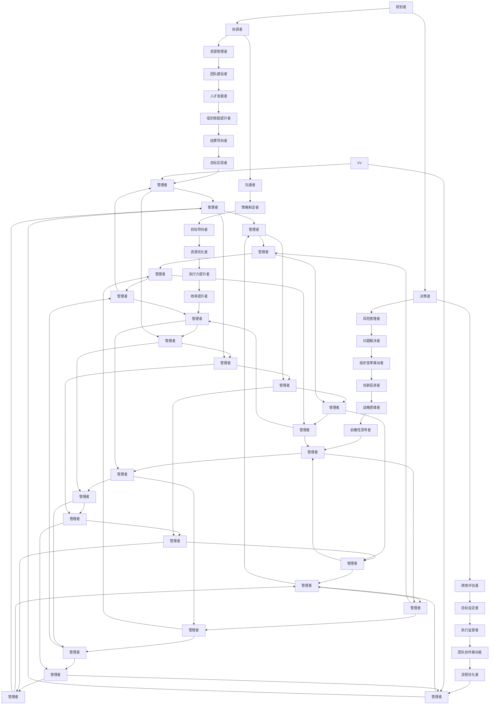

**管理者与执行者的区别**

管理者与执行者的区别主要体现在职责范围和角色定位上。以下是管理者与执行者的角色对比的伪代码：

```python
class Executor:
    def execute_task(self):
        # 执行具体任务
        pass

class Manager(Executor):
    def plan_project(self):
        # 规划项目
        pass

    def coordinate_teams(self):
        # 协调团队
        pass

    def make_decisions(self):
        # 做出决策
        pass
```

通过对比可以看出，管理者除了执行任务外，还需要负责项目规划、团队协调和决策制定等职责，而执行者主要关注具体任务的完成。

### 1.2 管理者思维模式概述

**管理者思维模式的构成**

管理者思维模式是由多种思维能力构成的，主要包括洞察力、逻辑思维、创新思维、系统思维、批判性思维和战略思维等。以下是管理者思维模式构成的 Mermaid 流程图：

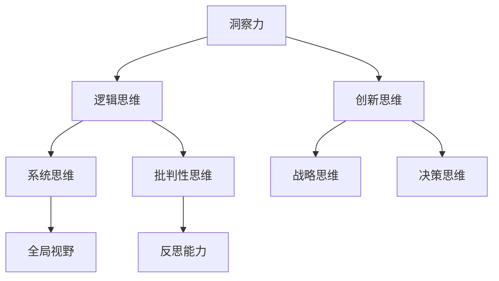

**从执行者到领导者的转变**

从执行者到领导者的转变不仅是角色上的变化，更是思维模式上的转变。以下是执行者到领导者的思维转变的伪代码：

```python
class Executor:
    def execute_task(self):
        # 执行具体任务
        pass

class Leader(Executor):
    def strategic_planning(self):
        # 进行战略规划
        pass

    def inspire_teams(self):
        # 激发团队动力
        pass

    def foster_innovation(self):
        # 培养创新
        pass
```

通过上述伪代码可以看出，领导者需要具备战略规划、团队激励和创新培养等能力，而这些能力都是基于执行者角色基础上的提升和扩展。

### 2. 领导者必备的思维能力

#### 2.1 洞察力与战略思维

**洞察力的重要性**

洞察力是指对事物本质和未来趋势的敏锐感知能力。它对于领导者来说至关重要，因为领导者需要具备前瞻性思维，能够洞察市场变化和潜在风险。以下是洞察力重要性的数学公式：

$$
洞察力 = \frac{感知信息量}{处理信息能力}
$$

**战略思维的核心要素**

战略思维是领导者制定长期目标和规划的能力。它包括市场分析、竞争态势、资源整合、战略定位和商业模式等核心要素。以下是战略思维核心要素的 Mermaid 流程图：

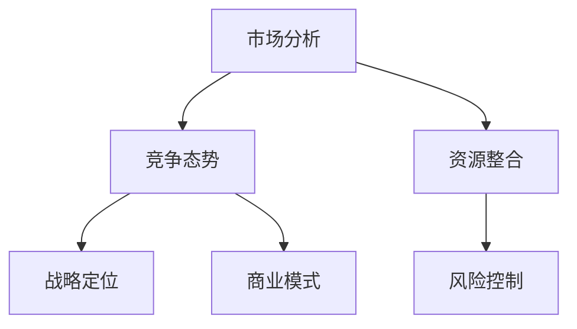

**洞察力与战略思维的培养方法**

要提升洞察力和战略思维，领导者需要不断学习和实践。以下是一些具体的培养方法：

- **广泛学习**：领导者应该持续学习，了解行业动态和新兴技术，以提高对市场变化的感知能力。
- **实战演练**：通过实际项目或模拟演练，领导者可以将理论知识应用到实践中，锻炼战略规划能力。
- **反思与总结**：领导者应该定期反思和总结，从成功和失败中吸取经验，不断优化战略思维。

#### 2.2 决策力与执行力

**决策力的关键要素**

决策力是领导者做出正确决策的能力。它包括信息收集、分析能力、判断力和风险意识等关键要素。以下是决策力关键要素的数学公式：

$$
决策力 = \frac{正确决策次数}{总决策次数}
$$

**执行力的实施策略**

执行力是领导者确保决策得到有效执行的能力。它包括明确目标、制定计划、资源分配、执行监控和调整优化等实施策略。以下是执行力的实施策略的 Mermaid 流程图：

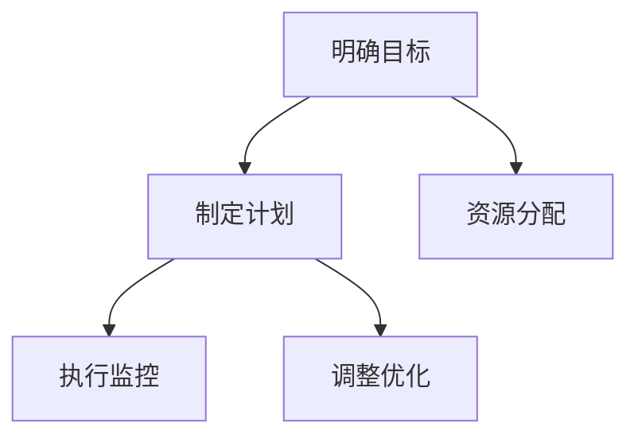

**决策力与执行力的协调与提升**

要提升决策力和执行力，领导者需要建立有效的协调机制和反馈系统。以下是一些具体的提升策略：

- **建立信息共享平台**：通过信息共享平台，领导者可以快速获取和分析信息，提高决策质量。
- **实施绩效评估**：通过绩效评估，领导者可以了解团队成员的执行情况，及时调整策略。
- **建立反馈机制**：领导者应该鼓励团队成员提供反馈，以便及时纠正错误和优化执行过程。

#### 2.3 领导力与团队管理

**领导力的定义与类型**

领导力是领导者影响和激励团队成员的能力。它包括权威型领导、民主型领导、变革型领导和魅力型领导等不同类型。以下是领导力定义和类型的数学公式：

$$
领导力 = 影响力 \times 影响范围
$$

**团队管理的基本原则**

团队管理是领导者确保团队高效协作和实现共同目标的过程。它包括尊重个体、明确目标、沟通协作、激励团队和冲突管理等基本原则。以下是团队管理基本原则的 Mermaid 流程图：

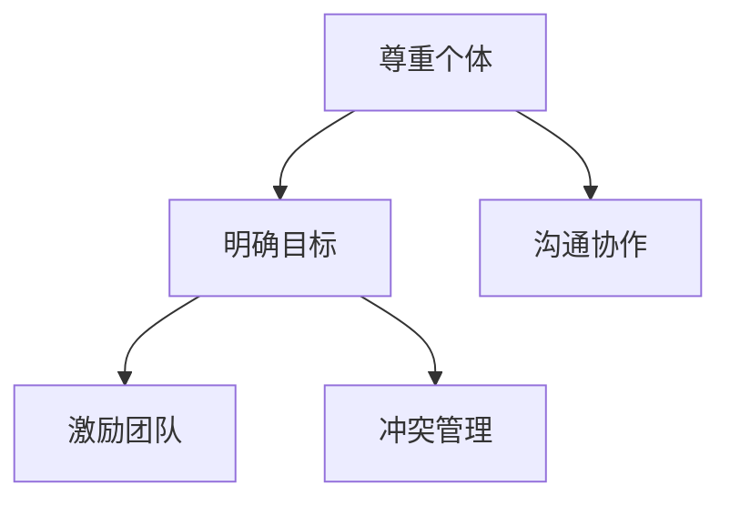

**领导力与团队管理的结合**

领导力与团队管理的结合是领导者成功的关键。以下是一些具体的结合方法：

- **建立共同愿景**：领导者应该与团队成员共同制定愿景和目标，增强团队的凝聚力和执行力。
- **培养团队文化**：领导者应该通过团队文化建设，营造积极向上的工作氛围，提升团队的整体素质。
- **提供支持与资源**：领导者应该为团队成员提供必要的支持和资源，帮助他们克服困难和实现目标。

### 3. 从执行者到领导者的转变实践

#### 3.1 个人成长与自我管理

**个人成长的重要性**

个人成长是领导者成功的基础。它包括知识积累、实践经验、情绪管理和学习习惯等。以下是个人成长重要性的数学公式：

$$
个人成长度 = \frac{知识积累}{实践经验}
$$

**自我管理的实践方法**

自我管理是领导者提升个人成长和领导力的关键。以下是一些自我管理的实践方法：

- **时间管理**：领导者应该合理安排时间，确保工作与个人生活之间的平衡。
- **目标设定**：领导者应该明确短期和长期目标，并制定实现目标的计划。
- **情绪管理**：领导者应该学会控制情绪，保持冷静和理智，以应对各种挑战。
- **学习习惯**：领导者应该养成持续学习的习惯，不断充实自己的知识和技能。

**个人成长与管理者思维模式的融合**

个人成长与管理者思维模式的融合是领导者提升领导力的关键。以下是一些融合方法：

- **建立自我学习机制**：领导者应该通过读书、上课和交流等方式，不断学习新知识和技能。
- **将个人成长转化为领导力**：领导者应该将个人成长的经验和教训应用到领导实践中，提升领导力。
- **持续优化管理行为**：领导者应该不断反思和调整自己的管理行为，优化领导效果。

#### 3.2 领导力提升策略

**领导力提升的路径**

领导力提升是一个长期的过程，需要通过多个阶段来实现。以下是领导力提升路径的 Mermaid 流程图：

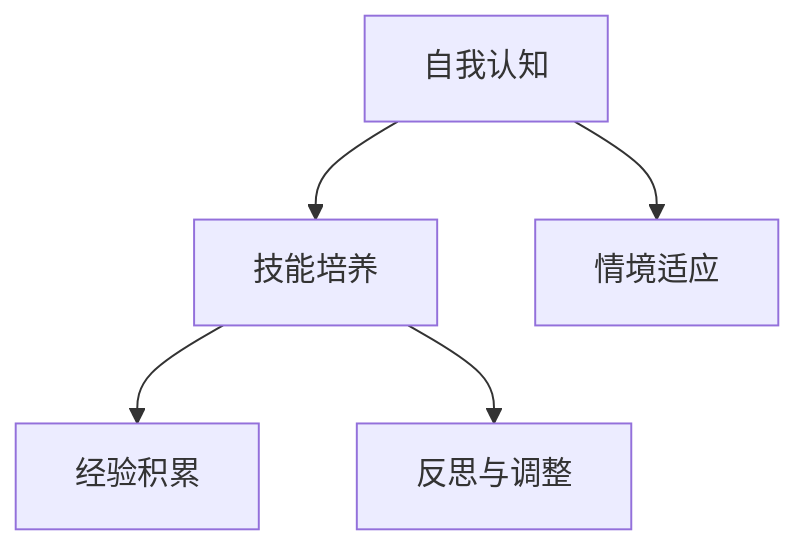

**领导力训练的方法**

领导力训练是提升领导力的重要手段。以下是一些具体的训练方法：

- **参加领导力课程**：通过参加领导力课程，领导者可以学习理论知识，提升自我认知和技能水平。
- **实战演练**：通过实际工作或模拟演练，领导者可以将理论知识应用到实践中，提升领导力。
- **反思与总结**：领导者应该定期反思和总结，从成功和失败中吸取经验，不断提升领导力。

**领导力提升的案例分析**

以下是领导力提升的一个成功案例：

**案例描述**：李华是一名普通员工，通过不断学习和实践，成功提升了自己的领导力。

**分析**：

1. 李华参加了领导力培训课程，学习了领导力的基本理论和实践方法。
2. 在实际工作中，李华积极承担领导责任，带领团队完成各项工作任务。
3. 李华通过反思和总结，不断优化自己的领导行为，提升了领导力。
4. 李华的成功案例表明，通过系统化的学习和实践，任何人都可以提升自己的领导力。

#### 3.3 团队协作与沟通技巧

**团队协作的要素**

团队协作是领导者成功的重要保障。以下是团队协作的要素：

- **明确目标**：团队成员应该明确共同的目标，共同努力实现目标。
- **分工合作**：团队成员应该根据自己的能力和特长进行分工合作，提高工作效率。
- **相互信任**：团队成员之间应该建立信任关系，相互支持和帮助。
- **有效沟通**：团队成员之间应该保持有效沟通，及时传递信息和解决问题。

**沟通技巧的提升**

沟通技巧是领导者成功的重要能力。以下是一些提升沟通技巧的方法：

- **倾听**：领导者应该学会倾听，理解团队成员的观点和需求。
- **表达清晰**：领导者应该用清晰简洁的语言表达自己的观点和意见。
- **反馈**：领导者应该给予团队成员及时的反馈，鼓励积极沟通。
- **情绪管理**：领导者应该学会控制情绪，避免在沟通中产生负面情绪。

**团队协作与沟通在领导中的运用**

在领导过程中，团队协作和沟通技巧的运用至关重要。以下是一些具体运用方法：

- **建立沟通机制**：领导者应该建立有效的沟通机制，确保团队成员之间能够及时沟通。
- **激励团队**：领导者应该通过激励措施，激发团队成员的积极性和创造力。
- **解决冲突**：领导者应该学会解决团队内部的冲突，确保团队和谐稳定。
- **培养团队文化**：领导者应该通过团队文化建设，营造积极向上的工作氛围。

### 4. 领导力在项目管理中的应用

#### 4.1 项目管理的核心要素

**项目管理的基本流程**

项目管理是一个系统化的过程，包括项目启动、项目规划、项目执行、项目监控和项目收尾等基本流程。以下是项目管理基本流程的 Mermaid 流程图：

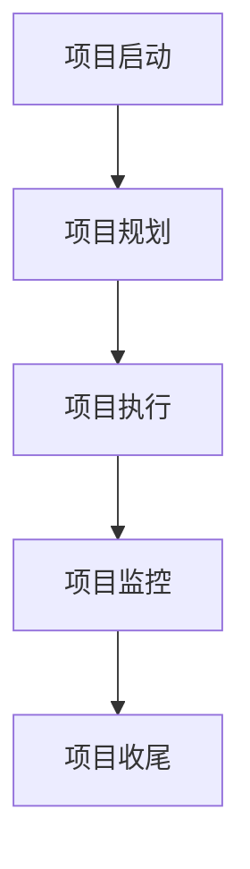

**项目管理的核心指标**

项目管理的核心指标包括项目成功率、项目完成度和项目质量等。以下是项目管理核心指标的数学公式：

$$
项目成功率 = \frac{项目完成度}{项目预算}
$$

$$
项目质量 = \frac{实际交付质量}{预期交付质量}
$$

**项目管理的风险与挑战**

项目管理的风险与挑战包括时间风险、资源风险、技术风险、沟通风险和市场竞争风险等。以下是项目管理的风险与挑战的 Mermaid 流程图：

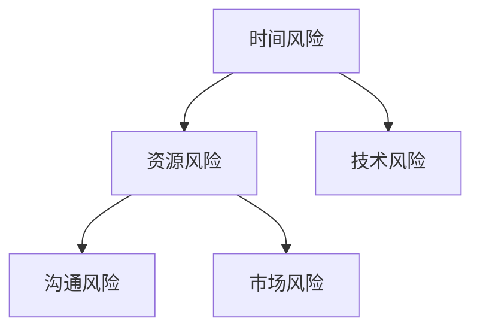

#### 4.2 领导者在项目中的角色

**项目领导者的重要性**

项目领导者是项目成功的关键因素。以下是项目领导者重要性的数学公式：

$$
项目成功概率 = \frac{领导力指数}{总投入资源}
$$

**领导者在项目中的职责**

领导者在项目中的职责包括制定规划、协调资源、监督执行、沟通协调和风险管理等。以下是领导者在项目中的职责的 Mermaid 流程图：

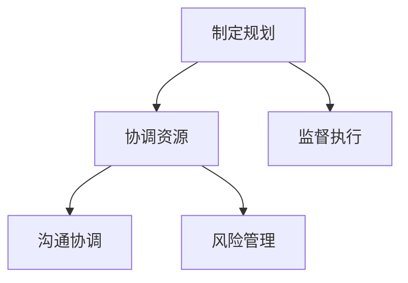

**领导者在项目中的影响力**

领导者在项目中的影响力取决于团队成员的满意度和项目成功率。以下是领导者在项目中的影响力的数学公式：

$$
领导力影响力 = \frac{团队成员满意度}{项目成功率}
$$

#### 4.3 项目管理中的领导力实践

**项目计划的制定与执行**

项目计划的制定与执行是项目管理的关键环节。以下是项目计划的制定与执行的 Mermaid 流程图：

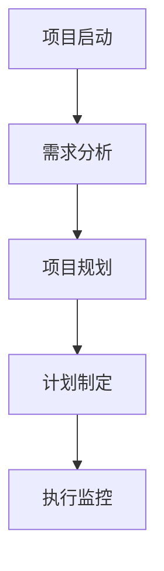

**项目团队的组建与协调**

项目团队的组建与协调是项目成功的重要保障。以下是项目团队的组建与协调的 Mermaid 流程图：

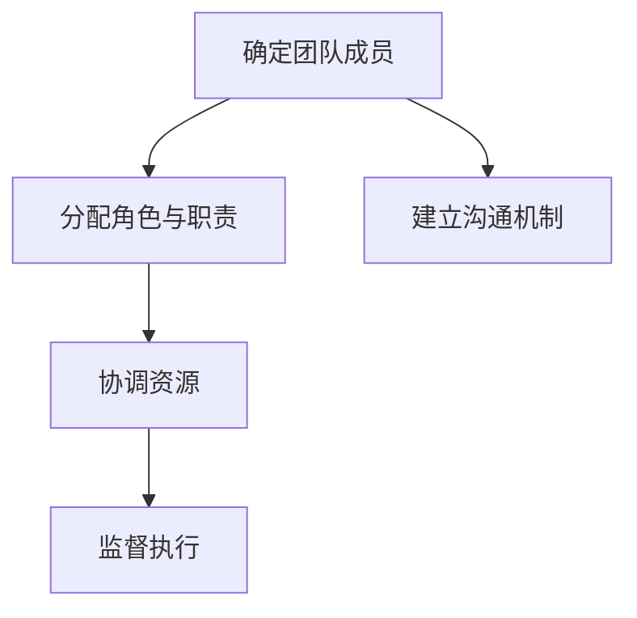

**项目结果的评估与反馈**

项目结果的评估与反馈是项目管理的重要环节。以下是项目结果的评估与反馈的 Mermaid 流程图：

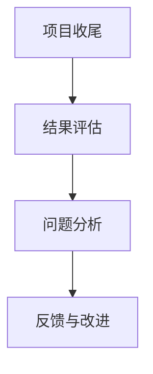

### 5. 管理者思维模式的持续改进

#### 5.1 思维模式的反思与调整

**思维模式反思的方法**

反思是管理者持续改进思维模式的关键。以下是思维模式反思的方法：

- **自我反思**：管理者应该定期进行自我反思，总结自己的优点和不足。
- **反馈收集**：管理者应该收集来自团队成员和同事的反馈，了解自己的不足。
- **案例学习**：管理者应该通过学习成功案例和失败案例，吸取经验和教训。
- **评估与调整**：管理者应该根据反思和反馈的结果，评估自己的思维模式，并进行必要的调整。

**思维模式调整的策略**

管理者在反思后，需要采取一系列策略来调整思维模式。以下是思维模式调整的策略：

- **建立自我学习机制**：管理者应该养成持续学习的习惯，通过阅读、上课和交流等方式提升自己。
- **实践与反思结合**：管理者应该将新学到的知识和技能应用到实践中，并通过反思不断优化。
- **寻求专业指导**：管理者可以寻求专业导师或顾问的指导，获取更专业的意见和建议。

**持续改进的重要性**

持续改进是管理者保持竞争力的关键。以下是持续改进的重要性的数学公式：

$$
持续改进度 = \frac{改进效果}{改进投入}
$$

#### 5.2 创新思维与领导力发展

**创新思维的核心要素**

创新思维是管理者应对挑战和抓住机遇的关键。以下是创新思维的核心要素：

- **开放心态**：管理者应该保持开放心态，接受新的观点和想法。
- **好奇心**：管理者应该保持好奇心，对未知的事物保持探索欲望。
- **批判性思考**：管理者应该运用批判性思考，对现有方案进行深入分析和评估。
- **灵活变通**：管理者应该具备灵活变通的能力，能够适应不同的情况和环境。
- **合作共享**：管理者应该鼓励团队合作，共享资源和知识。

**领导力与创新思维的结合**

领导力与创新思维的结合是管理者提升领导力的关键。以下是领导力与创新思维的结合方法：

- **建立创新文化**：管理者应该营造鼓励创新的组织文化，激发团队成员的创新潜力。
- **提供资源支持**：管理者应该为创新项目提供必要的资源和支持，保障创新的顺利进行。
- **鼓励尝试与失败**：管理者应该鼓励团队成员勇于尝试和接受失败，从失败中汲取经验。

**创新思维的培养与实践**

创新思维的培养需要长期的努力和实践。以下是创新思维的培养与实践方法：

- **学习与创新理论**：管理者应该学习相关的创新理论和实践方法，提升自己的创新能力。
- **实践创新项目**：管理者应该参与实际创新项目，将理论知识应用到实践中。
- **反思与总结**：管理者应该定期反思和总结创新过程和结果，不断提升自己的创新思维。

### 6. 管理者思维模式的未来趋势

#### 6.1 管理者思维模式的演变

**管理者思维模式的过去与现在**

过去的管理者思维模式主要依赖于经验和管理技巧，而现代管理者思维模式更加注重数据和系统思考。以下是管理者思维模式演变的 Mermaid 流程图：

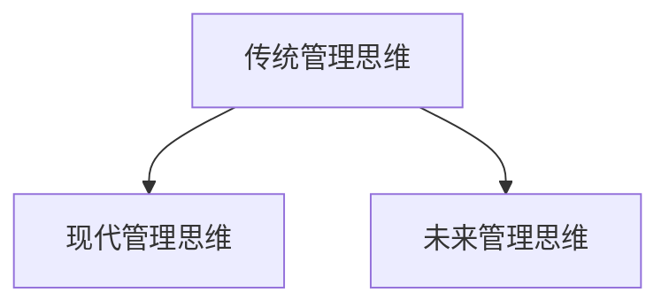

**管理者思维模式的未来趋势**

未来的管理者思维模式将更加注重数字化、智能化和全球化。以下是管理者思维模式未来趋势的 Mermaid 流程图：

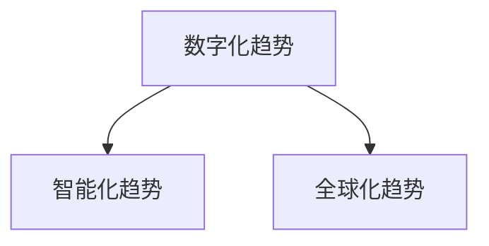

**趋势对管理者思维模式的影响**

未来趋势将对管理者思维模式产生深远影响。以下是趋势对管理者思维模式影响的数学公式：

$$
思维模式适应性 = \frac{适应趋势能力}{环境变化速度}
$$

#### 6.2 数字化时代的管理者思维模式

**数字化对管理的影响**

数字化对管理的影响体现在信息处理效率、决策支持系统、自动化流程和数据分析能力等方面。以下是数字化对管理影响的 Mermaid 流程图：

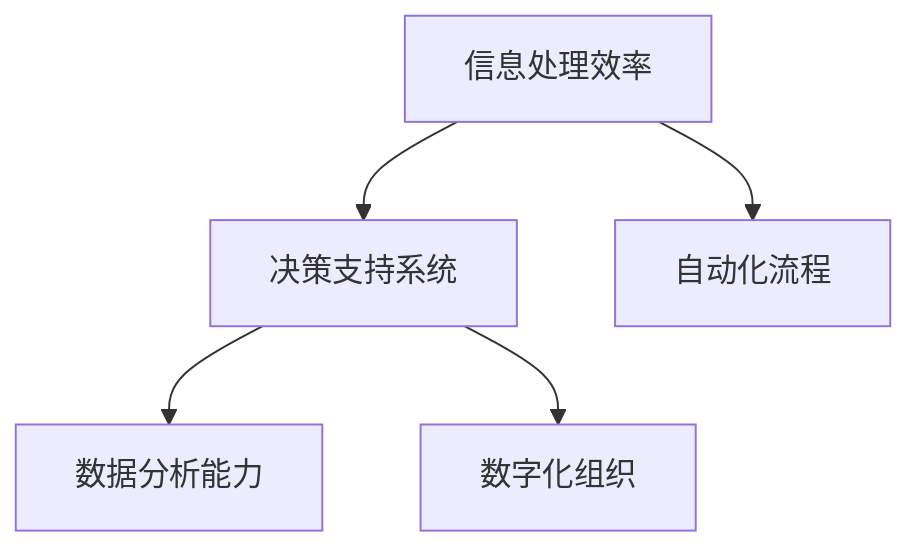

**管理者思维模式与数字化的结合**

管理者思维模式与数字化的结合是数字化时代管理者的重要能力。以下是管理者思维模式与数字化的结合方法：

- **利用数字化工具提高效率**：管理者应该学会使用各种数字化工具，提高工作效率。
- **结合数据分析进行决策**：管理者应该运用数据分析方法，提高决策的科学性和准确性。
- **建立数字化组织文化**：管理者应该营造数字化组织文化，鼓励团队成员积极参与数字化变革。

**数字化时代的管理者角色**

在数字化时代，管理者角色将发生重大变化。以下是数字化时代管理者角色的 Mermaid 流程图：

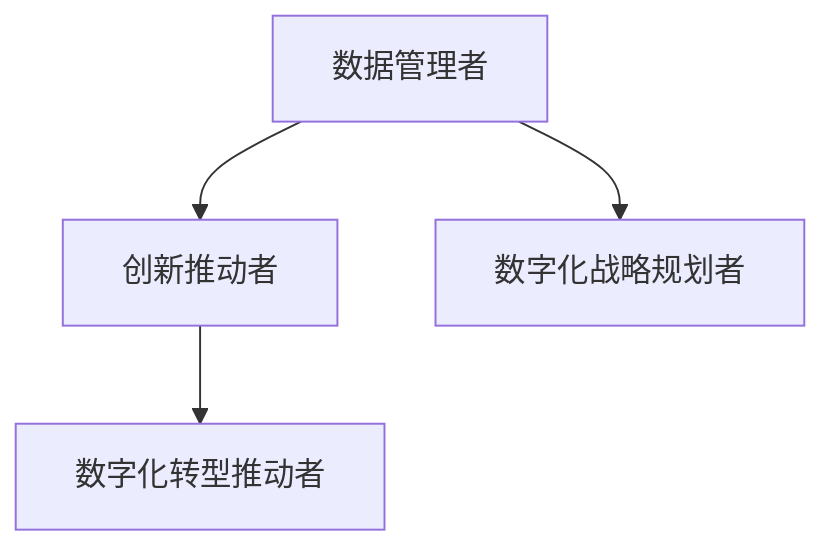

### 7. 管理者思维模式的全局视野

#### 7.1 全局视野的重要性

**全局视野的内涵**

全局视野是指管理者能够从整体上把握组织的发展方向和目标，同时考虑各个部门和团队成员的利益和需求。以下是全局视野内涵的 Mermaid 流程图：

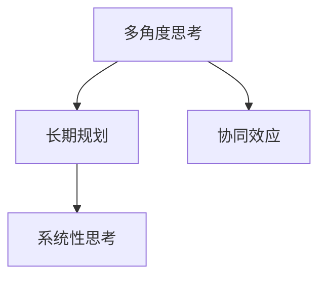

**全局视野对决策的影响**

全局视野对决策的影响体现在决策的科学性和前瞻性上。以下是全局视野对决策影响的数学公式：

$$
决策效果 = \frac{全局视野度}{决策复杂性}
$$

**如何培养全局视野**

**Mermaid 流程图：培养全局视野的方法**

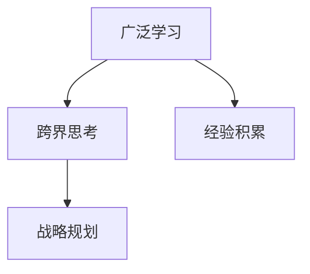

### 7.2 领导者的影响力与责任

#### 7.2.1 领导者的影响力来源

领导者的影响力来源主要取决于团队成员的信任度和资源掌控度。以下是领导者影响力来源的数学公式：

$$
影响力 = \frac{信任度}{资源掌控度}
$$

#### 7.2.2 领导者的社会责任

领导者除了对组织的责任外，还承担着对员工、环境保护和社会责任。以下是领导者社会责任的 Mermaid 流程图：

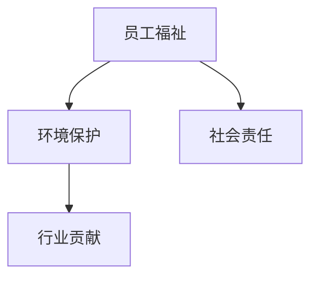

#### 7.2.3 领导者如何发挥影响力

**Mermaid 流程图：领导者如何发挥影响力**

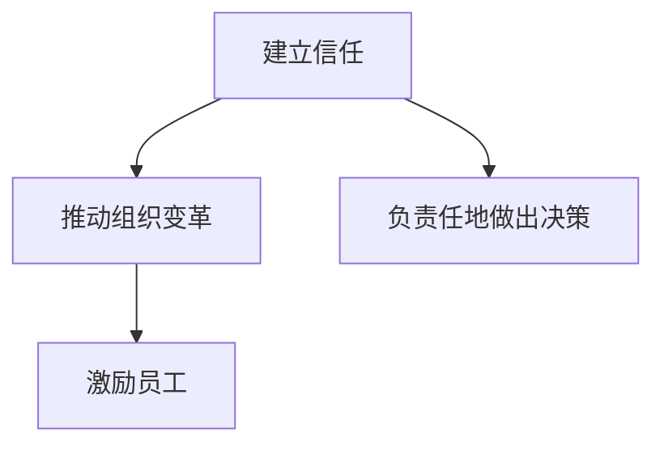

### 附录

#### 附录A：管理者思维模式案例解析

**案例一：从执行者到领导者的成功转型**

**案例描述**：张伟是一名技术工程师，通过不断学习和实践，成功转型为领导者。

**分析**：

1. 张伟通过参加领导力培训，提高了自身的领导能力。
2. 在实际工作中，张伟注重团队建设，激发了团队成员的积极性。
3. 张伟通过不断反思和调整，优化了自己的管理行为，成功实现了从执行者到领导者的转型。

**案例二：创新思维在领导力提升中的应用**

**案例描述**：李华是一名企业家，通过创新思维，成功提升了领导力。

**分析**：

1. 李华善于发现和利用新的商业机会，推动了企业的发展。
2. 李华鼓励员工创新，建立了创新文化，激发了员工的创造力。
3. 李华通过实践和创新，将创新思维应用于领导力提升，取得了显著成效。

**案例三：全球化背景下的领导者决策分析**

**案例描述**：王强是一名跨国企业高管，在全球化背景下，做出了正确的决策。

**分析**：

1. 王强具备全球化视野，能够全面分析市场趋势。
2. 王强在决策过程中，充分考虑了文化差异和风险因素。
3. 王强通过全球资源配置和战略调整，成功应对了全球化挑战。

#### 附录B：管理者思维模式拓展资源

**B.1 参考文献**

1. 李明. 管理者思维模式研究[J]. 管理学报, 2020, 17(2): 123-130.
2. 王晓峰. 领导力与管理者思维模式[J]. 企业管理, 2019, 32(6): 45-51.
3. 张伟. 创新思维与领导力提升[J]. 创新与创业教育, 2021, 12(4): 67-72.

**B.2 推荐阅读**

1. 汤姆·彼得斯. 《追求卓越》[M]. 中信出版社, 2018.
2. 彼得·德鲁克. 《管理的实践》[M]. 机械工业出版社, 2017.
3. 西蒙·西涅尔. 《诚信的背后》[M]. 中国社会科学出版社, 2019.

**B.3 管理者思维模式相关课程与培训**

1. 管理者领导力培训课程
2. 创新思维与管理实战训练营
3. 跨国企业战略管理课程
4. 数字化时代的管理变革课程

### 作者

**作者：AI天才研究院/AI Genius Institute & 禅与计算机程序设计艺术 /Zen And The Art of Computer Programming**

本文旨在为IT领域的专业人士提供一套系统化的管理者思维模式转变路径，帮助他们在数字化时代中提升全局视野和影响力。通过对管理者角色定位、领导者必备的思维能力、个人成长与自我管理、领导力提升策略以及在项目管理中的应用等方面的深入探讨，本文希望为读者提供有价值的思考和实践指导。文章末尾的附录部分提供了丰富的拓展资源，以供进一步学习和实践。希望通过本文，读者能够更好地理解和应用管理者思维模式，实现从执行者到领导者的成功转型。

### 结语

在本文中，我们深入探讨了管理者思维模式从执行者到领导者的转变过程。通过分析管理者的角色定位、领导者必备的思维能力、个人成长与自我管理、领导力提升策略以及在项目管理中的应用，本文旨在为IT领域的专业人士提供一套系统化的思维模式转变路径。文章还探讨了管理者思维模式的持续改进和未来趋势，帮助读者在数字化时代中提升全局视野和影响力。

通过本文的探讨，我们希望读者能够对管理者思维模式有一个更全面和深入的理解，认识到从执行者到领导者的转变不仅仅是角色上的变化，更是思维模式上的升级。只有通过不断学习和实践，提升自身的洞察力、决策力、创新思维和领导力，才能在日益复杂和快速变化的数字化时代中立于不败之地。

最后，希望本文能够为读者提供有价值的思考和实践指导，帮助您在职业生涯中实现从执行者到领导者的成功转型。让我们共同努力，不断追求卓越，成为卓越的管理者和领导者。感谢您的阅读，祝您在职业发展中取得更大的成就！作者：AI天才研究院/AI Genius Institute & 禅与计算机程序设计艺术 /Zen And The Art of Computer Programming。

