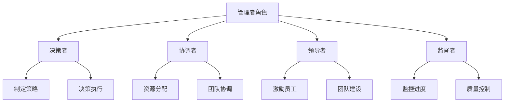
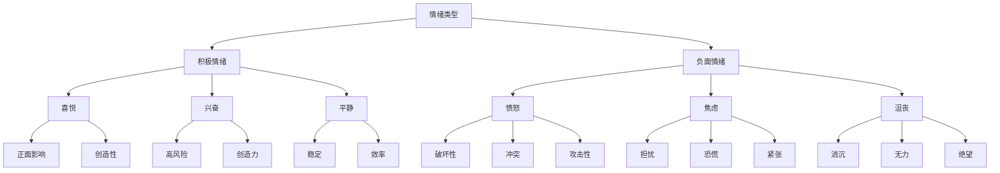

                 

## 《管理者的自我反思与成长》

### 关键词：管理者，自我反思，成长，领导力，团队建设

### 摘要：

在当今快速变化和竞争激烈的工作环境中，管理者需要不断地进行自我反思与成长，以适应新的挑战和机遇。本文系统地探讨了管理者的自我认知、自我反思的方法与工具、情绪管理、个人成长规划、能力提升策略、沟通能力提升、团队管理与领导力、成功管理者的成长路径、管理者的成长困境与突破、持续成长与自我超越，以及管理工具与方法等内容。通过详细的分析和案例讲解，本文旨在帮助管理者提升自身的领导力和团队管理能力，实现个人与团队的双重成长。

### 第一部分：自我认识与自我反思

#### 第1章：管理者的自我认知

作为管理者的第一步是明确自己的角色和职责。以下是一个简单的Mermaid流程图，展示了管理者的角色与职责：



**1.1 管理者角色与职责**

管理者是组织中至关重要的角色，其职责涵盖了决策、协调、领导和监督等方面。具体来说，管理者的角色包括：

- **决策者**：管理者需要制定组织的目标和策略，并在面临问题时做出决策。
- **协调者**：管理者需要协调团队内部以及与其他部门之间的工作，确保资源的合理分配和高效利用。
- **领导者**：管理者需要激励和培养团队成员，提升团队的整体绩效。
- **监督者**：管理者需要监控项目的进展，确保工作质量和进度的控制。

**1.2 自我评价与自我定位**

自我评价是管理者成长过程中的重要一环。以下是一个自我评价算法的伪代码示例，用于评估管理者的各项能力：

```python
def self_evaluation():
    scores = {
        'knowledge': input("请为知识水平打分（1-10分）: "),
        'communication': input("请为沟通能力打分（1-10分）: "),
        'teamwork': input("请为团队协作能力打分（1-10分）: "),
        'decisionMaking': input("请为决策能力打分（1-10分）: ")
    }
    average_score = sum(scores.values()) / len(scores)
    if average_score >= 8:
        print("您的综合评价较高，继续努力！")
    elif average_score >= 5:
        print("您的综合评价一般，需要提升能力。")
    else:
        print("您的综合评价较低，需要认真反思并改进。")
```

**1.3 管理风格与领导力**

管理风格是管理者在管理过程中表现出来的行为和态度。不同的管理风格会对团队绩效产生不同的影响。以下是一个基于决策树的管理风格数学模型：

$$
\text{管理风格} =
\begin{cases}
\text{权威型管理风格} & \text{如果员工满意度} \leq 5 \text{且} \text{业绩目标达成率} \geq 90\% \\
\text{参与型管理风格} & \text{如果员工满意度} > 5 \text{且} \text{业绩目标达成率} < 90\% \\
\text{支持型管理风格} & \text{如果员工满意度} \leq 5 \text{且} \text{业绩目标达成率} < 90\% \\
\text{民主型管理风格} & \text{如果员工满意度} > 5 \text{且} \text{业绩目标达成率} \geq 90\% \\
\end{cases}
$$

### 第2章：自我反思的方法与工具

#### 2.1 反思日记与反思会议

**2.1.1 反思日记**

反思日记是管理者记录自身工作经历、反思工作过程和总结经验的一种方法。以下是一个反思日记的案例：

```plaintext
2023年2月18日 星期五

今天我在会议上对项目进度进行了汇报，发现对于一些潜在风险的预估不足。反思如下：

- 问题识别：对项目风险的评估不够细致，导致部分任务延误。
- 原因分析：缺乏对项目执行细节的全面了解，对团队成员的工作状态和进度掌握不足。
- 解决方案：增加与团队成员的沟通频率，及时了解工作进展和问题，提前制定应对方案。
```

**2.1.2 反思会议**

反思会议是一种团队活动，旨在通过讨论和反思，总结工作经验，提出改进措施。以下是一个反思会议的纪要：

```plaintext
2023年2月25日 星期五

本周召开了反思会议，针对上周项目进度延误的问题进行了讨论。会议纪要如下：

- 问题总结：项目进度延误的主要原因是风险评估不足和沟通不畅。
- 改进措施：
  - 提高风险评估的细致程度，制定更详细的计划。
  - 建立有效的沟通机制，确保信息传递的及时性和准确性。
- 后续跟进：定期检查改进措施的实施情况，确保问题得到有效解决。
```

#### 2.2 反思日志的应用

反思日志是一种记录和管理反思信息的工具。以下是一个简单的Python类，用于创建和管理反思日志：

```python
class ReflectiveJournal:
    def __init__(self):
        self.entries = []

    def add_entry(self, entry):
        self.entries.append(entry)

    def print_entries(self):
        for entry in self.entries:
            print(entry)

# 创建反思日志实例
journal = ReflectiveJournal()

# 添加日志条目
journal.add_entry("2023年2月18日：对项目风险预估不足，需提高细节掌握。")
journal.add_entry("2023年2月25日：召开反思会议，针对上周问题制定改进措施。")

# 打印日志条目
journal.print_entries()
```

#### 2.3 反思评估与反馈

反思评估是管理者通过评估自身工作表现，识别优势和不足，制定改进计划的过程。以下是一个反思评估报告的示例：

```plaintext
评估时间：2023年3月1日

- 目标达成度：项目进度达成率为85%，低于预期目标。
- 问题识别：项目初期风险评估不足，导致部分任务延误；团队内部沟通不畅，影响了项目进度的及时调整。
- 改进措施：
  - 加强项目风险评估，提高预测准确性。
  - 建立有效的沟通机制，确保信息传递的及时性和准确性。
- 反馈：收到团队成员的反馈，表示对改进措施的支持，并提出了具体的执行建议。
```

### 第3章：情绪管理

#### 3.1 情绪的类型与影响

情绪是人们对于特定情境的内心体验和生理反应。以下是一个情绪类型的分类图，展示了不同类型的情绪及其影响：



**3.1.1 情绪对管理的影响**

情绪对管理者的决策、沟通和领导力都有重要影响。以下是一个简单的情绪影响模型：

$$
\text{情绪影响} =
\begin{cases}
\text{积极情绪} & \text{提高决策效率、沟通效果和团队凝聚力} \\
\text{负面情绪} & \text{降低决策质量、沟通效果和团队凝聚力} \\
\end{cases}
$$

#### 3.2 情绪管理的技巧

情绪管理是管理者在面对压力和挑战时，通过调整自身情绪状态，保持积极心态和有效工作能力的过程。以下是一些情绪管理的技巧：

**3.2.1 正念冥想**

正念冥想是一种通过专注呼吸和身体感受，减轻压力和焦虑的方法。以下是一个正念冥想的步骤：

1. 找一个安静的环境，坐直或舒适地站立。
2. 关闭眼睛，深呼吸，感受呼吸的进出。
3. 将注意力集中在呼吸上，如果思绪漂移，温和地将注意力带回到呼吸上。
4. 持续10-15分钟，逐渐增加时间。
5. 结束时，缓慢地移动身体，慢慢睁开眼睛。

**3.2.2 情绪记录**

情绪记录是管理者通过记录情绪体验，了解情绪变化和规律的方法。以下是一个情绪记录的模板：

```plaintext
日期：____年__月__日

- 情绪类型：____
- 情绪描述：____
- 情绪原因：____
- 情绪影响：____
- 解决方案：____
```

#### 3.3 情绪在管理中的运用

情绪在管理中的运用是管理者通过理解和管理自身情绪，以及团队成员的情绪，提升团队绩效的过程。以下是一些情绪在管理中的运用策略：

**3.3.1 情绪识别**

情绪识别是管理者通过观察和倾听，识别团队成员情绪状态的过程。以下是一个情绪识别的步骤：

1. 观察身体语言：注意团队成员的表情、姿势和眼神等身体语言。
2. 倾听言语：注意团队成员的言语表达和语调变化。
3. 调查反馈：通过一对一的沟通，了解团队成员的真实情绪。

**3.3.2 情绪调节**

情绪调节是管理者通过调整自身情绪状态，以适应工作环境和压力的过程。以下是一些情绪调节的技巧：

1. **深呼吸**：通过深呼吸，缓解紧张和焦虑。
2. **积极思考**：通过积极思考，改变消极情绪。
3. **寻求支持**：通过寻求他人的帮助和支持，减轻情绪压力。

**3.3.3 情绪领导力**

情绪领导力是管理者通过理解和管理自身情绪，以及团队成员的情绪，提升团队绩效的过程。以下是一些情绪领导力的策略：

1. **建立信任**：通过建立信任，减少团队成员的情绪压力。
2. **积极沟通**：通过积极沟通，缓解团队成员的情绪问题。
3. **激励与认可**：通过激励和认可，提升团队成员的情绪状态。

### 第4章：个人成长规划

#### 4.1 成长目标设定

成长目标设定是管理者通过明确个人成长方向和目标，制定具体行动计划的过程。以下是一个成长目标设定的案例：

**4.1.1 成长目标设定**

1. **明确目标**：设定具体、可衡量和可实现的目标。
   - 例如：提高团队的项目交付效率。
2. **制定策略**：确定实现目标的策略和方法。
   - 例如：通过优化项目管理流程和培训团队成员来实现。
3. **执行计划**：按照行动计划执行，每天追踪进度，确保按计划进行。
4. **监控进度**：定期检查进度，与目标对比，发现偏差及时调整。
5. **评估成果**：达成目标后进行评估，总结经验教训。
6. **反馈与总结**：对成长过程进行反思，持续优化成长策略。

#### 4.2 成长路径规划

成长路径规划是管理者通过规划个人成长路径，确保目标实现的步骤。以下是一个成长路径规划的步骤：

1. **自我评估**：评估自己的知识、技能和经验，确定成长需求。
2. **设定目标**：根据成长需求，设定具体的成长目标。
3. **制定计划**：制定实现目标的详细计划，包括学习、实践和反馈环节。
4. **执行计划**：按照计划执行，确保每个环节都能按时完成。
5. **监控进度**：定期检查进度，发现偏差及时调整。
6. **评估成果**：评估成长成果，总结经验教训。
7. **调整计划**：根据评估结果，调整成长计划，确保持续成长。

#### 4.3 成长计划实施

成长计划实施是管理者将成长计划付诸实践，实现个人成长目标的过程。以下是一个成长计划实施的步骤：

1. **明确目标**：根据成长路径规划，明确具体的成长目标。
2. **制定行动计划**：制定实现目标的详细行动计划，包括学习、实践和反馈环节。
3. **执行行动计划**：按照行动计划执行，确保每个环节都能按时完成。
4. **监控进度**：定期检查进度，发现偏差及时调整。
5. **评估成果**：评估成长成果，总结经验教训。
6. **调整计划**：根据评估结果，调整成长计划，确保持续成长。

### 第5章：能力提升策略

#### 5.1 学习与培训

学习与培训是管理者通过获取新知识和技能，提升自身能力的过程。以下是一些学习与培训的方法：

**5.1.1 在线学习**

在线学习是一种通过互联网获取知识和技能的方法。以下是一些在线学习的平台：

- **Coursera**：提供各种大学课程和专业证书课程。
- **Udemy**：提供广泛的在线课程，涵盖编程、管理、营销等领域。
- **edX**：由多家知名大学合作提供的在线课程平台。

**5.1.2 书籍阅读**

书籍阅读是一种通过阅读书籍获取知识和经验的方法。以下是一些推荐的管理类书籍：

- **《高效能人士的七个习惯》**（史蒂芬·柯维）
- **《精益思想》**（詹姆斯·W·沃麦克、丹尼尔·T·琼斯）
- **《影响力》**（罗伯特·西奥迪尼）
- **《领导力的五个层次》**（约翰·C·马克斯韦尔）

**5.1.3 研讨会与讲座**

研讨会与讲座是一种通过参加研讨会和讲座，了解行业最新趋势和技术的方法。以下是一些知名的研讨会和讲座：

- **TED**：一个全球知名的演讲平台，涵盖科技、设计、教育等多个领域。
- **TEDx**：TED的延伸项目，由独立组织者举办的类似TED的讲座。
- **行业峰会**：各个行业举办的峰会和研讨会，提供行业最新动态和趋势。

#### 5.2 实践与经验积累

实践与经验积累是管理者通过实际工作，积累知识和经验的过程。以下是一些实践与经验积累的方法：

**5.2.1 项目管理**

项目管理是一种通过规划、执行和监控项目，实现项目目标的方法。以下是一些项目管理工具：

- **Jira**：用于任务跟踪和项目管理的工具。
- **Trello**：用于任务管理和团队协作的工具。
- **Asana**：用于任务管理和项目协作的工具。

**5.2.2 团队协作**

团队协作是一种通过团队协作，实现项目目标的方法。以下是一些团队协作的工具：

- **Slack**：用于团队沟通和协作的工具。
- **Microsoft Teams**：用于团队沟通和协作的工具。
- **Google Workspace**：包括文档、表格、邮件等办公工具，支持多人协作。

**5.2.3 持续改进**

持续改进是一种通过不断反思和优化，提升工作质量和效率的方法。以下是一些持续改进的方法：

- **定期反思**：定期对自己的工作过程进行反思，识别不足和改进点。
- **学习借鉴**：学习其他成功团队的管理经验和做法，借鉴并应用到自己的工作中。
- **持续优化**：不断优化工作流程和方法，提升工作效率和质量。

#### 5.3 跨部门交流与合作

跨部门交流与合作是管理者通过与其他部门合作，实现共同目标的过程。以下是一些跨部门交流与合作的方法：

**5.3.1 定期会议**

定期会议是一种通过定期召开会议，协调各部门工作的方法。以下是一个定期会议的议程：

- **项目进度汇报**：各部门汇报项目进展和问题。
- **资源需求与分配**：各部门提出资源需求，协调资源分配。
- **问题讨论与解决**：讨论项目中的问题，共同寻找解决方案。

**5.3.2 信息共享**

信息共享是一种通过共享信息，提高团队协作效率的方法。以下是一些信息共享的工具：

- **共享文档**：使用共享文档，如Google文档，实现多人实时协作。
- **内部邮件**：通过内部邮件，发送项目通知和重要信息。
- **即时通讯**：使用即时通讯工具，如Slack或Microsoft Teams，实现实时沟通。

**5.3.3 跨部门协作小组**

跨部门协作小组是一种通过设立跨部门协作小组，实现跨部门协作的方法。以下是一个跨部门协作小组的职责：

- **协调沟通**：协调各部门之间的沟通，确保信息畅通。
- **问题解决**：共同解决项目中的问题，提高项目效率。
- **资源协调**：协调各部门资源，确保项目资源充足。

### 第6章：沟通能力提升

#### 6.1 有效沟通的要素

有效沟通是管理者通过清晰、准确、及时地传达信息和意图，提高团队协作效率的过程。以下是一些有效沟通的要素：

**6.1.1 信息清晰**

信息清晰是有效沟通的基本要素。以下是一个信息清晰的要求：

- **明确目的**：在沟通前明确沟通的目的和目标，确保信息传达准确。
- **简洁明了**：使用简洁明了的语言，避免使用复杂和模糊的词汇。
- **重点突出**：在信息中突出重点，确保接收者能够快速抓住关键信息。

**6.1.2 倾听理解**

倾听理解是有效沟通的重要要素。以下是一个倾听理解的要求：

- **积极倾听**：在对方讲话时，保持注意力集中，避免打断。
- **理解意图**：通过提问和反馈，确保理解对方的意图和需求。
- **回应合适**：在对方讲话结束后，给予适当的回应，表达理解和支持。

**6.1.3 反馈及时**

反馈及时是有效沟通的关键要素。以下是一个反馈及时的要求：

- **及时反馈**：在接收信息后，及时给予反馈，确保信息传达准确。
- **正面反馈**：给予积极的反馈，鼓励对方继续努力。
- **建设性反馈**：在反馈时，提供具体的建议和改进方法，帮助对方提升。

**6.1.4 尊重对方**

尊重对方是有效沟通的重要基础。以下是一个尊重对方的要求：

- **尊重差异**：尊重对方的观点和意见，避免歧视和偏见。
- **尊重隐私**：在沟通时，尊重对方的隐私，避免泄露敏感信息。
- **尊重时间**：在沟通时，尊重对方的时间，避免拖延和浪费时间。

#### 6.2 沟通障碍与解决

沟通障碍是影响沟通效果的因素。以下是一些常见的沟通障碍和解决方法：

**6.2.1 语言障碍**

语言障碍是沟通障碍的一种。以下是一个语言障碍的解决方法：

- **学习语言**：学习对方的语言，提高语言沟通能力。
- **使用翻译**：使用翻译工具，确保信息传达准确。
- **非语言沟通**：使用非语言沟通，如肢体语言和表情，帮助对方理解意图。

**6.2.2 文化差异**

文化差异是沟通障碍的一种。以下是一个文化差异的解决方法：

- **文化培训**：参加文化培训，了解不同文化的沟通习惯和礼仪。
- **尊重差异**：尊重对方的文化和习惯，避免歧视和偏见。
- **沟通桥梁**：寻找共同的文化背景和价值观，作为沟通的桥梁。

**6.2.3 情绪因素**

情绪因素是沟通障碍的一种。以下是一个情绪因素的解决方法：

- **情绪管理**：学习情绪管理技巧，控制自己的情绪，避免情绪影响沟通。
- **积极沟通**：使用积极的沟通方式，避免负面情绪影响沟通。
- **倾听理解**：倾听对方的情绪，理解对方的意图，避免误解和冲突。

#### 6.3 情景模拟与练习

情景模拟与练习是提升沟通能力的一种方法。以下是一个情景模拟与练习的案例：

**6.3.1 情景模拟**

情景：团队中某个成员对项目进度有不同意见，需要通过沟通解决问题。

**步骤：**

1. 确定情景：明确情景背景和目标。
2. 模拟对话：模拟团队成员之间的对话，练习沟通技巧。
3. 反馈与评估：对模拟对话进行反馈和评估，识别不足和改进点。

**6.3.2 练习内容**

1. **倾听技巧**：练习积极倾听，提高倾听理解能力。
2. **表达技巧**：练习清晰表达，提高信息传达准确性。
3. **情绪管理**：练习情绪管理技巧，控制情绪影响沟通。
4. **反馈技巧**：练习给予及时、正面和建设性的反馈。

### 第7章：团队管理与领导力

#### 7.1 团队建设策略

团队建设是管理者通过建设团队，提升团队凝聚力和工作效率的过程。以下是一些团队建设策略：

**7.1.1 沟通与协作**

沟通与协作是团队建设的基础。以下是一些沟通与协作的策略：

- **定期会议**：定期召开团队会议，讨论项目进展和团队目标。
- **信息共享**：建立信息共享平台，确保信息传递畅通。
- **协作工具**：使用协作工具，如Slack、Trello等，提高团队协作效率。

**7.1.2 激励与认可**

激励与认可是团队建设的重要手段。以下是一些激励与认可的策略：

- **奖励制度**：设立奖励制度，对表现出色的团队成员进行表彰和奖励。
- **认可与赞赏**：在日常工作中，给予团队成员认可和赞赏，提高团队凝聚力。
- **职业发展**：为团队成员提供职业发展机会，激励其持续成长。

**7.1.3 团队建设活动**

团队建设活动是增强团队凝聚力和信任感的重要方式。以下是一些团队建设活动的建议：

- **团队拓展训练**：组织团队拓展训练，提高团队合作能力和沟通能力。
- **团建活动**：组织团建活动，增进团队成员之间的了解和友谊。
- **知识分享会**：定期举行知识分享会，促进团队成员之间的知识交流。

#### 7.2 领导力提升

领导力提升是管理者通过提升自身领导力，带领团队实现目标的过程。以下是一些领导力提升的策略：

**7.2.1 学习与培训**

学习与培训是提升领导力的重要途径。以下是一些学习与培训的建议：

- **参加领导力培训**：参加专业的领导力培训，学习领导力理论和实践方法。
- **阅读领导力书籍**：阅读领导力相关的书籍，学习成功领导者的经验和故事。
- **实践反思**：在实际工作中，不断实践领导力，并反思和总结经验教训。

**7.2.2 沟通与反馈**

沟通与反馈是提升领导力的重要环节。以下是一些沟通与反馈的建议：

- **积极倾听**：在沟通中，积极倾听团队成员的意见和需求，理解其意图。
- **及时反馈**：在团队成员完成任务后，及时给予反馈，肯定其成果并提出改进建议。
- **开放性沟通**：建立开放性的沟通环境，鼓励团队成员提出问题和意见。

**7.2.3 激励与引导**

激励与引导是提升领导力的重要手段。以下是一些激励与引导的建议：

- **设定目标**：为团队成员设定明确的目标，激发其工作动力。
- **提供支持**：为团队成员提供必要的支持和资源，帮助其克服困难。
- **引导发展**：引导团队成员发展自己的技能和潜力，提升其职业素养。

#### 7.3 团队绩效评估与激励

团队绩效评估与激励是管理者通过评估团队绩效，激励团队成员的过程。以下是一些团队绩效评估与激励的策略：

**7.3.1 绩效评估**

绩效评估是评估团队和团队成员工作表现的过程。以下是一些绩效评估的建议：

- **设定指标**：根据团队目标和工作内容，设定具体的绩效评估指标。
- **定期评估**：定期对团队成员和团队的整体绩效进行评估，确保绩效评估的及时性和准确性。
- **反馈与沟通**：对评估结果进行反馈和沟通，鼓励团队成员提出改进意见。

**7.3.2 激励措施**

激励措施是激励团队成员的工作动力和积极性的过程。以下是一些激励措施的建议：

- **奖励制度**：设立奖励制度，对表现出色的团队成员进行表彰和奖励。
- **晋升机会**：为团队成员提供晋升机会，激励其持续成长。
- **职业发展**：为团队成员提供职业发展机会，帮助其实现职业目标。

**7.3.3 激励文化**

激励文化是营造积极工作氛围，激发团队成员创造力和创新精神的过程。以下是一些激励文化的建议：

- **认可与赞赏**：在日常工作中，对团队成员的成就和贡献进行认可和赞赏。
- **开放性沟通**：建立开放性的沟通环境，鼓励团队成员提出问题和意见。
- **团队合作**：强调团队合作，鼓励团队成员共同完成任务，分享成果。

### 第8章：成功管理者的成长路径

#### 8.1 成功案例分析

成功管理者的成长路径是一个复杂而多样的过程，不同的人会有不同的经历和路径。以下是一个成功管理者的成长案例：

**案例背景：**

李明，一位从普通员工成长为高级管理者的成功案例。

**成长经历：**

1. **基层员工**：李明从一名普通的软件开发工程师开始，通过不断学习和努力，获得晋升机会。

2. **中层管理**：担任项目经理后，李明通过有效的团队管理和项目执行，赢得了同事和上级的认可。

3. **高层管理**：随着公司的发展，李明被提升为部门总监，负责更大范围的管理工作。

**关键因素：**

1. **持续学习**：李明注重不断学习和提升自己的专业技能和领导力。

2. **团队合作**：他擅长建立和谐的团队氛围，促进团队成员之间的合作和沟通。

3. **沟通能力**：李明具备出色的沟通技巧，能够有效地传达信息和解决问题。

4. **决策能力**：他在面对复杂问题时，能够做出明智的决策，并承担相应的责任。

**经验分享：**

1. **持续学习**：成功的管理者需要不断学习和提升自己的能力，适应快速变化的工作环境。

2. **团队合作**：建立和谐的团队氛围，促进团队成员之间的合作和沟通，是管理者成功的重要因素。

3. **沟通能力**：出色的沟通技巧能够帮助管理者有效地传达信息和解决问题，提升团队效率。

4. **决策能力**：在面对复杂问题时，能够做出明智的决策，并承担相应的责任，是管理者的重要素质。

#### 8.2 经验总结与启示

成功管理者的经验总结如下：

1. **持续学习**：在快速变化的工作环境中，持续学习和自我提升是保持竞争力的关键。

2. **团队合作**：建立和谐的团队氛围，促进团队成员之间的合作和沟通，是管理者成功的重要因素。

3. **沟通能力**：出色的沟通技巧能够帮助管理者有效地传达信息和解决问题，提升团队效率。

4. **决策能力**：在面对复杂问题时，能够做出明智的决策，并承担相应的责任，是管理者的重要素质。

5. **自我反思**：定期进行自我反思，识别自己的优点和不足，不断改进和提升自己的能力。

6. **激励与认可**：通过奖励和认可，激发员工的积极性和创造力，提高团队的整体绩效。

启示：

1. **作为管理者，要不断提升自己的能力，适应快速变化的工作环境。**

2. **关注团队建设，建立和谐的工作氛围，促进团队成员的合作和沟通。**

3. **培养出色的沟通能力和决策能力，确保能够有效地管理团队和解决复杂问题。**

4. **定期进行自我反思，识别自己的优势和不足，持续改进和提升自己的能力。**

5. **关注员工的激励和认可，激发员工的积极性和创造力，提高团队的整体绩效。**

### 第9章：管理者的成长困境与突破

#### 9.1 困境识别

管理者在成长过程中可能会遇到以下困境：

1. **角色定位不清**：初入管理岗位，可能会对自身角色和职责认识不足，导致工作混乱。

2. **沟通不畅**：缺乏有效的沟通技巧，导致信息传递不准确，影响团队协作。

3. **决策困难**：在面临复杂问题时，可能会感到决策困难，担心做出错误决策。

4. **时间管理**：缺乏有效的时间管理技巧，导致工作进度延误，影响工作效率。

5. **团队管理**：对团队管理缺乏经验，无法有效激励和培养团队成员。

6. **个人发展**：缺乏明确的个人成长规划，难以实现职业发展目标。

#### 9.2 突破策略与实践

1. **角色定位**：通过明确自己的职责和角色，制定工作计划，确保工作有序进行。

2. **沟通提升**：学习并实践沟通技巧，如积极倾听、有效反馈等，提升沟通效果。

3. **决策训练**：通过模拟决策情境，提高自己在复杂问题中的决策能力，减少决策错误。

4. **时间管理**：采用时间管理工具和方法，如番茄工作法、GTD等，提高工作效率。

5. **团队建设**：通过培训、激励和反馈，提升团队协作能力和绩效。

6. **个人规划**：制定个人成长计划，设定短期和长期目标，并持续跟踪和调整。

#### 9.3 成长困境案例分析

**案例背景：**

王强是一名刚晋升的项目经理，他在工作中遇到了一些困境。

**困境识别：**

1. **角色定位不清**：王强对项目管理职责认识不足，导致项目管理混乱。

2. **沟通不畅**：与团队成员沟通时，信息传递不准确，导致任务执行不力。

3. **决策困难**：在项目遇到问题时，王强感到决策困难，担心做出错误决策。

4. **时间管理**：缺乏有效的时间管理技巧，导致项目进度延误。

5. **团队管理**：对团队管理缺乏经验，无法有效激励和培养团队成员。

**突破策略：**

1. **角色定位**：通过与上级和团队成员沟通，明确项目管理职责，制定详细的工作计划。

2. **沟通提升**：参加沟通技巧培训，学习并实践有效的沟通方法，如积极倾听、有效反馈等。

3. **决策训练**：通过模拟决策情境，练习决策过程，提高自己在复杂问题中的决策能力。

4. **时间管理**：采用番茄工作法，合理安排工作时间，确保项目进度按时完成。

5. **团队建设**：通过团队建设活动，如团队拓展训练、团建活动等，提升团队协作能力。

**效果评估：**

- **角色定位**：通过明确角色定位，项目管理逐渐变得有序。

- **沟通提升**：通过沟通技巧的提升，团队成员之间的沟通更加顺畅，信息传递更加准确。

- **决策训练**：决策能力得到提高，项目遇到问题时能够做出更明智的决策。

- **时间管理**：通过时间管理工具的应用，项目进度得到有效控制，按时完成。

- **团队建设**：团队协作能力提升，团队成员之间的凝聚力增强，项目成果显著。

**经验总结：**

1. **角色定位**：明确自己的角色定位，制定详细的工作计划。

2. **沟通提升**：学习并实践沟通技巧，提升沟通效果。

3. **决策训练**：通过模拟决策情境，提高决策能力。

4. **时间管理**：采用时间管理工具，提高工作效率。

5. **团队建设**：通过团队建设活动，提升团队协作能力。

### 第10章：持续成长与自我超越

#### 10.1 持续成长的重要性

持续成长对于管理者而言至关重要。以下是一些持续成长的重要性：

1. **适应变化**：在快速变化的工作环境中，持续成长能帮助管理者适应新的挑战和机遇。

2. **提升竞争力**：持续学习和提升自己的能力，能够提升个人和团队的竞争力。

3. **职业发展**：持续成长是实现职业发展和晋升的重要途径。

4. **团队建设**：管理者的持续成长能够带动团队成员一起进步，提升团队整体实力。

5. **个人满足感**：通过持续成长，管理者能够获得成就感和自我价值的提升。

#### 10.2 自我超越的实践

自我超越是管理者通过不断挑战自我，实现个人突破的过程。以下是一些自我超越的实践：

1. **设定高目标**：设定具有挑战性的目标，激励自己不断追求卓越。

2. **勇于尝试**：勇于尝试新的事物和挑战，拓宽自己的视野和能力范围。

3. **反思与总结**：定期反思自己的工作表现，总结经验教训，持续改进。

4. **持续学习**：保持好奇心和求知欲，不断学习新知识和技能。

5. **挑战自我**：在工作中不断给自己设定更高的目标和要求，超越自我。

6. **寻求反馈**：向他人寻求反馈，了解自己的优势和不足，不断优化自己的能力。

#### 10.3 成长之路的反思与总结

在成长的过程中，反思和总结是非常重要的。以下是一些反思与总结的关键点：

1. **成功与失败**：反思成功的原因和失败的经验，从中学到教训，不断提升自己。

2. **能力与责任**：认识到随着职位的提升，责任和要求的增加，需要不断提升自己的能力。

3. **团队与个人**：在关注个人成长的同时，也要关注团队的发展，促进团队整体进步。

4. **持续改进**：保持持续改进的心态，不断寻求改进机会，提升工作效率和质量。

5. **心态调整**：面对工作中的压力和挑战，保持积极的心态，寻找解决问题的方法。

6. **长远规划**：制定长远的职业规划，明确自己的职业目标和路径，持续朝着目标努力。

### 附录A：管理工具与方法

#### A.1 反思日记模板

**反思日记模板：**

日期：____年__月__日

- **工作内容：**
  - 上午：____
  - 下午：____
  - 晚上：____

- **反思内容：**
  - 今日收获：____
  - 遇到的问题：____
  - 解决方案：____
  - 需要改进的地方：____

- **明日计划：**
  - 任务安排：____
  - 学习计划：____
  - 其他事项：____

#### A.2 反思评估表单

**反思评估表单：**

项目名称：____
反思时间：____年__月__日

- **工作目标：**
  - 完成任务：____
  - 学习新知识：____
  - 提升技能：____

- **实际完成情况：**
  - 完成任务：____
  - 学习新知识：____
  - 提升技能：____

- **反思结果：**
  - 成功之处：____
  - 需要改进之处：____
  - 下一步计划：____

- **评估人签名：** __年__月__日

#### A.3 沟通技巧练习

**沟通技巧练习：**

1. **积极倾听**：练习听人讲话时不打断，不打断别人的话，确保对方把话说完。

2. **有效反馈**：练习给出具体、明确的反馈，避免模糊和不具体。

3. **表达清晰**：练习用简单明了的语言表达自己的想法和观点。

4. **非语言沟通**：练习使用恰当的面部表情、肢体语言和姿态表达。

5. **情景模拟**：设定不同的沟通情境，进行模拟练习。

### 附录B：参考文献

**B.1 自我反思与管理书籍推荐**

- 《高效能人士的七个习惯》
- 《精益思想》
- 《影响力》
- 《领导力的五个层次》
- 《深度工作》

**B.2 管理工具与资源链接**

- **管理工具：**
  - **Jira**：用于项目管理、任务跟踪和协作的工具，支持多种插件和定制功能。
  - **Trello**：简单直观的任务管理工具，适合团队协作和任务跟踪。
  - **Asana**：功能强大的项目管理工具，支持多种工作流和协作功能。
  - **Slack**：团队沟通和协作平台，支持实时消息、文件共享和集成其他工具。

- **学习资源：**
  - **Coursera**：提供各种管理课程，包括领导力、项目管理、沟通技巧等。
  - **Udemy**：在线学习平台，提供丰富的管理课程和实践指南。
  - **LinkedIn Learning**：LinkedIn提供的在线学习平台，涵盖管理、领导力等多个领域。
  - **管理类书籍推荐**：提供各种管理书籍的推荐和评价，帮助管理者选择适合自己的书籍。

**B.3 学术研究文献引用**

1. Kouzes, J. M., & Posner, B. Z. (2007). The leadership challenge: How to get extraordinary things done in organizations. John Wiley & Sons.
2. McChesney, C., McChesney, M., & Huling, J. (2008). The discipline of innovation: Applying the principles of lean manufacturing to accelerate product development. John Wiley & Sons.
3. Cialdini, R. B. (2009). Influence: Science and practice. Allyn & Bacon.
4. Maxwell, J. C. (2005). The 21 irrefutable laws of leadership: Follow them and people will follow you. Thomas Nelson.
5. Newport, C. (2016). Deep work: Rules for focused success in a distracted world. Grand Central Publishing.

### 总结

本书《管理者的自我反思与成长》系统地介绍了管理者的自我认知、自我反思的方法与工具、情绪管理、个人成长规划、能力提升策略、沟通能力提升、团队管理与领导力、成功管理者的成长路径、管理者的成长困境与突破、持续成长与自我超越，以及管理工具与方法等内容。通过详细的分析和案例讲解，本文旨在帮助管理者提升自身的领导力和团队管理能力，实现个人与团队的双重成长。

### 作者信息

**作者：AI天才研究院/AI Genius Institute & 禅与计算机程序设计艺术 /Zen And The Art of Computer Programming**

