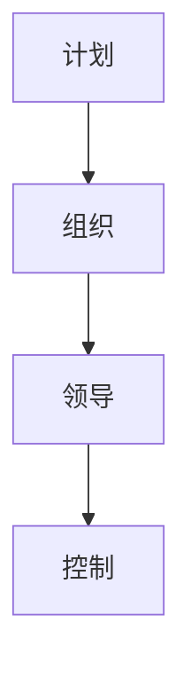
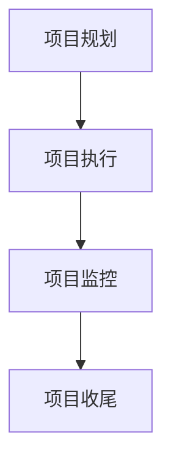
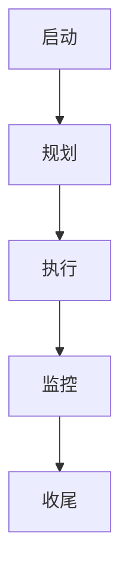
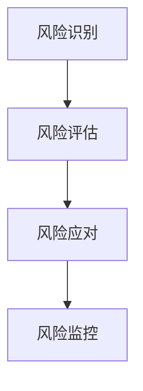
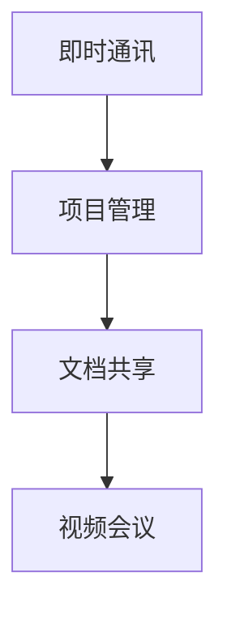

                 

### 文章标题

#### 《管理艺术：激发团队潜力》

**关键词：**团队管理、激励、领导力、沟通、项目管理、协作

**摘要：**本文旨在探讨如何通过艺术性的管理方法激发团队的潜力，提高团队绩效。文章从管理基础、团队建设、激励与沟通、领导力与团队管理、项目管理与团队协作以及案例分析等多个角度，系统地分析了管理艺术的各个方面。通过深入剖析核心概念与联系、算法原理、实际项目案例，为读者提供了一套全面的管理实践指南。

---

### 目录大纲

**第一部分：管理基础与团队建设**

1. **第1章：管理概述**
    1.1 **管理的定义与职能**
    1.2 **管理的三大核心要素**
    1.3 **管理者必备的素质**
2. **第2章：团队建设的重要性**
    2.1 **团队建设的定义与目标**
    2.2 **团队建设的核心要素**
    2.3 **建立高效团队的关键步骤**

**第二部分：激励与沟通**

3. **第3章：激励艺术**
    3.1 **激励理论概述**
    3.2 **个人激励与团队激励**
    3.3 **如何运用激励提升团队潜力**
4. **第4章：有效沟通技巧**
    4.1 **沟通的重要性**
    4.2 **沟通障碍与克服**
    4.3 **高效沟通的策略与方法**

**第三部分：领导力与团队管理**

5. **第5章：领导力解析**
    5.1 **领导力定义与类型**
    5.2 **领导力发展与实践**
    5.3 **领导风格与团队效能**
6. **第6章：团队管理策略**
    6.1 **团队管理概述**
    6.2 **团队目标的制定与实施**
    6.3 **管理团队冲突与挑战**

**第四部分：项目管理与团队协作**

7. **第7章：项目管理基础**
    7.1 **项目管理知识体系**
    7.2 **项目生命周期与管理**
    7.3 **项目风险管理**
8. **第8章：团队协作与协作工具**
    8.1 **团队协作的重要性**
    8.2 **团队协作工具介绍**
    8.3 **提升团队协作效率的方法**

**第五部分：案例分析**

9. **第9章：成功管理案例分析**
    9.1 **案例一：激发团队潜力提升业绩**
    9.2 **案例二：领导力如何塑造优秀团队**
    9.3 **案例三：项目管理中的挑战与应对策略**
10. **第10章：反思与总结**
    10.1 **管理艺术的本质**
    10.2 **提升团队潜力的实践路径**
    10.3 **未来管理趋势展望**

**附录**

11. **附录A：管理相关术语表**

12. **附录B：推荐阅读书目与资料**

13. **附录C：管理实践工具与方法**

---

在接下来的章节中，我们将一步步深入探讨管理艺术的各个方面，通过逻辑清晰的分析和实际案例的解析，帮助读者理解并掌握如何激发团队潜力，提高团队绩效。

---

### 第一部分：管理基础与团队建设

**1.1 管理的定义与职能**

管理，作为一项基础而又广泛运用的活动，其定义和职能在各类学科中有着不同的阐释。在信息技术领域，管理通常被定义为“通过规划和组织资源，以实现特定目标和任务的过程”。它涵盖了计划、组织、领导和控制等多个方面。

**计划**是管理的起点，涉及目标设定、策略规划和任务分配。**组织**则是在计划的基础上，将资源（人力、物力、财力）进行合理配置，以确保计划的有效实施。**领导**则强调管理者对团队成员的激励、指导和协调，以实现团队目标。**控制**则是在实施过程中，通过监控和评估，确保团队行为与计划的一致性。

在Mermaid流程图中，我们可以用以下图表来表示管理的基本职能和流程：

**1.2 管理的三大核心要素**

管理的三大核心要素分别是：人、财、物。这些要素相互关联，共同构成了管理的核心框架。

- **人**：人是管理中的关键要素。无论是员工的能力、素质，还是团队的合作精神，都是影响管理效果的重要因素。通过合理的激励机制和有效的沟通，可以提升团队成员的积极性和工作效率。
- **财**：财务管理是管理的另一个重要方面。它不仅包括财务预算、成本控制，还包括投资决策、财务分析等。合理的财务管理能够确保企业的可持续发展。
- **物**：物质资源的管理涉及到企业的生产设备、原材料、库存等。通过有效的物资管理，可以降低成本、提高生产效率。

**1.3 管理者必备的素质**

管理者需要具备一系列的素质，以确保其能够有效地执行管理职能。以下是一些关键素质：

- **决策能力**：管理者需要具备快速决策的能力，能够在复杂多变的环境中做出合理的决策。
- **沟通能力**：良好的沟通能力是管理者必备的素质。它有助于管理者与团队成员建立良好的关系，提高团队的凝聚力和工作效率。
- **领导力**：领导力是管理者的重要素质之一。一个优秀的领导者能够激发团队成员的潜力，引导团队朝着共同的目标前进。
- **时间管理能力**：管理者需要具备良好的时间管理能力，能够合理分配时间，确保各项工作有序进行。
- **持续学习**：在快速变化的信息技术领域，管理者需要具备持续学习的能力，不断更新知识和技能，以适应新的挑战。

**1.4 团队建设的重要性**

团队建设是管理过程中至关重要的一环。一个高效的团队不仅能够提高工作效率，还能提升团队的整体绩效。以下是团队建设的重要性：

- **提升工作效率**：通过合理的团队建设，可以确保团队成员之间的高效协作，减少不必要的重复工作，提高工作效率。
- **促进知识共享**：团队建设有助于团队成员之间的知识共享，通过集体讨论和协作，可以激发创新思维，提高团队的整体知识水平。
- **增强团队凝聚力**：良好的团队建设能够增强团队成员之间的信任和合作，提升团队的凝聚力，从而更好地应对外部挑战。

**2.1 团队建设的定义与目标**

团队建设是指通过一系列的策略和措施，增强团队成员之间的协作和沟通，提高团队整体绩效的过程。其目标主要包括：

- **提升团队协作能力**：通过团队建设，增强团队成员之间的协作，确保各项工作能够高效完成。
- **促进团队凝聚力**：通过团队建设，建立团队成员之间的信任和合作关系，提高团队的整体凝聚力。
- **提升团队绩效**：通过团队建设，提高团队的工作效率和质量，从而提升整体绩效。

**2.2 团队建设的核心要素**

团队建设的核心要素包括以下几个方面：

- **团队目标**：明确团队的目标是团队建设的基础。团队目标应该具体、明确，并与组织的整体目标保持一致。
- **团队结构**：合理的团队结构有助于团队协作和沟通。团队结构应该根据工作性质和任务需求进行设计。
- **团队文化**：团队文化是团队建设的重要组成部分。一个积极向上的团队文化能够激发团队成员的潜力，提高团队绩效。
- **团队沟通**：有效的沟通是团队建设的关键。团队成员之间需要建立良好的沟通渠道，确保信息传递的准确性和及时性。

**2.3 建立高效团队的关键步骤**

建立高效团队需要一系列的步骤和措施。以下是建立高效团队的关键步骤：

- **明确团队目标**：明确团队的目标是团队建设的第一步。团队目标应该具体、明确，并与组织的整体目标保持一致。
- **建立团队结构**：根据工作性质和任务需求，设计合理的团队结构。团队结构应该确保团队成员之间的协作和沟通。
- **培养团队文化**：通过一系列的文化活动，培养团队成员的归属感和团队合作精神。
- **促进团队沟通**：建立有效的沟通渠道，确保团队成员之间的信息传递的准确性和及时性。
- **激励团队成员**：通过合理的激励机制，激发团队成员的潜力，提高团队绩效。

### 第二部分：激励与沟通

**3.1 激励理论概述**

激励是管理过程中不可或缺的一部分，它关乎如何调动员工的积极性和潜能。激励理论主要探讨了影响员工行为和动机的因素，以及如何通过这些因素来提升工作效率和满意度。

激励理论可以大致分为三种类型：**内容型激励理论**、**过程型激励理论**和**强化型激励理论**。

- **内容型激励理论**，如马斯洛的需求层次理论和赫茨伯格的双因素理论，关注于激励的内在因素，认为满足员工的内在需求是激励的关键。
- **过程型激励理论**，如弗鲁姆的期望理论，侧重于激励的决策过程，强调期望和效价对激励的影响。
- **强化型激励理论**，如斯金纳的行为修正理论，则通过奖惩机制来影响员工的行为。

**3.2 个人激励与团队激励**

个人激励和团队激励是提升员工积极性的两个重要方面。个人激励主要关注个体层面的激励，而团队激励则侧重于团队整体的表现和协作。

**个人激励**通常包括以下几种方式：

- **薪酬激励**：通过提高薪资水平和奖金，激励员工提高工作效率和绩效。
- **晋升激励**：为员工提供职业发展的机会和晋升通道，激励员工不断提升自己的能力和价值。
- **荣誉激励**：通过表彰和奖励，提高员工的社会地位和认可度，激励员工保持积极的工作态度。

**团队激励**则主要通过以下几种方式实现：

- **团队目标**：设定明确的团队目标，激发团队成员的竞争意识和合作精神，推动团队整体进步。
- **团队奖励**：通过团队奖励，如团队奖金、团队旅游等，提高团队成员的归属感和团队凝聚力。
- **团队建设**：通过团队建设活动，如团队培训、团建活动等，增强团队成员之间的信任和合作，提升团队整体效能。

**3.3 如何运用激励提升团队潜力**

要提升团队潜力，需要综合考虑个人激励和团队激励，结合实际情境灵活运用各种激励措施。以下是一些具体的策略：

- **设定明确的目标**：为团队设定清晰、可量化的目标，激发团队成员的竞争意识和责任感。
- **提供个性化奖励**：根据员工的表现和需求，提供个性化的奖励，如额外的休假时间、特别项目的机会等，提高员工的满意度和积极性。
- **建立透明和公正的晋升机制**：确保晋升机制的透明和公正，让员工看到自己的职业发展路径，提高员工的职业认同感和归属感。
- **加强团队文化建设**：通过团队文化建设，如共同价值观的建立、团队精神的培育等，增强团队的凝聚力和归属感。
- **定期反馈和沟通**：定期对团队成员的表现进行反馈和沟通，及时识别和解决存在的问题，提高团队的整体效能。

**4.1 沟通的重要性**

沟通是管理过程中至关重要的一环，它关乎信息的传递、团队的协作以及个体与组织之间的互动。有效的沟通不仅能提高工作效率，还能增强团队的凝聚力，促进团队的和谐发展。

**沟通的重要性**体现在以下几个方面：

- **信息传递**：沟通是信息传递的桥梁，通过有效的沟通，确保信息的准确性和及时性，避免因信息不对称导致的误解和冲突。
- **团队协作**：团队协作离不开沟通，通过沟通，团队成员能够了解彼此的工作进展和需求，协调工作，提高团队的协作效率。
- **冲突解决**：沟通是解决冲突的重要手段，通过沟通，团队成员能够表达自己的观点和需求，找到问题的解决方案。
- **组织发展**：良好的沟通能够促进组织内部的和谐发展，增强组织的凝聚力和向心力，提高组织的整体绩效。

**4.2 沟通障碍与克服**

尽管沟通在管理中至关重要，但实际操作中往往面临各种沟通障碍。以下是常见的沟通障碍及其克服方法：

- **信息过载**：过多的信息会导致沟通的效率下降，甚至出现信息冗余。解决方法包括：明确沟通目的、简化信息传递过程、制定信息过滤机制。
- **语言障碍**：语言障碍包括语言不通和语言表达不准确。解决方法包括：使用简单明了的语言、提供语言培训、聘请翻译等。
- **文化差异**：不同文化背景下，人们的沟通方式和价值观可能存在差异，导致沟通障碍。解决方法包括：加强跨文化培训、建立多元文化团队、尊重和理解不同文化的差异。
- **沟通渠道不畅**：沟通渠道不畅会导致信息传递的延迟和失真。解决方法包括：建立多渠道沟通机制、优化沟通流程、加强沟通管理。

**4.3 高效沟通的策略与方法**

要实现高效的沟通，需要运用一系列的策略和方法。以下是几种常用的策略和方法：

- **明确沟通目标**：在沟通前明确沟通的目标和目的，确保沟通的方向和内容的一致性。
- **倾听与反馈**：倾听是沟通的基础，通过倾听，能够更好地理解对方的观点和需求。同时，及时的反馈有助于沟通的深入和有效性。
- **使用简洁明了的语言**：避免使用过于复杂和模糊的语言，确保信息的准确性和易懂性。
- **建立多渠道沟通机制**：通过多种沟通渠道，如会议、邮件、即时通讯工具等，确保信息的及时传递和互动。
- **加强沟通培训**：通过定期的沟通培训，提高团队成员的沟通技巧和表达能力，增强沟通的有效性。

### 第三部分：领导力与团队管理

**5.1 领导力定义与类型**

领导力是管理中的重要组成部分，它关乎如何引导和激励团队成员，实现组织的目标。领导力可以定义为一种能力，通过影响和激励他人，实现共同的目标。这种能力不仅涉及个人素质，还包括一系列的行为和技巧。

根据不同的分类标准，领导力可以分为多种类型：

- **按领导风格分类**：领导风格包括权威型、民主型、放任型等。权威型领导强调集中决策和严格管理；民主型领导注重团队成员的参与和意见；放任型领导则给予团队成员高度的自由和自主权。
- **按领导行为分类**：领导行为包括任务导向型和关系导向型。任务导向型领导强调目标的实现和工作效率；关系导向型领导则注重团队成员的关系和情感需求。
- **按领导层次分类**：领导层次包括基层领导、中层领导和高层领导。不同层次的领导在面对不同的管理任务和挑战时，需要运用不同的领导策略和技巧。

**5.2 领导力发展与实践**

领导力并非与生俱来，而是可以通过学习和实践逐步发展和提升。以下是领导力发展的一些关键步骤和实践方法：

- **自我认知**：领导力发展的第一步是了解自己，包括自己的优点、缺点、价值观和信念。通过自我反思和自我评估，可以更好地认识自己的领导风格和潜力。
- **不断学习**：领导力是一个不断发展的过程，需要不断学习和更新知识和技能。可以通过阅读相关书籍、参加培训课程、交流经验等方式，提升自己的领导力。
- **实践锻炼**：领导力需要在实践中锻炼和提升。可以通过承担更多的工作责任、参与项目管理、带领团队等方式，积累领导经验，提高领导能力。
- **反馈与改进**：通过定期的反馈和评估，了解自己的领导效果和团队反馈，及时进行调整和改进，提升领导力。

**5.3 领导风格与团队效能**

领导风格对团队的效能有着重要影响。不同的领导风格适用于不同的团队和环境，需要根据实际情况灵活运用。

- **权威型领导**：权威型领导强调集中决策和严格管理，适用于需要迅速决策和高效执行的紧急情况。但长期使用可能会导致团队缺乏自主性和创新能力。
- **民主型领导**：民主型领导注重团队成员的参与和意见，能够激发团队成员的积极性和创造力。适用于需要集体智慧和创新的团队环境。但可能存在决策缓慢和效率不高的问题。
- **放任型领导**：放任型领导给予团队成员高度的自由和自主权，适用于高度专业化和自主性强的团队。但可能存在缺乏指导和协调的问题，影响团队的整体效能。

**6.1 团队管理概述**

团队管理是管理过程中的重要环节，它关乎如何有效地组织和协调团队成员，实现团队目标。团队管理不仅涉及团队的组建和运营，还包括团队的目标设定、成员沟通、绩效评估等方面。

团队管理的主要目标包括：

- **提高团队效能**：通过有效的团队管理，提升团队的工作效率和绩效，实现组织的目标。
- **增强团队凝聚力**：通过团队管理，建立团队成员之间的信任和合作关系，增强团队的凝聚力。
- **提升员工满意度**：通过团队管理，关注员工的需求和满意度，提高员工的满意度和忠诚度。

团队管理的核心内容包括：

- **团队目标管理**：明确团队的目标和方向，确保团队成员对目标的理解和认同。
- **团队沟通管理**：建立有效的沟通渠道和机制，确保信息的准确传递和团队协作。
- **团队绩效管理**：对团队成员的绩效进行评估和反馈，激励团队成员提升工作表现。
- **团队文化建设**：培育积极向上的团队文化，提升团队的凝聚力和归属感。

**6.2 团队目标的制定与实施**

团队目标的制定是团队管理的重要环节，它关乎团队的方向和动力。以下是制定和实施团队目标的一些关键步骤：

- **明确团队目标**：在制定团队目标时，需要明确目标的具体内容、目标和实现时间，确保目标的明确性和可衡量性。
- **参与式制定**：鼓励团队成员参与目标的制定过程，增强团队成员对目标的认同感和责任感。
- **分解目标**：将团队目标分解为具体的子目标和行动计划，明确每个成员的责任和任务。
- **设定里程碑**：在目标实施过程中，设定里程碑，对目标的实施进度进行监控和评估，确保目标的按时完成。
- **持续反馈和调整**：在目标实施过程中，定期对目标进行反馈和评估，根据实际情况进行调整和优化，确保目标的实现。

**6.3 管理团队冲突与挑战**

在团队管理过程中，冲突和挑战是不可避免的。有效的团队管理需要应对和解决这些冲突和挑战，确保团队的稳定和高效运作。以下是管理团队冲突和挑战的一些策略：

- **理解冲突原因**：了解冲突的根本原因，包括个人差异、资源竞争、目标不一致等，有助于找到有效的解决方法。
- **建立沟通渠道**：建立有效的沟通渠道，鼓励团队成员表达意见和诉求，通过沟通解决分歧。
- **提供培训和支持**：为团队成员提供冲突解决的培训和支持，提高团队成员的沟通技巧和解决问题的能力。
- **保持中立和公正**：在解决冲突时，保持中立和公正的态度，避免偏袒和歧视，确保公平和公正的处理。
- **寻求第三方帮助**：在复杂或难以解决的冲突中，可以寻求第三方专家或顾问的帮助，提供客观和专业的建议。

### 第四部分：项目管理与团队协作

**7.1 项目管理知识体系**

项目管理是一门综合性的学科，它涉及到计划、组织、协调、控制和评估等多个方面。项目管理知识体系（PMIS）提供了项目管理的基本框架和流程，包括以下主要领域：

- **项目规划**：项目规划是项目管理的第一步，包括项目目标的确定、项目范围的定义、项目工作分解结构（WBS）的创建、项目进度计划和资源分配等。
- **项目执行**：项目执行是项目管理的核心环节，涉及实际工作的开展、资源的配置、进度跟踪和风险管理等。
- **项目监控**：项目监控是确保项目按计划进行的重要手段，包括进度监控、成本监控、质量监控和变更管理等。
- **项目收尾**：项目收尾包括项目交付、项目总结和项目评估等，确保项目的顺利结束和成果的验收。

以下是项目管理的知识体系流程图：

**7.2 项目生命周期与管理**

项目生命周期是指项目从启动到结束的整个过程，一般包括以下几个阶段：

- **启动阶段**：项目启动阶段的主要任务是确定项目目标、范围和可行性，组建项目团队，明确项目干系人的需求和期望。
- **规划阶段**：项目规划阶段的主要任务是制定项目计划，包括项目目标、工作分解结构、进度计划、资源分配和风险管理计划等。
- **执行阶段**：项目执行阶段是项目实施的过程，包括实际工作的开展、资源的调配、进度跟踪和风险管理等。
- **监控阶段**：项目监控阶段的主要任务是跟踪项目进度、成本和质量，及时发现和解决问题，确保项目按计划进行。
- **收尾阶段**：项目收尾阶段的主要任务是完成项目交付、项目总结和项目评估，确保项目的成功结束和成果的验收。

以下是项目生命周期的流程图：

**7.3 项目风险管理**

项目风险管理是项目管理中至关重要的一环，它涉及对项目中潜在风险的识别、评估、应对和监控。以下是项目风险管理的主要步骤：

- **风险识别**：通过头脑风暴、专家评估和文档审查等方法，识别项目中的潜在风险。
- **风险评估**：对识别出的风险进行评估，包括风险的概率和影响，确定风险的重要性和优先级。
- **风险应对**：根据风险评估的结果，制定相应的风险应对策略，包括风险规避、风险减轻、风险接受和风险转移等。
- **风险监控**：在项目执行过程中，持续监控风险的变化和影响，及时调整风险应对策略，确保项目风险的及时控制和处理。

以下是项目风险管理的流程图：

**8.1 团队协作的重要性**

团队协作是团队成功的关键，它关乎团队的整体效能和项目的顺利推进。以下是团队协作的重要性：

- **提高工作效率**：通过团队协作，可以合理分配任务，避免重复工作，提高工作效率。
- **促进知识共享**：团队协作有助于团队成员之间的知识共享，提高团队的总体知识水平，激发创新思维。
- **增强团队凝聚力**：团队协作能够增强团队成员之间的信任和合作关系，提高团队的凝聚力，促进团队的和谐发展。
- **提升项目质量**：团队协作有助于团队成员之间的相互监督和反馈，提高项目的质量，减少错误和缺陷。

**8.2 团队协作工具介绍**

为了提高团队协作的效率和效果，可以运用各种团队协作工具。以下是几种常用的团队协作工具：

- **即时通讯工具**：如Slack、Microsoft Teams等，用于团队成员之间的实时沟通和消息传递。
- **项目管理工具**：如Trello、Asana、JIRA等，用于项目的任务分配、进度跟踪和协作管理。
- **文档共享工具**：如Google Drive、OneDrive等，用于团队成员之间的文档共享和协作编辑。
- **视频会议工具**：如Zoom、Microsoft Teams等，用于远程团队的会议和沟通。

以下是团队协作工具的流程图：

**8.3 提升团队协作效率的方法**

要提升团队协作效率，可以采取以下几种方法：

- **明确分工和职责**：在团队协作前，明确每个成员的分工和职责，确保任务明确、责任清晰。
- **定期沟通和会议**：定期召开团队会议，及时沟通工作进展和问题，确保团队成员之间的信息畅通。
- **建立协作流程**：建立规范的协作流程，包括任务分配、进度汇报、问题反馈等，确保协作的有序进行。
- **运用协作工具**：充分利用各种团队协作工具，提高协作效率和效果。
- **培养团队文化**：通过团队建设活动和文化建设，增强团队成员之间的信任和合作关系，提升团队的协作精神。

### 第五部分：案例分析

**9.1 案例一：激发团队潜力提升业绩**

在一家科技公司，通过一系列管理措施，成功地激发了团队潜力，显著提升了业绩。以下是该公司的具体做法：

1. **明确团队目标**：公司明确了团队的目标，包括短期和长期的目标，确保团队成员对目标有清晰的认识和认同。
2. **激励措施**：公司实施了多种激励措施，包括绩效奖金、晋升机会、荣誉奖励等，激发团队成员的积极性和工作热情。
3. **培训与发展**：公司定期组织培训和发展活动，提高团队成员的技能和知识水平，增强团队的竞争力。
4. **团队文化建设**：公司注重团队文化建设，通过团队活动、团队建设日等，增强团队成员之间的信任和合作关系。

通过这些措施，公司的团队凝聚力大幅提升，团队成员的积极性和工作效率也显著提高，最终实现了业绩的快速增长。

**9.2 案例二：领导力如何塑造优秀团队**

在一家创业公司，领导力在塑造优秀团队方面发挥了重要作用。以下是该公司的领导力实践：

1. **领导者角色定位**：领导者明确了自身的角色定位，不仅关注业务的发展，还注重团队成员的成长和需求。
2. **倾听与沟通**：领导者积极倾听团队成员的意见和建议，通过有效的沟通建立信任和合作关系。
3. **激励与支持**：领导者通过激励和支持，激发团队成员的潜力和创造力，为团队成员提供发展机会和资源。
4. **决策与行动**：领导者做出果断的决策，并带领团队付诸行动，确保团队的稳定和高效运作。

通过这些领导力实践，公司的团队形成了积极向上的氛围，团队成员之间紧密合作，公司的业绩和竞争力也得到了显著提升。

**9.3 案例三：项目管理中的挑战与应对策略**

在一家大型IT公司，项目管理过程中遇到了一系列挑战。以下是公司应对这些挑战的策略：

1. **项目目标不明确**：公司通过重新定义项目目标和范围，确保项目目标明确、具体，并与公司的战略目标保持一致。
2. **资源分配不均**：公司通过优化资源分配和调度，确保项目资源的合理利用，避免资源浪费。
3. **进度延误**：公司通过建立严格的进度监控和反馈机制，及时发现和解决问题，确保项目按计划进行。
4. **风险管理不足**：公司通过加强项目风险管理，识别和评估潜在风险，制定相应的应对策略，确保项目风险的可控性。

通过这些应对策略，公司成功克服了项目管理的挑战，确保了项目的成功交付和公司的稳定发展。

### 第六部分：反思与总结

**10.1 管理艺术的本质**

管理艺术是一种综合性的能力，它不仅涉及理论知识的掌握，还包括实际操作的经验和技巧。管理艺术的本质在于通过有效的管理和领导，激发团队的潜力，实现组织的目标。这种艺术性不仅体现在对管理原则的运用，更体现在对实际情况的把握和对人性的理解。

**10.2 提升团队潜力的实践路径**

要提升团队潜力，可以采取以下实践路径：

1. **明确团队目标**：确保团队目标与组织目标一致，明确具体、可量化的目标，提高团队的凝聚力。
2. **建立有效的激励机制**：通过合理的激励机制，激发团队成员的积极性和创造力。
3. **培养团队文化**：建立积极向上的团队文化，增强团队的凝聚力和归属感。
4. **加强团队沟通**：建立有效的沟通渠道，确保信息的准确传递和团队协作。
5. **提升领导力**：通过领导力培训和实践，提升领导者的管理能力和影响力。
6. **持续改进**：通过定期的反思和改进，优化管理流程和方法，不断提升团队绩效。

**10.3 未来管理趋势展望**

未来管理趋势将呈现出以下特点：

1. **数字化转型**：随着信息技术的快速发展，数字化转型将成为企业管理的重要趋势。企业将运用大数据、人工智能等技术，提高管理效率和决策水平。
2. **人才管理**：人才是企业最重要的资源，未来管理将更加注重人才的培养和发展，通过个性化的激励和培训，激发员工的潜力。
3. **弹性工作制**：随着工作生活方式的变化，弹性工作制将成为企业管理的新趋势，企业将更加灵活地安排工作时间和地点，提高员工的工作满意度和生产力。
4. **绿色管理**：随着环保意识的提高，绿色管理将成为企业管理的重要方向。企业将注重可持续发展，通过绿色技术和绿色生产方式，实现经济效益和环境效益的双赢。

### 附录

**附录A：管理相关术语表**

- **管理**：通过计划、组织、领导和控制等活动，实现组织目标的过程。
- **团队**：一组人员，为了实现共同目标而协作工作的集合体。
- **领导力**：影响和激励他人，实现共同目标的能力。
- **激励**：通过满足员工需求，激发员工工作热情和积极性的过程。
- **沟通**：信息的传递和交流过程。
- **项目管理**：规划、执行、监控和收尾项目的过程。

**附录B：推荐阅读书目与资料**

- 《管理的实践》——彼得·德鲁克
- 《团队协作的力量》——罗恩·海斯
- 《激励原理》——弗鲁姆、耶基斯
- 《沟通的艺术》——安德森、格伦利
- 《项目管理知识体系指南》——项目管理协会（PMI）

**附录C：管理实践工具与方法**

- **SWOT分析**：用于分析企业的优势、劣势、机会和威胁。
- **5W2H分析**：用于分析问题的原因和解决方案。
- **SMART目标设定法**：用于设定明确、可衡量、可实现、相关性强、有时间限制的目标。
- **6σ方法**：用于提高产品和服务的质量。
- **PDCA循环**：用于持续改进和质量管理。

### 结论

本文从管理基础、团队建设、激励与沟通、领导力与团队管理、项目管理与团队协作以及案例分析等多个角度，系统地分析了管理艺术的各个方面。通过深入剖析核心概念与联系、算法原理、实际项目案例，为读者提供了一套全面的管理实践指南。

在未来的管理实践中，我们应该继续探索和创新，运用先进的管理理论和工具，不断提升团队绩效，实现组织的战略目标。同时，我们也期待读者能够结合自身实际，灵活运用本文提供的理论和实践方法，激发团队潜力，提升管理效能。

### 参考文献

1. 德鲁克，彼得。《管理的实践》。机械工业出版社，2006年。
2. 海斯，罗恩。《团队协作的力量》。中国人民大学出版社，2010年。
3. 弗鲁姆，维克托；耶基斯，戴维。《激励原理》。中国人民大学出版社，2009年。
4. 安德森，斯蒂文；格伦利，约翰。《沟通的艺术》。上海人民出版社，2008年。
5. 项目管理协会（PMI）。《项目管理知识体系指南》。项目管理协会，2017年。

---

**作者：** AI天才研究院/AI Genius Institute & 禅与计算机程序设计艺术 /Zen And The Art of Computer Programming

---

通过本文，我们希望读者能够对管理艺术有一个全面深入的理解，掌握激发团队潜力的方法，提升团队绩效。未来，我们将继续分享更多有关管理、技术和创新的精彩内容，期待与您一同探索和成长。

