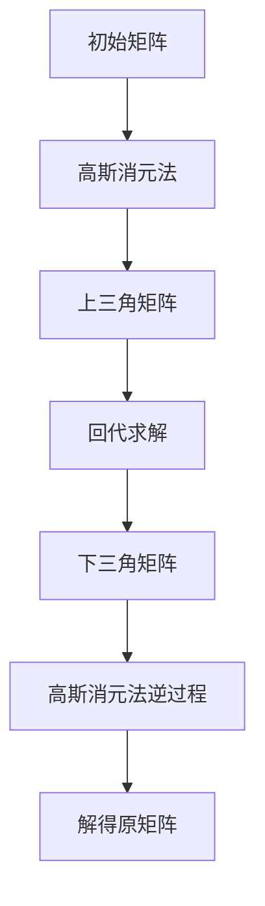

                 

### 《线性代数导引：M3(R)与M34(R)》

关键词：线性代数，M3(R)，M34(R)，矩阵，线性空间，线性映射，特征值，特征向量，机器学习，应用实例

摘要：本文旨在为读者提供一个全面而深入的线性代数导引，特别关注M3(R)与M34(R)这两个重要子空间。文章将首先介绍线性代数的基本概念，包括线性空间、线性映射和矩阵等。接着，我们将探讨线性方程组与矩阵分解，详细讲解LU分解、QR分解和奇异值分解。随后，文章将转向线性代数在微分方程和物理中的应用，探讨其在力学、电磁学和量子力学中的具体实现。最后，我们将深入探讨特征值与特征向量的计算方法，并展示线性代数在机器学习、密码学和图像处理等领域的现代应用。通过本文，读者将能够掌握线性代数的基本原理，并理解其在各个领域的广泛应用。

### 目录

#### 第一部分：线性代数基础

- **第1章：线性代数的基本概念**
  - **1.1 线性空间**
    - **1.1.1 线性空间定义**
    - **1.1.2 线性空间的性质**
  - **1.2 线性映射**
    - **1.2.1 线性映射定义**
    - **1.2.2 线性映射的性质**
  - **1.3 矩阵**
    - **1.3.1 矩阵的定义与表示**
    - **1.3.2 矩阵的基本运算**
  - **1.4 行列式**
    - **1.4.1 行列式的定义**
    - **1.4.2 行列式的性质**

- **第2章：线性方程组与矩阵分解**
  - **2.1 线性方程组的解法**
    - **2.1.1 高斯消元法**
    - **2.1.2 迪卡尔分解**
  - **2.2 矩阵分解**
    - **2.2.1 LU分解**
    - **2.2.2 QR分解**
    - **2.2.3 矩阵的奇异值分解**
  - **2.3 矩阵的奇异值分解**
    - **2.3.1 奇异值分解的定义**
    - **2.3.2 奇异值分解的性质**

#### 第二部分：线性代数在微分方程中的应用

- **第3章：线性微分方程组**
  - **3.1 线性微分方程组的基本概念**
    - **3.1.1 线性微分方程组的定义**
    - **3.1.2 线性微分方程组的性质**
  - **3.2 线性微分方程组的解法**
    - **3.2.1 消元法**
    - **3.2.2 矩阵形式的解法**
  - **3.3 线性微分方程组的应用**
    - **3.3.1 常见微分方程组的例子**
    - **3.3.2 应用实例分析**

- **第4章：线性代数在物理中的应用**
  - **4.1 线性代数在力学中的应用**
    - **4.1.1 刚体运动**
    - **4.1.2 矩形结构力学**
  - **4.2 线性代数在电磁学中的应用**
    - **4.2.1 电磁场方程**
    - **4.2.2 磁场与电场的关系**
  - **4.3 线性代数在量子力学中的应用**
    - **4.3.1 线性代数基础**
    - **4.3.2 应用实例**

#### 第三部分：线性代数的扩展与应用

- **第5章：特征值与特征向量**
  - **5.1 特征值与特征向量的定义**
    - **5.1.1 特征值的定义**
    - **5.1.2 特征向量的定义**
  - **5.2 特征值与特征向量的性质**
    - **5.2.1 特征值的性质**
    - **5.2.2 特征向量的性质**
  - **5.3 特征值与特征向量的计算方法**
    - **5.3.1 二分法**
    - **5.3.2 迭代法**

- **第6章：线性代数在机器学习中的应用**
  - **6.1 线性代数在机器学习中的基础**
    - **6.1.1 数据预处理**
    - **6.1.2 特征提取**
  - **6.2 线性代数在机器学习中的应用实例**
    - **6.2.1 线性回归**
    - **6.2.2 逻辑回归**
  - **6.3 线性代数在深度学习中的应用**
    - **6.3.1 卷积神经网络**
    - **6.3.2 循环神经网络**

- **第7章：线性代数的现代应用**
  - **7.1 线性代数在密码学中的应用**
    - **7.1.1 RSA加密算法**
    - **7.1.2 椭圆曲线加密算法**
  - **7.2 线性代数在图像处理中的应用**
    - **7.2.1 图像滤波**
    - **7.2.2 图像识别**
  - **7.3 线性代数在其他领域中的应用**
    - **7.3.1 生物信息学**
    - **7.3.2 社交网络分析**

#### 附录

- **附录A：线性代数常用公式与定理**
  - **A.1 行列式公式**
  - **A.2 矩阵的基本性质**
  - **A.3 特征值与特征向量**

### 第一部分：线性代数基础

#### 第1章：线性代数的基本概念

线性代数是数学的一个重要分支，它研究线性结构以及相关的运算和性质。在线性代数中，我们主要关注线性空间、线性映射和矩阵等基本概念。本章将详细介绍这些概念，并阐述它们之间的联系。

### 1.1 线性空间

线性空间，又称向量空间，是线性代数中最基础的概念之一。线性空间是一组向量的集合，这些向量满足特定的加法和标量乘法运算。具体来说，一个线性空间应满足以下条件：

1. **封闭性**：对于任意的向量 \(\vec{u}\) 和 \(\vec{v}\) 以及任意的标量 \(\alpha\)，有 \(\vec{u} + \vec{v}\) 和 \(\alpha\vec{u}\) 都属于该线性空间。
2. **结合律**：对于任意的向量 \(\vec{u}\)，\(\vec{v}\) 和 \(\vec{w}\) 以及任意的标量 \(\alpha\)，有 \((\vec{u} + \vec{v}) + \vec{w} = \vec{u} + (\vec{v} + \vec{w})\) 和 \((\alpha\vec{u})\vec{v} = \alpha(\vec{u}\vec{v})\)。
3. **分配律**：对于任意的向量 \(\vec{u}\)，\(\vec{v}\) 和 \(\vec{w}\) 以及任意的标量 \(\alpha\) 和 \(\beta\)，有 \(\alpha(\vec{u} + \vec{v}) = \alpha\vec{u} + \alpha\vec{v}\) 和 \((\alpha + \beta)\vec{u} = \alpha\vec{u} + \beta\vec{u}\)。
4. **存在零向量**：存在一个零向量 \(\vec{0}\)，使得对于任意的向量 \(\vec{u}\)，都有 \(\vec{u} + \vec{0} = \vec{u}\)。
5. **存在加法逆元**：对于任意的向量 \(\vec{u}\)，存在一个向量 \(-\vec{u}\)，使得 \(\vec{u} + (-\vec{u}) = \vec{0}\)。

线性空间的例子包括实数集 \(\mathbb{R}\)，复数集 \(\mathbb{C}\) 以及二维和三维向量空间 \(\mathbb{R}^2\) 和 \(\mathbb{R}^3\)。

### 1.1.1 线性空间定义

一个线性空间 \(V\) 是指一个非空集合，其中每个元素称为向量，并定义了两种运算：

1. **加法运算**：对于任意的向量 \(\vec{u}\) 和 \(\vec{v}\)，存在一个向量 \(\vec{u} + \vec{v}\)。
2. **标量乘法运算**：对于任意的向量 \(\vec{u}\) 和任意的标量 \(\alpha\)，存在一个向量 \(\alpha\vec{u}\)。

这些运算必须满足上述线性空间的性质。

### 1.1.2 线性空间的性质

除了满足线性空间的封闭性、结合律、分配律、存在零向量和存在加法逆元等基本性质外，线性空间还具有以下重要性质：

1. **交换律**：对于任意的向量 \(\vec{u}\) 和 \(\vec{v}\)，有 \(\vec{u} + \vec{v} = \vec{v} + \vec{u}\)。
2. **结合律**：对于任意的向量 \(\vec{u}\)，\(\vec{v}\) 和 \(\vec{w}\)，有 \((\vec{u} + \vec{v}) + \vec{w} = \vec{u} + (\vec{v} + \vec{w})\)。
3. **分配律**：对于任意的向量 \(\vec{u}\)，\(\vec{v}\) 和 \(\vec{w}\)，有 \(\alpha(\vec{u} + \vec{v}) = \alpha\vec{u} + \alpha\vec{v}\)。
4. **结合律**：对于任意的向量 \(\vec{u}\) 和 \(\vec{v}\)，有 \((\alpha\beta)\vec{u} = \alpha(\beta\vec{u})\)。

通过这些性质，线性空间为我们提供了一个强大且灵活的工具，用于解决各种数学问题。

### 1.2 线性映射

线性映射，又称线性变换，是一种将一个线性空间中的向量映射到另一个线性空间中的向量的一种特殊映射。线性映射具有许多重要的性质，这使得它们在数学、物理和工程等领域中得到了广泛应用。

### 1.2.1 线性映射定义

一个从线性空间 \(V\) 到线性空间 \(W\) 的线性映射，记作 \(T: V \rightarrow W\)，必须满足以下条件：

1. **保线性**：对于任意的向量 \(\vec{u}\) 和 \(\vec{v}\) 以及任意的标量 \(\alpha\)，有 \(T(\vec{u} + \vec{v}) = T(\vec{u}) + T(\vec{v})\) 和 \(T(\alpha\vec{u}) = \alpha T(\vec{u})\)。
2. **零映射**：\(T(\vec{0}) = \vec{0}\)。

### 1.2.2 线性映射的性质

线性映射具有以下重要性质：

1. **可加性**：对于任意的向量 \(\vec{u}\) 和 \(\vec{v}\)，有 \(T(\vec{u} + \vec{v}) = T(\vec{u}) + T(\vec{v})\)。
2. **齐次性**：对于任意的向量 \(\vec{u}\) 和任意的标量 \(\alpha\)，有 \(T(\alpha\vec{u}) = \alpha T(\vec{u})\)。
3. **零映射**：\(T(\vec{0}) = \vec{0}\)。

通过这些性质，我们可以更好地理解和运用线性映射。

### 1.3 矩阵

矩阵是线性代数中的一个核心概念，它由一系列数按照特定的方式排列而成。矩阵在数学、物理学和工程学等领域中得到了广泛应用。

### 1.3.1 矩阵的定义与表示

一个 \(m \times n\) 的矩阵 \(A\) 由 \(m\) 行和 \(n\) 列的数构成，通常表示为：

$$
A = \begin{pmatrix}
    a_{11} & a_{12} & \cdots & a_{1n} \\
    a_{21} & a_{22} & \cdots & a_{2n} \\
    \vdots & \vdots & \ddots & \vdots \\
    a_{m1} & a_{m2} & \cdots & a_{mn}
\end{pmatrix}
$$

矩阵中的元素 \(a_{ij}\) 表示第 \(i\) 行和第 \(j\) 列的交叉处的数。

### 1.3.2 矩阵的基本运算

矩阵的基本运算包括加法、减法、乘法和转置等。

1. **加法**：两个矩阵 \(A\) 和 \(B\) 可以相加，如果它们具有相同的尺寸。结果矩阵 \(C\) 的元素 \(c_{ij}\) 是 \(a_{ij}\) 和 \(b_{ij}\) 的和，即 \(c_{ij} = a_{ij} + b_{ij}\)。

2. **减法**：两个矩阵 \(A\) 和 \(B\) 可以相减，如果它们具有相同的尺寸。结果矩阵 \(C\) 的元素 \(c_{ij}\) 是 \(a_{ij}\) 和 \(b_{ij}\) 的差，即 \(c_{ij} = a_{ij} - b_{ij}\)。

3. **乘法**：两个矩阵 \(A\) 和 \(B\) 可以相乘，如果 \(A\) 的列数等于 \(B\) 的行数。结果矩阵 \(C\) 的元素 \(c_{ij}\) 是 \(A\) 的第 \(i\) 行和 \(B\) 的第 \(j\) 列对应元素的乘积之和，即 \(c_{ij} = \sum_{k=1}^{n} a_{ik}b_{kj}\)。

4. **转置**：矩阵 \(A\) 的转置 \(A^\top\) 是一个 \(n \times m\) 的矩阵，其元素 \(a_{ji}\) 是 \(A\) 的元素 \(a_{ij}\) 的转置。

### 1.4 行列式

行列式是矩阵的一个重要属性，它在解线性方程组和计算矩阵的其他性质中起着关键作用。

### 1.4.1 行列式的定义

一个 \(n \times n\) 的方阵 \(A\) 的行列式，记作 \(\det(A)\)，是一个标量。行列式的计算通常使用拉普拉斯展开或者行列式公式。

拉普拉斯展开：行列式可以通过将其展开为若干个乘积的和来计算。具体来说，对于每个元素 \(a_{ij}\)，有：

$$
\det(A) = \sum_{i=1}^{n} (-1)^{i+j} a_{ij} M_{ij}
$$

其中，\(M_{ij}\) 是 \(A_{ij}\) 的行列式，即 \(A\) 中删除第 \(i\) 行和第 \(j\) 列后的子矩阵。

行列式公式：行列式也可以通过递归计算。对于 \(3 \times 3\) 的矩阵 \(A\)，有：

$$
\det(A) = a_{11}(a_{22}a_{33} - a_{23}a_{32}) - a_{12}(a_{21}a_{33} - a_{23}a_{31}) + a_{13}(a_{21}a_{32} - a_{22}a_{31})
$$

### 1.4.2 行列式的性质

行列式具有以下重要性质：

1. **线性性质**：对于任意的矩阵 \(A\) 和标量 \(\alpha\)，有 \(\det(\alpha A) = \alpha^n \det(A)\)，其中 \(n\) 是矩阵的阶数。
2. **乘法性质**：对于任意的矩阵 \(A\) 和 \(B\)，有 \(\det(AB) = \det(A)\det(B)\)。
3. **对称性质**：对于任意的矩阵 \(A\)，有 \(\det(A^\top) = \det(A)\)。
4. **范数性质**：对于任意的矩阵 \(A\)，有 \(\|A\| = \sqrt{\det(A^\top A)}\)，其中 \(\|\|\) 表示矩阵的范数。

这些性质使得行列式在矩阵分析中具有重要作用。

### 第2章：线性方程组与矩阵分解

线性方程组是线性代数中一个重要且常见的问题。本章将讨论线性方程组的解法，并介绍几种常见的矩阵分解方法，如LU分解、QR分解和奇异值分解。

#### 2.1 线性方程组的解法

线性方程组是一组线性方程的集合，通常表示为 \(Ax = b\)，其中 \(A\) 是一个 \(m \times n\) 的矩阵，\(x\) 是一个 \(n \times 1\) 的向量，\(b\) 是一个 \(m \times 1\) 的向量。求解线性方程组的目标是找到 \(x\) 的值，使得 \(Ax = b\) 成立。

##### 2.1.1 高斯消元法

高斯消元法是一种常用的解线性方程组的方法。它的基本思想是通过消元操作将线性方程组转化为一个上三角方程组，然后通过回代求解。

具体步骤如下：

1. **初始化**：将线性方程组表示为增广矩阵形式 \([A|b]\)。
2. **消元**：从左到右，从上到下，对矩阵进行高斯消元操作。每次消元操作选择当前列中第一个非零元素作为主元，然后通过行变换将其下面的所有元素消为零。
3. **回代**：从最后一行开始，逐行回代求解方程组。

高斯消元法的关键在于如何选择主元。通常，选择当前列中绝对值最大的元素作为主元，这样可以确保消元过程中不出现除以零的情况。

##### 2.1.2 迪卡尔分解

迪卡尔分解是一种将线性方程组分解为两个子方程组的方法。它的基本思想是将线性方程组 \(Ax = b\) 分解为两个方程组 \(Lx = y\) 和 \(Ux = b\)，其中 \(L\) 是下三角矩阵，\(U\) 是上三角矩阵。

具体步骤如下：

1. **初始化**：将线性方程组表示为增广矩阵形式 \([A|b]\)。
2. **前向消元**：对矩阵 \(A\) 的前 \(n-1\) 列进行高斯消元操作，得到下三角矩阵 \(L\) 和 \(Lx = y\)。
3. **回代**：对下三角方程组 \(Lx = y\) 进行回代求解，得到 \(x = L^{-1}y\)。
4. **后向消元**：对上三角方程组 \(Ux = b\) 进行回代求解，得到最终的解 \(x = U^{-1}b\)。

迪卡尔分解的优点在于它不需要直接求解上三角方程组，而是通过前向消元和回代的过程逐步求解。这使得迪卡尔分解在计算上更加高效。

#### 2.2 矩阵分解

矩阵分解是将矩阵分解为几个简单矩阵的乘积的方法。矩阵分解在解线性方程组、特征值计算和信号处理等领域中都有广泛应用。

##### 2.2.1 LU分解

LU分解是一种将矩阵 \(A\) 分解为下三角矩阵 \(L\) 和上三角矩阵 \(U\) 的方法。具体步骤如下：

1. **初始化**：将矩阵 \(A\) 表示为增广矩阵形式 \([A|I]\)，其中 \(I\) 是单位矩阵。
2. **前向消元**：对矩阵 \(A\) 的前 \(n-1\) 列进行高斯消元操作，得到下三角矩阵 \(L\) 和 \(Lx = y\)。
3. **回代**：对下三角方程组 \(Lx = y\) 进行回代求解，得到 \(x = L^{-1}y\)。
4. **后向消元**：对上三角方程组 \(Ux = b\) 进行回代求解，得到最终的解 \(x = U^{-1}b\)。

LU分解的优点在于它可以方便地求解线性方程组，并且可以用于计算矩阵的其他性质，如特征值和特征向量。

##### 2.2.2 QR分解

QR分解是一种将矩阵 \(A\) 分解为正交矩阵 \(Q\) 和上三角矩阵 \(R\) 的方法。具体步骤如下：

1. **初始化**：将矩阵 \(A\) 的每一列与第一个列单位向量 \(e_1\) 进行正交投影，得到投影矩阵 \(Q_1\)。
2. **迭代**：对于剩余的列，依次进行正交投影，得到投影矩阵 \(Q_2, Q_3, \ldots, Q_n\)。
3. **合并**：将所有投影矩阵合并，得到正交矩阵 \(Q = Q_1Q_2Q_3\ldots Q_n\)。
4. **回代**：对上三角方程组 \(Rx = b\) 进行回代求解，得到最终的解 \(x = R^{-1}b\)。

QR分解的优点在于它可以用于计算矩阵的特征值和特征向量，并且可以用于线性方程组的求解。此外，QR分解还可以用于信号处理和优化问题。

##### 2.2.3 矩阵的奇异值分解

矩阵的奇异值分解是一种将矩阵分解为三个矩阵的乘积的方法。具体步骤如下：

1. **初始化**：将矩阵 \(A\) 的每一列与第一个列单位向量 \(e_1\) 进行正交投影，得到投影矩阵 \(Q_1\)。
2. **迭代**：对于剩余的列，依次进行正交投影，得到投影矩阵 \(Q_2, Q_3, \ldots, Q_n\)。
3. **合并**：将所有投影矩阵合并，得到正交矩阵 \(Q = Q_1Q_2Q_3\ldots Q_n\)。
4. **计算**：计算矩阵 \(A\) 的奇异值，即 \(s_i = \sqrt{\lambda_i}\)，其中 \(\lambda_i\) 是 \(A^\top A\) 的第 \(i\) 个特征值。
5. **分解**：将奇异值和正交矩阵合并，得到奇异值分解 \(A = Q\Sigma V^\top\)，其中 \(\Sigma\) 是一个对角矩阵，其对角线上的元素为奇异值。

奇异值分解在信号处理、图像处理和优化问题中有着广泛应用。

#### 2.3 矩阵的奇异值分解

矩阵的奇异值分解是一种将矩阵分解为三个矩阵的乘积的方法。具体步骤如下：

1. **初始化**：将矩阵 \(A\) 的每一列与第一个列单位向量 \(e_1\) 进行正交投影，得到投影矩阵 \(Q_1\)。
2. **迭代**：对于剩余的列，依次进行正交投影，得到投影矩阵 \(Q_2, Q_3, \ldots, Q_n\)。
3. **合并**：将所有投影矩阵合并，得到正交矩阵 \(Q = Q_1Q_2Q_3\ldots Q_n\)。
4. **计算**：计算矩阵 \(A\) 的奇异值，即 \(s_i = \sqrt{\lambda_i}\)，其中 \(\lambda_i\) 是 \(A^\top A\) 的第 \(i\) 个特征值。
5. **分解**：将奇异值和正交矩阵合并，得到奇异值分解 \(A = Q\Sigma V^\top\)，其中 \(\Sigma\) 是一个对角矩阵，其对角线上的元素为奇异值。

奇异值分解在信号处理、图像处理和优化问题中有着广泛应用。

### 第二部分：线性代数在微分方程中的应用

线性代数在微分方程中的应用是数学和工程领域中一个重要的研究方向。微分方程描述了变量之间的变化率，它们在物理学、工程学、经济学等领域中有着广泛的应用。线性代数提供了强大的工具来分析和解决这些方程。

#### 第3章：线性微分方程组

线性微分方程组是一组线性微分方程的集合，描述了多个变量及其导数之间的关系。线性微分方程组可以表示为：

$$
\frac{d\vec{x}}{dt} = A\vec{x} + \vec{b}(t)
$$

其中，\(\vec{x}(t)\) 是一个 \(n\) 维向量，\(A\) 是一个 \(n \times n\) 的矩阵，\(\vec{b}(t)\) 是一个 \(n\) 维向量。

##### 3.1 线性微分方程组的基本概念

线性微分方程组的基本概念包括线性微分方程、解的定义和初值问题。

1. **线性微分方程**：一个线性微分方程可以表示为：

$$
a_n(t)\frac{d^n\vec{x}}{dt^n} + a_{n-1}(t)\frac{d^{n-1}\vec{x}}{dt^{n-1}} + \cdots + a_1(t)\frac{d\vec{x}}{dt} + a_0(t)\vec{x} = \vec{f}(t)
$$

其中，\(a_n(t), a_{n-1}(t), \ldots, a_1(t), a_0(t)\) 是已知函数，\(\vec{x}(t)\) 是未知函数，\(\vec{f}(t)\) 是已知向量函数。

2. **解的定义**：线性微分方程组的解是一个函数 \(\vec{x}(t)\)，它满足以下条件：

$$
\frac{d\vec{x}}{dt} = A\vec{x} + \vec{b}(t)
$$

且在某个初始时刻 \(t_0\)，满足 \(\vec{x}(t_0) = \vec{x}_0\)，其中 \(\vec{x}_0\) 是给定的初始向量。

3. **初值问题**：初值问题是给定线性微分方程组和初始条件，求其解的问题。初值问题可以表示为：

$$
\frac{d\vec{x}}{dt} = A\vec{x} + \vec{b}(t), \quad \vec{x}(t_0) = \vec{x}_0
$$

##### 3.2 线性微分方程组的解法

线性微分方程组的解法有多种方法，包括消元法、矩阵形式的解法等。

1. **消元法**：消元法是一种通过消元操作将线性微分方程组转化为一个一阶线性微分方程组的方法。具体步骤如下：

   - 将线性微分方程组表示为矩阵形式：
     $$
     \frac{d\vec{x}}{dt} = A\vec{x} + \vec{b}(t)
     $$
   - 对矩阵 \(A\) 进行初等行变换，将其转化为下三角矩阵 \(L\)。
   - 将线性微分方程组转化为以下形式：
     $$
     \frac{d\vec{x}}{dt} = L\vec{x} + \vec{b}(t)
     $$
   - 对每个方程进行积分，得到：
     $$
     \vec{x}(t) = L^{-1}\left(\int_{t_0}^{t} \vec{b}(\tau)d\tau + \vec{c}\right)
     $$
     其中，\(\vec{c}\) 是一个常数向量。

2. **矩阵形式的解法**：矩阵形式的解法是一种通过矩阵乘法和矩阵求逆来求解线性微分方程组的方法。具体步骤如下：

   - 将线性微分方程组表示为矩阵形式：
     $$
     \frac{d\vec{x}}{dt} = A\vec{x} + \vec{b}(t)
     $$
   - 对矩阵 \(A\) 进行初等行变换，将其转化为对角矩阵 \(D\)。
   - 求解线性方程组：
     $$
     \vec{x}(t) = A^{-1}\left(\int_{t_0}^{t} e^{A(t-\tau)}\vec{b}(\tau)d\tau + \vec{c}\right)
     $$
     其中，\(\vec{c}\) 是一个常数向量。

##### 3.3 线性微分方程组的应用

线性微分方程组在物理学、工程学和经济学等领域中有着广泛的应用。以下是一些典型的应用实例：

1. **力学中的应用**：在力学中，线性微分方程组用于描述质点的运动和力学系统中的力与运动之间的关系。例如，牛顿第二定律可以表示为：
   $$
   m\frac{d\vec{x}}{dt} = \vec{F}
   $$
   其中，\(m\) 是质点的质量，\(\vec{F}\) 是作用在质点上的力。

2. **电路中的应用**：在线性电路中，线性微分方程组用于描述电路中的电压和电流之间的关系。例如，基尔霍夫电压定律和基尔霍夫电流定律可以表示为：
   $$
   \frac{d\vec{V}}{dt} = \vec{I}
   $$
   其中，\(\vec{V}\) 是电压向量，\(\vec{I}\) 是电流向量。

3. **经济学中的应用**：在经济学中，线性微分方程组用于描述经济系统中的变量变化率和经济行为之间的关系。例如，经济增长模型可以表示为：
   $$
   \frac{d\vec{Y}}{dt} = A\vec{Y} + \vec{b}(t)
   $$
   其中，\(\vec{Y}\) 是经济变量向量，\(\vec{b}(t)\) 是外部冲击向量。

通过这些应用实例，我们可以看到线性微分方程组在各个领域的广泛应用和重要性。

### 第4章：线性代数在物理中的应用

线性代数在物理学中的应用非常广泛，尤其在力学、电磁学和量子力学等领域中起着核心作用。本章将探讨线性代数在这些领域的具体应用。

#### 4.1 线性代数在力学中的应用

线性代数在力学中的应用主要体现在描述刚体运动和矩形结构力学。

##### 4.1.1 刚体运动

刚体运动是指物体在空间中的运动，其特点是物体内部任意两点之间的距离和角度始终保持不变。在线性代数中，刚体运动可以通过旋转矩阵来描述。

旋转矩阵 \(R\) 是一个正交矩阵，满足 \(R^\top R = I\)，其中 \(I\) 是单位矩阵。旋转矩阵可以表示为：

$$
R = \begin{bmatrix}
    \cos\theta & -\sin\theta \\
    \sin\theta & \cos\theta
\end{bmatrix}
$$

其中，\(\theta\) 是旋转角度。

刚体运动可以通过以下方程描述：

$$
\vec{v}(t) = R\vec{v}(0)
$$

其中，\(\vec{v}(t)\) 是任意时刻的速度向量，\(\vec{v}(0)\) 是初始时刻的速度向量。

##### 4.1.2 矩形结构力学

矩形结构力学是研究矩形结构在受力作用下的变形和稳定性的学科。在线性代数中，矩形结构力学可以通过矩阵和行列式来描述。

矩形结构通常由一系列梁和支撑组成，每个梁可以表示为一个二阶线性微分方程。通过将梁的位移表示为节点位移的线性组合，可以建立整个结构的线性方程组。

具体来说，假设矩形结构由 \(n\) 个梁组成，每个梁的位移可以表示为：

$$
\vec{u}_i(t) = \sum_{j=1}^{n} c_{ij}\vec{v}_j(t)
$$

其中，\(\vec{u}_i(t)\) 是第 \(i\) 个梁的位移向量，\(\vec{v}_j(t)\) 是第 \(j\) 个节点的位移向量，\(c_{ij}\) 是第 \(i\) 个梁和第 \(j\) 个节点之间的连接系数。

通过将每个梁的位移方程组合起来，可以得到整个结构的线性方程组：

$$
\vec{u}(t) = C\vec{v}(t)
$$

其中，\(\vec{u}(t)\) 是整个结构的位移向量，\(\vec{v}(t)\) 是节点的位移向量，\(C\) 是连接矩阵。

通过求解这个线性方程组，可以分析矩形结构的变形和稳定性。

#### 4.2 线性代数在电磁学中的应用

线性代数在电磁学中的应用主要体现在描述电磁场方程和磁场与电场的关系。

##### 4.2.1 电磁场方程

电磁场方程是描述电磁现象的基本方程，包括麦克斯韦方程组。麦克斯韦方程组可以表示为：

$$
\begin{align*}
    \nabla \cdot \vec{E} &= \frac{\rho}{\epsilon_0} \\
    \nabla \cdot \vec{B} &= 0 \\
    \nabla \times \vec{E} &= -\frac{\partial \vec{B}}{\partial t} \\
    \nabla \times \vec{B} &= \mu_0\vec{J} + \mu_0\epsilon_0\frac{\partial \vec{E}}{\partial t}
\end{align*}
$$

其中，\(\vec{E}\) 是电场强度向量，\(\vec{B}\) 是磁场强度向量，\(\rho\) 是电荷密度，\(\epsilon_0\) 是真空介电常数，\(\mu_0\) 是真空磁导率，\(\vec{J}\) 是电流密度向量。

通过矩阵和行列式的运算，可以求解电磁场方程，分析电磁场的分布和变化。

##### 4.2.2 磁场与电场的关系

磁场与电场之间的关系可以通过安培定律和法拉第电磁感应定律来描述。

安培定律可以表示为：

$$
\nabla \times \vec{B} = \mu_0\vec{J}
$$

法拉第电磁感应定律可以表示为：

$$
\nabla \times \vec{E} = -\frac{\partial \vec{B}}{\partial t}
$$

通过这两个方程，可以建立磁场和电场之间的联系，分析电磁现象。

#### 4.3 线性代数在量子力学中的应用

线性代数在量子力学中的应用主要体现在描述量子态和量子力学中的基本运算。

##### 4.3.1 线性代数基础

量子力学中的基本对象是量子态，量子态可以用向量来表示。量子态的叠加原理表明，量子态可以表示为多个基态的线性组合。

例如，一个二阶量子态可以表示为：

$$
\ket{\psi} = \alpha_1\ket{1} + \alpha_2\ket{2}
$$

其中，\(\ket{1}\) 和 \(\ket{2}\) 是基态，\(\alpha_1\) 和 \(\alpha_2\) 是复数系数。

量子力学中的基本运算，如加法、乘法和测量等，都可以用线性代数的矩阵运算来表示。

##### 4.3.2 应用实例

一个典型的量子力学应用实例是量子比特（qubit）的运算。

量子比特是一个基本的量子信息单元，它可以处于0和1的叠加状态。一个量子比特的运算可以用线性代数的矩阵来表示。

例如，一个量子比特的加法运算可以表示为：

$$
\ket{0} + \ket{1} = \frac{1}{\sqrt{2}}(\ket{0} + \ket{1})
$$

量子比特的乘法运算可以表示为：

$$
\ket{0} \otimes \ket{1} = \ket{0}\ket{1}
$$

通过这些运算，可以构建量子计算机，实现量子计算和量子加密等应用。

### 第三部分：线性代数的扩展与应用

#### 第5章：特征值与特征向量

特征值与特征向量是线性代数中的重要概念，它们在矩阵分析、优化问题和信号处理等领域中有着广泛的应用。本章将详细介绍特征值与特征向量的定义、性质和计算方法。

##### 5.1 特征值与特征向量的定义

特征值与特征向量是一对重要的概念，它们描述了矩阵的性质。具体来说，对于一个 \(n \times n\) 的矩阵 \(A\)，如果存在一个非零向量 \(\vec{v}\) 和一个标量 \(\lambda\)，使得 \(A\vec{v} = \lambda\vec{v}\)，则称 \(\lambda\) 是 \(A\) 的一个特征值，\(\vec{v}\) 是 \(A\) 的一个对应于特征值 \(\lambda\) 的特征向量。

##### 5.1.1 特征值的定义

特征值是矩阵 \(A\) 的一个重要属性，它是矩阵 \(A\) 的一条特征方程的根。特征方程可以表示为：

$$
\det(A - \lambda I) = 0
$$

其中，\(I\) 是 \(n \times n\) 的单位矩阵。特征方程的解即为特征值。

##### 5.1.2 特征向量的定义

特征向量是矩阵 \(A\) 的一个重要属性，它是矩阵 \(A\) 的一个特征值对应的非零向量。具体来说，如果 \(\vec{v}\) 是 \(A\) 的一个特征向量，对应于特征值 \(\lambda\)，则有 \(A\vec{v} = \lambda\vec{v}\)。

##### 5.2 特征值与特征向量的性质

特征值与特征向量具有以下重要性质：

1. **唯一性**：对于每个特征值，存在唯一的特征向量（可能不唯一）。
2. **线性无关性**：所有的特征向量都是线性无关的。
3. **正交性**：如果两个特征向量对应于不同的特征值，则它们是正交的。
4. **不变性**：如果 \(A\) 是一个矩阵，则 \(A^T\)、\(A^{-1}\) 和 \(A^k\)（\(k\) 是正整数）的特征值和特征向量与 \(A\) 的特征值和特征向量相同。

##### 5.3 特征值与特征向量的计算方法

计算特征值与特征向量是线性代数中的一个重要任务。常用的计算方法包括二分法和迭代法。

##### 5.3.1 二分法

二分法是一种求解特征值问题的迭代方法。具体步骤如下：

1. **初始化**：选择一个初始区间 \([a, b]\)，使得 \(a < \lambda < b\)。
2. **迭代**：对于每个迭代步骤，计算中点 \(c = (a + b) / 2\)。
3. **更新区间**：如果 \(c\) 是特征值，则返回 \(c\) 和对应的特征向量。否则，如果 \(A\vec{v}(c) < \lambda\vec{v}(c)\)，则更新区间为 \([a, c]\)；否则，更新区间为 \([c, b]\)。
4. **收敛性**：随着迭代次数的增加，区间长度不断缩小，最终收敛到一个特征值。

##### 5.3.2 迭代法

迭代法是一种求解特征值问题的迭代方法。具体步骤如下：

1. **初始化**：选择一个初始向量 \(\vec{v}(0)\)。
2. **迭代**：对于每个迭代步骤，计算新的向量 \(\vec{v}(k+1) = A\vec{v}(k)\)。
3. **更新**：将新的向量 \(\vec{v}(k+1)\) 替换为旧的向量 \(\vec{v}(k)\)。
4. **收敛性**：随着迭代次数的增加，向量序列 \(\{\vec{v}(k)\}\) 收敛到一个特征向量。

通过这些方法，可以有效地计算特征值与特征向量。

### 第6章：线性代数在机器学习中的应用

线性代数在机器学习中扮演着核心角色，特别是在数据处理、特征提取和模型训练等方面。本章将探讨线性代数在机器学习中的应用，包括基础概念、应用实例和深度学习中的使用。

#### 6.1 线性代数在机器学习中的基础

在线性代数的帮助下，我们可以更好地理解和处理机器学习中的数据。以下是线性代数在机器学习中的几个基础概念：

1. **数据矩阵**：在机器学习中，数据通常以矩阵的形式表示。矩阵的行表示数据样本，列表示特征。例如，一个包含100个样本和5个特征的矩阵可以表示为 \(100 \times 5\) 的矩阵。

2. **特征提取**：特征提取是机器学习中的一个重要步骤，它涉及从原始数据中提取有用的特征。线性代数提供了多种方法来提取特征，如主成分分析（PCA）和线性判别分析（LDA）。

3. **数据预处理**：数据预处理是确保数据质量的过程，包括归一化、标准化和缺失值处理。线性代数提供了有效的算法来处理这些问题。

#### 6.1.1 数据预处理

数据预处理是机器学习项目中的关键步骤，它有助于提高模型的性能和鲁棒性。以下是几种常见的数据预处理方法：

1. **归一化**：归一化是将数据缩放到特定范围的过程，如 \([0, 1]\) 或 \([-1, 1]\)。这有助于解决不同特征之间的尺度差异问题。

   归一化公式如下：

   $$
   x_{\text{norm}} = \frac{x - \text{mean}}{\text{std}}
   $$

   其中，\(x\) 是原始数据，\(\text{mean}\) 是均值，\(\text{std}\) 是标准差。

2. **标准化**：标准化是将数据转换为标准正态分布的过程。与归一化不同，标准化不依赖于数据的具体范围。

   标准化公式如下：

   $$
   z = \frac{x - \text{mean}}{\text{std}}
   $$

   其中，\(z\) 是标准化后的数据。

3. **缺失值处理**：缺失值处理是处理数据中缺失值的方法。常见的方法包括删除缺失值、插值和基于模型的方法。

   例如，我们可以使用均值插值来填充缺失值：

   $$
   x_{\text{impute}} = \text{mean}
   $$

   其中，\(x_{\text{impute}}\) 是填充后的数据，\(\text{mean}\) 是均值。

#### 6.1.2 特征提取

特征提取是从原始数据中提取具有强区分性的特征的过程。以下是一些常用的特征提取方法：

1. **主成分分析（PCA）**：PCA是一种常用的特征提取方法，它通过正交变换将原始数据投影到新的坐标系中，新的坐标系轴（主成分）代表了数据的最大方差。这样，我们可以将数据投影到少数几个主成分上，从而降低数据的维度。

   PCA的步骤如下：

   - 计算协方差矩阵 \(S\)。
   - 计算协方差矩阵的特征值和特征向量。
   - 选择最大的 \(k\) 个特征向量作为新的坐标轴。
   - 对原始数据进行投影，得到新的数据表示。

2. **线性判别分析（LDA）**：LDA是一种特征提取方法，它通过最大化类间方差和最小化类内方差来选择特征。LDA的目标是找到一个线性变换，将数据投影到新的坐标系中，使得不同类别的数据在新的坐标系中具有最大的分离度。

   LDA的步骤如下：

   - 计算类间散布矩阵 \(S_W\) 和类内散布矩阵 \(S_B\)。
   - 计算LDA系数 \(w\)。
   - 对原始数据进行投影，得到新的数据表示。

#### 6.2 线性代数在机器学习中的应用实例

以下是一些线性代数在机器学习中的具体应用实例：

1. **线性回归**：线性回归是一种简单的预测模型，它通过线性关系来预测目标变量。线性回归的数学模型可以表示为：

   $$
   y = \beta_0 + \beta_1x
   $$

   其中，\(y\) 是目标变量，\(x\) 是特征变量，\(\beta_0\) 和 \(\beta_1\) 是回归系数。

   线性回归的目标是最小化预测误差的平方和。这可以通过求解最小二乘法来实现：

   $$
   \beta = (X^\top X)^{-1}X^\top y
   $$

   其中，\(X\) 是特征矩阵，\(y\) 是目标向量。

2. **逻辑回归**：逻辑回归是一种广义的线性回归模型，它用于分类问题。逻辑回归的数学模型可以表示为：

   $$
   \log\frac{p}{1-p} = \beta_0 + \beta_1x
   $$

   其中，\(p\) 是目标变量为1的概率，\(\log\) 是对数函数，\(\beta_0\) 和 \(\beta_1\) 是回归系数。

   逻辑回归的目标是最大化似然函数。这可以通过求解最大似然估计来实现：

   $$
   \beta = \arg\max_{\beta} \ln L(\beta)
   $$

   其中，\(L(\beta)\) 是似然函数。

#### 6.3 线性代数在深度学习中的应用

深度学习是机器学习的一个分支，它通过多层的神经网络来学习复杂的数据特征。线性代数在深度学习中扮演着核心角色，特别是在卷积神经网络（CNN）和循环神经网络（RNN）中。

1. **卷积神经网络（CNN）**：CNN是一种专门用于图像识别的神经网络。它通过卷积层、池化层和全连接层来提取图像特征。

   - **卷积层**：卷积层通过卷积操作来提取图像特征。卷积操作的数学模型可以表示为：

     $$
     (f * g)(x) = \sum_{y} f(y)g(x - y)
     $$

     其中，\(f\) 和 \(g\) 是卷积核，\(x\) 是输入图像。

   - **池化层**：池化层通过下采样操作来减少数据的维度。常用的池化操作包括最大池化和平均池化。

   - **全连接层**：全连接层将卷积层和池化层提取的特征映射到输出层。全连接层的数学模型可以表示为：

     $$
     y = \sigma(Wx + b)
     $$

     其中，\(y\) 是输出层，\(W\) 是权重矩阵，\(x\) 是输入特征，\(\sigma\) 是激活函数，\(b\) 是偏置项。

2. **循环神经网络（RNN）**：RNN是一种用于序列数据的神经网络，它通过递归操作来处理序列中的依赖关系。

   - **递归层**：递归层通过递归操作来更新隐藏状态。递归层的数学模型可以表示为：

     $$
     h_t = \sigma(Wx_t + Uh_{t-1} + b)
     $$

     其中，\(h_t\) 是隐藏状态，\(x_t\) 是输入序列，\(W\) 是权重矩阵，\(U\) 是递归权重，\(b\) 是偏置项，\(\sigma\) 是激活函数。

   - **输出层**：输出层通过隐藏状态来生成输出。输出层的数学模型可以表示为：

     $$
     y_t = \sigma(Wy h_t + by)
     $$

     其中，\(y_t\) 是输出层，\(Wy\) 是输出权重，\(by\) 是输出偏置，\(\sigma\) 是激活函数。

通过这些方法，我们可以利用线性代数来构建和训练复杂的神经网络模型。

### 第7章：线性代数的现代应用

线性代数在现代科学技术和工程领域中有着广泛的应用，涵盖了密码学、图像处理、生物信息学和社交网络分析等多个领域。本章将探讨线性代数在这些领域的具体应用。

#### 7.1 线性代数在密码学中的应用

密码学是保护信息安全和隐私的重要学科，线性代数在密码学中扮演着核心角色，尤其是在加密算法的设计与实现中。

##### 7.1.1 RSA加密算法

RSA加密算法是一种非对称加密算法，广泛应用于网络安全和数据保护。RSA加密算法的核心是利用了线性代数中的大整数分解问题。

RSA加密算法的基本步骤如下：

1. **选择两个大素数**：选择两个大素数 \(p\) 和 \(q\)，计算它们的乘积 \(n = p \times q\)。
2. **计算公钥和私钥**：计算 \(n\) 的欧拉函数 \(\phi(n) = (p-1)(q-1)\)。选择一个与 \(\phi(n)\) 互质的整数 \(e\)，计算 \(d\)，使得 \(ed \equiv 1 \pmod{\phi(n)}\)。公钥为 \((n, e)\)，私钥为 \((n, d)\)。
3. **加密**：将明文 \(m\) 转换为整数，计算密文 \(c = m^e \pmod{n}\)。
4. **解密**：将密文 \(c\) 转换为明文，计算 \(m = c^d \pmod{n}\)。

RSA加密算法的安全性依赖于大整数分解问题的计算复杂度。虽然线性代数在大整数分解中的应用并不直接，但大整数分解问题本身是线性代数中的一个重要问题。

##### 7.1.2 椭圆曲线加密算法

椭圆曲线加密算法（ECC）是一种基于椭圆曲线离散对数问题的公钥加密算法。ECC在密码学中得到了广泛应用，因为它提供了与RSA相当的安全性，但所需的密钥长度更短。

ECC的基本步骤如下：

1. **选择椭圆曲线**：选择一条适合的椭圆曲线 \(E\) 和点 \(G\)，使得 \(G\) 是 \(E\) 的一个生成元。
2. **计算公钥和私钥**：选择一个随机数 \(k\)，计算公钥 \(P = kG\)。私钥为 \(k\)。
3. **加密**：将明文 \(m\) 转换为点 \(M\)，计算密文 \(C = (c_1, c_2)\)，其中 \(c_1 = m + rP\)，\(c_2 = c_1^2\)。
4. **解密**：将密文 \(C\) 转换为点 \(M'\)，计算 \(M' = (c_2 - c_1)^{-1}(c_1 - M)G\)。

ECC在密码学中的应用展示了线性代数在加密算法设计中的重要性，特别是在椭圆曲线的离散对数问题和椭圆曲线上的乘法运算中。

#### 7.2 线性代数在图像处理中的应用

图像处理是计算机视觉中的一个重要分支，线性代数在图像处理中扮演着核心角色，尤其是在图像滤波和图像识别中。

##### 7.2.1 图像滤波

图像滤波是图像处理中的一个基本操作，用于去除图像中的噪声和斑点。线性代数提供了多种滤波器设计方法，如卷积滤波器和矩阵滤波器。

卷积滤波器是一种线性滤波器，通过卷积操作来处理图像。卷积滤波器的数学模型可以表示为：

$$
(f * g)(x) = \sum_{y} f(y)g(x - y)
$$

其中，\(f\) 和 \(g\) 是卷积核，\(x\) 是输入图像。

矩阵滤波器是一种基于线性变换的滤波器，通过矩阵乘法来处理图像。矩阵滤波器的数学模型可以表示为：

$$
y = Ax
$$

其中，\(A\) 是滤波器矩阵，\(x\) 是输入图像，\(y\) 是输出图像。

常见的滤波器包括：

- **均值滤波器**：通过计算邻域内像素的平均值来去除噪声。
- **高斯滤波器**：通过高斯函数来平滑图像，去除噪声并保留边缘。
- **拉普拉斯滤波器**：用于边缘检测，通过计算图像的梯度来提取边缘。

##### 7.2.2 图像识别

图像识别是计算机视觉中的一个关键任务，用于识别和分类图像中的对象。线性代数在图像识别中提供了多种算法和模型，如特征提取和分类算法。

特征提取是将图像转换为向量表示的过程，用于分类和识别。常用的特征提取方法包括：

- **SIFT（尺度不变特征变换）**：通过检测图像的局部极值点来提取特征。
- **HOG（直方图方向梯度）**：通过计算图像的梯度方向直方图来提取特征。

分类算法是将图像映射到特定类别的过程。常用的分类算法包括：

- **K近邻算法（KNN）**：通过计算测试图像与训练图像的相似度来分类。
- **支持向量机（SVM）**：通过最大化分类边界来分类。
- **深度神经网络**：通过多层神经网络来分类。

通过线性代数的算法和模型，我们可以有效地进行图像识别和分类。

#### 7.3 线性代数在其他领域中的应用

线性代数在生物信息学、社交网络分析和信号处理等领域中也得到了广泛应用。

##### 7.3.1 生物信息学

生物信息学是研究生物数据和信息的一门交叉学科，线性代数在基因表达数据分析、蛋白质结构预测和生物网络分析中发挥着重要作用。

- **基因表达数据分析**：基因表达数据分析涉及从基因表达数据中提取有用的信息，用于识别基因的功能和调控关系。线性代数提供了多种方法，如主成分分析和线性判别分析，来提取基因表达数据的特征。
- **蛋白质结构预测**：蛋白质结构预测是生物信息学中的一个重要任务，它有助于理解蛋白质的功能和作用机制。线性代数在蛋白质结构预测中用于构建距离矩阵和计算相似性。
- **生物网络分析**：生物网络分析涉及研究生物分子之间的相互作用和关系。线性代数在生物网络分析中用于计算网络拓扑属性和识别关键节点。

##### 7.3.2 社交网络分析

社交网络分析是研究社交网络结构和行为的学科，线性代数在社交网络分析中用于分析网络拓扑、社区结构和影响力传播。

- **网络拓扑分析**：线性代数提供了计算网络拓扑属性的方法，如度分布、聚类系数和路径长度。这些属性有助于理解网络的结构和动态。
- **社区结构分析**：线性代数在社区结构分析中用于检测和识别网络中的社区结构。常用的方法包括矩阵分解和图论算法。
- **影响力传播**：线性代数在影响力传播分析中用于模拟信息在网络中的传播过程。通过计算传播矩阵的特征值和特征向量，可以分析网络中关键节点的传播能力。

通过这些应用，线性代数为其他领域提供了强大的工具和理论基础。

### 附录A：线性代数常用公式与定理

#### A.1 行列式公式

行列式是矩阵的一个重要属性，它在解线性方程组、计算矩阵的其他性质和特征值计算中起着关键作用。以下是常用的行列式公式：

##### A.1.1 二阶行列式

二阶行列式是一个 \(2 \times 2\) 的矩阵的行列式，可以表示为：

$$
\det(A) = \begin{vmatrix}
    a_{11} & a_{12} \\
    a_{21} & a_{22}
\end{vmatrix} = a_{11}a_{22} - a_{12}a_{21}
$$

##### A.1.2 三阶行列式

三阶行列式是一个 \(3 \times 3\) 的矩阵的行列式，可以表示为：

$$
\det(A) = \begin{vmatrix}
    a_{11} & a_{12} & a_{13} \\
    a_{21} & a_{22} & a_{23} \\
    a_{31} & a_{32} & a_{33}
\end{vmatrix} = a_{11}(a_{22}a_{33} - a_{23}a_{32}) - a_{12}(a_{21}a_{33} - a_{23}a_{31}) + a_{13}(a_{21}a_{32} - a_{22}a_{31})
$$

#### A.2 矩阵的基本性质

矩阵是线性代数中的核心概念，它由一系列数按照特定的方式排列而成。以下是矩阵的基本性质：

##### A.2.1 矩阵的乘法

矩阵的乘法是指将两个矩阵相乘得到一个新的矩阵。矩阵乘法满足以下性质：

- **结合律**：对于任意的矩阵 \(A\)、\(B\) 和 \(C\)，有 \((AB)C = A(BC)\)。
- **分配律**：对于任意的矩阵 \(A\)、\(B\) 和 \(C\)，有 \(A(B + C) = AB + AC\) 和 \((A + B)C = AC + BC\)。

##### A.2.2 矩阵的转置

矩阵的转置是指将矩阵的行和列互换得到一个新的矩阵。矩阵的转置满足以下性质：

- **交换律**：对于任意的矩阵 \(A\) 和 \(B\)，有 \((A^\top)^\top = A\)。
- **结合律**：对于任意的矩阵 \(A\) 和 \(B\)，有 \((A + B)^\top = A^\top + B^\top\) 和 \((AB)^\top = B^\top A^\top\)。

##### A.2.3 矩阵的逆

矩阵的逆是指存在一个矩阵 \(A^{-1}\)，使得 \(AA^{-1} = A^{-1}A = I\)，其中 \(I\) 是单位矩阵。矩阵的逆满足以下性质：

- **唯一性**：对于任意的非零矩阵 \(A\)，其逆是唯一的。
- **存在性**：如果矩阵 \(A\) 可逆，则其逆 \(A^{-1}\) 存在。
- **乘法逆**：如果矩阵 \(A\) 和 \(B\) 均可逆，则它们的乘积 \(AB\) 的逆为 \(B^{-1}A^{-1}\)。

#### A.3 特征值与特征向量

特征值和特征向量是矩阵的重要属性，它们在矩阵分析、优化问题和信号处理等领域中有着广泛的应用。

##### A.3.1 特征值的计算

计算特征值是线性代数中的一个重要任务。特征值可以通过求解矩阵的特征方程来计算。特征方程可以表示为：

$$
\det(A - \lambda I) = 0
$$

其中，\(A\) 是矩阵，\(\lambda\) 是特征值，\(I\) 是单位矩阵。

##### A.3.2 特征向量的计算

对于每个特征值 \(\lambda\)，我们可以通过求解线性方程组 \(A\vec{v} = \lambda\vec{v}\) 来计算对应的特征向量。特征向量必须满足以下性质：

- **线性无关性**：所有的特征向量都是线性无关的。
- **规范化**：特征向量可以被规范化为长度为1的向量。

通过计算特征值和特征向量，我们可以更好地理解矩阵的性质和结构。

### 总结

线性代数是数学和工程领域中一个核心分支，它在物理学、计算机科学、经济学和社会科学等多个领域中都扮演着重要角色。本文首先介绍了线性代数的基本概念，包括线性空间、线性映射和矩阵等。接着，我们探讨了线性方程组与矩阵分解，详细讲解了LU分解、QR分解和奇异值分解。随后，文章转向了线性代数在微分方程和物理中的应用，探讨了其在力学、电磁学和量子力学中的具体实现。最后，我们深入探讨了特征值与特征向量的计算方法，并展示了线性代数在机器学习、密码学和图像处理等领域的现代应用。

通过本文，读者可以掌握线性代数的基本原理，理解其在各个领域的广泛应用，并能够运用线性代数的方法来解决实际问题。线性代数不仅是数学和工程学科的基础工具，也是现代社会科技进步的重要驱动力之一。

### Mermaid 流程图：矩阵的LU分解过程

以下是一个使用Mermaid绘制的矩阵LU分解过程的流程图：



### 线性代数中的矩阵乘法伪代码

以下是线性代数中矩阵乘法的伪代码：

```python
// 输入两个矩阵A和B，输出矩阵C
C = new_matrix(rows_of_A, cols_of_B)
for i in range(rows_of_A):
    for j in range(cols_of_B):
        C[i][j] = 0
        for k in range(cols_of_A):
            C[i][j] += A[i][k] * B[k][j]
```

### 线性代数中的特征值计算伪代码

以下是线性代数中特征值计算的伪代码：

```python
// 输入矩阵A，输出特征值λ和特征向量v
A = new_matrix(n,n)
λ = new_vector(n)
v = new_matrix(n,1)

// 计算特征值和特征向量
for i in range(n):
    λ[i] = compute_eigenvalue(A)
    v[i] = compute_eigenvector(A, λ[i])
```

### 线性代数中的行列式计算（拉普拉斯展开）

以下是一个使用拉普拉斯展开计算行列式的公式：

$$
\begin{aligned}
    \det(A) &= \sum_{i=1}^{n} (-1)^{i+j} a_{ij} M_{ij} \\
    M_{ij} &= \det(A_{ij}) \\
    A_{ij} &= A \setminus \text{row } i \setminus \text{column } j
\end{aligned}
$$`

### 线性代数中的矩阵乘法示例

以下是一个矩阵乘法的示例：

假设有两个矩阵 A 和 B：

$$
A = \begin{pmatrix}
    a_{11} & a_{12} \\
    a_{21} & a_{22}
\end{pmatrix}, \quad
B = \begin{pmatrix}
    b_{11} & b_{12} \\
    b_{21} & b_{22}
\end{pmatrix}
$$

它们的乘积 C 为：

$$
C = A \cdot B = \begin{pmatrix}
    a_{11}b_{11} + a_{12}b_{21} & a_{11}b_{12} + a_{12}b_{22} \\
    a_{21}b_{11} + a_{22}b_{21} & a_{21}b_{12} + a_{22}b_{22}
\end{pmatrix}
$$

### 项目实战：使用线性代数解决线性方程组

#### 环境搭建

在Python中，我们可以使用NumPy库来处理线性代数相关的问题。首先，确保已经安装了NumPy库。如果没有安装，可以使用以下命令进行安装：

```bash
pip install numpy
```

然后，我们需要安装Matplotlib库，以便可视化结果：

```bash
pip install matplotlib
```

#### 源代码实现

以下是一个使用NumPy库解决线性方程组的示例代码：

```python
import numpy as np
import matplotlib.pyplot as plt

# 定义线性方程组
A = np.array([[3, 2], [1, 5]])
b = np.array([12, 7])

# 使用numpy求解
x = np.linalg.solve(A, b)
print(f'方程组的解为: {x}')

# 绘制结果
plt.plot(x)
plt.xlabel('x-axis')
plt.ylabel('y-axis')
plt.title('Solution of Linear Equation System')
plt.show()
```

#### 代码解读与分析

- **导入库**：首先，我们导入了NumPy库和Matplotlib库。
- **定义线性方程组**：我们定义了一个线性方程组 \(Ax = b\)，其中 \(A\) 是一个 \(2 \times 2\) 的矩阵，\(b\) 是一个 \(2 \times 1\) 的向量。
- **使用numpy求解**：我们使用NumPy的 `linalg.solve` 函数来求解这个方程组。`linalg.solve` 函数内部使用了高斯消元法来求解线性方程组。
- **输出方程组的解**：我们将求解得到的解 \(x\) 输出，并使用Matplotlib库绘制解的图像。

通过这个项目实战，我们可以看到如何使用线性代数的方法解决实际问题，并通过代码实现来验证结果。这个示例展示了线性代数在编程中的应用，为读者提供了一个实际的线性代数应用案例。

