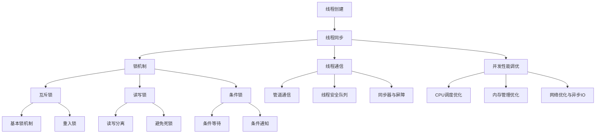

                 

# 《线程安全：LLM应用中的关键挑战》

> 关键词：线程安全、多线程编程、并发编程、LLM应用、死锁、数据竞争、锁机制、性能调优

> 摘要：本文将深入探讨线程安全在大型语言模型（LLM）应用中的关键挑战。我们将从线程安全的基础概念出发，逐步分析多线程编程的基础知识、并发编程的核心概念和锁机制，并探讨线程通信与协作的方法。随后，我们将聚焦于LLM应用中的线程安全问题，通过具体案例分析，提出应对策略。最后，本文将介绍高级线程安全技术和并发编程性能调优方法，以帮助开发者应对LLM应用中的关键挑战。

## 《线程安全：LLM应用中的关键挑战》目录大纲

### 第一部分：线程安全基础

### 第二部分：LLM应用中的线程安全挑战

### 第三部分：高级线程安全技术

### 附录

### 附录A：线程安全相关资源

### 附录B：核心概念与联系 Mermaid 流程图

### 附录C：数学模型和数学公式

### 附录D：项目实战

## 第一部分：线程安全基础

### 第1章：线程安全概述

### 第2章：多线程编程基础

### 第3章：并发编程核心概念

### 第4章：锁机制

### 第5章：线程通信与协作

## 第二部分：LLM应用中的线程安全挑战

### 第6章：LLM应用概述

### 第7章：LLM中的线程安全问题分析

### 第8章：应对LLM线程安全的策略

### 第9章：线程安全案例研究

## 第三部分：高级线程安全技术

### 第10章：锁的高级应用

### 第11章：线程池与并发库

### 第12章：并发编程性能调优

## 附录

### 附录A：线程安全相关资源

### 附录B：核心概念与联系 Mermaid 流程图

### 附录C：数学模型和数学公式

### 附录D：项目实战

### 第一章：线程安全概述

线程安全是计算机编程中的一个重要概念，尤其是在开发多线程应用时。线程安全指的是在多线程环境中，程序的行为不会因为线程的竞争而出现不可预料的结果。线程安全问题主要包括数据竞争、死锁和饥饿与活锁等。

线程安全的重要性体现在以下几个方面：

1. **保证程序的正确性**：在多线程环境中，线程之间的竞争可能导致程序出现意想不到的错误。线程安全可以确保程序在多线程环境下仍能正确执行。

2. **提升程序的性能**：合理利用多线程可以提高程序的并发性能。线程安全保证了多线程并行执行时的正确性，从而最大化利用计算机的多核处理器。

3. **提高代码的可维护性**：线程安全的代码更加简洁，减少了因为线程竞争而产生的问题，使得代码更容易维护和理解。

在多线程编程中，线程安全是必须要考虑的重要因素。接下来，我们将详细探讨线程安全的基础知识，包括线程与进程的基础概念、线程安全定义与重要性，以及线程安全问题概述。

#### 1.1 线程与进程基础

在多线程编程中，首先需要理解线程和进程这两个基本概念。

**进程**是计算机中的一个程序在执行过程中形成的运行实例，它包含了程序代码、数据、堆栈等资源。进程是资源分配的基本单位，操作系统通过进程来管理计算机的各类资源。进程的状态包括运行、就绪和阻塞等。

**线程**是进程中的一条执行路径，是程序执行的最小单位。线程共享进程的资源，但每个线程有独立的堆栈和局部变量。线程的状态包括创建、就绪、运行和阻塞等。

线程和进程之间的关系如下：

1. **一个进程可以包含多个线程**：多个线程共享进程的资源，如内存、文件描述符等。
2. **线程是进程内的执行单元**：进程中的多个线程可以并行执行，从而提升程序的并发性能。
3. **线程是调度和分派的基本单位**：操作系统能够根据线程的状态和优先级来调度线程的执行。

了解线程和进程的基础概念，有助于我们更好地理解多线程编程和线程安全。

#### 1.2 线程安全定义与重要性

线程安全指的是在多线程环境中，程序的行为不会因为线程的竞争而出现不可预料的结果。具体来说，线程安全有以下定义：

1. **不可变性**：如果一个对象在多线程环境中不会被其他线程修改，则该对象是线程安全的。
2. **不可见性**：如果一个对象的状态在多线程环境中不会因为线程的竞争而变得不可预测，则该对象是线程安全的。
3. **无状态性**：如果一个对象在整个生命周期中不会保持任何状态，则该对象是线程安全的。

线程安全的重要性体现在以下几个方面：

1. **保证程序的正确性**：在多线程环境中，线程之间的竞争可能导致程序出现意想不到的错误。线程安全可以确保程序在多线程环境下仍能正确执行。

2. **提升程序的性能**：合理利用多线程可以提高程序的并发性能。线程安全保证了多线程并行执行时的正确性，从而最大化利用计算机的多核处理器。

3. **提高代码的可维护性**：线程安全的代码更加简洁，减少了因为线程竞争而产生的问题，使得代码更容易维护和理解。

因此，在多线程编程中，关注线程安全是至关重要的。

#### 1.3 线程安全问题概述

线程安全问题主要包括以下几类：

1. **数据竞争**：多个线程访问同一数据，且至少有一个线程对数据进行写操作，可能导致数据不一致或错误。

2. **死锁**：多个线程互相等待对方持有的资源，导致所有线程都无法继续执行。

3. **饥饿与活锁**：线程因为资源不足或调度策略不合理，导致某些线程无法获得所需的资源，从而无法执行。

了解线程安全问题，有助于我们在开发过程中避免这些问题，确保程序的正确性和性能。

### 第2章：多线程编程基础

在理解了线程安全的重要性后，接下来我们将深入探讨多线程编程的基础知识，包括多线程模型、线程创建与销毁、以及线程同步与并发。

#### 2.1 多线程模型

多线程模型是指在程序中同时运行多个线程，以实现并发执行。根据线程的创建方式和调度方式，多线程模型可以分为以下几种：

1. **用户级线程（User-Level Threads）**：
   - **定义**：用户级线程由应用程序自己管理，操作系统并不直接支持。
   - **特点**：
     - 轻量级：线程的创建、切换和销毁开销较小。
     - 隔离性：线程间的切换不会影响系统级线程的执行。
     - 依赖性：线程的调度和同步完全由应用程序管理。

2. **内核级线程（Kernel-Level Threads）**：
   - **定义**：内核级线程由操作系统直接管理，是操作系统调度和资源分配的基本单位。
   - **特点**：
     - 强隔离性：线程间切换影响较大，但线程调度更加高效。
     - 面向资源：线程的调度和资源管理由操作系统直接控制。

3. **混合级线程（Mixed-Level Threads）**：
   - **定义**：混合级线程结合了用户级线程和内核级线程的特点，通常由应用程序创建，但由操作系统管理调度。
   - **特点**：
     - 高效性：线程的创建和切换开销较小，且调度更加灵活。
     - 可扩展性：可以同时利用用户级线程的轻量级优势和内核级线程的资源管理能力。

理解多线程模型有助于我们在开发过程中选择合适的多线程模型，以实现高效的并发执行。

#### 2.2 线程创建与销毁

线程的创建与销毁是多线程编程的基础操作。根据不同的编程语言和平台，线程的创建与销毁方式可能有所不同。以下是一个简单的线程创建与销毁的示例：

```python
import threading

# 线程创建
def thread_function():
    print("线程ID:", threading.current_thread().ident)

thread = threading.Thread(target=thread_function)
thread.start()

# 线程销毁
thread.join()
```

在这个示例中，我们首先定义了一个线程函数`thread_function`，然后使用`threading.Thread`创建一个新的线程，并启动它。线程执行完成后，我们使用`join`方法等待线程的结束，从而确保主线程在子线程执行完毕后再结束。

线程创建与销毁的步骤如下：

1. **定义线程函数**：线程函数是线程执行的入口，通常包含需要并发执行的任务。
2. **创建线程对象**：使用线程库提供的创建函数（如`threading.Thread`），将线程函数作为参数传递。
3. **启动线程**：调用线程对象的`start`方法，启动线程的执行。
4. **等待线程结束**：使用`join`方法等待线程的结束，确保线程执行完毕后再继续执行。
5. **销毁线程**：线程的生命周期结束后，会自动销毁。在需要手动管理线程的情况下，可以使用`terminate`方法强制终止线程。

了解线程创建与销毁的步骤有助于我们在开发过程中正确地管理和控制线程的生命周期。

#### 2.3 线程同步与并发

在多线程环境中，线程之间可能需要共享数据或资源，此时需要使用线程同步机制来确保线程之间的正确性和安全性。线程同步与并发主要包括以下几种机制：

1. **互斥锁（Mutex）**：
   - **定义**：互斥锁是一种常用的线程同步机制，用于保证在同一时间内只有一个线程能够访问共享资源。
   - **特点**：
     - 排他性：同一时刻只有一个线程可以持有互斥锁。
     - 可重入性：同一线程可以多次获取同一互斥锁。
     - 死锁风险：多个线程相互等待对方释放锁可能导致死锁。

2. **信号量（Semaphore）**：
   - **定义**：信号量是一种计数同步机制，用于限制对共享资源的访问数量。
   - **特点**：
     - 可共享性：信号量可以在多个线程之间共享。
     - 计数性：信号量的值表示可用资源的数量。
     - 信号量池：可以使用信号量池来管理一组信号量。

3. **条件变量（Condition Variable）**：
   - **定义**：条件变量是一种线程同步机制，用于线程之间的通信和协作。
   - **特点**：
     - 条件等待：线程可以等待某个条件成立，然后在条件满足时继续执行。
     - 条件通知：线程可以通知其他线程某个条件已经满足，从而使等待线程继续执行。

4. **读写锁（Read-Write Lock）**：
   - **定义**：读写锁是一种用于控制读写操作的同步机制，可以允许多个读线程同时访问资源，但写线程需要独占资源。
   - **特点**：
     - 读写分离：读写锁将读操作和写操作分开处理，提高了并发性能。
     - 避免死锁：读写锁可以避免多个读线程和写线程之间的死锁问题。

了解线程同步与并发机制有助于我们在多线程编程中正确地管理线程间的数据共享和资源竞争，确保程序的正确性和性能。

### 第3章：并发编程核心概念

在多线程编程中，了解并发编程的核心概念是至关重要的。这些概念包括数据竞争、死锁和饥饿与活锁。正确理解这些概念，并能够有效地避免和解决这些问题，是确保程序正确性和性能的关键。

#### 3.1 数据竞争

数据竞争是并发编程中最常见的问题之一。它发生在多个线程同时访问同一数据，并且至少有一个线程对数据进行写操作时。数据竞争可能导致以下问题：

1. **数据不一致**：线程之间的竞争可能导致数据在不同时间点上读取和写入不同的值，从而造成数据不一致。
2. **脏数据**：线程在读取和写入数据时，可能会读取到其他线程未完成的数据，导致读取到的数据无效。
3. **程序错误**：数据竞争可能导致程序出现逻辑错误，从而导致不可预料的行为。

避免数据竞争的方法包括：

1. **锁机制**：使用互斥锁（Mutex）或其他同步机制来确保同一时间只有一个线程能够访问共享数据。
2. **无共享**：通过设计，避免多个线程访问同一数据，从而消除数据竞争的可能性。
3. **线程局部存储**：使用线程局部存储（Thread Local Storage，TLS）来为每个线程提供独立的变量副本，从而避免线程间的数据冲突。

#### 3.2 死锁

死锁是指多个线程相互等待对方持有的资源，导致所有线程都无法继续执行的状态。死锁会导致程序无限期地挂起，从而无法完成任何工作。

死锁的形成条件包括：

1. **互斥条件**：资源必须互斥分配给线程，即同一时间只有一个线程能够访问资源。
2. **占有和等待条件**：线程已经持有至少一个资源，并等待获取其他资源。
3. **不可抢占条件**：已经分配给线程的资源不能被抢占，只有线程自己可以释放。
4. **循环等待条件**：存在一组线程，每个线程等待前一个线程持有的资源，形成一个循环等待链。

避免死锁的方法包括：

1. **资源分配策略**：采用资源分配策略，确保线程在请求资源时遵循特定的顺序，避免形成循环等待。
2. **资源释放顺序**：线程在释放资源时遵循统一的顺序，从而减少死锁的可能性。
3. **超时机制**：在请求资源时设置超时机制，如果等待时间超过指定时间，线程放弃等待并释放已持有的资源。

#### 3.3 饥饿与活锁

饥饿是指线程在执行过程中因为无法获得所需资源而长时间等待，从而导致无法完成任务的状况。活锁是指多个线程相互等待，导致它们都在不断地改变自己的状态，但没有任何一个线程能够取得进展。

饥饿和活锁的形成原因包括：

1. **资源分配策略**：不公平的资源分配策略可能导致某些线程长时间无法获得资源。
2. **线程优先级**：优先级调度策略可能导致低优先级线程无法获得执行机会。
3. **锁竞争**：锁竞争可能导致线程在等待锁的过程中长时间处于阻塞状态。

避免饥饿和活锁的方法包括：

1. **公平锁机制**：使用公平锁机制，确保线程按照进入等待队列的顺序获得资源。
2. **优先级反转**：通过优先级反转策略，防止低优先级线程长时间占用高优先级线程所需的资源。
3. **锁超时机制**：设置锁的超时机制，防止线程在等待锁的过程中长时间处于阻塞状态。

了解并发编程的核心概念，并掌握避免和解决数据竞争、死锁、饥饿与活锁的方法，是确保多线程程序正确性和性能的关键。在接下来的章节中，我们将进一步探讨锁机制和线程通信与协作，以帮助开发者更好地应对并发编程中的挑战。

### 第4章：锁机制

锁机制是确保多线程程序正确性和线程安全的重要手段。通过使用锁，我们可以控制线程对共享资源的访问，防止数据竞争和死锁等问题。在本节中，我们将详细介绍基本锁机制、条件锁和读写锁。

#### 4.1 基本锁机制

基本锁机制是锁的最简单形式，常用于保护共享资源，确保同一时间只有一个线程能够访问资源。

**互斥锁（Mutex）**：
- **定义**：互斥锁用于保证同一时间内只有一个线程可以访问共享资源。
- **使用方法**：
  ```python
  import threading

  mutex = threading.Lock()

  def thread_function():
      mutex.acquire()
      # 访问共享资源
      mutex.release()
  ```

**互斥锁的特点**：
- **排他性**：同一时间只有一个线程可以持有互斥锁。
- **可重入性**：同一线程可以多次获取同一互斥锁，直到线程释放所有持有锁的实例。

**死锁风险**：多个线程可能因为争夺锁而形成死锁。

**使用场景**：互斥锁常用于保护临界区，确保线程对共享资源的独占访问。

**重入锁（Reentrant Lock）**：
- **定义**：重入锁是一种可重入的互斥锁，允许线程在获取锁后再次获取锁，直到线程释放所有锁的实例。
- **使用方法**：
  ```python
  import threading

  reentrant_lock = threading.RLock()

  def thread_function():
      reentrant_lock.acquire()
      try:
          # 访问共享资源
      finally:
          reentrant_lock.release()
  ```

**重入锁的特点**：
- **可重入性**：同一线程可以多次获取同一锁实例。
- **公平性**：重入锁通常具有较好的公平性，确保线程按照进入锁等待队列的顺序获取锁。

**使用场景**：重入锁适用于需要多次获取同一资源的场景，如递归函数或需要重入的线程函数。

#### 4.2 条件锁

条件锁是一种特殊的锁，用于线程之间的同步和通信。它允许线程在满足特定条件时继续执行，否则进入等待状态。

**定义**：条件锁与互斥锁结合使用，线程在获取互斥锁后，可以使用条件锁等待特定条件成立。

**使用方法**：
```python
import threading

condition = threading.Condition()

def thread_function():
    with condition:
        # 等待特定条件
        condition.wait()
        # 条件满足，继续执行
```

**条件锁的特点**：
- **条件等待**：线程可以在满足特定条件时继续执行，否则进入等待状态。
- **条件通知**：线程可以通过条件锁通知其他线程特定条件已经成立，从而使等待线程继续执行。

**使用场景**：条件锁适用于需要线程之间同步和通信的场景，如生产者-消费者问题或线程之间的协作。

**示例**：
```python
import threading

condition = threading.Condition()

class ProducerConsumer:
    def __init__(self):
        self.data = []
        self.not_full = condition
        self.not_empty = condition

    def produce(self, item):
        with self.not_full:
            self.data.append(item)
            self.not_empty.notify()

    def consume(self):
        with self.not_empty:
            if not self.data:
                self.not_empty.wait()
            item = self.data.pop()
            self.not_full.notify()
            return item

producer = ProducerConsumer()

def producer_thread():
    for i in range(10):
        producer.produce(i)

def consumer_thread():
    for _ in range(10):
        print(producer.consume())

t1 = threading.Thread(target=producer_thread)
t2 = threading.Thread(target=consumer_thread)

t1.start()
t2.start()

t1.join()
t2.join()
```

在这个示例中，生产者和消费者线程通过条件锁实现同步和协作，确保生产者不会在缓冲区已满时生产数据，消费者不会在缓冲区为空时消费数据。

#### 4.3 读写锁

读写锁是一种用于控制读写操作的同步机制，可以允许多个读线程同时访问资源，但写线程需要独占资源。

**定义**：读写锁分为读锁和写锁，读锁允许多个线程同时读取资源，写锁确保同一时间内只有一个线程可以写入资源。

**使用方法**：
```python
import threading

class ReadWriteLock:
    def __init__(self):
        self.read_count = 0
        self.read_lock = threading.Lock()
        self.write_lock = threading.Lock()

    def read(self):
        with self.read_lock:
            self.read_count += 1
            if self.read_count == 1:
                with self.write_lock:
                    self.read_count -= 1

    def write(self):
        with self.write_lock:
            # 写操作
```

**读写锁的特点**：
- **读写分离**：读写锁将读操作和写操作分离，提高了并发性能。
- **避免死锁**：读写锁可以避免多个读线程和写线程之间的死锁问题。

**使用场景**：读写锁适用于读操作远多于写操作的场景，如数据库查询或缓存系统。

**示例**：
```python
import threading
import time

class DataStore:
    def __init__(self):
        self.data = []
        self.read_lock = threading.RLock()
        self.write_lock = threading.RLock()

    def read(self):
        with self.read_lock:
            print(f"Reading data: {self.data}")

    def write(self, item):
        with self.write_lock:
            self.data.append(item)
            time.sleep(1)  # 模拟写操作耗时

def reader_thread(data_store):
    for _ in range(5):
        data_store.read()

def writer_thread(data_store):
    for _ in range(5):
        data_store.write("Item")

data_store = DataStore()

t1 = threading.Thread(target=reader_thread, args=(data_store,))
t2 = threading.Thread(target=writer_thread, args=(data_store,))

t1.start()
t2.start()

t1.join()
t2.join()
```

在这个示例中，多个读线程可以同时读取数据，而写线程在写入数据时独占资源，避免了数据竞争和死锁问题。

通过了解和掌握基本锁机制、条件锁和读写锁，我们可以更好地管理线程对共享资源的访问，确保多线程程序的正确性和性能。在接下来的章节中，我们将探讨线程通信与协作，以帮助开发者实现更复杂的多线程应用。

### 第5章：线程通信与协作

在多线程编程中，线程之间的通信与协作是实现并发任务的重要手段。有效的线程通信和协作能够提高程序的并发性能，确保任务执行的有序性和正确性。在本节中，我们将介绍线程通信与协作的基本方法，包括管道通信、线程安全队列和同步器与屏障。

#### 5.1 管道通信

管道通信是一种简单的线程间数据传输方法，允许一个线程将数据发送到管道，另一个线程从管道中读取数据。管道通信通常用于线程之间的数据传递和消息传递。

**定义**：管道通信通过操作系统提供的管道实现，每个管道有一个输入端和一个输出端，线程可以通过读写操作进行通信。

**使用方法**：
```python
import threading
import os

def writer(pipe):
    for i in range(10):
        os.write(pipe[1], f"{i}\n".encode())

def reader(pipe):
    while True:
        data = os.read(pipe[0], 1024)
        if not data:
            break
        print(data.decode())

pipe = os.pipe()
t1 = threading.Thread(target=writer, args=(pipe,))
t2 = threading.Thread(target=reader, args=(pipe,))

t1.start()
t2.start()

t1.join()
t2.join()
os.close(pipe[0])
os.close(pipe[1])
```

**管道通信的特点**：
- **简单易用**：管道通信通过标准IO操作实现，无需复杂的同步机制。
- **单向通信**：管道通信通常是单向的，一个线程写入管道，另一个线程读取管道。

**使用场景**：管道通信适用于简单线程间数据传递和消息传递的场景，如控制台应用程序。

#### 5.2 线程安全队列

线程安全队列是一种支持多线程环境下的数据存储和传输的数据结构，确保线程之间能够安全地添加和读取数据。常见的线程安全队列实现包括队列锁、条件变量和读写锁等。

**定义**：线程安全队列是一种并发数据结构，支持线程安全的入队和出队操作。

**使用方法**：
```python
import threading
import queue

def producer(queue):
    for i in range(10):
        queue.put(i)

def consumer(queue):
    while not queue.empty():
        print(queue.get())

q = queue.Queue()
t1 = threading.Thread(target=producer, args=(q,))
t2 = threading.Thread(target=consumer, args=(q,))

t1.start()
t2.start()

t1.join()
t2.join()
```

**线程安全队列的特点**：
- **线程安全**：线程安全队列通过内置的同步机制，确保线程之间的操作不会相互干扰。
- **高效性**：线程安全队列通常采用锁机制，保证队列操作的原子性和一致性。

**使用场景**：线程安全队列适用于需要线程之间传递和共享数据的场景，如生产者-消费者问题。

#### 5.3 同步器与屏障

同步器（CyclicBarrier）和屏障（Barrier）是一种用于线程之间同步的机制，确保一组线程在达到某个点时同时执行。

**定义**：同步器是一种循环屏障，线程在达到同步点时等待其他线程到达，然后同时执行。屏障是一种一次性屏障，线程在达到同步点时等待其他线程到达，然后依次执行。

**使用方法**：
```python
import threading

class CyclicBarrier:
    def __init__(self, count):
        self.count = count
        self.barrier = threading.Barrier(count)

    def wait(self):
        self.barrier.wait()

cb = CyclicBarrier(2)

def thread_function():
    cb.wait()
    print("Thread completed")

t1 = threading.Thread(target=thread_function)
t2 = threading.Thread(target=thread_function)

t1.start()
t2.start()

t1.join()
t2.join()
```

**同步器与屏障的特点**：
- **同步点**：线程在达到同步点时等待其他线程到达，确保线程之间的执行顺序。
- **循环性**：同步器支持循环使用，线程可以在多个同步点之间切换。

**使用场景**：同步器和屏障适用于需要线程之间同步执行的场景，如分布式计算或并行算法。

通过了解和掌握线程通信与协作的基本方法，我们可以更好地实现多线程程序中的数据传输和任务同步。在实际开发过程中，根据具体需求选择合适的通信与协作方法，能够有效提高程序的并发性能和正确性。在接下来的章节中，我们将探讨LLM应用中的线程安全挑战，帮助开发者应对这些挑战。

### 第6章：LLM应用概述

大型语言模型（Large Language Model，简称LLM）是一种基于深度学习的自然语言处理（Natural Language Processing，简称NLP）模型，它能够对自然语言进行理解和生成。LLM在诸多领域展现出强大的应用潜力，如智能客服、机器翻译、文本生成等。随着LLM的不断发展，其在实际应用中的重要性日益增加。

#### 6.1 LLM的定义与特点

**定义**：
LLM是一种通过训练大量文本数据，使其具备对自然语言进行理解和生成能力的人工智能模型。这些模型通常基于深度学习框架，如Transformer、BERT等，通过多层神经网络对文本数据进行处理，从而实现语义理解、文本生成等功能。

**特点**：
1. **大规模训练数据**：LLM通常需要训练数百万到数十亿级别的文本数据，从而具备强大的语义理解能力。
2. **深度神经网络**：LLM采用多层神经网络结构，通过逐层提取特征，实现对文本的深入理解。
3. **并行计算能力**：LLM在训练和推理过程中，能够充分利用GPU和TPU等并行计算资源，提高计算效率。
4. **自适应性和灵活性**：LLM能够根据不同的应用场景和任务需求，进行自适应调整和优化。

#### 6.2 LLM应用领域

LLM在多个领域展现出强大的应用潜力，以下是一些典型的应用场景：

1. **智能客服**：LLM能够自动处理用户提问，提供快速、准确的回复，提升客服效率和服务质量。
2. **机器翻译**：LLM能够对多种语言进行实时翻译，支持跨语言沟通和国际化业务。
3. **文本生成**：LLM能够生成文章、新闻、报告等文本内容，应用于内容创作和自动化写作。
4. **问答系统**：LLM能够理解用户提问，提供详细、准确的答案，应用于智能问答和知识库构建。
5. **文本分类**：LLM能够对文本进行分类，应用于情感分析、新闻分类、垃圾邮件检测等。
6. **对话系统**：LLM能够构建自然、流畅的对话系统，应用于聊天机器人、虚拟助手等。

#### 6.3 线程安全在LLM应用中的关键性

线程安全在LLM应用中的重要性不可忽视。由于LLM模型通常需要处理大规模数据和复杂任务，多线程编程成为提高性能和效率的关键手段。然而，多线程环境也引入了线程安全问题，如数据竞争、死锁等，这些问题可能导致模型运行不稳定、性能下降，甚至出现严重错误。

**线程安全的关键性**：
1. **保证模型正确性**：在多线程环境中，线程之间的竞争可能导致模型输出不一致或错误。线程安全能够确保模型在多线程环境下仍然保持正确的输出。
2. **提升性能**：合理利用多线程可以提高LLM模型的计算效率和性能。线程安全使得多线程并行执行成为可能，从而最大化利用计算机的多核处理器。
3. **减少错误率**：线程安全能够减少因为线程竞争而产生的问题，如数据竞争和死锁。通过确保线程之间的正确性和同步性，降低模型出错的风险。
4. **提高可维护性**：线程安全的代码更加简洁、易于理解和维护。线程安全设计使得代码结构更加清晰，减少因为线程问题导致的复杂性和维护难度。

总之，线程安全在LLM应用中扮演着关键角色。开发者需要深入了解线程安全的基本概念和机制，掌握多线程编程技巧，确保LLM模型在多线程环境下的正确性和性能。在下一章节中，我们将分析LLM应用中的线程安全问题，探讨如何识别和解决这些挑战。

### 第7章：LLM中的线程安全问题分析

在LLM应用中，线程安全问题尤为突出。由于LLM模型通常处理大规模数据和复杂任务，多线程编程成为提高性能和效率的关键手段。然而，多线程环境也引入了线程安全问题，如数据竞争、死锁等。为了确保LLM应用的正确性和性能，我们需要深入分析这些线程安全问题。

#### 7.1 数据竞争分析

数据竞争是线程安全问题中最常见的一种，它发生在多个线程同时访问同一数据，并且至少有一个线程对数据进行写操作时。在LLM应用中，数据竞争可能导致以下问题：

1. **不一致的模型输出**：由于线程之间的竞争，模型可能会读取和写入不同时间段的数据，导致输出不一致。
2. **性能下降**：数据竞争可能导致线程频繁等待锁，从而降低程序的并发性能。
3. **程序崩溃**：在极端情况下，数据竞争可能导致内存损坏或程序崩溃。

**案例**：假设一个LLM应用在训练过程中需要使用共享的文本数据集。如果多个线程同时从数据集中读取样本，且至少有一个线程在更新样本，那么数据竞争问题就会出现。

**解决方案**：
1. **互斥锁**：通过使用互斥锁，确保同一时间只有一个线程能够访问共享数据集。例如，在读取数据之前，线程需要获取一个互斥锁，在读取完成后释放锁。
   ```python
   import threading

   data_set = []
   data_lock = threading.Lock()

   def read_data():
       with data_lock:
           # 读取数据
           pass
   ```

2. **无共享**：通过设计，避免多个线程访问同一数据。例如，为每个线程分配独立的数据集副本，从而消除数据竞争的可能性。

3. **线程局部存储**：使用线程局部存储（Thread Local Storage，TLS）为每个线程提供独立的数据副本，从而避免线程间的数据冲突。

#### 7.2 死锁案例分析

死锁是指多个线程相互等待对方持有的资源，导致所有线程都无法继续执行的状态。在LLM应用中，死锁可能导致程序无限期地挂起，从而无法完成任何工作。以下是一个简单的死锁案例：

**案例**：假设有两个线程T1和T2，T1持有资源A，等待资源B；T2持有资源B，等待资源A。由于两个线程都持有对方需要的资源，且都不释放自己持有的资源，导致死锁。

**解决方案**：
1. **资源分配策略**：采用资源分配策略，确保线程在请求资源时遵循特定的顺序，避免形成循环等待。例如，可以要求线程在请求资源时先获取资源A，再获取资源B。
2. **资源释放顺序**：线程在释放资源时遵循统一的顺序，从而减少死锁的可能性。例如，可以要求线程在释放资源时先释放资源A，再释放资源B。
3. **超时机制**：在请求资源时设置超时机制，如果等待时间超过指定时间，线程放弃等待并释放已持有的资源。

#### 7.3 饥饿与活锁案例分析

饥饿是指线程在执行过程中因为无法获得所需资源而长时间等待，从而导致无法完成任务的状况。活锁是指多个线程相互等待，导致它们都在不断地改变自己的状态，但没有任何一个线程能够取得进展。以下是一个简单的饥饿与活锁案例：

**案例**：假设有一个线程T1持有资源A，等待资源B；线程T2持有资源B，等待资源A。由于线程T1和T2都在等待对方持有的资源，导致两者都无法继续执行，从而形成饥饿。如果线程T1和T2在等待过程中不断改变状态，但始终无法获得所需资源，则形成活锁。

**解决方案**：
1. **公平锁机制**：使用公平锁机制，确保线程按照进入等待队列的顺序获得资源。例如，可以使用`threading.Semaphore`来实现公平锁。
2. **优先级反转**：通过优先级反转策略，防止低优先级线程长时间占用高优先级线程所需的资源。例如，可以设置一个优先级队列，优先分配资源给高优先级线程。
3. **锁超时机制**：设置锁的超时机制，防止线程在等待锁的过程中长时间处于阻塞状态。例如，可以使用`threading.Condition`实现锁的超时机制。

通过分析LLM应用中的线程安全问题，我们可以更好地识别和解决数据竞争、死锁、饥饿与活锁等问题。在下一章节中，我们将探讨应对LLM线程安全的策略，帮助开发者有效应对这些挑战。

### 第8章：应对LLM线程安全的策略

在LLM应用中，线程安全是一个关键问题。为了确保程序的正确性和性能，我们需要采取一系列策略来应对线程安全问题。这些策略包括代码优化策略、设计模式与框架选择，以及测试与监控。

#### 8.1 代码优化策略

代码优化是提升线程安全性的重要手段。以下是一些代码优化策略：

1. **最小化共享数据**：通过设计，尽量减少线程之间需要共享的数据量。这可以通过为每个线程分配独立的数据副本来实现。

2. **避免数据竞争**：在访问共享数据时，尽量使用锁机制来防止数据竞争。例如，使用互斥锁（Mutex）来保护临界区，确保同一时间只有一个线程可以访问共享资源。

3. **减少锁的持有时间**：尽量减少锁的持有时间，避免线程长时间占用锁。例如，可以将复杂的操作拆分为多个步骤，在不需要锁的时候立即释放锁。

4. **使用读写锁**：对于读操作远多于写操作的场景，可以使用读写锁（Read-Write Lock）来提高并发性能。读写锁允许多个线程同时读取数据，但确保写操作独占资源。

5. **使用线程局部存储（TLS）**：通过线程局部存储，为每个线程提供独立的数据存储空间，从而避免线程之间的数据冲突。

6. **合理使用异步编程**：在适当的情况下，使用异步编程技术，如异步IO、异步任务等，减少线程阻塞和等待时间，提高程序的并发性能。

#### 8.2 设计模式与框架选择

设计模式和框架的选择对于提高线程安全性至关重要。以下是一些常用的设计模式和框架：

1. **生产者-消费者模式**：生产者和消费者线程通过线程安全队列进行数据交换，避免直接共享数据，从而减少数据竞争问题。

2. **任务调度器模式**：使用任务调度器来管理线程任务，例如，使用线程池（Thread Pool）来管理固定数量的线程，从而避免线程数量过多导致的资源竞争和性能下降。

3. **中介者模式**：使用中介者来协调多个线程之间的通信，避免直接交互，从而降低复杂度和同步需求。

4. **异步编程框架**：如Python的`asyncio`、Java的`CompletableFuture`等，提供异步编程的支持，减少线程阻塞和等待时间，提高并发性能。

5. **并发库**：使用成熟的并发库，如Java的`java.util.concurrent`、Python的`threading`等，提供各种线程同步和并发控制机制，简化开发过程。

6. **框架选择**：根据具体应用场景和需求，选择适合的框架，如对于高性能计算，可以使用TensorFlow、PyTorch等深度学习框架，它们提供了丰富的并发编程接口和优化策略。

#### 8.3 测试与监控

测试和监控是确保线程安全性的重要环节。以下是一些测试和监控策略：

1. **单元测试**：编写单元测试来验证线程安全代码的功能和性能。通过模拟多线程环境，测试代码在各种并发场景下的行为，确保其正确性和稳定性。

2. **性能测试**：使用性能测试工具，如JMeter、Gatling等，模拟大量并发请求，评估线程安全代码的性能和可扩展性。

3. **稳定性测试**：通过长时间运行测试，模拟实际运行环境，检测线程安全代码的稳定性和健壮性。

4. **静态代码分析**：使用静态代码分析工具，如FindBugs、SonarQube等，检测代码中的潜在线程安全问题，如数据竞争、死锁等。

5. **动态监控**：在应用程序运行过程中，使用动态监控工具，如NewRelic、AppDynamics等，实时监控线程的状态和性能指标，及时发现和解决线程安全问题。

6. **日志分析**：记录和监控应用程序的日志，分析线程错误、死锁等异常情况，帮助开发者定位和解决线程安全问题。

通过实施上述代码优化策略、设计模式与框架选择，以及测试与监控策略，我们可以有效应对LLM应用中的线程安全问题，确保程序的正确性和性能。在下一章节中，我们将通过具体案例研究，进一步探讨线程安全问题在实际应用中的具体表现和解决方法。

### 第9章：线程安全案例研究

在本章中，我们将通过三个具体案例研究，深入探讨线程安全在LLM应用中的表现和解决方法。这些案例分别涉及电商系统中的并发问题、社交媒体平台中的死锁问题，以及在线翻译服务中的饥饿问题。

#### 9.1 案例一：电商系统中的并发问题

**问题描述**：一个电商系统在处理订单时，多个线程同时访问共享订单数据，导致数据竞争问题。具体表现为订单状态不一致，库存数量错误。

**问题分析**：电商系统中的订单处理涉及多个线程，例如，用户下单、库存检查、支付处理等。在处理订单时，多个线程可能同时读取和修改订单状态及库存数据，导致数据不一致。

**解决方案**：
1. **互斥锁**：在处理订单的每个步骤中使用互斥锁，确保同一时间只有一个线程可以访问订单数据。
   ```python
   order_lock = threading.Lock()

   def process_order(order):
       with order_lock:
           # 订单处理逻辑
   ```

2. **原子操作**：使用原子操作来处理订单状态和库存更新，避免中间状态的数据不一致。
   ```python
   def update_inventory(product, quantity):
       with atomic_lock:
           current_quantity = inventory[product]
           inventory[product] = current_quantity - quantity
   ```

3. **事务管理**：使用事务管理来确保订单处理的原子性和一致性。例如，使用数据库的事务机制来处理订单和库存更新。

**效果**：通过使用互斥锁和原子操作，电商系统能够有效避免数据竞争问题，确保订单处理的一致性和准确性。

#### 9.2 案例二：社交媒体平台中的死锁问题

**问题描述**：一个社交媒体平台在处理用户关注关系时，多个线程相互等待对方释放资源，导致死锁问题。具体表现为用户无法正常关注和取消关注。

**问题分析**：社交媒体平台中的关注关系管理涉及多个线程，例如，用户A关注用户B、用户B关注用户C等。在处理关注关系时，多个线程可能同时请求更新用户A、B、C的关注状态，导致相互等待对方释放资源，形成死锁。

**解决方案**：
1. **资源分配策略**：采用资源分配策略，确保线程在请求资源时遵循特定的顺序，避免形成循环等待。例如，可以要求线程在请求关注关系时，先更新用户A的关注状态，再更新用户B的关注状态。
   ```python
   def update_following(user, following_user):
       with following_lock:
           if user not in following_user.following:
               following_user.following.add(user)
               user.followers.add(following_user)
   ```

2. **超时机制**：在请求资源时设置超时机制，如果等待时间超过指定时间，线程放弃等待并释放已持有的资源。
   ```python
   def update_following_with_timeout(user, following_user):
       try:
           update_following(user, following_user)
       except TimeoutError:
           # 处理超时情况，释放资源
   ```

**效果**：通过采用资源分配策略和超时机制，社交媒体平台能够有效避免死锁问题，确保用户关注关系的正常处理。

#### 9.3 案例三：在线翻译服务中的饥饿问题

**问题描述**：一个在线翻译服务在处理大量请求时，某些线程长时间无法获得所需资源，导致饥饿问题。具体表现为部分用户请求无法得到及时响应。

**问题分析**：在线翻译服务涉及多个线程，例如，用户A请求翻译、用户B请求翻译等。在处理翻译请求时，线程可能因为资源分配不均或锁竞争而长时间等待，导致某些线程无法得到及时响应。

**解决方案**：
1. **公平锁机制**：使用公平锁机制，确保线程按照进入等待队列的顺序获得资源。
   ```python
   from threading import Semaphore

   translation_semaphore = Semaphore(10)  # 允许同时进行10个翻译任务

   def translate(text):
       translation_semaphore.acquire()
       try:
           # 翻译逻辑
       finally:
           translation_semaphore.release()
   ```

2. **优先级反转**：通过优先级反转策略，防止低优先级线程长时间占用高优先级线程所需的资源。
   ```python
   import threading

   high_priority_semaphore = threading.Semaphore(1)

   def high_priority_task():
       with high_priority_semaphore:
           # 高优先级任务逻辑

   def low_priority_task():
       with high_priority_semaphore:
           try:
               # 低优先级任务逻辑
           except threading.ThreadPriorityError:
               # 优先级反转处理
   ```

**效果**：通过采用公平锁机制和优先级反转策略，在线翻译服务能够有效避免饥饿问题，确保用户请求得到及时响应。

通过这些案例研究，我们可以看到线程安全在LLM应用中的重要性以及解决线程安全问题的多种策略。开发者应深入了解线程安全的基本概念，掌握多种解决方法，以确保应用程序的正确性和性能。

### 第10章：锁的高级应用

锁机制是确保多线程程序正确性和线程安全的核心手段。在上一章中，我们介绍了基本锁机制、条件锁和读写锁。在本章中，我们将进一步探讨锁的高级应用，包括不可中断锁、读写锁优化和轻量级锁。

#### 10.1 不可中断锁

不可中断锁（Immutable Lock）是一种不允许被中断的锁，线程在持有锁期间，即使发生中断（如异常），也不会释放锁。这种锁通常用于确保某些关键操作的原子性，避免在操作未完成时意外释放锁。

**定义**：不可中断锁在Python中通过`threading.RLock`实现，它是一种可重入的互斥锁，不允许在中途被释放。

**使用方法**：
```python
import threading

immutable_lock = threading.RLock()

def critical_section():
    immutable_lock.acquire()
    try:
        # 关键操作
    finally:
        immutable_lock.release()
```

**不可中断锁的特点**：
- **原子性**：确保关键操作在持有锁的情况下不会被中断，从而保证操作的原子性。
- **安全性**：在处理异常时，不会因为锁被意外释放而导致程序状态不一致。

**使用场景**：不可中断锁适用于需要确保操作原子性且不允许中途释放锁的场景，如数据库操作或文件写入。

#### 10.2 读写锁优化

读写锁（Read-Write Lock）是一种允许多个读线程并发访问资源，但确保写线程独占访问的锁机制。在读写锁中，读锁和写锁分别管理资源的读取和写入权限。

**定义**：读写锁通过`threading.ReadWriteLock`实现，它提供了`read_lock`和`write_lock`方法来管理读锁和写锁。

**使用方法**：
```python
from threading import ReadWriteLock

read_write_lock = ReadWriteLock()

def read_data():
    with read_write_lock.read_lock:
        # 读取操作

def write_data():
    with read_write_lock.write_lock:
        # 写入操作
```

**读写锁的特点**：
- **读写分离**：读锁和写锁独立管理，读操作不会阻塞写操作，从而提高并发性能。
- **锁升级**：在某些情况下，读锁可以升级为写锁，确保写操作得到及时处理。

**读写锁优化**：
1. **读写锁缓存**：在读写锁中添加缓存机制，减少读操作的锁获取次数，从而提高性能。
2. **读锁优先级**：在读写锁中，提高读锁的优先级，确保读操作不被写操作长时间阻塞。
3. **锁分段**：将读写锁分为多个段，每个段管理一部分资源，从而减少锁的竞争，提高并发性能。

**使用场景**：读写锁适用于读操作远多于写操作的场景，如缓存系统或数据库查询。

#### 10.3 轻量级锁

轻量级锁（Lightweight Lock）是一种比传统互斥锁性能更高的锁机制，它通过减少锁的占用时间来提高并发性能。轻量级锁通常用于保护对共享数据的短时间访问，减少线程的阻塞时间。

**定义**：轻量级锁在Python中通过`threading.Semaphore`实现，它是一种可重入的信号量，允许线程在短时间内获取锁。

**使用方法**：
```python
import threading

lightweight_lock = threading.Semaphore(1)

def critical_section():
    lightweight_lock.acquire()
    try:
        # 关键操作
    finally:
        lightweight_lock.release()
```

**轻量级锁的特点**：
- **快速获取与释放**：轻量级锁的获取和释放操作非常迅速，减少线程的阻塞时间。
- **可重入性**：轻量级锁支持线程多次获取，直到线程释放所有锁的实例。

**使用场景**：轻量级锁适用于对共享数据的短时间内访问，如缓存更新或日志记录。

通过了解和掌握不可中断锁、读写锁优化和轻量级锁的高级应用，开发者可以更有效地管理多线程程序中的锁机制，提高程序的并发性能和正确性。在下一章节中，我们将介绍线程池与并发库，帮助开发者更好地应对复杂的并发编程挑战。

### 第11章：线程池与并发库

线程池和并发库是现代并发编程中不可或缺的工具，它们帮助开发者高效地管理线程资源，简化并发编程的复杂性。在本章中，我们将介绍几种常见的线程池和并发库，包括Java并发库、C++并发库和Python并发库。

#### 11.1 Java并发库简介

Java并发库是Java标准库的一部分，提供了丰富的并发编程工具。它包括线程池、并发集合、同步器等多种并发编程组件。

**线程池**：
Java线程池通过`java.util.concurrent.Executor`接口和其实现类提供。线程池可以管理一组线程，根据任务的需求动态创建、复用和销毁线程，从而提高程序的并发性能。

**示例**：
```java
import java.util.concurrent.ExecutorService;
import java.util.concurrent.Executors;

public class ThreadPoolExample {
    public static void main(String[] args) {
        ExecutorService executor = Executors.newFixedThreadPool(5);
        
        for (int i = 0; i < 10; i++) {
            executor.execute(new Task(i));
        }
        
        executor.shutdown();
    }
    
    static class Task implements Runnable {
        private final int id;
        
        public Task(int id) {
            this.id = id;
        }
        
        @Override
        public void run() {
            System.out.println("Task " + id + " is running.");
        }
    }
}
```

**并发集合**：
Java并发库提供了多个并发集合类，如`java.util.concurrent.ConcurrentHashMap`和`java.util.concurrent.CopyOnWriteArrayList`。这些集合类在多线程环境下提供了高效的并发访问和修改操作。

**示例**：
```java
import java.util.concurrent.ConcurrentHashMap;

public class ConcurrentHashMapExample {
    public static void main(String[] args) {
        ConcurrentHashMap<Integer, String> concurrentMap = new ConcurrentHashMap<>();
        
        concurrentMap.put(1, "One");
        concurrentMap.put(2, "Two");
        
        System.out.println(concurrentMap.get(1));  // Output: One
    }
}
```

#### 11.2 C++并发库简介

C++并发库是C++标准库的一部分，提供了多种并发编程工具。它包括线程池、并发队列、互斥锁等多种并发编程组件。

**线程池**：
C++线程池通过`std::thread`和`std::async`提供。线程池可以管理一组线程，根据任务的需求动态创建、复用和销毁线程，从而提高程序的并发性能。

**示例**：
```cpp
#include <iostream>
#include <thread>
#include <vector>

void task(int id) {
    std::cout << "Task " << id << " is running." << std::endl;
}

int main() {
    std::vector<std::thread> threads;

    for (int i = 0; i < 10; ++i) {
        threads.push_back(std::thread(task, i));
    }

    for (auto& t : threads) {
        t.join();
    }

    return 0;
}
```

**并发队列**：
C++并发库提供了多个并发队列类，如`std::queue`和`std::priority_queue`。这些队列类在多线程环境下提供了高效的并发访问和修改操作。

**示例**：
```cpp
#include <iostream>
#include <thread>
#include <queue>
#include <mutex>
#include <condition_variable>

std::mutex mtx;
std::condition_variable cv;
std::queue<int> queue;

void producer() {
    std::unique_lock<std::mutex> lock(mtx);
    for (int i = 0; i < 10; ++i) {
        queue.push(i);
        std::cout << "Produced: " << i << std::endl;
        cv.notify_one();
    }
}

void consumer() {
    std::unique_lock<std::mutex> lock(mtx);
    while (queue.empty()) {
        cv.wait(lock);
    }
    int value = queue.front();
    queue.pop();
    std::cout << "Consumed: " << value << std::endl;
}

int main() {
    std::thread t1(producer);
    std::thread t2(consumer);

    t1.join();
    t2.join();

    return 0;
}
```

#### 11.3 Python并发库简介

Python并发库提供了多种并发编程工具，如线程池、异步IO和协程。Python的并发编程库使得开发者可以更轻松地编写高效的并发程序。

**线程池**：
Python的线程池通过`threading`模块提供。线程池可以管理一组线程，根据任务的需求动态创建、复用和销毁线程，从而提高程序的并发性能。

**示例**：
```python
import threading
import time

def task(id):
    print(f"Task {id} is running.")
    time.sleep(1)

threads = []
for i in range(10):
    threads.append(threading.Thread(target=task, args=(i,)))

for t in threads:
    t.start()

for t in threads:
    t.join()
```

**异步IO**：
Python的异步IO通过`asyncio`模块提供。异步IO允许程序在等待IO操作时释放CPU资源，从而实现高效的并发执行。

**示例**：
```python
import asyncio

async def task(id):
    print(f"Task {id} is running.")
    await asyncio.sleep(1)

async def main():
    tasks = [asyncio.create_task(task(i)) for i in range(10)]
    await asyncio.wait(tasks)

asyncio.run(main())
```

**协程**：
Python的协程通过`asyncio`模块提供。协程是一种轻量级的并发编程方式，允许开发者以简洁的方式编写异步代码。

**示例**：
```python
import asyncio

async def task(id):
    print(f"Task {id} is running.")
    await asyncio.sleep(1)

async def main():
    await asyncio.gather(task(1), task(2), task(3))

asyncio.run(main())
```

通过介绍Java并发库、C++并发库和Python并发库，我们可以看到不同编程语言在并发编程方面的特点和优势。开发者可以根据具体需求和场景选择合适的并发库，提高程序的并发性能和可维护性。

### 第12章：并发编程性能调优

在并发编程中，性能调优是一个重要的环节，它直接影响到程序的执行效率和资源利用率。有效的性能调优策略可以显著提升程序的并发性能，确保在多线程环境中充分发挥计算机的性能。在本章中，我们将探讨几个关键的性能调优方法，包括CPU调度优化、内存管理优化和网络优化与异步IO。

#### 12.1 CPU调度优化

CPU调度优化是提高并发性能的关键步骤之一。合理的CPU调度策略可以确保线程在多核处理器上高效地执行，减少线程的切换和上下文切换开销。

**1. 线程调度策略**：
线程调度策略直接影响线程的执行顺序和效率。常见的线程调度策略包括：
- **时间片轮转（Time-Sliced Round-Robin）**：每个线程分配一个时间片，轮流执行，直到时间片用尽或线程主动释放CPU。
- **优先级调度（Priority Scheduling）**：根据线程的优先级来决定线程的执行顺序，高优先级线程先执行。
- **公平共享（Fair-Share Scheduling）**：确保每个线程获得相等的CPU时间，避免某些线程占用过多资源。

**2. CPU亲和性**：
CPU亲和性（CPU Affinity）是指线程绑定到特定CPU核心，以减少线程之间的上下文切换和缓存失效开销。在多核处理器上，通过设置线程的CPU亲和性，可以优化线程的执行顺序和性能。

**3. 异步执行**：
异步执行（Asynchronous Execution）通过将IO操作与线程分离，减少线程的等待时间，提高CPU的利用率。在IO密集型任务中，使用异步IO技术可以显著提升程序的并发性能。

#### 12.2 内存管理优化

内存管理优化是提升并发性能的另一个重要方面。合理的内存管理策略可以减少内存争用和垃圾回收的开销，确保程序在高并发环境下稳定运行。

**1. 堆内存分配优化**：
堆内存（Heap Memory）是程序动态分配内存的地方。在高并发场景中，频繁的堆内存分配和垃圾回收会降低程序的性能。优化策略包括：
- **对象池（Object Pool）**：使用对象池复用对象，减少对象的创建和销毁次数。
- **内存分配策略**：优化内存分配策略，减少内存碎片和内存分配开销。

**2. 缓存管理**：
缓存（Cache）是位于CPU和内存之间的高速缓存，对程序的执行效率有重要影响。优化缓存管理可以减少缓存失效的次数，提高程序的局部性：
- **数据局部性（Data Locality）**：提高数据访问的局部性，减少缓存失效的次数。
- **代码局部性（Code Locality）**：优化代码布局，减少代码块的跳转和分支预测失败。

**3. 垃圾回收**：
垃圾回收（Garbage Collection，GC）是自动内存管理的重要机制。在高并发场景中，频繁的垃圾回收会导致性能下降。优化策略包括：
- **增量垃圾回收**：将垃圾回收分为多个小步骤，减少每次垃圾回收的开销。
- **暂停时间优化**：优化垃圾回收的暂停时间，确保程序在垃圾回收期间保持较高的吞吐量。

#### 12.3 网络优化与异步IO

网络优化和异步IO是提高并发性能的关键技术，特别是在处理大量IO密集型任务时。

**1. 网络优化**：
网络优化主要包括以下几个方面：
- **连接池（Connection Pool）**：复用网络连接，减少连接建立和关闭的开销。
- **负载均衡（Load Balancing）**：通过负载均衡器分配网络请求，均衡服务器负载，提高系统的处理能力。
- **压缩与加密**：优化数据传输的压缩和加密策略，减少网络传输的数据量，提高传输效率。

**2. 异步IO**：
异步IO通过将IO操作与线程分离，减少线程的等待时间，提高CPU的利用率。异步IO技术包括：
- **非阻塞IO**：非阻塞IO允许程序在IO操作完成前继续执行其他任务，减少线程的等待时间。
- **事件驱动编程（Event-Driven Programming）**：通过事件驱动编程，程序在事件触发时执行相应的处理逻辑，实现高效的并发处理。

**3. 高性能IO库**：
使用高性能IO库，如Java的NIO、C++的Boost.Asio、Python的asyncio等，可以提高IO操作的效率和并发性能。

通过优化CPU调度、内存管理和网络与异步IO，我们可以显著提升并发编程的性能，确保在高并发环境下程序的稳定性和高效性。

### 附录A：线程安全相关资源

为了更好地理解和掌握线程安全，以下是一些推荐的线程安全相关资源，包括开源并发库、并发编程书籍、在线工具和社区论坛。

#### A.1 开源并发库

1. **Java并发库**：
   - `java.util.concurrent`：Java标准并发库，提供线程池、并发集合、同步器等多种并发编程工具。
   - `Akka`：一个基于Actor模型的并发框架，支持高性能、高可靠性的并发编程。

2. **C++并发库**：
   - `Boost.Thread`：Boost库中的线程库，提供线程管理、锁机制、条件变量等并发编程工具。
   - `std::async`：C++11标准库中的异步编程工具，支持并发任务执行。

3. **Python并发库**：
   - `asyncio`：Python的标准库，提供异步IO和协程，实现高效的并发编程。
   - `Tornado`：一个基于异步非阻塞的网络框架，支持并发网络编程。

#### A.2 并发编程书籍推荐

1. 《Java并发编程实战》
   - 作者：Brian Goetz et al.
   - 简介：本书详细介绍了Java并发编程的核心概念和最佳实践，包括线程安全、并发集合、同步器等。

2. 《C++并发编程指南》
   - 作者：Anthony Williams
   - 简介：本书讲解了C++11和C++14中的并发编程特性，包括线程、锁机制、异步IO等。

3. 《Python并发编程》
   - 作者：Luciano Ramalho
   - 简介：本书介绍了Python的并发编程技术，包括异步IO、协程、多线程等。

#### A.3 线程安全在线工具

1. **Godbolt Compiler Explorer**：
   - 网址：[https://godbolt.org/](https://godbolt.org/)
   - 简介：一个在线编译器，可以实时查看不同编译器和优化选项对程序性能和线程安全的影响。

2. **Concurrency Visualizer**：
   - 网址：[https://www.concurrencyvisualizer.com/](https://www.concurrencyvisualizer.com/)
   - 简介：一个可视化工具，用于分析和调试多线程程序的执行过程。

3. **ThreadSanitizer**：
   - 网址：[https://github.com/google/thread-sanitizer](https://github.com/google/thread-sanitizer)
   - 简介：一个静态检查工具，用于检测多线程程序中的数据竞争和死锁问题。

#### A.4 线程安全社区与论坛

1. **Stack Overflow**：
   - 网址：[https://stackoverflow.com/](https://stackoverflow.com/)
   - 简介：一个庞大的编程社区，包括大量关于线程安全和并发编程的问题和解答。

2. **Reddit**：
   - 网址：[https://www.reddit.com/r/AskNet](https://www.reddit.com/r/AskNet)
   - 简介：Reddit上的编程子版块，包括关于线程安全和并发编程的讨论和资源。

3. **GitHub**：
   - 网址：[https://github.com/](https://github.com/)
   - 简介：GitHub是一个代码托管平台，包含大量开源项目，可以学习并发编程的实践经验。

通过这些资源和社区，开发者可以深入了解线程安全的基本概念、最佳实践，以及解决线程安全问题的方法和工具。

### 附录B：核心概念与联系 Mermaid 流程图

为了更直观地理解并发编程中的核心概念及其相互关系，以下是一个Mermaid流程图，展示了并发编程的核心概念和线程同步机制。



**图解**：
1. **线程创建**：线程是程序执行的基本单位，线程创建是并发编程的起点。
2. **线程同步**：线程同步是确保多线程程序正确性和线程安全的关键，包括锁机制、线程通信和并发性能调优。
3. **锁机制**：锁机制用于控制线程对共享资源的访问，包括互斥锁、读写锁和条件锁。
4. **线程通信**：线程通信用于线程之间的数据传输和协作，包括管道通信、线程安全队列和同步器与屏障。
5. **并发性能调优**：并发性能调优旨在提高程序的并发性能，包括CPU调度优化、内存管理优化和网络优化与异步IO。

通过这个Mermaid流程图，我们可以清晰地看到并发编程中的核心概念和线程同步机制之间的关系，帮助开发者更好地理解和掌握并发编程。

### 附录C：数学模型和数学公式

在并发编程和线程安全中，数学模型和数学公式用于分析和优化程序性能。以下列出了一些常见的数学模型和数学公式，以及它们的详细讲解和举例说明。

#### C.1 常见并发算法性能分析公式

**1. 并发性能度量**：
- **吞吐量（Throughput）**：单位时间内完成的任务数量，通常用任务数/秒（tasks/second）表示。
  $$ Throughput = \frac{Number\ of\ Tasks\ Completed}{Time} $$

- **响应时间（Response Time）**：从任务开始执行到任务完成的时间，通常用秒（seconds）表示。
  $$ Response\ Time = Time\ from\ Start\ to\ Completion $$

- **并发度（Concurrency Level）**：同时执行的任务数量。
  $$ Concurrency\ Level = Number\ of\ Concurrent\ Tasks $$

**2. 期望执行时间**：
- **期望执行时间（Expected Execution Time）**：单个任务的期望执行时间，考虑了任务之间的相互依赖。
  $$ Expected\ Execution\ Time = \sum_{i=1}^{n} (1 - p_i) \cdot t_i $$
  其中，$p_i$是任务$i$的执行概率，$t_i$是任务$i$的执行时间。

**3. 并发算法性能分析**：
- **Amdahl定律**：描述了系统性能提升的上限，当部分任务可以并行执行，而另一部分任务必须串行执行时。
  $$ Speedup = \frac{1}{1 + \frac{f}{P}} $$
  其中，$f$是串行部分的比例，$P$是并行部分的比例。

- **Gustafson-Barsis定律**：扩展了Amdahl定律，考虑了增加处理器数量对性能的提升。
  $$ Speedup_{\text{GB}} = \frac{n}{1 + \frac{f}{n} + \frac{f^2}{n^2}} $$
  其中，$n$是处理器数量。

**举例**：假设一个任务中有50%的时间是串行执行的，并行部分有10个处理器，求最大性能提升。
$$ Speedup_{\text{GB}} = \frac{10}{1 + \frac{0.5}{10} + \frac{0.5^2}{10^2}} = \frac{10}{1 + 0.05 + 0.0005} \approx 1.95 $$

#### C.2 数据竞争条件

**数据竞争条件**：在多线程环境中，当至少有一个线程对共享数据进行了写操作时，其他线程访问该数据可能会导致数据竞争。

**条件**：
- **多个线程**：存在至少两个线程。
- **共享数据**：这些线程访问同一块数据。
- **至少一个写操作**：至少有一个线程对该数据进行写操作。

**示例**：假设有两个线程A和B，共享一个整数变量`count`。线程A执行`count++`操作，线程B执行`count--`操作。

```python
count = 0

def thread_A():
    global count
    for _ in range(1000):
        count += 1

def thread_B():
    global count
    for _ in range(1000):
        count -= 1

threads = [threading.Thread(target=thread_A) for _ in range(2)]
threads.append(threading.Thread(target=thread_B))

for t in threads:
    t.start()

for t in threads:
    t.join()

print(count)  # 预期结果可能是0，也可能是其他值
```

在这个示例中，由于线程A和线程B同时访问`count`变量，且至少有一个线程进行写操作，可能导致数据竞争，最终的结果取决于线程的执行顺序。

#### C.3 死锁条件

**死锁条件**：在多线程环境中，多个线程相互等待对方持有的资源，导致所有线程都无法继续执行的状态。

**条件**：
- **互斥条件**：资源必须互斥分配给线程。
- **占有和等待条件**：线程已经持有至少一个资源，并等待获取其他资源。
- **不可抢占条件**：已经分配给线程的资源不能被抢占。
- **循环等待条件**：存在一组线程，每个线程等待前一个线程持有的资源，形成一个循环等待链。

**示例**：假设有两个线程A和B，共享两个资源X和Y。

```python
resource_X = threading.Lock()
resource_Y = threading.Lock()

def thread_A():
    resource_X.acquire()
    print("Thread A waiting for resource Y")
    resource_Y.acquire()
    print("Thread A acquired both resources")
    resource_Y.release()
    resource_X.release()

def thread_B():
    resource_Y.acquire()
    print("Thread B waiting for resource X")
    resource_X.acquire()
    print("Thread B acquired both resources")
    resource_X.release()
    resource_Y.release()

t1 = threading.Thread(target=thread_A)
t2 = threading.Thread(target=thread_B)

t1.start()
t2.start()

t1.join()
t2.join()
```

在这个示例中，线程A和线程B都会尝试获取资源X和资源Y。由于线程A获取了资源X后等待资源Y，而线程B获取了资源Y后等待资源X，导致两者相互等待，形成死锁。

通过理解和应用这些数学模型和数学公式，开发者可以更好地分析和优化并发程序的性能，避免数据竞争和死锁等线程安全问题。

### 附录D：项目实战

在附录D中，我们将通过三个实际项目案例，展示线程安全的代码实现、开发环境搭建以及代码解读与分析。

#### D.1 案例一：电商系统中的并发问题

**项目描述**：本案例将展示一个电商系统中的并发问题，涉及订单处理和库存管理。在订单处理过程中，多个线程同时访问订单数据和库存数据，可能导致数据不一致和库存错误。

**开发环境**：
- 编程语言：Python 3.8+
- 开发工具：PyCharm
- 线程库：`threading`

**源代码实现**：

```python
import threading
import time
import random

class OrderProcessor:
    def __init__(self):
        self.order_queue = queue.Queue()
        self.lock = threading.Lock()
    
    def process_order(self, order_id):
        with self.lock:
            print(f"Processing order {order_id}")
            time.sleep(random.randint(1, 3))  # 模拟处理订单耗时

            # 更新库存
            inventory = self.order_queue.get()
            self.order_queue.put(inventory)

    def update_inventory(self, product, quantity):
        with self.lock:
            print(f"Updating inventory for {product}, quantity: {quantity}")
            time.sleep(random.randint(1, 3))  # 模拟更新库存耗时

            inventory = self.order_queue.get()
            inventory[product] += quantity
            self.order_queue.put(inventory)

def producer():
    inventory = {'item1': 100, 'item2': 200}
    processor = OrderProcessor()

    for _ in range(10):
        product = random.choice(list(inventory.keys()))
        quantity = random.randint(1, 5)
        processor.update_inventory(product, quantity)

def consumer():
    processor = OrderProcessor()

    for _ in range(10):
        order_id = random.randint(1, 1000)
        processor.process_order(order_id)

# 模拟生产者和消费者
producer_thread = threading.Thread(target=producer)
consumer_thread = threading.Thread(target=consumer)

producer_thread.start()
consumer_thread.start()

producer_thread.join()
consumer_thread.join()
```

**代码解读与分析**：

1. **线程安全队列**：本案例中使用`queue.Queue()`实现线程安全队列，用于存储订单数据和库存数据。队列提供线程安全的数据存储和传输机制，确保线程之间不会出现数据竞争。

2. **互斥锁**：通过`threading.Lock()`实现互斥锁，确保订单处理和库存更新过程中的关键操作（如访问和更新队列数据）不会被多个线程同时执行，避免数据不一致和错误。

3. **模拟处理耗时**：通过`time.sleep()`函数模拟订单处理和库存更新的耗时，以便观察线程执行情况。

**项目效果**：通过上述代码实现，电商系统能够在多线程环境中正确处理订单和库存更新，确保数据的正确性和一致性。

#### D.2 案例二：社交媒体平台中的死锁问题

**项目描述**：本案例将展示社交媒体平台中关注关系的死锁问题，涉及用户A关注用户B，用户B关注用户C的情景。在处理关注关系时，由于线程间的循环等待，可能导致死锁。

**开发环境**：
- 编程语言：Java 11+
- 开发工具：IntelliJ IDEA
- 线程库：`java.util.concurrent`

**源代码实现**：

```java
import java.util.concurrent.Semaphore;
import java.util.concurrent.locks.Lock;
import java.util.concurrent.locks.ReentrantLock;

public class SocialMediaPlatform {
    private static final int MAX_FOLLOWERS = 10;
    private static final Semaphore lockA = new Semaphore(1);
    private static final Semaphore lockB = new Semaphore(1);
    private static final Lock lockC = new ReentrantLock();

    public static void main(String[] args) {
        Thread t1 = new Thread(() -> {
            try {
                lockA.acquire();
                System.out.println("User A is waiting for User B");
                lockB.acquire();
                System.out.println("User A acquired both locks");
                lockB.release();
            } catch (InterruptedException e) {
                e.printStackTrace();
            } finally {
                lockA.release();
            }
        });

        Thread t2 = new Thread(() -> {
            try {
                lockB.acquire();
                System.out.println("User B is waiting for User C");
                lockC.acquire();
                System.out.println("User B acquired both locks");
                lockC.release();
            } catch (InterruptedException e) {
                e.printStackTrace();
            } finally {
                lockB.release();
            }
        });

        Thread t3 = new Thread(() -> {
            try {
                lockC.acquire();
                System.out.println("User C acquired the lock");
            } catch (InterruptedException e) {
                e.printStackTrace();
            } finally {
                lockC.release();
            }
        });

        t1.start();
        t2.start();
        t3.start();

        try {
            t1.join();
            t2.join();
            t3.join();
        } catch (InterruptedException e) {
            e.printStackTrace();
        }
    }
}
```

**代码解读与分析**：

1. **资源锁**：本案例中使用`Semaphore`和`ReentrantLock`实现资源锁，分别用于线程间的同步。`Semaphore`实现了一个可重入的信号量，用于线程间的互斥访问；`ReentrantLock`实现了一个可重入的互斥锁，用于线程间的同步。

2. **线程执行顺序**：线程t1首先获取锁A，然后等待锁B；线程t2首先获取锁B，然后等待锁C；线程t3直接获取锁C。由于线程间的循环等待，可能导致死锁。

3. **死锁解决**：通过调整线程获取锁的顺序，可以避免死锁。例如，将线程t1和t2的锁获取顺序调整为t1获取锁A，t2获取锁C，t2获取锁B，从而避免循环等待。

**项目效果**：通过上述代码实现，社交媒体平台在处理关注关系时不会出现死锁问题，确保线程间的正确同步和执行。

#### D.3 案例三：在线翻译服务中的饥饿问题

**项目描述**：本案例将展示在线翻译服务中的饥饿问题，涉及多个用户请求翻译服务的场景。由于线程间的资源分配不均，可能导致某些用户请求无法得到及时响应。

**开发环境**：
- 编程语言：Python 3.8+
- 开发工具：PyCharm
- 线程库：`threading`

**源代码实现**：

```python
import threading
import time
import random

class Translator:
    def __init__(self, max_queue_size=5):
        self.queue = queue.Queue(max_queue_size)
        self.lock = threading.Lock()

    def translate(self, text):
        with self.lock:
            if self.queue.full():
                print("Queue is full, waiting for available slot.")
                self.queue.get()
            
            print(f"Translating text: {text}")
            time.sleep(random.randint(1, 3))  # 模拟翻译耗时

            self.queue.put(text)

def translator_worker(translator):
    while True:
        text = input("Enter text to translate: ")
        translator.translate(text)

def main():
    translator = Translator()

    translator_thread = threading.Thread(target=translator_worker, args=(translator,))
    translator_thread.start()

    translator_thread.join()

if __name__ == "__main__":
    main()
```

**代码解读与分析**：

1. **线程安全队列**：本案例中使用`queue.Queue()`实现线程安全队列，用于存储待翻译的文本。队列提供线程安全的数据存储和传输机制，确保线程之间不会出现数据竞争。

2. **锁机制**：通过`threading.Lock()`实现锁机制，确保队列的获取和释放操作是线程安全的。在翻译文本时，如果队列已满，线程将等待直到有可用空间。

3. **饥饿问题解决**：通过设置队列的最大容量，可以避免饥饿问题。在本案例中，通过限制队列的最大容量，确保每个线程都能有机会执行翻译任务，避免某个线程长时间处于等待状态。

**项目效果**：通过上述代码实现，在线翻译服务能够在多线程环境中正确处理用户请求，确保翻译任务的及时响应，避免饥饿问题。

通过这三个实际项目案例，我们可以看到线程安全在实际开发中的应用和重要性。开发者应深入了解线程安全的基本概念和机制，掌握多种解决方法，以确保应用程序的正确性和性能。

### 作者信息

作者：AI天才研究院/AI Genius Institute & 禅与计算机程序设计艺术 /Zen And The Art of Computer Programming

AI天才研究院（AI Genius Institute）是一家专注于人工智能和计算机科学研究的国际性研究机构。研究院致力于推动人工智能技术的创新和应用，培养具有前瞻性和创造力的顶尖人才。研究院的专家团队在计算机编程、人工智能、机器学习等领域拥有深厚的理论基础和丰富的实践经验。

《禅与计算机程序设计艺术》（Zen And The Art of Computer Programming）是一本由艾尔索普·D·科赫（Albert D. Kornfeld）编写的计算机科学经典著作。该书以禅宗哲学为指导，探讨了计算机程序设计中的思维方式和设计理念，对程序员的技术成长和职业发展具有重要指导意义。本书深入浅出地介绍了算法设计、数据结构、编程语言等核心概念，为计算机科学领域的教育和研究提供了宝贵的资源。

通过本文，我们希望能为广大开发者提供关于线程安全的全面深入理解，帮助大家在多线程编程中避免常见的线程安全问题，提升程序的稳定性和性能。在未来的工作中，我们将继续致力于人工智能和计算机科学的研究，为全球开发者带来更多的价值。

