                 

### 《网易2024校招数据治理工程师面试题集锦》

#### 关键词：
- 数据治理
- 校招
- 面试题
- 数据仓库
- 大数据
- 数据安全

> **摘要：** 本文章旨在为准备参加网易2024校招数据治理工程师岗位的考生提供一份详细的面试题集锦。文章分为三个主要部分：数据治理基础知识、数据治理工具与应用、数据治理工程师面试准备。文章通过深入剖析数据治理的核心概念、流程和技术，结合实际案例和常见面试题目，帮助考生全面了解数据治理领域，提升面试技能。文章适合数据治理专业背景的考生以及希望了解这一领域的专业人士阅读。

### 目录大纲

## 《网易2024校招数据治理工程师面试题集锦》

### 第一部分：数据治理基础知识

### 第二部分：数据治理工具与应用

### 第三部分：数据治理工程师面试准备

### 附录

### Mermaid 流程图

**注：以下为文章主体内容的逐步撰写。**

----------------------------------------------------------------

### 第一部分：数据治理基础知识

数据治理是确保数据在整个生命周期中保持高质量、安全性、合规性和有效性的过程。在企业的数字化转型过程中，数据治理起着至关重要的作用，它不仅关系到数据的使用效率和决策的准确性，还影响到企业的合规风险和数据资产的价值。以下将详细介绍数据治理的核心概念、框架和流程。

#### 1.1 数据治理概述

**核心概念与联系**

数据治理（Data Governance）是一个综合性的概念，它涵盖了数据的生命周期管理，包括数据创建、存储、处理、分析、共享和销毁。数据治理的核心目标是确保数据的质量、安全、合规和有效使用。

- **数据治理**：通过制定策略、标准和流程来管理和控制数据的整个生命周期，确保数据的质量、安全和合规性。
- **数据质量管理**：确保数据准确性、完整性、一致性、可用性和及时性。
- **数据安全与隐私保护**：保护数据不被未授权访问、篡改或泄露。
- **合规性**：确保数据管理过程符合法律法规和行业标准。

**Mermaid 流程图**

mermaid
graph TD
    A[数据治理] --> B[数据质量]
    B --> C[准确性]
    B --> D[完整性]
    B --> E[一致性]
    B --> F[可用性]
    B --> G[及时性]
    A --> H[数据安全]
    H --> I[访问控制]
    H --> J[数据加密]
    H --> K[隐私保护]
    A --> L[合规性]
    L --> M[法律法规]
    L --> N[行业标准]

#### 1.2 数据治理框架

**核心算法原理讲解**

数据治理框架是数据治理策略、组织、流程、工具和最佳实践的集合。它为数据治理提供了系统化的方法和结构，确保数据治理过程的规范化和有效性。

- **数据治理策略**：制定数据治理的目标、范围、原则和方针。
- **数据治理组织**：建立数据治理委员会、数据治理团队和其他相关组织。
- **数据治理流程**：定义数据治理的各个环节和操作流程。
- **数据治理工具**：选择和配置支持数据治理的工具和技术。
- **最佳实践**：总结和推广成功的数据治理实践。

**伪代码**

```python
class DataGovernanceFramework:
    def __init__(self, strategy, organization, process, tools, best_practices):
        self.strategy = strategy
        self.organization = organization
        self.process = process
        self.tools = tools
        self.best_practices = best_practices

    def implement(self):
        # 实施数据治理框架
        pass

    def monitor(self):
        # 监控数据治理效果
        pass
```

#### 1.3 数据治理流程

**详细讲解**

数据治理流程是确保数据在整个生命周期中保持高质量、安全和合规的一系列操作步骤。以下是数据治理流程的主要环节：

- **数据收集**：从不同的数据源获取数据。
- **数据存储**：将数据存储在数据仓库或数据湖中。
- **数据整合**：将不同来源的数据进行清洗、转换和集成。
- **数据治理**：对数据进行质量评估、安全保护和合规性检查。
- **数据分析**：利用数据进行业务分析和决策支持。
- **数据共享**：在确保数据安全的前提下，共享数据给相关部门和人员。

**举例说明**

- **数据收集**：企业可能从不同的业务系统、日志文件、外部合作伙伴和数据供应商中收集数据。
- **数据存储**：使用数据仓库或数据湖来存储海量数据，并保证数据的安全性、可靠性和高效访问。
- **数据整合**：对收集到的数据进行清洗、去重、转换和整合，确保数据的一致性和完整性。
- **数据治理**：定期对数据质量进行评估，进行数据修复、去噪、格式化等操作，确保数据的高质量和准确性。
- **数据分析**：利用数据进行分析，生成报表、仪表盘和预测模型，支持业务决策和优化。
- **数据共享**：通过权限管理和数据共享机制，确保数据在合规和安全的前提下被有效使用。

**Mermaid 流程图**

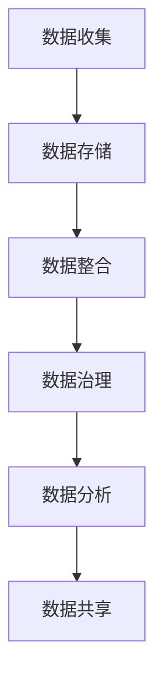

#### 1.4 数据治理的关键原则

- **数据质量控制**：确保数据的准确性、完整性、一致性、可用性和及时性。
- **数据安全与隐私保护**：防止数据泄露、篡改和未授权访问。
- **合规性**：确保数据管理过程符合法律法规和行业标准。
- **透明度**：确保数据治理过程和决策的透明性和可追溯性。
- **持续改进**：不断优化数据治理策略、流程和工具，提高数据治理效果。

#### 1.5 数据治理的重要性

数据治理对于企业的重要性体现在以下几个方面：

- **提升数据价值**：通过数据治理，确保数据的高质量和安全性，提高数据的可用性和准确性，从而提升数据的价值。
- **降低合规风险**：通过数据治理，确保数据管理过程符合法律法规和行业标准，降低合规风险。
- **支持业务决策**：通过数据治理，提供高质量的数据支持，帮助企业和业务部门做出更准确的决策。
- **提高运营效率**：通过数据治理，优化数据流程，减少数据冗余和重复工作，提高运营效率。
- **增强数据安全**：通过数据治理，确保数据的安全性和隐私保护，防止数据泄露和未授权访问。

### 第二部分：数据治理工具与应用

数据治理是一个复杂的过程，需要使用多种工具和技术来支持。本部分将介绍数据治理中常用的工具，包括数据仓库、大数据技术、数据质量管理工具、数据安全工具等，并探讨这些工具在企业数据治理中的应用。

#### 2.1 数据仓库与大数据技术

**核心概念与联系**

数据仓库（Data Warehouse）是一种用于存储、管理和分析大量数据的数据库系统，它通常用于支持企业的业务智能（Business Intelligence, BI）和数据分析。大数据技术（Big Data Technology）则是指用于处理海量数据的各种技术和工具，包括分布式计算、分布式存储和实时处理等。

- **数据仓库**：用于存储、管理和分析企业历史数据，支持决策支持和数据挖掘。
- **大数据技术**：用于处理海量数据，包括数据采集、存储、处理、分析和可视化。

**Mermaid 流程图**

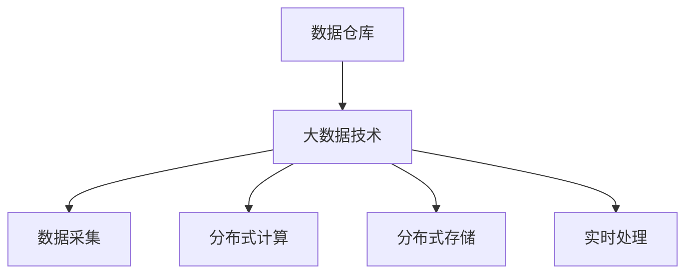

**核心算法原理讲解**

- **数据仓库架构**：数据仓库通常采用三层架构，包括数据源、数据集成层、数据存储层和数据访问层。
- **大数据技术框架**：常见的大数据技术框架包括 Hadoop、Spark、Flink 等，它们支持数据存储、处理和分析。

**伪代码**

```python
class DataWarehouse:
    def __init__(self, data_sources, data_integration, data_storage, data_access):
        self.data_sources = data_sources
        self.data_integration = data_integration
        self.data_storage = data_storage
        self.data_access = data_access

    def build_warehouse(self):
        # 构建数据仓库
        pass

    def analyze_data(self):
        # 分析数据
        pass

class BigDataFramework:
    def __init__(self, data_collection, data_storage, data_processing, data_analysis, data_visualization):
        self.data_collection = data_collection
        self.data_storage = data_storage
        self.data_processing = data_processing
        self.data_analysis = data_analysis
        self.data_visualization = data_visualization

    def process_data(self):
        # 处理数据
        pass

    def analyze_data(self):
        # 分析数据
        pass
```

**数据仓库工具应用**

- **SQL 数据库**：如 MySQL、PostgreSQL 和 SQL Server，用于存储和查询结构化数据。
- **NoSQL 数据库**：如 MongoDB、Cassandra 和 Redis，用于存储和查询非结构化或半结构化数据。
- **数据仓库平台**：如 AWS Redshift、Google BigQuery 和 Microsoft SQL Server Analysis Services，提供数据集成、存储和分析功能。

**Mermaid 流程图**

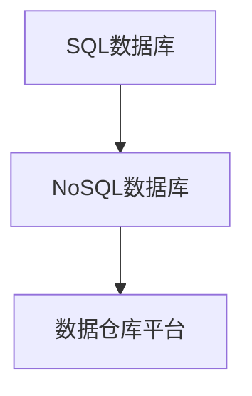

**大数据技术框架应用**

- **Hadoop**：用于分布式存储和计算，支持离线数据处理。
- **Spark**：用于实时数据处理，支持多种数据处理任务。
- **Flink**：用于实时流数据处理，具有高性能和低延迟。

#### 2.2 数据质量管理工具

数据质量管理是数据治理的重要组成部分，确保数据在整个生命周期中保持高质量。以下将介绍常用的数据质量管理工具。

**核心概念与联系**

- **ETL 工具**：用于数据抽取、转换和加载（Extract, Transform, Load），如 Talend、Informatica 和 Apache Nifi。
- **数据质量平台**：提供全面的数据质量评估、清洗和管理功能，如 Talend Data Quality、Informatica Data Quality 和 IBM InfoSphere QualityStage。
- **数据分析工具**：用于数据可视化、报表和分析，如 Tableau、Power BI 和 QlikView。

**Mermaid 流程图**

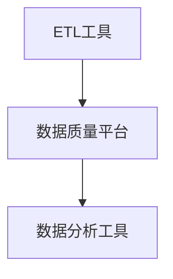

**核心算法原理讲解**

- **ETL 工具**：通过配置数据流的路径和操作，将数据从源头抽取、转换并加载到目标数据库或数据仓库中。
- **数据质量平台**：通过数据质量规则、数据质量度量指标和算法，对数据进行质量评估、修复和监控。
- **数据分析工具**：通过数据可视化、报表和分析，帮助用户理解数据质量，发现和解决问题。

**伪代码**

```python
class ETLTool:
    def __init__(self, source, transform, target):
        self.source = source
        self.transform = transform
        self.target = target

    def execute_etl(self):
        # 执行ETL操作
        pass

class DataQualityPlatform:
    def __init__(self, rules, metrics, algorithms):
        self.rules = rules
        self.metrics = metrics
        self.algorithms = algorithms

    def assess_data_quality(self, data):
        # 评估数据质量
        pass

class DataAnalysisTool:
    def __init__(self, visualization, reporting, analysis):
        self.visualization = visualization
        self.reporting = reporting
        self.analysis = analysis

    def generate_report(self):
        # 生成报表
        pass
```

**数据质量管理工具应用**

- **Talend**：提供完整的ETL和数据质量管理解决方案。
- **Informatica**：强大的数据集成和数据质量平台。
- **Apache Nifi**：开源的ETL和数据处理工具。
- **Tableau**：数据可视化工具。
- **Power BI**：商业智能和数据可视化工具。
- **QlikView**：大数据分析和数据可视化工具。

#### 2.3 数据安全工具

数据安全是数据治理中的重要环节，确保数据不被未授权访问、篡改或泄露。以下将介绍常用的数据安全工具。

**核心概念与联系**

- **加密工具**：用于加密数据，如 AES、RSA 和 Blowfish。
- **访问控制工具**：用于管理用户权限，如 Active Directory、LDAP 和 RBAC。
- **审计工具**：用于记录和监控数据访问和操作，如 Splunk、ELK 和 AWS CloudTrail。

**Mermaid 流程图**

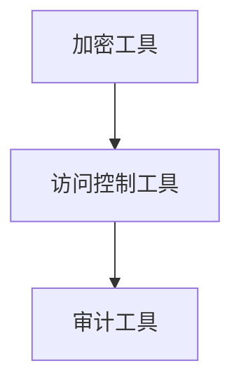

**核心算法原理讲解**

- **加密工具**：通过加密算法将明文数据转换为密文，保护数据在存储和传输过程中的安全性。
- **访问控制工具**：通过定义用户角色和权限，控制用户对数据的访问权限。
- **审计工具**：通过记录和监控数据访问和操作，确保数据安全性和合规性。

**伪代码**

```python
class EncryptionTool:
    def __init__(self, encryption_algorithm):
        self.encryption_algorithm = encryption_algorithm

    def encrypt_data(self, data):
        # 加密数据
        pass

class AccessControlTool:
    def __init__(self, role_based_access_control):
        self.role_based_access_control = role_based_access_control

    def grant_access(self, user, resource):
        # 授予访问权限
        pass

class AuditTool:
    def __init__(self, log_monitoring):
        self.log_monitoring = log_monitoring

    def record_audit_log(self, action):
        # 记录审计日志
        pass
```

**数据安全工具应用**

- **AES**：高级加密标准，用于数据加密。
- **RSA**：公钥加密算法，用于数据加密和数字签名。
- **Blowfish**：对称加密算法，用于数据加密。
- **Active Directory**：用于用户权限管理和身份验证。
- **LDAP**：轻量级目录访问协议，用于用户权限管理和身份验证。
- **RBAC**：基于角色的访问控制，用于用户权限管理。
- **Splunk**：用于实时监控和审计日志分析。
- **ELK**：Elasticsearch、Logstash 和 Kibana，用于日志管理和分析。
- **AWS CloudTrail**：用于 AWS 账户的审计日志。

### 第三部分：数据治理工程师面试准备

数据治理工程师的面试通常涉及对数据治理相关技术的深入理解、实际项目经验和解决问题的能力。以下将介绍常见的数据治理工程师面试题目解析、面试技巧和策略。

#### 3.1 数据仓库与大数据面试题目

**面试题目及解析**

1. **什么是数据仓库？它有哪些主要功能？**
   - **解析**：数据仓库是一种用于存储、管理和分析大量数据的数据库系统，其主要功能包括数据集成、数据存储、数据分析和数据报表。

2. **请简要介绍 Hadoop 的架构和主要组件。**
   - **解析**：Hadoop 的架构包括分布式文件系统（HDFS）、YARN（资源调度框架）和 MapReduce（分布式计算框架）。HDFS 用于存储数据，YARN 用于资源调度，MapReduce 用于数据处理。

3. **什么是 Spark？它与 Hadoop 有什么区别？**
   - **解析**：Spark 是一种用于大数据处理的分布式计算框架，它支持实时数据处理和迭代计算。与 Hadoop 的 MapReduce 相比，Spark 具有更高的性能和灵活性。

4. **请简要介绍 Spark 的核心组件。**
   - **解析**：Spark 的核心组件包括 Spark Core（分布式计算引擎）、Spark SQL（结构化数据处理）、Spark Streaming（实时数据处理）和 MLlib（机器学习库）。

5. **什么是数据湖？它与数据仓库有什么区别？**
   - **解析**：数据湖是一种用于存储原始数据的存储系统，它支持非结构化、半结构化和结构化数据。与数据仓库相比，数据湖不进行数据清洗和集成，而是保留原始数据，以支持灵活的数据分析和挖掘。

#### 3.2 数据质量管理面试题目

**面试题目及解析**

1. **请解释数据质量管理的含义和重要性。**
   - **解析**：数据质量管理是指通过制定策略、标准和流程来管理和控制数据的整个生命周期，确保数据的质量、安全和合规性。数据质量管理对于企业的业务决策、数据分析和数据治理至关重要。

2. **请列举几种数据质量评估的方法。**
   - **解析**：数据质量评估的方法包括统计方法（如平均数、中位数、标准差等）、机器学习方法和人工评估方法。统计方法用于评估数据的分布和特征，机器学习方法用于自动评估数据质量，人工评估方法则依赖于数据专家的经验和知识。

3. **请简要介绍数据清洗的过程和技术。**
   - **解析**：数据清洗的过程包括数据去重、数据修复、数据填充和数据转换。数据去重用于删除重复的数据记录，数据修复用于修复错误的数据值，数据填充用于填充缺失的数据，数据转换用于将数据转换为不同的格式或结构。

4. **请解释数据质量管理工具的作用和分类。**
   - **解析**：数据质量管理工具用于支持数据质量评估、清洗和管理。常见的工具包括 ETL 工具（如 Talend、Informatica 和 Apache Nifi）、数据质量平台（如 Talend Data Quality、Informatica Data Quality 和 IBM InfoSphere QualityStage）和数据分析工具（如 Tableau、Power BI 和 QlikView）。

#### 3.3 数据安全与隐私保护面试题目

**面试题目及解析**

1. **请解释数据安全策略的含义和组成部分。**
   - **解析**：数据安全策略是指为保护数据而制定的一系列政策、标准和流程。数据安全策略的组成部分包括数据加密、访问控制和审计。

2. **请简要介绍几种常用的数据加密算法。**
   - **解析**：常用的数据加密算法包括 AES（高级加密标准）、RSA（公钥加密算法）和 Blowfish（对称加密算法）。AES 用于数据加密，RSA 用于数据加密和数字签名，Blowfish 用于数据加密。

3. **请解释访问控制的含义和实现方式。**
   - **解析**：访问控制是指通过定义用户角色和权限来控制用户对数据的访问。实现访问控制的方式包括基于角色的访问控制（RBAC）、基于属性的访问控制（ABAC）和基于标签的访问控制（LBAC）。

4. **请解释数据隐私保护的方法和重要性。**
   - **解析**：数据隐私保护的方法包括数据脱敏、数据加密和数据匿名化。数据脱敏是将敏感数据替换为假数据或掩码，数据加密是使用加密算法对数据进行加密，数据匿名化是将个人身份信息从数据中去除。数据隐私保护对于保护个人隐私、遵守法律法规和增强数据信任至关重要。

### 附录

#### 附录 A：数据治理相关书籍推荐

1. 《数据治理：企业数据管理的实践指南》
   - 作者：Michael J. Canning
   - 简介：本书详细介绍了数据治理的概念、原则和实践，适合数据治理专业人员阅读。

2. 《数据治理基础：策略、流程、工具与应用》
   - 作者：Ben Reich
   - 简介：本书从理论和实践角度全面解析了数据治理，包括数据质量管理、数据安全、合规性等方面。

3. 《大数据治理：从战略到实践》
   - 作者：Sandy Carter, Jim Harris, and Bill Inmon
   - 简介：本书探讨了大数据治理的战略和实践，包括数据管理、数据安全和数据治理框架。

#### 附录 B：数据治理相关网站和论坛

1. Data Governance Knowledge Center
   - 地址：[http://www.datagovernanceknowledge.com/](http://www.datagovernanceknowledge.com/)
   - 简介：提供数据治理的最新资讯、案例研究和专业文章。

2. Data Governance Institute
   - 地址：[http://www.datagovernance.com/](http://www.datagovernance.com/)
   - 简介：一个专业的数据治理社区，提供数据治理培训、认证和咨询服务。

3. Data Governance Project
   - 地址：[http://www.datagovernanceproject.com/](http://www.datagovernanceproject.com/)
   - 简介：一个开放的数据治理资源网站，提供数据治理框架、工具和最佳实践。

#### 附录 C：数据治理工程师职业发展规划

1. **技能提升**

   - 学习数据治理相关理论知识，如数据管理、数据质量和数据安全。
   - 掌握数据仓库和大数据技术，如 Hadoop、Spark、数据仓库平台等。
   - 学习数据质量管理工具和技术的实际应用，如 ETL 工具、数据质量平台等。
   - 提高编程和数据库技能，熟悉 SQL、NoSQL 数据库和分布式存储系统。

2. **职业认证**

   - 获得数据治理相关认证，如 DAMA-DMBOK（数据管理能力成熟度模型）、Certified Data Governance Professional（认证数据治理专业人士）等。
   - 获得大数据相关认证，如 Cloudera Certified Professional（CCP）、AWS Certified Big Data - Specialty 等。

3. **职业规划**

   - 从数据治理工程师开始，积累项目经验和专业技能。
   - 向数据治理主管或数据治理经理职位发展，负责团队管理和项目规划。
   - 进一步向数据治理总监或数据治理战略规划职位发展，负责企业数据治理战略和体系建设。
   - 拓展到企业级数据治理咨询和培训领域，为企业提供数据治理解决方案和培训服务。

### 结束语

本文章《网易2024校招数据治理工程师面试题集锦》旨在为准备参加网易2024校招数据治理工程师岗位的考生提供一份详细的面试题集锦。文章涵盖了数据治理的核心概念、框架和流程，以及数据治理工具和应用，并通过实际案例和常见面试题目解析，帮助考生全面了解数据治理领域，提升面试技能。

希望本文章能对各位考生有所帮助，祝愿大家在面试中取得优异成绩，顺利通过校招。同时，也欢迎有兴趣的读者关注数据治理领域的最新动态和发展，持续学习和进步。

**作者：AI天才研究院/AI Genius Institute & 禅与计算机程序设计艺术 /Zen And The Art of Computer Programming**

**日期：2023年10月**

----------------------------------------------------------------

### 附录 D：数据治理工程师面试真题及答案解析

在本附录中，我们将分享一些实际面试中可能会遇到的数据治理工程师面试题目，并提供详细的答案解析。这些题目覆盖了数据治理的各个方面，包括数据仓库、大数据技术、数据质量管理、数据安全等。

#### 面试题 1：请简述数据仓库和数据湖的区别。

**答案解析：**

数据仓库和数据湖都是用于存储和管理数据的系统，但它们在架构、用途和数据管理方面存在显著差异。

- **数据仓库**：主要用于存储经过清洗、转换和集成的结构化数据，以便进行业务分析和决策支持。数据仓库通常具有以下特点：
  - **结构化数据**：数据仓库中的数据通常是结构化的，便于查询和分析。
  - **数据清洗**：数据仓库中的数据在存储之前会经过清洗和转换，保证数据的质量和一致性。
  - **面向查询**：数据仓库优化了查询性能，支持复杂查询和报表生成。

- **数据湖**：主要用于存储原始数据，包括结构化、半结构化和非结构化数据，为大数据分析和挖掘提供数据资源。数据湖的主要特点包括：
  - **原始数据**：数据湖保留了原始数据，不进行清洗和转换，以便后续分析。
  - **多样性数据**：数据湖支持多种数据类型，包括文本、图像、音频和视频等。
  - **灵活性**：数据湖提供了更高的灵活性，用户可以根据需要自行处理和转换数据。

#### 面试题 2：请解释什么是数据治理，并简要介绍其核心要素。

**答案解析：**

数据治理是一个综合性的概念，它涉及制定策略、标准和流程来管理和控制数据的整个生命周期，确保数据的质量、安全、合规和有效使用。数据治理的核心要素包括：

- **数据治理策略**：明确数据治理的目标、原则、范围和责任，为数据治理活动提供指导。
- **数据治理组织**：建立数据治理委员会、数据治理团队和其他相关组织，确保数据治理的有效实施。
- **数据治理流程**：定义数据治理的各个环节和操作流程，包括数据收集、存储、整合、治理、分析和共享。
- **数据治理工具**：选择和配置支持数据治理的工具和技术，如数据仓库、大数据平台、数据质量管理工具等。
- **最佳实践**：总结和推广成功的数据治理实践，提高数据治理的效果和效率。

#### 面试题 3：请列举几种常用的数据质量管理工具，并简要介绍它们的功能。

**答案解析：**

以下是一些常用的数据质量管理工具及其功能：

- **Talend Data Quality**：一个集成的数据质量管理平台，提供数据清洗、转换、验证、增强和监控功能。
- **Informatica Data Quality**：一个功能强大的数据质量管理工具，支持数据质量规则、数据质量度量指标和算法。
- **Apache Nifi**：一个开源的数据集成和数据流处理平台，提供数据清洗、转换和路由功能。
- **Talend ETL**：一个用于数据抽取、转换和加载的ETL工具，支持多种数据源和目标系统。
- **IBM InfoSphere QualityStage**：一个企业级的数据质量管理工具，提供数据清洗、转换、验证和监控功能。

#### 面试题 4：请解释数据隐私保护的方法，并列举几种常用的数据脱敏技术。

**答案解析：**

数据隐私保护的方法包括数据脱敏、数据加密和数据匿名化。以下是一些常用的数据脱敏技术：

- **数据脱敏**：
  - **静态脱敏**：对静态数据（如存储在数据库或文件中的数据）进行脱敏处理，常见技术包括：
    - **掩码**：用特定的字符（如*或#）替换敏感数据。
    - **掩码替换**：将敏感数据替换为随机生成的字符。
    - **随机替换**：将敏感数据替换为随机生成的数据。
  - **动态脱敏**：对动态数据（如数据在应用程序中传输时）进行脱敏处理，常见技术包括：
    - **基于规则的脱敏**：根据预设的规则对数据进行脱敏。
    - **基于角色的脱敏**：根据用户角色对数据进行脱敏。

- **数据加密**：使用加密算法对数据进行加密，保护数据在存储和传输过程中的安全性。常见的加密算法包括 AES、RSA 和 Blowfish。

- **数据匿名化**：通过去除或替换个人身份信息，将数据转换为匿名数据，以保护个人隐私。常见的技术包括：
  - **数据泛化**：将具体的数据值泛化为更广泛的值，如将具体姓名泛化为年龄范围。
  - **数据掩盖**：用随机数据或掩码替换个人身份信息。

#### 面试题 5：请简要介绍 Hadoop 的主要组件和功能。

**答案解析：**

Hadoop 是一个开源的分布式计算框架，用于处理海量数据。Hadoop 的主要组件和功能包括：

- **Hadoop 分布式文件系统（HDFS）**：用于存储大量数据，提供高吞吐量的数据访问。
- **Hadoop YARN**：资源调度框架，负责资源分配和管理，支持多种数据处理任务。
- **Hadoop MapReduce**：分布式计算模型，用于处理大规模数据集，支持批处理和迭代计算。
- **Hadoop Hive**：数据仓库工具，用于数据存储、查询和分析，提供 SQL-like 查询语言。
- **Hadoop Pig**：数据处理和分析工具，提供高层次的脚本语言，简化数据处理任务。
- **Hadoop HBase**：分布式列存储数据库，用于存储大规模稀疏数据集，提供实时随机访问。
- **Hadoop Spark**：分布式计算引擎，支持实时数据处理和迭代计算，性能优于 MapReduce。

#### 面试题 6：请解释什么是数据治理成熟度模型，并简要介绍其评估方法。

**答案解析：**

数据治理成熟度模型（Data Governance Maturity Model）是一个用于评估和改进企业数据治理能力的框架。它将数据治理能力分为不同的等级，帮助企业识别当前的数据治理水平，并制定改进计划。

- **数据治理成熟度模型**：
  - **级别 1：初始级**：数据治理活动零散，没有明确的策略和流程，依赖个人经验和技能。
  - **级别 2：可重复级**：数据治理活动具有一定的规律性，有基本的策略和流程，但执行不统一。
  - **级别 3：已定义级**：数据治理活动有明确的策略、流程和标准，规范化管理，能够满足大部分业务需求。
  - **级别 4：量化管理级**：数据治理活动基于量化指标和数据分析，优化和改进数据治理过程，提高数据质量和安全。
  - **级别 5：优化级**：数据治理活动持续改进，数据治理能力达到最高水平，能够快速响应业务变化和需求。

- **评估方法**：
  - **自我评估**：企业根据数据治理成熟度模型的指标，自我评估当前的数据治理水平。
  - **第三方评估**：由专业的数据治理咨询公司或认证机构对企业数据治理能力进行评估。
  - **问卷调查**：通过问卷调查收集员工对数据治理的认知和满意度，评估数据治理的普及程度。
  - **案例分析**：分析企业成功的数据治理项目，评估数据治理的效果和效率。

通过以上面试题及其解析，希望能够帮助考生更好地准备数据治理工程师的面试。在实际面试中，除了掌握理论知识，还需要注重实际项目经验和解决问题的能力。希望考生在面试中能够自信、从容地展示自己的专业素养和潜力。

### 面试准备策略

准备面试是成功的关键步骤，尤其是对于数据治理工程师这样的专业技术岗位。以下是一些关键的面试准备策略，帮助您在面试中脱颖而出。

#### 1. 深入研究数据治理知识

在面试前，确保您对数据治理的基本概念、流程、工具和技术有深入的了解。以下是一些研究重点：

- **数据治理框架**：了解数据治理的核心原则、策略和组织架构。
- **数据仓库**：熟悉数据仓库的架构、组件和技术，如 Hadoop、Spark、AWS Redshift 等。
- **大数据技术**：掌握大数据处理的基本原理和常用技术，如 MapReduce、Hive、Pig、HBase 等。
- **数据质量管理**：了解数据质量评估、数据清洗和数据质量管理的工具和方法。
- **数据安全与隐私保护**：掌握数据加密、访问控制、审计和隐私保护的方法。

#### 2. 实践项目准备

准备一些实际项目经验，以便在面试中展示您的技术能力和解决问题的能力。以下是一些建议：

- **项目总结**：梳理您参与过的数据治理项目，包括项目目标、方法、工具和成果。
- **案例分析**：准备一些项目中的具体案例，讲述您如何解决遇到的挑战和问题。
- **代码示例**：如果可能，准备一些相关的代码示例，展示您的编程能力和数据处理能力。

#### 3. 模拟面试

进行模拟面试是检验准备效果的好方法。以下是一些建议：

- **自我模拟**：在家中独自练习，录制自己的声音和表情，反复观看和改进。
- **请他人帮忙**：邀请同事、朋友或家人扮演面试官，模拟真实面试环境，提高应对能力。
- **面试题练习**：准备常见的面试题目，如数据治理框架、数据仓库技术、数据质量管理等，并练习回答。

#### 4. 面试礼仪和着装

良好的面试礼仪和得体的着装会给面试官留下良好的第一印象。以下是一些建议：

- **着装得体**：选择正式的商务装，保持整洁和专业。
- **准时到达**：提前规划好路线和时间，确保准时到达面试地点。
- **礼貌用语**：使用礼貌用语，如“谢谢”、“请”、“您”等。
- **眼神交流**：与面试官保持眼神交流，展示自信和专注。

#### 5. 面试中的常见问题

面试中可能会遇到一些常见问题，以下是一些典型问题及其回答建议：

- **您对数据治理的理解是什么？**
  - 回答时可以详细解释数据治理的概念、重要性以及其在企业中的作用。

- **请描述您参与的一个数据治理项目，并说明您的角色和贡献。**
  - 提供具体的项目背景、目标、方法和成果，强调自己在项目中的关键角色和贡献。

- **您是如何确保数据质量的？**
  - 提及数据质量管理的策略、工具和方法，以及您在实际项目中的具体实践。

- **请举例说明您如何处理数据安全问题。**
  - 提供具体的安全措施，如数据加密、访问控制和审计，以及您在实际项目中的应用。

- **您对数据湖和传统数据仓库的区别有哪些看法？**
  - 解释数据湖和传统数据仓库的特点、用途以及它们在数据治理中的角色。

#### 6. 面试后的跟进

面试结束后，及时跟进是一个礼貌和专业的表现。以下是一些建议：

- **发送感谢信**：在面试后的 24 小时内发送一封感谢信，感谢面试官的时间和考虑。
- **跟进邮件**：如果面试官提供了联系方式，可以在面试后的一个星期左右发送跟进邮件，询问面试结果和后续流程。
- **持续沟通**：即使面试结果不理想，也可以保持积极沟通，了解原因和建议。

通过以上面试准备策略，您可以更好地应对数据治理工程师的面试，提高成功几率。记住，充分准备、自信展示和积极沟通是成功的关键。

### 面试中常见问题应对

在面试过程中，面试官可能会提出各种问题，以评估您的技术能力、专业知识、解决问题的能力和个人素质。以下是一些面试中常见的问题及其回答策略，帮助您更好地应对。

#### 技术问题

1. **您对数据治理的理解是什么？**
   - **回答策略**：解释数据治理的定义，强调其重要性，包括数据质量、安全性和合规性。可以举例说明数据治理在企业中的实际应用。

2. **请描述您参与的一个数据治理项目，并说明您的角色和贡献。**
   - **回答策略**：选择一个具有代表性的项目，详细描述项目背景、目标、实现过程、遇到的挑战和解决方案。强调自己在项目中的具体贡献，如数据分析、架构设计或团队协调。

3. **您是如何确保数据质量的？**
   - **回答策略**：提及数据质量管理的策略和方法，如数据清洗、数据验证、数据监控等。具体说明您在实际项目中如何应用这些方法来提高数据质量。

4. **请简要介绍您熟悉的数据仓库架构。**
   - **回答策略**：详细描述数据仓库的架构，包括数据源、数据集成、数据存储、数据处理和数据访问等组成部分。可以结合具体的技术框架，如 Hadoop、Spark 等。

5. **请解释数据湖和数据仓库的区别。**
   - **回答策略**：从数据类型、数据处理方式、数据架构和用途等方面解释数据湖和数据仓库的区别。强调数据湖的灵活性、多样性和原始数据保留的特点。

6. **您是如何处理大数据分析的？**
   - **回答策略**：介绍您使用的大数据处理技术，如 MapReduce、Spark、Flink 等。说明您在数据分析过程中使用的方法和工具，以及如何优化数据处理流程。

7. **请举例说明您如何处理数据安全问题。**
   - **回答策略**：提供具体的例子，如数据加密、访问控制、审计和隐私保护。详细解释您在项目中实施的安全措施和策略。

#### 行为问题

1. **请描述一次您解决复杂问题的经历。**
   - **回答策略**：选择一个具有挑战性的问题，详细描述问题的背景、您的解决方案和最终结果。强调您的分析能力、沟通能力和团队合作精神。

2. **您是如何与团队成员合作的？**
   - **回答策略**：举例说明您在团队合作中的角色和贡献，强调您如何协调团队成员、分配任务和解决问题。

3. **请描述一次您遇到挑战的经历，并说明您是如何克服的。**
   - **回答策略**：选择一个具体的情况，详细描述挑战、您采取的行动和最终结果。强调您的解决问题的能力、决策能力和创新思维。

4. **您如何处理工作压力？**
   - **回答策略**：提供具体的应对策略，如时间管理、优先级排序、寻求支持和团队合作。强调您如何保持高效工作和积极心态。

#### 情景问题

1. **如果您的数据治理方案被高层领导质疑，您会如何回应？**
   - **回答策略**：首先保持冷静，然后详细解释方案的优点、潜在风险和改进措施。强调数据治理的重要性，以及您的方案如何帮助企业实现数据价值。

2. **您的团队面临一个紧迫的项目截止日期，您会如何协调任务和时间？**
   - **回答策略**：提出具体的时间管理策略，如优先处理关键任务、合理分配资源、沟通和协调团队成员。强调团队合作和问题解决的重要性。

3. **如果您的团队成员遇到技术问题，您会如何帮助他/她？**
   - **回答策略**：提供具体的帮助方法，如提供技术支持、指导解决方案或寻求外部资源。强调团队合作和知识共享的重要性。

通过以上回答策略，您可以更好地应对面试中的各种问题，展示您的技术能力、专业知识和解决问题的能力。记住，回答问题时要自信、清晰和具体，以展示您的综合素质和专业素养。

### 面试结束后的跟进策略

面试结束后，及时跟进可以展示您的专业素养和积极态度，同时也有助于了解面试结果和后续流程。以下是一些关键步骤和建议，帮助您在面试结束后有效跟进：

#### 1. 发送感谢信

在面试后的 24 小时内，发送一封感谢信表达对面试官时间和机会的感激。以下是一些建议：

- **内容要点**：
  - 表达感谢，简要回顾面试经历。
  - 强调您对该岗位的热情和适合度。
  - 提及您在面试中特别感兴趣的话题或问题，以及您的看法。

- **格式建议**：
  - 使用正式的信函格式，包括日期、收件人和称呼。
  - 保持简洁、真诚，无需过长。

#### 2. 跟进邮件

如果面试官提供了联系方式，可以在面试后的一个星期左右发送跟进邮件，询问面试结果和后续流程。以下是一些建议：

- **内容要点**：
  - 表达对面试结果的关注和期待。
  - 简要回顾您的优势和为何适合该岗位。
  - 询问面试官是否有关于面试反馈或建议。
  - 表达愿意提供进一步的信息或进行复试。

- **格式建议**：
  - 使用简洁、专业的邮件格式。
  - 保持礼貌和尊重，避免过于迫切或纠缠。

#### 3. 持续沟通

即使面试结果不理想，也可以保持积极沟通，了解原因和建议。以下是一些建议：

- **主动联系**：在面试后的一个星期左右，主动联系面试官，了解面试结果和反馈。
- **接受建议**：认真听取面试官的建议，了解自己在哪些方面需要改进。
- **表示感谢**：无论面试结果如何，都要感谢面试官的时间和帮助。

通过以上策略，您可以展示您的专业素养和积极态度，同时也有助于提高面试成功几率。记住，面试结束后的跟进是面试过程的重要组成部分，不容忽视。

### 附录 A：数据治理相关书籍推荐

在准备数据治理工程师面试时，阅读一些相关的书籍可以大大提升您的知识水平和面试表现。以下是一些推荐的书籍，涵盖了数据治理的各个方面，包括理论、实践和最佳案例。

1. **《数据治理：企业数据管理的实践指南》**
   - **作者**：Michael J. Canning
   - **简介**：本书详细介绍了数据治理的概念、原则和实践，适合数据治理专业人员阅读，涵盖了数据治理的各个方面，包括数据管理、数据质量和数据安全。

2. **《数据治理基础：策略、流程、工具与应用》**
   - **作者**：Ben Reich
   - **简介**：本书从理论和实践角度全面解析了数据治理，包括数据质量管理、数据安全、合规性等方面。书中包含了丰富的案例和实际操作指南，适合初学者和有经验的专业人士。

3. **《大数据治理：从战略到实践》**
   - **作者**：Sandy Carter, Jim Harris, and Bill Inmon
   - **简介**：本书探讨了大数据治理的战略和实践，包括数据管理、数据安全和数据治理框架。书中包含了大量案例研究和成功实践，适合大数据治理领域的从业者。

4. **《数据治理手册：策略、方法和工具》**
   - **作者**：Derek Kitching
   - **简介**：本书提供了全面的数据治理手册，包括数据治理的各个方面，如策略、方法、工具和最佳实践。书中详细介绍了数据治理的实施步骤和关键成功因素。

5. **《数据治理与合规性：实务与案例》**
   - **作者**：John Ladley
   - **简介**：本书结合了数据治理和合规性的实际案例，详细介绍了如何在企业中实施数据治理策略，确保数据合规性。书中提供了实用的工具和模板，适合希望提升数据治理能力的专业人士。

6. **《数据仓库与大数据治理：实践指南》**
   - **作者**：Vinod Haval
   - **简介**：本书涵盖了数据仓库和大数据治理的各个方面，包括数据集成、数据存储、数据处理、数据分析和数据安全。书中包含了大量的案例研究和最佳实践，适合数据治理工程师和数据仓库开发人员。

7. **《数据治理技术手册》**
   - **作者**：Rick Sherman
   - **简介**：本书是数据治理技术领域的权威指南，详细介绍了数据治理工具和技术，如数据仓库、大数据平台、数据质量管理工具等。书中还包括了数据治理的实施策略和最佳实践。

通过阅读这些书籍，您可以深入了解数据治理的理论和实践，提升自己在面试中的表现，并为实际工作做好准备。

### 附录 B：数据治理相关网站和论坛

在准备数据治理工程师面试时，访问一些专业网站和论坛可以为您提供丰富的学习资源和行业动态。以下是一些推荐的网站和论坛，涵盖了数据治理的各个方面，包括最新技术、最佳实践和行业新闻。

1. **Data Governance Knowledge Center**
   - **网址**：[http://www.datagovernanceknowledge.com/](http://www.datagovernanceknowledge.com/)
   - **简介**：提供数据治理的最新资讯、案例研究和专业文章，涵盖数据治理策略、流程和工具。

2. **Data Governance Institute**
   - **网址**：[http://www.datagovernance.com/](http://www.datagovernance.com/)
   - **简介**：一个专业的数据治理社区，提供数据治理培训、认证和咨询服务，以及丰富的数据治理资源和案例。

3. **Data Governance Project**
   - **网址**：[http://www.datagovernanceproject.com/](http://www.datagovernanceproject.com/)
   - **简介**：一个开放的数据治理资源网站，提供数据治理框架、工具和最佳实践，涵盖数据治理的各个方面。

4. **DAMA International**
   - **网址**：[http://www.dama-i.org/](http://www.dama-i.org/)
   - **简介**：数据管理协会的国际组织，提供数据管理标准和认证，以及丰富的数据管理资源和资料。

5. **Data Science Central**
   - **网址**：[https://www.datasciencecentral.com/](https://www.datasciencecentral.com/)
   - **简介**：一个综合性的数据科学和大数据社区，提供数据治理、数据科学和数据分析的最新文章、资源和讨论。

6. **Big Data Institute**
   - **网址**：[https://www.bigdatainstitute.org/](https://www.bigdatainstitute.org/)
   - **简介**：大数据领域的专业机构，提供大数据、数据治理和数据科学的相关资讯、培训和研究。

7. **Information Management**
   - **网址**：[https://www.information-management.com/](https://www.information-management.com/)
   - **简介**：提供企业信息管理和数据治理的最新新闻、分析和文章，涵盖数据治理、大数据和数据管理领域的热点话题。

8. **Data Governance Exchange**
   - **网址**：[https://www.datagovernanceexchange.com/](https://www.datagovernanceexchange.com/)
   - **简介**：一个专业的数据治理论坛，提供数据治理相关的讨论、资源和服务，涵盖数据治理的最佳实践和案例分析。

通过访问这些网站和论坛，您可以及时了解数据治理领域的最新动态，学习行业最佳实践，提升自己的专业知识和面试能力。

### 附录 C：数据治理工程师职业发展规划

数据治理工程师是一个涉及多个技术领域的重要职位，包括数据管理、数据仓库、大数据、数据安全和隐私保护等。以下是一些建议，帮助数据治理工程师规划职业发展路径，提升专业技能和职场竞争力。

#### 1. 技能提升

**基础知识**：
- **数据管理**：深入学习数据管理的基本概念、数据模型和数据仓库架构。
- **数据库技术**：掌握 SQL 和 NoSQL 数据库的使用，了解数据库设计和性能优化。

**核心技能**：
- **数据仓库**：熟悉数据仓库的构建和管理，掌握 ETL 工具（如 Talend、Informatica）和数据处理框架（如 Hadoop、Spark）。
- **大数据技术**：学习大数据技术（如 Hadoop、Spark、Flink）的基本原理和实际应用。
- **数据质量**：了解数据质量管理的原则和方法，掌握数据清洗和数据质量工具（如 Talend Data Quality、Informatica Data Quality）。
- **数据安全**：熟悉数据加密、访问控制和审计的基本概念，掌握数据安全工具（如 AES、RSA、RBAC）。

**实践项目**：
- **项目经验**：参与实际的数据治理项目，积累项目管理和问题解决的经验。
- **案例分析**：研究成功的数据治理案例，学习最佳实践和经验教训。

#### 2. 职业认证

**数据治理**：
- **DAMA-DMBOK**：数据管理能力成熟度模型，提供全面的数据管理知识。
- **Certified Data Governance Professional**：认证数据治理专业人士，证明在数据治理领域的专业能力。

**大数据**：
- **Cloudera Certified Professional**：Cloudera 认证专业人士，涵盖 Hadoop 和大数据技术。
- **AWS Certified Big Data - Specialty**：AWS 大数据认证，证明在 AWS 大数据服务领域的专业技能。

**数据安全和隐私保护**：
- **Certified Information Systems Security Professional (CISSP)**：信息系统安全专家认证，涵盖数据安全和管理。
- **Certified Information Privacy Professional (CIPP)**：信息隐私专业人士认证，专注于数据隐私保护。

#### 3. 职业规划

**初级阶段**：
- **数据治理工程师**：参与数据治理项目，负责数据仓库构建、数据清洗和数据处理。
- **数据质量分析师**：负责数据质量评估、数据修复和数据监控。

**中级阶段**：
- **数据治理主管**：负责团队管理、项目规划和数据治理策略制定。
- **数据仓库管理员**：负责数据仓库性能优化、架构设计和数据处理。

**高级阶段**：
- **数据治理经理**：负责企业级数据治理战略和体系建设，管理多个数据治理项目。
- **数据治理总监**：负责制定和实施企业数据治理战略，推动企业数据价值的最大化。

#### 4. 持续学习

**在线课程**：
- **Coursera**、**edX**、**Udacity** 等在线教育平台提供了丰富的数据治理相关课程，包括数据管理、大数据技术和数据安全。

**行业会议**：
- 参加行业会议和研讨会，了解数据治理领域的最新趋势和技术发展。

**专业社群**：
- 加入专业社群（如 DAMA、IEEE 等），与其他数据治理专业人士交流和分享经验。

通过以上规划和建议，数据治理工程师可以不断提升自己的专业技能和职业素养，实现职业发展的稳步提升。

### 总结与感谢

在本文《网易2024校招数据治理工程师面试题集锦》中，我们详细介绍了数据治理的核心概念、框架和流程，探讨了数据治理工具与应用，并提供了丰富的面试真题及答案解析。通过本文，我们希望帮助准备参加网易2024校招数据治理工程师岗位的考生全面了解数据治理领域，提升面试技能，顺利通过面试。

首先，我们深入讲解了数据治理的基础知识，包括数据治理的概念、核心要素、数据治理框架和流程。通过流程图和伪代码，使读者对数据治理有了更直观和深入的理解。

接着，我们探讨了数据治理工具与应用，涵盖了数据仓库与大数据技术、数据质量管理工具、数据安全工具等。通过具体的工具分类和实际案例，使读者了解到如何在实际项目中应用这些工具。

然后，我们提供了数据治理工程师面试准备策略，包括技术学习、实践项目、模拟面试和礼仪着装等方面，帮助考生做好充分的面试准备。

此外，我们还针对面试中常见的问题提供了详细的回答策略，包括技术问题、行为问题和情景问题，使考生能够在面试中自信、从容地应对各种问题。

最后，我们提供了面试结束后的跟进策略，以及数据治理相关书籍推荐、网站和论坛推荐，帮助考生在面试后继续提升自己的专业素养。

在此，我们衷心感谢读者对本文的关注和支持。我们希望本文能够对您在数据治理领域的学习和职业发展有所帮助。同时，我们也欢迎对数据治理感兴趣的读者继续关注和参与我们的讨论。

最后，祝各位考生在面试中取得优异成绩，顺利通过校招，开启精彩的职业旅程！

**作者：AI天才研究院/AI Genius Institute & 禅与计算机程序设计艺术 /Zen And The Art of Computer Programming**

**日期：2023年10月**

### Mermaid 流程图

以下是本文提到的各个章节和部分的 Mermaid 流程图，用于直观展示数据治理的相关概念、流程和技术。

#### 第1章：数据治理概述

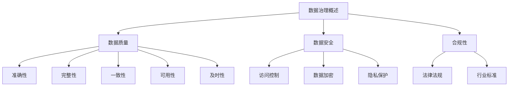

#### 第2章：数据质量管理

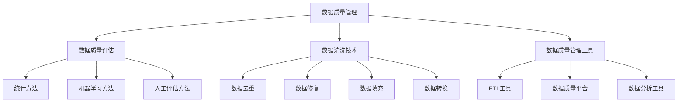

#### 第3章：数据安全与隐私保护

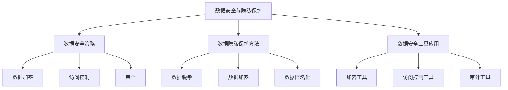

#### 第4章：数据仓库与大数据技术

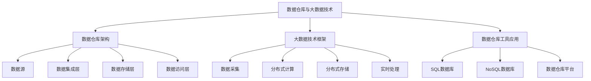

#### 第5章：数据治理最佳实践

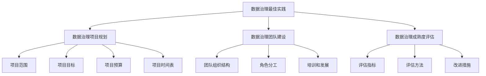

#### 第6章：数据治理案例分析

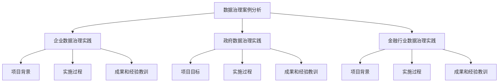

#### 第7章：常见面试题目解析

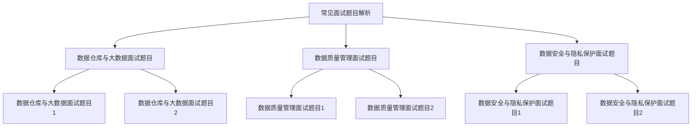

#### 第8章：面试技巧与策略

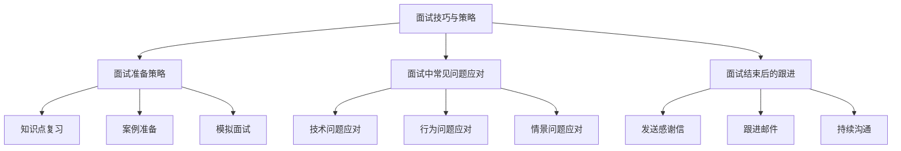

这些 Mermaid 流程图能够帮助读者更直观地理解数据治理的相关概念、流程和技术，以及面试中的常见问题和策略。希望这些图表能够为您的学习和面试准备提供帮助。

