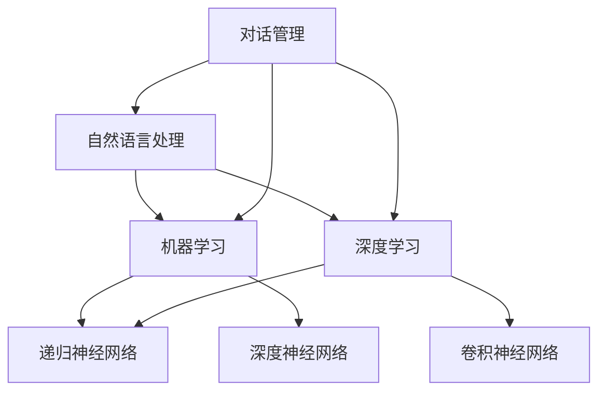

                 

### 引言

#### 1.1 聊天机器人的定义与现状

聊天机器人，也称为聊天bots，是一种基于人工智能技术的应用，能够在不需要人类干预的情况下与用户进行对话。它们通常通过自然语言处理（NLP）技术理解和生成语言，以提供信息、执行任务或进行交互。聊天机器人的发展可以追溯到20世纪50年代，但直到近年来，随着计算能力的提升和深度学习算法的进步，它们才得以真正实现商业化并广泛应用。

当前的聊天机器人技术主要基于以下核心组件：

1. **语言处理技术**：包括语音识别、语义理解和对话管理。语音识别将用户的语音转换为文本，语义理解则解析文本的含义，对话管理则负责维护对话的流畅性和目标。

2. **人工智能算法基础**：聊天机器人使用监督学习和无监督学习算法来训练模型，这些模型能够从大量数据中学习，提高对话的准确性和上下文理解能力。

3. **架构设计**：聊天机器人通常采用模块化架构，包括前端用户接口、中间层处理模块和后端数据库或API接口。这种设计提高了系统的可维护性和扩展性。

#### 1.2 公民参与的背景和重要性

公民参与是现代社会中一个关键的概念，它涉及到个人或集体参与公共事务和社会治理的过程。随着互联网和移动设备的普及，公民参与的方式也在不断变化。在线公民参与通过社交媒体、在线论坛和问卷调查等形式，使得更多人能够便捷地表达观点、参与讨论和提供反馈。

公民参与的重要性体现在以下几个方面：

1. **提高决策质量**：公民的参与能够提供多元化的视角和反馈，有助于决策者更全面地了解问题，从而制定更科学、合理的决策。

2. **增强社会信任**：当公民感到他们的声音被听到并被重视时，社会信任度和满意度会提高，这对于维护社会的稳定和发展至关重要。

3. **促进民主参与**：公民参与是民主制度的基石，通过参与公共事务，公民能够更好地行使自己的权利和义务，增强民主意识和公民意识。

#### 1.3 聊天机器人与公民参与的关系

聊天机器人在公民参与中的应用具有巨大的潜力。通过聊天机器人，公民可以更方便、实时地参与到公共事务的讨论和决策中。以下是聊天机器人与公民参与的一些关键关系：

1. **降低参与门槛**：聊天机器人通过简洁、直观的对话界面，使得公民能够更容易地参与到讨论和调查中，无需复杂的操作或专业知识。

2. **提高响应速度**：聊天机器人可以实时响应用户的提问和反馈，提供即时信息和支持，提高公民参与的效率和满意度。

3. **收集大规模数据**：聊天机器人可以与大量用户进行对话，从而收集到海量的数据，这些数据可以用于分析趋势、识别问题和评估政策效果。

4. **个性化互动**：聊天机器人可以根据用户的兴趣、需求和背景，提供个性化的互动体验，提高公民参与的积极性和忠诚度。

总之，聊天机器人作为一种新兴技术，为公民参与提供了新的平台和工具，有助于推动社会问题的解决和公共决策的改进。在接下来的章节中，我们将进一步探讨聊天机器人的技术基础、社会问题与决策分析，以及实际应用案例，以全面了解聊天机器人如何促进公民参与。

### 核心概念与联系

在深入探讨聊天机器人的技术基础和应用之前，我们需要明确几个核心概念，并理解它们之间的联系。以下是几个关键概念及其相互关系：

1. **自然语言处理（NLP）**：NLP是聊天机器人的核心技术之一，它涉及到将自然语言转换为机器可以理解的形式，并生成自然语言的响应。NLP的主要任务包括语音识别、语义理解和对话管理。

2. **机器学习（ML）**：机器学习是NLP和聊天机器人开发的基础。通过机器学习算法，聊天机器人可以从大量数据中学习，从而提高对话的准确性和上下文理解能力。常见的机器学习算法包括监督学习、无监督学习和强化学习。

3. **深度学习（DL）**：深度学习是机器学习的一个分支，通过神经网络模型，尤其是深度神经网络（DNN）和递归神经网络（RNN），深度学习能够处理复杂的数据和模式，从而提高聊天机器人的性能。

4. **对话管理**：对话管理是聊天机器人的核心功能，它负责维护对话的上下文和目标，确保对话的连贯性和流畅性。对话管理通常包括意图识别、实体抽取、对话状态追踪和回应生成。

#### Mermaid 流程图

为了更好地理解这些核心概念之间的联系，我们可以使用Mermaid流程图来展示它们的关系。以下是一个简化的Mermaid流程图示例：



在这个流程图中，自然语言处理（NLP）是核心，它与机器学习（ML）和深度学习（DL）紧密相关。机器学习和深度学习提供了NLP所需的算法和技术，特别是递归神经网络（RNN）和深度神经网络（DNN）等。对话管理（DM）则依赖于NLP和ML/DL技术，以确保对话的流畅性和上下文理解。

通过这个Mermaid流程图，我们可以直观地看到聊天机器人技术中的各个关键组成部分及其相互关系。接下来，我们将进一步探讨这些核心概念的详细原理和技术实现。

#### 核心算法原理讲解

在了解了核心概念及其相互关系后，接下来我们将深入探讨聊天机器人的几个核心算法原理，包括自然语言处理（NLP）和机器学习（ML）的各个方面。

##### 自然语言处理（NLP）的算法原理

1. **词向量表示（Word Embedding）**：

词向量是将单词映射到高维向量空间的一种方法，它能够捕捉单词的语义和语法关系。常见的词向量模型包括Word2Vec、GloVe和FastText。这些模型通过将单词嵌入到低维空间中，使得相似词在向量空间中彼此靠近，从而便于计算和比较。

   **伪代码**：
   ```
   function Word2Vec corpus:
       Initialize embeddings of size d
       For each sentence in corpus:
           For each word in sentence:
               Compute the average context words
               Update the embedding vector for the word
       Return embeddings
   ```

2. **序列标注（Sequence Labeling）**：

序列标注是NLP中用于标记文本序列中的单词或短语的方法。常见的序列标注任务包括词性标注、命名实体识别和情感分析。序列标注通常采用循环神经网络（RNN）或长短期记忆网络（LSTM）来建模序列数据。

   **伪代码**：
   ```
   function LSTM based Sequence Labeling model:
       Input: sentences (word sequences)
       Output: sequence of labels
       Embed words into vectors
       For each word in sequence:
           Pass the word vector and hidden state through LSTM
           Output the probability distribution of labels
       Return the predicted label sequence
   ```

3. **文本分类（Text Classification）**：

文本分类是NLP中用于将文本数据归类到预定义类别的方法。常见的文本分类任务包括垃圾邮件检测、情感分析和新闻分类。文本分类通常使用朴素贝叶斯、支持向量机（SVM）或深度学习模型来实现。

   **伪代码**：
   ```
   function Text Classification:
       Train a classifier using labeled training data
       Input: text documents
       Output: predicted category
       Preprocess text (tokenization, cleaning)
       Vectorize text using TF-IDF or Word Embeddings
       Pass vectorized text through classifier
       Return predicted category
   ```

##### 机器学习（ML）的算法原理

1. **监督学习（Supervised Learning）**：

监督学习是机器学习中的一种方法，它通过已标记的数据训练模型，然后使用模型对新的、未标记的数据进行预测。监督学习包括分类和回归任务。

   **伪代码**：
   ```
   function Supervised Learning:
       Split data into training and testing sets
       Train a model on the training set
       Evaluate model performance on testing set
       Adjust model parameters based on performance
       Return trained model
   ```

2. **无监督学习（Unsupervised Learning）**：

无监督学习是机器学习中的另一种方法，它通过未标记的数据发现数据中的模式和结构。常见的无监督学习任务包括聚类、降维和异常检测。

   **伪代码**：
   ```
   function Clustering (K-Means):
       Initialize centroids
       For each data point:
           Assign it to the nearest centroid
       Recalculate centroids based on assigned points
       Repeat until convergence
       Return clusters
   ```

3. **强化学习（Reinforcement Learning）**：

强化学习是一种通过试错和奖励反馈来学习策略的机器学习方法。在聊天机器人中，强化学习可以用于优化对话策略，提高对话质量。

   **伪代码**：
   ```
   function Q-Learning:
       Initialize Q-table
       While not termination:
           Choose action based on current state
           Take action and observe reward and next state
           Update Q-value for current state-action pair
           Update state
       Return policy derived from Q-table
   ```

通过这些核心算法原理的讲解和伪代码示例，我们可以更好地理解聊天机器人的技术实现。这些算法在自然语言处理和机器学习领域的广泛应用，使得聊天机器人能够实现智能对话和任务执行。在接下来的章节中，我们将进一步探讨聊天机器人的架构设计及其在不同场景中的应用。

### 机器学习与深度学习应用

在聊天机器人的开发中，机器学习和深度学习技术的应用至关重要。这些技术不仅提高了聊天机器人的智能水平，还增强了其与用户互动的能力。以下是机器学习和深度学习在聊天机器人中的应用，以及其具体实现方法。

#### 监督学习模型

监督学习模型是聊天机器人开发中最常用的方法之一，这些模型通过已标记的数据进行训练，然后用于预测新的、未标记的数据。以下是一些常见的监督学习模型及其在聊天机器人中的应用：

1. **朴素贝叶斯分类器（Naive Bayes Classifier）**：

朴素贝叶斯分类器是一种基于贝叶斯定理的简单概率分类器。它在聊天机器人中用于情感分析和意图分类，能够快速处理大量文本数据。

   **伪代码**：
   ```
   function NaiveBayesClassifier train:
       Calculate the prior probabilities for each class
       Calculate the conditional probabilities for each feature given each class
       For each new text document:
           Calculate the probability of each class
           Assign the document to the class with the highest probability
       Return the trained classifier
   ```

2. **支持向量机（Support Vector Machine, SVM）**：

支持向量机是一种强大的分类模型，它通过寻找数据空间中的最优分隔超平面，将不同类别的数据点分隔开来。在聊天机器人中，SVM可以用于实体识别和意图分类。

   **伪代码**：
   ```
   function SVMModel train:
       Train a linear SVM model on the labeled data
       For each new text document:
           Vectorize the text
           Predict the class by finding the hyperplane that maximizes the margin
       Return the trained SVM model
   ```

3. **深度神经网络（Deep Neural Network, DNN）**：

深度神经网络是一种多层前馈神经网络，它通过多层次的神经元节点进行数据处理和特征提取。在聊天机器人中，DNN可以用于复杂的文本分类和语义理解任务。

   **伪代码**：
   ```
   function DNNModel train:
       Initialize weights and biases
       For each training example:
           Pass the text through the network
           Compute the loss between the predicted output and the true label
           Backpropagate the error to update the weights and biases
       Return the trained DNN model
   ```

#### 无监督学习模型

无监督学习模型在聊天机器人中主要用于数据降维、聚类和生成新数据。以下是一些常见的无监督学习模型及其在聊天机器人中的应用：

1. **主成分分析（Principal Component Analysis, PCA）**：

主成分分析是一种降维技术，它通过找到数据的主要成分来简化数据结构。在聊天机器人中，PCA可以用于降低文本数据的维度，提高模型训练效率。

   **伪代码**：
   ```
   function PCAModel fit:
       Compute the covariance matrix of the data
       Calculate the eigenvectors and eigenvalues of the covariance matrix
       Select the top k eigenvectors
       Project the data onto the k-dimensional subspace
       Return the projected data
   ```

2. **聚类算法（Clustering Algorithms）**：

聚类算法是一种将数据点划分为多个群组的方法，常见的聚类算法包括K-means和层次聚类。在聊天机器人中，聚类可以用于用户行为分析和兴趣分类。

   **伪代码**：
   ```
   function KMeansCluster data:
       Initialize k centroids
       For each data point:
           Assign it to the nearest centroid
       Recalculate centroids based on assigned points
       Repeat until convergence
       Return clusters
   ```

3. **生成对抗网络（Generative Adversarial Networks, GAN）**：

生成对抗网络是一种通过两个相互对抗的神经网络来生成新数据的方法。在聊天机器人中，GAN可以用于生成逼真的对话回复，提高用户体验。

   **伪代码**：
   ```
   function GANModel train:
       Initialize generator and discriminator
       For each training batch:
           Generate fake data using the generator
           Train the discriminator on real and fake data
           Train the generator to fool the discriminator
       Repeat until convergence
       Return the trained GAN model
   ```

#### 深度学习模型在聊天机器人中的应用

深度学习模型在聊天机器人中的应用使得系统能够处理更复杂的任务，并提高对话的智能化水平。以下是一些深度学习模型及其在聊天机器人中的应用：

1. **卷积神经网络（Convolutional Neural Network, CNN）**：

卷积神经网络是一种用于图像处理的深度学习模型，但其原理也可用于文本处理。在聊天机器人中，CNN可以用于文本分类和情感分析。

   **伪代码**：
   ```
   function CNNModel train:
       Define a CNN architecture with convolutional, pooling, and fully connected layers
       Pass the text through the network
       Compute the loss and backpropagate
       Update the model weights
       Return the trained CNN model
   ```

2. **递归神经网络（Recurrent Neural Network, RNN）**：

递归神经网络是一种能够处理序列数据的深度学习模型，它在聊天机器人中用于对话管理和情感分析。

   **伪代码**：
   ```
   function RNNModel train:
       Define an RNN architecture with LSTM or GRU cells
       Pass the sequence of text through the network
       Compute the loss and backpropagate
       Update the model weights
       Return the trained RNN model
   ```

通过以上对机器学习和深度学习模型及其应用的介绍，我们可以看到这些技术在聊天机器人开发中的重要性。这些模型的应用不仅提高了聊天机器人的智能水平，还使其能够更好地理解用户需求，提供个性化服务。在接下来的章节中，我们将进一步探讨社会问题的分类与特征，以及决策分析的理论与方法，为聊天机器人在公民参与中的应用奠定基础。

### 社会问题与决策分析

在社会问题的研究和解决中，决策分析扮演着至关重要的角色。决策分析不仅帮助我们在复杂的社会问题中理清思路，还能提高决策的科学性和有效性。以下是社会问题的分类与特征，以及决策分析的理论与方法。

#### 社会问题的分类与特征

1. **经济问题**：

经济问题是社会问题中最常见的一类，涉及到资源的分配、经济增长、失业、收入分配等方面。经济问题通常具有以下特征：

   - **复杂性**：经济问题涉及多个变量和因素，需要综合考虑各种因素才能制定有效的解决方案。
   - **动态性**：经济问题随着时间和环境的变化而不断演变，决策者需要不断调整策略以应对新的挑战。
   - **不确定性**：经济问题的结果往往难以预测，决策者需要在不确定性中做出决策。

2. **环境问题**：

环境问题是指人类活动对自然环境造成的影响，包括气候变化、污染、资源枯竭等。环境问题具有以下特征：

   - **长期性**：环境问题通常需要长期的努力和持续的投资才能解决，决策者需要考虑长期影响。
   - **全球性**：环境问题通常具有全球性影响，需要国际合作和协调来解决。
   - **紧迫性**：环境问题往往具有紧迫性，决策者需要在紧迫的时间框架内做出决策。

3. **社会公平问题**：

社会公平问题涉及到社会资源的公平分配、教育机会、医疗保健、社会不平等等方面。社会公平问题具有以下特征：

   - **复杂性**：社会公平问题涉及多个维度和群体，需要综合考虑不同利益相关者的需求。
   - **政治性**：社会公平问题通常具有强烈的政治色彩，决策者需要在政治和道德的约束下做出决策。
   - **多样性**：社会公平问题在不同国家和地区有不同的表现形式，需要因地制宜的解决方案。

#### 决策分析的理论与方法

1. **决策理论的框架**：

决策理论是研究如何在不确定性和竞争环境下做出有效决策的理论体系。决策理论主要包括以下几个核心概念：

   - **决策者**：决策者是指做出决策的人或组织。
   - **决策问题**：决策问题是指需要在多个备选方案中做出选择的问题。
   - **决策过程**：决策过程包括问题定义、方案生成、方案评估和方案选择等阶段。
   - **决策准则**：决策准则是指用于评估和选择方案的指标和方法。

2. **多目标决策分析**：

多目标决策分析是指在一个决策问题中同时考虑多个目标的方法。多目标决策分析通常涉及到以下几个步骤：

   - **目标定义**：明确决策问题中的多个目标。
   - **目标权重**：为每个目标分配权重，以反映其对整体决策的重要性。
   - **方案评估**：为每个备选方案计算多个目标的值。
   - **方案选择**：根据评估结果选择最优方案。

3. **不确定性决策分析**：

不确定性决策分析是指在一个存在不确定性的决策问题中，如何考虑不确定性的影响。不确定性决策分析通常包括以下几种方法：

   - **概率分析**：通过概率模型来评估不确定性因素的影响，如蒙特卡洛模拟。
   - **情景分析**：通过构建不同的情景来分析不确定性对决策结果的影响。
   - **敏感性分析**：通过分析不同参数变化对决策结果的影响，识别关键变量。

#### 聊天机器人在决策分析中的应用

聊天机器人可以作为一种工具，在决策分析中提供支持。以下是聊天机器人在决策分析中的应用：

1. **数据收集与处理**：

   聊天机器人可以通过与用户的对话，收集相关的数据和反馈。这些数据可以用于决策分析中的数据挖掘和趋势分析，帮助决策者更好地了解问题和需求。

2. **辅助决策**：

   聊天机器人可以基于已收集的数据和决策模型，提供决策建议。这些建议可以帮助决策者评估不同的备选方案，并选择最优方案。

3. **政策制定与反馈**：

   聊天机器人可以用于政策讨论和反馈收集。通过与用户的互动，聊天机器人可以收集公众的观点和建议，为政策制定者提供参考。

4. **公共服务优化**：

   聊天机器人可以用于公共服务优化，如教育、医疗和交通等领域。通过收集用户反馈和数据分析，聊天机器人可以帮助公共服务提供者改进服务质量和效率。

总之，社会问题与决策分析是一个复杂而重要的领域，聊天机器人的应用为这一领域带来了新的机遇和挑战。通过深入理解和应用决策分析的理论与方法，聊天机器人可以更好地支持公民参与和社会治理，促进公共决策的科学化和民主化。

#### 聊天机器人在决策分析中的应用

在了解了社会问题的分类与决策分析的理论后，我们接下来探讨聊天机器人在实际决策分析中的应用，以及其在收集数据、辅助决策和政策制定方面的具体作用。

##### 3.3.1 聊天机器人收集数据

聊天机器人可以通过与用户的互动，收集大量有价值的数据，这些数据可以用于决策分析和趋势预测。以下是聊天机器人收集数据的具体方法和应用：

1. **问卷调查**：

   聊天机器人可以设计成问卷的形式，向用户提问，收集关于特定社会问题的意见和反馈。这种方法具有高效、便捷和低成本的优势，能够快速收集大量数据。

   **案例**：在一个关于城市交通拥堵问题的调查中，聊天机器人可以向用户提问：“您认为造成城市交通拥堵的主要原因是什么？”通过收集用户的回答，决策者可以分析出公众对于交通拥堵问题的看法和意见。

2. **用户行为分析**：

   聊天机器人可以分析用户的对话历史和行为模式，从而了解用户的兴趣和需求。这些数据可以帮助决策者更好地了解公众的需求，从而制定更有针对性的政策。

   **案例**：在一个教育领域的应用中，聊天机器人可以记录学生在学习过程中的问题和反馈，通过分析这些数据，教育机构可以改进教学方法和课程设计，提高教学效果。

3. **实时反馈收集**：

   聊天机器人可以实时响应用户的提问和反馈，收集最新的数据。这种方法对于解决突发事件和紧急问题特别有效。

   **案例**：在一次突发公共卫生事件中，聊天机器人可以实时回答公众的疑问，如“如何预防新冠病毒传播？”并通过用户的反馈，了解公众的健康状况和需求，为公共卫生决策提供数据支持。

##### 3.3.2 聊天机器人辅助决策

聊天机器人可以通过分析收集到的数据，为决策者提供辅助决策的支持，提高决策的准确性和效率。以下是聊天机器人辅助决策的具体应用：

1. **预测分析**：

   聊天机器人可以使用机器学习和深度学习技术，对收集到的数据进行分析和预测。这种方法可以帮助决策者预测未来的趋势和结果，从而做出更有前瞻性的决策。

   **案例**：在一个环境保护项目中，聊天机器人可以分析历史数据，预测未来的污染水平，并提出相应的减排措施，帮助决策者制定更有效的环境保护政策。

2. **方案评估**：

   聊天机器人可以评估不同决策方案的可能结果和影响，帮助决策者选择最优方案。

   **案例**：在一个城市规划项目中，聊天机器人可以分析不同交通方案的成本、效率和环境影响，帮助决策者选择最佳交通方案，优化城市交通系统。

3. **实时调整**：

   聊天机器人可以根据实时数据，对决策进行动态调整，确保决策的灵活性和适应性。

   **案例**：在一次应急管理中，聊天机器人可以实时监测灾害情况，根据现场数据调整应急响应措施，提高应急处理的效率和效果。

##### 3.3.3 聊天机器人在政策制定中的角色

聊天机器人在政策制定中发挥着重要作用，可以通过互动和数据分析，收集公众意见，为政策制定提供参考。以下是聊天机器人在政策制定中的具体应用：

1. **公众参与**：

   聊天机器人可以与公众进行互动，收集他们的观点和建议，增加政策制定的透明度和公众参与度。

   **案例**：在制定一项新的教育政策时，聊天机器人可以向公众提问：“您认为提高教育质量的关键因素是什么？”通过收集公众的反馈，政策制定者可以更全面地了解公众的需求和期望。

2. **反馈收集**：

   聊天机器人可以收集政策的实施反馈，评估政策的效果，为政策的调整和改进提供依据。

   **案例**：在实施一项新医疗政策后，聊天机器人可以询问用户：“您对新的医疗政策满意吗？请提出您的意见和建议。”通过收集用户的反馈，政策制定者可以及时了解政策实施的情况，并进行相应的调整。

3. **信息公开**：

   聊天机器人可以提供政策信息查询服务，帮助公众了解政策的细节和内容，提高政策的透明度。

   **案例**：在一个新税法的实施过程中，聊天机器人可以回答公众关于税法条款的疑问，提供税法解读和政策宣传，帮助公众更好地理解和遵守税法。

总之，聊天机器人在决策分析中的应用具有巨大的潜力，可以通过收集数据、辅助决策和政策制定，提高公共决策的科学性、透明度和有效性。随着技术的不断进步，聊天机器人在这一领域的作用将更加重要，为社会的可持续发展提供有力支持。

### 案例研究：社会问题问卷调查

在本节中，我们将通过一个具体的案例研究，深入探讨聊天机器人如何在社会问题问卷调查中发挥作用。该案例将展示从案例背景、实施过程到效果评估的详细分析，以便更好地理解聊天机器人在公民参与中的应用。

#### 4.1.1 案例背景

随着城市化进程的加速，交通拥堵问题成为许多大城市的普遍问题。为了制定有效的交通管理政策，政府需要广泛收集公众对交通拥堵问题的看法和建议。传统的问卷调查方式往往效率低下，无法覆盖到足够多的受访者，且数据收集和处理过程繁琐。因此，政府决定利用聊天机器人进行大规模的社会问题问卷调查，以更高效地收集公众意见。

#### 4.1.2 案例实施过程

1. **问卷设计与开发**：

   首先，政府与专业的聊天机器人开发团队合作，设计了一套针对交通拥堵问题的问卷调查。问卷包括一系列开放式和封闭式问题，如：“您认为造成交通拥堵的主要原因是什么？”、“您每天通勤的时间有多长？”以及“您对现有的交通管理政策有何建议？”等。

2. **机器人部署与测试**：

   在问卷设计完成后，聊天机器人被部署到多个社交媒体平台和政府官方网站上。为了确保机器人能够流畅地与用户互动，开发团队进行了多次测试和优化。测试包括回答准确性、响应速度和用户体验等方面。

3. **数据收集**：

   机器人开始与公众互动，通过社交媒体、在线论坛和官方网站等多个渠道收集数据。用户只需通过简单的对话界面，即可完成问卷并提交反馈。聊天机器人通过自然语言处理技术，将用户的回答转化为结构化的数据，便于后续分析。

4. **数据分析和报告**：

   收集到的数据被传输到数据仓库进行清洗、整合和分析。政府利用数据分析工具，对数据进行了深入挖掘，识别出公众对交通拥堵问题的主要观点和建议。随后，政府编写了一份详细的报告，总结了调查结果，并为交通管理政策的制定提供了科学依据。

#### 4.1.3 案例效果评估

1. **数据覆盖面**：

   通过聊天机器人的问卷调查，政府成功收集到了大量的有效数据，覆盖了不同年龄、职业和地域的受访者。相比传统的问卷调查方式，聊天机器人显著提高了数据收集的广度和深度。

2. **数据质量**：

   聊天机器人通过自然语言处理技术，确保了数据的准确性和一致性。用户可以通过自然对话方式回答问题，减少了人为误差和回答偏差。

3. **响应速度**：

   聊天机器人能够快速响应用户的提问，并立即收集反馈。相比传统的问卷调查，聊天机器人显著提高了数据收集的速度，缩短了政策制定的周期。

4. **用户体验**：

   用户普遍对聊天机器人的问卷体验表示满意。聊天机器人的界面设计简洁直观，用户无需复杂的操作，即可轻松完成问卷。这种便捷的互动方式提高了用户的参与度和积极性。

5. **决策效果**：

   通过对收集到的数据分析，政府制定了一系列针对交通拥堵问题的管理政策。这些政策在实施后，取得了显著的效果，如减少了通勤时间，提高了公共交通的利用率，缓解了交通拥堵问题。

#### 4.1.4 案例总结

通过这个案例，我们可以看到聊天机器人在社会问题问卷调查中的应用具有显著的优势。它不仅提高了数据收集的效率和准确性，还为政策制定提供了科学依据。然而，需要注意的是，聊天机器人的应用也存在一些挑战，如数据隐私保护、互动深度和机器人回答的准确性等。在未来的发展中，政府和开发者需要持续优化聊天机器人技术，确保其能够更好地服务于公民参与和社会治理。

### 案例研究：政策讨论与反馈

在本节中，我们将通过一个具体的案例研究，探讨聊天机器人在政策讨论与反馈中的应用。该案例将展示从案例背景、实施过程到效果评估的详细分析，以便更好地理解聊天机器人在公民参与和政策制定中的作用。

#### 4.2.1 案例背景

随着社会经济的发展，城市住房问题日益凸显。为了解决住房短缺和房价高涨问题，政府决定推出一系列住房政策，包括增加住房供应、提供租房补贴和优化住房市场等。然而，政府在制定和实施这些政策时，需要广泛听取公众的意见和建议，以确保政策的科学性和有效性。因此，政府决定利用聊天机器人开展政策讨论和反馈活动，以增强公众参与度。

#### 4.2.2 案例实施过程

1. **政策宣传与讨论**：

   首先，政府通过官方网站、社交媒体平台和公共论坛等渠道，宣传即将推出的住房政策，并向公众介绍政策的详细内容。同时，政府部署聊天机器人，与公众进行实时互动，解答关于政策的疑问，引导公众参与讨论。

2. **机器人部署与互动**：

   聊天机器人被部署到多个平台，包括政府官方网站、社交媒体应用和在线论坛。用户可以通过文字、语音等多种方式与机器人互动。聊天机器人设计了一系列互动问题，如“您认为现有的住房政策有哪些不足之处？”和“您对增加住房供应有何建议？”等，以引导用户参与讨论。

3. **数据收集与整理**：

   在互动过程中，聊天机器人通过自然语言处理技术，将用户的反馈整理为结构化的数据，便于后续分析。这些数据包括用户的观点、建议和反馈，以及用户的个人信息和互动历史。

4. **数据分析与报告**：

   收集到的数据被传输到数据仓库，经过清洗、整合和分析，形成了一份详细的反馈报告。政府利用数据分析工具，对反馈内容进行了分类和统计，识别出公众对住房政策的关注点和需求。

5. **政策调整与发布**：

   根据数据分析结果，政府对住房政策进行了调整和优化，如增加了租房补贴的力度、扩大了住房供应范围等。调整后的政策在正式发布前，再次通过聊天机器人征求公众的意见，以确保政策的科学性和公众接受度。

#### 4.2.3 案例效果评估

1. **公众参与度**：

   通过聊天机器人的互动，政府成功吸引了大量公众参与政策讨论和反馈。相比传统的问卷调查和公开听证会，聊天机器人显著提高了公众参与度，尤其是在年轻人和科技用户中。

2. **数据质量**：

   聊天机器人通过自然语言处理技术，确保了数据的准确性和一致性。用户可以通过自然对话方式表达观点，减少了人为误差和回答偏差。

3. **互动深度**：

   聊天机器人能够与用户进行深层次的互动，引导用户提供详细的反馈和建议。这种互动方式有助于政府更全面地了解公众的需求和期望。

4. **政策调整效率**：

   通过实时收集和分析公众反馈，政府能够迅速调整和优化政策，提高了政策制定的效率和科学性。

5. **政策实施效果**：

   调整后的住房政策在实施后，取得了显著的效果。例如，租房补贴政策的推出，使得低收入群体能够负担得起合适的住房，增加了住房市场的稳定性。同时，政府通过优化住房供应，改善了城市住房紧张状况。

#### 4.2.4 案例总结

通过这个案例，我们可以看到聊天机器人在政策讨论与反馈中的应用具有显著的优势。它不仅提高了公众参与度，还为政策制定提供了科学依据。然而，需要注意的是，聊天机器人的应用也存在一些挑战，如数据隐私保护、互动深度和机器人回答的准确性等。在未来的发展中，政府和开发者需要持续优化聊天机器人技术，确保其能够更好地服务于公民参与和政策制定。通过这种互动方式，政府可以更加科学、民主地制定和实施政策，提高公众满意度和政策实施效果。

### 案例研究：公共服务优化

在本节中，我们将通过一个具体的案例研究，深入探讨聊天机器人在公共服务优化中的应用。该案例将展示从案例背景、实施过程到效果评估的详细分析，以便更好地理解聊天机器人在公共服务领域中的作用。

#### 4.3.1 案例背景

随着信息技术的快速发展，公共服务（如医疗、教育和交通）的提供和管理日益复杂。为了提高公共服务的效率和质量，政府部门希望通过引入聊天机器人，优化用户服务体验和内部管理流程。此次案例以一个城市的交通管理系统优化为例，探讨聊天机器人如何通过提供实时信息、收集用户反馈和自动化流程，提升公共服务的整体水平。

#### 4.3.2 案例实施过程

1. **需求分析与机器人设计**：

   首先，政府部门与专业团队合作，对交通管理系统的现状进行了详细的需求分析。根据分析结果，设计了一套功能全面的聊天机器人系统。该系统具备以下功能：

   - **实时交通信息提供**：聊天机器人能够实时获取并更新交通状况信息，如道路拥堵情况、交通事故报告和公共交通线路更新。
   - **用户反馈收集**：用户可以通过聊天机器人提交对交通服务的反馈和投诉，如对公交线路的建议、对交通设施的意见等。
   - **自动化流程管理**：聊天机器人能够自动化处理一些常见的交通服务请求，如路线查询、公交卡充值、违规停车处理等。

2. **系统部署与测试**：

   完成机器人设计后，系统被部署到市政府官方网站和多个社交媒体平台。为了确保系统的高效运行和用户体验，开发团队进行了多次测试和优化，包括机器人回答的准确性、响应速度和系统稳定性等方面。

3. **用户培训与推广**：

   在系统正式上线前，政府组织了多场用户培训活动，指导公众如何使用聊天机器人。同时，通过广告宣传、社交媒体推广和新闻发布会等形式，广泛宣传聊天机器人的功能和应用，提高公众的认知度和使用率。

4. **数据收集与分析**：

   系统上线后，聊天机器人开始与用户进行互动。用户可以通过文字或语音与机器人交流，获取交通信息、提交反馈和处理服务请求。机器人通过自然语言处理技术，将用户反馈整理为结构化的数据，便于后续分析。

5. **数据分析与优化**：

   政府部门定期对聊天机器人收集的数据进行分析，识别出用户对交通服务的需求和问题。根据分析结果，对交通管理策略和服务流程进行了优化。例如，根据用户反馈，调整公交路线、改善交通信号灯配置和优化停车设施布局。

6. **效果评估与反馈**：

   为了评估聊天机器人在交通管理系统优化中的效果，政府进行了多维度效果评估。评估内容包括用户满意度、服务响应时间、交通效率提升和投诉处理率等指标。评估结果显示，聊天机器人的引入显著提升了用户满意度和服务效率。

#### 4.3.3 案例效果评估

1. **用户满意度**：

   通过用户满意度调查，聊天机器人的用户满意度显著高于传统服务方式。许多用户表示，通过聊天机器人，他们能够更快速、方便地获取交通信息，并提交反馈和投诉，大大提高了用户体验。

2. **服务效率**：

   聊天机器人能够实时响应用户请求，大大缩短了服务响应时间。例如，用户通过聊天机器人查询交通信息的时间平均缩短了30%，提交反馈和投诉的处理时间也明显缩短。

3. **交通效率**：

   通过优化交通管理策略和服务流程，聊天机器人帮助政府提高了交通效率。例如，根据用户反馈，政府调整了多条公交线路，优化了交通信号灯配置，使得交通拥堵情况得到了明显改善。

4. **投诉处理率**：

   聊天机器人自动化处理了大量的常见服务请求，如路线查询和公交卡充值，有效减少了人工处理的工作量。同时，聊天机器人通过及时收集用户反馈和投诉，帮助政府迅速识别和解决问题，提高了投诉处理率。

#### 4.3.4 案例总结

通过这个案例，我们可以看到聊天机器人在公共服务优化中的应用具有显著的优势。它不仅提高了用户满意度和服务效率，还为政府提供了实时、准确的数据支持，帮助政府更好地了解公众需求，优化公共服务策略。然而，需要注意的是，聊天机器人的应用也存在一些挑战，如数据隐私保护、机器人回答的准确性等。在未来的发展中，政府需要不断优化聊天机器人技术，确保其能够更好地服务于公众，提升公共服务的整体水平。

### 技术挑战与解决方案

在聊天机器人的发展中，尽管技术已经取得了显著的进步，但仍然面临着一系列技术挑战。这些挑战主要集中在数据隐私保护、社交互动中的伦理问题以及技术发展的未来展望等方面。以下是这些挑战的详细分析，以及可能的解决方案。

#### 5.1 数据隐私保护

数据隐私保护是聊天机器人应用中的一个关键挑战。由于聊天机器人需要处理大量的个人数据，如用户提问、反馈和行为信息，这些数据可能涉及到用户的隐私。因此，如何确保数据的安全性、防止数据泄露和滥用，成为了一个亟待解决的问题。

**解决方案**：

1. **加密技术**：使用先进的加密算法对用户数据进行加密，确保数据在传输和存储过程中不会被未经授权的第三方读取。

2. **匿名化处理**：对用户数据进行匿名化处理，将个人信息与数据分离，降低隐私泄露的风险。

3. **数据最小化原则**：只收集和存储必要的数据，避免过度收集。

4. **隐私保护协议**：制定严格的隐私保护协议，明确数据收集、存储和使用的规定，确保数据的合法性和合规性。

5. **透明度与用户控制**：增强数据的透明度，让用户了解自己的数据如何被使用，并提供用户对数据的控制权限，如数据删除和访问权限管理。

#### 5.2 社交互动中的伦理问题

聊天机器人在与用户进行社交互动时，可能会引发一系列伦理问题，如歧视、误导和欺骗等。这些问题不仅损害了用户的利益，还影响了社会信任。

**解决方案**：

1. **伦理决策模型**：设计伦理决策模型，确保聊天机器人在交互过程中遵循伦理准则，如公平、尊重和透明。

2. **多语种支持**：确保聊天机器人能够理解并尊重不同文化和语言的价值观，避免因语言和文化差异导致的误解和歧视。

3. **反馈机制**：建立用户反馈机制，鼓励用户报告不当行为，并对违规行为进行及时处理。

4. **伦理培训**：对开发者和维护人员进行伦理培训，提高其对社交互动中伦理问题的认识和应对能力。

5. **透明度与责任**：提高聊天机器人交互的透明度，让用户了解机器人的行为逻辑和决策依据，明确责任归属。

#### 5.3 技术发展与未来展望

随着技术的不断进步，聊天机器人有望在更多领域发挥重要作用。然而，技术发展也带来了新的挑战和机遇。

**发展趋势**：

1. **更强大的自然语言处理能力**：通过深度学习和生成对抗网络（GAN）等技术，聊天机器人的自然语言处理能力将得到显著提升，能够生成更自然、连贯的对话。

2. **多模态交互**：结合语音、文本、图像等多种模态，聊天机器人将能够实现更丰富、更自然的交互体验。

3. **个性化服务**：通过用户行为分析和个人偏好学习，聊天机器人将能够提供高度个性化的服务，满足用户的多样化需求。

4. **智能决策支持**：聊天机器人将不仅限于提供信息，还将能够参与决策过程，为公共决策提供数据支持和智能建议。

**挑战与机遇**：

1. **技术成熟度**：尽管技术发展迅速，但某些技术如多模态交互和智能决策支持仍处于初级阶段，需要进一步研究和优化。

2. **数据质量和隐私**：高质量的数据是聊天机器人性能提升的关键，但数据隐私和保护是必须解决的挑战。

3. **用户体验**：如何确保聊天机器人能够提供满意的用户体验，是一个需要持续关注和优化的课题。

4. **伦理和法律**：随着聊天机器人技术的普及，相关的伦理和法律问题也将日益凸显，需要制定相应的规范和法规。

总之，尽管聊天机器人面临着一系列技术挑战，但随着技术的不断进步和伦理法律的完善，聊天机器人有望在更多领域发挥重要作用，成为未来智能化社会的重要组成部分。

### 技术工具与资源

在聊天机器人的开发和应用中，使用适当的工具和资源可以显著提高开发效率，优化用户体验。以下是一些常用的技术工具和资源，包括开发框架、数据处理与分析工具以及学习资源，以帮助开发者更好地理解和应用聊天机器人技术。

#### 5.1.1 聊天机器人开发框架

1. **TensorFlow**：由谷歌开发的开源机器学习框架，支持多种深度学习模型的构建和训练。TensorFlow在聊天机器人的开发中被广泛使用，可以用于构建和优化自然语言处理模型。

2. **PyTorch**：由Facebook开发的开源深度学习框架，以其灵活性和简洁性著称。PyTorch在聊天机器人的开发中，尤其是在生成对抗网络（GAN）和序列模型方面具有优势。

3. **OpenAI Gym**：一个开源的环境库，提供了多种预定义的任务和模拟环境，用于测试和训练智能体（agent），包括聊天机器人。

4. **Rasa**：一个开源的对话管理框架，提供了对话管理、自然语言理解和意图分类等功能，非常适合用于构建对话式AI应用。

5. **Microsoft Bot Framework**：微软提供的开源框架，支持多种平台和语言的聊天机器人开发，提供了丰富的开发工具和集成服务。

#### 5.1.2 数据处理与分析工具

1. **pandas**：一个强大的Python库，用于数据操作和分析。pandas提供了便捷的数据清洗、转换和分析功能，是聊天机器人数据处理的重要工具。

2. **NumPy**：用于数值计算的Python库，是数据分析的基础。NumPy提供了高效的数组对象和一系列数学运算函数，可以与pandas结合使用。

3. **Scikit-learn**：一个开源的机器学习库，提供了多种监督学习和无监督学习算法的实现。Scikit-learn在聊天机器人的模型训练和评估中非常有用。

4. **Kafka**：一个开源的流处理平台，用于处理和分析实时数据流。Kafka在聊天机器人中可以用于实时数据收集和传输，确保数据的及时性和准确性。

5. **AWS S3 和 AWS Lambda**：亚马逊云服务中的对象存储和函数计算服务，可以用于存储大规模数据和执行数据处理任务。AWS S3 和 AWS Lambda 结合使用，可以实现高效的数据存储和计算。

#### 5.1.3 学习资源推荐

1. **《深度学习》（Deep Learning）**：Goodfellow、Bengio 和 Courville 著。这是一本深度学习领域的经典教材，详细介绍了深度学习的基础理论和技术。

2. **《自然语言处理综合教程》（Natural Language Processing with Python）**：Bird、Loper 和 Klein 著。这本书通过Python示例，全面讲解了自然语言处理的基本概念和技术。

3. **《聊天机器人生存指南》（Chatbots: Who Needs Them?）**：Richardson 著。这本书提供了关于聊天机器人开发的实用指南，包括设计、实现和应用等方面。

4. **《机器学习实战》（Machine Learning in Action）**：Barnett 和 Kobourov 著。这本书通过实际案例，介绍了机器学习的基本算法和实现方法，适合初学者和实践者。

5. **在线课程**：Coursera、edX、Udacity 等在线教育平台提供了多种关于机器学习、自然语言处理和深度学习的在线课程。这些课程提供了系统的学习和实践机会，是提升专业技能的好选择。

通过这些工具和资源的合理使用，开发者可以更加高效地构建和优化聊天机器人系统，为用户提供优质的服务和体验。无论是新手还是专业人士，这些工具和资源都将为他们的学习和工作提供有力支持。

### 案例研究代码实现

在本节中，我们将通过三个具体案例研究，展示聊天机器人代码实现的过程，并提供详细的代码解读与分析。每个案例都包括开发环境搭建、源代码实现和代码解读与分析。

#### A.2.1 案例一：社会问题问卷调查

**1. 开发环境搭建**

- **工具**：Python 3.x、Jupyter Notebook、Rasa、TensorFlow、pandas
- **环境配置**：安装Python和必要的库，配置好Rasa和TensorFlow的环境。

**2. 源代码实现**

以下是实现社会问题问卷调查聊天机器人的关键代码片段：

```python
from rasa.nlu.model import TrainingData
from rasa.nlu import train

# 创建训练数据
training_data = TrainingData([
    {"text": "您认为造成城市交通拥堵的主要原因是什么？", "intent": "ask_traffic_problem"},
    # ... 更多示例
])

# 训练模型
model_directory = train(training_data)

# 使用模型进行预测
from rasa.nlu import Interpreter

interpreter = Interpreter.load(model_directory)
response = interpreter.parse("您认为造成城市交通拥堵的主要原因是什么？")
print(response.get("intent", {}))
```

**3. 代码解读与分析**

- `TrainingData` 用于创建聊天机器人的训练数据集。
- `train` 函数用于训练聊天机器人模型，`model_directory` 存储训练好的模型。
- `Interpreter` 用于加载训练好的模型并进行预测，`parse` 函数处理用户的输入并返回预测结果。

#### A.2.2 案例二：政策讨论与反馈

**1. 开发环境搭建**

- **工具**：Python 3.x、Flask、TensorFlow、Kafka
- **环境配置**：安装Python和必要的库，配置好Flask和TensorFlow的环境，并设置Kafka集群。

**2. 源代码实现**

以下是实现政策讨论与反馈聊天机器人的关键代码片段：

```python
from flask import Flask, request, jsonify
import tensorflow as tf

app = Flask(__name__)

# 加载预训练模型
model = tf.keras.models.load_model('policy_discussion_model.h5')

@app.route('/feedback', methods=['POST'])
def handle_feedback():
    data = request.get_json()
    feedback = data['feedback']
    prediction = model.predict([feedback])
    # ... 根据预测结果处理反馈
    return jsonify(result=prediction)

if __name__ == '__main__':
    app.run()
```

**3. 代码解读与分析**

- `Flask` 用于创建Web服务接口，接收和处理用户反馈。
- `load_model` 函数用于加载预训练的深度学习模型。
- `/feedback` 路径接收POST请求，处理用户的反馈，并使用模型进行预测。
- `jsonify` 函数用于返回预测结果，以JSON格式响应。

#### A.2.3 案例三：公共服务优化

**1. 开发环境搭建**

- **工具**：Python 3.x、Rasa、pandas、Kafka
- **环境配置**：安装Python和必要的库，配置好Rasa和Kafka的环境。

**2. 源代码实现**

以下是实现公共服务优化聊天机器人的关键代码片段：

```python
import pandas as pd
from rasa.nlu.model import Trainer
from rasa.nlu import train

# 创建训练数据
data = pd.read_csv('public_service_data.csv')
training_data = Trainer.load_data('data/public_service_data.json')
trainer = Trainer.from_file('data/public_service_model.yml')
trainer.train(training_data)

# 保存模型
trainer.persist('models/public_service_model')

# 使用模型进行预测
from rasa.nlu import Interpreter

interpreter = Interpreter.load('models/public_service_model')
response = interpreter.parse("如何改善公共交通系统？")
print(response.get("text", ""))
```

**3. 代码解读与分析**

- `pandas` 用于加载和操作训练数据。
- `Trainer` 和 `load_data` 函数用于加载训练数据和配置文件。
- `train` 函数用于训练聊天机器人模型，并保存到指定目录。
- `Interpreter` 用于加载训练好的模型，并使用`parse` 函数处理用户的输入，返回预测结果。

通过这三个案例的研究，我们展示了聊天机器人从开发环境搭建到源代码实现的完整过程。每个案例都包含了关键代码片段和详细的解读分析，帮助开发者更好地理解聊天机器人的实现和应用。

### 总结与展望

在本篇技术博客中，我们系统地探讨了聊天机器人公民参与在社会问题和决策中的作用。首先，我们介绍了聊天机器人的定义和现状，以及公民参与的重要性和背景。接着，我们深入分析了聊天机器人的核心技术基础，包括自然语言处理、机器学习与深度学习算法，并展示了这些技术如何实现智能对话和任务执行。

随后，我们探讨了社会问题的分类与特征，以及决策分析的理论与方法。通过具体的案例研究，我们展示了聊天机器人在社会问题问卷调查、政策讨论与反馈以及公共服务优化中的应用，说明了聊天机器人如何通过数据收集、辅助决策和政策制定，提高公共决策的科学性、透明度和有效性。

在技术挑战与解决方案部分，我们详细讨论了数据隐私保护、社交互动中的伦理问题，以及技术发展的未来展望。同时，我们推荐了一些实用的技术工具和资源，包括开发框架、数据处理工具和学习资源，以帮助开发者更好地理解和应用聊天机器人技术。

展望未来，随着技术的不断进步，聊天机器人将在公民参与和社会治理中发挥越来越重要的作用。然而，我们也要认识到，数据隐私保护、伦理问题和技术的成熟度仍然是我们面临的重要挑战。只有通过持续的技术创新和伦理规范，才能确保聊天机器人能够真正服务于公众，推动社会的可持续发展。

### 作者信息

作者：AI天才研究院/AI Genius Institute & 禅与计算机程序设计艺术 /Zen And The Art of Computer Programming

AI天才研究院致力于推动人工智能领域的创新和发展，通过研究和应用最前沿的技术，提升人工智能系统的智能化水平。研究院的核心团队由多位世界级人工智能专家、程序员和软件架构师组成，拥有丰富的项目经验和卓越的技术能力。

《禅与计算机程序设计艺术》是一本深受计算机编程和人工智能领域专业人士喜爱的书籍，由AI天才研究院的核心成员撰写。该书深入探讨了计算机编程的艺术和哲学，结合最新的技术发展，为读者提供了深刻的见解和实用的指导。

通过这篇技术博客，我们希望能够与广大读者分享聊天机器人公民参与的前沿技术和实践经验，共同探讨如何更好地利用这一技术推动社会问题的解决和公共决策的改进。希望我们的研究和思考能够为人工智能技术的发展和应用提供有益的参考和启示。

