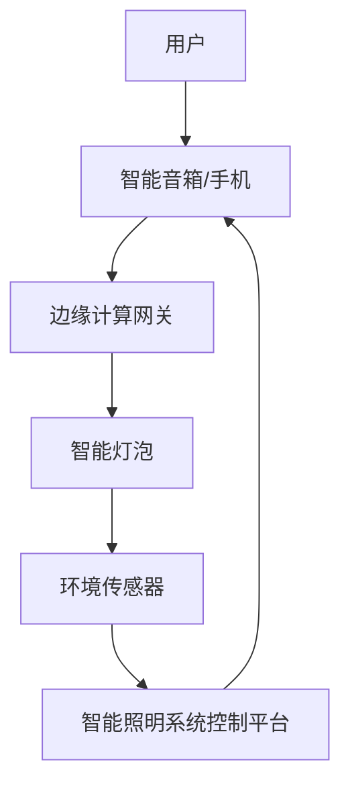
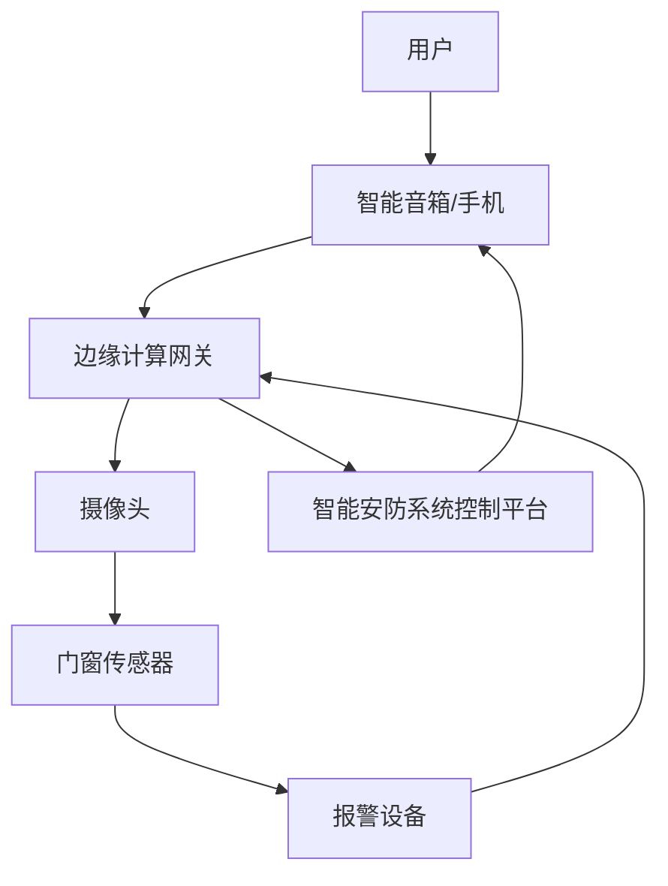
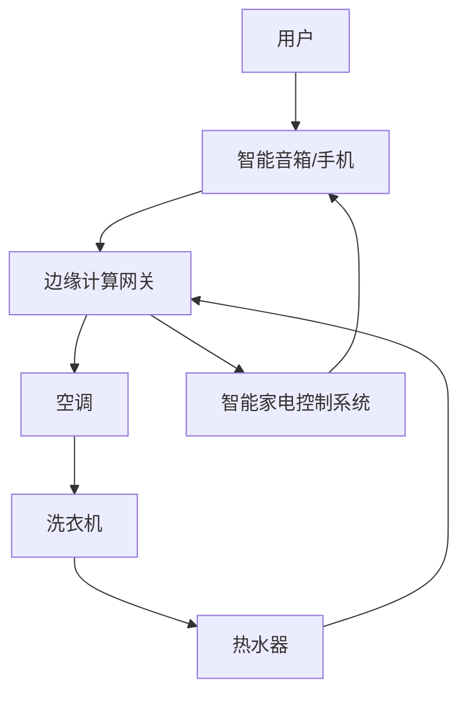
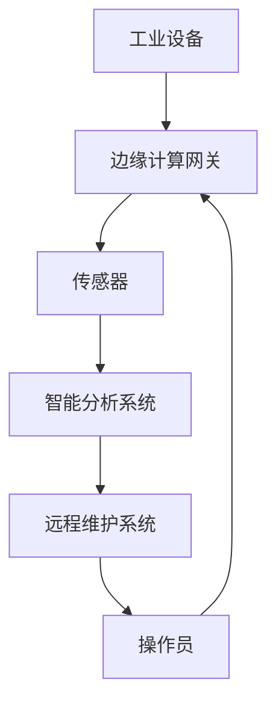
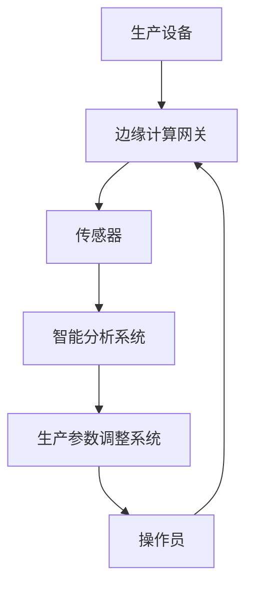
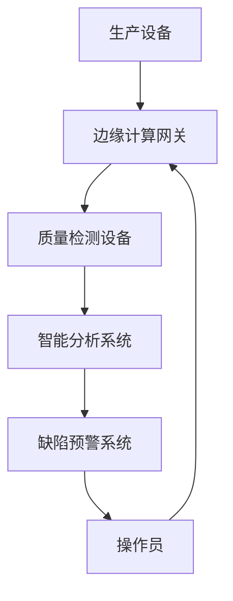
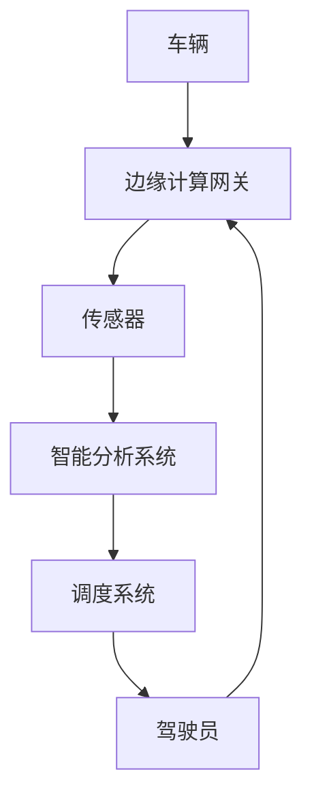
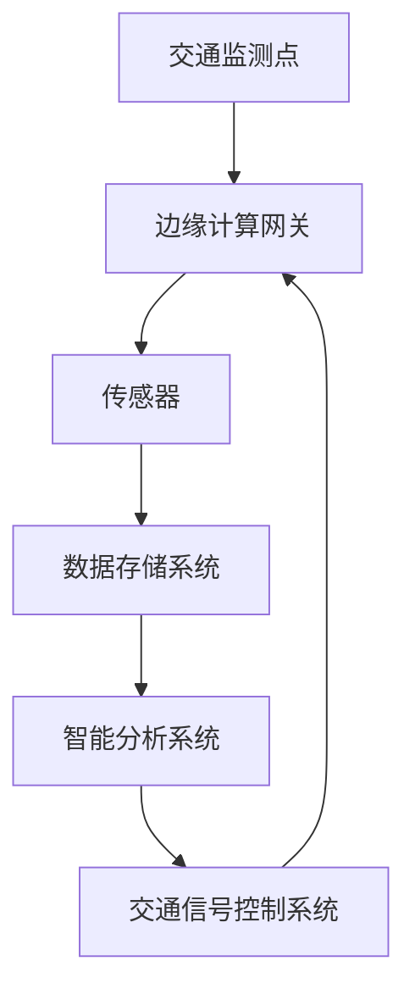
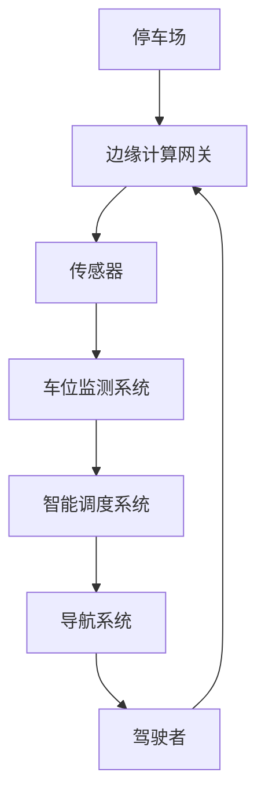

                 

### 联想2024校招边缘计算设备工程师面试题解析

> 关键词：边缘计算、设备工程师、面试题解析、技术原理、案例分析

> 摘要：本文将深入解析联想2024校招边缘计算设备工程师的面试题，通过逐步分析面试题目，帮助考生掌握边缘计算设备的核心知识和技术要点，为成功应对面试做好准备。

随着边缘计算技术的快速发展，其在各行各业的应用越来越广泛，成为企业数字化转型的重要方向。联想作为全球知名科技企业，其2024校招边缘计算设备工程师的面试题目不仅考察应聘者的基础知识，还要求考生具备实际应用能力。本文将针对这些面试题进行详细解析，帮助考生深入理解边缘计算设备的相关知识。

### 第一部分: 边缘计算设备的基础知识

#### 第1章: 边缘计算概述

##### 1.1 边缘计算的定义与重要性

###### 1.1.1 边缘计算的概念

边缘计算（Edge Computing）是一种分布式计算架构，它将计算、存储和网络功能分散到网络的边缘，以降低延迟、带宽使用和计算成本。与云计算相比，边缘计算更接近数据源，能够更快地处理数据，并提供实时响应。

边缘计算的概念可以分为以下几个层次：

1. **设备级边缘计算**：在设备内部进行数据预处理和计算，如智能手表、智能手机等。
2. **局域网边缘计算**：在局域网内进行数据处理，如企业内部网络、智能家庭网络等。
3. **广域网边缘计算**：在广域网内进行数据处理，如城市级、区域级的边缘计算中心。

###### 1.1.2 边缘计算与传统计算的差异

传统计算主要依赖于云计算中心，数据处理在远程服务器上进行。而边缘计算则更加贴近用户，数据处理在靠近用户的设备或网络节点上进行。这种差异主要体现在以下几个方面：

1. **计算位置**：传统计算在云端，边缘计算在边缘。
2. **数据处理延迟**：边缘计算具有更低的延迟，能够实现实时数据处理。
3. **网络带宽**：边缘计算可以降低网络带宽的需求，减少数据传输量。

###### 1.1.3 边缘计算的关键作用

边缘计算在多个领域发挥着关键作用，以下是其中的几个方面：

1. **物联网（IoT）**：边缘计算可以实现物联网设备的数据实时处理，提高设备的工作效率。
2. **工业自动化**：边缘计算可以实时监测和调整生产线设备，提高生产过程的自动化程度。
3. **智能交通**：边缘计算可以实现实时交通流量监控和优化，提高交通管理效率。

##### 1.2 边缘计算的发展历程

###### 1.2.1 从云计算到边缘计算

云计算的出现解决了数据存储和计算资源的集中问题，但随之而来的网络延迟和数据安全问题成为瓶颈。为了解决这些问题，边缘计算应运而生。边缘计算的发展可以追溯到以下几个方面：

1. **物联网的兴起**：随着物联网设备的普及，对数据处理实时性的要求不断提高，推动了边缘计算的发展。
2. **5G网络的推广**：5G网络的低延迟、高带宽特性为边缘计算提供了基础设施支持。
3. **云计算中心的扩展**：云计算中心在不断扩展，但仍然无法完全满足数据实时处理的需求，边缘计算成为必要补充。

###### 1.2.2 边缘计算的关键阶段

边缘计算的发展可以分为以下几个关键阶段：

1. **设备级边缘计算**：这是边缘计算的起步阶段，主要在设备内部进行数据处理。
2. **局域网边缘计算**：随着局域网技术的发展，数据处理开始向局域网边缘延伸。
3. **广域网边缘计算**：广域网边缘计算是当前边缘计算发展的重点，涉及到城市级、区域级的边缘计算中心。

###### 1.2.3 当前边缘计算的发展趋势

当前边缘计算的发展趋势主要体现在以下几个方面：

1. **技术成熟**：边缘计算技术逐渐成熟，包括硬件、软件和网络技术等。
2. **应用广泛**：边缘计算在物联网、工业自动化、智能交通等多个领域得到广泛应用。
3. **生态完善**：边缘计算生态逐渐完善，包括设备制造商、云计算服务提供商、应用开发商等。

##### 1.3 边缘计算的架构

边缘计算架构主要包括以下几个部分：

###### 1.3.1 边缘计算节点

边缘计算节点是指在网络的边缘处进行数据处理和服务的设备，包括智能路由器、智能网关、智能设备等。边缘计算节点的作用是收集数据、处理数据和提供服务。

边缘计算节点的分类如下：

1. **专用节点**：专门用于边缘计算任务的节点，如工业物联网网关。
2. **通用节点**：可以承担多种边缘计算任务的节点，如智能路由器。

###### 1.3.2 边缘计算网关

边缘计算网关是连接边缘计算节点和云计算中心的桥梁，主要负责数据传输、协议转换和安全管理等功能。边缘计算网关的作用是实现边缘计算节点与云计算中心的数据交互。

边缘计算网关的分类如下：

1. **硬件网关**：基于硬件设备实现的边缘计算网关，如智能路由器。
2. **软件网关**：基于软件实现的边缘计算网关，如虚拟机、容器等。

###### 1.3.3 边缘计算平台

边缘计算平台是边缘计算架构的核心，负责管理、调度和监控边缘计算资源。边缘计算平台包括以下几个组成部分：

1. **资源管理**：负责管理和调度边缘计算资源，包括硬件资源和软件资源。
2. **服务管理**：负责管理和调度边缘计算服务，包括数据处理、数据存储和数据分析等。
3. **安全控制**：负责边缘计算的安全管理，包括数据加密、身份认证和访问控制等。

#### 第2章: 边缘计算设备的关键技术

##### 2.1 边缘计算设备概述

边缘计算设备是指在边缘网络中进行数据处理和服务的硬件和软件设备。边缘计算设备是边缘计算架构的核心组成部分，其性能和稳定性直接影响到边缘计算系统的整体性能。

边缘计算设备的分类如下：

1. **硬件设备**：包括智能路由器、智能网关、智能设备等。
2. **软件设备**：包括边缘计算平台、边缘应用等。

##### 2.2 边缘计算硬件平台

边缘计算硬件平台是指用于构建边缘计算系统的硬件设备，包括处理器、存储器、网络设备等。

###### 2.2.1 硬件平台的选择

选择边缘计算硬件平台时需要考虑以下几个因素：

1. **计算能力**：根据边缘计算任务的需求，选择适合的处理器和存储器。
2. **网络性能**：选择支持高速网络连接的硬件平台，确保数据传输速度。
3. **可扩展性**：选择支持扩展的硬件平台，以便在未来进行升级和扩展。

常见的边缘计算硬件包括：

1. **智能路由器**：具有智能处理能力的路由器，可实现数据过滤、流量控制等功能。
2. **智能网关**：连接边缘计算节点和云计算中心的网关设备，可实现数据传输、协议转换等功能。
3. **智能设备**：如智能手表、智能手机等，可实现数据采集、处理和发送等功能。

###### 2.2.2 常见的边缘计算硬件

常见的边缘计算硬件包括：

1. **物联网网关**：用于连接物联网设备的边缘计算硬件，可实现设备数据采集、处理和传输等功能。
2. **智能传感器**：用于监测环境参数的边缘计算硬件，如温度传感器、湿度传感器等。
3. **智能摄像头**：用于视频监控的边缘计算硬件，可实现实时视频处理和传输等功能。

###### 2.2.3 硬件平台的性能优化

边缘计算硬件平台的性能优化主要涉及以下几个方面：

1. **计算资源分配**：根据边缘计算任务的需求，合理分配计算资源，提高计算效率。
2. **网络带宽管理**：优化网络带宽管理策略，提高数据传输速度。
3. **能耗优化**：通过优化硬件设计和管理策略，降低能耗，延长设备寿命。

##### 2.3 边缘计算软件栈

边缘计算软件栈是指用于构建边缘计算系统的软件组件，包括操作系统、容器化技术、编程语言和开发工具等。

###### 2.3.1 操作系统

边缘计算操作系统是边缘计算硬件平台的核心组件，负责管理硬件资源、提供运行环境和服务支持。常见的边缘计算操作系统包括：

1. **Linux**：具有开源、高性能、稳定等特点，适用于大多数边缘计算应用场景。
2. **Windows**：适用于Windows应用程序的边缘计算场景。
3. **RTOS**：实时操作系统，适用于对实时性要求较高的边缘计算应用场景。

###### 2.3.2 容器化技术

容器化技术是边缘计算软件栈的重要组成部分，用于将应用程序及其依赖环境打包成容器，实现应用程序的轻量级部署和管理。常见的容器化技术包括：

1. **Docker**：一种开源容器化技术，可实现应用程序的快速部署和运行。
2. **Kubernetes**：一种开源容器编排平台，用于管理容器化应用程序的生命周期。
3. **Podman**：一种开源容器管理工具，适用于Linux环境。

###### 2.3.3 软件框架

边缘计算软件框架是边缘计算软件栈的核心组件，用于提供应用程序的开发环境和运行环境。常见的边缘计算软件框架包括：

1. **边缘计算框架**：如EdgeX Foundry、OpenFog等，提供边缘计算节点间的数据通信和设备管理功能。
2. **物联网平台**：如IoT Platform、IoT Cloud等，提供物联网设备的连接、数据采集、数据处理等功能。
3. **机器学习框架**：如TensorFlow、PyTorch等，提供边缘计算节点上的机器学习模型训练和推理功能。

### 第二部分: 边缘计算设备的应用案例

#### 第4章: 边缘计算在智能家居中的应用

##### 4.1 智能家居概述

智能家居（Smart Home）是一种利用网络技术和智能设备实现家庭自动化、智能化的居住环境。智能家居系统主要由以下几个部分组成：

1. **智能设备**：包括智能门锁、智能灯泡、智能空调、智能摄像头等。
2. **控制中心**：包括智能手机、平板电脑、智能音箱等。
3. **网络连接**：包括Wi-Fi、蓝牙等无线网络技术。

智能家居的发展趋势主要体现在以下几个方面：

1. **智能化程度提高**：智能家居设备越来越智能化，能够实现更多的自动控制功能。
2. **互联互通**：智能家居设备之间可以实现互联互通，形成一个完整的智能家居系统。
3. **个性化定制**：智能家居系统能够根据用户的需求和喜好进行个性化定制。

边缘计算在智能家居中的应用主要表现在以下几个方面：

1. **实时数据采集和处理**：边缘计算设备可以实时采集家庭环境数据，如温度、湿度、光照等，并对其进行处理和分析，为智能家居系统提供实时数据支持。
2. **本地化控制**：边缘计算设备可以实现对智能家居设备的本地化控制，降低网络延迟，提高控制响应速度。
3. **隐私保护**：边缘计算可以将部分敏感数据在本地进行处理，减少数据传输，降低隐私泄露风险。

##### 4.2 智能家居案例

###### 4.2.1 智能照明系统

智能照明系统是智能家居中的重要组成部分，通过边缘计算可以实现以下功能：

1. **自动控制**：边缘计算设备可以实时监测环境光线强度，自动调整照明亮度，实现节能效果。
2. **远程控制**：用户可以通过智能手机或智能音箱远程控制照明设备，实现随时随地控制照明。
3. **场景模式**：用户可以设置多种照明场景模式，如阅读模式、睡眠模式等，根据不同的需求调整照明。

智能照明系统的架构如图1所示：

其中，用户通过智能音箱或手机发送控制指令，边缘计算网关接收指令并转发给智能灯泡，同时环境传感器收集环境数据并传输给智能照明系统控制平台，以实现自动控制和场景模式设置。

###### 4.2.2 智能安防系统

智能安防系统是智能家居中的一项重要功能，通过边缘计算可以实现以下功能：

1. **实时监控**：边缘计算设备可以实时监测家庭环境，如视频监控、门窗状态等，及时发现异常情况。
2. **智能报警**：边缘计算设备可以对监测到的异常情况进行分析，自动触发报警，如入侵报警、火灾报警等。
3. **联动控制**：智能安防系统可以与其他智能家居设备联动，如自动开启照明、关闭门窗等，提高安防效果。

智能安防系统的架构如图2所示：

其中，用户通过智能音箱或手机发送控制指令，边缘计算网关接收指令并转发给摄像头和门窗传感器，同时报警设备接收传感器数据并触发报警，智能安防系统控制平台接收报警信息并进行联动控制。

###### 4.2.3 智能家电控制

智能家电控制是智能家居中的一项基本功能，通过边缘计算可以实现以下功能：

1. **远程控制**：用户可以通过智能手机或智能音箱远程控制家电设备，如空调、洗衣机、热水器等。
2. **定时控制**：用户可以设置家电设备的定时开关机，实现自动化控制。
3. **场景控制**：用户可以设置家电设备的场景模式，如离家模式、睡眠模式等，根据不同的需求调整家电设备的工作状态。

智能家电控制的架构如图3所示：

其中，用户通过智能音箱或手机发送控制指令，边缘计算网关接收指令并转发给空调、洗衣机和热水器，智能家电控制系统接收设备状态信息并返回响应。

#### 第5章: 边缘计算在工业物联网中的应用

##### 5.1 工业物联网概述

工业物联网（Industrial Internet of Things，简称IIoT）是将传感器、设备、控制系统和云计算等技术与工业生产相结合，实现设备联网、数据采集、智能分析和远程控制的一种新型工业生产模式。工业物联网的主要组成部分包括：

1. **传感器**：用于监测工业设备的运行状态和周围环境。
2. **设备**：包括工业机器人、生产线设备、工业服务器等。
3. **网络**：包括有线网络和无线网络，用于连接传感器和设备。
4. **平台**：用于数据存储、处理和分析的云计算平台。

工业物联网的发展趋势主要体现在以下几个方面：

1. **智能化**：工业物联网设备越来越智能化，能够实现自主决策和协同工作。
2. **大数据**：工业物联网产生的大量数据，通过大数据分析可以挖掘出更多价值。
3. **云计算**：云计算技术在工业物联网中的应用越来越广泛，提供了强大的数据存储和处理能力。

边缘计算在工业物联网中的应用主要体现在以下几个方面：

1. **数据采集和处理**：边缘计算设备可以实时采集工业设备的运行数据，并在本地进行处理，降低数据传输量，提高数据处理速度。
2. **设备远程控制**：边缘计算设备可以实现对工业设备的远程控制，提高生产线的自动化程度。
3. **故障预测和预防**：边缘计算设备可以通过对设备运行数据的实时分析，预测设备故障并及时采取措施，预防故障发生。

##### 5.2 工业物联网案例

###### 5.2.1 设备远程监控与维护

设备远程监控与维护是工业物联网中的重要应用，通过边缘计算可以实现以下功能：

1. **实时监控**：边缘计算设备可以实时监控工业设备的运行状态，如温度、压力、速度等，及时发现设备异常。
2. **远程维护**：边缘计算设备可以实现对设备的远程诊断和维护，提高设备维护效率。
3. **故障预警**：边缘计算设备可以通过对设备运行数据的分析，预测设备故障并及时发出预警，预防故障发生。

设备远程监控与维护的架构如图4所示：

其中，工业设备通过传感器采集运行数据，边缘计算网关接收数据并传输给智能分析系统和远程维护系统，操作员通过远程维护系统对设备进行监控和维护。

###### 5.2.2 生产过程优化

生产过程优化是工业物联网的重要应用，通过边缘计算可以实现以下功能：

1. **实时数据采集**：边缘计算设备可以实时采集生产过程中的各种数据，如生产节拍、设备状态、物料消耗等。
2. **数据分析和优化**：边缘计算设备可以对生产过程中的数据进行分析，找出瓶颈和优化点，提出优化建议。
3. **自动化调整**：边缘计算设备可以自动调整生产参数，实现生产过程的自动化优化。

生产过程优化的架构如图5所示：

其中，生产设备通过传感器采集运行数据，边缘计算网关接收数据并传输给智能分析系统和生产参数调整系统，操作员通过生产参数调整系统对生产过程进行监控和调整。

###### 5.2.3 质量检测与预测

质量检测与预测是工业物联网中的重要应用，通过边缘计算可以实现以下功能：

1. **实时质量检测**：边缘计算设备可以实时检测生产过程中的产品质量，如尺寸、表面质量、成分含量等。
2. **数据分析和预测**：边缘计算设备可以对质量检测数据进行实时分析，预测产品质量的变化趋势。
3. **缺陷预警**：边缘计算设备可以通过对质量检测数据的分析，预测产品质量缺陷并及时发出预警，预防缺陷产品的产生。

质量检测与预测的架构如图6所示：

其中，生产设备通过质量检测设备采集质量检测数据，边缘计算网关接收数据并传输给智能分析系统和缺陷预警系统，操作员通过缺陷预警系统对产品质量进行监控和预警。

#### 第6章: 边缘计算在智能交通中的应用

##### 6.1 智能交通概述

智能交通（Smart Transportation）是指利用信息技术、传感器技术和通信技术，实现交通系统的智能化管理和运行。智能交通系统主要由以下几个部分组成：

1. **交通信息采集**：包括路况监测、车辆信息采集等。
2. **交通信号控制**：通过智能交通信号控制系统，优化交通信号灯的配时方案。
3. **交通诱导**：通过交通诱导系统，为驾驶者提供实时路况信息和导航建议。
4. **交通管理**：通过智能交通管理系统，对交通流量进行实时监控和调控。

智能交通的发展趋势主要体现在以下几个方面：

1. **物联网技术**：物联网技术在智能交通中的应用越来越广泛，可以实现交通信息的实时采集和传输。
2. **大数据分析**：大数据技术在智能交通中的应用，可以实现交通数据的深度挖掘和分析，为交通管理和优化提供依据。
3. **车联网**：车联网技术的发展，可以实现车辆之间的通信和协同，提高交通系统的整体效率。

边缘计算在智能交通中的应用主要体现在以下几个方面：

1. **实时交通数据处理**：边缘计算设备可以实时处理交通数据，实现交通状况的实时监控和预测。
2. **交通信号优化**：边缘计算设备可以实时分析交通信号灯的数据，实现信号灯的优化配时。
3. **车辆管理**：边缘计算设备可以实时监控车辆的状态，实现对车辆的智能管理和调度。

##### 6.2 智能交通案例

###### 6.2.1 车辆监控与调度

车辆监控与调度是智能交通中的重要应用，通过边缘计算可以实现以下功能：

1. **实时监控**：边缘计算设备可以实时监控车辆的运行状态，如位置、速度、油耗等。
2. **远程调度**：边缘计算设备可以实现对车辆的远程调度，根据交通状况和需求调整车辆的运行路线。
3. **故障预警**：边缘计算设备可以通过对车辆运行数据的分析，预测车辆故障并及时发出预警，预防故障发生。

车辆监控与调度的架构如图7所示：

其中，车辆通过传感器采集运行数据，边缘计算网关接收数据并传输给智能分析系统和调度系统，驾驶员通过调度系统对车辆进行监控和调度。

###### 6.2.2 交通流量预测与分析

交通流量预测与分析是智能交通中的重要应用，通过边缘计算可以实现以下功能：

1. **实时流量监测**：边缘计算设备可以实时监测交通流量，收集交通数据。
2. **流量预测**：边缘计算设备可以通过对历史交通数据的分析，预测未来的交通流量。
3. **流量优化**：边缘计算设备可以根据实时流量和预测结果，优化交通信号灯的配时方案，实现交通流量的平衡。

交通流量预测与分析的架构如图8所示：

其中，交通监测点通过传感器采集交通数据，边缘计算网关接收数据并传输给数据存储系统和智能分析系统，智能分析系统根据实时数据和预测结果优化交通信号灯的配时方案，交通信号控制系统根据优化方案调整信号灯的配时。

###### 6.2.3 智能停车系统

智能停车系统是智能交通中的重要应用，通过边缘计算可以实现以下功能：

1. **实时车位监测**：边缘计算设备可以实时监测停车场的车位情况，收集车位数据。
2. **智能调度**：边缘计算设备可以根据车位情况和车辆需求，智能调度车辆停车。
3. **车位导航**：边缘计算设备可以为驾驶者提供实时停车导航，减少寻找停车位的时间。

智能停车系统的架构如图9所示：

其中，停车场通过传感器采集车位数据，边缘计算网关接收数据并传输给车位监测系统、智能调度系统和导航系统，驾驶者通过导航系统获取实时停车信息并按照智能调度系统的建议停车。

### 第三部分: 边缘计算设备的设计与开发

#### 第7章: 边缘计算设备的设计原则与方法

边缘计算设备的设计需要考虑多方面的因素，包括功能需求、性能要求、可靠性、可维护性等。以下是边缘计算设备的设计原则和方法：

##### 7.1 边缘计算设备的设计原则

###### 7.1.1 可扩展性

边缘计算设备需要具备良好的可扩展性，能够根据实际需求进行功能扩展和性能升级。可扩展性包括硬件扩展和软件扩展两个方面：

1. **硬件扩展**：边缘计算设备应该支持多种接口和协议，方便接入不同的传感器和设备。
2. **软件扩展**：边缘计算设备应该支持模块化设计，便于添加新的功能模块。

###### 7.1.2 高效性

边缘计算设备需要在有限的硬件资源下实现高效的数据处理和传输。高效性包括以下几个方面：

1. **计算效率**：选择合适的处理器和算法，提高数据处理速度。
2. **网络效率**：优化网络协议和数据传输策略，降低数据传输延迟。

###### 7.1.3 安全性

边缘计算设备需要确保数据的安全性和设备的稳定性。安全性包括以下几个方面：

1. **数据安全**：采用加密技术保护数据传输和存储过程中的安全。
2. **设备安全**：设计设备防护措施，防止设备被攻击和篡改。

###### 7.1.4 易维护性

边缘计算设备需要具备良好的可维护性，方便进行故障诊断和维修。易维护性包括以下几个方面：

1. **模块化设计**：设备采用模块化设计，便于更换故障模块。
2. **诊断工具**：提供方便的故障诊断工具，快速定位故障原因。
3. **远程维护**：支持远程维护功能，降低维护成本。

##### 7.2 边缘计算设备的设计方法

边缘计算设备的设计方法主要包括以下几个步骤：

###### 7.2.1 需求分析

需求分析是设计边缘计算设备的第一个步骤，主要包括以下内容：

1. **功能需求**：确定边缘计算设备需要实现的功能，如数据采集、数据处理、数据传输等。
2. **性能要求**：确定边缘计算设备的性能指标，如处理速度、存储容量、网络带宽等。
3. **环境要求**：确定边缘计算设备的工作环境，如温度、湿度、震动等。

###### 7.2.2 系统架构设计

系统架构设计是根据需求分析的结果，设计边缘计算设备的系统架构。系统架构设计主要包括以下几个方面：

1. **硬件架构**：设计边缘计算设备的硬件架构，包括处理器、存储器、网络设备等。
2. **软件架构**：设计边缘计算设备的软件架构，包括操作系统、应用软件、中间件等。
3. **网络架构**：设计边缘计算设备的网络架构，包括网络设备、网络协议、网络拓扑等。

###### 7.2.3 硬件与软件协同设计

硬件与软件协同设计是边缘计算设备设计的关键步骤，主要包括以下几个方面：

1. **硬件选择**：根据软件需求，选择合适的硬件设备，如处理器、存储器、网络设备等。
2. **硬件优化**：对硬件进行优化，提高硬件性能，降低功耗。
3. **软件优化**：对软件进行优化，提高软件性能，降低内存占用。

#### 第8章: 边缘计算设备的开发流程

边缘计算设备的开发流程主要包括以下几个步骤：

##### 8.1 开发环境搭建

开发环境搭建是边缘计算设备开发的第一个步骤，主要包括以下内容：

1. **操作系统安装**：在边缘计算设备上安装合适的操作系统，如Linux、Windows等。
2. **硬件调试**：对边缘计算设备的硬件进行调试，确保硬件正常运行。
3. **软件调试**：在边缘计算设备上安装和配置必要的软件，如编程语言、开发工具等。

##### 8.2 系统开发工具与框架

系统开发工具与框架的选择对于边缘计算设备的开发至关重要，主要包括以下几个方面：

1. **开发工具**：选择适合边缘计算设备开发的编程语言和开发工具，如C++、Python、Visual Studio等。
2. **框架选择**：选择适合边缘计算设备开发的框架，如物联网框架、边缘计算框架、容器化框架等。
3. **开发流程优化**：优化开发流程，提高开发效率，如代码版本管理、自动化测试等。

##### 8.3 代码实现与优化

代码实现与优化是边缘计算设备开发的核心步骤，主要包括以下几个方面：

1. **源代码实现**：根据系统设计文档，编写边缘计算设备的源代码。
2. **性能优化**：对边缘计算设备的源代码进行性能优化，提高数据处理速度和效率。
3. **调试与测试**：对边缘计算设备进行调试和测试，确保设备正常运行。

#### 第9章: 边缘计算设备的项目实战

边缘计算设备的项目实战是将理论知识应用于实际项目的过程，主要包括以下几个步骤：

##### 9.1 实战项目概述

实战项目概述是对项目的基本情况进行介绍，主要包括以下几个方面：

1. **项目背景**：介绍项目的原因、目标和意义。
2. **项目目标**：明确项目需要实现的功能和性能要求。
3. **项目团队组成**：介绍项目团队的成员和分工。

##### 9.2 项目开发环境搭建

项目开发环境搭建是项目开发的基础，主要包括以下内容：

1. **硬件环境搭建**：搭建边缘计算设备的硬件环境，包括处理器、存储器、网络设备等。
2. **软件环境配置**：配置边缘计算设备的软件环境，包括操作系统、编程语言、开发工具等。

##### 9.3 项目开发过程

项目开发过程是项目实战的核心，主要包括以下几个阶段：

1. **需求分析与系统设计**：根据项目目标，进行需求分析和系统设计。
2. **硬件开发与调试**：根据系统设计，进行硬件开发与调试。
3. **软件开发与优化**：根据系统设计，进行软件开发与优化。

##### 9.4 项目测试与部署

项目测试与部署是项目开发的最后一个阶段，主要包括以下几个内容：

1. **功能测试**：测试边缘计算设备的功能是否符合要求。
2. **性能测试**：测试边缘计算设备的性能是否达到预期。
3. **部署与上线**：将边缘计算设备部署到实际应用场景，并进行上线。

### 第10章: 边缘计算设备的未来发展趋势

边缘计算设备的未来发展趋势将受到多个因素的影响，包括技术进步、市场需求和应用场景等。以下是边缘计算设备的未来发展趋势：

##### 10.1 技术发展趋势

1. **硬件性能提升**：随着硬件技术的进步，边缘计算设备的性能将不断提升，如处理器性能、存储容量、网络带宽等。
2. **软件智能化**：边缘计算设备的软件将逐渐智能化，具备自我学习和自我优化的能力。
3. **网络技术发展**：5G、Wi-Fi 6等网络技术的发展将进一步提高边缘计算设备的网络性能。

##### 10.2 市场发展趋势

1. **市场规模扩大**：随着边缘计算技术的普及，边缘计算设备的市场需求将不断扩大。
2. **行业应用深入**：边缘计算设备将在更多行业得到应用，如智能制造、智能交通、智慧城市等。
3. **产业链完善**：边缘计算设备的产业链将逐渐完善，包括硬件制造商、软件开发商、系统集成商等。

##### 10.3 应用发展趋势

1. **智能化应用**：边缘计算设备将广泛应用于智能化应用，如智能家居、智能工厂、智能交通等。
2. **场景多样化**：边缘计算设备的应用场景将越来越多样化，包括户外环境、地下设施、高空场景等。
3. **安全性提升**：随着边缘计算设备的应用场景和数量增加，设备的安全性和隐私保护将受到更多关注。

### 总结

边缘计算设备作为边缘计算技术的重要载体，其发展对于推动数字经济、智能社会具有重要意义。通过本文对联想2024校招边缘计算设备工程师面试题的解析，我们深入了解了边缘计算设备的基础知识、应用案例、设计与开发方法，以及未来发展趋势。希望本文能够帮助考生更好地应对面试，同时也为边缘计算设备的研发和应用提供参考。

#### 作者信息

- 作者：AI天才研究院/AI Genius Institute & 禅与计算机程序设计艺术 /Zen And The Art of Computer Programming

本文由AI天才研究院/AI Genius Institute和禅与计算机程序设计艺术/Zen And The Art of Computer Programming联合撰写，旨在为边缘计算设备的研发和应用提供深入的解析和指导。如需了解更多相关信息，请访问我们的官方网站。同时，感谢您的阅读，欢迎提出宝贵意见和建议。我们将持续关注边缘计算技术的发展，为您带来更多有价值的内容。

