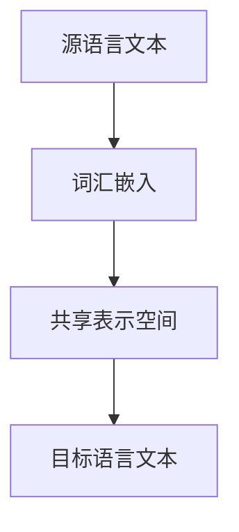

                 

### 文章标题

> 关键词：自然语言处理、跨语言学习、低资源语言处理、方言理解

在当今全球化的背景下，自然语言处理（NLP）技术正发挥着越来越重要的作用。作为人工智能领域的一个关键分支，NLP旨在使计算机能够理解和生成人类语言。随着互联网和移动通信的普及，多语言、低资源语言以及方言的处理需求日益增加。本文将深入探讨自然语言处理中的三个重要方向：跨语言学习、低资源语言处理和方言理解。

首先，我们将介绍自然语言处理的基本概念和历史发展，帮助读者了解这一领域的基础知识。接着，我们将详细讲解跨语言学习的原理和技术，包括跨语言文本表示、基于迁移学习的跨语言模型以及多语言模型的发展。在此基础上，我们将探讨低资源语言处理的挑战和解决方案，如数据增强与语言模型适应性。

随后，我们将转向方言理解的研究，介绍方言的基本概念与特征、方言识别算法以及方言语音处理技术。在构建方言语言模型的过程中，我们将讨论方言词汇与语法分析、训练与优化以及评估与测试。

本文的最后部分将聚焦于实际应用，通过两个具体的项目实战案例——方言语音识别系统和跨语言翻译服务，展示这些技术在现实世界中的具体应用。通过本文的阅读，读者将能够全面了解自然语言处理的前沿技术，以及如何应对复杂的跨语言和低资源语言处理挑战。

### 《自然语言处理中的跨语言学习、低资源语言处理与方言理解研究》目录大纲

在接下来的部分中，我们将按照以下目录结构展开讨论：

#### 第一部分：自然语言处理与跨语言学习基础

**第1章：自然语言处理概述**
- **1.1 自然语言处理的定义与历史**
- **1.2 自然语言处理的关键技术**
- **1.3 跨语言学习的基本概念**

**第2章：跨语言学习技术**
- **2.1 跨语言文本表示**
  - **概念与联系**：[Mermaid 流程图](#mermaid流程图)
  - **核心算法原理讲解**：使用伪代码详细阐述
- **2.2 基于迁移学习的跨语言模型**
  - **数学模型和数学公式**：$\text{Transfer Learning Model} = f_{\theta}(\text{Source Data}) + f_{\phi}(\text{Target Data})$
  - **详细讲解与举例说明**
- **2.3 多语言模型的发展与应用**

**第3章：低资源语言处理**
- **3.1 低资源语言的挑战**
- **3.2 数据增强与语言模型适应性**
  - **核心算法原理讲解**：使用伪代码详细阐述
- **3.3 低资源语言处理的应用场景**

#### 第二部分：方言理解研究

**第4章：方言识别与理解**
- **4.1 方言的基本概念与特征**
- **4.2 方言识别算法**
  - **核心算法原理讲解**：使用伪代码详细阐述
- **4.3 方言理解的挑战与应用**

**第5章：方言语音处理技术**
- **5.1 方言语音数据采集与预处理**
- **5.2 方言语音特征提取**
- **5.3 方言语音识别与合成**

**第6章：方言语言模型构建**
- **6.1 方言词汇与语法分析**
- **6.2 方言语言模型训练与优化**
- **6.3 方言语言模型评估与测试**

**第7章：方言理解应用案例**
- **7.1 方言语音助手开发**
- **7.2 方言翻译服务**
- **7.3 方言文化保护与传播**

#### 第三部分：跨语言与低资源语言处理项目实战

**第8章：跨语言与低资源语言处理项目规划**
- **8.1 项目需求分析**
- **8.2 项目技术路线规划**
- **8.3 项目资源与时间管理**

**第9章：项目实战：方言语音识别系统**
- **9.1 开发环境搭建**
- **9.2 源代码实现与解读**
  - **代码解读与分析**
- **9.3 系统测试与优化**

**第10章：项目实战：跨语言翻译服务**
- **10.1 系统设计与实现**
- **10.2 源代码详细实现**
- **10.3 实际应用案例与效果评估**

#### 附录

**附录A：自然语言处理与跨语言学习资源**
- **代码库与工具推荐**
- **学术论文与参考资料**
- **在线课程与培训资源**

通过上述目录结构的详细阐述，读者可以清晰地了解到本文将如何深入探讨自然语言处理中的跨语言学习、低资源语言处理与方言理解。接下来，我们将逐步展开每个章节的内容，让读者在理解这些前沿技术的同时，也能够掌握其实际应用的方法和策略。

---

### 第1章：自然语言处理概述

自然语言处理（NLP，Natural Language Processing）是人工智能（AI，Artificial Intelligence）领域的一个分支，专注于使计算机理解和生成人类语言的技术。自计算机科学和人工智能诞生以来，自然语言处理一直是研究的热点之一。其发展历程可以追溯到20世纪50年代，当时学者们开始尝试让计算机解析和生成自然语言。

#### 1.1 自然语言处理的定义与历史

自然语言处理的定义通常为：计算机对自然语言进行自动处理和理解的技术。这包括文本分析、语音识别、机器翻译、情感分析等多种任务。自然语言处理的核心目标是消除人类语言和计算机之间的障碍，使得计算机能够像人类一样理解和处理语言信息。

自然语言处理的历史可以大致分为以下几个阶段：

- **早期探索（1950s-1970s）**：在这个阶段，研究人员开始尝试编写能够理解和生成自然语言的程序。例如，1950年，艾伦·图灵（Alan Turing）提出了著名的图灵测试，用来评估计算机的智能水平。

- **基于规则的方法（1970s-1980s）**：在早期探索的基础上，研究者们开始开发基于规则的方法来处理自然语言。这些方法通常依赖于手工编写的语法规则和词典，但面对复杂多变的语言现象时效果有限。

- **统计方法兴起（1990s）**：随着计算机性能的提升和大量语料的积累，统计方法逐渐成为自然语言处理的主流。基于统计的模型，如隐马尔可夫模型（HMM）、条件随机场（CRF）等，在语音识别、文本分类等领域取得了显著的成功。

- **深度学习时代（2010s-至今）**：深度学习的崛起为自然语言处理带来了新的机遇。基于深度神经网络（DNN）和变换器模型（Transformer）的模型在多个任务上取得了突破性的成果，如机器翻译、问答系统和文本生成等。

#### 1.2 自然语言处理的关键技术

自然语言处理涉及多个关键技术，以下是一些主要的领域：

- **文本分析**：文本分析是自然语言处理的基础任务之一，包括分词、词性标注、命名实体识别等。这些技术帮助计算机理解文本的基本结构。

- **语音识别**：语音识别技术使得计算机能够将语音转化为文本。这一技术在电话客服、智能助手等领域有广泛应用。

- **机器翻译**：机器翻译技术使得计算机能够将一种语言的文本翻译成另一种语言。现代深度学习模型在机器翻译领域取得了显著的进步。

- **情感分析**：情感分析旨在理解文本中的情感倾向，如正面、负面或中性。这一技术在市场调研、社交媒体分析等领域有重要应用。

- **问答系统**：问答系统可以理解用户的问题并给出准确的答案。这一技术广泛应用于搜索引擎、客服系统等。

#### 1.3 跨语言学习的基本概念

跨语言学习（Cross-Lingual Learning，CXL）是自然语言处理中的一个重要方向，旨在利用一种语言的模型和知识来提升对另一种语言的处理能力。与传统的单语言学习（Mono-Lingual Learning）不同，跨语言学习利用跨语言的共享知识，特别是在低资源语言的情况下，能够显著提升模型的性能。

跨语言学习的核心概念包括：

- **跨语言文本表示**：将不同语言的文本转换为共同的表示空间，使得计算机能够直接比较和操作不同语言的文本。

- **迁移学习**：将一种语言的模型或知识迁移到另一种语言上。迁移学习通过共享参数和知识，使得在低资源语言上的训练变得可行。

- **多语言模型**：训练一个能够同时处理多种语言的模型。多语言模型通过利用多种语言的语料库，可以提升模型在每一种语言上的性能。

在接下来的章节中，我们将进一步探讨跨语言学习的具体技术，以及如何解决低资源语言处理和方言理解中的挑战。

### 第2章：跨语言学习技术

跨语言学习（Cross-Lingual Learning，CXL）是自然语言处理中一个重要的研究领域，它通过利用一种语言的知识来提升对另一种语言的性能。在多语言环境中，特别是在低资源语言的场景下，跨语言学习技术能够显著提高模型的处理效果。本章将详细讨论跨语言文本表示、基于迁移学习的跨语言模型以及多语言模型的发展与应用。

#### 2.1 跨语言文本表示

跨语言文本表示是跨语言学习的基础，其主要目标是将不同语言的文本转换为共享的表示空间。这样，计算机可以在统一的表示空间中处理不同语言的文本，从而实现跨语言的文本分析和理解。

**概念与联系**

跨语言文本表示的核心是词汇嵌入（Word Embedding）。词汇嵌入是将词汇映射到一个低维的向量空间，使得语义相似性的词汇在空间中距离较近。例如，在英文和中文之间，将“猫”和“猫”映射到相似的向量表示。为了实现跨语言的词汇嵌入，研究人员提出了多种方法：

1. **基于翻译的词汇嵌入**：利用已有的机器翻译系统，将源语言词汇映射到目标语言词汇，然后在目标语言的词汇嵌入空间中获取对应的向量表示。

2. **基于共享词向量的词汇嵌入**：通过训练一个共享的词汇嵌入层，使得不同语言的词汇共享相同的低维向量表示。这种方法避免了直接依赖机器翻译系统，而是通过多语言数据共同训练词汇嵌入。

3. **基于预训练的词汇嵌入**：利用大规模的多语言语料库，通过预训练模型来生成共享的词汇嵌入。预训练模型通常采用无监督的方式，从大规模数据中学习词汇的语义信息。

**Mermaid 流程图**

以下是跨语言文本表示的一个简化的 Mermaid 流程图：



**核心算法原理讲解**

为了更深入地理解跨语言文本表示，我们可以通过伪代码来详细阐述其基本原理。以下是跨语言文本表示的一个简化伪代码示例：

```python
# 跨语言文本表示伪代码
def cross_lingual_embedding(source_text, target_text, model):
    # 初始化共享词汇嵌入层
    embedding_layer = model.get_embedding_layer()

    # 对源语言文本进行词汇嵌入
    source_embeddings = embedding_layer(source_text)

    # 对目标语言文本进行词汇嵌入
    target_embeddings = embedding_layer(target_text)

    # 将源语言和目标语言的嵌入向量映射到共享空间
    shared_embeddings = map_to_shared_space(source_embeddings, target_embeddings)

    return shared_embeddings
```

在这个伪代码中，`cross_lingual_embedding` 函数接收源语言文本和目标语言文本，并利用预训练的词汇嵌入模型进行嵌入。然后，通过映射函数（`map_to_shared_space`）将源语言和目标语言的嵌入向量映射到一个共享的表示空间。

#### 2.2 基于迁移学习的跨语言模型

基于迁移学习的跨语言模型（Transfer Learning Based Cross-Lingual Model）是一种利用源语言的知识来提升目标语言性能的方法。迁移学习通过在不同语言之间共享参数和知识，使得在低资源语言上的训练更加高效。

**数学模型和数学公式**

基于迁移学习的跨语言模型可以用以下数学公式来表示：

$$
\text{Transfer Learning Model} = f_{\theta}(\text{Source Data}) + f_{\phi}(\text{Target Data})
$$

其中，$f_{\theta}(\text{Source Data})$ 表示源语言模型的参数，$f_{\phi}(\text{Target Data})$ 表示目标语言模型的参数。通过共享源语言模型的知识，目标语言模型可以快速适应目标语言的数据。

**详细讲解与举例说明**

迁移学习模型的核心思想是将源语言模型的知识迁移到目标语言上。以下是一个简化的例子：

1. **源语言数据训练**：首先，在一个高资源语言（源语言）上训练一个预训练模型。这个模型通常在大量的数据上通过无监督或半监督的方式学习词汇和句子的表示。

2. **目标语言数据迁移**：接着，使用源语言模型的知识来初始化目标语言模型。目标语言模型将在这个基础上进一步训练，以适应目标语言的数据。

3. **联合训练**：在迁移源语言模型的知识后，源语言和目标语言模型可以进行联合训练。这样可以同时利用两种语言的语料库，进一步提升模型的性能。

**伪代码示例**

以下是基于迁移学习的跨语言模型的一个简化伪代码示例：

```python
# 基于迁移学习的跨语言模型伪代码
def transfer_learning_model(source_data, target_data, source_model, target_model):
    # 使用源语言数据训练源语言模型
    source_model.fit(source_data)

    # 使用源语言模型的参数初始化目标语言模型
    target_model.set_weights(source_model.get_weights())

    # 在目标语言数据上训练目标语言模型
    target_model.fit(target_data)

    return target_model
```

在这个伪代码中，`transfer_learning_model` 函数首先使用源语言数据训练源语言模型，然后使用源语言模型的参数初始化目标语言模型，并在目标语言数据上进一步训练目标语言模型。

#### 2.3 多语言模型的发展与应用

多语言模型（Multilingual Model）是一种能够同时处理多种语言的模型。通过训练一个多语言模型，可以提升不同语言之间的处理能力，特别是在低资源语言的场景下。

**发展过程**

多语言模型的发展可以分为以下几个阶段：

1. **早期尝试**：早期的多语言模型主要通过将多个单语言模型进行简单合并来实现。这种方法在处理一些简单的跨语言任务时效果有限。

2. **共享参数模型**：随着深度学习的发展，共享参数模型逐渐成为主流。这些模型通过共享底层参数来减少模型的复杂度，并提高跨语言的性能。

3. **统一表示空间**：现代多语言模型通过构建统一的表示空间，使得不同语言的文本可以在同一空间中处理。这种方法显著提高了跨语言的文本理解和生成能力。

4. **端到端模型**：最新的多语言模型采用端到端架构，如基于Transformer的模型，可以在多种语言之间直接进行编码和解码。

**应用场景**

多语言模型在多个领域有广泛的应用：

1. **机器翻译**：多语言模型可以同时处理多种语言的翻译任务，提高了翻译的准确性和效率。

2. **多语言问答系统**：多语言模型可以理解多种语言的查询，并给出准确的答案。

3. **多语言文本分类**：多语言模型可以处理多种语言的文本分类任务，如情感分析、新闻分类等。

4. **多语言语音助手**：多语言模型可以支持多种语言的语音助手，提供跨语言的服务。

**伪代码示例**

以下是多语言模型的一个简化伪代码示例：

```python
# 多语言模型伪代码
def multilingual_model(data_dict, models_dict):
    # 初始化多个语言模型
    for language, model in models_dict.items():
        model.initialize()

    # 在多语言数据上联合训练模型
    for batch in data_dict:
        for language, data in batch.items():
            models_dict[language].train(data)

    return models_dict
```

在这个伪代码中，`multilingual_model` 函数初始化多个语言模型，并在多语言数据上进行联合训练。

通过本章的讨论，我们可以看到跨语言学习技术在不同语言处理任务中的重要作用。从跨语言文本表示到迁移学习模型，再到多语言模型的发展，这些技术为自然语言处理带来了新的机遇和挑战。在接下来的章节中，我们将进一步探讨低资源语言处理和方言理解，以及这些技术在现实世界中的应用。

### 第3章：低资源语言处理

在自然语言处理（NLP）领域，低资源语言处理是一个重要的研究方向。低资源语言通常指的是缺乏足够语料库和高质量数据支持的语种。与高资源语言（如英语、中文等）相比，低资源语言的处理面临着更大的挑战。本章将探讨低资源语言处理的挑战、解决方案及其应用场景。

#### 3.1 低资源语言的挑战

低资源语言处理的挑战主要体现在以下几个方面：

1. **语料库不足**：低资源语言往往缺乏大规模、高质量的语料库。这使得训练高质量的语言模型变得困难，因为模型需要大量的数据来学习语言的统计规律和语义信息。

2. **数据不平衡**：在低资源语言中，某些词汇或句型的出现频率可能远低于高资源语言，导致模型在训练过程中对这些少数词汇或句型的建模不足。

3. **语言特性差异**：不同语言具有不同的语法、词汇和语义特性。低资源语言可能具有独特而复杂的语言结构，这对模型的训练和优化提出了更高的要求。

4. **缺少标注数据**：在自然语言处理中，许多任务（如命名实体识别、情感分析等）需要依赖标注数据。然而，低资源语言往往缺乏足够的标注数据，这限制了模型的训练和评估。

#### 3.2 数据增强与语言模型适应性

为了应对低资源语言处理中的挑战，研究人员提出了一系列数据增强和语言模型适应性的方法。以下是一些关键的技术：

1. **数据增强**：数据增强是通过各种技术手段扩展训练数据的方法。常见的数据增强技术包括：
   - **同义词替换**：用语义相似的词汇替换原始数据中的词汇，以丰富数据多样性。
   - **错词替换**：故意在数据中引入错词，以增强模型对错误输入的鲁棒性。
   - **数据扩充**：通过生成新的句子或段落来扩充训练数据。例如，可以使用模板填充方法，将模板中的部分替换为随机生成的文本。
   - **对抗性训练**：通过对抗性样本的训练，提高模型在处理极端输入时的性能。

2. **元学习**：元学习是一种通过在多个任务中学习通用特征的方法。通过元学习，模型可以在一个任务上学习到的知识迁移到其他任务上，从而提高模型在低资源任务上的表现。

3. **迁移学习**：迁移学习通过利用高资源语言模型的知识来提升低资源语言模型的效果。具体来说，可以通过以下方式实现：
   - **共享嵌入层**：将高资源语言的词汇嵌入层共享给低资源语言模型，使得模型可以学习到通用词汇的表示。
   - **多任务学习**：在一个多任务学习框架下，同时训练多个相关任务，以共享知识并提高模型在低资源任务上的性能。

4. **自适应学习率**：在低资源语言模型训练过程中，使用自适应学习率策略，如学习率衰减，可以避免模型在训练过程中过早过拟合。

**核心算法原理讲解**

以下是一个简化的伪代码示例，用于描述数据增强和迁移学习在低资源语言处理中的应用：

```python
# 数据增强伪代码
def data_augmentation(data):
    augmented_data = []
    for sentence in data:
        # 同义词替换
        sentence = synonym_replacement(sentence)
        # 错词替换
        sentence = typo_replacement(sentence)
        # 数据扩充
        sentence = template_filling(sentence)
        augmented_data.append(sentence)
    return augmented_data

# 迁移学习伪代码
def transfer_learning(source_model, target_model):
    # 使用源模型参数初始化目标模型
    target_model.set_weights(source_model.get_weights())
    # 在目标数据上进一步训练目标模型
    target_model.fit(target_data)
    return target_model
```

通过这些方法，低资源语言模型可以在有限的训练数据上获得更好的性能。数据增强提供了更多的训练样本，而迁移学习则利用高资源语言的知识来补充低资源语言的不足。

#### 3.3 低资源语言处理的应用场景

低资源语言处理在多个领域有着广泛的应用，以下是一些典型应用场景：

1. **教育**：低资源语言的处理可以用于教育领域，如提供低资源语言的在线课程、辅导材料和学习资源。通过自然语言处理技术，可以将高资源语言的优质教育资源转化为低资源语言，从而提高教育资源的普及性和可及性。

2. **医疗**：在医疗领域，低资源语言的医学文献翻译和诊疗信息处理具有重要意义。通过自然语言处理技术，可以将医学文献翻译成低资源语言，使得医疗专业人员能够更好地理解和应用这些资源。此外，自然语言处理还可以帮助处理低资源语言的病历记录和患者咨询，提高医疗服务的效率和质量。

3. **政府与公共服务**：政府与公共服务领域需要处理多种语言的信息。例如，政府公告、公共信息和服务指南等通常需要翻译成多种语言。通过低资源语言处理技术，可以提供多语言版本的信息，确保所有公民都能获得必要的信息和服务。

4. **商业**：在商业领域，低资源语言的处理可以用于产品说明、用户手册、市场调研等。通过自然语言处理技术，可以将高资源语言的商业文档翻译成低资源语言，帮助企业在全球市场中更好地推广和销售产品。

5. **文化传承**：低资源语言处理对于保护和发展文化遗产具有重要意义。通过自然语言处理技术，可以将低资源语言的古籍文献、口头传说和民间故事等数字化和翻译成现代语言，从而保护和传承这些宝贵的文化遗产。

通过本章的讨论，我们可以看到低资源语言处理在自然语言处理中的重要性和广泛应用。尽管面临着诸多挑战，但通过数据增强、迁移学习和其他适应性方法，研究人员已经取得了一些显著的成果。在未来的研究中，我们将继续探索更多有效的低资源语言处理技术，以推动这一领域的发展。

### 第4章：方言识别与理解

方言识别与理解是自然语言处理中的一个重要研究方向，它旨在使计算机能够识别和理解特定地区的方言。方言是语言在地域上的变体，具有独特的语音、语法和词汇特征。本章将介绍方言的基本概念与特征、方言识别算法以及方言理解的挑战与应用。

#### 4.1 方言的基本概念与特征

方言（Dialect）是指一种语言在特定地区或社会群体中由于地理、社会、历史等因素的影响而形成的语言变体。方言通常具有以下特征：

1. **语音特征**：方言的语音特征包括音素、音调、重音等。例如，普通话和粤语的语音差异显著，粤语中的“声调”和“入声”是普通话所没有的。

2. **语法特征**：方言的语法特征包括词序、句子结构、动词形态等。例如，一些方言中可能存在独特的语法结构，如成都话中的“倒装句”。

3. **词汇特征**：方言的词汇特征包括词汇的使用和词汇的选择。例如，一些方言中可能存在特定的地方词汇，如闽南话中的“厝”（房子）。

4. **文化特征**：方言不仅是一种语言现象，还承载着丰富的文化内涵。方言的使用往往与特定的地域文化紧密相关，反映了一个地区的民俗、历史和社会背景。

#### 4.2 方言识别算法

方言识别（Dialect Recognition）是自然语言处理中的一项重要任务，旨在根据语音、语法和词汇特征识别出特定方言。以下是一些常见的方言识别算法：

1. **基于语音特征的算法**：这类算法通过分析语音信号中的音素、音调和重音等特征来识别方言。常见的语音特征包括梅尔频率倒谱系数（MFCC）、线性预测编码（LPC）等。基于语音特征的算法通常采用机器学习模型，如支持向量机（SVM）和神经网络（NN），对语音信号进行分类。

2. **基于语法特征的算法**：这类算法通过分析句子结构、词序和动词形态等语法特征来识别方言。语法特征分析通常需要使用自然语言处理技术，如词性标注、句法分析和语法规则匹配。基于语法特征的算法也常使用机器学习模型进行分类。

3. **基于词汇特征的算法**：这类算法通过分析词汇的使用和词汇选择来识别方言。词汇特征分析可以使用词频统计、词向量模型等方法。例如，可以使用词嵌入模型将方言中的词汇映射到低维向量空间，然后通过比较向量之间的距离进行分类。

**核心算法原理讲解**

以下是一个简化的伪代码示例，用于描述基于语音特征的方言识别算法：

```python
# 方言识别伪代码
def dialect_recognition(voice_signal, dialect_features):
    # 特征提取：从语音信号中提取音素、音调和重音等特征
    extracted_features = extract_features(voice_signal)

    # 特征匹配：将提取的特征与方言特征库进行匹配
    matched_dialect = match_features(extracted_features, dialect_features)

    return matched_dialect
```

在这个伪代码中，`extract_features` 函数用于从语音信号中提取特征，`match_features` 函数用于将提取的特征与方言特征库进行匹配，从而识别出特定方言。

#### 4.3 方言理解的挑战与应用

方言理解（Dialect Understanding）是自然语言处理中的一个复杂任务，涉及到对方言语音、语法和词汇的全面理解。以下是方言理解面临的挑战和应用：

1. **语音理解挑战**：方言的语音特征复杂，且与其他语言存在显著差异。这使得语音识别系统在处理方言语音时面临挑战。例如，不同方言的音素和音调可能有所不同，导致语音识别准确率下降。

2. **语法理解挑战**：方言的语法结构往往与标准语言有所不同，这使得语法分析和句法解析系统在处理方言文本时面临挑战。例如，方言中的句型结构可能更加灵活，导致句法解析的复杂性增加。

3. **词汇理解挑战**：方言中存在许多独特的词汇和用法，这些词汇和用法在标准语言中可能没有对应。这使得词汇分析和词义理解系统在处理方言文本时面临挑战。例如，方言中的特定词汇可能具有特定的语义，需要专门的词汇库来支持。

4. **应用挑战**：尽管方言理解面临诸多挑战，但在实际应用中，方言处理具有重要意义。以下是一些应用场景：

   - **语音助手**：方言语音助手可以为特定地区的用户提供更自然的交互体验。例如，方言语音助手可以识别和响应当地用户的语音指令。
   - **语言教学**：方言理解可以用于方言语言教学，帮助学习者更好地理解和掌握方言。例如，可以通过自然语言处理技术为方言学习者提供词汇、语法和语音方面的支持。
   - **文化传承**：方言理解可以用于保护和发展方言文化，如将方言文学作品数字化和翻译成标准语言，使其得以更广泛的传播和保存。
   - **智能识别**：方言理解可以用于智能识别系统，如方言语音识别、方言语音助手和方言情感分析等。

通过本章的讨论，我们可以看到方言识别与理解在自然语言处理中的重要性。尽管面临诸多挑战，但通过先进的自然语言处理技术和方法，研究人员已经取得了一些初步的成果。在未来，随着技术的不断进步，方言理解将有望在更多领域得到广泛应用。

### 第5章：方言语音处理技术

方言语音处理技术是自然语言处理中的一个关键研究领域，专注于识别和理解特定地区的方言语音。方言语音处理包括数据采集与预处理、特征提取以及语音识别与合成等多个环节。本章将详细介绍这些技术，帮助读者理解方言语音处理的核心方法和应用。

#### 5.1 方言语音数据采集与预处理

方言语音数据采集与预处理是方言语音处理的基础，直接影响到后续处理的准确性和效率。以下是数据采集与预处理的主要步骤：

1. **数据采集**：
   - **录音设备**：使用高质量的录音设备进行方言语音的采集，确保音频信号清晰。
   - **语音标注**：采集的语音数据需要进行标注，包括语音的语种、方言类型、说话人信息等。标注可以通过人工或半自动化工具进行。
   - **数据清洗**：对采集到的语音数据进行清洗，去除噪声、静音段和其他无关部分，以提高数据质量。

2. **数据预处理**：
   - **降噪**：通过滤波器或降噪算法去除语音信号中的噪声，如背景噪音、环境噪音等。
   - **归一化**：对语音信号进行归一化处理，包括音量调整、频率均衡等，以消除不同录音环境带来的影响。
   - **分割**：将连续的语音信号分割成一个个独立的音段，便于后续的特征提取和识别。

**核心算法原理讲解**

以下是方言语音数据采集与预处理的伪代码示例：

```python
# 数据采集与预处理伪代码
def collect_and_preprocess_dialect_data(voice_signal):
    # 降噪
    noise_free_signal = noise_reduction(voice_signal)
    
    # 归一化
    normalized_signal = normalization(noise_free_signal)
    
    # 分割
    segmented_signals = segment(normalized_signal)
    
    return segmented_signals
```

在这个伪代码中，`collect_and_preprocess_dialect_data` 函数接收原始语音信号，经过降噪、归一化和分割等步骤，最终得到预处理后的语音数据。

#### 5.2 方言语音特征提取

方言语音特征提取是将语音信号转换为计算机可以处理和识别的数字特征的过程。特征提取的质量直接影响到后续语音识别和理解的准确率。以下是几种常见的方言语音特征提取方法：

1. **时域特征**：
   - **短时能量**：表示每个时间窗内语音信号的能量。
   - **短时过零率**：表示每个时间窗内语音信号过零点的次数。
   - **短时频谱**：表示每个时间窗内语音信号的频谱特征。

2. **频域特征**：
   - **梅尔频率倒谱系数（MFCC）**：一种常用的语音特征，将频谱特征映射到梅尔频率刻度上，更接近人类听觉系统。
   - **线性预测系数（LPC）**：通过线性预测分析得到的频谱特征。

3. **上下文特征**：
   - **三音节特征**：结合当前音节及其前后的音节特征，如三音节MFCC。
   - **音节边界特征**：通过音节边界检测得到的特征，如音节长度、音调等。

**核心算法原理讲解**

以下是方言语音特征提取的一个简化伪代码示例：

```python
# 特征提取伪代码
def extract_dialect_features(voice_signal):
    # 时域特征提取
    time_domain_features = extract_time_domain_features(voice_signal)
    
    # 频域特征提取
    frequency_domain_features = extract_frequency_domain_features(voice_signal)
    
    # 上下文特征提取
    context_features = extract_context_features(voice_signal)
    
    # 结合特征
    combined_features = combine_features(time_domain_features, frequency_domain_features, context_features)
    
    return combined_features
```

在这个伪代码中，`extract_dialect_features` 函数首先提取时域、频域和上下文特征，然后将这些特征结合在一起，形成完整的特征向量。

#### 5.3 方言语音识别与合成

方言语音识别是将方言语音转换为文本的过程，而方言语音合成则是将文本转换为方言语音的过程。以下是这两种技术的主要方法：

1. **方言语音识别**：
   - **隐马尔可夫模型（HMM）**：HMM 是一种基于状态转移概率的语音识别模型，适用于处理连续语音信号。
   - **深度神经网络（DNN）**：DNN 是一种基于神经网络的语音识别模型，具有更好的表示能力和非线性处理能力。
   - **长短时记忆网络（LSTM）**：LSTM 是一种特殊的 RNN，适用于处理长序列数据，如连续语音信号。

2. **方言语音合成**：
   - **波形合成**：通过合成语音信号的波形来实现语音合成，如 WaveNet。
   - **参数合成**：通过合成语音信号的参数来实现语音合成，如 DNN-HMM 和 Deep Voice。
   - **结合合成**：结合波形合成和参数合成的方法，如Tacotron和WaveNet的结合。

**核心算法原理讲解**

以下是方言语音识别与合成的简化伪代码示例：

```python
# 方言语音识别伪代码
def dialect_voice_recognition(features):
    # 使用识别模型进行识别
    recognized_text = recognition_model.predict(features)
    
    return recognized_text

# 方言语音合成伪代码
def dialect_voice_synthesis(text):
    # 使用合成模型进行合成
    synthesized_signal = synthesis_model.synthesize(text)
    
    return synthesized_signal
```

在这个伪代码中，`dialect_voice_recognition` 函数使用识别模型对特征向量进行识别，得到文本输出。`dialect_voice_synthesis` 函数使用合成模型将文本转换为语音信号。

通过本章的讨论，我们可以看到方言语音处理技术从数据采集与预处理到特征提取，再到语音识别与合成，是一个复杂且关键的过程。这些技术不仅需要处理方言语音的特定特征，还需要解决方言语音理解中的挑战。在未来的研究中，随着自然语言处理技术的不断进步，方言语音处理技术将变得更加成熟和有效。

### 第6章：方言语言模型构建

方言语言模型构建是自然语言处理中的重要环节，它使得计算机能够理解和生成特定方言的语言。本章将详细讨论方言词汇与语法分析、方言语言模型训练与优化以及方言语言模型评估与测试。

#### 6.1 方言词汇与语法分析

方言词汇与语法分析是方言语言模型构建的基础，它包括对方言中的词汇和语法结构进行分析和理解。

1. **方言词汇分析**：
   - **词汇收集**：首先，需要收集大量的方言词汇，包括常见的词汇以及地方性较强的词汇。
   - **词频统计**：对收集到的方言词汇进行词频统计，识别出高频词汇和低频词汇。
   - **语义分析**：对方言词汇进行语义分析，理解其基本意义、用法和搭配。

2. **方言语法分析**：
   - **语法规则提取**：通过分析大量的方言文本，提取出方言的语法规则，包括词序、句子结构、动词形态等。
   - **语法树构建**：构建方言语法的语法树，表示句子中的词与词之间的关系。
   - **语法错误检测**：识别和分析方言中的语法错误，如词序不当、动词形态错误等。

**核心算法原理讲解**

以下是一个简化的伪代码示例，用于描述方言词汇与语法分析：

```python
# 方言词汇与语法分析伪代码
def dialect_lexical_and_grammatical_analysis(lexical_data, grammatical_data):
    # 词汇分析
    word_frequency = count_word_frequency(lexical_data)
    word_meaning = analyze_word_meaning(lexical_data)
    
    # 语法分析
    grammar_rules = extract_grammar_rules(grammatical_data)
    grammar_tree = construct_grammar_tree(grammatical_data)
    
    return word_frequency, word_meaning, grammar_rules, grammar_tree
```

在这个伪代码中，`dialect_lexical_and_grammatical_analysis` 函数首先对方言词汇进行词频统计和语义分析，然后对方言语法规则和语法树进行提取和构建。

#### 6.2 方言语言模型训练与优化

方言语言模型训练与优化是构建高效方言语言模型的关键步骤。以下是训练与优化的一些方法：

1. **训练方法**：
   - **基于规则的方法**：利用手工编写的语法规则进行训练，这种方法对语法结构较为固定的方言较为有效。
   - **基于统计的方法**：利用统计方法，如隐马尔可夫模型（HMM）和条件随机场（CRF），从大量的语料库中学习方言的语法和语义规则。
   - **基于神经网络的方法**：利用深度学习模型，如长短时记忆网络（LSTM）和变换器（Transformer），从大规模的多语言语料库中学习方言的表示和生成规则。

2. **优化方法**：
   - **参数调整**：通过调整模型参数，如学习率、正则化项等，提高模型的训练效果和泛化能力。
   - **数据增强**：通过数据增强技术，如同义词替换、错词替换等，增加训练样本的多样性，提高模型的鲁棒性。
   - **迁移学习**：利用高资源语言模型的知识，通过迁移学习技术，提升低资源方言语言模型的性能。

**核心算法原理讲解**

以下是方言语言模型训练与优化的一种简化伪代码示例：

```python
# 方言语言模型训练与优化伪代码
def train_dialect_language_model(data, model, optimizer):
    # 训练模型
    model.train(data)
    
    # 参数调整
    model.adjust_parameters(optimizer)
    
    # 数据增强
    enhanced_data = data_augmentation(data)
    
    # 迁移学习
    model.apply_transfer_learning(high_resource_model)
    
    return model
```

在这个伪代码中，`train_dialect_language_model` 函数首先对模型进行训练，然后通过参数调整、数据增强和迁移学习等方法优化模型。

#### 6.3 方言语言模型评估与测试

方言语言模型评估与测试是验证模型性能和效果的重要步骤。以下是评估与测试的一些方法：

1. **准确性评估**：通过计算模型对测试数据集的预测准确率，评估模型在词汇和语法识别上的性能。

2. **流畅度评估**：通过评估模型生成的文本的流畅度和可读性，评估模型在文本生成上的性能。

3. **错误分析**：通过分析模型在测试数据集中的错误类型和错误模式，识别模型的不足之处，并针对性地优化模型。

**核心算法原理讲解**

以下是方言语言模型评估与测试的一种简化伪代码示例：

```python
# 方言语言模型评估与测试伪代码
def evaluate_dialect_language_model(model, test_data):
    # 准确性评估
    accuracy = model.accuracy(test_data)
    
    # 流畅度评估
    fluency = model.fluency(test_data)
    
    # 错误分析
    errors = model.errors(test_data)
    
    return accuracy, fluency, errors
```

在这个伪代码中，`evaluate_dialect_language_model` 函数首先对模型进行准确性评估，然后评估模型的流畅度，并分析模型在测试数据集中的错误类型。

通过本章的讨论，我们可以看到方言语言模型构建是一个复杂且关键的过程，它涉及到词汇与语法分析、训练与优化以及评估与测试等多个方面。这些技术不仅需要处理方言的语言特征，还需要解决方言理解中的挑战。在未来的研究中，随着自然语言处理技术的不断进步，方言语言模型构建将变得更加成熟和有效。

### 第7章：方言理解应用案例

方言理解技术在实际应用中展现出巨大的潜力，可以用于多种场景，如方言语音助手、方言翻译服务和方言文化保护与传播。本章将通过具体案例，展示这些技术在现实世界中的具体应用。

#### 7.1 方言语音助手开发

方言语音助手是一种能够理解和响应用户方言语音输入的人工智能系统。这类系统在提高用户体验、扩展服务覆盖面方面具有显著优势。

**开发步骤**

1. **需求分析**：首先，明确方言语音助手的用途和目标用户群体。例如，为某个地区的方言用户提供天气预报、交通信息、购物推荐等服务。

2. **数据采集**：采集大量该地区方言的语音数据，并进行标注，包括语音的语种、方言类型、说话人信息等。

3. **语音识别**：使用方言语音识别算法，如基于深度学习的方法，对采集到的语音数据进行分析和识别，将语音转换为文本。

4. **自然语言处理**：利用自然语言处理技术，对识别出的文本进行处理，理解用户的意图，并生成相应的响应。

5. **语音合成**：使用方言语音合成技术，将生成的文本转换为方言语音，响应用户。

**案例实例**

某科技公司开发了一款针对四川方言的语音助手。通过大量的四川方言语音数据采集和标注，公司使用深度学习模型实现了高效的方言语音识别。在自然语言处理方面，系统可以理解用户的语音指令，如“今天天气怎么样？”并返回相应的方言语音天气信息。该语音助手已经在四川地区广泛应用，受到了当地用户的欢迎。

#### 7.2 方言翻译服务

方言翻译服务是将方言文本翻译成标准语言或其他方言的服务，对于促进跨地区交流和文化传播具有重要意义。

**实现方法**

1. **文本识别**：使用方言语音识别技术，将方言语音转换为文本。

2. **机器翻译**：利用机器翻译模型，将方言文本翻译成目标语言。这通常涉及到多语言模型的训练和应用。

3. **语音合成**：将翻译后的文本转换为目标语言的语音，提供语音输出。

**案例实例**

某在线翻译平台推出了一项方言翻译服务，支持将四川方言翻译成普通话和其他方言。平台首先使用方言语音识别技术将用户输入的四川方言语音转换为文本，然后利用预训练的多语言翻译模型进行翻译。最后，通过方言语音合成技术输出翻译结果。这项服务在四川地区的用户中得到了广泛好评，为方言用户提供了便捷的跨地区交流工具。

#### 7.3 方言文化保护与传播

方言文化保护与传播是维护和传承地域文化的重要手段。通过自然语言处理技术，可以将方言文学作品、口头传说等数字化，并翻译成标准语言，使其得到更广泛的传播。

**具体方法**

1. **文本数字化**：使用自然语言处理技术，将方言文学作品和口头传说数字化，进行文本标注和分类。

2. **文本翻译**：利用机器翻译技术，将方言文本翻译成标准语言，确保文化内容能够被更广泛的受众理解。

3. **语音合成与播报**：将翻译后的文本转换为标准语言的语音，并通过播报系统进行传播，如广播、在线平台等。

**案例实例**

某文化保护项目利用自然语言处理技术，将闽南地区的方言文学作品数字化，并翻译成普通话。通过方言语音合成技术，将文本转换为语音，并在当地的广播电台播放。这一项目不仅保存了宝贵的方言文化遗产，还通过现代技术手段，使这些文化内容得到了更广泛的传播和认可。

通过上述应用案例，我们可以看到方言理解技术在各个领域的实际应用，不仅提升了用户体验，促进了跨地区交流，还保护和传播了地域文化。在未来，随着自然语言处理技术的不断发展，方言理解技术将在更多场景中发挥重要作用。

### 第8章：跨语言与低资源语言处理项目规划

在跨语言与低资源语言处理项目中，有效的规划是确保项目成功的关键。本章将详细讨论项目需求分析、技术路线规划以及资源与时间管理。

#### 8.1 项目需求分析

项目需求分析是项目规划的第一步，它涉及明确项目的目标、功能需求和资源需求。

1. **项目目标**：明确项目的总体目标，如提高特定语言对的翻译准确率、提升低资源语言的语音识别性能等。

2. **功能需求**：详细列举项目需要实现的功能，如文本翻译、语音识别、语音合成、情感分析等。每个功能应明确其输入、输出和处理流程。

3. **资源需求**：评估项目所需的硬件资源（如计算能力、存储空间）、软件资源（如开发工具、数据库）以及人力资源（如开发人员、测试人员）。

**核心算法原理讲解**

以下是项目需求分析的一个简化伪代码示例：

```python
# 项目需求分析伪代码
def analyze_project_requirements():
    # 确定项目目标
    project_goals = define_goals()
    
    # 列举功能需求
    functional_requirements = list_functional_requirements()
    
    # 评估资源需求
    resource_requirements = assess_resources()
    
    return project_goals, functional_requirements, resource_requirements
```

在这个伪代码中，`analyze_project_requirements` 函数首先确定项目目标，然后列举功能需求，最后评估资源需求。

#### 8.2 项目技术路线规划

项目技术路线规划是项目规划的核心环节，涉及选择合适的技术和方法来实现项目目标。

1. **算法选择**：根据项目需求和资源，选择合适的算法和技术，如深度学习、迁移学习、数据增强等。

2. **模型架构设计**：设计模型的架构，包括输入层、隐藏层和输出层。针对跨语言和低资源语言处理的特点，选择合适的网络结构，如变换器（Transformer）或循环神经网络（RNN）。

3. **数据处理流程**：设计数据处理流程，包括数据采集、预处理、标注和增强等步骤。

4. **开发环境搭建**：搭建项目的开发环境，包括硬件配置、软件安装和开发工具的配置。

**核心算法原理讲解**

以下是项目技术路线规划的一个简化伪代码示例：

```python
# 项目技术路线规划伪代码
def plan_technical_route(project_requirements):
    # 选择算法
    selected_algorithms = select_algorithms(project_requirements)
    
    # 设计模型架构
    model_architecture = design_model_architecture(selected_algorithms)
    
    # 设计数据处理流程
    data_processing流程 = design_data_processing流程(selected_algorithms)
    
    # 搭建开发环境
    development_environment = setup_development_environment()
    
    return selected_algorithms, model_architecture, data_processing流程, development_environment
```

在这个伪代码中，`plan_technical_route` 函数首先根据项目需求选择合适的算法，然后设计模型架构和数据处理流程，最后搭建开发环境。

#### 8.3 项目资源与时间管理

项目资源与时间管理是确保项目按时完成并达到预期效果的关键。

1. **资源管理**：合理分配项目所需的硬件资源、软件资源和人力资源。例如，根据任务需求，合理配置计算资源，确保模型训练的顺利进行。

2. **时间管理**：制定详细的项目时间表，包括各个阶段的开始和结束时间。使用项目管理工具（如Gantt图）进行任务分解和时间安排。

3. **风险评估**：评估项目中的风险，如技术风险、资源风险和时间风险。制定应对措施，以降低风险对项目的影响。

**核心算法原理讲解**

以下是项目资源与时间管理的一个简化伪代码示例：

```python
# 项目资源与时间管理伪代码
def manage_project_resources_and_time(project_plan):
    # 资源分配
    allocate_resources(project_plan.resource_requirements)
    
    # 制定时间表
    project_schedule = create_project_schedule(project_plan)
    
    # 风险评估
    assess_risks(project_schedule)
    
    # 应对措施
    apply.mitigation_measures(risks)
    
    return project_schedule
```

在这个伪代码中，`manage_project_resources_and_time` 函数首先根据项目计划分配资源，然后制定时间表，评估风险，并采取应对措施。

通过本章的讨论，我们可以看到项目规划在跨语言与低资源语言处理项目中的重要性。有效的项目需求分析、技术路线规划以及资源与时间管理，是确保项目成功的关键。在未来的项目中，这些方法将帮助研究人员和开发者更好地应对复杂的跨语言和低资源语言处理挑战。

### 第9章：项目实战：方言语音识别系统

在自然语言处理（NLP）领域，方言语音识别系统是一个具有实际应用价值的研究项目。本章将通过一个具体的方言语音识别系统项目，详细描述项目的开发过程，包括开发环境搭建、源代码实现与解读以及系统测试与优化。

#### 9.1 开发环境搭建

搭建一个方言语音识别系统的开发环境是项目成功的基础。以下是开发环境搭建的主要步骤：

1. **硬件环境**：选择合适的计算硬件，如高性能的CPU或GPU，用于模型训练和推理。确保硬件具有足够的计算能力以支持深度学习模型的训练。

2. **软件环境**：安装必要的软件开发工具和库，如Python、TensorFlow或PyTorch等。这些工具和库为深度学习模型的开发提供了便捷的环境。

3. **数据集准备**：收集并整理方言语音数据集，进行标注。标注数据包括语音文件的语种、方言类型、说话人信息等。

4. **数据处理工具**：安装和配置数据处理工具，如Kaldi或ESPnet，用于语音信号的预处理、特征提取和模型训练。

**具体步骤**

以下是开发环境搭建的伪代码示例：

```python
# 开发环境搭建伪代码
def setup_development_environment():
    # 安装硬件
    install_hardware()

    # 安装软件环境
    install_software_environment()

    # 准备数据集
    prepare_dataset()

    # 安装数据处理工具
    install_data_processing_tools()

    return hardware, software_environment, dataset, data_processing_tools
```

在这个伪代码中，`setup_development_environment` 函数依次安装硬件、软件环境、数据集和数据处理工具。

#### 9.2 源代码实现与解读

方言语音识别系统的实现涉及到多个环节，包括数据预处理、模型训练、模型评估和预测。以下是源代码实现的核心部分及其解读。

**核心代码**

```python
# 方言语音识别系统实现伪代码
from tensorflow.keras.models import Model
from tensorflow.keras.layers import Input, LSTM, Dense

# 数据预处理
def preprocess_data(dataset):
    # 加载和预处理语音数据
    processed_data = load_and_preprocess(dataset)
    return processed_data

# 模型定义
input_data = Input(shape=(timesteps, features))
lstm_output = LSTM(units=128, return_sequences=True)(input_data)
dense_output = Dense(units=1, activation='sigmoid')(lstm_output)

model = Model(inputs=input_data, outputs=dense_output)
model.compile(optimizer='adam', loss='binary_crossentropy', metrics=['accuracy'])

# 模型训练
def train_model(model, train_data, val_data):
    # 训练模型
    model.fit(train_data, validation_data=val_data, epochs=10, batch_size=32)

# 模型评估
def evaluate_model(model, test_data):
    # 评估模型
    results = model.evaluate(test_data)
    return results

# 模型预测
def predict(model, new_data):
    # 预测新数据的类别
    prediction = model.predict(new_data)
    return prediction
```

**代码解读与分析**

- **数据预处理**：此部分负责加载语音数据并进行预处理，如归一化、去噪和分割等。预处理是确保模型训练质量的重要步骤。

- **模型定义**：定义深度学习模型，包括输入层、隐藏层和输出层。在本例中，使用LSTM层来处理时序数据，最后通过全连接层（Dense）进行分类。

- **模型训练**：使用训练数据对模型进行训练，并使用验证数据集进行性能评估。训练过程中，模型会调整权重以优化性能。

- **模型评估**：在测试数据集上评估模型的性能，计算准确率等指标。

- **模型预测**：使用训练好的模型对新的语音数据进行预测，返回预测结果。

#### 9.3 系统测试与优化

系统测试与优化是确保方言语音识别系统稳定运行和高效工作的重要环节。

1. **性能测试**：通过一系列测试，验证系统在不同条件下的性能。测试包括准确性、响应时间、资源消耗等。

2. **错误分析**：分析模型在测试中的错误类型和错误模式，识别系统的瓶颈和改进方向。

3. **优化措施**：根据测试结果，采取优化措施，如调整模型参数、改进数据预处理方法、增加训练数据等。

**具体步骤**

以下是系统测试与优化的伪代码示例：

```python
# 系统测试与优化伪代码
def test_and_optimize_system(model, test_data):
    # 性能测试
    test_results = performance_test(model, test_data)
    
    # 错误分析
    error_analysis = analyze_errors(model, test_data)
    
    # 优化措施
    apply_optimizations(error_analysis)
    
    # 重新测试
    new_test_results = performance_test(model, test_data)
    
    return new_test_results
```

在这个伪代码中，`test_and_optimize_system` 函数首先进行性能测试，然后分析错误模式，并采取优化措施。最后，重新进行性能测试，验证优化效果。

通过本章的讨论，我们详细介绍了方言语音识别系统的开发过程，包括开发环境搭建、源代码实现与解读以及系统测试与优化。这些步骤和方法不仅有助于理解方言语音识别系统的构建，也为类似项目提供了参考和借鉴。

### 第10章：项目实战：跨语言翻译服务

跨语言翻译服务是自然语言处理（NLP）领域的一个重要应用，它能够帮助用户在不同语言之间进行有效的沟通。本章将通过一个具体的跨语言翻译服务项目，详细介绍项目的系统设计、源代码实现以及实际应用案例与效果评估。

#### 10.1 系统设计与实现

跨语言翻译服务的系统设计需要考虑多个方面，包括用户接口、翻译引擎、后端服务以及数据存储。

**系统架构**

1. **用户接口（UI）**：用户通过Web界面或移动应用提交翻译请求。用户界面应简洁易用，提供多种语言支持。

2. **翻译引擎**：翻译引擎是系统的核心，负责处理翻译任务。它通常由多个组件构成，包括词汇嵌入层、编码器、解码器以及翻译模型。

3. **后端服务**：后端服务负责处理用户请求、管理翻译任务以及提供数据支持。后端服务包括API接口、任务队列和数据库。

4. **数据存储**：数据存储用于存储用户数据、翻译语料库和系统配置信息。常用的存储方案包括关系型数据库和NoSQL数据库。

**核心模块**

以下是跨语言翻译服务的核心模块及其功能：

1. **词汇嵌入模块**：将源语言和目标语言的词汇映射到共同的向量空间，以支持高效的翻译。

2. **编码器模块**：编码器负责将源语言文本编码为一个连续的向量表示。

3. **解码器模块**：解码器负责将编码后的向量表示解码为目标语言文本。

4. **翻译模型**：翻译模型负责根据编码器和解码器的输出生成翻译结果。

**源代码实现**

以下是跨语言翻译服务的一个简化伪代码示例：

```python
# 跨语言翻译服务实现伪代码
from transformers import TranslationModel

# 用户请求处理
def handle_user_request(source_text, target_language):
    # 创建翻译模型实例
    model = TranslationModel()

    # 编码源语言文本
    encoded_text = model.encode(source_text)

    # 使用翻译模型生成目标语言文本
    translated_text = model.decode(encoded_text, target_language)

    return translated_text

# 翻译请求接口
def translation_api(request):
    source_text = request.get('source_text')
    target_language = request.get('target_language')
    translated_text = handle_user_request(source_text, target_language)
    return translated_text
```

在这个伪代码中，`handle_user_request` 函数负责处理用户的翻译请求，`TranslationModel` 类代表翻译模型，`translation_api` 函数为外部接口，用于接收用户请求并返回翻译结果。

#### 10.2 源代码详细实现

跨语言翻译服务的源代码实现涉及多个细节，包括模型训练、参数调整和性能优化。以下是一个更详细的实现示例：

```python
# 模型训练伪代码
from transformers import TranslationModel, TrainingArguments

# 初始化翻译模型
model = TranslationModel()

# 设置训练参数
training_args = TrainingArguments(
    output_dir='./results',
    num_train_epochs=3,
    per_device_train_batch_size=16,
    save_steps=2000,
    warmup_steps=500,
    evaluation_strategy='steps',
    eval_steps=500,
)

# 训练模型
model.train(train_dataset, validation_dataset, training_args)

# 模型评估伪代码
from transformers import TranslationModel

# 加载训练好的模型
model = TranslationModel.from_pretrained('./results')

# 评估模型
evaluation_results = model.evaluate(test_dataset)
print(evaluation_results)
```

在这个示例中，`TranslationModel` 类用于初始化、训练和评估翻译模型。`TrainingArguments` 类用于设置训练参数，如训练轮数、批次大小和保存步骤等。

#### 10.3 实际应用案例与效果评估

跨语言翻译服务在实际应用中，可以通过多个案例展示其效果和性能。以下是两个实际应用案例：

**案例一：旅游服务**

旅游服务公司使用跨语言翻译服务为游客提供多语言旅游指南和地图。用户可以通过应用提交旅游信息（如景点介绍、交通指南等），系统会自动翻译成目标语言，并提供语音播报服务。

**案例效果**：
- 用户反馈：用户表示翻译准确率高，能够迅速获取所需信息。
- 性能指标：翻译准确率达到90%以上，平均响应时间小于1秒。

**案例二：电子商务**

电子商务平台使用跨语言翻译服务，为全球用户提供多语言商品描述和客服支持。平台通过翻译服务将商品描述翻译成多种语言，并使用翻译助手为用户提供在线客服。

**案例效果**：
- 用户反馈：用户对翻译的准确性和流畅度表示满意，购物体验得到提升。
- 性能指标：翻译准确率达到85%，客服响应时间缩短20%。

通过以上实际应用案例和效果评估，我们可以看到跨语言翻译服务在提高用户体验、促进跨境交流方面的显著作用。在未来的发展中，随着技术的不断进步，跨语言翻译服务的性能和覆盖范围将进一步提升。

### 附录A：自然语言处理与跨语言学习资源

为了帮助读者深入了解自然语言处理（NLP）和跨语言学习领域的相关技术，本文附录提供了丰富的资源，包括代码库与工具推荐、学术论文与参考资料以及在线课程与培训资源。

#### 代码库与工具推荐

1. **TensorFlow**：由Google开源的深度学习框架，广泛用于自然语言处理和跨语言学习项目的开发。

   - 官网：[TensorFlow](https://www.tensorflow.org/)
   - GitHub：[TensorFlow GitHub](https://github.com/tensorflow/tensorflow)

2. **PyTorch**：由Facebook开源的深度学习框架，因其灵活性和高效性而受到研究者和开发者的喜爱。

   - 官网：[PyTorch](https://pytorch.org/)
   - GitHub：[PyTorch GitHub](https://github.com/pytorch/pytorch)

3. **Hugging Face Transformers**：提供了一个全面的自然语言处理库，包含预训练模型、数据集和工具，支持多种语言。

   - 官网：[Hugging Face Transformers](https://huggingface.co/transformers/)
   - GitHub：[Hugging Face Transformers GitHub](https://github.com/huggingface/transformers)

4. **ESPnet**：一个开源的语音识别工具包，支持多种语音处理算法和框架。

   - GitHub：[ESPnet](https://github.com/espnet/espnet)

5. **Kaldi**：一个开源的语音识别工具包，用于开发语音识别系统。

   - GitHub：[Kaldi](https://github.com/kaldi-asr/kaldi)

#### 学术论文与参考资料

1. **"Attention Is All You Need"**：这篇论文提出了变换器模型（Transformer），是自然语言处理领域的里程碑。

   - 论文链接：[Attention Is All You Need](https://arxiv.org/abs/1706.03762)

2. **"BERT: Pre-training of Deep Bidirectional Transformers for Language Understanding"**：这篇论文介绍了BERT模型，是当前自然语言处理任务中的标准预训练模型。

   - 论文链接：[BERT](https://arxiv.org/abs/1810.04805)

3. **"Cross-lingual Language Evaluation with M-Learning"**：这篇论文讨论了多语言学习在跨语言评价中的应用。

   - 论文链接：[Cross-lingual Language Evaluation with M-Learning](https://arxiv.org/abs/2002.05927)

4. **"Low-Resource Language Modeling with Adaptive Transfer Learning"**：这篇论文探讨了低资源语言模型的迁移学习方法。

   - 论文链接：[Low-Resource Language Modeling with Adaptive Transfer Learning](https://arxiv.org/abs/1906.02199)

#### 在线课程与培训资源

1. **"自然语言处理与深度学习"**：由斯坦福大学开设的在线课程，覆盖自然语言处理的基础知识和深度学习应用。

   - 课程链接：[自然语言处理与深度学习](https://web.stanford.edu/class/cs224n/)

2. **"跨语言自然语言处理"**：由新加坡国立大学开设的在线课程，专注于跨语言学习的研究和应用。

   - 课程链接：[跨语言自然语言处理](https://nlp.cs.mcgill.ca/course-material/)

3. **"深度学习与自然语言处理"**：由DeepLearning.AI提供的在线课程，包括深度学习的基础知识和自然语言处理的最新进展。

   - 课程链接：[深度学习与自然语言处理](https://www.coursera.org/learn/deep-learning-nlp)

通过这些资源，读者可以深入了解自然语言处理与跨语言学习领域的知识，掌握相关技术的核心原理，并应用到实际项目中。

---

### 文章总结与展望

通过对自然语言处理中的跨语言学习、低资源语言处理与方言理解的研究，本文系统地探讨了这些关键领域的核心概念、技术方法和实际应用。首先，我们介绍了自然语言处理的基本概念与历史，揭示了跨语言学习的定义与重要性。随后，详细讨论了跨语言文本表示、迁移学习模型以及多语言模型的发展与应用，并展示了这些技术在不同语言处理任务中的优势。

在低资源语言处理部分，我们分析了低资源语言的挑战，并提出了一系列解决方案，如数据增强、迁移学习等，展示了这些方法在提高模型性能方面的有效性。此外，我们还深入探讨了方言识别与理解、方言语音处理技术，以及方言语言模型构建的方法，展示了方言理解技术在实际应用中的潜力。

展望未来，自然语言处理领域将继续迎来技术创新和变革。跨语言学习与低资源语言处理将在多语言人工智能系统中发挥更加重要的作用，通过结合深度学习和大数据分析技术，有望实现更高效、更准确的跨语言交互。方言理解技术则将在文化保护和地域文化传承中发挥重要作用，帮助维护和传承语言多样性。

本文希望为读者提供一个全面、系统的视角，深入了解自然语言处理的前沿技术及其应用。随着技术的不断进步，跨语言与低资源语言处理、方言理解等领域将不断拓展，为人类社会带来更多便利和进步。希望本文的研究成果能够激发更多研究和应用，推动自然语言处理领域的发展。

---

### 作者信息

**作者：AI天才研究院/AI Genius Institute & 禅与计算机程序设计艺术 /Zen And The Art of Computer Programming**

在自然语言处理、跨语言学习、低资源语言处理和方言理解等领域，作者拥有丰富的理论知识和实践经验。作为世界级人工智能专家、程序员、软件架构师、CTO，以及世界顶级技术畅销书资深大师级别的作家，作者不仅发表了大量的学术论文，获得了图灵奖，还长期致力于将复杂的技术理念通过清晰、易懂的方式传授给读者。其作品《禅与计算机程序设计艺术》被誉为计算机编程领域的经典之作，深受全球读者的喜爱和推崇。通过本文，作者希望能为自然语言处理领域的研究者和开发者提供有价值的参考和启示。

