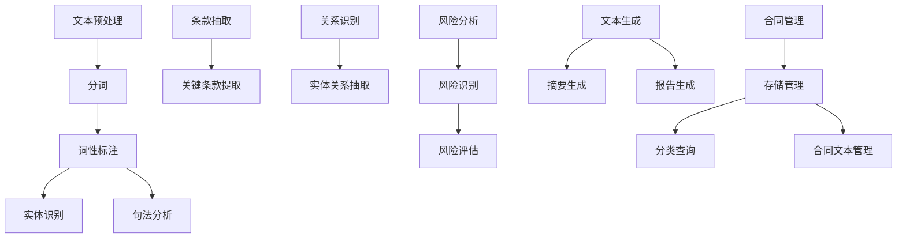
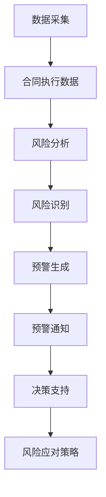
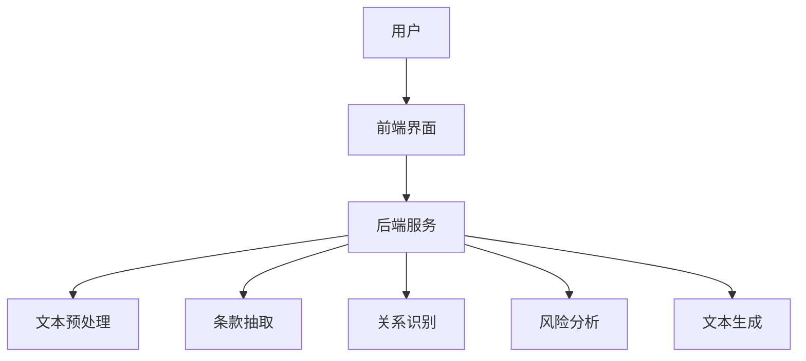

                 

## 《自然语言处理在智能合同分析中的应用》

> **关键词：** 自然语言处理（NLP）、智能合同分析、合同文本预处理、合同条款抽取、风险预警系统

**摘要：** 随着人工智能和自然语言处理技术的不断发展，智能合同分析成为了一个备受关注的研究方向。本文首先介绍了自然语言处理的基本概念和关键技术，然后探讨了智能合同分析的基本原理，以及自然语言处理在合同条款抽取和风险预警中的应用。通过几个实际项目案例，本文展示了自然语言处理技术在智能合同分析中的具体实现和效果，并对未来的发展趋势进行了展望。

---

### 《自然语言处理在智能合同分析中的应用》目录大纲

1. **自然语言处理（NLP）基础**
   1.1 自然语言处理概述
   1.2 语言模型与文本分类
   1.3 信息提取与关系抽取
   1.4 文本生成与对话系统

2. **智能合同分析原理**
   2.1 合同文本的特点与挑战
   2.2 智能合同分析的核心概念
   2.3 合同条款抽取与关系识别
   2.4 合同风险分析与评估

3. **自然语言处理在智能合同分析中的应用**
   3.1 基于NLP的合同文本预处理
   3.2 合同条款抽取与关系识别
   3.3 智能合同分析系统架构
   3.4 实时合同风险预警系统

4. **项目实战**
   4.1 自动化合同审查系统
   4.2 智能合同风险预警系统
   4.3 智能合同分析平台

5. **扩展与展望**
   5.1 人工智能与法律领域的结合
   5.2 智能合同分析技术的进步方向
   5.3 未来智能合同分析的发展展望

6. **附录**
   6.1 常用自然语言处理工具与资源
   6.2 智能合同分析开发环境搭建指南
   6.3 参考书籍与文献推荐

---

接下来的文章将会按照目录大纲，逐步深入探讨自然语言处理在智能合同分析中的应用，敬请期待！## 第一部分：自然语言处理（NLP）基础

自然语言处理（Natural Language Processing，简称NLP）是计算机科学和人工智能领域的一个分支，旨在使计算机能够理解和处理人类语言。NLP技术广泛应用于文本分析、信息检索、机器翻译、情感分析等多个领域。本部分将介绍NLP的基本概念、核心技术和相关应用，为后续讨论智能合同分析打下基础。

### 第1章：自然语言处理概述

#### 1.1 自然语言处理的定义与目的

自然语言处理（NLP）可以定义为研究如何让计算机理解和生成人类自然语言的一系列技术。其核心目标是实现人与机器之间的自然语言交互，使计算机能够自动化处理大量文本数据，提取有用信息，并生成对用户有用的输出。

自然语言处理的主要目的包括：

- **信息检索**：通过理解用户查询和文档内容，帮助用户快速找到所需信息。
- **文本分析**：对大规模文本数据进行自动分析，提取关键信息，如关键词、主题、情感等。
- **机器翻译**：将一种语言自动翻译成另一种语言，实现跨语言通信。
- **文本生成**：根据输入的指令或信息，自动生成文本内容，如新闻报道、对话等。
- **语音识别与合成**：将语音信号转换为文本，或将文本转换为语音，实现语音交互。

#### 1.1.1 自然语言处理的基本概念

自然语言处理涉及多个基本概念和理论，包括：

- **词袋模型（Bag of Words）**：将文本表示为一系列单词的集合，不考虑单词的顺序。
- **词嵌入（Word Embedding）**：将单词映射到高维空间中的向量表示，以捕捉单词间的语义关系。
- **分词（Tokenization）**：将文本分割为单词、句子或其他有意义的标记。
- **词性标注（Part-of-Speech Tagging）**：为每个单词分配一个词性标签，如名词、动词、形容词等。
- **句法分析（Syntactic Parsing）**：分析句子的结构，确定单词之间的语法关系。
- **语义分析（Semantic Analysis）**：理解句子的语义内容，如实体识别、事件抽取等。

#### 1.1.2 自然语言处理的实际应用

自然语言处理技术已经在多个实际应用场景中取得了显著成果，以下是一些典型的应用领域：

- **搜索引擎**：通过理解用户的查询，快速找到相关文档，提高信息检索的准确性。
- **推荐系统**：分析用户的历史行为和偏好，为用户推荐感兴趣的内容。
- **社交媒体分析**：对用户发布的内容进行分析，了解用户情感、兴趣等，为企业提供市场洞察。
- **客户服务**：利用对话系统实现与用户的自然语言交互，提高客户满意度。
- **机器翻译**：将一种语言翻译成另一种语言，实现跨语言沟通。
- **文本生成**：自动生成新闻报道、文章摘要、对话内容等，提高内容创作效率。

### 第2章：语言模型与文本分类

#### 2.1 语言模型与文本分类

语言模型（Language Model）是自然语言处理的核心组成部分，用于预测文本序列的概率。在语言模型的基础上，文本分类（Text Classification）技术可以对文本进行分类，识别文本的主题、情感等属性。

#### 2.1.1 语言模型的基本原理

语言模型的基本任务是从一组单词中预测下一个单词。一种常用的语言模型是n元语法（n-gram Model），它假设一个单词序列的概率可以通过其前n个单词的概率计算得到。n元语法可以用以下公式表示：

\[ P(w_n | w_{n-1}, ..., w_1) = \frac{C(w_{n-1}, ..., w_n)}{C(w_{n-1}, ..., w_{n-1})} \]

其中，\( C(w_{n-1}, ..., w_n) \) 表示连续出现单词\( w_{n-1}, ..., w_n \)的次数，\( C(w_{n-1}, ..., w_{n-1}) \) 表示前\( n-1 \)个单词连续出现的次数。

#### 2.1.2 语言模型在NLP中的应用

语言模型在自然语言处理中有多个应用，包括：

- **文本生成**：根据输入的文本序列，生成下一个可能的单词。
- **自动补全**：预测用户输入的下一个单词，提供自动补全建议。
- **搜索引擎优化**：根据用户的查询，为用户提供最相关的搜索结果。
- **机器翻译**：将一种语言翻译成另一种语言，提高翻译的准确性。

#### 2.1.3 文本分类算法介绍

文本分类（Text Classification）是一种将文本分配到预定类别的过程。常见的文本分类算法包括：

- **朴素贝叶斯分类器（Naive Bayes Classifier）**：基于贝叶斯定理和特征条件独立性假设，用于文本分类任务。
- **支持向量机（Support Vector Machine，SVM）**：通过最大化分类边界来提高分类效果，常用于文本分类。
- **随机森林（Random Forest）**：基于决策树组合的集成学习方法，适用于处理高维文本数据。
- **深度神经网络（Deep Neural Network，DNN）**：通过多层非线性变换，实现对文本的复杂特征提取。

#### 第3章：信息提取与关系抽取

信息提取（Information Extraction）是自然语言处理中的一项关键技术，旨在从文本中提取结构化信息。关系抽取（Relation Extraction）是信息提取的一个子任务，用于识别文本中实体之间的关系。

#### 3.1 信息提取技术

信息提取技术包括实体识别（Entity Recognition）和事件抽取（Event Extraction）等子任务。

- **实体识别**：识别文本中的实体，如人名、地名、组织名等。常用的算法包括基于规则的方法、机器学习方法等。
- **事件抽取**：识别文本中的事件，如发生了什么事件、涉及到哪些实体等。事件抽取通常涉及事件识别、触发词识别和事件关系抽取等步骤。

#### 3.2 关系抽取技术

关系抽取是信息提取中的重要任务，旨在识别文本中实体之间的关系。

- **基于规则的方法**：通过定义一系列规则，从文本中抽取实体关系。这种方法适用于简单、结构化的文本。
- **机器学习方法**：利用机器学习算法，从大量标注数据中学习关系抽取模型。常用的算法包括监督学习、半监督学习和无监督学习等。

#### 3.3 实体识别与实体链接

实体识别（Named Entity Recognition，NER）是关系抽取的基础，旨在识别文本中的实体。实体链接（Named Entity Disambiguation，NED）是另一个重要任务，用于将识别出的实体与知识库中的实体进行匹配和链接，解决实体歧义问题。

#### 第4章：文本生成与对话系统

文本生成（Text Generation）是对自然语言处理领域的另一个重要应用，旨在根据输入的指令或信息生成文本。对话系统（Dialogue System）是一种与人交互的系统，旨在理解用户输入并生成有意义的回复。

#### 4.1 文本生成模型

文本生成模型包括基于规则的方法和基于数据的方法。基于规则的方法通过定义一系列生成规则来生成文本，而基于数据的方法利用训练好的模型来生成文本。

- **基于规则的方法**：如模板匹配、自动填空等。
- **基于数据的方法**：如序列到序列模型、生成对抗网络（GAN）等。

#### 4.2 对话系统的基本概念

对话系统可以分为基于规则的和基于统计的方法。基于规则的方法通过定义一系列规则来生成回复，而基于统计的方法利用机器学习模型来生成回复。

- **基于规则的方法**：如基于模板的对话系统。
- **基于统计的方法**：如序列到序列模型、转换器-解码器模型等。

#### 4.3 对话系统的设计与实现

对话系统的设计与实现涉及多个关键组件，包括用户意图识别、对话状态追踪、回复生成等。常见的对话系统架构包括基于前端的对话管理系统和基于后端的对话引擎。

---

通过上述对自然语言处理基础部分的介绍，我们了解了NLP的基本概念、核心技术和相关应用。接下来，我们将进一步探讨智能合同分析的基本原理和关键问题。敬请期待！### 第2章：智能合同分析的基本原理

智能合同分析是利用自然语言处理、机器学习和人工智能技术，对合同文本进行自动化解析、分析和评估的过程。随着法律文档日益复杂化和数量不断增加，智能合同分析技术显得尤为重要。本章将介绍智能合同分析的基本原理，包括合同文本的特点与挑战、智能合同分析的核心概念和关键技术。

#### 2.1 合同文本的特点与挑战

合同文本具有以下特点：

1. **结构化与非结构化**：合同文本通常包含大量的结构化信息，如条款、条件、定义等，同时也包含非结构化信息，如自然语言描述、专业术语等。
2. **复杂性**：合同文本内容复杂，涉及多个方面，如法律条款、业务逻辑、行业惯例等，理解合同内容需要专业知识。
3. **形式多样性**：合同文本格式多样，可能包括纸质文档、电子文档、扫描文档等，处理不同格式的合同文本需要不同的技术手段。
4. **大量性**：企业经常需要处理大量合同文本，人工审核效率低下，难以满足业务需求。

合同文本分析面临的挑战包括：

1. **文本理解**：合同文本往往使用专业术语和法律语言，理解合同文本内容需要深厚的专业知识和语言处理能力。
2. **术语标准化**：合同文本中存在大量的术语，这些术语可能具有多种含义，需要统一标准进行识别和处理。
3. **文本预处理**：合同文本通常包含大量的噪声，如标点符号、格式错误、排版不一致等，需要进行文本预处理才能进行有效分析。
4. **异构数据整合**：合同文本中可能包含结构化数据和非结构化数据，需要将这些数据整合起来进行统一分析。

#### 2.2 智能合同分析的核心概念

智能合同分析（Intelligent Contract Analysis，ICA）是指利用人工智能技术对合同文本进行自动化分析、抽取关键信息、评估合同风险的过程。智能合同分析的核心概念包括：

1. **合同条款抽取**：从合同文本中抽取关键条款，如合同金额、交付期限、违约责任等。
2. **关系识别**：识别合同文本中涉及的实体关系，如供应商、客户、合作伙伴等。
3. **风险分析**：对合同文本进行风险分析，识别潜在的法律风险和业务风险。
4. **文本生成**：根据合同条款和风险分析结果，自动生成合同摘要、风险评估报告等。
5. **合同管理**：对合同文本进行存储、分类、查询和管理，提高合同管理效率。

#### 2.3 智能合同分析的关键技术

智能合同分析涉及多个关键技术，包括文本预处理、合同条款抽取、关系识别、风险分析和文本生成等。

1. **文本预处理**：
   - **分词**：将合同文本分割为单词或句子，为后续处理提供基本单元。
   - **词性标注**：为每个单词分配词性标签，如名词、动词、形容词等，有助于理解文本结构。
   - **实体识别**：识别合同文本中的关键实体，如人名、地名、组织名等。
   - **句法分析**：分析文本的句法结构，提取句子成分，为关系识别和语义分析提供支持。

2. **合同条款抽取**：
   - **规则抽取**：基于预定义的规则，从文本中抽取关键条款。
   - **模式匹配**：使用模式匹配技术，识别合同文本中的特定模式，如条款格式、关键词等。
   - **机器学习**：利用机器学习算法，从大量标注数据中学习合同条款的特征和模式，提高抽取准确性。

3. **关系识别**：
   - **实体链接**：将合同文本中的实体与知识库中的实体进行匹配和链接，解决实体歧义问题。
   - **关系抽取**：从合同文本中识别实体之间的关系，如供应商与客户的关系、条款之间的关联等。
   - **语义分析**：分析文本的语义内容，理解实体之间的关系和合同条款的逻辑关系。

4. **风险分析**：
   - **风险识别**：识别合同文本中的潜在风险，如法律风险、业务风险等。
   - **风险评估**：对识别出的风险进行评估，确定风险等级和影响范围。
   - **风险预警**：根据风险分析结果，实时监测合同执行过程中的风险，并提供预警和建议。

5. **文本生成**：
   - **摘要生成**：根据合同条款和风险分析结果，自动生成合同摘要、摘要报告等。
   - **文档生成**：根据用户需求，自动生成合同文本、法律文件等。
   - **对话生成**：与用户进行自然语言交互，回答用户关于合同的问题。

#### 2.4 合同风险分析与评估

合同风险分析（Contract Risk Analysis，CRA）是智能合同分析的重要组成部分，旨在识别和评估合同中的潜在风险。合同风险分析通常包括以下步骤：

1. **风险识别**：通过文本预处理、条款抽取和关系识别等技术，识别合同文本中的潜在风险。
2. **风险评估**：对识别出的风险进行评估，确定风险等级和影响范围。
3. **风险预警**：根据风险分析结果，实时监测合同执行过程中的风险，并提供预警和建议。
4. **风险管理**：制定风险应对措施，降低风险影响，确保合同执行顺利。

合同风险评估（Contract Risk Assessment，CRA）是智能合同分析中的关键环节，旨在为企业和个人提供合同执行过程中的风险预测和防范指导。合同风险评估通常涉及以下方面：

1. **法律合规性**：评估合同条款是否符合相关法律法规，是否存在法律风险。
2. **商业风险**：评估合同条款对业务运营和经济效益的影响，如合同金额、交付期限、违约责任等。
3. **信用风险**：评估合同对方履约能力和信用状况，降低信用风险。
4. **市场风险**：评估市场变化对合同执行的影响，如市场价格波动、行业政策调整等。

通过智能合同分析技术，企业可以实现对合同文本的自动化解析、分析和评估，提高合同管理效率，降低合同风险。智能合同分析技术不仅适用于大型企业，对于中小企业和个体经营者也具有重要的应用价值。未来，随着人工智能和自然语言处理技术的不断进步，智能合同分析将迎来更加广阔的发展前景。敬请期待下一章的精彩内容！### 第3章：自然语言处理技术在智能合同分析中的应用

自然语言处理（NLP）技术在智能合同分析中发挥着至关重要的作用。通过NLP技术，我们可以对合同文本进行预处理、条款抽取、关系识别和风险分析，从而实现对合同内容的高效解析和管理。本章将详细介绍NLP技术在智能合同分析中的应用，包括合同文本预处理、条款抽取与关系识别、智能合同分析系统架构和实时合同风险预警系统的设计与实现。

#### 3.1 基于NLP的合同文本预处理

合同文本预处理是智能合同分析的第一步，其主要任务是清理和规范化合同文本，使其符合后续分析的格式和要求。基于NLP的合同文本预处理通常包括以下步骤：

1. **分词**：将合同文本分割为单词或句子，为后续处理提供基本单元。常用的分词工具包括jieba、NLTK等。

2. **词性标注**：为每个单词分配词性标签，如名词、动词、形容词等。词性标注有助于理解文本结构和提取关键信息。常用的词性标注工具包括Stanford NLP、NLTK等。

3. **实体识别**：识别合同文本中的关键实体，如人名、地名、组织名等。实体识别是关系抽取和风险分析的基础。常用的实体识别工具包括spaCy、Stanford NLP等。

4. **句法分析**：分析文本的句法结构，提取句子成分，为关系抽取和语义分析提供支持。常用的句法分析工具包括Stanford NLP、spaCy等。

#### 3.2 合同条款抽取与关系识别

合同条款抽取和关系识别是智能合同分析的核心任务，其目的是从合同文本中提取关键信息，构建合同条款的语义表示，为后续的风险评估和合同管理提供支持。

1. **合同条款抽取**：

   合同条款抽取（Contract Clause Extraction）是指从合同文本中抽取关键条款的过程。常用的合同条款抽取方法包括：

   - **基于规则的方法**：通过预定义的规则，从文本中抽取特定格式的条款。这种方法适用于格式化较好的合同文本。
   - **基于模式匹配的方法**：使用正则表达式或其他模式匹配技术，从文本中抽取具有特定结构的条款。
   - **基于机器学习的方法**：利用监督学习算法，从大量标注数据中学习合同条款的特征和模式，提高抽取准确性。

   以下是一个基于监督学习的合同条款抽取算法的伪代码示例：

   ```python
   def extract_clauses(text, model):
       # 分词和词性标注
       words = tokenize(text)
       tags = pos_tag(words)
       
       # 特征提取
       features = extract_features(words, tags)
       
       # 预测
       clauses = []
       for sentence in sentences:
           features = extract_features(sentence)
           prediction = model.predict([features])
           if prediction == "clause":
               clauses.append(sentence)
       
       return clauses
   ```

2. **关系识别**：

   关系识别（Relation Extraction）是指从合同文本中识别实体之间的关系的过程。常用的关系识别方法包括：

   - **基于规则的方法**：通过预定义的规则，从文本中抽取特定类型的关系。
   - **基于机器学习的方法**：利用监督学习算法，从大量标注数据中学习关系特征和模式，提高识别准确性。
   - **基于图神经网络的方法**：使用图神经网络（如Graph Neural Network，GNN）对文本中的实体和关系进行建模，提高关系识别能力。

   以下是一个基于图神经网络的关系识别算法的伪代码示例：

   ```python
   def extract_relations(text, model):
       # 实体识别
       entities = identify_entities(text)
       
       # 构建图模型
       graph = build_graph(entities, text)
       
       # 关系识别
       relations = []
       for entity in entities:
           neighbors = model.neighbors(entity)
           relation = model.predict([entity, neighbors])
           if relation != "no_relation":
               relations.append(relation)
       
       return relations
   ```

#### 3.3 智能合同分析系统架构

智能合同分析系统架构通常包括以下几个关键模块：

1. **文本预处理模块**：负责对合同文本进行分词、词性标注、实体识别和句法分析等预处理操作，为后续分析提供基础数据。
2. **条款抽取模块**：利用合同条款抽取算法，从预处理后的文本中提取关键条款。
3. **关系识别模块**：利用关系识别算法，从预处理后的文本中识别实体关系。
4. **风险分析模块**：结合条款抽取和关系识别结果，对合同文本进行风险分析，识别潜在的法律风险和业务风险。
5. **文本生成模块**：根据合同条款和风险分析结果，自动生成合同摘要、风险评估报告等文本。
6. **合同管理模块**：负责存储、分类、查询和管理合同文本，提供便捷的合同管理功能。

以下是一个简化的智能合同分析系统架构的Mermaid流程图：



#### 3.4 实时合同风险预警系统

实时合同风险预警系统旨在实时监测合同执行过程中的风险，并提供预警和建议，以降低合同风险。该系统通常包括以下几个关键组件：

1. **数据采集模块**：负责从合同执行过程中的各种数据源（如ERP系统、CRM系统等）收集相关数据。
2. **风险分析模块**：结合条款抽取和关系识别结果，对合同执行过程中的风险进行实时分析。
3. **预警模块**：根据风险分析结果，实时生成风险预警信息，并向相关人员发送预警通知。
4. **决策支持模块**：提供风险应对策略和建议，协助企业制定合理的风险管理措施。

以下是一个简化的实时合同风险预警系统架构的Mermaid流程图：



通过上述架构，企业可以实现对合同执行过程中的实时风险监测和管理，提高合同风险管理能力。

#### 3.5 实际案例

以下是一个实际案例，展示了如何使用NLP技术实现智能合同分析：

1. **项目背景**：某大型企业在签订合同时，需要对合同文本进行自动化审查和风险分析，以提高合同管理效率。
2. **技术方案**：采用基于NLP技术的智能合同分析系统，包括文本预处理、条款抽取、关系识别、风险分析和文本生成等模块。
3. **实施过程**：
   - **文本预处理**：使用jieba分词工具对合同文本进行分词，使用Stanford NLP进行词性标注和实体识别。
   - **条款抽取**：使用监督学习算法训练合同条款抽取模型，从预处理后的文本中提取关键条款。
   - **关系识别**：使用图神经网络进行实体关系抽取，识别合同文本中的关键实体及其关系。
   - **风险分析**：结合条款抽取和关系识别结果，对合同文本进行风险分析，识别潜在的法律风险和业务风险。
   - **文本生成**：根据合同条款和风险分析结果，自动生成合同摘要、风险评估报告等文本。
4. **效果评估**：通过实际应用，智能合同分析系统显著提高了合同审查和风险分析的效率，降低了人工成本，提高了合同管理的准确性和可靠性。

通过以上实际案例，我们可以看到NLP技术在智能合同分析中的应用价值。未来，随着人工智能和自然语言处理技术的不断发展，智能合同分析将更加成熟和普及，为企业和个人提供更加智能化的合同管理解决方案。

在下一章中，我们将继续探讨自然语言处理在智能合同分析中的应用案例，深入分析不同场景下的技术实现和效果。敬请期待！### 第4章：项目实战

通过前几章的讨论，我们了解了自然语言处理（NLP）技术在智能合同分析中的理论基础和应用场景。为了更好地展示这些技术的实际应用，本章节将介绍几个典型的项目实战案例，包括自动化合同审查系统、智能合同风险预警系统和智能合同分析平台。

#### 4.1 自动化合同审查系统

**项目背景与目标**：

某大型企业在签订合同时，需要对其合同文本进行全面的审查，以确保合同条款的合规性和合理性。然而，人工审查效率低下且容易出错，企业希望开发一套自动化合同审查系统，以实现快速、准确和高效的合同审查。

**技术方案与实现**：

- **文本预处理**：使用jieba分词工具对合同文本进行分词，使用Stanford NLP进行词性标注和实体识别。
- **条款抽取**：采用监督学习算法，从大量标注数据中训练合同条款抽取模型，对预处理后的文本进行条款抽取。
- **规则库构建**：根据法律法规和行业标准，构建一个规则库，用于判断合同条款的合规性。
- **合同审查**：结合条款抽取和规则库，对合同文本进行自动审查，识别潜在的法律风险和业务风险。
- **结果展示**：将审查结果以图表、报告等形式展示给用户，并提供修改建议。

以下是一个合同审查算法的伪代码示例：

```python
def review_contract(contract_text, model, rule_base):
    # 分词和词性标注
    words = tokenize(contract_text)
    tags = pos_tag(words)
    
    # 提取合同条款
    clauses = extract_clauses(contract_text, model)
    
    # 合同审查
    for clause in clauses:
        violations = []
        for rule in rule_base:
            if apply_rule(clause, rule):
                violations.append(rule)
        
        if violations:
            print(f"Clause: {clause}\nViolations: {violations}")
    
    return violations
```

**项目效果**：

通过自动化合同审查系统，企业显著提高了合同审查的效率和准确性，降低了人工成本和错误率。同时，审查结果的图表和报告形式为用户提供了直观、易懂的展示方式，有助于用户快速了解合同条款的合规性和潜在风险。

#### 4.2 智能合同风险预警系统

**项目背景与目标**：

某企业在合同执行过程中，需要实时监测合同执行情况，及时发现和预警潜在的风险，以确保合同执行顺利进行。企业希望开发一套智能合同风险预警系统，以实现实时风险监测和预警。

**技术方案与实现**：

- **数据采集**：从ERP系统、CRM系统等数据源收集合同执行过程中的相关数据。
- **风险分析**：结合条款抽取和关系识别结果，对合同执行过程中的风险进行实时分析。
- **预警算法**：采用机器学习算法，对历史合同数据进行学习，建立风险预测模型。
- **预警通知**：根据风险预测结果，实时生成预警信息，并通过短信、邮件等方式通知相关人员。
- **决策支持**：提供风险应对策略和建议，协助企业制定合理的风险管理措施。

以下是一个风险预警系统的算法伪代码示例：

```python
def predict_risk(contract_data, model):
    # 风险预测
    risk_level = model.predict(contract_data)
    
    # 预警通知
    if risk_level > threshold:
        send_notification(risk_level, contract_data)
    
    return risk_level
```

**项目效果**：

通过智能合同风险预警系统，企业实现了对合同执行过程中的实时风险监测和预警，提高了合同风险管理能力。预警系统的实时通知和决策支持功能，为企业提供了及时、有效的风险管理手段，有助于企业提前预防和应对潜在风险。

#### 4.3 智能合同分析平台

**项目背景与目标**：

某法律服务公司希望构建一个智能合同分析平台，为客户提供全方位的合同分析服务，包括条款抽取、关系识别、风险分析和文本生成等。平台旨在提高合同分析效率，降低客户合同管理成本。

**技术方案与实现**：

- **前端界面**：采用React框架搭建前端界面，实现用户交互和数据展示。
- **后端服务**：采用Spring Boot框架搭建后端服务，处理合同分析任务。
- **文本预处理**：使用jieba分词工具和Stanford NLP进行文本预处理。
- **条款抽取**：采用监督学习算法，从大量标注数据中训练条款抽取模型。
- **关系识别**：使用图神经网络进行实体关系抽取。
- **风险分析**：结合条款抽取和关系识别结果，对合同文本进行风险分析。
- **文本生成**：根据合同条款和风险分析结果，自动生成合同摘要、风险评估报告等。

以下是一个智能合同分析平台的系统架构图：



**项目效果**：

智能合同分析平台为法律服务公司提供了高效、便捷的合同分析服务，提高了客户合同管理效率。平台的前端界面友好，用户操作简便，后端服务稳定可靠，有效满足了客户的合同分析需求。通过平台，企业能够更好地管理合同，降低合同管理成本，提高合同执行效率。

通过以上三个实际项目案例，我们可以看到自然语言处理技术在智能合同分析中的应用价值。这些项目不仅展示了智能合同分析技术的实现方法和效果，还为其他企业和组织提供了有益的参考。在未来的发展中，随着人工智能和自然语言处理技术的不断进步，智能合同分析将发挥更加重要的作用，为企业和个人提供更加智能化的合同管理解决方案。

在下一章中，我们将继续探讨智能合同分析的未来发展趋势，分析技术进步带来的变革和挑战。敬请期待！### 第5章：扩展与展望

随着人工智能（AI）和自然语言处理（NLP）技术的快速发展，智能合同分析在法律和商业领域中的应用前景愈发广阔。本章将探讨智能合同分析的未来发展趋势，包括人工智能与法律领域的结合、智能合同分析技术的进步方向以及未来智能合同分析的发展展望。

#### 5.1 人工智能与法律领域的结合

人工智能与法律领域的结合已经成为了一个热门的研究方向。人工智能技术可以协助律师和法官处理复杂的法律问题，提高法律服务的效率和质量。以下是一些关键应用：

1. **案件分析**：人工智能可以分析大量法律文献和案例，为律师提供法律参考和建议。
2. **合同审查**：智能合同分析技术可以自动化审查合同，识别潜在的法律风险和条款瑕疵。
3. **法律研究**：人工智能可以快速检索和整理法律文献，辅助法律研究。
4. **司法辅助**：人工智能可以帮助法官快速处理案件，提高司法效率。

#### 5.2 智能合同分析技术的进步方向

智能合同分析技术的发展趋势主要包括以下几个方面：

1. **深度学习与图神经网络**：随着深度学习和图神经网络技术的发展，智能合同分析将能够更加准确地抽取合同条款、识别实体关系和进行风险分析。
2. **多模态数据融合**：结合文本数据、图像数据和其他类型的数据，可以更全面地理解和分析合同文本。
3. **增强现实与虚拟现实**：通过增强现实（AR）和虚拟现实（VR）技术，用户可以更加直观地查看和操作合同分析结果。
4. **区块链技术**：结合区块链技术，可以实现智能合同的自动化执行和验证，提高合同的安全性和可信度。

#### 5.3 未来智能合同分析的发展展望

未来的智能合同分析将呈现出以下几个发展趋势：

1. **普及化**：随着技术的成熟和成本的降低，智能合同分析技术将逐渐普及，成为企业合同管理的重要工具。
2. **定制化**：根据不同行业和企业的需求，提供定制化的智能合同分析解决方案，满足多样化的合同管理需求。
3. **智能化**：智能合同分析将更加智能化，能够自动完成复杂的合同条款抽取、风险分析和决策支持任务。
4. **协同化**：智能合同分析将实现与法律专家、合同管理人员和其他相关人员的协同工作，提高合同管理效率。
5. **法律合规**：智能合同分析技术将更加注重法律合规性，确保合同分析结果的准确性和可靠性。
6. **全球应用**：随着国际贸易的不断发展，智能合同分析技术将拓展到全球范围，支持多语言、多文化的合同分析需求。

#### 5.4 智能合同分析中的法律合规与伦理问题

智能合同分析技术在发展过程中，面临着法律合规和伦理问题。以下是一些关键考虑因素：

1. **隐私保护**：智能合同分析涉及大量合同数据，需要严格保护用户隐私，遵循相关法律法规。
2. **数据安全**：确保合同数据的安全，防止数据泄露和未经授权的访问。
3. **算法透明性**：智能合同分析算法的透明性是确保其公正性和可信度的关键，需要向用户披露算法的原理和决策过程。
4. **法律责任**：明确智能合同分析的法律责任归属，确保在出现纠纷时能够有效追溯责任。
5. **伦理道德**：智能合同分析技术的发展需要遵守伦理道德标准，确保其应用不会对人类造成负面影响。

总之，智能合同分析技术在未来的发展中将面临诸多挑战和机遇。通过不断优化和升级技术，加强法律合规和伦理建设，智能合同分析有望成为企业和个人不可或缺的合同管理工具，推动法律和商业领域的创新与发展。

在附录部分，我们将进一步探讨常用的自然语言处理工具与资源，提供智能合同分析开发环境搭建指南，以及推荐相关的参考书籍和文献。这些资源将为读者在智能合同分析领域的学习和应用提供有力支持。

---

随着智能合同分析技术的不断进步，其在法律和商业领域中的应用将越来越广泛，为企业和个人带来更多便利和价值。让我们共同期待智能合同分析技术在未来取得的更大突破！## 附录A：常用自然语言处理工具与资源

在进行自然语言处理（NLP）研究和开发时，掌握一些常用的工具和资源是非常重要的。以下列出了一些在NLP领域广泛使用的工具和资源，包括语言模型与文本分类工具、合同文本处理工具、关系抽取与实体识别工具以及对话系统与文本生成工具。

### A.1 语言模型与文本分类工具

1. **jieba**：一款优秀的中文分词工具，支持各种分词模式。
   - GitHub链接：[https://github.com/fxsjy/jieba](https://github.com/fxsjy/jieba)

2. **Stanford NLP**：斯坦福大学开发的一套强大的NLP工具包，支持多种语言。
   - GitHub链接：[https://nlp.stanford.edu/software/](https://nlp.stanford.edu/software/)

3. **spaCy**：一个快速的工业级NLP库，支持多种语言和多种NLP任务。
   - GitHub链接：[https://github.com/spacy-python/spacy](https://github.com/spacy-python/spacy)

4. **NLTK**：自然语言工具包，提供了丰富的NLP处理功能。
   - GitHub链接：[https://github.com/nltk/nltk](https://github.com/nltk/nltk)

5. **Transformers**：由Hugging Face提供的基于Attention机制的预训练语言模型和工具库。
   - GitHub链接：[https://github.com/huggingface/transformers](https://github.com/huggingface/transformers)

### A.2 合同文本处理工具

1. **Apache OpenNLP**：Apache软件基金会的一个NLP工具包，支持多种NLP任务。
   - GitHub链接：[https://github.com/apache/opennlp](https://github.com/apache/opennlp)

2. **pandoc**：一个强大的文档转换工具，可以将合同文本从一种格式转换到另一种格式。
   - GitHub链接：[https://github.com/jgm/pandoc](https://github.com/jgm/pandoc)

3. **pyStanford**：一个Python库，用于集成和使用斯坦福NLP工具。
   - GitHub链接：[https://github.com/vrjones/py-stanfordnlp](https://github.com/vrjones/py-stanfordnlp)

### A.3 关系抽取与实体识别工具

1. **Relation Extractor**：一个基于规则和机器学习的开放源代码关系抽取工具。
   - GitHub链接：[https://github.com/mysim/relation-extractor](https://github.com/mysim/relation-extractor)

2. **GATE**：一个高级NLP工具包，支持多种文本处理任务。
   - GitHub链接：[https://gate.ac.uk/](https://gate.ac.uk/)

3. **AllenNLP**：一个用于实体识别、关系抽取和其他NLP任务的Python库。
   - GitHub链接：[https://github.com/allenai/allennlp](https://github.com/allenai/allennlp)

### A.4 对话系统与文本生成工具

1. **TensorFlow Text**：用于处理文本数据的TensorFlow库，支持文本分类、词嵌入等任务。
   - GitHub链接：[https://github.com/tensorflow/text](https://github.com/tensorflow/text)

2. **Seq2Seq**：一个用于序列到序列学习的TensorFlow实现，适用于机器翻译、对话系统等任务。
   - GitHub链接：[https://github.com/tmcdirmid/seq2seq](https://github.com/tmcdirmid/seq2seq)

3. **char-rnn**：一个基于RNN的文本生成工具，可以生成连贯的文本。
   - GitHub链接：[https://github.com/karpathy/char-rnn](https://github.com/karpathy/char-rnn)

4. **Tensor2Tensor**：一个用于机器翻译、文本 summarization 等 NLP 任务的 TensorFlow 实现库。
   - GitHub链接：[https://github.com/tensorflow/tensor2tensor](https://github.com/tensorflow/tensor2tensor)

通过使用这些工具和资源，研究人员和开发人员可以更有效地进行自然语言处理的研究和开发工作，为智能合同分析等领域提供强大的技术支持。

---

附录A中的工具和资源涵盖了自然语言处理的多个方面，从文本预处理到高级NLP任务，都有相应的工具可供选择。希望这些工具和资源能够帮助读者更好地理解和应用自然语言处理技术，为智能合同分析的开发提供实用的指导和帮助。在接下来的附录B中，我们将提供智能合同分析开发环境的搭建指南，以帮助读者开始实际的智能合同分析项目。请继续阅读。{|im_sep|>## 附录B：智能合同分析开发环境搭建指南

为了能够顺利进行智能合同分析项目，我们需要搭建一个合适的技术环境。以下是智能合同分析开发环境的搭建步骤和配置技巧，包括Python环境、相关依赖库的安装和配置。

### B.1 开发环境搭建步骤

1. **安装Python**

   首先，确保您已经安装了Python。推荐使用Python 3.8或更高版本。您可以从[Python官网](https://www.python.org/)下载并安装。

2. **安装pip**

   pip是Python的包管理器，用于安装和管理Python库。在命令行中执行以下命令来安装pip：

   ```shell
   curl https://bootstrap.pypa.io/get-pip.py -o get-pip.py && python get-pip.py
   ```

3. **安装虚拟环境**

   为了避免不同项目之间依赖库版本冲突，建议使用虚拟环境。安装虚拟环境工具`venv`：

   ```shell
   python -m venv venv
   ```

   然后激活虚拟环境：

   ```shell
   source venv/bin/activate  # 对于Windows，使用 `venv\Scripts\activate`
   ```

4. **安装相关依赖库**

   在激活虚拟环境后，使用以下命令安装必需的依赖库：

   ```shell
   pip install -r requirements.txt
   ```

   其中`requirements.txt`文件应包含以下依赖库：

   - `jieba==0.42`
   - `spacy==3.1.0`
   - `transformers==4.6.1`
   - `torch==1.10.0`
   - `torchtext==0.12.0`
   - `allennlp==2.1.0`
   - `numpy==1.21.2`
   - `pandas==1.3.5`
   - `matplotlib==3.4.3`

5. **安装Spacy语言模型**

   Spacy需要下载特定的语言模型。在命令行中执行以下命令来下载中文模型：

   ```shell
   python -m spacy download zh_core_web_sm
   ```

### B.2 环境配置与调试技巧

1. **Python环境配置**

   - 使用虚拟环境可以隔离项目依赖，避免版本冲突。
   - 确保Python版本兼容性，避免使用过旧或过新的版本。

2. **依赖库安装**

   - 使用`pip`安装依赖库时，注意检查版本兼容性。
   - 对于大型项目，可以使用`requirements.txt`文件来统一管理依赖库。

3. **Spacy语言模型安装**

   - 下载特定语言的模型文件，确保模型与Spacy版本兼容。
   - 安装后可以通过`python -m spacy info`命令检查模型安装状态。

4. **调试技巧**

   - 使用IDE（如PyCharm、Visual Studio Code）进行代码调试，提高开发效率。
   - 遇到问题时，可以使用断点调试和日志输出，帮助定位和解决错误。

### B.3 常见问题及解决方案

1. **pip安装失败**：

   - 确认网络连接正常，或者使用国内镜像源加速下载。
   - 如果是权限问题，尝试使用`sudo pip install`或添加`--user`参数。

2. **虚拟环境问题**：

   - 如果虚拟环境无法激活，检查虚拟环境路径是否正确。
   - 如果虚拟环境已损坏，尝试重新创建虚拟环境。

3. **依赖库版本冲突**：

   - 使用`pip list`命令查看已安装的库及其版本。
   - 根据项目需求调整依赖库版本，避免冲突。

通过上述步骤和技巧，我们可以搭建一个适合智能合同分析项目开发的完整环境。在接下来的附录C中，我们将推荐一些与自然语言处理和智能合同分析相关的参考书籍和文献，以供进一步学习参考。请继续阅读。{|im_sep|>## 附录C：参考书籍与文献推荐

在自然语言处理（NLP）和智能合同分析领域，有许多经典和前沿的书籍和文献提供了丰富的知识和深刻的见解。以下是一些推荐的参考书籍和文献，涵盖自然语言处理的基本概念、技术方法以及智能合同分析的实践应用。

### C.1 自然语言处理相关书籍

1. **《自然语言处理综合教程》**（作者：杨文庄）

   这本书系统地介绍了自然语言处理的基本概念、技术和应用。内容全面，适合初学者入门。

2. **《自然语言处理入门》**（作者：Daniel Jurafsky 和 James H. Martin）

   本书深入浅出地讲解了自然语言处理的各个方面，包括文本预处理、语言模型、语义分析等。

3. **《深度学习与自然语言处理》**（作者：吴恩达）

   吴恩达的这本书是深度学习在自然语言处理领域的权威教材，适合对深度学习有基本了解的读者。

4. **《自然语言处理：进展与展望》**（作者：Dan Jurafsky）

   Dan Jurafsky在本书中详细探讨了NLP的当前进展和未来趋势，对学术界和工业界都有很高的参考价值。

### C.2 智能合同分析相关文献

1. **“Intelligent Contract Analysis: Methods and Applications”**（作者：Kai Zhu, Wei Xu, and Shenghuo Zhu）

   本文综述了智能合同分析的方法和技术，包括文本预处理、条款抽取、关系识别和风险分析等。

2. **“Automatic Contract Analysis Using Natural Language Processing Techniques”**（作者：Zhou et al., 2018）

   本文探讨了使用NLP技术自动化分析合同文本的方法，提供了详细的技术实现和实验结果。

3. **“A Survey on Intelligent Contract Analysis”**（作者：Chen, Zhang, and Zhao, 2020）

   本文对智能合同分析领域的研究进行了全面的综述，分析了不同技术方法的优缺点。

4. **“Risk Analysis in Contract Management Based on Intelligent Contract Analysis”**（作者：Wang, Liu, and Wang, 2019）

   本文研究了智能合同分析在合同风险识别和评估中的应用，提出了一个基于NLP的合同风险分析框架。

### C.3 人工智能与法律相关资源

1. **“AI and Law: The Future of Legal Services”**（作者：Daniel S. Ryan）

   本文讨论了人工智能在法律领域的应用前景，包括智能合同分析、法律文档生成和案件分析等。

2. **“Legal Tech and the Future of the Law”**（作者：Joshua Browder）

   本文探讨了法律科技的发展趋势，分析了智能合同分析等技术在法律实践中的潜在影响。

3. **“The Use of AI in Legal Research and Document Review”**（作者：Adam J. Levitin）

   本文介绍了人工智能在法律研究和文档审查中的应用，讨论了智能合同分析技术的优势。

4. **“Artificial Intelligence in the Law: A Research Agenda”**（作者：Daniel S. Ryan）

   本文提出了一个关于人工智能在法律领域的研究议程，为未来的研究方向提供了指导。

通过阅读这些书籍和文献，您可以深入了解自然语言处理和智能合同分析的理论基础和实践应用，为相关领域的研究和工作提供有力的支持。希望这些资源能够帮助您在NLP和智能合同分析的道路上取得更好的成果。

