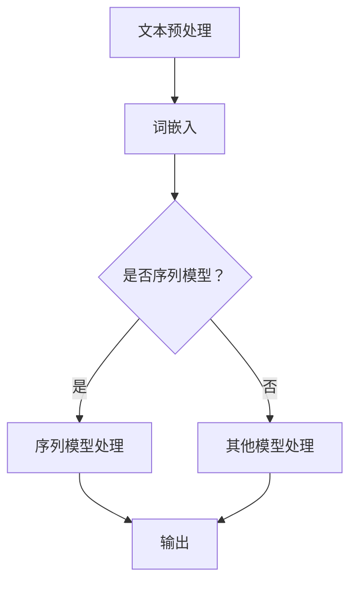

                 

### 文章标题

自然语言处理在电商搜索中的应用：技术发展与未来趋势

#### 关键词

自然语言处理、电商搜索、技术发展、未来趋势、算法原理、项目实战

#### 摘要

本文从自然语言处理（NLP）的基础概念出发，详细探讨了NLP在电商搜索中的应用。首先介绍了NLP的核心概念与联系，包括自然语言处理、机器学习与深度学习、词嵌入、序列模型和注意力机制等。接着深入讲解了电商搜索中NLP的应用，如文本分类、命名实体识别、关键词提取与搜索索引构建、用户行为分析和用户意图识别等。然后，本文从关键词自动补全、语义匹配、推荐系统和对话系统等角度，阐述了NLP技术在电商搜索中的具体实现和应用。最后，本文对NLP技术的未来发展趋势进行了展望，探讨了预训练语言模型、小样本学习与迁移学习、知识图谱与多模态融合等前沿技术。通过本文的阅读，读者可以全面了解自然语言处理在电商搜索中的应用现状和发展趋势。

### 第一部分：自然语言处理概述

自然语言处理（NLP）是人工智能（AI）的重要分支之一，旨在让计算机理解和生成自然语言。其核心目标包括文本预处理、文本分类、命名实体识别、机器翻译、情感分析、问答系统等。NLP的应用领域广泛，从搜索引擎、语音助手到智能客服，都有NLP技术的身影。

#### 第1章 自然语言处理基础

##### 核心概念与联系

**自然语言处理（NLP）**：NLP是计算机科学、语言学和人工智能领域的交叉学科。其核心目标是将自然语言文本转化为计算机可以处理的结构化数据。

- **机器学习与深度学习**：机器学习是NLP的重要工具，通过训练模型来让计算机自动学习规律。深度学习是机器学习的一个分支，通过构建多层神经网络来学习复杂函数。

- **词嵌入（Word Embedding）**：词嵌入是将词汇映射到高维空间中，使得相似词在空间中更接近。常见的词嵌入模型包括Word2Vec和GloVe。

- **序列模型（Sequence Model）**：序列模型用于处理按时间顺序排列的数据，如文本。常见的序列模型包括循环神经网络（RNN）、长短时记忆网络（LSTM）和门控循环单元（GRU）。

- **注意力机制（Attention Mechanism）**：注意力机制是一种让模型专注于输入序列中重要部分的方法，广泛应用于编码器-解码器架构中，如机器翻译。

##### Mermaid 流程图

以下是一个NLP工作流程的Mermaid流程图：

这是一个简单的NLP工作流程，展示了从文本预处理到模型处理再到输出的过程。不同的NLP任务可能需要不同的预处理步骤和处理模型。

接下来，我们将进一步探讨电商搜索中NLP的具体应用。

##### 第2章 电商搜索中的NLP应用

电商搜索是电子商务中最重要的功能之一，用户通过输入关键词来查找他们感兴趣的商品。NLP技术在电商搜索中有着广泛的应用，包括文本分类、命名实体识别、关键词提取与搜索索引构建、用户行为分析和用户意图识别等。

**文本分类与情感分析**

文本分类是将文本分为不同的类别，如正面、负面或中性。情感分析是一种特殊的文本分类任务，旨在确定文本的情感倾向。常见的文本分类方法包括基于统计的朴素贝叶斯、支持向量机（SVM）和基于深度学习的卷积神经网络（CNN）。

- **朴素贝叶斯（Naive Bayes）**：朴素贝叶斯是一种基于贝叶斯定理的简单分类器，假设特征之间相互独立。

- **支持向量机（SVM）**：SVM是一种强大的分类器，通过找到一个最佳的超平面来将数据分为不同的类别。

- **深度学习模型**：卷积神经网络（CNN）是一种适用于文本分类的深度学习模型，通过卷积操作提取文本的特征。

**命名实体识别（NER）**

命名实体识别是一种从文本中识别出具有特定意义的实体的任务，如人名、地名、组织名等。NER对于电商搜索非常重要，因为它可以帮助搜索引擎更准确地理解用户的查询意图。

- **规则方法**：规则方法基于预定义的规则集来识别命名实体，具有较高的准确性但受限于规则的数量和覆盖范围。

- **基于序列模型的NER**：基于序列模型的NER通过训练模型来识别命名实体，常见的方法包括条件随机场（CRF）和长短期记忆网络（LSTM）。

**关键词提取与搜索索引构建**

关键词提取是从文本中提取出关键的信息词汇，用于构建搜索索引。有效的关键词提取可以提高搜索系统的准确性和效率。

- **TF-IDF（词频-逆文档频率）**：TF-IDF是一种基于统计的方法，通过计算词在文档中的词频和文档集合中的逆文档频率来提取关键词。

- **主题模型（如LDA）**：主题模型通过概率模型来发现文本中的隐含主题，从而提取关键词。

- **搜索索引构建**：搜索索引是将文档映射到关键词的索引结构，常见的索引结构包括倒排索引、布隆过滤器等。

**数学模型和数学公式**

**文本分类模型**

- **支持向量机（SVM）**：SVM的损失函数通常使用 hinge 损失，即：
  $$ L(\theta) = \sum_{i=1}^m \max(0, 1 - y_i(\theta^T x_i)) $$
  其中，\( \theta \) 是模型的参数，\( x_i \) 是输入特征，\( y_i \) 是标签。

- **朴素贝叶斯**：朴素贝叶斯的概率模型基于贝叶斯定理：
  $$ P(y|x) = \frac{P(x|y)P(y)}{P(x)} $$
  其中，\( P(x|y) \) 是特征条件概率，\( P(y) \) 是类别概率，\( P(x) \) 是特征概率。

**序列标注模型**

- **长短时记忆网络（LSTM）**：LSTM的动态方程可以表示为：
  $$ 
  \begin{aligned}
  i_t &= \sigma(W_i \cdot [h_{t-1}, x_t] + b_i) \\
  f_t &= \sigma(W_f \cdot [h_{t-1}, x_t] + b_f) \\
  o_t &= \sigma(W_o \cdot [h_{t-1}, x_t] + b_o) \\
  c_t &= f_t \odot c_{t-1} + i_t \odot \sigma(W_c \cdot [h_{t-1}, x_t] + b_c) \\
  h_t &= o_t \odot \sigma(c_t) \\
  \end{aligned}
  $$
  其中，\( \sigma \) 是sigmoid函数，\( \odot \) 是元素乘法。

##### 数学模型和数学公式

**文本分类模型**

- **支持向量机（SVM）**：

  $$ 
  \begin{aligned}
  L(\theta) &= \sum_{i=1}^m \max(0, 1 - y_i(\theta^T x_i)) \\
  \end{aligned}
  $$
  
  **优化方法**：

  - **梯度下降**：
    $$ 
    \theta_{\text{new}} = \theta_{\text{old}} - \alpha \nabla_{\theta} L(\theta)
    $$
  - **支持向量机求解器**：如SVM Light、LIBSVM等。

**序列标注模型**

- **长短时记忆网络（LSTM）**：

  $$ 
  \begin{aligned}
  i_t &= \sigma(W_i \cdot [h_{t-1}, x_t] + b_i) \\
  f_t &= \sigma(W_f \cdot [h_{t-1}, x_t] + b_f) \\
  o_t &= \sigma(W_o \cdot [h_{t-1}, x_t] + b_o) \\
  c_t &= f_t \odot c_{t-1} + i_t \odot \sigma(W_c \cdot [h_{t-1}, x_t] + b_c) \\
  h_t &= o_t \odot \sigma(c_t) \\
  \end{aligned}
  $$
  **动态方程**：

  $$ 
  \begin{aligned}
  \begin{cases}
  i_t &= \sigma(W_i \cdot [h_{t-1}, x_t] + b_i) \\
  f_t &= \sigma(W_f \cdot [h_{t-1}, x_t] + b_f) \\
  o_t &= \sigma(W_o \cdot [h_{t-1}, x_t] + b_o) \\
  c_t &= f_t \odot c_{t-1} + i_t \odot \sigma(W_c \cdot [h_{t-1}, x_t] + b_c) \\
  h_t &= o_t \odot \sigma(c_t) \\
  \end{cases}
  \end{aligned}
  $$

##### 第3章 电商搜索中的用户行为分析

用户行为分析是电商搜索中的重要一环，通过对用户行为数据的分析，可以帮助电商平台更好地理解用户需求，提供更个性化的服务。用户行为分析包括用户数据收集、数据处理、用户兴趣建模和用户意图识别等环节。

**用户行为数据收集与处理**

用户行为数据包括浏览记录、购买记录、搜索历史等。为了进行有效的用户行为分析，需要对数据进行收集、清洗和预处理。

- **数据收集**：数据可以通过日志文件、API接口等途径收集。

- **数据清洗**：清洗数据以去除重复、缺失和噪声数据。

- **数据处理**：对数据进行转换、归一化和特征提取等处理。

**用户兴趣建模**

用户兴趣建模旨在识别用户的兴趣点和偏好。常见的建模方法包括协同过滤、矩阵分解和深度学习等。

- **协同过滤（Collaborative Filtering）**：协同过滤分为基于用户和基于项目的协同过滤。基于用户的方法通过找到与目标用户相似的其他用户，预测他们的评分；基于项目的方法通过找到与目标项目相似的其他项目，预测用户对这些项目的评分。

- **矩阵分解（Matrix Factorization）**：矩阵分解通过将用户-项目评分矩阵分解为用户特征矩阵和项目特征矩阵，从而预测未观测的评分。

- **深度学习模型**：深度学习模型如卷积神经网络（CNN）和循环神经网络（RNN）可以用于用户兴趣建模，通过学习用户行为数据中的特征，识别用户的兴趣点。

**用户意图识别**

用户意图识别是理解用户查询意图的重要任务，对于提供个性化的搜索结果和推荐至关重要。常见的用户意图识别方法包括基于规则的方法和基于机器学习的方法。

- **基于规则的方法**：基于规则的方法通过预定义的规则来识别用户意图。例如，如果用户的搜索历史中包含多个商品类别，则可以判断用户的意图是浏览而不是购买。

- **基于机器学习的方法**：基于机器学习的方法通过训练模型来识别用户意图。常见的模型包括朴素贝叶斯、支持向量机和深度学习模型等。

在接下来的章节中，我们将进一步探讨NLP技术在电商搜索中的具体应用。

---

本文主要从自然语言处理的基础概念、核心算法原理和电商搜索中的应用三个方面进行了详细阐述。在第一部分中，我们介绍了自然语言处理的核心概念与联系，包括自然语言处理、机器学习与深度学习、词嵌入、序列模型和注意力机制等。通过Mermaid流程图展示了NLP的工作流程和深度学习模型的结构关系。

在第二部分中，我们深入探讨了NLP在电商搜索中的应用，包括文本分类、命名实体识别、关键词提取与搜索索引构建、用户行为分析和用户意图识别等。详细讲解了文本分类模型的损失函数和优化方法，以及序列标注模型的动态方程。

在第三部分中，我们介绍了用户行为分析的核心内容，包括用户行为数据收集与处理、用户兴趣建模和用户意图识别等。通过协同过滤、矩阵分解和深度学习等方法，实现了用户兴趣建模和意图识别。

接下来，我们将进入第二部分，深入探讨NLP技术在电商搜索中的应用，包括关键词自动补全、语义匹配、推荐系统和对话系统等具体应用。敬请期待！

