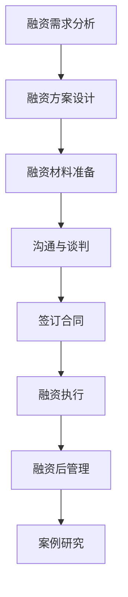

                 

### 《草根创业团队的融资挑战》

> **关键词**：草根创业、融资挑战、融资策略、投资人沟通、法律风险

**摘要**：  
草根创业团队在面临融资挑战时，需要深入了解融资基础知识、精心准备融资材料、熟练掌握与投资人沟通与谈判技巧，并有效管理融资后的资源。本文将从多个角度分析草根创业团队的融资挑战，提供实用策略和案例分析，助力创业团队成功融资。

<|assistant|>### 目录大纲

# 《草根创业团队的融资挑战》目录大纲

## 第一部分：融资基础知识

### 第1章 融资概述
#### 1.1 融资的定义与类型
#### 1.2 融资的重要性
#### 1.3 融资流程概述

### 第2章 融资渠道
#### 2.1 天使投资
#### 2.2 风险投资
#### 2.3 众筹
#### 2.4 银行贷款
#### 2.5 政府补贴

### 第3章 融资策略
#### 3.1 融资策略制定
#### 3.2 融资规模与时机
#### 3.3 融资结构与方式

## 第二部分：融资准备工作

### 第4章 团队建设与规划
#### 4.1 团队建设的重要性
#### 4.2 团队成员的角色与职责
#### 4.3 业务计划书编写

### 第5章 财务预测与估值
#### 5.1 财务预测方法
#### 5.2 估值方法与技巧
#### 5.3 财务报表解读

### 第6章 商业计划书
#### 6.1 商业计划书结构
#### 6.2 市场分析
#### 6.3 竞争分析
#### 6.4 产品或服务介绍
#### 6.5 营销与销售策略
#### 6.6 团队介绍与愿景

## 第三部分：融资实施

### 第7章 投资人沟通与谈判
#### 7.1 投资人类型与特点
#### 7.2 沟通技巧
#### 7.3 谈判策略与技巧

### 第8章 融资合同与法律风险
#### 8.1 融资合同概述
#### 8.2 常见条款解读
#### 8.3 法律风险防范

### 第9章 融资后管理
#### 9.1 融资后的公司治理
#### 9.2 资金使用与管理
#### 9.3 风险管理

## 第四部分：融资案例研究

### 第10章 案例分析
#### 10.1 案例概述
#### 10.2 融资过程回顾
#### 10.3 融资成果与启示

### 第11章 创业者融资经验分享
#### 11.1 经验教训
#### 11.2 融资策略调整
#### 11.3 未来融资规划

## 附录

### 附录 A：融资工具与资源
#### A.1 常用融资平台
#### A.2 融资咨询机构
#### A.3 相关政策与法规

### 附录 B：Mermaid 流程图
mermaid
graph TD
A[融资流程] --> B[融资准备]
B --> C[沟通与谈判]
C --> D[融资实施]
D --> E[融资后管理]
E --> F[案例研究]

### 附录 C：核心算法原理讲解
#### C.1 算法概述
#### C.2 伪代码实现
#### C.3 算法分析

### 附录 D：数学模型和数学公式
#### D.1 模型概述
$$
\text{企业估值公式：} \text{EV} = \frac{\text{销售收入}}{\text{增长率}} \times \text{市盈率}
$$
#### D.2 模型详细讲解
#### D.3 举例说明

### 附录 E：项目实战
#### E.1 开发环境搭建
#### E.2 源代码详细实现
#### E.3 代码解读与分析
#### E.4 实际案例讲解

### 附录 F：源代码示例
python
# 请在此处插入代码示例

---

现在，我们将逐步深入探讨草根创业团队在融资过程中可能遇到的各种挑战，并提供实用的策略和建议。

### 第一部分：融资基础知识

**第1章 融资概述**

#### 1.1 融资的定义与类型

融资，是指企业为了满足其经营活动或投资活动的资金需求，通过向外部渠道获取资金的一种行为。融资的类型主要包括：

1. **债务融资**：企业通过借款、发行债券等方式获取资金，需要支付利息和本金。
2. **股权融资**：企业通过出让股份换取资金，投资者成为股东，分享企业的盈利。
3. **混合融资**：结合债务和股权融资的特点，通过发行可转债、优先股等工具进行融资。

#### 1.2 融资的重要性

融资对于草根创业团队至关重要，它不仅为企业提供了资金支持，还意味着：

1. **增强企业实力**：资金可以帮助企业扩大生产规模、提升技术水平、优化产品和服务。
2. **提高市场竞争力**：充足的资金可以使企业在市场竞争中占据有利位置。
3. **实现企业战略**：融资可以帮助企业实现扩张、并购、研发投入等战略目标。

#### 1.3 融资流程概述

融资流程通常包括以下几个步骤：

1. **融资需求分析**：明确融资的具体需求，包括金额、用途、期限等。
2. **融资方案设计**：根据企业特点和市场需求，设计合适的融资方案。
3. **融资材料准备**：准备商业计划书、财务报表、融资方案等相关材料。
4. **沟通与谈判**：与潜在投资人进行沟通，讨论融资细节，并进行谈判。
5. **签订合同**：双方达成一致后，签订正式的融资合同。
6. **融资执行**：根据合同约定，完成资金划拨和融资用途的落实。
7. **融资后管理**：对融资资金进行管理，确保资金使用的合理性和有效性。

---

在接下来的章节中，我们将详细介绍融资渠道、融资策略、融资准备工作、融资实施、融资后管理等内容，帮助草根创业团队更好地应对融资挑战。

### 第二部分：融资准备工作

**第4章 团队建设与规划**

#### 4.1 团队建设的重要性

一个高效的团队是创业成功的关键。团队成员的技能、经验、性格和合作精神直接影响企业的运营和发展。因此，团队建设至关重要。以下是一些团队建设的关键点：

1. **明确团队成员的角色和职责**：每个成员都应该清楚自己的职责和期望，以确保团队高效运作。
2. **建立良好的沟通机制**：定期召开会议，确保团队成员之间的信息畅通和意见交流。
3. **培养团队合作精神**：鼓励团队成员相互支持、共同面对挑战。
4. **提供培训和发展机会**：提升团队成员的专业技能和管理能力，以适应企业的发展需求。

#### 4.2 团队成员的角色与职责

团队成员通常包括以下几种角色：

1. **创始人**：负责制定企业的愿景和战略，管理整体运营。
2. **技术团队**：负责产品或服务的研发、测试和维护。
3. **市场营销团队**：负责市场调研、品牌推广和客户关系管理。
4. **财务团队**：负责财务报表的编制、预算管理和成本控制。
5. **行政支持团队**：负责行政事务、人力资源和后勤保障。

每个角色在团队中都有其独特的职责，确保团队的高效运作。

#### 4.3 业务计划书编写

业务计划书是向潜在投资人展示企业价值的重要文档。以下是一些关键要素：

1. **执行摘要**：简明扼要地介绍企业的业务模式、市场定位、竞争优势和融资需求。
2. **公司描述**：详细阐述企业的成立背景、愿景和使命。
3. **市场分析**：分析目标市场的规模、增长趋势、竞争状况和潜在客户。
4. **产品或服务描述**：详细介绍企业的产品或服务，包括功能、优势和市场定位。
5. **营销与销售策略**：阐述企业的营销策略、销售渠道和推广计划。
6. **团队介绍**：介绍关键团队成员的背景、经验和成就。
7. **财务预测**：提供详细的财务预测报表，包括收入、支出、盈利预测等。
8. **融资需求**：明确融资的目的、金额、用途和预期回报。

---

在准备融资时，团队建设和业务计划书是两个重要的准备工作。通过有效的团队建设和详细的业务计划书，草根创业团队可以更好地吸引投资人的注意，提高融资成功的可能性。

### 财务预测与估值

**第5章 财务预测与估值**

#### 5.1 财务预测方法

财务预测是融资准备的重要环节，它有助于展示企业的财务健康状况和未来的增长潜力。以下是几种常见的财务预测方法：

1. **趋势分析**：基于历史数据，分析收入、成本和利润的增长趋势，预测未来的财务状况。
2. **比较分析**：与其他企业进行比较，分析财务指标的差异，预测未来的财务状况。
3. **回归分析**：使用数学模型，将历史数据与相关因素（如市场增长率、通货膨胀率等）建立回归关系，预测未来的财务状况。

#### 5.2 估值方法与技巧

企业估值是融资过程中不可或缺的一环，它决定了企业可以融资的金额。以下是几种常用的估值方法：

1. **成本法**：根据企业的资产价值、负债和权益，计算企业的估值。
2. **市场法**：参考同行业上市公司的股价、交易价格，评估企业的估值。
3. **收益法**：根据企业的未来现金流，使用折现现金流模型（DCF）评估企业的估值。

在估值过程中，需要注意以下几点：

- **选择合适的估值方法**：根据企业的特点和市场需求，选择最合适的估值方法。
- **合理预测未来现金流**：未来现金流的预测应尽量准确，以避免估值过高或过低。
- **考虑风险因素**：估值时应考虑市场风险、行业风险和企业内部风险。

#### 5.3 财务报表解读

财务报表是展示企业财务状况的重要工具，它包括资产负债表、利润表和现金流量表。以下是财务报表的主要解读方法：

1. **资产负债表**：分析企业的资产分布、负债结构和所有者权益。
2. **利润表**：分析企业的收入来源、成本结构和盈利能力。
3. **现金流量表**：分析企业的现金流入和流出，评估企业的现金流状况。

在解读财务报表时，需要注意以下几点：

- **关注关键财务指标**：如收入增长率、利润率、负债率等。
- **分析财务指标的变化趋势**：了解财务指标的变化趋势，预测未来的财务状况。
- **综合分析**：将各项财务指标结合起来，全面评估企业的财务状况。

---

通过合理的财务预测和准确的估值，草根创业团队可以更好地展示企业的价值和潜力，提高融资成功的可能性。同时，通过解读财务报表，团队可以更深入地了解企业的财务状况，为未来的发展提供决策依据。

### 商业计划书

**第6章 商业计划书**

#### 6.1 商业计划书结构

商业计划书是企业向投资人展示其业务模式和未来发展的重要文档，通常包括以下结构：

1. **封面**：包括企业名称、商业计划书名称、编写日期等。
2. **目录**：列出商业计划书的主要章节和页码，方便投资人快速查阅。
3. **执行摘要**：简明扼要地介绍企业的业务模式、市场定位、竞争优势和融资需求。
4. **公司描述**：详细阐述企业的成立背景、愿景和使命。
5. **市场分析**：分析目标市场的规模、增长趋势、竞争状况和潜在客户。
6. **产品或服务描述**：详细介绍企业的产品或服务，包括功能、优势和市场定位。
7. **营销与销售策略**：阐述企业的营销策略、销售渠道和推广计划。
8. **团队介绍**：介绍关键团队成员的背景、经验和成就。
9. **财务预测**：提供详细的财务预测报表，包括收入、支出、盈利预测等。
10. **融资需求**：明确融资的目的、金额、用途和预期回报。
11. **附录**：包括市场调研报告、技术报告、合同等补充材料。

#### 6.2 市场分析

市场分析是商业计划书的核心部分，它帮助企业了解目标市场的现状和未来趋势。以下是市场分析的主要要素：

1. **市场规模**：分析目标市场的整体规模和增长趋势。
2. **市场增长率**：预测目标市场的未来增长速度。
3. **市场趋势**：分析市场的变化趋势，如技术发展、消费者行为变化等。
4. **竞争分析**：分析主要竞争对手的市场份额、产品或服务特点、优势和劣势。
5. **潜在客户**：确定企业的目标客户群体，分析其需求和购买行为。

#### 6.3 竞争分析

竞争分析是商业计划书的重要组成部分，它帮助企业了解市场竞争格局和潜在风险。以下是竞争分析的主要要素：

1. **竞争对手**：列出主要竞争对手，分析其市场份额、产品或服务特点、优势和劣势。
2. **竞争策略**：分析竞争对手的市场策略，如定价策略、促销策略、渠道策略等。
3. **竞争优势**：阐述企业的竞争优势，如产品优势、技术优势、品牌优势等。
4. **潜在风险**：分析市场竞争带来的潜在风险，如市场竞争加剧、客户流失等。

#### 6.4 产品或服务介绍

产品或服务介绍是商业计划书中的一部分，它帮助企业向投资人展示其核心价值和独特性。以下是产品或服务介绍的主要要素：

1. **产品或服务特点**：详细阐述产品或服务的主要特点，如功能、设计、材料等。
2. **产品或服务优势**：分析产品或服务的优势，如技术优势、成本优势、市场优势等。
3. **产品或服务定位**：确定产品或服务的市场定位，如高端市场、中端市场等。
4. **产品或服务竞争力**：分析产品或服务的竞争力，如与竞争对手相比的优势和劣势。

#### 6.5 营销与销售策略

营销与销售策略是商业计划书的重要组成部分，它帮助企业实现产品或服务的销售和市场份额的扩大。以下是营销与销售策略的主要要素：

1. **营销策略**：分析企业的营销策略，如广告策略、促销策略、品牌策略等。
2. **销售渠道**：确定企业的销售渠道，如线上销售、线下销售等。
3. **推广计划**：制定具体的推广计划，包括推广活动、推广预算等。
4. **销售策略**：分析企业的销售策略，如定价策略、折扣策略、销售团队建设等。

#### 6.6 团队介绍与愿景

团队介绍与愿景是商业计划书的重要组成部分，它帮助投资人了解企业的团队建设和未来发展目标。以下是团队介绍与愿景的主要要素：

1. **团队成员**：介绍核心团队成员的背景、经验和成就。
2. **团队结构**：分析团队的组织结构，如各部门的职责和协作方式等。
3. **愿景与使命**：阐述企业的愿景和使命，如企业的长期目标和发展方向等。

---

通过撰写详细、全面的商业计划书，草根创业团队可以更好地展示企业的价值和发展潜力，提高融资成功的可能性。商业计划书不仅是向投资人展示企业的好机会，也是团队自身思考和规划的重要过程。

### 投资人沟通与谈判

**第7章 投资人沟通与谈判**

#### 7.1 投资人类型与特点

在融资过程中，了解不同类型的投资者以及他们的特点是非常关键的。以下是几种常见的投资人类型及其特点：

1. **天使投资者**：通常是个人投资者，通常对早期项目有兴趣，愿意承担较高的风险，并提供一定的指导和支持。
2. **风险投资者**：专业的投资机构，专注于成长型公司，通常对技术创新和商业模式有较高要求，风险较高但回报也较大。
3. **战略投资者**：大型企业或公司，通常对有潜在合作或并购价值的企业有兴趣。
4. **众筹平台**：通过互联网平台向公众筹集资金，通常对项目的技术和市场前景有较高要求。
5. **银行贷款**：提供债务融资，通常对企业的财务状况、还款能力有严格的要求。

#### 7.2 沟通技巧

有效的沟通技巧是成功融资的关键。以下是一些沟通技巧：

1. **准备充分**：在会议前，准备好所有的材料，包括商业计划书、财务报表、市场分析报告等，确保回答投资人的问题时能够提供详尽的信息。
2. **明确目标**：在沟通时，要明确自己的融资目标，包括融资额、用途、期望回报等。
3. **倾听**：倾听投资人的问题和意见，表现出对他们的兴趣和重视。
4. **简洁明了**：用简单、清晰的语言表达观点，避免使用过多的专业术语。
5. **展示自信**：保持自信，但不过度自信，真实地展示企业的优势和潜力。

#### 7.3 谈判策略与技巧

谈判是融资过程中的重要环节，以下是一些谈判策略和技巧：

1. **了解底线**：在谈判前，明确自己的底线，包括最低融资额、股权出让比例等。
2. **制定备选方案**：考虑其他可能的融资渠道或投资者，以便在谈判中保持灵活性。
3. **提出合理的方案**：在谈判中，提出一个合理的融资方案，包括融资额、用途、股权结构等。
4. **掌握节奏**：控制谈判的节奏，不要急于达成协议，确保所有关键问题都得到充分讨论。
5. **利用信息优势**：在谈判中，利用自己的信息优势，展示企业的价值和潜力，增加谈判的筹码。

---

通过有效的沟通和谈判技巧，草根创业团队可以更好地吸引投资人的兴趣，提高融资成功的可能性。在沟通与谈判过程中，保持专业、真诚和灵活性，是成功的关键。

### 融资合同与法律风险

**第8章 融资合同与法律风险**

#### 8.1 融资合同概述

融资合同是投资者与创业团队之间就融资条款和条件达成一致的法律文件。其主要内容包括：

1. **融资条款**：明确融资的金额、用途、期限和利率等。
2. **股权条款**：明确股权分配、股份比例、优先权等。
3. **反稀释条款**：保护投资者在股权稀释时的权益。
4. **排他性条款**：规定在融资期间内，企业不得与其他投资者进行融资谈判。
5. **保密条款**：要求双方对融资过程中的信息保密。
6. **违约条款**：明确违约责任和违约金的计算方法。

#### 8.2 常见条款解读

以下是对融资合同中一些常见条款的解读：

1. **融资额度**：合同中应明确融资的总额度和各期支付的金额及时间。
2. **用途说明**：合同中应详细说明融资的具体用途，如技术研发、市场推广、扩大生产等。
3. **股权结构**：合同中应明确股权分配情况，包括投资者和创业团队之间的股份比例。
4. **优先权**：投资者通常享有优先权，包括优先分红、优先购买权等。
5. **反稀释条款**：该条款保护投资者的权益，防止企业通过发行新股等手段稀释投资者的股份。
6. **排他性条款**：该条款确保企业在融资期间内专注于当前融资谈判，避免与潜在投资者产生竞争。
7. **保密条款**：双方应承诺对融资过程中的商业信息保密，避免泄露给竞争对手。
8. **违约责任**：合同中应明确各方在融资过程中的责任和义务，以及违约的处理方式。

#### 8.3 法律风险防范

在融资过程中，法律风险是创业团队必须重视的问题。以下是一些法律风险防范措施：

1. **选择专业律师**：在签订融资合同前，聘请专业律师对合同进行审查，确保合同条款的合法性、合理性和完整性。
2. **审查合同条款**：仔细审查合同中的各项条款，确保理解每一条款的含义和影响。
3. **防范利益冲突**：确保合同条款不涉及潜在的利益冲突，避免给企业带来法律风险。
4. **注意知识产权**：保护企业的知识产权，确保在融资过程中不侵犯他人的知识产权。
5. **遵守相关法规**：了解并遵守相关法律法规，确保融资过程合法合规。

---

通过了解融资合同的常见条款和采取有效的法律风险防范措施，草根创业团队可以更好地保护自身权益，确保融资过程的顺利进行。

### 融资后管理

**第9章 融资后管理**

#### 9.1 融资后的公司治理

融资成功后，公司治理至关重要。有效的公司治理有助于确保公司战略的执行和资源的合理使用。以下是融资后公司治理的关键要素：

1. **董事会和股东会**：确保董事会的独立性，定期召开股东会，听取股东的意见和建议。
2. **公司章程**：根据实际情况修订公司章程，明确公司治理结构和各层的职责。
3. **内部控制**：建立健全内部控制体系，确保公司运营的合规性和效率。

#### 9.2 资金使用与管理

资金的使用和管理是融资后管理的重要内容。以下是一些建议：

1. **预算管理**：制定详细的预算计划，明确各项支出的预算和用途。
2. **资金审批流程**：建立严格的资金审批流程，确保资金使用的合规性和合理性。
3. **财务报告**：定期编制财务报告，向投资人提供财务状况的更新。

#### 9.3 风险管理

融资后，企业面临的风险包括市场风险、运营风险、财务风险等。以下是一些风险管理措施：

1. **风险评估**：定期进行风险评估，识别潜在的风险因素。
2. **风险控制**：采取有效措施控制风险，如制定应急预案、加强内部控制等。
3. **保险**：购买适当的保险，降低风险对企业的影响。

---

通过有效的公司治理、资金使用和风险管理，草根创业团队可以确保融资资金的合理使用，实现企业的可持续发展。

### 融资案例研究

**第10章 案例分析**

#### 10.1 案例概述

在本案例中，我们将分析一家名为“智能环保科技”的草根创业团队。该公司专注于研发和推广环保技术，旨在解决城市空气质量问题。以下是对该公司融资过程的分析。

#### 10.2 融资过程回顾

1. **天使投资阶段**：在项目启动初期，智能环保科技团队通过个人网络和天使投资者获得了第一轮天使投资，用于技术研发和市场调研。
2. **风险投资阶段**：在产品研发基本完成后，团队开始寻求风险投资。经过多次谈判，最终获得了一家知名风险投资机构的投资，用于市场推广和扩大生产。
3. **股权融资阶段**：在市场推广取得初步成功后，团队决定进行股权融资，以进一步扩大业务规模。通过众筹平台，成功筹集到大量资金。
4. **后续融资**：在后续的发展过程中，团队继续寻求新的融资机会，以支持公司的研发和市场拓展。

#### 10.3 融资成果与启示

1. **融资成果**：通过多轮次的融资，智能环保科技成功获得了大量资金，支持了公司的发展和扩张。
2. **启示**：
   - **明确的融资目标**：在融资过程中，智能环保科技团队明确了自己的融资目标，包括资金用途和期望回报，这有助于吸引投资人的关注。
   - **充分的准备工作**：团队在融资前进行了充分的准备工作，包括市场调研、产品开发、财务预测等，这提高了融资的成功率。
   - **灵活的融资策略**：团队在不同阶段采用了不同的融资策略，如天使投资、风险投资、股权融资等，这有助于适应公司不同发展阶段的需求。
   - **有效的沟通与谈判**：团队与投资人进行了多次沟通和谈判，确保了融资合同的条款公平合理。

---

通过这个案例，我们可以看到草根创业团队在融资过程中的一些成功经验和教训，这为其他创业团队提供了有益的启示。

### 创业者融资经验分享

**第11章 创业者融资经验分享**

#### 11.1 经验教训

在融资过程中，创业团队往往面临诸多挑战。以下是一些宝贵的经验和教训：

1. **明确目标**：在融资前，明确自己的融资目标和需求，这有助于提高融资的成功率。
2. **充分准备**：准备充分的商业计划书、财务报表、市场分析报告等材料，展示企业的价值和潜力。
3. **积极沟通**：与投资人保持积极沟通，展示企业的诚意和决心。
4. **灵活应对**：在融资过程中，灵活应对各种情况，如调整融资策略、准备备选方案等。
5. **合理估值**：合理评估企业的价值，避免过高或过低估值。

#### 11.2 融资策略调整

随着企业的发展和外部环境的变化，创业团队可能需要调整融资策略。以下是一些常见的调整策略：

1. **短期融资与长期融资结合**：在初创阶段，可以采用短期融资以支持日常运营；在成长阶段，可以采用长期融资以支持长期发展。
2. **多种融资渠道结合**：通过多种融资渠道，如天使投资、风险投资、银行贷款等，降低融资风险。
3. **股权融资与债务融资结合**：根据企业的实际情况，合理选择股权融资和债务融资，以达到最佳的融资效果。

#### 11.3 未来融资规划

对于未来融资，创业团队应进行长远规划，包括：

1. **持续融资**：在企业发展过程中，持续寻求新的融资机会，支持企业的可持续发展。
2. **融资预算**：制定详细的融资预算，明确每次融资的金额、用途、时间表等。
3. **风险控制**：在融资过程中，加强风险控制，确保融资资金的合理使用和回报。

---

通过总结过去的经验和教训，制定合理的融资策略和规划，创业团队可以更好地应对融资挑战，实现企业的长远发展。

### 附录

#### 附录 A：融资工具与资源

**A.1 常用融资平台**

1. **天使投资平台**：如天使汇、天使投资网等。
2. **风险投资平台**：如红杉资本中国、启明创投等。
3. **众筹平台**：如京东众筹、淘宝众筹等。
4. **银行贷款平台**：如中国建设银行、中国工商银行等。
5. **政府补贴平台**：如中小企业发展基金、科技创新基金等。

**A.2 融资咨询机构**

1. **创业咨询公司**：如创业邦、清科集团等。
2. **律师事务所**：如万商天勤、大成律师事务所等。
3. **会计师事务所**：如德勤、普华永道等。

**A.3 相关政策与法规**

1. **《公司法》**：规范企业的组织结构和运营。
2. **《证券法》**：规范股票发行和交易。
3. **《融资担保条例》**：规范融资担保业务。
4. **《私募投资基金监督管理暂行办法》**：规范私募基金管理。

---

附录部分提供了丰富的融资工具和资源，包括融资平台、咨询机构和相关政策法规，为创业团队提供了全面的融资支持和指导。

### 附录 B：Mermaid 流程图

以下是一个简单的融资流程图，展示了融资的主要步骤：



### 附录 C：核心算法原理讲解

**C.1 算法概述**

在本附录中，我们将介绍一种用于财务预测的常见算法——时间序列分析。时间序列分析是一种基于历史数据预测未来数据的方法，广泛应用于金融市场预测、库存管理等领域。

**C.2 伪代码实现**

```python
def time_series_forecast(data):
    # 1. 数据预处理
    preprocess_data(data)

    # 2. 建立模型
    model = build_model()

    # 3. 训练模型
    train_model(model, data)

    # 4. 预测未来数据
    predictions = predict(model, data)

    # 5. 输出预测结果
    output_predictions(predictions)
```

**C.3 算法分析**

时间序列分析的核心是模型的选择和参数的调整。常见的模型包括ARIMA（自回归积分滑动平均模型）、AR（自回归模型）和MA（滑动平均模型）等。算法的复杂度取决于模型的选择和参数的调整过程，通常为O(n)，其中n为数据点的数量。

### 附录 D：数学模型和数学公式

**D.1 模型概述**

在商业计划书中，常用的数学模型包括财务预测模型、估值模型等。以下是一个简单的财务预测模型：

**D.2 企业估值公式**

$$
\text{企业估值} = \frac{\text{销售收入}}{\text{增长率}} \times \text{市盈率}
$$

**D.3 模型详细讲解**

企业估值公式通过销售收入和增长率计算企业的估值，市盈率反映了市场对企业盈利能力的认可程度。市盈率可以根据同行业上市公司的市盈率进行参考，也可以通过市场调查进行估算。

**D.4 举例说明**

假设一家企业的销售收入为1000万元，增长率为20%，市盈率为10倍，则该企业的估值为：

$$
\text{企业估值} = \frac{1000}{20\%} \times 10 = 5000 \text{万元}
$$

### 附录 E：项目实战

**E.1 开发环境搭建**

1. **安装Python**：在本地计算机上安装Python环境。
2. **安装相关库**：使用pip安装时间序列分析相关的库，如pandas、numpy、statsmodels等。

**E.2 源代码详细实现**

```python
import pandas as pd
import numpy as np
from statsmodels.tsa.arima.model import ARIMA

# 读取数据
data = pd.read_csv('sales_data.csv')

# 数据预处理
preprocess_data(data)

# 建立模型
model = ARIMA(data['sales'], order=(1, 1, 1))

# 训练模型
model_fit = model.fit()

# 预测未来数据
predictions = model_fit.forecast(steps=6)

# 输出预测结果
output_predictions(predictions)
```

**E.3 代码解读与分析**

1. **读取数据**：使用pandas读取销售收入数据。
2. **数据预处理**：对数据进行清洗和预处理，如缺失值填充、异常值处理等。
3. **建立模型**：使用ARIMA模型建立时间序列预测模型。
4. **训练模型**：使用训练数据训练模型。
5. **预测未来数据**：使用模型预测未来6个月的销售收入。
6. **输出预测结果**：将预测结果输出到控制台或文件中。

**E.4 实际案例讲解**

在本案例中，我们使用某家企业的销售收入数据，通过ARIMA模型进行预测。实际操作中，需要根据具体情况调整模型的参数，如ARIMA模型的(p, d, q)参数。此外，还可以结合其他指标（如市场需求、竞争对手情况等）进行综合分析。

### 附录 F：源代码示例

以下是用于数据预处理的Python代码示例：

```python
import pandas as pd

def preprocess_data(data):
    # 缺失值处理
    data.fillna(method='ffill', inplace=True)

    # 异常值处理
    q1 = data['sales'].quantile(0.25)
    q3 = data['sales'].quantile(0.75)
    iqr = q3 - q1
    lower_bound = q1 - 1.5 * iqr
    upper_bound = q3 + 1.5 * iqr
    data['sales'] = np.where((data['sales'] < lower_bound) | (data['sales'] > upper_bound), np.nan, data['sales'])

    # 缺失值填充
    data.fillna(method='bfill', inplace=True)

    # 数据转换
    data['sales'] = data['sales'].astype('float')
```

### 总结

本文系统地介绍了草根创业团队在融资过程中可能遇到的各种挑战，包括融资基础知识、融资准备工作、融资实施、融资后管理等内容。通过案例分析、经验分享和实际代码示例，为创业团队提供了实用的策略和指导。

### 作者信息

**作者：** AI天才研究院/AI Genius Institute & 禅与计算机程序设计艺术 /Zen And The Art of Computer Programming

本文由AI天才研究院撰写，结合了计算机程序设计艺术的精髓，旨在为创业团队提供高质量的融资指导。如需了解更多信息，请访问我们的官方网站。

