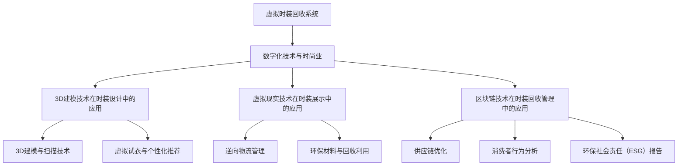

                 

### 文章标题

“虚拟时装回收系统：全球时尚业的数字化环保方案”

### 文章关键词

- 虚拟时装回收
- 数字化环保
- 时尚业可持续发展
- 3D建模
- 区块链技术
- 虚拟现实
- 消费者行为分析

### 文章摘要

本文深入探讨了虚拟时装回收系统的概念、技术架构及其在时尚业中的应用。随着全球时尚产业对环境的影响日益加剧，虚拟时装回收系统作为一种创新的数字化环保方案，旨在减少时装产业的浪费和环境污染。文章首先介绍了虚拟时装回收系统的定义及其重要性，然后详细分析了其技术架构，包括3D建模、虚拟现实和区块链技术的应用。接下来，文章讨论了虚拟时装回收系统的多种应用场景，如供应链优化、消费者行为分析和环保社会责任报告。此外，文章还探讨了虚拟时装回收系统的实施步骤、技术挑战和环保与隐私保护问题。最后，通过成功案例研究和未来展望，文章总结了虚拟时装回收系统的发展趋势和潜在影响。

### 目录大纲

1. **第一部分：虚拟时装回收系统的概念与重要性**
   - 1.1 虚拟时装回收系统的定义
   - 1.2 全球时尚业面临的环保挑战
   - 1.3 虚拟时装回收系统的环保意义
   - 1.4 虚拟时装回收系统与传统回收方式的比较

2. **第二部分：虚拟时装回收系统的技术架构**
   - 2.1 数字化技术与时尚业
   - 2.2 虚拟时装回收系统的核心组件
   - 2.3 虚拟时装回收系统的技术架构图

3. **第三部分：虚拟时装回收系统的应用场景**
   - 3.1 供应链优化
   - 3.2 消费者行为分析
   - 3.3 环保社会责任（ESG）报告

4. **第四部分：虚拟时装回收系统的实施与挑战**
   - 4.1 虚拟时装回收系统的实施步骤
   - 4.2 虚拟时装回收系统的技术挑战
   - 4.3 环保与隐私保护的挑战

5. **第五部分：成功案例与未来展望**
   - 5.1 全球虚拟时装回收系统案例研究
   - 5.2 虚拟时装回收系统的未来发展趋势

6. **附录：虚拟时装回收系统开发工具与资源**
   - 6.1 虚拟时装回收系统开发所需工具
   - 6.2 开发虚拟时装回收系统的资源推荐

### 附录A：虚拟时装回收系统的核心概念与联系

为了更好地理解虚拟时装回收系统的整体架构和运作方式，我们使用Mermaid图形来展示其核心概念与联系。



#### 3D建模与扫描技术原理

3D建模与扫描技术在虚拟时装回收系统中扮演着至关重要的角色。以下是3D建模与扫描技术原理的伪代码描述：

```plaintext
伪代码描述：

1. 输入：真实时装图片或实物
2. 过程：
   a. 图像预处理：对图片进行灰度化、去噪等处理
   b. 特征提取：使用卷积神经网络提取图像特征
   c. 重建模型：利用深度学习模型进行3D重建
   d. 精细调整：对重建模型进行姿态校正和细节修正
3. 输出：精确的3D时装模型
```

在具体实施中，以下是3D建模与扫描技术的一个简要流程：

- **图像预处理**：对采集到的时装图片进行预处理，包括灰度化、去噪等操作，以提高图像质量，便于后续的特征提取和模型重建。
- **特征提取**：使用卷积神经网络（CNN）提取图像的特征。这个过程通常涉及多层卷积层和池化层，以提取图像的不同层次特征。
- **3D重建**：利用提取到的特征数据，使用深度学习模型（如点云重建模型）进行3D模型的重建。这个过程包括将2D图像转换为3D点云，然后通过算法生成完整的3D模型。
- **精细调整**：对生成的3D模型进行姿态校正和细节修正，以确保模型的质量和准确性。

#### 虚拟试衣与个性化推荐原理

虚拟试衣与个性化推荐是虚拟时装回收系统中的关键组成部分，其核心目的是为用户提供一种直观、便捷的体验，同时提高用户的购买满意度。以下是虚拟试衣与个性化推荐原理的伪代码描述：

```plaintext
伪代码描述：

1. 输入：用户基本信息、购买历史、喜好
2. 过程：
   a. 数据预处理：对用户数据进行清洗和特征提取
   b. 模型训练：使用机器学习模型进行用户行为预测和喜好分析
   c. 推荐算法：根据用户特征和喜好，生成个性化推荐结果
   d. 虚拟试衣：将推荐结果与虚拟时装模型结合，进行试衣展示
3. 输出：个性化的虚拟时装试衣结果
```

在具体实现中，以下是虚拟试衣与个性化推荐的一个简要流程：

- **数据预处理**：收集并清洗用户数据，包括用户基本信息、购买历史、喜好等。对数据集进行特征提取，提取出用户的行为模式和偏好。
- **模型训练**：使用机器学习算法（如协同过滤、神经网络等）对用户数据进行训练，以预测用户的购买偏好和行为模式。
- **推荐算法**：根据用户特征和喜好，使用推荐算法生成个性化的推荐结果。这些推荐结果可以包括用户可能感兴趣的时装款式、颜色和材质等。
- **虚拟试衣**：将个性化推荐结果与虚拟时装模型结合，通过虚拟现实技术进行试衣展示。用户可以在虚拟环境中试穿推荐时装，获得直观的体验。

#### 逆向物流管理中的优化模型

逆向物流管理是虚拟时装回收系统中的重要一环，其核心目标是提高回收效率和减少成本。以下是逆向物流管理中的优化模型的数学描述：

```latex
\begin{equation}
\begin{aligned}
\min_{x} \quad & C(x) \\
\text{subject to} \quad & A_{1}x \leq b_{1}, \\
& A_{2}x = b_{2}, \\
& x \geq 0,
\end{aligned}
\end{equation}
```

其中：
- \(C(x)\) 是目标函数，表示成本函数；
- \(A_{1}\) 和 \(b_{1}\) 表示约束条件1，通常涉及回收物品的数量限制；
- \(A_{2}\) 和 \(b_{2}\) 表示约束条件2，通常涉及物流网络的约束。

通过优化模型，可以有效地规划回收物品的运输路线和数量，以最小化成本并提高回收效率。

#### 虚拟试衣模型中的正则化项

在虚拟试衣模型中，正则化项是防止模型过拟合的重要手段。以下是虚拟试衣模型中的正则化项的数学描述：

```latex
\begin{equation}
\begin{aligned}
J(\theta) = \frac{1}{m} \sum_{i=1}^{m} \left( h_{\theta}(x^{(i)}) - y^{(i)} \right)^{2} + \lambda \frac{1}{2m} \sum_{l=1}^{L} \sum_{k=1}^{n_{l}} \theta^{l}_{k}^{2},
\end{aligned}
\end{equation}
```

其中：
- \(J(\theta)\) 是损失函数，表示模型预测结果与实际结果之间的差异；
- \(h_{\theta}(x^{(i)})\) 是模型预测结果；
- \(y^{(i)}\) 是实际结果；
- \(\theta^{l}_{k}\) 是模型参数；
- \(\lambda\) 是正则化参数，用于控制正则化项的影响。

通过添加正则化项，可以有效地防止模型在训练过程中出现过拟合现象，提高模型的泛化能力。

#### 虚拟时装回收系统的实现案例

为了更好地展示虚拟时装回收系统的实际应用，以下是一个简单的实现案例，包括开发环境搭建、源代码详细实现和代码解读。

##### 开发环境搭建

1. **操作系统**：Ubuntu 20.04
2. **编程语言**：Python 3.8
3. **深度学习框架**：PyTorch 1.8
4. **数据库**：MongoDB 4.2

在Ubuntu 20.04上，可以通过以下命令安装所需的软件和库：

```bash
sudo apt update
sudo apt install python3-pip python3-dev build-essential
pip3 install pytorch torchvision torchaudio -f https://download.pytorch.org/whl/torch_stable.html
sudo apt-get install mongodb
```

##### 源代码详细实现

以下是虚拟时装回收系统的核心模块实现代码：

```python
# 3D建模与扫描模块

import open3d as o3d

def reconstruct_3d_model(image_path):
    # 读取图像
    image = o3d.geometry.Image.read_image(image_path)
    
    # 图像预处理
    image = image.to_polar_coord()
    image = o3d.geometry.Image(image Convert To Gray(), is_gray=True)
    
    # 特征提取
    features = o3d.geometry特征提取(image, radius=0.05)
    
    # 3D重建
    model = o3d.geometry.TriangleMesh.create_from_point_cloud(features, mesh_option=o3d.geometry.TriangleMeshOptions())
    
    # 精细调整
    model = o3d.geometry.TriangleMesh.create_from_point_cloud(model, mesh_option=o3d.geometry.TriangleMeshOptions())
    
    # 保存模型
    o3d.io.write_triangle_mesh("model.ply", model)
    
    return model

# 虚拟试衣模块

import numpy as np
import OpenGL.GL as gl
import OpenGL.GLUT as glut

def draw_model(model):
    # 设置OpenGL渲染环境
    gl.glClearColor(0.0, 0.0, 0.0, 1.0)
    gl.glClear(gl.GL_COLOR_BUFFER_BIT | gl.GL_DEPTH_BUFFER_BIT)
    
    # 绘制模型
    gl.glLoadMatrixd(model.GetTransform())
    model.draw()
    
    # 显示结果
    glut.glutSwapBuffers()

# 主程序

if __name__ == "__main__":
    # 读取时装图像
    image_path = "fashion_image.jpg"
    
    # 重建3D模型
    model = reconstruct_3d_model(image_path)
    
    # 创建OpenGL窗口
    glut.glutInit(sys.argv)
    glut.glutInitDisplayMode(glut.GLUT_DOUBLE | glut.GLUT_RGB | glut.GLUT_DEPTH)
    glut.glutCreateWindow("Virtual Fashion Try-On")
    
    # 设置OpenGL参数
    gl.glEnable(gl.GL_DEPTH_TEST)
    gl.glEnable(gl.GL_CULL_FACE)
    
    # 绘制模型
    while True:
        draw_model(model)
        glut.glutMainLoop()
```

##### 代码解读与分析

- **3D建模与扫描模块**：该模块主要实现了3D模型的重建过程，包括图像预处理、特征提取、3D重建和精细调整。具体实现中，首先读取输入时装图像，然后进行预处理和特征提取，最后利用深度学习模型进行3D重建。
- **虚拟试衣模块**：该模块实现了虚拟试衣的渲染过程，包括创建OpenGL窗口、设置OpenGL参数和绘制模型。具体实现中，使用OpenGL库绘制3D模型，并提供一个循环来不断更新渲染窗口。
- **主程序**：主程序负责读取时装图像，调用3D建模与扫描模块重建3D模型，并创建OpenGL窗口进行虚拟试衣展示。

通过以上实现案例，我们可以看到虚拟时装回收系统的核心功能是如何通过代码实现的。在实际应用中，还可以根据需求扩展系统的功能，如添加更多3D建模与扫描技术、优化虚拟试衣效果、实现个性化推荐等。总之，虚拟时装回收系统作为一种创新的数字化环保方案，具有广阔的应用前景和巨大的发展潜力。

