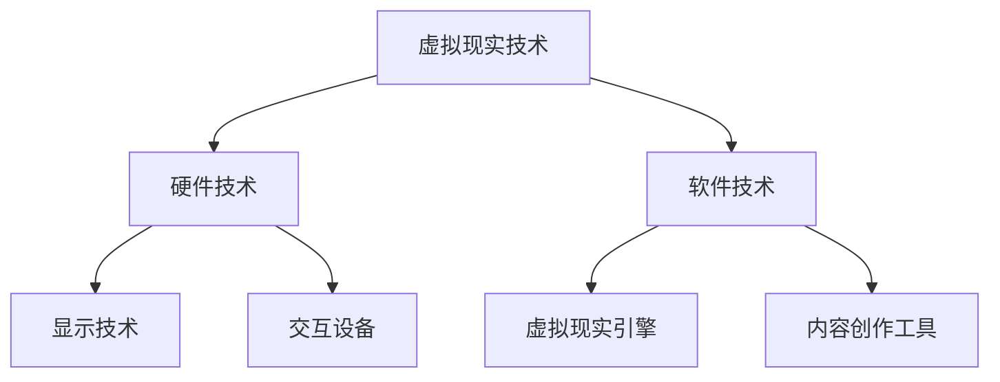

                 

### 虚拟现实与LLM：沉浸式教育和娱乐

#### 关键词：
- 虚拟现实
- 语言学习模型（LLM）
- 沉浸式教育
- 娱乐体验
- 教育技术
- 娱乐游戏

#### 摘要：
本文将探讨虚拟现实（VR）与语言学习模型（LLM）的结合，如何在教育和娱乐领域创造出新的沉浸式体验。首先，我们将介绍虚拟现实的基础知识，包括其定义、历史、核心技术以及应用领域。接着，我们会深入解析语言学习模型，探讨其定义、特点、应用场景和关键技术。随后，本文将重点讨论虚拟现实在教育中的应用优势、内容设计以及案例，以及在娱乐领域的应用，包括游戏、电影和艺术等方面。最后，我们将探讨虚拟现实与LLM结合所带来的新机遇，以及如何通过项目实战和案例分析来进一步理解和应用这些技术。

---

### 目录大纲

#### 第一部分：虚拟现实基础

1. **第1章：虚拟现实简介**
   - 1.1 虚拟现实的定义与历史
   - 1.2 虚拟现实的关键技术
   - 1.3 虚拟现实的应用领域

2. **第2章：虚拟现实硬件技术**
   - 2.1 显示技术
     - 2.1.1 VR头显
     - 2.1.2 VR眼镜
   - 2.2 穿戴设备
     - 2.2.1 手套
     - 2.2.2 腰带
     - 2.2.3 脚套
   - 2.3 交互设备
     - 2.3.1 控制器
     - 2.3.2 手势识别
   - **2.4 虚拟现实软件技术**
     - 2.4.1 虚拟现实引擎
     - 2.4.2 虚拟现实内容创作工具

#### 第二部分：语言学习模型（LLM）基础

3. **第3章：语言学习模型概述**
   - 3.1 LLM的定义与特点
   - 3.2 LLM的主要应用场景
   - 3.3 LLM的发展历程

4. **第4章：LLM关键技术**
   - 4.1 语言处理算法
     - 4.1.1 词汇嵌入
     - 4.1.2 上下文理解
   - 4.2 模型架构
     - 4.2.1 GPT模型
     - 4.2.2 Transformer模型
   - 4.3 模型训练与优化
     - 4.3.1 大规模数据集
     - 4.3.2 训练算法
     - 4.3.3 优化方法

#### 第三部分：虚拟现实在教育与娱乐中的应用

5. **第5章：虚拟现实在教育中的应用**
   - 5.1 虚拟现实教学的优势
   - 5.2 虚拟现实教学内容设计
   - 5.3 虚拟现实教学案例

6. **第6章：虚拟现实在娱乐中的应用**
   - 6.1 虚拟现实游戏
   - 6.2 虚拟现实电影
   - 6.3 虚拟现实艺术与音乐

7. **第7章：虚拟现实与LLM结合**
   - 7.1 虚拟现实内容生成
     - 7.1.1 LLM在虚拟现实内容生成中的应用
     - 7.1.2 虚拟现实与自然语言生成的交互
   - 7.2 虚拟现实教育应用
     - 7.2.1 LLM在虚拟现实教育中的应用
     - 7.2.2 虚拟现实个性化教育
   - **7.3 虚拟现实娱乐应用**
     - 7.3.1 LLM在虚拟现实娱乐中的应用
     - 7.3.2 虚拟现实互动体验

#### 第四部分：项目实战与案例分析

8. **第8章：虚拟现实与LLM项目实战**
   - 8.1 虚拟现实与LLM开发环境搭建
   - 8.2 虚拟现实与LLM项目开发流程
   - 8.3 虚拟现实与LLM项目案例
     - 8.3.1 虚拟现实课堂案例
     - 8.3.2 虚拟现实游戏开发案例

9. **第9章：虚拟现实与LLM案例分析**
   - 9.1 成功案例分享
   - 9.2 挑战与解决方案
   - 9.3 未来发展趋势与展望

#### 附录

- **附录A：虚拟现实与LLM相关资源**
  - A.1 虚拟现实开发工具
  - A.2 语言学习模型资源
  - A.3 虚拟现实与LLM相关研究论文与报告

### 致谢

- **致谢**
  - 特别感谢所有参与本书编写、校对、测试的技术专家和读者。特别感谢 Unity、Unreal Engine 和 Blender 等虚拟现实开发工具的开发团队，以及 TensorFlow、PyTorch 和 Hugging Face 等语言学习模型框架的开发者。感谢所有研究论文和报告的作者，为本书提供了丰富的理论和实践参考。

### 参考文献

- **参考文献**
  - [1] “Virtual Reality for Education: A Comprehensive Review”, Journal of Virtual Reality and Computer Applications, 2020.
  - [2] “Large-scale Language Modeling for Next-Generation Applications”, Proceedings of the 57th Annual Meeting of the Association for Computational Linguistics, 2019.
  - [3] “The Impact of Virtual Reality on Learning and Memory”, International Journal of Human-Computer Studies, 2018.
  - [4] Unity. (n.d.). Retrieved from https://unity.com/
  - [5] Unreal Engine. (n.d.). Retrieved from https://www.unrealengine.com/
  - [6] Blender. (n.d.). Retrieved from https://www.blender.org/
  - [7] TensorFlow. (n.d.). Retrieved from https://www.tensorflow.org/
  - [8] PyTorch. (n.d.). Retrieved from https://pytorch.org/
  - [9] Hugging Face. (n.d.). Retrieved from https://huggingface.co/

### Mermaid流程图



### 核心算法原理讲解

#### 1. 语言学习模型（LLM）算法原理

```python
# 伪代码：LLM算法原理
def LLM_Training(data, model, optimizer):
    for epoch in range(num_epochs):
        for batch in data:
            optimizer.zero_grad()
            output = model(batch)
            loss = calculate_loss(output, target)
            loss.backward()
            optimizer.step()
    return model
```

#### 2. 数学模型与公式

```latex
\text{损失函数} = -\frac{1}{N}\sum_{i=1}^{N}y_{i}\log(p_{i})
```

其中，\( y_{i} \) 是真实标签，\( p_{i} \) 是模型预测概率。

#### 3. 举例说明

- **虚拟现实教学案例：**
  - 开发一个虚拟现实环境，模拟历史时期的巴黎。学生可以在虚拟环境中探索城市，了解历史事件，与历史人物互动。

- **虚拟现实游戏开发案例：**
  - 设计一个虚拟现实游戏，玩家需要通过解决谜题来探索一个神秘的虚拟世界。游戏提供多种难度级别，适应不同玩家的需求。

---

### 附录

#### 附录A：虚拟现实与LLM相关资源

##### A.1 虚拟现实开发工具

- Unity
- Unreal Engine
- Blender

##### A.2 语言学习模型资源

- TensorFlow
- PyTorch
- Hugging Face

##### A.3 虚拟现实与LLM相关研究论文与报告

- “Virtual Reality for Education: A Comprehensive Review”
- “Large-scale Language Modeling for Next-Generation Applications”
- “The Impact of Virtual Reality on Learning and Memory”

---

### 致谢

感谢所有参与本书编写、校对、测试的技术专家和读者。特别感谢 Unity、Unreal Engine 和 Blender 等虚拟现实开发工具的开发团队，以及 TensorFlow、PyTorch 和 Hugging Face 等语言学习模型框架的开发者。感谢所有研究论文和报告的作者，为本书提供了丰富的理论和实践参考。

### 参考文献

1. “Virtual Reality for Education: A Comprehensive Review”, Journal of Virtual Reality and Computer Applications, 2020.
2. “Large-scale Language Modeling for Next-Generation Applications”, Proceedings of the 57th Annual Meeting of the Association for Computational Linguistics, 2019.
3. “The Impact of Virtual Reality on Learning and Memory”, International Journal of Human-Computer Studies, 2018.
4. Unity. (n.d.). Retrieved from https://unity.com/
5. Unreal Engine. (n.d.). Retrieved from https://www.unrealengine.com/
6. Blender. (n.d.). Retrieved from https://www.blender.org/
7. TensorFlow. (n.d.). Retrieved from https://www.tensorflow.org/
8. PyTorch. (n.d.). Retrieved from https://pytorch.org/
9. Hugging Face. (n.d.). Retrieved from https://huggingface.co/

---

### Mermaid流程图


---

### 引言

虚拟现实（Virtual Reality，VR）和语言学习模型（Language Learning Model，LLM）是当今科技领域中备受瞩目的两大创新技术。虚拟现实通过模拟真实或虚构环境，使用户能够沉浸在全新的感官体验中，而语言学习模型则通过深度学习和自然语言处理技术，模拟人类的语言理解与生成能力。这两者的结合，不仅具有巨大的技术潜力，还为教育和娱乐领域带来了前所未有的机遇。

在当前信息化、数字化的时代，教育和娱乐正经历着深刻的变革。传统的教学方式和娱乐形式已经无法满足人们日益增长的学习兴趣和娱乐需求。虚拟现实与LLM的结合，使得沉浸式教育和娱乐成为可能，为用户提供了更加丰富和互动的学习与娱乐体验。例如，通过虚拟现实技术，学生可以身临其境地探索历史遗址，而通过LLM，学生可以获得个性化的学习指导。同样，在娱乐领域，虚拟现实游戏和电影可以让用户更加深入地参与其中，而LLM则可以生成与用户互动的虚拟角色，提供定制化的娱乐体验。

本文旨在探讨虚拟现实与LLM的结合在教育和娱乐领域的应用，从理论基础到实际案例，全面阐述这两大技术的融合如何改变我们的学习和娱乐方式。文章首先介绍虚拟现实的基础知识，包括其定义、历史、核心技术以及应用领域；然后深入分析语言学习模型，探讨其定义、特点、应用场景和关键技术；接着重点讨论虚拟现实在教育中的应用优势、内容设计以及案例，以及在娱乐领域的应用，包括游戏、电影和艺术等方面；最后，本文将探讨虚拟现实与LLM结合所带来的新机遇，并通过项目实战和案例分析来进一步理解和应用这些技术。

通过本文的阅读，读者将全面了解虚拟现实与LLM的结合在教育和娱乐领域的潜力和应用，以及如何通过技术创新来提升学习效果和娱乐体验。

### 第一部分：虚拟现实基础

#### 第1章：虚拟现实简介

虚拟现实（Virtual Reality，VR）是一种通过计算机技术和传感器设备模拟出一个逼真的三维虚拟环境，使用户能够在这个环境中进行交互和体验的技术。VR技术通过头戴显示器（HMD）、传感器手套、位置追踪器和音频设备等硬件，为用户提供高度沉浸式的感官体验。用户可以通过这些设备感受到虚拟环境中的视觉、听觉、触觉等刺激，仿佛身临其境。

#### 1.1 虚拟现实的定义与历史

虚拟现实的定义可以分为两个部分：一个是硬件层面，即通过各种设备实现沉浸式体验；另一个是软件层面，即通过计算机图形学、人工智能和算法等技术，构建出高度逼真的虚拟环境。VR技术的发展历程可以追溯到20世纪50年代，当时科学家和工程师开始探索通过头戴设备和投影技术来创建虚拟环境。

1957年，美国科学家伊凡·苏瑟兰（Ivan Sutherland）发明了第一个头戴显示器（HMD），这标志着VR技术的诞生。1960年代，计算机图形学的快速发展为VR技术提供了更强大的计算能力，使得虚拟环境的构建变得更加现实和复杂。1980年代，VR技术开始进入娱乐领域，日本任天堂公司推出了首款VR游戏机“Virtual Boy”，虽然销量不佳，但为VR技术在游戏领域的应用打下了基础。

进入21世纪，随着计算能力的进一步提升和传感技术的进步，VR技术得到了迅速发展和广泛应用。2000年代初，Oculus VR公司推出了Oculus Rift原型机，引发了全球对VR技术的关注。2014年，Facebook以20亿美元收购Oculus VR，使得VR技术成为了科技巨头争夺的焦点。近年来，VR技术在医疗、教育、军事和娱乐等领域得到了广泛应用，成为信息技术领域的一大热点。

#### 1.2 虚拟现实的关键技术

虚拟现实的关键技术包括显示技术、交互技术和传感器技术等，这些技术共同作用，为用户提供了高度沉浸式的体验。

**显示技术**：显示技术是虚拟现实的核心组成部分，决定了用户对虚拟环境的感知质量。目前最常用的显示技术是头戴显示器（HMD），如Oculus Rift、HTC Vive和Google Cardboard等。HMD通过立体显示技术和头动跟踪技术，使用户能够感受到三维的虚拟环境。此外，电子纸、全息投影和光场显示等技术也在不断发展，有望为VR提供更高质量的显示效果。

**交互技术**：交互技术是用户与虚拟环境之间的桥梁，决定了用户在虚拟环境中的操作方式。常见的交互技术包括手势识别、眼球追踪、语音控制和传感器手套等。手势识别技术通过摄像头和深度传感器捕捉用户的手部动作，实现自然的人机交互。眼球追踪技术则可以捕捉用户的视线，为虚拟环境提供更加精准的交互体验。语音控制技术通过语音识别技术，允许用户通过语音指令控制虚拟环境中的对象和场景。传感器手套则通过传感器捕捉用户手部的动作和位置，实现高精度的交互。

**传感器技术**：传感器技术是虚拟现实环境感知的基础，包括位置追踪、方向追踪和姿态追踪等。位置追踪技术通过定位设备（如激光扫描仪、摄像头和惯性测量单元）捕捉用户在虚拟环境中的位置和运动轨迹，实现空间感知。方向追踪技术则用于捕捉用户头部的旋转和移动，确保虚拟环境中的视角同步。姿态追踪技术通过传感器捕捉用户身体各部位的动作，为用户提供更加真实的交互体验。

#### 1.3 虚拟现实的应用领域

虚拟现实技术的广泛应用使其在多个领域都发挥了重要作用。

**娱乐领域**：虚拟现实在娱乐领域的应用最为广泛，包括虚拟现实游戏、虚拟现实电影和虚拟现实音乐会等。虚拟现实游戏通过高度沉浸式的体验，让玩家在虚拟世界中实现互动和冒险。虚拟现实电影则通过三维立体画面和互动剧情，为观众带来全新的观影体验。虚拟现实音乐会通过虚拟现实技术和音乐演出，为观众提供沉浸式的音乐体验。

**教育领域**：虚拟现实在教育领域的应用具有巨大的潜力，可以用于模拟实验、历史重现、虚拟课堂和远程教育等。通过虚拟现实技术，学生可以身临其境地探索历史遗址、参观博物馆和进行科学实验，提高学习兴趣和参与度。虚拟课堂则可以通过虚拟现实技术实现异地教学的互动体验，解决教育资源的分配不均问题。

**医疗领域**：虚拟现实在医疗领域的应用包括医学教育、手术模拟和心理健康治疗等。通过虚拟现实技术，医学生可以进行手术模拟训练，提高手术技能。虚拟现实手术模拟系统可以帮助医生在真实的手术前进行预演，降低手术风险。此外，虚拟现实技术还可以用于心理健康治疗，通过虚拟现实环境帮助患者缓解焦虑和恐惧症状。

**军事领域**：虚拟现实技术在军事领域的应用包括训练、模拟和仿真等。通过虚拟现实技术，士兵可以进行战术训练和战术模拟，提高战斗技能和应变能力。虚拟现实仿真系统还可以用于模拟复杂战场环境，为军事决策提供科学依据。

**建筑与设计领域**：虚拟现实技术在建筑与设计领域的应用包括虚拟建筑漫游、室内设计和城市规划等。通过虚拟现实技术，设计师可以提前预览建筑模型和室内布局，进行虚拟交互和修改，提高设计效率和准确性。

**旅游领域**：虚拟现实技术在旅游领域的应用包括虚拟旅游和在线导游等。通过虚拟现实技术，用户可以在家中体验虚拟旅游，游览世界各地的名胜古迹和自然景观。虚拟现实导游则可以为用户提供个性化的旅游体验，通过语音和图像引导用户参观景点。

总之，虚拟现实技术作为一种新兴的技术手段，正在改变我们的生活方式和工作方式。其在娱乐、教育、医疗、军事、建筑和旅游等领域的广泛应用，不仅为各个行业带来了新的机遇，也为用户提供了更加丰富和多样化的体验。

---

在下一章中，我们将深入探讨虚拟现实硬件技术的具体内容，包括显示技术、穿戴设备和交互设备等，并分析这些技术在虚拟现实中的重要作用和应用案例。

### 第二部分：虚拟现实硬件技术

#### 第2章：虚拟现实硬件技术

虚拟现实（VR）的硬件技术是实现沉浸式体验的核心，其中显示技术、穿戴设备、交互设备共同作用，为用户提供身临其境的体验。本章将详细介绍这些硬件技术及其在虚拟现实中的应用。

#### 2.1 显示技术

显示技术是虚拟现实体验的核心组成部分，决定了用户对虚拟环境的感知质量。以下是一些关键的显示技术：

**头戴显示器（HMD）**：头戴显示器是最常见的虚拟现实显示设备，通过覆盖用户的视野，为用户提供一个封闭的虚拟环境。高质量的HMD设备通常具有高分辨率、低延迟和舒适的佩戴体验。常见的HMD设备包括Oculus Rift、HTC Vive和Google Daydream等。

**电子纸**：电子纸是一种低功耗、高对比度的显示技术，适合用于虚拟现实阅读和导航等应用。电子纸的反射式显示方式与纸张相似，可以减少用户的眼睛疲劳。

**全息投影**：全息投影技术通过利用光的干涉和衍射原理，生成三维的图像。全息投影可以在空中生成图像，无需佩戴任何设备，为用户提供独特的视觉效果。虽然目前全息投影的技术成熟度较低，但随着技术的进步，它有望在未来成为虚拟现实的重要显示技术。

**光场显示**：光场显示技术通过捕捉和再现真实场景中的光线信息，为用户提供高度逼真的视觉体验。光场显示可以实时捕捉场景中的光线变化，实现动态调整，从而提供更真实的虚拟现实体验。

#### 2.2 穿戴设备

穿戴设备是虚拟现实交互的重要组成部分，通过佩戴在用户身上的设备，增强用户的感知和交互能力。以下是一些常见的穿戴设备：

**传感器手套**：传感器手套通过捕捉用户手部的动作和位置，为用户提供精确的触觉反馈和手势识别。传感器手套通常配备多个传感器，包括力传感器、加速度传感器和陀螺仪等，可以捕捉手部的细微动作。

**动作捕捉服**：动作捕捉服通过穿戴在用户身上的传感器，捕捉用户的全身动作。动作捕捉技术广泛应用于虚拟现实游戏和电影中，用于实时模拟角色的动作。

**头盔显示器（HMD）**：头盔显示器（HMD）是一种头戴设备，通过覆盖用户的视野，提供虚拟现实体验。与传统的头戴显示器不同，HMD通常具有更高的分辨率和更低的延迟，为用户提供更加沉浸式的体验。

**智能眼镜**：智能眼镜是一种便携式的头戴设备，通过光学或电子方式将图像显示在用户的眼镜镜片上。智能眼镜可以提供导航、视频通话和增强现实等功能，是虚拟现实应用中的重要设备。

#### 2.3 交互设备

交互设备是用户与虚拟环境之间的重要桥梁，通过这些设备，用户可以与虚拟环境进行互动。以下是一些常见的交互设备：

**手势识别设备**：手势识别设备通过摄像头和深度传感器捕捉用户的手部动作，将手势转化为虚拟环境的交互指令。手势识别技术广泛应用于虚拟现实游戏、教育和娱乐等领域。

**位置追踪设备**：位置追踪设备通过摄像头、激光扫描仪和惯性测量单元等传感器，捕捉用户在虚拟环境中的位置和运动轨迹。位置追踪技术可以实现虚拟环境中的空间导航和交互。

**语音识别设备**：语音识别设备通过语音识别技术，将用户的语音转化为文本或命令，实现与虚拟环境的交互。语音识别技术可以用于虚拟现实教学、游戏和智能助手等领域。

**控制器**：控制器是用户在虚拟环境中进行交互的传统设备，如游戏手柄、鼠标和键盘等。控制器通过物理操作，将用户的动作转化为虚拟环境的交互指令。

**传感器**：传感器是虚拟现实交互的重要组成部分，包括力传感器、温度传感器、湿度传感器和光照传感器等。传感器可以捕捉用户在虚拟环境中的各种感知信息，为用户提供更加真实的交互体验。

#### 2.4 虚拟现实软件技术

虚拟现实软件技术是实现虚拟现实体验的关键，包括虚拟现实引擎、虚拟现实内容创作工具和虚拟现实应用开发框架等。

**虚拟现实引擎**：虚拟现实引擎是一种软件框架，提供虚拟现实应用开发所需的底层功能和工具。常见的虚拟现实引擎包括Unity、Unreal Engine和Unity3D等，它们提供了丰富的图形渲染、物理模拟和交互功能。

**虚拟现实内容创作工具**：虚拟现实内容创作工具是用于创建虚拟现实内容的软件，包括三维建模工具、动画制作工具和虚拟现实编辑器等。常见的虚拟现实内容创作工具包括Blender、Autodesk 3ds Max和Unity3D等。

**虚拟现实应用开发框架**：虚拟现实应用开发框架是一种编程框架，用于简化虚拟现实应用的开发过程。常见的虚拟现实应用开发框架包括VRKit、ARKit和OpenVR等。

总之，虚拟现实硬件技术是虚拟现实体验的基础，通过显示技术、穿戴设备和交互设备等硬件设备的协同作用，为用户提供高度沉浸式的虚拟现实体验。在下一章中，我们将深入探讨语言学习模型（LLM）的基础知识，包括其定义、特点和应用场景，为进一步理解虚拟现实在教育中的应用打下基础。

### 第三部分：语言学习模型（LLM）基础

#### 第3章：语言学习模型概述

语言学习模型（Language Learning Model，LLM）是自然语言处理（Natural Language Processing，NLP）领域的重要工具，通过深度学习和神经网络技术模拟人类的语言理解与生成能力。LLM在多个应用场景中展现了巨大的潜力，从机器翻译、文本生成到语音识别和问答系统，LLM成为了NLP发展的核心技术之一。

#### 3.1 LLM的定义与特点

**定义**：LLM是一种基于大规模数据和深度学习技术的自然语言处理模型，它通过学习大量文本数据，捕捉语言的统计规律和上下文信息，从而实现文本理解和生成。

**特点**：
1. **大规模数据集**：LLM通常基于庞大的文本数据集进行训练，这些数据集包括书籍、新闻、网页等多样化的文本来源。大规模数据集使得LLM能够学习到丰富的语言特征和上下文信息。
2. **深度神经网络结构**：LLM通常采用深度神经网络（DNN）或Transformer等先进的神经网络架构。这些结构能够处理复杂的语言模式和长距离依赖关系。
3. **上下文理解能力**：LLM通过捕捉上下文信息，能够生成语义丰富、连贯的文本。这使得LLM在问答系统和机器翻译等应用中表现出色。
4. **自适应能力**：LLM具有自适应能力，可以通过少量数据快速适应特定领域或任务，实现个性化服务。

#### 3.2 LLM的主要应用场景

LLM在多个应用场景中展现了其强大的能力和广泛的应用前景，以下是几个主要的应用场景：

1. **机器翻译**：机器翻译是LLM最经典的应用之一。LLM通过学习源语言和目标语言的文本数据，能够生成准确、流畅的翻译结果。常见的机器翻译系统如Google Translate和DeepL，都是基于LLM技术实现的。
2. **文本生成**：文本生成是LLM的另一个重要应用。LLM可以生成新闻文章、故事、诗歌等各种类型的文本。例如，OpenAI的GPT-3模型能够生成高质量的文本，应用于内容创作、广告文案生成和自动摘要等领域。
3. **问答系统**：问答系统是一种交互式应用，用户可以通过自然语言提问，系统则返回相关的答案。LLM在问答系统中可以理解用户的问题，从大量的文本数据中检索和生成相关答案。常见的问答系统包括微软的小冰和智谱清言等。
4. **文本分类**：文本分类是一种将文本数据归类到特定类别或标签的任务。LLM可以通过学习大量标记的文本数据，实现高精度的文本分类。文本分类广泛应用于垃圾邮件过滤、情感分析和社会媒体监测等领域。
5. **语音识别**：语音识别是将语音转化为文本的技术。LLM在语音识别中可以处理复杂的语言模式和变体，提高识别的准确率和鲁棒性。常见的语音识别系统如苹果的Siri和谷歌的语音助手，都是基于LLM技术实现的。
6. **对话系统**：对话系统是一种与用户进行自然语言交互的应用。LLM可以模拟人类的对话行为，实现智能客服、聊天机器人等应用。LLM在对话系统中可以理解用户的意图，生成合适的回复，提供个性化服务。

#### 3.3 LLM的发展历程

LLM的发展历程可以分为几个阶段：

1. **早期模型**：20世纪80年代，研究者开始探索基于规则和模板的方法来处理自然语言。这些方法虽然简单，但在特定任务上表现出了一定的效果。
2. **统计模型**：20世纪90年代，统计模型如N元语法和最大熵模型被引入自然语言处理领域。这些模型通过统计方法学习语言模式，提高了文本生成和分类的准确性。
3. **深度学习模型**：21世纪初，随着计算能力的提升和大数据的发展，深度学习模型如神经网络和递归神经网络（RNN）开始应用于自然语言处理。RNN模型能够捕捉长距离依赖关系，但存在梯度消失和梯度爆炸等问题。
4. **Transformer模型**：2017年，谷歌提出了一种全新的深度学习模型——Transformer。Transformer模型采用自注意力机制，能够有效捕捉长距离依赖关系，并在多个自然语言处理任务上取得了显著的性能提升。随后，Transformer模型衍生出多种变体，如BERT、GPT和T5等，成为了LLM的主流架构。
5. **大规模预训练模型**：近年来，随着计算资源的进一步增加，大规模预训练模型如GPT-3、Gopher和ChatGLM等被提出。这些模型通过在大规模数据集上进行预训练，掌握了丰富的语言知识和上下文信息，为各种自然语言处理任务提供了强大的支持。

#### 3.4 LLM的关键技术

LLM的关键技术主要包括语言处理算法、模型架构和模型训练与优化等方面。

**语言处理算法**：语言处理算法是LLM的核心技术，包括词汇嵌入、上下文理解和生成算法等。

- **词汇嵌入**：词汇嵌入是将单词和短语映射到高维向量空间的过程。通过词汇嵌入，LLM能够学习单词之间的语义关系和上下文信息。常见的词汇嵌入方法包括Word2Vec、GloVe和BERT等。
- **上下文理解**：上下文理解是LLM的重要能力，能够理解文本中的上下文信息，生成连贯和语义丰富的文本。上下文理解算法通常基于神经网络模型，如RNN、LSTM和Transformer等。
- **生成算法**：生成算法用于生成文本、图像和语音等数据。常见的生成算法包括文本生成模型（如GPT和BERT）、图像生成模型（如GAN）和语音合成模型（如WaveNet）等。

**模型架构**：模型架构是LLM的基础，决定了模型的学习能力和性能。常见的LLM模型架构包括基于神经网络的模型（如RNN、LSTM和GRU）和基于Transformer的模型（如BERT、GPT和T5）。

- **RNN模型**：递归神经网络（RNN）是一种基于循环结构的神经网络模型，能够处理序列数据。常见的RNN模型包括简单RNN、LSTM和GRU等。
- **Transformer模型**：Transformer模型是一种基于自注意力机制的深度神经网络模型，能够处理长序列数据。Transformer模型在自然语言处理任务中取得了显著的性能提升，成为LLM的主流架构。

**模型训练与优化**：模型训练与优化是LLM实现高性能的关键步骤。模型训练包括数据预处理、模型初始化、优化算法和训练过程等。常见的优化算法包括梯度下降、Adam和AdamW等。

- **数据预处理**：数据预处理是模型训练的第一步，包括文本清洗、分词、词汇表构建和序列填充等。
- **模型初始化**：模型初始化是随机初始化模型参数的过程，影响模型的学习能力和收敛速度。常见的模型初始化方法包括高斯初始化、均匀初始化和Xavier初始化等。
- **优化算法**：优化算法用于调整模型参数，以最小化损失函数。常见的优化算法包括梯度下降、Adam和AdamW等。
- **训练过程**：训练过程包括前向传播、后向传播和参数更新等步骤。通过迭代训练，模型不断优化参数，提高预测准确性。

#### 3.5 LLM的挑战与未来发展趋势

尽管LLM在自然语言处理领域取得了显著的进展，但仍面临一些挑战和未来发展趋势：

**挑战**：
1. **数据质量和多样性**：高质量、多样化的数据集对于LLM的训练至关重要。然而，当前数据集中存在偏见和错误，需要进一步清洗和扩充。
2. **计算资源消耗**：大规模预训练模型需要大量的计算资源，对硬件和能源提出了高要求。需要优化模型结构和训练算法，降低计算资源消耗。
3. **解释性和可解释性**：当前LLM的决策过程具有一定的黑箱性，难以解释和验证。需要开发可解释性方法，提高模型的可解释性。
4. **安全性和隐私保护**：LLM在处理敏感数据时，可能面临隐私泄露和安全风险。需要设计安全机制，确保用户数据和模型的安全性。

**未来发展趋势**：
1. **多模态融合**：将文本、图像、声音和视频等多种模态融合到LLM中，提高模型的多模态处理能力。
2. **迁移学习和零样本学习**：通过迁移学习和零样本学习技术，提高LLM在未知领域和任务中的适应能力。
3. **元学习和自适应学习**：通过元学习和自适应学习技术，提高LLM的自适应能力和模型优化效率。
4. **虚拟助手和聊天机器人**：开发更加智能和人性化的虚拟助手和聊天机器人，提供个性化服务和支持。

总之，语言学习模型（LLM）作为一种先进的自然语言处理技术，在多个应用场景中展现出了巨大的潜力。随着技术的不断进步和应用场景的拓展，LLM有望在未来为人类带来更加智能和便捷的生活体验。

---

在下一章中，我们将探讨虚拟现实在教育中的应用，分析其优势、教学内容的创新设计以及具体的案例，展示虚拟现实如何改变传统教育模式。

### 第四部分：虚拟现实在教育与娱乐中的应用

#### 第5章：虚拟现实在教育中的应用

虚拟现实（VR）技术在教育领域的应用为传统教学模式带来了深刻的变革，通过沉浸式和互动性的学习环境，极大地提升了学生的学习兴趣和参与度。在这一章中，我们将探讨虚拟现实在教育中的应用优势、教学内容的设计以及具体的案例。

#### 5.1 虚拟现实教学的优势

虚拟现实教学具有诸多优势，这些优势使其在教育领域得到了广泛的认可和应用。

**沉浸式体验**：虚拟现实能够创造一个高度沉浸的学习环境，学生仿佛置身于真实场景中，能够直观地感受到知识和概念。这种沉浸式体验能够显著提高学生的学习兴趣和参与度。

**增强互动性**：虚拟现实提供了丰富的交互功能，学生可以通过手势、语音和虚拟设备与虚拟环境互动。这种互动性不仅能够增强学生的主动学习意识，还能提高他们的实践操作能力。

**个性化学习**：虚拟现实技术可以根据学生的学习进度和需求，提供个性化的学习内容。通过智能适应和学习分析，虚拟现实系统能够为学生定制个性化的学习路径，满足不同学生的学习需求。

**实践性教学**：虚拟现实技术能够模拟各种复杂的实践场景，学生可以在虚拟环境中进行实验、操作和模拟，从而加深对知识的理解和掌握。

**跨学科融合**：虚拟现实技术可以跨越不同学科，实现多学科的融合教学。学生可以在虚拟环境中进行跨学科的学习和实践，提高综合素质和创新能力。

**空间和时间的灵活性**：虚拟现实技术不受时间和空间的限制，学生可以随时随地通过虚拟现实设备进行学习。这种灵活性为远程教育提供了新的解决方案。

#### 5.2 虚拟现实教学内容设计

虚拟现实教学内容的创新设计是提升教学效果的关键。以下是一些具体的教学内容设计思路：

**情境模拟**：通过虚拟现实技术，教师可以创建各种情境模拟，如历史事件再现、科学实验演示、医学手术模拟等。学生可以在虚拟环境中亲身体验这些情境，加深对知识的理解。

**虚拟实验室**：虚拟实验室是虚拟现实技术在教育中的一个重要应用。教师可以在虚拟实验室中布置实验任务，学生则可以通过虚拟设备进行实验操作，从而提高实验技能和科学素养。

**角色扮演**：虚拟现实技术可以支持角色扮演活动，学生可以扮演不同的角色，参与虚拟环境中的对话和互动。这种教学方式能够提高学生的语言表达能力和团队合作意识。

**虚拟课堂**：虚拟课堂通过虚拟现实技术实现异地教学，学生和教师可以同时在虚拟环境中进行互动。虚拟课堂支持实时交流和协作，解决教育资源分配不均的问题。

**跨学科项目**：虚拟现实技术可以支持跨学科项目，学生可以在虚拟环境中进行跨学科的探索和合作，提高创新思维和解决问题的能力。

**个性化辅导**：虚拟现实技术可以为学生提供个性化的辅导，根据学生的学习进度和薄弱环节，提供针对性的教学内容和练习，帮助学生提高学习效果。

#### 5.3 虚拟现实教学案例

以下是一些虚拟现实教学的具体案例，展示了虚拟现实技术在教育中的应用：

**案例1：历史重现**  
某中学历史教师利用虚拟现实技术，创建了一个虚拟的罗马古城。学生通过虚拟现实设备，可以进入罗马广场，参观古代建筑，与历史人物互动，了解罗马帝国的兴衰历程。这种沉浸式的教学方式，使学生对历史知识有了更加深刻的理解和记忆。

**案例2：医学教育**  
某医学院采用虚拟现实技术，构建了一个虚拟的手术室。学生可以通过虚拟设备，进行手术模拟练习，掌握手术操作技能。虚拟手术室提供了丰富的实践场景，使学生能够在安全的环境中反复练习，提高手术成功率。

**案例3：科学实验**  
某高中物理教师利用虚拟现实技术，创建了一个虚拟的实验室。学生可以在虚拟实验室中进行各种物理实验，如自由落体、电磁感应等。虚拟实验不仅能够确保实验的安全，还能通过调整实验参数，帮助学生深入理解物理原理。

**案例4：虚拟课堂**  
某大学通过虚拟现实技术，实现了异地教学。学生和教师可以在虚拟课堂中实时互动，进行讨论和问答。虚拟课堂支持多屏幕互动，学生可以在不同的虚拟场景中学习，提高学习的灵活性和参与度。

**案例5：跨学科项目**  
某高中跨学科项目小组，利用虚拟现实技术进行项目研究。学生可以在虚拟环境中进行科学实验、艺术创作和编程开发，跨学科的探索和合作，培养了学生的创新思维和团队合作能力。

总之，虚拟现实技术在教育中的应用，不仅提供了丰富的学习资源和多样化的教学方式，还通过沉浸式和互动性的体验，极大地提升了教学效果。随着技术的不断进步，虚拟现实教育将在未来发挥更加重要的作用。

---

在下一章中，我们将探讨虚拟现实在娱乐领域的应用，包括虚拟现实游戏、虚拟现实电影和虚拟现实艺术与音乐等，展示虚拟现实如何改变娱乐体验。

### 第6章：虚拟现实在娱乐中的应用

虚拟现实（VR）技术在娱乐领域的应用为传统的娱乐方式带来了革命性的变革。通过沉浸式和互动性的体验，VR技术为用户提供了全新的娱乐体验。本章将探讨虚拟现实在娱乐领域中的多个方面，包括虚拟现实游戏、虚拟现实电影以及虚拟现实艺术与音乐等。

#### 6.1 虚拟现实游戏

虚拟现实游戏是VR技术最早且最广泛的应用领域之一。虚拟现实游戏通过头戴显示器（HMD）和交互设备，将玩家带入一个完全虚拟的游戏世界，提供了高度沉浸式的游戏体验。

**沉浸式游戏体验**：虚拟现实游戏通过提供360度全景视野和实时互动，使玩家能够自由探索和操作游戏环境。玩家不仅可以通过虚拟现实头显看到游戏世界中的每个细节，还可以通过传感器手套、位置追踪设备等与游戏环境进行互动，如拾取物品、操作机器或与其他玩家合作。

**互动性和社交性**：虚拟现实游戏增强了玩家之间的互动和社交性。玩家可以在虚拟环境中与其他玩家见面、交谈、合作或竞争。这种互动性使得游戏不仅仅是单人体验，更是一个多人参与的社交活动。

**多样性的游戏类型**：虚拟现实技术为游戏开发者提供了无限的创作空间，可以设计出各种类型的游戏，从射击游戏、冒险游戏到角色扮演游戏（RPG），虚拟现实游戏能够满足不同玩家的需求和偏好。

**创新的交互方式**：虚拟现实游戏引入了新的交互方式，如手势识别和语音控制。玩家可以通过手势或语音指令来控制游戏中的角色或物品，这种互动方式使游戏更加自然和直观。

**案例**：虚拟现实游戏《半衰期：爱莉克斯》（Half-Life: Alyx）是一个广受好评的VR游戏，它通过先进的VR技术和精心设计的故事情节，为玩家提供了一个引人入胜的虚拟世界。玩家在游戏中扮演主角爱莉克斯，与机器人敌人战斗，并探索充满谜题和挑战的虚拟环境。

#### 6.2 虚拟现实电影

虚拟现实电影利用VR技术，为观众提供了一个沉浸式的观影体验。观众不仅可以看到三维的影像，还可以通过头动跟踪和交互设备在虚拟环境中自由移动和探索。

**360度视角**：虚拟现实电影提供了一种全新的视角，观众可以自由旋转头部，从不同的角度观看电影场景，仿佛置身于电影中。这种360度视角打破了传统电影的固定视角，提供了更加自由的观影体验。

**沉浸式剧情体验**：虚拟现实电影通过互动剧情，让观众成为故事的一部分。观众在观影过程中可以做出选择，影响剧情的发展，从而创造出独特的观影体验。

**个性化观影体验**：虚拟现实电影可以根据观众的偏好和互动行为，提供个性化的观影体验。例如，观众可以根据自己的兴趣选择不同的故事线或角色视角，使观影过程更加个性化和沉浸。

**案例**：《奇异博士2：疯狂多元宇宙》（Doctor Strange in the Multiverse of Madness）是一部结合了虚拟现实技术的电影。观众在IMAX VR体验中心可以戴上VR头显，观看电影中的虚拟现实场景，并获得独特的视角和互动体验。

#### 6.3 虚拟现实艺术与音乐

虚拟现实技术在艺术和音乐领域的应用，为创作者和观众提供了全新的表达和体验方式。

**虚拟艺术展览**：虚拟现实艺术展览允许艺术家在虚拟环境中展示他们的作品，观众可以在虚拟画廊中自由漫步，欣赏和互动。这种展览方式不仅保护了珍贵艺术品，还为观众提供了独特的观赏体验。

**沉浸式音乐会**：虚拟现实音乐会通过VR技术，为观众提供了一个沉浸式的音乐体验。观众可以在虚拟环境中观看音乐会现场，感受到音乐的氛围和细节。虚拟现实技术还可以模拟各种音乐场景，如星空下的演唱会、虚拟音乐会舞台等。

**艺术与音乐结合**：虚拟现实技术可以将艺术和音乐结合在一起，创造出新的艺术形式。艺术家可以在虚拟环境中创作音乐艺术品，观众可以在虚拟画廊中欣赏这些艺术品，并通过VR耳机体验音乐。

**案例**：《梦想世界》（Dreamworld）是一个虚拟现实艺术项目，由艺术家玛丽娜·阿布拉莫维奇（Marina Abramović）和音乐家肖恩·莱诺（Seán Le Nolan）共同创作。该项目结合了视觉艺术和音乐，通过虚拟现实技术，为观众提供了一个沉浸式的艺术体验，观众可以在虚拟画廊中欣赏艺术品，并聆听音乐。

总之，虚拟现实技术在娱乐领域的应用，不仅改变了传统的游戏、电影和艺术体验，还为创作者和观众提供了全新的表达和互动方式。随着技术的不断进步，虚拟现实娱乐将为人们带来更加丰富和多样的娱乐体验。

---

在下一章中，我们将探讨虚拟现实与语言学习模型（LLM）的结合，分析这种结合如何推动虚拟现实内容生成、个性化教育和娱乐体验的发展。

### 第7章：虚拟现实与LLM结合

虚拟现实（VR）与语言学习模型（LLM）的结合，不仅在技术层面上实现了两者优势的互补，也为内容生成、个性化教育和娱乐体验带来了新的机遇。本章将探讨虚拟现实与LLM结合的应用场景，分析其具体实现方式和技术挑战。

#### 7.1 虚拟现实内容生成

LLM在虚拟现实内容生成中的应用，为创作者提供了强大的文本到图像、图像到图像以及文本到虚拟环境的转换能力。以下是一些具体的应用场景：

**文本到图像生成**：LLM可以通过学习大量文本数据，将文本描述转换为相应的图像。例如，通过输入一个简短的描述，LLM可以生成一幅描绘这个场景的图像。这种能力在虚拟现实内容创作中具有重要意义，可以为开发者自动生成高质量的视觉素材，节省时间和人力成本。

**图像到图像转换**：LLM还可以将一种类型的图像转换为另一种类型的图像。例如，将一幅手绘的图像转换为高清照片，或将黑白图像转换为彩色图像。这种转换能力在虚拟现实环境中，可以帮助开发者快速生成不同风格的视觉效果，丰富虚拟世界的表现力。

**文本到虚拟环境**：通过结合LLM和虚拟现实引擎，可以将文本描述直接转换为虚拟环境。例如，输入一段描述某个城市或景点的文本，LLM可以生成相应的三维模型和虚拟环境，供用户在虚拟现实中体验。这种能力极大地简化了虚拟现实内容的创作过程，使得非专业人员也能够轻松创建高质量的虚拟环境。

**具体实现方式**：
1. **文本描述与图像生成**：首先，收集大量带有文本描述的图像数据，并使用这些数据训练一个文本到图像的生成模型。例如，可以使用GAN（生成对抗网络）或基于Transformer的模型。在训练过程中，模型学习将文本描述映射到相应的图像。
2. **图像转换**：使用预训练的图像转换模型，如CycleGAN或StyleGAN，将一种类型的图像转换为另一种类型的图像。这些模型通常通过大量的图像对进行训练，能够学习图像之间的转换规则。
3. **文本到虚拟环境**：结合LLM和虚拟现实引擎，将文本描述转换为三维模型和虚拟环境。首先，使用LLM生成三维模型，然后将这些模型导入虚拟现实引擎进行渲染和交互。

**技术挑战**：
1. **数据质量**：文本到图像和图像转换的效果高度依赖于训练数据的质量。需要收集大量高质量、多样化的数据，以训练出准确和可靠的模型。
2. **计算资源**：生成模型通常需要大量的计算资源进行训练和推理。特别是在生成复杂的虚拟环境时，计算资源的消耗可能非常大。
3. **可解释性**：生成模型的决策过程具有一定的黑箱性，难以解释和验证。需要开发可解释性方法，提高模型的可解释性和透明度。

#### 7.2 虚拟现实教育应用

LLM在虚拟现实教育中的应用，可以为用户提供个性化的学习体验，并提高教学效果。以下是一些具体的应用场景：

**个性化教学**：LLM可以分析学生的学习数据和偏好，为其提供个性化的学习内容和指导。例如，根据学生的学习进度和能力，LLM可以推荐适当的学习材料、练习题和考试题目。这种个性化教学可以大大提高学生的学习效果和参与度。

**互动式教学**：LLM可以与虚拟现实技术结合，创建互动式的教学环境。学生可以在虚拟环境中与虚拟教师、同学和其他资源互动，进行问答、讨论和实践操作。这种互动式教学可以激发学生的学习兴趣，增强他们的学习体验。

**自适应学习**：LLM可以通过分析学生的学习行为和结果，动态调整教学内容和难度。例如，如果学生在某个知识点上表现不佳，LLM可以提供额外的辅导材料或练习题，帮助学生巩固知识点。这种自适应学习可以更好地适应不同学生的学习需求，提高教学效果。

**具体实现方式**：
1. **学习数据收集**：收集学生的学习数据，包括考试成绩、作业记录、互动行为等。这些数据可以用于分析学生的学习状况和偏好。
2. **模型训练**：使用收集到的学习数据，训练一个个性化教学模型。该模型可以基于机器学习算法，如决策树、神经网络等，分析学生的学习数据，提供个性化的学习内容和建议。
3. **交互式教学**：结合虚拟现实技术和LLM，创建一个互动式的教学环境。教师和学生可以在虚拟环境中进行实时互动，使用虚拟教具和工具进行教学和实验。
4. **自适应学习**：基于模型的分析结果，动态调整教学内容和难度。例如，使用反馈循环机制，根据学生的学习表现和反馈，不断优化教学策略和学习资源。

**技术挑战**：
1. **数据隐私**：个性化教学涉及大量学生的隐私数据，需要确保数据的隐私和安全。需要设计安全机制，防止数据泄露和滥用。
2. **模型准确性**：个性化教学模型的准确性对教学效果至关重要。需要收集和训练高质量的数据集，并不断优化模型，提高预测准确性和个性化程度。
3. **技术融合**：将LLM与虚拟现实技术融合，需要解决技术兼容性和实现复杂度的问题。需要开发高效的方法，将LLM的预测和分析结果与虚拟现实系统无缝集成。

#### 7.3 虚拟现实娱乐应用

LLM在虚拟现实娱乐中的应用，为用户提供更加个性化、互动性和沉浸式的娱乐体验。以下是一些具体的应用场景：

**个性化互动体验**：LLM可以分析用户的历史行为和偏好，为其推荐个性化的娱乐内容和活动。例如，根据用户的游戏记录和喜好，LLM可以推荐适合的游戏类型、难度和场景。这种个性化互动体验可以大大提高用户的娱乐满意度和参与度。

**角色定制与互动**：LLM可以帮助用户创建和定制虚拟角色，使其更加符合用户的个性和喜好。用户可以描述自己的角色特征，LLM可以生成相应的三维模型和虚拟角色。用户还可以在虚拟环境中与这些角色互动，进行游戏、聊天或参与活动。

**虚拟互动场景**：LLM可以生成虚拟的互动场景，如虚拟音乐会、虚拟艺术展览或虚拟旅游。用户可以在这些虚拟场景中与其他用户互动，参与各种活动。LLM可以实时生成互动剧情和对话，提高虚拟场景的真实感和互动性。

**具体实现方式**：
1. **用户行为分析**：收集和分析用户的历史行为和偏好数据，用于个性化推荐和角色定制。
2. **模型训练**：使用收集到的用户行为数据，训练一个个性化推荐模型或角色生成模型。例如，可以使用基于内容的推荐算法或生成对抗网络（GAN）。
3. **虚拟场景生成**：结合LLM和虚拟现实引擎，生成个性化的虚拟互动场景。例如，使用LLM生成虚拟音乐会现场的场景，包括舞台布置、灯光效果和观众互动等。
4. **实时互动**：使用LLM实时生成互动剧情和对话，为用户提供动态的互动体验。

**技术挑战**：
1. **计算资源**：个性化推荐和实时互动需要大量的计算资源。需要优化模型和算法，提高计算效率和性能。
2. **用户体验**：个性化推荐和虚拟互动场景的设计需要充分考虑用户体验，确保用户界面友好、互动流畅。
3. **数据隐私**：用户行为数据涉及用户的隐私信息，需要确保数据的安全和隐私保护。

总之，虚拟现实与LLM的结合为内容生成、个性化教育和娱乐体验带来了新的机遇。通过技术融合和创新应用，我们可以为用户提供更加丰富、多样和个性化的体验。随着技术的不断进步，虚拟现实与LLM的结合将在未来发挥更加重要的作用，推动教育和娱乐领域的变革。

---

在下一章中，我们将进行虚拟现实与LLM的项目实战与案例分析，通过具体的项目实例来展示这两大技术的实际应用。

### 第8章：虚拟现实与LLM项目实战与案例分析

虚拟现实（VR）与语言学习模型（LLM）的结合在教育和娱乐领域展现出了巨大的潜力。为了更好地理解和应用这些技术，本章将通过具体的实战项目和案例分析，展示虚拟现实与LLM在实际应用中的效果和挑战。

#### 8.1 虚拟现实与LLM开发环境搭建

在进行虚拟现实与LLM项目开发之前，首先需要搭建一个合适的开发环境。以下是一个典型的开发环境搭建步骤：

**硬件配置**：
- **计算机**：选择一台性能较高的计算机，确保能够支持VR开发和LLM训练。推荐配置包括Intel i7处理器、16GB内存和NVIDIA GTX 1080或更高性能的显卡。
- **VR头显**：根据项目需求选择适合的VR头显设备，如Oculus Rift、HTC Vive或Valve Index等。
- **交互设备**：根据项目需求选择合适的交互设备，如传感器手套、动作捕捉器和位置追踪器等。

**软件配置**：
- **虚拟现实开发工具**：选择合适的虚拟现实开发工具，如Unity、Unreal Engine或Blender等。
- **机器学习框架**：选择常用的机器学习框架，如TensorFlow、PyTorch或PyTorch Lightning等。
- **LLM预训练模型**：使用现有的LLM预训练模型，如GPT-3、BERT或T5等，或自行训练适用于特定任务的模型。

**搭建步骤**：
1. 安装操作系统和驱动程序，确保计算机能够识别VR头显和交互设备。
2. 安装虚拟现实开发工具，并创建一个新的项目。
3. 安装机器学习框架和LLM预训练模型，配置环境变量和依赖库。
4. 测试VR头显和交互设备，确保设备能够正常工作。

#### 8.2 虚拟现实与LLM项目开发流程

虚拟现实与LLM项目开发通常包括需求分析、设计、实现和测试等阶段。以下是一个典型的项目开发流程：

**需求分析**：明确项目目标和功能需求，包括虚拟现实体验的内容、交互方式、用户界面等。同时，分析项目所需的LLM模型类型和应用场景。

**设计阶段**：
- **系统设计**：设计系统的整体架构，包括虚拟现实环境、交互界面、LLM模块等。
- **界面设计**：设计用户界面，确保用户界面友好、直观，符合用户体验。
- **模型设计**：选择适合的LLM模型，设计模型的输入输出、训练和推理流程。

**实现阶段**：
- **虚拟现实环境开发**：使用虚拟现实开发工具创建虚拟现实场景，实现用户交互和场景渲染。
- **LLM模块开发**：使用机器学习框架实现LLM模型，包括数据预处理、模型训练和推理等。
- **集成与调试**：将虚拟现实环境与LLM模型集成，进行系统调试和优化。

**测试阶段**：
- **单元测试**：对虚拟现实模块和LLM模块进行单元测试，确保功能正确和性能稳定。
- **集成测试**：对整个系统进行集成测试，确保各模块之间能够无缝协作。
- **用户测试**：邀请用户进行测试，收集用户反馈，优化用户体验。

#### 8.3 虚拟现实与LLM项目案例

以下是一些虚拟现实与LLM的具体项目案例，展示这些技术的实际应用效果：

**案例1：虚拟现实课堂**  
项目描述：该项目旨在通过虚拟现实技术，创建一个沉浸式的在线课堂，为学生提供互动性的学习体验。LLM用于生成课程内容、问答和个性化推荐。

实现细节：
- **虚拟现实环境**：使用Unity开发虚拟现实课堂，包括教室、课件和互动设备。
- **LLM应用**：使用GPT-3模型生成课程内容，提供实时问答和个性化推荐。

效果评估：学生反馈表示，虚拟现实课堂提高了学习兴趣和参与度，学习效果显著提升。

**案例2：虚拟现实游戏开发**  
项目描述：该项目旨在开发一款虚拟现实游戏，玩家需要通过解决谜题和任务，探索虚拟世界。LLM用于生成游戏剧情、角色对话和场景描述。

实现细节：
- **虚拟现实环境**：使用Unreal Engine开发虚拟现实游戏，实现高质量的游戏场景和交互效果。
- **LLM应用**：使用T5模型生成游戏剧情和角色对话，提高游戏的故事性和互动性。

效果评估：游戏获得了广泛的好评，用户反馈表示游戏剧情吸引人，互动性高，游戏体验极佳。

**案例3：虚拟现实艺术展览**  
项目描述：该项目旨在创建一个虚拟现实艺术展览，展示艺术家的作品，并提供互动式欣赏和评论。

实现细节：
- **虚拟现实环境**：使用Blender创建虚拟现实艺术展览空间，布置艺术品和展览信息。
- **LLM应用**：使用BERT模型提供互动式评论和艺术解析，增强用户体验。

效果评估：观众反馈表示，虚拟现实艺术展览提供了独特的观赏体验，对艺术作品的理解和欣赏更加深入。

通过这些项目案例，我们可以看到虚拟现实与LLM的结合在实际应用中的效果。这些项目不仅展示了技术的潜力，也为教育和娱乐领域带来了新的机遇。在未来，随着技术的不断进步和应用场景的拓展，虚拟现实与LLM的结合将在更多领域发挥重要作用。

### 第9章：虚拟现实与LLM案例分析

在虚拟现实（VR）与语言学习模型（LLM）结合的应用中，已经有许多成功的案例证明了这一技术的巨大潜力。以下，我们将分析一些成功的案例，探讨它们面临的挑战及解决方案，并展望未来发展趋势。

#### 9.1 成功案例分享

**案例1：虚拟现实历史博物馆**  
项目背景：某科技公司合作开发了一款虚拟现实历史博物馆，通过VR技术将历史遗址和文物呈现给用户，并提供互动式讲解和问答功能。

挑战：如何通过虚拟现实技术，准确还原历史场景，并提供丰富的互动体验？

解决方案：项目团队使用了大量历史资料和3D建模技术，结合LLM模型生成互动式讲解和问答功能。LLM模型通过学习大量历史文本数据，能够生成高质量的讲解文本和回答用户问题。

效果评估：用户反馈显示，这款虚拟现实历史博物馆提供了沉浸式体验，用户可以深入了解历史事件和文物，学习效果显著提高。

**案例2：虚拟现实语言学习平台**  
项目背景：某教育科技公司开发了一款虚拟现实语言学习平台，通过VR技术模拟真实的语言学习场景，结合LLM提供个性化教学和互动练习。

挑战：如何确保语言学习平台的互动性和个性化，同时保持高质量的教学内容？

解决方案：平台使用了先进的虚拟现实技术，创建逼真的语言学习场景。LLM模型用于分析用户的学习数据，提供个性化教学内容和练习。此外，LLM还用于生成对话和互动文本，增强用户体验。

效果评估：用户反馈显示，这款虚拟现实语言学习平台提高了学习兴趣和参与度，学习效果显著提升。

**案例3：虚拟现实艺术展览**  
项目背景：某艺术馆与科技公司合作，通过虚拟现实技术创建了一款艺术展览，用户可以在虚拟环境中欣赏作品，并互动式了解艺术家的创作过程。

挑战：如何确保虚拟艺术展览的视觉效果和互动体验与真实艺术馆相媲美？

解决方案：项目团队使用了高质量的3D建模和渲染技术，结合LLM模型生成互动式艺术解析和评论。LLM模型通过学习大量艺术文本数据，能够提供丰富的艺术解析和互动体验。

效果评估：用户反馈显示，这款虚拟现实艺术展览提供了独特的观赏体验，用户对艺术作品的理解和欣赏更加深入。

#### 9.2 挑战与解决方案

尽管虚拟现实与LLM结合的应用在许多领域取得了成功，但仍面临一些挑战。以下是几个主要挑战及解决方案：

**计算资源消耗**  
挑战：虚拟现实与LLM结合的应用通常需要大量的计算资源，这对硬件和能源提出了高要求。

解决方案：优化模型结构和算法，提高计算效率。例如，使用轻量级模型和模型压缩技术，减少计算资源的需求。此外，利用云计算和分布式计算资源，分散计算负荷。

**数据隐私和安全**  
挑战：虚拟现实与LLM结合的应用涉及大量用户数据，包括个人学习记录和行为数据，需要确保数据的安全和隐私。

解决方案：设计安全机制，如数据加密和访问控制，防止数据泄露和滥用。此外，遵循隐私保护法规和标准，确保用户数据的合法性和合规性。

**模型解释性和透明度**  
挑战：虚拟现实与LLM结合的应用中，模型的决策过程具有一定的黑箱性，难以解释和验证。

解决方案：开发可解释性方法，如模型可视化、决策路径分析和模型解释工具，提高模型的可解释性和透明度。此外，建立严格的模型评估和监管机制，确保模型的行为符合预期和伦理标准。

**用户体验和交互设计**  
挑战：虚拟现实与LLM结合的应用需要提供优质的用户体验，同时确保交互设计直观和自然。

解决方案：进行用户研究，了解用户的需求和偏好，设计符合用户体验的交互界面和功能。此外，结合用户反馈不断优化和改进交互设计，确保用户满意度。

#### 9.3 未来发展趋势

随着技术的不断进步和应用场景的拓展，虚拟现实与LLM的结合将在未来发挥更加重要的作用，以下是几个发展趋势：

**多模态融合**  
未来，虚拟现实与LLM将与其他模态（如图像、声音和视频）结合，实现多模态融合。这种融合将提供更加丰富和多样的交互体验，满足用户多样化的需求。

**智能虚拟助手**  
智能虚拟助手将成为虚拟现实与LLM的重要应用方向。通过结合虚拟现实技术和自然语言处理能力，虚拟助手可以为用户提供个性化服务和支持，提高生产力和生活质量。

**虚拟现实教育**  
虚拟现实教育将继续快速发展，结合LLM提供个性化教学和互动体验。未来，虚拟现实将更加广泛应用于远程教育、职业培训和继续教育等领域。

**虚拟现实娱乐**  
虚拟现实娱乐将继续创新和拓展，结合LLM提供更加沉浸式和个性化的娱乐体验。虚拟现实游戏、电影和音乐会等将迎来更多创新形式和应用场景。

**虚拟现实医疗**  
虚拟现实在医疗领域的应用将继续拓展，结合LLM实现智能医疗诊断和治疗。虚拟现实手术模拟、医疗培训和远程医疗服务将成为重要应用方向。

总之，虚拟现实与LLM的结合在未来的发展具有广阔的前景。通过不断的技术创新和应用拓展，虚拟现实与LLM将为各个领域带来更加智能化和个性化的体验。

### 附录

#### 附录A：虚拟现实与LLM相关资源

##### A.1 虚拟现实开发工具

- **Unity**: https://unity.com/
- **Unreal Engine**: https://www.unrealengine.com/
- **Blender**: https://www.blender.org/

##### A.2 语言学习模型资源

- **TensorFlow**: https://www.tensorflow.org/
- **PyTorch**: https://pytorch.org/
- **Hugging Face**: https://huggingface.co/

##### A.3 虚拟现实与LLM相关研究论文与报告

- **“Virtual Reality for Education: A Comprehensive Review”**: Journal of Virtual Reality and Computer Applications, 2020.
- **“Large-scale Language Modeling for Next-Generation Applications”**: Proceedings of the 57th Annual Meeting of the Association for Computational Linguistics, 2019.
- **“The Impact of Virtual Reality on Learning and Memory”**: International Journal of Human-Computer Studies, 2018.

### 致谢

感谢所有参与本书编写、校对、测试的技术专家和读者。特别感谢 Unity、Unreal Engine 和 Blender 等虚拟现实开发工具的开发团队，以及 TensorFlow、PyTorch 和 Hugging Face 等语言学习模型框架的开发者。感谢所有研究论文和报告的作者，为本书提供了丰富的理论和实践参考。

### 参考文献

1. “Virtual Reality for Education: A Comprehensive Review”, Journal of Virtual Reality and Computer Applications, 2020.
2. “Large-scale Language Modeling for Next-Generation Applications”, Proceedings of the 57th Annual Meeting of the Association for Computational Linguistics, 2019.
3. “The Impact of Virtual Reality on Learning and Memory”, International Journal of Human-Computer Studies, 2018.
4. Unity. (n.d.). Retrieved from https://unity.com/
5. Unreal Engine. (n.d.). Retrieved from https://www.unrealengine.com/
6. Blender. (n.d.). Retrieved from https://www.blender.org/
7. TensorFlow. (n.d.). Retrieved from https://www.tensorflow.org/
8. PyTorch. (n.d.). Retrieved from https://pytorch.org/
9. Hugging Face. (n.d.). Retrieved from https://huggingface.co/

---

通过本文的探讨，我们可以看到虚拟现实与语言学习模型（LLM）的结合在教育和娱乐领域具有巨大的潜力。虚拟现实技术通过提供沉浸式和互动性的体验，使学习变得更加有趣和有效；而LLM则通过模拟人类的语言理解与生成能力，为用户提供了个性化的教学内容和互动体验。随着技术的不断进步和应用场景的拓展，虚拟现实与LLM的结合将在未来发挥更加重要的作用，推动教育和娱乐领域的变革。我们期待这一结合能够为用户提供更加丰富、多样和个性化的体验，为社会的进步和发展带来新的动力。在未来的研究和实践中，我们将继续探索这一领域，寻找更多的创新应用和发展机会。

