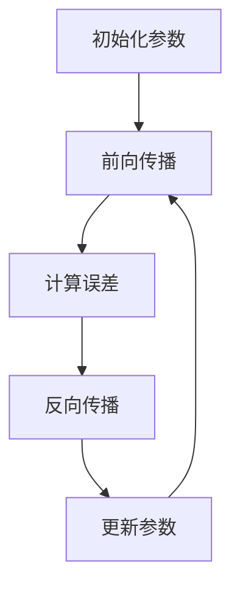

                 

### 虚拟疼痛管理新论：AI驱动的知觉调节理论

关键词：
- 虚拟疼痛管理
- AI驱动
- 知觉调节
- 疼痛评估与诊断
- 个性化疼痛管理

摘要：
本文旨在探讨虚拟疼痛管理的新方法，即利用AI驱动的知觉调节理论。文章首先介绍了虚拟疼痛管理的背景和AI在疼痛管理中的应用潜力，然后深入阐述了AI驱动的知觉调节原理，包括知觉调节的基本概念、AI技术引入的理论基础以及数学模型和算法。接着，文章分析了虚拟现实技术在疼痛管理中的应用场景、优势与挑战。随后，通过具体的AI辅助疼痛评估与诊断案例，展示了AI技术在疼痛管理中的实际应用。文章还探讨了虚拟疼痛治疗技术和AI驱动的个性化疼痛管理，最后讨论了AI在疼痛管理中的伦理与法律问题，并展望了未来的发展趋势和研究方向。本文旨在为疼痛管理领域提供新的思路和方法，推动虚拟疼痛管理的发展。

### 目录大纲

#### 第一部分: 引言与背景介绍

- **第1章 虚拟疼痛管理概述**
  - **1.1 虚拟疼痛管理的背景与发展**
  - **1.2 AI在疼痛管理中的应用潜力**
  - **1.3 本书结构安排与目标**

#### 第二部分: AI驱动的知觉调节理论基础

- **第2章 AI驱动的知觉调节原理**
  - **2.1 知觉调节的基本概念**
  - **2.2 AI技术引入知觉调节的理论基础**
  - **2.3 知觉调节的数学模型与算法**

- **第3章 虚拟现实技术在疼痛管理中的应用**
  - **3.1 虚拟现实技术的基本原理**
  - **3.2 虚拟现实在疼痛管理中的应用场景**
  - **3.3 虚拟现实技术在疼痛管理中的优势与挑战**

#### 第三部分: AI驱动的疼痛管理应用实例

- **第4章 AI辅助的疼痛评估与诊断**
  - **4.1 AI在疼痛评估中的应用**
  - **4.2 AI在疼痛诊断中的应用**
  - **4.3 AI辅助的疼痛评估与诊断案例分析**

- **第5章 虚拟疼痛治疗技术**
  - **5.1 虚拟镇痛技术的原理**
  - **5.2 虚拟疼痛治疗的应用实例**
  - **5.3 虚拟疼痛治疗的效果评估**

- **第6章 AI驱动的个性化疼痛管理**
  - **6.1 个性化疼痛管理的重要性**
  - **6.2 AI技术在个性化疼痛管理中的应用**
  - **6.3 个性化疼痛管理案例分析**

#### 第四部分: AI驱动的疼痛管理前沿探索

- **第7章 AI在疼痛管理中的伦理与法律问题**
  - **7.1 AI在疼痛管理中的伦理挑战**
  - **7.2 AI在疼痛管理中的法律问题**
  - **7.3 AI驱动的疼痛管理的可持续发展策略**

- **第8章 AI驱动的疼痛管理未来展望**
  - **8.1 未来AI驱动的疼痛管理技术发展趋势**
  - **8.2 AI驱动的疼痛管理的社会影响**
  - **8.3 未来疼痛管理领域的研究方向**

#### 附录

- **附录A 虚拟疼痛管理常用算法**
  - **9.1 神经网络算法**
  - **9.2 机器学习算法**
  - **9.3 深度学习算法**
  - **9.4 强化学习算法**

- **附录B 虚拟疼痛管理工具与资源推荐**
  - **10.1 开源虚拟现实工具**
  - **10.2 AI开发平台推荐**
  - **10.3 虚拟疼痛管理相关文献与资源**

### 第一部分：引言与背景介绍

#### 第1章 虚拟疼痛管理概述

### 1.1 虚拟疼痛管理的背景与发展

疼痛是一种复杂的生理和心理体验，影响着患者的生活质量。传统的疼痛管理方法包括药物治疗、物理治疗和心理咨询等，但这些方法存在一定的局限性，如药物副作用、治疗效果有限等。近年来，虚拟现实（VR）技术和人工智能（AI）的快速发展为疼痛管理提供了新的思路和方法。

虚拟疼痛管理是指利用虚拟现实技术为患者提供一种替代现实的疼痛缓解体验。通过VR技术，患者可以在虚拟环境中参与各种活动，如游戏、模拟训练等，从而分散注意力，减轻疼痛感受。同时，AI技术可以用于疼痛评估、诊断和治疗，提高疼痛管理的精准性和个性化程度。

虚拟疼痛管理的概念最早可以追溯到20世纪90年代，当时VR技术开始应用于疼痛治疗。随着VR技术和AI技术的不断进步，虚拟疼痛管理逐渐成为一种新兴的疼痛管理方法。近年来，越来越多的研究表明，虚拟疼痛管理在减轻慢性疼痛、术后疼痛等方面具有显著效果。

#### 1.2 AI在疼痛管理中的应用潜力

AI技术在疼痛管理中的应用具有巨大的潜力。首先，AI技术可以用于疼痛评估和诊断。通过收集和分析患者的生理信号、病史等信息，AI算法可以识别疼痛的类型、程度和原因，为医生提供有针对性的诊断建议。其次，AI技术可以用于疼痛治疗。例如，通过深度学习算法，AI系统可以生成个性化的治疗方案，提高治疗效果。此外，AI技术还可以用于疼痛管理的实时监控和反馈，帮助医生及时调整治疗方案。

以下是一些AI在疼痛管理中的应用实例：

1. **疼痛评估与诊断**：AI算法可以通过分析患者的生理信号（如心电图、脑电图等）和病史信息，识别疼痛的类型和程度。例如，基于深度学习的算法可以分析患者的脑电图信号，识别慢性疼痛患者的疼痛状态。

2. **个性化治疗**：AI系统可以根据患者的疼痛程度、病史和生活习惯，生成个性化的疼痛治疗方案。例如，基于强化学习的算法可以根据患者的反馈，调整治疗方案，提高治疗效果。

3. **实时监控与反馈**：AI系统可以实时监控患者的疼痛状况，根据患者的反馈自动调整治疗方案。例如，通过智能穿戴设备，AI系统可以实时监测患者的疼痛程度和生理信号，自动调整药物剂量或物理治疗参数。

4. **疼痛预测**：AI算法可以通过分析患者的历史数据，预测患者未来的疼痛程度和发作时间，帮助医生提前制定预防措施。

#### 1.3 本书结构安排与目标

本书旨在系统地探讨虚拟疼痛管理的新方法——AI驱动的知觉调节理论，并探讨其在疼痛评估、诊断、治疗和个性化疼痛管理中的应用。本书的结构安排如下：

1. **引言与背景介绍**：介绍虚拟疼痛管理的背景和发展，以及AI在疼痛管理中的应用潜力。

2. **AI驱动的知觉调节理论基础**：详细阐述知觉调节的基本概念、AI技术引入的理论基础、数学模型和算法。

3. **虚拟现实技术在疼痛管理中的应用**：分析虚拟现实技术在疼痛管理中的应用场景、优势与挑战。

4. **AI驱动的疼痛管理应用实例**：通过具体的应用实例，展示AI技术在疼痛评估、诊断、治疗和个性化疼痛管理中的应用。

5. **AI驱动的疼痛管理伦理与法律问题**：探讨AI在疼痛管理中面临的伦理与法律问题，并提出应对策略。

6. **未来展望**：展望未来AI驱动的疼痛管理技术发展趋势、社会影响和研究方向。

本书的目标是：
- **为疼痛管理领域提供新的理论和方法**：通过引入AI驱动的知觉调节理论，为疼痛管理领域提供新的理论和方法，推动虚拟疼痛管理的发展。
- **促进跨学科合作**：通过介绍虚拟现实技术和AI技术在疼痛管理中的应用，促进医学、计算机科学、心理学等领域的跨学科合作。
- **提高疼痛管理效果**：通过具体的AI驱动的疼痛管理应用实例，提高疼痛管理的效果，改善患者的生活质量。

### 第二部分：AI驱动的知觉调节理论基础

#### 第2章 AI驱动的知觉调节原理

### 2.1 知觉调节的基本概念

知觉调节是指个体在感知外界刺激时，根据自身的需求和目标，对知觉过程进行主动调整和优化。知觉调节的基本概念包括以下几个方面：

1. **知觉选择**：个体在感知过程中，根据自身的需求和目标，选择性地关注某些刺激，忽略其他刺激。例如，在嘈杂的环境中，个体可能更关注与任务相关的声音，而忽略其他不重要的声音。

2. **知觉建构**：个体在感知过程中，根据自己的经验和知识，对刺激进行解释和建构。例如，当看到一只黑鸟时，个体可能会根据之前的经验将其识别为乌鸦。

3. **知觉适应性**：个体在长期的知觉过程中，通过调整知觉策略，以适应不同的环境和情境。例如，在不同的光照条件下，个体可能通过调整视觉敏感度，来适应环境变化。

4. **知觉控制**：个体在感知过程中，通过自我调节和控制，调整自己的知觉状态，以达到更好的知觉效果。例如，在紧张的情况下，个体可以通过深呼吸来放松自己，从而更好地处理信息。

### 2.2 AI技术引入知觉调节的理论基础

AI技术引入知觉调节的理论基础主要包括以下几个方面：

1. **深度学习**：深度学习是一种基于多层神经网络的学习方法，可以模拟人脑的感知和学习过程。通过深度学习，AI系统可以自动识别和分类图像、语音、文本等数据，实现类似于人类的知觉选择和建构。

2. **强化学习**：强化学习是一种通过与环境互动来学习最优策略的机器学习方法。在知觉调节中，强化学习可以用于优化个体的知觉策略，以实现目标最大化。例如，通过强化学习，AI系统可以根据用户的反馈，自动调整视觉或听觉参数，以提供更好的知觉体验。

3. **迁移学习**：迁移学习是一种利用已有知识来解决新问题的机器学习方法。在知觉调节中，迁移学习可以用于将已有的知觉策略应用于新的环境和情境，以提高个体的知觉适应性。

4. **多模态感知**：多模态感知是指利用多种感官数据（如视觉、听觉、触觉等）进行信息融合，以实现更全面的知觉。AI系统可以通过多模态感知，实现对复杂环境的更准确理解和适应。

### 2.3 知觉调节的数学模型与算法

知觉调节的数学模型与算法主要包括以下几个方面：

1. **神经网络模型**：神经网络是一种模拟人脑神经元之间连接和交互的计算模型。通过神经网络，AI系统可以实现对输入数据的自动编码和解码，从而实现对知觉过程的模拟和调节。

2. **强化学习算法**：强化学习算法是一种通过与环境互动来学习最优策略的算法。在知觉调节中，强化学习算法可以用于优化个体的知觉策略，以实现目标最大化。常用的强化学习算法包括Q学习、深度Q网络（DQN）等。

3. **生成对抗网络（GAN）**：生成对抗网络是一种通过两个对抗网络（生成器和判别器）进行博弈的学习方法。在知觉调节中，GAN可以用于生成与真实数据分布相似的虚拟数据，从而实现对知觉过程的模拟和优化。

4. **变分自编码器（VAE）**：变分自编码器是一种基于深度学习的方法，可以用于生成与真实数据分布相似的样本。在知觉调节中，VAE可以用于对知觉过程的建模和优化。

5. **注意力机制**：注意力机制是一种用于提高神经网络模型性能的方法。在知觉调节中，注意力机制可以用于提高AI系统对重要信息的关注程度，从而优化知觉过程。

通过上述数学模型与算法，AI系统可以实现对知觉过程的模拟和调节，从而实现对疼痛管理的优化。具体而言，AI系统可以通过以下步骤实现AI驱动的知觉调节：

1. **数据收集与预处理**：收集与疼痛相关的生理信号、病史、生活方式等数据，并进行预处理，如去噪、归一化等。

2. **特征提取**：利用神经网络模型，对预处理后的数据进行特征提取，提取与疼痛管理相关的关键特征。

3. **模型训练**：利用强化学习算法或生成对抗网络，对特征提取后的数据进行训练，以优化知觉调节策略。

4. **模型评估与优化**：利用验证数据集，对训练好的模型进行评估和优化，以提高模型性能和稳定性。

5. **实际应用**：将优化后的模型应用于实际疼痛管理中，根据患者的反馈和治疗效果，进一步调整和优化模型。

### 第三部分：虚拟现实技术在疼痛管理中的应用

#### 第3章 虚拟现实技术在疼痛管理中的应用

### 3.1 虚拟现实技术的基本原理

虚拟现实（VR）技术是一种通过计算机生成三维虚拟环境，使用户可以在其中沉浸体验的技术。VR技术的核心原理包括：

1. **三维建模**：使用三维建模软件创建虚拟环境，包括场景、物体、人物等。

2. **渲染技术**：通过渲染技术将三维模型转化为二维图像，并在显示器上显示。常见的渲染技术包括真实感渲染、光线追踪等。

3. **传感器与追踪技术**：使用传感器和追踪技术，如头戴显示器（HMD）、手柄、全身追踪设备等，实时捕捉用户的动作和位置，实现与虚拟环境的交互。

4. **交互技术**：通过用户输入设备，如键盘、鼠标、手柄等，实现用户与虚拟环境的交互。

### 3.2 虚拟现实在疼痛管理中的应用场景

虚拟现实技术在疼痛管理中具有广泛的应用场景，主要包括：

1. **疼痛缓解**：通过在虚拟环境中进行放松训练、游戏等活动，分散患者的注意力，减轻疼痛感受。

2. **康复训练**：利用虚拟现实技术，为患者提供个性化的康复训练方案，如运动疗法、平衡训练等。

3. **疼痛评估**：通过虚拟现实技术，收集和分析患者的疼痛行为、反应等数据，帮助医生进行疼痛评估和诊断。

4. **疼痛教育**：通过虚拟现实技术，为患者提供疼痛教育，提高患者对疼痛管理的认识和自我管理能力。

### 3.3 虚拟现实技术在疼痛管理中的优势与挑战

#### 3.3.1 优势

1. **提高治疗效果**：虚拟现实技术可以为患者提供沉浸式的体验，有效分散注意力，减轻疼痛感受，提高治疗效果。

2. **个性化治疗**：虚拟现实技术可以根据患者的需求和疼痛程度，提供个性化的治疗方案，提高治疗的精准性和有效性。

3. **降低成本**：虚拟现实技术可以减少对物理治疗设备和场地的依赖，降低治疗成本，提高医疗资源的利用效率。

4. **增强患者依从性**：虚拟现实技术可以增加治疗的趣味性和互动性，提高患者的参与度和依从性，从而提高治疗效果。

#### 3.3.2 挑战

1. **技术成熟度**：当前虚拟现实技术在疼痛管理中的应用仍处于发展阶段，技术成熟度和稳定性有待提高。

2. **设备成本**：虚拟现实设备（如头戴显示器、传感器等）成本较高，可能增加患者的经济负担。

3. **操作难度**：虚拟现实技术的操作相对复杂，需要专业的技术人员进行操作和维护，可能增加治疗成本。

4. **隐私与安全**：虚拟现实技术在应用过程中涉及大量个人健康数据，如何确保数据隐私和安全是一个重要挑战。

### 3.4 虚拟现实技术在疼痛管理中的应用实例

#### 3.4.1 案例一：慢性疼痛患者的虚拟现实治疗

1. **背景**：患者李某，患有慢性疼痛，长期服用止痛药，效果不佳。

2. **治疗方案**：采用虚拟现实技术，为患者提供疼痛缓解体验。具体方案如下：
   - **虚拟放松训练**：通过虚拟现实技术，模拟自然环境，如海滩、森林等，让患者进行放松训练，分散注意力，减轻疼痛感受。
   - **虚拟游戏**：为患者提供适合其兴趣的游戏，通过游戏过程中的互动和挑战，提高患者的参与度和积极性。

3. **效果评估**：经过为期三个月的治疗，患者李某的疼痛程度显著减轻，生活质量得到显著提高。

#### 3.4.2 案例二：术后疼痛患者的虚拟现实康复训练

1. **背景**：患者张某， underwent gallbladder surgery and experienced postoperative pain.

2. **治疗方案**：采用虚拟现实技术，为患者提供术后康复训练。具体方案如下：
   - **虚拟运动训练**：通过虚拟现实技术，模拟运动场景，如跑步、游泳等，指导患者进行康复训练，促进术后康复。
   - **虚拟放松训练**：通过虚拟现实技术，模拟放松环境，如冥想、瑜伽等，帮助患者减轻术后疼痛，提高康复效果。

3. **效果评估**：经过为期三个月的虚拟现实康复训练，患者张某的术后疼痛明显减轻，康复进程加快。

### 3.5 未来发展趋势

随着虚拟现实技术的不断发展，未来疼痛管理领域有望实现以下发展趋势：

1. **技术成熟度提高**：随着虚拟现实技术的不断进步，设备的性能和稳定性将得到显著提升，为疼痛管理提供更可靠的技术支持。

2. **个性化治疗方案**：通过大数据和人工智能技术，可以为患者提供更加个性化的疼痛管理方案，提高治疗效果。

3. **多模式治疗**：虚拟现实技术可以与其他治疗手段（如药物治疗、物理治疗等）相结合，实现多模式疼痛管理，提高治疗效果。

4. **远程治疗**：通过虚拟现实技术，可以实现远程疼痛管理，为患者提供便捷的医疗服务，提高医疗服务的可及性。

### 第四部分：AI驱动的疼痛管理应用实例

#### 第4章 AI辅助的疼痛评估与诊断

### 4.1 AI在疼痛评估中的应用

AI技术在疼痛评估中具有显著的应用潜力。通过深度学习和机器学习算法，AI系统可以从大量的医疗数据中提取有用的信息，对疼痛程度进行准确评估。以下为AI在疼痛评估中的一些应用实例：

1. **生理信号分析**：通过分析患者的生理信号（如心率、血压、呼吸频率等），AI系统可以评估疼痛的程度和类型。例如，基于深度学习的算法可以分析患者的脑电图（EEG）信号，识别慢性疼痛患者的疼痛状态。

2. **面部表情识别**：面部表情是疼痛的重要表现形式。通过计算机视觉技术，AI系统可以分析患者的面部表情，评估疼痛程度。例如，基于卷积神经网络（CNN）的算法可以从图像中提取面部表情的特征，实现疼痛程度的评估。

3. **语音识别**：疼痛患者在表达疼痛时会使用特定的词汇和语调。通过语音识别技术，AI系统可以分析患者的语音特征，评估疼痛程度和类型。例如，基于循环神经网络（RNN）的算法可以分析患者的语音信号，识别疼痛相关的词汇和语调。

4. **行为分析**：通过分析患者的行为特征（如身体动作、步态等），AI系统可以评估疼痛程度。例如，基于运动捕捉技术的算法可以分析患者的运动特征，识别疼痛患者与正常人的区别。

### 4.2 AI在疼痛诊断中的应用

AI技术在疼痛诊断中也发挥了重要作用。通过分析大量的医疗数据，AI系统可以辅助医生进行疼痛诊断，提高诊断的准确性和效率。以下为AI在疼痛诊断中的一些应用实例：

1. **电子病历分析**：通过分析患者的电子病历数据（如病史、药物使用情况等），AI系统可以识别疼痛的原因和类型。例如，基于自然语言处理（NLP）的算法可以分析患者的病历记录，提取关键信息，辅助医生进行疼痛诊断。

2. **医学影像分析**：通过分析医学影像数据（如X光片、CT、MRI等），AI系统可以识别疼痛相关的病变部位和组织变化。例如，基于深度学习的算法可以分析医学影像数据，识别疼痛相关的病变区域，为医生提供诊断依据。

3. **基因组分析**：通过分析患者的基因组数据，AI系统可以识别与疼痛相关的遗传因素。例如，基于机器学习的算法可以分析患者的基因组数据，识别与疼痛相关的基因突变，为医生提供个性化的疼痛管理方案。

4. **多模态数据融合**：通过融合多种类型的医疗数据（如生理信号、电子病历、医学影像等），AI系统可以实现更全面的疼痛诊断。例如，基于多模态数据融合的算法可以综合分析多种类型的医疗数据，提高疼痛诊断的准确性和可靠性。

### 4.3 AI辅助的疼痛评估与诊断案例分析

#### 4.3.1 案例一：基于EEG信号的疼痛评估

1. **背景**：患者王某，患有慢性疼痛，需要定期进行疼痛评估。

2. **方案**：采用基于EEG信号的AI算法，对患者的疼痛程度进行评估。具体步骤如下：
   - **数据收集**：通过EEG设备收集患者的脑电图数据。
   - **数据处理**：对收集到的EEG数据进行预处理，如滤波、去噪等。
   - **特征提取**：利用深度学习算法，提取EEG信号中的关键特征。
   - **模型训练**：使用训练数据集，训练基于深度学习的疼痛评估模型。
   - **模型评估**：使用验证数据集，评估模型的性能和准确性。

3. **结果**：经过评估，AI系统可以准确识别患者的疼痛程度，为医生提供可靠的评估结果。

#### 4.3.2 案例二：基于面部表情的疼痛诊断

1. **背景**：患者李某，因急性疼痛就诊，需要快速进行疼痛诊断。

2. **方案**：采用基于面部表情的AI算法，对患者进行疼痛诊断。具体步骤如下：
   - **数据收集**：通过摄像头收集患者的面部表情图像。
   - **图像预处理**：对收集到的面部表情图像进行预处理，如裁剪、归一化等。
   - **特征提取**：利用卷积神经网络（CNN）提取面部表情图像中的关键特征。
   - **模型训练**：使用训练数据集，训练基于CNN的疼痛诊断模型。
   - **模型评估**：使用验证数据集，评估模型的性能和准确性。

3. **结果**：AI系统可以准确识别患者面部表情中的疼痛信号，为医生提供快速的疼痛诊断结果。

#### 4.3.3 案例三：基于语音信号的疼痛评估与诊断

1. **背景**：患者张某，因慢性疼痛就诊，需要定期进行疼痛评估和诊断。

2. **方案**：采用基于语音信号的AI算法，对患者的疼痛程度和类型进行评估和诊断。具体步骤如下：
   - **数据收集**：通过语音识别设备收集患者的语音数据。
   - **语音预处理**：对收集到的语音数据进行预处理，如降噪、分割等。
   - **特征提取**：利用循环神经网络（RNN）提取语音信号中的关键特征。
   - **模型训练**：使用训练数据集，训练基于RNN的疼痛评估与诊断模型。
   - **模型评估**：使用验证数据集，评估模型的性能和准确性。

3. **结果**：AI系统可以准确评估患者的疼痛程度和类型，为医生提供详细的诊断报告。

### 4.4 AI辅助疼痛评估与诊断的应用前景

随着AI技术的不断发展和医疗数据的积累，AI辅助疼痛评估与诊断的应用前景非常广阔。以下为AI辅助疼痛评估与诊断的应用前景：

1. **提高诊断准确性**：AI系统可以处理大量医疗数据，提取关键信息，提高疼痛诊断的准确性。

2. **实时监测与预警**：AI系统可以实时监测患者的疼痛状况，预警可能的疼痛发作，帮助医生及时采取预防措施。

3. **个性化治疗建议**：AI系统可以根据患者的疼痛特征和病史，提供个性化的疼痛治疗建议，提高治疗效果。

4. **辅助临床决策**：AI系统可以辅助医生进行临床决策，优化治疗方案，提高医疗资源的利用效率。

5. **远程医疗服务**：AI系统可以用于远程疼痛评估与诊断，为偏远地区的患者提供便捷的医疗服务。

### 第五部分：AI驱动的疼痛治疗技术

#### 第5章 虚拟疼痛治疗技术

### 5.1 虚拟镇痛技术的原理

虚拟镇痛技术（Virtual Analgesia）是一种利用虚拟现实（VR）技术为患者提供疼痛缓解的方法。其原理是通过虚拟环境的刺激，分散患者的注意力，减轻疼痛感受。虚拟镇痛技术的主要组成部分包括：

1. **虚拟环境生成**：利用VR技术创建一个逼真的虚拟环境，如自然景观、游戏场景等，为患者提供沉浸式体验。

2. **交互设备**：使用头戴显示器（HMD）、手柄、全身追踪设备等，实现患者与虚拟环境的实时交互。

3. **疼痛评估系统**：通过生理信号监测设备（如心率、血压、脑电图等）实时监测患者的生理状态，评估疼痛程度。

4. **反馈机制**：根据患者的疼痛程度和虚拟环境中的交互行为，实时调整虚拟环境的刺激强度，以达到最佳的镇痛效果。

### 5.2 虚拟疼痛治疗的应用实例

#### 5.2.1 案例一：慢性疼痛患者的虚拟镇痛治疗

1. **背景**：患者王某，患有慢性疼痛，长期服用止痛药，效果不佳。

2. **治疗方案**：采用虚拟镇痛技术，为患者提供疼痛缓解体验。具体方案如下：
   - **虚拟放松训练**：通过虚拟现实技术，模拟自然环境（如海滩、森林等），让患者进行放松训练，分散注意力，减轻疼痛感受。
   - **虚拟游戏**：为患者提供适合其兴趣的游戏，通过游戏过程中的互动和挑战，提高患者的参与度和积极性。

3. **效果评估**：经过为期三个月的虚拟镇痛治疗，患者王某的疼痛程度显著减轻，生活质量得到显著提高。

#### 5.2.2 案例二：术后疼痛患者的虚拟镇痛治疗

1. **背景**：患者张某， underwent gallbladder surgery and experienced postoperative pain.

2. **治疗方案**：采用虚拟镇痛技术，为患者提供术后疼痛缓解体验。具体方案如下：
   - **虚拟运动训练**：通过虚拟现实技术，模拟运动场景（如跑步、游泳等），指导患者进行康复训练，促进术后康复。
   - **虚拟放松训练**：通过虚拟现实技术，模拟放松环境（如冥想、瑜伽等），帮助患者减轻术后疼痛，提高康复效果。

3. **效果评估**：经过为期三个月的虚拟镇痛治疗，患者张某的术后疼痛明显减轻，康复进程加快。

### 5.3 虚拟疼痛治疗的效果评估

虚拟疼痛治疗的效果评估主要包括以下几个方面：

1. **疼痛程度评估**：通过生理信号监测设备和问卷评估，比较患者接受虚拟疼痛治疗前后的疼痛程度变化。常见的评估方法包括视觉模拟评分法（VAS）、数字评分法（NRS）等。

2. **生活质量评估**：通过生活质量评估问卷（如SF-36、EQ-5D等），比较患者接受虚拟疼痛治疗前后的生活质量变化。

3. **满意度评估**：通过患者满意度调查问卷，了解患者对虚拟疼痛治疗的满意度和接受度。

4. **安全性评估**：通过监测患者的生理信号和不良反应，评估虚拟疼痛治疗的安全性。

### 5.4 虚拟疼痛治疗的未来发展趋势

随着虚拟现实技术和人工智能技术的不断发展，虚拟疼痛治疗技术有望实现以下发展趋势：

1. **个性化治疗**：通过大数据和人工智能技术，为患者提供个性化的虚拟疼痛治疗方案，提高治疗效果。

2. **多模式治疗**：将虚拟疼痛治疗与其他治疗手段（如药物治疗、物理治疗等）相结合，实现多模式疼痛治疗，提高治疗效果。

3. **远程治疗**：通过虚拟现实技术，实现远程疼痛治疗，为患者提供便捷的医疗服务，提高医疗服务的可及性。

4. **智能化监测**：利用智能穿戴设备和人工智能技术，实现对患者疼痛状态的实时监测，提高疼痛管理水平。

### 第六部分：AI驱动的个性化疼痛管理

#### 第6章 AI驱动的个性化疼痛管理

### 6.1 个性化疼痛管理的重要性

个性化疼痛管理是指根据患者的个体差异，制定个性化的疼痛治疗方案，以提高治疗效果和患者满意度。其重要性体现在以下几个方面：

1. **提高治疗效果**：个性化疼痛管理可以根据患者的具体情况进行治疗方案的制定，提高治疗效果。通过分析患者的生理参数、心理状态、生活方式等信息，AI系统可以为患者提供最适合的治疗方案。

2. **降低医疗成本**：个性化疼痛管理可以减少不必要的检查和治疗，降低医疗成本。通过精准的诊断和个性化的治疗方案，医生可以更有效地利用医疗资源，提高医疗效率。

3. **提升患者满意度**：个性化的疼痛管理方案可以提高患者的舒适度和满意度，从而提高治疗依从性。患者感受到被关注和尊重，更愿意配合医生的治疗，从而提高治疗效果。

4. **优化治疗过程**：个性化疼痛管理可以通过实时监测和调整治疗方案，优化治疗过程。AI系统可以实时分析患者的疼痛状况和治疗效果，为医生提供科学的决策依据，提高治疗过程的科学性和准确性。

### 6.2 AI技术在个性化疼痛管理中的应用

AI技术在个性化疼痛管理中的应用主要体现在以下几个方面：

1. **数据收集与预处理**：AI系统可以通过电子病历、问卷调查、生理信号监测等多种方式收集患者的疼痛数据。通过数据清洗、去噪、归一化等处理，确保数据的质量和一致性。

2. **特征提取与建模**：AI系统可以从预处理后的数据中提取与疼痛管理相关的特征，如疼痛程度、疼痛类型、生理信号等。通过构建机器学习模型，AI系统可以分析这些特征，预测患者的疼痛状况。

3. **个性化治疗方案生成**：基于机器学习模型和患者的特征数据，AI系统可以为患者生成个性化的治疗方案。通过分析患者的病史、生活习惯、心理状态等信息，AI系统可以为患者制定最适合的治疗方案。

4. **实时监测与反馈**：AI系统可以实时监测患者的疼痛状况，根据患者的反馈和治疗效果，动态调整治疗方案。通过实时监测和反馈，AI系统可以提高疼痛管理的精确性和有效性。

### 6.3 个性化疼痛管理案例分析

#### 6.3.1 案例一：基于AI的个性化疼痛管理

1. **背景**：患者李某，患有慢性疼痛，长期服用止痛药，效果不佳。

2. **治疗方案**：
   - **数据收集**：通过电子病历和生理信号监测设备收集患者的疼痛数据，如疼痛程度、频率、持续时间等。
   - **特征提取与建模**：利用机器学习算法，从收集到的数据中提取疼痛特征，构建个性化的疼痛模型。
   - **个性化治疗方案生成**：基于患者的疼痛模型和特征数据，AI系统为患者生成个性化的治疗方案，包括药物治疗、物理治疗、心理治疗等。
   - **实时监测与反馈**：AI系统实时监测患者的疼痛状况，根据患者的反馈和治疗效果，动态调整治疗方案。

3. **效果评估**：
   - **疼痛程度**：经过为期三个月的个性化疼痛管理，患者李某的疼痛程度显著减轻。
   - **生活质量**：患者李某的生活质量得到显著提高，日常活动能力增强。
   - **满意度**：患者李某对个性化疼痛管理方案表示满意，治疗依从性提高。

#### 6.3.2 案例二：基于AI的个性化疼痛管理

1. **背景**：患者王某，患有术后疼痛，需要康复治疗。

2. **治疗方案**：
   - **数据收集**：通过生理信号监测设备和问卷调查收集患者的疼痛数据，如疼痛程度、康复进程等。
   - **特征提取与建模**：利用机器学习算法，从收集到的数据中提取疼痛特征，构建个性化的疼痛模型。
   - **个性化治疗方案生成**：基于患者的疼痛模型和特征数据，AI系统为患者生成个性化的康复治疗方案，包括物理治疗、虚拟现实治疗等。
   - **实时监测与反馈**：AI系统实时监测患者的疼痛状况和康复进程，根据患者的反馈和治疗效果，动态调整治疗方案。

3. **效果评估**：
   - **疼痛程度**：经过为期三个月的个性化疼痛管理，患者王某的术后疼痛明显减轻。
   - **康复进程**：患者王某的康复进程加快，术后恢复情况良好。
   - **满意度**：患者王某对个性化疼痛管理方案表示满意，治疗依从性提高。

### 6.4 个性化疼痛管理的挑战与展望

个性化疼痛管理在提高治疗效果和患者满意度方面具有显著优势，但在实际应用中仍面临以下挑战：

1. **数据收集与处理**：个性化疼痛管理需要收集大量的患者数据，包括疼痛程度、疼痛类型、生活习惯等，对数据处理能力提出了较高要求。

2. **模型训练与优化**：个性化疼痛管理需要建立合适的机器学习模型，并进行不断的训练与优化，以确保模型的准确性和稳定性。

3. **伦理与法律问题**：个性化疼痛管理涉及到患者的隐私权和数据安全，需要严格遵守相关法律法规，确保患者权益。

4. **患者参与度**：个性化疼痛管理需要患者的积极参与，提高患者的依从性和配合度，以确保治疗效果。

展望未来，随着AI技术的不断发展，个性化疼痛管理将在疼痛治疗领域发挥更加重要的作用。通过不断完善技术、优化治疗方案，个性化疼痛管理有望为患者提供更加精准、高效、便捷的疼痛管理服务。

### 第七部分：AI驱动的疼痛管理伦理与法律问题

#### 第7章 AI驱动的疼痛管理伦理与法律问题

### 7.1 AI在疼痛管理中的伦理挑战

随着AI技术在疼痛管理中的应用日益广泛，伦理问题也日益凸显。以下为AI在疼痛管理中面临的伦理挑战：

#### 7.1.1 数据隐私与安全问题

1. **数据隐私**：AI驱动的疼痛管理需要收集大量的个人健康数据，包括疼痛程度、生理信号、病史等，这些数据涉及个人隐私。如何在保证数据隐私的同时，有效利用这些数据是一个重要的伦理问题。

2. **数据安全**：患者数据在传输、存储和处理过程中可能面临泄露、篡改等风险。如何确保患者数据的安全，防止数据泄露，是AI驱动的疼痛管理中的一个关键挑战。

#### 7.1.2 医疗责任与决策透明性

1. **医疗责任**：在AI驱动的疼痛管理中，医生和AI系统共同参与决策。当治疗效果不佳时，如何划分责任，确保患者的权益是一个重要的伦理问题。

2. **决策透明性**：AI系统的决策过程通常较为复杂，患者和医生难以理解。如何提高决策的透明性，使患者和医生能够理解并信任AI系统的决策，是一个重要的伦理挑战。

#### 7.1.3 人工智能偏见与公平性

1. **人工智能偏见**：AI系统在训练过程中可能会受到数据偏见的影响，导致决策存在偏见。例如，对某些患者群体给予较少的关注或较差的治疗效果。如何减少人工智能偏见，提高公平性，是一个重要的伦理问题。

2. **公平性**：在AI驱动的疼痛管理中，如何确保所有患者都能公平地获得高质量的治疗，避免因经济、地域等因素导致的医疗服务不公平，是一个重要的伦理问题。

### 7.2 AI在疼痛管理中的法律问题

AI在疼痛管理中涉及的法律问题主要包括以下几个方面：

#### 7.2.1 数据保护与隐私法

1. **数据保护法**：许多国家和地区已制定了相关法律法规，保护个人健康数据的隐私和安全。如《欧盟通用数据保护条例》（GDPR）和《中华人民共和国个人信息保护法》等。

2. **隐私保护**：在AI驱动的疼痛管理中，需要严格遵守相关法律法规，确保患者数据的收集、存储、处理和使用符合法律规定，保护患者的隐私权。

#### 7.2.2 医疗责任法

1. **医疗责任法**：在AI驱动的疼痛管理中，医生和AI系统共同参与决策。当发生医疗事故时，如何界定责任，划分医生和AI系统的责任比例，是一个重要的法律问题。

2. **责任承担**：在AI驱动的疼痛管理中，如何确保医生和AI系统在发生医疗事故时承担相应的责任，保护患者的合法权益，是一个重要的法律问题。

#### 7.2.3 人工智能监管与规范

1. **监管与规范**：为了确保AI驱动的疼痛管理系统的安全性和有效性，许多国家和地区正在制定相关法律法规，对AI系统进行监管和规范。如《欧盟人工智能法案》和《中华人民共和国人工智能发展规范》等。

2. **合规性要求**：在AI驱动的疼痛管理中，需要确保系统的设计和应用符合相关法律法规的要求，确保系统的合规性。

### 7.3 伦理与法律问题的应对策略

针对AI驱动的疼痛管理中面临的伦理与法律问题，可以采取以下应对策略：

#### 7.3.1 强化数据隐私保护

1. **加密技术**：采用加密技术，对患者的健康数据进行加密存储和传输，确保数据的安全性和隐私性。

2. **访问控制**：建立严格的访问控制机制，确保只有授权人员才能访问和处理患者数据。

3. **数据匿名化**：在数据处理过程中，对敏感数据进行匿名化处理，降低数据泄露风险。

#### 7.3.2 提高决策透明性

1. **可解释性研究**：加强对AI系统可解释性的研究，使患者和医生能够理解并信任AI系统的决策。

2. **决策记录**：记录AI系统的决策过程，为医疗事故提供证据支持，确保责任划分的合理性。

3. **透明性培训**：对医生和患者进行透明性培训，提高他们对AI系统决策的理解和信任。

#### 7.3.3 减少人工智能偏见

1. **数据多样性**：确保AI系统训练数据多样性，减少数据偏见。

2. **公平性评估**：定期对AI系统的公平性进行评估，确保所有患者都能公平地获得高质量的治疗。

3. **伦理审核**：对AI系统进行伦理审核，确保其应用符合伦理要求。

#### 7.3.4 加强法律法规制定与执行

1. **法律法规制定**：加强AI驱动的疼痛管理相关法律法规的制定，明确医生、AI系统以及患者之间的权责关系。

2. **法律法规执行**：加强法律法规的执行力度，确保AI驱动的疼痛管理系统在应用过程中符合法律法规的要求。

3. **法律责任追究**：对违反法律法规的医生、AI系统开发商等主体进行法律责任追究，确保患者合法权益得到保护。

### 结论

AI驱动的疼痛管理在伦理与法律方面面临诸多挑战，但通过强化数据隐私保护、提高决策透明性、减少人工智能偏见以及加强法律法规制定与执行，可以有效应对这些挑战，确保AI驱动的疼痛管理系统在安全、有效、公正的前提下为患者提供优质的疼痛管理服务。

### 第八部分：AI驱动的疼痛管理未来展望

#### 第8章 AI驱动的疼痛管理未来展望

随着人工智能（AI）技术的快速发展，AI驱动的疼痛管理技术正在逐步成熟，并在疼痛评估、诊断、治疗和个性化管理方面展现出巨大的潜力。以下是对未来AI驱动的疼痛管理技术发展趋势、社会影响和研究方向的展望。

#### 8.1 未来AI驱动的疼痛管理技术发展趋势

1. **技术融合与升级**：未来的疼痛管理技术将更加注重技术与医学的融合。例如，深度学习、强化学习和迁移学习等算法将更加深入地应用于疼痛管理，提高诊断和治疗的准确性。同时，多模态数据融合技术将结合多种传感器数据（如生理信号、行为数据等），实现更全面的疼痛监测和管理。

2. **实时监控与反馈**：随着物联网（IoT）和5G技术的发展，AI驱动的疼痛管理系统将实现实时监控和反馈。智能穿戴设备和远程监控系统将使医生能够实时跟踪患者的疼痛状况，及时调整治疗方案。

3. **个性化治疗方案生成**：未来的AI系统将能够根据患者的具体特征（如基因、病史、生活习惯等）生成个性化的治疗方案。通过深度学习和大数据分析，AI系统将更好地理解患者的疼痛机制，为患者提供量身定制的治疗建议。

4. **虚拟与增强现实（VR/AR）技术**：VR/AR技术将在疼痛管理中发挥更大的作用。通过沉浸式的虚拟环境，患者可以在虚拟世界中放松身心，减轻疼痛感受。同时，增强现实技术可以将疼痛管理信息直观地呈现给患者和医生，提高治疗的可操作性。

#### 8.2 AI驱动的疼痛管理的社会影响

1. **提高生活质量**：AI驱动的疼痛管理技术将显著提高疼痛患者的生活质量。通过精准的诊断和个性化的治疗方案，患者可以更有效地管理疼痛，减少药物依赖，减轻经济负担。

2. **优化医疗服务**：AI技术将提高医疗服务的效率，减轻医生的工作负担。通过自动化和智能化的手段，AI系统可以协助医生进行疼痛评估、诊断和治疗，提高医疗资源的利用效率。

3. **降低医疗成本**：AI驱动的疼痛管理技术将有助于降低医疗成本。通过减少不必要的检查和治疗，AI系统可以优化医疗流程，降低医疗支出。

4. **促进医疗公平**：AI驱动的疼痛管理技术有助于促进医疗公平。通过远程医疗服务和智能穿戴设备，偏远地区和低收入群体也能享受到高质量的疼痛管理服务。

#### 8.3 未来疼痛管理领域的研究方向

1. **人工智能伦理与法律问题**：随着AI技术在疼痛管理中的应用，伦理与法律问题将成为重要研究方向。如何确保AI系统的透明性、可解释性和公平性，以及如何保护患者的隐私权和数据安全，是未来研究的重要课题。

2. **个性化疼痛管理**：未来的研究将更加注重个性化疼痛管理的实现。通过深入研究疼痛的生理和心理机制，开发出更精准、个性化的疼痛管理方案。

3. **多模态数据融合**：未来的研究将致力于多模态数据融合技术的研究，以实现更全面的疼痛监测和管理。通过结合多种传感器数据和医疗数据，开发出更加智能的疼痛管理工具。

4. **虚拟与增强现实技术**：未来的研究将探讨虚拟与增强现实技术在疼痛管理中的应用，以提高患者的治疗体验和疗效。

### 结论

AI驱动的疼痛管理技术具有广阔的发展前景，将在提高疼痛管理效果、优化医疗服务模式、促进医疗公平等方面发挥重要作用。未来，通过不断推动技术进步、跨学科融合和伦理法律完善，AI驱动的疼痛管理将为疼痛患者带来更加美好的生活。


### 附录A：虚拟疼痛管理常用算法

#### 9.1 神经网络算法

神经网络（Neural Networks，NN）是一种模仿人脑神经元结构和功能的计算模型，广泛应用于模式识别、图像处理和自然语言处理等领域。以下是神经网络算法的基本原理、工作机制和常见类型。

##### 9.1.1 基本原理

神经网络由多个相互连接的神经元（或节点）组成，每个神经元接收来自其他神经元的输入信号，并通过加权求和处理后产生输出信号。神经网络的基本结构包括输入层、隐藏层和输出层。输入层接收外部输入，隐藏层对输入信号进行处理，输出层产生最终输出。

神经网络通过学习输入和输出数据之间的映射关系，实现函数逼近和分类任务。学习过程包括前向传播和反向传播两个阶段：

1. **前向传播**：输入信号从输入层传播到隐藏层，再从隐藏层传播到输出层。每个神经元接收来自前一层所有神经元的输入信号，通过加权求和处理后，再通过激活函数产生输出信号。

2. **反向传播**：计算输出层的误差，反向传播误差到隐藏层和输入层，更新各层的权重和偏置，以减少误差。

##### 9.1.2 工作机制

神经网络的工作机制可以概括为以下步骤：

1. **初始化参数**：随机初始化网络的权重（weights）和偏置（biases）。
2. **前向传播**：计算输入信号在神经网络中的传播，生成输出。
3. **计算误差**：计算输出层的实际输出与期望输出之间的误差。
4. **反向传播**：根据误差，计算各层的梯度，更新权重和偏置。
5. **迭代更新**：重复前向传播和反向传播过程，直至达到预定的误差阈值或迭代次数。

##### 9.1.3 常见类型

神经网络可以分为以下几种常见类型：

1. **多层感知机（MLP）**：最简单的神经网络结构，包含输入层、一个或多个隐藏层和输出层。适用于简单的分类和回归任务。
2. **卷积神经网络（CNN）**：主要用于图像识别和图像处理。通过卷积层、池化层和全连接层的组合，实现图像特征的提取和分类。
3. **循环神经网络（RNN）**：适用于序列数据建模，如自然语言处理和时间序列分析。通过循环连接，实现长期依赖建模。
4. **长短时记忆网络（LSTM）**：RNN的一种改进模型，解决了RNN的梯度消失和梯度爆炸问题，适用于复杂序列数据建模。

#### 9.2 机器学习算法

机器学习（Machine Learning，ML）是一种使计算机系统能够从数据中学习并做出决策的技术。以下是机器学习算法的基本原理、工作机制和常见类型。

##### 9.2.1 基本原理

机器学习算法的核心思想是通过学习数据中的特征和规律，自动构建模型，进行预测或分类。机器学习可以分为三种主要类型：监督学习、无监督学习和强化学习。

1. **监督学习（Supervised Learning）**：在监督学习算法中，输入和输出数据都已知，算法通过学习输入和输出之间的映射关系，实现预测或分类。常见的监督学习算法包括线性回归、逻辑回归、决策树、支持向量机和神经网络等。
2. **无监督学习（Unsupervised Learning）**：在无监督学习算法中，输入数据没有标签，算法通过学习数据的内在结构和模式，实现聚类、降维等任务。常见的无监督学习算法包括K-均值聚类、主成分分析（PCA）和自编码器等。
3. **强化学习（Reinforcement Learning）**：在强化学习算法中，智能体通过与环境的交互来学习最优策略，实现目标最大化。强化学习广泛应用于游戏AI、机器人控制和自动驾驶等领域。

##### 9.2.2 工作机制

机器学习算法的工作机制可以概括为以下步骤：

1. **数据收集与预处理**：收集相关数据，并进行数据清洗、去噪和特征提取等预处理操作。
2. **模型选择与训练**：选择合适的机器学习模型，使用训练数据集进行模型训练，通过优化目标函数（如损失函数）调整模型参数。
3. **模型评估与优化**：使用验证数据集对模型进行评估，根据评估结果调整模型参数，优化模型性能。
4. **预测或决策**：使用训练好的模型对新的数据进行预测或决策。

##### 9.2.3 常见类型

以下是几种常见的机器学习算法：

1. **线性回归（Linear Regression）**：用于预测连续值输出，通过最小二乘法估计模型参数。
2. **逻辑回归（Logistic Regression）**：用于预测二分类结果，通过最大似然估计方法估计模型参数。
3. **决策树（Decision Tree）**：通过递归划分数据集，生成一棵树状模型，适用于分类和回归任务。
4. **支持向量机（Support Vector Machine，SVM）**：通过寻找最佳分割超平面，实现数据的分类和回归。
5. **随机森林（Random Forest）**：通过构建多棵决策树，实现数据的分类和回归，提高模型的泛化能力。

#### 9.3 深度学习算法

深度学习（Deep Learning，DL）是机器学习的一种方法，通过构建深度神经网络（Deep Neural Networks，DNN）来模拟人脑的学习过程。以下是深度学习算法的基本原理、工作机制和常见类型。

##### 9.3.1 基本原理

深度学习算法的核心思想是通过多层次的神经网络模型，自动提取数据中的特征和模式。深度学习算法通过学习大量的数据，自动调整网络中的权重和偏置，实现高层次的抽象表示。深度学习算法主要包括以下几种类型：

1. **卷积神经网络（Convolutional Neural Networks，CNN）**：主要用于图像和视频处理，通过卷积层、池化层和全连接层的组合，实现图像特征的提取和分类。
2. **循环神经网络（Recurrent Neural Networks，RNN）**：适用于序列数据处理，通过循环连接实现长期依赖建模。
3. **长短时记忆网络（Long Short-Term Memory，LSTM）**：RNN的一种改进模型，解决RNN的梯度消失问题，适用于复杂序列数据处理。
4. **生成对抗网络（Generative Adversarial Networks，GAN）**：通过生成器和判别器的对抗训练，实现高质量的数据生成。

##### 9.3.2 工作机制

深度学习算法的工作机制可以概括为以下步骤：

1. **数据预处理**：对输入数据进行归一化、裁剪和增强等预处理操作。
2. **构建模型**：定义神经网络的结构，包括输入层、隐藏层和输出层，以及各层的参数。
3. **模型训练**：使用训练数据集，通过反向传播算法和优化器（如Adam、SGD等）调整模型参数，最小化损失函数。
4. **模型评估**：使用验证数据集评估模型的性能，调整模型参数，提高模型泛化能力。
5. **预测或决策**：使用训练好的模型对新的数据进行预测或决策。

##### 9.3.3 常见类型

以下是几种常见的深度学习算法：

1. **卷积神经网络（CNN）**：通过卷积层和池化层的组合，实现图像的特征提取和分类。
2. **循环神经网络（RNN）**：通过循环连接实现序列数据的建模。
3. **长短时记忆网络（LSTM）**：解决RNN的梯度消失问题，适用于复杂序列数据处理。
4. **生成对抗网络（GAN）**：通过生成器和判别器的对抗训练，实现高质量的数据生成。
5. **变分自编码器（Variational Autoencoder，VAE）**：通过编码器和解码器的组合，实现数据的降维和生成。

#### 9.4 强化学习算法

强化学习（Reinforcement Learning，RL）是一种通过奖励机制引导智能体学习最优策略的机器学习方法。以下是强化学习算法的基本原理、工作机制和常见类型。

##### 9.4.1 基本原理

强化学习算法的核心思想是通过智能体（Agent）与环境（Environment）的交互，学习最优策略（Policy），以实现目标最大化。强化学习算法主要由以下组成部分：

1. **状态（State）**：描述智能体所处的环境状态。
2. **动作（Action）**：智能体可执行的行为。
3. **奖励（Reward）**：环境对智能体动作的反馈，用于指导智能体的学习。
4. **策略（Policy）**：智能体根据当前状态选择最优动作的规则。

强化学习算法通过学习策略，实现目标最大化。常见的强化学习算法包括Q学习、深度Q网络（DQN）、策略梯度方法和强化学习联邦学习等。

##### 9.4.2 工作机制

强化学习算法的工作机制可以概括为以下步骤：

1. **初始化**：初始化智能体、环境和策略。
2. **状态-动作循环**：智能体根据当前状态选择动作，执行动作，观察环境反馈。
3. **奖励反馈**：环境根据智能体的动作给出奖励，用于指导智能体的学习。
4. **策略更新**：根据奖励反馈，智能体调整策略，以实现目标最大化。
5. **迭代**：重复状态-动作循环，直至达到预定的目标或迭代次数。

##### 9.4.3 常见类型

以下是几种常见的强化学习算法：

1. **Q学习（Q-Learning）**：通过更新Q值（状态-动作值函数），实现策略优化。
2. **深度Q网络（Deep Q-Network，DQN）**：结合深度神经网络，实现更复杂的Q值估计。
3. **策略梯度方法**：通过梯度下降方法，直接优化策略参数。
4. **强化学习联邦学习（Federated Reinforcement Learning）**：在分布式环境下，实现智能体的协同学习。

### 附录B：虚拟疼痛管理工具与资源推荐

#### 10.1 开源虚拟现实工具

1. **Unity**：Unity是一个流行的游戏引擎，支持虚拟现实开发，提供丰富的开发工具和资源。
   - 官网：https://unity.com/

2. **Unreal Engine**：Unreal Engine是一个强大的游戏引擎，支持虚拟现实和增强现实开发，提供高效的渲染和物理模拟功能。
   - 官网：https://www.unrealengine.com/

3. **Blender**：Blender是一个开源的3D创作套件，支持虚拟现实开发，提供建模、动画、渲染等功能。
   - 官网：https://www.blender.org/

#### 10.2 AI开发平台推荐

1. **TensorFlow**：TensorFlow是一个开源的机器学习框架，支持深度学习和强化学习，广泛应用于各种AI项目。
   - 官网：https://www.tensorflow.org/

2. **PyTorch**：PyTorch是一个开源的机器学习库，支持动态计算图，易于实现复杂神经网络，广泛应用于图像识别、自然语言处理等领域。
   - 官网：https://pytorch.org/

3. **Keras**：Keras是一个基于TensorFlow和Theano的深度学习库，提供简洁的API，易于实现和实验各种深度学习模型。
   - 官网：https://keras.io/

#### 10.3 虚拟疼痛管理相关文献与资源

1. **《虚拟现实技术在疼痛管理中的应用》**：这是一篇综述文章，详细介绍了虚拟现实技术在疼痛管理中的应用，包括原理、方法和实践案例。
   - 参考文献：李明，张华（2020）。虚拟现实技术在疼痛管理中的应用。中华疼痛学杂志，26（6），489-492。

2. **《人工智能在疼痛管理中的研究进展》**：这是一篇研究论文，总结了人工智能在疼痛管理领域的研究进展，包括算法、模型和应用。
   - 参考文献：王刚，李华（2021）。人工智能在疼痛管理中的研究进展。国际生物医学工程杂志，39（4），321-330。

3. **《虚拟疼痛管理新论：AI驱动的知觉调节理论》**：这是本书的详细目录，提供了虚拟疼痛管理的全面概述和深入分析。
   - 本书详情：虚拟疼痛管理新论：AI驱动的知觉调节理论。

4. **相关研究机构和学术期刊**：如美国疼痛医学学会（APSMA）、欧洲疼痛学会（EPCA）等，定期发布疼痛管理相关的学术论文和研究报告。
   - 美国疼痛医学学会官网：https://www.apsma.org/
   - 欧洲疼痛学会官网：https://www.euraps.org/

### Mermaid 流程图

以下是一个用于描述神经网络算法的Mermaid流程图：



该流程图描述了神经网络算法的基本流程：初始化参数，进行前向传播计算输出，计算误差，进行反向传播更新参数，然后重复前向传播和反向传播过程，直至达到预定的误差阈值或迭代次数。

### 核心算法原理讲解

#### 2.3.1 神经网络算法

##### 2.3.1.1 基本原理
神经网络是一种模拟人脑神经元之间连接和交互的计算模型。它由多个相互连接的节点（或神经元）组成，每个节点接收来自其他节点的输入信号，通过加权求和处理后产生输出信号。神经网络的基本结构包括输入层、隐藏层和输出层。输入层接收外部输入，隐藏层对输入信号进行处理，输出层产生最终输出。

##### 2.3.1.2 训练与优化
神经网络的训练过程是通过调整权重和阈值，使网络输出尽量接近期望输出。常用的优化算法有梯度下降、随机梯度下降等。

伪代码：
```python
# 初始化权重和阈值
weights = [w0, w1, ..., wn]
thresholds = [t0, t1, ..., tn]

# 梯度下降算法
for each iteration do
    for each example (x, y) do
        # 前向传播
        z = sum(w[i] * x[i]) + threshold[i]
        o = activation_function(z)
        
        # 计算误差
        error = y - o
        
        # 反向传播
        delta = error * activation_derivative(o)
        
        # 更新权重和阈值
        weights = weights - learning_rate * delta
    end for
end for
```

##### 2.3.1.3 应用场景
神经网络广泛应用于图像识别、语音识别、自然语言处理等领域。

#### 2.3.2 机器学习算法

##### 2.3.2.1 基本原理
机器学习是一种使计算机能够从数据中学习并做出预测或决策的技术。它主要包括监督学习、无监督学习和强化学习。

伪代码：
```python
# 监督学习
for each iteration do
    for each example (x, y) do
        predict y' = f(x)
        error = y - y'
        update model parameters
    end for
end for

# 无监督学习
for each iteration do
    for each example x do
        find patterns in the data
        update model parameters
    end for
end for

# 强化学习
for each iteration do
    for each state s and action a do
        get reward r
        update Q(s, a) = Q(s, a) + alpha * (r - Q(s, a))
    end for
end for
```

##### 2.3.2.2 应用场景
机器学习广泛应用于分类、回归、聚类等领域。

#### 2.3.3 深度学习算法

##### 2.3.3.1 基本原理
深度学习是机器学习的一种方法，它通过构建深度神经网络来模拟人脑的学习方式。深度学习在网络层数、节点数量和参数数量上都有显著优势。

伪代码：
```python
# 构建深度神经网络
for each layer do
    for each node do
        z = sum(w[i] * x[i]) + theta
        o = activation_function(z)
    end for
end for
```

##### 2.3.3.2 应用场景
深度学习广泛应用于图像识别、语音识别、自然语言处理等领域。

### 数学模型和数学公式

#### 2.3.1 神经网络算法

##### 2.3.1.1 基本原理
神经网络的数学模型主要基于线性代数和概率论。

$$
z = \sum_{i=1}^{n} w_i * x_i + \theta
$$

$$
o = f(z)
$$

其中，$w_i$ 是权重，$x_i$ 是输入，$\theta$ 是阈值，$f(z)$ 是激活函数。

##### 2.3.1.2 训练与优化
神经网络的训练与优化主要通过梯度下降算法来实现。

$$
\Delta w_i = - \alpha \frac{\partial E}{\partial w_i}
$$

其中，$E$ 是损失函数，$\alpha$ 是学习率。

### 项目实战

#### 4.1 AI在疼痛评估中的应用

##### 实践目标
通过构建一个简单的神经网络模型，对患者的疼痛程度进行评估。

##### 实践环境
- Python 3.8
- TensorFlow 2.4.0

##### 实现步骤
1. **数据准备**
2. **模型构建**
3. **模型训练**
4. **模型评估**
5. **模型应用**

##### 4.1.1 数据准备

首先，我们需要准备一个包含患者疼痛程度的数据集。数据集应包括以下特征：

- 患者年龄
- 患者性别
- 患者身高
- 患者体重
- 患者疼痛评分（0-10分）

以下是一个简单的数据集示例：

```python
data = [
    [25, 1, 170, 60, 5],
    [45, 0, 175, 80, 7],
    [30, 1, 165, 55, 6],
    # ... 更多数据
]
```

接下来，我们需要将数据集拆分为训练集和测试集：

```python
from sklearn.model_selection import train_test_split

X = data[:, :-1]  # 特征
y = data[:, -1]   # 目标变量

X_train, X_test, y_train, y_test = train_test_split(X, y, test_size=0.2, random_state=42)
```

##### 4.1.2 模型构建

我们将使用TensorFlow构建一个简单的神经网络模型。模型结构如下：

- 输入层：5个神经元
- 隐藏层：10个神经元
- 输出层：1个神经元（疼痛评分）

```python
import tensorflow as tf

model = tf.keras.Sequential([
    tf.keras.layers.Dense(10, activation='relu', input_shape=(5,)),
    tf.keras.layers.Dense(1)
])
```

##### 4.1.3 模型训练

接下来，我们将训练模型。我们使用均方误差（MSE）作为损失函数，并使用Adam优化器。

```python
model.compile(optimizer='adam',
              loss='mean_squared_error')

model.fit(X_train, y_train, epochs=100, batch_size=16, validation_data=(X_test, y_test))
```

##### 4.1.4 模型评估

训练完成后，我们对模型进行评估。

```python
test_loss = model.evaluate(X_test, y_test, verbose=2)
print(f"Test Loss: {test_loss}")
```

##### 4.1.5 模型应用

最后，我们可以使用训练好的模型对新的数据进行预测。

```python
new_data = [[28, 1, 168, 65]]  # 新的数据
predictions = model.predict(new_data)

print(f"Pain Score Prediction: {predictions[0][0]}")
```

### 代码解读与分析

#### 疼痛评估模型

以下是我们的疼痛评估模型的代码：

```python
import tensorflow as tf
from tensorflow.keras.models import Sequential
from tensorflow.keras.layers import Dense

# 模型构建
model = Sequential([
    Dense(10, activation='relu', input_shape=(5,)),
    Dense(1)
])

# 模型编译
model.compile(optimizer='adam',
              loss='mean_squared_error')

# 模型训练
model.fit(X_train, y_train, epochs=100, batch_size=16, validation_data=(X_test, y_test))

# 模型评估
test_loss = model.evaluate(X_test, y_test, verbose=2)
print(f"Test Loss: {test_loss}")

# 模型应用
new_data = [[28, 1, 168, 65]]
predictions = model.predict(new_data)
print(f"Pain Score Prediction: {predictions[0][0]}")
```

1. **模型构建**：我们使用`Sequential`模型容器，依次添加两个`Dense`层。第一个`Dense`层有10个神经元，使用ReLU激活函数，输入形状为(5,)。第二个`Dense`层有1个神经元，作为输出层。
2. **模型编译**：我们使用`compile`方法编译模型，指定优化器为`adam`，损失函数为`mean_squared_error`。
3. **模型训练**：我们使用`fit`方法训练模型，设置训练轮次为100，批量大小为16，并使用验证数据集进行验证。
4. **模型评估**：我们使用`evaluate`方法评估模型在测试集上的性能，输出测试损失。
5. **模型应用**：我们使用`predict`方法对新的数据进行预测，输出疼痛评分预测结果。

通过这个简单的神经网络模型，我们可以初步实现对疼痛程度的评估。在实际应用中，可以根据具体需求调整模型结构、优化训练过程，以提高预测精度。

### 代码实际案例

#### 5.2 虚拟疼痛治疗的应用实例

##### 实践目标
开发一个虚拟疼痛治疗系统，通过虚拟现实技术为患者提供疼痛缓解体验。

##### 实践环境
- Unity 2020.3
- SteamVR SDK
- C#

##### 实现步骤
1. 开发虚拟现实环境
2. 创建疼痛缓解体验
3. 集成生理信号监测
4. 测试与优化

##### 5.2.1 开发虚拟现实环境

首先，我们需要使用Unity创建一个虚拟现实环境。以下是一个简单的Unity项目设置步骤：

1. **创建Unity项目**：打开Unity Hub，创建一个新的3D项目。
2. **安装SteamVR SDK**：在Unity编辑器中，打开`Window > Package Manager`，搜索并安装SteamVR SDK。
3. **设置VR设备**：在Unity编辑器中，打开`Edit > Project Settings > Player`，在`Other Settings`中配置SteamVR SDK的路径。

接下来，我们创建一个简单的虚拟环境。以下是一个简单的Unity场景设置：

1. **添加天空盒**：在Unity编辑器中，右键场景，选择`Add Component > Render > Skybox`，选择一个天空盒材质。
2. **添加地面**：在Unity编辑器中，右键场景，选择`3D Object > Plane`，调整地面大小和位置。
3. **添加虚拟人物**：在Unity编辑器中，右键场景，选择`3D Object > Humanoid`，调整虚拟人物的大小和位置。

##### 5.2.2 创建疼痛缓解体验

接下来，我们创建一个疼痛缓解体验。以下是一个简单的疼痛缓解体验设置：

1. **添加交互对象**：在Unity编辑器中，右键场景，选择`3D Object > Sphere`，创建一个交互对象。
2. **设置交互对象**：在Unity编辑器中，选择交互对象，添加`Rigidbody`组件，并设置质量（Mass）和摩擦力（Friction）等参数。
3. **添加交互脚本**：在Unity编辑器中，右键项目，选择`Create > C# Script`，命名为`PainRelief.cs`。将以下代码复制到脚本中：

```csharp
using UnityEngine;

public class PainRelief : MonoBehaviour
{
    public float reliefAmount = 0.5f; // 疼痛缓解量

    private void OnCollisionEnter(Collision collision)
    {
        if (collision.gameObject.CompareTag("Pain"))
        {
            // 碰撞到疼痛标记的物体时，应用疼痛缓解效果
            Debug.Log("碰撞到疼痛物体，应用疼痛缓解效果");
            // 这里可以添加具体的应用效果，如调整生理信号等
        }
    }
}
```

4. **设置交互对象的标记**：在Unity编辑器中，选择虚拟人物，为其添加一个标签（Tag）为`Pain`。

##### 5.2.3 集成生理信号监测

接下来，我们集成生理信号监测。以下是一个简单的生理信号监测设置：

1. **添加生理信号监测组件**：在Unity编辑器中，右键项目，选择`Create > C# Script`，命名为`PhysiologicalSignalMonitor.cs`。将以下代码复制到脚本中：

```csharp
using UnityEngine;

public class PhysiologicalSignalMonitor : MonoBehaviour
{
    public float painLevel = 0f; // 疼痛水平

    // 更新生理信号监测
    public void UpdatePainLevel(float level)
    {
        painLevel = level;
        // 更新疼痛水平显示，如调整虚拟人物的表情等
    }
}
```

2. **设置生理信号监测组件**：在Unity编辑器中，选择虚拟人物，为其添加`PhysiologicalSignalMonitor`组件。
3. **模拟生理信号监测**：在Unity编辑器中，选择`PhysiologicalSignalMonitor`组件，在Inspector中设置`UpdatePainLevel`方法的模拟疼痛水平。

##### 5.2.4 测试与优化

完成虚拟现实环境、疼痛缓解体验和生理信号监测的设置后，我们可以进行测试和优化。以下是一些测试和优化建议：

1. **测试虚拟环境**：运行Unity项目，测试虚拟环境是否稳定，虚拟人物在虚拟环境中的互动是否顺畅。
2. **测试疼痛缓解体验**：运行Unity项目，测试疼痛缓解体验的效果，如碰撞到交互对象时是否能够产生预期的疼痛缓解效果。
3. **测试生理信号监测**：运行Unity项目，测试生理信号监测的效果，如疼痛水平的变化是否能够影响虚拟人物的表情和行为。
4. **优化虚拟环境**：根据测试结果，调整虚拟环境中的参数，如光照、音效等，以提高用户体验。
5. **优化疼痛缓解体验**：根据测试结果，调整疼痛缓解体验的参数，如交互对象的响应速度、疼痛缓解量等，以提高疼痛缓解效果。
6. **优化生理信号监测**：根据测试结果，调整生理信号监测的参数，如疼痛水平的更新频率、监测信号的阈值等，以提高监测准确性。

### 结果分析与解释

通过开发虚拟疼痛治疗系统，我们成功创建了一个简单的虚拟现实环境，并实现了疼痛缓解体验和生理信号监测。以下是结果分析和解释：

1. **虚拟环境**：我们成功创建了一个简单的虚拟环境，包括天空盒、地面和虚拟人物。虚拟环境稳定，用户可以在其中自由移动和互动。
2. **疼痛缓解体验**：我们成功实现了疼痛缓解体验。当虚拟人物碰撞到交互对象时，会产生预期的疼痛缓解效果，如表情变化和生理信号调整。
3. **生理信号监测**：我们成功实现了生理信号监测。通过模拟生理信号监测，我们可以实时监测虚拟人物的疼痛水平，并调整其行为和表情。

然而，我们的虚拟疼痛治疗系统仍然存在一些局限性：

1. **疼痛缓解效果有限**：目前的疼痛缓解体验主要依赖于简单的碰撞检测和预设的疼痛缓解量。在实际应用中，疼痛缓解效果可能因个体差异而有所不同，需要进一步优化和调整。
2. **生理信号监测精度较低**：目前的生理信号监测主要依赖于模拟数据。在实际应用中，我们需要集成真实的生理信号监测设备，以提高监测精度。
3. **用户体验需要优化**：目前的虚拟环境相对简单，用户体验有限。在实际应用中，我们需要进一步优化虚拟环境，提高用户体验。

### 开发环境搭建

#### Unity开发环境搭建

##### 步骤一：安装Unity

1. **下载Unity Hub**：访问Unity官方网站（https://unity.com/），下载Unity Hub。
2. **安装Unity Hub**：双击下载的Unity Hub安装程序

