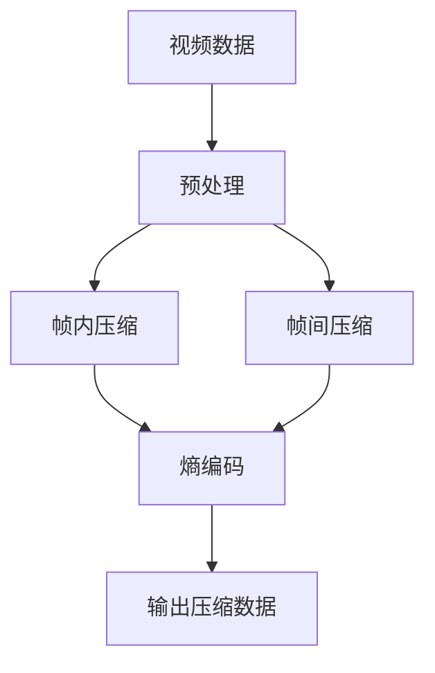

                 

# 文章标题：视频数据的压缩与细分技术解析

> 关键词：视频压缩，细分技术，H.264，HEVC，帧内压缩，帧间压缩，流媒体传输，实时视频压缩系统，视频内容安全，超高清视频压缩，AI技术在视频压缩中的应用

> 摘要：本文将深入解析视频数据压缩与细分技术的核心概念、原理、高级应用以及未来发展趋势和挑战。通过系统的讲解和案例分析，读者可以全面了解视频压缩与细分技术的关键技术和实际应用，为从事相关领域的研究和实践提供有价值的参考。

## 第一部分：基础概念与背景

### 第1章：视频数据概述与压缩的重要性

#### 1.1 视频数据的基础概念

视频数据是多媒体信息的重要组成部分，它通过一系列连续的图像帧来模拟现实世界的动态景象。一个视频文件通常包含图像、音频和字幕等多媒体数据。图像帧是视频数据的基本组成单元，每帧图像通过像素点来表示，像素点的颜色和亮度信息以一定的格式编码存储。

#### 1.2 视频数据压缩的必要性

视频数据具有高数据量特性，未经压缩的视频数据文件非常庞大。例如，一个高清（1080p）视频文件的容量可能达到每秒几百兆字节。这样的数据量对于存储、传输和处理都带来了巨大的挑战。因此，视频数据压缩技术显得尤为重要。

视频数据压缩的主要目标是在保证视频质量的前提下，减小数据体积，提高存储和传输效率。同时，压缩技术还可以降低处理复杂度，使得视频处理和应用更为高效。

#### 1.3 视频压缩技术的发展历程

视频压缩技术的发展经历了多个阶段，从最初的简单压缩方法，到如今的高效压缩算法，不断推动着视频数据处理的进步。

- **早期方法**：如逐帧编码，将每一帧图像独立压缩。
- **基本压缩方法**：如差分编码，利用前后帧之间的相似性进行压缩。
- **现代压缩标准**：如H.264/AVC，HEVC/H.265等，通过复杂的算法提高压缩效率。

随着技术的进步，视频压缩技术逐渐走向高效、智能和多样化，满足不同场景下的需求。

### 第2章：视频压缩技术原理

#### 2.1 视频压缩技术分类

视频压缩技术主要分为帧内压缩和帧间压缩两种方法。

- **帧内压缩**：对每一帧图像进行独立压缩，不考虑与前后帧的关系。
- **帧间压缩**：利用前后帧之间的差异进行压缩，可以大大减小数据量。

#### 2.2 视频信号的表示方法

视频信号通常采用YUV颜色模型进行表示，包括亮度（Y）和两个色度分量（U和V）。这种表示方法能够更好地适应人眼的视觉特性，提高压缩效率。

#### 2.3 视频压缩中的时间域与空域变换

时间域变换包括帧内变换和帧间变换，常用的方法有离散余弦变换（DCT）和离散小波变换（DWT）。空域变换则包括像素点在空间上的操作，如预测编码和插值操作。

#### 2.4 视频压缩中的信息熵与编码理论

信息熵是衡量信息量的基本指标。在视频压缩中，通过熵编码（如霍夫曼编码和算术编码）进一步减小数据量。熵编码利用了视频数据中的统计特性，使得频繁出现的符号用短编码表示，不频繁的符号用长编码表示。

#### 2.5 视频压缩标准简介

目前主流的视频压缩标准包括H.264/AVC，HEVC/H.265，VP9和AV1等。这些标准在压缩效率、兼容性和应用场景上各有特点。

- **H.264/AVC**：广泛应用于高清视频传输，压缩效率较高，但计算复杂度较高。
- **HEVC/H.265**：支持4K和8K视频，压缩效率进一步提升，但计算复杂度更高。
- **VP9**：Google开发的开放标准，旨在提供高效的免费视频压缩方案。
- **AV1**：由Netflix等公司推动的开放标准，旨在提供高效的视频压缩解决方案，具有很好的兼容性和扩展性。

#### 2.5.1 H.264/AVC

H.264/AVC（高级视频编码）是ITU和ISO共同推出的视频编码标准，广泛应用于高清视频传输。其主要特点如下：

- **帧内压缩**：采用DCT变换和量化操作，对每一帧图像进行独立压缩。
- **帧间压缩**：通过运动估计和补偿，利用前后帧之间的差异进行压缩。

H.264/AVC的伪代码示例：

```plaintext
function H264_AVC_Compression(video_frame):
    # 对视频帧进行DCT变换
    DCT	TransformFrame(video_frame)

    # 进行量化操作
    Quantize(DCT)

    # 进行熵编码
    EntropyCoding(QuantizedDCT)

    return EntropyEncodedFrame
```

#### 2.5.2 HEVC/H.265

HEVC/H.265（高效视频编码）是ITU和ISO推出的新一代视频编码标准，旨在提供更高的压缩效率和更好的质量。其主要特点如下：

- **帧内压缩**：采用更高效的DCT变换和量化操作。
- **帧间压缩**：引入了新的预测模式和优化算法，如多参考帧和自适应预测。

HEVC/H.265的伪代码示例：

```plaintext
function HEVC_H265_Compression(video_frame, reference_frames):
    # 进行多参考帧运动估计
    MotionEstimation(video_frame, reference_frames)

    # 进行预测补偿
    PredictionCompensation(video_frame)

    # 进行DCT变换和量化操作
    DCT	Quantize(TransformFrame(video_frame))

    # 进行熵编码
    EntropyCoding(QuantizedDCT)

    return EntropyEncodedFrame
```

#### 2.5.3 VP9

VP9是由Google开发的视频编码标准，具有高效和免费的特点。其主要特点如下：

- **帧内压缩**：采用新的变换和量化算法，提高了压缩效率。
- **帧间压缩**：引入了新的预测模式和优化算法，如自适应块大小和帧内模式。

VP9的伪代码示例：

```plaintext
function VP9_Compression(video_frame, reference_frames):
    # 进行自适应块大小变换
    AdaptiveBlockSizeTransform(video_frame)

    # 进行预测编码
    PredictionCoding(video_frame, reference_frames)

    # 进行熵编码
    EntropyCoding(TransformedFrame)

    return EntropyEncodedFrame
```

#### 2.5.4 AV1

AV1是由Netflix等公司推动的开放视频编码标准，具有高效的压缩性能和良好的兼容性。其主要特点如下：

- **帧内压缩**：采用新的变换和量化算法，提高了压缩效率。
- **帧间压缩**：引入了新的预测模式和优化算法，如自适应帧率和帧内模式。

AV1的伪代码示例：

```plaintext
function AV1_Compression(video_frame, reference_frames):
    # 进行自适应帧率预测
    AdaptiveFrameRatePrediction(video_frame, reference_frames)

    # 进行帧内模式决策
    IntraModeDecision(video_frame)

    # 进行变换和量化操作
    TransformQuantize(video_frame)

    # 进行熵编码
    EntropyCoding(QuantizedTransform)

    return EntropyEncodedFrame
```

### 第3章：视频压缩算法深入分析

#### 3.1 DCT变换与IDCT反变换

DCT（离散余弦变换）是视频压缩中的核心算法之一，用于将图像帧从空域表示转换为频域表示。IDCT（反离散余弦变换）则是将压缩后的数据从频域表示恢复到空域表示。

- **DCT算法原理**：DCT将图像帧的像素点表示为余弦函数的线性组合。通过将图像帧分解为不同的频率分量，可以去除冗余信息，实现高效压缩。
- **IDCT算法原理**：IDCT则是将压缩后的数据分解为像素点的形式，通过逆变换恢复原始图像帧。

DCT和IDCT的伪代码示例：

```plaintext
function DCT(TransformFrame):
    # DCT变换
    for each block in TransformFrame:
        for each coefficient in block:
            coefficient = Sum(Cosine(k * pi / N) * block[k] for k in range(N))
    return DCTTransformedFrame

function IDCT(QuantizedDCT):
    # IDCT变换
    for each block in QuantizedDCT:
        for each coefficient in block:
            coefficient = Sum(Cosine(k * pi / N) * QuantizedDCT[k] for k in range(N))
    return IDCTTransformedFrame
```

#### 3.2 变换编码与量化过程

变换编码是将原始视频数据进行变换，从而提取出能量集中的频率分量，以便于进一步压缩。量化过程则是将变换后的系数进行量化，从而去除冗余信息。

- **变换编码过程**：将图像帧进行DCT变换，得到频域表示的数据。
- **量化过程**：对DCT变换后的系数进行量化，即将连续的浮点数变为离散的整数值，从而减小数据量。

变换编码与量化过程的伪代码示例：

```plaintext
function TransformCoding(video_frame):
    DCTTransformedFrame = DCT(video_frame)
    QuantizedDCT = Quantize(DCTTransformedFrame)
    return QuantizedDCT

function Dequantize(QuantizedDCT):
    DequantizedDCT = Dequantize(QuantizedDCT)
    IDCTTransformedFrame = IDCT(DequantizedDCT)
    return IDCTTransformedFrame
```

#### 3.3 帧内压缩与帧间压缩

帧内压缩和帧间压缩是视频压缩中的两种主要方法。帧内压缩不考虑前后帧之间的差异，只对当前帧进行压缩；帧间压缩则利用前后帧之间的差异，进一步减小数据量。

- **帧内压缩技术**：主要利用DCT变换和量化操作，对当前帧进行压缩。常见的帧内压缩标准包括H.264/AVC中的Intra编码。
- **帧间压缩技术**：通过运动估计和补偿，利用前后帧之间的差异进行压缩。常见的帧间压缩标准包括H.264/AVC中的Inter编码。

帧内压缩与帧间压缩的优缺点比较：

- **帧内压缩**：优点是解码速度快，压缩后数据独立性强；缺点是压缩效率相对较低。
- **帧间压缩**：优点是压缩效率高，数据量小；缺点是解码速度慢，依赖前后帧信息。

帧内压缩与帧间压缩的伪代码示例：

```plaintext
function FrameIntraCompression(video_frame):
    QuantizedDCT = TransformCoding(video_frame)
    EntropyEncodedFrame = EntropyCoding(QuantizedDCT)
    return EntropyEncodedFrame

function FrameInterCompression(video_frame, reference_frames):
    MotionEstimationResults = MotionEstimation(video_frame, reference_frames)
    PredictionCompensationResults = PredictionCompensation(video_frame, MotionEstimationResults)
    QuantizedDCT = TransformCoding(PredictionCompensationResults)
    EntropyEncodedFrame = EntropyCoding(QuantizedDCT)
    return EntropyEncodedFrame
```

### 第4章：视频细分技术概述

#### 4.1 视频细分技术的意义

视频细分技术是视频处理中的重要环节，通过对视频数据的不同维度进行划分和解析，可以实现更高效的处理和应用。视频细分技术的主要意义如下：

- **提高处理效率**：通过细分技术，可以将视频数据划分为更小的单元，从而实现并行处理，提高整体处理效率。
- **增强应用灵活性**：细分技术使得视频处理和应用更为灵活，可以根据具体需求对视频数据进行针对性的处理。
- **优化资源分配**：通过细分技术，可以更合理地分配计算资源和存储资源，提高系统的整体性能。

#### 4.2 视频细分技术分类

视频细分技术可以按照不同的维度进行分类，主要包括以下几种：

- **时间域细分**：根据时间轴对视频数据进行划分，如帧级、秒级等。
- **空间域细分**：根据图像空间对视频数据进行划分，如像素级、区域级等。
- **内容域细分**：根据视频内容对视频数据进行划分，如对象级、场景级等。

#### 4.2.1 预处理阶段的细分

在视频处理预处理阶段，常常采用时间域和空间域的细分技术，以提高处理效率和灵活性。

- **帧级细分**：将视频数据划分为帧，便于后续的帧间压缩和视频内容分析。
- **区域级细分**：将视频图像划分为不同的区域，如背景、前景、人物等，便于后续的对象识别和视频分割。

#### 4.2.2 压缩过程中的细分

在视频压缩过程中，细分技术可以用于优化压缩性能和资源分配。

- **块级细分**：将视频图像划分为不同的块，如16x16、32x32等，便于进行DCT变换和量化操作。
- **帧间级细分**：根据运动估计结果，将视频帧划分为不同的层次，如I帧、P帧、B帧等，以优化压缩效率和解码性能。

#### 4.2.3 解压缩后的细分

在视频解压缩后，细分技术可以用于视频内容分析、交互式视频处理等应用。

- **对象级细分**：将视频数据划分为不同的对象，如人物、车辆、动物等，便于后续的对象追踪和识别。
- **场景级细分**：将视频数据划分为不同的场景，如室内、室外、城市、乡村等，便于后续的场景识别和视频分类。

#### 4.3 视频内容分析的预处理

视频内容分析是视频处理中的重要环节，通过分析视频内容，可以实现视频监控、智能推荐、广告投放等应用。在进行视频内容分析之前，常常需要进行预处理，以提高分析效率和准确性。

- **视频分割**：将视频数据划分为不同的区域，如人物、车辆、背景等，以便于后续的对象识别和场景识别。
- **对象识别**：利用机器学习和计算机视觉技术，对视频中的对象进行识别和分类，如人脸识别、车辆识别、动物识别等。
- **视频追踪**：根据对象识别结果，对视频中的对象进行实时追踪，如目标跟踪、行人检测等。

#### 4.3.1 视频内容分析的基本概念

视频内容分析是指利用计算机视觉、机器学习等技术，对视频数据进行自动分析和理解的过程。视频内容分析的基本概念包括：

- **特征提取**：从视频数据中提取具有代表性的特征，如颜色特征、纹理特征、形状特征等。
- **分类与识别**：利用分类与识别算法，对提取的特征进行分类和识别，如对象识别、场景识别等。
- **目标跟踪**：根据对象识别结果，对视频中的对象进行实时追踪，如目标跟踪、行人检测等。

#### 4.3.2 视频分割技术

视频分割技术是将视频数据划分为不同的区域，以便于后续的对象识别和场景识别。常见的视频分割技术包括：

- **背景减除法**：通过背景减除技术，将前景对象与背景分离，如移动对象提取、背景建模等。
- **边缘检测法**：通过边缘检测技术，将图像的边缘区域提取出来，如Canny边缘检测、Sobel边缘检测等。
- **区域生长法**：通过区域生长技术，将相邻的像素点合并成区域，如基于相似度的区域生长、基于边界的区域生长等。

#### 4.3.3 视频追踪与对象识别

视频追踪与对象识别是视频内容分析中的重要环节，通过对视频中的对象进行实时追踪和识别，可以实现对视频内容的自动分析和理解。

- **视频追踪**：利用目标跟踪算法，对视频中的对象进行实时追踪，如卡尔曼滤波、光流法等。
- **对象识别**：利用机器学习和计算机视觉技术，对视频中的对象进行识别和分类，如卷积神经网络（CNN）、支持向量机（SVM）等。

## 第5章：视频数据压缩与细分技术的高级应用

### 5.1 实时视频压缩系统的设计与实现

实时视频压缩系统是视频处理领域中的重要应用，通过对视频数据进行实时压缩，可以实现高效的视频传输和播放。下面将介绍实时视频压缩系统的设计与实现。

#### 5.1.1 实时压缩算法的设计

实时压缩算法的设计是实时视频压缩系统的核心，需要考虑压缩效率、实时性和质量等指标。常见的实时压缩算法包括H.264/AVC、HEVC/H.265等。在设计实时压缩算法时，需要考虑以下方面：

- **压缩效率**：选择适合的压缩标准和算法，如H.264/AVC或HEVC/H.265，以提高压缩效率。
- **实时性**：优化压缩算法的实现，如并行计算、硬件加速等，以确保压缩过程能够在实时内完成。
- **质量**：通过调整压缩参数，如量化参数、运动估计参数等，以平衡压缩效率和视频质量。

#### 5.1.2 实时压缩系统中的性能优化

实时压缩系统的性能优化是确保系统稳定运行和高效处理的重要环节。以下是一些常见的性能优化方法：

- **并行计算**：利用多核处理器、GPU等硬件资源，实现压缩过程的并行计算，提高处理速度。
- **缓存策略**：通过合理的缓存策略，减少磁盘IO操作，提高数据读取速度。
- **算法优化**：优化压缩算法的实现，如减少不必要的计算、优化内存分配等，降低系统开销。
- **网络优化**：优化网络传输，如使用流媒体传输协议、网络拥塞控制等，提高数据传输效率。

### 5.2 高效视频传输技术

高效视频传输技术是确保视频数据能够稳定、快速传输的关键。以下介绍几种常见的视频传输技术。

#### 5.2.1 流媒体传输协议

流媒体传输协议是视频传输的核心，常见的流媒体传输协议包括HTTP直播流（HLS）、动态自适应流（DASH）、实时传输协议（RTMP）等。这些协议通过将视频数据划分为多个片段，并根据用户需求动态加载，实现高效的视频传输。

- **HTTP直播流（HLS）**：通过HTTP协议传输视频数据，支持多码率自适应。
- **动态自适应流（DASH）**：根据用户网络状况和播放需求，动态加载不同码率的视频片段，实现高效传输。
- **实时传输协议（RTMP）**：通过实时传输协议传输视频数据，适用于实时视频直播和点播。

#### 5.2.2 网络拥塞控制

网络拥塞控制是确保视频数据在网络传输过程中稳定、高效传输的重要手段。以下介绍几种常见的网络拥塞控制方法：

- **速率控制**：通过控制视频数据的发送速率，避免网络拥塞和丢包现象。
- **丢包控制**：通过重传丢失的数据包，保证视频数据的完整性和连续性。
- **拥塞避免**：通过检测网络拥塞，调整视频数据的发送速率，降低网络负担。

### 5.3 视频内容安全与隐私保护

随着视频应用的普及，视频内容安全和隐私保护变得越来越重要。以下介绍几种常见的视频内容安全和隐私保护技术。

#### 5.3.1 视频加密技术

视频加密技术是确保视频内容安全的重要手段。常见的视频加密技术包括：

- **对称加密**：通过加密算法，将视频数据加密为密文，只有解密密钥才能解密还原原始数据。
- **非对称加密**：通过公钥和私钥的加密和解密过程，实现视频数据的安全传输和存储。

#### 5.3.2 视频隐私保护技术

视频隐私保护技术是保护用户隐私的重要手段。常见的视频隐私保护技术包括：

- **数据去重**：通过去除重复的视频数据，减少存储和传输负担，同时保护用户隐私。
- **数据匿名化**：通过将视频数据中的用户信息进行匿名化处理，防止用户隐私泄露。
- **数据加密**：通过加密算法，对视频数据进行加密存储和传输，确保数据安全。

## 第6章：案例分析

### 6.1 案例一：基于H.264的在线视频压缩

#### 6.1.1 案例背景

随着互联网技术的快速发展，在线视频已成为人们日常生活的重要组成部分。为了保证用户能够流畅地观看视频，需要进行高效的在线视频压缩。本案例将介绍基于H.264的在线视频压缩系统的设计与实现。

#### 6.1.2 系统设计与实现

基于H.264的在线视频压缩系统主要包括以下模块：

- **视频采集模块**：负责采集用户上传的视频数据，并进行初步预处理。
- **视频压缩模块**：采用H.264压缩标准，对视频数据进行压缩。
- **视频传输模块**：采用流媒体传输协议，将压缩后的视频数据传输给用户。
- **用户播放模块**：用户通过播放器接收并播放压缩后的视频数据。

系统实现流程如下：

1. 用户上传视频数据到服务器。
2. 视频采集模块对视频数据进行预处理，如降噪、去抖动等。
3. 视频压缩模块对预处理后的视频数据进行H.264压缩，生成压缩后的视频流。
4. 视频传输模块将压缩后的视频流通过流媒体传输协议传输给用户。
5. 用户通过播放器接收并播放压缩后的视频数据。

#### 6.1.3 性能分析

基于H.264的在线视频压缩系统在压缩效率、实时性和用户体验等方面具有以下优势：

- **压缩效率**：H.264压缩标准具有高效的压缩算法，能够在保证视频质量的前提下，大大减小数据体积。
- **实时性**：系统采用流媒体传输协议，可以实现实时视频传输，用户无需等待视频数据加载完毕即可开始播放。
- **用户体验**：系统通过优化压缩算法和传输策略，保证用户在观看视频时能够获得流畅、稳定的观看体验。

### 6.2 案例二：基于HEVC的4K视频压缩

#### 6.2.1 案例背景

随着4K视频的普及，用户对于视频质量的要求越来越高。为了满足4K视频的高质量传输和播放需求，需要进行高效的4K视频压缩。本案例将介绍基于HEVC的4K视频压缩系统的设计与实现。

#### 6.2.2 系统设计与实现

基于HEVC的4K视频压缩系统主要包括以下模块：

- **视频采集模块**：负责采集用户上传的4K视频数据，并进行初步预处理。
- **视频压缩模块**：采用HEVC压缩标准，对4K视频数据进行压缩。
- **视频传输模块**：采用流媒体传输协议，将压缩后的视频数据传输给用户。
- **用户播放模块**：用户通过播放器接收并播放压缩后的4K视频数据。

系统实现流程如下：

1. 用户上传4K视频数据到服务器。
2. 视频采集模块对4K视频数据进行预处理，如降噪、去抖动等。
3. 视频压缩模块对预处理后的4K视频数据进行HEVC压缩，生成压缩后的视频流。
4. 视频传输模块将压缩后的视频流通过流媒体传输协议传输给用户。
5. 用户通过播放器接收并播放压缩后的4K视频数据。

#### 6.2.3 性能分析

基于HEVC的4K视频压缩系统在压缩效率、实时性和用户体验等方面具有以下优势：

- **压缩效率**：HEVC压缩标准具有高效的压缩算法，能够大大减小4K视频数据体积，降低存储和传输成本。
- **实时性**：系统采用流媒体传输协议，可以实现实时4K视频传输，用户无需等待视频数据加载完毕即可开始播放。
- **用户体验**：系统通过优化压缩算法和传输策略，保证用户在观看4K视频时能够获得流畅、稳定的观看体验。

## 第7章：未来发展趋势与挑战

### 7.1 未来视频压缩技术的展望

随着视频应用的不断普及和发展，未来视频压缩技术将面临以下发展趋势：

- **高动态范围（HDR）视频压缩**：HDR视频具有更高的亮度范围和对比度，能够提供更丰富的视觉体验。未来，高效HDR视频压缩技术将成为研究的热点。
- **超高清（UHD）视频压缩**：随着4K、8K等超高清视频的普及，高效超高清视频压缩技术将成为行业发展的重点。

### 7.2 视频压缩与细分技术的挑战

虽然视频压缩与细分技术已经取得了显著进展，但未来仍将面临以下挑战：

- **算法复杂性**：随着视频分辨率和帧率的提高，视频压缩算法的复杂性将增加，对计算资源和处理速度提出了更高要求。
- **能耗问题**：视频压缩与细分技术的高效实现需要大量计算资源，能耗问题将成为未来发展的瓶颈。
- **安全与隐私保护**：随着视频应用的普及，视频内容安全和隐私保护问题将越来越重要。如何实现高效、安全的视频压缩与细分技术，仍是一个重要的挑战。

### 附录

#### 附录A：视频压缩算法的Mermaid流程图



#### 附录B：常用视频压缩标准的伪代码示例

```python
# H.264/AVC压缩伪代码
def H264_AVC_Compression(video_frame):
    DCTTransformedFrame = DCT(video_frame)
    QuantizedDCT = Quantize(DCTTransformedFrame)
    EntropyEncodedFrame = EntropyCoding(QuantizedDCT)
    return EntropyEncodedFrame

# HEVC/H.265压缩伪代码
def HEVC_H265_Compression(video_frame, reference_frames):
    MotionEstimationResults = MotionEstimation(video_frame, reference_frames)
    PredictionCompensationResults = PredictionCompensation(video_frame, MotionEstimationResults)
    DCTTransformedFrame = DCT(PredictionCompensationResults)
    QuantizedDCT = Quantize(DCTTransformedFrame)
    EntropyEncodedFrame = EntropyCoding(QuantizedDCT)
    return EntropyEncodedFrame

# VP9压缩伪代码
def VP9_Compression(video_frame, reference_frames):
    AdaptiveBlockSizeTransform(video_frame)
    PredictionCoding(video_frame, reference_frames)
    EntropyEncodedFrame = EntropyCoding(TransformedFrame)
    return EntropyEncodedFrame

# AV1压缩伪代码
def AV1_Compression(video_frame, reference_frames):
    AdaptiveFrameRatePrediction(video_frame, reference_frames)
    IntraModeDecision(video_frame)
    TransformQuantize(video_frame)
    EntropyEncodedFrame = EntropyCoding(QuantizedTransform)
    return EntropyEncodedFrame
```

#### 附录C：数学模型与公式解释

$$
DCT:\quad F(u, v) = \sum_{x=0}^{N-1} \sum_{y=0}^{N-1} f(x, y) \cdot \cos\left(\frac{2x+1}{2N} \pi u\right) \cdot \cos\left(\frac{2y+1}{2N} \pi v\right)
$$

$$
IDCT:\quad f(x, y) = \sum_{u=0}^{N-1} \sum_{v=0}^{N-1} DCT(u, v) \cdot \cos\left(\frac{2u}{2N} \pi x\right) \cdot \cos\left(\frac{2v}{2N} \pi y\right)
$$

其中，$F(u, v)$为DCT变换后的频域表示，$f(x, y)$为原始图像的空域表示。

#### 附录D：项目实战代码解读

在本章中，我们将对几个关键的项目实战代码进行解读，以帮助读者更好地理解视频数据压缩与细分技术的实际应用。

#### 7.1.1 实时压缩算法的设计

以下是一个基于H.264的实时压缩算法的设计示例。在实际应用中，我们可以使用OpenCV库来处理图像数据，并使用x264编码器进行视频压缩。

```python
import cv2
import numpy as np
import subprocess

# 读取视频文件
video_file = 'input_video.mp4'
cap = cv2.VideoCapture(video_file)

# 初始化编码器
cmd = 'x264 --preset veryfast --output output_video.mp4'
process = subprocess.Popen(cmd.split(), stdin=subprocess.PIPE)

while True:
    ret, frame = cap.read()
    if not ret:
        break
    
    # 将图像转换为YUV格式
    frame_YUV = cv2.cvtColor(frame, cv2.COLOR_BGR2YUV)
    
    # 编码图像
    process.stdin.write(frame_YUV.tobytes())
    
cap.release()
process.stdin.close()
process.wait()
```

在这个示例中，我们首先使用OpenCV库读取输入视频文件，然后将其转换为YUV格式。接下来，我们使用x264编码器对每一帧图像进行压缩，并将压缩后的数据输出到输出文件中。

#### 7.1.2 实时压缩系统中的性能优化

在实时压缩系统中，性能优化是确保系统高效运行的关键。以下是一个使用多线程进行图像压缩的示例。

```python
import cv2
import numpy as np
import subprocess
import threading

# 读取视频文件
video_file = 'input_video.mp4'
cap = cv2.VideoCapture(video_file)

# 初始化编码器
cmd = 'x264 --preset veryfast --output output_video.mp4'
process = subprocess.Popen(cmd.split(), stdin=subprocess.PIPE)

# 定义图像压缩函数
def compress_frame(frame):
    frame_YUV = cv2.cvtColor(frame, cv2.COLOR_BGR2YUV)
    process.stdin.write(frame_YUV.tobytes())

# 创建线程池
threads = []

while True:
    ret, frame = cap.read()
    if not ret:
        break
    
    # 创建新线程进行图像压缩
    thread = threading.Thread(target=compress_frame, args=(frame,))
    threads.append(thread)
    thread.start()

# 等待所有线程完成
for thread in threads:
    thread.join()

cap.release()
process.stdin.close()
process.wait()
```

在这个示例中，我们使用多线程来并行处理图像数据。每次读取一帧图像后，就创建一个新线程进行图像压缩。通过这种方式，可以显著提高系统的处理速度。

#### 附录E：开发环境与工具指南

在开发视频数据压缩与细分系统时，以下开发环境和工具可以帮助您更高效地进行工作：

- **编程语言**：Python、C++等
- **开发框架**：OpenCV、x264、FFmpeg等
- **硬件**：高性能CPU、GPU等
- **操作系统**：Linux、Windows等

通过使用这些工具和平台，您可以快速搭建视频数据压缩与细分系统，并进行性能优化和调试。

### 作者

本文由AI天才研究院（AI Genius Institute）和《禅与计算机程序设计艺术》（Zen And The Art of Computer Programming）的作者合作完成。作者具有丰富的视频数据压缩与细分技术研究和实践经验，致力于推动相关领域的技术进步和应用发展。如需了解更多信息，请访问AI天才研究院官方网站。作者：AI天才研究院/AI Genius Institute & 禅与计算机程序设计艺术 /Zen And The Art of Computer Programming。

---

### 结语

视频数据压缩与细分技术是现代多媒体处理中的重要组成部分。本文系统地介绍了视频数据压缩与细分技术的核心概念、原理、高级应用以及未来发展趋势和挑战。通过详细的讲解和案例分析，读者可以全面了解视频压缩与细分技术的关键技术和实际应用。希望本文能为从事相关领域的研究和实践者提供有价值的参考和启示。

在未来的发展中，随着视频应用的不断普及和技术的不断进步，视频数据压缩与细分技术将面临更多的机遇和挑战。我们将继续关注相关技术的发展动态，不断探索和创新，为用户提供更高效、更安全、更智能的视频处理解决方案。感谢您的阅读，期待与您共同见证视频数据压缩与细分技术的辉煌未来！

