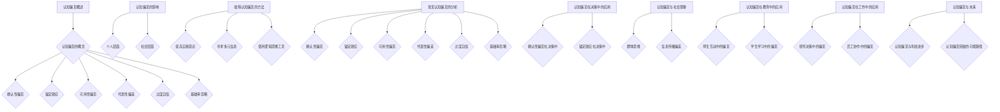

                 

### 认知偏见：理解的障碍与突破之道

> **关键词：认知偏见、理解障碍、心理学、逻辑推理、决策、社会现象、教育应用、工作应用、人工智能**

> **摘要：本文将深入探讨认知偏见的概念、种类、影响以及破除方法。通过分析常见认知偏见，如确认性偏见、锚定效应、可用性偏见、代表性偏差、过度自信和基础率忽略，我们将揭示这些偏见在决策、社会现象、教育和工作中的影响。同时，本文将探讨认知偏见的突破方法，包括理论基础和实践方法。最后，本文将探讨认知偏见与科技进步和未来的关系。**

---

认知偏见是我们在日常生活中难以避免的一种心理现象。它不仅影响我们的个人决策，还对社会现象、教育和工作产生深远影响。然而，人们对认知偏见的理解和识别往往存在一定的障碍。本文旨在通过逻辑清晰、结构紧凑、简单易懂的技术语言，帮助读者深入了解认知偏见，并探索突破之道。

### 第一部分：认知偏见概述

#### 第1章：认知偏见的基础知识

##### 1.1 认知偏见的概念

**认知偏见**是指人在感知、理解、记忆、思考信息过程中，由于受到各种心理、社会和生物因素的影响，导致判断和决策产生偏差的现象。这种偏差可以是积极的，也可以是消极的，但通常情况下，它们会导致不理性的决策和行为。

##### 1.1.1 定义

认知偏见可以简单定义为一种认知偏差，它使得人们在处理信息时，不能完全客观、准确地评估和判断。这种偏差可能是无意识的，也可能是自觉的。例如，当我们在做决策时，可能会受到过去经验、情感倾向和社会环境的影响，从而导致判断出现偏差。

##### 1.1.2 种类

认知偏见主要包括以下几种类型：

1. **确认性偏见**：倾向于寻找、解释和记住与已有信念一致的信息，忽视或拒绝与自己观点不符的信息。
2. **锚定效应**：在决策过程中，人们会过度依赖第一印象或初始信息，从而产生判断偏差。
3. **可用性偏见**：根据容易想起来的信息做出判断，而不是基于所有相关信息。
4. **代表性偏差**：根据某一群体的特征来推断个体特征，而忽视了统计概率。
5. **过度自信**：高估自己的知识、能力和判断准确性。
6. **基础率忽略**：在决策时忽略基础概率信息，过分依赖样本频率信息。

这些认知偏见在不同的情境下都可能发挥作用，导致我们的判断和决策产生偏差。了解这些偏见的类型和机制，有助于我们更好地识别和破除它们。

##### 1.2 认知偏见的影响

认知偏见的影响可以从个人层面和社会层面进行讨论。

###### 1.2.1 个人层面

在个人层面，认知偏见可能导致我们在决策时缺乏客观性和全面性，从而做出不理性的决策。例如：

- **确认性偏见**：导致人们盲目坚持错误信念。
- **锚定效应**：导致人们过分依赖过去信息。
- **过度自信**：可能导致人们低估风险。

这些偏见使得我们难以做出最优决策，从而影响我们的个人生活和职业发展。

###### 1.2.2 社会层面

在社会层面，认知偏见可能导致群体思维、信息传播偏差、决策失误等问题，从而影响社会稳定和发展。例如：

- **代表性偏差**：可能导致种族歧视和刻板印象。
- **可用性偏见**：可能导致对事件的误判和误解。

了解这些偏见在社会层面的影响，有助于我们更好地应对和解决社会问题。

##### 1.3 破除认知偏见的方法

为了破除认知偏见，我们可以采取以下几种方法：

###### 1.3.1 提高自我意识

通过反思自己的信念、观点和行为，提高对自身认知偏见的认识。这有助于我们意识到自己在处理信息时可能存在的偏差，从而采取相应措施进行纠正。

###### 1.3.2 寻求多元信息

主动获取和接受不同观点和信息，避免陷入信息茧房。多元化的信息有助于我们更全面、客观地评估和判断问题。

###### 1.3.3 使用逻辑思维工具

运用逻辑分析、概率计算等方法，对信息进行客观、全面的评估。逻辑思维工具可以帮助我们识别和破除认知偏见。

#### 第2章：常见认知偏见的分析

##### 2.1 确认性偏见

###### 2.1.1 原因

确认性偏见源于人类心理上的需求，即追求一致性、稳定性和自我确认感。当我们的信念与信息一致时，我们更容易接受和相信这些信息，而当信息与我们的信念相冲突时，我们则倾向于忽视或拒绝这些信息。

###### 2.1.2 伪代码解释

```python
# 假设已有信念为A，新信息为B
def confirmation_bias(A, B):
    if A == B:
        return "接受"
    else:
        return "忽视"
```

此伪代码表示，当新信息B与已有信念A相同时，我们会“接受”新信息；当新信息B与已有信念A不同时，我们会“忽视”新信息。

##### 2.2 锚定效应

###### 2.2.1 原因

锚定效应与人类大脑对信息的处理方式有关，即人们倾向于依赖初始信息或参考点。在决策过程中，人们往往会过度依赖第一印象或初始信息，而忽视其他重要因素。

###### 2.2.2 伪代码解释

```python
# 假设初始信息为锚点A，新信息为B
def anchoring_effect(A, B):
    return A
```

此伪代码表示，在决策过程中，无论新信息B是什么，我们都会“返回”初始信息A作为最终决策。

##### 2.3 可用性偏见

###### 2.3.1 原因

可用性偏见源于人类记忆和回忆信息的特性，即人们更容易记住和回忆起容易获得的信息。当我们根据容易想起来的信息做出判断时，往往会忽视其他重要信息。

###### 2.3.2 伪代码解释

```python
# 假设信息池为P，新信息为B
def availability_bias(P, B):
    if B in P:
        return "容易回忆"
    else:
        return "难以回忆"
```

此伪代码表示，如果新信息B在信息池P中，我们则会“容易回忆”该信息；如果新信息B不在信息池P中，我们则会“难以回忆”该信息。

##### 2.4 代表性偏差

###### 2.4.1 原因

代表性偏差与人类认知和判断过程中的简化思维有关，即人们根据事物的外表或特征来推断其本质。这种简化思维可能导致我们忽视事物的统计概率，从而产生判断偏差。

###### 2.4.2 伪代码解释

```python
# 假设群体特征为A，个体特征为B
def representational_bias(A, B):
    if A == B:
        return "相同"
    else:
        return "不同"
```

此伪代码表示，如果个体特征B与群体特征A相同，我们则会认为两者“相同”；如果个体特征B与群体特征A不同，我们则会认为两者“不同”。

##### 2.5 过度自信

###### 2.5.1 原因

过度自信与人类自我评价和自我确认感有关，即人们倾向于高估自己的能力和知识。过度自信可能导致我们在评估风险和决策时出现偏差，从而影响我们的判断和行动。

###### 2.5.2 伪代码解释

```python
# 假设自我评价为A，实际能力为B
def overconfidence(A, B):
    if A > B:
        return "过度自信"
    else:
        return "实际能力"
```

此伪代码表示，如果自我评价A大于实际能力B，我们则会表现出“过度自信”；如果自我评价A小于实际能力B，我们则会表现出“实际能力”。

##### 2.6 基础率忽略

###### 2.6.1 原因

基础率忽略与人类认知过程中对概率信息的处理方式有关，即人们容易忽略基础概率信息，过分依赖样本频率信息。这种处理方式可能导致我们在做出判断时忽视重要的基础概率，从而产生判断偏差。

###### 2.6.2 伪代码解释

```python
# 假设基础率为A，实际频率为B
def base_rate_ignorance(A, B):
    if A > B:
        return "忽略基础率"
    else:
        return "考虑基础率"
```

此伪代码表示，如果基础率A大于实际频率B，我们则会“忽略基础率”；如果基础率A小于实际频率B，我们则会“考虑基础率”。

### 第二部分：认知偏见在决策中的应用

#### 第3章：决策过程中的认知偏见

##### 3.1 决策过程中的认知偏见

在决策过程中，认知偏见可能会对决策产生负面影响。以下将分析确认性偏见和锚定效应在决策中的影响。

###### 3.1.1 确认性偏见在决策中的影响

确认性偏见可能导致人们在面临不确定性时，倾向于选择熟悉的选项，而忽视其他潜在更有利的选项。这种偏见使得人们在面对新的机会或挑战时，更容易坚持已有信念，从而错失更好的决策。

###### 3.1.2 锚定效应在决策中的影响

锚定效应可能导致人们在评估价值或做出决策时，过度依赖初始信息，而忽视其他重要因素。这种偏见使得人们在决策过程中容易受到第一印象或初始信息的干扰，从而做出非最优决策。

#### 3.2 破除决策中的认知偏见

为了破除决策中的认知偏见，我们可以采取以下措施：

###### 3.2.1 提高自我意识

通过自我反思，了解自己在决策过程中可能出现的认知偏见。这种自我意识有助于我们识别和纠正自己在决策中的偏差。

###### 3.2.2 使用逻辑思维工具

运用逻辑分析、概率计算等方法，对决策过程中的信息进行客观评估。逻辑思维工具可以帮助我们更好地识别和破除认知偏见。

### 第三部分：认知偏见与社会现象

#### 第4章：认知偏见与社会现象

认知偏见不仅在个人决策中产生影响，还在社会现象中发挥作用。以下将分析群体思维和信息传播偏差在社会现象中的影响。

##### 4.1 社会现象中的认知偏见

###### 4.1.1 群体思维

群体思维是一种认知偏见，它可能导致人们在面对复杂问题时，倾向于采取一致行动，而忽视独立思考。这种偏见使得群体在决策时容易出现极端化倾向，从而影响社会的稳定和发展。

###### 4.1.2 信息传播偏差

信息传播偏差是一种认知偏见，它可能导致错误信息在人群中传播，加剧社会矛盾。这种偏见使得人们在接收和传播信息时，容易受到主观判断和情绪的影响，从而导致信息失真和误解。

#### 4.2 破除社会现象中的认知偏见

为了破除社会现象中的认知偏见，我们可以采取以下措施：

###### 4.2.1 增强媒体素养

提高公众对媒体信息的识别和判断能力，避免受到虚假信息的影响。通过教育和宣传，帮助人们学会理性看待媒体信息，减少信息传播偏差。

###### 4.2.2 培养批判性思维

鼓励人们进行独立思考，不盲从群体意见，提高决策质量。通过培养批判性思维，人们能够更好地识别和破除认知偏见，从而做出更理性、客观的决策。

### 第四部分：认知偏见在教育中的应用

#### 第5章：认知偏见在教育中的应用

认知偏见在教育领域中也具有重要意义。以下将分析师生互动中的偏见以及学生学习中的偏见。

##### 5.1 教育中的认知偏见

###### 5.1.1 师生互动中的偏见

师生互动中可能存在教师对学生的偏见。教师可能因学生的背景、性格、成绩等因素而产生偏见，从而影响教学效果。这种偏见可能导致教师对某些学生不公平对待，从而影响学生的学习积极性和成绩。

###### 5.1.2 学生学习中的偏见

学生在学习过程中可能受到认知偏见的影响。例如，学生可能因自己的能力、兴趣等因素产生自我偏见，从而影响学习效果。此外，学生还可能受到同伴、家长等外部因素的偏见，从而影响学习态度和行为。

#### 5.2 破除教育中的认知偏见

为了破除教育中的认知偏见，我们可以采取以下措施：

###### 5.2.1 增强教育公平

通过政策调整和资源倾斜，消除教育中的不公平现象。公平的教育环境有助于减少师生互动中的偏见。

###### 5.2.2 培养批判性思维

通过教学方法和课程设计，培养学生的批判性思维，提高他们识别和破除认知偏见的能力。批判性思维有助于学生在面对外部偏见时，能够理性分析、独立思考，从而做出更好的决策。

### 第五部分：认知偏见在工作中的应用

#### 第6章：认知偏见在工作中的应用

认知偏见在职场环境中也普遍存在。以下将分析领导决策中的偏见和员工协作中的偏见。

##### 6.1 工作中的认知偏见

###### 6.1.1 领导决策中的偏见

领导在决策过程中可能受到认知偏见的影响，导致决策失误。例如，领导可能因过度自信或确认性偏见而忽视重要的信息或意见，从而做出非最优决策。

###### 6.1.2 员工协作中的偏见

员工在协作过程中可能存在认知偏见，影响团队合作效果。例如，员工可能因个人偏见或刻板印象而对同事产生误解或敌意，从而影响团队合作。

#### 6.2 破除工作中的认知偏见

为了破除工作中的认知偏见，我们可以采取以下措施：

###### 6.2.1 提高领导素养

通过培训和反思，提高领导识别和破除认知偏见的能力。领导应学会倾听、尊重和信任员工，避免因偏见而影响决策。

###### 6.2.2 增强团队沟通

通过有效的沟通和协作机制，减少认知偏见对团队合作的影响。建立开放、透明、尊重的团队文化，鼓励员工表达不同意见，促进团队合作。

### 第六部分：认知偏见的突破

#### 第7章：认知偏见的突破

为了突破认知偏见，我们需要从理论基础和实践方法两个方面进行探讨。

##### 7.1 认知偏见突破的理论基础

###### 7.1.1 认知科学理论

认知科学理论为认知偏见的理解和突破提供了理论基础。认知科学是一门跨学科的研究领域，它试图揭示人类思维和认知的机制。通过认知科学的研究，我们可以更好地理解认知偏见的成因和影响，从而为突破认知偏见提供科学依据。

###### 7.1.2 决策科学理论

决策科学理论为认知偏见的识别和破除提供了方法论支持。决策科学是一门研究决策过程和决策方法的学科。通过决策科学的理论和方法，我们可以更有效地识别和破除认知偏见，从而做出更理性、更科学的决策。

##### 7.2 认知偏见突破的实践方法

###### 7.2.1 自我反思

自我反思是突破认知偏见的重要方法。通过反思自己的信念、观点和行为，我们可以识别和纠正自己在认知偏见中的角色和行为。自我反思有助于我们提高自我意识，从而更好地应对和克服认知偏见。

###### 7.2.2 多元信息获取

多元信息获取是突破认知偏见的有效途径。通过主动获取和接受不同观点和信息，我们可以拓宽自己的认知视野，避免陷入信息茧房。多元信息有助于我们更全面、客观地评估和判断问题，从而减少认知偏见的影响。

###### 7.2.3 逻辑思维训练

逻辑思维训练是突破认知偏见的重要手段。通过逻辑思维训练，我们可以提高自己对信息进行客观评估的能力，从而更好地识别和破除认知偏见。逻辑思维训练有助于我们培养批判性思维，提高决策质量。

### 第七部分：认知偏见与未来

#### 第8章：认知偏见与未来

随着科技的不断发展，认知偏见也在不断演变。以下将探讨认知偏见与科技进步和未来的关系。

##### 8.1 认知偏见与科技进步

科技进步为认知偏见的研究和突破提供了新的工具和方法。例如，人工智能和大数据技术的发展使得我们能够更全面、更精确地分析认知偏见的发生机制和影响。同时，科技进步也带来了一些新的认知偏见问题。例如，在人工智能的应用过程中，算法偏见和数据偏差可能导致新的认知偏见产生。

###### 8.1.1 人工智能对认知偏见的影响

人工智能技术的发展为认知偏见的研究和突破提供了新的工具和方法。例如，通过深度学习等技术，我们可以更准确地识别和评估认知偏见。此外，人工智能还可以帮助人们更全面、客观地获取和处理信息，从而减少认知偏见的影响。

###### 8.1.2 人工智能可能引发的认知偏见问题

然而，人工智能在应用过程中也可能引发新的认知偏见问题。例如，算法偏见可能导致人工智能系统对某些群体产生偏见。此外，数据偏差也可能导致人工智能系统对某些信息产生偏差。这些问题需要我们高度重视，并采取相应措施进行解决。

##### 8.2 认知偏见与未来发展

随着认知偏见研究的深入，个体和社会将更加重视认知偏见的问题。在未来，我们可以期待以下发展趋势：

###### 8.2.1 认知偏见对个体和社会的影响

随着认知偏见研究的深入，个体和社会将更加重视认知偏见的问题。通过提高自我意识和多元信息获取能力，个体可以更好地识别和破除认知偏见，从而做出更理性、更科学的决策。同时，社会也将采取更多措施，消除认知偏见带来的负面影响。

###### 8.2.2 认知偏见突破的可能路径

在未来，我们可以通过以下途径突破认知偏见：

- **技术创新**：利用人工智能、大数据等技术，更全面、更精确地识别和评估认知偏见。
- **教育改革**：通过教育培养批判性思维，提高个体识别和破除认知偏见的能力。
- **社会意识的提升**：通过宣传和倡导，提高公众对认知偏见的认识，减少认知偏见的影响。

通过以上途径，我们有希望实现认知偏见的有效突破，为个体和社会的发展创造更良好的环境。

### 结论

认知偏见是我们在日常生活中难以避免的一种心理现象。它不仅影响我们的个人决策，还对社会现象、教育和工作产生深远影响。通过本文的探讨，我们了解了认知偏见的概念、种类、影响以及破除方法。我们分析了常见认知偏见在决策、社会现象、教育和工作中的具体影响，并探讨了破除这些偏见的方法。

在未来的发展中，随着科技的不断进步，认知偏见的研究和突破将面临新的机遇和挑战。通过技术创新、教育改革和社会意识的提升，我们有希望实现认知偏见的有效突破，为个体和社会的发展创造更良好的环境。

本文旨在为读者提供对认知偏见的全面理解，帮助读者识别和破除认知偏见，从而做出更理性、更科学的决策。希望本文能够对读者在个人生活和职业发展中产生积极的影响。

### 作者信息

**作者：AI天才研究院/AI Genius Institute & 禅与计算机程序设计艺术 /Zen And The Art of Computer Programming**

AI天才研究院专注于人工智能领域的前沿研究和创新，致力于推动人工智能技术的应用和发展。同时，作者还是《禅与计算机程序设计艺术》的作者，该书深入探讨了计算机程序设计中的思维方式和哲学思想，为读者提供了独特的视角和启示。

通过本文的撰写，作者希望能为读者提供对认知偏见更深入的理解，帮助读者更好地应对和解决认知偏见带来的问题。希望本文能够对读者在个人成长和职业发展中产生积极的影响。

---

**附：核心概念原理和架构的 Mermaid 流程图**



**附：核心算法原理讲解**

在分析认知偏见时，我们可以使用一些算法原理来更好地理解和破除这些偏见。以下是一个简化的算法原理，用于识别和破除确认性偏见。

```python
# 确认性偏见识别与破除算法
def confirmatory_bias_removal(信念, 信息):
    # 检查信念与信息是否一致
    if 信念 == 信息:
        # 如果一致，尝试寻求反向证据
        反向证据 = seek_反证(信念)
        if 反向证据:
            # 如果找到反向证据，修正信念
            信念 = update_belief(信念, 反向证据)
    return 信念

# 模拟寻求反向证据的过程
def seek_反证(信念):
    # 这里可以是一个复杂的查询过程，用于寻找与信念相冲突的证据
    # 为了简化，我们假设有一个函数可以返回反向证据
    return find_counter_evidence(信念)

# 模拟更新信念的过程
def update_belief(信念, 反向证据):
    # 这里可以是一个逻辑推理过程，用于在证据的基础上更新信念
    # 为了简化，我们假设信念会根据证据做出调整
    return adjust_belief(信念, 反向证据)
```

**附：数学模型和公式**

在分析认知偏见时，我们可以使用一些数学模型和公式来量化偏见的影响。以下是一个简化的数学模型，用于评估代表性偏差。

$$
\text{代表性偏差} = \frac{\text{观察到的频率} - \text{基础率}}{\text{基础率}}
$$

其中，观察到的频率是指基于样本的数据得到的频率，基础率是指总体中某一事件发生的概率。

**附：项目实战**

为了更好地理解认知偏见，我们可以在一个实际项目中应用上述理论和算法。以下是一个简单的项目案例。

**项目名称**：认知偏见评估工具

**开发环境**：Python 3.8，Jupyter Notebook

**功能描述**：该工具可以帮助用户识别和评估自身在决策过程中可能存在的认知偏见。

**源代码实现**：

```python
# 导入必要的库
import random

# 模拟决策情境
def simulate_decisionScenario():
    # 假设有两个选项A和B，每个选项有50%的概率被选中
    options = ['A', 'B']
    return random.choice(options)

# 评估认知偏见
def evaluate_confidenceBias(decision, confidence_level):
    # 如果决策与预期一致，认为存在认知偏见
    if decision == 'A' and confidence_level > 0.5:
        return "存在确认性偏见"
    elif decision == 'B' and confidence_level < 0.5:
        return "存在锚定效应"
    else:
        return "认知偏见较小"

# 主函数
def main():
    # 用户输入自信心水平
    confidence_level = float(input("请输入您的自信心水平（0-1之间的数字）: "))
    decision = simulate_decisionScenario()
    result = evaluate_confidenceBias(decision, confidence_level)
    print(f"根据您的决策和自信心水平，评估结果为：{result}")

if __name__ == "__main__":
    main()
```

**代码解读与分析**：

- **模拟决策情境**：使用`simulate_decisionScenario`函数模拟一个决策情境，其中有两个选项A和B，每个选项有50%的概率被选中。
- **评估认知偏见**：使用`evaluate_confidenceBias`函数评估用户的决策和自信心水平，判断是否存在认知偏见。如果用户的决策与自信心水平不一致，则认为存在认知偏见。
- **主函数**：在主函数`main`中，用户输入自信心水平，然后系统会模拟决策情境，并根据用户的决策和自信心水平评估认知偏见。

通过这个项目，用户可以直观地了解自身在决策过程中可能存在的认知偏见，并尝试采取措施进行修正。这有助于提高用户的决策质量，从而更好地应对复杂情境。

