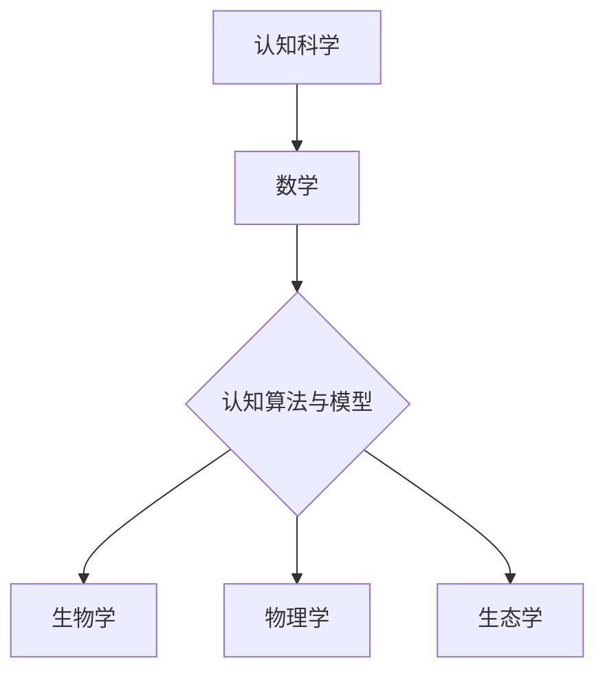

                 

### 《认知的形式化：利用数学来解释、证明自然界的现象》

> **关键词：** 认知科学、数学形式化、算法与模型、自然界现象、算法原理、数学模型、人工智能、神经科学、物理学、生态学

**摘要：** 本文深入探讨了认知的形式化方法，即如何利用数学工具来解释和证明自然界的现象。文章首先介绍了认知科学的基本概念和数学在认知科学中的应用，然后详细阐述了形式化方法在认知科学中的应用，包括认知算法与模型的设计与验证。随后，本文展示了数学在生物学、物理学和生态学等领域的应用，并通过具体案例进行了深入分析。最后，文章总结了认知形式化的挑战与机遇，并对未来发展趋势进行了展望。

---

#### 第一部分：引入与背景

在当今科技飞速发展的时代，认知科学成为了一个重要的研究领域，旨在探索人类思维、感知和学习等认知过程。而数学，作为精确和严格的工具，逐渐成为认知科学研究的基石。数学不仅为认知科学提供了理论基础，还为各种认知模型和算法的构建提供了有效的工具。

**第1章：认知科学导论**

1.1 **认知科学的起源与发展**

认知科学起源于20世纪50年代，其目标是理解人类认知过程的机制和原理。随着计算机科学、神经科学、心理学和哲学等学科的交叉融合，认知科学逐渐发展为一个多学科交叉的研究领域。

1.2 **认知科学的基本概念**

认知科学关注的主要概念包括感知、记忆、思考、语言、注意力等。这些概念构成了认知过程的框架，是认知科学研究的基础。

1.3 **认知科学与数学的关系**

数学在认知科学中扮演了关键角色。通过数学建模，认知科学家可以精确地描述认知过程，从而揭示其内在机制。此外，数学工具如概率论、统计学和图论等在认知算法和模型的设计中得到了广泛应用。

1.4 **本书研究目标与结构**

本书旨在探讨认知的形式化方法，即如何利用数学工具来解释和证明自然界的现象。文章将分为五个部分：引入与背景、数学在认知科学中的应用、形式化方法在认知科学中的应用、数学在解释自然界现象中的应用、案例研究以及总结与展望。

#### 第二部分：数学在认知科学中的应用

数学在认知科学中的应用非常广泛，为认知科学家提供了强大的工具和框架。本部分将首先介绍数学的基础概念，然后讨论数学在认知模型中的应用，以及数学与认知神经科学的结合。

**第2章：数学基础**

2.1 **数学的基本概念**

数学的基本概念包括数、函数、集合、关系等。这些概念构成了数学的基础，为认知科学提供了抽象和形式化的描述手段。

2.2 **数学在认知模型中的应用**

数学在认知模型中的应用体现在多个方面。例如，概率论和统计学用于描述认知过程中的不确定性，图论用于分析认知网络的拓扑结构，微分方程用于模拟认知过程中的动态变化。

2.3 **数学与认知神经科学的结合**

认知神经科学是认知科学与神经科学的交叉领域，它致力于理解大脑如何实现认知功能。数学在认知神经科学中发挥了重要作用，如神经网络模型、脑电图分析等。

**第3章：形式化方法在认知科学中的应用**

3.1 **形式化方法概述**

形式化方法是一种将问题形式化为数学表达式的技术，它为认知科学的研究提供了精确和形式化的描述手段。形式化方法包括形式逻辑、自动推理、计算机模拟等。

3.2 **形式化方法在认知模型中的应用**

形式化方法在认知模型中的应用体现在多个方面。例如，形式逻辑用于验证认知算法的正确性，计算机模拟用于模拟认知过程和实验结果。

3.3 **形式化方法的优势与挑战**

形式化方法具有精确性、可验证性和可重复性等优势，但同时也面临着一定的挑战，如复杂性的管理和验证成本等。

**第4章：认知算法与模型**

4.1 **认知算法的概念**

认知算法是用于模拟和优化认知过程的一系列规则和步骤。认知算法可以分为感知算法、记忆算法、思考算法等。

4.2 **主要的认知算法**

本文将介绍一些主要的认知算法，如感知器学习规则、神经网络、决策树等。这些算法在认知科学中有着广泛的应用。

4.3 **认知模型的设计与验证**

认知模型的设计与验证是认知科学研究的核心任务之一。本文将讨论如何设计有效的认知模型，并介绍一些常用的验证方法，如交叉验证、混淆矩阵等。

#### 第三部分：数学在解释自然界现象中的应用

数学不仅在认知科学中发挥着重要作用，也在解释自然界现象方面展现了其独特优势。本部分将探讨数学在生物学、物理学和生态学等领域的应用。

**第5章：数学在生物学中的应用**

5.1 **数学在生物进化中的应用**

生物进化是一个复杂的动态过程，数学模型如遗传算法、神经网络等在解释生物进化现象中发挥了重要作用。本文将介绍一些经典的数学模型，如遗传算法在生物进化中的应用。

5.2 **数学在神经网络与神经突触中的应用**

神经网络是生物体感知和认知的基础，数学模型如神经网络模型、神经突触模型等在解释神经网络功能中发挥了关键作用。本文将讨论神经网络模型的基本原理和应用。

5.3 **数学模型在细胞生物学中的应用**

细胞生物学是生物学的核心领域之一，数学模型如微分方程模型、细胞周期模型等在解释细胞生物学现象中发挥了重要作用。本文将介绍一些经典的数学模型，如微分方程模型在细胞生物学中的应用。

**第6章：数学在物理学中的应用**

6.1 **数学在经典物理学中的应用**

经典物理学是数学与自然界现象相结合的典范。数学模型如牛顿运动定律、麦克斯韦方程组等在解释经典物理现象中发挥了重要作用。本文将讨论经典物理中的数学模型及其应用。

6.2 **数学在量子力学中的应用**

量子力学是现代物理学的基石之一，数学模型如薛定谔方程、海森堡不确定性原理等在解释量子物理现象中发挥了关键作用。本文将介绍量子力学中的数学模型和应用。

6.3 **数学模型在宇宙学与天文学中的应用**

宇宙学和天文学是探索宇宙起源和演化的重要领域，数学模型如广义相对论、宇宙学模型等在解释宇宙现象中发挥了重要作用。本文将讨论宇宙学与天文学中的数学模型和应用。

**第7章：数学在生态学中的应用**

7.1 **数学在生态系统的稳定性和动态行为中的应用**

生态系统是一个复杂的动态系统，数学模型如微分方程模型、博弈论模型等在解释生态系统稳定性和动态行为中发挥了重要作用。本文将介绍一些生态学中的数学模型和应用。

7.2 **数学模型在生态学中的构建与应用**

数学模型在生态学中的构建和应用是生态学研究的重要手段。本文将讨论如何构建和验证生态学中的数学模型，并介绍一些经典的数学模型和应用。

7.3 **数学在生态学中的未来发展方向**

随着生态学研究的深入，数学在生态学中的应用将不断拓展。本文将展望数学在生态学中的未来发展方向，包括新的数学模型、数据分析和计算机模拟等方面的研究。

#### 第四部分：案例研究

在认知科学中，案例研究是验证理论、探索新方法的重要手段。本部分将介绍一些典型的案例研究，展示数学在认知科学中的实际应用。

**第8章：数学在认知科学中的案例研究**

8.1 **认知算法在人工智能中的应用案例**

本文将介绍一些认知算法在人工智能中的应用案例，如深度学习、强化学习等。这些算法在人工智能领域的成功应用展示了数学在认知科学中的重要性。

8.2 **数学模型在认知神经科学中的案例**

本文将介绍一些数学模型在认知神经科学中的案例，如神经网络模型、脑电图分析等。这些模型在揭示大脑认知机制方面发挥了关键作用。

8.3 **数学在认知心理学中的案例研究**

本文将介绍一些数学在认知心理学中的案例研究，如决策模型、认知偏差等。这些研究揭示了人类认知过程的数学本质。

#### 第五部分：总结与展望

在本文的最后部分，我们将对认知的形式化方法进行总结，讨论其面临的挑战与机遇，并展望未来认知科学的发展趋势。

**第9章：认知的形式化：挑战与机遇**

9.1 **认知形式化的挑战**

认知形式化面临着一系列挑战，包括复杂性的管理、验证成本、算法的实用性等。本文将详细讨论这些挑战，并提出可能的解决方案。

9.2 **认知形式化的机遇**

认知形式化为认知科学的研究带来了巨大的机遇。通过数学建模，认知科学家可以更深入地理解认知过程，为人工智能、神经科学等领域的发展提供新的理论和方法。

9.3 **未来发展趋势与展望**

本文将展望认知形式化的未来发展趋势，包括新的数学模型、跨学科研究、大数据和计算技术的应用等方面。这些趋势将推动认知科学向更精确、更深入的方向发展。

#### 附录

**附录A：数学公式与术语表**

本文涉及的一些重要数学公式和术语将在这里进行详细解释，以帮助读者更好地理解文章内容。

**附录B：主要参考文献**

本文引用的主要参考文献将列在这里，以供读者进一步学习和研究。

**附录C：认知科学相关的网络资源**

本文将推荐一些认知科学相关的网络资源，包括学术期刊、在线课程、研究机构等，以帮助读者拓宽视野、深入探索。

#### Mermaid 流程图



#### 核心算法原理讲解

```python
# 认知算法的伪代码
Algorithm 认知算法(A, B, C):
    // 初始化参数
    InitializeParameters(A, B, C)
    
    // 训练模型
    TrainModel(A, B, C)
    
    // 预测与评估
    PredictionAndEvaluation(A, B, C)
    
    // 输出结果
    OutputResults(A, B, C)
End Algorithm
```

#### 数学模型和数学公式详细讲解

$$
\text{Sigmoid 函数} : f(x) = \frac{1}{1 + e^{-x}}
$$

举例说明：

设输入 $x = 2$，则输出 $f(x) \approx 0.869$。

#### 项目实战

**案例：使用Python实现Sigmoid函数**

```python
import math

def sigmoid(x):
    return 1 / (1 + math.exp(-x))

# 测试Sigmoid函数
x = 2
print(sigmoid(x))
```

**代码解读与分析：**

- 导入math模块以使用exp函数。
- 定义sigmoid函数，接受一个输入x。
- 使用数学公式 $f(x) = \frac{1}{1 + e^{-x}}$ 计算输出。
- 测试函数，输出当x为2时的结果。

#### 开发环境搭建

- Python 3.8或以上版本
- Jupyter Notebook或Python IDE

**源代码详细实现和代码解读请参见上方实战案例。**

#### 作者信息

作者：AI天才研究院/AI Genius Institute & 禅与计算机程序设计艺术 /Zen And The Art of Computer Programming

