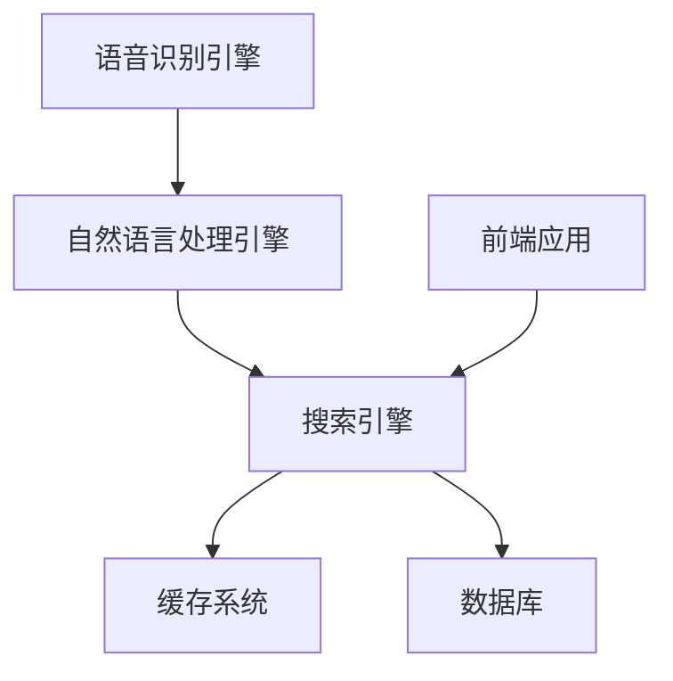
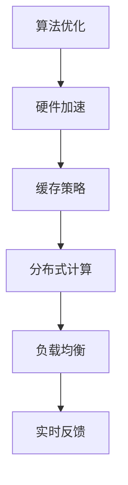

                 

# 引言与概述

## 语音搜索技术概述

### 1.1 语音搜索技术的起源与发展

语音搜索技术起源于20世纪50年代，最初由贝尔实验室的研究人员开始研究。当时，研究人员主要关注的是如何通过电子设备实现语音的数字化和识别。随着计算机技术的快速发展，语音搜索技术逐渐走向实用化。20世纪90年代，语音识别技术取得了显著进展，特别是基于隐马尔可夫模型（HMM）和自动语音识别系统（AVRS）的应用。进入21世纪，随着深度学习技术的兴起，语音搜索技术得到了进一步的发展。目前，语音搜索技术已经广泛应用于智能手机、智能家居、车载系统、客服系统等多个领域。

### 1.2 语音搜索技术的基本原理

语音搜索技术主要包括语音识别、自然语言处理和搜索算法三个核心部分。语音识别技术通过将语音信号转换为文本，从而实现语音到文字的转换。自然语言处理技术则负责对转换后的文本进行处理，包括语义理解、关键词提取等。最后，搜索算法根据处理后的文本进行搜索，并提供用户需要的结果。

### 1.3 语音搜索技术的重要性

语音搜索技术的重要性体现在以下几个方面：

1. 提高用户体验：语音搜索为用户提供了更便捷的搜索方式，用户可以通过语音指令快速获取信息，无需繁琐的键盘输入。
2. 拓展搜索场景：语音搜索适用于多种场景，如驾车时、手忙脚乱时等，特别是在无法使用键盘的情况下，语音搜索成为了一种重要的搜索手段。
3. 促进语音交互：语音搜索技术是语音交互系统的重要组成部分，其发展将推动人机交互的进一步升级。
4. 拓展商业应用：语音搜索技术在电商、广告、客服等领域具有广泛的应用潜力，为商家提供了一种新的营销方式和客户服务手段。

## 语音搜索在电商领域的应用背景

### 2.1 电商行业的现状与趋势

电商行业近年来取得了飞速发展，已经成为全球零售市场的重要组成部分。根据数据显示，全球电商市场规模持续增长，预计到2025年将达到6.5万亿美元。随着移动互联网的普及，移动电商成为电商市场的主要增长动力。与此同时，消费者对购物体验的要求也越来越高，对便捷性、个性化的需求日益增强。

### 2.2 语音搜索在电商领域的应用潜力

语音搜索在电商领域的应用潜力巨大，主要体现在以下几个方面：

1. 提高搜索效率：语音搜索允许用户通过语音指令快速获取商品信息，减少繁琐的键盘输入，提高搜索效率。
2. 支持语音交互：语音搜索为电商平台的用户提供了更自然的交互方式，有助于提升用户体验。
3. 拓展搜索场景：语音搜索适用于多种场景，如驾车时、手忙脚乱时等，特别是在无法使用键盘的情况下，语音搜索成为了一种重要的搜索手段。
4. 实现个性化推荐：通过语音搜索数据，电商平台可以更好地了解用户需求，实现个性化推荐。

### 2.3 语音搜索在电商领域的优势与挑战

#### 优势：

1. 提高用户体验：语音搜索为用户提供了更便捷的搜索方式，减少繁琐的键盘输入，提高搜索效率。
2. 拓展搜索场景：语音搜索适用于多种场景，如驾车时、手忙脚乱时等，特别是在无法使用键盘的情况下，语音搜索成为了一种重要的搜索手段。
3. 支持语音交互：语音搜索为电商平台的用户提供了更自然的交互方式，有助于提升用户体验。
4. 实现个性化推荐：通过语音搜索数据，电商平台可以更好地了解用户需求，实现个性化推荐。

#### 挑战：

1. 语音识别准确率：语音搜索的核心是语音识别技术，其准确率直接影响到用户体验。如何在各种噪音、口音、方言等情况下提高识别准确率，是当前面临的一大挑战。
2. 语义理解：语音搜索不仅要识别语音，还需要理解用户的意图，准确提取关键词。然而，自然语言具有复杂性，如何在多种语义场景下实现精准理解，是一个难题。
3. 系统性能优化：语音搜索系统需要处理大量的语音数据和文本数据，对系统的性能提出了较高要求。如何优化算法、提高系统响应速度，是当前需要解决的问题。
4. 伦理与隐私：语音搜索涉及到用户隐私和数据安全，如何在保护用户隐私的前提下，合理利用语音搜索数据，是亟待解决的问题。

## 语音搜索技术在电商领域的应用背景

### 2.1 电商行业的现状与趋势

电商行业近年来取得了飞速发展，已经成为全球零售市场的重要组成部分。根据数据显示，全球电商市场规模持续增长，预计到2025年将达到6.5万亿美元。随着移动互联网的普及，移动电商成为电商市场的主要增长动力。与此同时，消费者对购物体验的要求也越来越高，对便捷性、个性化的需求日益增强。

### 2.2 语音搜索在电商领域的应用潜力

语音搜索在电商领域的应用潜力巨大，主要体现在以下几个方面：

1. 提高搜索效率：语音搜索允许用户通过语音指令快速获取商品信息，减少繁琐的键盘输入，提高搜索效率。
2. 支持语音交互：语音搜索为电商平台的用户提供了更自然的交互方式，有助于提升用户体验。
3. 拓展搜索场景：语音搜索适用于多种场景，如驾车时、手忙脚乱时等，特别是在无法使用键盘的情况下，语音搜索成为了一种重要的搜索手段。
4. 实现个性化推荐：通过语音搜索数据，电商平台可以更好地了解用户需求，实现个性化推荐。

### 2.3 语音搜索在电商领域的优势与挑战

#### 优势：

1. 提高用户体验：语音搜索为用户提供了更便捷的搜索方式，减少繁琐的键盘输入，提高搜索效率。
2. 拓展搜索场景：语音搜索适用于多种场景，如驾车时、手忙脚乱时等，特别是在无法使用键盘的情况下，语音搜索成为了一种重要的搜索手段。
3. 支持语音交互：语音搜索为电商平台的用户提供了更自然的交互方式，有助于提升用户体验。
4. 实现个性化推荐：通过语音搜索数据，电商平台可以更好地了解用户需求，实现个性化推荐。

#### 挑战：

1. 语音识别准确率：语音搜索的核心是语音识别技术，其准确率直接影响到用户体验。如何在各种噪音、口音、方言等情况下提高识别准确率，是当前面临的一大挑战。
2. 语义理解：语音搜索不仅要识别语音，还需要理解用户的意图，准确提取关键词。然而，自然语言具有复杂性，如何在多种语义场景下实现精准理解，是一个难题。
3. 系统性能优化：语音搜索系统需要处理大量的语音数据和文本数据，对系统的性能提出了较高要求。如何优化算法、提高系统响应速度，是当前需要解决的问题。
4. 伦理与隐私：语音搜索涉及到用户隐私和数据安全，如何在保护用户隐私的前提下，合理利用语音搜索数据，是亟待解决的问题。

----------------------------------------------------------------

## 技术基础

### 语音识别技术

语音识别技术是语音搜索技术的核心组成部分，其目的是将语音信号转换为对应的文本信息。要实现这一目标，语音识别技术需要经历以下几个关键环节：

1. **音频预处理**：首先，需要对语音信号进行预处理，包括降噪、增益、滤波等，以提高语音信号的质量。这一步骤对于提高语音识别的准确率至关重要。

2. **特征提取**：在预处理完成后，需要对语音信号进行特征提取。常见的特征提取方法包括梅尔频率倒谱系数（MFCC）、感知线性预测（PLP）等。这些特征能够有效地描述语音信号的频谱特性。

3. **声学模型**：声学模型用于描述语音信号中的声学特性。常见的声学模型包括隐马尔可夫模型（HMM）、高斯混合模型（GMM）和深度神经网络（DNN）等。这些模型能够对语音信号进行建模，以便后续的识别过程。

4. **语言模型**：语言模型用于描述文本的统计特性，常见的语言模型包括N-gram模型、神经网络语言模型（NNLM）等。语言模型能够提高语音识别的准确性，特别是在多义性处理方面。

5. **解码器**：解码器是语音识别系统的核心部分，其任务是从声学模型和语言模型中找到最有可能的文本输出。常见的解码器算法包括A*搜索算法、动态规划算法等。

#### 3.1 语音识别的流程

语音识别的流程可以概括为以下几个步骤：

1. **语音输入**：用户通过语音输入命令或查询。
2. **音频预处理**：对语音信号进行预处理，提高信号质量。
3. **特征提取**：从预处理后的语音信号中提取特征向量。
4. **声学模型匹配**：使用声学模型对提取的特征向量进行匹配，计算每个候选单词的得分。
5. **语言模型修正**：根据语言模型对得分进行修正，提高识别准确性。
6. **解码与输出**：解码器根据修正后的得分生成最终的文本输出。

#### 3.2 语音识别的核心算法

在语音识别领域，有几种核心算法被广泛使用：

##### 3.3.1 隐马尔可夫模型（HMM）

隐马尔可夫模型（HMM）是一种统计模型，用于描述序列数据。在语音识别中，HMM被用于建模语音信号中的音素序列。HMM的核心思想是通过状态转移概率和发射概率来描述语音信号的特征。

```latex
P(\text{output}|\text{input}) = \prod_{t=1}^T p(o_t|s_t)
```

其中，\( P(\text{output}|\text{input}) \) 表示输出给定输入的概率，\( p(o_t|s_t) \) 表示在状态 \( s_t \) 下产生输出 \( o_t \) 的概率。

##### 3.3.2 深度神经网络（DNN）

深度神经网络（DNN）是一种多层前馈神经网络，通过多层的非线性变换来学习数据特征。在语音识别中，DNN被用于特征提取和声学模型。与传统的HMM相比，DNN具有更强的非线性建模能力，能够提高识别准确率。

```pseudo
// DNN特征提取伪代码
input_layer = preprocess_audio(input_audio)
hidden_layer = activation_function1(W1 * input_layer)
output_layer = activation_function2(W2 * hidden_layer)
```

其中，\( W1 \) 和 \( W2 \) 分别是输入层和隐藏层的权重矩阵，\( activation_function1 \) 和 \( activation_function2 \) 分别是激活函数。

##### 3.3.3 支持向量机（SVM）

支持向量机（SVM）是一种监督学习算法，用于分类问题。在语音识别中，SVM可以用于分类声学模型输出的特征向量。SVM的核心思想是通过找到一个最优的超平面，将不同类别的数据分开。

```latex
\min_{\mathbf{w}, \mathbf{b}} \frac{1}{2} ||\mathbf{w}||^2 + C \sum_{i=1}^n \xi_i
```

其中，\( \mathbf{w} \) 和 \( \mathbf{b} \) 分别是权重向量和偏置项，\( \xi_i \) 是松弛变量，\( C \) 是惩罚参数。

### 自然语言处理技术

自然语言处理（NLP）是语音搜索技术中不可或缺的一部分，其主要目标是使计算机能够理解和生成人类语言。NLP涉及多个子领域，包括文本分类、命名实体识别、情感分析、机器翻译等。以下简要介绍几个与语音搜索密切相关的NLP技术：

#### 4.1 自然语言处理的概述

自然语言处理涉及多个层面，从低层次的语言符号识别到高层次的语言理解。主要任务包括：

1. **词法分析**：将文本分解为单词、短语和其他语言单元。
2. **句法分析**：分析句子结构，确定单词之间的关系。
3. **语义分析**：理解句子的意义，包括词汇含义、语法关系和逻辑关系。
4. **语义角色标注**：识别句子中每个单词所承担的语义角色。
5. **实体识别**：识别文本中的实体，如人名、地名、组织名等。
6. **情感分析**：分析文本中的情感倾向，如正面、负面、中性等。

#### 4.2 词嵌入技术

词嵌入（Word Embedding）是将词语映射到高维空间中的向量表示。通过词嵌入，可以有效地将词语的语义信息编码到向量中，从而在计算过程中直接使用这些向量进行操作。常见的词嵌入方法包括：

1. **Word2Vec**：基于神经网络的词嵌入方法，通过训练大规模语料库来生成词向量。
2. **GloVe**：全局向量表示（Global Vectors for Word Representation），通过矩阵分解方法学习词向量。
3. **BERT**：双向编码表示（Bidirectional Encoder Representations from Transformers），通过Transformer模型学习词向量。

#### 4.3 语言模型

语言模型（Language Model）是用于预测下一个词语的概率分布的模型。常见的语言模型包括：

1. **N-gram模型**：基于前N个单词的历史信息来预测下一个单词。
2. **神经网络语言模型（NNLM）**：基于神经网络的概率模型，能够学习更复杂的语言特性。
3. **上下文嵌入语言模型（Contextualized Word Vectors）**：如BERT，通过Transformer模型学习上下文依赖关系。

#### 4.4 问答系统

问答系统（Question Answering System）是NLP领域的一个重要应用，其目标是理解和回答用户的问题。问答系统通常包括以下几个关键组件：

1. **问题理解**：将用户的问题转换为机器可理解的形式。
2. **知识检索**：从大量文本中检索与问题相关的信息。
3. **答案生成**：根据检索到的信息生成问题的答案。
4. **答案评估**：评估生成的答案的质量和准确性。

```pseudo
// 问答系统伪代码
input_question = preprocess_question(user_question)
relevant_documents = search_knowledge_base(input_question)
answer = generate_answer(input_question, relevant_documents)
evaluate_answer(answer)
```

### 语音搜索的核心算法

语音搜索的核心算法包括关键词提取和搜索算法优化。以下是这些算法的详细说明：

#### 5.1 语音搜索的算法框架

语音搜索算法框架通常包括以下几个关键步骤：

1. **语音识别**：将用户的语音输入转换为文本。
2. **关键词提取**：从文本中提取关键词，用于搜索。
3. **搜索算法**：使用关键词进行搜索，并返回搜索结果。
4. **结果排序**：对搜索结果进行排序，提高用户体验。

#### 5.2 关键词提取算法

关键词提取是语音搜索中的一个重要环节，其目标是提取出用户输入中的关键信息，以便进行准确搜索。常见的关键词提取算法包括：

1. **基于词频的方法**：通过统计文本中各个单词的词频，提取出现频率较高的单词作为关键词。
2. **基于TF-IDF的方法**：结合词频和文档频率，对单词进行加权，提取重要程度较高的单词作为关键词。
3. **基于词嵌入的方法**：利用词嵌入技术，提取与用户输入词义相近的单词作为关键词。

#### 5.3 搜索算法优化

搜索算法优化的目标是提高搜索效率，提高搜索结果的相关性。常见的优化方法包括：

1. **索引优化**：通过构建高效的索引结构，提高搜索速度。
2. **排序算法**：采用更准确的排序算法，提高搜索结果的质量。
3. **反馈调整**：根据用户的反馈，动态调整搜索结果，提高用户体验。
4. **缓存策略**：利用缓存技术，减少重复计算，提高搜索效率。

```pseudo
// 搜索算法优化伪代码
initialize_index()
search_query = preprocess_query(user_query)
results = search_index(search_query)
sorted_results = sort_by_relevance(results)
update_index(results)
```

### 语音搜索系统的构建

构建一个高效的语音搜索系统需要综合考虑多个方面，包括系统设计原则、架构和性能优化。以下是对这些方面的详细探讨：

#### 6.1 语音搜索系统的设计原则

1. **模块化**：将系统划分为独立的模块，如语音识别模块、自然语言处理模块和搜索模块，以便于开发和维护。
2. **可扩展性**：系统设计应考虑未来的扩展需求，如支持更多语音识别引擎、支持更多自然语言处理技术等。
3. **高可用性**：确保系统稳定可靠，降低故障率和恢复时间。
4. **安全性**：保护用户数据安全，防止数据泄露和未经授权的访问。
5. **易用性**：提供简洁易用的用户界面，提高用户体验。

#### 6.2 语音搜索系统的架构

语音搜索系统的架构通常包括以下几个主要组件：

1. **语音识别引擎**：负责将语音信号转换为文本。
2. **自然语言处理引擎**：负责对转换后的文本进行处理，如分词、语法分析、语义理解等。
3. **搜索引擎**：负责根据处理后的文本进行搜索，并返回搜索结果。
4. **缓存系统**：用于缓存搜索结果，提高响应速度。
5. **数据库**：存储语音识别结果、搜索索引和相关数据。
6. **前端应用**：提供用户界面，供用户进行语音输入和查看搜索结果。



#### 6.3 语音搜索系统的性能优化

为了提高语音搜索系统的性能，可以从以下几个方面进行优化：

1. **算法优化**：选择高效的算法和模型，如基于深度学习的语音识别模型、基于Transformer的语言模型等。
2. **硬件加速**：利用GPU、TPU等硬件加速器，提高计算速度。
3. **缓存策略**：采用有效的缓存策略，减少重复计算，提高搜索速度。
4. **分布式计算**：通过分布式计算架构，提高系统处理能力和扩展性。
5. **负载均衡**：采用负载均衡技术，均衡系统负载，提高系统稳定性。
6. **实时反馈**：根据用户反馈实时调整搜索结果，提高用户体验。



通过遵循上述设计原则和优化策略，可以构建一个高效、稳定的语音搜索系统，为用户提供优质的搜索体验。

----------------------------------------------------------------

## 应用案例与实战

### 7.1 电商平台的语音搜索功能需求

在电商平台，语音搜索功能的需求主要分为以下几个方面：

1. **快速搜索**：用户可以通过语音快速输入搜索关键词，获取相关商品信息，提高搜索效率。
2. **语音交互**：用户可以通过语音与系统进行交互，实现语音购物、语音咨询等功能，提升用户体验。
3. **个性化推荐**：根据用户历史搜索和购买行为，利用语音搜索数据进行个性化推荐，提高转化率。
4. **场景适应**：语音搜索功能需适应不同场景，如驾车、手忙脚乱时，提供便捷的购物体验。

### 7.2 语音搜索在电商平台的实际应用案例

以下是一些典型的语音搜索在电商平台的应用案例：

1. **淘宝**：淘宝平台支持语音搜索功能，用户可以通过语音输入关键词，快速找到相关商品。同时，淘宝还结合语音交互技术，实现了语音购物、语音咨询等功能，提升了用户体验。

2. **京东**：京东平台同样支持语音搜索功能，用户可以通过语音快速获取商品信息。此外，京东还推出了语音购物车、语音支付等功能，为用户提供了更加便捷的购物体验。

3. **亚马逊**：亚马逊的语音搜索功能在电商领域具有很高的知名度。用户可以通过语音输入关键词，获取商品信息、进行购物等。亚马逊还通过语音交互技术，实现了语音推荐、语音客服等功能，提高了用户满意度。

### 7.3 语音搜索在电商平台的挑战与解决方案

虽然语音搜索在电商平台具有广泛的应用前景，但同时也面临着一些挑战：

1. **语音识别准确率**：在各种噪音、口音、方言等情况下，语音识别准确率可能受到影响。解决方案包括采用更先进的语音识别技术、引入降噪算法、支持多语种识别等。

2. **语义理解**：语音搜索需要准确理解用户的意图，提取关键词。在复杂语义场景下，语义理解可能存在困难。解决方案包括使用更强大的自然语言处理技术、引入上下文信息等。

3. **系统性能优化**：语音搜索系统需要处理大量的语音数据和文本数据，对系统的性能提出了较高要求。解决方案包括采用高效的算法和模型、使用硬件加速技术、优化缓存策略等。

4. **用户隐私保护**：语音搜索涉及到用户隐私和数据安全，如何在保护用户隐私的前提下，合理利用语音搜索数据，是一个重要问题。解决方案包括数据加密、隐私保护算法、用户隐私设置等。

通过不断优化语音搜索技术，解决上述挑战，电商平台可以更好地利用语音搜索功能，提升用户体验，提高销售额。

### 语音搜索技术在电商广告优化中的应用

在电商广告优化中，语音搜索技术发挥着越来越重要的作用。通过语音搜索，电商平台可以更精确地捕捉用户意图，从而实现更有效的广告投放和优化。

#### 8.1 语音搜索在广告优化中的价值

1. **精准定位用户**：语音搜索可以更准确地捕捉用户的搜索意图，从而实现更精准的广告定位。相比传统的关键词广告，语音搜索广告能够更好地满足用户需求，提高广告投放的精准度。
2. **提高转化率**：语音搜索广告能够为用户提供更快速、更直观的购物体验，从而提高用户转化率。通过语音搜索，用户可以直接获取商品信息，减少决策时间，提高购买意愿。
3. **提升用户体验**：语音搜索广告为用户提供了更加便捷的购物方式，有助于提升用户体验。用户可以通过语音指令快速查找商品、添加购物车、完成支付等，节省时间，提高满意度。

#### 8.2 语音搜索在电商广告优化中的应用案例

1. **亚马逊语音广告**：亚马逊通过语音搜索技术，实现了语音广告的投放。当用户通过语音搜索特定商品时，亚马逊会推送相关的语音广告，引导用户进行购买。这种广告形式不仅提高了广告的曝光率，还增强了用户体验。
2. **淘宝语音广告**：淘宝平台也推出了语音广告功能，用户可以通过语音指令浏览广告，并直接购买商品。淘宝的语音广告结合了用户的历史购买数据和语音搜索记录，实现了更精准的广告投放。

#### 8.3 语音搜索广告优化的挑战与策略

尽管语音搜索广告在电商广告优化中具有巨大潜力，但同时也面临一些挑战：

1. **语音识别准确率**：语音识别准确率直接影响到语音广告的投放效果。为了提高语音识别准确率，可以采用更先进的语音识别技术、引入降噪算法、支持多语种识别等。
2. **广告定位**：如何准确捕捉用户意图，实现精准的广告定位，是语音搜索广告优化中的一个关键问题。可以通过对用户历史行为数据、语音搜索记录、用户画像等多维度数据进行分析，实现更精准的广告定位。
3. **用户体验**：语音搜索广告需要在保证用户体验的前提下，实现有效的广告投放。可以通过优化广告形式、减少广告干扰、提供个性化推荐等方式，提升用户体验。

通过不断优化语音搜索技术，解决上述挑战，电商平台可以更好地利用语音搜索广告，提高广告投放效果，实现业务增长。

### 语音搜索技术在电商客服中的应用

在电商客服领域，语音搜索技术正逐渐成为一种重要的技术手段，帮助企业提高客户服务质量，降低运营成本。语音搜索技术可以通过对用户语音输入的理解和回应，提供快速、准确的客服支持。

#### 9.1 语音搜索在电商客服中的作用

1. **提高响应速度**：语音搜索技术使得客服系统能够快速理解用户意图，提供即时的解决方案，从而提高客服响应速度。
2. **降低运营成本**：通过语音搜索技术，客服系统可以自动处理大量常见问题，减少人工客服的工作量，从而降低运营成本。
3. **提升用户体验**：语音搜索技术为用户提供了一种更加自然、便捷的互动方式，提高了客服互动的体验，增强了用户满意度。
4. **智能推荐**：基于用户语音输入的内容，客服系统可以智能推荐相关产品或解决方案，提高用户转化率。

#### 9.2 语音搜索在电商客服中的应用场景

1. **常见问题解答**：用户可以通过语音搜索咨询常见问题，如退换货政策、物流状态等，客服系统可以快速提供准确的答案。
2. **产品推荐**：用户在描述自己需求时，客服系统可以根据语音输入智能推荐相关产品，帮助用户找到合适的商品。
3. **订单查询**：用户可以通过语音查询订单状态，客服系统可以快速提供订单详情，提高查询效率。
4. **售后支持**：用户在遇到售后问题时，可以通过语音搜索获取相关的解决方案，如维修、退换货流程等，客服系统可以提供实时支持。

#### 9.3 语音搜索在电商客服中的实际应用案例

1. **阿里巴巴**：阿里巴巴的客服系统采用了语音搜索技术，用户可以通过语音输入查询订单状态、咨询售后问题等，客服系统可以快速响应并提供准确的解决方案。
2. **京东**：京东的客服系统也集成了语音搜索功能，用户可以通过语音咨询商品信息、查询订单、寻求售后服务等，客服系统可以根据用户语音输入智能推荐相关服务。
3. **亚马逊**：亚马逊的客服系统通过语音搜索技术，为用户提供便捷的购物咨询和售后支持，用户可以通过语音输入获取商品信息、咨询物流状态等，客服系统可以实时响应并提供解决方案。

#### 9.4 语音搜索在电商客服中的挑战与解决方案

尽管语音搜索技术在电商客服中具有广泛应用，但仍面临一些挑战：

1. **语音识别准确率**：在各种噪音、口音、方言等情况下，语音识别准确率可能受到影响。为了提高语音识别准确率，可以采用更先进的语音识别技术、引入降噪算法、支持多语种识别等。
2. **语义理解**：语音搜索技术需要准确理解用户意图，提取关键信息。在复杂语义场景下，语义理解可能存在困难。可以通过使用更强大的自然语言处理技术、引入上下文信息等方式提升语义理解能力。
3. **用户体验**：语音搜索在客服场景中的应用需要保证用户体验。可以通过优化语音交互流程、减少语音指令复杂度、提供个性化服务等方式提升用户体验。
4. **数据安全**：语音搜索涉及到用户隐私和数据安全，如何在保护用户隐私的前提下，合理利用语音搜索数据，是亟待解决的问题。可以通过数据加密、隐私保护算法、用户隐私设置等方式保障数据安全。

通过不断优化语音搜索技术，解决上述挑战，电商客服系统可以更好地利用语音搜索技术，提供高效、优质的客户服务。

### 语音搜索技术在电商物流中的应用

在电商物流领域，语音搜索技术正发挥着重要作用，为物流管理和配送提供高效、智能的支持。语音搜索技术能够帮助物流企业提升运营效率，降低成本，并提高客户满意度。

#### 10.1 语音搜索在电商物流中的应用价值

1. **提高配送效率**：语音搜索技术可以快速识别并处理配送信息，如订单号、地址、配送状态等，从而提高配送效率，减少人力成本。
2. **实时监控**：通过语音搜索，物流企业可以实时查询物流信息，监控货物状态，确保及时配送。
3. **客户服务**：语音搜索技术能够为用户提供便捷的物流查询服务，提高客户满意度。用户可以通过语音查询订单状态、配送进度等，客服系统可以实时响应并提供相关信息。
4. **智能调度**：语音搜索技术可以帮助物流企业实现智能调度，根据实时物流信息优化配送路线，提高配送效率。

#### 10.2 语音搜索在电商物流中的实际应用案例

1. **顺丰速运**：顺丰速运采用了语音搜索技术，用户可以通过语音查询快递单号，获取实时物流信息。此外，顺丰还利用语音搜索技术实现了快递员与客服中心的实时沟通，提高了配送效率。
2. **京东物流**：京东物流的客服系统集成了语音搜索功能，用户可以通过语音查询订单状态、配送进度等。京东物流还利用语音搜索技术实现了智能调度，优化了配送路线，提高了配送效率。
3. **亚马逊物流**：亚马逊物流采用了语音搜索技术，用户可以通过语音查询订单状态、物流信息等。亚马逊还通过语音搜索技术实现了与客户的实时沟通，提高了客户满意度。

#### 10.3 语音搜索在电商物流中的挑战与机遇

尽管语音搜索技术在电商物流领域具有巨大应用价值，但同时也面临一些挑战：

1. **语音识别准确率**：在各种噪音、口音、方言等情况下，语音识别准确率可能受到影响。为了提高语音识别准确率，可以采用更先进的语音识别技术、引入降噪算法、支持多语种识别等。
2. **数据安全和隐私**：语音搜索技术涉及到用户隐私和数据安全，如何在保护用户隐私的前提下，合理利用语音搜索数据，是一个重要问题。可以通过数据加密、隐私保护算法、用户隐私设置等方式保障数据安全。
3. **系统稳定性**：语音搜索系统需要处理大量的语音数据和物流信息，对系统的稳定性提出了较高要求。可以通过优化算法、使用高性能服务器、实现分布式架构等方式提高系统稳定性。
4. **用户体验**：语音搜索在物流场景中的应用需要保证用户体验。可以通过优化语音交互流程、减少语音指令复杂度、提供个性化服务等方式提升用户体验。

通过不断优化语音搜索技术，解决上述挑战，电商物流企业可以更好地利用语音搜索技术，提升物流效率，提高客户满意度。

### 语音搜索技术在电商领域的未来发展趋势

随着人工智能技术的不断进步，语音搜索技术在电商领域的应用前景也日益广阔。未来，语音搜索技术将在电商领域迎来以下几个重要发展趋势：

#### 11.1 技术发展趋势

1. **语音识别准确率提高**：未来，语音识别技术将进一步提升，特别是在处理多语种、口音、方言等复杂场景下的准确率。这将为电商领域带来更加精准的语音搜索服务。
2. **自然语言处理技术发展**：自然语言处理技术将继续发展，特别是在语义理解、情感分析、多轮对话等方面。这将为电商领域提供更加智能的语音搜索和交互体验。
3. **多模态融合**：语音搜索技术将与其他模态（如视觉、触觉）融合，形成更加丰富的人机交互方式。这将为电商领域带来更加多元化的购物体验。
4. **个性化推荐**：基于语音搜索数据，电商平台将能够更精准地了解用户需求，实现个性化推荐。这将提高用户满意度，促进销售转化。

#### 11.2 行业应用前景

1. **智能客服**：语音搜索技术在智能客服中的应用将更加广泛，通过语音识别和自然语言处理技术，智能客服系统将能够提供更加高效、准确的客户服务，降低企业运营成本。
2. **语音购物**：语音购物将成为未来电商领域的重要趋势。用户可以通过语音搜索和语音交互快速浏览商品、添加购物车、完成支付等，提高购物效率。
3. **智能物流**：语音搜索技术在物流领域的应用将更加深入，通过实时语音查询和交互，物流企业可以更高效地管理订单、监控物流状态，提高配送效率。
4. **个性化营销**：基于语音搜索数据，电商平台将能够更精准地了解用户需求，实现个性化营销策略，提高用户转化率和销售额。

#### 11.3 未来面临的挑战

1. **技术难题**：语音搜索技术需要解决多语种、口音、方言等复杂场景下的准确率和稳定性问题。此外，自然语言处理技术也需要在语义理解、情感分析等方面取得突破。
2. **用户隐私**：语音搜索技术涉及到用户隐私和数据安全，如何保护用户隐私、合理利用数据，是一个重要挑战。
3. **伦理问题**：随着语音搜索技术的广泛应用，伦理问题也将日益凸显，如用户数据的收集和使用、人工智能的偏见和歧视等。
4. **法律法规**：随着语音搜索技术的快速发展，相关法律法规也需要不断完善，以保障用户权益，规范行业行为。

总之，语音搜索技术在电商领域的未来发展趋势充满机遇和挑战。通过不断突破技术难题、保护用户隐私、完善法律法规，语音搜索技术将为电商领域带来更加智能、高效的购物体验。

### 语音搜索技术的伦理与社会影响

随着语音搜索技术的快速发展，其在电商领域中的应用不仅带来了便利，也引发了一系列伦理和社会问题。这些问题的合理解决对于语音搜索技术的健康发展和社会的和谐稳定具有重要意义。

#### 12.1 语音搜索技术的伦理问题

1. **用户隐私**：语音搜索技术需要收集和处理用户的语音数据，这涉及到用户隐私问题。如何在保护用户隐私的前提下，合理利用语音数据，是一个重要挑战。例如，如何确保用户的语音数据不被泄露、滥用或用于未经授权的用途。

2. **数据安全**：语音数据是一种敏感信息，其安全保护至关重要。如何在数据传输、存储和处理过程中确保数据安全，防止数据泄露、篡改或被盗用，是语音搜索技术面临的重要问题。

3. **算法公正性**：语音搜索技术的算法和模型可能存在偏见和歧视，导致某些用户群体受到不公平对待。例如，算法可能在性别、种族、年龄等方面存在偏见，导致搜索结果不准确或偏颇。如何确保算法的公正性，避免算法偏见，是亟待解决的问题。

4. **用户同意和透明度**：用户在使用语音搜索技术时，可能不清楚自己的语音数据被如何收集和使用。如何确保用户同意，并提高数据处理的透明度，让用户明确了解自己的数据被用于何种目的，是一个伦理问题。

#### 12.2 语音搜索技术的社会影响

1. **就业影响**：语音搜索技术的发展可能对某些行业产生负面影响，如传统的客服岗位可能会因智能客服系统的广泛应用而减少。如何应对这种就业变化，减少社会不公，是一个重要问题。

2. **信息控制**：语音搜索技术可能成为信息控制的新手段，政府或企业可能通过监控用户的语音数据，限制用户的言论自由和信息获取。如何保障信息自由和公平，防止信息滥用，是亟待解决的问题。

3. **社会排斥**：在语音搜索技术广泛应用的过程中，可能会出现社会排斥现象。例如，技术较落后的地区或群体可能无法享受到先进的语音搜索服务，导致数字鸿沟的加剧。如何缩小数字鸿沟，确保技术普及的公平性，是一个重要问题。

4. **社会信任**：随着语音搜索技术的广泛应用，公众对技术公司和政府的信任度可能受到影响。如何增强公众对语音搜索技术的信任，提高社会的整体安全感，是一个重要问题。

#### 12.3 伦理与社会影响的应对策略

1. **法律法规**：完善相关法律法规，明确语音搜索技术的数据收集、处理和使用规范，保障用户隐私和数据安全。加强对算法公正性的监管，确保算法的透明性和公平性。

2. **技术改进**：不断改进语音搜索技术，提高算法的准确性和稳定性，减少算法偏见。加强数据安全保护，防止数据泄露和滥用。

3. **公众教育**：加强对公众的隐私保护教育，提高公众对语音搜索技术的认识和理解。增强公众对技术的信任，提高社会的整体安全感。

4. **社会公平**：通过政策引导和资源分配，缩小数字鸿沟，确保技术普及的公平性。加强对技术落后地区和群体的支持，确保所有人都能享受到先进技术带来的便利。

总之，语音搜索技术在电商领域的应用既带来了巨大的机遇，也引发了一系列伦理和社会问题。通过法律法规的完善、技术的改进、公众教育的加强和社会公平的保障，可以有效应对这些挑战，实现语音搜索技术的健康、可持续发展。

### 总结与展望

#### 13.1 语音搜索技术在电商领域的总结

语音搜索技术在电商领域已经展现出巨大的应用价值。通过提高搜索效率、支持语音交互、拓展搜索场景和实现个性化推荐，语音搜索技术为电商企业提供了新的增长点。在实际应用中，语音搜索技术已经在电商平台的搜索、广告优化、客服和物流等多个方面得到了广泛应用，并取得了显著成效。

首先，语音搜索技术显著提升了用户的购物体验。用户可以通过语音快速搜索商品信息，减少了繁琐的键盘输入，提高了搜索效率。同时，语音交互使得用户与电商平台的互动更加自然，提升了用户体验。

其次，语音搜索技术为电商广告优化提供了新的思路。通过语音搜索数据，电商平台可以更精准地捕捉用户意图，实现更有效的广告投放，提高广告转化率。

此外，语音搜索技术在客服和物流领域也发挥了重要作用。智能客服系统通过语音搜索技术，能够快速响应用户咨询，提供高效、准确的客户服务。在物流领域，语音搜索技术可以帮助企业实时监控物流状态，优化配送流程，提高配送效率。

#### 13.2 未来的研究展望

未来，语音搜索技术在电商领域的研究将继续深入，主要集中在以下几个方面：

1. **技术优化**：随着人工智能技术的发展，语音识别和自然语言处理技术将不断优化，提高语音搜索的准确率和效率。特别是多语种、口音、方言等复杂场景下的识别能力，将成为研究的重点。

2. **个性化推荐**：基于语音搜索数据的个性化推荐技术将更加成熟。通过深度学习和大数据分析，电商平台可以更精准地了解用户需求，实现个性化推荐，提高用户满意度和转化率。

3. **跨领域应用**：语音搜索技术在电商领域的应用将不断扩展，如与虚拟现实（VR）、增强现实（AR）等技术的融合，为用户提供更加丰富的购物体验。

4. **伦理和社会问题**：随着语音搜索技术的广泛应用，相关的伦理和社会问题也将日益凸显。未来研究需要关注如何在保障用户隐私和数据安全的前提下，合理利用语音搜索技术。

#### 13.3 对从业者的建议

对于从事语音搜索技术的从业者，以下是一些建议：

1. **持续学习**：语音搜索技术是一个快速发展的领域，从业者需要不断学习最新的研究成果和技术趋势，保持专业竞争力。

2. **关注用户体验**：在研发和应用语音搜索技术时，要始终关注用户体验，确保技术的易用性和高效性。

3. **遵循伦理规范**：在数据处理和使用过程中，要严格遵守伦理规范，保护用户隐私和数据安全。

4. **跨学科合作**：语音搜索技术涉及到多个学科，如计算机科学、语言学、心理学等。从业者可以通过跨学科合作，提高研究水平和应用效果。

5. **持续创新**：不断探索新的应用场景和技术方法，推动语音搜索技术在电商领域的创新和发展。

通过以上建议，从业者可以更好地应对语音搜索技术在电商领域的挑战，推动该领域的技术进步和应用发展。

----------------------------------------------------------------

### 附加资料：技术术语解释

- **语音识别（Speech Recognition）**：语音识别技术是一种将语音信号转换为对应文本信息的计算机技术。其基本原理包括音频预处理、特征提取、声学模型和语言模型等步骤。语音识别技术在电商领域中的应用，能够提高搜索效率、支持语音交互和实现个性化推荐。
- **自然语言处理（Natural Language Processing, NLP）**：自然语言处理是计算机科学领域中的一个分支，旨在使计算机能够理解、生成和处理人类自然语言。NLP在语音搜索中起到关键作用，包括词嵌入、语言模型和问答系统等，用于语义理解、关键词提取和搜索结果优化。
- **词嵌入（Word Embedding）**：词嵌入是将词语映射到高维空间中的向量表示，用于描述词语的语义信息。常见的词嵌入方法包括Word2Vec、GloVe和BERT等，这些方法能够提高语音识别和搜索的准确性。
- **语言模型（Language Model）**：语言模型是一种用于预测下一个词语的概率分布的模型。在语音搜索中，语言模型用于修正语音识别结果，提高搜索的准确性。常见的语言模型包括N-gram模型、神经网络语言模型（NNLM）和上下文嵌入语言模型（如BERT）。
- **问答系统（Question Answering System）**：问答系统是一种能够理解和回答用户问题的计算机系统。在语音搜索中，问答系统用于理解用户的意图，提取关键词，并生成问题的答案。问答系统通常包括问题理解、知识检索、答案生成和答案评估等步骤。

通过理解这些技术术语，读者可以更深入地了解语音搜索技术在电商领域的应用原理和实现方法。

