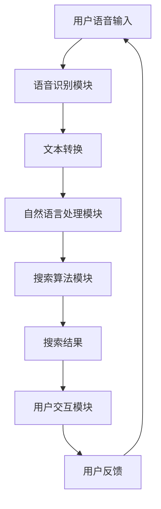

                 

# 《语音搜索：AI在电商中的应用》

## 关键词
- 语音搜索
- AI技术
- 电商应用
- 语音识别
- 自然语言处理

## 摘要
随着人工智能技术的飞速发展，语音搜索作为一种创新的人机交互方式，正在逐渐改变电商行业的用户体验。本文将深入探讨语音搜索技术在电商中的应用，包括其基础技术、应用架构、实战案例以及未来发展趋势。通过详细的分析和讲解，本文旨在为电商从业者提供关于语音搜索技术的全面了解，助力企业创新和提升竞争力。

## 目录大纲

### 第一部分：语音搜索技术基础

#### 第1章：语音搜索概述
1.1 语音搜索的定义与重要性
1.2 语音搜索的发展历程
1.3 语音搜索在电商中的应用场景

#### 第2章：语音识别技术
2.1 语音识别原理
2.2 常见语音识别算法
2.3 语音识别技术挑战与优化策略

#### 第3章：自然语言处理技术
3.1 自然语言处理基本概念
3.2 常见自然语言处理算法
3.3 自然语言处理在语音搜索中的应用

### 第二部分：语音搜索应用架构与实现

#### 第4章：语音搜索系统架构
4.1 语音搜索系统整体架构
4.2 语音搜索系统关键模块
4.3 语音搜索系统性能优化策略

#### 第5章：语音搜索算法实现
5.1 语音识别算法实现
5.2 命名实体识别算法实现
5.3 语义理解算法实现

#### 第6章：语音搜索应用案例
6.1 案例一：基于语音搜索的智能客服系统
6.2 案例二：基于语音搜索的电商推荐系统
6.3 案例三：基于语音搜索的智能导航系统

### 第三部分：语音搜索在电商中的实战应用

#### 第7章：语音搜索在电商中的价值分析
7.1 语音搜索提升电商用户体验
7.2 语音搜索提高电商转化率
7.3 语音搜索助力电商业务创新

#### 第8章：语音搜索电商应用实战
8.1 实战一：搭建语音搜索电商平台
8.2 实战二：优化语音搜索算法
8.3 实战三：语音搜索系统部署与运维

#### 第9章：未来语音搜索发展趋势
9.1 语音搜索与人工智能的结合
9.2 语音搜索在多场景中的应用
9.3 语音搜索技术的未来发展方向

### 附录

#### 附录A：语音搜索相关开源工具与资源
A.1 语音识别开源工具
A.2 自然语言处理开源工具
A.3 语音搜索开源框架和案例

#### 第10章：语音搜索相关 Mermaid 流程图
10.1 语音搜索系统流程图
10.2 语音识别算法流程图
10.3 语义理解算法流程图

#### 第11章：语音搜索算法伪代码
11.1 语音识别算法伪代码
11.2 命名实体识别算法伪代码
11.3 语义理解算法伪代码

#### 第12章：数学模型和数学公式
12.1 语音识别的数学模型
12.2 自然语言处理的数学模型
12.3 语义理解的数学模型

#### 第13章：项目实战
13.1 实战一：搭建语音搜索系统
13.2 实战二：优化语音搜索算法
13.3 实战三：语音搜索系统部署与运维

### 正文

#### 第1章：语音搜索概述
#### 1.1 语音搜索的定义与重要性
语音搜索（Voice Search）是指通过语音识别技术将用户的语音输入转换为文本，然后利用自然语言处理技术对输入文本进行理解和搜索的技术。语音搜索的核心在于将用户的语音转化为有效的文本查询，进而通过搜索引擎或者推荐系统找到用户所需的信息或商品。

随着智能手机的普及和移动互联网的快速发展，用户对于便捷、高效的信息获取需求日益增长。语音搜索以其自然、直观、快速的特点，正逐渐成为人们日常生活的重要组成部分。在电商领域，语音搜索的重要性尤为突出，它不仅可以提升用户体验，还可以提高电商平台的转化率和用户粘性。

#### 1.2 语音搜索的发展历程
语音搜索技术的发展可以追溯到20世纪50年代，当时的研究主要集中在语音识别领域。随着计算能力的提升和算法的改进，语音识别技术逐渐成熟。从最初的基于规则的方法，发展到基于隐马尔可夫模型（HMM）和人工神经网络的识别方法，再到现在的深度学习算法，语音识别技术的准确率得到了显著提高。

自然语言处理技术的发展同样为语音搜索提供了坚实的基础。从基于规则的方法到统计方法，再到现代的深度学习方法，自然语言处理技术不断进步，使得语音搜索能够更好地理解用户的意图和需求。

#### 1.3 语音搜索在电商中的应用场景
在电商领域，语音搜索的应用场景非常广泛。以下是几个典型的应用场景：

1. **商品搜索**：用户可以通过语音输入关键词，快速找到想要的商品，提高购物效率。
2. **智能客服**：通过语音识别技术，电商平台可以提供智能客服服务，快速响应用户的问题和需求。
3. **语音导航**：用户可以通过语音指令获取购物中心的导航信息，提高购物体验。
4. **个性化推荐**：根据用户的语音输入和历史行为，电商平台可以提供个性化的商品推荐。

#### 第2章：语音识别技术
#### 2.1 语音识别原理
语音识别技术的基本原理是将语音信号转换为文本。这一过程通常包括以下几个步骤：

1. **语音信号预处理**：包括去除噪声、增强信号等，以提高语音质量。
2. **特征提取**：将预处理后的语音信号转换为特征向量，如梅尔频率倒谱系数（MFCC）。
3. **模型训练**：使用大量的语音数据训练模型，使其能够识别不同的语音。
4. **解码**：将识别出的特征向量解码为对应的文本。

#### 2.2 常见语音识别算法
语音识别算法主要可以分为以下几种：

1. **隐马尔可夫模型（HMM）**：HMM是一种基于统计模型的语音识别方法，通过建立状态转移概率和观测概率来识别语音。
2. **支持向量机（SVM）**：SVM是一种分类算法，可以用于语音识别中的分类任务。
3. **深度神经网络（DNN）**：DNN通过多层神经元的组合，能够有效地学习语音特征和模式。
4. **卷积神经网络（CNN）**：CNN在图像处理领域表现出色，近年来也被引入到语音识别领域，用于特征提取和分类。
5. **递归神经网络（RNN）**：RNN特别适合处理序列数据，如语音信号，能够捕捉语音信号的时间动态特征。

#### 2.3 语音识别技术挑战与优化策略
尽管语音识别技术在不断发展，但仍面临一些挑战：

1. **多语言识别**：不同语言有不同的发音和语言特征，如何实现多语言语音识别仍是一个难题。
2. **噪声干扰**：在实际环境中，语音信号可能会受到各种噪声干扰，如何去除噪声、提高识别准确率是关键。
3. **语音变体**：不同的说话人、口音、语速等都会影响语音识别的准确性。
4. **实时性**：在实时应用中，如何快速处理语音信号、提供实时响应是一个挑战。

针对这些挑战，可以采用以下优化策略：

1. **数据增强**：通过增加训练数据量、引入噪声数据等方式，提高模型的泛化能力。
2. **多模型融合**：将不同的语音识别算法进行融合，取长补短，提高识别准确率。
3. **深度学习算法**：使用更先进的深度学习算法，如长短期记忆网络（LSTM）、变换器（Transformer）等，提高语音识别的效率和准确性。
4. **端到端训练**：通过端到端训练，将语音信号直接映射到文本，减少中间步骤，提高模型效率。

#### 第3章：自然语言处理技术
#### 3.1 自然语言处理基本概念
自然语言处理（Natural Language Processing，NLP）是人工智能的一个重要分支，旨在使计算机能够理解、处理和生成自然语言。NLP的基本概念包括：

1. **词法分析**：将文本分解为单词或其他词汇单元。
2. **句法分析**：分析句子的结构，理解语法规则。
3. **语义分析**：理解句子的含义，捕捉词汇和短语之间的关系。
4. **语用分析**：理解语言在特定情境下的使用和含义。

#### 3.2 常见自然语言处理算法
常见的NLP算法包括：

1. **词袋模型**：将文本表示为一个单词的向量，通过统计单词的频率来分析文本。
2. **朴素贝叶斯分类器**：基于贝叶斯定理，通过特征概率分布来分类文本。
3. **条件随机场（CRF）**：用于处理序列数据，如词性标注和命名实体识别。
4. **长短期记忆网络（LSTM）**：用于处理序列数据，能够捕捉长距离依赖关系。
5. **变换器（Transformer）**：基于自注意力机制，能够高效地处理长文本和跨语言任务。

#### 3.3 自然语言处理在语音搜索中的应用
在语音搜索中，自然语言处理技术发挥着至关重要的作用：

1. **语音到文本转换**：通过NLP技术，将语音输入转换为文本，为后续搜索和推荐提供基础。
2. **语义理解**：理解用户的语音输入，捕捉其意图和需求，提供准确的搜索结果。
3. **问答系统**：利用NLP技术，构建智能问答系统，为用户提供实时、准确的答案。
4. **情感分析**：通过分析用户的语音输入，捕捉其情感和态度，为个性化推荐和用户体验优化提供支持。

### 第4章：语音搜索系统架构
#### 4.1 语音搜索系统整体架构
语音搜索系统的整体架构通常包括以下几个关键模块：

1. **语音识别模块**：负责将用户的语音输入转换为文本。
2. **自然语言处理模块**：对转换后的文本进行处理，提取关键词、理解语义等。
3. **搜索算法模块**：基于处理后的文本，利用搜索引擎或推荐系统提供搜索结果。
4. **用户交互模块**：与用户进行交互，展示搜索结果，收集用户反馈等。

#### 4.2 语音搜索系统关键模块
以下是语音搜索系统的几个关键模块及其功能：

1. **语音识别模块**：利用语音识别算法，将用户的语音输入转换为文本。此模块的性能直接影响搜索结果的准确性。
2. **自然语言处理模块**：对转换后的文本进行处理，包括分词、词性标注、命名实体识别等，以便更好地理解用户的意图。
3. **搜索算法模块**：利用搜索引擎或推荐系统，根据处理后的文本提供搜索结果。此模块的性能直接影响搜索结果的质量。
4. **用户交互模块**：与用户进行交互，展示搜索结果，收集用户反馈，以便优化系统。

#### 4.3 语音搜索系统性能优化策略
为了提高语音搜索系统的性能，可以采用以下优化策略：

1. **模型优化**：通过改进语音识别和自然语言处理算法，提高文本转换和语义理解的准确性。
2. **数据增强**：通过引入更多的训练数据和噪声数据，提高模型的泛化能力。
3. **硬件优化**：利用高性能的硬件设备，如GPU，提高系统的处理速度和效率。
4. **系统优化**：通过改进系统的架构和算法，减少延迟和响应时间，提高用户体验。

### 第5章：语音搜索算法实现
#### 5.1 语音识别算法实现
语音识别算法的实现主要包括以下几个步骤：

1. **语音信号预处理**：包括去除噪声、增强信号等，以提高语音质量。
2. **特征提取**：将预处理后的语音信号转换为特征向量，如梅尔频率倒谱系数（MFCC）。
3. **模型训练**：使用大量的语音数据训练模型，使其能够识别不同的语音。
4. **解码**：将识别出的特征向量解码为对应的文本。

以下是语音识别算法的实现伪代码：

```python
# 语音信号预处理
preprocessed_audio = preprocess_audio(audio)

# 特征提取
mfcc_features = extract_mfcc(preprocessed_audio)

# 模型训练
model = train_model(mfcc_features, labels)

# 解码
predicted_text = model.decode(mfcc_features)
```

#### 5.2 命名实体识别算法实现
命名实体识别（Named Entity Recognition，NER）是自然语言处理中的一个重要任务，旨在识别文本中的命名实体，如人名、地名、组织名等。以下是命名实体识别算法的实现伪代码：

```python
# 分词
tokenized_text = tokenize(text)

# 词性标注
pos_tags = pos_tag(tokenized_text)

# 命名实体识别
entities = []
for word, tag in pos_tags:
    if is_entity(tag):
        entities.append(word)

# 输出命名实体列表
print(entities)
```

#### 5.3 语义理解算法实现
语义理解（Semantic Understanding）是自然语言处理的核心任务之一，旨在理解文本的含义和语义。以下是语义理解算法的实现伪代码：

```python
# 语义分析
semantic_representation = analyze_semantics(text)

# 关键词提取
key_phrases = extract_key_phrases(semantic_representation)

# 意图理解
user_intent = understand_intent(key_phrases)

# 输出用户意图
print(user_intent)
```

### 第6章：语音搜索应用案例
#### 6.1 案例一：基于语音搜索的智能客服系统
智能客服系统是语音搜索在电商领域的一个重要应用。通过语音识别和自然语言处理技术，智能客服系统能够快速响应用户的问题和需求，提供个性化的服务。以下是该案例的实现步骤：

1. **语音输入**：用户通过语音输入提出问题。
2. **语音识别**：将语音输入转换为文本。
3. **语义理解**：理解用户的意图和需求。
4. **知识库查询**：根据用户意图，查询知识库获取答案。
5. **语音输出**：将答案通过语音输出给用户。

#### 6.2 案例二：基于语音搜索的电商推荐系统
电商推荐系统利用语音搜索技术，可以根据用户的语音输入和购物历史，提供个性化的商品推荐。以下是该案例的实现步骤：

1. **语音输入**：用户通过语音输入搜索关键词。
2. **语音识别**：将语音输入转换为文本。
3. **用户画像构建**：根据用户历史行为构建用户画像。
4. **推荐算法**：基于用户画像和搜索关键词，利用推荐算法生成商品推荐列表。
5. **语音输出**：将推荐结果通过语音输出给用户。

#### 6.3 案例三：基于语音搜索的智能导航系统
智能导航系统利用语音搜索技术，可以帮助用户在购物中心等场所进行智能导航。以下是该案例的实现步骤：

1. **语音输入**：用户通过语音输入目的地名称。
2. **语音识别**：将语音输入转换为文本。
3. **地图检索**：根据用户输入的文本，检索地图信息获取路线。
4. **语音输出**：将导航信息通过语音输出给用户。

### 第7章：语音搜索在电商中的价值分析
#### 7.1 语音搜索提升电商用户体验
语音搜索作为一种创新的人机交互方式，可以显著提升电商用户体验。通过语音输入，用户可以快速找到所需的商品，无需手动输入关键词，节省时间。此外，语音搜索还能理解用户的意图，提供更加个性化的搜索结果，提高用户满意度。

#### 7.2 语音搜索提高电商转化率
语音搜索可以减少用户的购物决策时间，提高购买意愿。用户通过语音输入，可以快速获取商品信息，减少浏览和比较的时间，从而提高转化率。此外，语音搜索还能提供个性化的商品推荐，增加用户的购买机会。

#### 7.3 语音搜索助力电商业务创新
语音搜索为电商平台提供了新的业务模式和创新机会。通过语音搜索，电商平台可以提供智能客服、语音导航等服务，提升用户购物体验。此外，语音搜索还可以应用于智能推荐、语音广告等新兴领域，助力电商业务创新。

### 第8章：语音搜索电商应用实战
#### 8.1 实战一：搭建语音搜索电商平台
搭建语音搜索电商平台需要考虑以下步骤：

1. **需求分析**：明确语音搜索的应用场景和功能需求。
2. **技术选型**：选择合适的语音识别和自然语言处理技术。
3. **数据准备**：收集语音数据、商品数据等，用于模型训练和测试。
4. **模型训练**：使用语音数据和商品数据训练语音识别和自然语言处理模型。
5. **系统集成**：将语音识别和自然语言处理模块集成到电商平台中。
6. **测试与优化**：对系统进行测试，收集用户反馈，不断优化系统性能。

#### 8.2 实战二：优化语音搜索算法
优化语音搜索算法可以从以下几个方面进行：

1. **特征提取**：改进特征提取方法，提高语音识别准确性。
2. **模型优化**：使用更先进的模型，如变换器（Transformer），提高自然语言处理性能。
3. **数据增强**：通过引入噪声数据和多语言数据，提高模型的泛化能力。
4. **算法融合**：将不同的语音识别和自然语言处理算法进行融合，取长补短，提高整体性能。

#### 8.3 实战三：语音搜索系统部署与运维
部署语音搜索系统需要考虑以下步骤：

1. **硬件部署**：选择合适的硬件设备，如GPU、服务器等，保证系统的运行效率。
2. **软件部署**：将语音搜索系统的代码部署到服务器，配置合适的运行环境。
3. **监控系统**：搭建监控系统，实时监控系统的运行状态和性能。
4. **运维管理**：定期更新和维护系统，确保系统的稳定性和安全性。
5. **用户反馈**：收集用户反馈，不断优化系统，提升用户体验。

### 第9章：未来语音搜索发展趋势
#### 9.1 语音搜索与人工智能的结合
随着人工智能技术的不断发展，语音搜索与人工智能的结合将更加紧密。通过深度学习和强化学习等技术，语音搜索系统将能够更好地理解用户的意图和需求，提供更加个性化的服务。

#### 9.2 语音搜索在多场景中的应用
未来，语音搜索将在更多场景中得到应用。除了电商领域，语音搜索还可以应用于医疗、教育、智能家庭等领域，为用户提供便捷的服务。

#### 9.3 语音搜索技术的未来发展方向
未来，语音搜索技术将朝着更加智能、高效、便捷的方向发展。通过引入更先进的算法、更丰富的数据和更高效的硬件，语音搜索系统将能够更好地满足用户的需求，提升用户体验。

### 附录A：语音搜索相关开源工具与资源
以下是几个常用的语音搜索相关开源工具和资源：

1. **SpeechRecognition**：Python语音识别库，支持多种语音识别引擎，如Google语音识别、eSpeak等。
2. **nltk**：Python自然语言处理库，提供词法分析、句法分析、语义分析等功能。
3. **spaCy**：Python自然语言处理库，提供高效的词性标注、命名实体识别、句法分析等功能。
4. **TensorFlow**：Google开发的深度学习框架，可用于语音识别和自然语言处理模型的训练和推理。
5. **PyTorch**：Facebook开发的深度学习框架，提供灵活的模型构建和训练功能。

### 第10章：语音搜索相关 Mermaid 流程图
以下是语音搜索系统的 Mermaid 流程图：



### 第11章：语音搜索算法伪代码
以下是语音识别、命名实体识别和语义理解算法的伪代码：

```python
# 语音识别算法伪代码
preprocessed_audio = preprocess_audio(audio)
mfcc_features = extract_mfcc(preprocessed_audio)
predicted_text = model.decode(mfcc_features)

# 命名实体识别算法伪代码
tokenized_text = tokenize(text)
pos_tags = pos_tag(tokenized_text)
entities = []
for word, tag in pos_tags:
    if is_entity(tag):
        entities.append(word)
print(entities)

# 语义理解算法伪代码
semantic_representation = analyze_semantics(text)
key_phrases = extract_key_phrases(semantic_representation)
user_intent = understand_intent(key_phrases)
print(user_intent)
```

### 第12章：数学模型和数学公式
以下是语音识别、自然语言处理和语义理解中常用的数学模型和数学公式：

```latex
% 语音识别的数学模型
\begin{equation}
P(O|H) = \frac{P(H)P(O|H)}{P(H)}
\end{equation}

% 自然语言处理的数学模型
\begin{equation}
P(w_i|w_{i-1}, ..., w_1) = \frac{P(w_i)P(w_{i-1}|w_i)P(w_{i-2}|w_{i-1}, ..., w_1) ... P(w_1)}
\end{equation}

% 语义理解的数学模型
\begin{equation}
P(S|O) = \frac{P(O|S)P(S)}{P(O)}
\end{equation}
```

### 第13章：项目实战
以下是语音搜索系统的项目实战步骤：

#### 13.1 实战一：搭建语音搜索系统
1. **需求分析**：明确语音搜索系统的功能和性能要求。
2. **技术选型**：选择合适的语音识别和自然语言处理技术。
3. **数据收集**：收集语音数据、商品数据等，用于模型训练和测试。
4. **模型训练**：使用语音数据和商品数据训练语音识别和自然语言处理模型。
5. **系统集成**：将语音识别和自然语言处理模块集成到电商平台中。
6. **测试与优化**：对系统进行测试，收集用户反馈，不断优化系统性能。

#### 13.2 实战二：优化语音搜索算法
1. **特征提取**：改进特征提取方法，提高语音识别准确性。
2. **模型优化**：使用更先进的模型，如变换器（Transformer），提高自然语言处理性能。
3. **数据增强**：通过引入噪声数据和多语言数据，提高模型的泛化能力。
4. **算法融合**：将不同的语音识别和自然语言处理算法进行融合，取长补短，提高整体性能。

#### 13.3 实战三：语音搜索系统部署与运维
1. **硬件部署**：选择合适的硬件设备，如GPU、服务器等，保证系统的运行效率。
2. **软件部署**：将语音搜索系统的代码部署到服务器，配置合适的运行环境。
3. **监控系统**：搭建监控系统，实时监控系统的运行状态和性能。
4. **运维管理**：定期更新和维护系统，确保系统的稳定性和安全性。
5. **用户反馈**：收集用户反馈，不断优化系统，提升用户体验。

## 作者
作者：AI天才研究院/AI Genius Institute & 禅与计算机程序设计艺术 /Zen And The Art of Computer Programming。

