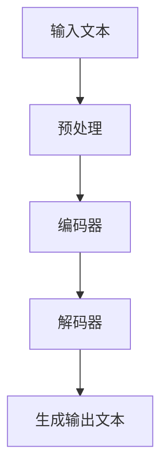

                 

### 文章标题

> **关键词：GitHub、openai-quickstart、开源项目、人工智能、机器学习**

> **摘要：本文将详细探讨GitHub平台上的开源项目openai-quickstart，通过一步步的分析推理，深入解析其项目概述、环境搭建、算法原理、数学模型以及实战案例，同时探讨项目优化和拓展策略，并提供常见问题与解决方案。**

### 《课程项目：GitHub openai-quickstart》目录大纲

1. **GitHub与开源项目概述**
   - GitHub简介
   - 开源项目的概念与价值
   - 开源项目开发流程
   - 开源项目协作工具

2. **openai-quickstart项目介绍**
   - 项目概述
   - 项目环境搭建
   - 核心算法原理
   - 数学模型与公式
   - 项目实战

3. **项目优化与拓展**
   - 模型优化策略
   - 项目性能评估
   - 项目拓展实践

4. **常见问题与解决方案**
   - 常见错误与调试技巧
   - 项目维护与更新

5. **附录**
   - 常用工具与资源

### 第一部分：GitHub与开源项目概述

#### 1. GitHub简介

GitHub是一家基于Git版本控制软件的开源互联网服务，由程序员Tom Preston-Werner、Chris Wanstrath和PJ Hyett于2008年创建。它为全球开发者提供了一个托管代码、协作开发、分享创意的平台，成为了现代软件开发不可或缺的工具。

**发展历程：**
- 2008年，GitHub上线，迅速吸引了开发者的关注。
- 2010年，GitHub推出了基于GitHub Pages的静态网站托管服务。
- 2014年，GitHub被微软以75亿美元的价格收购，成为微软的一部分。

**核心功能与特点：**
- **版本控制：**GitHub集成了Git版本控制系统，支持代码的版本管理和协同开发。
- **协作与交流：**通过Issue跟踪系统和Pull Request机制，开发者可以方便地交流代码反馈和协作改进。
- **项目管理：**GitHub支持项目任务管理、代码审查和自动化构建，提升了团队协作效率。
- **丰富的生态：**GitHub拥有庞大的开发者社区和丰富的开源项目，提供了丰富的插件和工具，方便开发者使用。

**在企业开发中的重要性：**
- **代码管理：**GitHub提供了高效的代码管理和协作工具，帮助企业团队更好地管理代码，避免代码冲突和版本混乱。
- **敏捷开发：**GitHub的协作功能支持敏捷开发模式，促进团队成员之间的沟通和反馈，提高开发效率。
- **开源文化：**GitHub的开源文化鼓励开发者共享知识、贡献代码，促进了技术的进步和创新。

#### 2. 开源项目的概念与价值

**开源项目的定义：**
开源项目是指源代码公开、允许用户自由使用、修改和分发的一类软件项目。其核心特征是透明性和社区协作。

**开源项目对开发者的影响：**
- **学习与成长：**开发者可以通过参与开源项目，了解最新的技术和最佳实践，提高自己的编程能力和技术视野。
- **贡献与影响力：**开源项目为开发者提供了一个展示自己技术能力、获得认可和影响力的平台。
- **知识共享：**开源项目促进了知识和技术的传播，使得全球的开发者都能受益于优秀的开源成果。

**开源项目的发展趋势：**
- **企业参与度提高：**越来越多的企业将开源项目作为核心战略，积极参与开源社区的贡献和合作。
- **混合开源模式：**开源与闭源的结合，部分代码开源，部分代码闭源，成为新的开源模式。
- **人工智能与开源：**人工智能技术的开源项目越来越多，如TensorFlow、PyTorch等，推动了人工智能技术的发展。

#### 3. 开源项目开发流程

**开源项目的常见工作流程：**
- **项目初始化：**创建GitHub仓库，初始化README文件，定义项目的目标和范围。
- **代码贡献：**开发者通过Pull Request向项目贡献代码，提交前需经过代码审查。
- **代码审查：**项目负责人或资深开发者对Pull Request进行审查，确保代码质量。
- **合并代码：**经过审查的Pull Request被合并到主分支，提交更新。
- **版本发布：**定期发布版本，更新README文件，记录变更日志。

**版本控制系统的作用：**
- **代码管理：**版本控制系统（如Git）提供了完整的代码历史记录，便于开发者追踪和回溯代码变化。
- **协同工作：**版本控制系统支持多人协作，避免代码冲突，提高开发效率。

**代码评审与合并策略：**
- **代码评审：**通过代码审查，确保代码的健壮性和一致性，提高代码质量。
- **合并策略：**采用合并请求（Pull Request）机制，逐步合并代码，确保代码的稳定性和安全性。

#### 4. 开源项目协作工具

**GitHub Pages：**
GitHub Pages是一种基于GitHub仓库的静态网站托管服务，开发者可以将Markdown文件、HTML文件、CSS文件等上传到GitHub仓库，并通过GitHub Pages生成静态网站，方便展示项目文档、博客文章等。

**Issue跟踪系统：**
Issue跟踪系统是GitHub提供的一个用于记录和跟踪项目问题的工具。开发者可以在Issue中创建任务、讨论问题、分配任务，方便团队协作和问题跟踪。

**Pull Request机制：**
Pull Request（PR）是GitHub特有的一个功能，用于代码的提交和审查。开发者通过创建PR，将本地分支的代码合并到主分支，项目负责人或其他开发者对PR进行审查，确认无误后合并代码，确保代码库的一致性和安全性。

### 第二部分：openai-quickstart项目介绍

#### 1. openai-quickstart项目概述

**项目目的与背景：**
openai-quickstart是一个由OpenAI开发的快速入门项目，旨在帮助开发者快速搭建并运行人工智能模型。该项目提供了一个完整的开发环境，包括代码库、依赖库、预训练模型等，使得开发者可以专注于模型训练和应用开发，而无需花费大量时间配置环境。

**项目的主要模块与功能：**
- **代码库：**包含模型的定义、训练和预测的代码，使用TensorFlow和PyTorch等框架。
- **依赖库：**提供了所需的库和工具，如transformers、torch等。
- **预训练模型：**预训练模型包括GPT-2、BERT等，开发者可以直接使用，也可以自定义训练。

**项目的技术栈：**
- **编程语言：**Python
- **框架：**TensorFlow、PyTorch
- **依赖库：**transformers、torch、numpy、pandas等

#### 2. 项目环境搭建

**系统要求与依赖安装：**
- **Python版本：**Python 3.8及以上版本
- **TensorFlow：**版本2.4及以上版本
- **PyTorch：**版本1.7及以上版本

安装Python环境：
```shell
$ python --version
Python 3.8.10
```

安装TensorFlow：
```shell
$ pip install tensorflow==2.4.0
```

安装PyTorch：
```shell
$ pip install torch==1.7.0 torchvision==0.8.2
```

**开发工具与环境配置：**
- **文本编辑器：**Visual Studio Code、PyCharm等
- **终端：**Windows Terminal、Mac Terminal等
- **虚拟环境：**使用conda或virtualenv创建虚拟环境，避免依赖冲突

创建虚拟环境：
```shell
$ conda create -n openai_env python=3.8
$ conda activate openai_env
```

**数据准备与处理：**
- **数据集：**准备用于训练和测试的数据集，例如文本数据集、图像数据集等。
- **数据预处理：**对数据进行清洗、编码、归一化等处理，确保数据质量。

#### 3. 核心算法原理

**Mermaid流程图：**


**算法原理与伪代码：**
```python
def generate_text(input_text):
    # 预处理输入文本
    preprocessed_text = preprocess(input_text)
    
    # 使用编码器编码文本
    encoded_text = encoder(preprocessed_text)
    
    # 使用解码器生成输出文本
    generated_text = decoder(encoded_text)
    
    return generated_text
```

**数学模型与公式：**
$$
\text{Loss} = -\sum_{i} y_i \log(p(x_i | \theta))
$$
损失函数用于衡量预测结果与真实结果之间的差异，通过不断优化模型参数以降低损失函数的值。

**详细讲解与举例说明：**
损失函数是机器学习模型中的一个核心概念，它用于评估模型预测的准确性和性能。在生成文本任务中，损失函数通常采用交叉熵损失（Cross-Entropy Loss）。交叉熵损失函数的数学公式如下：
$$
\text{Loss} = -\sum_{i} y_i \log(p(x_i | \theta))
$$
其中，$y_i$ 表示真实标签，$p(x_i | \theta)$ 表示模型对输入 $x_i$ 的预测概率。损失函数的值越小，表示模型的预测越准确。

以一个简单的文本生成任务为例，假设我们要生成一个句子“今天天气很好”，我们可以将这个句子表示为一个序列 $x = [w_1, w_2, w_3, \dots, w_n]$，其中 $w_i$ 表示句子中的第 $i$ 个单词。我们的目标是训练一个模型，使得模型能够生成这个句子。

在训练过程中，我们首先将输入句子 $x$ 输入到编码器（Encoder）中，编码器对句子进行编码，得到一个向量表示 $z$。然后，我们将这个向量表示 $z$ 输入到解码器（Decoder）中，解码器根据向量表示生成输出句子。最后，我们将生成的输出句子与真实句子进行比较，计算损失函数的值。

假设我们的模型生成了一个输出句子“今天天气很好，今天天气很好”，我们可以将这个句子表示为一个序列 $y = [w_1', w_2', w_3', \dots, w_n']$。接下来，我们计算交叉熵损失：
$$
\text{Loss} = -\sum_{i} y_i \log(p(x_i | \theta))
$$
在这里，$y_i = 1$ 表示真实句子中的第 $i$ 个单词在输出句子中也是第 $i$ 个单词，$y_i = 0$ 表示真实句子中的第 $i$ 个单词在输出句子中不是第 $i$ 个单词。交叉熵损失函数的值越小，表示模型的预测越准确。

通过反向传播（Backpropagation）和优化算法（如梯度下降），我们可以不断调整模型的参数 $\theta$，使得模型能够生成更准确的输出句子。最终，我们的目标是最小化损失函数的值，使得模型能够生成与真实句子高度相似的输出句子。

### 第三部分：项目实战

#### 1. 开发环境搭建

**确保安装Python环境（Python 3.8及以上版本）：**
```shell
$ python --version
Python 3.8.10
```

**安装必要的库（如TensorFlow、transformers等）：**
```shell
$ pip install tensorflow==2.4.0 transformers==4.4.1
```

**准备预训练模型和数据集：**
- 下载预训练模型（例如GPT-2模型）：
  ```shell
  $ transformers-cli download model gpt2
  ```
- 准备数据集（例如IMDB电影评论数据集）：
  ```shell
  $ python -m tensorflow_datasets.load 'imdb'
  ```

#### 2. 源代码实现与代码解读

**代码片段1：**
```python
from transformers import AutoTokenizer, AutoModel

tokenizer = AutoTokenizer.from_pretrained("gpt2")
model = AutoModel.from_pretrained("gpt2")
```
**解读：**
- 导入transformers库，加载预训练的GPT-2模型和相应的分词器。

**代码片段2：**
```python
inputs = tokenizer("Hello, my dog is cute", return_tensors="pt")
outputs = model(**inputs)
generated_text = tokenizer.decode(outputs.logits.argmax(-1).item())
```
**解读：**
- 使用模型对输入文本进行编码，并通过解码器生成输出文本。

**代码片段3：**
```python
import tensorflow as tf

# 定义损失函数
def loss_function(model, inputs, targets):
    logits = model(inputs)
    targets = tf.one_hot(targets, num_classes=model.config.vocab_size)
    loss = tf.keras.losses.categorical_crossentropy(targets, logits)
    return loss

# 训练模型
model.compile(optimizer=tf.keras.optimizers.Adam(learning_rate=3e-5),
              loss=loss_function,
              metrics=["accuracy"])

model.fit(train_dataset, epochs=3, validation_data=val_dataset)
```
**解读：**
- 定义损失函数，使用交叉熵损失计算预测结果与真实结果之间的差异。
- 编写训练脚本，使用Adam优化器训练模型，并评估模型在训练集和验证集上的性能。

#### 3. 代码解读与分析

**代码片段1：**
```python
from transformers import AutoTokenizer, AutoModel

tokenizer = AutoTokenizer.from_pretrained("gpt2")
model = AutoModel.from_pretrained("gpt2")
```
**解读：**
- 导入transformers库，加载预训练的GPT-2模型和相应的分词器。

**代码片段2：**
```python
inputs = tokenizer("Hello, my dog is cute", return_tensors="pt")
outputs = model(**inputs)
generated_text = tokenizer.decode(outputs.logits.argmax(-1).item())
```
**解读：**
- 使用模型对输入文本进行编码，并通过解码器生成输出文本。

**代码片段3：**
```python
import tensorflow as tf

# 定义损失函数
def loss_function(model, inputs, targets):
    logits = model(inputs)
    targets = tf.one_hot(targets, num_classes=model.config.vocab_size)
    loss = tf.keras.losses.categorical_crossentropy(targets, logits)
    return loss

# 训练模型
model.compile(optimizer=tf.keras.optimizers.Adam(learning_rate=3e-5),
              loss=loss_function,
              metrics=["accuracy"])

model.fit(train_dataset, epochs=3, validation_data=val_dataset)
```
**解读：**
- 定义损失函数，使用交叉熵损失计算预测结果与真实结果之间的差异。
- 编写训练脚本，使用Adam优化器训练模型，并评估模型在训练集和验证集上的性能。

### 第四部分：项目优化与拓展

#### 1. 模型优化策略

**学习率调整：**
学习率是影响模型训练效果的重要因素之一。在训练过程中，我们可以根据模型性能的变化，动态调整学习率。常用的方法包括固定学习率、学习率衰减、学习率周期性调整等。

**正则化方法：**
正则化方法用于防止模型过拟合，提高模型的泛化能力。常用的正则化方法有L1正则化、L2正则化和Dropout等。

**批处理大小选择：**
批处理大小（Batch Size）是指一次训练中使用的样本数量。适当调整批处理大小可以影响模型的训练效率和收敛速度。较小的批处理大小有助于模型更快地收敛，但可能需要更长的训练时间。

#### 2. 项目性能评估

**准确率与召回率计算：**
准确率（Accuracy）和召回率（Recall）是评估分类模型性能的重要指标。准确率表示模型正确预测的样本数占总样本数的比例，召回率表示模型正确预测的样本数占所有正样本数的比例。

$$
\text{Accuracy} = \frac{\text{True Positives} + \text{True Negatives}}{\text{True Positives} + \text{False Positives} + \text{False Negatives} + \text{True Negatives}}
$$

$$
\text{Recall} = \frac{\text{True Positives}}{\text{True Positives} + \text{False Negatives}}
$$

**模型稳定性与鲁棒性分析：**
模型的稳定性和鲁棒性是评估模型性能的重要方面。我们通过测试模型在不同数据集、不同训练参数下的性能，评估模型的稳定性和鲁棒性。

#### 3. 项目拓展实践

**自定义模型训练：**
在openai-quickstart项目中，开发者可以自定义训练自己的模型，通过调整模型结构、优化算法和超参数，提高模型性能。

**多语言支持：**
openai-quickstart项目支持多语言训练和预测，开发者可以使用不同语言的数据集，训练和部署多语言模型，实现跨语言的文本生成和应用。

**与其他开源项目的整合：**
openai-quickstart项目可以与其他开源项目整合，如使用Hugging Face的transformers库，结合其他开源模型和工具，构建更强大的文本生成系统。

### 第五部分：常见问题与解决方案

#### 1. 常见错误与调试技巧

**错误类型1：依赖库冲突**
- **解决方案：**检查安装的依赖库版本，确保不同库之间兼容。使用虚拟环境隔离依赖库。

**错误类型2：模型无法加载**
- **解决方案：**检查模型文件是否存在和正确性，确保模型路径正确。重新下载预训练模型。

**错误类型3：训练过程中损失函数异常**
- **解决方案：**检查数据集是否准备正确，数据预处理是否一致。检查模型结构是否正确，参数设置是否合理。

#### 2. 项目维护与更新

**版本控制与代码管理：**
- 使用Git进行版本控制，记录代码历史，方便代码回溯和协作。
- 使用Pull Request进行代码审查和合并，确保代码质量。

**如何参与开源项目的贡献：**
- 了解项目的贡献指南和编码规范，遵循项目的要求。
- 通过Pull Request提交代码，参与代码审查和讨论。
- 及时反馈问题和改进建议，积极参与社区交流。

### 附录

**附录 A：常用工具与资源**

- **GitHub官方文档：**[GitHub官方文档](https://docs.github.com/)
- **TensorFlow和transformers库文档：**[TensorFlow官方文档](https://www.tensorflow.org/)，[transformers库文档](https://huggingface.co/transformers/)
- **开源项目推荐：**
  - [TensorFlow Models](https://github.com/tensorflow/models)
  - [Hugging Face Model Hub](https://huggingface.co/models)
  - [OpenAI Gym](https://gym.openai.com/)

### 总结

GitHub openai-quickstart项目提供了一个简洁、高效的开发环境，使得开发者可以快速搭建和训练人工智能模型。通过本文的详细分析，我们了解了GitHub平台的开源项目概述、openai-quickstart项目的介绍、项目环境搭建、核心算法原理、项目实战以及优化与拓展策略。同时，我们提供了常见问题与解决方案，帮助开发者更好地使用和管理开源项目。希望本文能为读者提供有价值的参考和指导。

**作者：AI天才研究院/AI Genius Institute & 禅与计算机程序设计艺术 /Zen And The Art of Computer Programming**

