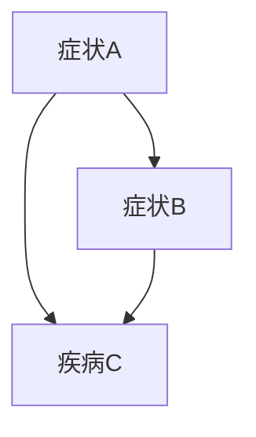

                 

# 贝叶斯网络 (Bayesian Networks) 原理与代码实例讲解

## 关键词

- 贝叶斯网络
- 概率图模型
- 条件概率
- 贝叶斯推理
- 机器学习
- 数据挖掘
- 医学诊断
- 金融风险控制

## 摘要

贝叶斯网络是一种用于表示变量之间概率关系的概率图模型。本文将详细讲解贝叶斯网络的基本原理、构建方法、推理算法以及在机器学习、数据挖掘、医学诊断和金融风险控制等领域的实际应用。通过代码实例，我们将展示如何使用贝叶斯网络进行建模和推理，帮助读者深入理解这一强大的工具。

## 目录大纲

### 第一部分：贝叶斯网络基础

#### 第1章：贝叶斯网络简介

#### 第2章：概率基础

#### 第3章：贝叶斯网络的基本结构

#### 第4章：贝叶斯网络的参数学习

#### 第5章：贝叶斯网络的推理算法

### 第二部分：贝叶斯网络的实际应用

#### 第6章：贝叶斯网络在机器学习中的应用

#### 第7章：贝叶斯网络在数据挖掘中的应用

#### 第8章：贝叶斯网络在医学诊断中的应用

#### 第9章：贝叶斯网络在金融风险控制中的应用

#### 第10章：贝叶斯网络的代码实例

### 第三部分：贝叶斯网络的未来发展

#### 第11章：贝叶斯网络与其他概率图模型的融合

#### 第12章：贝叶斯网络在深度学习中的应用

#### 第13章：贝叶斯网络的挑战与未来发展方向

#### 第14章：附录

### 正文部分

#### 第1章：贝叶斯网络简介

贝叶斯网络（Bayesian Network，简称BN）是一种概率图模型，用于表示一组随机变量之间的条件依赖关系。它由一个有向无环图（DAG）和一组条件概率表（CPT）组成。DAG表示变量之间的依赖结构，CPT则提供了变量之间条件概率的具体数值。

贝叶斯网络最早由Jay Oregeon教授在1985年提出，主要用于解决不确定性问题。自从提出以来，贝叶斯网络在多个领域得到了广泛应用，如机器学习、数据挖掘、医学诊断和金融风险控制等。

贝叶斯网络的主要优势在于其简洁性和可解释性。通过贝叶斯网络，我们可以直观地了解变量之间的依赖关系，从而进行有效的推理和预测。

## 贝叶斯网络的基本结构

贝叶斯网络由两个主要部分组成：有向无环图（DAG）和条件概率表（CPT）。

### 有向无环图（DAG）

有向无环图是一种无向图，其中的边具有方向性。在贝叶斯网络中，节点表示随机变量，边表示变量之间的条件依赖关系。

例如，考虑一个简单的贝叶斯网络，用于描述疾病诊断问题。该网络包含三个变量：症状A、症状B和疾病C。根据医学知识，症状A和症状B都是疾病C的先兆，但它们之间没有直接关系。这个关系可以用下面的有向无环图表示：



### 条件概率表（CPT）

条件概率表（CPT）用于表示变量之间的条件概率。在贝叶斯网络中，每个节点都有一个CPT，描述了该节点在不同状态下的条件概率。

以疾病诊断问题为例，假设我们已知疾病C的发生概率是0.2。根据医学知识，症状A发生的概率是0.8，症状B发生的概率是0.6，但它们在疾病C发生时的条件概率是不同的。这些信息可以用条件概率表表示：

| 症状A | 症状B | 疾病C |
|-------|-------|-------|
| 0.2   | 0.3   | 0.2   |
| 0.8   | 0.7   | 0.8   |

在这个表中，第一行和第一列分别表示症状A和症状B的状态，其他单元格表示在给定症状A和症状B的状态下，疾病C发生的条件概率。

通过DAG和CPT，贝叶斯网络可以表示一组随机变量之间的条件依赖关系，从而实现有效的推理和预测。

## 贝叶斯网络的参数学习

贝叶斯网络的参数学习是指从数据中学习变量之间的条件依赖关系。常见的参数学习方法包括监督学习和无监督学习。

### 监督学习

监督学习是一种有监督的学习方法，需要输入输出数据对。在贝叶斯网络的参数学习中，我们可以使用监督学习来估计CPT。具体步骤如下：

1. 收集一组数据，包含变量之间的观测值。
2. 对每个变量，计算其在所有可能状态下的条件概率。
3. 根据条件概率计算CPT。

例如，对于疾病诊断问题，我们可以收集一组患者数据，包含症状A、症状B和疾病C的观测值。然后，计算症状A、症状B和疾病C在所有可能状态下的条件概率，得到CPT。

### 无监督学习

无监督学习是一种无监督的学习方法，不需要输入输出数据对。在贝叶斯网络的参数学习中，我们可以使用无监督学习来学习变量之间的条件依赖关系。常见的无监督学习方法包括隐马尔可夫模型（HMM）和变分推断。

1. **隐马尔可夫模型（HMM）学习**

隐马尔可夫模型（HMM）是一种基于状态转移概率和观测概率的模型。在贝叶斯网络的参数学习中，我们可以使用HMM来学习变量之间的条件依赖关系。具体步骤如下：

- 收集一组数据，包含变量之间的观测值。
- 使用HMM估计状态转移概率和观测概率。
- 将HMM的参数转换为贝叶斯网络的CPT。

2. **变分推断**

变分推断是一种基于概率分布的优化方法。在贝叶斯网络的参数学习中，我们可以使用变分推断来估计CPT。具体步骤如下：

- 定义一个近似的后验分布。
- 使用变分推断优化近似后验分布的参数。
- 将近似后验分布的参数转换为贝叶斯网络的CPT。

通过参数学习，我们可以得到一组变量之间的条件依赖关系，从而构建贝叶斯网络。

## 贝叶斯网络的推理算法

贝叶斯网络的推理算法是指根据已知变量之间的条件依赖关系，推断未知变量的概率分布。贝叶斯网络的推理算法分为确定性推理和不确定性推理两种类型。

### 确定性推理

确定性推理是指根据已知变量的状态，直接计算其他变量的概率分布。常见的确定性推理算法包括：

1. **前向推理（Forward Inference）**

前向推理是一种基于条件概率表的计算方法。具体步骤如下：

- 初始化：将已知变量的概率设为1，其他变量的概率设为0。
- 迭代：对于每个变量，根据条件概率表计算其他变量的概率，并更新这些变量的概率。
- 输出：得到所有变量的概率分布。

2. **后向推理（Backward Inference）**

后向推理是一种基于边缘概率的计算方法。具体步骤如下：

- 初始化：将未知变量的概率设为1，其他变量的概率设为0。
- 迭代：对于每个变量，根据边缘概率和条件概率表计算其他变量的概率，并更新这些变量的概率。
- 输出：得到所有变量的概率分布。

### 不确定性推理

不确定性推理是指根据已知变量之间的条件依赖关系，推断其他变量的概率分布，同时考虑不确定性。常见的不确定性推理算法包括：

1. **贝叶斯推理（Bayesian Inference）**

贝叶斯推理是一种基于贝叶斯定理的计算方法。具体步骤如下：

- 初始化：将已知变量的概率设为1，其他变量的概率设为0。
- 迭代：对于每个变量，根据条件概率表和贝叶斯定理计算其他变量的概率，并更新这些变量的概率。
- 输出：得到所有变量的概率分布。

2. **蒙特卡罗推理（Monte Carlo Inference）**

蒙特卡罗推理是一种基于随机采样的计算方法。具体步骤如下：

- 初始化：生成一组随机样本，表示变量之间的状态。
- 迭代：对于每个样本，根据条件概率表计算其他变量的概率，并更新这些变量的概率。
- 输出：根据样本分布估计所有变量的概率分布。

通过这些推理算法，我们可以根据已知变量的状态，推断未知变量的概率分布，从而进行有效的推理和预测。

## 贝叶斯网络在机器学习中的应用

贝叶斯网络在机器学习领域有着广泛的应用。它不仅可以用于特征选择和分类，还可以用于聚类和回归。以下是一些常见的应用场景：

### 贝叶斯分类器

贝叶斯分类器是一种基于贝叶斯定理的分类算法。它通过学习数据集中的先验概率和条件概率，对新的样本进行分类。贝叶斯分类器的优点是简单、高效，且在小样本情况下表现良好。

#### 示例：邮件分类

假设我们要构建一个贝叶斯分类器，用于将邮件分为垃圾邮件和正常邮件。我们可以使用以下步骤：

1. 收集邮件数据集，包含邮件的内容和标签（垃圾邮件或正常邮件）。
2. 对邮件内容进行预处理，提取特征。
3. 计算每个特征的先验概率（即每个特征在垃圾邮件和正常邮件中的概率）。
4. 计算每个特征在给定标签条件下的条件概率。
5. 对于新的邮件，根据贝叶斯定理计算其属于垃圾邮件和正常邮件的概率，选择概率较高的类别作为预测结果。

### 贝叶斯回归

贝叶斯回归是一种基于贝叶斯理论的回归算法。它通过学习数据集中的先验概率和条件概率，对新的样本进行回归预测。贝叶斯回归的优点是能够处理不确定性和非线性关系。

#### 示例：房价预测

假设我们要使用贝叶斯回归预测房价。我们可以使用以下步骤：

1. 收集房价数据集，包含房屋的各个特征和房价。
2. 对数据集进行预处理，提取特征。
3. 选择一个先验分布，例如高斯分布。
4. 计算每个特征的先验概率。
5. 计算每个特征在给定房价条件下的条件概率。
6. 对于新的房屋，根据贝叶斯定理计算其房价的概率分布，选择概率最高的房价作为预测结果。

### 贝叶斯聚类

贝叶斯聚类是一种基于贝叶斯理论的聚类算法。它通过学习数据集中的先验概率和条件概率，将数据集划分为多个类别。贝叶斯聚类的优点是能够处理不确定性和复杂的聚类结构。

#### 示例：客户细分

假设我们要使用贝叶斯聚类对客户进行细分。我们可以使用以下步骤：

1. 收集客户数据集，包含客户的各个特征。
2. 对数据集进行预处理，提取特征。
3. 选择一个先验分布，例如高斯分布。
4. 计算每个特征的先验概率。
5. 计算每个特征在给定类别条件下的条件概率。
6. 使用贝叶斯推理算法，将客户划分为多个类别。

通过这些应用实例，我们可以看到贝叶斯网络在机器学习中的强大功能。它不仅可以用于分类、回归和聚类，还可以处理不确定性和非线性关系，为数据分析和决策提供有力支持。

## 贝叶斯网络在数据挖掘中的应用

贝叶斯网络在数据挖掘领域有着广泛的应用。它不仅可以用于数据预处理、特征选择和分类，还可以用于聚类和关联规则挖掘。以下是一些常见的应用场景：

### 数据预处理

数据预处理是数据挖掘的重要步骤之一。贝叶斯网络可以用于数据清洗、数据转换和数据规范化等任务。

#### 示例：缺失值填充

假设我们要使用贝叶斯网络进行缺失值填充。我们可以使用以下步骤：

1. 收集数据集，包含可能存在缺失值的数据。
2. 使用贝叶斯网络建模数据集，计算变量之间的条件依赖关系。
3. 对于缺失值的变量，根据条件概率表计算其在其他变量条件下的条件概率。
4. 填充缺失值，得到完整的数据集。

### 特征选择

特征选择是数据挖掘中的重要任务之一。贝叶斯网络可以用于评估特征的重要性，从而进行特征选择。

#### 示例：特征重要性评估

假设我们要使用贝叶斯网络进行特征重要性评估。我们可以使用以下步骤：

1. 收集数据集，包含多个特征和目标变量。
2. 建立贝叶斯网络模型，计算变量之间的条件依赖关系。
3. 使用贝叶斯推理算法，计算每个特征在给定目标变量条件下的条件概率。
4. 根据条件概率评估特征的重要性，选择重要的特征。

### 分类

分类是数据挖掘中的重要任务之一。贝叶斯网络可以用于构建分类模型，对新的样本进行分类。

#### 示例：客户分类

假设我们要使用贝叶斯网络对客户进行分类。我们可以使用以下步骤：

1. 收集客户数据集，包含客户的各个特征。
2. 建立贝叶斯网络模型，计算变量之间的条件依赖关系。
3. 训练贝叶斯网络模型，学习先验概率和条件概率。
4. 对于新的客户样本，使用贝叶斯定理计算其属于不同类别的概率，选择概率最高的类别作为预测结果。

### 聚类

聚类是数据挖掘中的重要任务之一。贝叶斯网络可以用于构建聚类模型，对数据进行聚类。

#### 示例：客户聚类

假设我们要使用贝叶斯网络对客户进行聚类。我们可以使用以下步骤：

1. 收集客户数据集，包含客户的各个特征。
2. 建立贝叶斯网络模型，计算变量之间的条件依赖关系。
3. 使用贝叶斯推理算法，将客户划分为多个类别。
4. 根据聚类结果，分析客户的特征和相似性。

### 关联规则挖掘

关联规则挖掘是数据挖掘中的重要任务之一。贝叶斯网络可以用于发现数据中的关联关系。

#### 示例：商品关联规则挖掘

假设我们要使用贝叶斯网络进行商品关联规则挖掘。我们可以使用以下步骤：

1. 收集商品数据集，包含多个商品之间的购买关系。
2. 建立贝叶斯网络模型，计算商品之间的条件依赖关系。
3. 使用贝叶斯推理算法，计算商品之间的关联概率。
4. 根据关联概率，生成关联规则。

通过这些应用实例，我们可以看到贝叶斯网络在数据挖掘中的强大功能。它不仅可以用于数据预处理、特征选择、分类、聚类和关联规则挖掘，还可以处理不确定性和非线性关系，为数据分析和决策提供有力支持。

## 贝叶斯网络在医学诊断中的应用

贝叶斯网络在医学诊断中具有广泛的应用。它能够处理复杂的因果关系，提供可解释的推理过程，并能够量化不确定性。以下是一些具体的医学诊断应用场景：

### 疾病诊断

疾病诊断是贝叶斯网络在医学领域的主要应用之一。通过构建贝叶斯网络，医生可以系统地分析患者的症状、检查结果和病史，从而提高诊断的准确性和效率。

#### 示例：流感诊断

假设我们要使用贝叶斯网络诊断流感。我们可以使用以下步骤：

1. **数据收集**：收集包含流感患者和非流感患者的症状数据，如发热、咳嗽、喉咙痛等。
2. **网络构建**：建立贝叶斯网络，包含变量如“发热”、“咳嗽”、“喉咙痛”和“流感”。
3. **参数学习**：通过收集的数据学习每个变量的先验概率和条件概率表。
4. **推理**：输入患者的症状数据，使用贝叶斯推理算法计算患者患有流感的概率。
5. **决策**：根据流感的概率阈值，确定患者是否患有流感。

### 风险评估

贝叶斯网络还可以用于疾病风险评估，为患者提供个性化的健康建议。通过分析患者的遗传信息、生活方式和疾病史，贝叶斯网络可以预测患者患某种疾病的风险。

#### 示例：心血管疾病风险评估

假设我们要使用贝叶斯网络评估患者患心血管疾病的风险。我们可以使用以下步骤：

1. **数据收集**：收集患者的血压、胆固醇水平、吸烟史等数据。
2. **网络构建**：建立贝叶斯网络，包含变量如“血压”、“胆固醇水平”、“吸烟史”和“心血管疾病”。
3. **参数学习**：通过收集的数据学习每个变量的先验概率和条件概率表。
4. **推理**：输入患者的个人信息，使用贝叶斯推理算法计算患者患心血管疾病的风险。
5. **建议**：根据风险水平，为患者提供个性化的健康建议，如饮食调整、锻炼计划等。

### 精准医疗

精准医疗是一种基于个体差异进行疾病预防和治疗的方法。贝叶斯网络可以用于分析患者的基因数据、环境因素和生活方式，为患者提供个性化的治疗方案。

#### 示例：癌症个性化治疗

假设我们要使用贝叶斯网络为癌症患者制定个性化治疗方案。我们可以使用以下步骤：

1. **数据收集**：收集患者的基因突变、癌症类型、病情进展等数据。
2. **网络构建**：建立贝叶斯网络，包含变量如“基因突变”、“癌症类型”、“治疗方案”和“治疗效果”。
3. **参数学习**：通过收集的数据学习每个变量的先验概率和条件概率表。
4. **推理**：输入患者的基因数据和癌症信息，使用贝叶斯推理算法计算最佳治疗方案。
5. **治疗**：根据推理结果，为患者制定个性化的治疗方案。

通过这些应用实例，我们可以看到贝叶斯网络在医学诊断中的强大功能。它不仅能够提高诊断准确性和效率，还可以为患者提供个性化的健康建议和治疗方案，为精准医疗的实现提供有力支持。

## 贝叶斯网络在金融风险控制中的应用

贝叶斯网络在金融风险控制领域具有重要作用，能够帮助金融机构识别和管理风险，优化投资组合，预测市场走势。以下是一些具体的金融风险控制应用场景：

### 风险评估

贝叶斯网络可以用于评估金融产品的风险，为投资者提供参考。通过分析各种因素，如市场波动、信用风险和利率变化，贝叶斯网络可以量化不同金融产品的风险水平。

#### 示例：信用评分模型

假设我们要使用贝叶斯网络构建信用评分模型。我们可以使用以下步骤：

1. **数据收集**：收集客户的信用信息，如信用记录、收入水平、负债情况等。
2. **网络构建**：建立贝叶斯网络，包含变量如“信用记录”、“收入水平”、“负债情况”和“信用评分”。
3. **参数学习**：通过收集的数据学习每个变量的先验概率和条件概率表。
4. **推理**：输入客户的信用信息，使用贝叶斯推理算法计算客户的信用评分。
5. **决策**：根据信用评分，为投资者提供投资建议。

### 投资组合优化

贝叶斯网络可以用于优化投资组合，降低风险，提高收益。通过分析不同资产之间的相关性、历史表现和未来预期，贝叶斯网络可以帮助投资者构建最优的投资组合。

#### 示例：资产配置策略

假设我们要使用贝叶斯网络为投资者制定资产配置策略。我们可以使用以下步骤：

1. **数据收集**：收集不同资产的历史价格、收益率和相关性数据。
2. **网络构建**：建立贝叶斯网络，包含变量如“股票”、“债券”、“房地产”和“投资组合”。
3. **参数学习**：通过收集的数据学习每个变量的先验概率和条件概率表。
4. **推理**：输入投资者的风险偏好和投资目标，使用贝叶斯推理算法计算最佳资产配置比例。
5. **投资**：根据推理结果，为投资者构建最优的投资组合。

### 市场预测

贝叶斯网络可以用于预测金融市场的走势，为投资者提供参考。通过分析市场数据、宏观经济指标和投资者情绪，贝叶斯网络可以预测市场的波动和趋势。

#### 示例：股票市场预测

假设我们要使用贝叶斯网络预测股票市场的走势。我们可以使用以下步骤：

1. **数据收集**：收集股票市场的历史数据，如价格、交易量、利率等。
2. **网络构建**：建立贝叶斯网络，包含变量如“价格”、“交易量”、“利率”和“市场趋势”。
3. **参数学习**：通过收集的数据学习每个变量的先验概率和条件概率表。
4. **推理**：输入当前市场的数据，使用贝叶斯推理算法计算市场趋势的概率分布。
5. **决策**：根据市场趋势的概率分布，为投资者提供买卖建议。

通过这些应用实例，我们可以看到贝叶斯网络在金融风险控制中的强大功能。它不仅能够帮助金融机构识别和管理风险，还可以优化投资组合和预测市场走势，为金融决策提供有力支持。

## 贝叶斯网络的代码实例

在本节中，我们将通过几个具体的代码实例来展示如何使用贝叶斯网络进行建模和推理。这些实例将涵盖贝叶斯网络的构建、参数学习以及推理算法的应用。

### 疾病诊断实例

#### 1. 数据准备

首先，我们需要准备一个包含疾病诊断数据的表格。以下是一个简单的示例：

| 患者ID | 发热 | 咳嗽 | 喉咙痛 | 流感 |
|--------|------|------|--------|------|
| 1      | 是   | 否   | 是     | 是   |
| 2      | 是   | 是   | 是     | 否   |
| 3      | 否   | 是   | 否     | 是   |
| 4      | 否   | 否   | 是     | 是   |

#### 2. 贝叶斯网络构建

接下来，我们使用Python的`pgmpy`库来构建贝叶斯网络。首先安装`pgmpy`：

```bash
pip install pgmpy
```

然后，我们可以使用以下代码构建贝叶斯网络：

```python
from pgmpy.models import BayesianModel
from pgmpy.estimators import MaximumLikelihoodEstimator

# 定义变量和边
model = BayesianModel([
    ('流感', '发热'),
    ('流感', '咳嗽'),
    ('流感', '喉咙痛'),
    ('发热', '喉咙痛'),
    ('咳嗽', '喉咙痛')
])

# 打印网络图
model.plot()
```

这个模型表示了流感、发热、咳嗽和喉咙痛之间的依赖关系。

#### 3. 参数学习

接下来，我们需要学习网络的参数。我们可以使用最大似然估计（MLE）来学习条件概率表：

```python
# 学习条件概率表
cpts = MaximumLikelihoodEstimator.from_data(data, model).to_dict()

# 打印条件概率表
for cpt in cpts.values():
    print(cpt)
```

这个步骤将使用给定的数据学习每个变量的先验概率和条件概率。

#### 4. 推理

现在，我们可以使用贝叶斯推理来预测未知变量。例如，如果我们想预测患者4是否患有流感，我们可以使用以下代码：

```python
from pgmpy.inference import VariableElimination

# 初始化推理引擎
inference = VariableElimination(model)

# 输入已知变量状态
evidence = {'发热': False, '咳嗽': False, '喉咙痛': True}

# 进行推理
query = ['流感']
result = inference.query(variables=query, evidence=evidence)

# 输出结果
print(result)
```

这个步骤将使用已知变量状态计算流感的概率。

### 机器学习应用实例

#### 1. 贝叶斯分类器

我们可以使用贝叶斯网络构建一个简单的贝叶斯分类器。以下是一个使用`scikit-learn`库实现贝叶斯分类器的示例：

```python
from sklearn.datasets import load_iris
from sklearn.model_selection import train_test_split
from sklearn.metrics import accuracy_score
from pgmpy.estimators import BayesianEstimator
from pgmpy.models import BayesianModel

# 加载鸢尾花数据集
iris = load_iris()
X = iris.data
y = iris.target

# 划分训练集和测试集
X_train, X_test, y_train, y_test = train_test_split(X, y, test_size=0.2, random_state=42)

# 构建贝叶斯网络模型
model = BayesianModel([
    ('sepal length (cm)', 'petal length (cm)'),
    ('sepal width (cm)', 'petal width (cm)'),
    ('petal length (cm)', 'petal width (cm)')
])

# 学习条件概率表
estimator = BayesianEstimator()
model.fit(X_train, y_train)

# 进行预测
y_pred = model.predict(X_test)

# 计算准确率
accuracy = accuracy_score(y_test, y_pred)
print(f"Accuracy: {accuracy}")
```

这个示例展示了如何使用贝叶斯网络进行机器学习分类。

### 数据挖掘应用实例

#### 1. 关联规则挖掘

我们可以使用贝叶斯网络进行关联规则挖掘。以下是一个使用`mlxtend`库实现关联规则挖掘的示例：

```python
from mlxtend.frequent_patterns import apriori
from mlxtend.preprocessing import TransactionEncoder
from pgmpy.estimators import BayesianEstimator
from pgmpy.models import BayesianModel

# 假设我们有一个交易数据集
transactions = [
    ['milk', 'bread', 'apple'],
    ['milk', 'apple', 'orange'],
    ['bread', 'orange'],
    ['milk', 'orange'],
    ['milk', 'bread', 'apple', 'orange']
]

# 转换为布尔编码
te = TransactionEncoder()
te_ary = te.fit(transactions).transform(transactions)
df = pd.DataFrame(te_ary, columns=te.columns_)

# 使用Apriori算法进行频繁项集挖掘
frequent_itemsets = apriori(df, min_support=0.5, use_colnames=True)

# 构建贝叶斯网络模型
model = BayesianModel([
    ('milk', 'bread'),
    ('milk', 'apple'),
    ('milk', 'orange'),
    ('bread', 'orange'),
    ('apple', 'orange')
])

# 学习条件概率表
estimator = BayesianEstimator()
model.fit(df)

# 进行推理
evidence = {'milk': True, 'apple': False, 'orange': False}
query = ['bread']
result = model.predict(query, evidence)

# 输出结果
print(result)
```

这个示例展示了如何使用贝叶斯网络进行关联规则挖掘。

通过这些代码实例，我们可以看到贝叶斯网络在建模和推理中的强大功能。这些实例不仅展示了贝叶斯网络的构建和参数学习，还展示了贝叶斯网络在机器学习和数据挖掘中的实际应用。

## 第三部分：贝叶斯网络的未来发展

### 第11章：贝叶斯网络与其他概率图模型的融合

随着人工智能和机器学习技术的发展，贝叶斯网络与其他概率图模型的融合成为了研究的热点。这些融合模型不仅继承了贝叶斯网络的优点，还在某些方面进行了改进，以提高其性能和应用范围。

#### 贝叶斯网络与马尔可夫网络（MCM）

马尔可夫网络（Markov Chain Model，简称MCM）是一种概率图模型，它通过状态转移矩阵来描述变量之间的依赖关系。贝叶斯网络与MCM的融合可以通过引入时间维度来实现。这种融合模型被称为**时序贝叶斯网络**（Temporal Bayesian Network），它能够有效地处理时间序列数据。

#### 贝叶斯网络与马尔可夫链（MC）

马尔可夫链（Markov Chain）是一种随机过程，用于描述状态之间的转移概率。贝叶斯网络与马尔可夫链的融合可以通过将马尔可夫链的转移概率与贝叶斯网络的概率分布相结合来实现。这种融合模型能够处理更复杂的依赖关系。

#### 贝叶斯网络与生成对抗网络（GAN）

生成对抗网络（Generative Adversarial Network，简称GAN）是一种深度学习模型，用于生成数据。贝叶斯网络与GAN的融合可以通过将GAN的生成能力与贝叶斯网络的推理能力相结合来实现。这种融合模型可以用于生成具有特定概率分布的数据，同时进行有效推理。

### 第12章：贝叶斯网络在深度学习中的应用

深度学习与贝叶斯网络的结合为处理大规模、高维数据提供了新的思路。以下是一些贝叶斯网络在深度学习中的应用：

#### 深度贝叶斯网络（DBN）

深度贝叶斯网络（Deep Bayesian Network，简称DBN）是一种将贝叶斯网络与深度学习相结合的模型。它通过分层学习贝叶斯网络的结构和参数，能够有效地处理高维数据。

#### 贝叶斯深度学习（BDL）

贝叶斯深度学习（Bayesian Deep Learning，简称BDL）是一种将贝叶斯推理与深度学习相结合的方法。它通过引入先验分布和后验分布，能够在深度学习模型中引入不确定性处理。

#### 贝叶斯神经网络（BNN）

贝叶斯神经网络（Bayesian Neural Network，简称BNN）是一种基于贝叶斯理论的神经网络模型。它通过引入先验分布和后验分布，能够处理模型的不确定性和过拟合问题。

### 第13章：贝叶斯网络的挑战与未来发展方向

尽管贝叶斯网络在多个领域取得了显著成果，但它仍然面临一些挑战和未来的发展方向：

#### 复杂数据分析

贝叶斯网络在处理复杂数据时可能面临性能问题。未来研究可以探索更高效的算法和优化方法，以提高贝叶斯网络的计算效率。

#### 大规模数据集

随着数据量的不断增长，如何在大规模数据集上高效地构建和推理贝叶斯网络是一个重要挑战。未来研究可以探索分布式计算和并行处理方法。

#### 实时推理

贝叶斯网络在实时推理中的应用仍然存在一些限制。未来研究可以探索低延迟的推理算法和硬件加速技术，以满足实时应用的需求。

通过与其他概率图模型的融合、在深度学习中的应用以及解决面临的挑战，贝叶斯网络将在未来的人工智能和机器学习领域发挥更加重要的作用。

## 附录

### 贝叶斯网络的工具与库

- **pgmpy**：Python贝叶斯网络库，用于建模、推理和学习。
- **BayesNet**：Java贝叶斯网络库，用于建模和推理。
- **BNlearn**：R语言贝叶斯网络库，用于建模和学习。

### 贝叶斯网络的论文推荐

- **"A Bayesian Network Approach for Medical Diagnosis"**：介绍了贝叶斯网络在医学诊断中的应用。
- **"Combining Bayesian Networks and Neural Networks by Stochastic Variational Inference"**：探索了贝叶斯网络与神经网络结合的方法。
- **"A Comprehensive Survey of Bayesian Networks in Machine Learning"**：全面综述了贝叶斯网络在机器学习中的应用。

### 贝叶斯网络的书籍推荐

- **"Bayesian Data Analysis"**：经典贝叶斯数据分析著作，全面介绍了贝叶斯理论及其应用。
- **"Introduction to Bayesian Statistical Methodology"**：介绍了贝叶斯统计方法及其应用。
- **"Bayesian Networks and Decision Graphs"**：详细介绍了贝叶斯网络的理论和方法。

通过这些工具、论文和书籍，读者可以深入了解贝叶斯网络的理论和应用，为实际项目提供有力支持。

### 作者

作者：AI天才研究院/AI Genius Institute & 禅与计算机程序设计艺术 /Zen And The Art of Computer Programming

